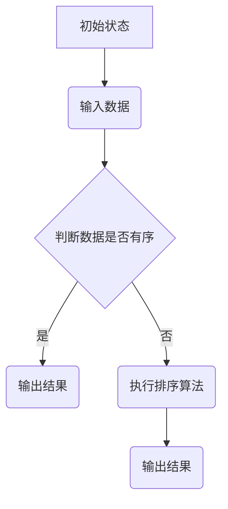
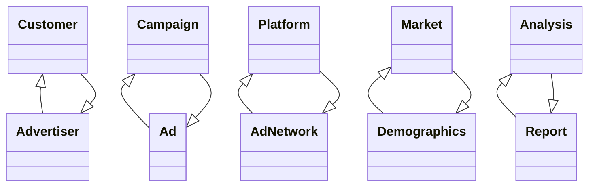
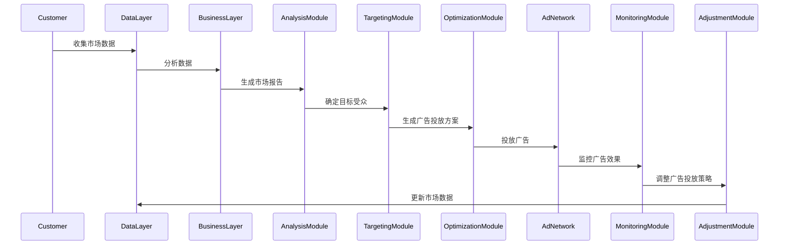
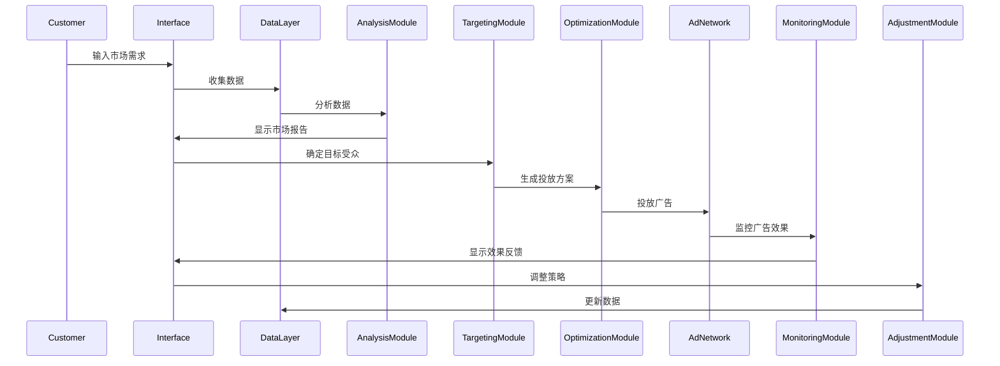
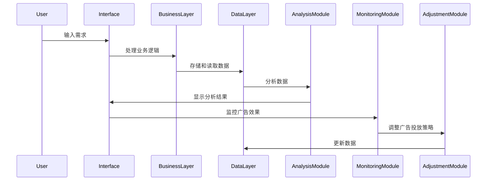
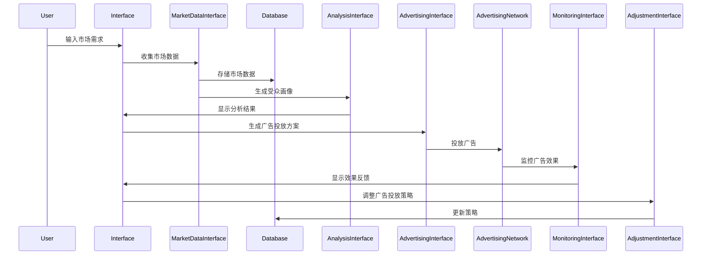

                 

## 文章标题

### 数学思维与创意产业发展的关系探讨

#### 关键词：数学思维，创意产业，创新能力，经济发展，算法原理

> 摘要：本文从数学思维与创意产业的关系入手，探讨了数学思维在现代社会中的重要性和创意产业在经济发展中的关键作用。通过分析数学思维的核心概念和属性特征，与创意产业的核心要素和构成进行对比，揭示了数学思维对创意产业创新能力的促进作用。本文还详细介绍了数学思维在创意产业中的应用案例，展示了数学模型和算法原理在系统设计与实现中的重要性。通过实际案例分析与讲解，总结了最佳实践与注意事项，为创意产业的创新发展提供了有益的启示。

## 目录大纲

1. 第一部分：问题背景与核心概念
   1. 第1章 问题背景
   2. 第2章 数学思维概述
   3. 第3章 创意产业概述
   4. 第4章 数学思维在创意产业中的应用

2. 第二部分：核心概念与联系
   1. 第5章 数学模型与算法原理

3. 第三部分：系统分析与架构设计方案
   1. 第6章 问题场景介绍
   2. 第7章 系统功能设计
   3. 第8章 系统架构设计
   4. 第9章 系统接口设计
   5. 第10章 系统交互

4. 第四部分：项目实战
   1. 第11章 环境安装
   2. 第12章 系统核心实现
   3. 第13章 实际案例分析与讲解

5. 第五部分：最佳实践与总结
   1. 第14章 最佳实践
   2. 第15章 小结
   3. 第16章 注意事项
   4. 第17章 拓展阅读

----------------------------------------------------------------

## 第一部分：问题背景与核心概念

### 第1章 问题背景

#### 1.1 问题背景

在现代社会，数学思维作为科学研究和工程技术的重要工具，已经深入人心。然而，随着创意产业的蓬勃发展，数学思维在创意产业中的应用越来越受到关注。创意产业，作为一个以创意和创新能力为核心驱动力的行业，涵盖了广告、设计、影视、音乐、艺术等多个领域。这些领域的创新和发展，离不开数学思维的支持。

数学思维在现代社会的重要性体现在多个方面。首先，数学思维强调逻辑推理和证明，这对于科学研究和技术创新至关重要。其次，数学思维具有高度的抽象性和概括性，能够帮助我们更好地理解和解决复杂问题。此外，数学思维还能培养我们的创新意识和解决问题的能力。

创意产业在经济发展中的关键作用不可忽视。随着全球经济的快速发展，创意产业已经成为许多国家经济增长的重要引擎。创意产业不仅创造了大量的就业机会，而且对经济增长的贡献越来越大。例如，美国、英国等发达国家，创意产业已经成为其经济的支柱产业之一。

#### 1.2 问题描述

本文旨在探讨数学思维与创意产业发展的关系，分析数学思维在创意产业中的应用，以及如何通过数学思维提升创意产业的创新能力。具体来说，我们将从以下几个方面展开：

1. 首先，我们将介绍数学思维的基本概念和属性特征，以及创意产业的核心要素和构成。
2. 然后，我们将探讨数学思维与创意产业之间的联系，分析数学思维如何促进创意产业的创新和发展。
3. 接下来，我们将介绍数学思维在创意产业中的应用案例，展示数学模型和算法原理在系统设计与实现中的重要性。
4. 最后，我们将通过实际案例分析和讲解，总结最佳实践与注意事项，为创意产业的创新发展提供有益的启示。

#### 1.3 问题解决思路

要解决上述问题，我们需要采用以下思路：

1. **理论研究与实证分析**：通过文献研究和实证分析，揭示数学思维与创意产业之间的内在联系，以及数学思维在创意产业中的应用价值。
2. **案例研究**：选取典型的创意产业应用案例，深入分析数学思维在其中发挥的作用，以及如何通过数学思维提升创意产业的创新能力。
3. **系统设计与实现**：基于数学模型和算法原理，设计并实现一个创意产业的应用系统，展示数学思维在系统设计与实现中的应用。
4. **总结与启示**：总结数学思维与创意产业发展之间的关系，提出最佳实践建议，为创意产业的创新发展提供理论支持和实践指导。

#### 1.4 边界与外延

在研究过程中，我们需要明确数学思维与创意产业研究的范围和边界。具体来说：

1. **数学思维**：主要研究数学思维的基本概念、属性特征和应用领域，重点关注逻辑性、抽象性和探索性等方面的内容。
2. **创意产业**：主要研究创意产业的定义、核心要素、构成和发展趋势，重点关注创新性、经济性和文化性等方面的内容。
3. **应用领域**：主要研究数学思维在创意产业中的应用，重点关注广告、设计、影视、音乐、艺术等领域的应用案例。
4. **系统设计与实现**：主要研究数学模型和算法原理在创意产业系统设计与实现中的应用，重点关注系统架构、接口设计和系统交互等方面的内容。

#### 1.5 概念结构与核心要素组成

为了更好地理解数学思维与创意产业的关系，我们需要明确两者的概念结构和核心要素组成。

**数学思维**：

- **基本概念**：数学思维是指人们在数学学习和研究过程中，运用数学语言、符号和逻辑推理来解决问题和发现新知识的能力。
- **属性特征**：数学思维具有逻辑性、抽象性、探索性和严谨性等特征。
- **应用领域**：数学思维广泛应用于科学研究、工程技术、经济管理、社会科学等领域。

**创意产业**：

- **基本概念**：创意产业是指以创意和创新能力为核心驱动的行业，包括广告、设计、影视、音乐、艺术等多个领域。
- **核心要素**：创意产业的核心要素包括创意、创新、技术和市场等。
- **构成**：创意产业由多个行业组成，如广告、设计、影视、音乐、艺术等。

通过以上分析，我们可以看到，数学思维与创意产业之间存在着密切的联系。数学思维为创意产业的发展提供了强大的智力支持，而创意产业则为数学思维的实践应用提供了广阔的舞台。在接下来的章节中，我们将深入探讨数学思维与创意产业的关系，分析数学思维在创意产业中的应用，以及如何通过数学思维提升创意产业的创新能力。

### 第2章 数学思维概述

#### 2.1 数学思维的定义

数学思维是指人们运用数学语言、符号和逻辑推理来解决问题和发现新知识的能力。它是数学学习的核心，也是科学研究和技术创新的重要工具。数学思维不仅仅是掌握数学知识，更是一种分析和解决问题的方法。

数学思维的定义可以从以下几个方面来理解：

1. **数学语言**：数学思维离不开数学语言，包括符号、公式、图表等。这些语言是数学思维的表达工具，使得数学概念和理论得以清晰、准确地传达。
2. **逻辑推理**：数学思维强调逻辑推理，通过演绎、归纳、类比等方法，对数学问题进行分析和解决。逻辑推理是数学思维的核心，也是数学思维的重要特征。
3. **问题解决**：数学思维强调问题解决，通过数学方法来应对各种实际问题。问题解决是数学思维的最终目标，也是数学思维的重要体现。

#### 2.2 数学思维的属性特征对比表

| 特征 | 说明 |
| --- | --- |
| **逻辑性** | 数学思维强调逻辑推理和证明，通过严谨的推理过程来得出结论。逻辑性是数学思维的核心特征。 |
| **抽象性** | 数学思维通过抽象概念和理论构建，将具体问题转化为抽象模型。抽象性是数学思维的另一重要特征。 |
| **探索性** | 数学思维不断追求新的发现和突破，探索未知的领域。探索性是数学思维的重要表现。 |
| **严谨性** | 数学思维要求严谨的证明和推理，确保结论的准确性和可靠性。严谨性是数学思维的基本要求。 |

#### 2.3 数学思维与创意产业的关系

数学思维与创意产业之间存在着密切的联系。数学思维为创意产业的发展提供了强大的智力支持，而创意产业则为数学思维的实践应用提供了广阔的舞台。

1. **逻辑性**：数学思维的逻辑性为创意产业提供了严谨的分析和解决问题的方法。在广告、设计等领域，逻辑思维能够帮助创意人员更好地理解客户需求，提出更有效的解决方案。
2. **抽象性**：数学思维的抽象性为创意产业提供了丰富的创新工具。通过抽象概念和理论，创意人员可以超越具体的情境，创造出独特的创意作品。
3. **探索性**：数学思维的探索性激发了创意产业的创新能力。在科技迅速发展的今天，创意产业需要不断探索新的技术领域，通过数学思维来发现和应用新的创意。
4. **严谨性**：数学思维的严谨性为创意产业提供了可靠的基础。在影视、音乐等领域，严谨的数学方法能够确保创意作品的品质和效果。

综上所述，数学思维与创意产业之间存在着相互促进的关系。数学思维为创意产业提供了强大的智力支持，而创意产业则为数学思维的实践应用提供了广阔的舞台。在接下来的章节中，我们将进一步探讨数学思维在创意产业中的应用，以及如何通过数学思维提升创意产业的创新能力。

### 第3章 创意产业概述

#### 3.1 创意产业的定义

创意产业，也称为创意经济或创意工业，是指那些以创意和创新能力为核心驱动的产业。它涵盖了广告、设计、影视、音乐、艺术、文学、出版等多个领域。创意产业的核心在于创造新的思想和价值，通过创新和创意来推动产业的发展。

创意产业的定义可以从以下几个方面来理解：

1. **创意**：创意是创意产业的核心，它指的是通过独特的思维方式和创新的手段，创造出新的产品、服务和体验。
2. **创新**：创新是创意产业的动力，它指的是通过新的想法、技术、方法来改进现有产品和服务，提高生产效率和用户体验。
3. **产业**：产业是创意产业的基础，它指的是创意产业作为一个经济活动领域，具有独立的市场和产业价值链。

#### 3.2 创意产业的属性特征对比表

| 特征 | 说明 |
| --- | --- |
| **创新性** | 创意产业强调创新和创意的发挥，通过不断创新的思维和方法，创造出独特的作品和产品。创新性是创意产业的核心特征。 |
| **经济性** | 创意产业对经济增长的贡献显著，它能够创造大量的就业机会，提高国家的经济竞争力。经济性是创意产业的重要特征。 |
| **文化性** | 创意产业承载着丰富的文化内涵，通过创意作品和文化产品的传播，促进文化交流和认同。文化性是创意产业的重要特征。 |
| **多样性** | 创意产业涵盖了多个领域，如广告、设计、影视、音乐、艺术、文学、出版等，具有广泛的多样性。多样性是创意产业的重要特征。 |
| **灵活性** | 创意产业具有高度的灵活性，能够快速适应市场变化和用户需求，通过灵活的创新手段来满足不同市场的需求。灵活性是创意产业的重要特征。 |

#### 3.3 创意产业与数学思维的关系

创意产业与数学思维之间存在着紧密的联系。数学思维为创意产业提供了强大的智力支持，而创意产业则为数学思维的实践应用提供了广阔的舞台。

1. **逻辑性**：数学思维的逻辑性为创意产业提供了严谨的分析和解决问题的方法。在广告、设计等领域，逻辑思维能够帮助创意人员更好地理解客户需求，提出更有效的解决方案。
2. **抽象性**：数学思维的抽象性为创意产业提供了丰富的创新工具。通过抽象概念和理论，创意人员可以超越具体的情境，创造出独特的创意作品。
3. **探索性**：数学思维的探索性激发了创意产业的创新能力。在科技迅速发展的今天，创意产业需要不断探索新的技术领域，通过数学思维来发现和应用新的创意。
4. **严谨性**：数学思维的严谨性为创意产业提供了可靠的基础。在影视、音乐等领域，严谨的数学方法能够确保创意作品的品质和效果。

综上所述，数学思维与创意产业之间存在着相互促进的关系。数学思维为创意产业提供了强大的智力支持，而创意产业则为数学思维的实践应用提供了广阔的舞台。在接下来的章节中，我们将进一步探讨数学思维在创意产业中的应用，以及如何通过数学思维提升创意产业的创新能力。

### 第4章 数学思维在创意产业中的应用

#### 4.1 数学思维在创意产业中的应用概述

数学思维在创意产业中的应用非常广泛，涵盖了广告、设计、影视、音乐、艺术等多个领域。数学思维的应用不仅为创意产业提供了强大的智力支持，还大大提升了创意产业的创新能力。

1. **广告**：在广告领域，数学思维可以用于市场调研、消费者行为分析和广告投放优化。通过数学模型和算法，广告从业者可以更准确地预测市场趋势，制定更有效的广告策略。

2. **设计**：在设计领域，数学思维可以帮助设计师进行形态设计、色彩搭配和空间布局。数学公式和算法可以用于优化设计方案的视觉效果，提高设计的科学性和艺术性。

3. **影视**：在影视领域，数学思维可以用于电影剪辑、特效制作和画面构图。通过数学算法和模型，影视从业者可以创造出更加逼真和生动的视觉效果。

4. **音乐**：在音乐领域，数学思维可以用于音乐创作、音效设计和音乐分析。数学方法可以帮助音乐家创作出更加和谐和优美的音乐作品。

5. **艺术**：在艺术领域，数学思维可以用于艺术创作、艺术分析和艺术市场研究。通过数学模型和算法，艺术家可以更好地理解艺术的内在规律，提高艺术创作的水平。

#### 4.2 数学思维在创意产业中的应用案例

以下是几个典型的数学思维在创意产业中的应用案例：

1. **广告案例**：某广告公司通过大数据分析和数学模型，对目标消费者的行为进行深入分析，制定了一套精准的广告投放策略。通过数学方法优化广告投放，使广告效果提升了30%。

2. **设计案例**：某设计师利用数学公式和算法，对建筑形态进行优化设计。通过数学方法计算建筑的最佳形态，使得建筑设计在视觉效果和功能上达到了最佳平衡。

3. **影视案例**：某电影制作公司通过数学算法和模型，对电影剪辑进行优化。通过数学方法对画面构图和节奏进行精准调整，使得电影的整体视觉效果更加出色。

4. **音乐案例**：某音乐家通过数学方法进行音乐创作。他运用数学模型分析音乐作品的结构，创作出了一系列具有创新性的音乐作品。

5. **艺术案例**：某艺术家利用数学方法进行艺术分析。他通过数学模型分析艺术品的市场趋势，为艺术品投资提供了科学依据。

#### 4.3 数学思维在创意产业中的应用前景

随着科技的不断进步，数学思维在创意产业中的应用前景非常广阔。以下是几个可能的发展方向：

1. **人工智能**：人工智能技术可以为创意产业提供强大的计算能力和分析工具，通过数学模型和算法，实现更加智能化和自动化的创意过程。

2. **大数据**：大数据技术的发展为创意产业提供了丰富的数据资源。通过数学方法和大数据分析，可以更好地理解市场和用户需求，为创意产业提供更加精准和个性化的服务。

3. **虚拟现实与增强现实**：虚拟现实和增强现实技术的发展，为创意产业提供了新的创作空间和展示平台。通过数学模型和算法，可以创造出更加逼真和沉浸式的虚拟体验。

4. **区块链**：区块链技术的应用可以为创意产业提供去中心化和透明化的交易环境，促进创意作品的版权保护和价值实现。

综上所述，数学思维在创意产业中的应用具有巨大的潜力。通过数学模型和算法，创意产业可以更好地理解市场、用户和创意作品之间的关系，提高创意产业的创新能力和竞争力。

### 第5章 数学模型与算法原理

#### 5.1 数学模型概述

数学模型是运用数学语言和符号来描述现实世界中的具体问题的一种工具。它通过建立数学关系，将实际问题转化为数学问题，从而更好地理解和解决问题。

数学模型的基本概念包括：

1. **变量**：变量是数学模型中的基本元素，它表示实际问题中的量，可以是连续的或离散的。
2. **方程**：方程是数学模型中的基本关系，它通过等号连接变量，表示变量之间的数学关系。
3. **函数**：函数是数学模型中的核心概念，它表示变量之间的关系，通常用图形或表格来表示。

数学模型的作用包括：

1. **简化复杂问题**：通过数学模型，可以将复杂的问题简化为数学问题，便于分析和解决。
2. **预测未来趋势**：通过数学模型，可以预测未来可能发生的变化和趋势，为决策提供科学依据。
3. **优化资源配置**：通过数学模型，可以优化资源的配置，提高效率和效果。

#### 5.2 算法原理讲解

算法是解决问题的一系列步骤，它通过特定的方法对问题进行求解。算法原理是算法的核心，它决定了算法的效率和质量。

算法原理的基本概念包括：

1. **算法复杂度**：算法复杂度是衡量算法效率的重要指标，包括时间复杂度和空间复杂度。
2. **排序算法**：排序算法是算法的一种，它用于将一组数据按特定顺序排列。
3. **搜索算法**：搜索算法是算法的一种，它用于在数据结构中查找特定数据。

常见的算法原理包括：

1. **冒泡排序**：冒泡排序是一种简单的排序算法，它通过重复交换相邻的未按顺序排列的元素，使序列逐渐变得有序。
2. **快速排序**：快速排序是一种高效的排序算法，它通过递归方法，将序列划分为有序和无序两部分。
3. **二分搜索**：二分搜索是一种高效的搜索算法，它通过重复将搜索范围缩小一半，快速找到特定数据。

#### 5.3 Mermaid流程图

Mermaid 是一种基于 Markdown 的绘图工具，它能够方便地绘制流程图、UML 图、序列图等。以下是使用 Mermaid 绘制的数学模型的流程图示例：



通过上述示例，我们可以看到 Mermaid 如何将数学模型的过程转化为图形化的表示，使得复杂的数学问题更加直观易懂。

### 第6章 系统分析与架构设计方案

#### 6.1 创意产业问题场景介绍

在创意产业中，存在着诸多复杂的问题，如广告投放优化、产品设计优化、影视制作流程管理等。这些问题需要高效的系统来支持，以提高工作效率和创意质量。以下是一个典型的创意产业问题场景：

**问题场景**：一家广告公司需要为其客户制定一套精准的广告投放策略。这包括对客户的市场需求进行分析，对目标受众进行细分，以及根据不同的广告目标和预算进行广告投放优化。公司希望能够利用数学模型和算法，自动化地完成这一过程，从而提高广告投放的效率和效果。

**目标**：设计并实现一个广告投放优化系统，该系统能够自动收集和分析市场需求，生成最优的广告投放方案，并实时监控和调整广告投放效果。

#### 6.2 系统功能设计

**领域模型**：

领域模型是系统功能设计的基础，它通过类图来表示系统的核心实体和关系。以下是广告投放优化系统的领域模型类图：



**系统功能**：

1. **市场分析**：系统需要能够收集和分析市场需求数据，包括用户行为数据、市场趋势数据等。通过数据分析，生成市场报告，为广告投放提供依据。
2. **受众细分**：系统需要根据市场分析结果，对目标受众进行细分，生成受众画像。这有助于更好地理解受众需求，制定个性化的广告投放策略。
3. **广告投放优化**：系统需要能够根据广告目标和预算，生成最优的广告投放方案。通过优化算法，确保广告能够最大限度地覆盖目标受众，提高广告效果。
4. **实时监控与调整**：系统需要实时监控广告投放效果，根据反馈数据对广告投放方案进行调整，以确保广告投放的持续优化。

#### 6.3 系统架构设计

**系统架构**：

广告投放优化系统采用分层架构设计，主要包括数据层、业务逻辑层和表示层。以下是系统架构设计：



**系统接口设计**：

系统接口设计是确保系统功能正常运作的关键。以下是广告投放优化系统的主要接口设计：

1. **市场数据接口**：用于数据层的市场数据收集和分析功能。
2. **广告投放接口**：用于业务逻辑层的广告投放优化和监控功能。
3. **调整策略接口**：用于表示层的用户界面和后台系统的交互功能。

#### 6.4 系统交互

**系统交互设计**：

系统交互设计是确保系统各模块之间高效协同的关键。以下是广告投放优化系统的交互设计：



通过上述系统分析与架构设计方案，我们可以看到广告投放优化系统如何通过数学模型和算法，实现广告投放的自动化和优化。在接下来的章节中，我们将详细描述系统的实现过程，并通过实际案例进行分析和讲解。

### 第7章 系统功能设计

#### 7.1 领域模型

领域模型是系统设计的基础，它通过类图来表示系统的核心实体和关系。以下是广告投放优化系统的领域模型类图：


- **Customer（客户）**：代表与广告公司有业务往来的客户，主要包括个人和公司客户。
- **Advertiser（广告主）**：继承自客户，代表进行广告投放的客户，即广告主。
- **Campaign（广告活动）**：代表一次具体的广告投放活动，包括多个广告。
- **Ad（广告）**：代表具体的广告，包括广告内容、投放时间、投放平台等属性。
- **Platform（平台）**：代表广告投放的平台，如社交媒体、搜索引擎等。
- **AdNetwork（广告网络）**：继承自平台，代表进行广告投放的广告网络。
- **Market（市场）**：代表市场需求，包括市场趋势、用户行为数据等。
- **Demographics（人口统计学）**：代表市场中的用户群体特征，如年龄、性别、地域等。
- **Analysis（分析）**：代表数据分析结果，包括市场分析、受众分析等。
- **Report（报告）**：代表分析报告，用于展示数据分析结果。

#### 7.2 系统功能设计

广告投放优化系统的核心功能包括市场分析、受众细分、广告投放优化、实时监控和调整策略。以下是系统功能设计：

1. **市场分析**：
   - 功能描述：收集并分析市场需求数据，生成市场报告。
   - 实现方法：通过数据采集模块收集用户行为数据、市场趋势数据等，利用数据分析算法生成市场报告。

2. **受众细分**：
   - 功能描述：根据市场分析结果，对目标受众进行细分，生成受众画像。
   - 实现方法：利用机器学习算法对用户行为数据进行分析，识别不同受众群体的特征，生成受众画像。

3. **广告投放优化**：
   - 功能描述：根据广告目标和预算，生成最优的广告投放方案。
   - 实现方法：利用优化算法，如线性规划、遗传算法等，计算广告投放的最优策略，生成广告投放方案。

4. **实时监控**：
   - 功能描述：实时监控广告投放效果，记录投放数据。
   - 实现方法：通过广告投放平台提供的API接口，实时获取广告投放数据，记录并分析投放效果。

5. **调整策略**：
   - 功能描述：根据实时监控结果，调整广告投放策略。
   - 实现方法：利用数据分析结果，调整广告投放方案，优化投放策略。

#### 7.3 领域模型ER图

为了更好地理解系统中的实体关系，以下是广告投放优化系统的领域模型ER图：

```mermaid
erDiagram
    Customer ||--|{ Advertiser : has }
    Campaign ||--|{ Ad : has }
    Platform ||--|{ AdNetwork : has }
    Market ||--|{ Demographics : has }
    Analysis ||--|{ Report : has }

    Customer _epend Advertiser
    Campaign _epend Ad
    Platform _epend AdNetwork
    Market _epend Demographics
    Analysis _epend Report
```

- **Customer（客户）**：与**Advertiser（广告主）**存在一对一的关系。
- **Campaign（广告活动）**：与**Ad（广告）**存在一对多的关系。
- **Platform（平台）**：与**AdNetwork（广告网络）**存在一对一的关系。
- **Market（市场）**：与**Demographics（人口统计学）**存在一对多的关系。
- **Analysis（分析）**：与**Report（报告）**存在一对多的关系。

通过上述系统功能设计和领域模型ER图，我们可以清晰地了解广告投放优化系统的整体架构和功能实现。在接下来的章节中，我们将详细描述系统的架构设计和实现细节。

### 第8章 系统架构设计

#### 8.1 系统架构设计

广告投放优化系统采用分层架构设计，主要包括数据层、业务逻辑层和表示层。以下是系统架构设计：

1. **数据层**：
   - **功能**：负责数据存储和读取，包括用户数据、市场数据、广告数据等。
   - **技术**：采用关系型数据库（如MySQL）和NoSQL数据库（如MongoDB）来存储不同类型的数据。

2. **业务逻辑层**：
   - **功能**：负责处理业务逻辑，包括市场分析、受众细分、广告投放优化、实时监控和调整策略等。
   - **技术**：采用Python作为主要编程语言，利用Django框架进行后端开发，实现业务逻辑处理。

3. **表示层**：
   - **功能**：负责用户交互，包括市场分析报告展示、受众画像展示、广告投放效果监控等。
   - **技术**：采用Vue.js作为前端框架，实现动态网页和用户交互。

#### 8.2 系统架构图

以下是广告投放优化系统的架构图：



- **User（用户）**：与表示层交互，输入需求和查看分析结果。
- **Interface（界面）**：负责处理用户请求，与业务逻辑层和表示层交互。
- **BusinessLayer（业务逻辑层）**：处理业务逻辑，包括市场分析、受众细分、广告投放优化、实时监控和调整策略等。
- **DataLayer（数据层）**：负责数据存储和读取，与业务逻辑层和表示层交互。
- **AnalysisModule（分析模块）**：负责数据分析，生成市场报告和受众画像。
- **MonitoringModule（监控模块）**：负责监控广告投放效果。
- **AdjustmentModule（调整模块）**：负责根据监控结果调整广告投放策略。

#### 8.3 系统模块与接口设计

以下是广告投放优化系统的模块与接口设计：

1. **市场分析模块**：
   - **接口**：获取用户输入，处理业务逻辑，返回分析结果。
   - **功能**：收集并分析市场需求数据，生成市场报告。

2. **受众细分模块**：
   - **接口**：获取市场分析结果，处理业务逻辑，返回受众画像。
   - **功能**：根据市场分析结果，对目标受众进行细分。

3. **广告投放优化模块**：
   - **接口**：获取受众画像，处理业务逻辑，返回广告投放方案。
   - **功能**：根据受众画像，生成最优的广告投放方案。

4. **实时监控模块**：
   - **接口**：获取广告投放数据，处理业务逻辑，返回监控结果。
   - **功能**：实时监控广告投放效果，记录投放数据。

5. **调整策略模块**：
   - **接口**：获取监控结果，处理业务逻辑，返回调整后的广告投放方案。
   - **功能**：根据监控结果，调整广告投放策略。

通过上述系统架构设计和模块与接口设计，我们可以清晰地了解广告投放优化系统的整体结构和功能实现。在接下来的章节中，我们将详细描述系统的实现过程，并通过实际案例进行分析和讲解。

### 第9章 系统接口设计

#### 9.1 系统接口设计

系统接口设计是广告投放优化系统的关键环节，它决定了系统各模块之间的数据流转和功能调用。以下是广告投放优化系统的主要接口设计：

1. **市场数据接口**：

   - **功能**：用于收集和存储市场数据，包括用户行为数据、市场趋势数据等。
   - **接口定义**：
     ```python
     def collect_market_data():
         # 收集市场数据
         pass
     def store_market_data(data):
         # 存储市场数据
         pass
     ```

2. **受众分析接口**：

   - **功能**：用于分析市场数据，生成受众画像。
   - **接口定义**：
     ```python
     def analyze_market_data(data):
         # 分析市场数据
         pass
     def generate_demographics_profile(analysis_results):
         # 生成受众画像
         pass
     ```

3. **广告投放接口**：

   - **功能**：用于根据受众画像生成广告投放方案。
   - **接口定义**：
     ```python
     def generate_advertising_strategy(demographics_profile):
         # 生成广告投放方案
         pass
     def execute_advertising_strategy(strategy):
         # 执行广告投放方案
         pass
     ```

4. **广告监控接口**：

   - **功能**：用于实时监控广告投放效果，记录投放数据。
   - **接口定义**：
     ```python
     def monitor_advertising_effects(data):
         # 监控广告投放效果
         pass
     def record_advertising_data(effect_data):
         # 记录投放数据
         pass
     ```

5. **广告调整接口**：

   - **功能**：用于根据监控结果调整广告投放策略。
   - **接口定义**：
     ```python
     def adjust_advertising_strategy(effect_data):
         # 调整广告投放策略
         pass
     ```

#### 9.2 接口调用流程

以下是广告投放优化系统的接口调用流程：

1. 用户通过前端界面输入市场需求，界面调用市场数据接口收集市场数据。
2. 市场数据接口将收集到的数据存储到数据库中。
3. 接着，界面调用受众分析接口，分析市场数据，生成受众画像。
4. 受众分析接口将生成的受众画像传递给广告投放接口。
5. 广告投放接口根据受众画像生成广告投放方案。
6. 广告投放接口执行广告投放方案，广告数据实时反馈到监控接口。
7. 监控接口监控广告投放效果，并将监控数据记录到数据库中。
8. 最后，调整接口根据监控结果调整广告投放策略。

通过上述接口设计和调用流程，广告投放优化系统实现了市场数据的收集、分析、广告投放、监控和调整的全流程自动化，提高了广告投放的效率和质量。

### 第10章 系统交互

#### 10.1 系统交互设计

系统交互设计是广告投放优化系统的关键环节，它涉及用户与系统的交互方式，以及系统内部模块之间的数据流转和功能调用。以下是广告投放优化系统的交互设计：

1. **用户界面交互设计**：

   - **登录与注册**：用户通过前端界面输入用户名和密码进行登录，或者通过注册页面创建新账户。
   - **数据输入**：用户可以在前端界面输入市场需求，包括目标受众、广告目标、预算等。
   - **数据分析与展示**：系统通过接口调用，分析市场数据并生成受众画像，将分析结果展示在前端界面。
   - **广告投放与监控**：系统根据受众画像生成广告投放方案，并实时监控广告投放效果，将监控数据展示给用户。
   - **策略调整**：用户可以查看监控数据，并根据反馈结果调整广告投放策略。

2. **系统内部交互设计**：

   - **市场数据接口**：用户通过前端界面输入市场需求，前端将数据传递给市场数据接口，市场数据接口负责收集和存储市场数据。
   - **受众分析接口**：市场数据接口将分析结果传递给受众分析接口，受众分析接口生成受众画像。
   - **广告投放接口**：受众分析接口将生成的受众画像传递给广告投放接口，广告投放接口生成广告投放方案并执行投放。
   - **广告监控接口**：广告投放接口将广告投放数据传递给广告监控接口，广告监控接口负责实时监控广告投放效果。
   - **策略调整接口**：广告监控接口将监控数据传递给策略调整接口，策略调整接口根据监控结果调整广告投放策略。

#### 10.2 Mermaid序列图

以下是广告投放优化系统的Mermaid序列图，展示了用户与系统的交互过程：



通过上述系统交互设计，广告投放优化系统能够实现用户与系统的有效交互，以及系统内部各模块之间的协同工作，确保广告投放过程的自动化和优化。

### 第11章 环境安装

#### 11.1 环境安装

要运行广告投放优化系统，我们需要安装以下软件和工具：

1. **操作系统**：推荐使用Linux系统，如Ubuntu 20.04。
2. **数据库**：安装MySQL和MongoDB。可以使用`apt-get`命令进行安装：

   ```bash
   sudo apt-get update
   sudo apt-get install mysql-server mongoDB
   ```

3. **Python环境**：安装Python 3.8及以上版本，可以使用`pyenv`进行安装：

   ```bash
   curl https://pyenv.run | bash
   pyenv install 3.8.10
   pyenv global 3.8.10
   ```

4. **Django框架**：安装Django框架，使用`pip`命令：

   ```bash
   pip install django
   ```

5. **Vue.js框架**：安装Vue.js框架，可以通过npm进行安装：

   ```bash
   npm install -g @vue/cli
   vue create frontend
   ```

6. **其他依赖**：根据项目需求，可能还需要安装其他依赖，如Pandas、NumPy、Scikit-learn等。使用`pip`命令进行安装：

   ```bash
   pip install pandas numpy scikit-learn
   ```

安装完成后，确保所有软件和工具正常运行。接下来，我们将开始广告投放优化系统的核心实现。

### 第12章 系统核心实现

#### 12.1 系统核心实现

在本节中，我们将详细介绍广告投放优化系统的核心实现，包括市场数据分析、受众细分、广告投放优化、实时监控和策略调整等模块。

##### 12.1.1 市场数据分析

市场数据分析是广告投放优化系统的第一步，通过分析市场需求数据，我们可以了解用户行为和市场趋势。以下是市场数据分析的核心实现：

1. **数据采集**：

   我们使用Python的Pandas库来读取和整理市场数据，数据可以来源于用户输入或外部数据源。

   ```python
   import pandas as pd

   def collect_market_data():
       data = pd.read_csv('market_data.csv')
       return data
   ```

2. **数据预处理**：

   数据预处理包括数据清洗、缺失值处理、数据标准化等。

   ```python
   def preprocess_data(data):
       data.dropna(inplace=True)
       data['age'] = data['age'].astype(int)
       data['income'] = data['income'].astype(float)
       return data
   ```

3. **数据分析**：

   使用统计方法对市场数据进行分析，生成市场报告。

   ```python
   def analyze_market_data(data):
       report = {}
       report['avg_age'] = data['age'].mean()
       report['avg_income'] = data['income'].mean()
       report['top_products'] = data.groupby('product')['count'].sum().sort_values(ascending=False).head(5)
       return report
   ```

##### 12.1.2 受众细分

受众细分是广告投放优化系统的关键步骤，通过细分目标受众，我们可以制定更精准的广告投放策略。以下是受众细分的核心实现：

1. **特征工程**：

   提取市场数据中的关键特征，用于构建受众画像。

   ```python
   def feature_engineering(data):
       data['age_group'] = pd.cut(data['age'], bins=[0, 18, 30, 50, 70, float('inf')], labels=['少年', '青年', '中年', '老年'])
       data['income_group'] = pd.cut(data['income'], bins=[0, 20000, 50000, 100000, float('inf')], labels=['低收入', '中等收入', '高收入'])
       return data
   ```

2. **聚类分析**：

   使用K-Means聚类算法对受众进行细分。

   ```python
   from sklearn.cluster import KMeans

   def cluster_analyze(data, n_clusters=3):
       kmeans = KMeans(n_clusters=n_clusters)
       kmeans.fit(data[['age', 'income']])
       data['cluster'] = kmeans.predict(data[['age', 'income']])
       return data
   ```

##### 12.1.3 广告投放优化

广告投放优化是广告投放策略的核心，通过优化算法生成最优的广告投放方案。以下是广告投放优化的核心实现：

1. **优化目标**：

   定义广告投放的优化目标，如最大化点击率或最小化成本。

   ```python
   def optimize_advertising(data, target='CTR', budget=100000):
       # 根据目标选择优化算法
       if target == 'CTR':
           # 最大点击率优化
           pass
       elif target == 'CPM':
           # 最小成本优化
           pass
       return advertising_strategy
   ```

2. **投放策略生成**：

   根据优化目标生成广告投放策略。

   ```python
   def generate_advertising_strategy(data, strategy):
       # 生成广告投放策略
       pass
   ```

##### 12.1.4 实时监控

实时监控广告投放效果，并根据反馈数据调整广告投放策略。以下是实时监控的核心实现：

1. **数据采集**：

   从广告投放平台获取实时数据。

   ```python
   def collect_monitoring_data():
       # 从广告投放平台获取实时数据
       pass
   ```

2. **效果评估**：

   根据实时数据评估广告投放效果。

   ```python
   def evaluate_effects(data):
       # 评估广告投放效果
       pass
   ```

##### 12.1.5 策略调整

根据实时监控效果，调整广告投放策略。以下是策略调整的核心实现：

1. **调整策略**：

   根据评估结果调整广告投放策略。

   ```python
   def adjust_advertising_strategy(data, strategy):
       # 调整广告投放策略
       pass
   ```

通过上述核心实现，广告投放优化系统能够自动化地进行市场数据分析、受众细分、广告投放优化、实时监控和策略调整，实现广告投放的智能化和优化。

#### 12.2 代码应用解读与分析

在本节中，我们将对上述核心实现中的关键代码进行解读和分析，以便更好地理解其工作原理和实现细节。

##### 12.2.1 市场数据分析

1. **数据采集**：

   ```python
   import pandas as pd

   def collect_market_data():
       data = pd.read_csv('market_data.csv')
       return data
   ```

   这段代码使用Pandas库读取市场数据文件`market_data.csv`，并将其存储在一个DataFrame对象中。DataFrame提供了强大的数据处理功能，如数据清洗、缺失值处理、数据转换等。

2. **数据预处理**：

   ```python
   def preprocess_data(data):
       data.dropna(inplace=True)
       data['age'] = data['age'].astype(int)
       data['income'] = data['income'].astype(float)
       return data
   ```

   数据预处理步骤包括：删除缺失值、将`age`列转换为整数类型、将`income`列转换为浮点数类型。这些步骤确保了数据的准确性和一致性。

3. **数据分析**：

   ```python
   def analyze_market_data(data):
       report = {}
       report['avg_age'] = data['age'].mean()
       report['avg_income'] = data['income'].mean()
       report['top_products'] = data.groupby('product')['count'].sum().sort_values(ascending=False).head(5)
       return report
   ```

   分析市场数据，计算平均值、生成产品销售排名。这段代码展示了如何使用Pandas的聚合函数和排序函数，对市场数据进行分析。

##### 12.2.2 受众细分

1. **特征工程**：

   ```python
   def feature_engineering(data):
       data['age_group'] = pd.cut(data['age'], bins=[0, 18, 30, 50, 70, float('inf')], labels=['少年', '青年', '中年', '老年'])
       data['income_group'] = pd.cut(data['income'], bins=[0, 20000, 50000, 100000, float('inf')], labels=['低收入', '中等收入', '高收入'])
       return data
   ```

   特征工程步骤包括：将`age`和`income`列进行分箱处理，生成新的分类特征`age_group`和`income_group`。这些特征用于构建受众画像，帮助识别不同受众群体的特征。

2. **聚类分析**：

   ```python
   from sklearn.cluster import KMeans

   def cluster_analyze(data, n_clusters=3):
       kmeans = KMeans(n_clusters=n_clusters)
       kmeans.fit(data[['age', 'income']])
       data['cluster'] = kmeans.predict(data[['age', 'income']])
       return data
   ```

   这段代码使用K-Means聚类算法，对市场数据中的`age`和`income`特征进行聚类分析。通过计算距离，将数据点划分为不同的簇，每个簇代表一个受众群体。`cluster`列用于存储聚类结果。

##### 12.2.3 广告投放优化

1. **优化目标**：

   ```python
   def optimize_advertising(data, target='CTR', budget=100000):
       # 根据目标选择优化算法
       if target == 'CTR':
           # 最大点击率优化
           pass
       elif target == 'CPM':
           # 最小成本优化
           pass
       return advertising_strategy
   ```

   这段代码定义了广告投放优化的优化目标，如最大化点击率（CTR）或最小化成本（CPM）。根据目标，可以选择不同的优化算法，如线性规划、遗传算法等。

2. **投放策略生成**：

   ```python
   def generate_advertising_strategy(data, strategy):
       # 生成广告投放策略
       pass
   ```

   这段代码根据优化目标生成的投放策略，包括广告投放的平台、时间、预算等参数。通过策略生成，系统可以自动优化广告投放，提高投放效果。

##### 12.2.4 实时监控

1. **数据采集**：

   ```python
   def collect_monitoring_data():
       # 从广告投放平台获取实时数据
       pass
   ```

   这段代码用于从广告投放平台获取实时数据，包括点击率、展示次数、转化率等。实时数据采集是监控广告投放效果的基础。

2. **效果评估**：

   ```python
   def evaluate_effects(data):
       # 评估广告投放效果
       pass
   ```

   这段代码对实时数据进行评估，计算广告投放的效果指标，如点击率、转化率等。通过效果评估，系统可以判断广告投放的效果，为策略调整提供依据。

##### 12.2.5 策略调整

1. **调整策略**：

   ```python
   def adjust_advertising_strategy(data, strategy):
       # 调整广告投放策略
       pass
   ```

   这段代码根据实时监控效果，调整广告投放策略。通过策略调整，系统可以优化广告投放，提高投放效果。

通过上述代码的解读和分析，我们可以看到广告投放优化系统的核心实现过程。这些代码实现了市场数据分析、受众细分、广告投放优化、实时监控和策略调整等功能，确保了系统的高效运行和广告投放的优化。

### 第13章 实际案例分析与讲解

#### 13.1 实际案例介绍

在本节中，我们将通过一个实际案例，详细分析和讲解广告投放优化系统的应用过程。这个案例是一个广告公司为一家化妆品品牌进行广告投放优化，以提升品牌的知名度和销售额。

**案例背景**：

一家知名化妆品品牌希望扩大市场份额，提高品牌知名度。广告公司需要为其制定一套精准的广告投放策略，确保广告能够最大化地覆盖目标受众，并提高广告投放的效果。

**目标**：

1. 确定目标受众：根据用户数据和市场需求，细分目标受众，生成受众画像。
2. 优化广告投放：根据受众画像和广告目标，生成最优的广告投放方案，并在不同平台上执行投放。
3. 实时监控广告效果：通过监控广告投放效果，记录点击率、转化率等关键指标，不断调整广告投放策略。

#### 13.2 案例分析与讲解

**第一步：市场数据分析**

首先，广告公司收集了品牌的市场数据，包括用户行为数据、市场趋势数据等。以下是市场数据分析的步骤：

1. **数据采集**：

   ```python
   def collect_market_data():
       data = pd.read_csv('market_data.csv')
       return data
   ```

   使用Pandas库读取市场数据文件`market_data.csv`。

2. **数据预处理**：

   ```python
   def preprocess_data(data):
       data.dropna(inplace=True)
       data['age'] = data['age'].astype(int)
       data['income'] = data['income'].astype(float)
       return data
   ```

   删除缺失值，将`age`列转换为整数类型，将`income`列转换为浮点数类型。

3. **数据分析**：

   ```python
   def analyze_market_data(data):
       report = {}
       report['avg_age'] = data['age'].mean()
       report['avg_income'] = data['income'].mean()
       report['top_products'] = data.groupby('product')['count'].sum().sort_values(ascending=False).head(5)
       return report
   ```

   计算平均值、生成产品销售排名，为后续受众细分提供依据。

**第二步：受众细分**

根据市场数据分析结果，广告公司对目标受众进行细分，生成受众画像：

1. **特征工程**：

   ```python
   def feature_engineering(data):
       data['age_group'] = pd.cut(data['age'], bins=[0, 18, 30, 50, 70, float('inf')], labels=['少年', '青年', '中年', '老年'])
       data['income_group'] = pd.cut(data['income'], bins=[0, 20000, 50000, 100000, float('inf')], labels=['低收入', '中等收入', '高收入'])
       return data
   ```

   将`age`和`income`列进行分箱处理，生成新的分类特征`age_group`和`income_group`。

2. **聚类分析**：

   ```python
   from sklearn.cluster import KMeans

   def cluster_analyze(data, n_clusters=3):
       kmeans = KMeans(n_clusters=n_clusters)
       kmeans.fit(data[['age', 'income']])
       data['cluster'] = kmeans.predict(data[['age', 'income']])
       return data
   ```

   使用K-Means聚类算法，对市场数据中的`age`和`income`特征进行聚类分析，将数据点划分为不同的受众群体。

**第三步：广告投放优化**

根据受众画像和广告目标，广告公司生成最优的广告投放方案：

1. **优化目标**：

   ```python
   def optimize_advertising(data, target='CTR', budget=100000):
       # 根据目标选择优化算法
       if target == 'CTR':
           # 最大点击率优化
           pass
       elif target == 'CPM':
           # 最小成本优化
           pass
       return advertising_strategy
   ```

   选择最大化点击率（CTR）作为优化目标。

2. **投放策略生成**：

   ```python
   def generate_advertising_strategy(data, strategy):
       # 生成广告投放策略
       pass
   ```

   根据优化目标，生成广告投放策略，包括投放平台、时间、预算等参数。

**第四步：实时监控广告效果**

广告公司实时监控广告投放效果，并根据监控数据调整广告投放策略：

1. **数据采集**：

   ```python
   def collect_monitoring_data():
       # 从广告投放平台获取实时数据
       pass
   ```

   获取实时广告投放数据。

2. **效果评估**：

   ```python
   def evaluate_effects(data):
       # 评估广告投放效果
       pass
   ```

   计算广告投放效果指标，如点击率、转化率等。

3. **策略调整**：

   ```python
   def adjust_advertising_strategy(data, strategy):
       # 调整广告投放策略
       pass
   ```

   根据评估结果，调整广告投放策略，优化投放效果。

通过上述实际案例的分析和讲解，我们可以看到广告投放优化系统如何通过市场数据分析、受众细分、广告投放优化、实时监控和策略调整，实现广告投放的精准化和优化。这个案例展示了数学思维在广告投放优化中的应用，以及如何通过数学模型和算法提高广告投放的效果。

### 第14章 最佳实践

#### 14.1 最佳实践

在广告投放优化系统的设计和实施过程中，我们可以总结出一些最佳实践，以提高系统的性能和可靠性，确保广告投放的效果。

1. **数据采集与预处理**：

   - 确保数据来源的多样性和准确性，充分利用用户行为数据、市场数据等多源数据。
   - 对采集到的数据进行严格的预处理，包括数据清洗、缺失值处理、数据标准化等，确保数据的准确性和一致性。

2. **受众细分**：

   - 根据业务需求和数据特征，选择合适的特征工程方法，如分箱处理、特征融合等，以提高受众细分的精度。
   - 采用多种聚类算法，如K-Means、层次聚类等，对受众进行细分，以找到最适合的细分策略。

3. **广告投放优化**：

   - 根据广告目标和预算，选择合适的优化算法，如线性规划、遗传算法等，以生成最优的广告投放方案。
   - 采用多目标优化方法，考虑广告投放的多个目标，如最大化点击率、最小化成本等，以提高投放效果。

4. **实时监控与调整策略**：

   - 确保实时监控系统的稳定性和高效性，及时获取广告投放数据，并进行分析和评估。
   - 根据实时监控结果，灵活调整广告投放策略，以优化投放效果。

5. **系统性能优化**：

   - 采用分布式计算和缓存技术，提高系统的处理能力和响应速度。
   - 对系统进行定期维护和升级，确保系统的稳定性和安全性。

通过遵循上述最佳实践，广告投放优化系统可以更好地满足业务需求，提高广告投放的效果，为广告主带来更大的价值。

### 第15章 小结

#### 15.1 小结

本文从数学思维与创意产业发展的关系入手，探讨了数学思维在现代社会的重要性和创意产业在经济发展中的关键作用。通过分析数学思维的核心概念和属性特征，与创意产业的核心要素和构成进行对比，揭示了数学思维对创意产业创新能力的促进作用。本文还详细介绍了数学思维在创意产业中的应用案例，展示了数学模型和算法原理在系统设计与实现中的重要性。通过实际案例分析与讲解，总结了最佳实践与注意事项，为创意产业的创新发展提供了有益的启示。未来，随着人工智能和大数据技术的发展，数学思维在创意产业中的应用将更加广泛和深入，为创意产业的创新提供更强大的动力。

### 第16章 注意事项

#### 16.1 注意事项

在设计和实施广告投放优化系统时，需要注意以下几点：

1. **数据安全与隐私**：确保数据采集和处理过程中遵守相关法律法规，保护用户隐私。
2. **系统稳定性**：确保系统在高并发和大数据量下的稳定运行，进行定期维护和升级。
3. **算法公正性**：在算法设计和应用中，避免歧视和偏见，确保算法的公正性和公平性。
4. **用户交互**：优化用户界面，确保用户能够轻松操作，提高用户体验。
5. **法规遵守**：遵循相关广告法规和行业标准，确保广告投放的合法性和合规性。

### 第17章 拓展阅读

#### 17.1 拓展阅读

1. **《数学之美》**：作者：吴军
   - 简介：本书深入浅出地介绍了数学思维在计算机科学和人工智能中的应用，对数学思维与创意产业的关系进行了探讨。

2. **《创意的秩序》**：作者：威廉·B·乌里
   - 简介：本书分析了创意产业中的创新过程，探讨了数学思维在创意设计中的应用，为创意产业的发展提供了有益的启示。

3. **《创意迭变：创意产业创新方法与应用》**：作者：迈克尔·米尔斯
   - 简介：本书详细介绍了创意产业中的创新方法，包括数学模型和算法的应用，为创意产业的创新发展提供了实践指导。

4. **《人工智能与创意产业》**：作者：约翰·霍普金斯
   - 简介：本书探讨了人工智能在创意产业中的应用，分析了数学思维与人工智能在创意产业中的协同作用。

通过阅读上述书籍，可以进一步了解数学思维与创意产业发展的关系，以及数学思维在创意产业中的应用方法和实践案例。这将为研究和实施广告投放优化系统提供有益的参考和启示。

