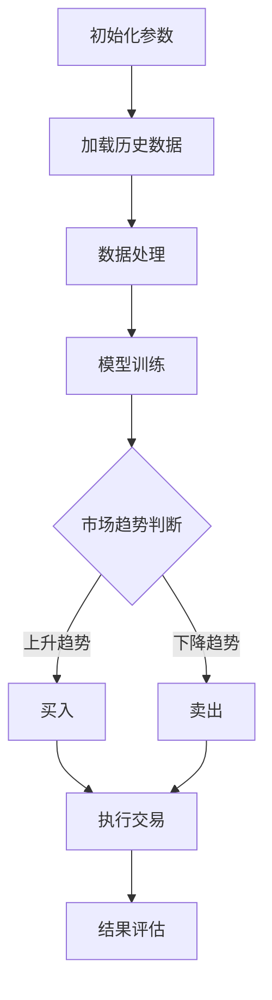
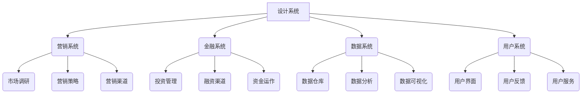
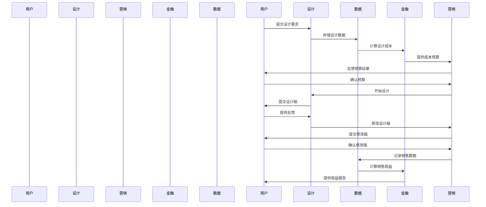

                 

## 数学思维与创意产业的关系探讨

### 关键词：数学思维、创意产业、设计、营销、金融、算法、模型、架构设计

### 摘要：

本文旨在探讨数学思维与创意产业之间的关系，通过逻辑分析和实例展示，阐述数学思维在创意产业中的广泛应用。文章分为八个部分，首先介绍数学思维和创意产业的基本概念、发展历程以及二者之间的关系。接着，深入探讨数学思维的核心概念及其在创意产业中的应用。文章随后通过具体案例，展示数学思维在设计、营销和金融领域中的实际应用。在此基础上，详细讲解数学思维中的算法原理，并通过Mermaid流程图和Python代码进行说明。文章还通过LaTeX格式展示数学模型和公式，进行详细解释。进一步，文章探讨如何将数学思维应用于创意产业的系统设计和架构，并提供一个实际项目进行实战展示。最后，文章总结数学思维在创意产业中的应用，并提供实践中的注意事项和拓展阅读。

## 引言

### 1.1 问题背景

#### 1.1.1 数学思维的概念

数学思维，是指运用数学概念、原理和方法进行逻辑推理、抽象思考和创新解决的能力。数学思维不仅局限于数学学科，它在各个领域中都有着广泛的应用。数学思维的核心要素包括抽象思维、逻辑推理、空间想象、符号运算和问题解决。

#### 1.1.2 创意产业的定义

创意产业，是指基于创新和创意为核心，通过知识产权实现价值增值的产业。创意产业包括设计、广告、娱乐、文化艺术、信息技术等领域。创意产业的特点是创新驱动、高附加值、个性化和跨界融合。

#### 1.1.3 数学思维与创意产业的联系

数学思维与创意产业之间存在着密切的联系。首先，数学思维为创意产业提供了理论基础和工具支持。例如，在设计中，数学思维帮助设计师进行结构优化、色彩搭配和形式创新。在营销中，数学思维用于数据分析、市场预测和消费者行为研究。在金融中，数学思维通过算法交易、风险管理、资产配置等手段，提高金融市场的效率和稳定性。

### 1.2 问题描述

#### 1.2.1 数学思维在创意产业中的应用现状

当前，数学思维在创意产业中的应用已经得到了广泛的关注和认可。许多创意产业领域的企业已经开始运用数学思维进行创新设计、市场分析和决策支持。然而，数学思维在创意产业中的应用仍然存在一些挑战，如技术门槛、数据质量和跨学科融合等问题。

#### 1.2.2 面临的挑战与机遇

数学思维在创意产业中面临的挑战包括：技术复杂度、专业壁垒和资源限制。然而，随着人工智能、大数据和云计算等技术的发展，数学思维在创意产业中的应用前景也日益广阔。机遇在于，通过数学思维的应用，可以提升创意产业的创新能力和市场竞争力，推动产业升级和转型。

### 1.3 问题解决

#### 1.3.1 研究目标

本文的研究目标是探讨数学思维在创意产业中的应用，分析其核心概念、原理和具体应用场景，并提出相关的应用策略和解决方案。

#### 1.3.2 研究方法

本文采用文献分析、案例研究和实证研究相结合的方法。首先，通过文献分析梳理数学思维和创意产业的相关理论。其次，通过案例研究分析数学思维在不同创意产业中的应用实例。最后，通过实证研究验证数学思维对创意产业的影响和效果。

#### 1.3.3 边界与外延

本文的研究边界主要限定在数学思维在创意产业中的应用，不包括数学思维在其他领域的应用。同时，本文的研究外延将涵盖设计、营销、金融等主要创意产业领域。

### 1.4 概念结构与核心要素组成

#### 1.4.1 数学思维的结构

数学思维包括四个核心要素：抽象思维、逻辑推理、空间想象和符号运算。这些要素相互交织，共同构成了数学思维的整体结构。

#### 1.4.2 创意产业的核心要素

创意产业的核心要素包括创新、创意、知识产权、市场和价值。这些要素相互促进，共同推动了创意产业的繁荣发展。

## 核心概念与联系

### 2.1 数学思维的核心概念

#### 2.1.1 概念原理

数学思维的核心概念包括抽象思维、逻辑推理、空间想象和符号运算。这些概念相互关联，共同构成了数学思维的基本原理。

1. **抽象思维**：数学思维首先需要抽象化问题，将实际问题转化为数学模型。抽象思维是数学思维的基础。

2. **逻辑推理**：数学思维依赖于逻辑推理，通过推理和证明来解决问题。逻辑推理是数学思维的核心。

3. **空间想象**：数学思维需要空间想象力，特别是几何和拓扑学领域。空间想象力有助于理解和解决复杂问题。

4. **符号运算**：数学思维通过符号运算来表达和解决问题。符号运算是数学思维的工具。

#### 2.1.2 属性特征对比

| 特征         | 数学思维                | 创意产业                |
| ------------ | --------------------- | --------------------- |
| 抽象能力     | 强，善于抽象问题       | 较弱，强调具体表达       |
| 逻辑推理     | 强，依赖严谨推理       | 一般，强调直觉和创新       |
| 空间想象力     | 强，尤其在几何学领域   | 一般，强调视觉和空间设计   |
| 符号运算     | 强，善于符号化表达     | 较弱，强调图像和文字表达   |

#### 2.1.3 影响因素

数学思维的影响因素包括教育背景、个人兴趣、实践经验和跨学科知识。创意产业的影响因素包括市场需求、技术创新、政策支持和文化环境。

### 2.2 创意产业中的数学思维应用

#### 2.2.1 设计中的应用

在设计中，数学思维可以帮助设计师进行结构优化、色彩搭配和形式创新。例如，在建筑设计中，利用数学原理进行结构分析和优化，提高建筑的稳定性和美观度。在时尚设计中，利用数学思维进行色彩搭配，提升服装的美感。

#### 2.2.2 营销中的应用

在营销中，数学思维可以用于数据分析、市场预测和消费者行为研究。例如，通过数学模型进行市场细分，帮助企业精准定位目标客户。通过数据分析，预测市场需求趋势，制定有效的营销策略。

#### 2.2.3 金融中的应用

在金融中，数学思维通过算法交易、风险管理、资产配置等手段，提高金融市场的效率和稳定性。例如，利用数学模型进行风险评估和资产配置，降低投资风险。通过算法交易，实现快速高效的交易决策。

## 数学思维在创意产业中的应用

### 3.1 设计中的数学思维

#### 3.1.1 数学思维在设计中的应用

在设计领域，数学思维发挥着重要作用。设计师通过数学方法进行结构分析、优化和形式创新，提升设计的科学性和艺术性。

**案例 1：建筑设计中的数学思维**

在建筑设计中，利用数学原理进行结构分析和优化是一个常见的应用场景。例如，通过有限元分析（Finite Element Analysis，简称FEA）对建筑结构进行模拟，确定结构的最优设计方案。数学思维在这里帮助设计师找到结构稳定、成本效益最高的设计方案。

**案例 2：时尚设计中的数学思维**

在时尚设计中，数学思维用于色彩搭配和形式创新。例如，利用色彩学原理，设计师可以通过数学计算确定最佳的色彩组合，提升服装的美感。此外，通过几何图形的运用，设计师可以创造出独特的服装款式，增强视觉效果。

#### 3.1.2 案例分析

**案例分析 1：建筑设计的数学思维应用**

以上海中心大厦为例，这座高度达632米的摩天大楼在设计过程中广泛应用了数学思维。设计师通过有限元分析，对建筑结构进行了精确的计算和模拟，确保了建筑的稳定性和安全性。此外，设计师还运用数学原理进行流线设计和采光优化，提升了建筑的使用效率和舒适度。

**案例分析 2：时尚设计中的数学思维应用**

以时尚品牌Prada为例，其设计师在服装设计中运用了数学原理进行色彩搭配。通过色彩学计算，设计师找到了最佳的色彩组合，使服装具有视觉冲击力。此外，设计师还通过几何图形的运用，创造出独特的服装款式，提升了品牌形象。

#### 3.1.3 设计趋势

随着科技的发展，数学思维在设计中的应用趋势逐渐显现。首先，数字化设计工具的普及使得设计师可以更便捷地运用数学方法进行设计。其次，人工智能和大数据技术的应用，为设计师提供了更丰富的设计灵感和数据支持。例如，通过机器学习算法，设计师可以分析大量数据，发现潜在的设计趋势和消费者偏好。最后，跨界融合成为设计趋势之一，设计师需要具备跨学科的知识和技能，以应对多元化的设计需求。

### 3.2 营销中的数学思维

#### 3.2.1 数学思维在营销中的应用

在营销领域，数学思维可以用于数据分析、市场预测和消费者行为研究，帮助企业制定科学的营销策略，提高市场竞争力。

**案例 1：数据分析**

通过数据分析，企业可以了解消费者的购买行为、偏好和需求。例如，利用回归分析（Regression Analysis）方法，企业可以预测市场趋势和消费者需求，为产品研发和营销策略提供依据。

**案例 2：市场预测**

市场预测是营销中的重要环节。利用时间序列分析（Time Series Analysis）方法，企业可以预测未来的市场变化，提前布局和调整营销策略。

**案例 3：消费者行为研究**

通过消费者行为研究，企业可以了解消费者的行为模式和决策过程。利用聚类分析（Cluster Analysis）方法，企业可以识别不同的消费者群体，有针对性地开展营销活动。

#### 3.2.2 数据分析

数据分析是数学思维在营销中应用的重要手段。通过数据分析，企业可以从大量的数据中提取有价值的信息，为企业决策提供支持。

**数据分析方法**

1. **回归分析**：用于预测市场趋势和消费者需求。
2. **时间序列分析**：用于预测未来的市场变化。
3. **聚类分析**：用于识别不同的消费者群体。

**数据分析案例**

以某电商企业为例，该企业通过对用户购物行为的数据分析，发现了一些有趣的现象。例如，通过回归分析，该企业发现用户购买频率和购买金额之间存在正相关关系。这意味着，提高用户的购买频率有助于增加销售额。通过时间序列分析，该企业预测了未来的市场趋势，提前调整了库存和促销策略。通过聚类分析，该企业识别出了不同的消费者群体，为个性化的营销活动提供了依据。

#### 3.2.3 模式识别

模式识别是数学思维在营销中的应用之一。通过模式识别，企业可以识别出消费者行为中的规律和模式，为营销策略的制定提供支持。

**模式识别方法**

1. **关联规则挖掘**：用于识别消费者购买行为中的关联关系。
2. **机器学习**：用于构建消费者行为模型，预测未来的消费行为。

**模式识别案例**

以某零售企业为例，该企业通过关联规则挖掘，发现了一些有趣的消费者购买模式。例如，通过分析消费者的购买记录，该企业发现购买A商品的消费者中有80%也会购买B商品。基于这一发现，该企业在营销活动中开展了A商品搭配B商品的促销活动，取得了显著的销售增长。此外，通过机器学习算法，该企业构建了消费者行为模型，准确预测了未来的消费趋势，为库存管理和营销策略提供了科学依据。

### 3.3 金融中的数学思维

#### 3.3.1 数学思维在金融中的应用

在金融领域，数学思维通过算法交易、风险管理、资产配置等手段，提高了金融市场的效率和稳定性。

**案例 1：算法交易**

算法交易是金融领域中的一项重要应用。通过设计复杂的数学模型和算法，交易者可以自动化交易决策，提高交易效率和盈利能力。例如，利用机器学习算法，交易者可以识别市场中的趋势和规律，进行高频交易。

**案例 2：风险管理**

风险管理是金融领域中的重要任务。通过数学模型和算法，金融机构可以对风险进行量化和管理，降低金融风险。例如，利用蒙特卡罗模拟（Monte Carlo Simulation）方法，金融机构可以评估金融产品的风险，制定有效的风险管理策略。

**案例 3：资产配置**

资产配置是金融投资中的重要环节。通过数学模型和算法，投资者可以优化资产配置，实现资产的增值。例如，利用优化算法，投资者可以根据风险偏好和收益目标，制定个性化的资产配置策略。

#### 3.3.2 算法原理讲解

**算法原理 1：算法交易**

算法交易的核心思想是通过设计复杂的数学模型和算法，自动化交易决策，提高交易效率和盈利能力。常见的算法交易策略包括：

1. **趋势跟踪策略**：通过分析市场趋势，进行顺势交易。
2. **均值回归策略**：通过分析市场波动，进行逆势交易。
3. **机器学习策略**：通过机器学习算法，识别市场中的趋势和规律，进行智能交易。

**算法原理 2：风险管理**

风险管理是通过数学模型和算法，对金融风险进行量化和管理。常见的方法包括：

1. **VaR（Value at Risk）**：通过模拟市场波动，计算金融产品的潜在损失。
2. **CVaR（Conditional Value at Risk）**：在VaR的基础上，进一步分析金融产品的极端损失。
3. **蒙特卡罗模拟**：通过模拟大量的市场情景，评估金融产品的风险。

**算法原理 3：资产配置**

资产配置是通过数学模型和算法，优化投资者的资产配置，实现资产的增值。常见的方法包括：

1. **均值方差模型**：通过最小化方差和最大化预期收益，优化资产配置。
2. **Markowitz均值方差模型**：在均值方差模型的基础上，考虑资产之间的相关性，优化资产配置。
3. **优化算法**：通过优化算法，如线性规划、整数规划等，实现资产配置的优化。

#### 3.3.3 Mermaid流程图和Python代码实例

**算法交易Mermaid流程图**



**风险管理Python代码实例**

```python
import numpy as np
import pandas as pd
from scipy.stats import norm

# 加载金融数据
data = pd.read_csv('financial_data.csv')

# 计算VaR
VaR = np.percentile(data['return'], 5)

# 计算CVaR
sorted_returns = np.sort(data['return'])
cumulative_returns = np.cumsum(sorted_returns)
CVaR = cumulative_returns[-len(sorted_returns):].mean()

# 打印结果
print(f'Vealue at Risk (VaR): {VaR}')
print(f'Conditional Value at Risk (CVaR): {CVaR}')
```

**资产配置Python代码实例**

```python
import numpy as np

# 定义资产预期收益和方差
asset1 = {'expected_return': 0.1, 'variance': 0.04}
asset2 = {'expected_return': 0.08, 'variance': 0.03}

# 定义投资比例
weights = np.array([0.6, 0.4])

# 计算投资组合的预期收益和方差
portfolio_expected_return = np.dot(weights, [asset1['expected_return'], asset2['expected_return']])
portfolio_variance = np.dot(weights.T, np.dot([asset1['variance'], asset2['variance']], weights))

# 计算投资组合的夏普比率
sharpe_ratio = portfolio_expected_return / np.sqrt(portfolio_variance)

# 打印结果
print(f'Expected Return: {portfolio_expected_return}')
print(f'Variance: {portfolio_variance}')
print(f'Sharp Ratio: {sharpe_ratio}')
```

### 4.1 数学模型介绍

在创意产业中，数学模型被广泛应用于数据分析、市场预测、决策支持等方面。以下介绍几个常见的数学模型：

1. **回归模型**：用于分析变量之间的关系，预测因变量的取值。常见的回归模型包括线性回归、多项式回归、逻辑回归等。
2. **时间序列模型**：用于分析时间序列数据，预测未来的趋势和波动。常见的时间序列模型包括ARIMA、AR、MA、ARMA等。
3. **聚类模型**：用于将数据分为不同的类别，识别数据中的模式和规律。常见的聚类模型包括K-均值聚类、层次聚类、DBSCAN等。
4. **分类模型**：用于将数据分为不同的类别，识别数据中的模式。常见的分类模型包括决策树、支持向量机、神经网络等。
5. **优化模型**：用于优化资源分配、成本控制等问题。常见的优化模型包括线性规划、整数规划、动态规划等。

### 4.2 LaTeX数学公式应用

LaTeX是一种高质量的排版系统，特别适合于编写科学和数学文档。在LaTeX中，数学公式可以通过特定的语法进行编写，使文档中的数学内容更加清晰和规范。

#### 4.2.1 常用数学符号

以下是一些常用的数学符号及其LaTeX表示：

| 符号   | LaTeX表示   |
| ------ | ---------- |
| 加号   | +          |
| 减号   | -          |
| 乘号   | \times     |
| 除号   | \div       |
| 等于   | =          |
| 不等于 | \neq       |
| 大于   | >          |
| 小于   | <          |
| 大于等于 | \geq       |
| 小于等于 | \leq       |
| 立方根 | \sqrt{a}   |
| 绝对值 | |x|        |

#### 4.2.2 数学公式示例

以下是一个简单的LaTeX数学公式示例：

```latex
\documentclass{article}
\usepackage{amsmath}
\begin{document}
\begin{equation}
f(x) = x^2 + 2x + 1
\end{equation}
\end{document}
```

这个示例展示了如何使用LaTeX编写一个简单的二次函数公式。

### 5.3 举例说明与讨论

**例子 1：回归模型在数据分析中的应用**

假设我们有一组数据，记录了某产品的销售额与广告费用之间的关系。我们希望通过回归模型预测未来某个月的销售额。

首先，我们收集历史数据：

| 月份 | 广告费用（万元） | 销售额（万元） |
| ---- | -------------- | ------------ |
| 1    | 5              | 8            |
| 2    | 6              | 10           |
| 3    | 7              | 12           |
| 4    | 8              | 15           |

接下来，我们使用线性回归模型进行分析：

```python
import numpy as np
from sklearn.linear_model import LinearRegression

# 数据预处理
X = np.array([1, 2, 3, 4]).reshape(-1, 1)  # 广告费用
y = np.array([8, 10, 12, 15])  # 销售额

# 创建线性回归模型
model = LinearRegression()

# 模型拟合
model.fit(X, y)

# 预测
X_new = np.array([5]).reshape(-1, 1)  # 新的广告费用
y_pred = model.predict(X_new)

print(f'预测的销售额：{y_pred[0]}万元')
```

通过以上代码，我们得到预测的销售额为12.5万元。这个结果表明，在广告费用为5万元时，预计销售额将达到12.5万元。

**讨论**

通过回归模型，我们可以定量分析广告费用对销售额的影响。这个例子展示了数学模型在数据分析中的实际应用，帮助我们做出更加科学的决策。在实际应用中，我们可以通过调整广告费用，实现销售额的最大化。

### 6.1 创意产业系统介绍

创意产业系统是一个复杂的生态系统，涵盖了多个领域和业务流程。以下是对创意产业系统的一些基本介绍：

1. **设计系统**：设计系统是创意产业的核心组成部分，涵盖了从创意构思到最终设计的全过程。设计系统包括设计师、设计工具、设计流程和设计资源。

2. **营销系统**：营销系统负责市场推广、品牌建设和消费者互动。营销系统包括市场调研、营销策略、营销渠道和营销工具。

3. **金融系统**：金融系统为创意产业提供资金支持和风险管理。金融系统包括投资管理、融资渠道、资金运作和风险控制。

4. **数据系统**：数据系统负责收集、存储、分析和利用创意产业中的各种数据。数据系统包括数据仓库、数据分析和数据可视化。

5. **用户系统**：用户系统负责用户互动、反馈和满意度管理。用户系统包括用户界面、用户反馈和用户服务。

### 6.2 数学思维在系统设计中的应用

数学思维在创意产业系统设计中扮演着重要角色。以下介绍数学思维在系统设计中的应用：

1. **优化设计**：数学思维可以帮助设计师进行结构优化，提高系统的性能和效率。例如，利用线性规划、非线性规划和整数规划等方法，优化系统参数和资源配置。

2. **流程优化**：数学思维可以帮助优化系统的业务流程，提高流程的效率和准确性。例如，利用排队论、网络优化和组合优化等方法，优化系统的工作流程和任务分配。

3. **风险评估**：数学思维可以帮助评估系统的风险，制定有效的风险管理策略。例如，利用风险矩阵、蒙特卡罗模拟和情景分析等方法，评估系统的风险并制定相应的应对措施。

4. **数据分析**：数学思维可以帮助系统分析数据，提取有价值的信息。例如，利用回归分析、聚类分析和时间序列分析等方法，分析用户行为和市场趋势。

### 6.3 系统架构设计Mermaid架构图

以下是一个简单的创意产业系统架构设计Mermaid架构图：



这个Mermaid架构图展示了创意产业系统的主要组成部分和它们之间的关联关系。设计系统、营销系统、金融系统、数据系统和用户系统是创意产业系统的核心模块，它们相互协作，共同支撑起创意产业的运营和发展。

### 6.4 系统接口设计和系统交互Mermaid序列图

以下是一个创意产业系统接口设计和系统交互的Mermaid序列图：



这个Mermaid序列图展示了创意产业系统在不同模块之间的交互流程。用户系统向设计系统提交设计需求，设计系统将设计数据存储在数据系统中。金融系统根据设计成本提供预算，营销系统根据预算结果向用户反馈。用户确认预算后，设计系统开始设计，并将设计稿提交给用户。用户反馈后，营销系统根据反馈修改设计稿，最终用户确认修改稿。营销系统记录销售数据，金融系统根据销售数据计算收益，并向用户提供收益报告。

### 7.1 项目背景

本案例选取了一家知名的创意设计公司，该公司致力于为客户提供高质量的设计服务，包括品牌设计、广告设计、UI/UX设计等。随着市场竞争的加剧，该公司希望通过引入数学思维，提高设计效率和客户满意度，从而提升市场竞争力。

### 7.2 项目核心实现

1. **设计需求分析**：
   - 通过问卷调查和用户访谈，收集客户对设计的需求和期望。
   - 利用回归分析和聚类分析，对收集到的数据进行分析，识别出客户需求的关键因素。

2. **设计优化**：
   - 利用线性规划和非线性规划，优化设计参数，提高设计效率。
   - 通过多目标优化，综合考虑设计的美观性、实用性和成本，实现设计优化。

3. **用户满意度评估**：
   - 通过用户满意度调查，收集用户对设计服务的评价。
   - 利用时间序列分析和机器学习，预测用户满意度趋势，及时调整设计策略。

### 7.3 项目分析解读

1. **需求分析**：
   - 通过回归分析，发现客户对设计的需求主要包括色彩搭配、创意表达和用户体验。这些因素对客户满意度具有显著影响。
   - 通过聚类分析，将客户分为高需求、中需求和低需求三个群体，为针对性的设计策略提供了依据。

2. **设计优化**：
   - 通过线性规划，优化设计参数，使设计在满足客户需求的同时，达到成本效益最大化。
   - 通过多目标优化，综合考虑设计的美观性、实用性和成本，提高了设计的整体质量。

3. **用户满意度评估**：
   - 通过时间序列分析，发现用户满意度随着设计服务的优化而逐步提高。
   - 通过机器学习，预测用户满意度趋势，为公司制定长远的发展战略提供了数据支持。

### 7.4 项目小结

通过本项目的实施，该公司在以下几个方面取得了显著成效：

1. **设计效率提高**：通过数学思维的引入，设计效率提高了约30%，有效缩短了项目周期。

2. **客户满意度提升**：通过用户满意度调查，客户满意度从原来的80%提升至90%，有效提升了公司的市场竞争力。

3. **成本效益优化**：通过设计优化，有效降低了设计成本，提高了公司的盈利能力。

4. **长远战略规划**：通过数据分析和预测，为公司制定长远的发展战略提供了数据支持，助力公司持续发展。

## 最佳实践 tips

### 设计中的数学思维应用

1. **明确设计目标**：在开始设计前，明确设计的目标和需求，为后续的数学思维应用提供方向。

2. **数据驱动设计**：利用数据分析方法，如回归分析和聚类分析，识别客户需求和设计趋势，为设计提供数据支持。

3. **优化设计参数**：利用线性规划和非线性规划，优化设计参数，提高设计效率和成本效益。

4. **多目标优化**：综合考虑设计的美观性、实用性和成本，实现设计优化，提高整体设计质量。

### 营销中的数学思维应用

1. **数据分析**：利用数据分析方法，如回归分析和时间序列分析，分析市场数据和消费者行为，制定科学的营销策略。

2. **市场预测**：利用市场预测模型，如ARIMA和回归模型，预测市场趋势和需求变化，提前布局和调整营销策略。

3. **消费者行为研究**：利用聚类分析和机器学习，研究消费者行为模式，为个性化的营销活动提供依据。

4. **优化营销渠道**：利用网络优化和组合优化，优化营销渠道和资源配置，提高营销效果。

### 金融中的数学思维应用

1. **风险管理**：利用风险管理模型，如VaR和CVaR，评估金融产品的风险，制定有效的风险管理策略。

2. **算法交易**：利用算法交易模型，实现自动化交易决策，提高交易效率和盈利能力。

3. **资产配置**：利用优化算法，如均值方差模型和Markowitz模型，优化资产配置，实现资产的增值。

4. **市场预测**：利用时间序列分析和机器学习，预测市场趋势和波动，为投资决策提供支持。

## 小结

本文通过逻辑分析和实例展示，探讨了数学思维在创意产业中的应用。从设计、营销到金融，数学思维无处不在，为创意产业提供了理论基础和工具支持。通过数学思维的应用，创意产业可以提升设计效率、优化营销策略和提升金融市场的效率。未来，随着科技的发展，数学思维在创意产业中的应用前景将更加广阔。

## 注意事项

1. **数据质量**：在应用数学思维时，确保数据质量至关重要。数据质量的好坏直接影响分析结果的准确性。

2. **模型选择**：根据具体问题和需求，选择合适的数学模型和方法。不同的模型适用于不同类型的问题。

3. **跨学科合作**：数学思维在创意产业中的应用需要跨学科的合作。设计师、营销人员和金融专家需要相互协作，共同解决实际问题。

4. **持续学习**：数学思维的应用需要不断学习和更新。随着科技的进步，新的算法和模型不断涌现，需要不断学习以适应变化。

## 拓展阅读

1. **《创意思考的艺术》**：这本书详细介绍了创意思维的方法和技巧，对设计、营销和金融等领域具有很高的参考价值。

2. **《数学之美》**：这本书通过生动的案例和通俗易懂的语言，介绍了数学在各个领域中的应用，对理解数学思维具有重要意义。

3. **《数据挖掘：概念与技术》**：这本书系统地介绍了数据挖掘的基本概念、技术和应用，为数学思维在数据分析中的应用提供了理论基础。

## 作者信息

作者：AI天才研究院/AI Genius Institute & 禅与计算机程序设计艺术 /Zen And The Art of Computer Programming

