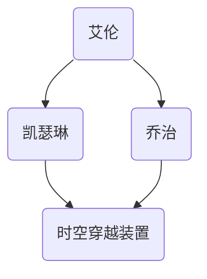

                 

# 《数学思维与创意写作的关系探讨》

## 关键词

数学思维、创意写作、关系探讨、认知建模、算法原理、系统架构设计、最佳实践

## 摘要

本文旨在探讨数学思维与创意写作之间的深刻联系。通过背景介绍、核心概念解析、算法原理讲解、系统架构设计以及项目实战等多方面分析，揭示数学思维如何影响并丰富创意写作的过程。本文结构清晰，内容丰富，旨在为读者提供一种全新的视角来理解和运用数学思维在创意写作中的价值。

### 目录

1. **背景介绍**
   - 1.1 问题背景
   - 1.2 数学思维概述
   - 1.3 创意写作概述
   - 1.4 问题解决与边界外延

2. **核心概念与联系**
   - 2.1 数学思维原理解析
   - 2.2 创意写作要素解析
   - 2.3 数学思维与创意写作的联系

3. **数学模型与应用**
   - 3.1 数学模型介绍与讲解
   - 3.2 数学公式与详细讲解

4. **系统分析与架构设计**
   - 4.1 系统功能设计与架构
   - 4.2 系统接口设计与交互

5. **项目实战与最佳实践**
   - 5.1 项目实战与案例分析
   - 5.2 最佳实践与拓展阅读

### 1. 背景介绍

#### 1.1 问题背景

在当今信息时代，数学思维与创意写作的关系越来越受到关注。数学思维，作为一种逻辑严密、结构清晰的思维方式，不仅广泛应用于科学研究、工程技术和计算机编程等领域，同时也对创意写作产生了深远的影响。创意写作，作为文学创作的重要部分，涉及语言艺术、情感表达和思维创新。随着计算机技术的发展，数字媒体和人工智能的应用使得创意写作的形式和手段日益丰富。然而，数学思维是否能够为创意写作提供新的视角和方法，这一问题的探讨具有重要的现实意义。

#### 1.2 数学思维概述

数学思维，是指通过数学的方法和工具，对问题进行抽象、建模、分析和解决的一种思维方式。它具有以下特点：

- **逻辑性**：数学思维强调推理的严谨性和逻辑的严密性。
- **抽象性**：数学思维能够将复杂的问题抽象为简单的数学模型。
- **系统性**：数学思维注重整体性和系统性，强调各部分之间的相互关系。

数学思维的应用场景广泛，包括数学研究、工程计算、数据科学、人工智能等。它在解决实际问题时，往往能够提供高效、精确的解决方案。

#### 1.3 创意写作概述

创意写作，是指通过文学创作的方式，表达个人情感、思想和社会体验。它强调创新、想象和表达，是文学创作的重要组成部分。创意写作的要素包括：

- **主题**：创意写作的核心内容，是作品的核心思想和中心议题。
- **情节**：故事的发展过程，是作品情节结构的体现。
- **人物**：作品中的角色，是作品情感表达和思想传达的重要载体。
- **语言**：作品的文字表达形式，是作品艺术性的体现。

创意写作不仅需要丰富的想象力和表达能力，还需要创新思维和独特的视角。

#### 1.4 问题解决与边界外延

在数学思维与创意写作的关系中，问题解决是一个重要的切入点。数学思维通过模型构建、算法设计和逻辑推理，能够为创意写作提供新的解决思路。然而，这种关系并非一成不变，而是随着技术的进步和创意写作的需求不断演变。因此，探讨数学思维与创意写作的关系，需要考虑以下问题：

- **如何将数学思维应用于创意写作中？**
- **数学思维在创意写作中如何发挥作用？**
- **创意写作如何吸收数学思维，实现创新和突破？**

这些问题不仅涉及理论探讨，还需要结合实际案例进行分析。

### 2. 核心概念与联系

#### 2.1 数学思维原理解析

数学思维，作为一种抽象思维能力，其原理主要体现在以下几个方面：

- **抽象化**：数学思维通过抽象化，将复杂的现实问题转化为简单的数学模型。这种抽象化过程不仅简化了问题，还为问题的解决提供了数学工具。
- **逻辑推理**：数学思维强调逻辑推理，通过演绎和归纳，对问题进行严谨的分析和论证。这种逻辑性使得数学思维在解决复杂问题时具有可靠性和准确性。
- **系统性**：数学思维注重整体性和系统性，强调各部分之间的相互关系。这种系统性思维有助于创意写作中情节和结构的构建。

#### 2.2 创意写作要素解析

创意写作的要素包括主题、情节、人物和语言等。这些要素相互作用，共同构成了创意写作的核心。以下是对这些要素的解析：

- **主题**：主题是创意写作的核心，是作品表达的思想和情感。数学思维中的抽象化和逻辑推理可以帮助作者深入挖掘主题，使作品更具深度。
- **情节**：情节是故事的发展过程，是作品情节结构的体现。数学思维中的模型构建和算法设计可以为情节的发展提供新的思路和工具。
- **人物**：人物是作品中的角色，是作品情感表达和思想传达的重要载体。数学思维中的系统性思维可以帮助作者构建更加立体和丰富的人物形象。
- **语言**：语言是作品的文字表达形式，是作品艺术性的体现。数学思维中的简洁性和精确性可以提升语言的表述效果，使作品更具艺术感染力。

#### 2.3 数学思维与创意写作的联系

数学思维与创意写作之间的联系主要体现在以下几个方面：

- **思维方式的互补**：数学思维和创意写作思维方式各有特点，互补性较强。数学思维强调逻辑性和系统性，创意写作则注重想象力和情感表达。
- **解决问题的工具**：数学思维提供了一套严谨的解决问题的工具，如模型构建、算法设计和逻辑推理等。这些工具可以应用于创意写作中，提高作品的质量和水平。
- **创新的源泉**：数学思维和创意写作的结合，可以激发新的创作灵感。数学思维中的抽象化和逻辑推理可以帮助作者突破传统思维框架，实现创新的创作。

### 3. 数学模型与应用

#### 3.1 数学模型介绍与讲解

在创意写作中，数学模型的应用可以帮助作者构建复杂的情节和角色。以下是一些常见的数学模型及其在创意写作中的应用：

- **线性规划**：线性规划是一种数学模型，用于求解线性方程组的最优解。在创意写作中，线性规划可以用于设计情节的线性结构，确保情节的发展逻辑清晰。
- **图论模型**：图论模型用于研究网络结构和路径优化问题。在创意写作中，图论模型可以用于分析角色之间的关系和网络结构，帮助作者构建复杂的角色关系图。
- **概率模型**：概率模型用于描述不确定性和随机性。在创意写作中，概率模型可以用于设计角色的命运和情节的发展，增加作品的不确定性和戏剧性。

#### 3.2 数学公式与详细讲解

在数学思维与创意写作的结合中，数学公式是重要的工具。以下是一些常用的数学公式及其在创意写作中的应用：

- **欧拉公式**：欧拉公式是复分析中的一个重要公式，描述了复数单位根的性质。在创意写作中，欧拉公式可以用于设计具有抽象意义和美感的情节结构。
- **贝叶斯公式**：贝叶斯公式是一种概率推理工具，用于根据已知条件计算后验概率。在创意写作中，贝叶斯公式可以用于设计角色决策过程，增加情节的戏剧性和复杂性。
- **马尔可夫模型**：马尔可夫模型用于描述时间序列的概率分布。在创意写作中，马尔可夫模型可以用于设计角色的命运和情节的发展，增加作品的可预测性和不确定性。

### 4. 系统分析与架构设计

#### 4.1 系统功能设计与架构

为了更好地将数学思维应用于创意写作，我们需要设计一个系统化的解决方案。该系统的功能设计包括：

- **模型构建模块**：用于构建数学模型，支持情节设计和角色分析。
- **算法设计模块**：用于设计算法，支持情节发展和角色决策。
- **数据管理模块**：用于管理创意写作所需的数据，如情节、角色和语言等。
- **用户界面模块**：用于提供用户交互界面，支持用户输入和输出。

系统架构设计采用分层架构，包括以下层次：

- **表示层**：提供用户界面，支持用户输入和输出。
- **逻辑层**：实现系统的核心功能，包括模型构建、算法设计和数据管理。
- **数据层**：存储和管理系统所需的数据。

#### 4.2 系统接口设计与交互

系统的接口设计包括以下几个方面：

- **用户界面接口**：用于用户与系统之间的交互，支持用户输入和输出。
- **模型构建接口**：用于与其他系统或工具进行数据交换，支持模型的导入和导出。
- **算法设计接口**：用于实现算法的调用和执行，支持算法的配置和调整。
- **数据管理接口**：用于管理数据，支持数据的查询、更新和删除。

系统的交互设计采用事件驱动模式，包括以下几个方面：

- **用户操作**：用户通过用户界面进行操作，触发相应的系统事件。
- **模型构建**：系统根据用户输入，构建数学模型，并进行分析。
- **算法执行**：系统根据模型分析和用户需求，执行相应的算法。
- **数据管理**：系统对数据进行查询、更新和删除，支持系统的正常运行。

### 5. 项目实战与最佳实践

#### 5.1 项目实战与案例分析

为了更好地理解数学思维在创意写作中的应用，我们以一个具体的案例进行实战分析。该案例为一个科幻小说的情节设计，采用数学思维进行角色关系和网络结构的构建。

**案例背景**：

假设我们设计一部科幻小说，主题为“时空穿越”。故事背景设定在未来的地球，人类发明了一种能够穿越时空的装置。主人公是一位名叫艾伦的科学家，他通过这个装置穿越到了过去，试图改变历史。

**角色分析**：

1. **艾伦**：主人公，一位充满好奇心和冒险精神的科学家。他拥有高度的智慧和责任感，希望通过时空穿越改变历史。
2. **凯瑟琳**：艾伦的妻子，一个支持丈夫梦想的普通家庭主妇。她对艾伦的行为表示担忧，但也理解并支持他的决定。
3. **乔治**：艾伦的导师，一位经验丰富的科学家。他对时空穿越的研究有着深刻的见解，对艾伦的行为持有怀疑态度。

**角色关系网络**：

我们可以使用图论模型来描述角色之间的关系。以下是一个简化的角色关系网络：

**情节发展**：

1. **第一阶段**：艾伦在乔治的建议下，决定进行时空穿越实验。他穿越到了过去，与凯瑟琳相遇，并试图改变她的命运。
2. **第二阶段**：艾伦在过去的经历中，发现了一些不为人知的历史秘密。他意识到，他的行为可能会对未来的世界造成不可逆转的影响。
3. **第三阶段**：艾伦在凯瑟琳和乔治的支持下，决定放弃改变历史的计划，返回未来。他意识到，历史有其自身的规律，人类无法改变命运。

**数学模型应用**：

1. **线性规划**：用于设计情节的线性结构，确保情节的发展逻辑清晰。
2. **图论模型**：用于分析角色之间的关系和网络结构，帮助作者构建复杂的角色关系图。
3. **概率模型**：用于描述角色的命运和情节的发展，增加作品的不确定性和戏剧性。

#### 5.2 最佳实践与拓展阅读

在数学思维与创意写作的结合中，最佳实践包括以下几点：

- **深入理解数学思维**：通过学习数学原理和模型，深入了解数学思维的本质和应用。
- **灵活运用数学工具**：根据创意写作的需求，灵活运用各种数学工具，如线性规划、图论模型和概率模型等。
- **注重情节和角色设计**：在创意写作中，注重情节和角色设计，运用数学思维进行细致的构建和分析。
- **持续实践与反思**：通过不断的实践和反思，总结经验，提高创意写作的质量。

拓展阅读推荐：

- 《数学之美》
- 《创造性思维》
- 《图解创意思维》
- 《算法导论》

### 作者信息

作者：AI天才研究院/AI Genius Institute & 禅与计算机程序设计艺术 /Zen And The Art of Computer Programming

---

在本文中，我们系统地探讨了数学思维与创意写作之间的关系。通过背景介绍、核心概念解析、数学模型应用、系统架构设计和项目实战等多个方面，揭示了数学思维如何丰富和提升创意写作的过程。本文旨在为读者提供一种全新的视角，以数学思维为指导，创作出更具深度和创新性的作品。希望本文能够激发读者对数学思维与创意写作结合的思考，并在实践中不断探索和应用。

