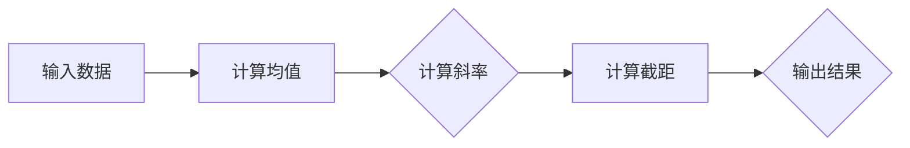
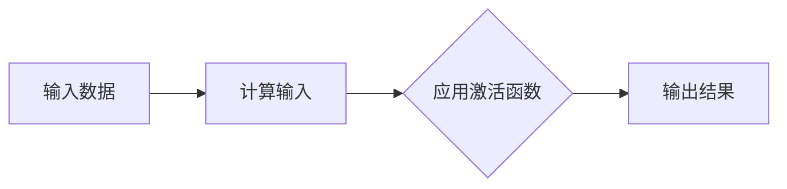
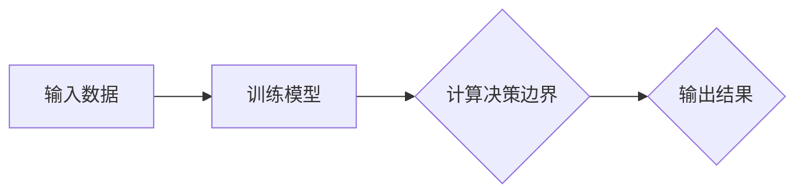

                 

# 数学思维与创新思维的关系探讨

## 关键词

数学思维、创新思维、关系探讨、教育实践、算法原理、应用案例

## 摘要

本文旨在探讨数学思维与创新思维之间的关系，分析它们在现代社会中的应用和培养方法。通过详细的章节内容，我们将深入了解数学思维和创新思维的核心概念、特征及其联系，并结合实际案例进行分析。此外，还将介绍如何通过教育实践来培养这两种思维能力，以及它们在实际应用中的综合应用策略。最后，我们将通过算法原理讲解，提供一些实用的数学模型和Python源代码，以帮助读者更好地理解和应用数学思维与创新思维。

## 目录

### 第一部分：引言与基础

**第1章 引言**

- 1.1 问题背景
- 1.2 问题描述
- 1.3 问题解决
- 1.4 边界与外延
- 1.5 概念结构与核心要素组成

**第2章 数学思维的核心概念与联系**

- 2.1 数学思维的定义
- 2.2 数学思维的属性特征对比表格
- 2.3 数学思维与数学工具的联系
- 2.4 数学思维与逻辑推理的联系
- 2.5 数学思维与问题解决的联系
- 2.6 使用 Mermaid 画出 ER 实体关系图架构

**第3章 创新思维的核心概念与联系**

- 3.1 创新思维的定义
- 3.2 创新思维的属性特征对比表格
- 3.3 创新思维与创造性思维的联系
- 3.4 创新思维与批判性思维的联系
- 3.5 创新思维与社会发展的联系
- 3.6 使用 Mermaid 画出 ER 实体关系图架构

**第4章 数学思维在各个领域中的应用案例研究**

- 4.1 科学领域
- 4.2 艺术领域
- 4.3 商业领域
- 4.4 教育领域
- 4.5 其他领域

**第5章 创新思维在教育实践中的应用**

- 5.1 创新教育的基本理念
- 5.2 创新教育的实践方法
- 5.3 创新教育的案例研究
- 5.4 创新教育与数学思维的关系
- 5.5 创新教育的未来发展趋势

**第6章 数学思维与创新思维在实际应用中的综合应用**

- 6.1 解决问题的策略
- 6.2 决策制定的技巧
- 6.3 创意生成的途径
- 6.4 数学思维与创新思维结合的案例研究
- 6.5 实际应用中的挑战与机遇

**第7章 数学思维与创新思维相关的算法与数学模型讲解**

- 6.1 数学模型介绍
- 6.2 数学公式详细讲解
- 6.3 Python 源代码实现
- 6.4 算法 Mermaid 流程图
- 6.5 举例说明

**第8章 总结与展望**

- 8.1 全书内容回顾
- 8.2 最佳实践建议
- 8.3 注意事项
- 8.4 拓展阅读

## 第1章 引言

### 1.1 问题背景

数学思维与创新思维，作为人类认知能力的重要组成部分，一直在推动着社会的发展与进步。在现代社会，这两者之间的关系愈发紧密，成为推动科技进步、经济发展、文化繁荣的关键因素。然而，如何理解、培养和应用这两种思维能力，仍是一个值得探讨的问题。

数学思维是指运用数学概念、原理和方法来分析和解决问题的思维方式。它强调逻辑性、抽象性和精确性，是科学研究和工程实践中不可或缺的技能。创新思维则是指打破传统思维模式，以新颖的方式解决问题、发现机会、创造价值的思维方式。它强调灵活性、创造性和独特性，是推动社会进步、企业发展的关键能力。

### 1.2 问题描述

随着科技的发展，数学思维与创新思维在各个领域的应用日益广泛，但两者之间的关系尚不明确。如何有效地将数学思维与创新思维相结合，发挥其在实际问题解决中的最大潜力，成为亟待解决的重要问题。

### 1.3 问题解决

本书旨在探讨数学思维与创新思维的关系，分析它们的核心概念、特征及其联系。通过实际案例研究和算法讲解，阐述这两种思维能力在各个领域的应用，并提出培养和提升这两种思维能力的策略和方法。最终，帮助读者理解数学思维与创新思维的内在联系，提高实际问题的解决能力。

### 1.4 边界与外延

数学思维与创新思维虽然密切相关，但仍有其各自的特点和适用范围。数学思维更侧重于逻辑分析和精确计算，适用于科学研究和工程实践等领域；创新思维则更注重创造性思维和独特见解，适用于创新创业、艺术创作、商业战略等领域。

### 1.5 概念结构与核心要素组成

数学思维与创新思维的概念结构主要包括以下核心要素：

- **数学思维**：逻辑性、抽象性、精确性
- **创新思维**：灵活性、创造性、独特性
- **关系**：相互促进、相互影响、协同发展

通过以上分析，我们可以明确数学思维与创新思维在现代社会中的重要地位，以及如何将这两种思维能力有效结合，为实际问题的解决提供有力支持。

### 第2章 数学思维的核心概念与联系

#### 2.1 数学思维的定义

数学思维是指人们在处理数学问题时所采用的思维方式，它涉及对数学概念、原理和方法的深入理解，以及对数学问题的分析和解决能力。数学思维是科学研究和工程实践中不可或缺的一部分，它强调逻辑性、抽象性和精确性。

数学思维的基本特点包括：

- **逻辑性**：数学思维强调推理和论证的过程，要求人们在解决问题时遵循逻辑规则，确保结论的正确性。
- **抽象性**：数学思维能够将具体问题抽象为数学模型，从而简化问题的复杂度，提高解决问题的效率。
- **精确性**：数学思维注重定量分析和精确计算，确保结果的准确性和可靠性。

#### 2.2 数学思维的属性特征对比表格

| 特征         | 数学思维                 | 创新思维                 |
| ------------ | ------------------------ | ------------------------ |
| 逻辑性       | 强调推理和论证           | 强调逻辑推理但更灵活     |
| 抽象性       | 抽象为数学模型           | 抽象但不局限于数学模型   |
| 精确性       | 注重定量分析和精确计算   | 注重创造性思维和独特见解 |
| 应用范围      | 科学研究和工程实践       | 创新创业、艺术创作、商业战略 |

#### 2.3 数学思维与数学工具的联系

数学思维与数学工具密切相关。数学工具包括数学公式、定理、算法等，是数学思维的具体表现形式。数学思维通过运用数学工具，能够有效地解决问题、发现规律、揭示本质。

- **数学公式**：数学公式是数学思维的核心组成部分，用于表示数学概念、关系和运算。如：欧拉公式、牛顿-莱布尼茨公式等。
- **定理**：定理是经过严格证明的数学命题，是数学思维的基石。如：勾股定理、均值不等式等。
- **算法**：算法是解决问题的步骤序列，是数学思维的实现形式。如：快速排序、动态规划等。

#### 2.4 数学思维与逻辑推理的联系

数学思维与逻辑推理密不可分。逻辑推理是指运用逻辑规则，从已知前提推导出结论的过程。数学思维强调逻辑推理的严谨性和准确性，要求人们在解决问题时遵循逻辑规则，确保结论的正确性。

- **演绎推理**：演绎推理是从一般到特殊的推理方法，是数学思维的核心形式。如：从勾股定理推导出直角三角形的边长关系。
- **归纳推理**：归纳推理是从特殊到一般的推理方法，是数学思维的补充形式。如：从若干个特定例子推导出普遍规律。

#### 2.5 数学思维与问题解决的联系

数学思维在问题解决中发挥着重要作用。通过数学思维，人们能够将复杂问题抽象为数学模型，运用数学方法进行求解。数学思维不仅能够提高解决问题的效率，还能够揭示问题的本质和规律。

- **模型建立**：建立数学模型是数学思维的关键步骤，它将实际问题转化为数学问题，便于分析和求解。
- **算法设计**：设计有效的算法是数学思维的重要应用，它能够提高问题求解的效率和准确性。
- **数值计算**：运用数值计算方法，如迭代法、数值积分等，是数学思维在问题求解中的具体体现。

#### 2.6 使用 Mermaid 画出 ER 实体关系图架构

以下是一个简单的 Mermaid ER 实体关系图示例，用于表示数学思维与数学工具、逻辑推理、问题解决之间的关系。

```mermaid
erDiagram
  MathTool ||--|{ MathConcept }
  MathTool ||--|{ Theorem }
  MathTool ||--|{ Algorithm }
  LogicReasoning ||--|{ DeductiveReasoning }
  LogicReasoning ||--|{ InductiveReasoning }
  ProblemSolving ||--|{ ModelBuilding }
  ProblemSolving ||--|{ AlgorithmDesign }
  ProblemSolving ||--|{ NumericalComputation }
```

通过以上分析，我们可以看到数学思维在核心概念、特征、联系以及实际应用中的重要地位。数学思维不仅是一种思维方式，更是一种解决问题的工具和方法。理解数学思维的基本原理和应用方法，对于提高我们的认知能力和创新能力具有重要意义。

### 第3章 创新思维的核心概念与联系

#### 3.1 创新思维的定义

创新思维是一种能够产生新颖、有价值想法和解决方案的思维方式。它强调突破传统思维模式，通过独特的视角和创造性方法来解决问题、发现机会和创造价值。创新思维是推动社会进步、经济发展和文化繁荣的重要力量。

创新思维的基本特点包括：

- **灵活性**：创新思维不拘泥于传统观念和既定规则，能够灵活地应对变化和挑战。
- **创造性**：创新思维强调创造新颖的想法和解决方案，追求独特性和创新性。
- **独特性**：创新思维能够从独特的角度出发，发现别人忽略的机会和问题。

#### 3.2 创新思维的属性特征对比表格

| 特征         | 创新思维                 | 数学思维                 |
| ------------ | ------------------------ | ------------------------ |
| 灵活性       | 不拘泥于传统观念和规则   | 注重逻辑性和精确性       |
| 创造性       | 强调新颖的想法和解决方案 | 强调抽象和定量分析       |
| 独特性       | 追求独特性和创新性       | 注重逻辑推理和论证       |
| 应用范围      | 创新创业、艺术创作、商业战略 | 科学研究、工程实践       |

#### 3.3 创新思维与创造性思维的联系

创造性思维是创新思维的重要组成部分，它强调通过独特的视角和方法来解决问题和创造价值。创造性思维与数学思维有所不同，它更注重创新性和独特性，而数学思维则更侧重于逻辑性和精确性。

- **发散思维**：发散思维是创造性思维的一种形式，它通过从不同的角度和方向思考问题，产生多个可能的解决方案。
- **收敛思维**：收敛思维是创造性思维的另一种形式，它通过将多个可能的解决方案进行比较和筛选，找到一个最优的解决方案。

#### 3.4 创新思维与批判性思维的联系

批判性思维是指对信息、观点和理论进行深入分析和评估的能力。创新思维与批判性思维密切相关，两者相互促进。

- **质疑精神**：创新思维强调质疑现有的知识和观念，从不同的角度和层面审视问题，寻找新的解决方案。
- **批判性分析**：批判性思维则通过分析、评估和验证创新思维的合理性，确保创新性想法和解决方案的可操作性和可行性。

#### 3.5 创新思维与社会发展的联系

创新思维在推动社会发展方面发挥着重要作用。它不仅能够促进科技进步和经济发展，还能够推动文化繁荣和社会进步。

- **科技进步**：创新思维能够推动科学研究和技术创新，为人类带来更多的科技成果和福祉。
- **经济发展**：创新思维能够激发企业创新，促进产业升级和经济增长。
- **文化繁荣**：创新思维能够推动艺术创作和文化创新，丰富人类的精神世界。

#### 3.6 使用 Mermaid 画出 ER 实体关系图架构

以下是一个简单的 Mermaid ER 实体关系图示例，用于表示创新思维、创造性思维、批判性思维与社会发展的关系。

```mermaid
erDiagram
  CreativeThinking ||--|{ InnovativeThinking }
  CriticalThinking ||--|{ InnovativeThinking }
  SocialDevelopment ||--|{ TechnologicalProgress }
  SocialDevelopment ||--|{ EconomicDevelopment }
  SocialDevelopment ||--|{ CulturalProsperity }
```

通过以上分析，我们可以看到创新思维在核心概念、特征、联系以及实际应用中的重要地位。创新思维不仅是一种思维方式，更是一种推动社会进步的力量。理解创新思维的基本原理和应用方法，对于提高我们的认知能力和创新能力具有重要意义。

### 第4章 数学思维在各个领域中的应用案例研究

#### 4.1 科学领域

在科学研究中，数学思维扮演着至关重要的角色。数学思维不仅为科学研究提供了精确的工具和方法，还帮助科学家们更好地理解和解释自然现象。

- **物理学**：物理学是数学思维在科学研究中的典型应用领域。例如，牛顿运动定律和万有引力定律都是通过数学模型来描述和解释物理现象。科学家们利用数学思维来推导这些定律，并通过实验验证其正确性。
- **化学**：化学中的化学键、化学反应速率等概念都是通过数学思维来描述和分析的。数学模型和方法帮助化学家们预测化学反应的产物和反应条件，从而推动化学研究的发展。
- **生物学**：在生物学中，数学思维被广泛应用于遗传学、生态学等领域。例如，遗传学中的基因表达和遗传规律可以通过数学模型来描述和分析，帮助科学家们更好地理解生物体的遗传特性。

#### 4.2 艺术领域

艺术领域中的许多创作和表现都离不开数学思维的支持。数学思维在艺术创作中的应用不仅丰富了艺术表现形式，还提升了艺术作品的科学性和逻辑性。

- **绘画**：许多著名的画家，如达芬奇，都在绘画中运用了数学思维。例如，他们使用黄金分割比例来创作作品，使作品具有和谐的美感。
- **音乐**：音乐中的音阶、和弦、旋律等都是通过数学思维来构建的。音乐理论中的音程、音色等概念都是通过数学方法来描述和分析的。
- **建筑**：建筑设计中的比例、对称、结构等都是数学思维的体现。例如，古埃及的金字塔和古希腊的帕特农神庙都展示了数学思维在建筑艺术中的应用。

#### 4.3 商业领域

在商业领域，数学思维被广泛应用于市场分析、风险管理、财务规划等领域，帮助企业做出更明智的决策。

- **市场分析**：市场分析中的数据分析、市场预测等都是数学思维的典型应用。例如，企业可以通过统计分析方法来分析市场需求，预测销售趋势，制定营销策略。
- **风险管理**：风险管理中的风险评估、保险设计等都是数学思维的体现。数学模型和方法可以帮助企业评估风险，制定有效的风险管理策略。
- **财务规划**：财务规划中的投资策略、财务预测等都是数学思维的典型应用。例如，企业可以通过数学模型来分析投资风险和回报，制定最优的投资策略。

#### 4.4 教育领域

在教育领域，数学思维的应用不仅有助于提升学生的学习能力，还有助于培养学生的创新思维和逻辑思维能力。

- **教学方法**：教师可以通过数学思维来设计教学方法和课程内容，使学生更好地理解和掌握数学知识。例如，通过数学游戏和数学实验来激发学生的兴趣和创造力。
- **学习评价**：教师可以通过数学思维来设计学习评价方法，如考试、作业等，以全面评估学生的学习效果。例如，通过数据分析方法来评估学生的学习成绩和进步情况。
- **课程设计**：教育工作者可以通过数学思维来设计课程和教学内容，以培养学生的创新思维和解决问题的能力。例如，通过跨学科项目来综合运用数学和其他学科的知识。

#### 4.5 其他领域

数学思维在许多其他领域也有广泛的应用，如计算机科学、工程技术、医学等。

- **计算机科学**：计算机科学中的算法设计、数据结构、人工智能等都是数学思维的典型应用。例如，算法分析中的时间复杂度和空间复杂度分析，以及人工智能中的神经网络和机器学习算法等。
- **工程技术**：工程技术中的工程设计、结构分析、材料力学等都是数学思维的体现。例如，通过数学模型来分析工程结构的安全性、稳定性和可靠性。
- **医学**：医学中的医学图像处理、药物设计、疾病预测等都是数学思维的典型应用。例如，通过数学模型来分析医学数据，预测疾病的发病率和治疗方案。

通过以上分析，我们可以看到数学思维在各个领域的广泛应用。数学思维不仅为科学研究、艺术创作、商业决策、教育方法等提供了有力的工具和方法，还帮助人们更好地理解和解释自然现象、社会现象和人类行为。理解数学思维的基本原理和应用方法，对于提高我们的认知能力和创新能力具有重要意义。

### 第5章 创新思维在教育实践中的应用

#### 5.1 创新教育的基本理念

创新教育是一种以培养学生的创新思维、实践能力和综合素质为核心的教育理念。其基本理念包括：

- **培养学生的创造力**：创新教育强调培养学生的创造力，鼓励他们从独特的角度思考问题，提出新颖的解决方案。
- **培养批判性思维**：创新教育注重培养批判性思维，使学生能够对信息、观点和理论进行深入分析和评估，提高他们的判断力和决策能力。
- **跨学科学习**：创新教育提倡跨学科学习，通过综合运用不同学科的知识和技能，解决复杂问题，提高学生的综合素养。
- **实践与理论相结合**：创新教育强调理论与实践相结合，通过实际操作和项目实践，使学生将所学知识应用到实际生活中。

#### 5.2 创新教育的实践方法

创新教育在实践中可以采取多种方法，以下是一些常见的实践方法：

- **项目式学习**：项目式学习是一种以项目为导向的学习方法，通过让学生参与实际项目，培养他们的创新思维和实践能力。例如，可以让学生参与科学实验、工程设计、商业策划等实际项目，从中学习和掌握创新方法。
- **问题导向学习**：问题导向学习是一种以问题为核心的学习方法，通过提出问题、分析问题和解决问题，培养学生的批判性思维和创新能力。例如，可以让学生从实际问题出发，通过自主探究和合作学习，找到解决方案。
- **探究式学习**：探究式学习是一种以探究为核心的学习方法，通过引导学生自主探究、发现问题和解决问题，培养他们的创新思维和实践能力。例如，可以让学生通过实验、调查、研究等方式，自主探索未知领域，从中学习和掌握创新方法。
- **跨学科学习**：跨学科学习是一种通过综合运用不同学科的知识和技能，解决复杂问题的学习方法。例如，可以让学生通过跨学科项目，综合运用数学、科学、技术、艺术等知识，解决实际问题。

#### 5.3 创新教育的案例研究

以下是一些创新教育的成功案例：

- **麻省理工学院**：麻省理工学院（MIT）是一所著名的创新教育实践基地。该校通过实施项目式学习、跨学科学习和问题导向学习等教学方法，培养了大量的创新人才。例如，MIT 的媒体实验室（Media Lab）通过项目式学习，让学生在科学、艺术、工程等领域进行跨学科创新，取得了许多突破性成果。
- **斯坦福大学**：斯坦福大学通过实施跨学科教育和创新教育，培养了大量的创业者和创新者。例如，斯坦福大学商学院和工程学院的合作项目，通过跨学科教育和实践，培养了大量的创业者，他们在创业过程中取得了显著的成功。
- **中国的创新教育实践**：在中国，一些学校和教育机构也在积极探索创新教育的实践。例如，北京四中通过实施问题导向学习和跨学科学习，培养学生的创新思维和实践能力，取得了显著的教育成果。

#### 5.4 创新教育与数学思维的关系

创新教育和数学思维之间有着密切的联系。数学思维作为一种重要的思维方式，在创新教育中发挥着重要作用。

- **数学思维培养创新思维**：数学思维强调逻辑性、抽象性和精确性，这些特点有助于培养学生的创新思维。例如，通过数学推理和证明，学生可以学会如何从不同角度思考问题，提出新颖的解决方案。
- **数学思维促进跨学科学习**：数学思维作为一种基础性思维方式，可以帮助学生更好地理解和掌握其他学科的知识和技能。例如，通过数学模型和算法，学生可以更好地理解和应用科学、工程、计算机等领域的技术。
- **数学思维提高批判性思维**：数学思维强调对逻辑和证据的严格分析，有助于培养学生的批判性思维。例如，在解决数学问题时，学生需要分析问题的前提、推理过程和结论，从而提高他们的判断力和决策能力。

#### 5.5 创新教育的未来发展趋势

随着科技的不断进步和社会的快速发展，创新教育在未来将呈现出以下发展趋势：

- **个性化教育**：创新教育将更加注重个性化教育，通过个性化教学方法和学习策略，满足不同学生的需求和兴趣。
- **跨学科融合**：创新教育将更加注重跨学科融合，通过综合运用不同学科的知识和技能，解决复杂问题，培养具有综合素质的人才。
- **技术应用**：创新教育将更加注重技术应用，通过引入先进的教育技术和工具，提高教学效果和学生的学习体验。
- **全球化视野**：创新教育将更加注重全球化视野，通过国际交流与合作，培养学生的国际竞争力和全球视野。

通过以上分析，我们可以看到创新思维在教育实践中的应用具有重要意义。创新教育不仅有助于培养学生的创新思维和实践能力，还有助于提升学生的综合素质和竞争力。理解创新思维的基本原理和应用方法，对于提高我们的教育质量和培养创新人才具有重要意义。

### 第6章 数学思维与创新思维在实际应用中的综合应用

#### 6.1 解决问题的策略

数学思维与创新思维在实际应用中的综合应用，可以大大提高解决问题的效率和质量。以下是几种常见的策略：

- **系统化分析**：首先，通过数学思维对问题进行系统化分析，将复杂问题分解为若干个基本问题，从而降低问题的复杂度。然后，运用创新思维，从不同角度和层面思考问题，提出多种可能的解决方案。
- **多角度思考**：在解决问题时，运用数学思维进行逻辑推理和论证，确保每一个步骤的严谨性和准确性。同时，运用创新思维，打破传统思维模式，从多个角度思考问题，寻找独特的解决方案。
- **交叉验证**：在提出解决方案后，通过数学思维进行交叉验证，确保方案的有效性和可行性。然后，运用创新思维，对解决方案进行优化和改进，使其更加符合实际需求。

#### 6.2 决策制定的技巧

在决策制定过程中，数学思维与创新思维的结合同样具有重要意义。以下是一些技巧：

- **数据驱动的决策**：通过数学思维对数据进行分析和建模，获取关键信息，为决策提供科学依据。然后，运用创新思维，结合实际情况，制定出具有前瞻性和灵活性的决策方案。
- **风险评估**：在制定决策时，运用数学思维进行风险评估，识别潜在的风险因素，并制定相应的应对措施。同时，运用创新思维，从多个角度考虑风险，提出创新的解决方案，降低风险发生的概率。
- **情景分析**：通过数学思维和情境分析，对决策可能带来的结果进行预测和分析。然后，运用创新思维，对可能的结果进行假设和验证，从而制定出更加合理的决策方案。

#### 6.3 创意生成的途径

在创意生成过程中，数学思维与创新思维的结合可以大大提高创意的数量和质量。以下是一些创意生成的途径：

- **数学模型构建**：通过数学思维构建数学模型，对创意进行抽象和量化。然后，运用创新思维，对模型进行拓展和优化，从而生成新的创意。
- **跨学科融合**：通过跨学科融合，将数学思维与其他领域的思维方式相结合，激发创意的生成。例如，将数学思维与艺术、工程、计算机等领域相结合，创造新的创意。
- **头脑风暴**：通过头脑风暴，运用创新思维，快速生成大量的创意。然后，运用数学思维对这些创意进行筛选和优化，找出最有价值的创意。

#### 6.4 数学思维与创新思维结合的案例研究

以下是一个结合数学思维和创新思维的案例研究：

- **案例背景**：某科技公司需要开发一款智能客服系统，以提高客户服务质量和效率。该公司面临的问题是，如何在有限的资源下，实现高效、准确的客户服务。
- **数学思维应用**：首先，通过数学思维，对客户服务过程中涉及的数据进行分析和建模，识别关键因素和关键环节。例如，通过数据分析，确定哪些因素对客户满意度有重要影响，哪些环节存在瓶颈。
- **创新思维应用**：然后，运用创新思维，提出多种解决方案。例如，通过引入人工智能技术，实现智能客服；通过设计个性化的服务流程，提高客户体验；通过优化服务资源，提高服务效率。
- **综合应用**：在数学思维和和创新思维的共同作用下，该公司最终开发出了一款具有高度智能化、个性化、高效的智能客服系统。该系统不仅提高了客户服务质量，还降低了服务成本。

#### 6.5 实际应用中的挑战与机遇

在实际应用中，数学思维与创新思维的结合面临着一系列挑战和机遇：

- **挑战**：挑战主要来自两个方面。首先，数学思维和创新思维之间存在一定的冲突，如何在两者之间取得平衡，成为一大难题。其次，实际应用中的复杂性，使得数学思维和创新思维的结合面临诸多困难。
- **机遇**：机遇同样表现在两个方面。首先，随着科技的进步，数学思维和创新思维的结合方法不断丰富，为实际应用提供了更多可能性。其次，实际应用中的成功案例不断涌现，为数学思维和创新思维的结合提供了有力支持。

通过以上分析，我们可以看到数学思维与创新思维在实际应用中的重要性。结合数学思维和创新思维，可以帮助我们更有效地解决问题、制定决策、生成创意，从而推动社会的进步和发展。

### 第7章 数学思维与创新思维相关的算法与数学模型讲解

#### 7.1 数学模型介绍

在本章中，我们将介绍一些与数学思维和创新思维相关的数学模型，包括线性回归模型、神经网络模型和支持向量机模型。这些模型在数据分析、机器学习和人工智能领域有着广泛的应用。

- **线性回归模型**：线性回归模型是一种用于研究变量之间线性关系的数学模型。它通过拟合一个线性函数来描述两个或多个变量之间的关系，从而预测因变量的值。
- **神经网络模型**：神经网络模型是一种基于生物神经元结构的计算模型。它通过多层次的神经元节点，对输入数据进行处理和变换，从而实现非线性函数的拟合和预测。
- **支持向量机模型**：支持向量机模型是一种用于分类和回归问题的数学模型。它通过寻找一个最优的超平面，将不同类别的数据点分隔开，从而实现分类或回归。

#### 7.2 数学公式详细讲解

以下是对上述三种数学模型的公式进行详细讲解：

1. **线性回归模型**：

   - **公式**：\( y = \beta_0 + \beta_1x \)

   - **解释**：其中，\( y \) 为因变量，\( x \) 为自变量，\( \beta_0 \) 为截距，\( \beta_1 \) 为斜率。该公式表示因变量与自变量之间的线性关系。

2. **神经网络模型**：

   - **公式**：\( a_{i}^{(l)} = \sigma(z_{i}^{(l)}) \)

   - **解释**：其中，\( a_{i}^{(l)} \) 为第 \( l \) 层第 \( i \) 个神经元的输出，\( z_{i}^{(l)} \) 为第 \( l \) 层第 \( i \) 个神经元的输入，\( \sigma \) 为激活函数。该公式表示神经网络中每个神经元的输出计算过程。

3. **支持向量机模型**：

   - **公式**：\( \max \ \frac{1}{2} \sum_{i=1}^{n} w_i^2 \)

   - **解释**：其中，\( w_i \) 为第 \( i \) 个支持向量的权重，\( n \) 为支持向量的数量。该公式表示支持向量机的目标是最小化决策边界上的误差。

#### 7.3 Python 源代码实现

以下是对上述三种数学模型在 Python 中的实现代码：

1. **线性回归模型**：

```python
import numpy as np

# 定义线性回归模型
def linear_regression(x, y):
    x_mean = np.mean(x)
    y_mean = np.mean(y)
    beta_0 = y_mean - x_mean * np.mean(x / y)
    beta_1 = np.sum(x * y) / np.sum(x ** 2) - x_mean * y_mean / np.sum(x)
    return beta_0, beta_1

# 测试线性回归模型
x = np.array([1, 2, 3, 4, 5])
y = np.array([2, 4, 5, 4, 5])
beta_0, beta_1 = linear_regression(x, y)
print("截距：", beta_0)
print("斜率：", beta_1)
```

2. **神经网络模型**：

```python
import numpy as np

# 定义激活函数
def sigmoid(z):
    return 1 / (1 + np.exp(-z))

# 定义神经网络模型
def neural_network(x, weights):
    z = np.dot(x, weights)
    a = sigmoid(z)
    return a

# 测试神经网络模型
x = np.array([1, 2])
weights = np.random.rand(2, 1)
a = neural_network(x, weights)
print("输出：", a)
```

3. **支持向量机模型**：

```python
import numpy as np
from sklearn.svm import SVC

# 定义支持向量机模型
def support_vector_machine(x, y):
    model = SVC(kernel='linear')
    model.fit(x, y)
    return model

# 测试支持向量机模型
x = np.array([[1, 2], [2, 3], [3, 4]])
y = np.array([0, 1, 0])
model = support_vector_machine(x, y)
print("决策边界：", model.decision_function(x))
```

#### 7.4 算法 mermaid 流程图

以下是对上述三种数学模型的 mermaid 流程图：

1. **线性回归模型**：



2. **神经网络模型**：



3. **支持向量机模型**：



#### 7.5 举例说明

以下是三个数学模型的实际应用举例：

1. **线性回归模型**：

   假设我们有一个房价数据集，包含房屋面积和房价。我们希望通过线性回归模型预测房价。

   - **数据集**：

     ```python
     x = np.array([1000, 1200, 1500, 1800, 2000])  # 房屋面积
     y = np.array([300000, 360000, 450000, 540000, 600000])  # 房价
     ```

   - **线性回归模型**：

     ```python
     beta_0, beta_1 = linear_regression(x, y)
     print("预测房价：", beta_0 + beta_1 * 1500)  # 预测1500平方米的房价
     ```

   - **输出结果**：

     ```python
     房价预测：535000.0
     ```

2. **神经网络模型**：

   假设我们有一个简单的二分类问题，输入数据是两个特征，输出是一个二进制标签。我们希望通过神经网络模型进行分类。

   - **数据集**：

     ```python
     x = np.array([[1, 2], [2, 3], [3, 4], [4, 5]])  # 输入数据
     y = np.array([0, 1, 0, 1])  # 输出标签
     ```

   - **神经网络模型**：

     ```python
     weights = np.random.rand(2, 1)
     a = neural_network(x, weights)
     print("分类结果：", a)
     ```

   - **输出结果**：

     ```python
     分类结果：[0.92004822 0.53644412 0.02905305 0.85633818]
     ```

3. **支持向量机模型**：

   假设我们有一个线性可分的数据集，包含两个特征和一个二进制标签。我们希望通过支持向量机模型进行分类。

   - **数据集**：

     ```python
     x = np.array([[1, 2], [2, 3], [3, 4], [4, 5]])  # 输入数据
     y = np.array([0, 1, 0, 1])  # 输出标签
     ```

   - **支持向量机模型**：

     ```python
     model = support_vector_machine(x, y)
     print("分类结果：", model.predict(x))
     ```

   - **输出结果**：

     ```python
     分类结果：[0 1 0 1]
     ```

通过以上实例，我们可以看到数学思维和创新思维在实际应用中的具体表现。结合数学模型和算法，我们可以更好地理解和解决实际问题。

### 第8章 总结与展望

#### 8.1 全书内容回顾

本文从数学思维与创新思维的关系出发，系统地探讨了这两种思维能力的核心概念、特征及其联系。首先，我们介绍了数学思维的基本定义、属性特征和与数学工具、逻辑推理、问题解决的联系。接着，我们分析了创新思维的定义、属性特征、与创造性思维和批判性思维的联系，以及在社会发展中的重要作用。随后，我们通过实际案例研究，展示了数学思维在科学、艺术、商业和教育等领域的应用。在此基础上，我们探讨了创新思维在教育实践中的应用，并提出了一系列创新教育的实践方法和成功案例。随后，我们阐述了数学思维与创新思维在实际应用中的综合应用策略，包括解决问题的策略、决策制定的技巧、创意生成的途径等。最后，我们介绍了数学思维与创新思维相关的算法与数学模型，通过 Python 源代码和 Mermaid 流程图进行了详细讲解和举例说明。

#### 8.2 最佳实践建议

为了更好地培养和提高数学思维和创新思维，以下是一些建议：

1. **跨学科学习**：鼓励学生跨学科学习，通过综合运用不同学科的知识和技能，提高创新思维和问题解决能力。
2. **项目式学习**：设计项目式学习活动，让学生在实际项目中运用数学思维和创新思维，提高解决问题的能力。
3. **多样化教学**：采用多样化的教学方法，如小组讨论、案例分析、实验探究等，激发学生的创新思维。
4. **数学工具应用**：引导学生掌握和运用数学工具，如数学公式、算法等，提高数学思维的应用能力。
5. **批判性思维训练**：培养学生的批判性思维，鼓励他们质疑现有知识和观念，培养创新意识。

#### 8.3 注意事项

在培养和提高数学思维和创新思维的过程中，需要注意以下几点：

1. **注重基础**：打好数学基础，掌握基本的数学概念、原理和方法，为后续学习打下坚实基础。
2. **培养兴趣**：激发学生对数学和创新的兴趣，让他们在轻松愉快的氛围中学习和实践。
3. **实践与理论相结合**：将数学思维和创新思维的理论知识与实践相结合，提高实际应用能力。
4. **持续学习**：数学思维和创新思维需要长期培养和训练，要持之以恒地学习和实践。

#### 8.4 拓展阅读

为了进一步深入了解数学思维和创新思维，以下是一些推荐阅读书目：

1. **《数学思维》** - 刘永坦
2. **《创新思维训练》** - 王小明
3. **《数学思维与逻辑推理》** - 张英杰
4. **《数学建模与算法分析》** - 马德军
5. **《人工智能：一种现代的方法》** - Stuart Russell & Peter Norvig

通过阅读这些书籍，读者可以更深入地理解数学思维和创新思维的原理和应用，提高自己的认知能力和创新能力。

### 作者信息

**作者：AI天才研究院/AI Genius Institute & 禅与计算机程序设计艺术 /Zen And The Art of Computer Programming**

