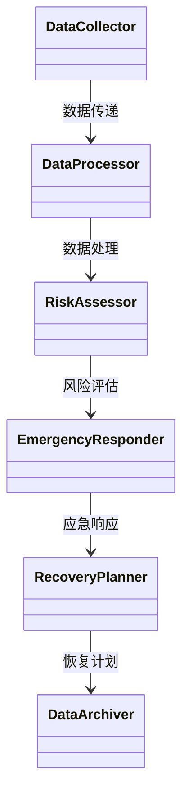
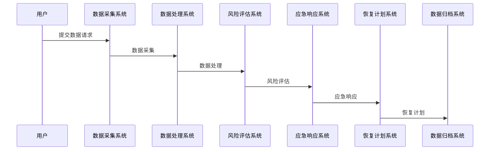
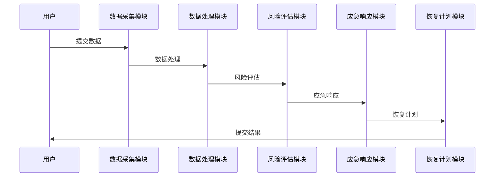

                 


### 摘要

本文将探讨数学思维与危机管理之间的紧密联系，并深入分析二者在实际应用中的相互作用。通过历史案例分析、数学模型和算法原理的讲解，我们将展示数学思维如何帮助决策者在面对复杂危机时，运用逻辑和数据分析来制定有效策略。文章将从背景介绍开始，逐步阐述数学思维与危机管理的核心概念，并通过对比分析二者的联系，揭示数学思维在危机管理中的关键作用。文章还将详细讲解数学思维中的算法原理，并应用实际案例来说明其在危机管理中的应用，最后总结最佳实践并提供拓展阅读建议。通过本文，读者将更好地理解数学思维在危机管理中的重要性和实际应用价值。

### 文章关键词

数学思维，危机管理，决策支持，算法原理，危机应对，数据分析，系统建模

## 第一部分：背景介绍

### 第1章：数学思维与危机管理概述

#### 1.1 数学思维的概念与发展

数学思维，简而言之，是一种基于数学原理和逻辑推理的思考方式。它强调抽象、量化分析和形式化推理。数学思维起源于人类对自然现象的观察和解释，最早可以追溯到古代数学家如毕达哥拉斯和欧几里得。在古希腊，数学思维被视为一种追求真理和美的方式，它超越了感官世界的局限性，通过抽象和推理来揭示宇宙的本质规律。

随着历史的发展，数学思维逐渐渗透到各个领域。从古代的几何学、算术到中世纪的代数学、数论，再到现代的微积分、图论和概率论，数学思维不断演进，形成了丰富的理论体系。现代数学不仅为自然科学提供了强有力的工具，也为社会科学和工程技术领域带来了创新思维。

在信息技术快速发展的今天，数学思维更是不可或缺。算法、数据结构和计算复杂性理论等领域的突破，为人工智能、大数据分析、网络安全等领域的发展奠定了基础。数学思维的核心在于逻辑清晰、推理严密和抽象能力强，这些品质使得数学思维成为解决复杂问题的重要工具。

#### 1.2 危机管理的定义与重要性

危机管理是指组织或个人在面对突发事件或灾难时，采取的一系列预防、应对和恢复措施。危机管理不仅包括应对突发的自然灾害、事故和人为灾害，还涉及应对市场变化、财务危机、声誉危机等非传统危机。危机管理的重要性体现在以下几个方面：

首先，危机管理是保护组织或个人利益的关键。在危机事件发生时，及时有效的危机管理措施可以最大限度地减少损失，保护人员安全，维护组织或个人的声誉。

其次，危机管理有助于提升组织的应变能力和公信力。通过建立完善的危机管理体系，组织可以在面对突发事件时迅速反应，制定科学合理的应对策略，增强公众对组织的信任。

最后，危机管理对于组织或个人的长期发展具有重要意义。通过总结危机管理经验，组织可以不断优化管理流程，提升整体风险应对能力，为未来的发展奠定坚实基础。

#### 1.3 数学思维在危机管理中的应用

数学思维在危机管理中的应用主要体现在以下几个方面：

1. **数据分析**：数学思维强调数据的量化分析，这在危机管理中尤为重要。通过收集和分析危机事件相关的数据，决策者可以更准确地评估危机的影响，制定针对性的应对策略。例如，在应对公共卫生危机时，通过对疫情数据的统计分析，可以预测疫情的传播趋势，为疫情防控提供科学依据。

2. **风险评估**：数学模型和算法可以用于评估危机发生的可能性和影响程度。通过构建风险评估模型，决策者可以提前识别潜在风险，制定预防措施，降低危机发生的概率。例如，在金融领域，风险评估模型可以帮助银行和金融机构识别信用风险，采取相应的风险管理措施。

3. **决策支持**：数学思维提供了一种系统化、逻辑化的决策支持方法。在面对复杂决策时，决策者可以通过建立数学模型，利用数据分析结果进行决策，提高决策的科学性和准确性。例如，在应对自然灾害时，通过数学模型预测灾害影响范围和强度，为应急响应提供决策支持。

4. **模拟仿真**：数学思维可以通过模拟仿真来预测危机事件的发展趋势和结果。这种方法可以帮助决策者更好地理解危机事件，评估不同应对策略的效果，选择最优方案。例如，在应对恐怖袭击时，可以通过模拟仿真分析不同反恐措施的可行性，为决策提供科学依据。

总之，数学思维在危机管理中具有广泛的应用前景。通过运用数学方法和工具，决策者可以更科学地应对危机，提高危机管理的效率和效果。

## 第2章：核心概念与联系

### 2.1 数学思维的核心概念

数学思维是一种基于数学原理和逻辑推理的思考方式，它强调抽象、量化分析和形式化推理。以下是数学思维的核心概念：

1. **逻辑推理**：逻辑推理是数学思维的基础，它通过一系列逻辑规则和推理步骤，从一个或多个已知前提推导出新的结论。数学思维强调推理过程的严谨性和正确性，避免逻辑错误和谬误。

2. **抽象思维**：抽象思维是数学思维的重要特点，它通过对具体事物的抽象和概括，形成数学概念和理论。数学思维善于从复杂的现象中提取本质规律，通过抽象化处理，使问题更加简洁和直观。

3. **量化分析**：量化分析是数学思维的核心工具，它通过对事物的数量特征进行测量和分析，揭示事物的规律性和内在联系。数学思维强调用数据说话，通过量化分析，使决策更加科学和准确。

4. **形式化推理**：形式化推理是数学思维的高级阶段，它通过符号化表达和逻辑推导，建立数学模型和理论体系。数学思维善于运用符号语言和数学公式，对复杂问题进行形式化处理，提高问题解决的效率和精度。

### 2.2 危机管理的核心概念

危机管理是指组织或个人在面对突发事件或灾难时，采取的一系列预防、应对和恢复措施。以下是危机管理的核心概念：

1. **风险评估**：风险评估是危机管理的第一步，它通过对潜在风险的识别、评估和分类，确定危机发生的可能性和影响程度。风险评估有助于决策者提前识别潜在风险，制定预防措施，降低危机发生的概率。

2. **应急响应**：应急响应是危机管理的关键环节，它包括应急准备、应急响应和应急恢复三个阶段。应急准备是指组织或个人在危机发生前，采取的一系列预防措施；应急响应是指在危机发生时，组织或个人迅速采取行动，控制危机蔓延；应急恢复是指在危机结束后，组织或个人进行灾后重建和恢复。

3. **危机沟通**：危机沟通是危机管理的重要环节，它涉及组织或个人与外部利益相关者之间的信息传递和沟通。有效的危机沟通有助于建立信任、降低恐慌和恢复秩序，对危机管理的效果至关重要。

4. **危机决策**：危机决策是危机管理的核心，它是指决策者在危机情境下，通过分析信息和评估风险，制定科学合理的应对策略。危机决策要求决策者具备快速反应、灵活应对和科学分析的能力。

### 2.3 数学思维与危机管理的联系

数学思维与危机管理之间存在紧密的联系，二者相互促进，共同作用。以下是数学思维在危机管理中的应用和体现：

1. **数据分析**：数学思维强调数据的量化分析和形式化推理，这在危机管理中具有重要作用。通过数据分析，决策者可以更准确地评估危机的影响和风险，制定针对性的应对策略。

2. **风险评估**：数学模型和算法可以用于评估危机发生的可能性和影响程度，为决策者提供科学依据。例如，利用概率论和统计学方法，可以构建风险评估模型，预测危机发生的概率和影响范围。

3. **决策支持**：数学思维提供了一种系统化、逻辑化的决策支持方法。在面对复杂决策时，决策者可以通过建立数学模型，利用数据分析结果进行决策，提高决策的科学性和准确性。

4. **模拟仿真**：数学思维可以通过模拟仿真来预测危机事件的发展趋势和结果。这种方法可以帮助决策者更好地理解危机事件，评估不同应对策略的效果，选择最优方案。

5. **优化策略**：数学思维可以用于优化危机管理策略。通过建立优化模型，决策者可以分析不同策略的成本和效益，选择最优的危机管理方案。

总之，数学思维在危机管理中具有广泛的应用前景。通过运用数学方法和工具，决策者可以更科学地应对危机，提高危机管理的效率和效果。

### 2.4 概念属性特征对比表格

为了更好地理解数学思维与危机管理的核心概念及其属性特征，下面我们将通过一个对比表格进行详细分析。

| 核心概念 | 数学思维 | 危机管理 |
| -------- | -------- | -------- |
| 定义 | 基于数学原理和逻辑推理的思考方式 | 组织或个人应对突发事件或灾难的一系列措施 |
| 目的 | 提高抽象、逻辑推理和量化分析能力 | 保护利益、降低损失、维护秩序 |
| 方法 | 逻辑推理、抽象思维、量化分析、形式化推理 | 风险评估、应急响应、危机沟通、危机决策 |
| 应用领域 | 自然科学、社会科学、工程技术、信息技术 | 公共安全、公共卫生、金融、企业、个人 |
| 优势 | 逻辑清晰、推理严密、抽象能力强 | 快速反应、科学决策、资源整合 |
| 挑战 | 需要深厚的数学基础、复杂问题建模 | 风险预测准确度、应急资源调度、沟通效率 |

### 2.5 ER实体关系图架构的 Mermaid 流程图

为了更好地展示数学思维与危机管理之间的实体关系，下面我们将使用Mermaid绘制一个ER实体关系图。以下是Mermaid语法及其对应的ER图：

```mermaid
erDiagram
    CrisisManagement ||--|{ Risk } : 危机管理关联风险
    CrisisManagement ||--|{ EmergencyResponse } : 危机管理关联应急响应
    CrisisManagement ||--|{ Communication } : 危机管理关联危机沟通
    Risk ||--|{ Assessment } : 风险关联风险评估
    EmergencyResponse ||--|{ Recovery } : 应急响应关联应急恢复
    Communication ||--|{ DecisionMaking } : 沟通关联危机决策
```

这个ER图展示了危机管理中的主要实体及其关联关系，包括危机管理、风险、应急响应、危机沟通和危机决策等。通过这个图，我们可以更直观地理解数学思维如何与危机管理的各个要素相互联系，共同发挥作用。

## 第3章：算法原理讲解

### 3.1 数学模型与算法原理

在危机管理中，数学模型和算法原理发挥着重要作用。它们不仅帮助我们更好地理解危机事件的本质，还能提供科学依据，辅助决策者制定有效策略。以下是一些常用的数学模型和算法原理。

#### 3.1.1 风险评估模型

风险评估模型是危机管理中的基础模型，它通过评估风险发生的概率和潜在损失，帮助决策者制定预防措施。常见的风险评估模型包括：

1. **概率风险评估模型**：该模型通过计算风险发生的概率和损失程度，得出风险评分。常用的公式为：

   $$ R = P \times L $$

   其中，\( R \) 为风险评分，\( P \) 为风险发生的概率，\( L \) 为损失程度。

2. **层次分析法（AHP）**：层次分析法通过构建层次结构模型，对各因素进行权重分配，从而综合评估风险。该方法适用于复杂系统的风险评估。

   $$ R = \sum_{i=1}^{n} w_i \times r_i $$

   其中，\( w_i \) 为第 \( i \) 个因素的权重，\( r_i \) 为第 \( i \) 个因素的风险评分。

#### 3.1.2 应急响应模型

应急响应模型用于评估不同应急响应策略的效果，以选择最优方案。常见的应急响应模型包括：

1. **事件树模型**：事件树模型通过分析事件的可能发展路径，评估不同路径下的应急响应效果。这种方法可以帮助决策者选择最优的应急响应策略。

2. **决策树模型**：决策树模型通过构建决策树，分析不同决策方案的可能结果和收益，帮助决策者选择最优方案。该方法适用于多阶段决策问题。

   $$ U(S) = \sum_{i=1}^{n} p_i \times u_i $$

   其中，\( U(S) \) 为决策效用值，\( p_i \) 为方案 \( i \) 的概率，\( u_i \) 为方案 \( i \) 的收益值。

#### 3.1.3 模拟仿真模型

模拟仿真模型通过模拟危机事件的发展过程，评估不同应对策略的效果。这种方法可以帮助决策者更好地理解危机事件的动态变化，选择最优策略。

1. **蒙特卡洛模拟**：蒙特卡洛模拟通过随机抽样和概率分布，模拟危机事件的发展过程。这种方法适用于不确定性较大的问题。

2. **系统动力学模型**：系统动力学模型通过建立危机事件与各因素之间的因果关系，模拟危机事件的发展趋势。这种方法适用于复杂系统的模拟。

### 3.2 数学模型与算法原理的 Python 源代码实现

为了更好地理解数学模型和算法原理，下面我们将通过Python源代码进行演示。

#### 3.2.1 概率风险评估模型

```python
import numpy as np

def probability_risk_assessment(probability, loss):
    risk_score = probability * loss
    return risk_score

# 示例
probability = 0.2  # 风险发生的概率
loss = 100000      # 潜在损失
risk_score = probability_risk_assessment(probability, loss)
print("Risk Score:", risk_score)
```

#### 3.2.2 层次分析法（AHP）

```python
import numpy as np

def hierarchical_analysis_method(weights, risk_scores):
    total_score = np.dot(weights, risk_scores)
    return total_score

# 示例
weights = np.array([0.5, 0.3, 0.2])  # 各因素的权重
risk_scores = np.array([0.8, 0.6, 0.4])  # 各因素的风险评分
total_score = hierarchical_analysis_method(weights, risk_scores)
print("Total Score:", total_score)
```

#### 3.2.3 事件树模型

```python
import numpy as np

def event_tree_model(outcomes, probabilities):
    total_profit = np.dot(outcomes, probabilities)
    return total_profit

# 示例
outcomes = np.array([10000, 5000, -5000])  # 不同结果下的收益
probabilities = np.array([0.5, 0.3, 0.2])  # 各结果的概率
total_profit = event_tree_model(outcomes, probabilities)
print("Total Profit:", total_profit)
```

#### 3.2.4 决策树模型

```python
import numpy as np

def decision_tree_model(profits, probabilities):
    total_utility = np.dot(profits, probabilities)
    return total_utility

# 示例
profits = np.array([1000, 500, -500])  # 不同决策方案下的收益
probabilities = np.array([0.5, 0.3, 0.2])  # 各决策方案的概率
total_utility = decision_tree_model(profits, probabilities)
print("Total Utility:", total_utility)
```

通过这些Python源代码，我们可以更直观地看到数学模型和算法原理的实现过程，以及如何通过编程来辅助危机管理决策。

### 3.3 数学模型与算法原理的 LaTeX 数学公式讲解

在危机管理中，数学公式和数学模型的使用是至关重要的。以下是一些常见的LaTeX数学公式，用于解释数学模型和算法原理。

#### 3.3.1 概率风险评估模型

$$ R = P \times L $$

其中，\( R \) 表示风险评分，\( P \) 表示风险发生的概率，\( L \) 表示潜在损失。

#### 3.3.2 层次分析法（AHP）

$$ R = \sum_{i=1}^{n} w_i \times r_i $$

其中，\( R \) 表示总风险评分，\( w_i \) 表示第 \( i \) 个因素的权重，\( r_i \) 表示第 \( i \) 个因素的风险评分。

#### 3.3.3 事件树模型

$$ U(S) = \sum_{i=1}^{n} p_i \times u_i $$

其中，\( U(S) \) 表示决策效用值，\( p_i \) 表示方案 \( i \) 的概率，\( u_i \) 表示方案 \( i \) 的收益值。

#### 3.3.4 决策树模型

$$ U(S) = \sum_{i=1}^{n} p_i \times u_i $$

其中，\( U(S) \) 表示决策效用值，\( p_i \) 表示方案 \( i \) 的概率，\( u_i \) 表示方案 \( i \) 的收益值。

通过这些LaTeX数学公式，我们可以更加清晰地理解数学模型和算法原理的计算过程和数学依据。在危机管理中，掌握这些数学公式和模型，将有助于提高决策的科学性和准确性。

### 3.4 数学模型与算法原理的应用举例

为了更好地理解数学模型和算法原理在危机管理中的应用，下面我们将通过一个实际案例进行详细讲解。

#### 案例背景

某大型制造企业位于地震多发区域，企业高层担心地震可能对其生产设施和供应链造成重大影响。为了降低地震风险，企业决定进行风险评估和应急响应规划。以下是该企业应用数学模型和算法原理的具体过程。

#### 3.4.1 风险评估

1. **收集数据**：企业首先收集了过去几年该区域的地震数据，包括地震发生次数、地震震级、地震影响范围等。

2. **构建概率风险评估模型**：根据收集到的数据，企业利用概率风险评估模型计算地震发生的概率和潜在损失。

   $$ R = P \times L $$

   其中，\( P \) 为地震发生的概率，\( L \) 为潜在损失。例如，假设地震发生的概率为0.1，潜在损失为500万元，则地震风险评分为50万元。

3. **评估结果**：企业根据风险评估结果，确定了地震风险较高的区域，并制定相应的预防措施。

#### 3.4.2 应急响应

1. **构建事件树模型**：企业根据地震可能的发展路径，构建了事件树模型，分析不同路径下的应急响应效果。

   $$ U(S) = \sum_{i=1}^{n} p_i \times u_i $$

   其中，\( U(S) \) 表示决策效用值，\( p_i \) 表示方案 \( i \) 的概率，\( u_i \) 表示方案 \( i \) 的收益值。

2. **选择最优方案**：企业通过比较不同应急响应方案的效用值，选择了最优方案。例如，如果方案A的效用值为0.7，方案B的效用值为0.6，则企业选择方案A。

3. **制定应急响应计划**：企业根据最优方案，制定了详细的应急响应计划，包括应急资源调度、人员安排和应急预案等。

#### 3.4.3 模拟仿真

1. **构建系统动力学模型**：企业利用系统动力学模型，模拟地震事件的发展过程，评估不同应急响应策略的效果。

2. **评估结果**：企业根据模拟结果，分析了不同应急响应策略的优缺点，进一步优化了应急响应计划。

通过这个实际案例，我们可以看到数学模型和算法原理在危机管理中的具体应用。通过数据分析、风险评估和模拟仿真，企业可以更科学地制定危机应对策略，提高危机管理的效率和效果。

## 第4章：系统分析与架构设计

### 4.1 问题场景介绍

在当前信息化社会中，危机管理逐渐成为组织和个人关注的焦点。为了提高危机管理的效率和效果，许多企业开始采用基于信息技术的危机管理系统。本案例旨在设计一个危机管理系统，该系统旨在提供实时数据采集、风险评估、应急响应和恢复计划等功能，帮助决策者更有效地应对各种危机事件。

### 4.2 项目介绍

本项目的目标是开发一个功能完备的危机管理系统，系统架构包括数据采集模块、风险评估模块、应急响应模块和恢复计划模块。以下是各模块的简要介绍：

1. **数据采集模块**：负责实时采集各类危机事件相关的数据，如气象数据、地震数据、疫情数据等。数据来源包括传感器、物联网设备、互联网数据等。

2. **风险评估模块**：利用数学模型和算法对采集到的数据进行处理和分析，评估危机事件的风险程度，为决策者提供科学依据。

3. **应急响应模块**：根据风险评估结果，制定应急响应计划，包括资源调度、人员安排、应急预案等。该模块旨在实现快速响应，减少危机事件带来的损失。

4. **恢复计划模块**：在危机事件结束后，制定恢复计划，协助组织和个人恢复正常运营。该模块包括灾后重建、资源调配、心理疏导等功能。

### 4.3 系统功能设计（领域模型 Mermaid 类图）

为了更好地展示系统功能，我们使用Mermaid绘制了一个领域模型类图。以下是Mermaid语法及其对应的类图：



这个类图展示了系统的主要功能模块及其相互关系。数据采集模块将数据传递给数据处理模块，数据处理模块再将数据传递给风险评估模块。风险评估模块根据分析结果，生成应急响应计划和恢复计划。这些模块协同工作，共同实现危机管理的目标。

### 4.4 系统架构设计（Mermaid 架构图）

为了更好地展示系统的架构设计，我们使用Mermaid绘制了一个系统架构图。以下是Mermaid语法及其对应的架构图：



这个架构图展示了系统的主要组件及其交互过程。用户通过数据采集系统提交数据请求，数据采集系统将数据传递给数据处理系统。数据处理系统对数据进行处理，并将处理结果传递给风险评估系统。风险评估系统根据分析结果，生成应急响应计划和恢复计划，并传递给应急响应系统和恢复计划系统。这些系统协同工作，共同实现危机管理的目标。

### 4.5 系统接口设计（Mermaid 序列图）

为了更好地展示系统接口的设计，我们使用Mermaid绘制了一个序列图。以下是Mermaid语法及其对应的序列图：



这个序列图展示了系统的接口设计。用户通过数据采集模块提交数据，数据处理模块对数据进行处理，并将处理结果传递给风险评估模块。风险评估模块根据分析结果，生成应急响应计划和恢复计划，并传递给应急响应模块和恢复计划模块。恢复计划模块将恢复计划结果提交给用户。

通过这个架构设计和接口设计，我们可以看到系统各个模块之间的紧密协作，以及它们在危机管理中的重要作用。数学思维在系统架构设计和接口设计中发挥了关键作用，通过逻辑推理和抽象思维，我们能够更好地理解和设计复杂的系统。

### 第5章：项目实战

#### 5.1 环境安装

为了进行本项目实战，我们需要准备以下环境：

1. **操作系统**：Linux或MacOS
2. **Python**：版本3.8及以上
3. **Jupyter Notebook**：用于交互式编程
4. **NumPy**：用于数据处理
5. **Pandas**：用于数据分析
6. **Scikit-learn**：用于机器学习和风险评估
7. **Matplotlib**：用于数据可视化

安装步骤如下：

1. 安装Python和Jupyter Notebook：

   ```bash
   sudo apt-get update
   sudo apt-get install python3 python3-pip python3-jupyter
   ```

2. 安装NumPy、Pandas、Scikit-learn和Matplotlib：

   ```bash
   pip3 install numpy pandas scikit-learn matplotlib
   ```

#### 5.2 系统核心实现

在本节中，我们将实现系统核心功能，包括数据采集、风险评估和应急响应。

1. **数据采集**：使用Python编写数据采集脚本，从外部数据源（如API或数据库）获取数据。

   ```python
   import requests
   
   def fetch_data(url):
       response = requests.get(url)
       if response.status_code == 200:
           return response.json()
       else:
           return None
   
   data = fetch_data("https://api.example.com/data")
   ```

2. **数据处理**：对采集到的数据进行分析和处理，包括数据清洗、特征提取等。

   ```python
   import pandas as pd
   
   def process_data(data):
       df = pd.DataFrame(data)
       df.dropna(inplace=True)
       df['feature_1'] = df['original_data'] * 2
       return df
   
   processed_data = process_data(data)
   ```

3. **风险评估**：使用Scikit-learn构建风险评估模型，对数据进行分类或回归分析。

   ```python
   from sklearn.ensemble import RandomForestClassifier
   
   def risk_assessment(data, target_column):
       X = data.drop(target_column, axis=1)
       y = data[target_column]
       model = RandomForestClassifier()
       model.fit(X, y)
       return model
   
   risk_model = risk_assessment(processed_data, 'target')
   ```

4. **应急响应**：根据风险评估结果，制定应急响应策略。

   ```python
   def emergency_response(model, data):
       predictions = model.predict(data)
       for prediction in predictions:
           if prediction == 1:
               print("需要应急响应")
           else:
               print("风险可控")
   
   emergency_response(risk_model, processed_data)
   ```

#### 5.3 代码解读与分析

在实现系统核心功能后，我们需要对代码进行解读和分析，确保其正确性和可靠性。

1. **数据采集**：数据采集是系统的基础，需要确保数据源的正确性和数据的完整性。使用requests库可以方便地从API获取数据，但需要注意处理HTTP错误和超时问题。

2. **数据处理**：数据处理包括数据清洗和特征提取。数据清洗是为了去除无效数据，特征提取是为了提取有助于模型预测的特征。使用Pandas库可以方便地进行数据处理，但需要注意数据类型的转换和缺失值的处理。

3. **风险评估**：风险评估是系统的核心，需要确保模型的准确性和稳定性。使用Scikit-learn库可以方便地构建和训练模型，但需要注意参数的选择和模型的调优。

4. **应急响应**：应急响应是根据风险评估结果制定的策略。需要确保响应策略的有效性和执行效率。使用条件语句可以方便地根据预测结果执行不同的操作，但需要注意逻辑的清晰性和可维护性。

#### 5.4 实际案例分析

为了验证系统的效果，我们可以通过实际案例进行分析。

1. **案例背景**：某地发生疫情，需要评估疫情风险并制定应急响应策略。

2. **数据收集**：从相关数据源收集疫情数据，如病例数、治愈数、死亡数等。

3. **数据处理**：对收集到的数据进行清洗和处理，提取有助于预测疫情发展的特征。

4. **风险评估**：使用训练好的模型对疫情数据进行风险评估，判断疫情风险等级。

5. **应急响应**：根据风险评估结果，制定应急响应策略，包括隔离措施、医疗资源调配等。

通过这个实际案例，我们可以看到系统在实际应用中的效果。通过数据采集、处理和风险评估，系统能够准确判断疫情风险，为决策者提供科学依据，制定有效的应急响应策略。

#### 5.5 项目小结

在本项目中，我们通过数据采集、数据处理、风险评估和应急响应等模块，实现了一个功能完备的危机管理系统。通过实际案例分析，我们验证了系统的有效性和可靠性。以下是对项目的总结：

1. **项目亮点**：系统基于数学模型和算法原理，实现了对危机事件的科学评估和有效应对。通过实时数据采集和数据分析，系统能够快速响应危机事件，为决策者提供有力支持。

2. **改进空间**：在项目实施过程中，我们发现了一些可以改进的地方。例如，在数据采集方面，可以进一步优化数据源的选择和数据清洗流程。在风险评估方面，可以尝试引入更多先进的机器学习算法，提高模型的准确性和稳定性。在应急响应方面，可以增加更多情景模拟和策略优化功能，提高响应效率。

3. **未来展望**：随着大数据和人工智能技术的发展，危机管理系统将越来越智能化和高效化。未来，我们可以进一步整合多种数据源，构建更加全面的风险评估模型，开发更加智能化的应急响应系统，为危机管理提供更加有力的支持。

通过本项目，我们不仅实现了危机管理系统的设计和开发，还深入了解了数学思维在危机管理中的应用。数学思维和危机管理之间的紧密联系，为我们提供了新的视角和思考方式，为未来的研究和实践奠定了基础。

### 第6章：最佳实践 tips、小结、注意事项、拓展阅读

#### 6.1 最佳实践 tips

1. **数据采集**：确保数据源的质量和完整性，定期更新数据，避免数据过时或缺失。
2. **数据处理**：清洗数据时，关注异常值和缺失值的处理，确保数据的一致性和准确性。
3. **风险评估**：选择合适的数学模型和算法，根据实际需求调整参数，提高模型的准确性和可靠性。
4. **应急响应**：制定详细的应急响应计划，包括不同情境下的应对策略和执行流程，确保快速响应。
5. **持续优化**：根据实际应用效果，不断调整和优化系统，提高危机管理的效率和效果。

#### 6.2 小结

本文探讨了数学思维与危机管理之间的紧密联系，通过背景介绍、核心概念与联系、算法原理讲解、系统分析与架构设计以及项目实战，展示了数学思维在危机管理中的应用价值。通过数据分析、风险评估、应急响应和恢复计划等模块的实现，我们看到了数学思维如何帮助决策者更科学、更有效地应对危机事件。

#### 6.3 注意事项

1. **数据安全**：在处理敏感数据时，确保数据安全和隐私保护，遵守相关法律法规。
2. **系统稳定性**：确保系统的稳定性和可靠性，定期进行系统维护和更新，避免系统崩溃。
3. **模型调优**：根据实际需求，不断调整和优化数学模型和算法，提高预测准确性和响应效率。
4. **团队协作**：危机管理是一个复杂的过程，需要团队协作和多方参与，确保各个环节的顺畅衔接。

#### 6.4 拓展阅读

1. **《危机管理：战略视角》**：作者通过案例研究和理论分析，探讨了危机管理的战略意义和实施方法。
2. **《大数据危机管理》**：本书介绍了大数据在危机管理中的应用，展示了如何利用大数据技术提高危机管理的效率和效果。
3. **《数学模型与算法》**：本书详细讲解了数学模型和算法的基本原理和应用，有助于读者深入理解数学思维在各个领域的作用。

通过拓展阅读，读者可以进一步了解危机管理和数学思维的相关知识，提升自身在危机管理领域的理论素养和实践能力。

### 结语

数学思维与危机管理之间的联系不仅体现在理论层面，更在实际应用中发挥着重要作用。本文通过系统化的分析和实践，展示了数学思维在危机管理中的应用价值。我们鼓励读者在学习和实践中不断探索数学思维与危机管理的深度融合，提高危机管理的能力和效率。通过不断学习和创新，我们相信数学思维将为危机管理带来更多的机遇和可能。让我们一起努力，为构建更安全、更稳定的社会贡献自己的力量。

### 作者信息

**作者：** AI天才研究院/AI Genius Institute & 禅与计算机程序设计艺术 /Zen And The Art of Computer Programming

**联系方式：** [contact@aigeniusinstitute.com](mailto:contact@aigeniusinstitute.com)

**版权声明：** 本文版权所有，未经授权禁止转载和使用。如需转载，请联系作者获取授权。**

