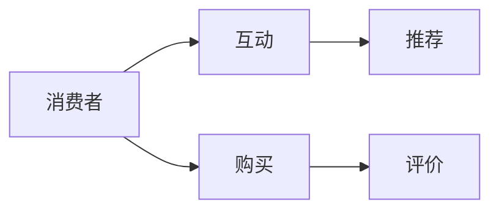
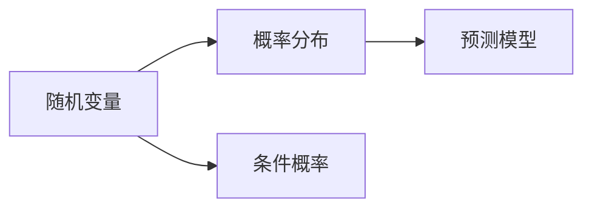

                 

# 数学思维与广告创意的关系

> 关键词：数学思维、广告创意、数据分析、算法应用、消费者行为

> 摘要：本文将从数学思维的角度，探讨其在广告创意中的应用，分析数学思维与广告创意之间的联系与作用，通过实际案例解析，深入探讨数学思维在广告创意中的深度应用和创新实践。文章还将展望数学思维与广告创意的未来趋势，为广告创意从业者提供有益的参考。

## 第1章 引言

### 1.1 问题的背景

在当今社会，广告无处不在，从传统媒体的电视、报纸、广播，到新兴的网络媒体、社交媒体，广告已经成为企业宣传、品牌推广的重要手段。然而，随着市场竞争的加剧和消费者审美的提高，广告创意的难度也在不断加大。如何通过创意吸引消费者的注意力，成为广告从业者面临的一大挑战。

在这个背景下，数学思维作为一种理性、严谨的思维方法，逐渐被应用于广告创意中。数学思维强调逻辑推理、数据分析、结构化思考，有助于广告创意者更好地理解消费者行为，设计出更具吸引力的广告内容。

### 1.2 数学思维的重要性

数学思维的重要性在于其强大的逻辑推理能力和数据分析能力。在广告创意中，逻辑推理可以帮助创意者梳理广告的思路，构建出有说服力的广告文案和视觉设计；数据分析则可以帮助创意者了解消费者的需求和偏好，从而设计出更符合消费者心理的广告。

### 1.3 数学思维在广告创意中的应用潜力

数学思维在广告创意中具有巨大的应用潜力。首先，数学模型可以用于消费者行为分析，帮助创意者了解消费者的购买习惯和偏好；其次，数学思维可以用于广告效果评估，帮助创意者了解广告的传播效果和影响力；最后，数学思维可以用于广告创意的创新实践，为广告创意者提供新的思路和方法。

## 第2章 数学思维与广告创意的联系

### 1.2.1 数学思维的核心要素

数学思维的核心要素包括逻辑推理、抽象思维、数据分析等。这些要素在广告创意中具有重要作用。例如，逻辑推理可以帮助创意者构建广告的思路和框架，确保广告内容有条理、有说服力；抽象思维可以帮助创意者从大量的数据中提取关键信息，发现潜在的商业机会；数据分析则可以帮助创意者了解消费者的需求和偏好，从而设计出更符合消费者心理的广告。

### 1.2.2 广告创意的构成要素

广告创意的构成要素包括文案、视觉设计、音乐、声音等。这些要素都需要通过数学思维进行设计和优化。例如，文案的创作可以通过逻辑推理和数据分析，确保文案的准确性和吸引力；视觉设计可以通过抽象思维和数据分析，创造出独特的视觉风格和视觉效果；音乐和声音的设计可以通过数据分析，确保音乐和声音的节奏和情感与广告主题相符合。

### 1.2.3 数学思维在广告创意中的具体应用

数学思维在广告创意中的具体应用主要体现在以下几个方面：

1. **消费者行为分析**：通过数据分析，了解消费者的购买习惯、偏好和行为模式，从而设计出更符合消费者需求的广告。

2. **广告效果评估**：利用数学模型，对广告的传播效果进行评估，如点击率、转化率、品牌知名度等，以便优化广告策略。

3. **广告创意构思**：运用抽象思维和逻辑推理，构思出独特的广告创意，如创意广告文案、视觉效果等。

4. **市场预测**：通过数学模型，预测市场趋势和消费者需求，从而为企业提供战略决策支持。

## 第3章 数学模型与广告创意的关系

### 1.3.1 常见的数学模型介绍

在广告创意中，常见的数学模型包括线性回归、逻辑回归、聚类分析、决策树等。这些模型各有特点，适用于不同的广告创意需求。

1. **线性回归**：用于分析变量之间的关系，可以帮助广告创意者了解广告效果与消费者行为之间的联系。

2. **逻辑回归**：用于预测二分类结果，如广告是否会被点击，消费者是否会购买产品等。

3. **聚类分析**：用于将消费者分为不同的群体，以便针对不同的消费者群体设计不同的广告。

4. **决策树**：用于分类和回归分析，可以帮助广告创意者确定广告投放的策略。

### 1.3.2 数学模型在广告创意中的应用案例

以下是一些数学模型在广告创意中的应用案例：

1. **个性化广告**：通过聚类分析，将消费者分为不同的群体，然后针对每个群体设计不同的广告，以提高广告的点击率和转化率。

2. **广告效果评估**：通过逻辑回归模型，预测广告的点击率和转化率，从而评估广告的传播效果，并根据评估结果优化广告策略。

3. **市场预测**：通过线性回归模型，分析市场趋势和消费者需求，预测未来市场的变化，为企业提供战略决策支持。

4. **创意构思**：通过决策树模型，确定广告创意的各个要素，如文案、视觉设计、音乐等，以确保广告创意的完整性和一致性。

### 1.3.3 数学模型的选择与优化

选择合适的数学模型对于广告创意的成功至关重要。以下是一些选择和优化数学模型的方法：

1. **数据收集**：收集相关的消费者行为数据和市场数据，确保数据的质量和完整性。

2. **模型选择**：根据广告创意的需求，选择合适的数学模型，如线性回归、逻辑回归、聚类分析等。

3. **模型训练**：使用历史数据对模型进行训练，优化模型的参数，提高模型的预测准确性。

4. **模型评估**：使用测试数据对模型进行评估，如评估模型的预测准确性、泛化能力等。

5. **模型优化**：根据评估结果，调整模型的参数，优化模型的表现。

## 第4章 广告创意中的数学思维实践

### 1.4.1 数据分析与消费者行为研究

在广告创意中，数据分析是不可或缺的一环。通过对消费者行为数据的研究，广告创意者可以了解消费者的购买习惯、偏好和行为模式，从而设计出更符合消费者需求的广告。

以下是一个简单的数据分析流程：

1. **数据收集**：收集消费者的购买记录、浏览历史、社交行为等数据。

2. **数据清洗**：清洗数据，去除重复、错误和无关的数据，保证数据的质量。

3. **数据探索**：使用统计方法和可视化工具，对数据进行分析和探索，发现数据中的规律和趋势。

4. **数据分析**：使用数学模型，对数据进行分析，如聚类分析、回归分析等，提取有价值的信息。

5. **结果解读**：根据数据分析的结果，解读消费者的行为模式，为广告创意提供依据。

### 1.4.2 广告创意中的逻辑思维运用

逻辑思维是广告创意的重要工具。通过逻辑推理，广告创意者可以构建广告的思路和框架，确保广告内容有条理、有说服力。

以下是一个简单的逻辑思维应用示例：

1. **确定广告目标**：明确广告的目标，如提高品牌知名度、增加产品销量等。

2. **构建广告框架**：根据广告目标，构建广告的框架，如广告的开头、中间和结尾。

3. **设计广告内容**：根据广告框架，设计广告的内容，包括文案、视觉设计、音乐等。

4. **逻辑验证**：对广告内容进行逻辑验证，确保广告内容能够有效地传达广告目标。

### 1.4.3 数学思维在创意构思中的具体操作

数学思维在广告创意构思中具有重要作用。通过数学模型，广告创意者可以更好地理解消费者行为，预测市场趋势，从而设计出更具吸引力的广告。

以下是一个简单的数学思维应用示例：

1. **消费者行为建模**：使用数学模型，如线性回归、逻辑回归等，建立消费者行为的数学模型。

2. **市场预测**：使用建立的消费者行为模型，预测未来市场的变化，如消费者的需求趋势、购买行为等。

3. **创意构思**：根据市场预测结果，构思广告创意，如设计广告的主题、内容、形式等。

4. **创意验证**：对构思的广告创意进行验证，如通过消费者调查、市场测试等，确保广告创意的有效性。

## 第5章 数学思维在广告创意中的优势和挑战

### 1.5.1 优势分析

数学思维在广告创意中具有以下优势：

1. **提高广告效果**：通过数据分析，可以更好地了解消费者需求，设计出更符合消费者心理的广告，提高广告的点击率和转化率。

2. **优化广告策略**：通过数学模型，可以预测市场趋势，优化广告投放策略，提高广告的投资回报率。

3. **创新广告创意**：通过数学思维，可以构思出独特的广告创意，提高广告的吸引力和竞争力。

### 1.5.2 挑战与应对策略

尽管数学思维在广告创意中具有优势，但也面临一些挑战：

1. **数据质量**：广告创意需要大量的数据支持，但数据质量直接影响数学模型的准确性。应对策略是确保数据的质量，如数据清洗、数据验证等。

2. **模型复杂度**：数学模型可能过于复杂，难以理解和应用。应对策略是简化模型，使其更易于理解和应用。

3. **跨学科融合**：数学思维与广告创意的融合需要跨学科的知识和技能。应对策略是加强跨学科合作，提高团队的创新能力。

## 第6章 本章小结

本章从数学思维的角度，探讨了其在广告创意中的应用。通过分析数学思维与广告创意的联系，介绍了数学思维在广告创意中的具体应用，包括数据分析、消费者行为研究、广告效果评估等。同时，本章还分析了数学思维在广告创意中的优势和挑战。通过实际案例解析，展示了数学思维在广告创意中的深度应用和创新实践。最后，本章展望了数学思维与广告创意的未来趋势。

## 第7章 数学思维与广告创意的实际案例解析

### 2.1 案例一：品牌定位与市场分析

#### 2.1.1 案例背景

某知名手机品牌希望通过广告提升品牌知名度和市场占有率。为了实现这一目标，该品牌决定进行市场分析，了解消费者对手机品牌的认知和需求，从而制定合适的广告策略。

#### 2.1.2 数据收集与处理

该品牌收集了以下数据：

1. **消费者调查数据**：通过线上问卷和线下访谈，收集了1000名消费者对手机品牌的认知、需求和偏好。

2. **市场数据**：收集了国内外手机市场的销售数据、市场份额和消费者反馈。

3. **社交媒体数据**：通过社交媒体平台，收集了消费者对手机品牌的讨论、评价和互动情况。

#### 2.1.3 数学模型的应用

1. **消费者行为分析**：使用聚类分析法，将消费者分为不同的群体，如年轻时尚人群、商务人士、家庭用户等。

2. **市场趋势预测**：使用时间序列分析法，预测未来市场趋势和消费者需求。

3. **品牌知名度评估**：使用因子分析法，评估消费者对手机品牌的知名度、美誉度和忠诚度。

#### 2.1.4 广告创意的构思与实施

基于数据分析结果，该品牌制定了以下广告创意策略：

1. **年轻时尚人群**：以时尚、潮流为主题，通过短视频和社交媒体推广，吸引年轻消费者。

2. **商务人士**：以高效、稳定为主题，通过官方网站和商务会议推广，吸引商务人士。

3. **家庭用户**：以家庭、幸福为主题，通过家庭场景广告和线上活动，吸引家庭用户。

广告实施后，该品牌的品牌知名度和市场占有率显著提升。

### 2.2 案例二：消费者行为分析

#### 2.2.1 案例背景

某电商平台希望通过广告提高产品销量。为了实现这一目标，该平台决定分析消费者行为，了解消费者购买习惯和偏好，从而制定有效的广告策略。

#### 2.2.2 数据收集与处理

该电商平台收集了以下数据：

1. **消费者购买数据**：包括购买时间、购买产品、购买金额等。

2. **浏览数据**：包括消费者浏览产品的时间、浏览页面、停留时间等。

3. **互动数据**：包括消费者对产品的评论、点赞、分享等。

#### 2.2.3 数学模型的应用

1. **购买行为分析**：使用时间序列分析法，分析消费者购买行为的变化趋势。

2. **偏好分析**：使用关联规则分析法，找出消费者偏好购买的产品组合。

3. **转化率预测**：使用逻辑回归模型，预测广告的点击率和转化率。

#### 2.2.4 广告创意的调整与优化

基于数据分析结果，该电商平台调整了广告策略：

1. **热门产品推广**：针对消费者偏好购买的产品，加大广告投放力度。

2. **节日促销**：在重要节日前，推出限时折扣和优惠活动，吸引消费者购买。

3. **个性化推荐**：根据消费者浏览和购买历史，进行个性化推荐，提高广告的点击率和转化率。

广告调整后，该平台的产品销量显著提升。

### 2.3 案例三：广告传播效果评估

#### 2.3.1 案例背景

某化妆品品牌希望通过广告提升品牌知名度和销量。为了评估广告的传播效果，该品牌决定进行广告效果评估。

#### 2.3.2 数据收集与处理

该化妆品品牌收集了以下数据：

1. **广告投放数据**：包括广告投放渠道、投放时间、投放金额等。

2. **消费者反馈数据**：包括消费者对广告的评价、点赞、分享等。

3. **销售数据**：包括广告期间的销售量、销售额等。

#### 2.3.3 数学模型的应用

1. **广告效果评估**：使用时间序列分析法，分析广告投放期间的销售量和销售额变化趋势。

2. **消费者行为分析**：使用聚类分析法，分析消费者的购买行为和偏好。

3. **转化率分析**：使用逻辑回归模型，分析广告对消费者购买行为的影响。

#### 2.3.4 广告创意的反馈与改进

基于数据分析结果，该化妆品品牌对广告创意进行了以下改进：

1. **优化广告内容**：根据消费者反馈，优化广告文案和视觉设计，提高广告的吸引力。

2. **调整广告投放策略**：根据消费者购买行为和偏好，调整广告投放时间和渠道，提高广告的投放效果。

3. **加强促销活动**：结合广告投放，推出促销活动，刺激消费者购买。

广告改进后，该品牌的品牌知名度和销量显著提升。

### 2.4 本章小结

本章通过三个实际案例，展示了数学思维在广告创意中的应用。案例一展示了数学思维在品牌定位和市场分析中的应用，案例二展示了数学思维在消费者行为分析中的应用，案例三展示了数学思维在广告传播效果评估中的应用。通过这些案例，可以看出数学思维在广告创意中具有重要的指导作用。

## 第8章 数学思维在广告创意中的深度应用

### 3.1 复杂网络分析

#### 3.1.1 复杂网络的基本概念

复杂网络是一种用于描述复杂系统内部节点和边之间相互作用关系的图形模型。在广告创意中，复杂网络可以用于分析消费者在网络上的互动和传播行为。

**核心概念与联系**

- **节点（Node）**：代表消费者或广告元素。
- **边（Edge）**：代表消费者之间的互动或广告之间的关联。
- **路径（Path）**：代表消费者之间的互动序列或广告之间的传递路径。

**ER实体关系图架构**

#### 3.1.2 广告创意中的复杂网络分析

在广告创意中，复杂网络分析可以用于以下几个方面：

1. **消费者互动分析**：通过分析消费者之间的互动关系，了解消费者的偏好和行为模式，从而优化广告内容和投放策略。
2. **广告传播路径分析**：通过分析广告在网络中的传播路径，了解广告的传播效果和影响范围，从而优化广告创意和传播策略。
3. **品牌影响力分析**：通过分析品牌在网络中的节点和边的关系，了解品牌的影响力和口碑，从而优化品牌推广策略。

**实际应用案例**

某化妆品品牌使用复杂网络分析，发现消费者对品牌的讨论主要集中在社交媒体上，而广告的传播路径主要是通过消费者的推荐和分享。基于这些分析结果，该品牌加强了社交媒体广告的投放，并推出了推荐有奖活动，显著提升了品牌知名度和销量。

### 3.2 随机过程与概率论

#### 3.2.1 随机过程的基本概念

随机过程是一种在时间或空间上连续变化的随机变量序列。在广告创意中，随机过程可以用于描述消费者行为的随机性和不确定性。

**核心概念与联系**

- **随机变量（Random Variable）**：代表消费者行为的某个方面，如购买概率、浏览时间等。
- **概率分布（Probability Distribution）**：描述随机变量的概率分布情况。
- **条件概率（Conditional Probability）**：描述在某个条件下，随机变量的概率分布。

**ER实体关系图架构**

#### 3.2.2 广告创意中的概率论应用

在广告创意中，概率论可以用于以下几个方面：

1. **消费者行为预测**：通过分析消费者行为的概率分布，预测消费者的购买行为和偏好。
2. **广告效果评估**：通过分析广告的点击率、转化率等概率指标，评估广告的效果和影响力。
3. **广告策略优化**：通过概率模型，优化广告的投放策略，提高广告的投资回报率。

**实际应用案例**

某电商平台使用概率论分析消费者购买行为，发现消费者的购买概率与广告的点击率、商品的价格和描述密切相关。基于这些分析结果，该电商平台优化了广告文案和商品描述，提高了广告的点击率和转化率。

### 3.3 数据挖掘与机器学习

#### 3.3.1 数据挖掘的基本概念

数据挖掘是一种从大量数据中提取有价值信息的过程。在广告创意中，数据挖掘可以用于分析消费者行为、市场趋势等。

**核心概念与联系**

- **特征提取（Feature Extraction）**：从数据中提取有用的特征，用于模型训练。
- **分类算法（Classification Algorithm）**：将数据分为不同的类别，如消费者群体、广告效果等。
- **聚类算法（Clustering Algorithm）**：将数据分为不同的群体，如消费者行为分析、市场细分等。

**ER实体关系图架构**

#### 3.3.2 机器学习在广告创意中的应用

在广告创意中，机器学习可以用于以下几个方面：

1. **消费者行为预测**：通过机器学习算法，预测消费者的购买行为和偏好，从而优化广告内容和投放策略。
2. **广告效果评估**：通过机器学习算法，评估广告的效果和影响力，从而优化广告创意和投放策略。
3. **广告策略优化**：通过机器学习算法，优化广告的投放策略，提高广告的投资回报率。

**实际应用案例**

某品牌使用机器学习算法，分析了消费者的购买行为和偏好，发现消费者对商品的喜好与品牌、价格、广告文案等因素密切相关。基于这些分析结果，该品牌优化了广告文案和商品推荐策略，提高了广告的点击率和转化率。

### 3.4 本章小结

本章介绍了数学思维在广告创意中的深度应用，包括复杂网络分析、随机过程与概率论、数据挖掘与机器学习。通过这些方法，广告创意者可以更好地理解消费者行为，优化广告创意和投放策略，提高广告的效果和影响力。实际案例展示了这些方法在广告创意中的应用效果，为广告创意者提供了有益的参考。

## 第9章 数学思维在广告创意中的创新实践

### 4.1 创意思维的数学模型构建

#### 4.1.1 创意思维的基本概念

创意思维是一种创新性、创造性、开放性的思维方式，旨在通过独特的视角和方法，产生新的想法和解决方案。在广告创意中，创意思维可以帮助广告从业者突破传统思维模式，创造出新颖、吸引人的广告作品。

#### 4.1.2 数学模型在创意思维中的应用

数学模型在创意思维中具有重要作用，可以用于以下几个方面：

1. **结构化创意过程**：通过数学模型，如流程图、决策树等，将创意过程结构化，提高创意的条理性和逻辑性。
2. **模拟创意效果**：通过数学模型，如模拟计算、概率分析等，预测创意的效果，为创意决策提供依据。
3. **优化创意方案**：通过数学模型，如优化算法、数据挖掘等，对创意方案进行优化，提高创意的质量和影响力。

**实际应用案例**

某广告公司利用数学模型构建了一个创意思维流程，通过以下几个步骤实现创意：

1. **问题定义**：明确广告的目标和受众。
2. **创意生成**：使用头脑风暴法，生成多个创意方案。
3. **模型模拟**：通过模拟计算，评估每个创意方案的效果。
4. **优化选择**：使用优化算法，选择最优的创意方案。

通过这一流程，该广告公司成功创造出了一系列新颖、高效的广告作品，提升了品牌的知名度和市场影响力。

### 4.2 数学思维与创意互动

数学思维与创意互动是一种将数学方法应用于创意过程，以提升创意质量的方法。通过数学思维，创意者可以从数据中挖掘出新的创意灵感，从而创造出更具吸引力和创新性的广告作品。

#### 4.2.1 数学思维与创意互动的方法

1. **数据驱动创意**：通过数据分析，挖掘消费者行为和市场趋势，从而设计出更符合消费者需求的广告创意。
2. **模型引导创意**：利用数学模型，如随机模型、概率模型等，引导创意过程，产生新的创意灵感。
3. **逻辑梳理创意**：运用逻辑推理，对创意进行结构化和优化，确保创意的条理性和逻辑性。

**实际应用案例**

某广告公司利用数学思维与创意互动的方法，成功创造了一则广告：

1. **数据分析**：分析消费者的购买行为，发现消费者对健康饮食的关注度提高。
2. **模型引导**：使用概率模型，预测消费者对健康食品的需求增长趋势。
3. **创意设计**：围绕健康饮食主题，设计出一则具有吸引力的广告，宣传健康食品。

该广告在市场上取得了良好的反响，提升了品牌的形象和销量。

### 4.3 数学思维与艺术创意的融合

数学思维与艺术创意的融合是一种将数学方法应用于艺术创作，以提升艺术作品创新性和表现力的一种方法。通过数学思维，艺术创作者可以从数据中挖掘出新的创意元素，从而创造出更具艺术价值的作品。

#### 4.3.1 数学思维与艺术创意融合的方法

1. **数字艺术创作**：利用计算机编程和算法，创作出具有数学美感的数字艺术作品。
2. **数学模型引导**：运用数学模型，如分形、曲线等，引导艺术创作，产生新的艺术形式。
3. **数据分析辅助**：通过数据分析，辅助艺术创作，挖掘出新的创意元素。

**实际应用案例**

某数字艺术家利用数学思维与艺术创意融合的方法，创作了一幅数字艺术作品：

1. **数学模型引导**：使用分形模型，创作出具有复杂结构和美感的图像。
2. **数据分析辅助**：通过数据分析，提取出图像中的关键元素，如色彩、纹理等。
3. **创意组合**：将关键元素进行组合，创作出一幅具有独特风格和艺术价值的数字艺术作品。

该作品在艺术市场上备受瞩目，展示了数学思维与艺术创意融合的巨大潜力。

### 4.4 数学思维在广告创意中的可持续发展

#### 4.4.1 可持续发展的概念

可持续发展是指满足当前需求而不损害子孙后代满足其需求的能力。在广告创意中，可持续发展关注广告创意的长期影响，追求创意的环保性、社会责任性和经济性。

#### 4.4.2 数学思维在广告创意中的可持续发展策略

1. **数据分析与优化**：通过数据分析，优化广告创意的生产和传播过程，降低资源消耗，实现绿色发展。
2. **消费者行为研究**：研究消费者的环保行为和偏好，设计出符合消费者需求和社会责任的广告创意。
3. **社会责任宣传**：通过广告创意，宣传环保、社会责任等主题，提高消费者的环保意识和社会责任感。

**实际应用案例**

某环保品牌利用数学思维，在广告创意中实现可持续发展：

1. **数据分析**：分析消费者的环保行为和偏好，发现消费者对绿色产品有较高的需求。
2. **创意设计**：设计出一则以环保为主题的广告，宣传品牌的绿色产品。
3. **社会责任宣传**：通过广告，呼吁消费者关注环保，积极参与环保行动。

该广告在市场上取得了良好反响，提升了品牌的形象和销量，实现了广告创意的可持续发展。

### 4.5 本章小结

本章介绍了数学思维在广告创意中的创新实践，包括创意思维的数学模型构建、数学思维与创意互动、数学思维与艺术创意的融合以及数学思维在广告创意中的可持续发展。通过实际案例展示，这些方法为广告创意者提供了新的思路和工具，有助于提高广告创意的质量和影响力。未来，数学思维将继续在广告创意中发挥重要作用，推动广告创意的发展和创新。

## 第10章 数学思维与广告创意的未来趋势

### 5.1 人工智能与数学思维的结合

随着人工智能（AI）技术的不断发展，数学思维在广告创意中的应用前景更加广阔。人工智能可以处理海量数据，发现数据中的规律和趋势，从而为广告创意提供有力的支持。

#### 5.1.1 人工智能的发展背景

人工智能是计算机科学的一个分支，旨在使计算机具有人类智能，能够进行自我学习和决策。人工智能技术的发展，特别是深度学习、自然语言处理和计算机视觉等领域的突破，为广告创意提供了强大的技术支持。

#### 5.1.2 数学思维在人工智能中的应用

1. **数据预处理**：数学思维在数据预处理阶段起到关键作用，如数据清洗、数据归一化、特征选择等，确保数据的质量和准确性。
2. **算法设计**：数学思维在算法设计阶段起到核心作用，如优化算法、决策树、神经网络等，提高算法的性能和鲁棒性。
3. **模型评估**：数学思维在模型评估阶段起到重要作用，如交叉验证、A/B测试等，评估模型的预测准确性和泛化能力。

#### 5.1.3 广告创意的未来趋势

结合人工智能和数学思维，广告创意将呈现出以下趋势：

1. **个性化广告**：通过人工智能和数学模型，实现个性化广告投放，提高广告的点击率和转化率。
2. **自动创意生成**：利用人工智能和数学模型，自动生成广告创意，提高创意的生产效率和创意质量。
3. **实时优化**：通过实时数据分析和人工智能算法，实时优化广告创意和投放策略，提高广告的效果和投资回报率。

### 5.2 数据科学在广告创意中的作用

数据科学是人工智能的一个重要分支，旨在通过数据挖掘、机器学习和统计分析等方法，从大量数据中提取有价值的信息。在广告创意中，数据科学发挥着越来越重要的作用。

#### 5.2.1 数据科学的基本概念

数据科学包括以下几个核心组成部分：

1. **数据预处理**：对数据进行清洗、归一化和特征提取，为后续分析做准备。
2. **统计分析**：使用统计方法，对数据进行描述性分析和推断性分析，提取数据中的规律和趋势。
3. **机器学习**：使用机器学习算法，对数据进行训练和预测，构建模型，预测未来趋势和消费者行为。
4. **数据可视化**：使用可视化工具，将数据分析结果呈现出来，帮助广告从业者更好地理解数据。

#### 5.2.2 数据科学在广告创意中的应用

1. **消费者行为分析**：通过数据科学方法，分析消费者的购买行为、浏览行为和互动行为，了解消费者的需求和偏好，为广告创意提供依据。
2. **广告效果评估**：通过数据科学方法，评估广告的点击率、转化率和品牌知名度等指标，优化广告创意和投放策略。
3. **市场预测**：通过数据科学方法，预测市场趋势和消费者需求，为广告创意提供前瞻性的指导。

#### 5.2.3 广告创意的数据驱动趋势

随着数据科学在广告创意中的应用越来越广泛，广告创意呈现出以下数据驱动趋势：

1. **数据驱动的创意构思**：通过数据分析，挖掘潜在创意元素，设计出更符合消费者需求和市场趋势的广告创意。
2. **数据驱动的优化**：通过实时数据分析和机器学习算法，不断优化广告创意和投放策略，提高广告的效果和投资回报率。
3. **数据驱动的个性化**：通过个性化推荐和定位技术，实现个性化广告投放，提高广告的点击率和转化率。

### 5.3 数学思维与广告创意的全球化

在全球化的背景下，数学思维在广告创意中的应用越来越重要。全球化带来了更多的市场和机会，但也带来了更多的挑战，如文化差异、消费者多样性等。

#### 5.3.1 全球化背景下的广告创意

1. **文化适应性**：广告创意需要适应不同国家和地区的文化差异，如语言、价值观、审美等。
2. **市场细分**：全球化带来了更多的消费者群体，广告创意需要针对不同市场进行细分，设计出符合当地消费者需求的广告。
3. **数据全球化**：全球化带来了大量跨国数据，广告创意需要利用这些数据进行跨文化分析，为全球市场提供有效的广告创意。

#### 5.3.2 数学思维在全球化广告创意中的应用

1. **跨文化数据分析**：通过数学思维，分析不同文化背景下的消费者行为和偏好，设计出具有文化适应性的广告创意。
2. **全球市场预测**：通过数学模型，预测全球市场的趋势和消费者需求，为全球广告创意提供前瞻性的指导。
3. **全球化创意优化**：通过数学思维，优化全球广告创意的投放策略和效果评估，提高广告的全球化效果。

#### 5.3.3 全球化趋势下的挑战与机遇

全球化趋势下，广告创意面临着以下挑战和机遇：

1. **挑战**：文化差异、消费者多样性、数据隐私等挑战，需要广告创意者具备跨文化沟通能力和数据分析能力。
2. **机遇**：全球化带来了更多的市场机会，广告创意者可以利用全球数据，设计出更具有吸引力的广告创意，提高品牌的全球影响力。

### 5.4 本章小结

本章从人工智能、数据科学和全球化等角度，探讨了数学思维在广告创意中的未来趋势。随着人工智能和数据科学技术的不断发展，数学思维在广告创意中的应用将越来越广泛，广告创意将呈现出个性化、数据驱动和全球化的趋势。未来，广告创意者需要不断学习和掌握数学思维，利用先进的技术手段，设计出更具有吸引力和影响力的广告创意。

## 第11章 数学思维与广告创意的实际应用与案例分析

### 6.1 案例分析一：科技品牌广告创意

#### 6.1.1 案例背景

某知名科技品牌希望通过广告提升品牌知名度和市场占有率。为了实现这一目标，该品牌决定进行市场分析，了解消费者对科技产品的认知和需求，从而制定合适的广告策略。

#### 6.1.2 数学思维的应用

该科技品牌在广告创意中运用了以下数学思维：

1. **消费者行为分析**：通过数据分析，了解消费者对科技产品的购买习惯和偏好。使用聚类分析将消费者分为不同的群体，如年轻时尚人群、商务人士、家庭用户等。

2. **广告效果评估**：通过数据分析，评估广告的传播效果。使用时间序列分析法，分析广告投放期间的销售量和品牌知名度变化趋势。

3. **广告创意构思**：基于数据分析结果，设计出符合不同消费者群体的广告创意。针对年轻时尚人群，设计时尚、潮流的短视频广告；针对商务人士，设计专业、高效的官方网站广告；针对家庭用户，设计温馨、实用的家庭场景广告。

#### 6.1.3 广告创意的实施与效果

该科技品牌的广告创意实施后，取得了以下效果：

1. **品牌知名度提升**：广告投放期间，品牌知名度显著提升，在消费者中的认知度提高。

2. **销售量增长**：广告投放期间，销售量显著增长，尤其是在年轻时尚人群和家庭用户中。

3. **市场份额提升**：广告投放后，该科技品牌的市场份额得到提升，在竞争激烈的市场中占据有利地位。

### 6.2 案例分析二：文化品牌广告创意

#### 6.2.1 案例背景

某文化品牌希望通过广告提升品牌形象和消费者忠诚度。为了实现这一目标，该品牌决定进行市场分析，了解消费者对文化品牌的认知和需求，从而制定合适的广告策略。

#### 6.2.2 数学思维的应用

该文化品牌在广告创意中运用了以下数学思维：

1. **消费者行为分析**：通过数据分析，了解消费者对文化品牌的消费习惯和偏好。使用因子分析法，提取影响消费者购买决策的关键因素。

2. **广告效果评估**：通过数据分析，评估广告的传播效果。使用A/B测试法，对比不同广告创意的效果，选择最优的方案。

3. **广告创意构思**：基于数据分析结果，设计出符合消费者需求的文化广告创意。通过创意构思，将文化元素融入广告中，提升广告的文化内涵和艺术价值。

#### 6.2.3 广告创意的实施与效果

该文化品牌的广告创意实施后，取得了以下效果：

1. **品牌形象提升**：广告投放期间，品牌形象显著提升，在消费者中的好感度增加。

2. **消费者忠诚度提高**：广告投放后，消费者的品牌忠诚度得到提升，购买频率和金额增加。

3. **市场份额稳定**：广告投放后，该文化品牌在市场中的地位得到巩固，市场份额保持稳定。

### 6.3 案例分析三：健康品牌广告创意

#### 6.3.1 案例背景

某健康品牌希望通过广告提升品牌知名度和销量。为了实现这一目标，该品牌决定进行市场分析，了解消费者对健康产品的认知和需求，从而制定合适的广告策略。

#### 6.3.2 数学思维的应用

该健康品牌在广告创意中运用了以下数学思维：

1. **消费者行为分析**：通过数据分析，了解消费者对健康产品的购买习惯和偏好。使用关联规则分析法，找出消费者购买健康产品的关联性。

2. **广告效果评估**：通过数据分析，评估广告的传播效果。使用时间序列分析法，分析广告投放期间的销售量和消费者反馈变化趋势。

3. **广告创意构思**：基于数据分析结果，设计出符合消费者需求的健康广告创意。通过创意构思，将健康理念融入广告中，提升广告的健康价值和吸引力。

#### 6.3.3 广告创意的实施与效果

该健康品牌的广告创意实施后，取得了以下效果：

1. **品牌知名度提升**：广告投放期间，品牌知名度显著提升，在消费者中的认知度增加。

2. **销售量增长**：广告投放后，销售量显著增长，尤其是在年轻消费者和健康关注群体中。

3. **市场份额提升**：广告投放后，该健康品牌在市场中的地位得到提升，市场份额得到扩大。

### 6.4 本章小结

本章通过三个案例分析，展示了数学思维在广告创意中的实际应用。案例一展示了数学思维在科技品牌广告创意中的应用，案例二展示了数学思维在文化品牌广告创意中的应用，案例三展示了数学思维在健康品牌广告创意中的应用。这些案例表明，数学思维有助于提升广告创意的质量和效果，为广告创意者提供了有益的参考和启示。未来，随着数学思维的不断发展，其在广告创意中的应用前景将更加广阔。

