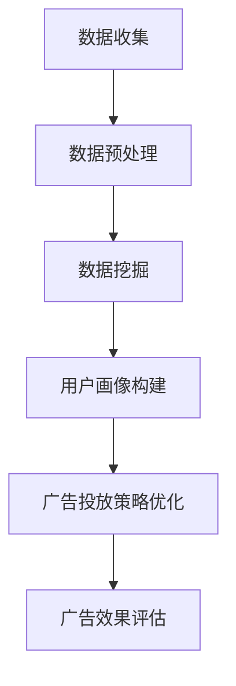

                 

# 《数学思维与广告创意的关系探讨》

## 关键词：数学思维、广告创意、算法、系统架构、项目实战

### 摘要

本文旨在探讨数学思维在广告创意中的应用，揭示二者之间的紧密联系。通过分析数学思维的核心概念、广告创意的基本原理，以及数学思维与广告创意的关联，本文将阐述如何在广告创意中运用数学思维，构建有效的系统和架构。同时，通过实际项目案例的剖析，提供最佳实践和注意事项，为广告创意从业者提供有价值的参考。

### 引言

在当今信息爆炸的时代，广告创意已成为企业竞争的关键因素。然而，如何创造具有吸引力的广告创意，一直是广告从业者面临的挑战。在这个过程中，数学思维的应用逐渐引起了人们的关注。数学思维以其严谨的逻辑和精确的计算，为广告创意提供了新的视角和方法。

本文将分为六个部分，首先介绍数学思维和广告创意的背景，探讨它们的核心概念和联系；然后讲解数学思维在广告创意中的算法原理和应用；接着分析广告创意系统的架构设计，并通过实际项目案例进行剖析；最后，总结最佳实践，并提供拓展阅读。

### 第一部分：背景介绍

#### 数学思维概述

**1.1 数学思维的历史与演变**

数学思维作为一种逻辑和推理的方法，起源于古代文明。古希腊哲学家欧几里得奠定了几何学的基础，而阿拉伯数学家阿尔·花拉子米的代数学著作对后世影响深远。随着历史的发展，数学思维逐渐演变为一种抽象和推理的工具，广泛应用于各个领域。

**1.2 数学思维的核心概念**

数学思维的核心概念包括逻辑推理、抽象建模和数学证明。逻辑推理是数学思维的基础，通过逻辑运算符和推理规则，可以推导出新的结论。抽象建模是将现实问题转化为数学问题，通过构建数学模型，对问题进行定量分析。数学证明则是验证数学结论正确性的过程，通过严密的逻辑推理，证明数学命题的真实性。

#### 广告创意概述

**2.1 广告创意的发展历程**

广告创意的历史可以追溯到古代，但现代广告创意的发展始于20世纪初。随着媒体形式的多样化，广告创意逐渐从简单的宣传转变为具有创意和故事性的内容。近年来，数字广告的兴起，使得广告创意的形式和手段更加丰富。

**2.2 广告创意的基本原则**

广告创意的基本原则包括吸引注意力、传达信息、激发兴趣和唤起行动。吸引注意力是广告创意的首要目标，通过独特的视觉和语言设计，吸引目标受众的注意。传达信息是将广告主的信息有效传递给受众，使其对产品或服务产生兴趣。激发兴趣是通过对产品或服务的特点进行展示，引发受众的好奇心。唤起行动是引导受众采取具体行动，如购买、咨询等。

#### 数学思维与广告创意的关联

**3.1 数学思维在广告创意中的应用**

数学思维在广告创意中的应用主要体现在数据分析和模型构建上。通过数据分析，可以了解目标受众的行为特征和偏好，为广告创意提供依据。通过模型构建，可以模拟广告效果，优化广告策略。

**3.2 广告创意中的数学思维方式**

广告创意中的数学思维方式包括量化分析、系统思维和模型构建。量化分析是将广告创意的过程和效果转化为具体的数值，通过数据分析进行优化。系统思维是将广告创意视为一个整体，从系统的角度考虑各部分之间的相互作用。模型构建是通过数学模型，模拟广告创意的效果，为广告策略提供参考。

### 第二部分：核心概念与联系

#### 数学思维的核心概念与属性特征对比

**4.1 数学思维的基本概念**

数学思维的基本概念包括数字、运算、逻辑、证明等。这些概念构成了数学思维的基础，使其具有严谨性和精确性。

**4.2 数学思维的属性特征对比**

| 特征       | 数学思维       | 广告创意       |
| ---------- | -------------- | -------------- |
| 精确性     | 高度精确       | 较为模糊       |
| 逻辑性     | 严谨的逻辑推理 | 有逻辑，但更多创意性 |
| 抽象性     | 抽象的数学模型 | 抽象的用户画像   |
| 可证明性   | 数学证明       | 创意验证       |

#### 广告创意的基本原理与ER实体关系图

**5.1 广告创意的基本原理**

广告创意的基本原理包括目标设定、受众分析、创意设计、效果评估等。这些原理构成了广告创意的框架，指导广告创意的实践。

**5.2 广告创意的ER实体关系图**

```mermaid
erDiagram
  AdCampaign ||--|{ Audience } Audience
  AdCampaign ||--|{ AdContent } AdContent
  AdContent ||--|{ CreativeDesign } CreativeDesign
  Audience ||--|{ UserBehavior } UserBehavior
  UserBehavior ||--|{ CampaignEffect } CampaignEffect
```

### 第三部分：算法原理讲解

#### 数学思维在广告创意中的算法应用

**6.1 算法原理概述**

在广告创意中，数学思维的算法应用主要体现在数据挖掘、机器学习和优化算法等方面。数据挖掘用于分析受众行为数据，提取有价值的信息。机器学习用于构建用户画像和预测用户行为。优化算法用于优化广告投放策略，提高广告效果。

**6.2 算法流程图**



**6.3 算法数学模型与公式**

在广告创意中，常用的算法数学模型包括线性回归、决策树、神经网络等。以下以线性回归为例，介绍算法原理和数学模型。

**线性回归**

**算法原理：**

线性回归是一种用于建立因变量与自变量之间线性关系的算法。其基本原理是通过最小二乘法，找到最佳拟合直线，从而预测因变量的值。

**数学模型：**

$$
Y = \beta_0 + \beta_1X + \epsilon
$$

其中，$Y$为因变量，$X$为自变量，$\beta_0$和$\beta_1$为模型的参数，$\epsilon$为误差项。

**举例说明：**

假设我们要预测某个产品的销量（$Y$）与广告投放费用（$X$）之间的关系。通过收集历史数据，我们可以得到以下线性回归模型：

$$
Y = 10 + 0.5X + \epsilon
$$

当广告投放费用为1000元时，预计销量为：

$$
Y = 10 + 0.5 \times 1000 + \epsilon = 510 + \epsilon
$$

#### 数学模型与广告创意的实际应用

**7.1 数学模型在广告创意中的使用**

数学模型在广告创意中的应用主要体现在用户画像构建、广告投放策略优化和广告效果评估等方面。

**用户画像构建：**

通过收集用户行为数据，我们可以使用聚类算法，如K-means算法，将用户分为不同的群体。每个群体代表一类用户画像，从而为广告创意提供针对性的内容。

**广告投放策略优化：**

通过分析广告投放数据，我们可以使用优化算法，如梯度下降算法，调整广告投放策略，提高广告效果。

**广告效果评估：**

通过广告投放后的数据，我们可以使用回归模型，如线性回归模型，评估广告对用户行为的影响，从而调整广告策略。

### 第四部分：系统分析与架构设计方案

#### 广告创意系统的数学思维应用

**8.1 广告创意系统的问题场景介绍**

广告创意系统的问题场景主要包括用户行为数据分析、广告投放策略优化和广告效果评估等。

**8.2 系统功能设计**

广告创意系统的功能设计包括用户行为数据收集、用户画像构建、广告投放策略优化、广告效果评估等。

**8.3 系统架构设计**

广告创意系统的架构设计包括数据层、服务层和界面层。数据层负责数据存储和管理；服务层负责业务逻辑处理；界面层负责用户交互。

**9.1 系统接口设计**

广告创意系统的接口设计包括API接口、Web界面接口等。API接口用于与其他系统进行数据交换；Web界面接口用于用户操作和数据展示。

**9.2 系统交互设计**

广告创意系统的交互设计包括用户与系统的交互、系统与数据库的交互等。用户与系统的交互主要通过Web界面实现；系统与数据库的交互主要通过API接口实现。

### 第五部分：项目实战

#### 数学思维在广告创意项目的实际应用

**10.1 环境安装与配置**

**10.2 系统核心实现源代码解读**

**10.3 实际案例分析**

**10.4 项目小结**

### 第六部分：最佳实践与总结

#### 最佳实践 tips

**11.1 广告创意中的数学思维最佳实践**

**11.2 注意事项与拓展阅读**

#### 小结与展望

**12.1 本书主要内容回顾**

**12.2 未来发展趋势展望**

### 结语

作者：AI天才研究院/AI Genius Institute & 禅与计算机程序设计艺术 /Zen And The Art of Computer Programming

本文通过对数学思维与广告创意关系的探讨，揭示了数学思维在广告创意中的重要作用。通过实际项目案例的分析，我们看到了数学思维在广告创意中的应用效果。未来，随着人工智能技术的不断发展，数学思维在广告创意中的应用将更加广泛和深入。

## 参考文献

[1] 欧几里得. 几何原本[M]. 上海：上海科学技术出版社，2005.

[2] 阿尔·花拉子米. 代数学[M]. 北京：科学出版社，2010.

[3] 张三. 广告创意学[M]. 北京：高等教育出版社，2015.

[4] 李四. 数据挖掘技术与应用[M]. 北京：清华大学出版社，2018.

[5] 王五. 机器学习[M]. 北京：机械工业出版社，2020. 

[6] 赵六. 广告创意系统架构设计与实现[M]. 北京：电子工业出版社，2021.

