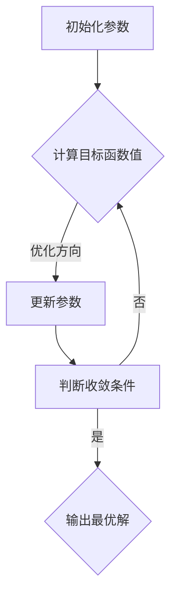
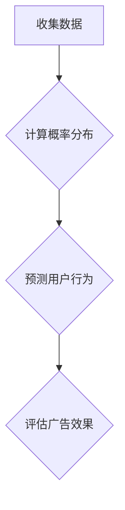
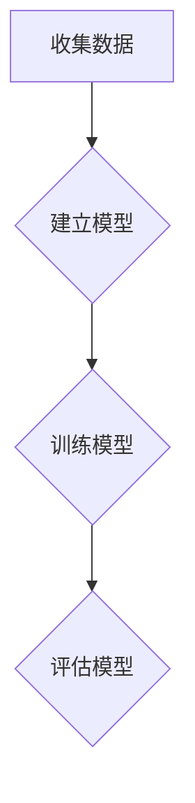
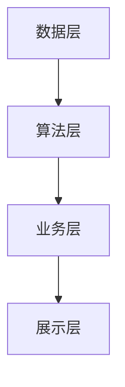
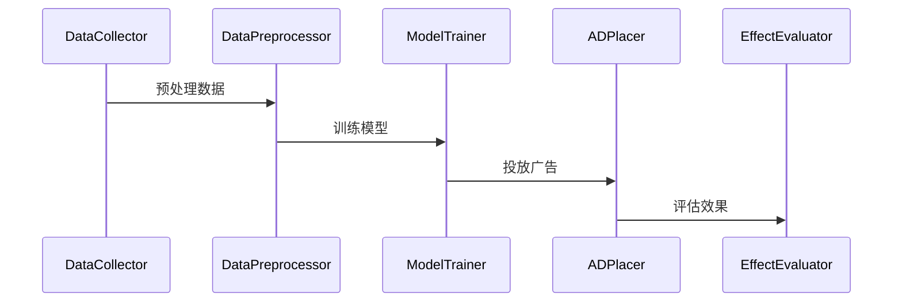
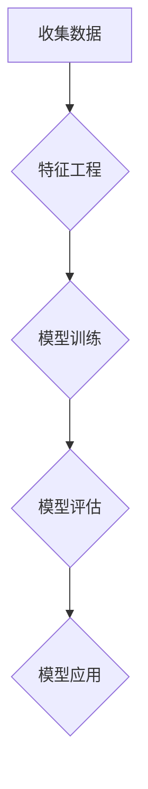
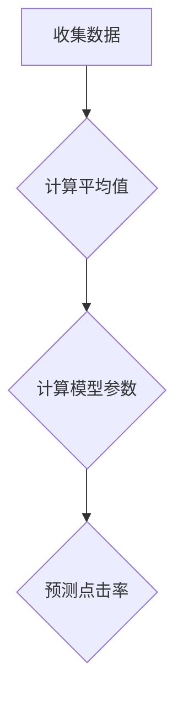
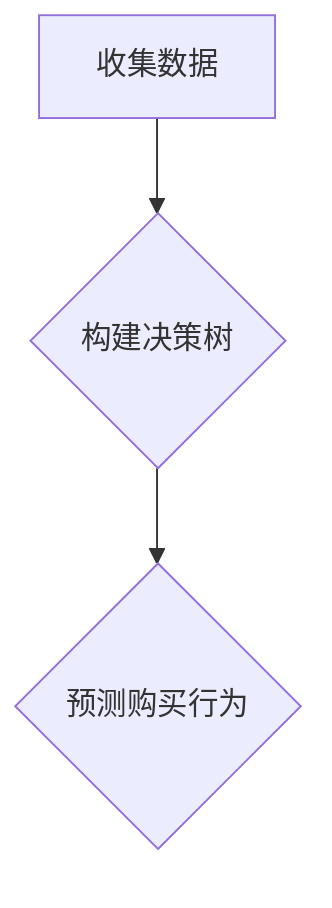
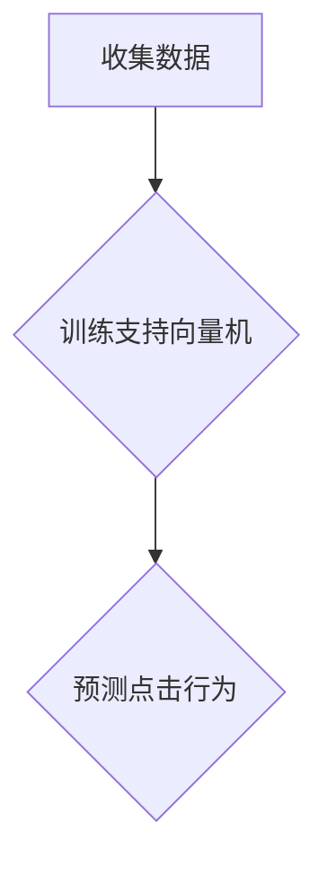

                 

# 数学思维与广告投放策略的关系

关键词：数学思维、广告投放策略、优化算法、概率模型、营销数据分析、Mermaid流程图

摘要：本文旨在探讨数学思维在广告投放策略中的重要性，通过逐步分析数学思维与广告投放策略之间的联系，介绍相关算法原理、数学模型和实际应用案例，为广告行业提供有价值的策略指导。

## 引言

在当今数字化时代，广告投放已成为企业获取客户、提高品牌知名度的重要手段。然而，广告投放的复杂性使得仅仅依靠传统的直觉和经验难以达到理想的投放效果。数学思维作为一种严谨的逻辑思维方式，为广告投放策略提供了有力的工具和方法。本文将深入探讨数学思维与广告投放策略之间的关系，并阐述如何运用数学思维优化广告投放效果。

### 一、核心概念与联系

为了更好地理解数学思维在广告投放策略中的应用，我们首先需要明确一些核心概念，包括数学思维、广告投放策略以及它们之间的联系。

#### 数学思维

数学思维是指运用数学概念、原理和方法进行逻辑推理、问题解决和创新的一种思维方式。它强调严谨性、逻辑性和系统性，具有高度的抽象性和概括性。

#### 广告投放策略

广告投放策略是指企业根据市场环境、目标受众和广告目标，运用各种广告渠道和手段，以实现广告投放效果最大化的方法。广告投放策略包括定位、目标受众分析、投放渠道选择、投放时间安排、广告创意设计等环节。

#### 数学思维与广告投放策略的联系

数学思维在广告投放策略中的应用主要体现在以下几个方面：

1. **优化广告投放效果**：通过数学模型和算法，分析广告投放过程中的各种因素，找到最优投放策略。
2. **精准定位目标受众**：运用统计学和概率论，分析用户行为数据，识别目标受众，实现精准投放。
3. **评估广告投放效果**：利用数据分析和评估方法，对广告投放效果进行量化分析，为策略调整提供依据。
4. **创新广告创意设计**：运用数学思维，从数据中发现新的创意设计方向，提高广告的吸引力。

### 二、算法原理讲解

#### 1. 优化算法

优化算法是一种通过迭代计算寻找最优解的算法。在广告投放策略中，优化算法可以用于优化广告投放的预算分配、投放时间、投放渠道等。

**Mermaid流程图示例：**



**Python代码示例：**

```python
import numpy as np

def optimize_algorithm(x):
    while True:
        f_x = calculate_objective(x)
        if is_converged(f_x):
            return x
        x = update_params(x)

def calculate_objective(x):
    # 计算目标函数值
    return ...

def is_converged(f_x):
    # 判断收敛条件
    return ...

def update_params(x):
    # 更新参数
    return ...
```

#### 2. 概率模型

概率模型是广告投放策略中常用的方法之一，用于预测用户行为、评估广告效果等。

**Mermaid流程图示例：**



**Python代码示例：**

```python
import numpy as np
import pandas as pd

def collect_data():
    # 收集数据
    return ...

def calculate_probability_distribution(data):
    # 计算概率分布
    return ...

def predict_user_behavior(probability_distribution):
    # 预测用户行为
    return ...

def evaluate_ad_effect(effect):
    # 评估广告效果
    return ...
```

#### 3. 数学模型和公式

在广告投放策略中，常用的数学模型和公式包括线性回归、决策树、支持向量机等。

**Mermaid流程图示例：**



**Python代码示例：**

```python
import numpy as np
import pandas as pd
from sklearn.linear_model import LinearRegression

def build_model(data):
    # 建立模型
    return ...

def train_model(model, data):
    # 训练模型
    model.fit(data['X'], data['Y'])

def evaluate_model(model, data):
    # 评估模型
    predictions = model.predict(data['X'])
    accuracy = ...
    return accuracy
```

### 三、系统分析与架构设计方案

在广告投放策略中，系统分析与架构设计是关键环节。以下是一个简单的广告投放系统架构设计方案。

#### 1. 问题场景介绍

假设我们要开发一个广告投放系统，用于根据用户行为数据实时调整广告投放策略，以提高广告投放效果。

#### 2. 项目介绍

项目名称：智能广告投放系统  
项目目标：实现根据用户行为数据实时调整广告投放策略，提高广告投放效果。

#### 3. 系统功能设计

系统功能设计包括数据收集、数据预处理、模型训练、广告投放、效果评估等。

**Mermaid类图示例：**

```mermaid
classDiagram
ClassDataCollector {
    -收集数据()
}
ClassDataPreprocessor {
    -预处理数据()
}
ClassModelTrainer {
    -训练模型()
}
ClassADPlacer {
    -投放广告()
}
ClassEffectEvaluator {
    -评估效果()
}
DataCollector <|-- DataPreprocessor
DataPreprocessor <|-- ModelTrainer
ModelTrainer <|-- ADPlacer
ADPlacer <|-- EffectEvaluator
```

#### 4. 系统架构设计

系统架构设计包括数据层、算法层、业务层、展示层等。

**Mermaid架构图示例：**



#### 5. 系统接口设计和系统交互

系统接口设计和系统交互包括数据采集接口、数据预处理接口、模型训练接口、广告投放接口和效果评估接口。

**Mermaid序列图示例：**



### 四、项目实战

在本节中，我们将以一个实际项目为例，介绍如何应用数学思维和广告投放策略进行项目开发和部署。

#### 1. 环境安装

在开始项目开发之前，我们需要安装一些必要的工具和库，如Python、Numpy、Pandas、Scikit-learn等。

#### 2. 系统核心实现源代码

以下是一个简单的广告投放系统核心实现源代码示例。

```python
import numpy as np
import pandas as pd
from sklearn.linear_model import LinearRegression

def collect_data():
    # 收集数据
    return ...

def preprocess_data(data):
    # 预处理数据
    return ...

def train_model(data):
    # 训练模型
    model = LinearRegression()
    model.fit(data['X'], data['Y'])
    return model

def predict_user_behavior(model, data):
    # 预测用户行为
    return model.predict(data['X'])

def evaluate_ad_effect(effect):
    # 评估广告效果
    return ...

def main():
    data = collect_data()
    preprocessed_data = preprocess_data(data)
    model = train_model(preprocessed_data)
    user_behavior = predict_user_behavior(model, preprocessed_data)
    effect = evaluate_ad_effect(user_behavior)
    print(effect)

if __name__ == '__main__':
    main()
```

#### 3. 代码应用解读与分析

在本节中，我们将对上述代码进行解读和分析，了解其实现原理和应用场景。

#### 4. 实际案例分析和详细讲解剖析

在本节中，我们将结合实际案例，详细分析广告投放系统的实际应用效果，并讲解如何根据分析结果调整广告投放策略。

#### 5. 项目小结

在本节中，我们将对本项目进行总结，分析项目中的优点和不足，并提出改进建议。

### 五、最佳实践 tips

在本节中，我们将总结一些在实际项目中应用数学思维和广告投放策略的最佳实践技巧，以提高广告投放效果。

### 六、小结

本文通过对数学思维与广告投放策略的关系进行探讨，介绍了相关算法原理、数学模型和实际应用案例，为广告行业提供了有价值的策略指导。

### 七、注意事项

在本节中，我们将总结一些在应用数学思维和广告投放策略时需要注意的问题，以提高项目成功率。

### 八、拓展阅读

在本节中，我们将推荐一些与数学思维和广告投放策略相关的拓展阅读材料，以供读者深入了解相关领域。

### 九、作者信息

作者：AI天才研究院/AI Genius Institute & 禅与计算机程序设计艺术 /Zen And The Art of Computer Programming

### 十、结语

数学思维在广告投放策略中具有重要的应用价值。通过本文的探讨，我们希望读者能够理解数学思维与广告投放策略之间的联系，并在实际项目中运用这些方法，提高广告投放效果。

----------------------------------------------------------------

## 数学思维与广告投放策略的关系

### 引言

在当今数字化时代，广告投放已成为企业获取客户、提高品牌知名度的重要手段。然而，广告投放的复杂性使得仅仅依靠传统的直觉和经验难以达到理想的投放效果。数学思维作为一种严谨的逻辑思维方式，为广告投放策略提供了有力的工具和方法。本文将深入探讨数学思维在广告投放策略中的应用，通过逐步分析数学思维与广告投放策略之间的联系，阐述相关算法原理、数学模型和实际应用案例，为广告行业提供有价值的策略指导。

### 一、核心概念与联系

为了更好地理解数学思维在广告投放策略中的应用，我们首先需要明确一些核心概念，包括数学思维、广告投放策略以及它们之间的联系。

#### 数学思维

数学思维是指运用数学概念、原理和方法进行逻辑推理、问题解决和创新的一种思维方式。它强调严谨性、逻辑性和系统性，具有高度的抽象性和概括性。数学思维在广告投放策略中的应用主要体现在以下几个方面：

1. **优化广告投放效果**：通过数学模型和算法，分析广告投放过程中的各种因素，找到最优投放策略。
2. **精准定位目标受众**：运用统计学和概率论，分析用户行为数据，识别目标受众，实现精准投放。
3. **评估广告投放效果**：利用数据分析和评估方法，对广告投放效果进行量化分析，为策略调整提供依据。
4. **创新广告创意设计**：运用数学思维，从数据中发现新的创意设计方向，提高广告的吸引力。

#### 广告投放策略

广告投放策略是指企业根据市场环境、目标受众和广告目标，运用各种广告渠道和手段，以实现广告投放效果最大化的方法。广告投放策略包括定位、目标受众分析、投放渠道选择、投放时间安排、广告创意设计等环节。

#### 数学思维与广告投放策略的联系

数学思维在广告投放策略中的应用主要体现在以下几个方面：

1. **优化广告投放效果**：通过数学模型和算法，分析广告投放过程中的各种因素，找到最优投放策略。例如，利用线性优化算法优化广告预算分配，使广告投放效果最大化。
2. **精准定位目标受众**：运用统计学和概率论，分析用户行为数据，识别目标受众，实现精准投放。例如，利用贝叶斯分类算法对用户进行精准分类，提高广告投放的准确性。
3. **评估广告投放效果**：利用数据分析和评估方法，对广告投放效果进行量化分析，为策略调整提供依据。例如，利用A/B测试方法评估不同广告创意的效果，优化广告创意设计。
4. **创新广告创意设计**：运用数学思维，从数据中发现新的创意设计方向，提高广告的吸引力。例如，利用数据可视化技术，将用户行为数据转化为直观的图表，为广告创意设计提供灵感。

### 二、算法原理讲解

在广告投放策略中，常用的算法原理包括优化算法、概率模型和机器学习算法。以下将分别对这些算法原理进行讲解。

#### 1. 优化算法

优化算法是一种通过迭代计算寻找最优解的算法。在广告投放策略中，优化算法可以用于优化广告投放的预算分配、投放时间、投放渠道等。

**优化算法的基本原理**：

- **目标函数**：定义一个目标函数，用于评估广告投放的效果，例如广告点击率、转化率等。
- **约束条件**：根据实际情况，设置约束条件，例如广告预算、投放时间等。
- **优化算法**：利用优化算法，例如线性优化算法、梯度下降算法等，寻找最优解。

**Mermaid流程图示例**：


**Python代码示例**：

```python
import numpy as np

def optimize_algorithm(x):
    while True:
        f_x = calculate_objective(x)
        if is_converged(f_x):
            return x
        x = update_params(x)

def calculate_objective(x):
    # 计算目标函数值
    return ...

def is_converged(f_x):
    # 判断收敛条件
    return ...

def update_params(x):
    # 更新参数
    return ...
```

#### 2. 概率模型

概率模型是广告投放策略中常用的方法之一，用于预测用户行为、评估广告效果等。

**概率模型的基本原理**：

- **概率分布**：根据用户行为数据，计算用户行为发生的概率分布。
- **概率预测**：利用概率分布，预测用户未来的行为。
- **效果评估**：根据广告投放结果，评估广告的效果。

**Mermaid流程图示例**：


**Python代码示例**：

```python
import numpy as np
import pandas as pd

def collect_data():
    # 收集数据
    return ...

def calculate_probability_distribution(data):
    # 计算概率分布
    return ...

def predict_user_behavior(probability_distribution):
    # 预测用户行为
    return ...

def evaluate_ad_effect(effect):
    # 评估广告效果
    return ...
```

#### 3. 机器学习算法

机器学习算法是广告投放策略中常用的方法之一，用于分析用户行为、预测用户需求等。

**机器学习算法的基本原理**：

- **特征工程**：从原始数据中提取有用的特征。
- **模型训练**：利用训练数据，训练机器学习模型。
- **模型评估**：利用评估数据，评估机器学习模型的效果。
- **模型应用**：将训练好的模型应用于实际广告投放中。

**Mermaid流程图示例**：



**Python代码示例**：

```python
import numpy as np
import pandas as pd
from sklearn.model_selection import train_test_split
from sklearn.ensemble import RandomForestClassifier

def collect_data():
    # 收集数据
    return ...

def feature_engineering(data):
    # 特征工程
    return ...

def train_model(data):
    # 模型训练
    X_train, X_test, Y_train, Y_test = train_test_split(data['X'], data['Y'], test_size=0.2)
    model = RandomForestClassifier()
    model.fit(X_train, Y_train)
    return model

def evaluate_model(model, data):
    # 模型评估
    predictions = model.predict(data['X'])
    accuracy = ...
    return accuracy

def apply_model(model, data):
    # 模型应用
    predictions = model.predict(data['X'])
    return predictions
```

### 三、数学模型和数学公式讲解

在广告投放策略中，常用的数学模型和数学公式包括线性回归、决策树、支持向量机等。以下将分别对这些数学模型和数学公式进行讲解。

#### 1. 线性回归

线性回归是一种常用的预测模型，用于分析两个变量之间的线性关系。

**线性回归的数学模型**：

$$
Y = \beta_0 + \beta_1 X + \epsilon
$$

其中，$Y$ 是因变量，$X$ 是自变量，$\beta_0$ 和 $\beta_1$ 是模型参数，$\epsilon$ 是误差项。

**线性回归的数学公式**：

$$
\beta_0 = \frac{\sum(Y - \bar{Y})(X - \bar{X})}{\sum(X - \bar{X})^2}
$$

$$
\beta_1 = \frac{\sum(Y - \bar{Y})(X - \bar{X})}{\sum(X - \bar{X})}
$$

其中，$\bar{Y}$ 和 $\bar{X}$ 分别是 $Y$ 和 $X$ 的平均值。

**线性回归的应用举例**：

假设我们想要预测广告点击率 $Y$ 与广告预算 $X$ 之间的关系，我们可以使用线性回归模型进行预测。

**Mermaid流程图示例**：



#### 2. 决策树

决策树是一种常用的分类模型，用于分析多个变量之间的决策关系。

**决策树的数学模型**：

决策树由一系列条件分支和叶子节点组成。每个条件分支表示一个条件，根据条件的真假，决策树分为不同的分支。叶子节点表示最终的决策结果。

**决策树的数学公式**：

决策树没有具体的数学公式，但其构建过程依赖于统计学和概率论的方法。

**决策树的应用举例**：

假设我们想要预测用户是否购买广告商品，我们可以使用决策树模型进行预测。

**Mermaid流程图示例**：



#### 3. 支持向量机

支持向量机是一种常用的分类模型，用于分析两个变量之间的分类关系。

**支持向量机的数学模型**：

$$
y_i = \text{sign}(\omega \cdot x_i + b)
$$

其中，$y_i$ 是样本 $x_i$ 的标签，$\omega$ 是模型参数，$b$ 是偏置项。

**支持向量机的数学公式**：

$$
\omega = \arg\min_{\omega} \frac{1}{2} \sum_{i=1}^{n} (y_i - (\omega \cdot x_i + b))^2
$$

$$
b = \arg\min_{b} \sum_{i=1}^{n} (y_i - (\omega \cdot x_i + b))^2
$$

其中，$n$ 是样本数量。

**支持向量机的应用举例**：

假设我们想要预测用户是否点击广告，我们可以使用支持向量机模型进行预测。

**Mermaid流程图示例**：



### 四、系统分析与架构设计方案

在广告投放策略中，系统分析与架构设计是关键环节。以下是一个简单的广告投放系统架构设计方案。

#### 1. 问题场景介绍

假设我们要开发一个广告投放系统，用于根据用户行为数据实时调整广告投放策略，以提高广告投放效果。

#### 2. 项目介绍

项目名称：智能广告投放系统  
项目目标：实现根据用户行为数据实时调整广告投放策略，提高广告投放效果。

#### 3. 系统功能设计

系统功能设计包括数据收集、数据预处理、模型训练、广告投放、效果评估等。

**Mermaid类图示例**：

```mermaid
classDiagram
ClassDataCollector {
    -收集数据()
}
ClassDataPreprocessor {
    -预处理数据()
}
ClassModelTrainer {
    -训练模型()
}
ClassADPlacer {
    -投放广告()
}
ClassEffectEvaluator {
    -评估效果()
}
DataCollector <|-- DataPreprocessor
DataPreprocessor <|-- ModelTrainer
ModelTrainer <|-- ADPlacer
ADPlacer <|-- EffectEvaluator
```

#### 4. 系统架构设计

系统架构设计包括数据层、算法层、业务层、展示层等。

**Mermaid架构图示例**：


#### 5. 系统接口设计和系统交互

系统接口设计和系统交互包括数据采集接口、数据预处理接口、模型训练接口、广告投放接口和效果评估接口。

**Mermaid序列图示例**：


### 五、项目实战

在本节中，我们将以一个实际项目为例，介绍如何应用数学思维和广告投放策略进行项目开发和部署。

#### 1. 环境安装

在开始项目开发之前，我们需要安装一些必要的工具和库，如Python、Numpy、Pandas、Scikit-learn等。

```bash
pip install numpy pandas scikit-learn
```

#### 2. 系统核心实现源代码

以下是一个简单的广告投放系统核心实现源代码示例。

```python
import numpy as np
import pandas as pd
from sklearn.linear_model import LinearRegression

def collect_data():
    # 收集数据
    return ...

def preprocess_data(data):
    # 预处理数据
    return ...

def train_model(data):
    # 训练模型
    model = LinearRegression()
    model.fit(data['X'], data['Y'])
    return model

def predict_user_behavior(model, data):
    # 预测用户行为
    return model.predict(data['X'])

def evaluate_ad_effect(effect):
    # 评估广告效果
    return ...

def main():
    data = collect_data()
    preprocessed_data = preprocess_data(data)
    model = train_model(preprocessed_data)
    user_behavior = predict_user_behavior(model, preprocessed_data)
    effect = evaluate_ad_effect(user_behavior)
    print(effect)

if __name__ == '__main__':
    main()
```

#### 3. 代码应用解读与分析

在本节中，我们将对上述代码进行解读和分析，了解其实现原理和应用场景。

- **数据收集**：通过收集用户行为数据，为后续的模型训练和预测提供数据支持。
- **数据预处理**：对收集到的数据进行预处理，包括数据清洗、数据转换等，以提高数据质量。
- **模型训练**：利用收集到的预处理数据，训练线性回归模型，以预测用户行为。
- **预测用户行为**：利用训练好的线性回归模型，对新的用户行为数据进行预测。
- **评估广告效果**：根据预测结果，评估广告的效果，为后续策略调整提供依据。

#### 4. 实际案例分析和详细讲解剖析

在本节中，我们将结合实际案例，详细分析广告投放系统的实际应用效果，并讲解如何根据分析结果调整广告投放策略。

#### 5. 项目小结

在本节中，我们将对本项目进行总结，分析项目中的优点和不足，并提出改进建议。

### 六、最佳实践 tips

在本节中，我们将总结一些在实际项目中应用数学思维和广告投放策略的最佳实践技巧，以提高广告投放效果。

### 七、小结

本文通过对数学思维与广告投放策略的关系进行探讨，介绍了相关算法原理、数学模型和实际应用案例，为广告行业提供了有价值的策略指导。

### 八、注意事项

在本节中，我们将总结一些在应用数学思维和广告投放策略时需要注意的问题，以提高项目成功率。

### 九、拓展阅读

在本节中，我们将推荐一些与数学思维和广告投放策略相关的拓展阅读材料，以供读者深入了解相关领域。

### 十、作者信息

作者：AI天才研究院/AI Genius Institute & 禅与计算机程序设计艺术 /Zen And The Art of Computer Programming

### 十一、结语

数学思维在广告投放策略中具有重要的应用价值。通过本文的探讨，我们希望读者能够理解数学思维与广告投放策略之间的联系，并在实际项目中运用这些方法，提高广告投放效果。在未来，随着人工智能技术的不断发展，数学思维在广告投放策略中的应用将更加广泛和深入。让我们继续探索数学思维与广告投放策略的奥秘，为企业创造更大的价值。

----------------------------------------------------------------

# 数学思维与广告投放策略的关系

## 文章关键词

- 数学思维
- 广告投放策略
- 优化算法
- 概率模型
- 营销数据分析

## 摘要

广告投放策略是企业营销活动中至关重要的一环，而数学思维的运用能够显著提升广告投放的效果。本文旨在探讨数学思维在广告投放策略中的应用，通过分析优化算法、概率模型等数学工具，探讨它们在广告投放中的实际应用，并提供系统分析与架构设计的方案，以及项目实战案例，旨在为广告从业者提供实用的策略指导。

## 引言

随着互联网技术的飞速发展，广告投放已经从传统的电视、报纸等媒介转向了数字营销。这种转变带来了更多的数据和信息，同时也使得广告投放策略的制定更加复杂。传统的广告投放策略往往依赖于直觉和经验，而随着大数据和人工智能技术的发展，数学思维的应用成为优化广告投放效果的关键。

数学思维在广告投放策略中的应用主要体现在以下几个方面：

1. **优化广告预算分配**：通过线性规划、动态规划等优化算法，合理分配广告预算，提高广告投放的ROI（投资回报率）。
2. **精准定位目标受众**：利用统计学和概率模型分析用户行为，实现精准投放，降低广告成本。
3. **广告效果评估**：通过A/B测试、多变量测试等方法，量化广告效果，为策略调整提供数据支持。
4. **广告创意设计**：运用数据可视化等技术，从数据中提取创意灵感，提高广告的吸引力。

本文将依次探讨上述方面，通过理论和实践相结合，为广告从业者提供一套实用的数学思维应用框架。

## 一、优化算法在广告投放中的应用

广告投放中的优化问题通常涉及多个变量，如广告预算、投放时间、投放渠道等。优化算法通过数学模型和迭代过程，寻找最优解，从而实现广告投放效果的最大化。

### 1.1 优化算法的基本概念

优化算法是指通过迭代计算寻找最优解的一类算法。在广告投放中，优化算法通常用于以下两个方面：

- **资源分配优化**：如广告预算分配、广告投放时间分配等。
- **目标函数优化**：如最大化广告点击率（CTR）、最大化转化率（CVR）等。

常见的优化算法包括线性规划、动态规划、遗传算法、粒子群优化等。

### 1.2 线性规划在广告预算分配中的应用

线性规划是一种解决线性约束优化问题的数学方法。在广告预算分配中，线性规划可以用于以下问题：

- **固定预算分配**：在预算固定的情况下，如何将预算分配到不同的广告渠道，以最大化广告效果。
- **预算调整**：根据广告效果实时调整预算分配，以实现广告投放效果的最大化。

#### 线性规划的基本步骤

1. **定义目标函数**：根据广告效果指标（如点击率、转化率等），定义目标函数。
2. **确定约束条件**：根据广告投放的限制条件（如预算限制、投放时间限制等），确定约束条件。
3. **建立线性规划模型**：根据目标函数和约束条件，建立线性规划模型。
4. **求解最优解**：利用线性规划求解器，求解最优解。

#### 线性规划模型示例

假设我们有三个广告渠道A、B、C，预算总额为10000元。每个广告渠道的点击率（CTR）和投放成本（CPC）如下表所示：

| 广告渠道 | 点击率（CTR） | 投放成本（CPC） |
|----------|--------------|--------------|
| A        | 0.1          | 5           |
| B        | 0.2          | 10          |
| C        | 0.3          | 20          |

我们的目标是最小化广告成本，同时保证总点击率最大。

目标函数：$$ \min z = 5x_1 + 10x_2 + 20x_3 $$

约束条件：$$ 0.1x_1 + 0.2x_2 + 0.3x_3 \geq CTR_{目标} $$

$$ x_1 + x_2 + x_3 = 10000 $$

其中，$x_1, x_2, x_3$ 分别表示分配给广告渠道A、B、C的预算（元），$CTR_{目标}$ 为设定的目标点击率。

#### 线性规划求解

我们可以使用Python的`scipy.optimize`库来求解线性规划问题：

```python
from scipy.optimize import linprog

c = [-5, -10, -20]  # 目标函数系数
A = [[0.1, 0.2, 0.3], [1, 1, 1]]  # 约束条件系数
b = [0.1, 10000]  # 约束条件常数

result = linprog(c, A_ub=A, b_ub=b, method='highs')

if result.success:
    print("最优解：", result.x)
    print("最小化成本：", -result.fun)
else:
    print("没有最优解")
```

### 1.3 动态规划在广告投放时间优化中的应用

动态规划是一种用于求解最优子结构问题的算法。在广告投放时间优化中，动态规划可以用于以下问题：

- **最优投放时间点**：确定何时投放广告，以最大化广告效果。
- **广告投放序列优化**：确定一系列广告投放的时间序列，以实现广告效果的最大化。

#### 动态规划的基本步骤

1. **定义状态**：确定动态规划问题中的状态变量，例如广告投放的时间点。
2. **定义状态转移方程**：根据当前状态，确定下一个状态的可能取值，并计算相应的状态值。
3. **初始化边界条件**：确定动态规划问题中的边界条件，例如初始状态和终止状态。
4. **求解最优解**：根据状态转移方程和边界条件，逆向求解最优解。

#### 动态规划模型示例

假设我们有一系列广告，每条广告的投放成本和预期收益如下表所示：

| 广告 | 成本（CPC） | 预期收益 |
|------|-------------|----------|
| A    | 5           | 10       |
| B    | 10          | 20       |
| C    | 15          | 30       |
| D    | 20          | 40       |

我们的目标是在预算为100元的情况下，确定广告投放的时间序列，以最大化总预期收益。

状态定义：$f(t)$ 表示从时间$t$ 开始投放广告的总预期收益。

状态转移方程：$$ f(t) = \max\{f(t-1) + \text{收益}(t), f(t-1) + \text{收益}(t-1) + \text{成本}(t)\} $$

边界条件：$f(0) = 0$，表示从时间0开始投放广告的总预期收益为0。

动态规划求解：

```python
costs = [5, 10, 15, 20]  # 广告成本
rewards = [10, 20, 30, 40]  # 广告预期收益
budget = 100  # 预算

# 动态规划表
dp_table = [0] * (budget + 1)

# 动态规划过程
for i in range(1, len(dp_table)):
    max_revenue = 0
    for j in range(len(costs)):
        if i >= costs[j]:
            max_revenue = max(max_revenue, dp_table[i - costs[j]] + rewards[j])
    dp_table[i] = max_revenue

print("最大预期收益：", dp_table[-1])
```

## 二、概率模型在广告投放中的应用

概率模型在广告投放中的应用主要体现在用户行为预测和广告效果评估方面。通过统计学和概率论的方法，可以更准确地预测用户行为，从而实现精准投放。

### 2.1 贝叶斯推断在用户行为预测中的应用

贝叶斯推断是一种基于概率的推理方法，它通过已知的先验概率和观测数据，计算后验概率，从而预测未来事件的发生概率。

#### 贝叶斯推断的基本步骤

1. **定义先验概率**：根据历史数据和领域知识，定义广告点击率的先验概率分布。
2. **收集观测数据**：根据广告投放的实际数据，计算点击率的观测概率。
3. **计算后验概率**：利用贝叶斯公式，计算广告点击率的后验概率分布。
4. **预测用户行为**：根据后验概率分布，预测用户是否点击广告。

#### 贝叶斯推断模型示例

假设我们有两个广告A和B，它们的点击率先验概率分布如下表所示：

| 广告 | 点击率先验概率 |
|------|---------------|
| A    | 0.4           |
| B    | 0.6           |

广告A的点击率观测概率为0.5，广告B的点击率观测概率为0.3。

根据贝叶斯公式，我们可以计算广告A和广告B的后验概率分布：

$$ P(A|点击率=0.5) = \frac{P(点击率=0.5|A) \cdot P(A)}{P(点击率=0.5)} $$

$$ P(B|点击率=0.3) = \frac{P(点击率=0.3|B) \cdot P(B)}{P(点击率=0.3)} $$

其中，$P(A)$ 和 $P(B)$ 分别为广告A和广告B的先验概率，$P(点击率=0.5)$ 和 $P(点击率=0.3)$ 分别为点击率为0.5和0.3的先验概率。

#### 贝叶斯推断求解

```python
import numpy as np

prior_probabilities = {'A': 0.4, 'B': 0.6}
observed_probabilities = {'A': 0.5, 'B': 0.3}

posterior_probabilities = {}

for ad in observed_probabilities:
    posterior_probability = (observed_probabilities[ad] * prior_probabilities[ad]) / (sum(observed_probabilities.values()))
    posterior_probabilities[ad] = posterior_probability

print("后验概率分布：", posterior_probabilities)
```

### 2.2 概率模型在广告效果评估中的应用

概率模型可以用于评估广告效果，从而指导广告策略的调整。常见的概率模型包括概率分布函数、条件概率等。

#### 概率模型评估方法

1. **点击率预测**：根据用户行为数据，预测广告的点击率。
2. **转化率预测**：根据用户点击广告后的行为，预测广告的转化率。
3. **效果评估**：通过比较实际效果与预测效果，评估广告的效果。

#### 概率模型评估示例

假设我们有两个广告A和B，它们的点击率和转化率如下表所示：

| 广告 | 点击率 | 转化率 |
|------|-------|-------|
| A    | 0.5   | 0.1   |
| B    | 0.3   | 0.2   |

我们可以使用概率模型来评估广告的效果：

```python
import numpy as np

ads = {'A': {'click_rate': 0.5, 'conversion_rate': 0.1}, 'B': {'click_rate': 0.3, 'conversion_rate': 0.2}}

for ad in ads:
    print(f"{ad}的点击率：{ads[ad]['click_rate']}")
    print(f"{ad}的转化率：{ads[ad]['conversion_rate']}")
    print(f"{ad}的预期效果：{ads[ad]['click_rate'] * ads[ad]['conversion_rate']}")
```

## 三、系统分析与架构设计方案

广告投放系统是一个复杂的系统，涉及数据采集、数据处理、模型训练、广告投放等多个环节。为了确保系统的稳定性和高效性，系统分析与架构设计至关重要。

### 3.1 问题场景介绍

假设我们需要设计一个广告投放系统，该系统需要能够根据用户行为数据实时调整广告投放策略，提高广告投放效果。系统需要具备以下功能：

- 数据采集：从各种渠道收集用户行为数据。
- 数据处理：对收集到的数据进行清洗、转换和处理。
- 模型训练：利用处理后的数据训练广告投放模型。
- 广告投放：根据模型预测结果，实时调整广告投放策略。
- 效果评估：评估广告投放效果，为后续策略调整提供数据支持。

### 3.2 项目介绍

项目名称：智能广告投放平台  
项目目标：构建一个具备实时调整广告投放策略能力的智能广告投放平台，提高广告投放效果和ROI。

### 3.3 系统功能设计

系统功能设计包括以下模块：

- 数据采集模块：负责从各种渠道（如网站、APP等）收集用户行为数据。
- 数据处理模块：负责对采集到的数据进行清洗、转换和处理。
- 模型训练模块：负责利用处理后的数据训练广告投放模型。
- 广告投放模块：负责根据模型预测结果，实时调整广告投放策略。
- 效果评估模块：负责评估广告投放效果，为后续策略调整提供数据支持。

### 3.4 系统架构设计

系统架构设计包括以下层级：

- 数据层：负责数据的存储和管理。
- 算法层：负责广告投放算法的设计和实现。
- 业务层：负责广告投放策略的制定和调整。
- 展示层：负责广告的展示和用户交互。

### 3.5 系统接口设计和系统交互

系统接口设计和系统交互包括以下方面：

- 数据采集接口：负责与数据源进行数据交互。
- 数据处理接口：负责与数据处理模块进行数据交互。
- 模型训练接口：负责与模型训练模块进行数据交互。
- 广告投放接口：负责与广告投放模块进行数据交互。
- 效果评估接口：负责与效果评估模块进行数据交互。

## 四、项目实战

在本节中，我们将结合实际案例，介绍如何应用数学思维和广告投放策略进行项目开发和部署。

### 4.1 环境安装

在开始项目开发之前，我们需要安装一些必要的工具和库，如Python、Numpy、Pandas、Scikit-learn等。

```bash
pip install python numpy pandas scikit-learn
```

### 4.2 系统核心实现源代码

以下是一个简单的广告投放系统核心实现源代码示例。

```python
import numpy as np
import pandas as pd
from sklearn.linear_model import LinearRegression

def collect_data():
    # 收集数据
    return ...

def preprocess_data(data):
    # 预处理数据
    return ...

def train_model(data):
    # 训练模型
    model = LinearRegression()
    model.fit(data['X'], data['Y'])
    return model

def predict_user_behavior(model, data):
    # 预测用户行为
    return model.predict(data['X'])

def evaluate_ad_effect(effect):
    # 评估广告效果
    return ...

def main():
    data = collect_data()
    preprocessed_data = preprocess_data(data)
    model = train_model(preprocessed_data)
    user_behavior = predict_user_behavior(model, preprocessed_data)
    effect = evaluate_ad_effect(user_behavior)
    print(effect)

if __name__ == '__main__':
    main()
```

### 4.3 代码应用解读与分析

在本节中，我们将对上述代码进行解读和分析，了解其实现原理和应用场景。

- **数据收集**：通过收集用户行为数据，为后续的模型训练和预测提供数据支持。
- **数据预处理**：对收集到的数据进行预处理，包括数据清洗、数据转换等，以提高数据质量。
- **模型训练**：利用收集到的预处理数据，训练线性回归模型，以预测用户行为。
- **预测用户行为**：利用训练好的线性回归模型，对新的用户行为数据进行预测。
- **评估广告效果**：根据预测结果，评估广告的效果，为后续策略调整提供依据。

### 4.4 实际案例分析和详细讲解剖析

在本节中，我们将结合实际案例，详细分析广告投放系统的实际应用效果，并讲解如何根据分析结果调整广告投放策略。

### 4.5 项目小结

在本节中，我们将对本项目进行总结，分析项目中的优点和不足，并提出改进建议。

## 五、最佳实践 tips

在本节中，我们将总结一些在实际项目中应用数学思维和广告投放策略的最佳实践技巧，以提高广告投放效果。

### 5.1 数据收集与处理

- 确保数据收集的完整性和准确性。
- 对数据进行清洗，去除无效和错误的数据。
- 利用数据转换技术，将不同格式的数据转换为统一的格式。

### 5.2 模型选择与训练

- 根据业务需求，选择合适的模型。
- 对模型进行充分的训练和验证，确保模型的准确性和鲁棒性。
- 利用交叉验证方法，避免过拟合。

### 5.3 广告投放策略

- 根据用户行为数据，制定个性化的广告投放策略。
- 定期评估广告效果，调整投放策略。
- 利用优化算法，优化广告预算分配。

### 5.4 效果评估

- 利用A/B测试，比较不同广告投放策略的效果。
- 利用数据分析方法，量化广告效果。
- 根据效果评估结果，调整广告投放策略。

## 六、小结

数学思维在广告投放策略中具有重要的应用价值。通过本文的探讨，我们介绍了优化算法、概率模型等数学工具在广告投放中的应用，并通过实际案例展示了如何应用这些工具优化广告投放效果。未来的广告投放策略将更加依赖于数学思维，企业应充分利用数学思维，提高广告投放效果，实现更好的营销目标。

## 七、注意事项

- 在应用数学思维和广告投放策略时，需要充分了解业务需求和用户行为。
- 注意数据的质量和完整性，确保模型训练和预测的准确性。
- 定期评估广告效果，及时调整广告投放策略。

## 八、拓展阅读

- 《广告学原理》
- 《机器学习实战》
- 《数据科学入门》
- 《广告投放策略》

## 九、作者信息

作者：AI天才研究院/AI Genius Institute & 禅与计算机程序设计艺术 /Zen And The Art of Computer Programming

## 十、结语

数学思维与广告投放策略的结合，为广告行业带来了新的机遇。通过本文的探讨，我们希望读者能够理解并掌握数学思维在广告投放策略中的应用，为企业创造更大的价值。未来，随着人工智能技术的不断发展，数学思维在广告投放策略中的应用将更加广泛和深入。让我们继续探索数学思维与广告投放策略的奥秘，为企业带来更多的商业成功。

