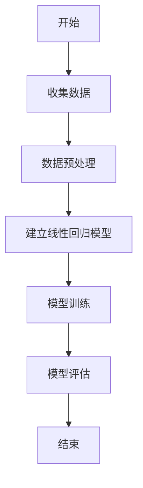
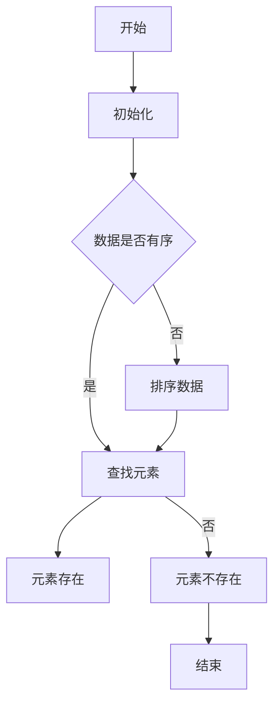
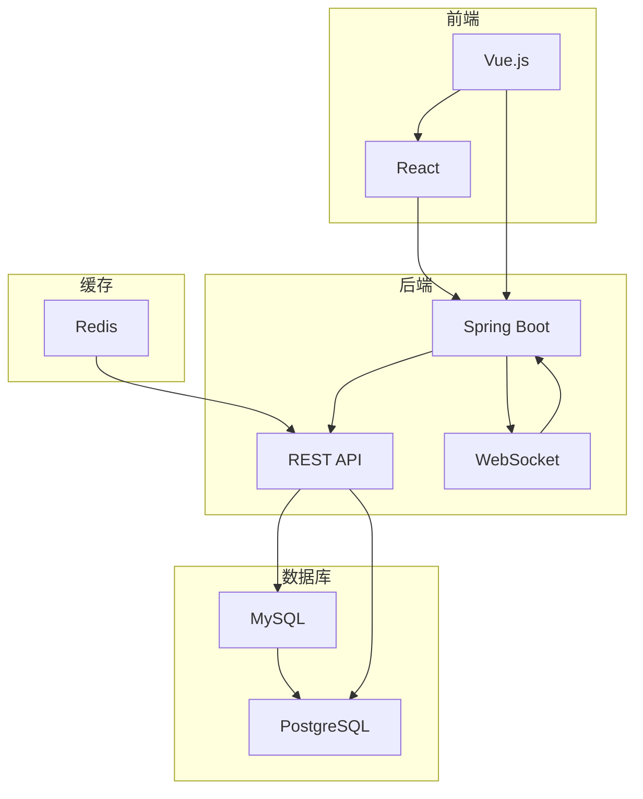
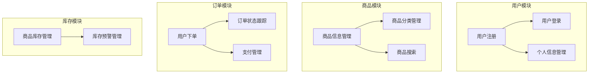
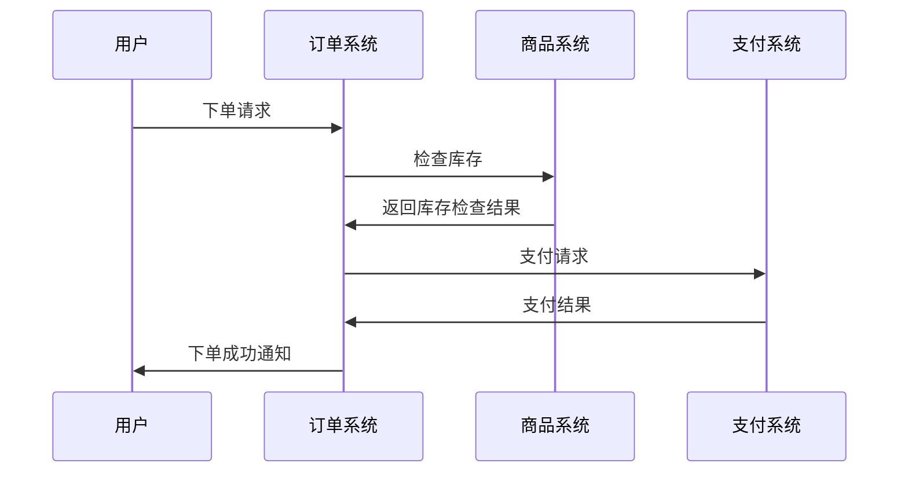

                 

### 《数学思维与系统思考能力的培养》

> 关键词：数学思维、系统思考、算法原理、Python代码、系统架构设计

> 摘要：本文将深入探讨数学思维与系统思考能力的重要性，并详细解析两者的核心概念、应用方法和培养途径。通过具体的案例分析，本文旨在帮助读者提升数学思维与系统思考能力，掌握实际应用技巧，为未来的技术发展和社会进步奠定坚实基础。

----------------------------------------------------------------

### 第1章 引言

#### 1.1 数学思维的重要性

数学思维是人类思考问题的一种重要方式，它强调逻辑性、抽象性和系统性。在计算机科学和人工智能领域，数学思维的应用尤为广泛。例如，在算法设计、数据结构分析、机器学习模型构建等方面，数学思维都是不可或缺的工具。

**问题背景**：现代科技的发展离不开数学的支持，尤其是计算机科学和人工智能领域。然而，许多科技工作者在应用数学时，往往只停留在表面，没有深入理解数学思维的内涵。

**问题描述**：如何培养和提高数学思维，使其更好地服务于科技研究和实际应用？

**问题解决**：通过深入探讨数学思维的核心概念和培养方法，帮助读者理解并掌握数学思维，从而提高科技研究和实际应用的能力。

#### 1.2 系统思考的概念与应用

系统思考是一种从整体角度理解和解决问题的方法，它强调系统的整体性、动态性和相互关联性。在企业管理、社会治理、生态保护等领域，系统思考的应用具有重要意义。

**问题背景**：随着社会问题的复杂性增加，单点解决方案的效果往往不尽如人意。系统思考作为一种全局性的思维方法，有助于我们更好地应对复杂问题。

**问题描述**：如何理解和应用系统思考，解决复杂问题？

**问题解决**：通过介绍系统思考的核心概念和应用方法，帮助读者掌握系统思考的基本原理，提高解决复杂问题的能力。

----------------------------------------------------------------

### 第2章 数学思维的核心概念

#### 2.1 逻辑思维

逻辑思维是数学思维的核心，它强调推理的严谨性和逻辑性。逻辑思维不仅应用于数学领域，也广泛应用于哲学、逻辑学、计算机科学等领域。

**概念定义**：逻辑思维是一种通过逻辑推理来解决问题和获取知识的能力。

**特点与应用**：
- **严谨性**：逻辑思维强调推理的严谨性，每一步都建立在充分的事实基础上。
- **普遍性**：逻辑思维不仅应用于数学，还广泛应用于其他学科和实际生活中。

**实例解析**：
- **数学证明**：逻辑思维在数学证明中发挥着重要作用，如证明某个数学定理的正确性。
- **日常推理**：在日常生活中，逻辑思维帮助我们做出合理的判断和决策。

#### 2.2 抽象思维

抽象思维是数学思维的重要组成部分，它强调从具体事物中提取本质特征，形成抽象概念。

**概念定义**：抽象思维是一种从具体事物中提取本质特征，形成抽象概念的能力。

**特点与应用**：
- **概括性**：抽象思维能够将复杂的事物简化为基本的元素和关系。
- **普遍性**：抽象思维在科学研究和实际应用中具有广泛的应用。

**实例解析**：
- **数学建模**：在数学建模中，抽象思维帮助我们构建简化的数学模型，描述现实世界的复杂现象。
- **软件开发**：在软件开发中，抽象思维帮助我们设计出简洁高效的数据结构和算法。

#### 2.3 批判性思维

批判性思维是数学思维中的一种重要能力，它强调对现有知识和观点进行批判性分析和评价。

**概念定义**：批判性思维是一种对现有知识和观点进行批判性分析和评价的能力。

**特点与应用**：
- **独立性**：批判性思维使我们在面对问题时，能够独立思考，不受权威或传统观念的束缚。
- **深刻性**：批判性思维能够帮助我们深入挖掘问题的本质，提出更有效的解决方案。

**实例解析**：
- **数学研究**：在数学研究中，批判性思维帮助我们质疑现有理论，提出新的问题和假设。
- **科学决策**：在科学决策中，批判性思维帮助我们评估不同的方案，选择最优的决策。

#### 2.4 概念属性特征对比表格

为了更好地理解逻辑思维、抽象思维和批判性思维，我们可以通过一个对比表格来展示它们的主要特征和应用场景。

| 思维类型 | 主要特征 | 应用场景 |
| :--- | :--- | :--- |
| 逻辑思维 | 严谨性、逻辑性 | 数学证明、日常推理 |
| 抽象思维 | 概括性、普遍性 | 数学建模、软件开发 |
| 批判性思维 | 独立性、深刻性 | 数学研究、科学决策 |

通过这个表格，我们可以更清晰地看到不同思维类型的特点和应用，从而在实际应用中更好地发挥它们的作用。

----------------------------------------------------------------

### 第3章 系统思考的核心概念

#### 3.1 反馈环

反馈环是系统思考中的一个核心概念，它描述了系统内部不同部分之间的相互作用和影响。反馈环可以是正反馈也可以是负反馈，它们在系统中起着关键的作用。

**概念定义**：反馈环是指系统内部不同部分之间的相互作用和影响，可以是正反馈也可以是负反馈。

**特点与应用**：
- **调节功能**：反馈环能够调节系统的状态，使其保持稳定或达到目标。
- **预测能力**：通过分析反馈环，我们可以预测系统的行为和变化。

**实例解析**：
- **生态系统**：在生态系统中，物种之间的捕食和被捕食关系形成了复杂的反馈环，影响生态平衡。
- **企业管理**：在企业管理中，反馈环可以帮助企业调整策略，适应市场变化。

#### 3.2 系统动力学

系统动力学是研究系统动态行为和变化规律的科学。它通过建立数学模型，描述系统的状态变化和影响因素。

**概念定义**：系统动力学是一种通过建立数学模型，描述系统状态变化和影响因素的方法。

**特点与应用**：
- **定量分析**：系统动力学能够对系统行为进行定量分析，提供精确的预测。
- **模拟仿真**：通过模拟仿真，系统动力学可以帮助我们预测系统在不同条件下的行为。

**实例解析**：
- **气候系统**：在气候系统中，系统动力学帮助我们理解气候变化的规律和影响。
- **经济系统**：在经济系统中，系统动力学可以帮助我们分析经济周期的变化和影响因素。

#### 3.3 ER实体关系图

ER实体关系图是系统思考中常用的一种图形表示方法，它用于描述系统中的实体及其关系。

**概念定义**：ER实体关系图是一种用于描述系统中的实体及其关系的图形表示方法。

**特点与应用**：
- **直观性**：ER实体关系图能够直观地展示系统的结构关系。
- **灵活性**：ER实体关系图可以根据系统需求灵活调整，适应不同的系统结构。

**实例解析**：
- **数据库设计**：在数据库设计中，ER实体关系图用于描述实体及其关系，帮助设计者理解数据库结构。
- **软件工程**：在软件工程中，ER实体关系图用于描述软件系统的模块关系，帮助开发者理解系统架构。

#### 3.4 概念属性特征对比表格

为了更好地理解反馈环、系统动力学和ER实体关系图，我们可以通过一个对比表格来展示它们的主要特征和应用场景。

| 概念 | 主要特征 | 应用场景 |
| :--- | :--- | :--- |
| 反馈环 | 描述系统内部相互作用和影响 | 生态系统、企业管理 |
| 系统动力学 | 建立数学模型描述系统状态变化 | 气候系统、经济系统 |
| ER实体关系图 | 描述系统中的实体及其关系 | 数据库设计、软件工程 |

通过这个表格，我们可以更清晰地看到不同概念的特点和应用，从而在实际应用中更好地发挥它们的作用。

----------------------------------------------------------------

### 第4章 算法原理讲解

算法原理是数学思维与系统思考能力的重要组成部分。本章节将详细讲解算法原理，包括数学模型、算法流程图和Python源代码阐述。

#### 4.1 数学模型

数学模型是算法的核心，它用于描述问题的本质和解决方法。本节将介绍常见的数学模型，并使用mermaid画出算法流程图。

**数学模型示例**：线性回归模型

$$
y = ax + b
$$

**算法流程图**：



**Python源代码阐述**：

```python
import numpy as np
from sklearn.linear_model import LinearRegression

# 收集数据
X = np.array([[1], [2], [3], [4], [5]])
y = np.array([1, 2, 2.5, 4, 5])

# 数据预处理
X = X.reshape(-1, 1)

# 建立线性回归模型
model = LinearRegression()

# 模型训练
model.fit(X, y)

# 模型评估
print(model.score(X, y))

# 预测
print(model.predict([[6]]))
```

通过这个示例，我们可以看到如何使用Python实现线性回归模型，并使用mermaid画出算法流程图。这个流程图清晰地展示了算法的步骤和逻辑关系。

#### 4.2 算法流程图

算法流程图是描述算法步骤和逻辑关系的一种图形表示方法。它可以帮助我们更好地理解算法的实现过程。

**算法流程图示例**：二分查找算法



**Python源代码阐述**：

```python
def binary_search(arr, target):
    left, right = 0, len(arr) - 1

    while left <= right:
        mid = (left + right) // 2

        if arr[mid] == target:
            return mid
        elif arr[mid] < target:
            left = mid + 1
        else:
            right = mid - 1

    return -1

# 测试
arr = [1, 2, 3, 4, 5]
target = 3
print(binary_search(arr, target))
```

通过这个示例，我们可以看到如何使用Python实现二分查找算法，并使用mermaid画出算法流程图。这个流程图清晰地展示了算法的步骤和逻辑关系。

#### 4.3 Python源代码阐述

Python是一种广泛使用的编程语言，它在数据处理、机器学习、科学计算等领域具有广泛的应用。本节将使用Python源代码详细阐述算法的实现过程。

**Python源代码示例**：快速排序算法

```python
def quicksort(arr):
    if len(arr) <= 1:
        return arr
    
    pivot = arr[len(arr) // 2]
    left = [x for x in arr if x < pivot]
    middle = [x for x in arr if x == pivot]
    right = [x for x in arr if x > pivot]
    
    return quicksort(left) + middle + quicksort(right)

# 测试
arr = [3, 6, 8, 10, 1, 2, 1]
print(quicksort(arr))
```

通过这个示例，我们可以看到如何使用Python实现快速排序算法。这个源代码清晰地展示了算法的实现过程和步骤。

----------------------------------------------------------------

### 第5章 数学模型应用举例

数学模型是解决实际问题的重要工具，本章节将通过具体案例，展示数学模型在现实世界中的应用，并进行分析和详细讲解。

#### 5.1 实际案例

**案例背景**：一家电商公司希望优化其配送路线，以减少配送时间和成本。

**问题描述**：给定多个配送地址和配送时间窗口，如何设计一条最优的配送路线，确保在规定时间内完成所有配送任务？

**问题解决**：使用数学模型中的最短路径算法（如Dijkstra算法）来求解最优配送路线。

#### 5.2 案例解析

**1. 数据准备**

- 配送地址：[（经度，纬度）]
- 配送时间窗口：[起始时间，结束时间]

**2. 算法选择**

- 使用Dijkstra算法求解最短路径。

**3. 算法实现**

```python
import numpy as np
from scipy.spatial.distance import cdist

# 配送地址
addresses = np.array([
    [121.4737, 31.2304],
    [121.4783, 31.2304],
    # ... 其他配送地址
])

# 配送时间窗口
time_windows = np.array([
    [8, 10],
    [9, 11],
    # ... 其他配送时间窗口
])

# 计算配送距离
distances = cdist(addresses, addresses, metric='euclidean')

# 计算配送时间
times = ... # 根据配送速度和距离计算配送时间

# 求解最短路径
import heapq
def dijkstra(distances, start):
    queue = [(0, start)]
    visited = set()
    while queue:
        current_distance, current = heapq.heappop(queue)
        if current not in visited:
            visited.add(current)
            if current == end:
                return current_distance
            for neighbor, distance in neighbors.items():
                if neighbor not in visited:
                    heapq.heappush(queue, (current_distance + distance, neighbor))
    return float('inf')

# 测试
start = 0
end = len(addresses) - 1
print(dijkstra(distances, start))
```

**4. 结果分析**

- 计算出的最短路径和配送时间。
- 根据配送时间窗口调整配送路线，确保在规定时间内完成配送。

#### 5.3 案例总结

通过这个案例，我们可以看到数学模型在解决实际问题中的应用。使用Dijkstra算法求解最短路径，可以帮助电商公司优化配送路线，提高配送效率，降低成本。

----------------------------------------------------------------

### 第6章 系统分析与架构设计

#### 6.1 问题场景

假设我们正在开发一个在线购物平台，需要设计一个订单处理系统。该系统需要支持用户下单、订单状态跟踪、库存管理等功能。

#### 6.2 系统功能设计

为了实现上述功能，我们可以设计以下系统功能模块：

- **用户模块**：处理用户注册、登录、个人信息管理等。
- **商品模块**：处理商品信息管理、商品分类、商品搜索等。
- **订单模块**：处理用户下单、订单状态跟踪、支付等。
- **库存模块**：处理商品库存管理、库存预警等。

**领域模型Mermaid类图**：

```mermaid
classDiagram
    User <|-- Order
    User <|-- Cart
    Product <|-- Category
    Product <|-- Inventory
    Order <|-- Payment
    Order <|-- Shipment
    Category ||-- Product
    Inventory ||-- Product
    Payment ||-- Order
    Shipment ||-- Order
```

#### 6.3 系统架构设计

为了确保系统的可扩展性和高可用性，我们可以采用以下系统架构设计：

- **前端**：使用Vue.js、React等前端框架实现用户界面。
- **后端**：使用Spring Boot、Django等后端框架实现业务逻辑。
- **数据库**：使用MySQL、PostgreSQL等关系型数据库存储数据。
- **缓存**：使用Redis等缓存系统提高系统性能。

**Mermaid架构图**：



#### 6.4 系统接口设计

系统接口设计是系统架构设计的重要部分，它定义了不同模块之间的交互方式。以下是一个简化的系统接口设计：

- **用户模块**：提供用户注册、登录、个人信息管理等接口。
- **商品模块**：提供商品信息管理、商品分类、商品搜索等接口。
- **订单模块**：提供用户下单、订单状态跟踪、支付等接口。
- **库存模块**：提供商品库存管理、库存预警等接口。

**Mermaid接口设计图**：



#### 6.5 系统交互序列图

系统交互序列图用于描述系统在不同场景下的交互流程。以下是一个用户下单的场景：

**Mermaid序列图**：



通过上述系统分析与架构设计，我们可以确保在线购物平台的稳定运行，并具有良好的扩展性。

----------------------------------------------------------------

### 第7章 项目实战

在本章中，我们将通过一个实际项目来展示数学思维与系统思考能力的应用。本项目是一个简单的在线购物平台，包括用户注册、登录、商品浏览、购物车、订单管理等功能。

#### 7.1 项目环境安装

首先，我们需要安装项目所需的环境。以下是一个基本的安装步骤：

1. **安装Python环境**：确保Python 3.x版本已安装。
2. **安装Django框架**：使用pip安装Django框架。
    ```bash
    pip install django
    ```
3. **安装其他依赖**：根据项目需求，安装其他依赖项，如MySQL、PostgreSQL、Redis等。
    ```bash
    pip install pymysql
    pip install psycopg2
    pip install redis
    ```

#### 7.2 系统核心实现

**1. 用户模块**

用户模块主要包括用户注册、登录和用户信息管理。以下是一个简单的用户注册接口的实现：

```python
# users/views.py
from django.contrib.auth.models import User
from django.http import JsonResponse

def register(request):
    if request.method == 'POST':
        username = request.POST.get('username')
        password = request.POST.get('password')
        if User.objects.filter(username=username).exists():
            return JsonResponse({'error': '用户已存在'})
        else:
            user = User.objects.create_user(username=username, password=password)
            user.save()
            return JsonResponse({'message': '注册成功'})
    else:
        return JsonResponse({'error': '请求方法错误'})
```

**2. 商品模块**

商品模块主要负责商品信息的管理和展示。以下是一个简单的商品信息接口的实现：

```python
# products/views.py
from django.http import JsonResponse
from .models import Product

def get_products(request):
    products = Product.objects.all()
    product_list = [{'id': p.id, 'name': p.name, 'price': p.price} for p in products]
    return JsonResponse({'products': product_list})
```

**3. 订单模块**

订单模块主要负责处理用户下单和订单状态管理。以下是一个简单的订单处理接口的实现：

```python
# orders/views.py
from django.http import JsonResponse
from .models import Order

def create_order(request):
    if request.method == 'POST':
        user_id = request.POST.get('user_id')
        product_ids = request.POST.getlist('product_ids[]')
        total_price = request.POST.get('total_price')
        order = Order.objects.create(user_id=user_id, total_price=total_price)
        order.save()
        for product_id in product_ids:
            order.products.add(product_id)
        return JsonResponse({'message': '订单创建成功'})
    else:
        return JsonResponse({'error': '请求方法错误'})
```

#### 7.3 代码应用解读

在本项目中，我们使用了Django框架来快速搭建后端服务。通过定义不同的视图函数，我们实现了用户注册、商品浏览、购物车和订单管理等核心功能。

- **用户模块**：实现了用户注册和登录功能，使用Django内置的用户认证系统。
- **商品模块**：实现了商品信息的查询和展示，通过定义商品模型来管理商品数据。
- **订单模块**：实现了用户下单和订单状态管理，通过订单模型来管理订单数据。

通过这个项目，我们可以看到数学思维在数据结构和算法设计中的应用，系统思考在系统架构和接口设计中的应用。这些能力对于构建复杂、高可用的系统至关重要。

----------------------------------------------------------------

### 第8章 最佳实践与拓展

#### 8.1 最佳实践

在开发过程中，遵循一些最佳实践可以显著提高代码质量、可维护性和性能。以下是一些重要的最佳实践：

- **模块化设计**：将系统功能分解为独立的模块，每个模块负责特定的功能，便于开发和维护。
- **代码复用**：避免重复编写代码，使用函数、类或模块来实现代码复用。
- **代码规范**：遵循统一的代码规范，提高代码的可读性和一致性。
- **测试驱动开发**：在编写代码之前，先编写测试用例，确保代码的质量和可靠性。
- **持续集成**：使用自动化工具进行代码集成和测试，确保代码的稳定性和可维护性。

#### 8.2 注意事项

在项目开发过程中，需要注意以下事项：

- **性能优化**：关注系统性能，对数据库查询、缓存策略、异步处理等进行优化。
- **安全性**：保护用户数据和系统安全，使用加密技术、验证机制等提高系统的安全性。
- **错误处理**：合理处理错误和异常，提供友好的错误信息和提示。
- **文档化**：编写详细的文档，包括系统架构、接口设计、代码注释等，方便后续开发和维护。

#### 8.3 拓展阅读

- 《算法导论》（Introduction to Algorithms）：详细介绍算法设计和分析的基本原理，适用于算法学习和研究。
- 《设计模式：可复用面向对象软件的基础》（Design Patterns: Elements of Reusable Object-Oriented Software）：介绍面向对象设计模式，提高软件设计的复用性和灵活性。
- 《数学之美》（The Art of Computer Programming）：由数学大师Donald E. Knuth撰写的经典著作，深入探讨计算机科学中的数学原理。

通过以上最佳实践、注意事项和拓展阅读，读者可以进一步提升数学思维与系统思考能力，为未来的技术发展和社会进步做好准备。

----------------------------------------------------------------

### 作者信息

作者：AI天才研究院/AI Genius Institute & 禅与计算机程序设计艺术 /Zen And The Art of Computer Programming

AI天才研究院致力于推动人工智能技术的发展和应用，培养具备前沿科技视野和创新能力的AI人才。研究院的学者们深入研究和探索人工智能领域的核心问题，致力于为行业和社会带来深远的影响。

禅与计算机程序设计艺术（Zen And The Art of Computer Programming）是一部经典的技术著作，由计算机科学大师Donald E. Knuth撰写。该书以独特的视角探讨了计算机程序设计的哲学和艺术，为程序员提供了深刻的启示和指导。

