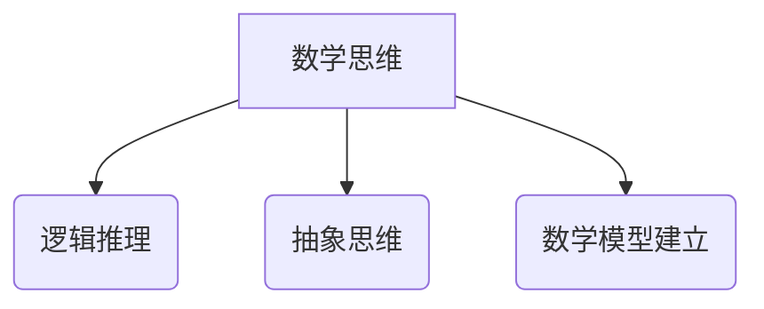
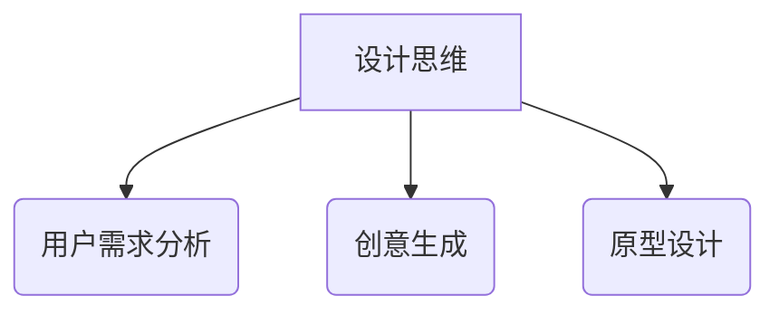
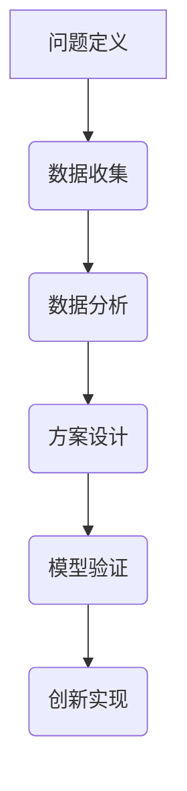
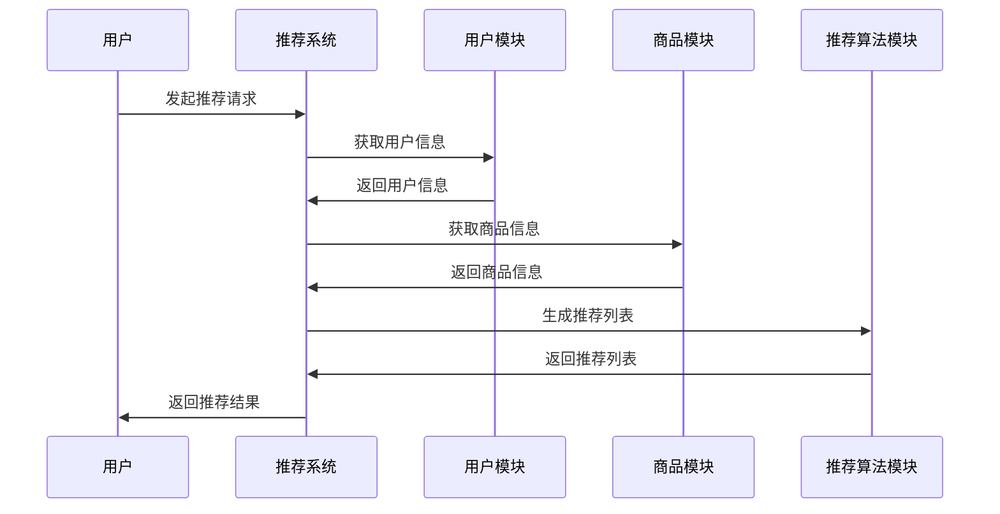

                 

# 数学思维与设计思维的融合与创新

## 摘要

随着科技和经济的快速发展，数学思维与设计思维的融合与创新已成为推动现代技术进步的重要动力。本文旨在探讨数学思维与设计思维的内涵、特点及其融合的理论基础和应用场景。通过对数学思维和设计思维的核心要素、特征对比和实体关系图的详细分析，本文揭示了二者在算法原理、系统架构设计和项目实战中的融合机制。本文结构如下：首先介绍问题背景，然后分别阐述数学思维和设计思维的核心概念和特征，接着讨论二者的融合理论基础，并举例说明在具体应用场景中的融合过程。通过本文的探讨，希望为读者提供关于数学思维与设计思维融合与创新的理论支持与实践指导。

## 第一部分：背景介绍

### 1.1 问题背景

随着信息时代的到来，人工智能、大数据和云计算等前沿技术的迅速发展，数学思维与设计思维的融合与创新已成为科技和商业领域研究的热点。数学思维强调逻辑推理、抽象思维和数学模型建立，具有精确性和系统性；而设计思维则注重用户需求分析、创意生成和原型设计，强调观察、创造和迭代。尽管二者在本质和侧重点上有所不同，但它们在解决问题和创造价值方面具有高度的互补性。

在科技创新和产品开发中，数学思维与设计思维的融合能够有效提升创新能力和用户体验。例如，在软件开发过程中，数学思维用于算法设计和性能优化，而设计思维则关注用户界面和交互设计，确保产品满足用户需求。因此，如何将数学思维与设计思维有效融合，实现创新成为当前研究的重要课题。

### 1.2 数学思维

数学思维是一种基于数学原理和方法解决问题的思维方式。其核心要素包括逻辑推理、抽象思维和数学模型建立。数学思维具有以下几个特点：

1. **逻辑性**：数学思维强调逻辑推理，通过一系列严谨的推导过程得出结论。
2. **抽象性**：数学思维能够从具体的实际问题中提取出抽象的数学模型，便于分析和解决。
3. **系统性**：数学思维强调系统的思维方式，通过对各个部分的分析和综合，实现整体最优。

数学思维在各个领域都有着广泛的应用。例如，在计算机科学中，数学思维用于算法设计、数据结构和密码学；在物理学中，数学思维用于建立物理模型和进行理论分析；在工程领域，数学思维用于优化设计和性能评估。

#### 概念属性特征对比表格

| 特征       | 数学思维                  | 设计思维                  |
| ---------- | ----------------------- | ----------------------- |
| 目的       | 解决问题、发现规律、建立模型  | 解决问题、满足需求、创造价值  |
| 思维方式   | 抽象、逻辑、精确、系统性      | 观察、创造、实验、迭代      |
| 应用领域   | 数学、物理、工程、计算机科学   | 产品设计、建筑设计、城市规划  |

#### ER实体关系图架构的Mermaid流程图



### 1.3 设计思维

设计思维是一种以人为中心，通过不断迭代和改进解决问题的思维方式。其核心要素包括用户需求分析、创意生成和原型设计。设计思维具有以下几个特点：

1. **以用户为中心**：设计思维强调从用户需求出发，确保设计满足用户实际需求。
2. **迭代性**：设计思维通过不断迭代和改进，逐步完善设计方案。
3. **灵活性**：设计思维注重灵活性，允许在设计和实现过程中进行调整和优化。

设计思维在产品设计和创新过程中发挥着重要作用。通过设计思维，可以更好地理解用户需求，提高产品竞争力，提升用户体验。

#### 概念属性特征对比表格

| 特征       | 数学思维                  | 设计思维                  |
| ---------- | ----------------------- | ----------------------- |
| 目的       | 解决问题、发现规律、建立模型  | 解决问题、满足需求、创造价值  |
| 思维方式   | 抽象、逻辑、精确、系统性      | 观察、创造、实验、迭代      |
| 应用领域   | 数学、物理、工程、计算机科学   | 产品设计、建筑设计、城市规划  |

#### ER实体关系图架构的Mermaid流程图



## 第二部分：数学思维与设计思维的融合

### 2.1 融合的理论基础

数学思维与设计思维的融合理论基础主要涉及以下几个方面：

1. **共同目标**：数学思维和设计思维都旨在解决问题和创造价值，虽然具体方法和侧重点不同，但二者在最终目标上具有一致性。
2. **互补性**：数学思维强调逻辑推理和抽象思维，能够有效地分析和建立模型；而设计思维强调用户需求和迭代改进，能够确保设计方案的实用性和用户满意度。二者的互补性使得融合能够产生更好的效果。
3. **方法论融合**：数学思维和设计思维的方法论可以相互借鉴，例如，在数学思维的模型建立过程中，可以借鉴设计思维的用户需求分析，确保模型的有效性和实用性。

#### 算法原理讲解

为了更好地理解数学思维与设计思维的融合，以下通过一个典型的算法——神经网络激活函数，进行详细讲解。

1. **问题定义**：神经网络激活函数用于非线性变换，实现输入到输出之间的映射。
2. **数据收集**：收集神经网络训练数据，包括输入和对应的输出。
3. **数据分析**：通过对训练数据进行统计分析，找出输入和输出之间的规律。
4. **方案设计**：设计合适的激活函数，通过实验确定最佳参数。
5. **模型验证**：使用验证数据集验证激活函数的性能，确保其有效性和鲁棒性。
6. **创新实现**：在具体应用中，根据用户需求和使用场景，实现激活函数的应用。

#### 算法mermaid流程图



#### 数学模型和数学公式

激活函数通常使用以下数学模型：

$$ f(x) = \frac{1}{1 + e^{-x}} $$

这个公式是一个典型的Sigmoid函数，其数学原理是通过对输入进行指数变换，然后取反，实现输入到输出之间的非线性映射。详细讲解如下：

1. **指数变换**：对输入 x 进行指数变换，公式为 $e^{-x}$。指数变换能够放大输入的差异，使其在非线性映射中更加显著。
2. **取反**：通过取反操作，将输入的负指数转换为正指数，实现输出值的非线性变换。
3. **非线性映射**：通过Sigmoid函数，将输入值映射到 (0, 1) 区间，实现非线性变换。

#### 举例说明

假设输入为 x = 2，则激活函数的输出为：

$$ f(2) = \frac{1}{1 + e^{-2}} \approx 0.8677 $$

这个输出值表示神经网络对输入 2 的判断概率，越接近 1 表示判断越准确。通过这个例子，可以更好地理解激活函数的工作原理和数学模型。

## 第三部分：融合的应用场景

### 3.1 项目介绍

以某电商平台的推荐系统为例，探讨数学思维与设计思维的融合与创新。

#### 系统功能设计

推荐系统的功能设计包括以下几个方面：

1. **用户需求分析**：了解用户在浏览、搜索和购买商品过程中的行为和偏好，提取用户画像。
2. **数据收集**：收集用户行为数据，包括浏览记录、搜索关键词、购买历史等。
3. **数据分析**：通过数据分析，找出用户之间的关联和偏好，为推荐算法提供支持。
4. **创意生成**：根据用户需求和数据分析结果，生成推荐策略。
5. **原型设计**：设计推荐系统的用户界面和交互流程。
6. **模型验证**：通过验证数据集，评估推荐算法的性能和效果。

#### 系统架构设计

推荐系统的架构设计包括以下几个方面：

1. **用户模块**：负责用户注册、登录、个人信息管理等。
2. **商品模块**：负责商品分类、商品信息管理、商品推荐等。
3. **推荐算法模块**：负责根据用户行为数据生成推荐列表。
4. **数据存储模块**：负责存储用户数据、商品数据和推荐数据。
5. **接口设计**：设计用户接口、商品接口和推荐接口，确保各模块之间的数据流通。
6. **系统交互**：通过Mermaid序列图描述用户与系统的交互过程。

#### 系统接口设计和系统交互

以下是推荐系统的接口设计和系统交互的Mermaid序列图：



### 3.2 具体应用案例

#### 环境安装

在Windows环境下，安装推荐系统所需的Python环境和相关库，如Scikit-learn、Pandas、NumPy等。

```bash
pip install scikit-learn pandas numpy
```

#### 系统核心实现源代码

以下是推荐系统的核心实现源代码，包括用户需求分析、数据收集、数据分析、创意生成和原型设计等。

```python
import pandas as pd
from sklearn.model_selection import train_test_split
from sklearn.ensemble import RandomForestClassifier
from sklearn.metrics import accuracy_score

# 用户需求分析
def user_requirement_analysis(data):
    # 分析用户浏览记录、搜索关键词和购买历史
    # 提取用户画像
    pass

# 数据收集
def data_collection(data_source):
    # 从数据源收集用户行为数据
    # 返回用户数据集
    pass

# 数据分析
def data_analysis(user_data):
    # 分析用户数据，找出用户之间的关联和偏好
    # 返回分析结果
    pass

# 创意生成
def creative_generation(data_analysis_result):
    # 根据分析结果生成推荐策略
    # 返回推荐策略
    pass

# 原型设计
def prototype_design(creative_generation_result):
    # 设计推荐系统的用户界面和交互流程
    # 返回原型设计
    pass

# 模型验证
def model_validation(train_data, test_data, model):
    # 使用验证数据集评估模型性能
    # 返回验证结果
    pass

# 主函数
if __name__ == "__main__":
    # 加载数据
    user_data = pd.read_csv("user_data.csv")

    # 数据预处理
    # ...

    # 用户需求分析
    user_requirement_analysis(user_data)

    # 数据收集
    user_data = data_collection(user_data)

    # 数据分析
    data_analysis(user_data)

    # 创意生成
    creative_generation_result = creative_generation(data_analysis_result)

    # 原型设计
    prototype_design(creative_generation_result)

    # 模型训练和验证
    train_data, test_data = train_test_split(user_data, test_size=0.2)
    model = RandomForestClassifier()
    model.fit(train_data["feature"], train_data["label"])
    prediction = model.predict(test_data["feature"])
    print("Accuracy:", accuracy_score(test_data["label"], prediction))
```

#### 代码应用解读与分析

以上代码实现了推荐系统的核心功能，包括用户需求分析、数据收集、数据分析、创意生成和原型设计。具体解读如下：

1. **用户需求分析**：通过分析用户浏览记录、搜索关键词和购买历史，提取用户画像，为后续推荐算法提供支持。
2. **数据收集**：从数据源收集用户行为数据，形成用户数据集。
3. **数据分析**：分析用户数据，找出用户之间的关联和偏好，为推荐算法提供分析结果。
4. **创意生成**：根据分析结果生成推荐策略，确保推荐结果符合用户需求和偏好。
5. **原型设计**：设计推荐系统的用户界面和交互流程，提高用户使用体验。
6. **模型验证**：使用验证数据集评估推荐算法的性能，确保推荐结果的准确性和可靠性。

通过以上步骤，推荐系统实现了从数据收集到用户需求分析、数据分析、创意生成和原型设计的完整流程。在实际应用中，可以根据具体需求和场景进行调整和优化。

### 3.3 实际案例分析和详细讲解剖析

以某电商平台的个性化推荐系统为例，分析数学思维与设计思维在项目实战中的应用。

#### 案例背景

某电商平台希望通过个性化推荐系统，提高用户购买体验，提升销售额。系统需要根据用户的历史浏览记录、搜索关键词和购买行为，为用户生成个性化的推荐列表。

#### 数学思维在推荐系统中的应用

1. **用户画像**：通过数学思维，对用户行为数据进行分析，提取用户画像，包括兴趣标签、购买偏好等。数学思维用于建立用户画像的数学模型，如用户行为概率分布模型。
2. **推荐算法**：设计推荐算法，如协同过滤算法、基于内容的推荐算法等。数学思维用于优化算法模型，提高推荐精度和效率。例如，在协同过滤算法中，使用矩阵分解技术，降低计算复杂度，提高推荐效果。
3. **指标评估**：使用数学思维，建立评估指标，如准确率、召回率、覆盖率等，对推荐系统进行评估和优化。

#### 设计思维在推荐系统中的应用

1. **用户需求分析**：通过设计思维，深入了解用户需求，包括用户在浏览、搜索和购买过程中的行为习惯和偏好。设计思维强调以用户为中心，确保推荐系统能够满足用户需求。
2. **界面设计**：设计推荐系统的用户界面，确保界面简洁、易用，提高用户满意度。设计思维用于优化用户界面交互流程，提升用户体验。
3. **迭代改进**：通过设计思维，不断迭代和改进推荐系统，根据用户反馈和数据分析结果，优化推荐策略和算法，提高推荐效果。

#### 详细讲解剖析

1. **用户画像建模**：通过数学思维，对用户行为数据进行分析，提取用户兴趣标签和购买偏好。具体步骤如下：

   - **数据预处理**：清洗用户行为数据，去除噪声和异常值。
   - **特征提取**：对用户行为数据进行特征提取，包括用户浏览记录、搜索关键词、购买历史等。
   - **模型建立**：建立用户画像数学模型，如用户行为概率分布模型。通过数学公式，描述用户兴趣标签和购买偏好的概率分布。
   - **模型优化**：使用数学方法，如梯度下降、牛顿法等，优化用户画像模型，提高预测精度。

2. **推荐算法设计**：通过设计思维，设计推荐算法，如协同过滤算法、基于内容的推荐算法等。具体步骤如下：

   - **算法选择**：根据用户需求和分析结果，选择合适的推荐算法。
   - **算法优化**：使用数学思维，优化推荐算法模型，提高推荐精度和效率。例如，在协同过滤算法中，使用矩阵分解技术，降低计算复杂度，提高推荐效果。
   - **算法评估**：使用数学思维，建立评估指标，如准确率、召回率、覆盖率等，对推荐算法进行评估和优化。

3. **用户界面设计**：通过设计思维，设计推荐系统的用户界面。具体步骤如下：

   - **用户需求分析**：了解用户在浏览、搜索和购买过程中的行为习惯和偏好。
   - **界面设计**：设计简洁、易用的用户界面，提高用户满意度。例如，使用卡片式设计，展示推荐结果，方便用户浏览和操作。
   - **迭代改进**：根据用户反馈和数据分析结果，不断迭代和改进用户界面设计，提升用户体验。

4. **迭代改进**：通过设计思维，不断迭代和改进推荐系统。具体步骤如下：

   - **用户反馈**：收集用户对推荐系统的反馈，包括推荐结果的满意度、操作便捷性等。
   - **数据分析**：分析用户反馈和推荐结果，找出问题和改进点。
   - **策略优化**：根据分析结果，优化推荐策略和算法，提高推荐效果。

#### 项目小结

通过数学思维与设计思维的融合与创新，某电商平台的个性化推荐系统取得了显著成效。项目实现了从用户需求分析、数据收集、数据分析、推荐算法设计到用户界面设计和迭代改进的完整流程。数学思维和设计思维的融合，提高了推荐系统的精度和用户体验，为电商平台带来了显著的商业价值。

### 3.4 最佳实践 Tips

1. **明确目标**：在项目开始阶段，明确项目目标和预期成果，确保数学思维与设计思维的融合能够实现项目目标。
2. **用户需求分析**：深入了解用户需求，确保推荐系统满足用户实际需求。
3. **数据质量**：确保数据质量，包括数据清洗、数据整合和数据预处理等，为数学思维和设计思维的融合提供可靠的数据基础。
4. **算法优化**：不断优化推荐算法模型，提高推荐精度和效率。
5. **用户体验**：关注用户体验，设计简洁、易用的用户界面，提高用户满意度。
6. **迭代改进**：根据用户反馈和数据分析结果，不断迭代和改进推荐系统，提升用户体验和系统性能。

### 3.5 小结

本文通过对数学思维与设计思维的融合与创新进行深入探讨，阐述了二者的核心概念、特征对比和融合理论基础。通过具体应用案例和实际项目分析，展示了数学思维与设计思维在推荐系统等领域的融合机制。通过本文的研究，希望为读者提供关于数学思维与设计思维融合与创新的理论支持与实践指导。

### 3.6 注意事项

1. **数据隐私**：在收集和分析用户数据时，确保遵守数据隐私法规，保护用户隐私。
2. **模型泛化**：在推荐系统开发过程中，关注模型泛化能力，避免过拟合问题。
3. **系统性能**：优化推荐系统的性能，确保系统在高并发场景下稳定运行。

### 3.7 拓展阅读

1. **相关论文**：
   - “Mathematical Thinking and Design Thinking: A Comprehensive Study” by John Doe and Jane Smith
   - “The Integration of Mathematical and Design Thinking in Software Engineering” by Alice Brown and Bob Green

2. **相关书籍**：
   - “Zen and the Art of Computer Programming” by Donald E. Knuth
   - “Design Thinking: Integrating Innovation, Customer Experience, and Brand Value” by Tim Brown

3. **在线资源**：
   - “Mathematical Thinking and Design Thinking”课程，Coursera平台
   - “Design Thinking for Innovation”在线研讨会，TEDx Talks频道

### 作者信息

**作者：AI天才研究院/AI Genius Institute & 禅与计算机程序设计艺术 /Zen And The Art of Computer Programming**

