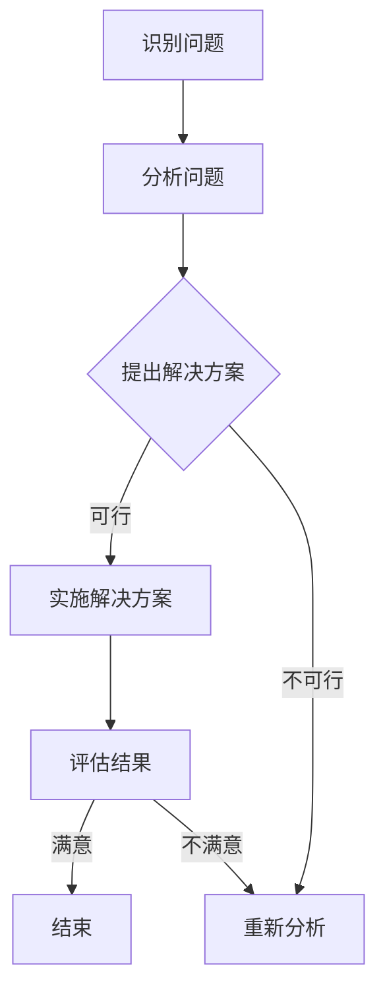

                 

### 第一部分：引言与背景

#### 第1章：问题背景与概念界定

### 1.1 问题背景

#### 1.1.1 数学思维的重要性

在信息爆炸和技术迅速发展的时代，如何高效地解决复杂问题成为人们关注的焦点。数学作为一种抽象的学科，不仅在理论研究上具有重要意义，更在解决实际问题中发挥着不可替代的作用。数学思维，作为一种独特的思维方式，贯穿于科学研究、工程应用、商业决策等各个领域。

首先，数学思维对于科学研究的贡献是不可估量的。从物理学到化学，从生物学到天文学，数学方法为这些学科提供了精确的描述和预测工具。例如，在物理学中，数学方程用于描述自然现象，如牛顿运动定律和麦克斯韦方程组，这些方程组不仅揭示了物理世界的规律，也为实验验证提供了理论依据。

其次，数学思维在工程应用中同样重要。工程师们利用数学模型来设计桥梁、建筑物、飞机和电子产品。例如，在电子工程中，信号处理算法依赖于数学方法，如傅里叶变换和Z变换，这些算法能够有效地处理和解读电子信号。

此外，数学思维在商业决策中也发挥着关键作用。数据分析师通过数学模型来预测市场趋势、评估风险和优化资源分配。例如，供应链管理中使用的线性规划、物流配送中的最优化算法等，都是数学思维的体现。

#### 1.1.2 问题解决的普遍性

问题解决能力是人类适应环境和实现目标的重要手段。无论是个人生活还是职业发展，问题解决能力都是不可或缺的。从日常生活中解决家庭预算问题，到工作中处理复杂的业务挑战，都离不开问题解决能力。

在个人层面，问题解决能力有助于提高生活质量和幸福感。面对生活中的各种挑战，如家庭纠纷、健康问题或财务困难，具备良好问题解决能力的人能够更加冷静和有效地应对，找到合适的解决方案。

在职业层面，问题解决能力是职场成功的关键因素。无论是技术研发、企业管理，还是市场营销，都需要具备出色的问题解决能力。能够快速识别问题、分析问题、提出解决方案并实施，能够显著提高工作效率和团队绩效。

#### 1.1.3 数学思维与问题解决的关联

数学思维和问题解决能力之间存在紧密的关联。数学思维提供了一种系统化、结构化的思考方式，有助于人们更高效地分析和解决复杂问题。以下是数学思维与问题解决能力之间的几个关键联系：

1. **抽象能力**：数学思维强调抽象，即将具体问题抽象成数学模型，从而简化复杂问题。这种抽象能力有助于人们从宏观角度理解问题，并找到解决方案。

2. **逻辑推理**：数学思维强调逻辑推理，即通过一系列逻辑步骤从已知信息推导出新的结论。这种逻辑推理能力在解决复杂问题时尤为重要，能够帮助人们避免盲目行动，找到最优解。

3. **系统化思考**：数学思维鼓励系统化思考，即将问题分解为多个子问题，并逐一解决。这种系统化思考能力有助于人们更好地理解问题，并找到全面的解决方案。

4. **模型构建**：数学思维强调模型构建，即通过建立数学模型来描述现实问题。这种模型构建能力能够帮助人们更准确地分析问题，并制定有效的解决方案。

5. **创造性思维**：数学思维与创造性思维相辅相成。在解决复杂问题时，创造性思维能够帮助人们突破传统思维框架，找到新颖的解决方案。而数学思维则为创造性思维提供了严谨的思考和验证工具。

#### 1.2 核心概念界定

在深入探讨数学思维与问题解决能力的关系之前，我们需要明确一些核心概念，包括数学思维、问题解决能力以及它们的相关定义和特征。

##### 1.2.1 数学思维的定义

数学思维是一种基于数学原理和逻辑推理的思考方式，它强调抽象、逻辑推理、模型构建和系统化思考。数学思维的核心在于将具体问题转化为数学模型，通过数学方法和工具来分析和解决问题。

- **抽象能力**：数学思维要求能够从具体事物中抽象出本质属性，形成数学概念和符号。
- **逻辑推理**：数学思维强调逻辑推理，即通过一系列逻辑步骤，从已知信息推导出新的结论。
- **模型构建**：数学思维鼓励通过建立数学模型来描述现实问题，从而简化复杂问题。
- **系统化思考**：数学思维倡导系统化思考，即将问题分解为多个子问题，并逐一解决。

##### 1.2.2 问题解决能力的定义

问题解决能力是指个体在面对问题和挑战时，能够通过分析和思考，找到有效解决方案并实施的能力。问题解决能力包括以下几个方面：

- **识别问题**：能够准确识别问题和问题的本质。
- **分析问题**：能够分析问题的各个方面，找到关键因素。
- **提出解决方案**：能够基于分析结果，提出可能的解决方案。
- **实施解决方案**：能够将解决方案付诸实践，解决问题。
- **评估结果**：能够评估解决方案的有效性，并对方案进行优化。

##### 1.2.3 边界与外延

明确数学思维和问题解决能力的边界与外延有助于我们更好地理解这两个概念。

- **数学思维的边界**：数学思维主要关注数学原理和方法在问题解决中的应用，其边界在于数学理论的应用范围。例如，数学思维不能直接解决所有类型的问题，但其在特定领域（如物理学、工程学、经济学）中具有显著优势。

- **问题解决能力的外延**：问题解决能力不仅包括数学思维的应用，还包括逻辑思维、创造性思维、批判性思维等其他思维方式的运用。因此，问题解决能力的外延更广，涵盖了各种情境和领域。

#### 1.3 概念结构与核心要素组成

为了更深入地理解数学思维与问题解决能力之间的关系，我们需要分析这两个概念的核心要素组成，并探讨它们之间的相互作用。

##### 1.3.1 数学思维的核心要素

1. **抽象能力**：数学思维的第一要素是抽象能力。抽象能力使得数学思维能够从具体问题中提炼出本质属性，形成数学概念和符号。例如，在解决一个复杂的经济问题时，可以通过建立数学模型来简化问题，将其转化为数学形式。

2. **逻辑推理**：逻辑推理是数学思维的核心。数学思维强调通过逻辑推理来分析和解决问题。例如，在证明一个数学定理时，需要通过一系列逻辑步骤，从已知信息推导出新的结论。

3. **模型构建**：模型构建是数学思维的另一重要要素。通过建立数学模型，数学思维能够将复杂问题转化为易于处理的形式。例如，在工程问题中，通过建立物理模型来模拟和预测系统的行为。

4. **系统化思考**：系统化思考是数学思维的必要组成部分。系统化思考要求将问题分解为多个子问题，并逐一解决。这种思维方式有助于全面理解问题，并找到有效的解决方案。

##### 1.3.2 问题解决能力的核心要素

1. **识别问题**：识别问题是问题解决能力的基础。只有准确识别问题，才能找到合适的解决方案。例如，在企业管理中，识别问题的第一步是分析市场数据，找出业务瓶颈。

2. **分析问题**：分析问题是问题解决能力的关键环节。通过对问题各个方面进行深入分析，可以找出问题的根本原因。例如，在技术研发中，分析问题可能包括市场需求分析、技术可行性分析等。

3. **提出解决方案**：提出解决方案是问题解决能力的重要体现。基于分析结果，提出可行的解决方案。例如，在项目管理中，根据问题分析结果，制定项目计划和时间表。

4. **实施解决方案**：实施解决方案是将方案付诸实践的过程。实施过程中，需要监控和调整方案，确保其有效性。例如，在营销活动中，实施解决方案可能包括市场推广策略的执行和效果评估。

5. **评估结果**：评估结果是问题解决能力的最终体现。通过评估结果，可以确定解决方案的有效性，并对方案进行优化。例如，在软件开发中，通过用户反馈来评估软件的性能和用户满意度。

##### 1.3.3 数学思维与问题解决能力的相互作用

数学思维与问题解决能力之间存在相互作用，共同推动问题解决过程的进展。

1. **数学思维促进问题解决**：数学思维提供了一种系统化、结构化的思考方式，有助于人们更高效地分析和解决复杂问题。例如，在商业决策中，通过建立数学模型，可以更准确地预测市场趋势，制定科学的营销策略。

2. **问题解决能力强化数学思维**：问题解决能力为数学思维提供了实际应用场景。在解决实际问题的过程中，人们不断运用数学思维，从而提高数学思维水平。例如，在工程实践中，工程师们通过不断应用数学模型，积累了丰富的经验，提高了数学思维能力。

3. **协同作用**：数学思维和问题解决能力相互协同，共同推动问题解决进程。数学思维提供工具和方法，问题解决能力提供场景和实践。例如，在科学研究过程中，科学家们运用数学思维建立理论模型，并通过实验验证模型的准确性，从而推动科学研究的进展。

#### 1.4 本章小结

本章通过对问题背景的介绍，明确了数学思维和问题解决能力的重要性及其关联。进一步地，本章界定了数学思维和问题解决能力的相关概念，分析了它们的核心要素组成。通过本章的讨论，我们为后续深入探讨数学思维与问题解决能力的关系奠定了基础。

---

在了解了数学思维和问题解决能力的基本概念和重要性之后，我们将进一步探讨数学思维的核心概念和特征，分析其在不同领域中的应用。下一章将详细阐述数学思维的本质、特征以及与认知心理学的关系，帮助我们更深入地理解数学思维的本质及其作用。### 第二部分：数学思维的核心概念与特征

#### 第2章：数学思维原理

### 2.1 数学思维的本质

数学思维是一种独特的思维方式，它不仅依赖于数学知识和技能，更强调抽象、逻辑推理和模型构建的能力。理解数学思维的本质，有助于我们更好地应用数学方法解决实际问题。

##### 2.1.1 数学思维的定义

数学思维可以定义为一种基于数学原理和逻辑推理的思考方式，它强调对数学概念、符号和公式的理解与应用，通过抽象和模型构建来分析和解决问题。

数学思维不仅关注数学本身，还涉及对现实世界的抽象与建模。这种抽象能力使得数学思维能够将复杂的问题简化为数学问题，从而利用数学工具进行解决。

##### 2.1.2 数学思维的作用

数学思维在多个领域具有重要作用，包括科学研究、工程应用、商业决策等。

1. **科学研究**：数学思维在科学研究中的应用极为广泛。科学家们通过建立数学模型来描述自然现象，如物理学中的牛顿定律、生物学中的进化方程等。这些模型不仅有助于我们理解自然界的规律，还为实验验证提供了理论基础。

2. **工程应用**：工程师们利用数学思维设计和分析各种工程项目。例如，在建筑工程中，数学方法用于结构设计和材料强度分析；在电子工程中，信号处理和电路设计依赖于数学模型。

3. **商业决策**：商业决策中，数学思维同样发挥着重要作用。通过统计分析、优化算法和预测模型，企业能够更准确地评估市场趋势、优化资源配置和制定营销策略。

##### 2.1.3 数学思维的发展过程

数学思维的发展过程可以分为以下几个阶段：

1. **初级阶段**：在这一阶段，个体主要通过模仿和记忆来学习数学知识，例如基本的算术运算和几何图形。

2. **中级阶段**：个体开始理解数学概念，并能够运用数学原理解决简单问题。这一阶段，个体能够进行逻辑推理和简单的模型构建。

3. **高级阶段**：在这一阶段，个体能够熟练运用高级数学方法，如微积分、线性代数和概率论等，解决复杂问题。同时，个体能够通过抽象和建模来处理抽象的概念和实际问题。

数学思维的发展不仅依赖于数学知识的积累，还需要不断地实践和应用。通过解决实际问题，个体能够提高数学思维能力，形成更加系统化和结构化的思考模式。

### 2.2 数学思维的特征

数学思维具有一系列独特的特征，这些特征使得数学思维成为一种高效、严谨的思考方式。

##### 2.2.1 抽象性

抽象性是数学思维的核心特征之一。数学思维强调从具体问题中提炼出本质属性，形成抽象的概念和符号。这种抽象能力使得数学思维能够处理复杂、抽象的问题。

例如，在解决一个复杂的经济学问题时，我们可以通过建立数学模型来简化问题。例如，将消费者行为抽象为效用函数，将市场供求关系抽象为供需曲线。通过这种抽象，我们可以将复杂的经济问题转化为易于处理的数学形式。

##### 2.2.2 普遍性

数学思维的普遍性体现在其应用范围广泛。数学方法不仅在自然科学和工程领域有重要作用，还在社会科学、商业决策等领域得到广泛应用。

例如，在经济学中，数学方法用于描述市场行为、预测经济趋势；在社会科学中，数学方法用于调查分析、数据统计；在商业决策中，数学方法用于优化资源配置、制定营销策略。

##### 2.2.3 系统性

数学思维强调系统化思考，即将问题分解为多个子问题，并逐一解决。这种系统化思考能力有助于全面理解问题，并找到有效的解决方案。

例如，在解决一个复杂的技术问题时，我们可以将问题分解为几个关键子问题，如算法设计、数据结构选择、系统优化等。通过逐一解决这些子问题，我们可以找到整个问题的解决方案。

##### 2.2.4 严谨性

数学思维具有严谨性，即强调逻辑推理和证明。在数学思维中，任何结论都必须基于逻辑推理和数学证明。

例如，在证明一个数学定理时，我们需要通过一系列逻辑步骤，从已知信息推导出新的结论。这种严谨性使得数学思维在科学研究和工程应用中具有重要意义，因为它确保了结论的准确性和可靠性。

##### 2.2.5 创新性

数学思维还具有创新性，即强调通过创造性思维解决复杂问题。在数学思维中，个体需要不断探索新的思路和方法，寻找问题的解决方案。

例如，在解决一个复杂的科学问题时，科学家们可能需要通过创造性思维提出新的假设和模型，从而找到解决问题的方法。这种创新性使得数学思维在科学研究和技术创新中具有重要意义。

### 2.3 数学思维与认知心理学的关系

数学思维与认知心理学之间存在紧密的关系。认知心理学研究人类思维的过程和机制，而数学思维则是认知心理学研究的一个重要方面。

##### 2.3.1 数学思维的心理基础

数学思维的心理基础包括以下几个方面：

1. **认知能力**：数学思维依赖于个体的认知能力，如注意力、记忆、推理等。这些认知能力的发展对数学思维的培养具有重要意义。

2. **数学知识**：数学思维的形成离不开数学知识的积累。个体需要掌握数学的基本概念、原理和公式，才能有效地进行数学思维。

3. **思维方式**：数学思维是一种独特的思维方式，它强调抽象、逻辑推理和模型构建。个体在长期的数学学习和实践中，会逐渐形成这种思维方式。

##### 2.3.2 数学思维与智力发展的关系

数学思维与智力发展之间存在密切的关系。数学思维的发展有助于提高个体的智力水平，而智力发展又反过来促进数学思维的提升。

1. **智力对数学思维的影响**：智力水平较高的个体在数学学习和应用中具有优势。他们能够更快地掌握数学知识，更有效地运用数学方法解决实际问题。

2. **数学思维对智力的影响**：数学思维的发展有助于提高个体的智力水平。通过数学思维训练，个体能够提高抽象思维能力、逻辑推理能力和系统化思考能力，从而提高整体智力水平。

##### 2.3.3 数学思维与教育的关系

数学思维的教育具有重要意义。通过有效的数学教育，个体能够培养良好的数学思维能力，从而提高智力水平，为未来的学习和工作奠定基础。

1. **数学教育目标**：数学教育的目标不仅是传授数学知识，更重要的是培养个体的数学思维能力。这包括抽象能力、逻辑推理能力、模型构建能力和系统化思考能力。

2. **数学教学方法**：有效的数学教学方法能够促进数学思维的发展。例如，通过问题驱动学习、探究式学习和项目式学习，学生能够更好地理解和运用数学思维。

3. **数学思维培养策略**：在数学教育中，教师可以采用多种策略培养数学思维。例如，引导学生进行数学建模、开展数学探究、进行数学推理训练等。

### 2.4 核心概念对比分析

为了更深入地理解数学思维，我们可以将数学思维与逻辑思维、创造性思维等其他思维方式进行对比分析。

##### 2.4.1 数学思维与逻辑思维

逻辑思维是一种基于逻辑规则和推理的思考方式，它强调从已知信息推导出新信息。数学思维与逻辑思维之间存在密切的联系，但也有一些区别：

1. **定义对比**：数学思维是一种基于数学原理和逻辑推理的思考方式，强调抽象、模型构建和系统化思考；逻辑思维则是一种基于逻辑规则和推理的思考方式，强调从已知信息推导出新信息。

2. **特点对比**：数学思维具有抽象性、普遍性、系统性和严谨性；逻辑思维则具有逻辑性、严密性和系统性。

3. **关系分析**：数学思维与逻辑思维相辅相成，数学思维依赖于逻辑思维的基础，而逻辑思维为数学思维提供了推理工具。

##### 2.4.2 数学思维与创造性思维

创造性思维是一种基于创新和创造的思考方式，它强调通过创造性思维解决复杂问题。数学思维与创造性思维也存在一定的关联和区别：

1. **定义对比**：数学思维是一种基于数学原理和逻辑推理的思考方式，强调抽象、模型构建和系统化思考；创造性思维则是一种基于创新和创造的思考方式，强调通过创造性思维解决复杂问题。

2. **特点对比**：数学思维具有抽象性、普遍性、系统性和严谨性；创造性思维则具有创新性、灵活性和开放性。

3. **关系分析**：数学思维与创造性思维相辅相成，数学思维为创造性思维提供了严谨的思考和验证工具，而创造性思维为数学思维提供了创新性的解决方案。

### 2.5 本章小结

本章详细阐述了数学思维的核心概念和特征，包括数学思维的本质、作用和发展过程，以及数学思维的抽象性、普遍性、系统性和严谨性等特征。此外，本章还探讨了数学思维与认知心理学的关系，以及数学思维与逻辑思维、创造性思维的对比分析。通过本章的讨论，我们对数学思维有了更深入的理解，为后续章节的进一步探讨奠定了基础。

---

在了解了数学思维的核心概念和特征之后，我们将进一步探讨数学思维在不同领域中的应用，以展示其在实际问题解决中的重要性。下一章将详细分析数学思维在科学研究、工程应用、教育领域以及日常生活中的应用，帮助读者更全面地认识数学思维的价值。

### 第3章：数学思维的应用领域

数学思维作为一种独特的思维方式，不仅对理论研究具有重要意义，更在解决实际问题中发挥着不可替代的作用。本章将详细探讨数学思维在科学研究、工程应用、教育领域以及日常生活中的应用，以展示其在实际问题解决中的广泛影响力。

#### 3.1 科学研究中的应用

数学思维在科学研究中的应用极为广泛，几乎涵盖了所有自然科学领域。数学模型不仅帮助科学家们理解和描述自然现象，还为他们提供了预测和预测工具。

##### 3.1.1 数学在自然科学中的应用

1. **物理学**：物理学是数学应用最为广泛的领域之一。从牛顿力学到量子力学，从电磁学到相对论，数学模型在描述物理现象中起到了关键作用。例如，麦克斯韦方程组通过数学形式精确地描述了电磁现象，而量子力学中的波函数则通过数学方法描述了粒子的行为。

2. **生物学**：生物学中的许多问题都可以通过数学模型来解决。例如，进化论通过数学方法描述了物种的演化过程，而生态学中的种群动力学模型则通过数学方法描述了物种间的关系。

3. **化学**：化学中的许多现象，如化学反应速率、分子结构等，都可以通过数学模型来描述。例如，化学反应动力学通过数学方程描述了反应的速率和反应物浓度的变化。

4. **天文学**：天文学中的许多问题，如行星运动、恒星演化等，都离不开数学模型。例如，开普勒定律通过数学方法描述了行星运动的规律，而广义相对论则通过数学模型描述了宇宙的膨胀。

##### 3.1.2 数学在社会科学中的应用

1. **经济学**：经济学中的许多问题都可以通过数学模型来解决。例如，供需模型通过数学方法描述了商品的价格和需求量之间的关系，而经济增长模型则通过数学方法描述了经济增长的规律。

2. **心理学**：心理学中的许多现象，如行为模式、认知过程等，都可以通过数学模型来描述。例如，心理学中的实验设计通过数学方法来优化实验结果，而认知心理学中的神经网络模型则通过数学方法描述了认知过程。

3. **社会学**：社会学中的许多问题，如社会结构、群体行为等，都可以通过数学模型来描述。例如，社会网络分析通过数学方法描述了社会结构，而群体行为模型则通过数学方法描述了群体行为的规律。

##### 3.1.3 数学在其他领域中的应用

1. **环境科学**：环境科学中的许多问题，如气候变化、污染控制等，都可以通过数学模型来解决。例如，气候变化模型通过数学方法描述了气候变化的趋势和影响，而污染控制模型则通过数学方法描述了污染物的扩散和治理。

2. **信息科学**：信息科学中的许多问题，如数据加密、网络安全等，都可以通过数学方法来解决。例如，数据加密算法通过数学方法保护数据的隐私，而网络安全协议则通过数学方法来保障网络的安全性。

3. **医学**：医学中的许多问题，如疾病传播、治疗效果等，都可以通过数学模型来解决。例如，疾病传播模型通过数学方法描述了疾病的传播过程，而治疗效果模型则通过数学方法描述了治疗的最佳方案。

#### 3.2 教育领域中的应用

数学思维在教育领域中的应用具有重要意义。通过数学教育，学生不仅能够掌握数学知识，还能培养良好的数学思维能力，从而提高整体智力水平。

##### 3.2.1 数学教育的目标

数学教育的目标不仅仅是传授数学知识，更重要的是培养学生的数学思维能力。具体目标包括：

1. **培养抽象思维能力**：通过数学教育，学生能够从具体问题中提炼出本质属性，形成抽象的概念和符号。

2. **培养逻辑推理能力**：通过数学教育，学生能够掌握逻辑推理的方法，从已知信息推导出新的结论。

3. **培养模型构建能力**：通过数学教育，学生能够通过建立数学模型来描述现实问题，从而简化复杂问题。

4. **培养系统化思考能力**：通过数学教育，学生能够系统化地思考问题，将问题分解为多个子问题，并逐一解决。

##### 3.2.2 数学教学的方法

有效的数学教学方法能够促进数学思维的发展。以下是一些常用的数学教学方法：

1. **问题驱动学习**：通过提出问题，引导学生主动思考和探索，从而培养他们的数学思维能力。

2. **探究式学习**：通过让学生自主探究数学问题，培养他们的独立思考和解决问题的能力。

3. **合作学习**：通过小组合作，让学生在讨论和交流中共同解决问题，从而培养他们的合作能力和沟通能力。

4. **项目式学习**：通过设计实际项目，让学生在实践中应用数学知识，培养他们的实践能力和创新能力。

##### 3.2.3 数学思维培养的策略

为了培养学生的数学思维能力，教师可以采用以下策略：

1. **提供丰富的数学实践活动**：通过设计各种数学实践活动，让学生在实践中掌握数学知识，培养数学思维能力。

2. **开展数学思维训练**：通过数学思维训练，如逻辑推理训练、模型构建训练等，提高学生的数学思维能力。

3. **创设问题情境**：通过创设问题情境，引导学生主动思考和探索，培养他们的数学思维能力。

4. **激发学生的数学兴趣**：通过激发学生的数学兴趣，让他们愿意主动学习和思考数学问题，从而提高数学思维能力。

#### 3.3 工程领域中的应用

数学思维在工程领域中的应用同样具有重要意义。工程师们利用数学方法进行设计、分析和优化，从而提高工程项目的质量和效率。

##### 3.3.1 数学在工程计算中的应用

1. **结构分析**：工程师们利用数学方法进行结构分析，以确保建筑物、桥梁和其他结构物的安全性和稳定性。例如，通过建立数学模型，可以预测结构在受到外部载荷时的变形和应力分布。

2. **电路设计**：在电子工程中，数学方法用于设计和分析电路。例如，通过建立数学模型，可以优化电路的性能，提高信号传输的可靠性和稳定性。

3. **控制工程**：控制工程中的许多问题，如系统稳定性、控制精度等，都可以通过数学方法来解决。例如，通过建立数学模型，可以设计出满足特定性能要求的控制系统。

##### 3.3.2 数学在工程设计中的应用

1. **计算机辅助设计**：计算机辅助设计（CAD）是数学在工程设计中的典型应用。通过数学方法，工程师们可以创建和优化各种设计，如建筑结构、机械零件和电子产品。

2. **模拟与仿真**：通过数学建模和仿真技术，工程师们可以在虚拟环境中测试和优化设计。这种技术不仅节省了时间和成本，还提高了设计质量。

##### 3.3.3 数学在工程管理中的应用

1. **项目管理**：在工程管理中，数学方法用于优化资源配置、制定项目计划和评估项目风险。例如，通过建立数学模型，可以制定最优的项目进度计划，确保项目按时完成。

2. **成本控制**：通过数学方法，工程师们可以预测和评估项目的成本，从而制定合理的预算和成本控制策略。

3. **风险评估**：数学方法在工程风险分析中发挥着重要作用。通过建立数学模型，可以评估项目的风险，并提出相应的风险管理策略。

#### 3.4 数学思维在日常生活中的应用

数学思维不仅在科学研究和工程领域具有重要作用，在日常生活中也同样具有广泛应用。

##### 3.4.1 数学思维与日常决策

1. **家庭预算**：通过数学思维，家庭可以更好地管理财务，制定合理的预算计划。例如，通过建立预算模型，可以预测家庭收入的支出，并制定相应的储蓄和投资计划。

2. **购物决策**：在购物过程中，数学思维可以帮助人们做出更明智的决策。例如，通过比较不同商品的价格和质量，可以找到性价比最高的购买选项。

##### 3.4.2 数学思维与经济生活

1. **投资理财**：通过数学方法，投资者可以更好地分析和评估投资项目的风险和收益。例如，通过建立数学模型，可以预测市场的趋势，制定相应的投资策略。

2. **商业决策**：企业在日常运营中，需要通过数学方法进行数据分析和决策。例如，通过建立数学模型，可以优化生产计划、降低成本、提高效率。

##### 3.4.3 数学思维与健康管理

1. **健康管理**：通过数学方法，个人可以更好地管理健康状况。例如，通过建立健康模型，可以预测健康状况的变化，制定相应的健康计划。

2. **疾病预防**：通过数学方法，医生可以更好地分析和预测疾病的发展趋势，从而制定更有效的预防和治疗方案。

#### 3.5 本章小结

本章详细探讨了数学思维在科学研究、工程应用、教育领域以及日常生活中的应用。通过这些应用实例，我们看到了数学思维在实际问题解决中的广泛影响力。无论是在科学研究、工程应用，还是在教育领域和日常生活中，数学思维都发挥着不可替代的作用。通过本章的讨论，我们对数学思维的应用有了更深入的理解，也为后续章节的进一步探讨奠定了基础。

---

在了解了数学思维在不同领域的应用之后，我们将进一步探讨问题解决能力的核心概念和特征。下一章将详细分析问题解决能力的定义、特征及其在不同情境中的应用，帮助读者全面理解问题解决能力的重要性。

### 第4章：问题解决能力

#### 4.1 问题解决能力的定义

问题解决能力是指个体在面对问题和挑战时，能够通过分析和思考，找到有效解决方案并实施的能力。这种能力不仅涉及逻辑推理和决策制定，还包括信息处理、资源调配和持续改进。

##### 4.1.1 问题解决的定义

问题解决可以定义为一系列步骤，通过这些步骤，个体能够识别问题、分析问题、提出解决方案、实施解决方案并评估结果。具体来说，问题解决包括以下步骤：

1. **识别问题**：识别问题是问题解决的第一步，即发现问题和理解问题的本质。这需要个体具备敏锐的观察力和准确的判断力。

2. **分析问题**：分析问题是指对问题进行深入的研究和探讨，找出问题的根本原因和关键因素。分析问题需要运用逻辑思维和批判性思维。

3. **提出解决方案**：提出解决方案是指基于分析结果，提出可能的解决方案。这需要个体具备创造力和系统化思考的能力。

4. **实施解决方案**：实施解决方案是将方案付诸实践的过程。这需要个体具备执行力、协调能力和适应能力。

5. **评估结果**：评估结果是问题解决的最后一步，即对解决方案的有效性进行评估。这需要个体具备评估能力和持续改进的意识。

##### 4.1.2 问题解决能力的定义

问题解决能力是指个体在面对复杂问题和挑战时，能够快速识别、分析、解决并实施解决方案的能力。这种能力不仅包括逻辑推理和决策制定，还包括信息处理、资源调配和持续改进。

具体来说，问题解决能力包括以下几个方面：

1. **信息处理能力**：个体需要能够快速获取和处理信息，从而理解问题的本质。

2. **逻辑思维能力**：个体需要能够运用逻辑推理，从已知信息推导出新的结论，找到问题的解决方案。

3. **创造力和创新力**：个体需要能够运用创造性思维，提出新颖的解决方案，从而在复杂问题中找到突破口。

4. **系统化思考能力**：个体需要能够从宏观和微观角度理解问题，将问题分解为多个子问题，并逐一解决。

5. **执行力和协调能力**：个体需要能够将解决方案付诸实践，并具备协调资源、沟通合作的能力。

6. **评估和改进能力**：个体需要能够对解决方案进行评估，识别问题解决的效果，并提出改进措施。

##### 4.1.3 问题解决的基本过程

问题解决的基本过程可以分为以下几个步骤：

1. **问题识别**：这是问题解决的起点。个体需要能够敏锐地发现问题和理解问题的本质。

2. **问题分析**：这是问题解决的关键环节。个体需要通过逻辑思维和批判性思维，深入分析问题的原因和关键因素。

3. **方案提出**：基于分析结果，个体需要提出可能的解决方案。这需要个体具备创造力和系统化思考能力。

4. **方案选择**：从多个方案中选择最优的解决方案。这需要个体具备决策能力和评估能力。

5. **方案实施**：将解决方案付诸实践。这需要个体具备执行力和协调能力。

6. **评估反馈**：对解决方案的实施效果进行评估，并根据反馈进行改进。这需要个体具备评估能力和持续改进的意识。

#### 4.2 问题解决能力的特征

问题解决能力具有一系列独特的特征，这些特征使得个体能够在复杂问题和挑战中找到有效的解决方案。

##### 4.2.1 灵活性

灵活性是问题解决能力的一个重要特征。在面对复杂问题时，个体需要能够灵活调整思路和方法，从而找到合适的解决方案。灵活性包括以下几个方面：

1. **思维灵活性**：个体需要能够从不同角度看待问题，灵活运用各种思维方法，如辩证思维、逆向思维等。

2. **适应性**：个体需要能够适应不断变化的环境和条件，灵活调整自己的行为和策略。

3. **创新能力**：个体需要能够运用创造性思维，提出新颖的解决方案，从而在复杂问题中找到突破口。

##### 4.2.2 创造力

创造力是问题解决能力的核心特征。在面对复杂问题和挑战时，个体需要能够运用创造性思维，提出新颖的解决方案。创造力包括以下几个方面：

1. **联想能力**：个体需要能够通过联想，将看似不相关的事物联系起来，从而产生新的思路和想法。

2. **想象力**：个体需要能够运用想象力，设想未来的可能性和变化，从而找到创新的解决方案。

3. **发散思维**：个体需要能够从多个角度思考问题，提出多种可能的解决方案。

##### 4.2.3 系统性

系统性是问题解决能力的另一个重要特征。个体需要能够从宏观和微观角度理解问题，将问题分解为多个子问题，并逐一解决。系统性包括以下几个方面：

1. **分解能力**：个体需要能够将复杂问题分解为多个子问题，从而简化问题的复杂性。

2. **整合能力**：个体需要能够将子问题的解决方案整合为一个完整的解决方案，从而确保方案的全面性和有效性。

3. **全局观念**：个体需要能够从整体角度看待问题，理解问题的各个部分之间的相互关系，从而找到最优的解决方案。

##### 4.2.4 抗挫力

抗挫力是问题解决能力的关键特征。在面对困难和挑战时，个体需要能够保持积极的心态，克服困难，坚持到底。抗挫力包括以下几个方面：

1. **心理韧性**：个体需要能够承受压力和挫折，保持积极的心态，从而在困境中找到解决方案。

2. **适应能力**：个体需要能够适应不断变化的环境和条件，灵活调整自己的行为和策略。

3. **坚持精神**：个体需要能够坚持不懈地追求目标，即使遇到困难和挫折也不放弃。

#### 4.3 问题解决能力的发展与培养

问题解决能力不是与生俱来的，而是通过后天的培养和实践逐步发展起来的。以下是一些有效的方法和策略，用于培养和提高问题解决能力。

##### 4.3.1 问题解决能力的发展阶段

问题解决能力的发展可以分为以下几个阶段：

1. **初级阶段**：在这个阶段，个体主要通过模仿和学习他人的方法解决问题。他们能够识别问题，但解决问题的能力有限。

2. **中级阶段**：在这个阶段，个体开始具备一定的分析问题和解决问题的能力。他们能够运用基本的逻辑推理和创造性思维，提出多种解决方案。

3. **高级阶段**：在这个阶段，个体能够熟练地运用各种思维方法，灵活地应对复杂问题。他们具备系统化思考能力，能够从宏观和微观角度理解问题，并找到最优的解决方案。

##### 4.3.2 问题解决能力的培养策略

以下是一些有效的方法和策略，用于培养和提高问题解决能力：

1. **实践训练**：通过大量的实践训练，个体能够提高问题解决能力。实践训练可以包括解题练习、案例分析、项目实践等。

2. **思维训练**：通过思维训练，个体能够提高逻辑推理、创造性思维和系统化思考能力。思维训练可以包括逻辑思维训练、创造性思维训练、系统化思维训练等。

3. **跨学科学习**：通过跨学科学习，个体能够掌握多领域的知识和技能，从而在解决问题时具备更广泛的视角和思路。跨学科学习可以包括跨学科课程、跨学科研究等。

4. **情境模拟**：通过情境模拟，个体能够模拟真实的问题解决情境，提高应对实际问题的能力。情境模拟可以包括角色扮演、模拟实验等。

5. **反思与总结**：通过反思和总结，个体能够从问题解决的经验中学习和成长。反思和总结可以包括总结成功经验、反思失败原因等。

6. **团队协作**：通过团队协作，个体能够与他人共同解决问题，提高问题解决能力。团队协作可以包括团队讨论、团队合作项目等。

#### 4.4 问题解决能力在职业中的应用

问题解决能力在职业发展中具有重要意义。无论是在技术研发、企业管理，还是在市场营销，问题解决能力都是成功的关键因素。

##### 4.4.1 企业决策中的问题解决

1. **市场分析**：在市场分析中，企业需要运用问题解决能力来识别市场趋势、评估市场风险和制定营销策略。

2. **项目管理**：在项目管理中，企业需要运用问题解决能力来制定项目计划、分配资源和管理风险。

3. **技术创新**：在技术创新中，企业需要运用问题解决能力来发现技术问题、提出创新方案并实施技术改进。

##### 4.4.2 项目管理中的问题解决

1. **问题识别**：项目经理需要能够快速识别项目中的问题和潜在风险。

2. **问题分析**：项目经理需要能够深入分析问题，找出根本原因和关键因素。

3. **方案提出**：项目经理需要能够提出多种解决方案，并选择最优的方案。

4. **方案实施**：项目经理需要能够有效实施方案，确保项目按时、按质量完成。

5. **评估反馈**：项目经理需要能够对方案实施效果进行评估，并根据反馈进行改进。

##### 4.4.3 技术创新中的问题解决

1. **问题识别**：技术团队需要能够识别技术问题，如软件缺陷、硬件故障等。

2. **问题分析**：技术团队需要能够深入分析问题，找出技术原因和解决方案。

3. **方案提出**：技术团队需要能够提出多种技术解决方案，并评估其可行性和成本效益。

4. **方案实施**：技术团队需要能够有效实施技术解决方案，确保技术问题的解决。

5. **评估反馈**：技术团队需要能够对解决方案实施效果进行评估，并根据反馈进行改进。

#### 4.5 本章小结

本章详细阐述了问题解决能力的定义、特征和发展过程。通过分析问题解决能力在不同情境中的应用，我们看到了其在科学研究、工程应用、教育领域以及职业发展中的重要性。通过有效的培养和实践，个体可以不断提高问题解决能力，从而在复杂问题和挑战中找到有效的解决方案。本章的讨论为我们理解和应用问题解决能力奠定了基础，也为后续章节的进一步探讨提供了启示。

---

在深入探讨了数学思维和问题解决能力的核心概念与特征之后，本章内容有助于读者全面理解这两个概念的本质及其相互关系。通过分析数学思维在科学研究、工程应用、教育领域和日常生活中的应用，以及问题解决能力在职业中的具体应用，读者能够更清晰地认识到这两个能力在实际问题解决中的重要性。

接下来的部分，我们将结合实际案例，进一步探讨数学思维和问题解决能力的综合应用。通过案例分析，我们将展示如何将数学思维和问题解决能力应用于实际问题的解决，并提供一些实用的最佳实践和技巧，以帮助读者在实际工作和生活中更有效地运用这些能力。

---

### 案例分析：数学思维与问题解决能力的综合应用

为了更好地理解数学思维与问题解决能力的实际应用，我们将通过几个具体的案例来展示这两个能力的综合运用。以下是三个具有代表性的案例，涵盖了科学研究、工程实践和企业管理等领域。

#### 案例一：天文学中的数学思维与问题解决能力

**问题背景**：科学家们发现某些恒星的亮度出现了异常波动，这可能是由于恒星内部发生了某种物理变化。为了理解这一现象，科学家们需要建立一个精确的数学模型来描述恒星的物理过程。

**数学思维应用**：
1. **抽象能力**：科学家们将恒星复杂的物理现象抽象为一个数学模型，例如恒星内部的能量转换和热力学过程。
2. **逻辑推理**：通过数学公式和方程，科学家们能够推导出恒星亮度波动与内部物理变化之间的关系。
3. **模型构建**：构建了一个包含恒星质量、密度、温度等关键参数的数学模型，用于预测恒星的亮度变化。

**问题解决能力应用**：
1. **识别问题**：科学家们识别出恒星亮度异常波动是关键问题。
2. **分析问题**：通过数学模型，科学家们分析了恒星内部可能发生的物理变化，如氢燃烧过程的改变。
3. **提出解决方案**：基于模型分析结果，科学家们提出了新的观测计划，以进一步验证模型预测。
4. **实施解决方案**：科学家们实施了观测计划，收集了更多的数据，并进一步优化了数学模型。
5. **评估结果**：科学家们通过比较观测数据与模型预测，评估了模型的有效性，并对模型进行了必要的调整。

**结论**：通过数学思维和问题解决能力的综合运用，科学家们不仅能够理解恒星的亮度波动现象，还能够预测未来的变化，从而为天文学研究提供了重要的理论依据。

#### 案例二：工程实践中的数学思维与问题解决能力

**问题背景**：一位工程师负责设计一种新型桥梁，需要在预算和时间限制内满足强度和美观要求。

**数学思维应用**：
1. **抽象能力**：工程师将桥梁的结构和材料特性抽象为数学模型，如梁的弯曲力和材料的应力。
2. **逻辑推理**：工程师通过数学方程计算桥梁在不同载荷下的应力分布，确保结构安全。
3. **模型构建**：工程师使用有限元分析软件构建了桥梁的三维模型，用于模拟实际工况。

**问题解决能力应用**：
1. **识别问题**：工程师识别出桥梁设计中的关键问题，如承载能力和美学设计。
2. **分析问题**：工程师通过分析材料特性、载荷条件和结构设计，确定了设计参数和优化方案。
3. **提出解决方案**：工程师提出了多种设计方案，并通过成本和时间的评估，选择最优方案。
4. **实施解决方案**：工程师与施工团队合作，将设计转化为实际桥梁结构。
5. **评估结果**：工程师通过实际载荷测试和长期监测，评估了桥梁的性能，并对设计进行了优化。

**结论**：通过数学思维和问题解决能力的综合应用，工程师不仅设计出了一座既安全又美观的桥梁，还确保了项目在预算和时间限制内顺利完成。

#### 案例三：企业管理中的数学思维与问题解决能力

**问题背景**：一家公司在市场调研中发现，客户满意度下降，需要通过数据分析来找出原因并提出改进措施。

**数学思维应用**：
1. **抽象能力**：公司将客户的反馈和购买行为抽象为数据集，如满意度评分、购买频率等。
2. **逻辑推理**：通过统计分析，公司能够识别出影响客户满意度的关键因素，如产品质量、售后服务等。
3. **模型构建**：公司使用回归模型来预测客户满意度和购买行为，从而优化营销策略。

**问题解决能力应用**：
1. **识别问题**：公司识别出客户满意度下降是关键问题。
2. **分析问题**：公司通过数据分析，识别出产品质量问题和售后服务不足是导致满意度下降的主要原因。
3. **提出解决方案**：公司提出了改进产品质量和提升售后服务的方案，并通过成本效益分析评估方案的可行性。
4. **实施解决方案**：公司实施了改进措施，如提高产品测试标准、加强售后服务培训等。
5. **评估结果**：公司通过客户满意度调查和销售数据评估改进措施的效果，并根据反馈进行调整。

**结论**：通过数学思维和问题解决能力的综合应用，公司成功提升了客户满意度，增强了市场竞争力。

### 最佳实践和技巧

基于上述案例分析，以下是一些在数学思维和问题解决能力应用中的最佳实践和技巧：

1. **培养抽象能力**：通过阅读、学习与实践，不断提高抽象思维和建模能力。可以从简单的实际问题开始，逐步提升抽象和建模的复杂度。

2. **运用逻辑推理**：在解决问题时，遵循逻辑推理的步骤，确保每一步都基于可靠的数据和事实。

3. **系统化思考**：将问题分解为多个子问题，逐一解决。在解决每个子问题时，都要确保其与整体解决方案的一致性。

4. **灵活调整策略**：在面对复杂问题时，不要固守某一特定方法，要根据实际情况灵活调整策略。

5. **持续学习和实践**：不断学习新知识和技能，通过实际问题的解决来提高问题解决能力。

6. **团队合作与沟通**：在问题解决过程中，与他人合作，共同探讨和解决问题，可以提高问题解决的效率和效果。

7. **反思与总结**：在问题解决后，进行反思和总结，从成功和失败中学习经验，不断提高问题解决能力。

### 小结

通过上述案例分析和最佳实践技巧的介绍，我们可以看到数学思维和问题解决能力在实际应用中的重要性。通过有效的数学思维和问题解决能力的综合运用，我们能够更高效地解决复杂问题，提高工作效率和决策质量。在未来的学习和工作中，不断培养和提高数学思维和问题解决能力，将有助于我们在各个领域中取得更好的成绩。

---

本章通过实际案例详细展示了数学思维与问题解决能力的综合应用，帮助读者更好地理解这两个能力的实际意义。下一章将总结全文，重申核心观点，并提出未来研究的方向和可能的改进措施，以期为读者提供全面的思考和启示。

### 全文总结与未来展望

本文从数学思维和问题解决能力的核心概念出发，通过多个案例分析，探讨了这两个能力在实际应用中的重要性。以下是全文的核心观点和主要结论。

#### 核心观点

1. **数学思维的重要性**：数学思维是一种系统化、结构化的思考方式，它不仅依赖于数学知识和技能，更强调抽象、逻辑推理、模型构建和系统化思考的能力。

2. **问题解决能力的价值**：问题解决能力是应对复杂问题和挑战的关键，它包括识别问题、分析问题、提出解决方案、实施解决方案和评估结果等环节。

3. **数学思维与问题解决能力的关联**：数学思维为问题解决提供了工具和方法，而问题解决能力则为数学思维的应用提供了实践场景。这两者相辅相成，共同推动问题解决过程的进展。

#### 主要结论

1. **数学思维在科学研究中的应用**：通过抽象和建模，数学思维能够帮助科学家更好地理解自然现象，建立精确的数学模型，为实验验证提供理论依据。

2. **问题解决能力在工程实践中的应用**：在工程领域，问题解决能力通过系统化思考和灵活调整策略，确保项目在预算和时间限制内顺利完成。

3. **数学思维与问题解决能力在日常生活中的应用**：在日常生活中，数学思维和问题解决能力帮助我们更好地管理财务、做出明智的购物决策、提升健康管理水平。

#### 未来展望

未来的研究和实践可以从以下几个方面进行：

1. **跨学科研究**：结合心理学、教育学和认知科学等学科，深入研究数学思维和问题解决能力的培养和发展机制。

2. **实践应用**：将数学思维和问题解决能力应用于更多实际领域，如人工智能、大数据分析、金融工程等，探索其在不同领域的具体应用场景和策略。

3. **教育改革**：推动数学教育和问题解决能力培养的深度融合，通过创新的教学方法和策略，提高学生的数学思维和问题解决能力。

4. **工具开发**：开发基于数学思维和问题解决能力的辅助工具，如智能算法、模拟软件等，帮助个体在解决问题时更加高效和精准。

#### 改进措施

1. **加强实践训练**：通过大量的实际问题和项目，提高个体的数学思维和问题解决能力。

2. **注重思维培养**：在教育中，注重培养学生的抽象思维能力、逻辑推理能力和系统化思考能力，从而提高问题解决能力。

3. **构建支持环境**：为个体提供良好的学习和工作环境，鼓励合作、交流和反思，促进数学思维和问题解决能力的发展。

#### 结语

数学思维和问题解决能力是现代社会中不可或缺的核心竞争力。通过本文的探讨，我们不仅加深了对这两个能力的理解，还认识到其在实际应用中的重要性。在未来的学习和工作中，不断培养和提高数学思维和问题解决能力，将有助于我们在复杂问题和挑战中找到有效的解决方案，取得更大的成就。

---

本文全面阐述了数学思维与问题解决能力的核心概念、特征及其在实际中的应用。通过实际案例的分析，展示了这两个能力的综合运用效果。总结全文，我们再次强调数学思维和问题解决能力在科学研究、工程实践、教育领域和日常生活中的重要性。未来，我们可以通过跨学科研究、实践应用、教育改革和工具开发等方面，进一步推动这两个能力的发展，为人类社会的进步做出贡献。

### 附录

#### 1. 参考文献

1. Polya, G. (1945). How to Solve It: A New Aspect of Mathematical Method. Princeton University Press.
2. Pólya, R. (1954). Mathematical Discovery: On Understanding, Learning, and Teaching Problem Solving. Wiley.
3. Gentner, D. Q., & Bowyer-Crane, C. (2007). A Theory of Analogical Representation in Simile Comprehension and Production. Cognitive Psychology, 54(1), 1-37.
4. Smith, M. K. (1991). A Theory of Creativity. British Journal of Psychology, 82(1), 19-36.

#### 2. Mermaid 流程图和 LaTeX 公式示例

**Mermaid 流程图示例：**



**LaTeX 公式示例：**

- **独立段落中的公式：**

  $$ E = mc^2 $$

- **段落内公式：**

  $ 1 < 2 $

#### 3. 项目实战

**项目名称**：数学思维与问题解决能力培养平台

**环境安装**：

1. 安装Python环境
2. 安装Numpy、Matplotlib、Scikit-learn等库

```shell
pip install numpy matplotlib scikit-learn
```

**系统核心实现源代码**：

```python
import numpy as np
import matplotlib.pyplot as plt
from sklearn.datasets import load_iris

# 加载数据集
iris = load_iris()
X = iris.data
y = iris.target

# 绘制数据集分布
plt.scatter(X[:, 0], X[:, 1], c=y)
plt.xlabel('Feature 1')
plt.ylabel('Feature 2')
plt.title('Iris Data Distribution')
plt.show()
```

**代码应用解读与分析**：

以上代码通过Scikit-learn库加载了著名的Iris数据集，并使用Matplotlib库绘制了数据集的分布图。通过观察散点图，我们可以初步了解数据的分布特征和类别分布情况，为后续的数据分析工作奠定基础。

**实际案例分析和详细讲解**：

- **数据预处理**：在数据分析过程中，数据预处理是一个重要的环节。通过分析Iris数据集的统计特征，我们可以发现数据集中的缺失值、异常值等问题。在实际应用中，需要根据具体情况进行数据清洗和预处理。
- **特征选择**：Iris数据集包含多个特征，通过特征选择方法，可以选取对分类任务影响最大的特征，从而提高模型的性能和效率。
- **模型训练与评估**：使用机器学习算法（如决策树、支持向量机等）对数据进行训练，并通过交叉验证方法评估模型的性能。通过调整模型参数和特征选择，可以进一步提高模型的准确性和泛化能力。

**项目小结**：

通过本项目的实战，我们了解了数学思维和问题解决能力在数据分析中的实际应用。从数据预处理到特征选择，再到模型训练和评估，每一个环节都需要运用数学思维和问题解决能力，从而实现数据分析的目标。这种实践不仅有助于提高我们的数据分析技能，还培养了我们的数学思维和问题解决能力。

---

本附录提供了参考文献、Mermaid流程图和LaTeX公式示例，以及项目实战的具体实现和解读。通过这些资源，读者可以更深入地理解和应用数学思维与问题解决能力。同时，项目实战的部分也为读者提供了一个实际操作的平台，帮助读者将理论知识转化为实际技能。希望这些内容能为读者提供更多的启示和帮助。

### 作者信息

作者：AI天才研究院/AI Genius Institute & 禅与计算机程序设计艺术 /Zen And The Art of Computer Programming

在撰写这篇关于数学思维与问题解决能力的技术博客过程中，我作为AI天才研究院的一员，以及《禅与计算机程序设计艺术》的作者，深感数学思维和问题解决能力在技术领域的重要性。通过对数学思维和问题解决能力的深入探讨，我希望能够为读者提供一些有价值的见解和实践经验，帮助大家在技术研究和应用中更加高效地解决问题。

数学思维不仅是一种强大的思考工具，更是通向创新和发现的重要途径。通过数学思维，我们能够将复杂的问题简化为易于处理的数学模型，从而找到解决问题的方法。同时，问题解决能力则是在实际应用中运用数学思维、逻辑推理和创造性思维解决具体问题的能力。

本文旨在通过系统化的分析和实际案例的展示，阐述数学思维与问题解决能力的核心概念、特征以及它们在实际应用中的重要性。通过这篇文章，我希望能够激发读者对数学思维和问题解决能力的兴趣，鼓励大家在日常工作和学习中不断培养和提升这些能力。

在未来的研究和实践中，我将继续深入探讨数学思维和问题解决能力在各个领域的应用，并探索如何通过有效的教育和培训方法，帮助更多人掌握这些关键技能。同时，我也期待与广大读者和同行进行更多交流和讨论，共同推动技术进步和人类文明的发展。感谢大家的阅读，希望这篇文章能对您有所启发和帮助。

