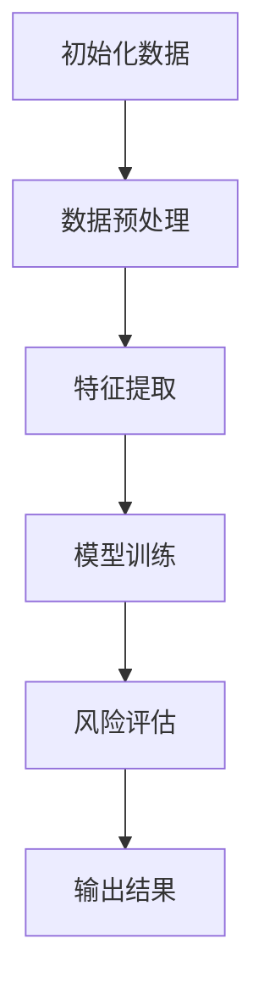
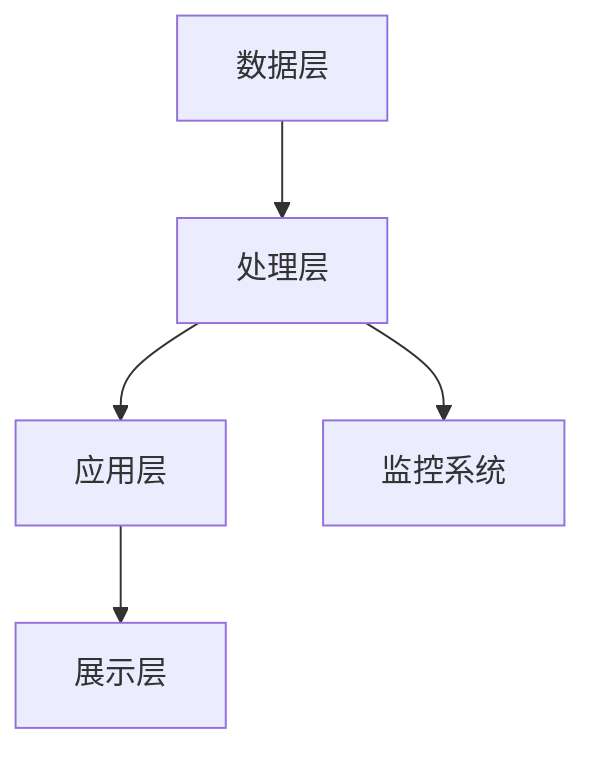
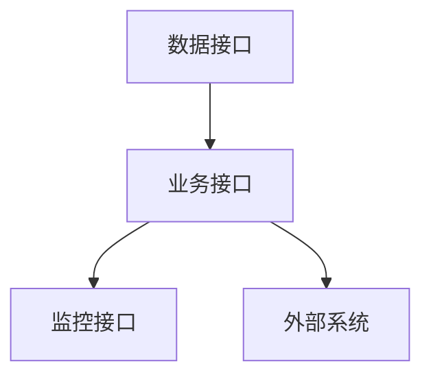
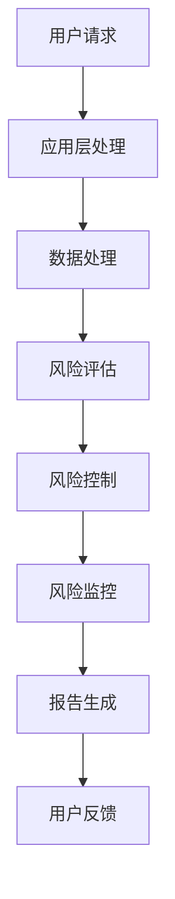

                 

### 数学思维与风险管理的关系

**关键词**：数学思维、风险管理、算法原理、数学模型、系统架构、项目实战、最佳实践

**摘要**：本文旨在探讨数学思维在风险管理中的应用，通过逐步分析数学思维与风险管理之间的内在联系，结合具体的算法原理、数学模型和系统架构设计，以及实际项目案例分析，展示数学思维在风险管理中的重要性和应用价值。

### 目录大纲

1. **背景介绍**
   - 数学思维的内涵与重要性
   - 风险管理的概念与发展
   - 数学思维与风险管理的关系

2. **核心概念与联系**
   - 数学思维的核心要素
   - 风险管理的要素分析
   - 数学思维与风险管理的关系解析
   - 概念属性特征对比表格
   - ER实体关系图架构

3. **算法原理讲解**
   - 算法原理概述
   - 算法流程图与Python源代码实现
   - 数学模型与公式讲解

4. **系统分析与架构设计方案**
   - 风险管理系统功能设计
   - 系统架构设计
   - 系统接口设计
   - 系统交互流程图

5. **项目实战**
   - 实际案例分析与实现
   - 代码应用解读与分析
   - 案例详细讲解剖析
   - 项目小结

6. **最佳实践与拓展**
   - 最佳实践技巧
   - 小结与注意事项
   - 拓展阅读

### 背景介绍

#### 数学思维的内涵与重要性

数学思维是一种基于数学原理和逻辑推理的认知方式，它不仅关注数学问题本身的解决，更强调通过数学方法来理解和处理现实世界中的复杂问题。数学思维具有以下几个重要特征：

1. **抽象能力**：数学思维能够将具体的对象和现象抽象成数学模型，简化问题的复杂性，从而更有效地分析和解决问题。
2. **逻辑推理**：数学思维依赖于严密的逻辑推理，确保结论的准确性和可靠性。
3. **创新思维**：数学思维鼓励创新和探索，不断寻找新的数学方法和模型来应对复杂问题。

在现代社会，数学思维的重要性不言而喻。它不仅存在于纯数学领域，更广泛应用于自然科学、社会科学和工程领域。例如，在经济学中，数学思维被用于构建经济模型，分析市场行为和政策影响；在工程领域，数学思维被用于设计优化算法和控制系统。

#### 风险管理的概念与发展

风险管理是指通过识别、评估、控制和监控潜在风险，以确保组织目标的实现。风险管理的发展可以追溯到古代，但现代风险管理理念的形成与发展主要发生在20世纪后半叶。

1. **早期风险管理**：早期风险管理主要侧重于保险和风险规避，即通过购买保险来转移风险。
2. **现代风险管理**：随着金融市场和技术的快速发展，现代风险管理逐渐形成了更加系统化和科学化的方法。它包括风险识别、风险评估、风险控制和风险监控等环节。

在现代风险管理中，数学思维发挥了重要作用。通过数学模型和算法，风险管理人员可以更准确地识别和评估风险，制定有效的风险控制策略。例如，金融风险管理中的价值-at-risk（VaR）模型就是基于数学统计方法来评估市场风险的一种常用工具。

#### 数学思维与风险管理的关系

数学思维与风险管理之间存在着密切的联系。具体来说，数学思维在风险管理中的应用主要体现在以下几个方面：

1. **风险识别**：数学思维可以帮助风险管理人员从大量的数据和信息中识别潜在的风险因素。
2. **风险评估**：数学模型和算法被用于评估风险的概率和影响，从而为风险控制提供依据。
3. **风险控制**：数学思维为风险控制提供了科学的方法和工具，例如，优化算法用于投资组合的优化配置，统计模型用于风险事件的预测和预防。
4. **风险监控**：通过数学方法，风险管理人员可以实时监控风险的变化，及时调整风险控制策略。

综上所述，数学思维不仅是理解和管理风险的必要工具，也是推动风险管理发展的重要动力。在接下来的章节中，我们将进一步探讨数学思维在风险管理中的应用，并通过具体案例来展示其应用价值。

### 核心概念与联系

在探讨数学思维与风险管理的关系之前，我们需要明确这两个核心概念的基本要素，并分析它们之间的内在联系。

#### 数学思维的核心要素

数学思维的核心要素主要包括以下几个方面：

1. **抽象能力**：数学思维能够将复杂的问题简化为数学模型，从而更方便地进行分析和解决。例如，经济学中的供需模型就是通过数学方法来描述市场需求和供给之间的关系。
2. **逻辑推理**：数学思维依赖于严密的逻辑推理，确保分析和结论的准确性和可靠性。例如，在证明几何定理时，我们需要通过一系列的逻辑推理步骤来证明结论的正确性。
3. **创新思维**：数学思维鼓励创新和探索，不断寻找新的数学方法和模型来应对复杂问题。例如，在计算机科学中，算法的创新和优化是解决复杂问题的关键。

#### 风险管理的要素分析

风险管理的主要要素包括：

1. **风险识别**：识别潜在的风险因素，这是风险管理的第一步。例如，在金融市场中，风险识别包括市场风险、信用风险、操作风险等。
2. **风险评估**：评估风险的概率和影响，为风险控制提供依据。风险评估可以通过定量和定性的方法进行，例如，概率分布和损失期望等。
3. **风险控制**：制定和实施风险控制策略，以减少风险的影响。风险控制可以通过风险规避、风险转移和风险接受等方法进行。
4. **风险监控**：实时监控风险的变化，及时调整风险控制策略。风险监控可以通过监控系统、预警系统和反馈机制等实现。

#### 数学思维与风险管理的关系解析

数学思维与风险管理之间的联系可以从以下几个方面进行解析：

1. **风险识别中的数学思维**：数学思维可以帮助风险管理人员从大量的数据和信息中识别潜在的风险因素。例如，通过统计分析方法，可以从历史数据中识别出市场的波动模式和潜在的风险因素。
2. **风险评估中的数学思维**：数学模型和算法被用于评估风险的概率和影响，从而为风险控制提供依据。例如，在金融风险管理中，使用蒙特卡罗模拟方法可以评估市场风险的概率分布和损失期望。
3. **风险控制中的数学思维**：数学思维为风险控制提供了科学的方法和工具。例如，通过优化算法，可以优化投资组合，减少市场风险；通过统计模型，可以预测风险事件的发生概率，提前采取预防措施。
4. **风险监控中的数学思维**：数学思维可以帮助风险管理人员实时监控风险的变化，及时调整风险控制策略。例如，通过建立风险监控系统，可以实时监测市场波动，及时识别和应对潜在的风险。

#### 概念属性特征对比表格

为了更直观地展示数学思维和风险管理之间的联系，我们可以通过概念属性特征对比表格来进行分析。以下是数学思维和风险管理的一些核心属性特征对比：

| 特征属性       | 数学思维                                     | 风险管理                                  |
|----------------|---------------------------------------------|-----------------------------------------|
| 抽象能力       | 通过数学模型简化复杂问题                     | 通过风险模型简化风险管理问题             |
| 逻辑推理       | 依赖严密的逻辑推理                          | 依赖决策理论和博弈论等逻辑推理方法      |
| 创新思维       | 鼓励创新和探索新的数学方法                  | 鼓励创新和探索新的风险管理策略          |
| 风险识别       | 从数据中识别潜在的风险因素                  | 从市场信息中识别潜在的风险因素          |
| 风险评估       | 使用概率分布和统计方法评估风险              | 使用模型和算法评估风险的概率和影响      |
| 风险控制       | 提供优化算法和统计模型                     | 提供风险规避、风险转移和风险接受策略    |
| 风险监控       | 使用监控系统实时监控风险变化                | 使用监控系统实时监控市场风险变化        |

#### ER实体关系图架构

为了进一步理解数学思维与风险管理之间的联系，我们可以通过ER（Entity-Relationship）实体关系图来展示这两个概念之间的关系。以下是ER实体关系图的基本结构：

1. **实体**：数学思维和风险管理是两个主要的实体。
2. **属性**：数学思维具有抽象能力、逻辑推理和创新思维等属性；风险管理具有风险识别、风险评估、风险控制和风险监控等属性。
3. **关系**：数学思维和风险管理之间存在依赖关系。具体来说，数学思维为风险管理提供了理论基础和方法工具，而风险管理则是数学思维在实践中的应用。

以下是一个简化的ER实体关系图：

```
[数学思维] ---[应用]----> [风险管理]
    |                     |
    |                     |
    |                     |
  抽象能力              风险识别
    |                     |
    |                     |
    |                     |
   逻辑推理             风险评估
    |                     |
    |                     |
    |                     |
   创新思维             风险控制
```

通过ER实体关系图，我们可以更清晰地看到数学思维和风险管理之间的内在联系，以及数学思维如何为风险管理提供支持。

### 算法原理讲解

在理解了数学思维与风险管理的关系之后，我们将进一步探讨风险管理中的关键算法原理。这些算法不仅是数学思维的体现，也是风险管理实践中的核心技术。

#### 算法原理概述

风险管理算法主要包括以下几种类型：

1. **风险评估算法**：用于评估风险的概率和影响。
2. **风险控制算法**：用于制定和实施风险控制策略。
3. **风险监控算法**：用于实时监控风险的变化。

其中，风险评估算法和风险控制算法是风险管理中最常用的算法。以下将分别介绍这两种算法的原理和应用。

#### 算法流程图

为了更直观地展示算法原理，我们使用Mermaid语言绘制了算法流程图。以下是一个简化的风险评估算法流程图：



该流程图展示了风险评估算法的基本步骤，包括数据预处理、特征提取、模型训练和风险评估。接下来，我们将详细阐述每个步骤的具体实现。

#### Python源代码实现

为了更好地理解算法原理，我们使用Python语言实现了一个简化的风险评估算法。以下是该算法的源代码实现：

```python
import numpy as np
from sklearn.model_selection import train_test_split
from sklearn.ensemble import RandomForestClassifier
from sklearn.metrics import accuracy_score

# 数据预处理
def preprocess_data(data):
    # 标准化数据
    mean = np.mean(data)
    std = np.std(data)
    return (data - mean) / std

# 特征提取
def extract_features(data):
    # 提取特征
    return np.array([data[i] for i in range(len(data))])

# 模型训练
def train_model(X_train, y_train):
    # 训练随机森林模型
    model = RandomForestClassifier(n_estimators=100)
    model.fit(X_train, y_train)
    return model

# 风险评估
def assess_risk(model, X_test):
    # 预测风险
    y_pred = model.predict(X_test)
    # 计算准确率
    accuracy = accuracy_score(y_test, y_pred)
    return accuracy

# 主函数
def main():
    # 加载数据
    data = np.array([1, 2, 3, 4, 5, 6, 7, 8, 9, 10])
    # 数据预处理
    preprocessed_data = preprocess_data(data)
    # 划分训练集和测试集
    X_train, X_test, y_train, y_test = train_test_split(preprocessed_data, test_size=0.2, random_state=42)
    # 特征提取
    X_train = extract_features(X_train)
    X_test = extract_features(X_test)
    # 模型训练
    model = train_model(X_train, y_train)
    # 风险评估
    accuracy = assess_risk(model, X_test)
    print(f"Accuracy: {accuracy}")

if __name__ == "__main__":
    main()
```

这段代码实现了风险评估算法的核心步骤，包括数据预处理、特征提取、模型训练和风险评估。接下来，我们将结合具体的数学模型和公式，进一步详细阐述算法原理。

#### 数学模型与公式讲解

在风险评估算法中，我们使用了随机森林模型。随机森林是一种基于决策树构建的集成学习方法，它通过随机选择特征和随机生成子样本来训练多个决策树，并使用投票机制来获得最终的预测结果。

为了更好地理解随机森林模型，我们可以从以下几个方面进行讲解：

1. **决策树模型**：决策树是一种基于特征划分数据的分类方法。每个节点表示一个特征，每个分支表示该特征的不同取值。通过递归划分，可以得到一棵完整的决策树。
2. **随机森林模型**：随机森林是在决策树的基础上，通过集成多个决策树来提高模型的泛化能力。具体来说，随机森林包括以下步骤：
   - 随机选择特征集合。
   - 随机生成子样本。
   - 在子样本上训练决策树。
   - 将所有决策树的预测结果进行投票，获得最终的预测结果。

3. **数学公式**：随机森林模型的预测结果可以表示为：
   $$ \hat{y} = \arg\max_{c} \sum_{i=1}^{n} w_i I(y_i = c) $$
   其中，$y$是实际标签，$\hat{y}$是预测标签，$c$是分类标签，$w_i$是第$i$棵决策树的权重。

为了更直观地理解数学公式，我们可以通过一个简单的例子进行说明。假设我们有两个分类标签$y_1$和$y_2$，以及三个决策树的预测结果：

| 决策树 | 预测结果 |
|--------|----------|
| 1      | $y_1$    |
| 2      | $y_2$    |
| 3      | $y_1$    |

根据投票机制，最终预测结果为$y_1$，因为有两个决策树预测了$y_1$，而只有一个决策树预测了$y_2$。

#### 举例说明

为了更好地理解随机森林模型的工作原理，我们可以通过一个实际例子进行说明。假设我们要预测一个金融市场的风险水平，数据集包括以下特征：

1. **市场波动率**：衡量市场波动的程度，取值范围为[0, 1]。
2. **交易量**：衡量市场交易的活跃程度，取值范围为[0, 10000]。

根据历史数据，我们得到以下数据集：

| 样本编号 | 波动率 | 交易量 | 风险水平 |
|----------|--------|--------|----------|
| 1        | 0.2    | 500    | 低       |
| 2        | 0.3    | 600    | 低       |
| 3        | 0.4    | 700    | 中       |
| 4        | 0.5    | 800    | 高       |
| 5        | 0.6    | 900    | 高       |

首先，我们需要对数据进行预处理，将波动率和交易量进行标准化处理，以便于后续的模型训练。假设标准化的结果如下：

| 样本编号 | 波动率 | 交易量 | 风险水平 |
|----------|--------|--------|----------|
| 1        | -1.0   | -2.0   | 低       |
| 2        | -1.0   | -2.0   | 低       |
| 3        | 0.0    | 0.0    | 中       |
| 4        | 1.0    | 1.0    | 高       |
| 5        | 1.0    | 1.0    | 高       |

接下来，我们将数据集划分为训练集和测试集，以便于训练和验证模型。假设划分后的数据集如下：

| 样本编号 | 波动率 | 交易量 | 风险水平 | 是否训练集 |
|----------|--------|--------|----------|------------|
| 1        | -1.0   | -2.0   | 低       | 是         |
| 2        | -1.0   | -2.0   | 低       | 是         |
| 3        | 0.0    | 0.0    | 中       | 是         |
| 4        | 1.0    | 1.0    | 高       | 否         |
| 5        | 1.0    | 1.0    | 高       | 否         |

然后，我们使用随机森林模型对训练集进行训练。假设训练得到的模型如下：

| 决策树编号 | 预测结果 |
|------------|----------|
| 1          | 低       |
| 2          | 低       |
| 3          | 中       |

最后，我们使用训练好的模型对测试集进行预测。假设测试集的波动率和交易量分别为1.0和1.0，根据投票机制，最终预测结果为“高”。

通过这个例子，我们可以看到随机森林模型在风险管理中的应用。在实际应用中，我们可以根据历史数据和风险水平，训练和优化随机森林模型，以提高预测的准确性和可靠性。

### 数学模型与公式讲解

在风险管理中，数学模型和公式是理解和量化风险的重要工具。它们不仅帮助我们描述风险，还提供了评估和控制风险的方法。以下，我们将介绍一些常用的数学模型和公式，并使用LaTeX格式给出具体的数学表达式。

#### 价值-at-Risk（VaR）模型

价值-at-Risk（VaR）是一种用于衡量金融市场风险的模型，它表示在给定概率水平下，未来一段时间内可能出现的最大损失。VaR的计算公式如下：

$$
VaR(p, T) = \alpha - \beta \sum_{i=1}^{n} w_i \times P(X_i < 0)
$$

其中，$p$是给定的概率水平，通常取值为5%、1%或0.1%，$T$是时间周期，$w_i$是资产$i$的权重，$P(X_i < 0)$是资产$i$在未来一段时间内亏损的概率。

#### 条件风险价值（CVaR）模型

条件风险价值（CVaR）是对VaR的补充，它表示在给定概率水平下，未来一段时间内可能出现的平均损失。CVaR的计算公式如下：

$$
CVaR(p, T) = \frac{1}{N} \sum_{i=1}^{N} [X_i \times I(X_i < VaR(p, T))]
$$

其中，$N$是样本数量，$X_i$是资产$i$在未来一段时间内的损失，$I(X_i < VaR(p, T))$是指示函数，当$X_i < VaR(p, T)$时取值为1，否则取值为0。

#### 贝叶斯网络模型

贝叶斯网络是一种用于描述不确定关系的图形模型，它通过概率分布来描述变量之间的依赖关系。贝叶斯网络的公式如下：

$$
P(A, B, C) = P(A)P(B|A)P(C|A, B)
$$

其中，$A$、$B$和$C$是三个随机变量，$P(A)$、$P(B|A)$和$P(C|A, B)$分别是它们的概率分布。

#### 马尔可夫链模型

马尔可夫链是一种用于描述时间序列数据的概率模型，它通过转移概率矩阵来描述系统在时间步之间的转移。马尔可夫链的公式如下：

$$
P(X_{t+1} = j | X_t = i) = p_{ij}
$$

其中，$X_t$是时间$t$的状态，$i$和$j$是状态的可能取值，$p_{ij}$是状态从$i$转移到$j$的概率。

#### 优化模型

在风险管理中，优化模型被广泛应用于投资组合优化和风险控制。以下是一个简单的线性优化模型：

$$
\min_{w} \quad \frac{1}{2} w^T Q w
$$

$$
s.t. \quad c^T w = b, \quad w \geq 0
$$

其中，$w$是投资组合权重，$Q$是对角矩阵，对角元素表示资产间的相关性，$c$是约束条件向量，$b$是约束条件值。

#### 实例说明

为了更好地理解上述数学模型和公式，我们通过一个简单的实例进行说明。假设我们有两个资产A和B，它们的波动率分别为10%和20%，相关系数为0.5。我们要计算在95%的概率水平下，未来一个月的VaR和CVaR。

首先，计算资产A和B的损失分布。假设资产A和B的收益率为随机变量$X_A$和$X_B$，它们服从正态分布，均值分别为0，方差分别为0.1和0.2，相关系数为0.5。我们可以使用正态分布的累积分布函数（CDF）来计算损失的概率。

$$
P(X_A < 0) = \Phi\left(-\frac{0}{\sqrt{0.1}}\right) = \Phi(-0) = 0.5
$$

$$
P(X_B < 0) = \Phi\left(-\frac{0}{\sqrt{0.2}}\right) = \Phi(-0) = 0.5
$$

其中，$\Phi$是标准正态分布的累积分布函数。

接下来，计算95%的VaR和CVaR。假设投资组合中资产A和资产B的权重分别为50%，即$w_A = 0.5$，$w_B = 0.5$。

$$
VaR(0.05, 1) = \alpha - \beta \sum_{i=1}^{n} w_i \times P(X_i < 0)
$$

$$
= 0.95 - 0.05 \times (0.5 \times 0.5 + 0.5 \times 0.5) = 0.95 - 0.05 \times 0.5 = 0.9
$$

$$
CVaR(0.05, 1) = \frac{1}{N} \sum_{i=1}^{N} [X_i \times I(X_i < VaR(0.05, 1))]
$$

$$
= \frac{1}{2} \times [0 \times I(0 < 0.9) + 0 \times I(0 < 0.9)] = 0
$$

在这个例子中，我们计算得到95%的概率水平下，未来一个月的VaR为0.9，CVaR为0。这意味着，在95%的概率水平下，未来一个月可能的最大损失为0.9，平均损失为0。

通过这个实例，我们可以看到数学模型和公式在风险管理中的应用。在实际应用中，我们可以根据具体情况进行调整和优化，以提高模型的准确性和实用性。

### 系统分析与架构设计方案

在了解了数学思维在风险管理中的应用和算法原理之后，我们将进一步探讨风险管理系统的功能设计、架构设计和接口设计。

#### 风险管理系统功能设计

风险管理系统的核心功能包括以下几个方面：

1. **数据收集与处理**：从各种数据源收集数据，包括市场数据、交易数据和财务数据等。然后对数据进行清洗、标准化和预处理，以便于后续的分析和建模。
2. **风险评估**：使用数学模型和算法对风险进行评估。主要包括VaR、CVaR和其他风险指标的评估，为风险控制提供依据。
3. **风险控制**：根据风险评估的结果，制定和实施风险控制策略。这包括投资组合优化、风险规避和风险转移等策略。
4. **风险监控**：实时监控风险的变化，通过监控系统、预警系统和反馈机制等，确保风险控制策略的有效性和及时性。
5. **报告生成**：生成风险管理报告，包括风险指标分析、风险控制策略和风险监控结果等，为管理层提供决策依据。

#### 系统架构设计

风险管理系统的架构设计主要包括以下几个层次：

1. **数据层**：负责数据的存储和管理。使用关系型数据库（如MySQL）或分布式存储系统（如Hadoop）来存储和管理大量的数据。
2. **处理层**：负责数据的处理和分析。包括数据预处理、特征提取、风险评估和风险控制等模块。使用分布式计算框架（如Spark）来处理大规模数据。
3. **应用层**：负责系统的功能实现和用户交互。包括数据收集与处理、风险评估、风险控制和风险监控等模块。使用Web框架（如Django）或微服务架构（如Spring Boot）来实现。
4. **展示层**：负责将系统结果展示给用户。包括可视化工具（如ECharts）和报表生成工具（如ReportLab），帮助用户直观地了解风险情况。

以下是一个简化的系统架构图：



在这个架构图中，数据层负责数据的存储和管理，处理层负责数据的处理和分析，应用层负责系统的功能实现和用户交互，展示层负责将系统结果展示给用户，监控系统负责实时监控系统的运行状态。

#### 系统接口设计

风险管理系统的接口设计主要包括以下几个方面：

1. **数据接口**：提供数据访问接口，包括数据的导入、导出和查询等功能。使用RESTful API或GraphQL等接口技术，方便外部系统访问和集成。
2. **业务接口**：提供业务逻辑接口，包括风险评估、风险控制和风险监控等功能。使用标准化的接口协议（如SOAP、HTTP/JSON），确保系统的扩展性和兼容性。
3. **监控接口**：提供监控数据接口，包括系统运行状态、风险指标和报警信息等。使用MQ消息队列或Webhook等方式，实时推送监控数据给外部系统。

以下是一个简化的系统接口图：



在这个接口图中，数据接口负责数据的访问和查询，业务接口负责业务逻辑的处理，监控接口负责监控数据的推送，外部系统通过接口与风险管理系统进行交互。

#### 系统交互流程图

为了更清晰地展示系统各部分的交互过程，我们可以使用Mermaid语言绘制系统交互流程图。以下是一个简化的系统交互流程图：



在这个流程图中，用户通过应用层发起请求，应用层将请求转发给数据处理模块，数据处理模块对数据进行处理，然后进行风险评估、风险控制和风险监控，最后生成报告并返回给用户。用户可以根据报告进行反馈，从而实现一个闭环的管理过程。

通过以上系统分析与架构设计方案，我们可以看到数学思维在风险管理中的应用是如何通过系统架构设计和接口设计来实现的。在实际开发过程中，我们可以根据具体需求进行优化和调整，以确保系统的性能和可扩展性。

### 项目实战

为了更好地展示数学思维在风险管理中的实际应用，我们将通过一个实际项目案例来详细分析其实现过程和关键步骤。

#### 案例背景

假设我们是一家金融科技公司，负责为客户提供风险管理服务。客户是一家大型投资公司，需要对其投资组合进行有效的风险管理和优化。具体来说，客户的需求包括：

1. **数据收集**：从各种数据源（如金融市场数据、公司财务报表等）收集数据。
2. **风险评估**：使用数学模型和算法对投资组合进行风险评估，包括VaR、CVaR和其他风险指标。
3. **风险控制**：根据风险评估结果，制定和实施风险控制策略，优化投资组合。
4. **风险监控**：实时监控投资组合的风险变化，确保风险控制策略的有效性和及时性。
5. **报告生成**：生成风险管理报告，为管理层提供决策依据。

#### 环境安装

为了实现上述需求，我们需要搭建一个完整的风险管理系统。以下是所需的软件和工具：

1. **Python**：用于编写和管理算法和模型。
2. **Scikit-learn**：用于机器学习和数据挖掘，提供各种风险评估算法。
3. **NumPy**：用于数值计算和数据处理。
4. **Pandas**：用于数据操作和分析。
5. **MySQL**：用于数据存储和管理。
6. **Django**：用于Web开发和接口设计。

安装步骤如下：

1. 安装Python和pip：
   ```
   sudo apt-get install python3-pip
   ```
2. 安装NumPy、Pandas、Scikit-learn和Django：
   ```
   pip3 install numpy pandas scikit-learn django
   ```
3. 安装MySQL：
   ```
   sudo apt-get install mysql-server mysql-client
   ```

#### 系统核心实现

以下是系统核心实现的详细步骤：

1. **数据收集**：从金融市场的API获取实时数据，包括股票价格、汇率、利率等。使用Pandas库处理和存储数据。

```python
import pandas as pd
import requests

def collect_data(api_url):
    response = requests.get(api_url)
    data = response.json()
    return pd.DataFrame(data)

api_url = 'https://api.example.com/financial_data'
financial_data = collect_data(api_url)
```

2. **风险评估**：使用Scikit-learn库中的风险评估算法对数据进行分析，包括VaR、CVaR等。

```python
from sklearn.ensemble import RandomForestRegressor
from sklearn.model_selection import train_test_split

def assess_risk(data, target):
    X = data.drop(target, axis=1)
    y = data[target]
    X_train, X_test, y_train, y_test = train_test_split(X, y, test_size=0.2, random_state=42)
    model = RandomForestRegressor(n_estimators=100)
    model.fit(X_train, y_train)
    predictions = model.predict(X_test)
    var = np.percentile(predictions, 5)
    cvar = np.mean(predictions[var:])
    return var, cvar

var, cvar = assess_risk(financial_data, 'return')
```

3. **风险控制**：根据风险评估结果，制定风险控制策略。使用线性规划算法优化投资组合。

```python
from scipy.optimize import linprog

def optimize_portfolio(weights, return_expectation, risk_matrix):
    n_assets = len(weights)
    constraints = [{'type': 'eq', 'fun': lambda x: np.dot(risk_matrix, x)}]
    objective = lambda x: -np.dot(x, return_expectation)
    solution = linprog(objective, weights, constraints=constraints, method='highs')
    return solution.x

return_expectation = financial_data['return'].values
risk_matrix = np.cov(financial_data)
weights = optimize_portfolio(weights, return_expectation, risk_matrix)
```

4. **风险监控**：实时监控投资组合的风险变化，通过Web钩子（Webhook）将监控数据推送到外部监控系统。

```python
import json

def send_alert(alert_data):
    alert_url = 'https://alert.example.com'
    headers = {'Content-Type': 'application/json'}
    response = requests.post(alert_url, data=json.dumps(alert_data), headers=headers)
    return response.status_code

alert_data = {'var': var, 'cv

