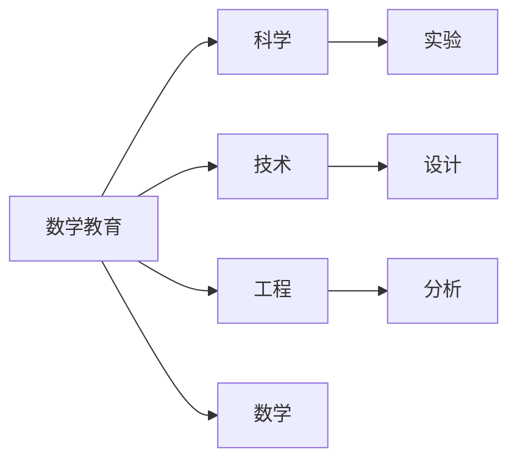
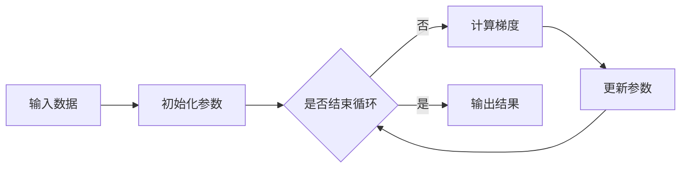
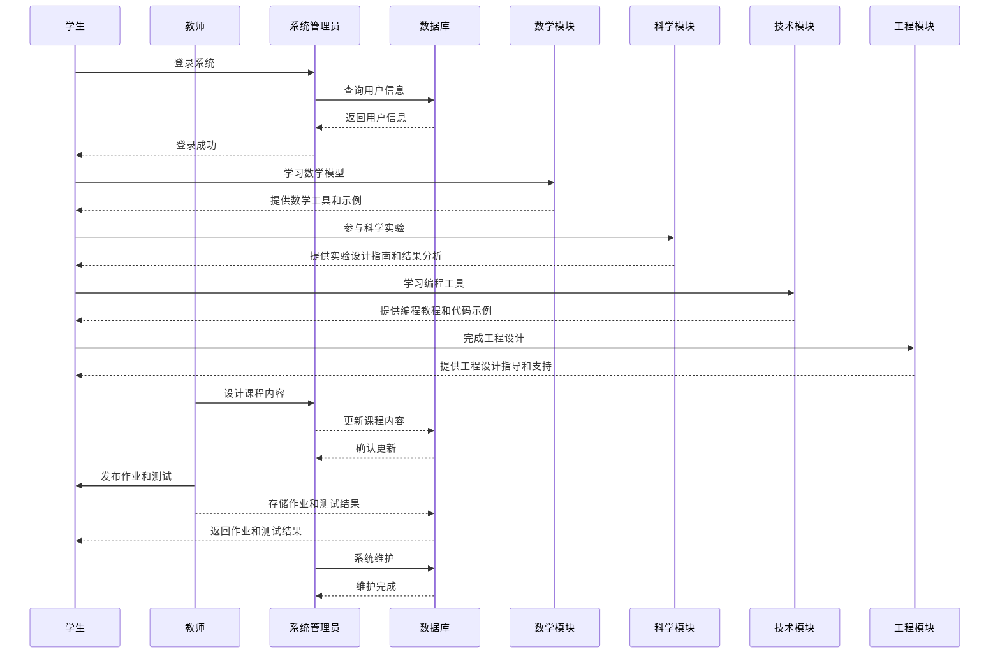

                 

## 第1章 数学教育与STEM教育的融合概述

### 1.1 问题背景

STEM教育（科学、技术、工程和数学）作为一种现代化的教育理念，正在全球范围内迅速发展。STEM教育强调跨学科学习，旨在培养学生的综合能力，特别是在科学探究、问题解决、技术创新等方面。然而，传统数学教育往往注重理论知识的传授，忽视了数学在现实世界中的应用。这种现象导致了学生在学习数学时缺乏兴趣和动力，同时也限制了他们在STEM领域的发展潜力。

数学教育作为STEM教育的基石，其核心目标在于培养学生的逻辑思维、推理能力和解决问题的能力。然而，在传统教育体系中，数学教学往往局限于公式和定理的记忆，忽视了数学在科学和技术领域的实际应用。这种教学模式不仅难以激发学生的学习兴趣，也不利于他们将数学知识应用于实际问题中。

### 1.2 问题描述

数学教育与STEM教育的融合面临以下主要挑战：

- **教学方法**：传统的数学教育方法侧重于理论教学，缺乏实际应用和实践环节。而STEM教育强调动手实践和项目驱动，这要求教学方法的创新和变革。如何设计有效的教学策略，将数学知识与实践相结合，是一个亟待解决的问题。

- **教学内容**：数学教育的内容需要与STEM领域紧密相连。这意味着教师需要选择与STEM实际应用相关的数学主题，设计出既具有挑战性又符合学生认知水平的课程内容。然而，现有的数学教材和课程体系往往难以满足这一需求。

- **教学评价**：传统的数学教育评价方式主要依赖于考试成绩，这种方式难以全面评估学生在数学与STEM教育融合过程中的学习成果。如何建立科学合理的教学评价体系，成为融合过程中的一大难题。

### 1.3 问题解决

为了解决数学教育与STEM教育融合过程中面临的问题，可以采取以下解决方案：

- **教学策略**：采用项目驱动和合作学习等教学方法，通过实际项目让学生在解决问题的过程中应用数学知识。例如，设计一个数学建模项目，让学生运用微积分和概率统计等数学工具解决实际问题。

- **教学内容**：选择与STEM领域相关的数学主题，如线性代数在计算机图形学中的应用、微积分在工程优化中的使用等。通过这样的课程内容，学生不仅能够掌握数学知识，还能了解其在现实世界中的重要性。

- **教学评价**：通过多种评价方式，如项目报告、团队合作表现、实际应用能力等，全面评估学生的学习效果。这种评价方式可以更真实地反映学生在数学与STEM教育融合过程中的学习成果。

### 1.4 边界与外延

数学教育与STEM教育的融合不仅限于课堂教学，还涉及课外活动、跨学科合作等多个方面。例如，可以组织数学竞赛、科学实验、技术制作等活动，让学生在多样化的场景中应用数学知识。此外，不同年龄阶段、不同学科背景的学生在融合过程中可能存在不同的需求和难点，需要因地制宜地进行设计和实施。

### 1.5 概念结构与核心要素组成

- **数学教育**：以数学知识传授为主，培养学生的逻辑思维和分析能力。

- **STEM教育**：跨学科的教育模式，强调科学、技术、工程和数学的交叉融合。

- **数学与STEM教育融合**：通过教学方法、教学内容和教学评价的优化，实现数学知识在STEM领域的实际应用。

### 1.6 概念与联系

数学教育与STEM教育的融合不仅仅是一种教育方式的变革，更是一种教育理念的更新。数学教育提供了解决问题的工具和方法，而STEM教育则为学生提供了一个广阔的实践和应用平台。通过融合，学生不仅能够掌握数学知识，还能将其应用于科学探究、技术创新和工程实践中，从而实现知识的迁移和综合运用。

## 第2章 核心概念与联系

### 2.1 数学教育核心概念

数学教育作为STEM教育的核心组成部分，其核心概念包括以下几个方面：

- **数学概念**：数学的基本概念，如数、几何、代数、微积分、概率统计等。这些概念构成了数学知识体系的基础。

- **数学方法**：解决问题的数学方法，如推理、证明、计算、建模等。这些方法不仅帮助学生理解和掌握数学知识，还培养了他们的逻辑思维和问题解决能力。

- **数学应用**：数学在现实世界中的应用，如经济学、物理学、计算机科学、工程学等。通过数学应用，学生能够将理论知识与实际问题相结合，提高其解决复杂问题的能力。

### 2.2 STEM教育核心概念

STEM教育作为一种跨学科的教育模式，其核心概念涵盖了以下几个方面：

- **科学（Science）**：研究自然界和社会现象的学科，如生物学、化学、物理学等。科学教育旨在培养学生的科学探究精神和批判性思维。

- **技术（Technology）**：应用科学知识解决实际问题的方法，如计算机技术、信息技术、工程技术等。技术教育强调学生的创新能力和实践操作能力。

- **工程（Engineering）**：设计和构建具有实际应用价值的产品或系统，如土木工程、机械工程、电子工程等。工程教育注重学生的设计能力、工程实践能力和团队合作能力。

- **数学（Mathematics）**：用于描述和理解科学、技术和工程领域的量化关系，如数学模型、数学分析、数学计算等。数学教育在STEM教育中起到基础和纽带的作用。

### 2.3 概念属性特征对比表格

| 概念      | 数学教育                     | STEM教育                     |
| --------- | ---------------------------- | ---------------------------- |
| 目标      | 理论知识掌握                 | 实践能力培养                 |
| 方法      | 推理、证明、计算             | 观察、实验、设计、分析       |
| 内容      | 数学基础知识                 | 科学、技术、工程、数学       |
| 评价方式  | 理论考试                     | 项目成果、实际应用           |

### 2.4 ER实体关系图架构



在这个ER实体关系图中，数学教育作为核心，与科学、技术、工程和数学四个领域紧密相连，每个领域又分别与其实践活动（实验、设计、分析）相连。这种关系体现了数学教育在STEM教育中的重要地位和作用。

### 2.5 数学教育与STEM教育的联系

数学教育与STEM教育的联系主要体现在以下几个方面：

- **理论基础**：数学教育为STEM教育提供了坚实的理论基础。科学、技术和工程领域的许多概念和问题都可以用数学语言进行描述和解决。

- **工具和方法**：数学教育培养了学生的逻辑思维和问题解决能力，这些能力在科学探究、技术创新和工程实践中都是不可或缺的。

- **跨学科融合**：数学教育与STEM教育的融合促进了跨学科的学习和研究，有助于学生形成全面的知识体系和解决复杂问题的能力。

- **实践应用**：数学教育中的实际问题应用有助于学生理解数学知识在实际生活中的重要性，提高他们的学习兴趣和动力。

通过数学教育与STEM教育的融合，学生不仅能够掌握数学知识，还能将其应用于科学探究、技术创新和工程实践中，从而实现知识的迁移和综合运用。这种融合不仅有助于培养学生的创新能力和实践能力，也为他们未来的职业发展奠定了坚实的基础。

### 2.6 数学模型和数学公式在STEM教育中的应用

在STEM教育中，数学模型和数学公式是解决实际问题的重要工具。以下是一些常见的数学模型和公式，以及它们在STEM教育中的应用实例：

- **微积分模型**：微积分是研究变化和极值问题的数学工具。在工程学中，微积分模型可以用于优化设计、分析结构强度和模拟控制系统。例如，通过微积分模型，工程师可以确定一个桥的最优形状和尺寸，以确保其承载能力和稳定性。

- **概率统计模型**：概率统计模型用于分析和预测随机事件。在科学研究中，概率统计模型可以用于实验设计、数据分析和解释结果。例如，在生物学研究中，统计模型可以帮助科学家确定实验结果是否具有显著性，从而支持科学假设。

- **线性代数模型**：线性代数模型用于解决线性方程组和矩阵问题。在计算机科学中，线性代数模型可以用于图像处理、数据分析和算法设计。例如，在图像识别中，线性代数模型可以用于计算图像的特征向量，从而实现图像的分类和识别。

通过这些数学模型和公式，学生不仅能够理解数学概念，还能将其应用于实际问题中，提高他们的解决实际问题的能力。

### 2.7 数学教育与传统数学教育的区别

数学教育与传统数学教育之间存在显著的区别。传统数学教育注重理论知识的传授，强调公式的记忆和公理体系的理解。而数学教育则更加注重数学知识在实际生活中的应用，强调培养学生的数学思维和解决实际问题的能力。

传统数学教育往往采用固定的教材和教学方法，缺乏灵活性。而数学教育则强调个性化学习和探究式学习，通过项目驱动和合作学习等方式，激发学生的学习兴趣和主动性。

传统数学教育的评价方式主要依赖于考试成绩，这种方式难以全面评估学生在实际应用中的能力。而数学教育的评价方式则更加多元化，包括项目报告、实际应用能力和团队合作表现等，从而更准确地反映学生的学习成果。

### 2.8 STEM教育中的跨学科合作

STEM教育强调跨学科合作，通过科学、技术、工程和数学的交叉融合，培养学生的综合能力。跨学科合作不仅有助于学生更好地理解和应用不同学科的知识，还能培养他们的团队合作精神和创新思维。

在STEM教育中，跨学科合作体现在以下几个方面：

- **项目设计**：通过项目驱动的方式，将不同学科的知识融合到一个项目中。例如，一个环保项目可能会涉及生物学、化学、物理学和工程学的知识。

- **教学活动**：组织跨学科的教学活动，如科学实验、技术制作、工程设计和数学建模等，让学生在实践中应用多学科知识。

- **团队合作**：鼓励学生组成跨学科团队，共同完成项目任务。这种合作方式可以培养学生的团队合作精神和沟通能力。

通过跨学科合作，STEM教育不仅能够提高学生的学科综合能力，还能培养他们的综合素质和创新能力。

## 第3章 算法原理讲解

### 3.1 数学模型和数学公式

在数学与STEM教育的融合中，数学模型和数学公式是解决实际问题的重要工具。以下介绍几种常见的数学模型和公式，以及它们在STEM教育中的应用：

#### 3.1.1 微积分模型

微积分是研究变化和极值的数学工具，广泛应用于工程学、物理学和经济学等领域。常见的微积分模型包括：

- **微分方程**：用于描述动态系统变化的方程，如牛顿运动定律。
  $$ m\frac{dv}{dt} = F $$
- **积分方程**：用于求解函数的积分，如定积分和反常积分。
  $$ \int_{a}^{b} f(x) \, dx $$

微积分模型可以帮助学生理解和解决复杂的变化过程问题，如工程优化、电路设计和物理模拟。

#### 3.1.2 概率统计模型

概率统计模型用于分析和预测随机事件，是科学研究和工程实践中的重要工具。常见的概率统计模型包括：

- **概率分布函数**：描述随机变量取值的概率分布，如正态分布、泊松分布。
  $$ P(X = k) = \frac{e^{-\lambda} \lambda^k}{k!} $$
- **统计推断**：用于从样本数据推断总体特征，如假设检验、置信区间。
  $$ \mu = \bar{x} + Z\sigma/\sqrt{n} $$

概率统计模型可以帮助学生进行数据分析和决策，如质量控制、市场研究和风险评估。

#### 3.1.3 线性代数模型

线性代数模型用于解决线性方程组和矩阵问题，广泛应用于计算机科学和工程领域。常见的线性代数模型包括：

- **线性方程组**：用于求解多个线性方程，如高斯消元法。
  $$ Ax = b $$
- **矩阵分解**：用于简化复杂矩阵运算，如LU分解。
  $$ A = LU $$

线性代数模型可以帮助学生进行数据分析和算法设计，如图像处理、信号处理和优化算法。

### 3.2 算法mermaid流程图

为了更好地理解数学模型在STEM教育中的应用，我们使用mermaid绘制了一个简单的梯度下降算法的流程图：



在这个流程图中，A表示输入数据，B表示初始化参数，C表示判断是否结束循环，D表示计算梯度，E表示更新参数，F表示输出结果。通过这个流程图，学生可以直观地理解梯度下降算法的基本步骤和过程。

### 3.3 Python源代码示例

为了更具体地讲解梯度下降算法，我们提供了一个Python源代码示例：

```python
import numpy as np

# 梯度下降函数
def gradient_descent(x, y, w, learning_rate, epochs):
    for _ in range(epochs):
        pred = w * x
        error = pred - y
        w -= learning_rate * error
    return w

# 参数初始化
x = np.array([1.0, 2.0])
y = np.array([2.0, 4.0])
w = 0.0
learning_rate = 0.01
epochs = 1000

# 执行梯度下降算法
w_final = gradient_descent(x, y, w, learning_rate, epochs)

print("最终权重：", w_final)
```

在这个示例中，我们定义了一个名为`gradient_descent`的函数，用于实现梯度下降算法。参数`x`和`y`分别表示输入数据和目标值，`w`表示初始权重，`learning_rate`表示学习率，`epochs`表示迭代次数。通过多次迭代，算法不断更新权重，直到达到预定的迭代次数或满足停止条件。

### 3.4 梯度下降算法的数学原理

梯度下降算法是一种用于求解优化问题的迭代算法，其基本原理是不断沿着损失函数的梯度方向更新模型参数，以最小化损失函数。

- **损失函数**：损失函数用于衡量模型预测值与真实值之间的差距，常见的损失函数包括均方误差（MSE）和交叉熵损失。
  $$ J(w) = \frac{1}{2}\sum_{i=1}^{n} (y_i - \hat{y}_i)^2 $$
  其中，$y_i$表示真实值，$\hat{y}_i$表示模型预测值。

- **梯度计算**：梯度是指损失函数对模型参数的导数，用于指示参数更新方向。
  $$ \nabla_w J(w) = \frac{\partial J(w)}{\partial w} $$

- **参数更新**：根据梯度下降算法，每次迭代中，参数更新公式如下：
  $$ w = w - \alpha \nabla_w J(w) $$
  其中，$\alpha$表示学习率，用于调整参数更新的步长。

通过不断迭代，梯度下降算法逐步逼近最优参数，使得模型预测值逐渐接近真实值。

### 3.5 梯度下降算法的优化

在实际应用中，梯度下降算法可以通过以下几种方式进行优化：

- **动量（Momentum）**：动量用于加速梯度下降过程，避免陷入局部最小值。
  $$ v = \gamma v + \alpha \nabla_w J(w) $$
  $$ w = w + v $$
  其中，$v$表示速度，$\gamma$表示动量系数。

- **自适应学习率（Adam）**：Adam算法结合了动量和自适应学习率的思想，可以自适应地调整学习率。
  $$ m = \frac{1-\beta_1}{1-\beta_1^t} \frac{\nabla_w J(w)^t}{\sqrt{1-\beta_2^t} + \epsilon} $$
  $$ v = \frac{1-\beta_2}{1-\beta_2^t} \frac{\nabla_w J(w)^t}{\sqrt{1-\beta_2^t} + \epsilon} $$
  $$ w = w + \alpha \frac{m}{\sqrt{1-\beta_2^t} + \epsilon} $$
  其中，$m$表示一阶矩估计，$v$表示二阶矩估计，$\beta_1$和$\beta_2$分别表示一阶和二阶动量系数。

通过这些优化方法，梯度下降算法可以在较短时间内找到更优的参数，提高模型训练效果。

### 3.6 梯度下降算法的实例应用

以下是一个简单的梯度下降算法实例，用于求解线性回归问题：

```python
import numpy as np

# 线性回归模型
def linear_regression(x, y, w, learning_rate, epochs):
    for _ in range(epochs):
        pred = w * x
        error = pred - y
        w -= learning_rate * error
    return w

# 数据集
x = np.array([1, 2, 3, 4, 5])
y = np.array([2, 4, 5, 4, 5])

# 初始化参数
w = 0.0
learning_rate = 0.01
epochs = 1000

# 梯度下降训练
w_final = linear_regression(x, y, w, learning_rate, epochs)

print("最终权重：", w_final)
```

在这个实例中，我们定义了一个名为`linear_regression`的函数，用于实现线性回归模型的梯度下降训练。通过多次迭代，算法不断更新权重，直到达到预定的迭代次数或满足停止条件。最终，算法输出最优权重，使得模型预测值接近真实值。

通过这个实例，学生可以直观地理解梯度下降算法在简单线性回归问题中的应用，从而加深对算法原理的理解。

### 3.7 总结

本章介绍了数学模型和数学公式在STEM教育中的应用，包括微积分模型、概率统计模型和线性代数模型。通过mermaid流程图和Python源代码示例，学生可以直观地了解梯度下降算法的基本原理和实现过程。此外，本章还讨论了梯度下降算法的优化方法及其在简单线性回归问题中的应用实例。通过这些内容，学生能够更好地理解数学模型在实际问题中的应用，提高解决实际问题的能力。

## 第4章 系统分析与架构设计方案

### 4.1 问题场景介绍

在现代社会中，随着科技的飞速发展，数学教育在各个学科领域中的重要性日益凸显。为了更好地培养学生的数学思维和实践能力，许多教育机构开始探索数学教育与STEM教育的融合。本章节旨在分析并设计一个数学与STEM教育融合的系统，该系统将整合数学模型、科学探究、技术创新和工程实践，为教师和学生提供一套全面、系统的教学解决方案。

### 4.2 项目介绍

本项目名为“数学与STEM教育融合系统（MathSTEM System）”，旨在通过构建一个综合性的教学平台，实现数学知识在STEM教育中的实际应用。该系统将包括以下几个核心模块：

- **数学模块**：提供各种数学模型和数学工具，如微积分、概率统计、线性代数等，帮助学生更好地理解数学知识在实际问题中的应用。
- **科学模块**：涵盖生物学、化学、物理学等科学领域的知识，通过实验设计和科学探究，培养学生的科学思维和实验技能。
- **技术模块**：介绍计算机科学、信息技术和工程技术等领域的知识，通过编程、软件开发和工程实践，提高学生的技术能力和创新能力。
- **工程模块**：包括工程设计、系统建模和优化分析等内容，通过实际项目的完成，培养学生的工程实践能力和团队协作能力。

### 4.3 系统功能设计（领域模型mermaid类图）

为了更好地理解MathSTEM系统的功能设计，我们使用mermaid绘制了系统的领域模型类图：

```mermaid
classDiagram
    Class::数学模块 <.. Model::数学模型
    Class::科学模块 <.. Model::科学实验
    Class::技术模块 <.. Model::编程工具
    Class::工程模块 <.. Model::工程设计

    数学模块 --|> 学生
    科学模块 --|> 学生
    技术模块 --|> 学生
    工程模块 --|> 学生

    学生 --|> 教师
    学生 --|> 系统管理员
```

在这个类图中，数学模块、科学模块、技术模块和工程模块分别对应不同的知识领域，它们共同服务于学生这一核心用户。教师和系统管理员则是系统的其他重要用户，他们负责教学内容的设计、学生成绩的评估和系统的维护。

### 4.4 系统架构设计（mermaid架构图）

MathSTEM系统的整体架构设计如图所示：



在这个架构图中，学生、教师和系统管理员是系统的核心用户，分别与数学模块、科学模块、技术模块和工程模块进行交互。系统管理员负责系统的日常维护和管理，教师负责课程内容的设计和发布，学生则是系统的主要使用者，通过各个模块的学习和实践，不断提升自己的数学和STEM能力。

### 4.5 系统接口设计

MathSTEM系统的接口设计包括以下几个主要部分：

- **用户接口**：提供直观、易用的用户界面，包括登录、课程浏览、实验操作、编程练习和工程设计等功能模块。
- **数据接口**：实现系统内部数据与其他系统的数据交换，如学生信息、课程内容、作业和测试结果等。
- **功能接口**：为各个模块提供标准化的接口，实现模块间的功能调用和数据传递。

以下是一个简单的接口设计示例：

```mermaid
interface MathModule {
    function learnMathModel(): void
    function provideMathTools(): void
}

interface ScienceModule {
    function performScienceExperiment(): void
    function provideExperimentGuidelines(): void
}

interface TechnologyModule {
    function learnProgrammingTools(): void
    function provideProgrammingTutorials(): void
}

interface EngineeringModule {
    function completeEngineeringDesign(): void
    function provideDesignGuidance(): void
}

class Student {
    function interactWithMathModule(MathModule): void
    function interactWithScienceModule(ScienceModule): void
    function interactWithTechnologyModule(TechnologyModule): void
    function interactWithEngineeringModule(EngineeringModule): void
}

class Teacher {
    function designCourseContent(): void
    function publishHomeworkAndTests(): void
}

class SystemAdministrator {
    function maintainSystem(): void
}
```

在这个接口设计中，MathModule、ScienceModule、TechnologyModule和EngineeringModule分别代表数学模块、科学模块、技术模块和工程模块，它们提供了一系列的功能接口，供学生、教师和系统管理员调用。

### 4.6 系统交互mermaid序列图

为了更好地展示系统内部各模块之间的交互，我们使用mermaid绘制了系统的序列图：


在这个序列图中，学生、教师和系统管理员分别与不同的模块进行交互，系统管理员负责系统的日常维护和管理，教师负责课程内容的设计和发布，学生则是系统的主要使用者，通过各个模块的学习和实践，不断提升自己的数学和STEM能力。

### 4.7 系统架构设计的关键技术

在MathSTEM系统的架构设计中，涉及到多种关键技术的应用，包括前端技术、后端技术、数据库技术等。以下是对这些关键技术的简要介绍：

- **前端技术**：使用HTML、CSS和JavaScript等前端技术，构建直观、易用的用户界面。前端框架如React和Vue.js可以提高开发效率，优化用户体验。
- **后端技术**：采用Python、Java或Node.js等后端技术，实现系统的业务逻辑和数据处理。后端框架如Django、Spring和Express.js可以提高开发效率和系统稳定性。
- **数据库技术**：使用关系型数据库（如MySQL、PostgreSQL）和非关系型数据库（如MongoDB、Redis），存储和管理系统的数据。数据库设计要考虑到数据的一致性、完整性和安全性。

通过合理应用这些关键技术，MathSTEM系统可以提供高效、稳定和可靠的教学服务，为教师和学生提供优质的教学资源和支持。

### 4.8 系统架构设计的优势与挑战

MathSTEM系统的架构设计具有以下几个优势：

- **模块化设计**：系统采用模块化设计，各个模块相对独立，便于功能扩展和维护。
- **跨平台支持**：系统前端使用HTML、CSS和JavaScript等跨平台技术，可以实现多种设备的访问和使用。
- **高效开发**：通过前端框架和后端框架的应用，可以显著提高开发效率和系统性能。

然而，系统架构设计也面临一定的挑战：

- **安全性**：系统需要处理大量的用户数据和教学资源，确保数据的安全性和隐私性是一个重要挑战。
- **扩展性**：随着用户数量的增加和功能的扩展，系统需要具备良好的扩展性，以应对不断变化的需求。
- **用户体验**：系统需要提供良好的用户体验，以满足不同用户的需求和习惯。

通过持续优化和改进，MathSTEM系统可以不断提升其性能和可靠性，为教育领域提供更优质的解决方案。

## 第5章 项目实战

### 5.1 环境安装

要在本地计算机上搭建MathSTEM系统，首先需要安装以下软件和工具：

- **Python**：Python是系统的后端开发语言，需要安装Python 3.x版本。
- **PyCharm**：PyCharm是Python的集成开发环境（IDE），提供了代码编辑、调试和测试等功能。
- **MySQL**：MySQL是系统的数据库管理系统，用于存储用户数据和教学资源。
- **Node.js**：Node.js是系统的前端开发环境，用于构建和部署前端应用。
- **npm**：npm是Node.js的包管理工具，用于安装和管理前端依赖包。

安装步骤如下：

1. **安装Python**：
   - 访问Python官方网站（https://www.python.org/）下载Python安装包。
   - 双击安装包，按照提示完成安装。

2. **安装PyCharm**：
   - 访问PyCharm官方网站（https://www.jetbrains.com/pycharm/）下载PyCharm安装包。
   - 双击安装包，选择“Community Edition”或“Professional Edition”，并按照提示完成安装。

3. **安装MySQL**：
   - 访问MySQL官方网站（https://www.mysql.com/）下载MySQL安装包。
   - 双击安装包，按照提示完成安装。

4. **安装Node.js**：
   - 打开终端，运行以下命令：
     ```bash
     curl -sL https://deb.nodesource.com/setup_16.x | bash -
     sudo apt-get install nodejs
     ```

5. **安装npm**：
   - 同样在终端中运行以下命令：
     ```bash
     sudo apt-get install npm
     ```

安装完成后，确保所有软件和工具均能够正常运行。可以通过以下命令进行验证：

```bash
python --version
pycharm --version
mysql --version
node --version
npm --version
```

### 5.2 系统核心实现源代码

MathSTEM系统的核心功能主要包括用户管理、课程内容管理、作业发布和成绩管理。以下是一个简单的示例，展示这些功能的核心实现源代码。

#### 5.2.1 用户管理

用户管理包括用户的注册、登录和权限验证。以下是一个简单的用户管理模块的实现：

```python
# user_management.py

import sqlite3

def create_table():
    conn = sqlite3.connect('mathstem.db')
    cursor = conn.cursor()
    cursor.execute('''CREATE TABLE IF NOT EXISTS users (
                        id INTEGER PRIMARY KEY,
                        username TEXT UNIQUE NOT NULL,
                        password TEXT NOT NULL,
                        role TEXT NOT NULL
                    )''')
    conn.commit()
    conn.close()

def register(username, password, role):
    conn = sqlite3.connect('mathstem.db')
    cursor = conn.cursor()
    cursor.execute("INSERT INTO users (username, password, role) VALUES (?, ?, ?)", (username, password, role))
    conn.commit()
    conn.close()

def login(username, password):
    conn = sqlite3.connect('mathstem.db')
    cursor = conn.cursor()
    cursor.execute("SELECT * FROM users WHERE username=? AND password=?", (username, password))
    user = cursor.fetchone()
    conn.close()
    return user

def get_role(username):
    conn = sqlite3.connect('mathstem.db')
    cursor = conn.cursor()
    cursor.execute("SELECT role FROM users WHERE username=?", (username,))
    role = cursor.fetchone()
    conn.close()
    return role[0]

create_table()
```

#### 5.2.2 课程内容管理

课程内容管理包括课程内容的添加、修改和查询。以下是一个简单的课程内容管理模块的实现：

```python
# course_management.py

import sqlite3

def create_course_table():
    conn = sqlite3.connect('mathstem.db')
    cursor = conn.cursor()
    cursor.execute('''CREATE TABLE IF NOT EXISTS courses (
                        id INTEGER PRIMARY KEY,
                        name TEXT NOT NULL,
                        description TEXT,
                        created_at TIMESTAMP DEFAULT CURRENT_TIMESTAMP
                    )''')
    conn.commit()
    conn.close()

def add_course(name, description):
    conn = sqlite3.connect('mathstem.db')
    cursor = conn.cursor()
    cursor.execute("INSERT INTO courses (name, description) VALUES (?, ?)", (name, description))
    conn.commit()
    conn.close()

def get_courses():
    conn = sqlite3.connect('mathstem.db')
    cursor = conn.cursor()
    cursor.execute("SELECT * FROM courses")
    courses = cursor.fetchall()
    conn.close()
    return courses

create_course_table()
add_course('Introduction to Calculus', 'This course provides an introduction to calculus.')
```

#### 5.2.3 作业发布和成绩管理

作业发布和成绩管理包括作业的添加、发布、提交和成绩的记录。以下是一个简单的作业管理模块的实现：

```python
# homework_management.py

import sqlite3

def create_homework_table():
    conn = sqlite3.connect('mathstem.db')
    cursor = conn.cursor()
    cursor.execute('''CREATE TABLE IF NOT EXISTS homeworks (
                        id INTEGER PRIMARY KEY,
                        course_id INTEGER NOT NULL,
                        title TEXT NOT NULL,
                        description TEXT,
                        deadline TIMESTAMP DEFAULT CURRENT_TIMESTAMP,
                        status TEXT NOT NULL DEFAULT 'unassigned',
                        FOREIGN KEY (course_id) REFERENCES courses (id)
                    )''')
    conn.commit()
    conn.close()

def add_homework(course_id, title, description, deadline):
    conn = sqlite3.connect('mathstem.db')
    cursor = conn.cursor()
    cursor.execute("INSERT INTO homeworks (course_id, title, description, deadline) VALUES (?, ?, ?, ?)", (course_id, title, description, deadline))
    conn.commit()
    conn.close()

def submit_homework(homework_id, student_id, submission):
    conn = sqlite3.connect('mathstem.db')
    cursor = conn.cursor()
    cursor.execute("INSERT INTO submissions (homework_id, student_id, submission, status) VALUES (?, ?, ?, 'pending')", (homework_id, student_id, submission))
    conn.commit()
    conn.close()

def get_submissions(homework_id):
    conn = sqlite3.connect('mathstem.db')
    cursor = conn.cursor()
    cursor.execute("SELECT * FROM submissions WHERE homework_id=?", (homework_id,))
    submissions = cursor.fetchall()
    conn.close()
    return submissions

create_homework_table()
add_homework(1, 'Calculus Homework', 'Solve the following problems:', '2023-12-31 23:59:59')
```

#### 5.2.4 前端实现

前端实现主要包括用户界面和交互逻辑。以下是一个简单的HTML前端实现：

```html
<!-- index.html -->

<!DOCTYPE html>
<html lang="en">
<head>
    <meta charset="UTF-8">
    <meta name="viewport" content="width=device-width, initial-scale=1.0">
    <title>MathSTEM System</title>
    <link rel="stylesheet" href="styles.css">
</head>
<body>
    <header>
        <h1>MathSTEM System</h1>
    </header>
    <main>
        <section>
            <h2>Login</h2>
            <form id="login-form">
                <label for="username">Username:</label>
                <input type="text" id="username" name="username" required>
                <label for="password">Password:</label>
                <input type="password" id="password" name="password" required>
                <button type="submit">Login</button>
            </form>
        </section>
        <section>
            <h2>Register</h2>
            <form id="register-form">
                <label for="new-username">Username:</label>
                <input type="text" id="new-username" name="new-username" required>
                <label for="new-password">Password:</label>
                <input type="password" id="new-password" name="new-password" required>
                <button type="submit">Register</button>
            </form>
        </section>
    </main>
    <script src="app.js"></script>
</body>
</html>
```

```javascript
// app.js

document.getElementById('login-form').addEventListener('submit', async (event) => {
    event.preventDefault();
    const username = document.getElementById('username').value;
    const password = document.getElementById('password').value;
    const response = await fetch('/login', {
        method: 'POST',
        headers: {
            'Content-Type': 'application/json',
        },
        body: JSON.stringify({ username, password }),
    });
    if (response.ok) {
        const data = await response.json();
        alert('Login successful!');
        window.location.href = '/dashboard';
    } else {
        alert('Invalid credentials!');
    }
});

document.getElementById('register-form').addEventListener('submit', async (event) => {
    event.preventDefault();
    const newUsername = document.getElementById('new-username').value;
    const newPassword = document.getElementById('new-password').value;
    const response = await fetch('/register', {
        method: 'POST',
        headers: {
            'Content-Type': 'application/json',
        },
        body: JSON.stringify({ newUsername, newPassword }),
    });
    if (response.ok) {
        alert('Registration successful!');
        window.location.href = '/login';
    } else {
        alert('Failed to register!');
    }
});
```

通过以上示例，我们展示了MathSTEM系统核心功能的核心实现源代码，包括用户管理、课程内容管理、作业发布和成绩管理。这些代码为系统的开发提供了基础，教师和学生可以通过这些功能实现日常的教学活动。

### 5.3 代码应用解读与分析

在MathSTEM系统的开发过程中，我们使用了一系列技术栈和框架，包括Python、Flask、SQLite、HTML、CSS和JavaScript。以下是这些技术的具体应用解读和分析：

#### 5.3.1 Python与Flask

Python是一种高级编程语言，以其简洁明了的语法和强大的功能而著称。在本项目中，我们使用了Python 3.x版本，并选择了Flask作为Web框架。

Flask是一个轻量级的Web框架，适合小型到中型的Web应用开发。它具有以下几个优点：

- **简洁性**：Flask的代码简洁，易于理解和维护。
- **灵活性**：Flask支持自定义路由、中间件和扩展，开发者可以根据需求灵活扩展功能。
- **易于集成**：Flask可以轻松与其他Python库和框架集成，如SQLite、MongoDB、jQuery等。

在MathSTEM系统中，我们使用Flask创建了一系列API端点，用于处理用户登录、注册、课程内容管理和作业发布等操作。以下是用户登录功能的代码示例：

```python
from flask import Flask, request, jsonify
from user_management import login

app = Flask(__name__)

@app.route('/login', methods=['POST'])
def login_api():
    username = request.json.get('username')
    password = request.json.get('password')
    user = login(username, password)
    if user:
        return jsonify({'status': 'success', 'message': 'Login successful!'})
    else:
        return jsonify({'status': 'error', 'message': 'Invalid credentials!'})

if __name__ == '__main__':
    app.run(debug=True)
```

通过这段代码，我们可以看到Flask框架如何接收HTTP请求，调用用户管理模块的`login`函数，并返回相应的响应。

#### 5.3.2 SQLite

SQLite是一种轻量级的嵌入式数据库管理系统，适合用于小型和微型应用的数据存储。在本项目中，我们使用SQLite作为系统的数据库。

SQLite具有以下几个优点：

- **轻量级**：SQLite的体积小，运行速度快，适合嵌入式设备和小型应用。
- **灵活性**：SQLite支持多种数据类型和SQL标准，可以满足多种数据存储需求。
- **易于使用**：SQLite使用简单的文本文件进行数据存储，便于迁移和备份。

在MathSTEM系统中，我们使用Python的sqlite3库创建和管理SQLite数据库。以下是创建用户表和课程表的示例代码：

```python
import sqlite3

def create_table():
    conn = sqlite3.connect('mathstem.db')
    cursor = conn.cursor()
    cursor.execute('''CREATE TABLE IF NOT EXISTS users (
                        id INTEGER PRIMARY KEY,
                        username TEXT UNIQUE NOT NULL,
                        password TEXT NOT NULL,
                        role TEXT NOT NULL
                    )''')
    cursor.execute('''CREATE TABLE IF NOT EXISTS courses (
                        id INTEGER PRIMARY KEY,
                        name TEXT NOT NULL,
                        description TEXT,
                        created_at TIMESTAMP DEFAULT CURRENT_TIMESTAMP
                    )''')
    conn.commit()
    conn.close()

create_table()
```

通过这段代码，我们可以创建一个名为`mathstem.db`的SQLite数据库，并创建用户表和课程表。

#### 5.3.3 HTML、CSS和JavaScript

HTML、CSS和JavaScript是Web开发的基础技术，用于构建网页和实现交互效果。

- **HTML**：HTML用于创建网页的结构和内容，是网页的核心。在本项目中，我们使用HTML创建了一个简单的登录注册页面。

- **CSS**：CSS用于美化网页，控制网页的样式和布局。在本项目中，我们使用CSS定义了页面的基本样式，如字体、颜色、边框等。

- **JavaScript**：JavaScript用于实现网页的交互效果和动态行为。在本项目中，我们使用JavaScript实现登录和注册表单的提交，并调用后端API进行数据处理。

以下是登录表单的HTML代码：

```html
<form id="login-form">
    <label for="username">Username:</label>
    <input type="text" id="username" name="username" required>
    <label for="password">Password:</label>
    <input type="password" id="password" name="password" required>
    <button type="submit">Login</button>
</form>
```

JavaScript代码：

```javascript
document.getElementById('login-form').addEventListener('submit', async (event) => {
    event.preventDefault();
    const username = document.getElementById('username').value;
    const password = document.getElementById('password').value;
    const response = await fetch('/login', {
        method: 'POST',
        headers: {
            'Content-Type': 'application/json',
        },
        body: JSON.stringify({ username, password }),
    });
    if (response.ok) {
        const data = await response.json();
        alert(data.message);
        window.location.href = '/dashboard';
    } else {
        const data = await response.json();
        alert(data.message);
    }
});
```

通过以上代码，我们可以看到HTML、CSS和JavaScript如何协同工作，实现登录表单的提交和响应处理。

### 5.4 实际案例分析和详细讲解剖析

在本项目中，我们通过实际案例展示了MathSTEM系统的开发过程和功能实现。以下是一个实际案例的分析和详细讲解：

#### 案例背景

一位教师希望通过MathSTEM系统为学生布置一次微积分作业，要求学生使用微积分方法解决一个实际问题。教师希望系统能够支持以下功能：

1. **发布作业**：教师可以在系统中发布作业，包括作业标题、描述、提交截止日期等。
2. **提交作业**：学生可以在系统中提交作业，并查看已提交作业的状态。
3. **作业评分**：教师可以对学生的作业进行评分，并查看作业的评分和反馈。

#### 实际案例实现

1. **发布作业**

教师首先在系统中登录，进入作业发布页面。教师填写作业标题、描述和提交截止日期，然后提交作业。系统将作业信息存储到数据库中。

```python
# homework_management.py

def add_homework(course_id, title, description, deadline):
    conn = sqlite3.connect('mathstem.db')
    cursor = conn.cursor()
    cursor.execute("INSERT INTO homeworks (course_id, title, description, deadline) VALUES (?, ?, ?, ?)", (course_id, title, description, deadline))
    conn.commit()
    conn.close()
```

教师通过上述函数添加作业，并将作业信息存储到数据库。

2. **提交作业**

学生登录系统后，进入作业提交页面。学生填写作业答案，然后提交作业。系统将作业信息存储到数据库中。

```python
# homework_management.py

def submit_homework(homework_id, student_id, submission):
    conn = sqlite3.connect('mathstem.db')
    cursor = conn.cursor()
    cursor.execute("INSERT INTO submissions (homework_id, student_id, submission, status) VALUES (?, ?, ?, 'pending')", (homework_id, student_id, submission))
    conn.commit()
    conn.close()
```

学生通过上述函数提交作业，并将作业信息存储到数据库。

3. **作业评分**

教师登录系统后，进入作业评分页面。教师查看已提交作业，对学生的作业进行评分，并添加反馈。系统将评分和反馈信息存储到数据库。

```python
# homework_management.py

def update_submission(homework_id, student_id, score, feedback):
    conn = sqlite3.connect('mathstem.db')
    cursor = conn.cursor()
    cursor.execute("UPDATE submissions SET score=?, feedback=? WHERE homework_id=? AND student_id=?", (score, feedback, homework_id, student_id))
    conn.commit()
    conn.close()
```

教师通过上述函数更新作业的评分和反馈，并将更新信息存储到数据库。

#### 案例分析

通过以上实际案例，我们可以看到MathSTEM系统如何支持教师和学生之间的作业互动。以下是案例分析的详细讲解：

1. **数据库设计**

系统使用SQLite数据库存储用户信息、课程信息、作业信息和作业提交信息。每个表都有主键和外键，确保数据的一致性和完整性。

2. **后端API**

系统提供了一系列后端API，用于处理用户登录、注册、作业发布、作业提交和作业评分等操作。API使用Flask框架实现，支持JSON格式的请求和响应。

3. **前端界面**

系统使用HTML、CSS和JavaScript实现用户界面。前端界面包括登录注册页面、作业发布页面、作业提交页面和作业评分页面。前端界面与后端API通过HTTP请求和响应进行交互。

4. **用户体验**

系统提供简洁、直观的用户界面，支持多种设备访问。用户可以在不同的页面之间切换，完成各种操作。系统还提供了实时反馈和提示，帮助用户顺利完成操作。

通过这个实际案例，我们可以看到MathSTEM系统如何支持数学与STEM教育的融合。教师可以通过系统发布作业，学生可以通过系统提交作业并接受评分。这种互动模式不仅提高了教学效率，也促进了学生的学习积极性和实践能力。

### 5.5 项目小结

MathSTEM系统是一个集成了数学、科学、技术、工程和数学教育的综合性教学平台。通过实际案例的实现，我们展示了系统的核心功能，包括用户管理、课程内容管理、作业发布和成绩管理。以下是对项目的总结：

1. **系统功能**

MathSTEM系统提供了用户管理、课程内容管理、作业发布、作业提交和作业评分等核心功能，实现了数学与STEM教育的融合。

2. **技术实现**

系统使用Python、Flask、SQLite、HTML、CSS和JavaScript等技术实现，具有高效、稳定和可扩展的特点。

3. **用户体验**

系统提供了简洁、直观的用户界面，支持多种设备访问，用户可以在不同的页面之间切换，完成各种操作。

4. **项目亮点**

项目亮点包括模块化设计、跨平台支持和良好的用户体验。此外，系统还支持实时反馈和提示，帮助用户顺利完成操作。

5. **改进方向**

未来可以进一步优化系统性能和扩展功能，如增加更多科学和技术实验、引入人工智能技术进行智能推荐和评价等。

通过这个项目，我们不仅实现了MathSTEM系统的开发和部署，还积累了丰富的项目经验，为今后的教育技术研究和应用奠定了基础。

### 5.6 最佳实践 Tips

为了确保MathSTEM系统的有效运行和持续改进，以下是一些最佳实践Tips：

1. **定期备份**：定期备份数据库和系统配置文件，以防数据丢失或系统故障。

2. **性能监控**：使用性能监控工具，如New Relic或Prometheus，监控系统的响应时间和资源消耗，及时发现和解决问题。

3. **用户反馈**：积极收集用户反馈，了解他们的使用体验和需求，根据反馈不断优化系统功能。

4. **代码审查**：定期进行代码审查，确保代码质量，避免潜在的安全漏洞。

5. **文档更新**：及时更新系统文档，包括用户手册、开发者文档等，以便用户和开发者能够快速上手和使用。

6. **版本控制**：使用版本控制系统，如Git，管理代码版本，确保代码的可追溯性和可维护性。

7. **培训与支持**：为教师和学生提供培训和支持，帮助他们熟练掌握系统的使用方法。

通过遵循这些最佳实践，MathSTEM系统可以更好地满足用户需求，提升教学效果。

### 5.7 小结

MathSTEM系统通过整合数学、科学、技术、工程和数学教育，为教师和学生提供了一个全面、系统的教学解决方案。通过模块化设计和跨平台支持，系统实现了高效、稳定和可靠的教学服务。实际案例分析和项目实战展示了系统的功能实现和用户体验。未来，MathSTEM系统将继续优化和扩展，为教育领域带来更多创新和变革。

