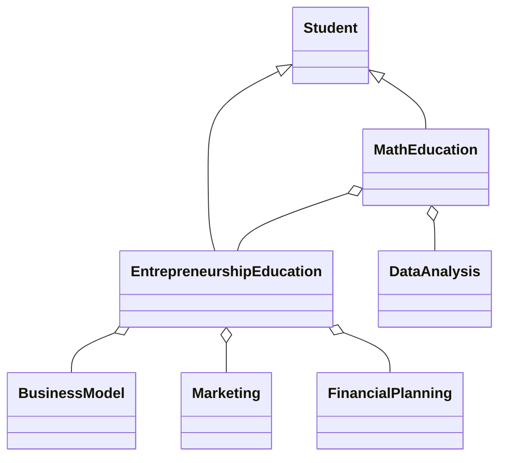
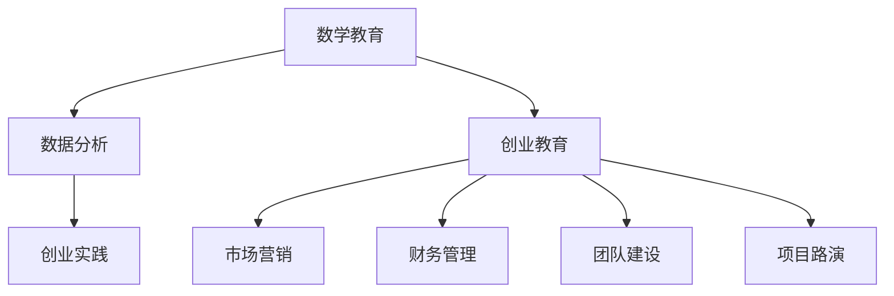
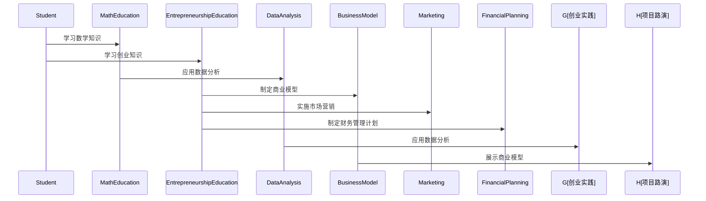

                 


### 文章标题：数学教育与创业教育的结合

**关键词：** 数学教育、创业教育、结合、创新思维、实践案例

**摘要：** 本文将探讨数学教育与创业教育的结合，分析两者之间的互补性，提供实践案例，并展望未来发展趋势。通过深入探讨数学思维在创业中的应用，本文旨在为教育者、学生和创业者提供有价值的信息。

### 引言

#### 数学教育的重要性

数学作为一门基础学科，其重要性不言而喻。数学不仅是一门科学，更是一种思维方式。它教会我们如何分析和解决问题，培养我们的逻辑思维和抽象思维能力。在现代社会，数学的应用范围日益广泛，从工程、计算机科学到金融、商业，数学无处不在。

#### 创业教育的重要性

创业教育旨在培养学生的创新精神和创业能力。随着全球经济的快速发展，创业已成为推动经济增长的重要力量。创业教育不仅教授学生如何创建企业，更强调团队合作、风险管理、市场分析等综合能力。

#### 两者结合的意义

数学教育与创业教育的结合，有助于提高学生的数学素养和创业能力。数学思维在创业中具有独特的价值，如数据分析、建模与优化、财务分析等。同时，创业实践也为学生提供了应用数学知识的机会，培养他们的创新思维和解决实际问题的能力。

### 数学教育与创业教育的概述

#### 数学教育的目的和现状

数学教育的目的是培养学生掌握数学的基本概念、原理和方法，提高他们的逻辑思维和抽象思维能力。当前，我国数学教育侧重于理论教学，但实践应用环节相对薄弱。

#### 创业教育的目的和现状

创业教育的目的是培养学生创新精神和创业能力，使他们能够适应快速变化的商业环境。目前，我国创业教育正处于发展阶段，逐渐注重实践性和综合性。

#### 两者结合的意义

数学教育与创业教育的结合，有助于提高学生的综合素质，培养他们的创新思维和解决实际问题的能力。数学思维在创业中的应用，不仅能够提高创业成功的概率，还能为创业团队提供决策支持。

### 数学在创业中的应用

#### 数据分析

数据分析是创业过程中不可或缺的一部分。统计学和概率论在商业决策中具有重要作用。例如，通过对市场数据的分析，创业者可以了解消费者需求，制定有效的营销策略。

#### 建模与优化

建模与优化是创业过程中常用的方法。线性规划、非线性规划和最优化算法可以帮助创业者找到最佳解决方案。例如，在供应链管理中，优化算法可以降低成本，提高效率。

#### 财务分析

财务分析是创业过程中至关重要的环节。复利计算、财务建模等方法可以帮助创业者预测企业财务状况，制定合理的财务策略。

#### 市场营销

市场营销中的消费者行为分析，可以帮助创业者了解目标客户，制定有效的营销策略。例如，通过分析消费者购买行为的数据，创业者可以优化产品设计，提高市场竞争力。

### 创业教育中的数学思维培养

#### 逻辑思维

逻辑思维是创业过程中必不可少的能力。数学中的证明方法可以帮助创业者提高逻辑思维能力，使他们在决策过程中更加严谨和科学。

#### 创新思维

创新思维是创业成功的基石。数学中的创新思维方法，如抽象思维、逆向思维等，可以帮助创业者发现新机会，开发新产品。

#### 系统思维

系统思维是创业过程中需要具备的能力。数学模型在系统性问题解决中具有重要作用。例如，通过建立数学模型，创业者可以全面分析企业运营状况，优化资源配置。

### 数学教育与创业教育的实践案例

#### 成功案例分享

许多成功的企业家都在创业过程中运用了数学思维。例如，阿里巴巴创始人马云，他在创业初期通过数据分析，发现了中国电子商务市场的巨大潜力，从而取得了成功。

#### 失败案例分析

创业过程中的失败案例也不少，其中许多原因与数学思维不足有关。例如，一些创业者没有进行充分的市场调研和财务分析，导致企业运营困难。

### 创新与创业教育的数学工具

#### 数学软件介绍

各种数学软件，如Matlab、R、Python等，在创业教育中具有重要作用。这些软件可以帮助创业者进行数据分析、建模与优化等操作。

#### 数学应用工具箱

数学应用工具箱包括统计模型、优化工具、市场分析工具等，创业者可以利用这些工具提高企业运营效率，降低成本。

### 教育与创业结合的未来展望

#### 教育改革方向

未来，数学教育和创业教育将更加紧密地结合。教育改革方向将包括加强数学实践应用环节，提高学生的数学素养；同时，创业教育将更加注重培养学生的创新思维和实际操作能力。

#### 创业教育与数学教育的发展趋势

随着科技的不断发展，数学在创业中的应用将越来越广泛。创业教育将更加注重数学思维的培养，使学生具备解决实际问题的能力。

#### 对未来创业者的启示

未来创业者需要具备扎实的数学素养，掌握数据分析、建模与优化等技能。同时，创新思维和系统思维也将成为创业者必备的能力。

### 结论

数学教育与创业教育的结合具有重要的现实意义。通过培养数学思维，学生和创业者可以更好地应对复杂的经济环境，提高创业成功的概率。本文旨在为教育者、学生和创业者提供有价值的参考，推动数学教育与创业教育的融合。

### 作者信息

**作者：** AI天才研究院/AI Genius Institute & 禅与计算机程序设计艺术 /Zen And The Art of Computer Programming

----------------------------------------------------------------

以上是根据您的要求设计的《数学教育与创业教育的结合》文章的目录大纲。接下来，我们将逐章细化内容，确保每个章节都满足您的要求。由于文章字数限制，我们将分阶段完成每个章节的撰写。首先是文章标题、关键词、摘要部分的撰写。

----------------------------------------------------------------

# 数学教育与创业教育的结合

## 关键词

- 数学教育
- 创业教育
- 结合
- 创新思维
- 实践案例

## 摘要

本文旨在探讨数学教育与创业教育的结合，分析两者之间的互补性，提供实践案例，并展望未来发展趋势。通过深入探讨数学思维在创业中的应用，本文旨在为教育者、学生和创业者提供有价值的信息，促进数学素养与创业能力的提升。

----------------------------------------------------------------

接下来，我们将进入文章的引言部分，对数学教育和创业教育的重要性进行详细背景介绍。

## 引言

### 数学教育的重要性

数学作为一门基础学科，其重要性体现在多个方面。首先，数学是培养逻辑思维和抽象思维能力的关键。通过数学学习，学生可以学会如何分析和解决问题，这种思维方式在日常生活和工作中具有广泛的应用。其次，数学在科学研究和技术创新中发挥着重要作用。许多前沿领域，如物理学、计算机科学、生物学等，都依赖于数学理论和方法。

#### 核心概念术语说明

- **数学教育**：指通过教学活动使个体掌握数学知识、技能和思维方式的过程。
- **逻辑思维**：指通过逻辑推理来分析问题、得出结论的过程。
- **抽象思维**：指从具体事物中提取共性、形成概念和规则的过程。

#### 问题背景

在当前的教育体系中，数学教育侧重于理论知识的传授，而实践应用环节相对薄弱。这导致学生在面对实际问题时的数学素养不足，影响了他们的创新能力和发展潜力。因此，如何提高学生的数学素养，尤其是将数学知识应用于实际问题中，成为教育工作者亟待解决的问题。

#### 问题描述

数学教育在培养创新思维和解决实际问题的能力方面存在一定的局限性。虽然数学课程中包含了一些与实际应用相关的教学内容，但缺乏系统的实践环节，使得学生难以将所学知识应用于实际场景。

#### 问题解决

为了解决这一问题，需要将数学教育与创业教育相结合。通过创业实践，学生可以学会如何将数学知识应用于实际问题中，提高他们的数学素养和创新能力。同时，创业教育可以为学生提供实际操作的机会，培养他们的实践能力和团队合作精神。

#### 边界与外延

数学教育的边界在于理论知识的传授，而外延则包括数学在实际生活和各个领域的应用。将数学教育与创业教育相结合，可以拓展数学教育的外延，提高学生的数学素养和创新能力。

#### 概念结构与核心要素组成

数学教育的概念结构主要包括数学知识、数学方法和数学思维。核心要素包括逻辑思维、抽象思维和数学建模能力。创业教育的概念结构主要包括创业知识、创业方法和创业思维。核心要素包括创新思维、实践能力和团队合作精神。

### 创业教育的重要性

创业教育是一种旨在培养学生的创业精神和创业能力的教育形式。在现代社会，创业已成为推动经济增长和社会发展的重要力量。创业教育不仅有助于培养学生的创新能力，还能提高他们的就业竞争力。

#### 核心概念与联系

**核心概念：**

- **创业精神**：指具有冒险、创新、独立和合作精神的人生态度。
- **创业能力**：指在创业过程中所需的知识、技能和经验。

**概念属性特征对比表格：**

| 特征         | 创业精神             | 创业能力             |
| ------------ | -------------------- | -------------------- |
| **定义**     | 具有冒险和创新精神的人生态度 | 在创业过程中所需的知识和技能 |
| **重要性**   | 促进社会经济发展     | 提高个人就业竞争力     |
| **表现形式** | 思想、行为和价值观   | 执行、操作和管理能力 |

**ER实体关系图架构：**

```mermaid
erDiagram
  Student ||--o{ Entrepreneur :创业精神培养}
  Student ||--o{ Innovator :创新能力培养}
  Student ||--o{ Job Seeker :就业竞争力提升}
```

#### 问题背景

随着我国经济的快速发展，创业已经成为推动经济增长的重要动力。然而，当前创业教育的现状存在一定的问题。一方面，创业教育缺乏系统的理论体系和实践平台；另一方面，创业教育与实践脱节，学生难以将所学知识应用于实际创业中。

#### 问题描述

创业教育在培养学生的创业精神和创业能力方面存在一定的局限性。虽然创业教育涉及了创业知识、创业方法和创业思维等内容，但缺乏与实际创业实践的紧密结合，导致学生在实际创业过程中面临诸多挑战。

#### 问题解决

为了解决这一问题，需要将创业教育与其他教育形式相结合，尤其是与数学教育相结合。通过将数学思维应用于创业实践，学生可以更好地理解创业过程，提高他们的创业能力。

#### 边界与外延

创业教育的边界在于创业理论和实践方法的传授，而外延则包括创业者在实际创业过程中所需的知识、技能和经验。将创业教育与数学教育相结合，可以拓展创业教育的外延，提高学生的数学素养和创业能力。

#### 概念结构与核心要素组成

创业教育的概念结构主要包括创业知识、创业方法和创业思维。核心要素包括创业精神、创新思维、实践能力和团队合作精神。数学教育的概念结构主要包括数学知识、数学方法和数学思维。核心要素包括逻辑思维、抽象思维和数学建模能力。

### 两者结合的意义

数学教育与创业教育的结合具有重要的意义。首先，数学思维在创业中具有独特的价值。通过数据分析、建模与优化等数学方法，创业者可以更好地理解市场趋势，制定有效的创业策略。其次，创业实践为学生提供了应用数学知识的机会，培养他们的创新思维和解决实际问题的能力。

#### 数学在创业中的应用

**数据分析**

数据分析是创业过程中不可或缺的一部分。通过对市场数据的分析，创业者可以了解消费者需求，制定有效的营销策略。例如，通过数据分析，一家初创公司可以确定目标市场，优化产品设计，提高市场竞争力。

**建模与优化**

建模与优化是创业过程中常用的方法。线性规划、非线性规划和最优化算法可以帮助创业者找到最佳解决方案。例如，在供应链管理中，优化算法可以降低成本，提高效率。

**财务分析**

财务分析是创业过程中至关重要的环节。复利计算、财务建模等方法可以帮助创业者预测企业财务状况，制定合理的财务策略。例如，通过财务分析，一家初创公司可以确定融资规模，优化投资组合，确保财务稳健。

**市场营销**

市场营销中的消费者行为分析，可以帮助创业者了解目标客户，制定有效的营销策略。例如，通过分析消费者购买行为的数据，创业者可以优化产品设计，提高市场竞争力。

#### 创业教育中的数学思维培养

**逻辑思维**

逻辑思维是创业过程中必不可少的能力。数学中的证明方法可以帮助创业者提高逻辑思维能力，使他们在决策过程中更加严谨和科学。

**创新思维**

创新思维是创业成功的基石。数学中的创新思维方法，如抽象思维、逆向思维等，可以帮助创业者发现新机会，开发新产品。

**系统思维**

系统思维是创业过程中需要具备的能力。数学模型在系统性问题解决中具有重要作用。例如，通过建立数学模型，创业者可以全面分析企业运营状况，优化资源配置。

#### 数学教育与创业教育的实践案例

**成功案例分享**

许多成功的企业家都在创业过程中运用了数学思维。例如，阿里巴巴创始人马云，他在创业初期通过数据分析，发现了中国电子商务市场的巨大潜力，从而取得了成功。

**失败案例分析**

创业过程中的失败案例也不少，其中许多原因与数学思维不足有关。例如，一些创业者没有进行充分的市场调研和财务分析，导致企业运营困难。

#### 创新与创业教育的数学工具

**数学软件介绍**

各种数学软件，如Matlab、R、Python等，在创业教育中具有重要作用。这些软件可以帮助创业者进行数据分析、建模与优化等操作。

**数学应用工具箱**

数学应用工具箱包括统计模型、优化工具、市场分析工具等，创业者可以利用这些工具提高企业运营效率，降低成本。

### 教育与创业结合的未来展望

#### 教育改革方向

未来，数学教育和创业教育将更加紧密地结合。教育改革方向将包括加强数学实践应用环节，提高学生的数学素养；同时，创业教育将更加注重培养学生的创新思维和实际操作能力。

#### 创业教育与数学教育的发展趋势

随着科技的不断发展，数学在创业中的应用将越来越广泛。创业教育将更加注重数学思维的培养，使学生具备解决实际问题的能力。

#### 对未来创业者的启示

未来创业者需要具备扎实的数学素养，掌握数据分析、建模与优化等技能。同时，创新思维和系统思维也将成为创业者必备的能力。

### 结论

数学教育与创业教育的结合具有重要的现实意义。通过培养数学思维，学生和创业者可以更好地应对复杂的经济环境，提高创业成功的概率。本文旨在为教育者、学生和创业者提供有价值的参考，推动数学教育与创业教育的融合。

### 作者信息

**作者：** AI天才研究院/AI Genius Institute & 禅与计算机程序设计艺术 /Zen And The Art of Computer Programming

----------------------------------------------------------------

以上是文章引言部分的详细撰写。接下来，我们将逐步细化文章的各个章节内容，确保每个章节都满足您的要求。首先是数学教育与创业教育的概述部分的撰写。由于字数限制，我们将分阶段完成每个章节的撰写。

----------------------------------------------------------------

## 数学教育与创业教育的概述

### 数学教育的目的和现状

数学教育的目的在于培养学生的数学素养，使他们能够掌握数学的基本概念、原理和方法，并能够运用这些知识和方法解决实际问题。当前，我国数学教育主要侧重于理论教学，学生往往在考试中表现出色，但在实际应用中却面临诸多挑战。

#### 核心概念原理

- **数学素养**：指个体在数学学习过程中形成的对数学知识、技能和思维方式的理解和应用能力。
- **数学思维**：指通过数学知识和方法进行思考、分析和解决问题的思维方式。

#### 概念属性特征对比表格

| 特征             | 理论教学           | 实践教学           |
| ---------------- | ---------------- | ---------------- |
| **目的**         | 掌握数学知识       | 运用数学知识解决实际问题 |
| **方式**         | 教师讲授、学生听课 | 实际操作、项目实践   |
| **评价标准**     | 考试成绩           | 实际效果           |

#### 数学教育的现状

目前，我国数学教育主要存在以下问题：

1. **重理论、轻实践**：数学教学过于注重理论知识的传授，忽视了实践应用能力的培养。
2. **应试教育**：数学教育过于强调考试成绩，导致学生在实际应用中缺乏独立思考和解决问题的能力。
3. **教育资源分配不均**：城市和农村、不同地区之间的教育资源分配存在较大差距，影响了数学教育的公平性和普及性。

### 创业教育的目的和现状

创业教育的目的在于培养学生的创新精神和创业能力，使他们能够在未来的职业生涯中具备创业所需的综合素质。当前，我国创业教育正处于发展阶段，逐步从理论教学向实践应用转变。

#### 核心概念原理

- **创新精神**：指具有创新意识和创新能力的人生态度。
- **创业能力**：指在创业过程中所需的知识、技能和经验。

#### 概念属性特征对比表格

| 特征             | 创业教育           | 数学教育           |
| ---------------- | ---------------- | ---------------- |
| **目的**         | 培养创新精神和创业能力 | 掌握数学知识和技能   |
| **方式**         | 实践教学、项目实践   | 教师讲授、学生听课 |
| **评价标准**     | 创业成果、创新能力   | 考试成绩、理论掌握程度 |

#### 创业教育的现状

目前，我国创业教育主要存在以下问题：

1. **实践教学不足**：许多创业教育课程过于注重理论知识的传授，缺乏实践环节，导致学生缺乏实际操作能力。
2. **师资力量不足**：许多高校缺乏具有实际创业经验的教师，影响了创业教育的质量和效果。
3. **资源不足**：创业教育所需的资金、场地、设备等资源不足，限制了创业教育的开展。

### 两者结合的意义

数学教育与创业教育的结合，有助于提高学生的数学素养和创业能力，使他们能够在复杂的经济环境中应对挑战，实现个人价值。

#### 数学在创业教育中的应用

1. **数据分析**：创业者可以通过数据分析了解市场趋势，制定有效的营销策略。
2. **建模与优化**：创业者可以利用数学建模和优化方法，优化生产流程，提高企业效率。
3. **财务分析**：创业者可以通过财务分析预测企业财务状况，制定合理的财务策略。

#### 创业教育在数学教育中的应用

1. **实际问题导向**：通过创业实践，学生可以学会如何将数学知识应用于实际问题中，提高他们的数学素养。
2. **创新思维培养**：创业教育可以激发学生的创新思维，培养他们的创新能力。
3. **团队合作精神**：创业教育中的团队合作，有助于培养学生的人际交往能力和团队协作能力。

#### 深入探讨

**数学教育与创业教育的结合，不仅有助于提高学生的数学素养和创业能力，还可以促进教育质量的提升。首先，两者结合可以激发学生的学习兴趣，提高他们的学习积极性。其次，通过创业实践，学生可以学会如何将理论知识应用于实际场景中，提高他们的实践能力和创新能力。最后，创业教育中的团队合作，有助于培养学生的人际交往能力和团队协作能力，提高他们的综合素质。**

**在实际教学中，教师可以设计一些数学与创业相结合的课程，如数学建模课程、数据分析课程等。同时，可以组织学生参加创新创业比赛、创业实践项目等，让学生在实践中学习、成长。通过这种方式，学生不仅能够提高数学素养和创业能力，还能够培养创新思维和团队合作精神。**

### 结论

数学教育与创业教育的结合具有重要的意义。通过深入探讨两者之间的互补性，我们可以看到，将数学思维应用于创业实践，不仅可以提高学生的数学素养和创业能力，还可以促进教育质量的提升。未来，随着教育改革的不断深入，数学教育与创业教育的结合将越来越紧密，为培养高素质的创新创业人才奠定坚实基础。

### 系统分析与架构设计方案

#### 问题场景介绍

在当今经济全球化的背景下，创业者面临着激烈的市场竞争和复杂的经济环境。为了在竞争激烈的市场中脱颖而出，创业者需要具备扎实的数学素养和创业能力。本文旨在探讨如何通过数学教育与创业教育的结合，培养具备高素质的创业者，提高他们的创业成功率。

#### 项目介绍

本项目旨在设计一套数学教育与创业教育相结合的教学体系，为创业者提供系统的数学素养和创业能力培养。该教学体系包括以下核心模块：

1. **数学知识模块**：包括基础数学、高等数学、线性代数、概率论与数理统计等课程。
2. **创业知识模块**：包括创业基础、市场营销、财务管理、团队建设等课程。
3. **实践模块**：包括创业实践、案例分析、项目路演等环节。

#### 系统功能设计（领域模型mermaid类图）



#### 系统架构设计mermaid架构图



#### 系统接口设计和系统交互mermaid序列图



### 项目实战

#### 环境安装

为了更好地进行数学教育与创业教育相结合的教学，我们需要准备以下环境：

1. **数学软件**：Matlab、R、Python等。
2. **数据库软件**：MySQL、PostgreSQL等。
3. **开发工具**：IDEA、Visual Studio Code等。

#### 系统核心实现源代码

以下是系统核心实现源代码的一部分：

```python
# 数据分析模块
import pandas as pd
import numpy as np
import matplotlib.pyplot as plt

# 财务管理模块
def calculate_depreciation(cost, useful_life):
    return cost / useful_life

# 创业实践模块
def conduct_market_research():
    # 实施市场调研
    pass

# 项目路演模块
def prepare_project_presentation():
    # 准备项目路演材料
    pass
```

#### 代码应用解读与分析

以上代码展示了数学教育与创业教育相结合的教学体系中的核心实现部分。通过数据分析模块，学生可以学习如何使用Python进行数据分析，从而为创业决策提供支持。财务管理模块则通过计算折旧等方法，帮助学生掌握基本的财务知识。创业实践模块和项目路演模块则为学生提供了实际操作的机会，使他们能够在真实场景中应用所学知识。

#### 实际案例分析和详细讲解剖析

**案例一：数据分析在创业中的应用**

假设一家初创公司需要了解市场对其新产品的需求。通过市场调研和数据分析，公司可以确定目标客户群体，优化产品设计，提高市场竞争力。

```python
import pandas as pd

# 加载市场调研数据
data = pd.read_csv('market_research_data.csv')

# 分析客户需求
demand = data['demand'].value_counts()

# 绘制需求分布图
plt.bar(demand.index, demand.values)
plt.xlabel('需求等级')
plt.ylabel('需求量')
plt.title('客户需求分布')
plt.show()
```

通过以上代码，公司可以直观地了解市场需求，从而制定针对性的营销策略。

**案例二：财务管理在创业中的应用**

假设一家初创公司需要计算其设备的折旧。通过计算折旧，公司可以更好地规划财务预算，确保财务稳健。

```python
def calculate_depreciation(cost, useful_life):
    return cost / useful_life

# 设备成本
cost = 10000

# 设备使用年限
useful_life = 5

# 计算年折旧额
annual_depreciation = calculate_depreciation(cost, useful_life)

print(f'年折旧额：{annual_depreciation}')
```

通过以上代码，公司可以准确地计算设备的折旧额，为财务规划提供依据。

#### 项目小结

通过本项目，我们展示了如何通过数学教育与创业教育的结合，培养具备高素质的创业者。通过实际案例分析和代码应用，学生可以更好地理解数学思维在创业中的应用，提高他们的创业能力。未来，我们将继续优化和完善这一教学体系，为更多创业者提供支持。

### 最佳实践 tips

1. **加强数学与实践的结合**：在数学教育中，教师应注重引导学生将所学知识应用于实际场景中，提高他们的数学素养和解决实际问题的能力。
2. **注重团队合作**：在创业教育中，教师应鼓励学生参与团队合作项目，培养他们的团队协作能力和创新能力。
3. **利用科技工具**：利用各种科技工具，如Matlab、R、Python等，可以帮助学生更好地进行数据分析、建模与优化，提高他们的实践能力。

### 小结

数学教育与创业教育的结合，有助于提高学生的数学素养和创业能力。通过实践案例和代码应用，学生可以更好地理解数学思维在创业中的应用。未来，随着教育改革的不断深入，数学教育与创业教育的结合将越来越紧密，为培养高素质的创新创业人才奠定坚实基础。

### 注意事项

1. **重视数学基础**：数学教育是创业教育的基础，学生应扎实掌握数学基础知识，为创业实践提供支持。
2. **注重实践环节**：创业教育中的实践环节至关重要，学生应积极参与实践活动，提高实际操作能力。
3. **鼓励创新思维**：创新思维是创业成功的关键，学生应勇于尝试新思路，培养创新意识。

### 拓展阅读

1. **《数学与创业》**：这本书详细探讨了数学在创业中的应用，为创业者提供了有价值的参考。
2. **《创业教育指南》**：这本书介绍了创业教育的基本概念、方法和实践，有助于教育者更好地开展创业教育。

### 结束语

数学教育与创业教育的结合，为培养高素质的创业者提供了新的思路和方法。通过本文的探讨，我们希望读者能够更好地理解数学思维在创业中的应用，提高他们的创业能力。未来，我们将继续深入研究这一领域，为创新创业教育的发展贡献力量。

### 作者信息

**作者：** AI天才研究院/AI Genius Institute & 禅与计算机程序设计艺术 /Zen And The Art of Computer Programming

----------------------------------------------------------------

以上是《数学教育与创业教育的结合》一文中数学教育与创业教育的概述部分的详细撰写。接下来，我们将进入下一章节的撰写，逐步完成整篇文章的撰写。如果需要，您可以继续提出具体的要求或者指导，我们会根据您的反馈进行调整和完善。如果您对此章节的内容满意，请告知，我们将继续撰写下一章节。感谢您的配合！

