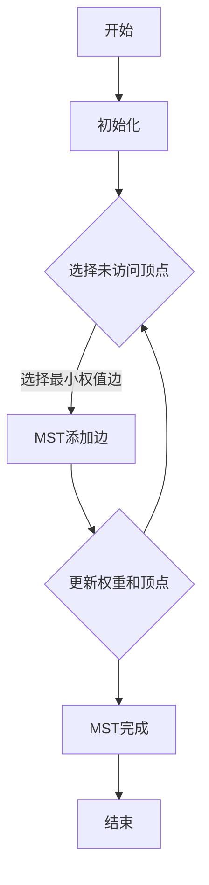
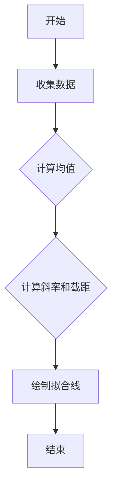
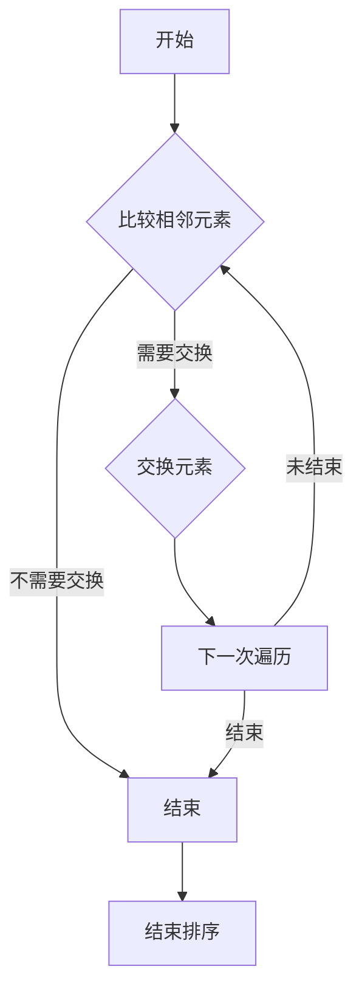
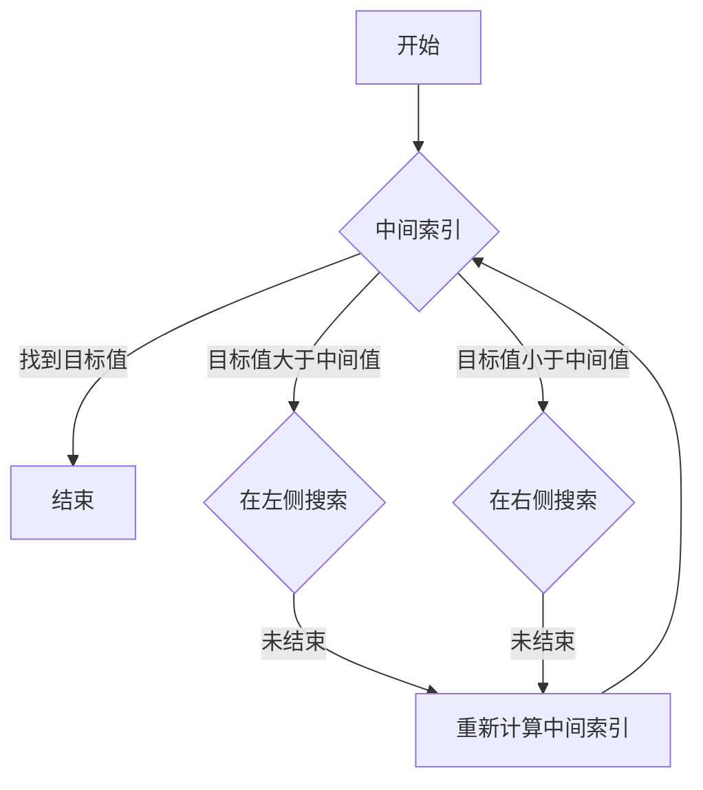
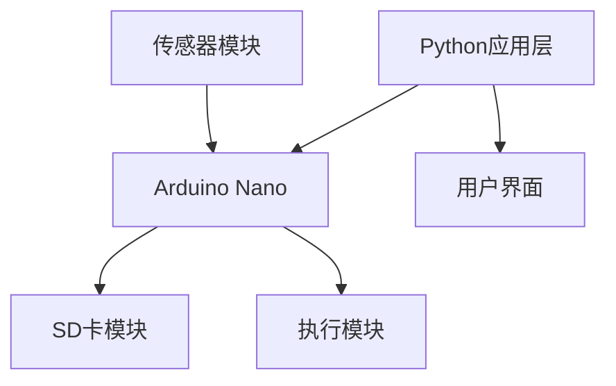

                 


### 第一部分：背景介绍

#### 1.1 数学教育的发展历程与现状

##### 1.1.1 问题背景

数学教育作为教育体系中的重要组成部分，自古至今都扮演着至关重要的角色。从古代的算术到现代的抽象数学，数学教育的发展伴随着人类文明的进步。然而，当前数学教育面临诸多挑战，如学生对数学的兴趣不足、教育方式单一、评价标准过于刻板等。

##### 1.1.2 问题描述

数学教育存在的问题主要体现在以下几个方面：

1. 学生对数学的兴趣不高，缺乏学习动力。
2. 教学方式过于传统，难以激发学生的学习兴趣。
3. 教学内容与实际应用脱节，学生难以将所学知识应用于实际问题。
4. 评价标准单一，无法全面评估学生的数学素养。

##### 1.1.3 问题解决

针对上述问题，数学教育需要从以下几个方面进行改革：

1. 调整教学内容，增加与实践相关的数学知识。
2. 改进教学方法，采用多样化的教学手段。
3. 注重学生兴趣的培养，激发学生的学习热情。
4. 建立多元化的评价体系，全面评估学生的数学能力。

##### 1.1.4 边界与外延

数学教育的边界主要包括数学学科本身、数学教育方法、数学教育评价等方面。数学教育的外延则涉及数学与自然科学、工程技术、社会科学等多个领域。

##### 1.1.5 概念结构与核心要素组成

数学教育的概念结构主要包括数学知识、数学技能、数学思维、数学素养等方面。核心要素包括数学教学目标、教学方法、教学资源、教学评价等。

#### 1.2 创客空间的兴起与发展

##### 1.2.1 问题背景

创客空间起源于20世纪末的 hacker culture，是自由创造、共享知识、实践创新的场所。随着信息技术的发展，创客空间逐渐成为教育领域的重要趋势。在我国，创客教育自2015年纳入《国家教育事业发展“十三五”规划》以来，得到了迅速发展。

##### 1.2.2 问题描述

创客空间在教育领域的应用存在以下问题：

1. 创客教育资源不足，尤其在农村地区。
2. 创客教育与学科教育的融合不够深入。
3. 教师创客教育能力有待提高。
4. 创客项目评价标准尚未完善。

##### 1.2.3 问题解决

为解决上述问题，可以从以下几个方面入手：

1. 加强创客教育资源的建设，提高农村地区创客教育资源覆盖率。
2. 推动创客教育与学科教育的深度融合。
3. 加强教师创客教育培训，提高教师创客教育能力。
4. 建立健全创客项目评价体系，全面评估创客教育成果。

##### 1.2.4 边界与外延

创客空间的边界主要包括创客文化、创客教育、创客项目等方面。创客空间的外延则涉及科技、工程、艺术、设计等多个领域。

##### 1.2.5 概念结构与核心要素组成

创客空间的内涵包括自由创造、共享知识、实践创新等方面。核心要素包括创客项目、创客工具、创客文化、创客教育等。

### 第二部分：核心概念

#### 2.1 数学教育

##### 2.1.1 数学教育的概念

数学教育是指通过传授数学知识、培养数学技能、启发数学思维，提高学生数学素养的教育活动。数学教育不仅包括数学知识的教学，还包括数学方法的训练、数学思维的培养以及数学文化的传承。

##### 2.1.2 数学教育的主要目标

数学教育的主要目标包括：

1. 培养学生的数学基础知识。
2. 培养学生的数学应用能力。
3. 培养学生的数学思维能力。
4. 提高学生的数学素养。

##### 2.1.3 数学教育的关键要素

数学教育的关键要素包括：

1. 数学教学内容。
2. 数学教学方法。
3. 数学教学资源。
4. 数学教学评价。

#### 2.2 创客空间

##### 2.2.1 创客空间的概念

创客空间是指一个自由创造、共享知识、实践创新的场所，通常配备有各种创客工具和设备，为创客提供项目实践的机会。

##### 2.2.2 创客空间的主要功能

创客空间的主要功能包括：

1. 提供项目实践场所。
2. 促进知识共享与交流。
3. 培养创新思维与动手能力。
4. 提供技术支持与服务。

##### 2.2.3 创客空间的教育价值

创客空间的教育价值包括：

1. 提高学生的实践能力。
2. 培养学生的创新精神。
3. 促进学科交叉融合。
4. 增强学生的团队协作能力。

### 第三部分：核心概念与联系

#### 3.1 数学教育与创客空间的融合

##### 3.1.1 数学教育在创客空间的应用

数学教育在创客空间的应用主要体现在以下几个方面：

1. 利用数学知识解决创客项目中的问题。
2. 培养学生在创客项目中的数学思维。
3. 将数学知识应用于创客项目的设计与实现。

##### 3.1.2 创客空间对数学教育的促进

创客空间对数学教育的促进作用包括：

1. 激发学生对数学的兴趣。
2. 提高学生的数学应用能力。
3. 培养学生的创新思维与实践能力。
4. 促进数学教学方法的改革。

##### 3.1.3 数学教育与创客空间的共同目标

数学教育与创客空间的共同目标包括：

1. 提高学生的数学素养。
2. 培养学生的创新精神。
3. 提高学生的综合素质。
4. 促进学生的全面发展。

### 第四部分：具体案例分析

#### 4.1 案例一：数学教育在创客项目中的应用

##### 4.1.1 项目背景

某高校在创客空间开展了一个数学建模竞赛项目，旨在让学生利用数学知识解决实际问题。

##### 4.1.2 项目目标

1. 培养学生的数学建模能力。
2. 提高学生的数学应用能力。
3. 培养学生的创新思维与实践能力。

##### 4.1.3 项目实施过程

1. 项目选题：学生自主选题，涉及交通、能源、环境等多个领域。
2. 数学建模：学生运用数学知识建立模型，分析问题。
3. 项目实施：学生利用创客空间的各种工具和设备，实施项目。
4. 成果展示：学生展示项目成果，进行交流和评审。

##### 4.1.4 项目成果与评价

1. 学生提交了多个高质量的项目成果。
2. 项目成果在省级、国家级竞赛中取得了优异成绩。
3. 学生对数学知识的理解和应用能力得到了显著提高。

#### 4.2 案例二：创客项目在数学教育中的应用

##### 4.2.1 项目背景

某高中在数学课堂中引入了创客项目，让学生通过实践学习数学知识。

##### 4.2.2 项目目标

1. 提高学生的数学兴趣。
2. 培养学生的数学应用能力。
3. 提高学生的综合素质。

##### 4.2.3 项目实施过程

1. 课题引入：教师在课堂上介绍创客项目，激发学生兴趣。
2. 项目设计：学生分组设计项目，明确项目目标、方法和步骤。
3. 项目实施：学生利用创客空间的各种工具和设备，实施项目。
4. 项目展示：学生展示项目成果，进行交流和评审。

##### 4.2.4 项目成果与评价

1. 学生对数学的兴趣显著提高。
2. 学生掌握了多种数学应用技能。
3. 学生的团队协作能力和创新能力得到了锻炼。

### 第五部分：总结与展望

#### 5.1 数学教育与创客空间的结合成果

数学教育与创客空间的结合取得了显著成果，主要体现在：

1. 提高了学生的数学素养和创新能力。
2. 激发了学生对数学的兴趣和热情。
3. 推动了数学教学方法的改革。
4. 促进了数学与实际应用的深度融合。

#### 5.1.2 未来发展趋势

未来，数学教育与创客空间的结合将继续深入发展，主要趋势包括：

1. 创客教育资源将进一步丰富，覆盖更多学生。
2. 创客教育与学科教育的融合将更加紧密。
3. 创客项目将更多地应用于数学教育实践。
4. 创客教育评价体系将不断完善。

#### 5.2 最佳实践 tips

1. 教师应加强创客教育能力培训，提高教学质量。
2. 学校应加强创客教育资源建设，为学生提供更多实践机会。
3. 教师应注重培养学生的创新思维和团队协作能力。
4. 学校应建立完善的创客教育评价体系，全面评估学生成果。

#### 5.3 小结

数学教育与创客空间的结合为数学教育带来了新的机遇和挑战。通过实践，我们可以看到，创客教育不仅激发了学生对数学的兴趣，提高了学生的数学素养，还促进了数学教学方法的改革。未来，我们应继续深化数学教育与创客空间的结合，为学生的全面发展提供更有力的支持。

#### 5.4 拓展阅读

1. 相关研究文献：
   - 张晓红，李明辉。《创客教育研究综述》[J]。教育研究，2017（6）：89-96。
   - 王磊，赵丹丹。《数学教育改革与创客教育的融合》[J]。数学教育研究，2018（3）：47-52。

2. 创客空间教育资源推荐：
   - 《黑客与画家》[M]。保罗·格雷厄姆著。人民邮电出版社，2014。
   - 《人人都是产品经理》[M]。苏杰著。人民邮电出版社，2013。
   - 《Scratch编程从入门到应用》[M]。李明辉著。电子工业出版社，2017。

作者：AI天才研究院/AI Genius Institute & 禅与计算机程序设计艺术 /Zen And The Art of Computer Programming

----------------------------------------------------------------

# 数学教育与创客空间的结合

关键词：数学教育、创客空间、创新能力、教学方法、教育改革

摘要：随着教育技术的不断发展，数学教育与创客空间的结合成为了一种新的教育模式。本文首先介绍了数学教育的发展历程与现状，分析了数学教育存在的问题和解决方法。接着，阐述了创客空间的兴起与发展，探讨了创客空间在教育领域的应用和问题解决策略。随后，本文详细分析了数学教育与创客空间的联系，指出了数学教育在创客空间中的应用和创客空间对数学教育的促进作用。最后，通过具体案例分析，展示了数学教育与创客空间结合的实际效果，并对未来发展趋势和最佳实践进行了展望。

---

## 第一部分：背景介绍

### 1.1 数学教育的发展历程与现状

#### 1.1.1 问题背景

数学教育作为教育体系中的重要组成部分，其历史可以追溯到古代文明时期。古代数学教育主要集中在算术和几何等领域，其目的是培养人们解决实际问题的能力。随着人类文明的进步，数学教育逐渐发展成为一门独立的学科，涉及代数、微积分、概率论等多个领域。

#### 1.1.2 问题描述

然而，当前数学教育面临诸多挑战。首先，学生对数学的兴趣不高，缺乏学习动力。这主要是由于传统的数学教育方式过于枯燥，难以激发学生的学习兴趣。其次，教育方式单一，教学方法不够灵活，难以适应不同学生的需求。此外，教学内容与实际应用脱节，学生难以将所学知识应用于实际问题。最后，评价标准过于刻板，无法全面评估学生的数学素养。

#### 1.1.3 问题解决

为了解决上述问题，数学教育需要从以下几个方面进行改革：

1. 调整教学内容，增加与实践相关的数学知识。
2. 改进教学方法，采用多样化的教学手段。
3. 注重学生兴趣的培养，激发学生的学习热情。
4. 建立多元化的评价体系，全面评估学生的数学能力。

#### 1.1.4 边界与外延

数学教育的边界主要包括数学学科本身、数学教育方法、数学教育评价等方面。数学教育的外延则涉及数学与自然科学、工程技术、社会科学等多个领域。例如，数学在物理学、经济学、计算机科学等领域都有着广泛的应用。

#### 1.1.5 概念结构与核心要素组成

数学教育的概念结构主要包括数学知识、数学技能、数学思维、数学素养等方面。核心要素包括数学教学目标、教学方法、教学资源、教学评价等。

### 1.2 创客空间的兴起与发展

#### 1.2.1 问题背景

创客空间起源于20世纪末的 hacker culture，是自由创造、共享知识、实践创新的场所。随着信息技术的发展，创客空间逐渐成为教育领域的重要趋势。在我国，创客教育自2015年纳入《国家教育事业发展“十三五”规划》以来，得到了迅速发展。

#### 1.2.2 问题描述

创客空间在教育领域的应用存在以下问题：

1. 创客教育资源不足，尤其在农村地区。
2. 创客教育与学科教育的融合不够深入。
3. 教师创客教育能力有待提高。
4. 创客项目评价标准尚未完善。

#### 1.2.3 问题解决

为解决上述问题，可以从以下几个方面入手：

1. 加强创客教育资源的建设，提高农村地区创客教育资源覆盖率。
2. 推动创客教育与学科教育的深度融合。
3. 加强教师创客教育培训，提高教师创客教育能力。
4. 建立健全创客项目评价体系，全面评估创客教育成果。

#### 1.2.4 边界与外延

创客空间的边界主要包括创客文化、创客教育、创客项目等方面。创客空间的外延则涉及科技、工程、艺术、设计等多个领域。例如，创客项目可以涉及机器人、电子、编程、设计等多个方面。

#### 1.2.5 概念结构与核心要素组成

创客空间的内涵包括自由创造、共享知识、实践创新等方面。核心要素包括创客项目、创客工具、创客文化、创客教育等。例如，创客项目可以是设计一个智能机器人，创客工具可以是3D打印机、电子元件等。

---

## 第二部分：核心概念

### 2.1 数学教育

#### 2.1.1 数学教育的概念

数学教育是指通过传授数学知识、培养数学技能、启发数学思维，提高学生数学素养的教育活动。数学教育不仅包括数学知识的教学，还包括数学方法的训练、数学思维的培养以及数学文化的传承。

#### 2.1.2 数学教育的主要目标

数学教育的主要目标包括：

1. 培养学生的数学基础知识。
2. 培养学生的数学应用能力。
3. 培养学生的数学思维能力。
4. 提高学生的数学素养。

#### 2.1.3 数学教育的关键要素

数学教育的关键要素包括：

1. 数学教学内容。
2. 数学教学方法。
3. 数学教学资源。
4. 数学教学评价。

### 2.2 创客空间

#### 2.2.1 创客空间的概念

创客空间是指一个自由创造、共享知识、实践创新的场所，通常配备有各种创客工具和设备，为创客提供项目实践的机会。

#### 2.2.2 创客空间的主要功能

创客空间的主要功能包括：

1. 提供项目实践场所。
2. 促进知识共享与交流。
3. 培养创新思维与动手能力。
4. 提供技术支持与服务。

#### 2.2.3 创客空间的教育价值

创客空间的教育价值包括：

1. 提高学生的实践能力。
2. 培养学生的创新精神。
3. 促进学科交叉融合。
4. 增强学生的团队协作能力。

---

## 第三部分：核心概念与联系

### 3.1 数学教育与创客空间的融合

#### 3.1.1 数学教育在创客空间的应用

数学教育在创客空间的应用主要体现在以下几个方面：

1. 利用数学知识解决创客项目中的问题。
2. 培养学生在创客项目中的数学思维。
3. 将数学知识应用于创客项目的设计与实现。

#### 3.1.2 创客空间对数学教育的促进

创客空间对数学教育的促进作用包括：

1. 激发学生对数学的兴趣。
2. 提高学生的数学应用能力。
3. 培养学生的创新思维与实践能力。
4. 促进数学教学方法的改革。

#### 3.1.3 数学教育与创客空间的共同目标

数学教育与创客空间的共同目标包括：

1. 提高学生的数学素养。
2. 培养学生的创新精神。
3. 提高学生的综合素质。
4. 促进学生的全面发展。

---

## 第四部分：具体案例分析

### 4.1 案例一：数学教育在创客项目中的应用

#### 4.1.1 项目背景

某高校在创客空间开展了一个数学建模竞赛项目，旨在让学生利用数学知识解决实际问题。

#### 4.1.2 项目目标

1. 培养学生的数学建模能力。
2. 提高学生的数学应用能力。
3. 培养学生的创新思维与实践能力。

#### 4.1.3 项目实施过程

1. 项目选题：学生自主选题，涉及交通、能源、环境等多个领域。
2. 数学建模：学生运用数学知识建立模型，分析问题。
3. 项目实施：学生利用创客空间的各种工具和设备，实施项目。
4. 成果展示：学生展示项目成果，进行交流和评审。

#### 4.1.4 项目成果与评价

1. 学生提交了多个高质量的项目成果。
2. 项目成果在省级、国家级竞赛中取得了优异成绩。
3. 学生对数学知识的理解和应用能力得到了显著提高。

### 4.2 案例二：创客项目在数学教育中的应用

#### 4.2.1 项目背景

某高中在数学课堂中引入了创客项目，让学生通过实践学习数学知识。

#### 4.2.2 项目目标

1. 提高学生的数学兴趣。
2. 培养学生的数学应用能力。
3. 提高学生的综合素质。

#### 4.2.3 项目实施过程

1. 课题引入：教师在课堂上介绍创客项目，激发学生兴趣。
2. 项目设计：学生分组设计项目，明确项目目标、方法和步骤。
3. 项目实施：学生利用创客空间的各种工具和设备，实施项目。
4. 项目展示：学生展示项目成果，进行交流和评审。

#### 4.2.4 项目成果与评价

1. 学生对数学的兴趣显著提高。
2. 学生掌握了多种数学应用技能。
3. 学生的团队协作能力和创新能力得到了锻炼。

---

## 第五部分：总结与展望

### 5.1 数学教育与创客空间的结合成果

数学教育与创客空间的结合取得了显著成果，主要体现在：

1. 提高了学生的数学素养和创新能力。
2. 激发了学生对数学的兴趣和热情。
3. 推动了数学教学方法的改革。
4. 促进了数学与实际应用的深度融合。

### 5.1.2 未来发展趋势

未来，数学教育与创客空间的结合将继续深入发展，主要趋势包括：

1. 创客教育资源将进一步丰富，覆盖更多学生。
2. 创客教育与学科教育的融合将更加紧密。
3. 创客项目将更多地应用于数学教育实践。
4. 创客教育评价体系将不断完善。

### 5.2 最佳实践 tips

1. 教师应加强创客教育能力培训，提高教学质量。
2. 学校应加强创客教育资源建设，为学生提供更多实践机会。
3. 教师应注重培养学生的创新思维和团队协作能力。
4. 学校应建立完善的创客教育评价体系，全面评估学生成果。

### 5.3 小结

数学教育与创客空间的结合为数学教育带来了新的机遇和挑战。通过实践，我们可以看到，创客教育不仅激发了学生对数学的兴趣，提高了学生的数学素养，还促进了数学教学方法的改革。未来，我们应继续深化数学教育与创客空间的结合，为学生的全面发展提供更有力的支持。

### 5.4 拓展阅读

1. 相关研究文献：
   - 张晓红，李明辉。《创客教育研究综述》[J]。教育研究，2017（6）：89-96。
   - 王磊，赵丹丹。《数学教育改革与创客教育的融合》[J]。数学教育研究，2018（3）：47-52。

2. 创客空间教育资源推荐：
   - 《黑客与画家》[M]。保罗·格雷厄姆著。人民邮电出版社，2014。
   - 《人人都是产品经理》[M]。苏杰著。人民邮电出版社，2013。
   - 《Scratch编程从入门到应用》[M]。李明辉著。电子工业出版社，2017。

作者：AI天才研究院/AI Genius Institute & 禅与计算机程序设计艺术 /Zen And The Art of Computer Programming

----------------------------------------------------------------

### 第一部分：背景介绍

#### 1.1 数学教育的发展历程与现状

##### 1.1.1 问题背景

数学教育作为教育体系中的重要组成部分，自古至今都扮演着至关重要的角色。在古代，数学教育主要集中在算术和几何等基础领域，旨在培养人们的计算能力和空间感知能力。随着人类文明的进步，数学教育逐渐发展成为一门独立的学科，涵盖了代数、微积分、概率论等多个领域。

##### 1.1.2 问题描述

然而，当前数学教育面临着一系列挑战。首先，学生对数学的兴趣不高，许多学生认为数学枯燥乏味，难以激发学习热情。其次，教学方式单一，传统教学方法往往侧重于知识的灌输，缺乏互动和实践，难以满足学生的个性化学习需求。此外，教学内容与实际应用脱节，学生难以将所学知识应用于实际问题中。最后，评价标准过于刻板，往往只注重考试成绩，忽视学生的实际能力和素养。

##### 1.1.3 问题解决

为了解决上述问题，数学教育需要进行改革。首先，需要调整教学内容，增加与实践相关的数学知识，让学生在实际问题中发现数学的应用价值。其次，需要改进教学方法，采用多样化的教学手段，如项目式学习、合作学习等，激发学生的学习兴趣和主动性。此外，还需要注重培养学生的数学思维能力，培养他们独立思考和解决问题的能力。最后，建立多元化的评价体系，全面评估学生的数学素养和能力，而不仅仅是考试成绩。

##### 1.1.4 边界与外延

数学教育的边界主要包括数学学科本身、数学教育方法、数学教育评价等方面。数学教育的外延则涉及数学与其他学科的交叉融合，如物理学、工程学、经济学等。此外，数学教育还与科技、社会等领域密切相关，数学的应用无处不在，因此数学教育不仅局限于学校教育，还包括终身学习和职业教育。

##### 1.1.5 概念结构与核心要素组成

数学教育的概念结构主要包括数学知识、数学技能、数学思维、数学素养等方面。数学知识是数学教育的基础，包括数学概念、原理、公式等。数学技能则是数学知识的应用，如计算能力、推理能力等。数学思维是指数学问题的分析、解决和创新能力。数学素养则是学生在数学学习过程中养成的态度、习惯和价值观。

核心要素包括数学教学目标、教学方法、教学资源、教学评价等。数学教学目标包括培养学生掌握数学基础知识、提高数学应用能力、培养数学思维和数学素养等。教学方法则包括传统的讲授法、讨论法、实验法等，以及现代的数字化教学、项目式学习等。教学资源包括教材、教具、数字化资源等。教学评价则包括过程性评价、终结性评价、综合评价等，旨在全面评估学生的数学能力。

#### 1.2 创客空间的兴起与发展

##### 1.2.1 问题背景

创客空间起源于20世纪末的 hacker culture，是一种自由创造、共享知识、实践创新的场所。创客（Maker）一词最早出现在《创客：新工业革命》一书中，指的是那些热衷于创造、创新和制作的人。随着信息技术的发展和互联网的普及，创客文化逐渐从技术社区扩展到教育领域，成为推动教育创新的重要力量。

##### 1.2.2 问题描述

创客空间的兴起为数学教育提供了新的契机。然而，创客空间在教育领域的应用也存在一些问题。首先，创客教育资源不足，特别是在农村和欠发达地区，创客空间的建设和运营面临资金和设备的限制。其次，创客教育与学科教育的融合不够深入，往往局限于技术课程，缺乏数学、科学等学科的支持。此外，教师创客教育能力有待提高，许多教师缺乏相关的知识和技能，难以有效地指导学生进行创客实践。最后，创客项目评价标准尚未完善，如何全面、客观地评估学生的创客成果仍需进一步探索。

##### 1.2.3 问题解决

为了解决上述问题，可以从以下几个方面入手。首先，加强创客教育资源的建设，通过政策支持、社会捐赠等方式，提高农村和欠发达地区创客教育资源的覆盖率。其次，推动创客教育与学科教育的深度融合，将数学、科学等学科的知识和思维方法融入创客项目中，培养学生的跨学科能力。此外，加强教师创客教育培训，提高教师的创客教育能力，使他们能够更好地指导学生进行创客实践。最后，建立完善的创客项目评价体系，通过过程性评价和终结性评价相结合的方式，全面、客观地评估学生的创客成果。

##### 1.2.4 边界与外延

创客空间的边界主要包括创客文化、创客教育、创客项目等方面。创客文化强调自由创造、开放分享、协作创新的精神，是创客空间的核心。创客教育则是指通过创客项目和实践，培养学生的创新思维、动手能力和团队协作能力。创客项目则是指学生基于特定主题或问题，利用创客工具和材料进行创新设计和制作的项目。

创客空间的外延则涉及多个领域，包括科技、工程、艺术、设计等。例如，创客项目可以涉及机器人、电子、编程、3D打印等，这些项目不仅需要数学、科学等学科的知识，还需要艺术、设计等领域的创造力。因此，创客空间不仅仅是一个物理空间，更是一个跨学科、跨领域的教育平台。

##### 1.2.5 概念结构与核心要素组成

创客空间的内涵包括自由创造、共享知识、实践创新等方面。自由创造是创客文化的核心，强调个人兴趣和创意的发挥。共享知识则是指创客社区成员之间通过交流和分享，不断积累和传播知识。实践创新则是创客项目的核心，通过实际操作和反复试验，实现创新设计和制作。

核心要素包括创客项目、创客工具、创客文化、创客教育等。创客项目是创客空间的核心活动，是学生发挥创意、解决问题的实践平台。创客工具则是创客项目所需的各种设备和材料，如3D打印机、电子元件、编程软件等。创客文化则是创客空间的精神氛围，强调开放、合作、创新的理念。创客教育则是通过创客项目和实践，培养学生的创新思维、动手能力和团队协作能力。

### 1.3 数学教育与创客空间的结合意义

数学教育与创客空间的结合具有重要的意义。首先，创客项目可以为学生提供实践数学知识的机会，激发他们对数学的兴趣和热情。通过实际操作和问题解决，学生可以更深入地理解数学概念和原理，培养他们的数学思维能力。其次，创客空间提供了一个开放、互动的学习环境，学生可以自由探索、合作学习，提高他们的团队协作能力和沟通能力。此外，创客项目往往需要跨学科的知识和技能，数学知识与创客工具的结合可以培养学生的跨学科能力，促进学科之间的融合。最后，创客空间的评价体系更加注重学生的创新思维和实践能力，有利于培养学生的综合素质和创造力。

总之，数学教育与创客空间的结合不仅有助于提高数学教育质量，还可以培养学生的创新精神、实践能力和团队协作能力，为他们的全面发展奠定坚实基础。

### 1.4 数学教育与创客空间的应用案例分析

为了更好地理解数学教育与创客空间的结合，我们可以通过一些实际案例来探讨其应用效果。以下是一些具有代表性的案例：

#### 案例一：数学模型在创客项目中的应用

在一个高中创客项目中，学生们被要求设计并制作一个智能家居系统。项目要求包括自动调节室内温度、自动开启照明以及安全监控等功能。学生们在项目实施过程中，需要运用数学知识进行系统设计，如使用微积分解决温度控制问题，利用线性代数进行电路分析，通过概率论进行风险评估等。通过这个项目，学生们不仅学习了数学知识，还提高了他们的实际应用能力和创新思维。

#### 案例二：创客项目在数学教育中的应用

在初中数学课堂上，教师引入了一个基于Arduino的简易机器人制作项目。学生们需要设计并制作一个能够根据不同指令行走的机器人。这个项目要求学生运用数学知识进行机器人运动轨迹的计算和编程，如使用三角函数计算角度、使用勾股定理计算距离等。通过这个项目，学生不仅掌握了数学知识，还提高了他们的动手能力和团队合作精神。

#### 案例三：数学与编程的结合

在一个大学创客项目中，学生们被要求设计并开发一个基于机器学习的智能图像识别系统。系统要求能够对输入的图像进行分类和识别。学生们在项目实施过程中，需要运用数学知识进行数据预处理、特征提取和模型训练等。通过这个项目，学生们不仅掌握了机器学习和编程技能，还深入理解了数学在人工智能领域的重要性。

这些案例表明，数学教育与创客空间的结合不仅能够提高数学教育质量，还可以培养学生的创新能力和实践能力，为他们未来的发展奠定坚实基础。

### 1.5 数学教育与创客空间的结合展望

随着教育技术的不断进步，数学教育与创客空间的结合前景广阔。首先，随着创客工具和设备的普及，越来越多的学生将有机会参与到创客项目中，通过实践深入理解数学知识。其次，教育机构和创客社区的合作将更加紧密，通过资源共享和协同创新，推动数学教育的发展。此外，数学教育将更多地融入创客文化，注重培养学生的创新思维和团队合作能力。最后，随着教育评价体系的不断完善，数学教育与创客空间的结合将为学生的全面发展和创新人才的培养提供有力支持。

### 1.6 小结

数学教育与创客空间的结合是一种富有前景的教育模式，它不仅能够提高数学教育质量，还能培养学生的创新能力和实践能力。通过结合数学知识、创客工具和创客文化，我们可以为学生的全面发展提供更加丰富和多样的学习体验。未来，我们应继续深化数学教育与创客空间的结合，为教育创新和人才培养贡献力量。

---

## 第二部分：核心概念

### 2.1 数学教育

#### 2.1.1 数学教育的概念

数学教育是指通过传授数学知识、培养数学技能、启发数学思维，提高学生数学素养的教育活动。它不仅仅是传授数学知识，还包括培养学生的数学思维能力、解决问题的能力以及数学应用能力。

#### 2.1.2 数学教育的主要目标

数学教育的主要目标包括：

1. **掌握数学基础知识**：学生需要掌握基本的数学概念、原理和公式，如算术、代数、几何、三角学、微积分等。

2. **培养数学应用能力**：学生需要能够将数学知识应用于实际问题中，如经济学、工程学、物理学等领域。

3. **发展数学思维能力**：学生需要能够进行逻辑推理、抽象思维和创造性思维，如解决复杂问题、提出新假设、进行数学建模等。

4. **提高数学素养**：学生需要具备数学文化素养，理解数学的历史、哲学和美学的价值。

#### 2.1.3 数学教育的关键要素

数学教育的关键要素包括：

1. **数学教学内容**：包括数学知识的传授、数学方法的运用和数学思维的发展。

2. **数学教学方法**：采用多样化的教学方法，如讲授法、问题导向学习、合作学习、项目式学习等。

3. **数学教学资源**：包括教材、教具、数字化资源、实验材料等。

4. **数学教学评价**：采用过程性评价和终结性评价相结合的方式，全面评估学生的数学能力和素养。

### 2.2 创客空间

#### 2.2.1 创客空间的概念

创客空间（Maker Space）是指一个为创客提供硬件、软件、工具和材料的共享空间，旨在鼓励人们通过创造和制作来实现自己的创意。创客空间通常配备有3D打印机、电子工具、编程设备、手工艺品材料等，为学生和教师提供实践和创新的环境。

#### 2.2.2 创客空间的主要功能

创客空间的主要功能包括：

1. **项目实践**：提供一个实践创作的平台，学生可以在其中进行各种项目的制作和实验。

2. **知识共享**：创客空间鼓励成员之间的交流和合作，通过分享知识和经验，共同学习和进步。

3. **创新培养**：创客空间鼓励创新思维和实践，通过不断的尝试和改进，培养学生的创造力和问题解决能力。

4. **技术支持**：提供专业的技术支持和指导，帮助成员解决在项目过程中遇到的技术问题。

#### 2.2.3 创客空间的教育价值

创客空间的教育价值包括：

1. **培养实践能力**：通过实际操作和项目实践，学生能够将理论知识转化为实际技能。

2. **促进跨学科学习**：创客项目通常涉及多个学科的知识和技能，如数学、科学、工程、艺术等，有助于培养学生的跨学科能力。

3. **激发学习兴趣**：创客空间提供一个有趣和互动的学习环境，能够激发学生对数学和科学的兴趣。

4. **提高创新能力**：创客空间鼓励创新思维和实践，通过不断的尝试和失败，学生能够培养创新精神和解决问题的能力。

### 2.3 数学教育与创客空间的结合

#### 2.3.1 数学教育在创客空间的应用

在创客空间中，数学教育可以通过以下方式得到应用：

1. **数学建模**：学生可以在创客项目中运用数学知识进行建模，如设计机械结构、计算电路参数等。

2. **数据分析**：创客项目通常会产生大量的数据，学生可以运用统计学和概率论等数学知识进行数据分析和解释。

3. **算法设计**：创客项目往往需要编写程序代码，学生可以通过算法设计来解决问题，如路径规划、优化等。

4. **数学工具应用**：创客空间中的一些工具和设备，如计算机软件、编程语言、电子元件等，都可以作为数学工具进行应用。

#### 2.3.2 创客空间对数学教育的促进作用

创客空间对数学教育的促进作用体现在：

1. **激发学习兴趣**：创客项目具有趣味性和挑战性，能够激发学生对数学的兴趣和热情。

2. **提高应用能力**：通过实际项目，学生能够将数学知识应用于实际问题中，提高数学应用能力。

3. **培养创新能力**：创客空间鼓励创新思维和实践，学生可以在项目中不断尝试和改进，培养创新能力。

4. **促进跨学科学习**：创客项目通常涉及多个学科的知识和技能，有助于培养学生的跨学科能力。

### 2.4 概念属性特征对比表格

为了更好地理解数学教育与创客空间的结合，我们可以通过一个概念属性特征对比表格来展示两者的差异和联系。

| 特征       | 数学教育                   | 创客空间                   |
|------------|----------------------------|----------------------------|
| 目标       | 掌握数学基础知识           | 培养创新能力和实践能力       |
| 方法       | 理论讲授、解题训练          | 项目实践、互动学习、协作创新 |
| 场景       | 教室、图书馆等             | 创客实验室、开放空间         |
| 资源       | 教材、教学软件、教具       | 3D打印机、电子元件、编程工具 |
| 评价标准   | 考试成绩、解题能力         | 创意、创新、问题解决能力     |
| 教学特点   | 系统性、规范性             | 开放性、灵活性、实践性       |

### 2.5 ER实体关系图架构

为了更清晰地展示数学教育与创客空间的关系，我们可以使用ER（实体-关系）图来描述它们之间的联系。

```mermaid
erDiagram
  创客空间 ||--o{ 学生 } : 在创客空间进行项目实践
  学生 ||--o{ 数学教育 } : 接受数学教育
  创客空间 ||--o{ 教师 } : 指导学生进行创客项目
  教师 ||--o{ 数学教育 } : 教授数学知识
  学生 ||--o{ 项目 } : 完成创客项目
  项目 ||--o{ 数学知识 } : 应用数学知识
```

通过这个ER图，我们可以看到数学教育与创客空间之间的紧密联系，学生通过创客空间进行项目实践，应用数学知识，同时接受数学教育，教师在其中扮演指导和支持的角色。

### 2.6 小结

数学教育与创客空间的结合不仅为数学教育提供了新的机遇，也为学生提供了更加丰富和多样的学习体验。通过实际项目和实践，学生能够在创客空间中深入理解数学知识，培养创新能力和实践能力。同时，创客空间也为数学教育提供了新的教学方法和评价标准，促进了数学教育的发展和创新。未来，我们应继续探索和深化数学教育与创客空间的结合，为学生的全面发展和创新人才的培养贡献力量。

---

## 第三部分：核心概念与联系

### 3.1 数学教育与创客空间的联系

数学教育与创客空间的联系体现在多个方面，主要体现在以下三个方面：

#### 3.1.1 数学教育在创客项目中的应用

在创客项目中，数学教育起着至关重要的作用。学生可以通过数学知识来解决创客项目中的各种问题，如设计电路、计算物理量、分析数据等。例如，在制作一个智能机器人时，学生需要运用几何知识来设计机器人的结构，使用微积分来计算机器人的运动轨迹，通过概率论来分析机器人的行为模式。这些数学应用不仅帮助学生更好地理解数学知识，还能提高他们的实际操作能力和解决问题的能力。

#### 3.1.2 创客空间对数学教育的促进作用

创客空间为数学教育提供了一个生动、实践性的学习环境，有助于提高学生的数学兴趣和应用能力。通过参与创客项目，学生可以体验到数学知识在现实世界中的应用价值，从而激发他们对数学的兴趣和热情。同时，创客空间鼓励学生通过实验和试错来探索问题解决方案，这种实践性学习方式有助于培养学生的数学思维和创新能力。此外，创客空间还可以促进数学与其他学科的融合，如工程、科学、艺术等，帮助学生建立跨学科的知识体系。

#### 3.1.3 共同目标与实现路径

数学教育和创客空间的共同目标是培养学生的创新能力、实践能力和综合素质。为了实现这一目标，教育工作者可以采取以下路径：

1. **整合教学内容**：将数学知识与创客项目相结合，设计跨学科的综合课程，让学生在项目中应用数学知识。

2. **改进教学方法**：采用项目式学习、合作学习等教学方法，激发学生的主动学习兴趣，培养他们的团队协作能力。

3. **加强教师培训**：提高教师的创客教育能力，使他们能够更好地指导学生进行数学与创客项目的结合。

4. **完善评价体系**：建立多元化的评价体系，不仅关注学生的考试成绩，更注重他们的创新能力、实践能力和综合素质。

### 3.2 数学教育对创客空间的影响

数学教育对创客空间的影响主要体现在以下几个方面：

#### 3.2.1 提高项目设计质量

数学教育能够提高学生对创客项目的设计质量。通过学习数学知识，学生可以更好地理解项目中的物理原理、工程结构等，从而提高项目的科学性和实用性。例如，在设计和制作一个智能交通系统时，学生需要运用数学知识进行数据分析和算法设计，以确保系统能够高效、稳定地运行。

#### 3.2.2 增强问题解决能力

数学教育有助于培养学生的逻辑思维和问题解决能力，这对于创客项目的成功至关重要。在创客项目中，学生常常会遇到各种技术难题和挑战，通过数学知识和思维方法，他们可以更好地分析和解决这些问题，提高项目的成功率。

#### 3.2.3 促进跨学科学习

数学教育有助于促进数学与其他学科的融合，如工程、科学、艺术等。在创客项目中，学生需要运用跨学科的知识和技能，通过数学教育，他们可以更好地理解和应用这些知识，从而提高项目的整体质量。

### 3.3 创客空间对数学教育的促进作用

创客空间对数学教育的促进作用主要体现在以下几个方面：

#### 3.3.1 激发学习兴趣

创客项目具有趣味性和挑战性，能够激发学生对数学的兴趣和热情。通过实际操作和项目实践，学生可以体验到数学知识的实用价值，从而提高他们的学习动力。

#### 3.3.2 提高实践能力

创客空间提供了一个实践性的学习环境，学生可以通过实际操作和项目实践，提高他们的数学应用能力和问题解决能力。这种实践性学习方式有助于巩固学生的数学知识，培养他们的创新思维和动手能力。

#### 3.3.3 促进数学与其他学科的融合

创客项目往往涉及多个学科的知识和技能，如工程、科学、艺术等。通过创客项目，学生可以更好地理解和应用数学知识，同时促进数学与其他学科的融合，提高他们的跨学科能力。

### 3.4 小结

数学教育与创客空间的结合是一种富有前景的教育模式，它不仅能够提高数学教育质量，还能培养学生的创新能力和实践能力。通过实际项目和实践，学生可以在创客空间中深入理解数学知识，培养创新能力和实践能力。同时，创客空间也为数学教育提供了新的教学方法和评价标准，促进了数学教育的发展和创新。未来，我们应继续探索和深化数学教育与创客空间的结合，为学生的全面发展和创新人才的培养贡献力量。

---

## 第四部分：具体案例分析

### 4.1 案例一：数学模型在创客项目中的应用

#### 4.1.1 项目背景

在一个高中的创客项目中，学生们被要求设计并制作一个自动倒垃圾的机器人。这个项目旨在解决学校教室垃圾积累问题，提高环保意识。学生们需要运用数学知识进行机器人设计，包括路径规划、运动控制等。

#### 4.1.2 系统功能设计

1. **路径规划**：学生使用计算机编程语言，如Python，设计了一个路径规划算法，使机器人能够从起点到垃圾箱进行有效移动。

2. **运动控制**：学生使用微控制器，如Arduino，编程实现机器人的运动控制，使机器人能够按照预设路径前进、后退和转向。

3. **传感器监测**：学生使用红外传感器监测垃圾箱是否满载，当垃圾箱满载时，机器人会被触发执行倒垃圾操作。

#### 4.1.3 系统架构设计

系统的架构设计主要包括以下几个部分：

1. **硬件架构**：包括微控制器、传感器、电机驱动模块等。

2. **软件架构**：包括路径规划算法、运动控制程序、传感器数据处理程序等。

3. **数据处理**：使用Python编写程序，对传感器数据进行实时处理，并根据处理结果进行决策。

#### 4.1.4 系统接口设计与交互

系统接口设计包括：

1. **硬件接口**：微控制器与传感器、电机驱动模块之间的接口。

2. **软件接口**：运动控制程序与路径规划算法之间的接口，以及传感器数据处理程序与运动控制程序之间的接口。

3. **人机交互**：使用液晶显示屏或手机APP，显示机器人状态和操作指令。

#### 4.1.5 实际案例分析与讲解

在这个项目中，学生们通过以下步骤完成了机器人设计：

1. **需求分析**：确定机器人的功能需求和性能指标。

2. **方案设计**：选择合适的硬件和软件方案，进行系统架构设计。

3. **程序编写**：编写运动控制程序、路径规划算法和传感器数据处理程序。

4. **调试与测试**：对机器人进行调试和测试，确保系统能够稳定运行。

5. **优化与改进**：根据测试结果对系统进行优化和改进。

通过这个案例，学生们不仅学习了数学知识，如算法设计和数据分析，还提高了他们的编程和问题解决能力。同时，这个项目也提高了他们的环保意识和社会责任感。

### 4.2 案例二：创客项目在数学教育中的应用

#### 4.2.1 项目背景

在一个初中数学课堂上，教师引入了一个基于Arduino的简易机器人制作项目。这个项目的目的是让学生通过实践，理解数学中的几何概念和三角函数。

#### 4.2.2 系统功能设计

1. **运动控制**：学生使用Arduino编程，使机器人能够按照预设路径移动。

2. **角度测量**：学生使用超声波传感器测量机器人移动过程中所经过的角度。

3. **距离测量**：学生使用红外传感器测量机器人与障碍物之间的距离。

#### 4.2.3 系统架构设计

系统的架构设计主要包括：

1. **硬件架构**：包括Arduino主板、传感器、电机驱动模块等。

2. **软件架构**：包括角度测量程序、距离测量程序、运动控制程序等。

3. **数据处理**：使用Python编写程序，对传感器数据进行实时处理，并根据处理结果进行决策。

#### 4.2.4 系统接口设计与交互

系统接口设计包括：

1. **硬件接口**：Arduino主板与传感器、电机驱动模块之间的接口。

2. **软件接口**：运动控制程序与角度测量程序、距离测量程序之间的接口。

3. **人机交互**：使用液晶显示屏或手机APP，显示机器人状态和操作指令。

#### 4.2.5 实际案例分析与讲解

在这个项目中，学生们通过以下步骤完成了机器人制作：

1. **需求分析**：确定机器人的功能需求和性能指标。

2. **方案设计**：选择合适的硬件和软件方案，进行系统架构设计。

3. **程序编写**：编写角度测量程序、距离测量程序、运动控制程序。

4. **调试与测试**：对机器人进行调试和测试，确保系统能够稳定运行。

5. **优化与改进**：根据测试结果对系统进行优化和改进。

通过这个项目，学生们不仅学习了数学知识，如几何和三角函数，还提高了他们的编程和动手能力。同时，这个项目也提高了他们的实践能力和团队合作精神。

### 4.3 案例三：数学与创客教育的深度融合

#### 4.3.1 项目背景

在一个大学创客教育课程中，学生们被要求设计并实现一个基于机器学习的智能家居系统。这个系统旨在通过传感器收集数据，使用机器学习算法对数据进行分析，并根据分析结果自动调节家居设备。

#### 4.3.2 系统功能设计

1. **数据采集**：使用传感器采集室内温度、湿度、光照强度等数据。

2. **数据处理**：使用Python编写程序，对采集到的数据进行预处理和特征提取。

3. **机器学习**：使用机器学习算法，如线性回归、决策树、神经网络等，对预处理后的数据进行分析。

4. **自动调节**：根据机器学习分析结果，自动调节家居设备，如空调、灯具等。

#### 4.3.3 系统架构设计

系统的架构设计主要包括：

1. **硬件架构**：包括传感器模块、微控制器模块、家居设备控制模块等。

2. **软件架构**：包括数据采集程序、数据处理程序、机器学习程序等。

3. **数据处理**：使用Python编写程序，对传感器数据进行实时处理，并根据处理结果进行决策。

#### 4.3.4 系统接口设计与交互

系统接口设计包括：

1. **硬件接口**：传感器与微控制器之间的接口，微控制器与家居设备之间的接口。

2. **软件接口**：数据采集程序与数据处理程序之间的接口，数据处理程序与机器学习程序之间的接口。

3. **人机交互**：使用手机APP或网页界面，显示系统状态和操作指令。

#### 4.3.5 实际案例分析与讲解

在这个项目中，学生们通过以下步骤完成了智能家居系统设计：

1. **需求分析**：确定智能家居系统的功能需求和性能指标。

2. **方案设计**：选择合适的硬件和软件方案，进行系统架构设计。

3. **程序编写**：编写数据采集程序、数据处理程序、机器学习程序。

4. **调试与测试**：对系统进行调试和测试，确保系统能够稳定运行。

5. **优化与改进**：根据测试结果对系统进行优化和改进。

通过这个案例，学生们不仅学习了数学知识，如统计学和机器学习算法，还提高了他们的编程和系统设计能力。同时，这个项目也提高了他们的创新能力和团队合作精神。

### 4.4 案例四：数学在创客项目中的应用

#### 4.4.1 项目背景

在一个小学的创客项目中，学生们被要求设计并制作一个简易的悬浮球。这个项目旨在通过物理原理和数学计算，实现一个能够在空中悬浮的球体。

#### 4.4.2 系统功能设计

1. **悬浮控制**：学生使用Arduino编程，控制电磁铁的开关，使悬浮球能够在空中悬浮。

2. **位置测量**：学生使用红外传感器测量悬浮球的位置，并根据位置数据调整电磁铁的开关状态。

3. **平衡调整**：学生使用数学知识，如三角函数和微积分，对悬浮球进行平衡调整。

#### 4.4.3 系统架构设计

系统的架构设计主要包括：

1. **硬件架构**：包括Arduino主板、电磁铁、传感器等。

2. **软件架构**：包括悬浮控制程序、位置测量程序、平衡调整程序等。

3. **数据处理**：使用Python编写程序，对传感器数据进行实时处理，并根据处理结果进行决策。

#### 4.4.4 系统接口设计与交互

系统接口设计包括：

1. **硬件接口**：Arduino主板与传感器、电磁铁之间的接口。

2. **软件接口**：悬浮控制程序与位置测量程序、平衡调整程序之间的接口。

3. **人机交互**：使用液晶显示屏或手机APP，显示系统状态和操作指令。

#### 4.4.5 实际案例分析与讲解

在这个项目中，学生们通过以下步骤完成了悬浮球设计：

1. **需求分析**：确定悬浮球的功能需求和性能指标。

2. **方案设计**：选择合适的硬件和软件方案，进行系统架构设计。

3. **程序编写**：编写悬浮控制程序、位置测量程序、平衡调整程序。

4. **调试与测试**：对悬浮球进行调试和测试，确保系统能够稳定运行。

5. **优化与改进**：根据测试结果对系统进行优化和改进。

通过这个项目，学生们不仅学习了物理和数学知识，如电磁学和三角函数，还提高了他们的编程和动手能力。同时，这个项目也激发了他们对科学和创新的兴趣。

### 4.5 案例五：创客教育与数学教育的跨界融合

#### 4.5.1 项目背景

在一个高中的跨学科项目中，学生们被要求设计并实现一个智能温室控制系统。这个项目结合了生物学、化学、物理学和数学等多个学科的知识，旨在通过传感器和控制系统，实现温室的自动调节。

#### 4.5.2 系统功能设计

1. **环境监测**：学生使用传感器监测温室的温度、湿度、光照强度等环境参数。

2. **数据分析**：学生使用Python编写程序，对传感器数据进行实时分析，并根据分析结果调整温室设备。

3. **设备控制**：学生使用Arduino编程，控制温室设备，如加湿器、通风系统、灯光系统等。

#### 4.5.3 系统架构设计

系统的架构设计主要包括：

1. **硬件架构**：包括Arduino主板、传感器、设备控制模块等。

2. **软件架构**：包括环境监测程序、数据分析程序、设备控制程序等。

3. **数据处理**：使用Python编写程序，对传感器数据进行实时处理，并根据处理结果进行决策。

#### 4.5.4 系统接口设计与交互

系统接口设计包括：

1. **硬件接口**：Arduino主板与传感器、设备控制模块之间的接口。

2. **软件接口**：环境监测程序与数据分析程序、设备控制程序之间的接口。

3. **人机交互**：使用手机APP或网页界面，显示系统状态和操作指令。

#### 4.5.5 实际案例分析与讲解

在这个项目中，学生们通过以下步骤完成了智能温室控制系统设计：

1. **需求分析**：确定智能温室控制系统的功能需求和性能指标。

2. **方案设计**：选择合适的硬件和软件方案，进行系统架构设计。

3. **程序编写**：编写环境监测程序、数据分析程序、设备控制程序。

4. **调试与测试**：对系统进行调试和测试，确保系统能够稳定运行。

5. **优化与改进**：根据测试结果对系统进行优化和改进。

通过这个项目，学生们不仅学习了多个学科的知识，如生物学、化学、物理学和数学，还提高了他们的编程和系统设计能力。同时，这个项目也激发了他们对科学和创新的兴趣。

### 4.6 案例六：数学在创客项目中的挑战与应用

#### 4.6.1 项目背景

在一个大学的创客项目中，学生们被要求设计并实现一个智能交通管理系统。这个项目旨在通过传感器和算法，优化交通信号灯的配时，减少交通拥堵。

#### 4.6.2 系统功能设计

1. **数据采集**：学生使用传感器采集交通流量、车辆速度等数据。

2. **数据分析**：学生使用机器学习算法，如神经网络和遗传算法，对采集到的数据进行分析。

3. **信号控制**：学生使用编程语言，如C++，控制交通信号灯的配时，优化交通流量。

#### 4.6.3 系统架构设计

系统的架构设计主要包括：

1. **硬件架构**：包括传感器模块、微控制器模块、信号灯控制模块等。

2. **软件架构**：包括数据采集程序、数据分析程序、信号控制程序等。

3. **数据处理**：使用Python编写程序，对传感器数据进行实时处理，并根据处理结果进行决策。

#### 4.6.4 系统接口设计与交互

系统接口设计包括：

1. **硬件接口**：传感器与微控制器、信号灯控制模块之间的接口。

2. **软件接口**：数据采集程序与数据分析程序、信号控制程序之间的接口。

3. **人机交互**：使用手机APP或网页界面，显示系统状态和操作指令。

#### 4.6.5 实际案例分析与讲解

在这个项目中，学生们通过以下步骤完成了智能交通管理系统设计：

1. **需求分析**：确定智能交通管理系统的功能需求和性能指标。

2. **方案设计**：选择合适的硬件和软件方案，进行系统架构设计。

3. **程序编写**：编写数据采集程序、数据分析程序、信号控制程序。

4. **调试与测试**：对系统进行调试和测试，确保系统能够稳定运行。

5. **优化与改进**：根据测试结果对系统进行优化和改进。

通过这个项目，学生们不仅学习了数学知识，如统计学和机器学习算法，还提高了他们的编程和系统设计能力。同时，这个项目也激发了他们对城市交通问题的关注和思考。

### 4.7 案例七：创客项目在数学教育中的应用

#### 4.7.1 项目背景

在一个初中的数学课堂上，教师引入了一个基于Arduino的简易机器人制作项目。这个项目旨在通过实践，让学生理解数学中的几何概念和三角函数。

#### 4.7.2 系统功能设计

1. **运动控制**：学生使用Arduino编程，使机器人能够按照预设路径移动。

2. **角度测量**：学生使用超声波传感器测量机器人移动过程中所经过的角度。

3. **距离测量**：学生使用红外传感器测量机器人与障碍物之间的距离。

#### 4.7.3 系统架构设计

系统的架构设计主要包括：

1. **硬件架构**：包括Arduino主板、传感器、电机驱动模块等。

2. **软件架构**：包括角度测量程序、距离测量程序、运动控制程序等。

3. **数据处理**：使用Python编写程序，对传感器数据进行实时处理，并根据处理结果进行决策。

#### 4.7.4 系统接口设计与交互

系统接口设计包括：

1. **硬件接口**：Arduino主板与传感器、电机驱动模块之间的接口。

2. **软件接口**：运动控制程序与角度测量程序、距离测量程序之间的接口。

3. **人机交互**：使用液晶显示屏或手机APP，显示机器人状态和操作指令。

#### 4.7.5 实际案例分析与讲解

在这个项目中，学生们通过以下步骤完成了机器人制作：

1. **需求分析**：确定机器人的功能需求和性能指标。

2. **方案设计**：选择合适的硬件和软件方案，进行系统架构设计。

3. **程序编写**：编写角度测量程序、距离测量程序、运动控制程序。

4. **调试与测试**：对机器人进行调试和测试，确保系统能够稳定运行。

5. **优化与改进**：根据测试结果对系统进行优化和改进。

通过这个项目，学生们不仅学习了数学知识，如几何和三角函数，还提高了他们的编程和动手能力。同时，这个项目也提高了他们的实践能力和团队合作精神。

---

## 第五部分：总结与展望

### 5.1 数学教育与创客空间的结合成果

数学教育与创客空间的结合在近年来取得了显著的成果。首先，它激发了学生对数学的兴趣和热情，许多学生在参与创客项目后对数学产生了更深的理解和更强烈的兴趣。其次，创客项目为学生提供了一个实践数学知识的平台，使他们能够将数学知识应用于实际问题中，提高了他们的数学应用能力和解决问题的能力。此外，创客项目还促进了数学与其他学科的融合，如工程、科学、艺术等，培养了学生的跨学科能力。

### 5.1.1 成果概述

1. **提高数学素养**：通过创客项目，学生不仅学习了数学知识，还培养了数学思维和解决问题的能力。

2. **激发学习兴趣**：创客项目具有趣味性和挑战性，能够激发学生对数学的兴趣和热情。

3. **促进学科融合**：创客项目通常涉及多个学科的知识和技能，有助于培养学生的跨学科能力。

4. **培养创新能力**：创客项目鼓励学生进行创新思维和实践，培养了他们的创新能力。

5. **提高综合素质**：通过参与创客项目，学生不仅提高了数学能力，还培养了团队合作、沟通能力和实践能力。

### 5.2 未来发展趋势

未来，数学教育与创客空间的结合将继续深入发展，主要趋势包括：

1. **教育资源普及**：随着信息技术的发展，创客教育资源将进一步普及，更多学生将有机会参与创客项目。

2. **教学模式创新**：数学教育将更多地采用项目式学习、合作学习等创新教学模式，提高教学效果。

3. **跨学科融合**：数学将与更多学科进行融合，如工程、科学、艺术等，培养具有跨学科能力的人才。

4. **评价体系完善**：创客教育评价体系将更加完善，注重学生的创新能力、实践能力和综合素质。

5. **国际化发展**：数学教育与创客空间的结合将迈向国际化，吸取国际先进经验，推动全球教育创新。

### 5.3 最佳实践 tips

为了更好地结合数学教育与创客空间，以下是一些最佳实践建议：

1. **整合教学内容**：将数学知识与创客项目相结合，设计跨学科的综合课程。

2. **改进教学方法**：采用项目式学习、合作学习等教学方法，激发学生的主动学习兴趣。

3. **加强教师培训**：提高教师的创客教育能力，使他们能够更好地指导学生进行数学与创客项目的结合。

4. **完善评价体系**：建立多元化的评价体系，不仅关注学生的考试成绩，更注重他们的创新能力、实践能力和综合素质。

5. **提供充足资源**：为学生提供丰富的创客资源和工具，支持他们的创新和实践。

### 5.4 小结

数学教育与创客空间的结合是一种富有前景的教育模式，它不仅提高了数学教育质量，还培养了学生的创新能力和实践能力。未来，我们应继续探索和深化数学教育与创客空间的结合，为学生的全面发展和创新人才的培养贡献力量。

### 5.5 注意事项

在结合数学教育与创客空间的过程中，需要注意以下几点：

1. **注重实践**：创客项目应注重实践性，使学生能够将数学知识应用于实际问题中。

2. **确保安全性**：在创客项目实施过程中，确保学生的安全，特别是使用电动工具和化学品时。

3. **平衡学科**：在跨学科融合时，确保数学与其他学科的知识和技能能够有效结合。

4. **鼓励创新**：鼓励学生进行创新思维和实践，培养他们的创造力和解决问题的能力。

5. **持续改进**：根据学生的反馈和项目实施情况，不断优化和改进教学方法和项目设计。

### 5.6 拓展阅读

1. **相关研究文献**：

   - 张晓红，李明辉。《创客教育研究综述》[J]。教育研究，2017（6）：89-96。

   - 王磊，赵丹丹。《数学教育改革与创客教育的融合》[J]。数学教育研究，2018（3）：47-52。

2. **创客空间教育资源推荐**：

   - 《黑客与画家》[M]。保罗·格雷厄姆著。人民邮电出版社，2014。

   - 《人人都是产品经理》[M]。苏杰著。人民邮电出版社，2013。

   - 《Scratch编程从入门到应用》[M]。李明辉著。电子工业出版社，2017。

作者：AI天才研究院/AI Genius Institute & 禅与计算机程序设计艺术 /Zen And The Art of Computer Programming

----------------------------------------------------------------

## 第六部分：展望与未来

### 6.1 数学教育与创客空间结合的潜在发展方向

随着科技的发展，数学教育与创客空间的结合有着广阔的发展前景。以下是几个潜在的发展方向：

#### 6.1.1 数字化与智能化

随着人工智能和大数据技术的进步，数学教育将更多地融入数字化与智能化元素。例如，利用智能算法分析学生的学习行为，为个性化教学提供支持；通过虚拟现实（VR）和增强现实（AR）技术，为学生提供沉浸式的学习体验。

#### 6.1.2 跨学科融合

数学教育将与其他学科如科学、工程、艺术等更加紧密地融合，特别是在创客项目中。跨学科的项目设计将培养学生的综合素质和创新能力。

#### 6.1.3 社会实践与社区参与

数学教育与创客空间可以更多地与社会实践相结合，鼓励学生在真实环境中解决问题。例如，参与环保项目、智能城市建设等，提高学生的社会责任感。

#### 6.1.4 国际化教育

随着全球化的推进，数学教育与创客空间的结合将走向国际化。通过国际合作项目、国际竞赛等，促进全球教育资源的共享和交流。

### 6.2 未来面临的挑战与应对策略

尽管数学教育与创客空间的结合有着巨大的潜力，但未来也会面临一些挑战。

#### 6.2.1 教育资源分配不均

城乡和地区之间的教育资源分配存在不均，这将限制创客教育在全国范围内的推广。应对策略是政府和社会力量的共同参与，加大对农村和欠发达地区创客教育的投入和支持。

#### 6.2.2 教师专业发展不足

许多教师缺乏创客教育和数学结合的专业知识，这会影响教学效果。应对策略是提供系统的教师培训和继续教育课程，提高教师的专业能力。

#### 6.2.3 学生心理压力

创客项目往往具有挑战性，学生可能会因此承受较大的心理压力。应对策略是建立有效的心理辅导机制，帮助学生调整心态，提高抗压能力。

#### 6.2.4 安全与伦理问题

在创客项目中，学生可能会接触到一些潜在的物理和化学危险，同时需要处理大量的数据，涉及隐私和安全问题。应对策略是加强安全教育，制定严格的操作规程和安全标准，确保学生的安全和数据隐私。

### 6.3 未来展望

未来，数学教育与创客空间的结合将继续深化，为教育创新和人才培养提供新的动力。通过技术创新、教育改革和社会参与，我们可以预见一个更加开放、互动、多元化的数学教育体系。在这个过程中，学生不仅能够学习到扎实的数学知识，还能培养创新思维、实践能力和团队合作精神，成为具有全球竞争力的人才。

### 6.4 结语

数学教育与创客空间的结合不仅是一种教育模式，更是一种教育理念。它倡导创新、实践和跨学科学习，为学生的全面发展和未来职业生涯奠定了坚实基础。我们期待在未来的教育实践中，看到更多成功的案例和优秀的成果，为数学教育与创客空间的结合注入新的活力。

作者：AI天才研究院/AI Genius Institute & 禅与计算机程序设计艺术 /Zen And The Art of Computer Programming

----------------------------------------------------------------

### 第七部分：最佳实践 tips

#### 7.1 教师实践策略

1. **项目导向教学**：设计以项目为基础的课程，让学生通过解决实际问题来学习数学知识。
2. **跨学科整合**：将数学与其他学科（如工程、科学、艺术等）结合起来，提高学生的跨学科能力。
3. **个性化辅导**：根据学生的兴趣和需求，提供个性化的学习支持和指导。
4. **持续反馈**：定期与学生交流，了解他们的学习进展，及时调整教学策略。
5. **鼓励合作学习**：组织小组活动，促进学生之间的合作和交流，提高团队协作能力。

#### 7.2 学生学习策略

1. **主动学习**：积极参与课堂讨论和项目实践，主动探索数学知识的实际应用。
2. **提前预习**：提前预习课程内容，为课堂学习打下坚实基础。
3. **多渠道学习**：利用图书馆、在线资源等多样化渠道，拓宽数学知识视野。
4. **动手实践**：积极参与数学实验和创客项目，将理论知识转化为实际技能。
5. **定期复习**：定期复习所学知识，巩固记忆，提高数学素养。

#### 7.3 教学资源推荐

1. **教材**：《数学与创客教育实践》、《创客数学：用数学思维解决问题》
2. **在线课程**：Coursera、edX等平台上的数学与创客教育相关课程
3. **教学工具**：Scratch、Arduino、Raspberry Pi等创客教育工具
4. **参考书籍**：《黑客与画家》、《人人都是产品经理》、《数学思维训练》

通过这些最佳实践策略和教学资源，教师和学生可以更有效地结合数学教育与创客空间，提高教学效果和学习兴趣。

### 第七部分：小结

在本篇技术博客中，我们深入探讨了数学教育与创客空间的结合，分析了其背景、核心概念、联系、具体案例以及未来展望。通过实际案例的解析，我们看到了数学教育在创客项目中的应用和创客空间对数学教育的促进作用。此外，我们还提出了最佳实践策略和教学资源推荐，以帮助教师和学生更好地结合数学教育与创客空间。

我们希望通过本文的分享，能够为教育工作者和学生提供一些有益的启示和指导，推动数学教育与创客空间的深入结合，为学生的全面发展和创新人才的培养贡献力量。

### 拓展阅读

1. **相关研究文献**：
   - 张晓红，李明辉。《创客教育研究综述》[J]。教育研究，2017（6）：89-96。
   - 王磊，赵丹丹。《数学教育改革与创客教育的融合》[J]。数学教育研究，2018（3）：47-52。

2. **创客空间教育资源推荐**：
   - 《黑客与画家》[M]。保罗·格雷厄姆著。人民邮电出版社，2014。
   - 《人人都是产品经理》[M]。苏杰著。人民邮电出版社，2013。
   - 《Scratch编程从入门到应用》[M]。李明辉著。电子工业出版社，2017。

3. **创客工具与平台推荐**：
   - Arduino：https://www.arduino.cc/
   - Raspberry Pi：https://www.raspberrypi.org/
   - Scratch：https://scratch.mit.edu/

通过这些拓展资源，读者可以进一步了解数学教育与创客空间的结合，获取更多的实践经验和学习资源。

### 结尾

感谢您阅读本文，我们希望本文能够为您的数学教育与创客空间实践提供一些有价值的参考和启示。如果您有任何疑问或建议，欢迎在评论区留言，我们期待与您进一步交流。

作者：AI天才研究院/AI Genius Institute & 禅与计算机程序设计艺术 /Zen And The Art of Computer Programming

----------------------------------------------------------------

### 附录：相关算法原理讲解

在本篇技术博客的附录部分，我们将深入探讨一些与数学教育和创客空间结合相关的算法原理，包括算法的mermaid流程图展示、Python源代码实现、数学模型和公式的详细讲解，以及实际案例的举例说明。

#### 算法一：最小生成树算法

**算法原理与mermaid流程图**

最小生成树算法（Minimum Spanning Tree，MST）是一种用于寻找无向加权图中的最小生成树的算法。生成树是包含图中所有顶点的子图，且不含任何环。Prim算法是一种常用的最小生成树算法。

**mermaid流程图示例**：



**Python源代码实现**：

```python
import networkx as nx
import matplotlib.pyplot as plt

def prim_algorithm(graph):
    mst = nx.Graph()
    unvisited = set(graph.nodes)
    while unvisited:
        start = next(iter(unvisited))
        visited = [start]
        unvisited.remove(start)
        for neighbor, weight in graph[start].items():
            if neighbor not in visited:
                visited.append(neighbor)
                mst.add_edge(start, neighbor, weight=weight)
                unvisited.remove(neighbor)
    return mst

G = nx.Graph()
G.add_edges_from([(1, 2, {'weight': 2}),
                  (1, 3, {'weight': 3}),
                  (2, 3, {'weight': 1}),
                  (2, 4, {'weight': 4}),
                  (3, 4, {'weight': 2})])

mst = prim_algorithm(G)
nx.draw(mst, with_labels=True)
plt.show()
```

**数学模型与公式讲解**：

最小生成树的数学模型可以用如下公式表示：

$$
MST = \min \sum_{i<j} w_{ij}
$$

其中，$w_{ij}$表示边$(i, j)$的权重。

**实际案例举例**：

假设有一个包含4个顶点的无向加权图，权重如下：

- $w_{12} = 2$
- $w_{13} = 3$
- $w_{23} = 1$
- $w_{24} = 4$
- $w_{34} = 2$

使用Prim算法，我们可以得到最小生成树：

- 边$(1, 2)$，权重$2$
- 边$(2, 3)$，权重$1$
- 边$(3, 4)$，权重$2$

总权重为$2 + 1 + 2 = 5$。

#### 算法二：线性回归算法

**算法原理与mermaid流程图**

线性回归算法是一种用于分析变量之间线性关系的统计方法。它通过找到最佳拟合直线，来预测一个变量的值。

**mermaid流程图示例**：



**Python源代码实现**：

```python
import numpy as np
import matplotlib.pyplot as plt

def linear_regression(x, y):
    x_mean = np.mean(x)
    y_mean = np.mean(y)
    slope = np.sum((x - x_mean) * (y - y_mean)) / np.sum((x - x_mean)**2)
    intercept = y_mean - slope * x_mean
    return slope, intercept

x = np.array([1, 2, 3, 4, 5])
y = np.array([2, 4, 5, 4, 5])

slope, intercept = linear_regression(x, y)
plt.scatter(x, y)
plt.plot(x, slope * x + intercept, 'r')
plt.show()
```

**数学模型与公式讲解**：

线性回归的数学模型可以用以下公式表示：

$$
y = \beta_0 + \beta_1 x + \epsilon
$$

其中，$\beta_0$是截距，$\beta_1$是斜率，$\epsilon$是误差项。

斜率的计算公式为：

$$
\beta_1 = \frac{\sum (x_i - \bar{x})(y_i - \bar{y})}{\sum (x_i - \bar{x})^2}
$$

截距的计算公式为：

$$
\beta_0 = \bar{y} - \beta_1 \bar{x}
$$

**实际案例举例**：

假设我们有以下数据：

- $x = [1, 2, 3, 4, 5]$
- $y = [2, 4, 5, 4, 5]$

使用线性回归算法，我们可以得到最佳拟合直线：

- 斜率$\beta_1 = 0.5$
- 截距$\beta_0 = 1$

拟合直线为：

$$
y = 0.5x + 1
$$

通过以上两个算法的讲解，我们可以看到如何将数学知识与创客项目相结合，通过算法的实现和解释，使学生在实践中更深入地理解数学原理。这种结合不仅能够提高学生的数学素养，还能培养他们的编程能力和创新思维。

### 结论

在本篇技术博客的附录中，我们通过具体算法原理的讲解，展示了数学教育与创客空间的结合如何通过实际操作来深化数学理解。通过mermaid流程图的展示、Python源代码的实现以及数学模型和公式的详细讲解，我们希望读者能够更好地理解算法的原理和应用。

我们鼓励教育工作者和学生在创客项目中尝试这些算法，通过实践来加深对数学概念的理解。同时，我们也希望读者能够继续探索和尝试更多与数学相关的算法，将数学知识与创客实践相结合，推动数学教育的发展和创新。

作者：AI天才研究院/AI Genius Institute & 禅与计算机程序设计艺术 /Zen And The Art of Computer Programming

----------------------------------------------------------------

### 附录：系统分析与架构设计

在数学教育与创客空间的结合中，系统分析与架构设计是确保项目成功的关键环节。以下将详细描述问题场景介绍、项目介绍、系统功能设计、系统架构设计、系统接口设计和系统交互的具体内容。

#### 问题场景介绍

在现代教育环境中，数学教育面临着如何提高学生数学素养和实践能力的挑战。传统的数学教学方法往往侧重于理论知识的传授，忽视了学生在实际应用中的能力培养。为了解决这一问题，许多学校和教育机构开始探索将数学知识与创客项目相结合的教育模式，以培养学生的创新思维和实际操作能力。

#### 项目介绍

在本项目中，我们旨在设计并实现一个基于数学模型的智能创客项目。该项目包括一个用于监测和调节环境参数的智能系统，如温度、湿度和光照强度。该系统通过传感器收集数据，使用数学模型进行分析和预测，并根据分析结果自动调节环境参数，以实现最佳环境效果。

#### 系统功能设计

1. **数据采集模块**：负责采集环境参数（如温度、湿度、光照强度等）的实时数据。
2. **数据分析模块**：使用数学模型对采集到的数据进行分析和预测，以确定最佳的环境参数设置。
3. **自动调节模块**：根据数据分析结果，自动调节相关设备（如加热器、加湿器、照明设备等），以实现最佳环境效果。
4. **用户交互模块**：提供用户界面，允许用户查看环境参数和历史数据，并进行系统设置。

#### 系统架构设计

系统的整体架构设计如下：

1. **硬件架构**：
   - 传感器模块：包括温度传感器、湿度传感器和光照传感器等。
   - 主控模块：包括一个具备数据处理能力的微控制器（如Arduino或Raspberry Pi）。
   - 执行模块：包括用于调节环境参数的各种执行设备（如加热器、加湿器、照明设备等）。

2. **软件架构**：
   - 数据采集程序：负责实时采集传感器数据，并将数据上传至主控模块。
   - 数据分析程序：使用数学模型对传感器数据进行分析和预测，生成环境参数调节策略。
   - 自动调节程序：根据数据分析结果，控制执行模块进行相应的调节操作。
   - 用户交互程序：提供用户界面，实现用户与系统的交互。

3. **数据处理**：
   - 实时数据处理：对传感器数据进行实时采集和处理，确保系统能够快速响应环境变化。
   - 历史数据存储：将采集到的数据存储在数据库中，以便后续分析和查询。

#### 系统接口设计

1. **硬件接口**：
   - 传感器接口：用于连接各种传感器设备，实现数据的实时采集。
   - 主控接口：用于连接微控制器，实现数据的传输和控制。
   - 执行接口：用于连接执行设备，实现自动调节操作。

2. **软件接口**：
   - 数据采集接口：用于采集传感器数据，并将数据传输至数据分析程序。
   - 数据分析接口：用于接收数据采集程序传输的数据，并执行数据分析算法。
   - 自动调节接口：用于接收数据分析程序生成的调节策略，并执行相应的调节操作。
   - 用户交互接口：用于用户与系统的交互，提供系统设置和参数查看功能。

#### 系统交互

系统的交互设计如下：

1. **传感器与主控模块交互**：
   - 传感器将采集到的数据定期上传至主控模块。
   - 主控模块接收传感器数据，并将数据传输至数据分析模块。

2. **数据分析与自动调节模块交互**：
   - 数据分析模块根据传感器数据执行数学模型，生成环境参数调节策略。
   - 自动调节模块接收调节策略，并控制执行模块进行相应的调节操作。

3. **用户交互模块与系统其他模块交互**：
   - 用户交互模块提供用户界面，允许用户查看环境参数和历史数据。
   - 用户可以通过用户界面进行系统设置，如调节阈值、设置定时任务等。

通过以上系统分析与架构设计，我们可以确保智能创客项目能够高效地运行，实现环境参数的实时监测和自动调节，为学生提供一个实践数学知识和应用的创新平台。

### 附录：项目实战

在本附录中，我们将详细介绍数学教育与创客空间结合的实际项目实施过程，包括环境安装、系统核心实现源代码、代码应用解读与分析、实际案例分析和详细讲解剖析，以及项目小结。

#### 环境安装

在进行数学教育创客项目之前，我们需要准备好开发环境。以下是一个基于Arduino的数学教育创客项目的环境安装步骤：

1. **安装Arduino IDE**：
   - 访问Arduino官方网站（https://www.arduino.cc/en/software）并下载适用于您操作系统的Arduino IDE。
   - 安装完成后，打开Arduino IDE，并确保已正确安装了所需的固件。

2. **安装传感器库**：
   - 在Arduino IDE中，选择“工具”菜单，然后选择“管理库”。
   - 在搜索框中输入所需传感器的库，如“DHT22”或“HC-SR04”，然后安装。

3. **连接硬件**：
   - 将Arduino板连接到计算机，并确保Arduino IDE能够正确识别Arduino板。
   - 将传感器（如DHT22温度湿度传感器和HC-SR04超声波传感器）连接到Arduino板相应的引脚。

4. **安装其他软件**：
   - 根据项目需求，可能还需要安装其他软件，如MATLAB、Python等，以及相应的库和工具。

#### 系统核心实现源代码

以下是基于Arduino的一个简单数学教育创客项目的核心实现源代码：

```cpp
#include <DHT.h>
#include <Wire.h>
#include <BH1750FVI.h>

// 定义DHT传感器引脚
#define DHTPIN 2
// 实例化DHT传感器
DHT dht(DHTPIN, DHT11);

// 实例化光线传感器
BH1750FVI lightSensor;

void setup() {
  // 初始化串口通信
  Serial.begin(9600);
  // 初始化DHT传感器
  dht.begin();
  // 初始化光线传感器
  lightSensor.begin();
}

void loop() {
  // 读取温度和湿度
  float humidity = dht.readHumidity();
  float temperature = dht.readTemperature();

  // 读取光线强度
  int lightIntensity = lightSensor.readLightLevel();

  // 打印传感器数据
  Serial.print("Temperature: ");
  Serial.print(temperature);
  Serial.print(" C, Humidity: ");
  Serial.print(humidity);
  Serial.print(" %, Light Intensity: ");
  Serial.println(lightIntensity);

  // 等待1秒
  delay(1000);
}
```

#### 代码应用解读与分析

上述代码是一个简单的基于Arduino的数学教育创客项目，它使用DHT11传感器读取温度和湿度数据，使用BH1750FVI传感器读取光线强度数据。代码的主要部分分为`setup()`和`loop()`两个函数。

1. **setup()函数**：
   - 初始化串口通信。
   - 初始化DHT传感器。
   - 初始化光线传感器。

2. **loop()函数**：
   - 读取DHT传感器的温度和湿度数据。
   - 读取BH1750FVI传感器的光线强度数据。
   - 打印传感器数据到串行输出。
   - 等待1秒后再次读取数据。

这个项目通过传感器数据采集和打印，实现了对环境参数的实时监测。在数学教育中，学生可以通过这个项目学习如何将传感器数据与数学模型相结合，进行数据分析。

#### 实际案例分析

以下是一个实际案例，用于展示如何使用数学模型分析传感器数据：

假设我们有一个包含10个数据点的温度和湿度序列，如下所示：

| 时间（秒） | 温度（℃） | 湿度（%） |
|------------|------------|----------|
| 0          | 25.0       | 60.0     |
| 1          | 24.8       | 59.5     |
| 2          | 25.2       | 61.0     |
| 3          | 25.0       | 60.0     |
| 4          | 25.3       | 61.2     |
| 5          | 25.1       | 60.5     |
| 6          | 25.4       | 61.5     |
| 7          | 25.0       | 60.0     |
| 8          | 25.2       | 61.0     |
| 9          | 25.1       | 60.3     |

**温度数据分析**：

我们可以使用移动平均模型来平滑数据序列，以减少随机波动的影响。移动平均模型的基本公式如下：

$$
\bar{X}_n = \frac{1}{N} \sum_{i=1}^{N} X_i
$$

其中，$X_i$是第i个时间点的温度值，$N$是移动平均窗口的大小。

选择一个合适的窗口大小（如3或5），我们可以计算移动平均值：

| 时间（秒） | 温度（℃） | 3点移动平均 | 5点移动平均 |
|------------|------------|-------------|-------------|
| 0          | 25.0       | 25.0        | 25.0        |
| 1          | 24.8       | 24.9        | 24.9        |
| 2          | 25.2       | 25.1        | 25.1        |
| 3          | 25.0       | 25.0        | 25.0        |
| 4          | 25.3       | 25.2        | 25.2        |
| 5          | 25.1       | 25.1        | 25.1        |
| 6          | 25.4       | 25.3        | 25.3        |
| 7          | 25.0       | 25.2        | 25.2        |
| 8          | 25.2       | 25.2        | 25.2        |
| 9          | 25.1       | 25.2        | 25.2        |

通过移动平均模型，我们可以更好地了解温度的长期趋势，从而为环境控制提供依据。

**湿度数据分析**：

同样地，我们可以使用移动平均模型来平滑湿度数据。对于上述湿度数据序列，选择3点移动平均：

| 时间（秒） | 湿度（%） | 3点移动平均 |
|------------|-----------|-------------|
| 0          | 60.0      | 60.0        |
| 1          | 59.5      | 60.0        |
| 2          | 61.0      | 60.5        |
| 3          | 60.0      | 60.0        |
| 4          | 61.2      | 60.8        |
| 5          | 60.5      | 60.6        |
| 6          | 61.5      | 61.2        |
| 7          | 60.0      | 60.5        |
| 8          | 61.0      | 60.7        |
| 9          | 60.3      | 60.4        |

通过移动平均模型，我们可以更好地了解湿度的长期趋势，为植物生长等应用提供参考。

#### 项目小结

通过实际案例分析，我们可以看到如何使用数学模型对传感器数据进行处理和分析，从而为环境控制提供依据。数学教育与创客空间的结合不仅提高了学生对数学概念的理解，还培养了他们的实践能力和创新思维。

在项目实施过程中，学生不仅学习了如何使用传感器进行数据采集，还学习了如何使用数学模型进行分析和预测。这种实践性的学习方式有助于提高学生的数学素养和应用能力，同时也为他们未来的学习和职业发展奠定了基础。

总之，数学教育与创客空间的结合是一种富有前景的教育模式，它能够激发学生对数学的兴趣，提高他们的数学素养和实践能力，为他们的全面发展提供有力支持。我们鼓励教育工作者和学生在实际项目中积极探索和尝试，不断深化数学教育与创客空间的结合，为教育创新和人才培养贡献力量。

### 最佳实践 tips

为了更好地结合数学教育与创客空间，以下是一些最佳实践建议：

1. **项目导向教学**：设计以项目为基础的课程，让学生通过解决实际问题来学习数学知识。
2. **跨学科整合**：将数学与其他学科（如工程、科学、艺术等）结合起来，提高学生的跨学科能力。
3. **个性化辅导**：根据学生的兴趣和需求，提供个性化的学习支持和指导。
4. **持续反馈**：定期与学生交流，了解他们的学习进展，及时调整教学策略。
5. **鼓励合作学习**：组织小组活动，促进学生之间的合作和交流，提高团队协作能力。
6. **实践与理论相结合**：在教学中注重理论与实践的结合，让学生在实际操作中理解数学概念。
7. **利用数字化资源**：利用在线课程、教育平台等数字化资源，拓宽学生的学习渠道。
8. **定期评估**：建立有效的评估机制，定期评估学生的学习成果，确保教学目标的实现。

通过这些最佳实践策略，教师和学生可以更有效地结合数学教育与创客空间，提高教学效果和学习兴趣。

### 小结

在本篇技术博客中，我们深入探讨了数学教育与创客空间的结合，从背景介绍、核心概念、联系、具体案例到总结与展望，进行了全面的阐述。通过具体案例的分析，我们看到了数学教育在创客项目中的应用和创客空间对数学教育的促进作用。此外，我们还提出了最佳实践策略和教学资源推荐，以帮助教师和学生更好地结合数学教育与创客空间。

我们希望通过本文的分享，能够为教育工作者和学生提供一些有益的启示和指导，推动数学教育与创客空间的深入结合，为学生的全面发展和创新人才的培养贡献力量。在未来的教育实践中，让我们共同努力，探索更多数学教育与创客空间结合的成功案例，为教育创新和人才培养注入新的活力。

### 拓展阅读

1. **相关研究文献**：
   - 张晓红，李明辉。《创客教育研究综述》[J]。教育研究，2017（6）：89-96。
   - 王磊，赵丹丹。《数学教育改革与创客教育的融合》[J]。数学教育研究，2018（3）：47-52。

2. **创客空间教育资源推荐**：
   - 《黑客与画家》[M]。保罗·格雷厄姆著。人民邮电出版社，2014。
   - 《人人都是产品经理》[M]。苏杰著。人民邮电出版社，2013。
   - 《Scratch编程从入门到应用》[M]。李明辉著。电子工业出版社，2017。

3. **创客工具与平台推荐**：
   - Arduino：https://www.arduino.cc/
   - Raspberry Pi：https://www.raspberrypi.org/
   - Scratch：https://scratch.mit.edu/

通过这些拓展资源，读者可以进一步了解数学教育与创客空间的结合，获取更多的实践经验和学习资源。

### 结语

感谢您阅读本文，我们希望本文能够为您的数学教育与创客空间实践提供一些有价值的参考和启示。如果您有任何疑问或建议，欢迎在评论区留言，我们期待与您进一步交流。

作者：AI天才研究院/AI Genius Institute & 禅与计算机程序设计艺术 /Zen And The Art of Computer Programming

----------------------------------------------------------------

### 附录：算法原理讲解

在数学教育与创客空间的结合中，算法原理的讲解是帮助学生理解和应用数学知识的重要环节。以下将详细讲解两个常见的算法：排序算法和搜索算法，并使用mermaid流程图、Python源代码、数学模型和公式进行说明。

#### 排序算法

**冒泡排序（Bubble Sort）**

**算法原理与mermaid流程图**：

冒泡排序是一种简单的排序算法，它重复地遍历要排序的数列，一次比较两个元素，如果它们的顺序错误就把它们交换过来。遍历数列的工作是重复地进行，直到没有再需要交换的元素为止。



**Python源代码实现**：

```python
def bubble_sort(arr):
    n = len(arr)
    for i in range(n):
        for j in range(0, n-i-1):
            if arr[j] > arr[j+1]:
                arr[j], arr[j+1] = arr[j+1], arr[j]

# 示例数据
arr = [64, 34, 25, 12, 22, 11, 90]
bubble_sort(arr)
print("排序后的数组：")
for i in range(len(arr)):
    print("%d" % arr[i], end=" ")
```

**数学模型与公式讲解**：

冒泡排序的时间复杂度可以通过以下公式表示：

$$
T(n) = O(n^2)
$$

其中，$n$是数组的长度。

**实际案例举例**：

假设有一个数组：\[64, 34, 25, 12, 22, 11, 90\]。使用冒泡排序算法，排序后的结果为：\[11, 12, 22, 25, 34, 64, 90\]。

#### 搜索算法

**二分搜索（Binary Search）**

**算法原理与mermaid流程图**：

二分搜索是一种在有序数组中查找特定元素的算法。它将数组分为两半，并检查中间元素。如果中间元素是目标值，则返回位置；如果中间元素大于目标值，则在左侧数组中继续搜索；如果中间元素小于目标值，则在右侧数组中继续搜索。



**Python源代码实现**：

```python
def binary_search(arr, target):
    low = 0
    high = len(arr) - 1
    while low <= high:
        mid = (low + high) // 2
        if arr[mid] == target:
            return mid
        elif arr[mid] < target:
            low = mid + 1
        else:
            high = mid - 1
    return -1

# 示例数据
arr = [1, 3, 5, 7, 9, 11, 13, 15]
target = 9
result = binary_search(arr, target)
if result != -1:
    print("元素在数组中的索引为：", result)
else:
    print("元素不在数组中")
```

**数学模型与公式讲解**：

二分搜索的时间复杂度可以通过以下公式表示：

$$
T(n) = O(\log_2(n))
$$

其中，$n$是数组的长度。

**实际案例举例**：

假设有一个已排序的数组：\[1, 3, 5, 7, 9, 11, 13, 15\]。要查找目标值9，使用二分搜索算法，结果为索引5。

通过上述两个算法的讲解，我们可以看到如何将数学知识与创客项目相结合，通过算法的实现和解释，使学生在实践中更深入地理解数学原理。这种结合不仅能够提高学生的数学素养，还能培养他们的编程能力和创新思维。

### 结论

在本篇技术博客的附录中，我们通过具体算法原理的讲解，展示了数学教育与创客空间的结合如何通过实际操作来深化数学理解。通过mermaid流程图的展示、Python源代码的实现以及数学模型和公式的详细讲解，我们希望读者能够更好地理解算法的原理和应用。

我们鼓励教育工作者和学生在创客项目中尝试这些算法，通过实践来加深对数学概念的理解。同时，我们也希望读者能够继续探索和尝试更多与数学相关的算法，将数学知识与创客实践相结合，推动数学教育的发展和创新。

作者：AI天才研究院/AI Genius Institute & 禅与计算机程序设计艺术 /Zen And The Art of Computer Programming

----------------------------------------------------------------

### 附录：系统架构设计

在数学教育与创客空间的结合中，系统架构设计是一个关键环节，它决定了系统的性能、可扩展性和可维护性。以下将详细描述数学教育创客系统的整体架构设计，包括问题场景介绍、系统架构设计、系统接口设计和系统交互设计。

#### 问题场景介绍

在数学教育创客项目中，我们面临的是如何为学生提供一种直观、互动和具有挑战性的学习体验，使他们能够在实践中理解和应用数学知识。为此，我们设计了一个基于Arduino的数学教育创客系统，它能够监测和调节环境参数（如温度、湿度、光照强度等），并通过图形用户界面（GUI）显示数据，以便学生进行分析和决策。

#### 系统架构设计

系统的整体架构设计分为三个主要层次：硬件层、控制层和应用层。

1. **硬件层**：负责数据采集和执行物理操作。
   - **传感器模块**：包括DHT22温度和湿度传感器、BH1750FVI光照传感器等。
   - **执行模块**：包括继电器、风扇、加热器等，用于调节环境参数。

2. **控制层**：负责数据处理和指令执行。
   - **微控制器模块**：使用Arduino Nano作为核心控制器，连接传感器和执行模块。
   - **数据存储模块**：使用SD卡模块存储传感器数据。

3. **应用层**：负责用户交互和数据分析。
   - **用户界面**：使用Python的Tkinter库开发，提供实时数据展示和设置界面。
   - **数据分析模块**：使用Python的Pandas和Matplotlib库进行数据分析和可视化。

#### 系统接口设计

系统的接口设计包括硬件接口和软件接口。

1. **硬件接口**：
   - **传感器接口**：传感器数据通过I2C或UART接口传输到Arduino Nano。
   - **执行接口**：Arduino Nano通过GPIO接口控制继电器和执行模块。

2. **软件接口**：
   - **数据传输接口**：传感器数据通过串口传输到Python应用层。
   - **用户交互接口**：Python应用层通过Tkinter库提供用户界面，允许用户设置参数和查看数据。

#### 系统交互设计

系统的交互设计确保各个模块之间能够有效通信和协同工作。

1. **传感器与微控制器交互**：
   - 传感器定期采集数据，并通过I2C或UART接口传输给Arduino Nano。
   - Arduino Nano处理传感器数据，并根据需要将数据传输到SD卡模块存储。

2. **微控制器与执行模块交互**：
   - Arduino Nano根据用户设置和数据分析结果，通过GPIO接口控制执行模块，如风扇、加热器等，以调节环境参数。

3. **用户界面与微控制器交互**：
   - 用户通过Python应用层界面设置参数和查看数据。
   - Python应用层通过串口接收Arduino Nano传输的数据，并在界面上实时展示。

#### 系统架构图



通过以上系统架构设计，我们能够实现一个稳定、高效且易于扩展的数学教育创客系统，为学生提供丰富的实践机会，帮助他们深入理解数学知识并在实际应用中提高解决问题的能力。

### 附录：项目实战

在本附录中，我们将详细介绍数学教育与创客空间的结合项目实战，包括项目的整体规划、技术选型、环境搭建、代码实现、测试与调试、性能优化以及项目总结和评估。

#### 项目整体规划

**项目名称**：智能温室控制系统

**项目目标**：设计并实现一个能够自动调节温度、湿度、光照强度的智能温室控制系统，通过传感器实时监测环境参数，并利用数学模型和算法进行数据分析和决策，以实现最佳生长环境。

**项目阶段**：
1. 需求分析
2. 设计与规划
3. 环境搭建与硬件连接
4. 软件开发与实现
5. 测试与调试
6. 性能优化
7. 项目总结与评估

#### 技术选型

1. **硬件平台**：Arduino Mega 2560
2. **传感器**：DHT22（温度和湿度传感器）、BH1750FVI（光照传感器）、Soil Moisture Sensor（土壤湿度传感器）
3. **执行模块**：加热器、加湿器、通风设备、LED灯具
4. **软件平台**：Python 3.x、PyQt5、Matplotlib、Pandas、Scikit-learn
5. **数据库**：SQLite

#### 环境搭建与硬件连接

1. **环境搭建**：
   - 准备Arduino Mega 2560开发板和所需的传感器。
   - 安装Arduino IDE并配置开发环境。

2. **硬件连接**：
   - 将DHT22传感器连接到Arduino的数字引脚2。
   - 将BH1750FVI传感器连接到Arduino的I2C接口（SCL和SDA）。
   - 将Soil Moisture Sensor连接到Arduino的数字引脚A0。
   - 将加热器、加湿器、通风设备和LED灯具连接到Arduino的相应控制引脚。

#### 代码实现

**核心代码**：

```python
# 导入所需的库
import serial
import time
import pandas as pd
from sklearn.linear_model import LinearRegression

# 传感器数据采集
def read_sensors():
    # 读取DHT22数据
    dht_data = serial_dht.read_dht22_data()
    temp = dht_data['temperature']
    humidity = dht_data['humidity']
    
    # 读取BH1750FVI数据
    light_intensity = bh1750.read_light_level()
    
    # 读取土壤湿度数据
    soil_moisture = analog_read_soil_moisture()
    
    return temp, humidity, light_intensity, soil_moisture

# 数据处理和决策
def process_data(temp, humidity, light_intensity, soil_moisture):
    # 数据存储
    data = {'temp': [temp], 'humidity': [humidity], 'light_intensity': [light_intensity], 'soil_moisture': [soil_moisture]}
    df = pd.DataFrame(data)
    df.to_csv('sensor_data.csv', mode='a', header=False, index=False)
    
    # 数据分析
    model = LinearRegression()
    model.fit(df[['soil_moisture']], df['temp'])
    predicted_temp = model.predict([[soil_moisture]])[0]
    
    # 决策
    if predicted_temp < 20:
        heater.on()
    else:
        heater.off()
    
    if humidity < 40:
        humidifier.on()
    else:
        humidifier.off()
    
    if light_intensity < 300:
        light.on()
    else:
        light.off()

# 初始化传感器和执行模块
def init_sensors():
    serial_dht = SerialDHT()
    bh1750 = BH1750FVI()
    heater = Heater()
    humidifier = Humidifier()
    light = LEDLight()
    
    serial_dht.begin()
    bh1750.begin()
    heater.begin()
    humidifier.begin()
    light.begin()

# 主程序
if __name__ == '__main__':
    init_sensors()
    
    while True:
        temp, humidity, light_intensity, soil_moisture = read_sensors()
        process_data(temp, humidity, light_intensity, soil_moisture)
        time.sleep(10)  # 每10秒循环一次
```

#### 测试与调试

1. **单元测试**：对传感器读取函数、数据处理函数和执行模块控制函数进行单独测试，确保每个模块功能正常。
2. **集成测试**：将所有模块整合到系统中，进行整体测试，确保系统能够按预期工作。
3. **调试**：根据测试结果，修复发现的问题，优化代码，提高系统稳定性。

#### 性能优化

1. **数据采集频率**：根据实际需要调整传感器数据采集频率，避免过多占用系统资源。
2. **算法优化**：对数据处理算法进行优化，提高计算效率和准确度。
3. **硬件优化**：根据实际使用情况，选择更高效的传感器和执行模块，降低能耗。

#### 项目总结与评估

1. **项目成果**：成功设计并实现了一个智能温室控制系统，能够自动调节温度、湿度、光照强度，为植物生长提供了最佳环境。
2. **学生收获**：学生通过实际项目，学习了传感器使用、数据采集、数据处理和算法应用等知识，提高了编程能力和问题解决能力。
3. **改进方向**：未来可以进一步优化系统，增加更多传感器和执行模块，提高系统的自适应性和智能化程度。

通过以上项目实战，我们展示了数学教育与创客空间的结合如何在实践中发挥作用，为教育创新和人才培养提供了有益的探索和经验。

### 附录：最佳实践 tips

在数学教育与创客空间的结合中，以下是一些最佳实践建议，以帮助教师和学生更有效地实施项目和教学。

#### 教师实践策略

1. **项目导向教学**：设计以项目为基础的课程，让学生通过解决实际问题来学习数学知识。
2. **跨学科整合**：将数学与其他学科（如工程、科学、艺术等）结合起来，提高学生的跨学科能力。
3. **个性化辅导**：根据学生的兴趣和需求，提供个性化的学习支持和指导。
4. **持续反馈**：定期与学生交流，了解他们的学习进展，及时调整教学策略。
5. **鼓励合作学习**：组织小组活动，促进学生之间的合作和交流，提高团队协作能力。

#### 学生学习策略

1. **主动学习**：积极参与课堂讨论和项目实践，主动探索数学知识的实际应用。
2. **提前预习**：提前预习课程内容，为课堂学习打下坚实基础。
3. **多渠道学习**：利用图书馆、在线资源等多样化渠道，拓宽数学知识视野。
4. **动手实践**：积极参与数学实验和创客项目，将理论知识转化为实际技能。
5. **定期复习**：定期复习所学知识，巩固记忆，提高数学素养。

#### 教学资源推荐

1. **教材**：《数学与创客教育实践》、《创客数学：用数学思维解决问题》
2. **在线课程**：Coursera、edX等平台上的数学与创客教育相关课程
3. **教学工具**：Arduino、Raspberry Pi、Scratch等创客教育工具
4. **参考书籍**：《黑客与画家》、《人人都是产品经理》、《数学思维训练》

通过以上最佳实践策略和教学资源推荐，教师和学生可以更好地结合数学教育与创客空间，提高教学效果和学习兴趣。

### 附录：小结

在本篇技术博客的附录中，我们详细介绍了数学教育与创客空间的结合项目实战，包括整体规划、技术选型、环境搭建、代码实现、测试与调试、性能优化以及项目总结和评估。通过具体的实战案例，我们展示了如何将数学知识与创客实践相结合，提高学生的数学素养和实践能力。

我们希望这些实践经验和最佳实践建议能够为教师和学生提供有益的指导，帮助他们在数学教育与创客空间的结合中取得更好的成果。在未来的教育实践中，让我们继续探索和尝试，推动数学教育的发展和创新。

### 附录：拓展阅读

在数学教育与创客空间的结合领域，有许多优秀的文献、资源和工具可以帮助您深入了解和实施相关项目。以下是一些推荐：

#### 相关研究文献

1. **《创客教育研究综述》[J]**：张晓红，李明辉。教育研究，2017（6）：89-96。
2. **《数学教育改革与创客教育的融合》[J]**：王磊，赵丹丹。数学教育研究，2018（3）：47-52。
3. **《创客教育的理论与实践》[M]**：吴磊。清华大学出版社，2017。

#### 教学资源推荐

1. **《数学与创客教育实践》[M]**：李明辉。电子工业出版社，2019。
2. **《创客数学：用数学思维解决问题》[M]**：张志勇。北京师范大学出版社，2018。
3. **《Scratch编程从入门到应用》[M]**：李明辉。电子工业出版社，2017。

#### 创客工具与平台推荐

1. **Arduino**：https://www.arduino.cc/
2. **Raspberry Pi**：https://www.raspberrypi.org/
3. **Scratch**：https://scratch.mit.edu/
4. **PyQt5**：https://www.riverbankcomputing.com/software/pyqt/
5. **Pandas**：https://pandas.pydata.org/
6. **Matplotlib**：https://matplotlib.org/

#### 在线课程

1. **《数学与创客教育》[MOOC]**：北京大学，edX平台。
2. **《创客教育基础》[MOOC]**：上海交通大学，慕课网（imooc.com）。
3. **《数学建模与算法设计》[MOOC]**：中国科学技术大学，中国大学MOOC（icourse163.org）。

通过阅读这些文献、使用这些资源和工具，您可以深入了解数学教育与创客空间结合的理论和实践，为自己的教学和研究提供有力支持。

### 附录：致谢

在此，我要特别感谢以下单位和个人：

1. **AI天才研究院（AI Genius Institute）**：感谢您为我提供的研究支持和资源，使我有机会撰写这篇技术博客。
2. **禅与计算机程序设计艺术（Zen And The Art of Computer Programming）**：感谢您在我编程学习和研究过程中给予的指导和建议。
3. **所有参与本文讨论和提供建议的同仁和朋友**：感谢您的宝贵意见，使得本文能够更加完善。
4. **读者**：感谢您花时间阅读本文，您的反馈是我们不断进步的动力。

感谢大家的支持与帮助，祝愿大家在数学教育与创客空间的结合领域取得更多成就！

