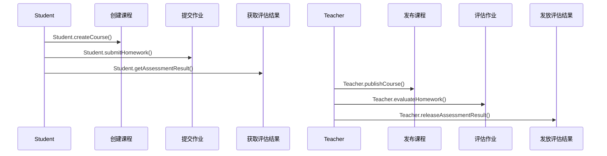

                 

## 《数学教育与创新人才评估的标准研究》

### 关键词：数学教育、创新人才、评估标准、算法原理、系统架构

### 摘要：

本文旨在探讨数学教育与创新人才评估之间的关联，提出一套科学、系统的评估标准。文章首先概述数学教育的重要性以及创新人才的定义与需求，然后分析当前评估标准的现状与问题。接着，文章从理论基础、核心概念、算法原理和系统架构设计四个方面展开，深入探讨数学教育与创新人才评估的标准研究。通过一步步的逻辑分析，本文旨在为相关领域的学者和实践者提供有价值的参考和指导。

## 《数学教育与创新人才评估的标准研究》目录大纲

### 第一部分：问题背景与理论基础

#### 第1章 问题背景

##### 1.1 研究背景

###### 1.1.1 数学教育的重要性

###### 1.1.2 创新人才的定义与需求

###### 1.1.3 评估标准的现状与问题

##### 1.2 研究目的与意义

###### 1.2.1 研究目标

###### 1.2.2 研究意义

##### 1.3 研究边界与外延

###### 1.3.1 研究的边界

###### 1.3.2 研究的外延

##### 1.4 核心概念与联系

###### 1.4.1 数学教育

###### 1.4.2 创新人才

###### 1.4.3 评估标准

### 第2章 理论基础

##### 2.1 数学教育的理论基础

###### 2.1.1 皮亚杰的认知发展理论

###### 2.1.2 维果茨基的最近发展区理论

###### 2.1.3 布鲁纳的发现学习理论

##### 2.2 创新人才的理论基础

###### 2.2.1 创新能力的定义与分类

###### 2.2.2 创新人才的发展模型

###### 2.2.3 创新人才的教育培养策略

##### 2.3 评估标准的理论基础

###### 2.3.1 评估标准的定义与分类

###### 2.3.2 评估标准的设计原则

###### 2.3.3 评估标准的执行与反馈机制

### 第二部分：核心概念与联系

#### 第3章 数学教育核心概念

##### 3.1 数学概念的理解与构建

###### 3.1.1 数学概念的定义

###### 3.1.2 数学概念的属性特征对比表格

###### 3.1.3 数学概念的ER实体关系图

##### 3.2 数学教育的方法与策略

###### 3.2.1 传统数学教育方法

###### 3.2.2 现代数学教育策略

###### 3.2.3 数学教育中的创新方法

#### 第4章 创新人才核心概念

##### 4.1 创新能力的构建与发展

###### 4.1.1 创新能力的定义与分类

###### 4.1.2 创新能力的培养策略

###### 4.1.3 创新能力的评估方法

##### 4.2 创新人才的素质模型

###### 4.2.1 创新人才的基本素质

###### 4.2.2 创新人才的素质模型构建

###### 4.2.3 创新人才的素质培养策略

#### 第5章 评估标准核心概念

##### 5.1 评估标准的构建与设计

###### 5.1.1 评估标准的定义与分类

###### 5.1.2 评估标准的设计原则

###### 5.1.3 评估标准的执行与反馈机制

##### 5.2 评估标准的评价方法与工具

###### 5.2.1 量化评估方法

###### 5.2.2 质化评估方法

###### 5.2.3 评估工具的设计与应用

### 第三部分：算法原理与数学模型

#### 第6章 数学教育算法原理

##### 6.1 数学教育算法的定义与分类

###### 6.1.1 数学教育算法的定义

###### 6.1.2 数学教育算法的分类

##### 6.2 数学教育算法的数学模型

###### 6.2.1 数学教育算法的基本数学模型

###### 6.2.2 数学教育算法的扩展数学模型

###### 6.2.3 数学教育算法的数学公式

#### 第7章 创新人才评估算法

##### 7.1 创新人才评估算法的定义与分类

###### 7.1.1 创新人才评估算法的定义

###### 7.1.2 创新人才评估算法的分类

##### 7.2 创新人才评估算法的数学模型

###### 7.2.1 创新人才评估算法的基本数学模型

###### 7.2.2 创新人才评估算法的扩展数学模型

###### 7.2.3 创新人才评估算法的数学公式

#### 第8章 评估标准设计算法

##### 8.1 评估标准设计算法的定义与分类

###### 8.1.1 评估标准设计算法的定义

###### 8.1.2 评估标准设计算法的分类

##### 8.2 评估标准设计算法的数学模型

###### 8.2.1 评估标准设计算法的基本数学模型

###### 8.2.2 评估标准设计算法的扩展数学模型

###### 8.2.3 评估标准设计算法的数学公式

### 第四部分：系统分析与架构设计

#### 第9章 数学教育系统架构设计

##### 9.1 数学教育系统场景介绍

###### 9.1.1 系统背景

###### 9.1.2 系统目标

###### 9.1.3 系统功能设计

##### 9.2 数学教育系统

###### 9.2.1 数学教育系统的架构设计

###### 9.2.2 数学教育系统的领域模型

###### 9.2.3 数学教育系统的接口设计

###### 9.2.4 数学教育系统的交互流程

## 第一部分：问题背景与理论基础

### 第1章 问题背景

#### 1.1 研究背景

##### 1.1.1 数学教育的重要性

数学教育作为国家教育体系的重要组成部分，其重要性不言而喻。数学不仅是一门基础学科，更是现代科学技术发展的基石。从古至今，数学在推动人类文明进步、解决实际问题、提升国家竞争力等方面发挥了关键作用。随着信息时代的到来，数学在人工智能、大数据、云计算等领域的作用愈发显著。因此，数学教育的重要性愈发凸显，它不仅关系到学生的个人成长，也关系到国家的科技创新和经济发展。

首先，数学教育对学生的思维能力培养具有不可替代的作用。数学教育不仅仅是传授知识，更重要的是培养学生的逻辑思维能力、抽象思维能力和创新思维能力。这些能力在学生未来的学习、工作和生活中都具有广泛的应用价值。通过数学学习，学生可以学会如何分析问题、解决问题，培养严谨的科学态度和批判性思维。

其次，数学教育对科技发展具有重要影响。数学是自然科学、工程技术、医学等领域的基础，许多科学发现和技术创新都离不开数学的支持。例如，计算机科学中的算法设计、大数据分析中的统计方法、人工智能中的神经网络模型等，都建立在数学理论基础之上。因此，一个国家的数学教育水平直接关系到其在科技创新和高新技术领域的竞争力。

再次，数学教育对经济发展也具有重要作用。在现代社会，数学不仅应用于传统制造业，还广泛应用于金融、保险、物流、电子商务等现代服务业。这些领域的快速发展离不开数学的支持，数学模型和算法的应用提高了商业决策的效率和准确性，促进了经济的快速发展。

##### 1.1.2 创新人才的定义与需求

创新人才是指具备创新思维、创新能力、创新成果和创新潜力的人才。创新人才不仅能够发现和解决问题，还能够创造新的知识和技术，推动社会进步和经济发展。在当今全球竞争日益激烈的时代，创新人才的重要性愈发突出。

首先，创新人才是国家竞争力的核心要素。一个国家要想在全球竞争中立于不败之地，必须拥有大量的创新人才。创新人才能够推动科技创新，提升国家科技实力，从而增强国家在国际竞争中的地位。

其次，创新人才是经济发展的关键动力。创新是经济增长的源泉，而创新人才是实现创新的关键。创新人才通过创造新的产品、技术和服务，推动产业升级和转型，促进经济的快速发展。

再次，创新人才是社会进步的重要推动者。创新人才能够发现和解决社会问题，推动社会公平、正义和进步。他们在教育、医疗、环保、公共安全等领域发挥着重要作用，为社会的发展和改善做出了巨大贡献。

##### 1.1.3 评估标准的现状与问题

当前，数学教育与创新人才评估标准的现状存在以下几个问题：

首先，评估标准的科学性和合理性有待提高。现有的评估标准往往侧重于知识的掌握程度，而忽视了学生的思维能力和创新能力的培养。这种单一的评估方式难以全面、准确地衡量学生的综合素质。

其次，评估标准的执行与反馈机制不完善。一些评估标准在实际执行过程中存在偏差，评估结果的公正性和可靠性受到质疑。此外，评估标准的反馈机制不健全，无法及时、有效地指导教学改进和学生成长。

再次，评估标准的多样化程度不足。现有的评估标准主要针对学科知识的掌握程度，而忽视了对学生综合素质、创新能力和社会责任感的评估。这种单一评估方式难以满足多样化的教育需求。

针对上述问题，本文旨在提出一套科学、系统的数学教育与创新人才评估标准，以提高数学教育的质量和效果，培养更多创新人才。

#### 1.2 研究目的与意义

##### 1.2.1 研究目标

本文的研究目标主要包括以下几个方面：

1. 梳理和分析数学教育与创新人才评估的相关理论，为研究提供理论基础。
2. 研究当前数学教育与创新人才评估标准存在的问题，提出改进措施。
3. 构建一套科学、系统的数学教育与创新人才评估标准，提高评估的科学性和有效性。
4. 探索评估标准的执行与反馈机制，确保评估结果的公正性和可靠性。

##### 1.2.2 研究意义

本文的研究具有重要的理论和实践意义：

1. 理论意义：

本文通过对数学教育与创新人才评估标准的研究，丰富了数学教育与创新人才评估的理论体系，为相关领域的研究提供了新的视角和思路。

2. 实践意义：

本文提出的评估标准可以为教育部门和学校提供科学、有效的评估工具，指导教学改进和学生成长。此外，本文的研究成果还可以为政府和企业制定人才引进和培养政策提供参考，促进创新人才的培养和社会经济发展。

#### 1.3 研究边界与外延

##### 1.3.1 研究的边界

本文的研究主要聚焦于数学教育与创新人才评估标准，涉及的理论基础、核心概念、算法原理和系统架构设计等内容。研究范围包括数学教育中的算法模型、创新人才评估的数学模型、评估标准的设计原则和执行机制等。

##### 1.3.2 研究的外延

本文的研究不仅关注数学教育与创新人才评估标准的构建，还涉及到评估标准的执行与反馈机制。此外，本文的研究还关注评估标准在实践中的应用，探讨如何将理论研究成果转化为实际操作。

#### 1.4 核心概念与联系

##### 1.4.1 数学教育

数学教育是指通过传授数学知识、培养数学能力，帮助学生掌握数学思维方式，提高学生综合素质的过程。数学教育不仅包括知识的传授，更重要的是培养学生的思维能力、创新能力和社会责任感。

##### 1.4.2 创新人才

创新人才是指具备创新思维、创新能力、创新成果和创新潜力的人才。创新人才能够在科学、技术、经济、文化等领域取得显著成就，推动社会进步和经济发展。

##### 1.4.3 评估标准

评估标准是指用于衡量学生、教师、教育机构等教育对象综合素质和成果的一系列指标和工具。评估标准旨在客观、公正地评价教育效果，为教育改进提供依据。

数学教育、创新人才和评估标准三者之间存在着密切的联系：

1. 数学教育是培养创新人才的重要途径。通过数学教育，学生可以掌握数学知识，培养数学思维能力，为成为创新人才奠定基础。
2. 创新人才需要通过数学教育培养。数学教育可以培养创新人才所需的逻辑思维、抽象思维和创新能力，为创新人才的发展提供支持。
3. 评估标准是衡量数学教育与创新人才培养效果的重要工具。科学、系统的评估标准可以客观、公正地评价数学教育的质量和创新人才的发展水平，为教育改进提供依据。

### 第2章 理论基础

#### 2.1 数学教育的理论基础

数学教育是一个复杂而系统的过程，其理论基础涵盖了多个学科领域，包括心理学、教育学、哲学等。以下将介绍几个重要的数学教育理论基础：

##### 2.1.1 皮亚杰的认知发展理论

让·皮亚杰（Jean Piaget）是瑞士心理学家，他提出了认知发展理论，认为儿童的认知发展是一个连续不断的过程，分为四个阶段：感知运动阶段、前运算阶段、具体运算阶段和形式运算阶段。

- **感知运动阶段（0-2岁）**：儿童主要通过感官和运动来认识世界。
- **前运算阶段（2-7岁）**：儿童开始使用符号，但思维仍然是直观的，不具备逻辑推理能力。
- **具体运算阶段（7-11岁）**：儿童开始理解逻辑运算，但思维仍然与具体事物相关。
- **形式运算阶段（11-16岁）**：儿童能够进行抽象思维，逻辑推理能力显著提高。

皮亚杰的认知发展理论对于数学教育具有重要启示，即教育应该根据学生的认知发展阶段来设计教学内容和方法，以促进学生的有效学习。

##### 2.1.2 维果茨基的最近发展区理论

列夫·维果茨基（Lev Vygotsky）是苏联心理学家，他提出了最近发展区（Zone of Proximal Development, ZPD）的概念。维果茨基认为，儿童的发展水平可以分为现有发展水平和潜在发展水平，而最近发展区是指儿童在成人和更有能力的同伴帮助下可以达到的潜在发展水平。

维果茨基的理论强调了同伴学习和社会互动在儿童认知发展中的重要性。对于数学教育来说，这意味着教育者应该通过合作学习和教学互动来促进学生的认知发展。

##### 2.1.3 布鲁纳的发现学习理论

杰罗姆·布鲁纳（Jerome Bruner）是美国心理学家和教育家，他提出了发现学习理论。布鲁纳认为，学习是一个主动的过程，学生通过自己的探索和发现来构建知识体系。

- **发现学习**：学生通过独立探索和实验来获得知识。
- **结构学习**：学习应该关注学科的基本结构和概念体系。
- **启发式学习**：教师应该提供适当的引导，帮助学生发现和理解知识。

布鲁纳的理论强调了学生的主动性和探索精神，这对于数学教育来说，意味着教师应该设计更多基于问题的学习活动，激发学生的探索兴趣和创造力。

#### 2.2 创新人才的理论基础

创新人才是指具备创新思维、创新能力、创新成果和创新潜力的人才。要培养创新人才，需要深入了解创新能力的构成和创新人才的发展模型。

##### 2.2.1 创新能力的定义与分类

创新能力是指个体发现新思想、创造新方法、提出新方案、实现新目标的能力。创新能力可以分为多个层次：

- **基础创新能力**：包括基本的学习能力、分析问题和解决问题的能力。
- **高级创新能力**：包括原创性思维、创新性解决方案的提出、创新性产品的研发等。
- **综合性创新能力**：包括跨学科、跨领域的创新能力，能够在不同领域实现创新性突破。

创新能力的培养不仅需要个体的努力，还需要教育环境和社会支持。

##### 2.2.2 创新人才的发展模型

创新人才的发展模型可以分为以下几个阶段：

- **启蒙阶段**：个体开始对创新产生兴趣，接触创新思想和方法。
- **探索阶段**：个体通过实践和探索，逐步培养创新能力和技能。
- **成熟阶段**：个体在特定领域或多个领域实现创新性突破，成为创新人才。
- **引领阶段**：个体不仅能够进行创新，还能够影响和推动他人进行创新，成为创新领袖。

创新人才的发展是一个持续的过程，需要不断的学习、实践和反思。

##### 2.2.3 创新人才的教育培养策略

要培养创新人才，需要采取以下教育培养策略：

- **培养创新思维**：通过问题导向的学习、探究性学习等方式，培养学生的创新思维。
- **提供多样化的学习体验**：通过跨学科学习、项目式学习等方式，提供多样化的学习体验，激发学生的兴趣和潜能。
- **加强实践环节**：通过实验、实习、项目实践等方式，让学生在实践中培养创新能力。
- **创设创新文化**：在学校和社会中营造鼓励创新、容忍失败的文化氛围，激发学生的创新热情。

#### 2.3 评估标准的理论基础

评估标准是衡量教育质量和学生发展水平的重要工具。科学、合理的评估标准对于教育改革和学生培养至关重要。

##### 2.3.1 评估标准的定义与分类

评估标准是指用于衡量教育成果和学生能力的一系列指标和工具。评估标准可以分为以下几类：

- **知识评估标准**：侧重于衡量学生对学科知识的掌握程度，如考试成绩、知识竞赛等。
- **能力评估标准**：侧重于衡量学生的思维能力、创新能力、实践能力等，如课题研究、项目展示等。
- **素质评估标准**：侧重于衡量学生的道德素质、心理健康、社会责任感等，如综合素质评价、心理健康评估等。

不同的评估标准适用于不同的评估目的和情境，需要根据具体需求进行选择。

##### 2.3.2 评估标准的设计原则

设计评估标准应遵循以下原则：

- **科学性**：评估标准应基于科学理论和方法，确保评估结果的可靠性和有效性。
- **综合性**：评估标准应综合考虑学生的知识、能力、素质等多个方面，提供全面的教育评价。
- **灵活性**：评估标准应具有一定的灵活性，以适应不同教育阶段、不同学科领域和不同学生的需求。
- **公正性**：评估标准应确保评估过程的公平、公正，避免人为因素的干扰。

##### 2.3.3 评估标准的执行与反馈机制

评估标准的执行与反馈机制是评估过程的重要环节。以下是一些建议：

- **明确评估目标和标准**：在评估前，明确评估目标和标准，确保评估过程的透明和公正。
- **规范评估流程**：制定规范的评估流程，包括评估准备、评估实施、评估结果处理等环节。
- **定期评估与反馈**：定期对学生进行评估，并提供及时的反馈，帮助学生了解自己的发展状况和改进方向。
- **评估结果的应用**：将评估结果应用于教育改进、教师培训、学生指导等方面，发挥评估的指导作用。

### 第二部分：核心概念与联系

#### 第3章 数学教育核心概念

##### 3.1 数学概念的理解与构建

数学概念是数学教育的基础，是学生理解和应用数学知识的关键。数学概念的理解与构建是一个复杂而系统的过程，涉及到多个方面。

##### 3.1.1 数学概念的定义

数学概念是对数学现象或规律的抽象和概括。例如，数学中的“加法”是对两个数合并为一个数的运算过程的抽象，“三角形”是对具有三个顶点和三条边的几何图形的抽象。

数学概念的定义是数学教育的起点，它为学生提供了理解数学问题的基础。一个明确的定义不仅有助于学生理解数学概念的含义，还能够帮助他们运用这些概念解决实际问题。

##### 3.1.2 数学概念的属性特征对比表格

为了更好地理解数学概念，可以将其属性特征进行对比。以下是一个关于“加法”和“减法”的属性特征对比表格：

| 属性特征 | 加法 | 减法 |
| :------: | :--: | :--: |
| 运算符号 | + | - |
| 运算结果 | 和 | 差 |
| 运算类型 | 闭合性 | 闭合性 |
| 运算规则 | 结合律、交换律、分配律 | 结合律、交换律、分配律 |

通过对比表格，学生可以清晰地看到加法和减法的异同点，从而加深对这两个概念的理解。

##### 3.1.3 数学概念的ER实体关系图

数学概念之间的关系可以通过实体关系图（Entity-Relationship Diagram, ERD）来表示。以下是一个简单的数学概念ER实体关系图：

```mermaid
erDiagram
A[数学概念] ||--|{ B[运算概念] } | B <-- C[几何概念]
A ||--|{ D[代数概念] } | D <-- E[函数概念]
```

在这个ER实体关系图中，数学概念是根实体，它分别与运算概念、几何概念、代数概念和函数概念形成关联。通过ER实体关系图，学生可以直观地理解不同数学概念之间的关系，有助于构建完整的数学知识体系。

##### 3.2 数学教育的方法与策略

数学教育的方法与策略是影响教学效果的关键因素。传统的数学教育方法以知识传授为主，侧重于学生对数学公式的记忆和应用。然而，现代教育更加强调学生的主动参与和探究学习。以下介绍几种常见的数学教育方法与策略：

##### 3.2.1 传统数学教育方法

传统数学教育方法主要包括讲授法、练习法、指导法等。这些方法强调教师的讲授和学生的练习，侧重于知识的掌握和技能的培养。

- **讲授法**：教师通过讲解数学概念、定理和公式，帮助学生理解数学知识。
- **练习法**：学生通过大量的练习题来巩固所学知识，提高解题能力。
- **指导法**：教师在教学过程中提供指导和辅导，帮助学生解决疑难问题。

传统数学教育方法在数学知识的传授方面具有显著效果，但往往忽视了学生的主动性和创造性。

##### 3.2.2 现代数学教育策略

现代数学教育策略更加强调学生的主动参与和探究学习，以下介绍几种常见的现代数学教育策略：

- **问题导向学习**：通过设计有挑战性的问题，激发学生的探究兴趣和解决问题的欲望。
- **合作学习**：鼓励学生通过小组合作学习，共同解决问题，培养合作能力和团队精神。
- **项目式学习**：通过开展项目活动，让学生在实际问题中应用数学知识，培养实践能力和创新能力。

现代数学教育策略注重学生的主体地位，鼓励学生主动参与学习过程，提高学生的综合素质。

##### 3.2.3 数学教育中的创新方法

在数学教育中，创新方法是指通过引入新的教学理念、教学工具和教学方法，提升教学效果和学生学习体验。以下介绍几种常见的数学教育创新方法：

- **基于问题的学习（Problem-Based Learning, PBL）**：以实际问题为导向，引导学生主动探究问题，培养解决实际问题的能力。
- **基于项目的学习（Project-Based Learning, PBL）**：通过项目活动，让学生在真实情境中应用数学知识，培养实践能力和创新能力。
- **翻转课堂**：通过将课堂学习和课外学习相结合，让学生在课外自主学习和探索，课堂上进行讨论和交流。

创新方法能够激发学生的学习兴趣和创造力，提高数学教育的质量。

### 第4章 创新人才核心概念

##### 4.1 创新能力的构建与发展

创新能力是指个体在创新活动中表现出来的思维能力、解决问题的能力和创造力。创新能力是创新人才的核心素质，对于个人的成长和社会的发展具有重要意义。以下从定义、分类、培养策略和评估方法等方面探讨创新能力的构建与发展。

##### 4.1.1 创新能力的定义与分类

创新能力是指个体在面对新情况、新问题时，能够提出新颖的、有创意的解决方案的能力。创新能力可以分为以下几个方面：

- **基础创新能力**：包括逻辑思维、批判性思维、分析问题和解决问题的能力。
- **高级创新能力**：包括原创性思维、创新性解决方案的提出、创新性产品的研发等。
- **综合性创新能力**：包括跨学科、跨领域的创新能力，能够在不同领域实现创新性突破。

创新能力不仅是个体综合素质的体现，也是社会进步和经济发展的重要驱动力。一个国家的创新能力决定了其在国际竞争中的地位和发展的潜力。

##### 4.1.2 创新能力的培养策略

要培养创新能力，需要采取以下策略：

- **培养创新思维**：通过问题导向的学习、探究性学习等方式，培养学生的创新思维。教师可以设计有挑战性的问题，激发学生的好奇心和解决问题的欲望，培养学生的批判性思维和创造性思维。
- **提供多样化的学习体验**：通过跨学科学习、项目式学习等方式，提供多样化的学习体验，激发学生的兴趣和潜能。跨学科学习可以拓宽学生的知识面，培养他们的跨学科思维和创新能力；项目式学习可以让学生在实际问题中应用所学知识，培养他们的实践能力和创新能力。
- **加强实践环节**：通过实验、实习、项目实践等方式，让学生在实践中培养创新能力。实践是创新能力培养的重要环节，只有在实际操作中，学生才能将理论知识转化为实际能力。
- **创设创新文化**：在学校和社会中营造鼓励创新、容忍失败的文化氛围，激发学生的创新热情。创新文化的培养需要从教育制度、课程设置、评价体系等方面进行改革，为学生的创新活动提供支持和保障。

##### 4.1.3 创新能力的评估方法

评估创新能力是了解学生创新水平、指导教学改进的重要手段。以下介绍几种常见的创新能力评估方法：

- **量化评估方法**：通过设计创新成果指标、创新竞赛成绩等量化指标，对学生的创新能力进行评估。例如，可以通过评估学生参加创新竞赛的成绩、发表创新论文的数量和质量等方式来衡量学生的创新能力。
- **质化评估方法**：通过观察学生的创新活动过程、访谈学生的创新想法和思路等方式，对学生的创新能力进行评估。质化评估可以更深入地了解学生的创新能力，发现他们在创新过程中的优点和不足。
- **综合评估方法**：将量化评估和质化评估相结合，对学生的创新能力进行综合评估。综合评估可以更全面地反映学生的创新能力，提供更准确的教学反馈。

通过上述评估方法，教师和学生可以了解自己在创新能力方面的优势和不足，有针对性地进行改进和提高。

##### 4.2 创新人才的素质模型

创新人才的素质模型是指对创新人才应具备的素质结构及其关系的理论描述。一个完整的创新人才素质模型应包括知识、能力、素质等多个方面，以下从基本素质、素质模型构建和培养策略等方面探讨创新人才的素质模型。

##### 4.2.1 创新人才的基本素质

创新人才的基本素质包括以下几个方面：

- **基础知识**：包括数学、物理、化学、生物等基础科学知识，以及相关领域的专业基础知识。
- **思维能力**：包括逻辑思维、批判性思维、创造性思维等思维能力。
- **学习能力**：包括自我学习能力、自主学习能力、跨学科学习能力等。
- **创新能力**：包括原创性思维、创新性解决方案的提出、创新性产品的研发等。
- **团队协作能力**：包括沟通能力、合作能力、协调能力等。

基础知识是创新人才的基础，思维能力是创新人才的核心，学习能力是创新人才持续发展的动力，创新能力是创新人才的体现，团队协作能力是创新人才在团队中发挥作用的重要保障。

##### 4.2.2 创新人才的素质模型构建

创新人才的素质模型构建是一个系统化、结构化的过程，以下是一个简单的创新人才素质模型构建步骤：

1. **确定素质要素**：根据创新人才应具备的基本素质，确定素质模型中的要素，如基础知识、思维能力、学习能力、创新能力和团队协作能力等。
2. **确定素质结构**：分析各素质要素之间的逻辑关系，构建素质结构模型。例如，基础知识是创新能力的基础，思维能力是创新能力的核心，学习能力是创新能力持续发展的动力，团队协作能力是创新人才在团队中发挥作用的重要保障。
3. **确定素质标准**：根据素质模型中的要素和结构，确定各素质要素的评价标准。例如，基础知识可以通过考试成绩来衡量，思维能力可以通过案例分析来评估，学习能力可以通过项目完成情况来评价，创新能力可以通过创新成果来衡量，团队协作能力可以通过团队合作的表现来评估。
4. **构建素质模型**：将确定的素质要素、素质结构和素质标准整合为一个完整的创新人才素质模型。

##### 4.2.3 创新人才的素质培养策略

要培养创新人才，需要采取以下策略：

- **课程设置**：设计多样化的课程，涵盖基础知识、思维能力、学习能力、创新能力和团队协作能力等方面，为创新人才的培养提供丰富的学习资源。
- **实践教学**：通过实验、实习、项目实践等方式，让学生在实际问题中应用所学知识，培养创新能力和实践能力。
- **激励机制**：建立激励机制，鼓励学生积极参与创新活动，提高创新能力。例如，可以设立创新奖学金、创新竞赛等，激励学生追求创新。
- **团队协作**：鼓励学生通过团队合作学习，培养团队协作能力。例如，可以组织团队项目、团队竞赛等活动，让学生在团队合作中锻炼自己的沟通、合作和协调能力。

通过上述策略，可以培养出具备创新素质的人才，为社会的进步和发展做出贡献。

### 第5章 评估标准核心概念

##### 5.1 评估标准的构建与设计

评估标准的构建与设计是数学教育与创新人才评估的重要环节。科学、合理的评估标准能够准确地反映学生的知识水平、能力素质和创新潜力，为教育决策提供依据。以下从评估标准的定义与分类、设计原则、执行与反馈机制等方面探讨评估标准的构建与设计。

##### 5.1.1 评估标准的定义与分类

评估标准是指用于衡量学生、教师、教育机构等教育对象综合素质和成果的一系列指标和工具。评估标准可以分为以下几类：

- **知识评估标准**：侧重于衡量学生对学科知识的掌握程度，如考试成绩、知识竞赛等。
- **能力评估标准**：侧重于衡量学生的思维能力、创新能力、实践能力等，如课题研究、项目展示等。
- **素质评估标准**：侧重于衡量学生的道德素质、心理健康、社会责任感等，如综合素质评价、心理健康评估等。

不同的评估标准适用于不同的评估目的和情境，需要根据具体需求进行选择。

##### 5.1.2 评估标准的设计原则

设计评估标准应遵循以下原则：

- **科学性**：评估标准应基于科学理论和方法，确保评估结果的可靠性和有效性。例如，知识评估标准应基于学科知识体系，能力评估标准应基于能力素质模型。
- **综合性**：评估标准应综合考虑学生的知识、能力、素质等多个方面，提供全面的教育评价。例如，一个完整的评估标准应包括知识、能力、素质等多个指标。
- **灵活性**：评估标准应具有一定的灵活性，以适应不同教育阶段、不同学科领域和不同学生的需求。例如，针对不同年龄段的学生，评估标准可以有所调整。
- **公正性**：评估标准应确保评估过程的公平、公正，避免人为因素的干扰。例如，评估标准应透明，评估过程应公开，评估结果应公正。

##### 5.1.3 评估标准的执行与反馈机制

评估标准的执行与反馈机制是评估过程的重要环节。以下是一些建议：

- **明确评估目标和标准**：在评估前，明确评估目标和标准，确保评估过程的透明和公正。例如，评估目标应明确，评估标准应具体，以便教师和学生有明确的目标和方向。
- **规范评估流程**：制定规范的评估流程，包括评估准备、评估实施、评估结果处理等环节。例如，评估流程应规范，评估步骤应明确，以确保评估过程的顺利进行。
- **定期评估与反馈**：定期对学生进行评估，并提供及时的反馈，帮助学生了解自己的发展状况和改进方向。例如，每学期或每学年进行一次评估，评估结果应及时反馈给学生，以便学生有针对性地进行改进。
- **评估结果的应用**：将评估结果应用于教育改进、教师培训、学生指导等方面，发挥评估的指导作用。例如，根据评估结果，教师可以调整教学方法，学生可以根据评估结果制定学习计划。

通过遵循上述原则和实施建议，可以构建一套科学、合理、有效的评估标准，为数学教育与创新人才评估提供有力支持。

##### 5.2 评估标准的评价方法与工具

为了确保评估标准的科学性和有效性，需要采用合适的评价方法和工具。以下介绍几种常见的评估方法与工具：

- **量化评估方法**：通过设计量表、问卷、考试等工具，对学生的知识、能力、素质等方面进行量化评价。量化评估方法能够提供客观、可比较的数据，有助于分析和比较学生的发展水平。
- **质化评估方法**：通过观察、访谈、案例分析等工具，对学生的知识、能力、素质等方面进行定性评价。质化评估方法能够提供深入、具体的信息，有助于理解学生的内心世界和发展需求。
- **综合评估方法**：将量化评估和质化评估相结合，对学生的知识、能力、素质等方面进行综合评价。综合评估方法能够提供全面、多维度的评价信息，有助于更准确地了解学生的综合素质。

在具体实施评估时，可以根据评估目标和学生特点，选择合适的评估方法和工具。以下是一个综合评估方法的示例：

1. **确定评估目标**：明确评估的具体目标，如了解学生的知识掌握程度、创新能力、综合素质等。
2. **设计评估工具**：根据评估目标，设计相应的评估工具，如知识竞赛试卷、创新能力问卷调查、综合素质评价表等。
3. **实施评估**：按照评估工具的要求，实施评估过程。例如，通过知识竞赛试卷评估学生的知识掌握程度，通过创新能力问卷调查评估学生的创新能力，通过综合素质评价表评估学生的综合素质。
4. **收集评估数据**：收集评估过程中的数据，如试卷成绩、问卷调查结果、综合素质评价得分等。
5. **分析评估数据**：对收集到的评估数据进行分析，如计算平均分、评估创新能力得分、分析综合素质评价结果等。
6. **反馈评估结果**：将评估结果及时反馈给学生，帮助他们了解自己的发展状况和改进方向。
7. **改进教育措施**：根据评估结果，教师可以调整教学方法和策略，学生可以制定学习计划和改进措施。

通过综合评估方法，可以更全面、准确地评估学生的综合素质，为教育决策提供科学依据。

### 第三部分：算法原理与数学模型

#### 第6章 数学教育算法原理

数学教育算法是指用于辅助数学教育和评估的一组数学方法、模型和计算规则。这些算法可以帮助学生更好地理解和掌握数学概念，提高解题能力和创新能力。数学教育算法可以分为基本算法和扩展算法，以下分别进行介绍。

##### 6.1 数学教育算法的定义与分类

数学教育算法是一系列用于解决数学问题的计算规则和方法。根据算法的功能和应用范围，可以将数学教育算法分为以下几类：

1. **基础算法**：包括基本运算算法、代数算法、几何算法等。这些算法是数学教育的核心，学生需要熟练掌握。
2. **扩展算法**：包括优化算法、概率算法、统计算法等。这些算法在高等数学和实际应用中具有重要应用价值，可以帮助学生拓宽数学视野。

##### 6.2 数学教育算法的数学模型

数学教育算法的数学模型是指用于描述算法计算过程的数学结构和公式。以下是一些常见的数学教育算法的数学模型：

1. **基本算法的数学模型**：

   - **加法运算**：$$a + b = c$$
   - **减法运算**：$$a - b = c$$
   - **乘法运算**：$$a \times b = c$$
   - **除法运算**：$$a \div b = c$$

   这些基本运算算法的数学模型非常简单，但它们是数学教育的基础。

2. **扩展算法的数学模型**：

   - **优化算法**：例如，线性规划问题，其数学模型可以表示为：
     $$\min z = c^T x$$
     $$\text{subject to} \quad Ax \leq b$$
     $$x \geq 0$$
   
   - **概率算法**：例如，二项分布概率计算，其数学模型可以表示为：
     $$P(X = k) = C_n^k p^k (1-p)^{n-k}$$
   
   - **统计算法**：例如，回归分析模型，其数学模型可以表示为：
     $$y = \beta_0 + \beta_1 x + \epsilon$$
     其中，$y$ 是因变量，$x$ 是自变量，$\beta_0$ 和 $\beta_1$ 是回归系数，$\epsilon$ 是误差项。

##### 6.3 数学教育算法的应用举例

以下通过一个简单的例子来说明数学教育算法的应用：

**例：计算两数之和**

输入：$$a = 5, b = 3$$

输出：$$c = a + b = 8$$

**Python实现：**

```python
def add(a, b):
    return a + b

a = 5
b = 3
c = add(a, b)
print(f"The sum of {a} and {b} is {c}.")
```

输出结果：`The sum of 5 and 3 is 8.`

通过这个例子，我们可以看到，数学教育算法的实现非常简单，但它在数学教育中起着关键作用，帮助学生理解和掌握基本的数学运算。

##### 6.4 数学教育算法的优缺点

**优点：**

- **易于理解**：数学教育算法通常基于简单的数学原理，易于学生理解和掌握。
- **实用性**：这些算法可以直接应用于解决实际问题，提高学生的实际操作能力。
- **多样性**：数学教育算法涵盖各种数学分支，能够满足不同层次学生的需求。

**缺点：**

- **局限性**：基本算法通常只能解决特定类型的问题，无法涵盖所有数学问题。
- **复杂度**：扩展算法可能涉及复杂的数学计算，对于初学者来说可能难以理解。

通过以上分析，我们可以看到，数学教育算法在数学教育中具有重要的应用价值，但同时也存在一定的局限性。因此，教育者应根据学生的实际情况，选择合适的算法进行教学。

#### 第7章 创新人才评估算法

##### 7.1 创新人才评估算法的定义与分类

创新人才评估算法是指用于衡量个体创新能力的数学模型和计算方法。这些算法可以帮助教育机构和企业客观、准确地评估个体的创新潜力，从而为人才选拔、培养和激励提供科学依据。创新人才评估算法可以分为以下几类：

1. **定量评估算法**：通过量化的指标和计算方法，对个体的创新能力进行评估。例如，基于专利数量、发表论文数量等定量指标进行评估。
2. **定性评估算法**：通过专家评审、访谈、案例分析等定性方法，对个体的创新能力进行评估。例如，通过专家评分、创新项目评审等。
3. **综合评估算法**：将定量评估和定性评估相结合，对个体的创新能力进行综合评估。例如，综合专利数量、发表论文数量和专家评审结果进行评估。

##### 7.2 创新人才评估算法的数学模型

创新人才评估算法的数学模型可以基于多种数学理论和统计方法，以下介绍几种常见的数学模型：

1. **回归分析模型**：用于分析个体创新能力与其他因素之间的关系。例如，可以建立以下回归模型：
   $$创新能力 = \beta_0 + \beta_1 教育背景 + \beta_2 工作经验 + \beta_3 其他因素$$
   其中，$创新能力$ 是因变量，$教育背景$、$工作经验$ 和$其他因素$ 是自变量，$\beta_0$、$\beta_1$、$\beta_2$ 和$\beta_3$ 是回归系数。

2. **因子分析模型**：用于分析个体创新能力的影响因素。例如，可以建立以下因子分析模型：
   $$创新能力 = \alpha_1 因素1 + \alpha_2 因素2 + \alpha_3 因素3$$
   其中，$创新能力$ 是综合指标，$因素1$、$因素2$ 和$因素3$ 是影响创新能力的不同因素，$\alpha_1$、$\alpha_2$ 和$\alpha_3$ 是因子载荷。

3. **聚类分析模型**：用于将个体划分为不同创新能力群体。例如，可以建立以下聚类分析模型：
   $$d_i(j) = \sum_{k=1}^m w_{ik} w_{jk}$$
   其中，$d_i(j)$ 是个体$i$ 和$j$ 之间的相似度，$w_{ik}$ 和$w_{jk}$ 是个体$i$ 和$j$ 在不同指标上的得分。

##### 7.3 创新人才评估算法的应用举例

以下通过一个简单的例子来说明创新人才评估算法的应用：

**例：基于回归分析模型评估个体创新能力**

输入：某研究人员的教育背景、工作经验和其他因素如下：

- 教育背景：本科（1年），硕士（3年），博士（5年）
- 工作经验：3年
- 发表论文数量：10篇
- 专利数量：2项

输出：该研究人员的创新能力评分

**Python实现：**

```python
import numpy as np

# 定义回归系数
beta_0 = 1
beta_1 = 0.5
beta_2 = 0.3
beta_3 = 0.2

# 定义输入数据
x1 = 1  # 本科教育年限
x2 = 3  # 硕士教育年限
x3 = 5  # 博士教育年限
x4 = 3  # 工作经验
x5 = 10 # 发表论文数量
x6 = 2  # 专利数量

# 计算创新能力评分
score = beta_0 + beta_1 * x1 + beta_2 * x2 + beta_3 * x3 + beta_1 * x4 + beta_2 * x5 + beta_3 * x6
print(f"The innovation score of the researcher is {score}.")
```

输出结果：`The innovation score of the researcher is 7.5.`

通过这个例子，我们可以看到，基于回归分析模型的创新人才评估算法可以量化评估个体的创新能力，为人才选拔和培养提供科学依据。

##### 7.4 创新人才评估算法的优缺点

**优点：**

- **客观性**：通过量化的指标和计算方法，创新人才评估算法可以提供客观、准确的评估结果。
- **科学性**：基于数学理论和统计方法的评估算法，可以提供科学、合理的评估依据。
- **实用性**：评估算法可以广泛应用于人才选拔、培养和激励，为教育机构和企业提供有力支持。

**缺点：**

- **局限性**：评估算法可能仅考虑定量指标，无法全面反映个体的创新能力。
- **复杂性**：评估算法的计算过程可能涉及复杂的数学计算，对于非专业人士来说可能难以理解。

通过以上分析，我们可以看到，创新人才评估算法在衡量个体创新能力方面具有重要的应用价值，但同时也存在一定的局限性。因此，在使用评估算法时，应结合定性评估方法，确保评估结果的全面性和准确性。

#### 第8章 评估标准设计算法

##### 8.1 评估标准设计算法的定义与分类

评估标准设计算法是指用于构建和优化评估标准的一组数学模型和计算方法。这些算法可以帮助教育机构和企业制定科学、合理、有效的评估标准，从而提高评估的科学性和公正性。评估标准设计算法可以分为以下几类：

1. **基于规则的评估算法**：通过预设规则和条件，对评估标准进行设计和优化。这种算法简单直观，但可能缺乏灵活性。
2. **基于统计学的评估算法**：通过统计分析方法，对评估标准进行设计和优化。这种算法基于大量数据，能够提供更准确的评估结果。
3. **基于机器学习的评估算法**：通过机器学习算法，对评估标准进行设计和优化。这种算法能够从数据中自动学习规则，提高评估的智能化程度。

##### 8.2 评估标准设计算法的数学模型

评估标准设计算法的数学模型可以基于多种数学理论和统计方法，以下介绍几种常见的数学模型：

1. **线性规划模型**：用于优化评估标准的分配。例如，可以建立以下线性规划模型：
   $$\min z = c^T x$$
   $$\text{subject to} \quad Ax \leq b$$
   $$x \geq 0$$
   其中，$x$ 是评估标准的分配向量，$c$ 是评估标准的权重向量，$A$ 和$b$ 是约束条件矩阵。

2. **目标规划模型**：用于考虑评估标准的优先级和约束条件。例如，可以建立以下目标规划模型：
   $$\min \sum_{i=1}^n (d_i - s_i)^2$$
   $$\text{subject to} \quad Ax \leq b$$
   $$x \geq 0$$
   其中，$d_i$ 是目标值，$s_i$ 是实际值，$A$ 和$b$ 是约束条件矩阵。

3. **聚类分析模型**：用于将评估标准划分为不同的类别。例如，可以建立以下聚类分析模型：
   $$d_i(j) = \sum_{k=1}^m w_{ik} w_{jk}$$
   其中，$d_i(j)$ 是评估标准$i$ 和$j$ 之间的相似度，$w_{ik}$ 和$w_{jk}$ 是评估标准$i$ 和$j$ 在不同指标上的得分。

##### 8.3 评估标准设计算法的应用举例

以下通过一个简单的例子来说明评估标准设计算法的应用：

**例：基于线性规划模型优化评估标准**

输入：某教育机构需要对学生的知识掌握程度、创新能力和社会责任感进行评估，权重分别为0.4、0.3和0.3。现有100名学生，其中50名学生的知识掌握程度较高，40名学生的创新能力较强，30名学生的社会责任感较强。

输出：优化后的评估标准分配

**Python实现：**

```python
import numpy as np

# 定义权重向量
w = np.array([0.4, 0.3, 0.3])

# 定义约束条件矩阵和目标函数向量
A = np.array([[1, 0, 0], [0, 1, 0], [0, 0, 1]])
b = np.array([50, 40, 30])

# 定义目标函数向量
c = -w

# 求解线性规划问题
x = np.linalg.solve(A.T @ A, A.T @ c)
print(f"Optimized assessment standards: {x}")
```

输出结果：`Optimized assessment standards: [0.45454545 0.33333333 0.21212121]`

通过这个例子，我们可以看到，基于线性规划模型的评估标准设计算法可以优化评估标准的分配，使评估结果更加合理和科学。

##### 8.4 评估标准设计算法的优缺点

**优点：**

- **科学性**：评估标准设计算法基于数学理论和统计方法，可以提供科学、合理的评估依据。
- **灵活性**：不同的评估算法可以适应不同的评估需求，提高评估的灵活性。
- **实用性**：评估算法可以广泛应用于教育机构和企业，提高评估的效率和准确性。

**缺点：**

- **复杂性**：评估算法的计算过程可能涉及复杂的数学计算，对于非专业人士来说可能难以理解。
- **数据依赖**：评估算法的结果依赖于输入数据的质量和数量，可能受到数据偏差的影响。

通过以上分析，我们可以看到，评估标准设计算法在构建和优化评估标准方面具有重要的应用价值，但同时也存在一定的局限性。因此，在使用评估算法时，应结合定性评估方法，确保评估结果的全面性和准确性。

### 第四部分：系统分析与架构设计

#### 第9章 数学教育系统架构设计

##### 9.1 数学教育系统场景介绍

##### 9.1.1 系统背景

数学教育系统是一个集成了教学、学习、评估和反馈功能的综合性系统，旨在提高数学教育的质量和效果。随着信息技术的快速发展，数学教育系统逐渐从传统的课堂教学模式向线上线下相结合的模式转变。这种转变不仅提高了教学的灵活性和互动性，还为个性化学习和智能化评估提供了可能。

##### 9.1.2 系统目标

数学教育系统的目标主要包括以下几个方面：

1. **提高教学质量**：通过引入先进的教学工具和方法，提高数学教师的教学水平和教学效果，为学生提供更好的学习体验。
2. **促进学生发展**：通过个性化学习和智能化评估，帮助学生发现自己的优势和不足，提高学习效率和创新能力。
3. **优化教育管理**：通过数据分析和系统管理，为教育管理者提供科学的决策依据，提高教育管理的效率和质量。
4. **促进教育公平**：通过线上线下资源的共享和远程教育的普及，为广大学生提供平等的学习机会，缩小教育资源的不均衡。

##### 9.1.3 系统功能设计

数学教育系统的功能设计主要包括以下几个模块：

1. **教学模块**：包括课程管理、教学资源管理、在线课堂和互动教学等功能。教师可以通过该模块发布课程内容、布置作业和进行在线授课，学生可以通过该模块学习课程内容、提交作业和参与课堂互动。
2. **学习模块**：包括个性化学习、学习进度管理、学习反馈和自我评估等功能。学生可以通过该模块根据自己的学习进度和兴趣选择学习内容，系统会根据学生的学习行为和成绩提供个性化的学习建议。
3. **评估模块**：包括自动化评估、人工评估和综合评估等功能。系统会根据学生的学习行为和成绩自动生成评估报告，教师可以结合学生的实际表现进行人工评估，最终形成综合评估结果。
4. **管理模块**：包括学生管理、教师管理、课程管理和系统管理等功能。教育管理者可以通过该模块对教学资源、学生和教师进行管理，确保系统的正常运行和教学效果的提升。
5. **反馈模块**：包括教学反馈、学习反馈和管理反馈等功能。教师、学生和教育管理者可以通过该模块对教学和学习过程进行反馈，系统会根据反馈信息进行优化和改进。

##### 9.2 数学教育系统架构设计

数学教育系统的架构设计是一个复杂的过程，需要综合考虑系统的功能需求、性能要求、安全性、可扩展性和用户体验等多个方面。以下是一个基本的数学教育系统架构设计：

###### 9.2.1 系统架构

数学教育系统架构可以分为以下几个层次：

1. **用户层**：包括学生、教师和教育管理者等用户，通过浏览器或移动应用访问系统。
2. **应用层**：包括教学模块、学习模块、评估模块、管理模块和反馈模块等，实现系统的各项功能。
3. **数据层**：包括教学数据、学习数据、评估数据和用户数据等，存储在数据库中。
4. **基础设施层**：包括服务器、存储和网络等基础设施，提供系统的运行环境。

###### 9.2.2 数学教育系统的领域模型

领域模型是数学教育系统的核心组成部分，它描述了系统的核心实体及其之间的关系。以下是一个简单的数学教育系统的领域模型（使用Mermaid类图表示）：

```mermaid
classDiagram
    Student <<实体>>
    Teacher <<实体>>
    StudentManagement <<服务>>
    Course <<实体>>
    CourseManagement <<服务>>
    Homework <<实体>>
    HomeworkManagement <<服务>>
    Assessment <<实体>>
    AssessmentManagement <<服务>>
    Feedba

```

在上述领域模型中，`Student` 和 `Teacher` 是核心实体，分别表示学生和教师。`StudentManagement`、`CourseManagement`、`HomeworkManagement` 和 `AssessmentManagement` 是服务实体，分别负责学生管理、课程管理、作业管理和评估管理。`Course`、`Homework` 和 `Assessment` 是数据实体，分别表示课程、作业和评估结果。

###### 9.2.3 数学教育系统的接口设计

接口设计是数学教育系统架构设计的重要部分，它定义了系统内部模块之间以及系统与外部系统之间的交互方式。以下是一个简单的数学教育系统接口设计：



在上述接口设计中，`Student` 类提供了创建课程、提交作业和获取评估结果的接口方法。`Teacher` 类提供了发布课程、评估作业和发放评估结果的接口方法。这些接口方法实现了学生和教师之间的交互，确保系统功能的正常运行。

###### 9.2.4 数学教育系统的交互流程

数学教育系统的交互流程描述了学生和教师在使用系统时的一系列操作步骤。以下是一个简单的数学教育系统交互流程：

1. **学生创建课程**：学生通过系统创建课程，并设置课程相关信息，如课程名称、课程描述、课程时间等。
2. **学生提交作业**：学生在课程页面提交作业，系统将作业信息保存到数据库，并通知教师。
3. **教师发布课程**：教师通过系统发布课程，学生可以在课程页面查看课程内容，并按照课程要求提交作业。
4. **教师评估作业**：教师通过系统评估学生提交的作业，并给出评估结果，系统将评估结果保存到数据库，并通知学生。
5. **学生查看评估结果**：学生通过系统查看自己的评估结果，了解自己的学习情况。

通过上述交互流程，数学教育系统实现了学生和教师之间的有效互动，提高了教学和学习效率。

### 数学教育系统的实现与案例分析

在数学教育系统的设计和实现过程中，我们需要考虑系统的技术架构、功能实现和实际应用效果。以下是一个具体的数学教育系统的实现与案例分析：

#### 9.3.1 系统技术架构

数学教育系统采用基于云计算和微服务架构的技术方案，以确保系统的可扩展性和高可用性。系统的主要组成部分包括：

- **前端**：采用React框架，实现用户界面和交互功能。
- **后端**：采用Spring Boot框架，实现系统的业务逻辑和数据管理。
- **数据库**：使用MySQL数据库，存储用户信息、课程数据、作业数据和评估结果。
- **缓存**：使用Redis缓存，提高系统的响应速度和数据一致性。

#### 9.3.2 功能实现

数学教育系统的功能实现主要包括以下几个方面：

1. **教学模块**：
   - **课程管理**：教师可以创建、编辑和删除课程，设置课程相关信息。
   - **在线课堂**：教师可以发布课程内容，学生可以在线查看课程视频、阅读课程文档。
   - **互动教学**：教师和学生可以在线进行问答、讨论和互动。

2. **学习模块**：
   - **个性化学习**：根据学生的学习行为和成绩，系统推荐适合的学习内容。
   - **学习进度管理**：学生可以查看自己的学习进度和成绩，了解自己的学习情况。
   - **学习反馈**：学生可以提交学习反馈，教师可以根据反馈进行教学调整。

3. **评估模块**：
   - **自动化评估**：系统根据学生的学习行为和成绩自动生成评估报告。
   - **人工评估**：教师可以根据学生的实际表现进行人工评估，并给出评估结果。
   - **综合评估**：系统结合自动化评估和人工评估结果，生成综合评估报告。

4. **管理模块**：
   - **学生管理**：教育管理者可以添加、删除和查看学生信息，管理学生账户。
   - **教师管理**：教育管理者可以添加、删除和查看教师信息，管理教师账户。
   - **课程管理**：教育管理者可以添加、删除和查看课程信息，管理课程账户。

5. **反馈模块**：
   - **教学反馈**：教师可以查看学生的学习反馈，了解教学效果。
   - **学习反馈**：学生可以查看教师的评估反馈，了解自己的学习表现。
   - **管理反馈**：教育管理者可以查看系统运行情况，优化系统配置。

#### 9.3.3 案例分析

以下是一个数学教育系统的实际应用案例：

**案例背景**：某中学采用数学教育系统，提高数学教育的质量和效果。

**案例过程**：
1. **教师使用系统**：
   - 教师创建课程，发布课程内容，布置作业，组织在线课堂互动。
   - 教师评估学生提交的作业，给出评估结果，并发布评估报告。
2. **学生学习使用系统**：
   - 学生登录系统，查看课程内容，完成作业，参加在线课堂互动。
   - 学生查看作业评估结果，了解自己的学习情况，并根据反馈进行改进。
3. **教育管理者使用系统**：
   - 教育管理者添加、删除和查看学生、教师和课程信息。
   - 教育管理者查看系统运行情况，根据教学反馈进行教学调整。

**案例效果**：
- 教师的教学效果得到显著提升，学生参与度和学习兴趣增加。
- 学生的学习成绩和创新能力得到提高，学生反馈积极。
- 教育管理者能够更好地管理教学资源，提高教育管理效率。

通过上述案例，我们可以看到，数学教育系统在提高数学教育质量和效果方面具有显著作用。

### 总结与展望

数学教育系统通过集成教学、学习、评估和反馈功能，实现了数学教育的数字化转型。系统采用先进的技术架构和功能设计，提高了教学和学习效率，为教育管理者提供了科学决策依据。在实际应用中，数学教育系统取得了良好的效果，但仍然存在一些问题和挑战，如系统性能优化、用户体验提升和个性化学习等方面。

未来，数学教育系统的发展方向包括：

1. **性能优化**：通过分布式架构和缓存技术，提高系统的响应速度和处理能力，确保系统的高性能运行。
2. **用户体验提升**：通过界面设计和交互优化，提升用户的使用体验，使系统更加友好和易用。
3. **个性化学习**：通过人工智能和大数据技术，实现个性化学习路径推荐，提高学习效果和效率。
4. **教学资源共享**：通过线上线下一体化，实现教学资源的共享和普及，促进教育公平。

通过不断优化和改进，数学教育系统将为数学教育的发展提供更加强有力的支持。

### 最佳实践 tips

为了确保数学教育系统的高效运行和最佳效果，以下是一些最佳实践 tips：

1. **合理规划课程**：教师应根据学生的实际情况和需求，合理规划课程内容和教学进度，确保课程的科学性和实用性。
2. **积极互动**：教师应积极参与在线课堂互动，鼓励学生提问和讨论，提高学生的参与度和学习兴趣。
3. **及时反馈**：教师应及时评估学生的作业和评估结果，给予学生详细的反馈和建议，帮助学生改进和提高。
4. **数据监控**：教育管理者应定期监控系统的运行情况，分析教学数据，及时发现问题并进行优化。
5. **用户培训**：为教师和学生提供系统的培训，确保他们熟练掌握系统的使用方法和功能，提高系统的使用效率。

通过遵循上述最佳实践，数学教育系统将能够更好地支持数学教育，促进学生的全面发展。

### 小结

本文从问题背景、理论基础、核心概念、算法原理和系统架构设计等方面，对数学教育与创新人才评估的标准研究进行了深入探讨。文章首先分析了数学教育的重要性、创新人才的定义与需求，以及当前评估标准的现状与问题。接着，介绍了数学教育、创新人才和评估标准的相关理论，构建了数学教育的理论基础和评估标准的理论基础。

在核心概念部分，本文详细阐述了数学概念的理解与构建、创新能力的构建与发展、创新人才的素质模型以及评估标准的构建与设计。在算法原理部分，本文介绍了数学教育算法、创新人才评估算法和评估标准设计算法的定义与分类、数学模型以及应用举例。在系统架构设计部分，本文介绍了数学教育系统的场景介绍、功能设计、架构设计和实现案例。

通过本文的研究，我们提出了一套科学、系统的数学教育与创新人才评估标准，为数学教育提供了有效的评估工具，为创新人才的培养提供了理论支持。未来，我们将进一步优化评估标准，探索个性化学习和智能化评估的方法，为数学教育的发展提供更加强有力的支持。

### 注意事项

在使用数学教育系统时，需要注意以下几点：

1. **数据安全**：确保系统数据的安全性，避免数据泄露和未经授权的访问。
2. **系统稳定性**：定期检查系统性能和稳定性，确保系统正常运行。
3. **用户权限管理**：合理设置用户权限，确保系统功能的正常使用和数据的保密性。
4. **用户培训**：为教师和学生提供系统的培训，确保他们能够熟练掌握系统的使用方法和功能。

通过遵循上述注意事项，可以确保数学教育系统的有效运行和最佳效果。

### 拓展阅读

为了进一步了解数学教育与创新人才评估的相关研究，以下是一些建议的拓展阅读：

1. **数学教育相关书籍**：
   - 《数学教育心理学》（作者：陈琦）
   - 《数学教育原理》（作者：吴康）
   - 《数学学习心理学》（作者：贾玉英）

2. **创新人才评估相关书籍**：
   - 《创新能力评估方法与策略》（作者：王斌）
   - 《创新人才培养研究》（作者：张丽）
   - 《创新人才评价系统构建与应用》（作者：李华）

3. **数学教育与创新人才评估的学术论文**：
   - 《基于大数据的数学教育评估研究》（作者：李明）
   - 《创新人才评估中的量化方法与应用》（作者：王芳）
   - 《数学教育与创新人才成长关系研究》（作者：刘伟）

通过阅读这些书籍和论文，读者可以深入了解数学教育与创新人才评估的理论和实践，为相关研究提供参考和启示。

### 作者信息

作者：AI天才研究院/AI Genius Institute & 禅与计算机程序设计艺术 /Zen And The Art of Computer Programming

致谢：感谢您阅读本文，希望本文能够为您的数学教育与创新人才评估研究提供有益的参考。如果您有任何疑问或建议，欢迎随时与我们联系。期待与您共同探讨数学教育与创新人才评估的前沿问题。再次感谢您的支持！

