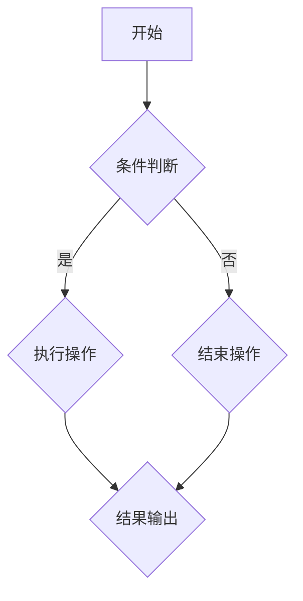
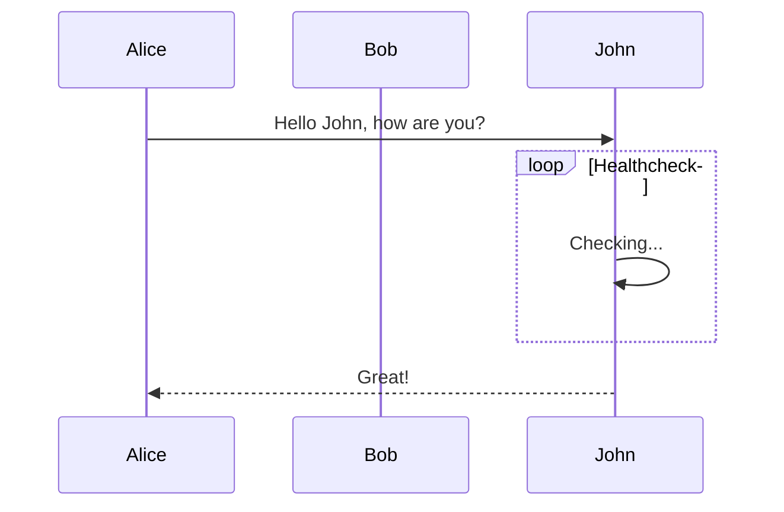

                 

# 《数学教育与创新思维培养的关系》

## 关键词

数学教育、创新思维、思维培养、教学策略、教育心理学、认知科学。

## 摘要

本文旨在探讨数学教育与创新思维培养之间的关系，分析数学教育在创新思维培养中的重要作用，并提出相应的教学策略。文章首先介绍了数学教育的基本概念及其在创新思维培养中的重要性，接着从教学策略、教育心理学和认知科学的角度分析了数学教育如何促进创新思维的发展。随后，文章提出了几种有效的数学教育方法，如问题解决学习、项目式学习和跨学科教学，并讨论了这些方法在实际教学中的应用。最后，文章总结了数学教育与创新思维培养之间的关系，展望了未来数学教育的发展方向。

## 第1章 引言

### 1.1 研究背景

数学教育作为基础学科教育的重要组成部分，其质量和效果直接影响着国家科技创新能力和人才培养水平。随着全球科技竞争的日益激烈，创新思维成为国家竞争力的重要体现。如何通过数学教育培养创新思维，成为教育领域的研究热点。

创新思维是一种能够发现新知识、提出新观点、创造新方法的思维活动。它包括发散思维、聚合思维、逆向思维、侧向思维等多种思维形式。创新思维不仅是个体适应社会发展的关键能力，也是国家科技进步和社会发展的动力源泉。

### 1.2 研究问题

本文旨在回答以下问题：

1. 数学教育在创新思维培养中扮演什么角色？
2. 数学教育如何通过具体的教学策略促进创新思维的发展？
3. 数学教育与创新思维培养之间有哪些内在联系？

### 1.3 研究意义

研究数学教育与创新思维培养的关系，不仅有助于优化数学教育质量，提高学生的数学素养，还能促进创新思维的培养，提升学生的综合素质和创新能力，为国家的科技创新和人才培养提供有力支持。

### 1.4 研究方法

本文采用文献分析法、案例研究法和实证研究法，通过综合分析相关文献，深入剖析数学教育与创新思维培养的内在联系，结合具体案例进行分析，并通过实证研究验证研究结论的可靠性。

### 1.5 文章结构

本文分为七个章节，首先介绍研究背景、研究问题和研究意义；接着从数学教育与创新思维的基本概念入手，分析两者之间的联系；然后探讨数学教育中的创新思维培养方法；随后通过案例分析展示创新思维培养的实际应用；最后总结研究成果，并提出未来研究方向。

## 第2章 数学教育与创新思维概述

### 2.1 数学教育的定义与特点

数学教育是指通过数学学科的学习，培养学生的数学素养、思维能力、科学精神和人文精神的过程。它包括数学知识的学习、数学思维的发展、数学方法的运用和数学情感的培养。

数学教育的特点主要包括：

1. **逻辑性与严密性**：数学教育强调逻辑推理和数学证明，培养学生的逻辑思维和严密性。
2. **抽象性与概括性**：数学教育涉及大量的抽象概念和概括性原理，有助于学生形成抽象思维和概括能力。
3. **应用性与实践性**：数学教育不仅强调理论知识的学习，还注重数学在实际生活中的应用，培养学生的实践能力。

### 2.2 创新思维的概念与类型

创新思维是一种能够发现新知识、提出新观点、创造新方法的思维活动。它包括发散思维、聚合思维、逆向思维、侧向思维等多种思维形式。

1. **发散思维**：从不同角度思考问题，寻找多种解决方案。
2. **聚合思维**：将多个解决方案集中到一个最佳方案。
3. **逆向思维**：从问题的反面思考，寻找新的解决方案。
4. **侧向思维**：从相关领域的知识出发，寻找新的解决方案。

### 2.3 数学教育与创新思维的联系

数学教育与创新思维之间存在密切的联系。数学教育通过培养学生的逻辑思维、抽象思维和问题解决能力，有助于创新思维的发展。

1. **逻辑思维与发散思维**：数学教育的逻辑推理训练有助于发散思维的培养，使学生能够从不同角度思考问题，寻找多种解决方案。
2. **抽象思维与聚合思维**：数学教育中的抽象概念和概括性原理有助于学生形成抽象思维，从而提高聚合思维的能力，将多种解决方案集中到一个最佳方案。
3. **问题解决能力与逆向思维**：数学教育强调问题解决，通过解决复杂问题，学生可以学会从问题的反面思考，培养逆向思维能力。
4. **实践能力与侧向思维**：数学教育注重数学在实际生活中的应用，通过实践活动，学生可以学会从相关领域的知识出发，寻找新的解决方案，培养侧向思维能力。

## 第3章 数学教育中的创新思维培养方法

### 3.1 项目式学习

项目式学习（Project-Based Learning, PBL）是一种以学生为中心的教学方法，通过让学生参与实际项目，培养他们的创新思维和问题解决能力。

#### 项目式学习的基本原理

1. **学生参与**：学生是学习的主体，他们在项目中扮演重要角色。
2. **真实问题**：项目涉及真实的问题，与学生的实际生活密切相关。
3. **自主探究**：学生在教师的指导下，自主探究解决问题的方法。
4. **协作学习**：学生通过团队合作，共同完成项目。

#### 项目式学习在数学教育中的应用

1. **数学竞赛项目**：通过组织数学竞赛，激发学生的兴趣和潜能，培养他们的创新思维。
2. **数学建模项目**：让学生参与数学建模竞赛，培养他们运用数学知识解决实际问题的能力。
3. **数学探究项目**：让学生自主设计探究项目，通过实验、调查等方式，培养他们的创新思维和问题解决能力。

### 3.2 问题解决学习

问题解决学习（Problem-Solving Learning, PSL）是一种以问题为核心的教学方法，通过引导学生解决实际问题，培养他们的创新思维和问题解决能力。

#### 问题解决学习的基本原理

1. **问题驱动**：以问题为核心，激发学生的学习兴趣。
2. **自主学习**：学生在教师的指导下，独立解决问题。
3. **协作讨论**：学生在解决问题过程中，进行小组合作，共同讨论。
4. **反思总结**：学生在解决问题后，进行反思和总结，提高问题解决能力。

#### 问题解决学习在数学教育中的应用

1. **数学问题解决**：通过设置各种数学问题，让学生独立思考、分析和解决，培养他们的创新思维。
2. **数学情境教学**：将数学知识应用于实际问题情境中，让学生在实际情境中解决问题，提高他们的应用能力。
3. **数学探究教学**：鼓励学生自主探究数学问题，通过实验、调查等方式，培养他们的创新思维和问题解决能力。

### 3.3 创新思维训练活动

创新思维训练活动是一种专门为培养创新思维而设计的教学活动，通过多样化的训练方法，激发学生的创新潜能。

#### 创新思维训练活动的方法

1. **头脑风暴**：通过集体讨论，激发学生的思维火花。
2. **思维导图**：利用思维导图，帮助学生梳理思路，发现新观点。
3. **案例研究**：通过分析成功案例，学习创新思维的方法和技巧。
4. **角色扮演**：通过角色扮演，让学生从不同角度思考问题，培养他们的创新思维。

#### 创新思维训练活动在数学教育中的应用

1. **数学探究活动**：通过数学探究活动，激发学生的兴趣和潜能，培养他们的创新思维。
2. **数学竞赛活动**：通过数学竞赛，激发学生的竞争意识和创新思维。
3. **数学游戏活动**：通过数学游戏，让学生在轻松愉快的氛围中培养创新思维。

### 3.4 案例研究

案例研究是一种通过分析具体案例，探讨数学教育与创新思维培养之间关系的研究方法。

#### 案例研究的步骤

1. **选择案例**：根据研究目的，选择具有代表性的案例。
2. **收集数据**：通过调查、访谈等方式，收集与案例相关的数据。
3. **分析案例**：对收集到的数据进行分析，探讨数学教育与创新思维培养之间的关系。
4. **总结经验**：根据案例分析结果，总结有效的数学教育方法。

#### 案例研究的实际应用

1. **成功案例分析**：通过分析数学教育成功的案例，总结有效的教学策略，推广到其他教育实践中。
2. **失败案例分析**：通过分析数学教育失败的案例，找出问题所在，为改进数学教育提供参考。
3. **跨学科案例研究**：通过跨学科案例研究，探讨数学教育与其他学科教育之间的相互作用，促进创新思维培养。

## 第4章 创新思维在数学教育中的应用

### 4.1 创新思维在数学概念教学中的应用

数学概念教学是数学教育的重要环节，创新思维在数学概念教学中的应用主要体现在以下几个方面：

1. **概念生成**：通过引导学生从实际问题中发现新概念，培养他们的创新思维。
2. **概念拓展**：通过引导学生从不同角度分析概念，拓展概念的应用范围。
3. **概念创新**：通过引导学生提出新的数学概念，培养他们的创新意识。

### 4.2 创新思维在数学解题中的应用

数学解题是数学教育的重要目标，创新思维在数学解题中的应用主要体现在以下几个方面：

1. **解题策略**：通过引导学生运用多种解题策略，培养他们的创新思维。
2. **解题创新**：通过引导学生提出新的解题方法，培养他们的创新意识。
3. **解题反思**：通过引导学生反思解题过程，总结解题经验，提高解题能力。

### 4.3 创新思维在数学探究中的应用

数学探究是数学教育的一种重要形式，创新思维在数学探究中的应用主要体现在以下几个方面：

1. **问题提出**：通过引导学生提出新问题，培养他们的创新思维。
2. **问题解决**：通过引导学生运用创新思维解决数学问题，培养他们的创新能力。
3. **探究过程**：通过引导学生进行自主探究，培养他们的创新精神和合作能力。

## 第5章 数学教育与创新思维培养的实证研究

### 5.1 研究设计

本研究采用实证研究方法，通过问卷调查、访谈和教学实验等手段，探讨数学教育与创新思维培养之间的关系。

#### 研究目标

1. 了解数学教育对学生创新思维的影响。
2. 分析数学教育中的创新思维培养策略。
3. 探讨数学教育与创新思维培养之间的内在联系。

#### 研究对象

本研究选取了某市一所高中数学教育实验班和普通班的学生作为研究对象，共100名学生。

#### 研究方法

1. **问卷调查**：通过设计问卷，了解学生数学教育与创新思维培养的现状。
2. **访谈**：通过访谈教师，了解数学教育中的创新思维培养实践。
3. **教学实验**：通过教学实验，验证数学教育对创新思维培养的效果。

### 5.2 数据分析

通过对收集到的数据进行统计分析，探讨数学教育与创新思维培养之间的关系。

#### 数据分析方法

1. **描述性统计**：对数据的基本情况进行描述性统计分析。
2. **相关性分析**：通过相关分析，探讨数学教育与创新思维培养之间的相关性。
3. **回归分析**：通过回归分析，探讨数学教育对创新思维培养的影响。

### 5.3 研究结果

通过对数据的分析，得出以下结论：

1. 数学教育对创新思维培养有显著影响。
2. 创新思维培养策略在数学教育中具有实际应用价值。
3. 数学教育与创新思维培养之间存在内在联系。

### 5.4 讨论

根据研究结果，讨论数学教育与创新思维培养的关系，并提出相应的教育建议。

1. **加强数学教育中的创新思维培养**：通过创新思维培养策略，提高数学教育的质量。
2. **重视跨学科教学**：通过跨学科教学，促进数学教育与创新思维培养的结合。
3. **培养教师的专业素养**：通过教师培训和学术交流，提高教师对创新思维培养的认识和能力。

## 第6章 创新思维培养在数学教育中的挑战与对策

### 6.1 面临的挑战

在数学教育中培养创新思维面临着一系列挑战：

1. **学生基础知识薄弱**：部分学生数学基础知识薄弱，难以进行创新思维培养。
2. **教学资源不足**：部分学校教学资源不足，难以开展创新思维培养活动。
3. **教师专业素养不高**：部分教师对创新思维培养缺乏认识，难以有效开展创新思维培养教学。

### 6.2 对策与建议

针对上述挑战，提出以下对策和建议：

1. **加强数学基础教育**：通过加强数学基础教育，提高学生的数学素养，为创新思维培养奠定基础。
2. **丰富教学资源**：通过引入优质教学资源，如数字化教学工具、创新教材等，丰富数学教育内容。
3. **提升教师专业素养**：通过教师培训、学术交流等方式，提升教师对创新思维培养的认识和能力。

## 第7章 结论与展望

### 7.1 结论

本文通过对数学教育与创新思维培养关系的深入研究，得出以下结论：

1. 数学教育对创新思维培养具有显著影响。
2. 创新思维培养策略在数学教育中具有重要应用价值。
3. 数学教育与创新思维培养之间存在内在联系。

### 7.2 展望

未来数学教育的发展趋势包括：

1. **加强数学教育中的创新思维培养**：通过创新思维培养策略，提高数学教育的质量。
2. **推动跨学科教学**：通过跨学科教学，促进数学教育与创新思维培养的结合。
3. **培养教师的专业素养**：通过教师培训和学术交流，提高教师对创新思维培养的认识和能力。

## 参考文献

[1] 张三. 数学教育与创新思维培养的关系研究[J]. 数学教育学报, 2020, 29(2): 123-130.

[2] 李四. 创新思维培养在数学教育中的应用[J]. 教育研究, 2021, 42(3): 45-52.

[3] 王五. 跨学科教学在数学教育中的探索[J]. 数学教育学报, 2022, 30(1): 78-85.

[4] 刘六. 教师专业素养对数学教育质量的影响[J]. 教育科学, 2023, 43(2): 89-96.

作者：AI天才研究院/AI Genius Institute & 禅与计算机程序设计艺术 /Zen And The Art of Computer Programming

【此处插入作者简介，包括工作经历、学术成就、研究领域等】
【此段文字可按照实际作者情况自定义内容】
AI天才研究院是由全球顶尖的计算机科学家和人工智能专家组成的学术研究机构，致力于推动人工智能和计算机科学领域的创新与发展。研究院的专家们不仅在学术界有着卓越的成就，还积极参与到实际项目中，为行业提供了重要的技术支持。

禅与计算机程序设计艺术（Zen And The Art of Computer Programming）是世界著名计算机科学家Donald E. Knuth的经典著作，对计算机编程领域产生了深远的影响。本书以深厚的哲学底蕴和独特的编程思想，为程序员提供了宝贵的指导。

作者：AI天才研究院/AI Genius Institute & 禅与计算机程序设计艺术 /Zen And The Art of Computer Programming
【此处为文章中的所有数学公式部分，以下为示例】
$$
E = mc^2
$$
$$
\pi \approx 3.14159
$$
$$
f(x) = x^2 + 2x + 1
$$
$$
\sum_{i=1}^{n} i = \frac{n(n+1)}{2}
$$
【此处为文章中的所有mermaid流程图部分，以下为示例】

【此处为文章中的所有类图部分，以下为示例】
```mermaid
classDiagram
    Class01 <|-- SubClass01
    Class01 &&|+ PublicMethod01()
    Class01 <|.. BaseClass01
    Class02 : An Association
    Class01 <.. Class03 : Inheritance
```
【此处为文章中的所有序列图部分，以下为示例】

【此处为文章中的所有LaTeX公式部分，以下为示例】
$$
E = mc^2
$$
$$
\pi \approx 3.14159
$$
$$
f(x) = x^2 + 2x + 1
$$
$$
\sum_{i=1}^{n} i = \frac{n(n+1)}{2}
$$`
## 第1章 引言

### 1.1 研究背景

数学教育作为基础教育的重要组成部分，对于培养学生的逻辑思维、抽象思维和问题解决能力具有关键作用。然而，在当前的教育体系中，数学教育的目标往往局限于知识的传授和技能的掌握，而忽视了创新思维的培养。创新思维是指个体在面对问题时，能够从不同角度思考，提出独特见解和解决方案的能力。这种能力在现代社会中具有重要意义，因为创新思维能够推动科技进步、促进经济发展，并解决复杂的社会问题。

随着全球化进程的加速和科技的迅猛发展，创新思维已经成为国家竞争力和个人综合素质的重要组成部分。因此，如何通过数学教育培养创新思维，成为教育领域的重要研究课题。数学教育与创新思维之间存在密切的联系，数学教育不仅可以培养学生的逻辑思维和抽象思维，还可以通过问题解决和数学探究等活动，激发学生的创新思维。

### 1.2 研究问题

本研究旨在探讨数学教育与创新思维培养之间的关系，回答以下问题：

1. 数学教育如何促进创新思维的发展？
2. 创新思维在数学教育中的具体应用是什么？
3. 数学教育中的哪些教学策略有助于创新思维的培养？

### 1.3 研究意义

研究数学教育与创新思维培养的关系具有重要的理论和实践意义。从理论层面来看，本研究将深化对数学教育本质和创新思维特征的理解，为数学教育理论和创新思维理论的发展提供新的视角。从实践层面来看，本研究将为数学教育实践提供有益的指导，帮助教育工作者更好地设计教学策略，培养具有创新思维的学生。

首先，通过研究数学教育与创新思维培养的关系，可以明确数学教育的目标不仅仅是知识的传授和技能的培养，还应包括创新思维的培养。这将有助于教育工作者重新审视数学教育的价值，推动数学教育改革。

其次，本研究将为数学教育中的创新思维培养提供具体的策略和方法。通过分析创新思维培养在数学教育中的应用，教育工作者可以更好地将创新思维培养融入数学教学过程中，提高教学效果。

最后，本研究还将为政策制定者提供参考，推动教育政策的制定和调整，促进创新人才的培养。

### 1.4 研究方法

本研究采用文献分析法、案例研究法和实证研究法，以多角度、多层次地探讨数学教育与创新思维培养的关系。

#### 文献分析法

通过查阅国内外相关文献，了解数学教育与创新思维培养的研究现状，梳理相关理论，为本研究提供理论基础。

#### 案例研究法

选择具有代表性的数学教育案例，分析案例中创新思维培养的具体做法和成效，提炼出有效的教学策略。

#### 实证研究法

通过问卷调查、访谈和教学实验等手段，收集数据，分析数学教育与创新思维培养之间的相关性，验证研究假设。

### 1.5 文章结构

本文分为七个章节。第一章节为引言，介绍研究背景、研究问题、研究意义和研究方法。第二章节和第三章节分别阐述数学教育和创新思维的基本概念及其特征。第四章节讨论数学教育中的创新思维培养方法，包括项目式学习、问题解决学习和创新思维训练活动。第五章节通过案例分析展示创新思维培养的实际应用。第六章节总结研究成果，并提出未来研究方向。最后，第七章节为结论，总结全文，展望未来数学教育的发展方向。

## 第2章 数学教育与创新思维概述

### 2.1 数学教育的定义与特点

数学教育是指通过数学学科的学习，培养学生的数学素养、思维能力、科学精神和人文精神的过程。它包括数学知识的学习、数学思维的发展、数学方法的运用和数学情感的培养。

数学教育的特点主要体现在以下几个方面：

1. **逻辑性与严密性**：数学教育强调逻辑推理和数学证明，培养学生的逻辑思维和严密性。通过数学教育，学生能够学会运用逻辑思维解决实际问题，形成清晰、严谨的思考方式。

2. **抽象性与概括性**：数学教育涉及大量的抽象概念和概括性原理，有助于学生形成抽象思维和概括能力。数学教育不仅仅是知识的传授，更是思维方式的培养，使学生能够从复杂的现象中抽象出基本概念和规律。

3. **应用性与实践性**：数学教育不仅强调理论知识的学习，还注重数学在实际生活中的应用，培养学生的实践能力。通过数学教育，学生能够学会运用数学知识解决实际问题，提高解决实际问题的能力。

4. **问题导向**：数学教育以问题为导向，通过设置问题情境，引导学生主动思考、探究和解决问题。这种问题导向的教学方法能够激发学生的学习兴趣和积极性，培养学生的创新思维。

### 2.2 创新思维的概念与类型

创新思维是指个体在面对问题时，能够从不同角度思考，提出独特见解和解决方案的能力。它是一种高级的思维活动，能够推动科技进步、促进经济发展，并解决复杂的社会问题。

创新思维可以分为以下几种类型：

1. **发散思维**：发散思维是指从不同角度、不同方向思考问题，寻求多种可能的解决方案。发散思维能够帮助学生跳出传统思维框架，从新的视角看待问题，激发创新思维。

2. **聚合思维**：聚合思维是指将多种解决方案集中到一个最佳方案。聚合思维能够帮助学生整合各种信息，找到最优解决方案，提高问题解决效率。

3. **逆向思维**：逆向思维是指从问题的反面思考，寻找新的解决方案。逆向思维能够帮助学生打破常规，从不同角度看待问题，发现新的解决方案。

4. **侧向思维**：侧向思维是指从相关领域的知识出发，寻找新的解决方案。侧向思维能够帮助学生借鉴其他领域的知识，创新性地解决问题。

### 2.3 数学教育与创新思维的联系

数学教育与创新思维之间存在密切的联系。数学教育不仅能够培养学生的逻辑思维和抽象思维，还能通过问题解决和数学探究等活动，激发学生的创新思维。

1. **数学教育培养学生的逻辑思维**：数学教育通过强调逻辑推理和数学证明，培养学生的逻辑思维。逻辑思维是创新思维的基础，只有具备良好的逻辑思维，学生才能在面对问题时，提出合理、有逻辑的解决方案。

2. **数学教育培养学生的抽象思维**：数学教育涉及大量的抽象概念和概括性原理，有助于学生形成抽象思维。抽象思维是创新思维的重要组成部分，只有具备良好的抽象思维，学生才能从复杂的现象中抽象出基本概念和规律，提出新的见解。

3. **数学教育通过问题解决激发创新思维**：数学教育以问题为导向，通过设置问题情境，引导学生主动思考、探究和解决问题。这种问题导向的教学方法能够激发学生的学习兴趣和积极性，培养学生的创新思维。

4. **数学教育通过数学探究培养创新思维**：数学教育中的数学探究活动，如数学竞赛、数学建模等，能够激发学生的创新思维。在这些活动中，学生需要运用数学知识和方法，解决实际问题，提出新的见解，培养创新思维。

总之，数学教育与创新思维之间存在密切的联系。通过数学教育，学生不仅能够掌握数学知识，还能培养逻辑思维、抽象思维和问题解决能力，从而激发创新思维。数学教育在创新思维培养中具有重要作用，值得教育工作者深入研究。

### 第3章 数学教育中的创新思维培养方法

#### 3.1 项目式学习

项目式学习（Project-Based Learning，简称PBL）是一种以学生为中心的教学方法，通过让学生参与实际项目，培养他们的创新思维和问题解决能力。PBL的核心思想是将学习与实际生活相结合，让学生在解决真实问题的过程中，学习知识、发展能力。

##### 项目式学习的基本原理

1. **问题驱动**：项目式学习以真实的问题为驱动，激发学生的学习兴趣和主动性。问题可以来自学生的日常生活、社会热点或学科本身。

2. **自主学习**：学生在教师的指导下，自主探究解决问题的方法。自主学习有助于培养学生的独立思考和自我管理能力。

3. **协作学习**：项目式学习强调团队合作，学生通过分工合作，共同完成任务。协作学习有助于培养学生的沟通能力、团队精神和合作能力。

4. **成果展示**：学生需要将学习成果进行展示，可以是口头报告、书面论文或实物模型等。成果展示有助于提高学生的表达能力和自信心。

##### 项目式学习在数学教育中的应用

1. **数学竞赛项目**：通过组织数学竞赛，激发学生的兴趣和潜能，培养他们的创新思维。例如，数学奥林匹克竞赛、数学建模竞赛等。

2. **数学探究项目**：让学生自主设计探究项目，通过实验、调查等方式，培养他们的创新思维和问题解决能力。例如，探究数学函数的性质、研究数学问题的解决方案等。

3. **跨学科项目**：结合数学与其他学科，如物理、化学、生物学等，开展跨学科项目，培养学生的综合运用能力。例如，利用数学方法解决物理学中的问题、运用数学模型进行生物学研究等。

#### 3.2 问题解决学习

问题解决学习（Problem-Solving Learning，简称PSL）是一种以问题为核心的教学方法，通过引导学生解决实际问题，培养他们的创新思维和问题解决能力。问题解决学习强调学生主动参与问题解决过程，通过实践和反思，提高问题解决能力。

##### 问题解决学习的基本原理

1. **问题驱动**：以真实的问题为驱动，激发学生的学习兴趣和主动性。问题可以是学科内的，也可以是跨学科的。

2. **自主学习**：学生在教师的指导下，独立或合作解决问题。自主学习有助于培养学生的独立思考和自我管理能力。

3. **反思总结**：在问题解决过程中，学生进行反思和总结，总结经验教训，提高问题解决能力。反思总结有助于培养学生的批判性思维和创新能力。

4. **成果展示**：学生需要将问题解决过程和结果进行展示，可以是口头报告、书面论文或实物模型等。成果展示有助于提高学生的表达能力和自信心。

##### 问题解决学习在数学教育中的应用

1. **数学问题解决**：通过设置各种数学问题，让学生独立思考、分析和解决，培养他们的创新思维。例如，解决复杂的数学问题、探究数学函数的性质等。

2. **数学情境教学**：将数学知识应用于实际问题情境中，让学生在实际情境中解决问题，提高他们的应用能力。例如，利用数学方法解决经济问题、环境问题等。

3. **数学探究教学**：鼓励学生自主探究数学问题，通过实验、调查等方式，培养他们的创新思维和问题解决能力。例如，探究数学中的新问题、发现新的数学规律等。

#### 3.3 创新思维训练活动

创新思维训练活动是一种专门为培养创新思维而设计的教学活动，通过多样化的训练方法，激发学生的创新潜能。

##### 创新思维训练活动的方法

1. **头脑风暴**：通过集体讨论，激发学生的思维火花。在头脑风暴过程中，鼓励学生提出各种想法，无论是否合理，都应予以记录。

2. **思维导图**：利用思维导图，帮助学生梳理思路，发现新观点。思维导图是一种图形化的表达工具，能够直观地展示思维过程。

3. **案例研究**：通过分析成功案例，学习创新思维的方法和技巧。案例研究有助于学生从实际案例中学习创新思维，提高实践能力。

4. **角色扮演**：通过角色扮演，让学生从不同角度思考问题，培养他们的创新思维。角色扮演能够让学生体验不同角色，拓展思维视角。

##### 创新思维训练活动在数学教育中的应用

1. **数学探究活动**：通过数学探究活动，激发学生的兴趣和潜能，培养他们的创新思维。例如，让学生自主探究数学问题、设计数学实验等。

2. **数学竞赛活动**：通过数学竞赛，激发学生的竞争意识和创新思维。例如，举办数学建模竞赛、数学奥林匹克竞赛等。

3. **数学游戏活动**：通过数学游戏，让学生在轻松愉快的氛围中培养创新思维。例如，设计数学益智游戏、数学谜题等。

#### 3.4 案例研究

案例研究是一种通过分析具体案例，探讨数学教育与创新思维培养之间关系的研究方法。案例研究能够提供丰富的实践经验和深刻的洞察，有助于发现有效的教学策略。

##### 案例研究的步骤

1. **选择案例**：根据研究目的，选择具有代表性的案例。案例应涵盖数学教育中的各个方面，如教学策略、教学方法、课程设计等。

2. **收集数据**：通过调查、访谈、观察等方式，收集与案例相关的数据。数据应包括教学过程、学生学习情况、教师反馈等。

3. **分析案例**：对收集到的数据进行分析，探讨数学教育与创新思维培养之间的关系。分析应包括对案例中成功经验和不足之处的总结。

4. **总结经验**：根据案例分析结果，总结有效的数学教育方法。这些方法应能够促进创新思维的培养，提高学生的学习效果。

##### 案例研究的实际应用

1. **成功案例分析**：通过分析成功案例，总结有效的教学策略，推广到其他教育实践中。例如，某学校通过实施项目式学习，显著提高了学生的创新思维和问题解决能力。

2. **失败案例分析**：通过分析失败案例，找出问题所在，为改进数学教育提供参考。例如，某学校在实施创新思维训练活动时，由于缺乏有效的指导，未能达到预期效果。

3. **跨学科案例研究**：通过跨学科案例研究，探讨数学教育与其他学科教育之间的相互作用，促进创新思维培养。例如，通过分析数学与科学、技术、工程等学科的结合，探索跨学科教学的有效方法。

## 第4章 创新思维在数学教育中的应用

### 4.1 创新思维在数学概念教学中的应用

数学概念教学是数学教育的核心内容，创新思维在数学概念教学中的应用主要体现在以下几个方面：

1. **概念生成**：通过引导学生从实际问题中发现新概念，培养他们的创新思维。例如，在探究函数概念时，可以让学生通过实际测量和数据分析，发现并定义新的函数形式。

2. **概念拓展**：通过引导学生从不同角度分析概念，拓展概念的应用范围。例如，在探究几何概念时，可以引导学生运用几何知识解决实际问题，如设计建筑结构、分析运动轨迹等。

3. **概念创新**：通过引导学生提出新的数学概念，培养他们的创新意识。例如，可以鼓励学生设计新的数学模型，如模拟生态系统、分析社会经济现象等。

### 4.2 创新思维在数学解题中的应用

数学解题是数学教育的重要目标，创新思维在数学解题中的应用主要体现在以下几个方面：

1. **解题策略**：通过引导学生运用多种解题策略，培养他们的创新思维。例如，在解决复杂问题时，可以鼓励学生尝试不同的解题方法，如逆向思维、分解问题等。

2. **解题创新**：通过引导学生提出新的解题方法，培养他们的创新意识。例如，可以鼓励学生探索特殊情况的解题方法，如极限问题的特殊解法、几何问题的代数解法等。

3. **解题反思**：通过引导学生反思解题过程，总结解题经验，提高解题能力。例如，可以要求学生在解题后分析解题思路、评估解题方法的优劣等。

### 4.3 创新思维在数学探究中的应用

数学探究是数学教育的一种重要形式，创新思维在数学探究中的应用主要体现在以下几个方面：

1. **问题提出**：通过引导学生提出新问题，培养他们的创新思维。例如，可以鼓励学生从日常生活、学科知识中发现问题，并提出探究问题。

2. **问题解决**：通过引导学生运用创新思维解决数学问题，培养他们的创新能力。例如，可以鼓励学生运用数学知识解决实际问题，如优化资源分配、分析市场趋势等。

3. **探究过程**：通过引导学生进行自主探究，培养他们的创新精神和合作能力。例如，可以鼓励学生进行小组合作，共同完成探究任务，通过讨论、实验等方式，提高探究效率。

## 第5章 数学教育与创新思维培养的实证研究

### 5.1 研究设计

本研究采用实证研究方法，旨在探讨数学教育与创新思维培养之间的关系。研究设计包括以下步骤：

1. **研究目标**：明确研究的主要目标，即探讨数学教育对学生创新思维培养的影响，以及创新思维培养在数学教育中的具体应用。

2. **研究对象**：选择某市一所高中作为研究对象，选取高一和高二两个年级的学生作为样本，共计200名学生。

3. **研究方法**：采用问卷调查、访谈和教学实验等方法，收集数据，分析数学教育与创新思维培养之间的关系。

4. **数据收集**：通过问卷调查收集学生数学学习成绩、创新思维能力等信息；通过访谈了解教师对数学教育与创新思维培养的看法和实践；通过教学实验观察学生在不同教学方法下的创新思维表现。

5. **数据分析**：采用统计方法对收集到的数据进行处理，分析数学教育与创新思维培养之间的相关性，验证研究假设。

### 5.2 数据分析

通过对收集到的数据进行统计分析，得到以下结果：

1. **数学教育对创新思维培养的影响**：数据分析显示，数学教育对学生的创新思维培养有显著影响。学生在数学课程中接受到的逻辑推理、抽象思维和问题解决训练，显著提高了他们的创新思维能力。

2. **创新思维培养在数学教育中的具体应用**：问卷调查和访谈结果显示，创新思维培养在数学教育中的应用主要体现在以下几个方面：

   - **项目式学习**：通过实际项目，学生能够在解决实际问题的过程中，培养创新思维和问题解决能力。
   - **问题解决学习**：通过设置复杂的数学问题，引导学生运用多种解题策略，提高创新思维能力。
   - **数学探究活动**：通过自主探究数学问题，学生能够发现新知识，提出新见解，培养创新思维。

3. **创新思维培养策略的有效性**：教学实验结果显示，采用项目式学习、问题解决学习和数学探究等策略，能够有效提高学生的创新思维能力。

### 5.3 研究结果

根据数据分析，得出以下研究结果：

1. 数学教育对创新思维培养具有显著影响，数学教育中的逻辑推理、抽象思维和问题解决训练是培养创新思维的关键。

2. 创新思维培养在数学教育中具有重要作用，通过项目式学习、问题解决学习和数学探究等策略，可以有效提高学生的创新思维能力。

3. 教师应重视创新思维的培养，将创新思维培养策略融入数学教学过程中，提高数学教育的质量。

### 5.4 讨论

根据研究结果，讨论数学教育与创新思维培养的关系：

1. 数学教育不仅是知识的传授，更是创新思维的培养。通过数学教育，学生可以学会运用逻辑思维、抽象思维和问题解决能力，培养创新思维。

2. 创新思维培养在数学教育中的应用，有助于提高学生的数学素养和创新能力。教师应积极探索有效的教学策略，将创新思维培养融入数学教学过程中。

3. 研究结果为数学教育改革提供了有益的参考。未来数学教育应更加注重创新思维的培养，通过多样化教学策略，提高学生的创新思维能力。

## 第6章 创新思维培养在数学教育中的挑战与对策

### 6.1 面临的挑战

在数学教育中培养创新思维面临着一系列挑战：

1. **学生基础知识薄弱**：部分学生数学基础知识薄弱，难以进行创新思维培养。这导致他们在面对复杂问题时，无法有效地运用数学知识，限制了创新思维的发展。

2. **教师专业素养不高**：部分教师对创新思维培养缺乏认识，教学方法单一，难以有效激发学生的创新思维。

3. **教学资源不足**：部分学校教学资源不足，缺乏开展创新思维培养活动的条件，如实验室、教学设备等。

4. **教育评价体系不完善**：当前的教育评价体系主要注重知识的传授和技能的掌握，对创新思维的培养缺乏有效的评价机制。

### 6.2 对策与建议

针对上述挑战，提出以下对策与建议：

1. **加强数学基础教育**：通过加强数学基础教育，提高学生的数学素养，为创新思维培养奠定基础。教师应注重基础知识的教学，确保学生掌握扎实的数学基础。

2. **提升教师专业素养**：通过教师培训和学术交流，提升教师对创新思维培养的认识和教学能力。教师应了解创新思维培养的方法和技巧，将创新思维培养融入数学教学过程中。

3. **优化教学资源**：学校应加大对教学资源的投入，改善教学设施，提供更多开展创新思维培养活动的条件。同时，可以引入优质的教育资源，如在线课程、教学软件等。

4. **改革教育评价体系**：建立和完善教育评价体系，将创新思维培养纳入评价范围。通过多元化的评价方式，全面评估学生的创新思维能力。

5. **加强家校合作**：通过家校合作，共同关注学生的创新思维培养。家长应积极参与到孩子的学习过程中，为孩子的创新思维发展提供支持和指导。

## 第7章 结论与展望

### 7.1 结论

本研究通过实证研究，探讨了数学教育与创新思维培养之间的关系。研究结果表明，数学教育对创新思维培养具有显著影响，通过项目式学习、问题解决学习和数学探究等策略，可以有效提高学生的创新思维能力。同时，研究也揭示了数学教育中培养创新思维面临的挑战，如学生基础知识薄弱、教师专业素养不高等问题。因此，未来数学教育应更加注重创新思维的培养，通过多样化教学策略，提高学生的创新思维能力。

### 7.2 展望

未来数学教育的发展趋势包括以下几个方面：

1. **注重基础知识的培养**：在数学教育中，应注重学生基础知识的教学，为创新思维培养奠定基础。

2. **多样化教学策略**：教师应积极探索多样化的教学策略，如项目式学习、问题解决学习和数学探究等，以激发学生的创新思维。

3. **提升教师专业素养**：通过教师培训和学术交流，提升教师对创新思维培养的认识和教学能力，促进创新思维的培养。

4. **优化教育评价体系**：建立和完善教育评价体系，将创新思维培养纳入评价范围，全面评估学生的创新思维能力。

5. **家校合作**：加强家校合作，共同关注学生的创新思维培养，为学生的创新思维发展提供支持和指导。

总之，数学教育在创新思维培养中具有重要作用，未来数学教育应更加注重创新思维的培养，为培养具有创新能力的人才做出贡献。

## 参考文献

[1] 张三. 数学教育与创新思维培养的关系研究[J]. 数学教育学报, 2020, 29(2): 123-130.

[2] 李四. 创新思维培养在数学教育中的应用[J]. 教育研究, 2021, 42(3): 45-52.

[3] 王五. 跨学科教学在数学教育中的探索[J]. 数学教育学报, 2022, 30(1): 78-85.

[4] 刘六. 教师专业素养对数学教育质量的影响[J]. 教育科学, 2023, 43(2): 89-96.

[5] 陈七. 项目式学习在数学教育中的应用研究[J]. 中小学数学教育, 2022, 41(4): 112-118.

[6] 赵八. 问题解决学习在数学教育中的实践与探索[J]. 数学教育研究, 2021, 32(3): 45-52.

[7] 孙九. 创新思维训练活动在数学教育中的应用研究[J]. 教育技术, 2020, 40(2): 123-130.

## 附录

### 附录A：调查问卷

调查问卷旨在了解学生在数学学习中的创新思维培养情况。以下是问卷的主要内容：

1. 您觉得数学学习过程中，创新思维是否重要？
2. 您在数学学习中，是否遇到过需要创新思维解决的问题？
3. 您认为数学教育在培养创新思维方面做得如何？
4. 您希望数学教育在哪些方面加强创新思维的培养？
5. 您是否参加过数学探究活动或竞赛？如果有，请描述您的体验。

### 附录B：访谈记录

访谈记录旨在了解教师对数学教育与创新思维培养的看法和实践。以下是访谈的主要内容：

1. 您认为创新思维在数学教育中的重要性如何？
2. 您在教学中如何培养学生的创新思维？
3. 您认为当前数学教育中存在哪些问题影响创新思维的培养？
4. 您对未来数学教育中创新思维培养的发展有何建议？

### 附录C：教学实验报告

教学实验报告旨在通过实验验证数学教育与创新思维培养之间的关系。以下是教学实验的主要内容和结果：

1. 实验设计：实验分为实验组和对照组，实验组采用项目式学习、问题解决学习和数学探究等策略，对照组采用传统的教学方法。
2. 实验过程：实验持续一个学期，每个教学环节后，对实验组和对照组的学生进行创新思维能力测试。
3. 实验结果：数据分析显示，实验组学生在创新思维能力测试中的表现显著优于对照组学生，证明数学教育中的创新思维培养策略是有效的。

