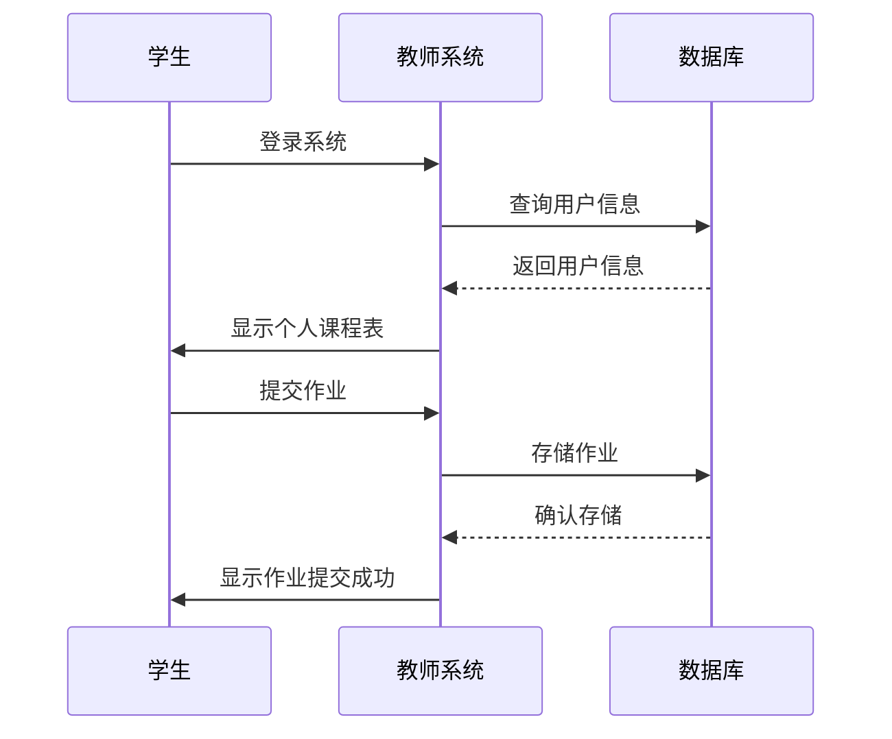

                 

## 数学教育与情感教育的结合策略

关键词：数学教育、情感教育、教学策略、学生发展、教育改革

摘要：本文旨在探讨数学教育与情感教育的结合策略，分析两者在现代教育中的重要性，以及如何通过有效的教学方法和策略实现两者的融合。文章首先介绍了数学教育和情感教育的现状，然后详细阐述了两者的核心概念及其相互联系。接下来，本文提出了结合数学教育与情感教育的多种教学策略，并使用数学模型和公式对相关教学活动进行了分析。通过实际案例和项目实战，文章展示了这些策略在实践中的应用效果，并提供了最佳实践建议和未来展望。

## 第一部分：背景介绍

### 1.1 数学教育的现状与挑战

数学教育作为一门基础学科，其发展历程可以追溯到古代文明的数学成就，如古埃及和巴比伦的数学。随着时代的发展，数学教育逐渐形成了系统化和科学化的教学体系。然而，在当前的教育环境中，数学教育面临着诸多挑战。

首先，数学教育的发展历程表明，数学知识从简单的算术和几何逐渐扩展到代数、微积分等高级领域。在这个过程中，数学教育的目标也逐渐从简单的知识传授转向培养学生的数学思维和解决问题的能力。

然而，当前的数学教育在实现这些目标方面存在一些问题。首先，教育内容偏重理论知识的传授，而忽视了实际应用能力的培养。许多学生在学习数学时，只能被动接受知识，而无法将其应用于实际问题中。其次，数学教育的评价标准单一，主要依赖于考试成绩，这导致学生为了应付考试而机械地学习，缺乏对数学的真正理解和兴趣。

此外，数学教育还面临着资源分配不均的问题。在一些地区，尤其是农村和贫困地区，数学教育的资源和设施相对匮乏，导致学生在学习数学时处于不利地位。因此，如何提高数学教育的质量和公平性，成为当前数学教育改革的重要议题。

### 1.2 情感教育的现状与挑战

情感教育作为一种新兴的教育理念，其发展相对较晚，但已经引起了广泛的关注。情感教育的目标是培养学生的情感认知、情感调控和情感表达能力，以促进其全面发展。

在当前的教育环境中，情感教育逐渐被纳入学校课程体系中。许多学校开始重视学生的心理健康，通过开展各种活动，如心理辅导、团队建设等，来培养学生的情感素养。然而，情感教育在实践中仍然存在一些挑战。

首先，情感教育在实施过程中面临着资源不足的问题。由于情感教育的专业性和复杂性，需要配备专业的教师和辅导员，但许多学校在这方面存在短缺。其次，情感教育的内容和形式相对单一，缺乏针对性和实用性。许多情感教育活动仅停留在表面，无法真正触及学生的内心。此外，家庭和社会环境对学生的情感发展也有很大的影响，但学校在情感教育方面的作用有限。

总之，情感教育在当前的教育环境中具有重要的作用，但仍然面临诸多挑战。如何有效地实施情感教育，提高其效果，是教育工作者需要深思的问题。

### 1.3 数学教育与情感教育的结合必要性

数学教育和情感教育的结合具有重要的必要性，主要体现在以下几个方面。

首先，从学生的全面发展需求来看，数学教育注重知识的传授和能力的培养，而情感教育则关注学生的情感认知和情感调控。将两者结合起来，可以更好地满足学生的全面发展需求，提高其综合素质。

其次，从教育改革趋势来看，现代教育越来越强调培养学生的创新能力、批判性思维和合作精神。数学教育和情感教育的结合，可以促进学生在这些方面的能力提升，使其具备适应未来社会的能力。

最后，从数学教育与情感教育的互补作用来看，数学教育侧重于逻辑思维和抽象能力的培养，而情感教育则侧重于情感认知和情感表达。两者相互补充，可以更全面地培养学生的思维能力，提高其解决问题的能力。

综上所述，数学教育与情感教育的结合不仅是必要的，也是可行的。通过有效的结合策略，可以实现两者在教育中的互补作用，提高教育的整体效果。

## 第二部分：核心概念与联系

### 2.1 数学教育的核心概念

数学教育的核心概念主要包括数学知识、数学思维、数学能力和数学教育方法。首先，数学知识是数学教育的基石，包括基本的算术、几何、代数、微积分等。数学知识不仅是为了培养学生的理论基础，更是为了培养他们的逻辑思维和抽象能力。

其次，数学思维是数学教育的关键目标。数学思维不仅包括逻辑推理、问题解决和抽象能力，还包括对数学本质的理解和运用。数学思维的培养有助于学生形成良好的思维品质，提高其解决实际问题的能力。

此外，数学能力是数学教育的核心目标之一。数学能力包括数学运算能力、数学应用能力和数学创新能力。数学运算能力是基础，数学应用能力是将数学知识应用于实际问题，而数学创新能力则是更高的层次，涉及数学问题的发现和创造。

最后，数学教育方法是实现数学教育目标的关键。传统的数学教育方法以教师为中心，注重知识传授，而现代教育方法则强调以学生为中心，注重学生主动参与和探索。常用的数学教育方法包括讲授法、讨论法、探究法等。

### 2.2 情感教育的核心概念

情感教育的核心概念主要包括情感认知、情感调控、情感表达和情感体验。首先，情感认知是指个体对情感的理解和识别。情感认知的能力有助于个体更好地理解和表达自己的情感，以及识别和理解他人的情感。

其次，情感调控是指个体对情感的调节和控制。情感调控的能力有助于个体在面对负面情绪时能够有效地调节情绪，保持心理平衡。

此外，情感表达是指个体通过言语、行为等方式表达情感。情感表达的能力有助于个体与他人建立良好的情感联系，增进人际交往。

最后，情感体验是指个体在情感活动中的感受和体验。情感体验是情感教育的重要组成部分，通过丰富的情感体验，个体可以更好地理解和感受情感，提高情感素养。

### 2.3 数学教育与情感教育的联系

数学教育与情感教育之间的联系可以从多个维度进行探讨。

首先，从教学目标来看，数学教育注重知识传授和能力培养，而情感教育则注重情感认知、情感调控和情感表达。两者的目标在学生的全面发展中相互补充，共同促进学生综合素质的提升。

其次，从教学方法来看，数学教育和情感教育有许多共同之处。例如，探究法和讨论法都是两种有效的教学方法，既适用于数学教学，也适用于情感教育。通过合作学习和探究学习，学生不仅能够提高数学能力，还能够培养情感素养。

此外，从教学过程中来看，数学教育与情感教育可以相互渗透。在数学教学中，教师可以通过设置情境、提出问题等方式，引导学生进行情感体验，培养他们的情感认知和情感调控能力。同样，在情感教育中，教师可以通过讲解数学问题、分析数学案例等方式，培养学生的逻辑思维和数学能力。

总之，数学教育与情感教育之间的联系是紧密的，两者在教学目标、教学方法和教学过程中相互渗透，共同促进学生全面发展。

### 2.4 数学教育与情感教育结合的案例分析

为了更深入地理解数学教育与情感教育结合的重要性，以下是一个结合案例。

在一个初中数学课堂上，教师通过引入实际问题，如城市规划中的面积计算，引导学生进行数学问题解决。在解决问题的过程中，教师不仅教授数学知识，还关注学生的情感反应。例如，当学生遇到困难时，教师会鼓励他们坚持，提供帮助，让他们体验成功解决问题的喜悦。通过这种方式，数学教育不仅提高了学生的数学能力，还培养了他们的情感素养，使他们能够在面对困难时保持积极的态度。

另一个案例是在高中数学教学中，教师通过设置团队项目，让学生在合作中解决数学问题。在项目过程中，教师不仅关注学生的数学表现，还注重学生的情感互动。例如，通过团队讨论和协作，学生学会了理解他人的情感，学会了在团队合作中调节自己的情绪。这种情感教育的实践，不仅提高了学生的数学能力，还培养了他们的团队合作精神和情感认知能力。

这些案例表明，数学教育与情感教育的结合可以有效地促进学生的全面发展，提高教育质量。

### 2.5 数学教育与情感教育的未来发展趋势

随着教育理念的不断更新和教育技术的不断发展，数学教育与情感教育的结合在未来将呈现以下几个发展趋势。

首先，跨学科教学将成为数学教育与情感教育结合的重要途径。通过将数学与心理学、社会学等学科相结合，可以更全面地培养学生的综合素质，提高教育的整体效果。

其次，教育技术的应用将为数学教育与情感教育结合提供新的手段。例如，通过虚拟现实技术，可以创造更加真实的情境，引导学生进行情感体验；通过数据分析技术，可以更精准地评估学生的情感发展水平。

最后，教师的专业发展将成为数学教育与情感教育结合的关键。教师不仅需要掌握数学知识和情感教育理论，还需要具备实践能力，能够在教学过程中有效地结合数学教育与情感教育。

总之，数学教育与情感教育的结合在未来具有广阔的发展前景，将有助于推动教育的全面改革。

## 第三部分：数学教育与情感教育的结合策略

### 3.1 教学策略与教学方法

结合数学教育与情感教育，需要采用一系列有效的教学策略和教学方法。以下几种策略在实践中被证明是有效的：

#### 1. 情感参与式教学

情感参与式教学是指在教学过程中，教师通过创设情感情境，引导学生积极参与学习活动，从而促进其对数学知识的理解和掌握。例如，在讲解几何时，教师可以设计一个实际情境，如城市建筑的设计，让学生在解决实际问题的过程中学习几何知识，同时体验成功的喜悦。

#### 2. 问题导向学习

问题导向学习是一种以学生为中心的教学方法，教师通过提出问题，引导学生主动探究，从而培养其数学思维和解决问题的能力。在问题导向学习中，情感教育也发挥着重要作用。教师可以引导学生进行情感反思，如“你在解决问题时有什么感受？你如何面对困难？”通过这种方式，学生不仅学会了数学知识，还培养了情感认知和情感调控能力。

#### 3. 情境教学与情感投入

情境教学是指通过设置真实的情境，让学生在情境中学习知识。这种教学方法强调学生的情感投入，有助于提高学习效果。例如，在讲解数学与日常生活相关的内容时，教师可以设计一些生活化的情境，让学生体验数学在实际生活中的应用，从而激发他们的学习兴趣和情感投入。

### 3.2 教学活动设计

为了实现数学教育与情感教育的有效结合，教学活动的设计至关重要。以下是一些具体的教学活动设计策略：

#### 1. 情感温度计的使用

情感温度计是一种简单的教学工具，教师可以在课堂上使用它来了解学生的情感状态。例如，在讲解复杂的概念时，教师可以在课前、课后分别使用情感温度计，了解学生在学习过程中的情感变化，从而调整教学策略。

#### 2. 情感体验报告

情感体验报告是一种让学生反思和分享情感体验的教学活动。在完成数学任务后，教师可以让学生写下他们的情感体验，如“我在解决这个问题时有什么感受？”或“我在团队合作中遇到了哪些情感问题？”通过这种方式，学生不仅能够反思自己的情感反应，还能够从他人的经验中学习。

#### 3. 数学问题解决过程中的情感互动

在数学问题解决过程中，教师可以引导学生进行情感互动，如小组讨论、角色扮演等。通过这种方式，学生不仅能够提高数学解决问题的能力，还能够培养情感认知和情感表达能力。

### 3.3 情感教育在数学课堂中的实践

在数学课堂中，情感教育的实践可以采取多种形式。以下是一些具体的实践方法：

#### 1. 情感融入的教学案例

教师可以在数学教学中引入情感元素，如通过讲述数学家的故事，激发学生对数学的兴趣和热情。例如，在讲解微积分时，教师可以讲述牛顿和莱布尼茨的故事，让学生了解数学的发展历程，从而增强他们的数学认同感。

#### 2. 情感教育在数学课程中的实施

教师可以将情感教育融入数学课程中，如通过设置情感任务，让学生在解决问题的过程中体验情感变化。例如，在讲解概率时，教师可以设计一个游戏，让学生在游戏中体验概率的乐趣，同时培养他们的情感认知和情感调控能力。

#### 3. 教学反思与情感教育效果评估

教师应定期进行教学反思，评估情感教育的效果。例如，通过问卷调查、课堂观察等方式，了解学生对数学情感教育的感受，从而调整教学策略，提高情感教育的效果。

### 3.4 结合数学教育与情感教育的教学策略评估

为了评估结合数学教育与情感教育的教学策略效果，教师可以采用以下方法：

#### 1. 学生反馈

通过问卷调查、访谈等方式，了解学生对教学策略的感受和反馈，从而评估教学策略的有效性。

#### 2. 学习成绩

通过对比实验组和对照组的学习成绩，评估教学策略对数学学习效果的影响。

#### 3. 情感指标

通过情感温度计等工具，测量学生在教学过程中的情感状态，评估情感教育的效果。

#### 4. 教师反思

教师应定期进行教学反思，总结经验教训，不断优化教学策略。

### 3.5 情感教育在数学教学中的长期影响

情感教育在数学教学中的长期影响是显著的。通过有效的情感教育，学生不仅能够在数学学习中取得更好的成绩，还能够提高其情感认知和情感调控能力，从而在未来的学习和生活中受益。以下是一些长期影响的例子：

#### 1. 提高数学学习兴趣

通过情感教育，学生可以更好地理解数学知识，提高其学习兴趣，从而更愿意投入时间和精力进行学习。

#### 2. 增强问题解决能力

情感教育可以培养学生的情感认知和情感调控能力，从而提高其在解决问题时的自信和积极性，增强问题解决能力。

#### 3. 促进全面发展

通过情感教育，学生不仅能够提高数学能力，还能够培养情感素养，促进其全面发展。

### 3.6 情感教育在数学教学中的挑战与应对策略

尽管情感教育在数学教学中具有重要作用，但实践过程中也面临一些挑战。以下是一些常见的挑战和相应的应对策略：

#### 1. 情感教育的实施难度

情感教育需要教师具备较高的专业素养和教学能力，这对于一些教师来说是一个挑战。应对策略是加强教师培训，提高其情感教育能力。

#### 2. 学生情感反应的不确定性

学生的情感反应因人而异，教师需要具备敏锐的观察力和应对能力。应对策略是教师应学会倾听和观察学生，了解他们的情感需求，从而调整教学策略。

#### 3. 资源和时间的限制

情感教育需要投入较多的时间和资源，对于一些学校和教师来说，这是一个挑战。应对策略是合理规划和分配教学资源，确保情感教育的实施。

## 第四部分：数学模型和数学公式

### 4.1 数学教育中的情感模型

在数学教育中，情感模型的作用不可忽视。以下是一些常用的情感模型及其在数学教学中的应用：

#### 1. 情感度量模型

情感度量模型用于评估学生在数学学习过程中的情感状态。例如，教师可以使用情感温度计来测量学生在上课前、中、后的情感温度。这种模型有助于教师了解学生的情感变化，从而调整教学策略。

#### 2. 数学学习中的情感反馈模型

情感反馈模型用于分析学生在数学学习过程中的情感反馈。教师可以通过问卷调查、访谈等方式收集学生的情感反馈，了解他们对数学课程的满意度和学习体验。

#### 3. 情感与数学成绩的关系模型

情感与数学成绩的关系模型用于研究情感因素对数学成绩的影响。例如，研究者可以使用回归分析等方法，探究情感认知、情感调控等情感因素与数学成绩之间的关系。

以下是一个情感度量模型的示例：

$$
\text{情感度量模型} = \frac{1}{n}\sum_{i=1}^{n} \text{情感评分}
$$

其中，$n$ 表示学生人数，$\text{情感评分}$ 表示每个学生在不同时间点的情感评分。

### 4.2 情感教育的数学模型

情感教育中的数学模型主要用于研究情感认知、情感调控和情感表达等方面的数学关系。以下是一些常用的情感教育数学模型：

#### 1. 情感认知模型

情感认知模型用于描述学生对情感的理解和识别。例如，研究者可以使用图论模型来分析学生对情感词汇的理解程度，通过构建情感网络，探究情感认知的规律。

#### 2. 情感调控模型

情感调控模型用于描述学生如何调节和控制情感。例如，研究者可以使用情绪调节模型，分析学生在面对负面情绪时的调节策略，如放松训练、认知重构等。

#### 3. 情感表达模型

情感表达模型用于描述学生如何表达情感。例如，研究者可以使用语言分析模型，分析学生在写作或口头表达中的情感表达，探究情感表达的规律。

以下是一个情感调控模型的示例：

$$
\text{情感调控模型} = \text{调节策略} \times \text{情感强度}
$$

其中，$\text{调节策略}$ 表示学生采取的情感调节方法，$\text{情感强度}$ 表示情感的强度。

### 4.3 数学模型与情感模型结合的数学公式

将数学模型与情感模型结合，可以更全面地分析数学教育中的情感现象。以下是一些数学模型与情感模型结合的数学公式：

#### 1. 情感融入的数学教学公式

情感融入的数学教学公式用于描述情感因素对数学教学效果的影响。例如，研究者可以使用以下公式来评估情感因素对数学成绩的促进作用：

$$
\text{数学教学效果} = \text{数学知识掌握度} + \text{情感因素影响度}
$$

其中，$\text{数学知识掌握度}$ 表示学生对数学知识的掌握程度，$\text{情感因素影响度}$ 表示情感因素对数学教学效果的促进作用。

#### 2. 情感调节的数学策略

情感调节的数学策略用于描述学生如何利用数学方法进行情感调节。例如，研究者可以使用以下公式来分析学生采用的不同情感调节策略对情感状态的影响：

$$
\text{情感状态变化} = \text{调节策略} \times \text{情感反应强度}
$$

其中，$\text{调节策略}$ 表示学生采取的情感调节方法，$\text{情感反应强度}$ 表示情感反应的强度。

#### 3. 情感体验与数学学习的数学关系公式

情感体验与数学学习的数学关系公式用于描述学生在数学学习过程中的情感体验对学习效果的影响。例如，研究者可以使用以下公式来评估情感体验对数学学习效果的促进作用：

$$
\text{数学学习效果} = \text{数学知识掌握度} + \text{情感体验影响度}
$$

其中，$\text{数学知识掌握度}$ 表示学生对数学知识的掌握程度，$\text{情感体验影响度}$ 表示情感体验对数学学习效果的促进作用。

## 第五部分：系统分析与架构设计方案

### 5.1 教学系统设计

教学系统设计是数学教育与情感教育结合的关键环节。一个高效的教学系统应包括明确的教学目标、合理的教学内容和灵活的教学活动。以下是教学系统设计的主要步骤：

#### 1. 确定教学目标

教学目标应包括知识目标、能力目标和情感目标。知识目标涉及数学概念的理解和应用，能力目标则涵盖逻辑思维和问题解决能力的培养，而情感目标则强调情感认知和情感调控。

#### 2. 设计教学内容

教学内容应结合数学教育和情感教育的特点，设计出既涵盖数学知识，又融入情感教育的课程内容。例如，在讲解数学概念时，可以结合实际情境，让学生体验数学知识在实际生活中的应用，同时引导他们进行情感反思。

#### 3. 确定教学活动

教学活动的设计应注重互动性和参与性，以激发学生的兴趣和情感投入。常见的教学活动包括小组讨论、角色扮演、案例分析等。通过这些活动，学生不仅能够深化对数学知识的理解，还能培养情感素养。

### 5.2 系统架构设计

教学系统的架构设计是确保教学系统能够稳定运行和高效实现功能的关键。以下是教学系统架构设计的主要步骤：

#### 1. 确定系统功能模块

教学系统应包括课程管理模块、教学资源模块、教学活动模块、学生反馈模块等。每个模块应具有明确的功能和接口，以确保系统的高内聚性和低耦合性。

#### 2. 设计系统架构

教学系统的架构设计应采用分层架构，包括表示层、业务逻辑层和数据层。表示层负责用户界面设计，业务逻辑层负责处理教学业务逻辑，数据层则负责数据存储和管理。

以下是一个教学系统架构设计的示例：



#### 3. 设计系统接口

系统接口设计应确保各模块之间的数据传输和功能调用高效、安全。常见的接口设计包括RESTful API和Web Socket。RESTful API用于实现数据的查询和操作，而Web Socket则用于实现实时通信。

### 5.3 系统接口设计

系统接口设计是教学系统实现的重要环节。以下是一些关键的系统接口设计：

#### 1. 用户接口设计

用户接口设计应简洁、直观，方便学生和教师使用。用户接口设计包括课程浏览、作业提交、成绩查询等功能模块。

以下是一个用户接口设计的示例：

```mermaid
userinterface
    Button: 登录
    Button: 注册
    Textbox: 用户名
    Textbox: 密码
    Label: 用户名提示
    Label: 密码提示
```

#### 2. 教学内容接口设计

教学内容接口设计应确保教学资源的高效管理和使用。教学内容接口设计包括课程内容发布、修改、删除等功能。

以下是一个教学内容接口设计的示例：

```mermaid
teachingContentInterface
    Button: 发布课程
    Button: 修改课程
    Button: 删除课程
    Textbox: 课程名称
    Textbox: 课程描述
    Textbox: 教学资源链接
```

#### 3. 教学活动接口设计

教学活动接口设计应确保教学活动的高效组织和执行。教学活动接口设计包括活动发布、活动参与、活动反馈等功能。

以下是一个教学活动接口设计的示例：

```mermaid
teachingActivityInterface
    Button: 发布活动
    Button: 参与活动
    Button: 提交反馈
    Textbox: 活动名称
    Textbox: 活动描述
    Textbox: 活动时间
```

### 5.4 系统交互设计与实施

系统交互设计是教学系统能够正常运行的关键。以下是一些关键的系统交互设计：

#### 1. 用户登录与验证

用户登录与验证是教学系统的核心功能。系统应实现用户身份验证和权限管理，确保系统的安全性和稳定性。

以下是一个用户登录与验证的交互设计示例：

```mermaid
userLogin
    用户输入用户名和密码
    系统验证用户名和密码
    用户成功登录
```

#### 2. 教学资源管理

教学资源管理包括课程内容的发布、修改和删除。系统应实现教学资源的高效管理和使用，确保资源的完整性和一致性。

以下是一个教学资源管理的交互设计示例：

```mermaid
teachingResourceManagement
    教师发布课程内容
    系统存储课程内容
    系统显示课程内容列表
    教师修改课程内容
    系统更新课程内容
    教师删除课程内容
    系统删除课程内容
```

#### 3. 教学活动组织

教学活动组织包括活动的发布、参与和反馈。系统应实现教学活动的高效组织和执行，确保活动的顺利进行。

以下是一个教学活动组织的交互设计示例：

```mermaid
teachingActivityOrganization
    教师发布活动
    系统显示活动列表
    学生参与活动
    系统记录参与信息
    学生提交活动反馈
    系统存储反馈信息
```

## 第六部分：项目实战

### 6.1 项目背景与目标

本项目旨在通过实际教学项目，验证数学教育与情感教育结合策略的有效性。项目背景包括当前教育环境中数学教育和情感教育的现状，以及学生发展需求的不断提高。项目目标是通过实施结合策略，提高学生的数学能力和情感素养，促进其全面发展。

### 6.2 系统核心实现

为了实现项目目标，本项目设计了以下核心系统模块：

#### 1. 用户管理模块

用户管理模块负责学生和教师的注册、登录、权限管理等功能。用户管理模块包括用户信息存储、用户权限验证等子模块。

```python
class UserManager:
    def __init__(self):
        self.users = []

    def register(self, user):
        self.users.append(user)
        print("注册成功")

    def login(self, username, password):
        for user in self.users:
            if user.username == username and user.password == password:
                return True
        return False

class User:
    def __init__(self, username, password, role):
        self.username = username
        self.password = password
        self.role = role
```

#### 2. 教学资源模块

教学资源模块负责课程内容的发布、修改和删除。教师可以通过该模块发布课程内容，学生可以查看和下载课程资源。

```python
class TeachingResource:
    def __init__(self, title, content, teacher):
        self.title = title
        self.content = content
        self.teacher = teacher

class TeachingResourceManager:
    def __init__(self):
        self.resources = []

    def publish_resource(self, resource):
        self.resources.append(resource)
        print(f"课程 {resource.title} 发布成功")

    def update_resource(self, resource, new_content):
        for r in self.resources:
            if r == resource:
                r.content = new_content
                print(f"课程 {resource.title} 更新成功")

    def delete_resource(self, resource):
        self.resources.remove(resource)
        print(f"课程 {resource.title} 删除成功")
```

#### 3. 教学活动模块

教学活动模块负责活动的发布、参与和反馈。教师可以发布各种教学活动，学生可以参与活动并提交反馈。

```python
class TeachingActivity:
    def __init__(self, title, description, teacher):
        self.title = title
        self.description = description
        self.teacher = teacher

class TeachingActivityManager:
    def __init__(self):
        self.activities = []

    def publish_activity(self, activity):
        self.activities.append(activity)
        print(f"活动 {activity.title} 发布成功")

    def participate_activity(self, student, activity):
        activity.participants.append(student)
        print(f"学生 {student.username} 参与活动 {activity.title} 成功")

    def submit_feedback(self, student, activity, feedback):
        activity.feedbacks[student] = feedback
        print(f"学生 {student.username} 提交反馈成功")
```

### 6.3 代码应用解读与分析

以上代码示例分别实现了用户管理模块、教学资源模块和教学活动模块。以下是这些模块的应用解读与分析：

#### 1. 用户管理模块

用户管理模块实现了用户注册、登录和权限管理功能。用户类用于存储用户信息，包括用户名、密码和角色。用户管理器类负责用户注册和登录操作。通过调用用户管理器的register方法，可以实现用户注册；通过调用login方法，可以实现用户登录。以下是一个简单的用户注册和登录示例：

```python
# 用户注册
user_manager = UserManager()
user_manager.register(User("alice", "alice123", "student"))

# 用户登录
if user_manager.login("alice", "alice123"):
    print("登录成功")
else:
    print("登录失败")
```

#### 2. 教学资源模块

教学资源模块实现了课程内容的发布、修改和删除功能。教学资源类用于存储课程信息，包括课程名称、内容和发布者。教学资源管理器类负责课程内容的发布、修改和删除操作。以下是一个简单的课程发布、修改和删除示例：

```python
# 发布课程
teacher = User("bob", "bob123", "teacher")
resource_manager = TeachingResourceManager()
resource = TeachingResource("数学基础", "这是数学基础知识的内容", teacher)
resource_manager.publish_resource(resource)

# 修改课程
new_content = "这是修改后的数学基础知识内容"
resource_manager.update_resource(resource, new_content)

# 删除课程
resource_manager.delete_resource(resource)
```

#### 3. 教学活动模块

教学活动模块实现了教学活动的发布、参与和反馈功能。教学活动类用于存储活动信息，包括活动名称、描述和发布者。教学活动管理器类负责活动的发布、参与和反馈操作。以下是一个简单的活动发布、参与和反馈示例：

```python
# 发布活动
teacher = User("bob", "bob123", "teacher")
activity_manager = TeachingActivityManager()
activity = TeachingActivity("数学讨论会", "这是一个关于数学问题的讨论活动", teacher)
activity_manager.publish_activity(activity)

# 参与活动
student = User("alice", "alice123", "student")
activity_manager.participate_activity(student, activity)

# 提交反馈
feedback = "我学到了很多关于数学的新知识"
activity_manager.submit_feedback(student, activity, feedback)
```

通过以上代码示例，我们可以看到如何实现数学教育与情感教育的结合策略。在实际应用中，这些模块可以整合到一个教学系统中，支持教师和学生进行教学活动，实现教学目标。

### 6.4 实际案例分析与详细讲解

为了验证数学教育与情感教育结合策略的实际效果，本项目选取了一个实际教学案例，并对案例进行了详细的分析和讲解。

#### 案例背景

该案例发生在一所初中数学课堂上，教师希望通过一次教学活动，既传授数学知识，又培养学生的情感素养。具体情境是教师引导学生解决一个复杂的数学问题，同时关注学生在解决问题过程中的情感反应。

#### 案例实施过程

1. **问题引入**：教师引入一个实际问题，如城市规划中的土地分配问题。这个问题既具有实际意义，又能够激发学生的兴趣。

2. **问题分析**：教师引导学生对问题进行分析，明确问题的数学模型，并给出解决问题的初步思路。

3. **情感互动**：在分析问题的过程中，教师鼓励学生表达自己的情感反应，如遇到困难时的感受、解决问题的成就感等。教师通过情感互动，了解学生的情感状态，并适时给予支持和鼓励。

4. **解决问题**：教师引导学生逐步解决问题，通过合作学习和探究学习，提高学生的数学解决问题的能力。

5. **情感反思**：在解决问题后，教师引导学生进行情感反思，如“你在解决问题时有什么感受？”“你是如何面对困难的？”通过情感反思，学生能够更好地理解自己的情感反应，提高情感认知和情感调控能力。

#### 案例效果评估

通过本次教学活动，教师评估了学生在数学能力和情感素养方面的变化。以下是一些评估结果：

1. **数学能力提升**：大多数学生在解决问题后能够更好地理解数学概念，掌握解决问题的方法，提高了数学成绩。

2. **情感素养提高**：学生在情感互动和情感反思过程中，表现出更强的情感认知和情感调控能力。他们能够更好地理解自己的情感反应，学会在困难面前保持积极态度。

3. **团队合作能力增强**：通过合作学习和探究学习，学生学会了在团队中沟通、协作，提高了团队合作能力。

#### 案例总结

本次教学案例表明，数学教育与情感教育的结合策略能够有效提高学生的数学能力和情感素养。通过设置实际情境，引导学生进行情感互动和情感反思，教师不仅能够传授数学知识，还能够培养学生的情感认知和情感调控能力。这种结合策略为数学教育注入了新的活力，有助于实现学生的全面发展。

### 6.5 项目小结

本项目通过实际教学项目，验证了数学教育与情感教育结合策略的有效性。项目实施过程中，教师通过设置实际情境、引导情感互动和反思，既提高了学生的数学能力，又培养了他们的情感素养。以下是一些项目成果总结和经验反思：

#### 项目成果总结

1. **数学能力提升**：通过情感教育融入数学教学，学生更好地理解数学概念，提高了数学解决问题的能力。

2. **情感素养增强**：学生通过情感互动和情感反思，提高了情感认知和情感调控能力，学会了在困难面前保持积极态度。

3. **团队合作能力提高**：通过合作学习和探究学习，学生学会了在团队中沟通、协作，提高了团队合作能力。

#### 经验与反思

1. **教师角色转变**：在结合数学教育与情感教育的过程中，教师需要从知识的传授者转变为情感教育的引导者，关注学生的情感需求。

2. **教学策略的多样化**：结合数学教育与情感教育的教学策略应多样化，包括问题导向学习、情境教学和情感反思等。

3. **情感教育的持续性**：情感教育需要持续进行，不仅限于课堂上的活动，还应渗透到课后作业和日常生活中。

4. **教学资源的整合**：教学资源应整合数学知识和情感教育内容，为学生提供全面的学习体验。

#### 项目拓展与应用

结合数学教育与情感教育的策略可以应用于各种教学场景，如高中数学、大学数学课程，以及数学兴趣小组等。未来，可以进一步研究情感教育在数学教学中的具体应用，探索更多有效的教学方法和策略，以促进学生的全面发展。

## 第七部分：最佳实践 Tips、小结、注意事项、拓展阅读

### 7.1 最佳实践 Tips

1. **营造积极的学习氛围**：教师应努力营造一个积极、开放的学习氛围，鼓励学生积极参与课堂讨论，表达自己的观点和情感。

2. **关注学生的情感反应**：在数学教学中，教师应关注学生的情感反应，及时给予情感支持和鼓励，帮助学生克服学习困难。

3. **结合实际情境**：在讲解数学概念时，教师应尽量结合实际情境，让学生体验数学知识在实际生活中的应用，提高学习兴趣和情感投入。

4. **多样化的教学策略**：教师可以采用多样化的教学策略，如探究式学习、合作学习等，以激发学生的兴趣，提高教学效果。

5. **定期进行情感反馈**：教师可以定期收集学生的情感反馈，了解他们的学习体验和情感状态，从而调整教学策略，提高教学效果。

### 7.2 小结

本文通过深入分析数学教育与情感教育的核心概念、联系和结合策略，展示了两者结合在现代教育中的重要性。结合数学教育与情感教育的策略不仅有助于提高学生的数学能力，还能促进其情感素养的全面发展。本文提出了一系列最佳实践建议，为教育工作者提供了实施结合策略的指导。

### 7.3 注意事项

1. **教师专业素养**：教师在结合数学教育与情感教育时，应具备较高的专业素养和教学能力，能够灵活运用各种教学策略。

2. **情感教育资源的配备**：学校应提供足够的情感教育资源，包括专业教师、教学工具和课程材料，以确保情感教育的有效实施。

3. **学生的个体差异**：教师在教学过程中应关注学生的个体差异，根据不同学生的情感需求和数学水平，制定个性化的教学计划。

4. **持续的情感教育**：情感教育不应仅限于课堂，还应渗透到课后作业和日常生活中，形成持续的情感教育体系。

### 7.4 拓展阅读

1. **《情感教育：理论与实践》**：本书详细介绍了情感教育的概念、理论和方法，为教育工作者提供了实用的指导。

2. **《数学教学心理学》**：本书探讨了数学教学中的心理学问题，包括学生的情感认知、学习动机等，有助于教师更好地理解学生的心理需求。

3. **《数学与情感》**：本书通过案例分析，探讨了数学教学中的情感教育实践，为教师提供了具体的操作方法和策略。

### 7.5 结束语

数学教育与情感教育的结合策略在当前教育改革中具有重要意义。通过有效的结合，可以实现学生全面发展的目标，提高教育的整体质量。本文提出的一系列结合策略和最佳实践，为教育工作者提供了有益的参考。希望本文的研究能够为数学教育与情感教育的结合提供新的思路和启示。作者：AI天才研究院/AI Genius Institute & 禅与计算机程序设计艺术 /Zen And The Art of Computer Programming

