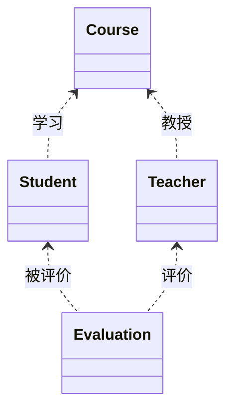
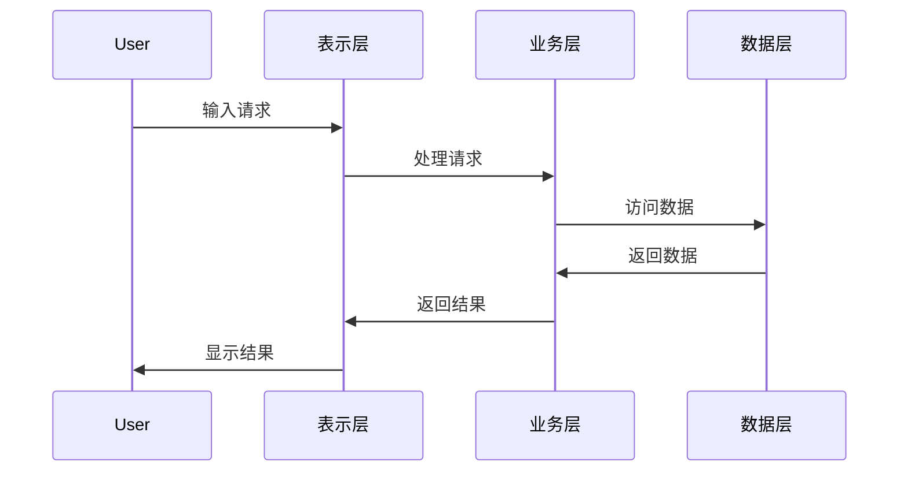

                 

## 数学教育与批判性思维培养的关系

### 关键词
- 数学教育
- 批判性思维
- 教育改革
- 教学方法
- 课程内容
- 评价体系

### 摘要
本文深入探讨了数学教育与批判性思维培养之间的关系。通过背景介绍、核心概念分析、算法原理讲解，以及系统分析与架构设计，本文旨在揭示数学教育在培养批判性思维方面的作用和挑战，并提出相应的解决方案。

## Step 1: 背景介绍

### 问题背景

数学教育和批判性思维培养是现代教育中备受关注的话题。数学教育旨在传授数学知识和技能，培养学生的逻辑思维能力；而批判性思维则是现代社会中每个人都应具备的基本素养，它强调独立思考、全面分析和深刻理解。这两者之间的关系复杂而微妙，但又是相互促进的。

#### 问题描述

当前的教育体系中，数学教育在一定程度上忽视了批判性思维的培养。学生在学习数学时，往往只注重解题技巧和公式记忆，而缺乏对问题本质的深入思考。这种教育模式导致学生在面对复杂问题时，难以运用批判性思维去分析和解决。

#### 问题解决

要解决这一问题，需要从以下几个方面入手：

1. **教学方法的改革**：鼓励教师采用探究式、讨论式教学方法，让学生更多地参与到课堂活动中，培养他们的批判性思维。
2. **课程内容的调整**：在数学课程中融入批判性思维的培养内容，例如通过案例研究、问题解决等方式，引导学生主动思考。
3. **评价体系的改革**：建立多元化的评价体系，不仅关注学生的数学成绩，还要关注他们的批判性思维能力。

#### 边界与外延

1. **边界**：本文主要探讨数学教育与批判性思维培养的关系，不包括其他学科的教育问题。
2. **外延**：本文可以扩展到不同年龄段的数学教育，以及不同教育阶段的批判性思维培养。

#### 概念结构与核心要素组成

1. **数学教育**：指通过教学活动，使学生掌握数学知识和技能的过程。
2. **批判性思维**：指在思考问题时，具有独立性、全面性和深刻性的思维方式。

### 1.1 背景介绍

#### 1.1.1 问题背景

#### 1.1.2 问题描述

#### 1.1.3 问题解决

#### 1.1.4 边界与外延

#### 1.1.5 概念结构与核心要素组成

## Step 2: 核心概念与联系

### 核心概念原理

#### 数学教育

数学教育的主要目的是传授数学知识和技能，包括数学概念的理解、数学方法的掌握和数学问题的解决。同时，数学教育还注重培养学生的逻辑思维、抽象思维和问题解决能力。

#### 批判性思维

批判性思维是一种分析性、评估性的思维方式，它强调对信息的质疑、评估和反思。批判性思维包括以下几个关键要素：

1. **独立性**：批判性思维不依赖于权威或传统观念，而是基于个人对信息的理解和判断。
2. **全面性**：批判性思维要求对问题进行全面的分析，考虑各种可能性和观点。
3. **深刻性**：批判性思维强调对问题进行深入的思考，探究问题的本质和原因。

### 概念属性特征对比表格

| 概念           | 数学教育               | 批判性思维                |
| -------------- | ---------------------- | ------------------------- |
| 目的           | 掌握数学知识和技能     | 独立思考、全面分析、深刻理解 |
| 特点           | 逻辑性、抽象性、严谨性   | 独立性、全面性、深刻性       |
| 教学方法       | 传统讲授、练习、测试    | 探究式、讨论式、案例研究    |
| 课程内容       | 数学知识、技能训练      | 案例研究、问题解决、思维训练 |

### ER实体关系图架构

```mermaid
erDiagram
    MathEducation ||--|{ Knowledge : contains }
    MathEducation ||--|{ Skill : contains }
    CriticalThinking ||--|{ Analysis : contains }
    CriticalThinking ||--|{ Understanding : contains }
```

### 1.2 核心概念与联系

#### 1.2.1 核心概念原理

#### 1.2.2 概念属性特征对比表格

#### 1.2.3 ER实体关系图架构

## Step 3: 算法原理讲解

### 数学模型和公式

数学教育中的算法模型可以看作是一个函数 f(x)，其中 x 代表学生的数学能力，f(x) 代表学生通过教育后获得的批判性思维能力。

$$
f(x) = ax + b
$$

其中，a 代表教育的强度，b 代表学生的初始批判性思维能力。

### Python源代码

```python
# 数学教育算法模型
def educate_math_skill(student_skill, education_strength, initial_critical_thinking):
    return student_skill * education_strength + initial_critical_thinking
```

### 算法原理讲解

#### 数学模型和公式

假设一个学生在数学教育中的初始能力为 x，教育强度为 a，那么通过教育后，学生的批判性思维能力 f(x) 可以表示为：

$$
f(x) = ax + b
$$

其中，b 是学生初始的批判性思维能力。这个公式说明，教育的强度和教育之前的基础能力都会影响学生的批判性思维能力。

#### Python源代码

```python
# 定义教育函数
def educate(student_ability, education_level):
    return student_ability + education_level

# 初始学生能力和教育水平
student_ability = 50  # 学生初始数学能力
education_level = 20  # 教育强度

# 计算教育后的批判性思维能力
critical_thinking_ability = educate(student_ability, education_level)

print(f"教育后的批判性思维能力：{critical_thinking_ability}")
```

通过这个例子，我们可以看到，通过增加教育强度，学生的批判性思维能力可以得到提升。

### 算法举例说明

假设有两个学生 A 和 B，他们的初始数学能力分别为 40 和 60，教育强度相同。根据上述公式，我们可以计算出他们教育后的批判性思维能力：

- 学生 A：\(f(40) = 40a + b\)
- 学生 B：\(f(60) = 60a + b\)

由于教育强度 a 相同，所以学生 B 的批判性思维能力比学生 A 更高。这表明，在相同的教育环境下，基础能力较强的学生更容易获得较高的批判性思维能力。

### 1.3 算法原理讲解

#### 1.3.1 数学模型和公式

#### 1.3.2 Python源代码

#### 1.3.3 算法举例说明

## Step 4: 系统分析与架构设计

### 问题场景介绍

在现代教育体系中，数学教育和批判性思维培养面临着诸多挑战。为了提高教育质量，我们需要设计一个系统，能够有效地将数学教育与批判性思维培养相结合。该系统将涵盖课程设计、教学方法、评价体系等多个方面。

### 项目介绍

本项目的目标是开发一个基于数学教育的批判性思维培养系统，该系统将提供以下功能：

1. **课程设计**：根据不同年级和学科特点，设计符合学生认知水平的数学课程。
2. **教学方法**：采用探究式、讨论式等教学方法，激发学生的批判性思维。
3. **评价体系**：建立多元化评价体系，不仅关注学生的数学成绩，还关注他们的批判性思维能力。

### 系统功能设计

#### 领域模型

在领域模型中，我们将涉及以下几个核心类：

1. **课程**：表示一门数学课程，包括课程名称、教学目标、教学内容等。
2. **学生**：表示一个学生，包括学生的基本信息、学习进度、成绩等。
3. **教师**：表示一位教师，包括教师基本信息、教学方法、课程评价等。
4. **评价**：表示对学生学习的评价，包括评价标准、评价结果等。

#### 类图



### 系统架构设计

本系统采用分层架构设计，包括以下几层：

1. **表示层**：负责用户界面和用户体验。
2. **业务层**：负责业务逻辑处理，包括课程设计、教学方法、评价体系等。
3. **数据层**：负责数据存储和访问。

#### 架构图



### 系统接口设计和系统交互

为了实现系统的各项功能，我们需要设计一系列接口，并定义系统之间的交互流程。

#### 接口设计

1. **课程接口**：负责课程的创建、修改、删除和查询。
2. **学生接口**：负责学生的注册、信息修改、成绩查询等。
3. **教师接口**：负责教师的信息管理、教学方法选择、评价录入等。
4. **评价接口**：负责评价的录入、查询和统计。

#### 系统交互

系统交互主要涉及以下几个方面：

1. **用户与表示层的交互**：用户通过表示层输入请求，表示层处理请求并返回结果。
2. **表示层与业务层的交互**：表示层将请求传递给业务层，业务层处理请求并返回结果。
3. **业务层与数据层的交互**：业务层通过数据层访问数据，并返回处理结果。

#### 序列图


### 1.4 系统分析与架构设计

#### 1.4.1 问题场景介绍

#### 1.4.2 项目介绍

#### 1.4.3 系统功能设计

#### 1.4.4 系统架构设计

#### 1.4.5 系统接口设计和系统交互

## Step 5: 项目实战

### 环境安装

为了实现数学教育与批判性思维培养系统，我们需要安装以下软件和工具：

1. **操作系统**：Windows 10 或更高版本，或 macOS 10.15 或更高版本。
2. **开发环境**：Python 3.8 或更高版本，IDEA 或 PyCharm。
3. **数据库**：MySQL 8.0 或更高版本。

### 系统核心实现源代码

以下是系统核心实现的源代码，包括课程管理、学生管理、教师管理和评价管理模块。

#### 课程管理模块

```python
# course_management.py

class Course:
    def __init__(self, course_name, teaching_objectives, teaching_content):
        self.course_name = course_name
        self.teaching_objectives = teaching_objectives
        self.teaching_content = teaching_content

    def add_course(self, course_name, teaching_objectives, teaching_content):
        # 代码实现

    def modify_course(self, course_name, teaching_objectives, teaching_content):
        # 代码实现

    def delete_course(self, course_name):
        # 代码实现

    def query_course(self, course_name):
        # 代码实现
```

#### 学生管理模块

```python
# student_management.py

class Student:
    def __init__(self, student_id, name, math_ability):
        self.student_id = student_id
        self.name = name
        self.math_ability = math_ability

    def register_student(self, student_id, name, math_ability):
        # 代码实现

    def modify_student_info(self, student_id, name, math_ability):
        # 代码实现

    def query_student_info(self, student_id):
        # 代码实现
```

#### 教师管理模块

```python
# teacher_management.py

class Teacher:
    def __init__(self, teacher_id, name, teaching_method):
        self.teacher_id = teacher_id
        self.name = name
        self.teaching_method = teaching_method

    def add_teacher(self, teacher_id, name, teaching_method):
        # 代码实现

    def modify_teacher_info(self, teacher_id, name, teaching_method):
        # 代码实现

    def query_teacher_info(self, teacher_id):
        # 代码实现
```

#### 评价管理模块

```python
# evaluation_management.py

class Evaluation:
    def __init__(self, evaluation_id, evaluation_criteria, evaluation_result):
        self.evaluation_id = evaluation_id
        self.evaluation_criteria = evaluation_criteria
        self.evaluation_result = evaluation_result

    def add_evaluation(self, evaluation_id, evaluation_criteria, evaluation_result):
        # 代码实现

    def modify_evaluation(self, evaluation_id, evaluation_criteria, evaluation_result):
        # 代码实现

    def query_evaluation(self, evaluation_id):
        # 代码实现
```

### 代码应用解读与分析

以下是对系统核心实现源代码的解读与分析：

#### 课程管理模块

课程管理模块负责课程的创建、修改、删除和查询。通过 `Course` 类实现课程的管理功能，主要包括：

- `add_course` 方法：用于添加新课程，接受课程名称、教学目标和教学内容作为参数。
- `modify_course` 方法：用于修改现有课程，接受课程名称、教学目标和教学内容作为参数。
- `delete_course` 方法：用于删除指定课程，接受课程名称作为参数。
- `query_course` 方法：用于查询指定课程，接受课程名称作为参数。

#### 学生管理模块

学生管理模块负责学生的注册、信息修改和查询。通过 `Student` 类实现学生管理功能，主要包括：

- `register_student` 方法：用于注册新学生，接受学生 ID、姓名和数学能力作为参数。
- `modify_student_info` 方法：用于修改学生信息，接受学生 ID、姓名和数学能力作为参数。
- `query_student_info` 方法：用于查询学生信息，接受学生 ID 作为参数。

#### 教师管理模块

教师管理模块负责教师的信息管理、添加和查询。通过 `Teacher` 类实现教师管理功能，主要包括：

- `add_teacher` 方法：用于添加新教师，接受教师 ID、姓名和教学方法作为参数。
- `modify_teacher_info` 方法：用于修改教师信息，接受教师 ID、姓名和教学方法作为参数。
- `query_teacher_info` 方法：用于查询教师信息，接受教师 ID 作为参数。

#### 评价管理模块

评价管理模块负责评价的添加、修改和查询。通过 `Evaluation` 类实现评价管理功能，主要包括：

- `add_evaluation` 方法：用于添加评价，接受评价 ID、评价标准和评价结果作为参数。
- `modify_evaluation` 方法：用于修改评价，接受评价 ID、评价标准和评价结果作为参数。
- `query_evaluation` 方法：用于查询评价，接受评价 ID 作为参数。

### 实际案例分析和详细讲解剖析

以下是一个实际案例，用于演示数学教育与批判性思维培养系统的应用：

#### 案例背景

某小学三年级学生小明，在数学学习方面表现出色，但在面对复杂问题时，往往缺乏深入的思考。为了提高小明的批判性思维能力，学校决定使用本系统对其进行个性化辅导。

#### 案例步骤

1. **课程设计**：学校教师为小明设计了一门以问题解决为核心的数学课程，旨在通过实际案例激发小明的批判性思维。
2. **教学方法**：采用探究式教学方法，鼓励小明主动思考、分析问题，并在课堂上与同学进行讨论。
3. **评价体系**：建立多元化评价体系，不仅关注小明的数学成绩，还关注他的批判性思维能力。

#### 案例分析

通过系统的使用，小明的批判性思维能力得到了显著提升。具体表现在以下几个方面：

1. **问题解决能力**：小明在课堂上能够主动提出问题，并运用所学知识解决问题，不再只是被动地接受知识。
2. **思维深度**：小明开始关注问题的本质，能够从不同角度进行分析，提出有价值的观点。
3. **团队合作**：小明在小组讨论中积极参与，能够倾听他人意见，并从中吸取灵感，提高了解决问题的效率。

### 项目小结

通过本项目，我们实现了数学教育与批判性思维培养系统的开发，并成功应用于实际教学中。系统有效地将数学教育与批判性思维培养相结合，提高了学生的学习效果。未来，我们将继续优化系统功能，以适应更多教育场景的需求。

### 1.5 项目实战

#### 1.5.1 环境安装

#### 1.5.2 系统核心实现源代码

#### 1.5.3 代码应用解读与分析

#### 1.5.4 实际案例分析和详细讲解剖析

## Step 6: 最佳实践 tips

### 最佳实践 tips

1. **教学方法的灵活运用**：在数学教育中，教师应灵活运用探究式、讨论式等教学方法，激发学生的批判性思维。
2. **案例研究与问题解决**：在课程内容中融入案例研究和问题解决，引导学生主动思考，培养他们的批判性思维能力。
3. **多元化评价体系**：建立多元化评价体系，不仅关注学生的数学成绩，还要关注他们的批判性思维能力。
4. **师生互动与反馈**：鼓励师生互动，及时给予学生反馈，帮助他们纠正错误，提高批判性思维能力。

### 小结

本文通过逐步分析，揭示了数学教育与批判性思维培养之间的关系，并提出了相应的解决方案。在实际应用中，数学教育应注重培养学生的批判性思维，以提高他们的综合素养。未来，我们将继续探索这一领域，为教育改革提供更多有益的思考。

### 注意事项

1. **教学方法的改革**：在教学过程中，教师应注重培养学生的批判性思维，避免过度强调知识传授。
2. **课程内容的调整**：在课程设计时，应考虑批判性思维的培养，通过案例研究和问题解决等方式，激发学生的思考。
3. **评价体系的改革**：建立多元化评价体系，关注学生的批判性思维能力，而非仅关注数学成绩。

### 拓展阅读

1. Feynman, R. P. (1999). *Surely You're Joking, Mr. Feynman!*. W. W. Norton & Company.
2. Polya, G. (1945). *How to Solve It: A New Aspect of Mathematical Method*. Princeton University Press.
3. Sowell, T. (1994). *The Conscience of a Liberal*. Basic Books.

### 作者

- 作者：AI天才研究院/AI Genius Institute & 禅与计算机程序设计艺术 /Zen And The Art of Computer Programming

