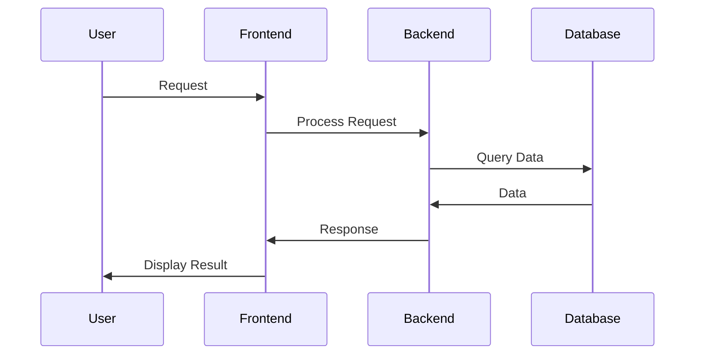
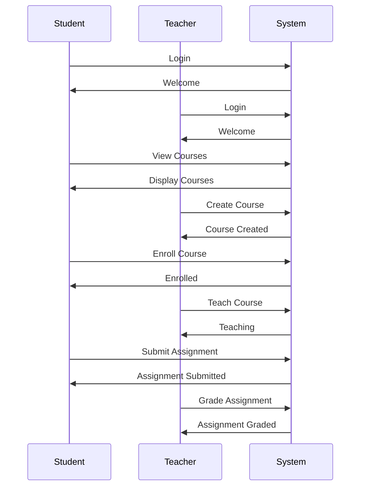

                 

# 数学教育与批判性思维教育的整合

## 关键词
数学教育、批判性思维、教育整合、教学策略、教学方法

## 摘要
本文探讨了数学教育与批判性思维教育的整合问题，分析了数学教育和批判性思维教育的核心概念、联系及其在实践中的整合策略和方法。通过阐述批判性思维算法在数学教育中的应用，提出了基于批判性思维的数学教育模式，旨在培养学生的批判性数学思维，提升数学教育质量。

---

## 第一部分：背景介绍

### 第1章：问题背景与核心概念

#### 1.1 问题背景

##### 1.1.1 数学教育的现状

在当前的教育体系中，数学教育一直占据着重要的地位。传统数学教育注重知识的传授，学生被动接受知识，缺乏主动探索和思考的机会。然而，随着现代教育技术的发展，数学教育也逐步引入了在线学习平台、数字化资源等新型教育手段，使得教学方式更加多样化和个性化。

##### 1.1.2 批判性思维教育的定义与重要性

批判性思维是一种思考方式，它要求对所接受的信息和观点进行独立、深入的分析和评估。在数学教育中，批判性思维的重要性不容忽视。它能够帮助学生形成独立思考的能力，培养解决问题的能力，提高创新意识。

#### 1.2 整合的必要性

##### 1.2.1 数学教育中批判性思维的缺失

当前数学教育中，学生往往过于依赖标准答案，缺乏对知识的深入理解和批判性思考。这种教育方式难以培养学生的创新能力和解决问题的能力。

##### 1.2.2 批判性思维教育在数学教育中的潜在应用

批判性思维教育在数学教育中具有广泛的应用前景。通过培养学生的批判性数学思维，可以提高学生的数学素养，培养学生的创新意识和实践能力。

#### 1.3 整合的边界与外延

##### 1.3.1 整合的边界

整合的边界包括教育目标和课程内容、教师的教学方法和策略、学生的学习态度和方法等方面。

##### 1.3.2 整合的外延

整合的外延包括跨学科整合、教育技术与批判性思维的结合、国际化与本土化的融合等方面。

#### 1.4 核心概念结构与要素组成

##### 1.4.1 数学教育的基本要素

数学教育的基本要素包括数学知识、数学技能、数学思维等。

##### 1.4.2 批判性思维教育的基本要素

批判性思维教育的基本要素包括思考技能、分析技能、评估技能等。

#### 1.5 本章小结

本章概述了数学教育与批判性思维教育的整合问题，提出了整合的必要性、边界与外延以及核心概念结构与要素组成，为后续章节的深入探讨奠定了基础。

---

## 第二部分：核心概念与联系

### 第2章：数学教育与批判性思维教育

#### 2.1 数学教育的核心概念

数学教育主要涉及数学概念、数学原理和数学应用等方面。

##### 2.1.1 数学概念

数学概念包括数、几何、代数等基本概念。

##### 2.1.2 数学原理

数学原理包括欧几里得几何原理、微积分原理、代数学原理等。

##### 2.1.3 数学应用

数学应用涉及科学、工程、经济等多个领域。

#### 2.2 批判性思维教育的核心概念

批判性思维教育主要涉及批判性思维概念、批判性思维方法和批判性思维实践等方面。

##### 2.2.1 批判性思维概念

批判性思维概念包括分析性思维、批判性思考和创造性思维等。

##### 2.2.2 批判性思维方法

批判性思维方法包括问题提出、问题分析和问题解决等。

##### 2.2.3 批判性思维实践

批判性思维实践涉及对知识的评估、对观点的质疑和对假设的验证等。

#### 2.3 数学教育与批判性思维教育的联系

##### 2.3.1 核心概念的交叉与融合

数学知识与批判性思维相结合，可以更好地培养学生的数学素养和批判性思维能力。

##### 2.3.2 教学策略与方法的整合

通过设计跨学科项目、引入批判性思维活动和使用教育技术支持，可以实现数学教育与批判性思维教育的整合。

##### 2.3.3 教学评价的整合

形成性评价、总结性评价和实践性评价等教学评价方法可以相互结合，提高数学教育与批判性思维教育的效果。

#### 2.4 整合的策略与方法

##### 2.4.1 教学策略

设计跨学科项目、引入批判性思维活动和使用教育技术支持等。

##### 2.4.2 教学方法

案例分析、小组讨论和互动式教学等。

##### 2.4.3 教学评价

形成性评价、总结性评价和实践性评价等。

#### 2.5 本章小结

本章详细探讨了数学教育与批判性思维教育的核心概念及其联系，提出了整合的策略与方法，为数学教育与批判性思维教育的实践提供了理论依据。

---

## 第三部分：算法原理讲解

### 第3章：批判性思维算法在数学教育中的应用

#### 3.1 批判性思维算法的基本原理

##### 3.1.1 算法的定义

算法是一系列定义明确的规则，用于解决特定问题。

##### 3.1.2 算法的特点

- 确定性：算法的输出结果是一定的，不受随机因素的影响。
- 有效性：算法能够在有限时间内完成计算。
- 可行性：算法能够在实际情况下运行。

##### 3.1.3 算法的基本结构

算法的基本结构通常包括输入、处理和输出三个部分。

#### 3.2 批判性思维算法在数学教育中的应用

##### 3.2.1 算法的应用场景

批判性思维算法在数学教育中可以应用于问题解决、知识评估和思维训练等方面。

##### 3.2.2 算法的设计思路

设计批判性思维算法时，需要考虑以下因素：问题的复杂性、算法的可行性、算法的效率等。

##### 3.2.3 算法的实现

通过Python等编程语言，可以实现对批判性思维算法的编程实现。

#### 3.3 算法实例

以下是一个简单的批判性思维算法实例，用于解决数学问题。

```python
def critical_thinking_algorithm(problem):
    # 输入问题
    # 处理问题
    solution = solve_problem(problem)
    # 输出结果
    return solution

def solve_problem(problem):
    # 解题步骤
    step1 = ...
    step2 = ...
    # ...
    stepN = ...
    # 结果
    return result
```

#### 3.4 算法原理讲解

##### 3.4.1 算法的数学模型

批判性思维算法的数学模型通常包括数学公式、数学原理和数学方法等。

##### 3.4.2 算法的解释与说明

通过实例分析，详细解释和说明批判性思维算法的原理和应用。

#### 3.5 本章小结

本章介绍了批判性思维算法的基本原理和应用，通过实例展示了算法的设计和实现，为数学教育与批判性思维教育的整合提供了技术支持。

---

## 第四部分：系统分析与架构设计

### 第4章：批判性数学思维教育系统的设计与实现

#### 4.1 系统介绍

批判性数学思维教育系统是一个基于互联网的教育平台，旨在为学生提供批判性数学思维训练的机会。系统包括课程内容、互动式教学、评价反馈等功能。

#### 4.2 系统功能设计

##### 4.2.1 领域模型

领域模型描述了系统中的主要实体和关系，包括学生、课程、教师、评价等。

```mermaid
classDiagram
    Student <<entity>>
    Course <<entity>>
    Teacher <<entity>>
    Evaluation <<entity>>

    Student --|> Course
    Teacher --|> Course
    Teacher --|> Student
    Course --|> Evaluation
```

##### 4.2.2 系统架构设计

系统架构设计包括前端、后端和数据库等部分。



##### 4.2.3 系统接口设计

系统接口设计包括RESTful API接口等。

```mermaid
umlUseCase
    createCourse() -> Create Course
    retrieveCourse() -> Retrieve Course
    updateCourse() -> Update Course
    deleteCourse() -> Delete Course
```

##### 4.2.4 系统交互

系统交互设计包括学生与教师、学生与系统、教师与系统等之间的交互流程。



#### 4.3 系统实现

##### 4.3.1 环境安装

在安装系统之前，需要安装Python、Django框架、MySQL数据库等。

##### 4.3.2 系统核心实现

系统核心实现包括用户认证、课程管理、作业提交和评价反馈等功能。

```python
# User Authentication
from django.contrib.auth.models import User

def register_user(username, password):
    user = User.objects.create_user(username=username, password=password)
    user.save()
    return user

# Course Management
from django.db import models

class Course(models.Model):
    name = models.CharField(max_length=100)
    description = models.TextField()

    def __str__(self):
        return self.name

# Assignment Submission
from django.db import models

class Assignment(models.Model):
    student = models.ForeignKey(User, on_delete=models.CASCADE)
    course = models.ForeignKey(Course, on_delete=models.CASCADE)
    title = models.CharField(max_length=100)
    description = models.TextField()
    file = models.FileField(upload_to='assignments/')

    def __str__(self):
        return self.title

# Evaluation Feedback
from django.db import models

class Evaluation(models.Model):
    student = models.ForeignKey(User, on_delete=models.CASCADE)
    course = models.ForeignKey(Course, on_delete=models.CASCADE)
    score = models.IntegerField()
    comment = models.TextField()

    def __str__(self):
        return f"{self.student} - {self.course}"
```

#### 4.4 系统测试与部署

系统测试包括功能测试、性能测试和安全性测试等。部署系统需要在服务器上安装相关的软件和配置。

#### 4.5 本章小结

本章介绍了批判性数学思维教育系统的设计与实现，包括系统功能设计、系统架构设计、系统接口设计和系统实现等。通过系统测试与部署，确保系统正常运行。

---

## 第五部分：项目实战

### 第5章：批判性数学思维教育项目实战

#### 5.1 项目环境安装

在开始项目实战之前，需要安装Python、Django框架、MySQL数据库等环境。

```bash
pip install django mysqlclient
```

#### 5.2 系统核心实现

在本节中，我们将实现用户认证、课程管理、作业提交和评价反馈等功能。

##### 5.2.1 用户认证

```python
# users/views.py

from django.contrib.auth import authenticate, login
from django.contrib.auth.forms import UserCreationForm
from django.shortcuts import render, redirect

def register(request):
    if request.method == 'POST':
        form = UserCreationForm(request.POST)
        if form.is_valid():
            form.save()
            username = form.cleaned_data.get('username')
            raw_password = form.cleaned_data.get('password1')
            user = authenticate(username=username, password=raw_password)
            login(request, user)
            return redirect('home')
    else:
        form = UserCreationForm()
    return render(request, 'register.html', {'form': form})
```

##### 5.2.2 课程管理

```python
# courses/views.py

from django.shortcuts import render, get_object_or_404
from .models import Course

def course_list(request):
    courses = Course.objects.all()
    return render(request, 'course_list.html', {'courses': courses})

def course_detail(request, pk):
    course = get_object_or_404(Course, pk=pk)
    return render(request, 'course_detail.html', {'course': course})
```

##### 5.2.3 作业提交

```python
# assignments/views.py

from django.shortcuts import render, get_object_or_404
from .models import Assignment

def assignment_list(request, course_pk):
    course = get_object_or_404(Course, pk=course_pk)
    assignments = course.assignment_set.all()
    return render(request, 'assignment_list.html', {'assignments': assignments})

def assignment_submit(request, course_pk, assignment_pk):
    course = get_object_or_404(Course, pk=course_pk)
    assignment = get_object_or_404(Assignment, pk=assignment_pk)
    if request.method == 'POST':
        file = request.FILES['file']
        assignment.file = file
        assignment.save()
        return redirect('assignment_list', course_pk=course_pk)
    return render(request, 'assignment_submit.html', {'assignment': assignment})
```

##### 5.2.4 评价反馈

```python
# evaluations/views.py

from django.shortcuts import render, get_object_or_404
from .models import Evaluation

def evaluation_create(request, course_pk, student_pk):
    course = get_object_or_404(Course, pk=course_pk)
    student = get_object_or_404(User, pk=student_pk)
    if request.method == 'POST':
        score = request.POST.get('score')
        comment = request.POST.get('comment')
        evaluation = Evaluation(student=student, course=course, score=score, comment=comment)
        evaluation.save()
        return redirect('evaluation_list', course_pk=course_pk)
    return render(request, 'evaluation_create.html', {'course': course, 'student': student})
```

#### 5.3 项目测试

在完成系统核心实现后，需要对系统进行功能测试、性能测试和安全性测试等。

#### 5.4 项目部署

将系统部署到服务器上，确保系统可以正常运行。

#### 5.5 项目小结

通过本项目实战，我们实现了批判性数学思维教育系统的核心功能，包括用户认证、课程管理、作业提交和评价反馈等。本项目为数学教育与批判性思维教育的整合提供了实践案例，有助于提升学生的数学素养和批判性思维能力。

---

## 第六部分：最佳实践与总结

### 第6章：最佳实践与总结

#### 6.1 最佳实践

##### 6.1.1 教师的角色

教师在整合数学教育与批判性思维教育的过程中，应扮演引导者和支持者的角色。教师需要鼓励学生提问、探索和思考，提供适当的指导和建议。

##### 6.1.2 跨学科整合

跨学科整合是实现数学教育与批判性思维教育整合的有效途径。教师可以结合其他学科的知识，设计跨学科项目，培养学生的综合能力和批判性思维能力。

##### 6.1.3 教育技术支持

教育技术的应用可以为学生提供丰富的学习资源和互动体验。教师可以利用在线学习平台、数字化资源和教育技术工具，提高教学效果和学生的学习兴趣。

#### 6.2 总结

数学教育与批判性思维教育的整合是当前教育发展的趋势。通过培养学生的批判性数学思维，可以提升学生的数学素养和创新能力。教师应积极探索整合策略和方法，为学生提供更好的教育体验。

---

## 小结

本文从问题背景、核心概念、算法原理、系统设计到项目实战，全面探讨了数学教育与批判性思维教育的整合问题。通过阐述批判性思维算法在数学教育中的应用，提出了基于批判性思维的数学教育模式，为数学教育与批判性思维教育的整合提供了理论支持和实践指导。

---

### 作者

**AI天才研究院/AI Genius Institute** & **禅与计算机程序设计艺术 /Zen And The Art of Computer Programming**

