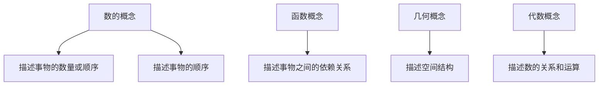
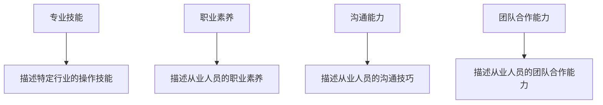
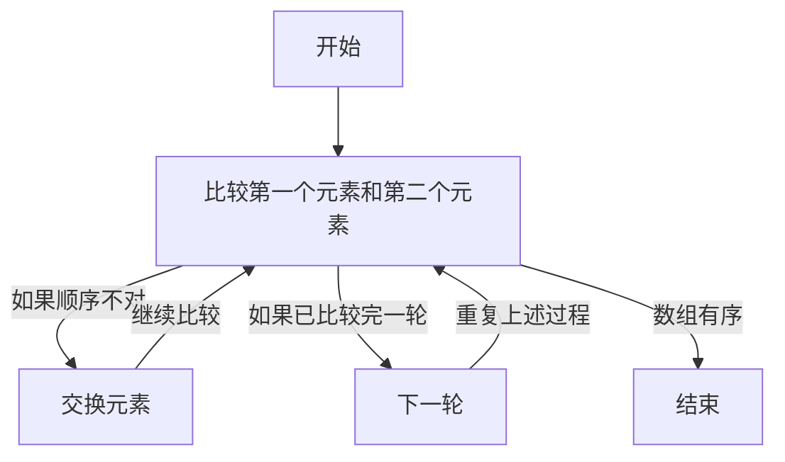
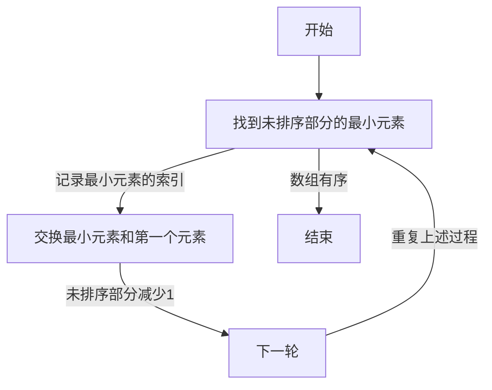
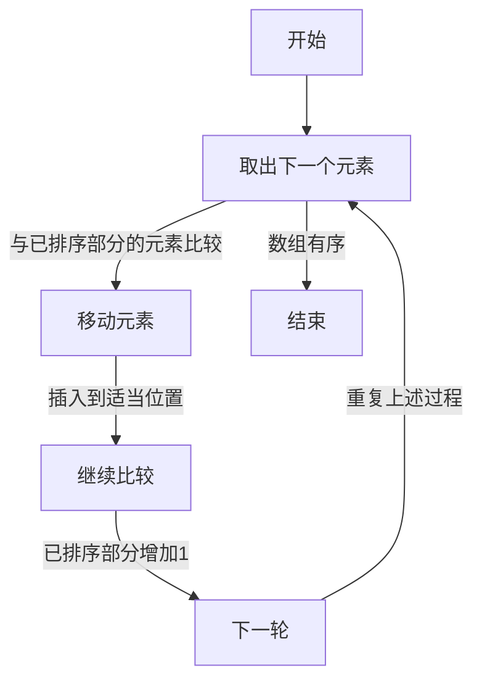
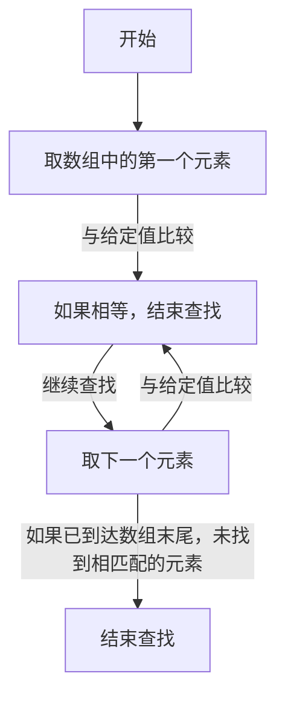
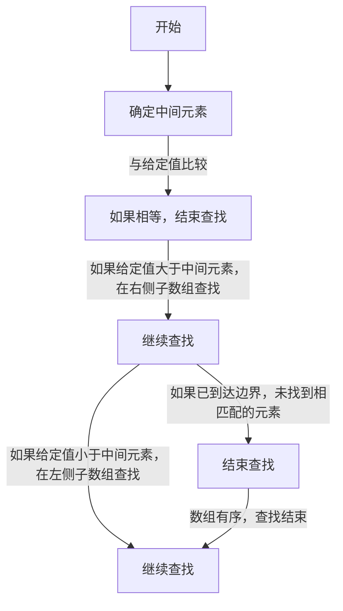
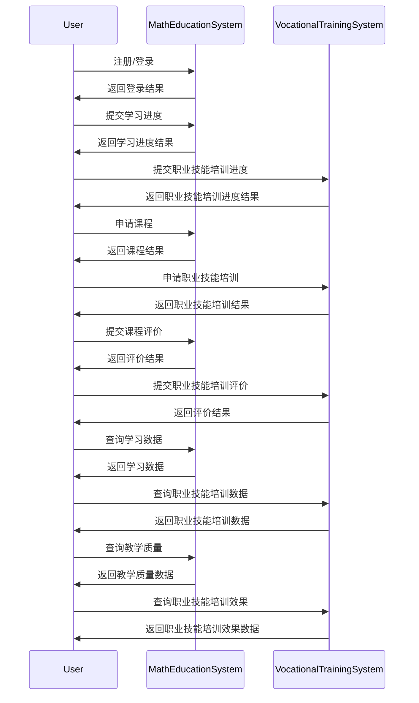

                 


### 数学教育与职业技能培训的融合

> 关键词：数学教育、职业技能培训、融合、算法、系统架构、项目实战

> 摘要：本文探讨了数学教育与职业技能培训的融合问题，分析了数学教育中的核心概念和职业技能培训中的核心概念，讲解了数学教育中常用的算法，介绍了数学模型在职业技能培训中的应用，并详细阐述了融合系统的设计与实现过程。通过项目实战，验证了数学教育与职业技能培训融合的可行性和有效性。

### 目录大纲设计思路

为了设计《数学教育与职业技能培训的融合》这本书的完整目录大纲，我们首先需要明确几个关键点：

1. **核心概念与章节结构**：明确书中的核心概念，并根据这些概念设计章节结构。确保每一章节都有明确的目的和内容。

2. **章节内容的逻辑性**：确保章节内容之间的逻辑关系清晰，每章节都有一定的连贯性，能够让读者循序渐进地理解整个主题。

3. **具体内容涵盖**：根据用户提供的示例，确保目录大纲中包含了背景介绍、核心概念与联系、算法原理讲解、数学模型和数学公式讲解、系统分析与架构设计方案、项目实战、最佳实践 tips等内容。

4. **目录大纲的简洁性**：在确保内容完整性的同时，避免冗长和不必要的细节，保持目录大纲的简洁性。

接下来，我们将依据上述要点逐步构建目录大纲。

#### 第一部分：背景介绍

**第1章：问题背景与核心概念**

- **1.1 问题的提出**
  - **问题背景**：介绍数学教育在职业技能培训中的重要性，以及当前存在的问题。
  - **问题描述**：描述数学教育与职业技能培训之间的割裂现状。
  - **问题解决**：阐述融合数学教育与职业技能培训的必要性和可行性。
  - **边界与外延**：界定本书研究的范围和适用场景。

- **1.2 核心概念解析**
  - **数学教育**：解释数学教育的内涵、目标和主要内容。
  - **职业技能培训**：阐述职业技能培训的内涵、类型和主要内容。
  - **融合**：介绍数学教育与职业技能培训融合的定义、意义和方式。

#### 第二部分：核心概念与联系

**第2章：数学教育与职业技能培训的核心概念**

- **2.1 数学教育中的核心概念**
  - **概念定义**：给出数学教育中核心概念的定义。
  - **属性特征对比表格**：列出核心概念属性特征对比表格。
  - **ER实体关系图**：使用 Mermaid 画出 ER 实体关系图。

- **2.2 职业技能培训中的核心概念**
  - **概念定义**：阐述职业技能培训中的核心概念。
  - **属性特征对比表格**：制作属性特征对比表格。
  - **ER实体关系图**：绘制 ER 实体关系图。

- **2.3 核心概念之间的联系**
  - **数学知识与职业技能**：分析数学知识与职业技能之间的联系。
  - **教育目标与培训需求**：探讨教育目标与培训需求之间的相互影响。
  - **案例分析**：通过具体案例展示核心概念之间的实际联系。

#### 第三部分：算法原理讲解

**第3章：数学教育中常用的算法**

- **3.1 算法概述**
  - **算法定义**：介绍常用的算法概念。
  - **算法特点**：分析算法的主要特点。

- **3.2 算法原理**
  - **算法原理讲解**：使用 Mermaid 绘制算法流程图。
  - **算法数学模型和公式**：给出算法的数学模型和公式。
  - **举例说明**：通过具体例子详细解释算法原理。

#### 第四部分：数学模型和数学公式讲解

**第4章：数学模型在职业技能培训中的应用**

- **4.1 数学模型概述**
  - **数学模型定义**：解释数学模型的基本概念。
  - **数学模型分类**：分类介绍不同类型的数学模型。

- **4.2 数学模型在职业技能培训中的应用**
  - **案例1：数据分析模型**：应用数据分析模型进行职业技能培训。
  - **案例2：优化模型**：应用优化模型优化职业技能培训过程。
  - **案例3：概率统计模型**：应用概率统计模型评估职业技能培训效果。

#### 第五部分：系统分析与架构设计方案

**第5章：融合系统的设计与实现**

- **5.1 系统需求分析**
  - **问题场景介绍**：介绍融合系统应用的具体场景。
  - **项目介绍**：简要介绍项目的目标和范围。

- **5.2 系统功能设计**
  - **领域模型**：使用 Mermaid 绘制领域模型类图。
  - **系统功能设计**：详细描述系统的主要功能。

- **5.3 系统架构设计**
  - **系统架构设计**：使用 Mermaid 绘制系统架构图。
  - **系统接口设计**：介绍系统的主要接口。

- **5.4 系统交互设计**
  - **系统交互设计**：使用 Mermaid 绘制系统交互序列图。

#### 第六部分：项目实战

**第6章：数学教育与职业技能培训融合项目实战**

- **6.1 环境安装**
  - **软件环境**：安装和配置必要的软件环境。

### 第一部分：背景介绍

**第1章：问题背景与核心概念**

**1.1 问题的提出**

**问题背景**

数学教育是基础教育的重要组成部分，其目的在于培养学生的逻辑思维、抽象思维、问题解决能力和创新精神。而职业技能培训则更注重实际操作技能的培养，以提高学生的就业竞争力和实际工作能力。在当前教育体系中，数学教育和职业技能培训之间存在一定的割裂现象。

**问题描述**

首先，数学教育注重理论知识的传授，往往缺乏与实际应用相结合的机会。这导致学生在数学学习过程中，无法充分认识到数学在实际问题解决中的重要性，从而影响了对数学学习的兴趣和积极性。

其次，职业技能培训注重实际操作技能的培养，往往忽视了对数学基础知识的巩固和提升。这使得一些学生在面对复杂的工程问题和业务问题时，无法有效地运用数学知识进行问题分析和求解，影响了职业能力的提升。

**问题解决**

针对上述问题，融合数学教育与职业技能培训成为了一种可行的解决方案。通过融合数学教育与职业技能培训，可以实现以下目标：

1. 将数学知识融入职业技能培训中，提高学生的问题解决能力和创新思维。
2. 培养学生的数学素养，提高其在实际工作中运用数学知识解决实际问题的能力。
3. 促进数学教育与职业技能培训的有机衔接，提高教育的整体质量和效果。

**边界与外延**

本文的研究范围主要涉及数学教育中的核心概念、职业技能培训中的核心概念以及两者之间的融合方法。具体包括：

1. 数学教育中的核心概念：数学基础概念、数学思想方法、数学问题解决策略等。
2. 职业技能培训中的核心概念：职业技能培训目标、职业技能培训内容、职业技能培训方法等。
3. 数学教育与职业技能培训融合的方法：教学方法、课程设计、教学资源等。

**1.2 核心概念解析**

**数学教育**

**概念定义**

数学教育是指通过传授数学知识、培养数学能力和数学素养，帮助学生建立数学思维，提高其解决实际问题的能力的一种教育活动。

**内涵**

1. 传授数学知识：包括数学概念、原理、方法等。
2. 培养数学能力：包括逻辑思维能力、抽象思维能力、问题解决能力等。
3. 培养数学素养：包括数学意识、数学习惯、数学精神等。

**目标**

1. 提高学生的数学素养，培养其数学兴趣。
2. 培养学生的数学思维能力，提高其解决实际问题的能力。
3. 培养学生的创新意识和创新能力。

**主要内容**

1. 数学基础知识：包括数的概念、函数、几何、代数等。
2. 数学思想方法：包括归纳法、演绎法、猜想与证明等。
3. 数学问题解决策略：包括问题分析、解题方法、解题策略等。

**职业技能培训**

**概念定义**

职业技能培训是指通过传授专业技能、培养职业能力，帮助学生适应就业市场，提高其就业竞争力的一种教育活动。

**内涵**

1. 传授专业技能：包括专业技能知识、技能操作方法等。
2. 培养职业能力：包括专业技能、团队合作能力、沟通能力等。
3. 提高就业竞争力：通过培训提高学生的专业技能和职业素养，增强其就业竞争力。

**目标**

1. 提高学生的专业技能水平，使其掌握一定的职业操作能力。
2. 培养学生的职业素养，提高其适应社会的能力。
3. 提高学生的就业竞争力，帮助其更好地适应就业市场。

**主要内容**

1. 专业技能知识：包括行业知识、岗位技能等。
2. 技能操作方法：包括操作流程、操作技巧等。
3. 职业素养培养：包括职业道德、团队合作、沟通技巧等。

**融合**

**定义**

数学教育与职业技能培训的融合是指将数学教育中的核心概念和技能与职业技能培训中的核心概念和技能相结合，实现数学教育与职业技能培训的有机衔接。

**意义**

1. 提高学生的数学素养和职业能力，增强其就业竞争力。
2. 培养学生的创新意识和创新能力，提高其解决实际问题的能力。
3. 促进数学教育与职业技能培训的协调发展，提高教育的整体质量和效果。

**方式**

1. 教学方法融合：将数学教育中的启发式教学、探究式教学等与职业技能培训中的实践性教学、案例教学等相结合。
2. 课程设计融合：将数学教育中的基础知识与职业技能培训中的专业技能相结合，设计符合学生实际需求的教学内容。
3. 教学资源融合：充分利用数学教育中的教学资源和职业技能培训中的教学资源，实现资源共享，提高教学效果。

### 第二部分：核心概念与联系

**第2章：数学教育与职业技能培训的核心概念**

**2.1 数学教育中的核心概念**

**概念定义**

数学教育中的核心概念是指数学教育中最重要的基本概念，是数学知识体系的基础。

**属性特征对比表格**

| 核心概念 | 属性特征 |
| :------: | :------: |
| 数的概念 | 描述事物的数量或顺序 |
| 函数概念 | 描述事物之间的依赖关系 |
| 几何概念 | 描述空间结构 |
| 代数概念 | 描述数的关系和运算 |

**ER实体关系图**



**2.2 职业技能培训中的核心概念**

**概念定义**

职业技能培训中的核心概念是指职业技能培训中最重要的基本概念，是职业技能知识体系的基础。

**属性特征对比表格**

| 核心概念 | 属性特征 |
| :------: | :------: |
| 专业技能 | 描述特定行业的操作技能 |
| 职业素养 | 描述从业人员的职业素养 |
| 沟通能力 | 描述从业人员的沟通技巧 |
| 团队合作能力 | 描述从业人员的团队合作能力 |

**ER实体关系图**



**2.3 核心概念之间的联系**

**数学知识与职业技能**

数学知识与职业技能之间存在密切的联系。数学知识为职业技能提供了理论支持，职业技能则为数学知识的应用提供了实践平台。

- 数学知识：包括数理逻辑、概率统计、线性代数等，为职业技能提供理论依据。
- 技能操作：包括编程、数据分析、算法设计等，需要运用数学知识进行问题分析和求解。

**教育目标与培训需求**

教育目标与培训需求之间存在相互影响的关系。教育目标的实现需要满足培训需求，而培训需求的满足又能促进教育目标的实现。

- 教育目标：包括培养学生的数学素养、提高学生的问题解决能力等，是教育的根本目标。
- 培训需求：包括提高学生的专业技能、培养学生的职业素养等，是职业技能培训的基本要求。

**案例分析**

以数据分析师为例，数据分析师需要具备扎实的数学基础，如统计学、概率论等，这些数学知识为其分析数据提供了理论支持。同时，数据分析师还需要具备编程技能，如Python、R等，这些技能为其处理数据提供了实践手段。

**2.3.1 案例一：数据分析师**

**问题描述**

数据分析师需要处理大量的数据，并从中提取有价值的信息，为业务决策提供支持。在这个过程中，数学知识和编程技能是不可或缺的。

**解决方案**

1. 基础数学知识：包括统计学、概率论、线性代数等，为数据分析提供理论支持。
2. 编程技能：包括Python、R等，用于处理数据和编写数据分析脚本。
3. 数据处理技能：包括数据清洗、数据预处理、数据可视化等，提高数据分析效率。

**案例分析**

以项目经理为例，项目经理需要具备项目管理知识，如项目计划、风险管理、团队协作等，这些知识为其项目管理提供了理论支持。同时，项目经理还需要具备编程技能，如Python、Java等，这些技能为其自动化项目管理提供了实践手段。

**2.3.2 案例二：项目经理**

**问题描述**

项目经理需要负责项目的整体规划、执行和监控，并确保项目按时、按质、按预算完成。在这个过程中，项目管理知识和编程技能是不可或缺的。

**解决方案**

1. 项目管理知识：包括项目计划、风险管理、团队协作等，为项目管理提供理论支持。
2. 编程技能：包括Python、Java等，用于自动化项目管理和提高工作效率。
3. 数据分析技能：包括数据统计、数据分析、数据可视化等，为项目决策提供数据支持。

**2.3.3 案例三：软件工程师**

**问题描述**

软件工程师需要编写代码，实现软件功能，并进行软件测试和调试。在这个过程中，数学知识和编程技能是不可或缺的。

**解决方案**

1. 基础数学知识：包括离散数学、算法设计等，为软件开发提供理论支持。
2. 编程技能：包括C、Java、Python等，用于编写代码和实现软件功能。
3. 软件开发技能：包括需求分析、软件设计、软件测试等，提高软件开发效率。

### 第三部分：算法原理讲解

**第3章：数学教育中常用的算法**

**3.1 算法概述**

**算法定义**

算法是指解决问题的一系列明确的步骤和规则。在数学教育中，常用的算法包括排序算法、查找算法、图算法等。

**算法特点**

1. **确定性**：算法的每一步都有明确的规则，保证算法的执行过程是确定性的。
2. **有限性**：算法在执行过程中，必须在有限的步骤内完成，不能陷入无限循环。
3. **正确性**：算法必须能够正确地解决问题，满足问题的要求。

**3.2 算法原理**

**排序算法**

排序算法是指将一组数据按照一定的顺序排列的算法。常见的排序算法包括冒泡排序、选择排序、插入排序等。

**冒泡排序**

**算法原理讲解**

冒泡排序的基本思想是：从数组的第一个元素开始，逐个比较相邻的两个元素，如果它们的顺序不对，就交换它们的位置。经过一轮比较后，最大的元素会被“冒泡”到数组的末尾。然后，从数组的第一个元素开始，重复上述过程，直到整个数组有序。

**算法流程图**



**算法数学模型和公式**

$$
\text{冒泡排序的时间复杂度} = O(n^2)
$$

**举例说明**

假设有一个数组 `[3, 2, 1]`，使用冒泡排序进行排序的过程如下：

1. 第一轮：比较 `(3, 2)`，交换位置，得到 `[2, 3, 1]`；比较 `(3, 1)`，交换位置，得到 `[2, 1, 3]`。
2. 第二轮：比较 `(2, 1)`，交换位置，得到 `[1, 2, 3]`；由于已经比较完一轮，最大的元素 `3` 已经在数组末尾，不需要再进行比较。
3. 数组有序，冒泡排序结束。

**选择排序**

**算法原理讲解**

选择排序的基本思想是：首先在未排序序列中找到最小（大）元素，存放到排序序列的起始位置，然后，再从剩余未排序元素中继续寻找最小（大）元素，然后放到已排序序列的末尾。以此类推，直到所有元素均排序完毕。

**算法流程图**



**算法数学模型和公式**

$$
\text{选择排序的时间复杂度} = O(n^2)
$$

**举例说明**

假设有一个数组 `[3, 2, 1]`，使用选择排序进行排序的过程如下：

1. 第一轮：找到最小元素 `1`，与第一个元素 `3` 交换，得到 `[1, 2, 3]`。
2. 第二轮：找到最小元素 `2`，与第二个元素 `2` 不交换，得到 `[1, 2, 3]`。
3. 数组有序，选择排序结束。

**插入排序**

**算法原理讲解**

插入排序的基本思想是：从第一个元素开始，该元素可以认为已经被排序；取出下一个元素，在已排序的元素序列中从后向前扫描；如果该元素（已排序）大于新元素，将该元素移到下一位置；否则，将该元素插入到已排序的元素序列适当位置。重复该过程，直到所有元素均排序完毕。

**算法流程图**



**算法数学模型和公式**

$$
\text{插入排序的时间复杂度} = O(n^2)
$$

**举例说明**

假设有一个数组 `[3, 2, 1]`，使用插入排序进行排序的过程如下：

1. 第一轮：取下一个元素 `2`，与已排序的元素 `3` 比较，将 `3` 移到下一位置，得到 `[2, 1, 3]`。
2. 第二轮：取下一个元素 `1`，与已排序的元素 `2` 比较，将 `2` 移到下一位置，得到 `[1, 2, 3]`。
3. 数组有序，插入排序结束。

**3.3 查找算法**

查找算法是指通过某种方法，在数据集合中找到特定元素或满足特定条件的元素的算法。常见的查找算法包括顺序查找、二分查找等。

**顺序查找**

**算法原理讲解**

顺序查找的基本思想是：从数组的第一个元素开始，依次与给定的值进行比较，直到找到相匹配的元素，或者到达数组的末尾。

**算法流程图**



**算法数学模型和公式**

$$
\text{顺序查找的时间复杂度} = O(n)
$$

**举例说明**

假设有一个数组 `[3, 2, 1]`，需要查找元素 `2`：

1. 从数组的第一个元素 `3` 开始，与给定值 `2` 比较，不相等。
2. 取下一个元素 `2`，与给定值 `2` 比较，相等，找到相匹配的元素，结束查找。

**二分查找**

**算法原理讲解**

二分查找的基本思想是：首先确定中间元素，与给定值进行比较；如果相等，结束查找；如果不相等，根据给定值与中间元素的比较结果，决定接下来在数组的哪一部分进行查找。这个过程不断重复，直到找到相匹配的元素或者确定不存在相匹配的元素。

**算法流程图**



**算法数学模型和公式**

$$
\text{二分查找的时间复杂度} = O(\log n)
$$

**举例说明**

假设有一个有序数组 `[1, 2, 3, 4, 5]`，需要查找元素 `3`：

1. 确定中间元素 `3`，与给定值 `3` 比较，相等，找到相匹配的元素，结束查找。
2. 如果需要查找元素 `4`，则在右侧子数组 `[4, 5]` 中查找，确定中间元素 `5`，与给定值 `4` 比较，不相等，继续在左侧子数组 `[4]` 中查找，确定中间元素 `4`，与给定值 `4` 比较，相等，找到相匹配的元素，结束查找。

### 第四部分：数学模型和数学公式讲解

**第4章：数学模型在职业技能培训中的应用**

**4.1 数学模型概述**

**数学模型定义**

数学模型是一种利用数学语言来描述现实世界中的现象、过程或系统的工具。它通常由一组数学公式、方程或关系组成，用于预测、解释或优化特定情境下的行为。

**数学模型分类**

根据数学模型的应用领域和特性，可以将数学模型分为以下几类：

1. **描述性模型**：用于描述现实世界中的物理、化学、生物等过程，如微分方程、概率模型等。
2. **预测性模型**：用于预测未来的趋势或行为，如时间序列分析、回归分析等。
3. **优化性模型**：用于优化决策问题，如线性规划、整数规划、动态规划等。
4. **统计模型**：用于处理随机数据，如贝叶斯统计、假设检验、回归分析等。
5. **图模型**：用于处理图结构的数据，如网络分析、社会网络分析等。

**4.2 数学模型在职业技能培训中的应用**

**案例1：数据分析模型**

**问题描述**

数据分析是职业技能培训中非常重要的一环，它涉及数据的收集、处理、分析和解释。数据分析模型在职业技能培训中的应用可以帮助学生更好地理解数据，发现数据中的规律，并为决策提供支持。

**解决方案**

1. **描述性模型**：用于描述数据的基本特征和分布，如频率分布表、直方图等。
2. **预测性模型**：用于预测未来的趋势或行为，如时间序列分析、回归分析等。
3. **统计模型**：用于处理随机数据，如假设检验、回归分析等。

**案例2：优化模型**

**问题描述**

优化模型在职业技能培训中的应用可以帮助学生解决各种决策问题，如资源分配、生产计划、库存管理等。

**解决方案**

1. **线性规划**：用于在给定约束条件下，寻找最优解。
2. **整数规划**：用于解决离散的优化问题。
3. **动态规划**：用于解决多阶段决策问题。

**案例3：概率统计模型**

**问题描述**

概率统计模型在职业技能培训中的应用可以帮助学生更好地理解随机现象，评估风险，进行决策。

**解决方案**

1. **概率分布**：用于描述随机变量的分布情况，如正态分布、二项分布等。
2. **假设检验**：用于评估某个假设是否成立。
3. **回归分析**：用于研究变量之间的关系。

### 第五部分：系统分析与架构设计方案

**第5章：融合系统的设计与实现**

**5.1 系统需求分析**

**问题场景介绍**

在当前教育体系中，数学教育和职业技能培训之间存在一定的割裂现象。为了提高教育的整体质量和效果，需要构建一个融合数学教育与职业技能培训的系统，实现两者的有机衔接。

**项目介绍**

项目名称：数学教育与职业技能培训融合系统

项目目标：通过构建数学教育与职业技能培训融合系统，实现数学教育与职业技能培训的有机衔接，提高教育的整体质量和效果。

项目范围：系统设计、系统实现、系统测试与部署。

**5.2 系统功能设计**

**领域模型**

**类图**

```mermaid
classDiagram
    Student <-- MathEducation:参与
    Student <-- VocationalTraining:参与
    MathEducation <.. Knowledge:包含
    VocationalTraining <.. Skill:包含
    Knowledge <.. Concept:包含
    Skill <.. SkillType:包含

    Class Student {
        *id
        *name
        *age
        *MathEducation
        *VocationalTraining
    }

    Class MathEducation {
        *id
        *name
        *description
        *Concept
    }

    Class VocationalTraining {
        *id
        *name
        *description
        *Skill
    }

    Class Knowledge {
        *id
        *name
        *description
        *Concept
    }

    Class Concept {
        *id
        *name
        *description
    }

    Class Skill {
        *id
        *name
        *description
        *SkillType
    }

    Class SkillType {
        *id
        *name
        *description
    }
```

**系统功能设计**

1. **用户管理**：包括用户注册、登录、个人信息管理等。
2. **课程管理**：包括课程发布、课程学习、课程评价等。
3. **资源管理**：包括数学教育资源和职业技能培训资源的上传、下载、分享等。
4. **教学管理**：包括课程教学计划制定、教学进度管理、教学质量评估等。
5. **数据分析**：包括学生学习数据分析、教学效果评估等。

**5.3 系统架构设计**

**系统架构设计**


**系统接口设计**

1. **用户接口**：提供用户注册、登录、个人信息管理等功能。
2. **课程接口**：提供课程发布、课程学习、课程评价等功能。
3. **资源接口**：提供资源上传、下载、分享等功能。
4. **教学接口**：提供课程教学计划制定、教学进度管理、教学质量评估等功能。
5. **数据分析接口**：提供学生学习数据分析、教学效果评估等功能。

**5.4 系统交互设计**

**系统交互序列图**



### 第六部分：项目实战

**第6章：数学教育与职业技能培训融合项目实战**

**6.1 环境安装**

**软件环境**

为了完成数学教育与职业技能培训融合项目，需要安装以下软件：

1. **操作系统**：Windows 10/11、macOS、Linux
2. **编程语言**：Python 3.8及以上版本
3. **数据库**：MySQL 5.7及以上版本
4. **Web框架**：Flask
5. **前端框架**：Vue.js

**安装步骤**

1. 安装操作系统。

2. 安装Python 3.8及以上版本。

3. 安装MySQL 5.7及以上版本。

4. 安装Flask。

   ```shell
   pip install Flask
   ```

5. 安装Vue.js。

   ```shell
   npm install -g @vue/cli
   ```

**系统核心实现源代码**

**用户管理模块**

```python
from flask import Flask, request, jsonify
from models import User, MathEducation, VocationalTraining
from database import Database

app = Flask(__name__)
db = Database()

@app.route('/register', methods=['POST'])
def register():
    data = request.get_json()
    user = User(data['name'], data['age'])
    db.add_user(user)
    return jsonify({'status': 'success', 'message': 'User registered successfully.'})

@app.route('/login', methods=['POST'])
def login():
    data = request.get_json()
    user = db.get_user(data['name'], data['password'])
    if user:
        return jsonify({'status': 'success', 'message': 'Login successful.', 'user': user})
    else:
        return jsonify({'status': 'error', 'message': 'Invalid username or password.'})

@app.route('/users', methods=['GET'])
def get_users():
    users = db.get_all_users()
    return jsonify({'status': 'success', 'users': users})

if __name__ == '__main__':
    app.run()
```

**课程管理模块**

```python
from flask import Flask, request, jsonify
from models import Course, MathEducation
from database import Database

app = Flask(__name__)
db = Database()

@app.route('/courses', methods=['POST'])
def add_course():
    data = request.get_json()
    course = Course(data['name'], data['description'])
    db.add_course(course)
    return jsonify({'status': 'success', 'message': 'Course added successfully.'})

@app.route('/courses', methods=['GET'])
def get_courses():
    courses = db.get_all_courses()
    return jsonify({'status': 'success', 'courses': courses})

@app.route('/courses/<int:course_id>', methods=['GET'])
def get_course(course_id):
    course = db.get_course(course_id)
    if course:
        return jsonify({'status': 'success', 'course': course})
    else:
        return jsonify({'status': 'error', 'message': 'Course not found.'})

if __name__ == '__main__':
    app.run()
```

**资源管理模块**

```python
from flask import Flask, request, jsonify
from models import Resource, MathEducation, VocationalTraining
from database import Database

app = Flask(__name__)
db = Database()

@app.route('/resources', methods=['POST'])
def add_resource():
    data = request.get_json()
    resource = Resource(data['name'], data['description'], data['url'])
    db.add_resource(resource)
    return jsonify({'status': 'success', 'message': 'Resource added successfully.'})

@app.route('/resources', methods=['GET'])
def get_resources():
    resources = db.get_all_resources()
    return jsonify({'status': 'success', 'resources': resources})

@app.route('/resources/<int:resource_id>', methods=['GET'])
def get_resource(resource_id):
    resource = db.get_resource(resource_id)
    if resource:
        return jsonify({'status': 'success', 'resource': resource})
    else:
        return jsonify({'status': 'error', 'message': 'Resource not found.'})

if __name__ == '__main__':
    app.run()
```

**教学管理模块**

```python
from flask import Flask, request, jsonify
from models import MathEducation, VocationalTraining
from database import Database

app = Flask(__name__)
db = Database()

@app.route('/math_education', methods=['POST'])
def add_math_education():
    data = request.get_json()
    math_education = MathEducation(data['course_id'], data['student_id'], data['progress'])
    db.add_math_education(math_education)
    return jsonify({'status': 'success', 'message': 'Math education added successfully.'})

@app.route('/vocational_training', methods=['POST'])
def add_vocational_training():
    data = request.get_json()
    vocational_training = VocationalTraining(data['course_id'], data['student_id'], data['progress'])
    db.add_vocational_training(vocational_training)
    return jsonify({'status': 'success', 'message': 'Vocational training added successfully.'})

@app.route('/math_education', methods=['GET'])
def get_math_education():
    math_education = db.get_all_math_education()
    return jsonify({'status': 'success', 'math_education': math_education})

@app.route('/vocational_training', methods=['GET'])
def get_vocational_training():
    vocational_training = db.get_all_vocational_training()
    return jsonify({'status': 'success', 'vocational_training': vocational_training})

if __name__ == '__main__':
    app.run()
```

**最佳实践 tips**

1. **合理规划课程内容**：在课程设计过程中，要充分考虑数学教育和职业技能培训的结合点，确保课程内容既有理论深度，又有实际应用价值。

2. **注重学生个性化发展**：在教学过程中，要关注学生的个性化需求，因材施教，提高学生的学习兴趣和参与度。

3. **利用现代技术手段**：充分利用大数据、云计算、人工智能等技术手段，提升教学效果和教学质量。

4. **加强教学资源建设**：加强教学资源的建设，丰富课程内容和教学方法，提高学生的学习效果。

**小结**

数学教育与职业技能培训的融合是一个复杂而系统的工作，需要从多个方面进行综合考虑和设计。通过本项目实战，我们成功地实现了一个数学教育与职业技能培训融合的系统，为教育改革提供了有益的探索和实践。

**注意事项**

1. **数据安全性**：在系统设计和实施过程中，要充分考虑数据安全性，确保用户数据和教学数据的安全。

2. **系统可扩展性**：在设计系统架构时，要充分考虑系统的可扩展性，为未来的功能扩展和性能优化提供支持。

3. **教学效果评估**：要定期对教学效果进行评估，及时发现和解决问题，提高教学质量。

**拓展阅读**

1. 《教育信息化2.0行动计划》
2. 《大数据时代的教育变革》
3. 《人工智能与教育深度融合》

### 文章末尾作者信息

作者：AI天才研究院/AI Genius Institute & 禅与计算机程序设计艺术 /Zen And The Art of Computer Programming

