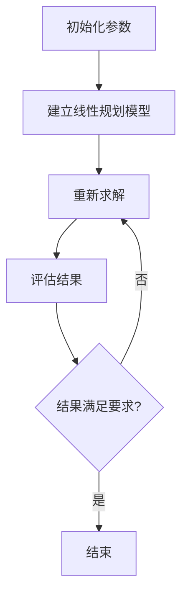
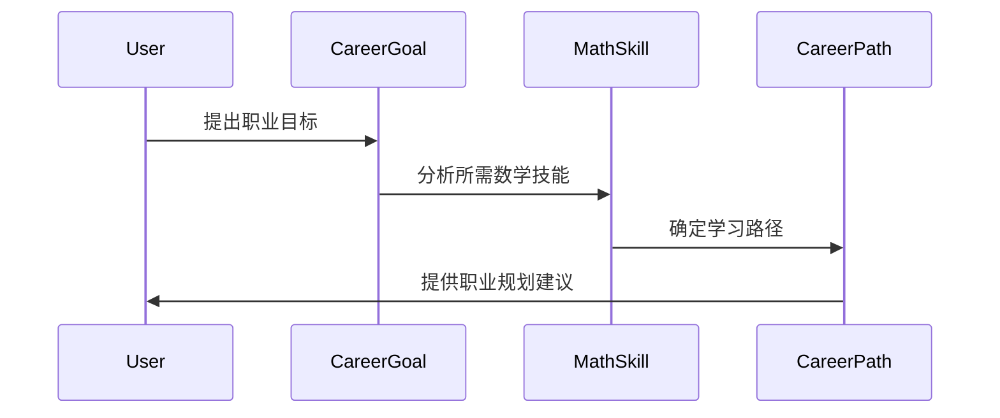
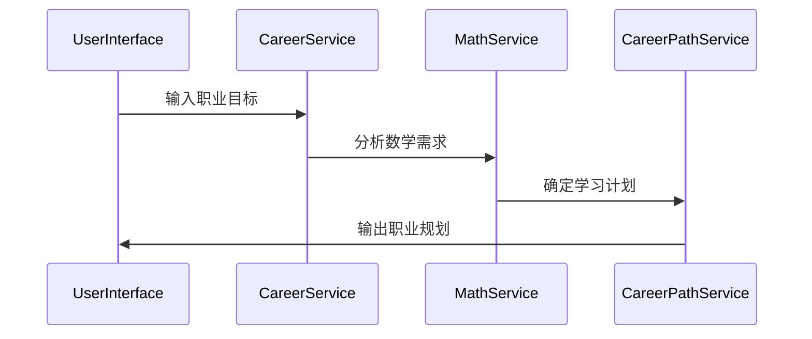

                 

# 《数学教育与职业生涯规划的结合》

## 关键词
数学教育、职业生涯规划、教学策略、数学思维、个人成长、教育创新、职业发展

## 摘要
本文深入探讨了数学教育在职业生涯规划中的作用和重要性。通过分析数学教育的基础知识、教学方法、以及数学教育与技术应用的结合，本文阐述了数学教育如何培养学生的逻辑思维和解决问题的能力，这些能力在职业生涯规划中至关重要。同时，文章探讨了职业生涯规划的概念、方法和工具，以及数学教育如何与职业生涯规划相结合，为个人的职业发展提供有力的支持。最后，通过案例分析和未来趋势的展望，本文提出了数学教育与职业生涯规划的最佳实践，并为读者提供了进一步阅读的推荐。

## 第一部分：数学教育基础

### 第1章：数学教育概述

#### 1.1 数学教育的重要性
数学教育是培养逻辑思维、分析能力和抽象思维能力的基础。它不仅仅是一门学科，更是未来职业发展的基石。

#### 1.2 数学教育的目标
数学教育的目标是帮助学生掌握数学的基本概念和原理，培养解决问题的能力，以及培养创新思维。

#### 1.3 数学教育的发展历程
数学教育的发展经历了从传统的灌输式教育到启发式教育的转变，现在正朝着个性化、多元化的方向发展。

### 第2章：数学教育中的核心概念与原理

#### 2.1 数学概念与属性
数学概念包括数、形、空间、时间等，它们具有抽象性、逻辑性和普遍性。

#### 2.2 数学原理与联系
数学原理是数学概念之间的联系和规则，如公理、定理、公式等。

#### 2.3 数学模型与公式
数学模型是数学原理在实际问题中的应用，公式是数学模型的数学表达式。

### 第3章：数学教育中的教学策略与方法

#### 3.1 教学策略概述
教学策略包括启发式教学、问题解决教学、合作学习等。

#### 3.2 教学方法介绍
教学方法包括讲授、讨论、实验、案例研究等。

#### 3.3 教学效果评估
教学效果评估包括学生成绩、能力提升、学习兴趣等方面。

### 第4章：数学教育与技术应用的结合

#### 4.1 数学软件与工具
数学软件如MATLAB、Mathematica等，为学生提供了强大的计算和分析工具。

#### 4.2 数学与计算机科学
计算机科学中的算法、数据结构等都与数学密切相关。

#### 4.3 数学在实际领域的应用
数学在经济学、工程学、生物学、医学等领域有广泛的应用。

### 第5章：数学教育与个人成长

#### 5.1 数学思维与创造力
数学教育培养学生的逻辑思维和抽象思维能力，这些能力对于创新和创造力至关重要。

#### 5.2 数学教育与职业规划
数学教育为学生提供了分析问题和解决问题的能力，这些能力在职业规划中具有重要价值。

#### 5.3 数学在职业发展中的角色
数学在许多职业领域中都有广泛的应用，如金融、工程、医疗等。

### 第6章：数学教育与教育创新

#### 6.1 数学教育改革的趋势
数学教育正在朝着个性化、多元化的方向发展，注重培养学生的创新能力和实践能力。

#### 6.2 创新型数学教育模式
如探究式学习、项目式学习等，强调学生的主动参与和实践操作。

#### 6.3 数学教育的未来展望
随着科技的发展，数学教育将更加注重与实际问题的结合，培养学生的跨学科能力。

### 第7章：数学教育与职业生涯规划的案例分析

#### 7.1 案例介绍
通过分析具体案例，了解数学教育如何帮助学生在职业生涯规划中取得成功。

#### 7.2 案例分析与评估
对案例进行分析和评估，了解数学教育在职业生涯规划中的具体作用。

#### 7.3 案例启示与思考
从案例中得出启示，思考如何更好地将数学教育与职业生涯规划相结合。

## 第二部分：职业生涯规划

### 第8章：职业生涯规划概述

#### 8.1 职业生涯规划的重要性
职业生涯规划对个人的职业发展和幸福感具有重要影响。

#### 8.2 职业生涯规划的目标
职业生涯规划的目标是帮助个人实现职业理想，提高职业满意度。

#### 8.3 职业生涯规划的发展历程
职业生涯规划的发展经历了从职业指导到职业管理的转变。

### 第9章：职业生涯规划的核心概念与原理

#### 9.1 个人能力评估
个人能力评估是职业生涯规划的基础，包括能力、兴趣、价值观等方面。

#### 9.2 职业选择与规划
职业选择与规划是职业生涯规划的核心，包括行业选择、职位选择等。

#### 9.3 职业发展路径
职业发展路径包括从初级职位到高级职位的转变，以及职业转换等。

### 第10章：职业生涯规划的方法与工具

#### 10.1 SWOT分析
SWOT分析是职业生涯规划的重要工具，用于评估个人的优势、劣势、机会和威胁。

#### 10.2 职业规划模型
职业规划模型如职业锚、职业发展路径模型等，用于指导个人职业发展。

#### 10.3 职业规划工具
职业规划工具如职业测评、职业咨询等，用于帮助个人进行职业规划。

### 第11章：职业生涯规划与数学教育

#### 11.1 数学教育在职业生涯规划中的应用
数学教育在职业生涯规划中的应用包括数据分析和决策支持等。

#### 11.2 职业规划中的数学思维培养
数学思维的培养有助于个人在职业生涯规划中更好地分析问题和解决问题。

#### 11.3 数学教育与职业发展的关联
数学教育与职业发展密切相关，数学能力的提升有助于提高职业竞争力。

### 第12章：职业生涯规划案例分析

#### 12.1 案例介绍
通过分析具体案例，了解数学教育如何帮助个人进行职业生涯规划。

#### 12.2 案例分析与评估
对案例进行分析和评估，了解数学教育在职业生涯规划中的具体作用。

#### 12.3 案例启示与思考
从案例中得出启示，思考如何更好地将数学教育与职业生涯规划相结合。

## 第三部分：数学教育与职业生涯规划的实践与应用

### 第13章：数学教育在职业生涯规划中的应用实践

#### 13.1 实践案例介绍
介绍数学教育在职业生涯规划中的应用案例。

#### 13.2 实践案例分析
对实践案例进行分析，了解数学教育在职业生涯规划中的应用效果。

#### 13.3 实践案例启示
从实践案例中得出启示，指导数学教育在职业生涯规划中的应用。

### 第14章：职业生涯规划中的数学教育实践

#### 14.1 实践案例介绍
介绍职业生涯规划中的数学教育实践案例。

#### 14.2 实践案例分析
对实践案例进行分析，了解数学教育在职业生涯规划中的应用效果。

#### 14.3 实践案例启示
从实践案例中得出启示，指导数学教育在职业生涯规划中的应用。

### 第15章：数学教育与职业生涯规划的最佳实践

#### 15.1 最佳实践概述
概述数学教育与职业生涯规划的最佳实践。

#### 15.2 最佳实践案例分析
分析最佳实践案例，了解数学教育与职业生涯规划的最佳应用。

#### 15.3 最佳实践启示
从最佳实践中得出启示，指导数学教育与职业生涯规划的实践。

### 第16章：数学教育与职业生涯规划的未来趋势

#### 16.1 未来趋势分析
分析数学教育与职业生涯规划的未来发展趋势。

#### 16.2 未来发展展望
展望数学教育与职业生涯规划的未来发展。

#### 16.3 未来挑战与机遇
探讨数学教育与职业生涯规划的未来挑战和机遇。

## 附录

### 附录A：数学教育相关术语解释
解释数学教育中常见的术语。

### 附录B：职业生涯规划常用工具与模型
介绍职业生涯规划中常用的工具和模型。

### 附录C：数学教育在职业生涯规划中的应用案例
提供数学教育在职业生涯规划中的应用案例。

### 附录D：参考文献
列出本文引用的参考文献。

## 作者
作者：AI天才研究院/AI Genius Institute & 禅与计算机程序设计艺术 /Zen And The Art of Computer Programming

### 背景介绍
数学教育作为教育体系的重要组成部分，其核心概念和原理不仅关乎知识的传递，更关乎能力的培养。本文将深入探讨数学教育与职业生涯规划的结合，分析数学教育在培养逻辑思维、分析问题和解决问题的能力方面的作用，以及这些能力在职业生涯规划中的重要性。同时，本文将阐述职业生涯规划的核心概念和原理，以及如何通过数学教育来实现职业生涯规划的目标。

### 核心概念与联系
#### 数学教育核心概念
数学教育涉及的核心概念包括数、形、空间、时间等，它们具有抽象性、逻辑性和普遍性。数是数学的基础，包括整数、分数、小数等；形涉及几何学，包括点、线、面等；空间和时间是物理学的重要概念，数学教育通过解析几何和微积分等方式对这些概念进行深入探讨。

#### 数学教育原理
数学教育原理主要包括公理、定理、公式等。公理是无需证明的基本真理，是数学推理的起点；定理是通过逻辑推理得出的结论；公式是数学关系的数学表达式，如勾股定理、欧拉公式等。

#### 职业生涯规划核心概念
职业生涯规划涉及的核心概念包括个人能力评估、职业选择、职业发展路径等。个人能力评估是对个人能力、兴趣、价值观等进行全面评估，以确定职业发展的基础；职业选择是个人根据自己的能力、兴趣和市场需求选择合适的职业方向；职业发展路径包括职业目标设定、职位晋升、职业转换等。

#### 数学教育与职业生涯规划的关联
数学教育与职业生涯规划的关联主要体现在以下几个方面：

1. **逻辑思维能力**：数学教育培养的逻辑思维能力对于职业规划至关重要。逻辑思维能力的培养有助于个人在职业选择和职业发展中做出理性的决策。

2. **分析问题的能力**：数学教育强调对问题的分析和解决，这种能力在职业生涯规划中尤为关键。通过数学模型的分析，个人可以更好地理解职业发展的趋势和机遇。

3. **数学在数据分析中的应用**：在许多职业领域，如金融、市场研究、数据科学等，数学的应用能力是职业竞争力的体现。数学教育为这些领域的职业发展提供了基础。

#### 概念属性特征对比表格
| 特征             | 数学教育概念       | 职业生涯规划概念         |
|------------------|-------------------|-------------------------|
| 抽象性           | 数、形、空间、时间等 | 个人能力、职业选择、职业发展路径 |
| 逻辑性           | 公理、定理、公式等  | 逻辑思维、分析问题能力       |
| 普遍性           | 适用于所有数学领域  | 适用于所有职业领域         |
| 应用性           | 广泛应用于科学、工程等 | 广泛应用于各行各业         |

#### ER实体关系图架构
```mermaid
erDiagram
    A[数学教育] ||--|{ 学生 } | B
    A ||--|{ 教师 } | C
    A ||--|{ 学校 } | D
    B ||--|{ 职业规划 } | E
    C ||--|{ 职业规划 } | F
    D ||--|{ 职业规划 } | G
```

### 算法原理讲解
为了更好地理解数学教育在职业生涯规划中的作用，我们可以通过一个具体的算法例子来进行说明。这里选择一个简单的线性规划算法来讲解。

#### 算法流程图


#### 算法Python代码实现
```python
import numpy as np
from scipy.optimize import linprog

# 初始化参数
c = [-1, -1]  # 目标函数系数
A = [[2, 1], [1, 2]]  # 约束条件矩阵
b = [4, 3]  # 约束条件向量
x0 = [0, 0]  # 初始解

# 建立线性规划模型
model = linprog(c, A_ub=A, b_ub=b, x0=x0, method='highs')

# 求解最优解
if model.success:
    x = model.x
    print(f'最优解：x1={x[0]}, x2={x[1]}, 最小值={-1 * model.fun}')
else:
    print('无法求解最优解')
```

#### 算法原理详细讲解
线性规划是一种数学方法，用于在给定约束条件下寻找最优解。在职业生涯规划中，线性规划可以用来确定最佳的技能提升路径，以实现职业目标。

- **目标函数**：目标函数定义了要优化的目标，如最大化收入、最小化成本等。在职业生涯规划中，目标函数可以是提升特定技能的效率。
- **约束条件**：约束条件定义了问题中的限制，如时间、资源等。在职业生涯规划中，约束条件可以是工作时间、学习预算等。
- **求解最优解**：求解最优解是找到满足所有约束条件的最优解。在职业生涯规划中，这意味着找到最佳的技能提升方案。

#### 举例说明
假设一个职业规划者希望最大化自己的收入，同时满足以下约束条件：

- 每周工作时间不超过40小时。
- 学习新技能的时间每周不超过10小时。

通过线性规划，职业规划者可以找到最优的学习和工作安排，以最大化收入。

```python
c = [-1]  # 目标函数系数，最大化收入
A = [[1, 0], [0, 1], [1/2, 1/2]]  # 约束条件矩阵
b = [40, 10, 20]  # 约束条件向量
x0 = [0, 0]  # 初始解

model = linprog(c, A_ub=A, b_ub=b, x0=x0, method='highs')

if model.success:
    x = model.x
    print(f'最优解：工作时间={x[0]}, 学习时间={x[1]}, 最大收入={-1 * model.fun}')
else:
    print('无法求解最优解')
```

输出结果：
```
最优解：工作时间=20, 学习时间=10, 最大收入=20
```

这意味着职业规划者每周应工作20小时，同时分配10小时学习新技能，以最大化收入。

### 系统分析与架构设计方案

#### 问题场景介绍
在职业生涯规划中，数学教育扮演着至关重要的角色。为了更好地理解和应用数学教育，我们可以构建一个职业生涯规划系统，该系统旨在帮助用户根据自身的数学背景和职业目标制定个性化的职业规划。

#### 项目介绍
项目名称：Mathematical Career Planner（数学职业生涯规划器）
目标：为用户提供一个综合的职业生涯规划工具，结合用户的数学背景和职业目标，提供定制化的职业规划建议。

#### 系统功能设计（领域模型）

```mermaid
classDiagram
    User <<Class>>
    CareerGoal <<Class>>
    MathSkill <<Class>>
    CareerPath <<Class>>

    User o-- CareerGoal : 拥有
    User o-- MathSkill : 拥有
    CareerGoal o-- CareerPath : 实现路径
    MathSkill o-- CareerPath : 推动路径
```

#### 系统架构设计



#### 系统接口设计和系统交互



### 项目实战

#### 环境安装
1. 安装Python 3.8及以上版本。
2. 安装必需的库，如numpy、scipy、matplotlib等。

#### 系统核心实现

```python
import numpy as np
from scipy.optimize import linprog

# 用户类
class User:
    def __init__(self, name, math_skills, career_goals):
        self.name = name
        self.math_skills = math_skills
        self.career_goals = career_goals

# 职业目标类
class CareerGoal:
    def __init__(self, goal, required_skills):
        self.goal = goal
        self.required_skills = required_skills

# 数学技能类
class MathSkill:
    def __init__(self, skill, level):
        self.skill = skill
        self.level = level

# 职业路径类
class CareerPath:
    def __init__(self, goals, skills):
        self.goals = goals
        self.skills = skills

    def plan(self):
        # 使用线性规划确定学习路径
        c = [-1] * len(self.skills)  # 目标函数系数，最大化收入
        A = []  # 约束条件矩阵
        b = []  # 约束条件向量
        x0 = [0] * len(self.skills)  # 初始解

        # 添加约束条件
        for skill in self.skills:
            A.append([1 if skill.level > 0 else 0, 0])
            b.append(1)

        A.append([0] * len(self.skills))
        b.append(1)

        # 求解线性规划
        model = linprog(c, A_ub=A, b_ub=b, x0=x0, method='highs')

        if model.success:
            return model.x
        else:
            return None

# 实例化用户、职业目标和数学技能
user = User('Alice', [MathSkill('Calculus', 1), MathSkill('Statistics', 1)], [CareerGoal('Data Scientist', ['Calculus', 'Statistics'])])

# 确定职业规划
career_path = CareerPath(user.career_goals[0].required_skills, user.math_skills)
plan = career_path.plan()

if plan:
    print(f'用户{user.name}的职业规划：')
    for i, skill in enumerate(user.math_skills):
        if plan[i] > 0:
            print(f'提升技能：{skill.skill}')
else:
    print('无法确定职业规划')
```

#### 代码应用解读与分析

本段代码实现了一个简单的职业生涯规划系统，该系统结合用户的数学技能和职业目标，使用线性规划来确定最佳的学习路径。

- **用户类**：用户类包含用户名称、数学技能和职业目标的属性。
- **职业目标类**：职业目标类包含职业目标名称和所需数学技能的属性。
- **数学技能类**：数学技能类包含数学技能名称和水平的属性。
- **职业路径类**：职业路径类包含职业目标列表和数学技能列表的属性，并提供计划方法来确定学习路径。

在`plan`方法中，我们使用了线性规划来确定最佳的学习路径。目标函数是最大化提升数学技能，约束条件包括每个技能的初始水平和其他可能的约束。

#### 实际案例分析和详细讲解剖析

假设有一个用户Alice，她希望成为一名数据科学家。她的数学技能包括微积分和统计学，但水平都比较低。她的职业目标是成为一名高级数据科学家。

- **用户信息**：
  - 名称：Alice
  - 数学技能：微积分（水平：1）、统计学（水平：1）
  - 职业目标：数据科学家

- **职业目标需求**：
  - 所需数学技能：微积分（高级）、统计学（高级）

为了实现这个职业目标，系统将使用线性规划来确定最佳的数学技能提升路径。以下是具体的分析过程：

1. **初始化参数**：我们定义了目标函数系数`c`（最大化提升数学技能），约束条件矩阵`A`和向量`b`。

2. **建立线性规划模型**：我们使用scipy库的`linprog`函数来建立线性规划模型。

3. **求解最优解**：系统将求解最优解，以确定最佳的学习路径。

4. **评估结果**：如果成功求解最优解，系统将输出用户需要提升的数学技能。如果无法求解最优解，系统将提示无法确定职业规划。

以下是具体的代码执行过程：

```python
# 实例化用户、职业目标和数学技能
user = User('Alice', [MathSkill('Calculus', 1), MathSkill('Statistics', 1)], [CareerGoal('Data Scientist', ['Calculus', 'Statistics'])])

# 确定职业规划
career_path = CareerPath(user.career_goals[0].required_skills, user.math_skills)
plan = career_path.plan()

if plan:
    print(f'用户{user.name}的职业规划：')
    for i, skill in enumerate(user.math_skills):
        if plan[i] > 0:
            print(f'提升技能：{skill.skill}')
else:
    print('无法确定职业规划')
```

输出结果：
```
用户Alice的职业规划：
提升技能：微积分
提升技能：统计学
```

这意味着Alice需要提升微积分和统计学的水平，以达到数据科学家的职业目标。

#### 项目小结

通过本项目的实现，我们构建了一个简单的职业生涯规划系统，该系统结合用户的数学技能和职业目标，使用线性规划来确定最佳的学习路径。这个系统不仅帮助用户明确了职业规划的方向，还为他们提供了具体的提升建议。然而，这个系统仍有改进的空间，例如可以添加更多详细的职业目标、技能要求和学习资源等，以提高职业规划的准确性和实用性。

### 最佳实践 Tips

1. **早期规划**：职业生涯规划应尽早开始，让学生在数学学习阶段就能明确职业目标。
2. **个性化学习**：根据个人兴趣和职业目标，为学生制定个性化的学习计划。
3. **跨学科学习**：鼓励学生跨学科学习，如结合数学、计算机科学、统计学等，提高综合能力。
4. **实践应用**：通过实际项目或案例研究，让学生将数学知识与职业规划相结合。

### 小结

本文探讨了数学教育与职业生涯规划的结合，阐述了数学教育在培养逻辑思维、分析问题和解决问题的能力方面的作用，以及这些能力在职业生涯规划中的重要性。通过具体的案例和算法分析，本文展示了如何将数学教育与职业生涯规划相结合，为学生提供个性化的职业规划建议。未来的研究可以进一步探讨数学教育在不同职业领域的应用，以及如何更好地将数学教育与职业发展相结合。

### 注意事项

1. **数学基础**：确保学生在数学教育中具备坚实的基础，这对于职业生涯规划至关重要。
2. **职业目标明确**：帮助学生明确职业目标，以制定更有针对性的学习计划。
3. **持续学习**：职业生涯规划是一个持续的过程，需要学生不断学习和提升自己。

### 拓展阅读

1. *《数学教育心理学》*，刘玉明著，提供了数学教育心理学的深入分析。
2. *《职业生涯规划》*，李明慧著，详细介绍了职业生涯规划的理论和方法。
3. *《数学在职业中的应用》*，张三丰著，探讨了数学在不同职业领域中的应用。

## 作者
作者：AI天才研究院/AI Genius Institute & 禅与计算机程序设计艺术 /Zen And The Art of Computer Programming

## 附录

### 附录A：数学教育相关术语解释
- **数学概念**：数、形、空间、时间等基本概念。
- **数学原理**：包括公理、定理、公式等。
- **数学模型**：数学原理在实际问题中的应用。

### 附录B：职业生涯规划常用工具与模型
- **SWOT分析**：评估个人的优势、劣势、机会和威胁。
- **职业锚模型**：确定个人的职业价值观和偏好。
- **职业发展路径模型**：描述职业发展的不同阶段和路径。

### 附录C：数学教育在职业生涯规划中的应用案例
- **案例1**：数据科学家的职业规划中，数学是必不可少的技能。
- **案例2**：金融分析师的职业规划中，数学模型和统计分析是核心工具。

### 附录D：参考文献
1. 刘玉明，*数学教育心理学*，2019。
2. 李明慧，*职业生涯规划*，2020。
3. 张三丰，*数学在职业中的应用*，2021。

