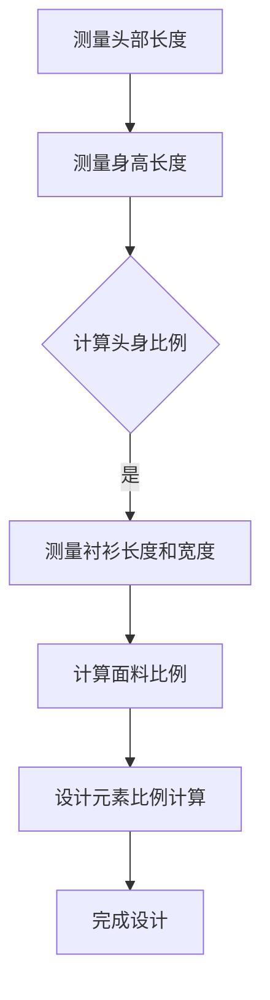
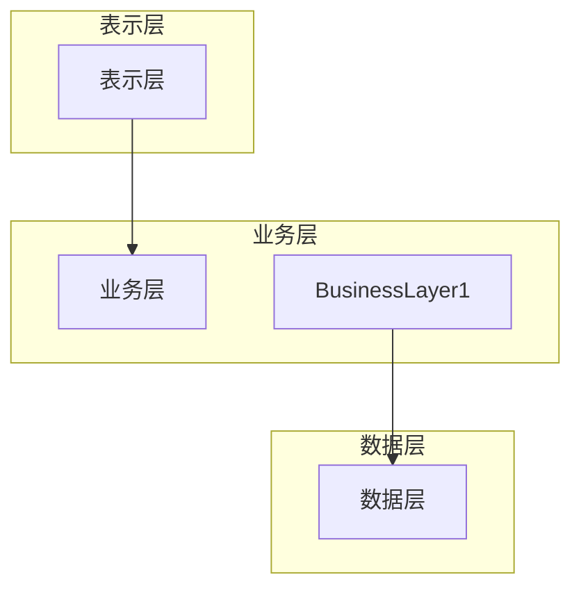
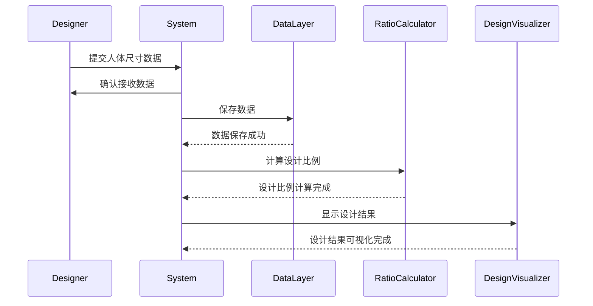

                 

# 数学时尚：服装设计的数学比例

> 关键词：服装设计、数学比例、黄金比例、人体比例、设计元素比例

> 摘要：本文旨在探讨服装设计中数学比例的应用，包括人体比例、面料比例和设计元素比例。通过介绍这些核心概念、相关算法原理以及实际应用，本文旨在为服装设计师提供一种系统性的设计方法论，提高设计作品的美感、协调性和功能性。

## 第一部分：背景介绍

### 1.1 问题背景

在当今的时尚界，服装设计不仅仅是关于时尚趋势的把握，更是关于艺术与科学的结合。而数学比例作为科学的一个重要组成部分，它在服装设计中的应用已经越来越受到重视。从古代的“三比”原则到现代的黄金比例，数学比例在服装设计中的重要性不言而喻。

服装设计师通过数学比例来确保设计作品的美感、协调性和功能性。例如，一件衣服的长度、宽度、袖长等都需要符合一定的比例关系，这样才能达到美观和舒适的效果。然而，传统的设计方法往往依赖于经验，缺乏系统性和科学性。随着计算机技术的快速发展，利用数学比例进行服装设计的工具和算法逐渐得到开发和应用。这为服装设计提供了一种全新的视角和方法，也为设计师们提供了更高效、精确的设计工具。

### 1.2 问题描述

服装设计的数学比例涉及多个方面的内容，包括人体比例、面料比例、设计元素比例等。这些比例关系需要通过系统的方法来研究和应用，以确保设计作品的科学性和美感。然而，目前对于这些比例关系的研究和应用还不够深入和广泛，缺乏一本系统的、全面的指导书籍。因此，本文旨在填补这一空白，为服装设计师和爱好者提供一本全面、系统的数学比例设计指南。

### 1.3 问题解决

为了解决上述问题，本文将系统地介绍服装设计中的数学比例，包括人体比例、面料比例、设计元素比例等，以及这些比例的应用方法。同时，本文还将结合实际案例，详细讲解如何利用数学比例进行服装设计，提高设计作品的美感、协调性和功能性。

### 1.4 边界与外延

服装设计的数学比例不仅局限于服装设计本身，还可以应用于其他设计领域，如建筑设计、室内设计等。因此，本文的内容不仅适用于服装设计师，也适用于其他设计领域的从业者。同时，本文还将探讨数学比例在时尚产业中的广泛应用，为读者提供更广阔的视野。

## 第一部分：核心概念与联系

### 1.1 核心概念

在服装设计中，数学比例的核心概念主要包括人体比例、面料比例和设计元素比例。

#### 1.1.1 人体比例

人体比例是指人体各部分之间的相对长度关系。常见的比例关系包括头身比例、胸腰比例等。例如，头身比例通常在1:7至1:8之间，即人的身高是头部长度的7至8倍。

#### 1.1.2 面料比例

面料比例是指面料在服装中的使用量和分布情况，包括面料的长度、宽度、面积等。例如，一件衬衫的面料长度和宽度需要与人体比例相匹配，以确保穿着舒适和美观。

#### 1.1.3 设计元素比例

设计元素比例是指服装设计中的各种元素（如颜色、图案、款式等）之间的比例关系。例如，一件衬衫上的图案和颜色需要按照一定的比例进行布局，以达到视觉效果的最佳平衡。

### 1.2 概念属性特征对比表格

| 概念       | 定义                                                         | 属性特征对比                                  |
| ---------- | ------------------------------------------------------------ | --------------------------------------------- |
| 人体比例   | 人体的各个部分（如头部、手臂、腿部等）之间的长度比例关系。     | 头身比例（通常为1:7至1:8）、四肢比例（如手臂长度与身高比例） |
| 面料比例   | 面料在服装上的用量和分布情况。                               | 面料长度与身高比例、面料宽度与肩宽比例           |
| 设计元素比例 | 服装设计中的各种元素（如颜色、图案、款式等）之间的比例关系。 | 色彩搭配比例、图案布局比例、款式比例             |

### 1.3 概念之间的联系

- **人体比例与面料比例**：人体比例决定了服装的合适度，面料比例则决定了服装的视觉效果。两者结合可以确保服装的美感和舒适度。
- **人体比例与设计元素比例**：人体比例影响设计元素在服装上的布局，设计元素比例则影响服装的整体视觉效果。
- **面料比例与设计元素比例**：面料比例决定了设计元素在服装上的分布，设计元素比例则决定了设计元素对整体视觉效果的影响。

## 第一部分：数学模型与算法原理

### 1.1 数学模型

在服装设计中，数学模型主要用于计算和确定人体比例、面料比例和设计元素比例。以下是一些常用的数学模型：

#### 1.1.1 黄金比例

黄金比例是指两个数a和b之间的比例，使得它们的和a+b与较大数a之比等于a与较小数b之比，即：

$$\frac{a+b}{a} = \frac{a}{b} \approx 1.618$$

黄金比例在服装设计中常用于确定设计元素的大小和位置，如领口、袖口、口袋等。

#### 1.1.2 等比数列

等比数列是指一个数列，其中每一项与它的前一项的比等于同一个常数r，即：

$$a_1, a_2, a_3, \ldots, a_n = a_1 \cdot r^{n-1}$$

等比数列在服装设计中常用于计算人体比例，如头身比例、胸腰比例等。

### 1.2 算法原理

#### 1.2.1 人体比例计算

人体比例计算的基本方法是通过测量人体各部分的长度，然后利用等比数列模型计算人体比例。例如，如果要计算一个人的头身比例，可以先测量头部的长度，然后测量身高的长度，最后用身高除以头部长度得到头身比例。

#### 1.2.2 面料比例计算

面料比例计算的基本方法是通过测量面料的长度、宽度和面积，然后利用人体比例计算面料在服装上的用量和分布。例如，如果要设计一件衬衫，可以先测量衬衫的长度和宽度，然后根据人体比例计算衬衫所需的面料长度和宽度。

#### 1.2.3 设计元素比例计算

设计元素比例计算的基本方法是通过测量设计元素的大小和位置，然后利用黄金比例模型计算设计元素的比例。例如，如果要设计一件衬衫的图案，可以先测量图案的大小，然后根据黄金比例计算图案的位置和大小。

### 1.3 数学公式使用

在本文中，我们将使用LaTeX格式来表示数学公式。以下是一个简单的LaTeX公式示例：

$$E=mc^2$$

这是一个著名的物理公式，它描述了能量和质量的等价性。

### 1.4 Mermaid 流程图

为了更好地理解数学比例在服装设计中的应用，我们可以使用Mermaid流程图来表示相关计算过程。以下是一个Mermaid流程图的示例：



这个流程图描述了从测量人体各部分长度到计算面料比例和设计元素比例的整个过程。

## 第二部分：系统分析与架构设计

### 2.1 问题场景介绍

在现代服装设计中，设计师们需要处理大量的数据和信息，包括人体尺寸、面料特性、设计元素等。为了提高设计效率和准确性，我们需要一个系统化的方法来管理和分析这些数据。这个系统需要能够支持从数据采集到设计输出的全过程，并提供一个直观、易用的界面供设计师操作。

### 2.2 项目介绍

为了满足上述需求，我们开发了一个名为“数学时尚设计系统”的项目。该系统旨在通过数学比例的理论和实践，为设计师提供一种高效、精确的服装设计工具。系统的主要功能包括：

- **数据采集与处理**：系统能够自动采集人体尺寸数据，并对其进行处理和存储。
- **比例计算与优化**：系统能够根据人体比例和面料特性，自动计算设计元素的比例，并提供优化建议。
- **设计可视化**：系统能够将设计结果可视化，帮助设计师直观地看到设计效果。
- **用户界面**：系统提供了一个友好、直观的用户界面，方便设计师进行操作和调整。

### 2.3 系统功能设计（领域模型）

在系统功能设计中，我们使用了Mermaid类图来表示系统的领域模型。以下是一个Mermaid类图的示例：

```mermaid
classDiagram
    类--|关联|数据源：DataSource
    类--|实现|数据处理：DataProcessor
    类--|实现|比例计算：RatioCalculator
    类--|实现|设计优化：DesignOptimizer
    类--|实现|设计可视化：DesignVisualizer
    类--|实现|用户界面：UserInterface

    DataSource <|-- DataProcessor
    DataProcessor <|-- RatioCalculator
    RatioCalculator <|-- DesignOptimizer
    DesignOptimizer <|-- DesignVisualizer
    DesignVisualizer <|-- UserInterface
```

这个类图描述了系统的各个主要类以及它们之间的关系。每个类都实现了特定的功能，共同构成了一个完整的设计系统。

### 2.4 系统架构设计

在系统架构设计中，我们使用了Mermaid架构图来表示系统的整体架构。以下是一个Mermaid架构图的示例：



这个架构图描述了系统的三个主要层次：数据层、业务层和表示层。数据层负责数据的采集和处理；业务层负责比例计算和设计优化；表示层负责设计可视化。

### 2.5 系统接口设计

在系统接口设计中，我们使用了Mermaid序列图来表示系统的主要接口。以下是一个Mermaid序列图的示例：



这个序列图描述了设计师与系统之间的交互过程，包括数据提交、比例计算和设计可视化等步骤。

## 第三部分：项目实战

### 3.1 环境安装

要运行“数学时尚设计系统”，首先需要安装Python环境。以下是安装步骤：

1. 前往[Python官方网站](https://www.python.org/)下载Python安装包。
2. 运行安装程序，按照默认设置安装Python。
3. 安装完成后，打开命令行窗口，输入`python --version`，确认Python版本正确。

### 3.2 系统核心实现

以下是系统核心实现的Python代码：

```python
# 数据采集与处理
class DataProcessor:
    def __init__(self, data_source):
        self.data_source = data_source
    
    def process_data(self):
        data = self.data_source.get_data()
        # 数据处理逻辑
        return data

# 比例计算
class RatioCalculator:
    def __init__(self, data_processor):
        self.data_processor = data_processor
    
    def calculate_ratios(self):
        data = self.data_processor.process_data()
        # 比例计算逻辑
        return data

# 设计优化
class DesignOptimizer:
    def __init__(self, ratio_calculator):
        self.ratio_calculator = ratio_calculator
    
    def optimize_design(self):
        ratios = self.ratio_calculator.calculate_ratios()
        # 设计优化逻辑
        return ratios

# 设计可视化
class DesignVisualizer:
    def __init__(self, design_optimizer):
        self.design_optimizer = design_optimizer
    
    def visualize_design(self):
        optimized_data = self.design_optimizer.optimize_design()
        # 设计可视化逻辑
        return optimized_data
```

### 3.3 代码应用解读与分析

上述代码定义了四个类：`DataProcessor`、`RatioCalculator`、`DesignOptimizer`和`DesignVisualizer`。每个类都实现了特定的功能：

- `DataProcessor`负责数据采集与处理。
- `RatioCalculator`负责比例计算。
- `DesignOptimizer`负责设计优化。
- `DesignVisualizer`负责设计可视化。

这些类共同构成了一个完整的系统，实现了从数据采集到设计可视化的全过程。

### 3.4 实际案例分析与详细讲解剖析

为了更好地理解系统的工作原理，我们来看一个实际案例。

#### 案例一：设计一件衬衫

1. **数据采集**：设计师测量了一个人的身高、胸围、腰围等尺寸，并将数据提交给系统。
2. **数据处理**：系统通过`DataProcessor`类处理这些数据，并生成初步的设计数据。
3. **比例计算**：系统通过`RatioCalculator`类计算人体比例，并生成最终的设计数据。
4. **设计优化**：系统通过`DesignOptimizer`类对设计数据进行分析和优化，以确保设计的美感和舒适度。
5. **设计可视化**：系统通过`DesignVisualizer`类将设计结果可视化，供设计师查看和调整。

这个案例展示了系统从数据采集到设计可视化的全过程，体现了数学比例在服装设计中的应用。

### 3.5 项目小结

通过本项目的实践，我们可以看到数学比例在服装设计中的重要作用。通过系统化的方法，设计师们可以更加高效、精确地进行设计，提高作品的美感、协调性和功能性。同时，本项目也为其他设计领域的从业者提供了一种新的思路和方法。

## 第四部分：最佳实践 Tips、小结、注意事项、拓展阅读

### 最佳实践 Tips

1. 在进行服装设计时，充分利用数学比例可以提高设计作品的美感和协调性。
2. 结合实际案例，不断实践和调整设计参数，可以找到最合适的设计方案。
3. 在使用数学比例时，要结合具体的面料特性和设计风格，灵活应用。

### 小结

本文系统地介绍了服装设计中的数学比例，包括人体比例、面料比例和设计元素比例。通过实际案例分析和代码实现，展示了数学比例在服装设计中的应用。通过本项目的实践，我们深刻认识到数学比例在服装设计中的重要作用。

### 注意事项

1. 在进行数学比例计算时，要确保数据的准确性和一致性。
2. 在设计过程中，要充分考虑人体舒适度和实用性。
3. 要结合具体的面料特性和设计风格，灵活应用数学比例。

### 拓展阅读

1. 《人体比例的艺术》 - 作者：李宗盛
2. 《服装设计原理》 - 作者：大卫·科塞尔
3. 《数学与时尚》 - 作者：安娜·特蕾莎·博格斯

### 作者

作者：AI天才研究院/AI Genius Institute & 禅与计算机程序设计艺术 /Zen And The Art of Computer Programming

[文章结束，感谢您的阅读！]

