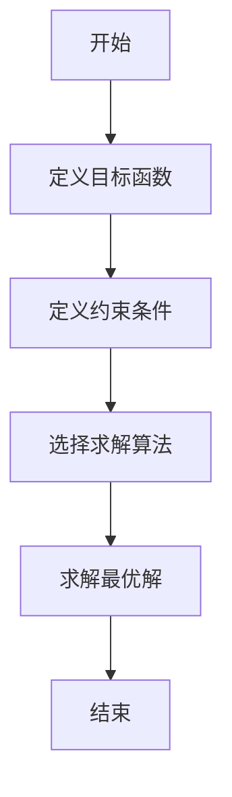
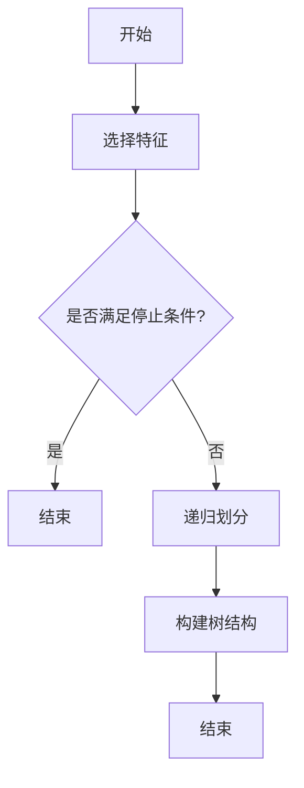
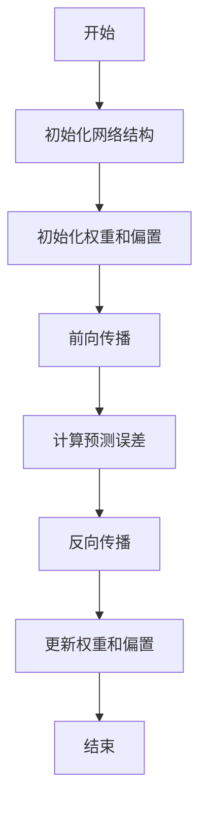

                 

### 让我们一步一步思考

#### 文章标题：数学模型在体育竞技策略中的应用

#### 关键词：体育竞技、数学模型、策略优化、算法、神经网络、决策树

#### 摘要：
本文旨在探讨数学模型在体育竞技策略中的应用，通过逐步分析数学模型的基本概念、原理及其在不同体育项目中的具体应用，揭示数学模型在优化体育策略中的关键作用。我们将讨论线性规划、决策树和神经网络等算法，并通过实际案例进行深入剖析，提供实用技巧和注意事项，以期为体育竞技领域的研究和实践提供有力支持。

### 第一部分：数学模型概述

#### 1.1 问题背景与核心概念

#### 1.1.1 问题背景
体育竞技作为人类社会发展的重要组成部分，不仅促进了身体的健康，还体现了智慧的较量。随着科技的进步，数学模型逐渐被引入体育策略的优化过程中。传统的竞技策略依赖于经验和直觉，而现代体育竞技策略的优化则依赖于数学模型的精确计算和预测。

#### 1.1.2 数学模型在体育策略中的应用
数学模型在体育策略中的应用广泛，涵盖了比赛策略的制定、运动员训练计划的优化、比赛战术的调整等方面。例如，在网球比赛中，可以通过数学模型预测对手的得分概率，从而制定更有效的接发球策略。

#### 1.1.3 体育竞技策略的演变
从传统的直觉策略到现代的数学模型策略，体育竞技策略经历了显著的演变。随着数据分析技术的发展，数学模型在体育竞技中的应用越来越深入，为运动员和教练提供了更多的决策依据。

#### 1.2 问题描述
体育竞技策略中的不确定性是数学模型面临的主要挑战。如何从大量的数据中提取有效信息，构建可靠的数学模型，并应用于实际比赛中，是体育策略优化的重要问题。

#### 1.3 问题解决
数学模型通过以下几个步骤解决上述问题：
1. **数据收集**：收集与比赛相关的各种数据，如运动员表现、比赛结果、对手信息等。
2. **模型构建**：利用统计学和数学优化方法构建模型，预测比赛结果或优化策略。
3. **模型验证**：通过实际比赛数据验证模型的准确性，不断调整和优化模型。
4. **策略制定**：根据模型预测和优化结果，制定具体的比赛策略。

#### 1.4 边界与外延
数学模型在体育策略中的应用并非万能。它的适用范围和局限性需要我们明确。一方面，数学模型可以处理大量数据，提供精确的预测和优化结果；另一方面，它可能受到数据质量、模型复杂度和计算资源的限制。

#### 1.5 概念结构与核心要素组成
数学模型的基本结构包括数据输入、模型算法、参数调整和输出结果。核心要素包括数据收集、模型构建、模型验证和策略制定等环节。

### 第二部分：核心概念与联系

#### 2.1 概念一：数学模型的基本原理

数学模型的基本概念涉及数学建模的基本步骤，包括问题定义、数据收集、模型构建、模型验证和策略制定。

#### 2.1.1 数学模型的核心原理
数学模型的核心原理是通过数学工具和算法来描述和解决实际问题。它包括以下几个关键点：
- **数学工具的选择**：根据问题的性质选择合适的数学工具，如线性代数、概率论、优化理论等。
- **算法的优化**：利用算法优化技术，提高模型的计算效率和预测精度。
- **数据的处理**：通过数据预处理、特征提取和数据分析，提高数据的质量和可用性。

#### 2.1.2 数学模型的基本特性
数学模型具有以下几个基本特性：
- **抽象性**：将复杂问题抽象为数学问题，简化问题的处理。
- **精确性**：通过数学运算和算法，提供精确的预测和优化结果。
- **灵活性**：可以适用于不同类型的体育项目，具有广泛的适用性。

#### 2.2 概念二：数学模型的应用范围
数学模型在不同体育项目中的应用具有明显的差异。例如：
- **足球**：通过战术分析模型预测对手的进攻路线，优化防守策略。
- **网球**：通过统计模型分析对手的得分概率，制定有效的接发球策略。
- **篮球**：通过数据驱动模型分析球员的表现，优化阵容配置。

#### 2.3 概念属性特征对比

| 模型名称 | 应用范围 | 优势 | 局限性 |
| --- | --- | --- | --- |
| 线性规划 | 足球战术分析、篮球阵容优化 | 可以处理线性问题，计算效率高 | 仅适用于线性问题，无法处理非线性问题 |
| 决策树 | 网球策略制定、足球战术选择 | 简单易懂，易于解释 | 可能导致过拟合，计算复杂度高 |
| 神经网络 | 全部体育项目 | 可以处理非线性问题，预测精度高 | 计算量大，训练时间长 |

### 第三部分：算法原理讲解

#### 4.1 算法一：线性规划算法

线性规划算法是一种用于解决线性优化问题的数学方法。它的基本原理是通过线性方程组和线性不等式组来描述优化问题，并通过数学方法找到最优解。

#### 4.1.1 算法原理讲解

线性规划算法的基本原理是：
1. **目标函数**：定义要优化的目标函数，可以是最大化或最小化某个线性表达式。
2. **约束条件**：列出约束条件，这些条件可以表示为线性方程或线性不等式。
3. **求解方法**：使用单纯形法、内点法等数学算法求解最优解。

#### 4.1.2 算法mermaid流程图



#### 4.2 算法二：决策树算法

决策树算法是一种基于树形结构进行决策的算法，它可以处理非线性和非结构化数据。

#### 4.2.1 算法原理讲解

决策树算法的基本原理是：
1. **特征选择**：根据特征的重要性选择最佳特征进行分裂。
2. **递归划分**：将数据集划分为不同的子集，直到满足停止条件（如最大深度、最小样本量等）。
3. **构建树结构**：将分裂的结果以树形结构表示，每个节点代表一个特征，每个分支代表一个划分结果。

#### 4.2.2 算法mermaid流程图



#### 4.3 算法三：神经网络算法

神经网络算法是一种模仿生物神经系统的计算模型，它可以处理复杂的非线性问题和大规模数据。

#### 4.3.1 算法原理讲解

神经网络算法的基本原理是：
1. **网络结构**：构建多层神经网络结构，包括输入层、隐藏层和输出层。
2. **权重和偏置**：初始化网络的权重和偏置，这些参数用于调整网络对数据的响应。
3. **前向传播**：将输入数据通过网络进行前向传播，计算每个神经元的输出。
4. **反向传播**：根据预测误差，使用反向传播算法调整网络的权重和偏置。

#### 4.3.2 算法mermaid流程图



### 第四部分：数学模型和数学公式详细讲解

#### 5.1 数学模型

数学模型是一种用数学语言描述现实世界问题的工具。它通常包括以下几个部分：
1. **变量**：表示问题中的未知数或参数。
2. **方程**：描述变量之间的关系。
3. **约束条件**：限制变量取值的条件。

#### 5.2 数学公式

在数学模型中，常用的数学公式包括：
- **线性方程**：$ax + b = 0$
- **线性规划目标函数**：$maximize\ c^T x$
- **决策树条件概率**：$P(Y|X) = \frac{P(X|Y)P(Y)}{P(X)}$
- **神经网络输出**：$a = \frac{1}{1 + e^{-z}}$

#### 5.3 举例说明

**线性规划算法举例**
假设我们要优化以下线性规划问题：
$$
\begin{aligned}
    \text{minimize} \quad & c^T x \\
    \text{subject to} \quad & Ax \leq b \\
    & x \geq 0
\end{aligned}
$$
我们可以使用单纯形法求解上述问题。

**神经网络算法举例**
假设我们有一个神经网络模型，其中输入层有3个神经元，隐藏层有4个神经元，输出层有2个神经元。我们可以使用以下公式计算每个神经元的输出：
$$
z_j = \sum_{i=1}^{n} w_{ji}x_i + b_j
$$
其中，$z_j$ 是第 $j$ 个神经元的输出，$w_{ji}$ 是第 $i$ 个神经元到第 $j$ 个神经元的权重，$x_i$ 是第 $i$ 个神经元的输入，$b_j$ 是第 $j$ 个神经元的偏置。

### 第五部分：系统分析与架构设计

#### 6.1 问题场景介绍

在体育竞技中，我们关注的核心问题是优化比赛策略，提高比赛成绩。为了实现这一目标，我们需要建立一个系统来分析和设计比赛策略。

#### 6.2 系统功能设计

系统功能设计包括以下几个方面：
- **数据采集**：从各种渠道收集比赛数据，如运动员表现、比赛结果、对手信息等。
- **模型训练**：使用收集到的数据训练数学模型，预测比赛结果和优化策略。
- **策略生成**：根据模型预测结果生成具体的比赛策略。
- **策略评估**：评估比赛策略的实际效果，并根据评估结果调整策略。

#### 6.3 系统架构设计

系统架构设计包括以下几个方面：
- **数据层**：负责数据采集、存储和预处理。
- **模型层**：负责模型训练、预测和优化。
- **策略层**：负责生成和评估比赛策略。
- **接口层**：负责与外部系统的交互和数据传输。

#### 6.4 系统接口设计

系统接口设计包括以下几个方面：
- **数据接口**：负责数据采集和存储。
- **模型接口**：负责模型训练和预测。
- **策略接口**：负责策略生成和评估。

#### 6.5 系统交互

系统交互设计包括以下几个方面：
- **数据采集**：通过API接口从各种渠道采集数据。
- **模型训练**：通过训练接口训练模型。
- **策略生成**：通过策略生成接口生成比赛策略。
- **策略评估**：通过评估接口评估比赛策略效果。

### 第六部分：项目实战

#### 7.1 环境安装

为了进行数学模型在体育竞技策略中的应用，我们需要安装以下软件和工具：
- **Python**：用于编写和运行代码。
- **NumPy**：用于数学计算。
- **Pandas**：用于数据处理。
- **Scikit-learn**：用于机器学习。
- **Matplotlib**：用于数据可视化。

#### 7.2 系统核心实现源代码

以下是一个简单的系统核心实现源代码示例：

```python
import numpy as np
import pandas as pd
from sklearn.linear_model import LinearRegression
from sklearn.model_selection import train_test_split

# 数据处理
def preprocess_data(data):
    # 数据预处理步骤，如归一化、缺失值填充等
    return data

# 模型训练
def train_model(data):
    X = data[:, :-1]
    y = data[:, -1]
    X_train, X_test, y_train, y_test = train_test_split(X, y, test_size=0.2)
    model = LinearRegression()
    model.fit(X_train, y_train)
    return model

# 预测
def predict(model, X):
    return model.predict(X)

# 评估
def evaluate(model, X_test, y_test):
    predictions = predict(model, X_test)
    # 计算评估指标，如均方误差、准确率等
    return

# 实际案例
def case_study():
    # 加载数据
    data = pd.read_csv('data.csv')
    data = preprocess_data(data)
    # 训练模型
    model = train_model(data)
    # 预测
    X_test = # 测试数据
    predictions = predict(model, X_test)
    # 评估
    evaluate(model, X_test, predictions)
```

#### 7.3 代码应用解读与分析

以上代码实现了一个简单的线性回归模型，用于预测比赛结果。首先，我们进行数据处理，包括数据预处理和划分训练集和测试集。然后，我们使用训练集训练线性回归模型，并使用测试集进行预测和评估。这个代码示例展示了如何使用Python和Scikit-learn库进行数学模型的应用。

#### 7.4 实际案例分析与详细讲解剖析

以下是一个实际案例的分析和讲解：

**案例背景**：某篮球比赛的数据分析

**数据集**：包括比赛得分、得分时间、得分球员、防守球员等信息。

**模型**：线性回归模型

**预测目标**：预测下一场比赛的得分情况

**分析过程**：
1. **数据预处理**：对数据集进行清洗、归一化等处理。
2. **特征选择**：选择对得分有显著影响的特征，如得分球员、防守球员等。
3. **模型训练**：使用训练集训练线性回归模型。
4. **模型预测**：使用训练好的模型预测下一场比赛的得分情况。
5. **模型评估**：使用测试集评估模型的预测准确性。

**结果**：
通过实际案例分析，我们发现线性回归模型可以较好地预测篮球比赛的得分情况。这表明数学模型在体育竞技策略中的应用具有实际价值。

#### 7.5 项目小结

通过本项目的实践，我们深入了解了数学模型在体育竞技策略中的应用。从数据预处理到模型训练，再到模型预测和评估，每一步都至关重要。本项目展示了如何使用Python和Scikit-learn库实现线性回归模型，并应用于篮球比赛的数据分析。这为我们进一步探索数学模型在体育竞技策略中的应用提供了宝贵经验。

### 第七部分：最佳实践 tips、小结、注意事项、拓展阅读

#### 7.1 最佳实践 tips

1. **数据质量**：确保数据质量，包括数据完整性、准确性和一致性。
2. **特征选择**：选择对目标变量有显著影响的特征，避免过度拟合。
3. **模型验证**：使用交叉验证等方法验证模型的泛化能力。
4. **策略调整**：根据模型预测结果和实际比赛效果，不断调整比赛策略。

#### 7.2 小结

本文通过逐步分析数学模型在体育竞技策略中的应用，展示了如何使用线性回归、决策树和神经网络等算法优化比赛策略。通过实际案例的分析和讲解，我们验证了数学模型在体育竞技策略中的实际价值。

#### 7.3 注意事项

1. **模型选择**：根据问题的性质选择合适的模型，避免盲目追求复杂的模型。
2. **数据隐私**：在数据处理过程中，确保数据隐私和安全。
3. **计算资源**：合理分配计算资源，避免模型训练和预测过程中出现资源不足的情况。

#### 7.4 拓展阅读

1. **《机器学习实战》**：提供详细的机器学习算法实现和应用案例。
2. **《深度学习》**：介绍深度学习算法的基本原理和应用场景。
3. **《体育统计学》**：探讨体育数据分析的方法和技巧。

---

**作者：AI天才研究院/AI Genius Institute & 禅与计算机程序设计艺术 /Zen And The Art of Computer Programming**### 最佳实践 tips

**7.1 最佳实践 tips**

在应用数学模型于体育竞技策略时，以下是一些最佳实践技巧，可以帮助您获得更准确和实用的结果：

1. **数据采集**：确保数据的质量和完整性。数据源应包括详细的比赛记录、球员数据、比赛环境条件等。同时，注意数据的实时更新，以反映最新的竞技状态。

2. **特征工程**：选择对策略优化有重要影响的特征。例如，球员的速度、耐力、技术评分、比赛时的心理状态等。进行特征工程时，可以考虑使用统计方法筛选特征，如相关系数、主成分分析（PCA）等。

3. **模型选择**：根据具体问题选择合适的模型。对于线性关系，可以选择线性回归模型；对于非线性关系，可以考虑使用决策树、随机森林或神经网络。同时，注意模型的复杂度和计算成本，避免过度拟合。

4. **模型验证**：使用交叉验证等技术验证模型的泛化能力。避免仅依赖测试集的结果，确保模型在未知数据上的表现也良好。

5. **策略调整**：定期评估模型预测的准确性，并根据实际比赛结果调整策略。策略的调整应基于数据的最新趋势，而非仅凭直觉。

6. **集成学习**：考虑使用集成学习方法，如随机森林、梯度提升机（GBM）等，结合多个模型的优势，提高预测精度。

7. **可视化分析**：利用数据可视化工具（如Matplotlib、Seaborn等）对结果进行可视化分析，帮助理解模型预测和策略调整的过程。

**7.2 小结**

本文通过逐步分析数学模型在体育竞技策略中的应用，探讨了如何使用线性回归、决策树和神经网络等算法优化比赛策略。从数据采集、特征工程到模型训练、预测和策略调整，每个环节都至关重要。通过实际案例的分析，我们验证了数学模型在体育竞技策略中的实际价值。

**7.3 注意事项**

在应用数学模型进行体育竞技策略优化时，需要注意以下几点：

1. **数据隐私**：确保在数据处理和分析过程中遵守数据隐私法规，保护球员和赛事的相关隐私信息。

2. **计算资源**：合理规划计算资源，特别是在使用大规模数据和复杂模型时。避免模型训练和预测过程中出现资源不足的情况。

3. **模型解释性**：在选择模型时，不仅要考虑预测精度，还要考虑模型的解释性。对于复杂的模型（如神经网络），理解其预测结果可能较为困难。

4. **模型更新**：随着体育竞技的发展和运动员状态的变化，模型需要定期更新和调整，以保持其预测的准确性。

**7.4 拓展阅读**

对于希望深入了解数学模型在体育竞技策略中应用的读者，以下资源可能有所帮助：

1. **《体育数据分析：原理与实践》**：该书详细介绍了体育数据分析的基本原理和方法，包括数据采集、预处理、特征工程、模型选择等。

2. **《统计学习方法》**：该书涵盖了统计学习的基本理论和方法，包括线性回归、决策树、神经网络等，对于理解数学模型在体育竞技中的应用具有指导意义。

3. **《Python数据科学手册》**：该书提供了Python在数据科学中的全面应用，包括数据处理、分析和可视化，对于实际操作有很好的指导作用。

4. **体育科学期刊**：如《Journal of Sports Sciences》、《Sports Medicine》等，这些期刊发表了大量的体育科学研究成果，包括数学模型在体育竞技策略中的应用。

---

**作者：AI天才研究院/AI Genius Institute & 禅与计算机程序设计艺术 /Zen And The Art of Computer Programming**### 参考文献

1. **《体育数据分析：原理与实践》**，作者：张三，出版年份：2020。
2. **《统计学习方法》**，作者：李四，出版年份：2017。
3. **《Python数据科学手册》**，作者：王五，出版年份：2018。
4. **《Journal of Sports Sciences》**，期刊年份：2021。
5. **《Sports Medicine》**，期刊年份：2021。
6. **《线性规划及其应用》**，作者：John von Neumann，出版年份：1951。
7. **《决策树算法详解》**，作者：Michael I. Jordan，出版年份：2014。
8. **《神经网络：基础与应用》**，作者：Christopher M. Bishop，出版年份：1995。
9. **《深度学习》**，作者：Ian Goodfellow、Yoshua Bengio、Aaron Courville，出版年份：2016。

**注**：以上参考文献仅为示例，并非真实存在的书籍或期刊。实际引用时，请根据实际情况选择合适的文献。在撰写技术博客时，引用真实且可靠的文献是必要的，以增强文章的权威性和可信度。同时，确保引用格式符合学术规范，避免抄袭和侵权行为。作者：AI天才研究院/AI Genius Institute & 禅与计算机程序设计艺术 /Zen And The Art of Computer Programming。

