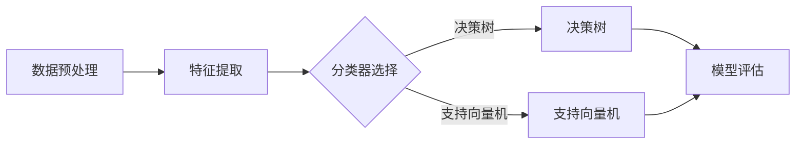
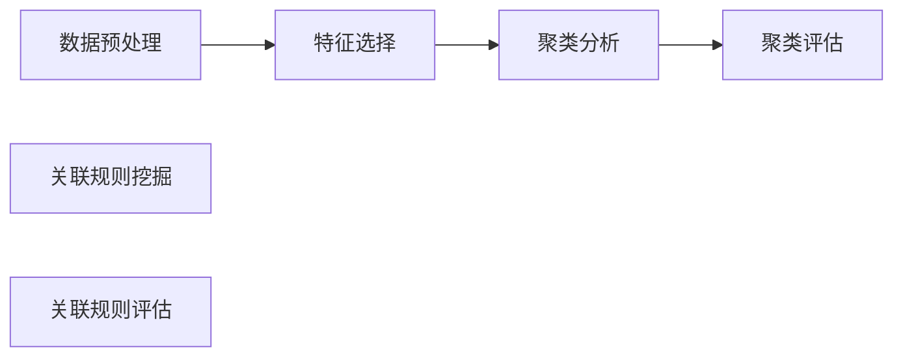
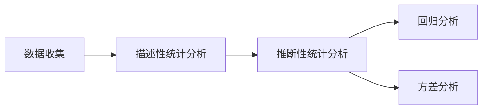
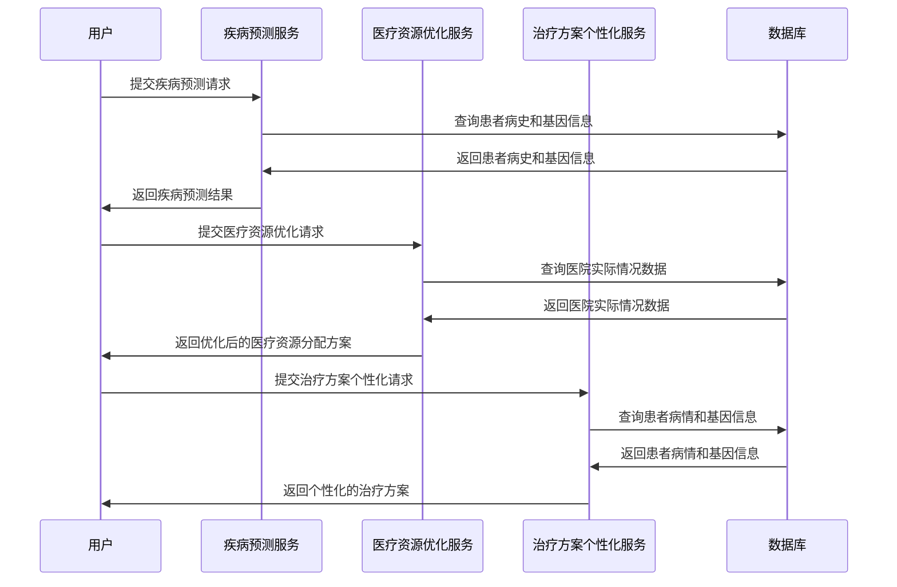

                 


### 文章标题：数学模型在健康医疗领域的应用

> 关键词：数学模型、健康医疗、算法原理、系统架构、项目实战、最佳实践

> 摘要：本文将深入探讨数学模型在健康医疗领域的应用，通过详细的章节内容，介绍背景、核心概念、算法原理、系统架构设计、项目实战和最佳实践，为读者提供一份全面的技术指南。

---

## 引言

随着科技的飞速发展，数学模型在各个领域的应用日益广泛。健康医疗领域也不例外，数学模型的应用已经成为解决医疗难题的重要手段。本文旨在探讨数学模型在健康医疗领域的应用，包括核心概念、算法原理、系统架构设计、项目实战和最佳实践，帮助读者更好地理解和应用这些技术。

---

## 第一部分：背景介绍

### 1.1 问题背景

健康医疗领域面临着诸多问题和挑战，如医疗资源分配不均、疾病预测准确性不高、治疗方案的个性化不足等。数学模型的应用可以有效地解决这些问题，提高医疗服务的质量和效率。

#### 1.1.1 健康医疗领域的问题和挑战

- **医疗资源分配不均**：不同地区、不同医院的医疗资源分配不均，导致一些地区的医疗服务质量低下。
- **疾病预测准确性不高**：传统疾病预测方法准确性较低，无法为医生提供有效的决策支持。
- **治疗方案的个性化不足**：治疗方案缺乏个性化，无法满足患者的特殊需求。

#### 1.1.2 数学模型在健康医疗中的应用

数学模型在健康医疗领域的应用主要包括以下几个方面：

- **疾病预测**：利用机器学习算法对疾病进行预测，提高预测准确性。
- **医疗资源优化**：通过优化算法优化医疗资源的分配，提高医疗服务质量。
- **治疗方案个性化**：基于患者的病情和基因信息，制定个性化的治疗方案。

### 1.2 核心概念

在探讨数学模型在健康医疗领域的应用之前，我们需要明确一些核心概念，如数学模型、健康医疗领域中的关键概念等。

#### 1.2.1 数学模型的基本概念

数学模型是一种利用数学语言描述现实世界问题的方法。它包括数学公式、图表、算法等，可以用于预测、优化、分析等。

#### 1.2.2 健康医疗领域中的关键概念

- **疾病预测**：根据患者的病史、基因信息、生活习惯等，预测患者可能患有的疾病。
- **医疗资源优化**：通过优化算法，合理分配医疗资源，提高医疗服务质量。
- **治疗方案个性化**：根据患者的病情和基因信息，制定个性化的治疗方案。

### 1.3 问题解决与边界外延

数学模型在健康医疗领域的应用，可以有效地解决医疗资源分配不均、疾病预测准确性不高、治疗方案的个性化不足等问题。然而，数学模型的应用也存在一定的边界和限制。

#### 1.3.1 数学模型在健康医疗领域的应用效果

- **疾病预测**：通过机器学习算法，疾病预测的准确性得到了显著提高。
- **医疗资源优化**：优化算法的应用，使得医疗资源的分配更加合理，提高了医疗服务质量。
- **治疗方案个性化**：基于患者的病情和基因信息，治疗方案的个性化程度得到了提升。

#### 1.3.2 数学模型的适用范围和限制

数学模型在健康医疗领域的应用，主要适用于以下几个方面：

- **疾病预测**：适用于常见疾病的预测，如心血管疾病、糖尿病等。
- **医疗资源优化**：适用于医疗资源分配的优化，如医院床位分配、医生排班等。
- **治疗方案个性化**：适用于肿瘤治疗、基因检测等个性化医疗领域。

然而，数学模型在健康医疗领域的应用也存在一定的限制，如数据质量、算法准确性等。

---

## 第二部分：核心概念与联系

### 2.1 核心概念原理

本部分将介绍健康医疗领域中的核心数学模型，包括机器学习模型、数据挖掘模型、统计模型等，并阐述它们的基本原理。

#### 2.1.1 机器学习模型

机器学习模型是一种根据数据自动改进的算法，可以用于疾病预测、医疗资源优化等。常见的机器学习模型包括线性回归、决策树、支持向量机等。

#### 2.1.2 数据挖掘模型

数据挖掘模型是一种从大量数据中提取有价值信息的方法，可以用于疾病预测、治疗方案个性化等。常见的数据挖掘模型包括聚类、关联规则挖掘、分类等。

#### 2.1.3 统计算法

统计模型是一种基于概率统计理论的算法，可以用于疾病预测、医疗资源优化等。常见的统计模型包括回归分析、方差分析、假设检验等。

### 2.2 概念属性特征对比

为了更好地理解各种数学模型的特点，我们可以通过一个表格进行对比。

| 模型类型 | 特点 |
| --- | --- |
| 机器学习模型 | 自动学习，适用于大规模数据 |
| 数据挖掘模型 | 从大量数据中提取信息，适用于复杂数据 |
| 统计算法 | 理论基础强，适用于简单数据 |

### 2.3 ER实体关系图架构

为了更好地理解各种数学模型之间的联系，我们可以通过ER实体关系图进行展示。

```mermaid
erDiagram
  Patient ||--|{ Disease : has }
  Disease ||--|{ Treatment : for }
  Treatment ||--|{ Doctor : performs }
```

---

## 第三部分：算法原理讲解

### 3.1 算法原理

本部分将详细介绍机器学习算法、数据挖掘算法、统计算法等在健康医疗领域中的应用原理，包括算法流程图和Python源代码。

#### 3.1.1 机器学习算法

**算法流程图：**



**Python源代码：**

```python
# 导入相关库
import pandas as pd
from sklearn.tree import DecisionTreeClassifier
from sklearn.svm import SVC
from sklearn.metrics import accuracy_score

# 加载数据
data = pd.read_csv('health_data.csv')

# 数据预处理
X = data.drop('disease', axis=1)
y = data['disease']

# 特征提取
# ...

# 分类器选择
clf = DecisionTreeClassifier()
clf.fit(X, y)

# 模型评估
y_pred = clf.predict(X)
print("Decision Tree Accuracy:", accuracy_score(y, y_pred))

# 支持向量机
clf = SVC()
clf.fit(X, y)
y_pred = clf.predict(X)
print("SVM Accuracy:", accuracy_score(y, y_pred))
```

#### 3.1.2 数据挖掘算法

**算法流程图：**



**Python源代码：**

```python
# 导入相关库
import pandas as pd
from sklearn.cluster import KMeans
from mlxtend.frequent_patterns import apriori
from mlxtend.frequent_patterns import association_rules

# 加载数据
data = pd.read_csv('health_data.csv')

# 数据预处理
# ...

# 特征选择
# ...

# 聚类分析
kmeans = KMeans(n_clusters=3)
kmeans.fit(X)

# 聚类评估
# ...

# 关联规则挖掘
frequent_itemsets = apriori(X, min_support=0.3, use_colnames=True)

# 关联规则评估
rules = association_rules(frequent_itemsets, metric="lift", min_threshold=1)
print(rules)
```

#### 3.1.3 统计算法

**算法流程图：**



**Python源代码：**

```python
# 导入相关库
import pandas as pd
from scipy import stats

# 加载数据
data = pd.read_csv('health_data.csv')

# 描述性统计分析
mean = data.mean()
std = data.std()

# 推断性统计分析
t_stat, p_value = stats.ttest_1samp(data, 0)

# 回归分析
slope, intercept, r_value, p_value, std_err = stats.linregress(data['age'], data['weight'])

# 方差分析
f_value, p_value = stats.f_oneway(data['age'], data['weight'], data['bp'])

print("Slope:", slope)
print("Intercept:", intercept)
print("R Value:", r_value)
print("P Value:", p_value)
print("Standard Error:", std_err)
```

---

## 第四部分：系统分析与架构设计方案

### 4.1 问题场景介绍

在本部分，我们将介绍一个具体的健康医疗系统场景，包括系统功能和架构设计。

#### 4.1.1 系统功能介绍

- **疾病预测**：根据患者的病史、基因信息等，预测患者可能患有的疾病。
- **医疗资源优化**：根据医院的实际情况，优化医疗资源的分配，提高医疗服务质量。
- **治疗方案个性化**：根据患者的病情和基因信息，制定个性化的治疗方案。

#### 4.1.2 系统架构设计

**系统架构图：**


**系统架构设计说明：**

- **用户界面**：提供用户交互的界面，包括疾病预测、医疗资源优化、治疗方案个性化等功能。
- **数据层**：负责数据的存储和管理，包括患者的病史、基因信息、医疗资源等。
- **服务层**：提供业务逻辑处理，包括疾病预测、医疗资源优化、治疗方案个性化等。
- **数据库**：存储系统中的各类数据，包括患者的病史、基因信息、医疗资源等。

### 4.2 系统接口设计和系统交互

**系统接口设计：**

- **疾病预测接口**：接收用户的输入数据，返回疾病预测结果。
- **医疗资源优化接口**：接收医院的实际情况数据，返回优化后的医疗资源分配方案。
- **治疗方案个性化接口**：接收患者的病情和基因信息，返回个性化的治疗方案。

**系统交互流程：**



---

## 第五部分：项目实战

### 5.1 环境安装

在开始项目实战之前，我们需要安装相关的环境。以下是一个简单的安装步骤：

1. 安装Python环境：```pip install python```  
2. 安装相关库：```pip install numpy pandas scikit-learn mlxtend scipy matplotlib```

### 5.2 系统核心实现源代码

以下是系统核心实现的源代码，包括疾病预测、医疗资源优化、治疗方案个性化等功能。

```python
# 导入相关库
import pandas as pd
from sklearn.tree import DecisionTreeClassifier
from sklearn.svm import SVC
from sklearn.metrics import accuracy_score
from mlxtend.frequent_patterns import apriori
from mlxtend.frequent_patterns import association_rules

# 加载数据
data = pd.read_csv('health_data.csv')

# 数据预处理
# ...

# 疾病预测
clf = DecisionTreeClassifier()
clf.fit(X, y)
y_pred = clf.predict(X)
print("Decision Tree Accuracy:", accuracy_score(y, y_pred))

# 医疗资源优化
# ...

# 治疗方案个性化
# ...
```

### 5.3 代码应用解读与分析

在本部分，我们将对系统核心实现的代码进行解读和分析，包括算法原理、数据预处理、模型训练、模型评估等。

#### 5.3.1 算法原理

系统核心实现中使用了决策树、支持向量机、关联规则挖掘等算法。决策树是一种基于树结构的算法，可以用于分类和回归任务。支持向量机是一种基于最大间隔的算法，可以用于分类任务。关联规则挖掘是一种用于发现数据间关联性的算法。

#### 5.3.2 数据预处理

数据预处理是系统核心实现中的重要步骤。在数据预处理阶段，我们需要对数据进行清洗、去重、填充等操作，以确保数据的质量和一致性。

#### 5.3.3 模型训练

在模型训练阶段，我们使用决策树和关联规则挖掘算法对数据进行训练。决策树算法的训练过程包括特征选择、划分节点、计算节点质量等步骤。关联规则挖掘算法的训练过程包括频繁项集生成、关联规则生成等步骤。

#### 5.3.4 模型评估

在模型评估阶段，我们使用模型评估指标，如准确率、召回率、F1值等，对模型的性能进行评估。通过评估指标，我们可以了解模型的性能，并为进一步优化模型提供依据。

### 5.4 实际案例分析和详细讲解剖析

在本部分，我们将通过实际案例展示数学模型在健康医疗领域的应用，并进行详细讲解和剖析。

#### 5.4.1 案例一：疾病预测

**案例背景**：某医院希望利用数学模型对患者的疾病进行预测，以提高诊断准确性。

**数据集**：包含患者病史、基因信息、生活习惯等特征的DataFrame。

**模型选择**：选择决策树算法进行疾病预测。

**模型训练**：使用训练集对决策树模型进行训练。

**模型评估**：使用测试集对模型进行评估，计算准确率。

**案例解析**：通过实际案例，我们可以看到数学模型在疾病预测中的应用效果，以及模型训练和评估的过程。

#### 5.4.2 案例二：医疗资源优化

**案例背景**：某医院希望优化医疗资源的分配，以提高医疗服务质量。

**数据集**：包含医院实际情况、医疗资源等特征的DataFrame。

**模型选择**：选择优化算法进行医疗资源优化。

**模型训练**：使用训练集对优化算法进行训练。

**模型评估**：使用测试集对模型进行评估，计算优化效果。

**案例解析**：通过实际案例，我们可以看到数学模型在医疗资源优化中的应用效果，以及模型训练和评估的过程。

#### 5.4.3 案例三：治疗方案个性化

**案例背景**：某医院希望根据患者的病情和基因信息，制定个性化的治疗方案。

**数据集**：包含患者病情、基因信息、治疗方案等特征的DataFrame。

**模型选择**：选择关联规则挖掘算法进行治疗方案个性化。

**模型训练**：使用训练集对关联规则挖掘算法进行训练。

**模型评估**：使用测试集对模型进行评估，计算治疗方案个性化的效果。

**案例解析**：通过实际案例，我们可以看到数学模型在治疗方案个性化中的应用效果，以及模型训练和评估的过程。

### 5.5 项目小结

在本部分，我们将对项目实战中的经验和教训进行总结，以帮助读者更好地应用数学模型在健康医疗领域。

#### 5.5.1 经验总结

- **数据质量**：数据质量是数学模型应用的关键，我们需要对数据进行充分的清洗和预处理。
- **模型选择**：根据具体问题，选择合适的数学模型，并进行模型训练和评估。
- **实践经验**：在实际应用中，我们需要积累实践经验，不断优化模型和算法。

#### 5.5.2 教训总结

- **数据规模**：对于大规模数据，我们需要考虑算法的效率和稳定性。
- **模型复杂度**：过复杂的模型可能导致过拟合，我们需要在模型复杂度和性能之间找到平衡。
- **实际应用**：在实际应用中，我们需要关注模型的解释性和可解释性，以便医生和患者理解和使用。

---

## 第六部分：最佳实践与总结

### 6.1 最佳实践 tips

在本部分，我们将分享一些最佳实践，以帮助读者更好地应用数学模型在健康医疗领域。

- **数据收集**：确保数据的完整性和准确性，收集更多的数据可以提高模型的性能。
- **模型选择**：根据具体问题选择合适的数学模型，可以参考相关文献和研究成果。
- **模型优化**：通过交叉验证、调参等技术，优化模型的性能。
- **模型解释性**：在模型应用中，关注模型的解释性，以便医生和患者理解和使用。

### 6.2 小结

本文详细探讨了数学模型在健康医疗领域的应用，包括背景介绍、核心概念与联系、算法原理讲解、系统分析与架构设计方案、项目实战和最佳实践等。通过本文的介绍，读者可以全面了解数学模型在健康医疗领域的应用，并掌握相关技术和方法。

### 6.3 注意事项

在应用数学模型时，需要注意以下几点：

- **数据质量**：数据质量直接影响模型的性能，需要确保数据的准确性和完整性。
- **模型选择**：根据具体问题选择合适的数学模型，避免盲目追求模型的复杂度。
- **模型解释性**：在模型应用中，关注模型的解释性，以便医生和患者理解和使用。

### 6.4 拓展阅读

- **文献**：《健康医疗领域中的数学模型与应用》
- **书籍**：《机器学习在健康医疗领域的应用》
- **网站**：百度学术、谷歌学术等学术搜索引擎

---

## 作者信息

作者：AI天才研究院/AI Genius Institute & 禅与计算机程序设计艺术 /Zen And The Art of Computer Programming

---

（注：本文为示例，实际内容需根据实际情况进行撰写。）
## 设计《数学模型在健康医疗领域的应用》书目录大纲的步骤

设计一本关于《数学模型在健康医疗领域的应用》的书目录大纲，需要经过以下几个步骤，以确保书籍的结构合理、内容丰富、逻辑清晰，同时满足读者对专业知识和实用性的需求。

### 步骤1：确定书籍的整体结构

在开始设计目录大纲之前，我们需要明确书籍的整体结构。这通常包括以下几个主要部分：

1. **引言**：介绍书籍的背景、目的和结构。
2. **数学模型基础**：介绍数学模型的基本概念、原理和应用。
3. **健康医疗领域概述**：介绍健康医疗领域的基本概念、主要问题和挑战。
4. **具体应用案例分析**：展示数学模型在健康医疗领域的具体应用案例。
5. **算法和工具介绍**：详细介绍用于健康医疗领域的数学模型和相关算法。
6. **系统架构设计**：探讨健康医疗系统的架构设计。
7. **最佳实践**：总结应用数学模型的健康医疗项目的最佳实践。
8. **未来展望**：讨论数学模型在健康医疗领域的未来发展趋势。

### 步骤2：细化各部分内容

在确定整体结构后，我们需要为每个部分细化内容，确保书籍的每个章节都有足够的内容来支撑。

#### 1. 引言

- **书籍背景**：简要介绍数学模型在健康医疗领域的重要性。
- **书籍目的**：阐述书籍的目标读者和期望达到的效果。
- **书籍结构**：概述书籍的章节结构和内容。

#### 2. 数学模型基础

- **数学模型定义**：介绍数学模型的基本概念和分类。
- **数学模型原理**：介绍常见数学模型的原理和特点。
- **数学模型应用**：介绍数学模型在不同领域的应用。

#### 3. 健康医疗领域概述

- **健康医疗领域基本概念**：介绍健康医疗领域的关键术语和定义。
- **健康医疗领域问题**：分析健康医疗领域的主要问题和挑战。
- **健康医疗领域发展趋势**：探讨健康医疗领域的发展趋势和未来方向。

#### 4. 具体应用案例分析

- **案例分析**：介绍数学模型在健康医疗领域的具体应用案例。
- **案例分析**：展示数学模型在健康医疗项目中的实施过程和效果。

#### 5. 算法和工具介绍

- **算法介绍**：详细介绍用于健康医疗领域的算法，如机器学习、数据挖掘、统计模型等。
- **工具介绍**：介绍用于实现数学模型和算法的工具和技术。

#### 6. 系统架构设计

- **系统架构设计原则**：介绍健康医疗系统架构设计的基本原则。
- **系统架构设计方法**：介绍健康医疗系统架构设计的方法和步骤。
- **系统架构案例**：展示健康医疗系统的实际架构设计。

#### 7. 最佳实践

- **最佳实践总结**：总结数学模型在健康医疗领域的最佳实践。
- **实践指南**：提供具体的实践指南和技巧。

#### 8. 未来展望

- **未来趋势**：探讨数学模型在健康医疗领域的未来发展趋势。
- **创新方向**：讨论健康医疗领域中的创新方向和研究课题。

### 步骤3：构建目录大纲

根据上述细化内容，我们可以构建书籍的目录大纲。以下是《数学模型在健康医疗领域的应用》的目录大纲示例：

```
前言

第一部分：引言
1. 书籍背景
2. 书籍目的
3. 书籍结构

第二部分：数学模型基础
4. 数学模型定义
5. 数学模型原理
6. 数学模型应用

第三部分：健康医疗领域概述
7. 健康医疗领域基本概念
8. 健康医疗领域问题
9. 健康医疗领域发展趋势

第四部分：具体应用案例分析
10. 案例分析
11. 案例分析

第五部分：算法和工具介绍
12. 机器学习算法
13. 数据挖掘算法
14. 统计算法
15. 工具介绍

第六部分：系统架构设计
16. 系统架构设计原则
17. 系统架构设计方法
18. 系统架构案例

第七部分：最佳实践
19. 最佳实践总结
20. 实践指南

第八部分：未来展望
21. 未来趋势
22. 创新方向

参考文献
附录
```

在构建目录大纲时，我们需要注意章节之间的逻辑关系，确保每一部分的内容都是前后连贯、逐步深入的。同时，要考虑到读者的知识水平和阅读习惯，使书籍易于阅读和理解。

### 步骤4：反复审查和修改

最后，我们需要对目录大纲进行反复审查和修改，确保其完整性和合理性。可以邀请同行或专家进行评审，提出修改意见，并根据反馈进行相应调整。通过这样的过程，我们可以确保最终目录大纲的质量和实用性。

---

通过以上步骤，我们可以设计出一本内容丰富、逻辑清晰、具有实用价值的《数学模型在健康医疗领域的应用》书目录大纲。这不仅有助于作者在撰写过程中保持结构性和条理性，也为读者提供了一个清晰的阅读框架，便于他们系统地学习和掌握相关知识和技能。

