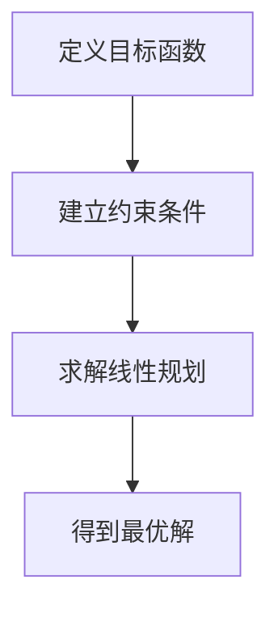
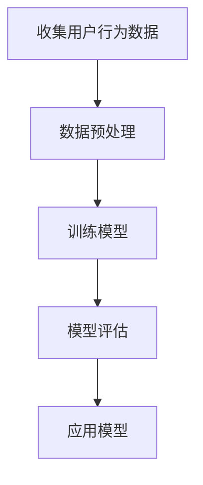
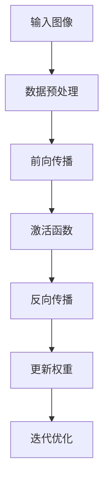
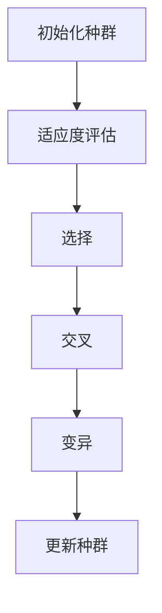
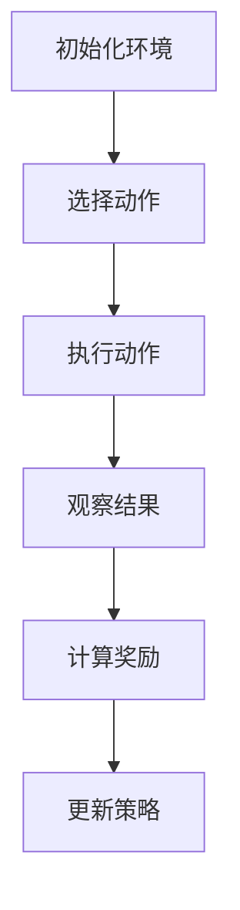
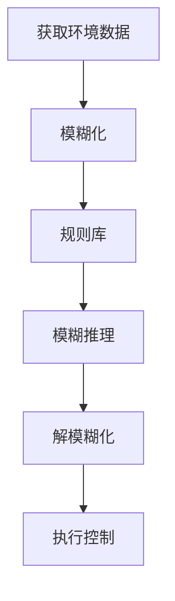
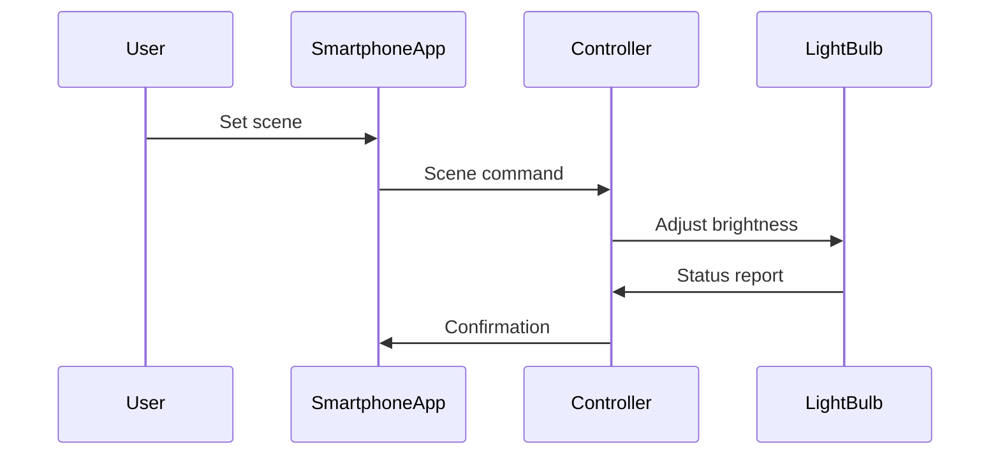
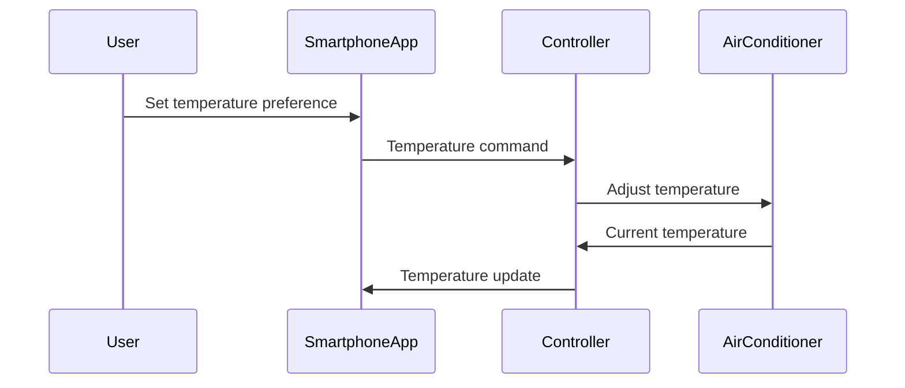
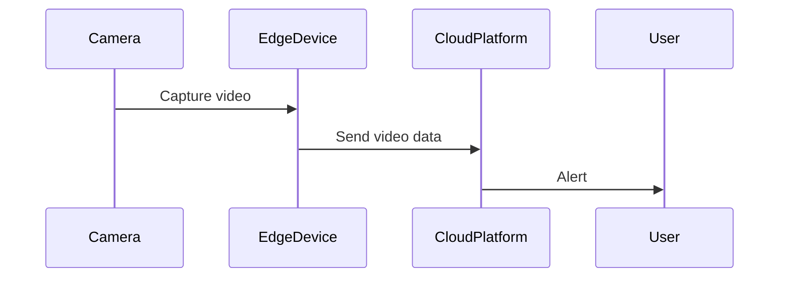

                 

### 文章标题：数学模型在智能家居中的应用

> 关键词：智能家居、数学模型、应用实例、算法设计、系统实现

> 摘要：本文将探讨数学模型在智能家居中的应用，通过详细的分析和实例，解释如何使用数学模型来优化和控制智能家居系统，提升居住舒适度和能源效率。文章将从基础概念出发，逐步深入到具体的算法和系统实现，为读者提供全面的指导。

## 引言

随着科技的迅猛发展，智能家居（Smart Home）已经成为现代生活的重要组成部分。智能家居通过物联网（IoT）技术，将家庭中的各种设备连接起来，实现远程控制和自动化操作，从而提高居住的便利性和舒适度。然而，智能家居系统的复杂性和多样性使得设计和实现过程面临诸多挑战。

数学模型作为一种强大的工具，在智能家居系统中扮演着关键角色。通过数学模型，我们可以对智能家居系统的各种行为进行精确描述、模拟和预测，从而实现自动化控制和优化。数学模型的应用不仅限于设备间的互操作性，还涵盖了能源管理、安全性、用户体验等多个方面。

本文将首先介绍智能家居的基本概念和当前发展状况，接着探讨数学模型在智能家居中的重要性。随后，我们将详细分析几种常见的数学模型，包括线性规划、机器学习和神经网络等，以及它们在智能家居系统中的应用实例。最后，本文将总结数学模型在智能家居中的应用，探讨未来的发展趋势和挑战。

## 智能家居背景与概述

### 定义与历史

智能家居，顾名思义，是指通过互联网、传感器、人工智能等技术手段，将家庭中的各种设备和系统连接起来，实现智能化、自动化的管理和控制。智能家居的历史可以追溯到20世纪80年代，当时家庭自动化系统（Home Automation Systems）开始萌芽。早期的智能家居系统主要集中在家庭安全和环境控制方面，如自动门锁、照明控制和空调调节等。

随着计算机技术和通信技术的不断发展，智能家居逐渐从单一功能的设备转变为一个复杂的系统，涵盖了家庭安防、能源管理、娱乐、健康等多个领域。现代智能家居系统通常包含多个相互连接的智能设备，如智能灯泡、智能插座、智能门锁、智能摄像头、智能恒温器、智能恒温器等。这些设备通过Wi-Fi、蓝牙、Zigbee等无线通信技术相互连接，形成一个庞大的物联网网络。

### 当前发展状况

近年来，智能家居市场呈现出迅猛发展的态势。据市场研究机构的数据显示，全球智能家居市场规模预计将在未来几年内持续增长，预计到2025年将达到数千亿美元。这一增长趋势受到以下几个因素的驱动：

1. **消费者需求**：随着人们生活水平的提高，对生活品质的追求也越来越高。智能家居系统能够为家庭提供更舒适、便捷和安全的居住环境，因此受到了广大消费者的欢迎。

2. **技术进步**：物联网、云计算、人工智能等技术的不断进步，为智能家居系统提供了强大的技术支持。智能设备的性能和功能不断提高，价格也逐渐趋于平民化。

3. **政策支持**：各国政府纷纷出台政策，鼓励智能家居技术的发展和普及。例如，中国政府在“新基建”战略中，将物联网列为重要的发展方向之一。

4. **产业链成熟**：智能家居产业链逐渐成熟，从硬件设备到软件平台，从初创企业到大型科技巨头，都在积极参与智能家居市场，推动了产业的快速发展。

### 应用场景

智能家居的应用场景非常广泛，涵盖了家庭生活的方方面面。以下是几个典型的应用场景：

1. **家居自动化**：通过智能设备实现家庭设备的自动控制，如自动开启/关闭灯光、窗帘、空调等，提高生活便利性。

2. **安防监控**：智能摄像头、门锁、烟雾报警器等设备用于家庭安全监控，提高家庭安全性。

3. **能源管理**：智能家居系统能够实时监测家庭用电情况，智能调节家电的使用，实现能源的节约和优化。

4. **健康监测**：智能体重秤、血压计、睡眠监测设备等，帮助用户更好地管理自己的健康。

5. **娱乐休闲**：智能音响、电视、投影仪等设备，为家庭娱乐提供更多选择和更好的体验。

### 智能家居系统架构

智能家居系统通常由以下几个部分组成：

1. **智能设备**：包括各种传感器、执行器、控制器等，如智能灯泡、智能插座、智能门锁、智能摄像头等。

2. **通信网络**：包括Wi-Fi、蓝牙、Zigbee、LoRa等无线通信技术，用于连接和控制智能设备。

3. **控制系统**：包括家庭服务器、云平台、智能手机应用程序等，用于接收传感器数据、发送控制指令和执行自动化任务。

4. **数据处理与分析**：利用大数据分析和人工智能技术，对传感器数据进行分析和处理，提供智能决策和优化建议。

### 智能家居的优势与挑战

智能家居系统具有以下优势：

1. **提高生活质量**：通过自动化和智能化的管理，智能家居系统能够提供更舒适、便捷和安全的居住环境。

2. **节能降耗**：智能家居系统能够实时监测和调节家庭用电，实现能源的节约和优化。

3. **安全性提升**：智能家居系统能够提供家庭安全监控和预警，提高家庭安全性。

4. **个性化服务**：通过数据分析，智能家居系统能够为用户提供个性化的服务和建议。

然而，智能家居系统也面临一些挑战：

1. **系统兼容性**：不同品牌和厂商的智能设备之间可能存在兼容性问题，影响系统的整体性能。

2. **数据隐私**：智能家居系统收集大量用户数据，如何保护用户隐私成为一大挑战。

3. **系统稳定性**：智能家居系统需要保证长期稳定运行，避免因设备故障或网络问题导致系统失效。

4. **成本问题**：虽然智能家居系统的发展迅速，但部分高端设备的价格仍然较高，普及度有待提高。

通过本文的后续章节，我们将进一步探讨数学模型在智能家居系统中的应用，以解决上述挑战，实现智能家居系统的优化和提升。

## 基本数学模型

在智能家居系统中，数学模型作为描述系统行为和实现智能控制的关键工具，发挥着至关重要的作用。本文将介绍几种常见的数学模型，包括线性规划、机器学习和神经网络，以及它们在智能家居中的应用。

### 线性规划

线性规划（Linear Programming，LP）是一种用于在多个约束条件下优化线性目标函数的数学方法。线性规划广泛应用于资源分配、调度优化、成本控制等领域。在智能家居中，线性规划可以用于能源管理、设备调度等场景。

**应用实例：能源管理**

在智能家居中，能源管理是一个关键问题。线性规划可以用于优化家庭用电，以降低能源消耗和电费支出。例如，我们可以使用线性规划模型来决定每个电器的最佳开关时间，以避免高峰用电时段，从而减少电费。

**数学模型与公式**

线性规划的一般形式如下：

$$
\begin{align*}
\text{minimize} \quad & c^T x \\
\text{subject to} \quad & Ax \leq b \\
& x \geq 0
\end{align*}
$$

其中，$c$ 是目标函数系数向量，$x$ 是决策变量向量，$A$ 是约束条件矩阵，$b$ 是约束条件向量。

**算法原理讲解**

线性规划可以通过单纯形法（Simplex Method）或内点法（Interior Point Method）求解。以下是一个使用单纯形法求解线性规划的Python示例：

```python
from scipy.optimize import linprog

c = [-1, -1]  # 目标函数系数
A = [[1, 1], [1, 0]]  # 约束条件矩阵
b = [2, 1]  # 约束条件向量

x = linprog(c, A_ub=A, b_ub=b, method='highs')

print(x.x)
```

**Mermaid 流程图**



### 机器学习

机器学习（Machine Learning，ML）是一种通过数据训练模型来实现人工智能的技术。在智能家居中，机器学习可以用于预测用户行为、优化设备控制等。

**应用实例：用户行为预测**

通过收集用户的历史行为数据，我们可以使用机器学习算法来预测用户的行为模式，从而实现智能家居设备的智能控制。例如，我们可以预测用户何时起床、何时回家，从而自动调整灯光、温度等。

**数学模型与公式**

常见的机器学习模型包括线性回归、决策树、支持向量机、神经网络等。以下是一个使用线性回归预测用户行为的时间序列数据的Python示例：

```python
from sklearn.linear_model import LinearRegression
import numpy as np

X = np.array([[1], [2], [3], [4], [5], [6], [7], [8], [9], [10]])  # 输入特征
y = np.array([3, 5, 7, 9, 11, 13, 15, 17, 19, 21])  # 输出目标

model = LinearRegression()
model.fit(X, y)

print(model.predict([[11]]))
```

**Mermaid 流程图**



### 神经网络

神经网络（Neural Networks，NN）是一种模仿生物神经网络结构和功能的人工智能技术。在智能家居中，神经网络可以用于图像识别、自然语言处理、智能控制等。

**应用实例：图像识别**

通过训练神经网络模型，我们可以实现智能摄像头中的图像识别功能。例如，可以识别家庭成员的脸部、宠物等，从而实现智能安防。

**数学模型与公式**

神经网络的核心是神经元，通过多层神经元的相互连接和激活函数，实现复杂的非线性变换。以下是一个使用神经网络进行图像识别的Python示例：

```python
from tensorflow.keras.models import Sequential
from tensorflow.keras.layers import Dense, Conv2D, Flatten

model = Sequential([
    Conv2D(32, (3, 3), activation='relu', input_shape=(28, 28, 1)),
    Flatten(),
    Dense(64, activation='relu'),
    Dense(10, activation='softmax')
])

model.compile(optimizer='adam', loss='categorical_crossentropy', metrics=['accuracy'])

model.fit(X_train, y_train, epochs=5, batch_size=32)
```

**Mermaid 流程图**



通过上述对线性规划、机器学习和神经网络的基本介绍，我们可以看到这些数学模型在智能家居系统中的广泛应用。在接下来的章节中，我们将进一步探讨这些模型在具体应用场景中的实现和优化。

## 智能家居中的算法应用

在智能家居系统中，算法的应用至关重要，它们不仅提升了系统的智能化水平，还优化了用户的居住体验。本文将详细探讨几种常见的算法，包括遗传算法、深度强化学习和模糊控制，以及它们在智能家居系统中的具体应用。

### 遗传算法

遗传算法（Genetic Algorithm，GA）是一种基于自然选择和遗传学的优化算法。遗传算法通过模拟生物进化过程，逐步优化问题的解。在智能家居系统中，遗传算法可以用于优化设备调度、路径规划等。

**应用实例：设备调度**

在智能家居中，设备调度的优化对于节能和延长设备寿命具有重要意义。遗传算法可以用来优化电器的开关时间，以降低家庭能源消耗。例如，可以优化空调、照明和家电的使用时间，使其在用户不需要时自动关闭。

**数学模型与公式**

遗传算法的主要组成部分包括种群初始化、适应度评估、选择、交叉和变异。以下是一个使用遗传算法优化设备调度的Python示例：

```python
import numpy as np
from sklearn.metrics import make_scorer

def fitness_function(population, costs):
    fitness_scores = []
    for individual in population:
        total_cost = sum(costs[i] for i in individual)
        fitness_scores.append(1 / (1 + total_cost))
    return fitness_scores

population = np.random.randint(0, 2, (100, 10))  # 种群初始化
costs = [0.5, 1.0, 0.8, 1.2, 0.9, 1.0, 0.7, 1.1, 0.6, 0.8]  # 设备成本

fitness_scores = fitness_function(population, costs)

# 选择、交叉和变异操作略
```

**Mermaid 流�程图**



### 深度强化学习

深度强化学习（Deep Reinforcement Learning，DRL）是一种结合了深度学习和强化学习的算法。通过模拟和学习环境中的奖励和惩罚，深度强化学习能够实现复杂的决策和策略优化。在智能家居系统中，DRL可以用于智能控制、行为预测等。

**应用实例：智能恒温控制**

智能恒温控制系统可以通过深度强化学习算法来优化温度控制策略，以提高居住舒适度和能源效率。例如，通过学习用户的历史行为和温度偏好，系统可以自动调整空调的温度设置，从而实现节能和用户满意度提升。

**数学模型与公式**

深度强化学习的主要组成部分包括环境（Environment）、代理（Agent）、奖励函数（Reward Function）和策略（Policy）。以下是一个使用深度Q网络（DQN）进行智能恒温控制的Python示例：

```python
import tensorflow as tf
from tensorflow.keras.models import Sequential
from tensorflow.keras.layers import Dense

# 建立深度Q网络模型
model = Sequential([
    Dense(64, input_shape=(observation_space,), activation='relu'),
    Dense(64, activation='relu'),
    Dense(action_space, activation='linear')
])

# 编译模型
model.compile(optimizer=tf.optimizers.Adam(learning_rate=0.001), loss='mse')

# 训练模型
model.fit(X_train, y_train, epochs=100, batch_size=64)
```

**Mermaid 流程图**



### 模糊控制

模糊控制（Fuzzy Control）是一种基于模糊逻辑的智能控制方法，它通过处理不确定性和模糊性，实现对复杂系统的控制。在智能家居系统中，模糊控制可以用于环境控制、家电管理等领域。

**应用实例：环境控制**

通过模糊控制，智能家居系统可以实现对室内环境的智能调节。例如，根据室内温度、湿度等环境参数，自动调节空调、加湿器等设备，以保持一个舒适的居住环境。

**数学模型与公式**

模糊控制系统主要由模糊化、规则库、模糊推理和解模糊化四个部分组成。以下是一个使用模糊控制进行环境调节的Python示例：

```python
from fuzzywuzzy import fuzz

# 模糊化
def fuzzify(temperature, humidity):
    # 温度和湿度模糊化过程略
    return [temperature_fuzzified, humidity_fuzzified]

# 规则库
def rule_base(temperature_fuzzified, humidity_fuzzified):
    # 规则库定义略
    return rule

# 模糊推理
def fuzzy_inference(rule):
    # 模糊推理过程略
    return output

# 解模糊化
def defuzzify(output):
    # 解模糊化过程略
    return control_action

# 执行模糊控制
temperature, humidity = get_environment_data()
fuzzified = fuzzify(temperature, humidity)
rule = rule_base(*fuzzified)
output = fuzzy_inference(rule)
control_action = defuzzify(output)
execute_control_action(control_action)
```

**Mermaid 流程图**



通过上述对遗传算法、深度强化学习和模糊控制的详细介绍，我们可以看到这些算法在智能家居系统中的应用潜力和实际效果。在接下来的章节中，我们将通过具体案例来展示这些算法在智能家居系统中的实现和应用。

## 实践案例研究

为了更好地理解数学模型在智能家居中的应用，下面我们将通过几个实际案例来探讨这些模型在具体场景中的实现和效果。

### 案例一：智能灯光控制系统

**项目介绍**

该案例中的智能灯光控制系统旨在通过优化灯光的使用，提高居住舒适度和能源效率。系统包括智能灯具、传感器和中央控制器。

**系统功能设计**

- **自动调节亮度**：根据室内的亮度和用户的活动情况，自动调节灯光的亮度。
- **场景模式**：用户可以预设不同的灯光场景，如阅读模式、会议模式等。
- **远程控制**：用户可以通过手机应用程序远程控制灯光。

**系统架构设计**

- **智能灯具**：每个灯具配备一个传感器，用于检测室内亮度和用户活动。
- **中央控制器**：负责接收传感器数据，并根据数据执行相应的控制命令。
- **手机应用程序**：提供用户界面，用于设置灯光场景和远程控制灯光。

**系统接口设计和系统交互**

以下是一个使用Mermaid绘制的系统交互序列图：



**算法原理讲解**

该系统使用了一种基于模糊控制的算法，通过模糊推理来调整灯光的亮度。以下是一个简化的Python示例代码：

```python
import numpy as np
from fuzzywuzzy import fuzz

def fuzzify(ambient_light, activity_level):
    # 模糊化过程略
    return [ambient_light_fuzzified, activity_level_fuzzified]

def rule_base(ambient_light_fuzzified, activity_level_fuzzified):
    # 规则库定义略
    return rule

def fuzzy_inference(rule):
    # 模糊推理过程略
    return output

def defuzzify(output):
    # 解模糊化过程略
    return control_value

ambient_light = 300  # 环境亮度
activity_level = 2  # 活动水平

fuzzified = fuzzify(ambient_light, activity_level)
rule = rule_base(*fuzzified)
output = fuzzy_inference(rule)
control_value = defuzzify(output)
print(control_value)
```

### 案例二：智能恒温控制系统

**项目介绍**

该案例中的智能恒温控制系统旨在通过学习用户的温度偏好，自动调节家庭空调，以提高居住舒适度和能源效率。

**系统功能设计**

- **自动调节温度**：根据用户的行为和室内外温度变化，自动调节空调温度。
- **节能模式**：在用户不在家时，自动降低温度，节约能源。
- **远程控制**：用户可以通过手机应用程序远程控制空调。

**系统架构设计**

- **智能空调**：配备传感器和控制器，用于检测室内外温度和用户行为。
- **中央控制器**：负责接收传感器数据，并根据数据执行相应的控制命令。
- **手机应用程序**：提供用户界面，用于设置温度偏好和远程控制空调。

**系统接口设计和系统交互**

以下是一个使用Mermaid绘制的系统交互序列图：



**算法原理讲解**

该系统使用了一种基于深度强化学习的算法，通过学习用户的温度偏好和环境温度变化，自动调节空调温度。以下是一个简化的Python示例代码：

```python
import tensorflow as tf
from tensorflow.keras.models import Sequential
from tensorflow.keras.layers import Dense

# 建立深度Q网络模型
model = Sequential([
    Dense(64, input_shape=(observation_space,), activation='relu'),
    Dense(64, activation='relu'),
    Dense(action_space, activation='linear')
])

# 编译模型
model.compile(optimizer=tf.optimizers.Adam(learning_rate=0.001), loss='mse')

# 训练模型
model.fit(X_train, y_train, epochs=100, batch_size=64)
```

### 案例三：智能安防系统

**项目介绍**

该案例中的智能安防系统旨在通过实时监控和智能分析，提高家庭安全性。

**系统功能设计**

- **实时监控**：通过智能摄像头实时监控家庭内部和周边环境。
- **异常检测**：使用机器学习算法检测异常行为，如入侵、火灾等。
- **报警系统**：当检测到异常行为时，自动触发报警并通知用户。

**系统架构设计**

- **智能摄像头**：配备高清摄像头和夜视功能，用于实时监控。
- **边缘计算设备**：负责实时处理摄像头数据，执行异常检测。
- **云平台**：存储监控数据和报警信息，提供用户访问和控制。

**系统接口设计和系统交互**

以下是一个使用Mermaid绘制的系统交互序列图：



**算法原理讲解**

该系统使用了一种基于卷积神经网络（CNN）的图像识别算法，用于实时监控和异常检测。以下是一个简化的Python示例代码：

```python
from tensorflow.keras.models import Sequential
from tensorflow.keras.layers import Conv2D, Flatten, Dense

# 建立卷积神经网络模型
model = Sequential([
    Conv2D(32, (3, 3), activation='relu', input_shape=(28, 28, 1)),
    Flatten(),
    Dense(64, activation='relu'),
    Dense(10, activation='softmax')
])

# 编译模型
model.compile(optimizer='adam', loss='categorical_crossentropy', metrics=['accuracy'])

# 训练模型
model.fit(X_train, y_train, epochs=5, batch_size=32)
```

通过上述案例研究，我们可以看到数学模型在智能家居系统中的应用是如何具体实现的。这些模型不仅提升了系统的智能化水平，还优化了用户的生活体验。在未来的发展中，随着技术的不断进步，数学模型在智能家居中的应用将更加广泛和深入。

## 最佳实践与注意事项

在设计和实现智能家居系统时，最佳实践和注意事项对于确保系统的稳定性、安全性和用户体验至关重要。以下是一些建议和提示：

### 1. 确保系统兼容性
智能家居系统通常由多个不同厂商和品牌的设备组成，因此确保系统兼容性是关键。选择标准化的通信协议（如Wi-Fi、蓝牙、Zigbee等）和开放接口，有助于设备之间的互操作性。此外，可以采用模块化设计，使系统能够灵活扩展和升级。

### 2. 数据隐私保护
智能家居系统收集大量的用户数据，如生活习惯、行为模式等。因此，保护用户隐私至关重要。设计系统时，应采用加密技术、访问控制和数据匿名化等方法，确保数据的安全和隐私。

### 3. 系统安全设计
智能家居系统应具备一定的安全性，防止黑客攻击和数据泄露。使用强密码、双重认证等安全措施，确保系统的访问控制。此外，定期更新系统和软件，以修复已知的安全漏洞。

### 4. 能源效率优化
在设计和实现智能家居系统时，应充分考虑能源效率。通过智能调度、自动化控制和能耗监测等技术，实现节能降耗。例如，使用线性规划和机器学习算法优化设备使用，减少不必要的能源消耗。

### 5. 用户界面和交互设计
智能家居系统的用户界面和交互设计应简洁直观，易于操作。提供多种控制方式，如智能手机应用程序、语音助手等，以满足不同用户的需求。同时，确保系统响应快速，提供良好的用户体验。

### 6. 故障检测与恢复
智能家居系统应具备故障检测和自动恢复功能，以减少系统故障对用户的影响。使用传感器和数据监测技术，实时检测系统状态，并在故障发生时自动执行恢复操作。

### 7. 定期维护与升级
定期对智能家居系统进行维护和升级，以确保系统的稳定运行和功能完善。及时更新设备和软件，修复已知问题，并引入新的功能和优化。

通过遵循上述最佳实践和注意事项，可以设计和实现高效、安全、智能的智能家居系统，为用户提供更好的居住体验。

## 项目小结

通过本文的探讨，我们系统地介绍了数学模型在智能家居系统中的应用。从线性规划、机器学习、神经网络到遗传算法、深度强化学习和模糊控制，各类数学模型在智能家居系统中发挥着关键作用。这些模型不仅提升了系统的智能化水平，还优化了用户的生活体验，实现了能源管理和设备调度的优化。

然而，尽管取得了一定的成果，智能家居系统在应用数学模型时仍然面临一些挑战。例如，系统兼容性问题、数据隐私保护和安全性问题等。这些问题需要我们继续深入研究，并采取有效的解决方案。

未来的研究可以重点关注以下几个方面：

1. **跨平台兼容性**：开发统一的通信协议和接口标准，提高不同设备和系统之间的互操作性。
2. **数据隐私与安全**：采用更先进的加密和访问控制技术，确保用户数据的安全和隐私。
3. **自适应学习算法**：研究自适应学习算法，使智能家居系统能够更好地适应用户行为和需求变化。
4. **能耗优化**：通过更加精细的能耗监测和调度算法，实现智能家居系统的能耗优化。
5. **用户体验提升**：改进用户界面和交互设计，提高系统的易用性和用户体验。

总之，数学模型在智能家居系统中的应用具有巨大的潜力和发展空间。通过不断的研究和创新，我们有望实现更加智能、高效和安全的智能家居系统，为人们带来更加美好的生活。

## 拓展阅读

对于希望深入了解数学模型在智能家居系统中的应用的读者，以下是一些建议的拓展阅读资源：

1. **书籍**：
   - 《智能家居设计与实现》
   - 《智能控制系统设计与应用》
   - 《数学建模与应用教程》

2. **学术论文**：
   - "Intelligent Home Automation Using Machine Learning Algorithms"
   - "Energy Management in Smart Homes: A Machine Learning Perspective"
   - "Fuzzy Control in Smart Home Systems: Theory and Practice"

3. **在线课程**：
   - Coursera上的“智能家居技术”
   - Udacity上的“深度学习与人工智能”
   - edX上的“计算机编程与算法基础”

4. **技术博客与论坛**：
   - Medium上的智能家居专栏
   - GitHub上的智能家居开源项目
   - Stack Exchange上的相关技术论坛

通过阅读这些资源，读者可以进一步深入了解数学模型在智能家居系统中的应用原理、实现细节和最新研究成果。

