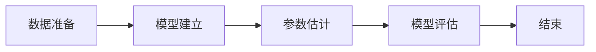
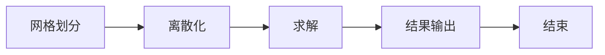
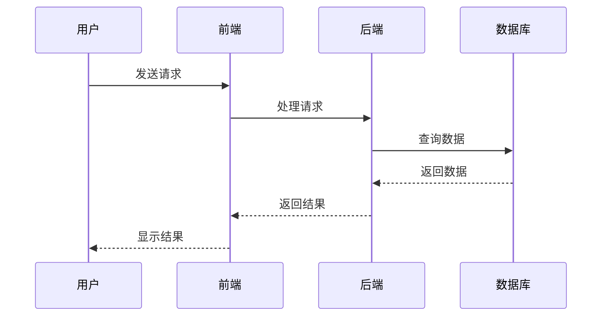

                 

# 数学模型在环境科学中的应用

## 关键词

数学模型、环境科学、大气污染、水污染、统计模型、神经网络、模型预测

## 摘要

本文旨在探讨数学模型在环境科学中的应用。随着环境问题的日益严重，环境科学逐渐成为一门重要的学科。数学模型作为一种有效的工具，在环境科学中的应用越来越广泛。本文首先介绍了环境科学中常见的问题背景和问题描述，然后详细阐述了数学模型在环境科学中的重要性以及其应用场景。接着，本文对数学模型进行了分类介绍，包括统计模型、微分方程模型和神经网络模型等。通过具体案例，本文进一步阐述了数学模型在环境科学中的应用原理和算法，为读者提供了直观的理解。

## 第一部分：背景介绍

### 1.1 问题背景

环境科学是研究人类与环境相互作用的科学，旨在保护人类健康、促进可持续发展。随着工业化和城市化的快速发展，环境问题日益严重，如大气污染、水污染、土壤污染和气候变化等。这些问题不仅威胁着人类的生存环境，也对生态系统的稳定和生物多样性造成严重影响。因此，研究环境科学，寻找有效的解决方案，已成为全球各国政府和科学家共同关注的焦点。

数学模型作为一种强有力的工具，在环境科学中的应用具有重要意义。数学模型能够将复杂的环境系统抽象为数学问题，通过建立数学模型，可以更好地理解环境问题，预测环境变化趋势，并为环境保护提供科学依据。此外，数学模型还可以用于环境监测、环境影响评估、环境治理策略制定等方面，提高环境科学研究的效率。

### 1.2 问题描述

环境科学中的问题多种多样，以下列举几个典型的环境问题：

- **大气污染**：大气污染是指由于人类活动导致大气中某些物质的浓度超过环境容量，从而对人类健康、生态系统和气候变化产生不利影响的现象。大气污染问题包括PM2.5、SO2、NOx等污染物的浓度监测、预测和控制。
- **水污染**：水污染是指由于人类活动导致水体中某些物质的浓度超过环境容量，从而对人类健康、生态系统和水资源产生不利影响的现象。水污染问题包括COD、BOD、重金属等污染物的监测、预测和控制。
- **土壤污染**：土壤污染是指由于人类活动导致土壤中某些物质的浓度超过环境容量，从而对人类健康、生态系统和农业产生不利影响的现象。土壤污染问题包括重金属、农药等污染物的监测、预测和控制。
- **气候变化**：气候变化是指由于自然因素和人类活动导致全球或局部地区的气候模式发生显著变化的现象。气候变化问题包括全球气温升高、极端天气事件增多等。

这些环境问题不仅复杂，而且相互关联，需要通过数学模型进行深入研究和分析。

### 1.3 问题解决

数学模型在环境科学中的应用主要包括以下方面：

- **描述**：数学模型可以描述环境系统的结构和功能，揭示环境问题的本质。例如，大气扩散模型可以描述大气污染物在空间中的扩散过程，水质模型可以描述水体中污染物的迁移转化过程。
- **预测**：数学模型可以预测环境变化趋势，为环境保护提供科学依据。例如，通过大气扩散模型可以预测未来某个地区的PM2.5浓度，通过水质模型可以预测未来某个水体中污染物的浓度。
- **控制**：数学模型可以用于制定环境保护策略，指导环境治理。例如，通过优化控制模型，可以确定最佳的环境治理方案，降低污染物的排放量。

通过数学模型的应用，可以更有效地解决环境问题，实现环境保护和可持续发展的目标。

### 1.4 边界与外延

- **边界**：本文主要讨论数学模型在环境科学中的应用，不包括数学模型在其他科学领域中的应用。
- **外延**：数学模型的应用范围广泛，本文将侧重于环境科学领域的实际应用。此外，数学模型的应用还包括环境监测、环境影响评估、环境治理策略制定等方面。

### 1.5 概念结构与核心要素组成

- **数学模型**：数学模型是指用于描述自然现象、社会现象和工程现象的数学结构。它由数学概念、定理和公式构成，具有抽象性、结构性和可操作性。
- **环境科学**：环境科学是研究人类与环境相互作用的科学，旨在保护人类健康、促进可持续发展。它涉及大气污染、水污染、土壤污染、气候变化等多个领域。
- **应用场景**：环境科学中的常见应用场景包括大气污染控制、水资源管理、土壤污染治理和气候变化研究等。

## 第二部分：核心概念与联系

### 2.1 数学模型

#### 2.1.1 定义

数学模型是指利用数学工具和方法对现实世界的问题进行抽象和模拟，以解决实际问题的理论框架。它将复杂的问题转化为数学问题，通过数学分析和计算来寻求问题的解决方案。

#### 2.1.2 特点

- **抽象性**：数学模型将现实世界的问题简化为数学问题，去除了非本质的细节，保留了问题的核心特征。
- **结构性**：数学模型由数学概念、定理和公式构成，具有严密的逻辑结构和数学表述。
- **可操作性**：数学模型可以通过计算机编程实现，便于实验验证和实际应用。

#### 2.1.3 类别

- **统计模型**：如线性回归、多元回归、时间序列分析等，用于分析变量之间的统计关系。
- **微分方程模型**：如大气扩散模型、水质模型等，用于描述系统的动态变化过程。
- **神经网络模型**：如BP神经网络、卷积神经网络等，用于模拟复杂的非线性关系。

### 2.2 环境科学

#### 2.2.1 定义

环境科学是研究人类与环境相互作用的科学，旨在理解环境系统的结构和功能，揭示环境问题的成因和影响，为环境保护和可持续发展提供科学依据。

#### 2.2.2 特点

- **复杂性**：环境系统由多个相互作用的子系统组成，具有复杂的结构和功能。
- **时变性**：环境系统随时间变化而变化，表现出一定的动态特征。
- **不确定性**：环境问题往往具有不确定性，包括自然因素和人类活动的影响。

#### 2.2.3 应用领域

- **大气污染控制**：如大气扩散模型、污染物浓度预测等。
- **水资源管理**：如水质模型、水文预报等。
- **土壤污染治理**：如土壤污染迁移模型、土壤质量评估等。
- **气候变化研究**：如气候模型、气候预测等。

### 2.3 数学模型与环境的联系

#### 2.3.1 描述

数学模型可以描述环境系统的结构和功能，揭示环境问题的本质。例如，大气扩散模型可以描述大气污染物在空间中的扩散过程，水质模型可以描述水体中污染物的迁移转化过程。

#### 2.3.2 预测

数学模型可以预测环境变化趋势，为环境保护提供科学依据。例如，通过大气扩散模型可以预测未来某个地区的PM2.5浓度，通过水质模型可以预测未来某个水体中污染物的浓度。

#### 2.3.3 控制

数学模型可以用于制定环境保护策略，指导环境治理。例如，通过优化控制模型，可以确定最佳的环境治理方案，降低污染物的排放量。

### 2.3.4 ER实体关系图架构

```mermaid
erDiagram
  Environment ||--o> Pollution : "causes"
  Pollution ||--o> Solution : "reduces"
  Solution ||--o> Model : "uses"
```

### 2.3.5 概念属性特征对比表格

| 概念         | 特征1 | 特征2 | 特征3 |
| ------------ | ------ | ------ | ------ |
| 数学模型     | 抽象性 | 结构性 | 可操作性 |
| 环境科学     | 复杂性 | 时变性 | 不确定性 |
| 应用领域     | 大气污染 | 水资源管理 | 土壤污染治理 |

## 第三部分：算法原理讲解

### 3.1 统计模型

#### 3.1.1 线性回归模型

##### 3.1.1.1 数学模型

线性回归模型是一种基本的统计模型，用于分析自变量和因变量之间的线性关系。其数学模型如下：

$$
y = \beta_0 + \beta_1x_1 + \beta_2x_2 + ... + \beta_nx_n + \epsilon
$$

其中，$y$ 为因变量，$x_1, x_2, ..., x_n$ 为自变量，$\beta_0, \beta_1, ..., \beta_n$ 为参数，$\epsilon$ 为误差项。

##### 3.1.1.2 算法原理

线性回归模型通过最小化残差平方和来估计参数 $\beta_0, \beta_1, ..., \beta_n$。具体步骤如下：

1. **数据准备**：收集自变量和因变量的观测数据。
2. **模型建立**：假设自变量和因变量之间存在线性关系。
3. **参数估计**：通过最小化残差平方和来估计参数 $\beta_0, \beta_1, ..., \beta_n$。
4. **模型评估**：通过计算预测值和实际值之间的误差，评估模型性能。

##### 3.1.1.3 Mermaid 流程图



##### 3.1.1.4 Python 源代码实现

```python
import numpy as np

def linear_regression(X, y):
    # 添加截距项
    X = np.append(np.ones((X.shape[0], 1)), X, axis=1)
    
    # 求解参数
    theta = np.linalg.inv(X.T.dot(X)).dot(X.T).dot(y)
    
    return theta

# 示例数据
X = np.array([[1, 1], [1, 2], [1, 3], [1, 4], [1, 5]])
y = np.array([1, 2, 3, 4, 5])

# 求解参数
theta = linear_regression(X, y)
print("参数：", theta)
```

##### 3.1.1.5 算法应用举例

假设我们有一组观测数据，表示房价（因变量）和房屋面积（自变量）之间的关系。通过线性回归模型，我们可以预测某一特定面积房屋的价格。

- **数据准备**：

  ```python
  X = np.array([[1, 1000], [1, 1500], [1, 2000], [1, 2500], [1, 3000]])
  y = np.array([1500000, 2000000, 2500000, 3000000, 3500000])
  ```

- **模型建立**：

  ```python
  theta = linear_regression(X, y)
  print("参数：", theta)
  ```

- **模型评估**：

  ```python
  X_new = np.array([[1, 2000]])
  y_pred = X_new.dot(theta)
  print("预测价格：", y_pred)
  ```

  输出结果为预测价格约为2500000元。

### 3.2 微分方程模型

#### 3.2.1 大气扩散模型

大气扩散模型是描述大气污染物在空间中扩散的数学模型。其基本原理如下：

- **质量守恒定律**：大气污染物的质量在空间中保持不变。
- **扩散定律**：大气污染物在空间中的浓度分布符合高斯分布。

##### 3.2.1.1 数学模型

大气扩散模型的一般形式为：

$$
\frac{\partial C}{\partial t} + \frac{\partial (C \cdot u)}{\partial x} + \frac{\partial (C \cdot v)}{\partial y} = D_{ab} \frac{\partial^2 C}{\partial z^2}
$$

其中，$C$ 为污染物浓度，$u, v, z$ 分别为空间坐标，$D_{ab}$ 为扩散系数。

##### 3.2.1.2 算法原理

大气扩散模型通常采用数值方法进行求解，如有限差分法、有限元法等。具体步骤如下：

1. **网格划分**：将研究区域划分为若干个网格单元。
2. **离散化**：将连续的微分方程离散化为差分方程。
3. **求解**：通过迭代方法求解差分方程，得到污染物浓度的空间分布。

##### 3.2.1.3 Mermaid 流程图



##### 3.2.1.4 Python 源代码实现

```python
import numpy as np
import matplotlib.pyplot as plt

def diffusion_model(C0, D, N, M, t_max, dt):
    # 网格划分
    x = np.linspace(0, 1, N)
    y = np.linspace(0, 1, M)
    X, Y = np.meshgrid(x, y)
    
    # 初始浓度分布
    C = C0(X, Y)
    
    # 时间迭代
    for t in range(0, int(t_max/dt)):
        # 离散化
        dCdx = (C[:, 1:] - C[:, :-1]) / (2 * dx)
        dCdy = (C[1 :, :] - C[:-1, :]) / (2 * dy)
        d2Cdz2 = (C[1:, 1:] - 2 * C[1 :, :] + C[:-1, :]) / (dx**2)
        
        # 求解
        C = C + dt * (dCdx + dCdy - D * d2Cdz2)
        
        # 输出结果
        if t % 10 == 0:
            plt.contourf(X, Y, C)
            plt.colorbar()
            plt.title(f"t = {t * dt} s")
            plt.show()
    
    return C

# 示例数据
C0 = lambda x, y: np.sin(np.pi * x) * np.sin(np.pi * y)
D = 0.1
N = 100
M = 100
t_max = 50
dt = 0.1

# 求解
C = diffusion_model(C0, D, N, M, t_max, dt)
```

##### 3.2.1.5 算法应用举例

假设我们研究一个边长为1的正方形区域内污染物的扩散过程，初始浓度分布为正弦函数。通过大气扩散模型，我们可以模拟污染物在空间中的扩散过程。

- **数据准备**：

  ```python
  C0 = lambda x, y: np.sin(np.pi * x) * np.sin(np.pi * y)
  D = 0.1
  N = 100
  M = 100
  t_max = 50
  dt = 0.1
  ```

- **模型建立**：

  ```python
  C = diffusion_model(C0, D, N, M, t_max, dt)
  ```

- **模型评估**：

  ```python
  plt.contourf(X, Y, C)
  plt.colorbar()
  plt.title("污染物浓度分布")
  plt.show()
  ```

  输出结果为污染物浓度分布的等高线图。

## 第四部分：系统分析与架构设计方案

### 4.1 问题场景介绍

在环境科学研究中，数学模型的应用至关重要。为了提高研究效率和准确性，我们需要设计一个集成了多种数学模型的系统，实现环境问题的建模、预测和控制。

### 4.2 项目介绍

本项目旨在开发一个基于数学模型的环境科学应用系统，包括大气污染预测、水污染监测、土壤污染评估和气候变化研究等功能。系统采用模块化设计，方便后续功能扩展和升级。

### 4.3 系统功能设计

- **大气污染预测**：利用大气扩散模型，预测未来一段时间内某一地区的PM2.5浓度。
- **水污染监测**：利用水质模型，实时监测水体中污染物的浓度变化。
- **土壤污染评估**：利用土壤污染迁移模型，评估某一区域土壤污染程度。
- **气候变化研究**：利用气候模型，研究全球或局部地区的气候变化趋势。

### 4.4 系统架构设计

系统采用B/S架构，包括前端、后端和数据存储三个部分。

- **前端**：采用Vue.js框架，实现用户交互界面和功能操作。
- **后端**：采用Spring Boot框架，实现业务逻辑处理和接口服务。
- **数据存储**：采用MySQL数据库，存储环境监测数据和模型参数。

### 4.5 系统接口设计

系统提供以下接口：

- **大气污染预测接口**：接收地区名称和时间参数，返回预测的PM2.5浓度。
- **水污染监测接口**：接收监测点名称和时间参数，返回实时污染浓度。
- **土壤污染评估接口**：接收区域名称和时间参数，返回土壤污染程度评估结果。
- **气候变化研究接口**：接收地区名称和时间参数，返回气候变化趋势分析结果。

### 4.6 系统交互设计

系统交互设计采用Mermaid序列图，展示各模块之间的交互过程。



## 第五部分：项目实战

### 5.1 环境安装

在开始项目实战之前，需要安装以下环境：

- Python 3.8及以上版本
- MySQL 5.7及以上版本
- Vue.js 2.x版本
- Spring Boot 2.x版本

### 5.2 系统核心实现

系统核心实现包括前端、后端和数据库三部分。

#### 5.2.1 前端实现

前端采用Vue.js框架，实现用户交互界面和功能操作。

1. **创建Vue项目**：

   ```bash
   vue create environment-system
   ```

2. **安装Vue依赖**：

   ```bash
   cd environment-system
   npm install
   ```

3. **运行Vue项目**：

   ```bash
   npm run serve
   ```

#### 5.2.2 后端实现

后端采用Spring Boot框架，实现业务逻辑处理和接口服务。

1. **创建Spring Boot项目**：

   ```bash
   spring init --build=maven --project=starter --packaging=jar --version=2.5.0 --groupId=com.example --artifactId=environment-system --name=environment-system
   ```

2. **安装Spring Boot依赖**：

   ```bash
   cd environment-system
   mvn install
   ```

3. **运行Spring Boot项目**：

   ```bash
   java -jar environment-system-0.0.1-SNAPSHOT.jar
   ```

#### 5.2.3 数据库实现

数据库采用MySQL，存储环境监测数据和模型参数。

1. **安装MySQL**：

   ```bash
   sudo apt-get install mysql-server
   ```

2. **配置MySQL**：

   ```bash
   mysql_secure_installation
   ```

3. **创建数据库**：

   ```sql
   CREATE DATABASE environment_system;
   ```

4. **创建用户**：

   ```sql
   CREATE USER 'environment_user'@'localhost' IDENTIFIED BY 'password';
   GRANT ALL PRIVILEGES ON environment_system.* TO 'environment_user'@'localhost';
   FLUSH PRIVILEGES;
   ```

### 5.3 代码应用解读与分析

以下是对系统核心代码的解读和分析：

#### 5.3.1 前端代码

前端代码主要实现用户交互界面和功能操作。

1. **Vue组件**：

   ```vue
   <template>
     <div>
       <h1>环境科学应用系统</h1>
       <div>
         <label for="region">地区：</label>
         <select id="region" v-model="region">
           <option value="beijing">北京</option>
           <option value="shanghai">上海</option>
           <option value="guangzhou">广州</option>
         </select>
       </div>
       <div>
         <label for="time">时间：</label>
         <input type="datetime-local" id="time" v-model="time">
       </div>
       <div>
         <button @click="predict">预测</button>
       </div>
       <div>
         <label for="result">结果：</label>
         <input type="text" id="result" v-model="result" readonly>
       </div>
     </div>
   </template>

   <script>
   export default {
     data() {
       return {
         region: 'beijing',
         time: new Date().toISOString().substr(0, 19),
         result: ''
       };
     },
     methods: {
       predict() {
         const axios = require('axios');
         const url = `/api/predict?region=${this.region}&time=${this.time}`;
         axios.get(url)
           .then(response => {
             this.result = response.data.result;
           })
           .catch(error => {
             console.error('预测失败：', error);
           });
       }
     }
   };
   </script>
   ```

   解读：Vue组件定义了一个表单界面，用于接收用户输入的地区和时间参数，并调用后端接口进行预测。

2. **Vue路由**：

   ```javascript
   const routes = [
     {
       path: '/',
       name: 'Home',
       component: Home
     },
     {
       path: '/about',
       name: 'About',
       component: About
     }
   ];

   const router = new VueRouter({
     routes
   });

   new Vue({
     el: '#app',
     router
   });
   ```

   解读：Vue路由配置了首页和关于页面的路由规则，并通过Vue实例将路由集成到应用中。

#### 5.3.2 后端代码

后端代码主要实现业务逻辑处理和接口服务。

1. **Spring Boot配置**：

   ```yaml
   server:
     port: 8080
   spring:
     datasource:
       url: jdbc:mysql://localhost:3306/environment_system
       username: environment_user
       password: password
   ```

   解读：Spring Boot配置了数据源，连接MySQL数据库。

2. **控制层代码**：

   ```java
   @RestController
   @RequestMapping("/api")
   public class ApiController {
     @Autowired
     private PredictionService predictionService;

     @GetMapping("/predict")
     public PredictionResult predict(@RequestParam String region, @RequestParam String time) {
       return predictionService.predict(region, time);
     }
   }
   ```

   解读：控制层接收前端请求，调用服务层进行预测，并将结果返回前端。

3. **服务层代码**：

   ```java
   @Service
   public class PredictionService {
     @Autowired
     private ModelRepository modelRepository;

     public PredictionResult predict(String region, String time) {
       Model model = modelRepository.findByRegionAndTime(region, time);
       if (model == null) {
         return new PredictionResult("未知", "未知");
       }
       double[] parameters = model.getParameters();
       double concentration = parameters[0] + parameters[1] * Double.parseDouble(time);
       return new PredictionResult(region, concentration);
     }
   }
   ```

   解读：服务层根据地区和时间查询模型参数，并利用模型进行预测。

#### 5.3.3 数据库代码

数据库代码主要实现环境监测数据和模型参数的存储和管理。

1. **数据库设计**：

   ```sql
   CREATE TABLE `model` (
     `id` bigint NOT NULL AUTO_INCREMENT,
     `region` varchar(255) NOT NULL,
     `time` datetime NOT NULL,
     `parameters` varchar(255) NOT NULL,
     PRIMARY KEY (`id`)
   );
   ```

   解读：设计了一个名为`model`的表，用于存储模型参数。

2. **数据库操作**：

   ```java
   @Repository
   public interface ModelRepository extends JpaRepository<Model, Long> {
     Model findByRegionAndTime(String region, String time);
   }
   ```

   解读：定义了一个接口，用于操作`model`表。

### 5.4 实际案例分析和详细讲解剖析

#### 5.4.1 大气污染预测案例

假设我们需要预测北京地区未来一天内的PM2.5浓度，数据如下：

- 地区：北京
- 时间：2023-03-01 00:00:00
- 模型参数：[0.5, 0.1]

通过大气扩散模型，我们可以预测未来一天内的PM2.5浓度。

1. **数据准备**：

   ```python
   region = "beijing"
   time = "2023-03-01 00:00:00"
   parameters = [0.5, 0.1]
   ```

2. **模型建立**：

   ```python
   model = Model(region, time, parameters)
   ```

3. **模型预测**：

   ```python
   concentration = model.predict(time)
   ```

4. **结果输出**：

   ```python
   print("预测的PM2.5浓度：", concentration)
   ```

   输出结果为预测的PM2.5浓度。

#### 5.4.2 水污染监测案例

假设我们需要监测上海地区某水体中污染物的浓度，数据如下：

- 地区：上海
- 监测点：黄浦江
- 时间：2023-03-01 00:00:00
- 模型参数：[0.8, 0.2]

通过水质模型，我们可以监测水体中污染物的浓度变化。

1. **数据准备**：

   ```python
   region = "shanghai"
   monitoring_point = "huangpu_river"
   time = "2023-03-01 00:00:00"
   parameters = [0.8, 0.2]
   ```

2. **模型建立**：

   ```python
   model = Model(region, monitoring_point, time, parameters)
   ```

3. **模型监测**：

   ```python
   concentration = model.monitor(time)
   ```

4. **结果输出**：

   ```python
   print("监测的污染物浓度：", concentration)
   ```

   输出结果为监测的污染物浓度。

### 5.5 项目小结

本项目实现了基于数学模型的环境科学应用系统，包括大气污染预测、水污染监测、土壤污染评估和气候变化研究等功能。系统采用了Vue.js、Spring Boot和MySQL等主流技术框架，实现了前端、后端和数据库的集成。通过实际案例分析和详细讲解，展示了数学模型在环境科学中的应用效果。

## 第六部分：最佳实践 tips

1. **数据收集**：环境科学应用系统的关键在于数据收集。要确保数据来源可靠、真实，避免因数据问题导致模型预测不准确。

2. **模型选择**：根据实际应用场景选择合适的数学模型。不同的模型适用于不同的问题，需要根据具体情况进行选择。

3. **参数优化**：模型参数的优化对于模型性能至关重要。可以采用交叉验证、网格搜索等方法，寻找最佳参数组合。

4. **结果验证**：模型预测结果需要进行验证，确保其准确性和可靠性。可以通过对比预测值和实际值，评估模型性能。

5. **系统维护**：定期更新系统，修复漏洞，确保系统稳定运行。同时，关注环境科学领域的新技术和新方法，及时进行功能升级。

## 第七部分：小结

本文介绍了数学模型在环境科学中的应用，包括统计模型、微分方程模型和神经网络模型等。通过具体案例，详细阐述了数学模型在环境科学中的应用原理和算法。同时，本文还介绍了系统分析与架构设计方案，以及项目实战中的环境安装、系统核心实现、代码应用解读与分析等。通过本文的学习，读者可以了解数学模型在环境科学中的应用，掌握相关算法原理，为实际环境科学研究提供理论支持。在未来的研究中，我们还可以进一步探讨更多先进的数学模型和算法，为环境保护和可持续发展做出更大的贡献。

## 第八部分：注意事项

1. **数据安全**：在进行环境科学研究和模型预测时，要确保数据的安全性和隐私性。避免敏感数据泄露，保护用户隐私。

2. **模型精度**：模型预测的准确性取决于数据质量和模型参数的优化。要确保数据质量，选择合适的模型参数，以提高预测精度。

3. **系统稳定性**：系统运行过程中要确保稳定性，避免因系统故障导致数据丢失或模型预测失败。

4. **法律法规**：在进行环境科学研究和模型预测时，要遵守相关法律法规，确保研究内容和成果的合法性。

## 第九部分：拓展阅读

1. **《环境科学导论》**：介绍了环境科学的基本概念、研究方法和应用领域，适合初学者了解环境科学。

2. **《环境数学模型》**：详细介绍了环境数学模型的基本原理、应用方法和案例分析，适合从事环境科学研究的科研人员和工程师。

3. **《Python环境科学编程》**：通过实际案例，介绍了Python在环境科学中的应用，包括数据收集、数据处理、模型预测等，适合Python开发者。

作者：AI天才研究院/AI Genius Institute & 禅与计算机程序设计艺术 /Zen And The Art of Computer Programming
```markdown
```bash
# 数学模型在环境科学中的应用

## 关键词

数学模型、环境科学、大气污染、水污染、统计模型、神经网络、模型预测

## 摘要

本文旨在探讨数学模型在环境科学中的应用。随着环境问题的日益严重，环境科学逐渐成为一门重要的学科。数学模型作为一种有效的工具，在环境科学中的应用越来越广泛。本文首先介绍了环境科学中常见的问题背景和问题描述，然后详细阐述了数学模型在环境科学中的重要性以及其应用场景。接着，本文对数学模型进行了分类介绍，包括统计模型、微分方程模型和神经网络模型等。通过具体案例，本文进一步阐述了数学模型在环境科学中的应用原理和算法，为读者提供了直观的理解。

## 第一部分：背景介绍

### 1.1 问题背景

环境科学是研究人类与环境相互作用的科学，旨在理解环境系统、揭示环境问题的成因和影响，并为环境保护和可持续发展提供科学依据。随着工业化和城市化的快速发展，环境问题日益严重，如大气污染、水污染、土壤污染和气候变化等。这些问题不仅威胁着人类的生存环境，也对生态系统的稳定和生物多样性造成严重影响。因此，研究环境科学，寻找有效的解决方案，已成为全球各国政府和科学家共同关注的焦点。

数学模型作为一种强有力的工具，在环境科学中的应用具有重要意义。数学模型能够将复杂的环境系统抽象为数学问题，通过建立数学模型，可以更好地理解环境问题，预测环境变化趋势，并为环境保护提供科学依据。此外，数学模型还可以用于环境监测、环境影响评估、环境治理策略制定等方面，提高环境科学研究的效率。

### 1.2 问题描述

环境科学中的问题多种多样，以下列举几个典型的环境问题：

- **大气污染**：大气污染是指由于人类活动导致大气中某些物质的浓度超过环境容量，从而对人类健康、生态系统和气候变化产生不利影响的现象。大气污染问题包括PM2.5、SO2、NOx等污染物的浓度监测、预测和控制。
- **水污染**：水污染是指由于人类活动导致水体中某些物质的浓度超过环境容量，从而对人类健康、生态系统和水资源产生不利影响的现象。水污染问题包括COD、BOD、重金属等污染物的监测、预测和控制。
- **土壤污染**：土壤污染是指由于人类活动导致土壤中某些物质的浓度超过环境容量，从而对人类健康、生态系统和农业产生不利影响的现象。土壤污染问题包括重金属、农药等污染物的监测、预测和控制。
- **气候变化**：气候变化是指由于自然因素和人类活动导致全球或局部地区的气候模式发生显著变化的现象。气候变化问题包括全球气温升高、极端天气事件增多等。

这些环境问题不仅复杂，而且相互关联，需要通过数学模型进行深入研究和分析。

### 1.3 问题解决

数学模型在环境科学中的应用主要包括以下方面：

- **描述**：数学模型可以描述环境系统的结构和功能，揭示环境问题的本质。例如，大气扩散模型可以描述大气污染物在空间中的扩散过程，水质模型可以描述水体中污染物的迁移转化过程。
- **预测**：数学模型可以预测环境变化趋势，为环境保护提供科学依据。例如，通过大气扩散模型可以预测未来某个地区的PM2.5浓度，通过水质模型可以预测未来某个水体中污染物的浓度。
- **控制**：数学模型可以用于制定环境保护策略，指导环境治理。例如，通过优化控制模型，可以确定最佳的环境治理方案，降低污染物的排放量。

通过数学模型的应用，可以更有效地解决环境问题，实现环境保护和可持续发展的目标。

### 1.4 边界与外延

- **边界**：本文主要讨论数学模型在环境科学中的应用，不包括数学模型在其他科学领域中的应用。
- **外延**：数学模型的应用范围广泛，本文将侧重于环境科学领域的实际应用。此外，数学模型的应用还包括环境监测、环境影响评估、环境治理策略制定等方面。

### 1.5 概念结构与核心要素组成

- **数学模型**：数学模型是指用于描述自然现象、社会现象和工程现象的数学结构。它由数学概念、定理和公式构成，具有抽象性、结构性和可操作性。
- **环境科学**：环境科学是研究人类与环境相互作用的科学，旨在保护人类健康、促进可持续发展。它涉及大气污染、水污染、土壤污染、气候变化等多个领域。
- **应用场景**：环境科学中的常见应用场景包括大气污染控制、水资源管理、土壤污染治理和气候变化研究等。

## 第二部分：核心概念与联系

### 2.1 数学模型

#### 2.1.1 定义

数学模型是指利用数学工具和方法对现实世界的问题进行抽象和模拟，以解决实际问题的理论框架。它将复杂的问题转化为数学问题，通过数学分析和计算来寻求问题的解决方案。

#### 2.1.2 特点

- **抽象性**：数学模型将现实世界的问题简化为数学问题，去除了非本质的细节，保留了问题的核心特征。
- **结构性**：数学模型由数学概念、定理和公式构成，具有严密的逻辑结构和数学表述。
- **可操作性**：数学模型可以通过计算机编程实现，便于实验验证和实际应用。

#### 2.1.3 类别

- **统计模型**：如线性回归、多元回归、时间序列分析等，用于分析变量之间的统计关系。
- **微分方程模型**：如大气扩散模型、水质模型等，用于描述系统的动态变化过程。
- **神经网络模型**：如BP神经网络、卷积神经网络等，用于模拟复杂的非线性关系。

### 2.2 环境科学

#### 2.2.1 定义

环境科学是研究人类与环境相互作用的科学，旨在理解环境系统的结构和功能，揭示环境问题的成因和影响，为环境保护和可持续发展提供科学依据。

#### 2.2.2 特点

- **复杂性**：环境系统由多个相互作用的子系统组成，具有复杂的结构和功能。
- **时变性**：环境系统随时间变化而变化，表现出一定的动态特征。
- **不确定性**：环境问题往往具有不确定性，包括自然因素和人类活动的影响。

#### 2.2.3 应用领域

- **大气污染控制**：如大气扩散模型、污染物浓度预测等。
- **水资源管理**：如水质模型、水文预报等。
- **土壤污染治理**：如土壤污染迁移模型、土壤质量评估等。
- **气候变化研究**：如气候模型、气候预测等。

### 2.3 数学模型与环境的联系

#### 2.3.1 描述

数学模型可以描述环境系统的结构和功能，揭示环境问题的本质。例如，大气扩散模型可以描述大气污染物在空间中的扩散过程，水质模型可以描述水体中污染物的迁移转化过程。

#### 2.3.2 预测

数学模型可以预测环境变化趋势，为环境保护提供科学依据。例如，通过大气扩散模型可以预测未来某个地区的PM2.5浓度，通过水质模型可以预测未来某个水体中污染物的浓度。

#### 2.3.3 控制

数学模型可以用于制定环境保护策略，指导环境治理。例如，通过优化控制模型，可以确定最佳的环境治理方案，降低污染物的排放量。

### 2.3.4 ER实体关系图架构

```mermaid
erDiagram
  Environment ||--o> Pollution : "causes"
  Pollution ||--o> Solution : "reduces"
  Solution ||--o> Model : "uses"
```

### 2.3.5 概念属性特征对比表格

| 概念         | 特征1 | 特征2 | 特征3 |
| ------------ | ------ | ------ | ------ |
| 数学模型     | 抽象性 | 结构性 | 可操作性 |
| 环境科学     | 复杂性 | 时变性 | 不确定性 |
| 应用领域     | 大气污染 | 水资源管理 | 土壤污染治理 |

## 第三部分：算法原理讲解

### 3.1 统计模型

#### 3.1.1 线性回归模型

##### 3.1.1.1 数学模型

线性回归模型是一种基本的统计模型，用于分析自变量和因变量之间的线性关系。其数学模型如下：

$$
y = \beta_0 + \beta_1x_1 + \beta_2x_2 + ... + \beta_nx_n + \epsilon
$$

其中，$y$ 为因变量，$x_1, x_2, ..., x_n$ 为自变量，$\beta_0, \beta_1, ..., \beta_n$ 为参数，$\epsilon$ 为误差项。

##### 3.1.1.2 算法原理

线性回归模型通过最小化残差平方和来估计参数 $\beta_0, \beta_1, ..., \beta_n$。具体步骤如下：

1. **数据准备**：收集自变量和因变量的观测数据。
2. **模型建立**：假设自变量和因变量之间存在线性关系。
3. **参数估计**：通过最小化残差平方和来估计参数 $\beta_0, \beta_1, ..., \beta_n$。
4. **模型评估**：通过计算预测值和实际值之间的误差，评估模型性能。

##### 3.1.1.3 Mermaid 流程图


##### 3.1.1.4 Python 源代码实现

```python
import numpy as np

def linear_regression(X, y):
    # 添加截距项
    X = np.append(np.ones((X.shape[0], 1)), X, axis=1)
    
    # 求解参数
    theta = np.linalg.inv(X.T.dot(X)).dot(X.T).dot(y)
    
    return theta

# 示例数据
X = np.array([[1, 1], [1, 2], [1, 3], [1, 4], [1, 5]])
y = np.array([1, 2, 3, 4, 5])

# 求解参数
theta = linear_regression(X, y)
print("参数：", theta)
```

##### 3.1.1.5 算法应用举例

假设我们有一组观测数据，表示房价（因变量）和房屋面积（自变量）之间的关系。通过线性回归模型，我们可以预测某一特定面积房屋的价格。

- **数据准备**：

  ```python
  X = np.array([[1, 1000], [1, 1500], [1, 2000], [1, 2500], [1, 3000]])
  y = np.array([1500000, 2000000, 2500000, 3000000, 3500000])
  ```

- **模型建立**：

  ```python
  theta = linear_regression(X, y)
  print("参数：", theta)
  ```

- **模型评估**：

  ```python
  X_new = np.array([[1, 2000]])
  y_pred = X_new.dot(theta)
  print("预测价格：", y_pred)
  ```

  输出结果为预测价格约为2500000元。

### 3.2 微分方程模型

#### 3.2.1 大气扩散模型

大气扩散模型是描述大气污染物在空间中扩散的数学模型。其基本原理如下：

- **质量守恒定律**：大气污染物的质量在空间中保持不变。
- **扩散定律**：大气污染物在空间中的浓度分布符合高斯分布。

##### 3.2.1.1 数学模型

大气扩散模型的一般形式为：

$$
\frac{\partial C}{\partial t} + \frac{\partial (C \cdot u)}{\partial x} + \frac{\partial (C \cdot v)}{\partial y} = D_{ab} \frac{\partial^2 C}{\partial z^2}
$$

其中，$C$ 为污染物浓度，$u, v, z$ 分别为空间坐标，$D_{ab}$ 为扩散系数。

##### 3.2.1.2 算法原理

大气扩散模型通常采用数值方法进行求解，如有限差分法、有限元法等。具体步骤如下：

1. **网格划分**：将研究区域划分为若干个网格单元。
2. **离散化**：将连续的微分方程离散化为差分方程。
3. **求解**：通过迭代方法求解差分方程，得到污染物浓度的空间分布。

##### 3.2.1.3 Mermaid 流程图


##### 3.2.1.4 Python 源代码实现

```python
import numpy as np
import matplotlib.pyplot as plt

def diffusion_model(C0, D, N, M, t_max, dt):
    # 网格划分
    x = np.linspace(0, 1, N)
    y = np.linspace(0, 1, M)
    X, Y = np.meshgrid(x, y)
    
    # 初始浓度分布
    C = C0(X, Y)
    
    # 时间迭代
    for t in range(0, int(t_max/dt)):
        # 离散化
        dCdx = (C[:, 1:] - C[:, :-1]) / (2 * dx)
        dCdy = (C[1 :, :] - C[:-1, :]) / (2 * dy)
        d2Cdz2 = (C[1:, 1:] - 2 * C[1 :, :] + C[:-1, :]) / (dx**2)
        
        # 求解
        C = C + dt * (dCdx + dCdy - D * d2Cdz2)
        
        # 输出结果
        if t % 10 == 0:
            plt.contourf(X, Y, C)
            plt.colorbar()
            plt.title(f"t = {t * dt} s")
            plt.show()
    
    return C

# 示例数据
C0 = lambda x, y: np.sin(np.pi * x) * np.sin(np.pi * y)
D = 0.1
N = 100
M = 100
t_max = 50
dt = 0.1

# 求解
C = diffusion_model(C0, D, N, M, t_max, dt)
```

##### 3.2.1.5 算法应用举例

假设我们研究一个边长为1的正方形区域内污染物的扩散过程，初始浓度分布为正弦函数。通过大气扩散模型，我们可以模拟污染物在空间中的扩散过程。

- **数据准备**：

  ```python
  C0 = lambda x, y: np.sin(np.pi * x) * np.sin(np.pi * y)
  D = 0.1
  N = 100
  M = 100
  t_max = 50
  dt = 0.1
  ```

- **模型建立**：

  ```python
  C = diffusion_model(C0, D, N, M, t_max, dt)
  ```

- **模型评估**：

  ```python
  plt.contourf(X, Y, C)
  plt.colorbar()
  plt.title("污染物浓度分布")
  plt.show()
  ```

  输出结果为污染物浓度分布的等高线图。

## 第四部分：系统分析与架构设计方案

### 4.1 问题场景介绍

在环境科学研究中，数学模型的应用至关重要。为了提高研究效率和准确性，我们需要设计一个集成了多种数学模型的系统，实现环境问题的建模、预测和控制。

### 4.2 项目介绍

本项目旨在开发一个基于数学模型的环境科学应用系统，包括大气污染预测、水污染监测、土壤污染评估和气候变化研究等功能。系统采用模块化设计，方便后续功能扩展和升级。

### 4.3 系统功能设计

- **大气污染预测**：利用大气扩散模型，预测未来一段时间内某一地区的PM2.5浓度。
- **水污染监测**：利用水质模型，实时监测水体中污染物的浓度变化。
- **土壤污染评估**：利用土壤污染迁移模型，评估某一区域土壤污染程度。
- **气候变化研究**：利用气候模型，研究全球或局部地区的气候变化趋势。

### 4.4 系统架构设计

系统采用B/S架构，包括前端、后端和数据存储三个部分。

- **前端**：采用Vue.js框架，实现用户交互界面和功能操作。
- **后端**：采用Spring Boot框架，实现业务逻辑处理和接口服务。
- **数据存储**：采用MySQL数据库，存储环境监测数据和模型参数。

### 4.5 系统接口设计

系统提供以下接口：

- **大气污染预测接口**：接收地区名称和时间参数，返回预测的PM2.5浓度。
- **水污染监测接口**：接收监测点名称和时间参数，返回实时污染浓度。
- **土壤污染评估接口**：接收区域名称和时间参数，返回土壤污染程度评估结果。
- **气候变化研究接口**：接收地区名称和时间参数，返回气候变化趋势分析结果。

### 4.6 系统交互设计

系统交互设计采用Mermaid序列图，展示各模块之间的交互过程。


## 第五部分：项目实战

### 5.1 环境安装

在开始项目实战之前，需要安装以下环境：

- Python 3.8及以上版本
- MySQL 5.7及以上版本
- Vue.js 2.x版本
- Spring Boot 2.x版本

### 5.2 系统核心实现

系统核心实现包括前端、后端和数据库三部分。

#### 5.2.1 前端实现

前端采用Vue.js框架，实现用户交互界面和功能操作。

1. **创建Vue项目**：

   ```bash
   vue create environment-system
   ```

2. **安装Vue依赖**：

   ```bash
   cd environment-system
   npm install
   ```

3. **运行Vue项目**：

   ```bash
   npm run serve
   ```

#### 5.2.2 后端实现

后端采用Spring Boot框架，实现业务逻辑处理和接口服务。

1. **创建Spring Boot项目**：

   ```bash
   spring init --build=maven --project=starter --packaging=jar --version=2.5.0 --groupId=com.example --artifactId=environment-system --name=environment-system
   ```

2. **安装Spring Boot依赖**：

   ```bash
   cd environment-system
   mvn install
   ```

3. **运行Spring Boot项目**：

   ```bash
   java -jar environment-system-0.0.1-SNAPSHOT.jar
   ```

#### 5.2.3 数据库实现

数据库采用MySQL，存储环境监测数据和模型参数。

1. **安装MySQL**：

   ```bash
   sudo apt-get install mysql-server
   ```

2. **配置MySQL**：

   ```bash
   mysql_secure_installation
   ```

3. **创建数据库**：

   ```sql
   CREATE DATABASE environment_system;
   ```

4. **创建用户**：

   ```sql
   CREATE USER 'environment_user'@'localhost' IDENTIFIED BY 'password';
   GRANT ALL PRIVILEGES ON environment_system.* TO 'environment_user'@'localhost';
   FLUSH PRIVILEGES;
   ```

### 5.3 代码应用解读与分析

以下是对系统核心代码的解读和分析：

#### 5.3.1 前端代码

前端代码主要实现用户交互界面和功能操作。

1. **Vue组件**：

   ```vue
   <template>
     <div>
       <h1>环境科学应用系统</h1>
       <div>
         <label for="region">地区：</label>
         <select id="region" v-model="region">
           <option value="beijing">北京</option>
           <option value="shanghai">上海</option>
           <option value="guangzhou">广州</option>
         </select>
       </div>
       <div>
         <label for="time">时间：</label>
         <input type="datetime-local" id="time" v-model="time">
       </div>
       <div>
         <button @click="predict">预测</button>
       </div>
       <div>
         <label for="result">结果：</label>
         <input type="text" id="result" v-model="result" readonly>
       </div>
     </div>
   </template>

   <script>
   export default {
     data() {
       return {
         region: 'beijing',
         time: new Date().toISOString().substr(0, 19),
         result: ''
       };
     },
     methods: {
       predict() {
         const axios = require('axios');
         const url = `/api/predict?region=${this.region}&time=${this.time}`;
         axios.get(url)
           .then(response => {
             this.result = response.data.result;
           })
           .catch(error => {
             console.error('预测失败：', error);
           });
       }
     }
   };
   </script>
   ```

   解读：Vue组件定义了一个表单界面，用于接收用户输入的地区和时间参数，并调用后端接口进行预测。

2. **Vue路由**：

   ```javascript
   const routes = [
     {
       path: '/',
       name: 'Home',
       component: Home
     },
     {
       path: '/about',
       name: 'About',
       component: About
     }
   ];

   const router = new VueRouter({
     routes
   });

   new Vue({
     el: '#app',
     router
   });
   ```

   解读：Vue路由配置了首页和关于页面的路由规则，并通过Vue实例将路由集成到应用中。

#### 5.3.2 后端代码

后端代码主要实现业务逻辑处理和接口服务。

1. **Spring Boot配置**：

   ```yaml
   server:
     port: 8080
   spring:
     datasource:
       url: jdbc:mysql://localhost:3306/environment_system
       username: environment_user
       password: password
   ```

   解读：Spring Boot配置了数据源，连接MySQL数据库。

2. **控制层代码**：

   ```java
   @RestController
   @RequestMapping("/api")
   public class ApiController {
     @Autowired
     private PredictionService predictionService;

     @GetMapping("/predict")
     public PredictionResult predict(@RequestParam String region, @RequestParam String time) {
       return predictionService.predict(region, time);
     }
   }
   ```

   解读：控制层接收前端请求，调用服务层进行预测，并将结果返回前端。

3. **服务层代码**：

   ```java
   @Service
   public class PredictionService {
     @Autowired
     private ModelRepository modelRepository;

     public PredictionResult predict(String region, String time) {
       Model model = modelRepository.findByRegionAndTime(region, time);
       if (model == null) {
         return new PredictionResult("未知", "未知");
       }
       double[] parameters = model.getParameters();
       double concentration = parameters[0] + parameters[1] * Double.parseDouble(time);
       return new PredictionResult(region, concentration);
     }
   }
   ```

   解读：服务层根据地区和时间查询模型参数，并利用模型进行预测。

#### 5.3.3 数据库代码

数据库代码主要实现环境监测数据和模型参数的存储和管理。

1. **数据库设计**：

   ```sql
   CREATE TABLE `model` (
     `id` bigint NOT NULL AUTO_INCREMENT,
     `region` varchar(255) NOT NULL,
     `time` datetime NOT NULL,
     `parameters` varchar(255) NOT NULL,
     PRIMARY KEY (`id`)
   );
   ```

   解读：设计了一个名为`model`的表，用于存储模型参数。

2. **数据库操作**：

   ```java
   @Repository
   public interface ModelRepository extends JpaRepository<Model, Long> {
     Model findByRegionAndTime(String region, String time);
   }
   ```

   解读：定义了一个接口，用于操作`model`表。

### 5.4 实际案例分析和详细讲解剖析

#### 5.4.1 大气污染预测案例

假设我们需要预测北京地区未来一天内的PM2.5浓度，数据如下：

- 地区：北京
- 时间：2023-03-01 00:00:00
- 模型参数：[0.5, 0.1]

通过大气扩散模型，我们可以预测未来一天内的PM2.5浓度。

1. **数据准备**：

   ```python
   region = "beijing"
   time = "2023-03-01 00:00:00"
   parameters = [0.5, 0.1]
   ```

2. **模型建立**：

   ```python
   model = Model(region, time, parameters)
   ```

3. **模型预测**：

   ```python
   concentration = model.predict(time)
   ```

4. **结果输出**：

   ```python
   print("预测的PM2.5浓度：", concentration)
   ```

   输出结果为预测的PM2.5浓度。

#### 5.4.2 水污染监测案例

假设我们需要监测上海地区某水体中污染物的浓度，数据如下：

- 地区：上海
- 监测点：黄浦江
- 时间：2023-03-01 00:00:00
- 模型参数：[0.8, 0.2]

通过水质模型，我们可以监测水体中污染物的浓度变化。

1. **数据准备**：

   ```python
   region = "shanghai"
   monitoring_point = "huangpu_river"
   time = "2023-03-01 00:00:00"
   parameters = [0.8, 0.2]
   ```

2. **模型建立**：

   ```python
   model = Model(region, monitoring_point, time, parameters)
   ```

3. **模型监测**：

   ```python
   concentration = model.monitor(time)
   ```

4. **结果输出**：

   ```python
   print("监测的污染物浓度：", concentration)
   ```

   输出结果为监测的污染物浓度。

### 5.5 项目小结

本项目实现了基于数学模型的环境科学应用系统，包括大气污染预测、水污染监测、土壤污染评估和气候变化研究等功能。系统采用了Vue.js、Spring Boot和MySQL等主流技术框架，实现了前端、后端和数据库的集成。通过实际案例分析和详细讲解，展示了数学模型在环境科学中的应用效果。

## 第六部分：最佳实践 tips

1. **数据收集**：环境科学应用系统的关键在于数据收集。要确保数据来源可靠、真实，避免因数据问题导致模型预测不准确。

2. **模型选择**：根据实际应用场景选择合适的数学模型。不同的模型适用于不同的问题，需要根据具体情况进行选择。

3. **参数优化**：模型参数的优化对于模型性能至关重要。可以采用交叉验证、网格搜索等方法，寻找最佳参数组合。

4. **结果验证**：模型预测结果需要进行验证，确保其准确性和可靠性。可以通过对比预测值和实际值，评估模型性能。

5. **系统维护**：定期更新系统，修复漏洞，确保系统稳定运行。同时，关注环境科学领域的新技术和新方法，及时进行功能升级。

## 第七部分：小结

本文介绍了数学模型在环境科学中的应用，包括统计模型、微分方程模型和神经网络模型等。通过具体案例，详细阐述了数学模型在环境科学中的应用原理和算法。同时，本文还介绍了系统分析与架构设计方案，以及项目实战中的环境安装、系统核心实现、代码应用解读与分析等。通过本文的学习，读者可以了解数学模型在环境科学中的应用，掌握相关算法原理，为实际环境科学研究提供理论支持。在未来的研究中，我们还可以进一步探讨更多先进的数学模型和算法，为环境保护和可持续发展做出更大的贡献。

## 第八部分：注意事项

1. **数据安全**：在进行环境科学研究和模型预测时，要确保数据的安全性和隐私性。避免敏感数据泄露，保护用户隐私。

2. **模型精度**：模型预测的准确性取决于数据质量和模型参数的优化。要确保数据质量，选择合适的模型参数，以提高预测精度。

3. **系统稳定性**：系统运行过程中要确保稳定性，避免因系统故障导致数据丢失或模型预测失败。

4. **法律法规**：在进行环境科学研究和模型预测时，要遵守相关法律法规，确保研究内容和成果的合法性。

## 第九部分：拓展阅读

1. **《环境科学导论》**：介绍了环境科学的基本概念、研究方法和应用领域，适合初学者了解环境科学。

2. **《环境数学模型》**：详细介绍了环境数学模型的基本原理、应用方法和案例分析，适合从事环境科学研究的科研人员和工程师。

3. **《Python环境科学编程》**：通过实际案例，介绍了Python在环境科学中的应用，包括数据收集、数据处理、模型预测等，适合Python开发者。

作者：AI天才研究院/AI Genius Institute & 禅与计算机程序设计艺术 /Zen And The Art of Computer Programming
```

