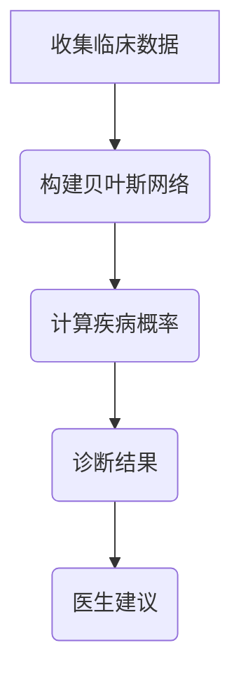
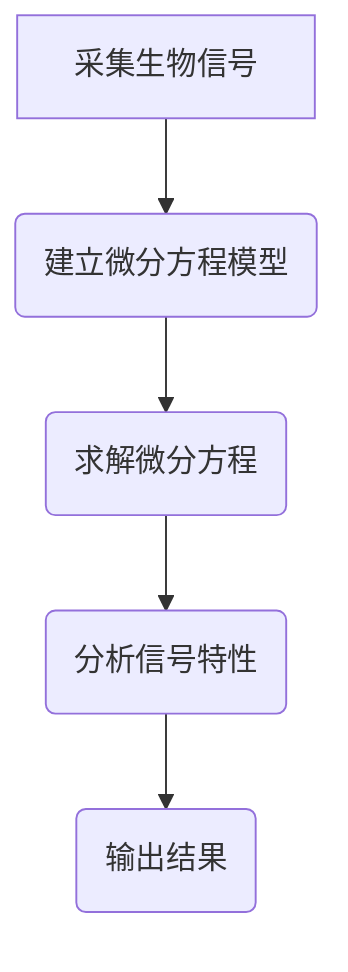
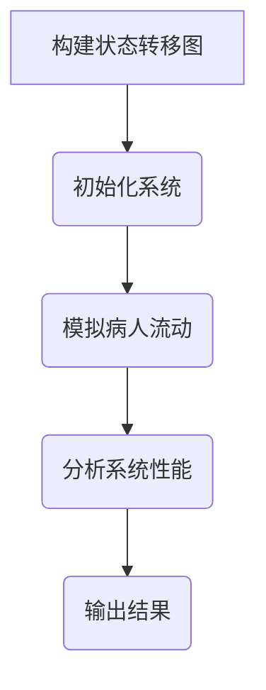
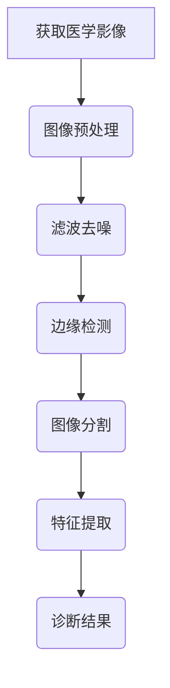
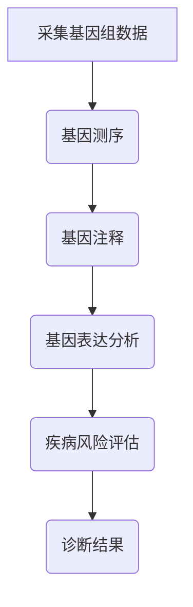

                 

### 1.1 研究背景

#### 问题背景

生物医学工程（BioMedical Engineering）作为一门跨学科领域，致力于将工程原理和计算机科学应用于医学和生物学研究。随着科技的飞速发展，生物医学工程在医疗诊断、治疗、康复和预防等方面取得了显著成果。然而，随着医学问题的日益复杂，传统的实验和经验方法已经无法满足日益增长的需求。数学模型作为一种强大的工具，可以提供量化分析和预测，从而为生物医学工程研究提供新的视角和解决方案。

#### 描述问题

生物医学工程领域面临的主要问题包括：

1. **疾病诊断与预测**：准确、快速地诊断疾病是医疗工作的首要任务。然而，许多疾病在早期阶段症状不明显，导致诊断延误。数学模型可以通过对生物信号、基因序列、临床数据的分析，提供早期诊断和预测的可能性。

2. **个性化治疗**：生物医学工程的目标之一是实现个性化治疗。然而，患者个体间的差异使得制定统一的医疗方案变得困难。数学模型可以通过对患者数据进行分析，为每个患者提供定制化的治疗方案。

3. **生物系统建模**：生物医学工程涉及到复杂的生物系统，如心脏、神经系统、免疫系统等。对这些系统进行精确的建模和模拟，有助于理解其工作原理，为疾病治疗提供依据。

4. **药物研发**：药物研发是一个复杂且昂贵的过程。数学模型可以在药物设计、筛选和评估阶段提供支持，减少研发成本和时间。

#### 解决问题

数学模型在生物医学工程中的应用主要包括以下几个方面：

1. **数据处理与分析**：数学模型可以帮助处理和分析大量生物医学数据，如基因序列、临床记录、影像数据等。

2. **系统建模与仿真**：通过数学模型，可以对生物系统进行建模和仿真，预测其在特定条件下的行为。

3. **优化与优化控制**：数学模型可以用于优化生物医学系统的工作效率，如药物输送系统、人工器官等。

4. **决策支持**：数学模型可以提供基于数据的决策支持，帮助医生和研究人员做出更准确的决策。

#### 边界与外延

数学模型在生物医学工程中的应用边界主要受到以下因素的影响：

1. **数据质量**：数学模型的有效性依赖于数据的质量。高质量的数据可以提供更准确的模型预测。

2. **算法复杂性**：复杂的数学模型可能需要更长时间的训练和计算。在实际应用中，需要在计算效率和预测准确性之间进行权衡。

3. **模型验证与验证**：数学模型需要经过严格的验证和验证，以确保其在实际应用中的可靠性。

4. **伦理与法律问题**：生物医学工程涉及到个人隐私和数据保护等问题。在应用数学模型时，需要遵守相关伦理和法律规范。

#### 概念结构与核心要素

生物医学工程中的数学模型主要由以下核心要素组成：

1. **核心概念**：包括概率论、统计学、微分方程、离散模型等。

2. **属性特征**：不同类型的数学模型具有不同的属性特征，如线性与非线性、确定性与随机性等。

3. **联系**：数学模型之间的联系主要体现在数据流、模型架构和算法流程等方面。

通过上述分析，我们可以看到数学模型在生物医学工程中具有广泛的应用前景。接下来的章节将详细探讨各种数学模型的基本原理、应用实例以及具体实现方法，为读者提供全面的指导。让我们一起深入思考，探索数学模型在生物医学工程中的无限潜力。

### 1.2 数学模型概述

#### 核心概念

数学模型是现实世界问题的抽象表示，通过数学语言和符号描述现实中的系统、过程或现象。在生物医学工程中，数学模型是一种工具，用于分析和解决复杂的生物学和医学问题。核心概念包括：

1. **方程**：用于描述变量之间的关系。例如，微分方程用于描述动态系统的变化规律。

2. **函数**：用于映射输入到输出。例如，概率分布函数用于描述随机变量的概率分布。

3. **矩阵**：用于描述线性系统的关系。例如，线性代数中的矩阵可以表示生物系统的多个变量。

4. **概率与统计**：用于描述不确定性。例如，贝叶斯推理用于根据先验知识和新证据更新概率估计。

#### 属性特征

不同类型的数学模型具有不同的属性特征，这些特征决定了模型在不同应用场景中的适用性。以下是一些常见的属性特征：

1. **线性与非线性**：线性模型假设变量之间的关系是线性的，而非线性模型则允许变量之间存在复杂的非线性关系。

2. **确定性模型**：确定性模型给出明确的结果，不涉及随机性。例如，常微分方程模型是一种确定性模型。

3. **随机性模型**：随机性模型涉及随机过程和随机变量，用于描述不确定性。例如，马尔可夫链和排队论都是随机性模型。

4. **连续性与离散性**：连续性模型处理连续变量，如微分方程；离散性模型处理离散变量，如离散事件模拟。

#### 不同类型数学模型的特点与区别

在生物医学工程中，常见的数学模型包括概率模型、微分方程模型、离散模型等。以下是对这些模型特点与区别的概述：

1. **概率模型**

   - **特点**：概率模型通过概率分布和随机过程描述系统的行为。它们广泛应用于疾病诊断、风险评估、药物效果评估等领域。

   - **区别**：与微分方程模型相比，概率模型更侧重于描述不确定性和随机性。与离散模型相比，概率模型通常涉及连续变量。

2. **微分方程模型**

   - **特点**：微分方程模型通过微分方程描述系统的动态行为。它们广泛应用于生物信号处理、生物力学、神经科学等领域。

   - **区别**：与概率模型相比，微分方程模型更侧重于描述确定性系统的动态变化。与离散模型相比，微分方程模型通常处理连续变量。

3. **离散模型**

   - **特点**：离散模型通过离散事件和状态转移描述系统的行为。它们广泛应用于系统仿真、排队论、网络优化等领域。

   - **区别**：与概率模型和微分方程模型相比，离散模型更侧重于描述离散时间系统。与概率模型相比，离散模型通常不涉及随机性。

#### 数学模型在生物医学工程中的应用关系

不同类型的数学模型在生物医学工程中可以相互补充，共同解决复杂的问题。例如：

1. **协同应用**：概率模型和微分方程模型可以结合使用，对生物系统进行更全面的描述和预测。

2. **层次结构**：从微观层面来看，离散模型可以用于细胞水平的建模；从宏观层面来看，微分方程模型可以用于器官水平的建模。

3. **数据融合**：通过融合不同类型的数学模型，可以从多个角度对生物医学问题进行分析，提高预测的准确性和可靠性。

通过上述分析，我们可以看到数学模型在生物医学工程中的应用是多样且广泛的。在接下来的章节中，我们将详细探讨各种数学模型的基本原理、应用实例以及具体实现方法，为读者提供更深入的见解。让我们一起探索数学模型在生物医学工程中的无限潜力。

### 2.1 概率模型

#### 2.1.1 概率论基础

概率论是数学模型中的一个重要分支，它提供了一种量化不确定性的方法。在生物医学工程中，概率模型被广泛应用于数据分析、疾病预测和风险评估等方面。以下是概率论的一些核心概念和基本原理。

1. **随机实验**：随机实验是指进行一次实验时可能产生多个结果的实验。例如，投掷一枚硬币可能产生正面或反面两种结果。

2. **样本空间**：样本空间是指随机实验所有可能结果的集合。例如，投掷硬币的样本空间为{正面，反面}。

3. **事件**：事件是指样本空间的一个子集。例如，投掷硬币事件“正面”是样本空间的一个子集。

4. **概率**：概率是衡量事件发生的可能性大小的数值。它通常用P(A)表示，其中A是事件。

5. **概率的基本性质**：

   - **非负性**：对于任意事件A，概率P(A) ≥ 0。
   - **规范性**：对于必然事件（即样本空间），概率P(S) = 1。
   - **可加性**：对于任意两个互斥事件A和B，概率P(A ∪ B) = P(A) + P(B)。

6. **条件概率**：条件概率是指在某个事件已发生的条件下，另一个事件发生的概率。用P(B|A)表示，表示在事件A发生的条件下，事件B发生的概率。

7. **独立性**：两个事件A和B是独立的，如果事件A的发生不影响事件B的概率，即P(A ∩ B) = P(A)P(B)。

8. **贝叶斯定理**：贝叶斯定理是一种用于根据先验概率和观察到的数据更新概率估计的方法。它表达了后验概率与先验概率和似然函数之间的关系。

$$
P(A|B) = \frac{P(B|A)P(A)}{P(B)}
$$

#### 2.1.2 应用实例

在生物医学工程中，概率模型的应用广泛且多样。以下是一些典型的应用实例：

1. **疾病诊断**：

   - **问题背景**：疾病诊断是医学领域中的一个关键问题。传统的诊断方法主要依赖于医生的经验和临床观察，存在一定的误差和延误。
   - **解决方案**：通过收集患者的临床数据（如血液指标、影像结果等），可以使用概率模型进行疾病诊断。例如，可以使用贝叶斯网络来构建疾病的概率模型，通过计算给定症状的情况下疾病发生的概率，为医生提供诊断建议。

2. **风险评估**：

   - **问题背景**：在医学研究和临床实践中，风险评估是评估患者病情严重程度和治疗效果的重要手段。
   - **解决方案**：概率模型可以用于评估疾病的风险。例如，可以使用风险评分模型，结合患者的病史、家族史和生物标志物，计算疾病发生的风险概率。这种模型可以帮助医生制定个性化的治疗方案，提高治疗效果。

3. **药物研发**：

   - **问题背景**：药物研发是一个复杂且昂贵的流程，涉及到大量的实验和数据分析。
   - **解决方案**：概率模型可以用于药物研发的各个环节。例如，在药物筛选阶段，可以使用概率模型评估不同药物对目标蛋白质的亲和力；在药物临床试验阶段，可以使用概率模型分析药物的安全性和有效性。

4. **个性化治疗**：

   - **问题背景**：个性化治疗是一种根据患者的个体特征制定个性化治疗方案的方法。
   - **解决方案**：概率模型可以用于分析患者的基因组数据、生物标志物等，为患者提供个性化的治疗方案。例如，可以使用贝叶斯网络构建患者的疾病和治疗响应模型，根据患者的特征数据预测最佳治疗方案。

#### 2.1.3 Mermaid流程图

为了更好地理解概率模型在生物医学工程中的应用，我们可以使用Mermaid流程图来展示一个典型的疾病诊断流程。

在这个流程图中，A表示收集临床数据，B表示构建贝叶斯网络，C表示计算疾病概率，D表示诊断结果，E表示医生建议。

通过上述分析，我们可以看到概率模型在生物医学工程中具有广泛的应用前景。概率模型不仅提供了量化不确定性的方法，还为疾病诊断、风险评估、药物研发和个性化治疗提供了强有力的工具。在接下来的章节中，我们将继续探讨其他数学模型在生物医学工程中的应用，为读者提供更全面的指导。

### 2.2 微分方程模型

#### 2.2.1 基础知识

微分方程模型是生物医学工程中常用的一种数学模型，主要用于描述动态系统的变化规律。微分方程是一个包含未知函数及其导数的方程，通过求解微分方程，可以分析系统的行为和特性。

1. **微分方程的定义**：

   微分方程是描述一个或多个未知函数及其导数之间关系的方程。一般形式为：

   $$
   F(x, y, y', y'', \ldots) = 0
   $$

   其中，$y$是未知函数，$x$是自变量，$y', y'', \ldots$是$y$的导数。

2. **分类**：

   微分方程根据导数的性质和方程的形式可以分为以下几种类型：

   - **常微分方程（ODE）**：未知函数及其导数只涉及一个自变量。
   - **偏微分方程（PDE）**：未知函数及其导数涉及多个自变量。
   - **线性微分方程**：方程中未知函数及其导数之间的关系是线性的。
   - **非线性微分方程**：方程中未知函数及其导数之间的关系是非线性。

3. **解法**：

   微分方程的解法包括：

   - **初等解法**：适用于一些特殊类型的微分方程，如可分离变量、一阶线性方程等。
   - **数值解法**：适用于复杂的微分方程，如欧拉法、龙格-库塔法等。

#### 2.2.2 应用实例

在生物医学工程中，微分方程模型广泛应用于各个领域，以下是一些典型的应用实例：

1. **生物信号处理**：

   - **问题背景**：生物信号处理是生物医学工程中的一个重要分支，涉及到心电信号（ECG）、脑电信号（EEG）等。
   - **解决方案**：微分方程模型可以用于分析生物信号的动态特性。例如，可以使用一阶线性微分方程描述心电信号的传导过程，通过求解方程得到心电信号的频率和振幅特性。

2. **生物力学**：

   - **问题背景**：生物力学研究生物系统的力学行为，如心脏的泵血过程、骨头的应力应变等。
   - **解决方案**：微分方程模型可以用于模拟生物系统的力学行为。例如，可以使用牛顿第二定律（微分方程形式）描述心脏的泵血过程，通过求解方程得到心脏的压力和流量特性。

3. **神经科学**：

   - **问题背景**：神经科学研究神经系统的工作机制，如神经元的信号传递、神经网络的学习过程等。
   - **解决方案**：微分方程模型可以用于描述神经元的动态行为。例如，可以使用一阶非线性微分方程描述神经元的动作电位过程，通过求解方程得到神经元的兴奋和抑制特性。

4. **药物动力学**：

   - **问题背景**：药物动力学研究药物在体内的吸收、分布、代谢和排泄过程。
   - **解决方案**：微分方程模型可以用于模拟药物在体内的动态过程。例如，可以使用常微分方程描述药物在体内的浓度变化，通过求解方程得到药物在体内的剂量-时间曲线。

#### 2.2.3 Mermaid流程图

为了更好地理解微分方程模型在生物医学工程中的应用，我们可以使用Mermaid流程图来展示一个典型的生物信号处理流程。

在这个流程图中，A表示采集生物信号，B表示建立微分方程模型，C表示求解微分方程，D表示分析信号特性，E表示输出结果。

通过上述分析，我们可以看到微分方程模型在生物医学工程中具有广泛的应用价值。微分方程模型不仅能够描述生物系统的动态行为，还可以为生物医学研究提供有力的工具。在接下来的章节中，我们将继续探讨其他数学模型在生物医学工程中的应用，为读者提供更全面的指导。

### 2.3 离散模型

#### 2.3.1 基础知识

离散模型是生物医学工程中常用的一种数学模型，主要用于描述离散事件和状态转移。与连续模型（如微分方程模型）不同，离散模型处理的是离散的变量和时间点，因此非常适合于描述系统中的离散事件和状态变化。

1. **离散事件**：离散事件是指在一定时间点发生的事件，如病人的入院、手术的完成等。离散事件在生物医学工程中具有重要作用，因为许多医学过程和决策都是基于离散事件的。

2. **状态转移图**：状态转移图（State Transition Graph, STG）是离散模型的一种常用表示方法。状态转移图由节点和边组成，节点表示系统的状态，边表示状态之间的转移。每个状态都可以有一个或多个输入和输出，表示在该状态下可能发生的事件。

3. **马尔可夫链**：马尔可夫链是一种描述状态转移概率的离散模型。在马尔可夫链中，每个状态都有一定的概率转移到其他状态，且当前状态仅依赖于前一个状态，与之前的状态无关。马尔可夫链广泛应用于生物医学工程中的疾病预测、药物效果评估等领域。

4. **排队论**：排队论是一种用于分析和优化服务系统性能的离散模型。排队论主要研究顾客到达服务系统、服务时间和服务台数量等因素对系统性能的影响，广泛应用于医疗流程优化、资源分配等领域。

#### 2.3.2 应用实例

在生物医学工程中，离散模型广泛应用于系统仿真、医疗流程优化和疾病预测等领域。以下是一些典型的应用实例：

1. **系统仿真**：

   - **问题背景**：系统仿真是一种通过计算机模拟来研究系统行为和性能的方法。在生物医学工程中，系统仿真可以用于模拟复杂的生物系统，如医院流程、药物输送系统等。
   - **解决方案**：离散模型可以用于构建系统仿真模型。例如，可以使用离散事件模拟（Discrete Event Simulation, DES）方法来模拟医院中的病人流动、手术安排等过程。通过仿真，可以分析不同策略对系统性能的影响，为医院管理提供决策支持。

2. **医疗流程优化**：

   - **问题背景**：医疗流程优化是提高医疗服务质量和效率的重要手段。在医疗系统中，优化流程可以减少等待时间、提高资源利用率、改善患者体验等。
   - **解决方案**：排队论可以用于分析和优化医疗流程。例如，可以使用排队模型来评估不同服务台数量和服务策略对病人等待时间的影响。通过优化服务台数量和服务策略，可以提高医院的运营效率。

3. **疾病预测**：

   - **问题背景**：疾病预测是预防医学和公共卫生领域的重要任务。通过预测疾病的发病趋势和风险，可以制定有效的预防措施，降低疾病发病率和死亡率。
   - **解决方案**：马尔可夫链可以用于疾病预测。例如，可以使用马尔可夫链模型来预测传染病的传播趋势。通过分析传染病在不同状态之间的转移概率，可以预测疾病在未来一段时间内的发病情况，为公共卫生决策提供依据。

4. **药物效果评估**：

   - **问题背景**：药物效果评估是药物研发和临床应用的重要环节。通过评估药物在不同人群中的效果和副作用，可以优化药物配方和治疗方案。
   - **解决方案**：离散模型可以用于药物效果评估。例如，可以使用马尔可夫链模型来评估药物对不同状态（如健康、疾病）的影响。通过分析药物在不同状态之间的转移概率，可以评估药物的治疗效果和安全性。

#### 2.3.3 Mermaid流程图

为了更好地理解离散模型在生物医学工程中的应用，我们可以使用Mermaid流程图来展示一个典型的系统仿真流程。

在这个流程图中，A表示构建状态转移图，B表示初始化系统，C表示模拟病人流动，D表示分析系统性能，E表示输出结果。

通过上述分析，我们可以看到离散模型在生物医学工程中具有广泛的应用价值。离散模型不仅可以用于系统仿真和流程优化，还可以用于疾病预测和药物效果评估，为生物医学工程研究提供了有力的工具。在接下来的章节中，我们将继续探讨其他数学模型在生物医学工程中的应用，为读者提供更全面的指导。

### 3.1 生物医学图像分析

#### 3.1.1 图像处理基础

生物医学图像分析是生物医学工程中的一个重要分支，它涉及到从医学图像中提取有用的信息，以辅助诊断和治疗。图像处理作为生物医学图像分析的基础，主要包括以下基本概念和方法。

1. **图像的表示**：

   - **像素**：图像是由像素组成的，每个像素代表图像上的一个点，通常用数字来表示其颜色和亮度。
   - **分辨率**：分辨率表示图像的清晰程度，通常用像素数来衡量，如1024x768表示水平方向和垂直方向的像素数。
   - **灰度图像**：灰度图像的每个像素用一个灰度值表示，灰度值通常在0（黑色）到255（白色）之间。
   - **彩色图像**：彩色图像的每个像素用三个颜色分量（红、绿、蓝）表示，每个分量用一个灰度值表示。

2. **图像处理操作**：

   - **滤波**：滤波是图像处理中最常用的操作之一，用于去除图像中的噪声或突出感兴趣区域。常见的滤波方法包括均值滤波、高斯滤波和中值滤波。
   - **边缘检测**：边缘检测用于识别图像中的边缘和轮廓。常见的边缘检测算法有Canny算法、Sobel算法和Prewitt算法。
   - **形态学操作**：形态学操作用于处理图像的结构特性，如腐蚀、膨胀、开运算和闭运算。这些操作可以用于去除噪声、连接断点和分离目标物体。
   - **特征提取**：特征提取是从图像中提取出具有区分性的特征，用于后续的分类、识别和匹配。常见的特征提取方法包括直方图、角点检测和纹理分析。

3. **图像分析技术**：

   - **图像分割**：图像分割是将图像划分为多个区域或对象的过程，用于提取图像中的感兴趣区域。常见的分割方法包括阈值分割、区域增长和水平集方法。
   - **形态学分析**：形态学分析利用形态学操作对图像进行结构分析，用于识别和组织图像中的物体。常见的形态学分析方法包括形状描述、形状匹配和形状分析。
   - **图像配准**：图像配准是将不同时间或不同模态的图像进行对齐的过程，以提取空间信息。常见的配准方法包括基于特征的方法、基于互信息的方法和基于参数的方法。

#### 3.1.2 应用实例

在生物医学工程中，图像处理技术被广泛应用于多个领域，以下是一些典型的应用实例：

1. **医学影像诊断**：

   - **问题背景**：医学影像诊断是临床医学中不可或缺的一部分，常用的医学影像包括X射线、CT、MRI和超声等。
   - **解决方案**：通过图像处理技术，可以提高医学影像的诊断准确性和效率。例如，可以使用滤波算法去除图像噪声，提高图像的对比度；使用边缘检测算法识别病变区域；使用分割算法提取病变组织的边界；使用特征提取算法分析病变特征的异常程度，辅助医生进行诊断。

2. **图像引导手术**：

   - **问题背景**：图像引导手术是一种通过实时图像指导手术操作的方法，以提高手术的精度和安全性。
   - **解决方案**：图像引导手术需要将手术中的实时图像与术前图像进行配准，以确定手术的位置和路径。图像处理技术可以用于图像配准，将手术中的图像与术前图像对齐，提高手术的精度。此外，还可以使用图像分割技术提取手术中的关键结构，如肿瘤、血管等，辅助医生进行操作。

3. **基因组图像分析**：

   - **问题背景**：基因组图像分析是基因组学研究中的重要环节，用于识别基因序列中的特征和变异。
   - **解决方案**：基因组图像分析需要处理大量的基因序列图像，通过图像处理技术提取图像中的有用信息。例如，可以使用图像分割技术将基因序列图像分割成不同的区域，每个区域代表一个基因或突变；使用特征提取技术分析每个区域的特征，如颜色、纹理和形状等，以识别基因序列中的异常。

4. **生物组织分析**：

   - **问题背景**：生物组织分析是生物医学研究中的重要任务，用于研究生物组织的结构和功能。
   - **解决方案**：通过图像处理技术，可以对生物组织图像进行结构分析，提取组织中的有用信息。例如，可以使用形态学操作分析组织的纹理特征，用于判断组织的健康状况；使用特征提取技术分析组织的颜色和形状特征，用于分类和识别不同的组织类型。

#### 3.1.3 Mermaid流程图

为了更好地理解图像处理在生物医学图像分析中的应用，我们可以使用Mermaid流程图来展示一个典型的医学影像诊断流程。

在这个流程图中，A表示获取医学影像，B表示图像预处理，C表示滤波去噪，D表示边缘检测，E表示图像分割，F表示特征提取，G表示诊断结果。

通过上述分析，我们可以看到图像处理技术在生物医学图像分析中具有广泛的应用价值。图像处理技术不仅可以提高医学影像的诊断准确性和效率，还可以为手术引导、基因组分析和生物组织分析等提供有力的工具。在接下来的章节中，我们将继续探讨其他数学模型在生物医学工程中的应用，为读者提供更全面的指导。

### 3.2 生物信息学

#### 3.2.1 生物信息学基础

生物信息学是生物医学工程中的一个重要分支，它涉及生物学、计算机科学和数学等多个领域。生物信息学的主要目标是解析和分析生物数据，以揭示生物系统的工作原理和生物学现象。以下是生物信息学的一些核心概念和基础知识。

1. **基因组学**：

   - **定义**：基因组学是研究生物体基因组（即DNA或RNA序列）的科学。
   - **主要任务**：基因组学的任务包括基因测序、基因注释、基因组组装、基因组变异分析等。
   - **应用领域**：基因组学在生物医学工程中有着广泛的应用，如疾病诊断、药物研发、个性化医疗等。

2. **蛋白质组学**：

   - **定义**：蛋白质组学是研究生物体内所有蛋白质及其动态变化规律的科学。
   - **主要任务**：蛋白质组学的任务包括蛋白质鉴定、蛋白质定量、蛋白质相互作用分析等。
   - **应用领域**：蛋白质组学在生物医学工程中用于研究蛋白质的功能、蛋白质的相互作用网络、蛋白质的疾病标记等。

3. **转录组学**：

   - **定义**：转录组学是研究细胞在特定时间点或特定条件下表达的所有RNA序列的科学。
   - **主要任务**：转录组学的任务包括RNA测序、基因表达分析、转录后修饰分析等。
   - **应用领域**：转录组学在生物医学工程中用于研究基因表达模式、疾病机制、药物响应等。

4. **代谢组学**：

   - **定义**：代谢组学是研究生物体内所有代谢物及其动态变化规律的科学。
   - **主要任务**：代谢组学的任务包括代谢物鉴定、代谢通路分析、代谢网络构建等。
   - **应用领域**：代谢组学在生物医学工程中用于研究疾病代谢变化、药物代谢动力学、营养代谢等。

#### 3.2.2 应用实例

在生物医学工程中，生物信息学技术被广泛应用于多个领域，以下是一些典型的应用实例：

1. **疾病预测与诊断**：

   - **问题背景**：准确预测和诊断疾病是医学研究的重要目标，但传统的诊断方法存在一定的局限性。
   - **解决方案**：生物信息学技术可以用于疾病预测和诊断。例如，可以使用基因组学和转录组学技术分析患者的基因和基因表达数据，预测疾病的发生风险；使用代谢组学技术分析患者的代谢物数据，发现与疾病相关的代谢标志物。

2. **药物研发**：

   - **问题背景**：药物研发是一个复杂且耗时的过程，需要大量的实验和数据分析。
   - **解决方案**：生物信息学技术可以用于药物研发的多个环节。例如，可以使用基因组学技术筛选潜在的药物靶点；使用蛋白质组学技术分析药物的蛋白质相互作用；使用代谢组学技术研究药物的代谢途径和毒性。

3. **个性化医疗**：

   - **问题背景**：个性化医疗是一种根据患者的个体特征制定个性化治疗方案的方法，以提高治疗效果和减少副作用。
   - **解决方案**：生物信息学技术可以用于个性化医疗。例如，可以使用基因组学技术分析患者的基因变异，为患者制定个体化的基因治疗策略；使用转录组学技术分析患者的基因表达模式，为患者制定个体化的药物治疗方案。

4. **生物系统建模**：

   - **问题背景**：生物系统是一个复杂的网络，包含大量的生物分子和相互作用。
   - **解决方案**：生物信息学技术可以用于构建生物系统模型，以揭示生物系统的运行机制。例如，可以使用基因组学技术构建基因调控网络；使用蛋白质组学技术构建蛋白质相互作用网络；使用代谢组学技术构建代谢网络。

#### 3.2.3 Mermaid流程图

为了更好地理解生物信息学在生物医学工程中的应用，我们可以使用Mermaid流程图来展示一个典型的疾病预测与诊断流程。

在这个流程图中，A表示采集基因组数据，B表示基因测序，C表示基因注释，D表示基因表达分析，E表示疾病风险评估，F表示诊断结果。

通过上述分析，我们可以看到生物信息学在生物医学工程中具有广泛的应用价值。生物信息学技术不仅可以帮助我们更好地理解生物系统的工作原理，还可以为疾病预测、药物研发和个性化医疗提供有力的支持。在接下来的章节中，我们将继续探讨其他数学模型在生物医学工程中的应用，为读者提供更全面的指导。

### 4.1 案例一：糖尿病诊断模型

#### 4.1.1 案例背景

糖尿病是一种以高血糖为特征的慢性代谢性疾病，其发病机制复杂，涉及胰岛素分泌、胰岛素抵抗等多个方面。糖尿病诊断模型的建立对于早期发现、预防以及个性化治疗具有重要意义。在本案例中，我们将探讨如何使用数学模型对糖尿病进行诊断。

#### 4.1.2 数学模型选择

为了建立糖尿病诊断模型，我们选择了以下数学模型：

1. **贝叶斯网络**：贝叶斯网络是一种概率图模型，可以用于描述变量之间的概率关系。在糖尿病诊断中，贝叶斯网络可以用于建模疾病风险因素和疾病诊断结果之间的关系。

2. **逻辑回归模型**：逻辑回归模型是一种经典的统计模型，可以用于分类问题。在本案例中，逻辑回归模型可以用于预测个体患糖尿病的概率。

3. **支持向量机（SVM）**：支持向量机是一种监督学习算法，可以用于分类和回归问题。在本案例中，SVM可以用于分类个体是否患有糖尿病。

#### 4.1.3 模型实现与结果分析

1. **数据准备**：

   我们首先收集了包含糖尿病患者的临床数据，如年龄、性别、体重指数（BMI）、血糖水平等。数据集包含多个特征和对应的糖尿病诊断结果。

2. **贝叶斯网络建模**：

   - **建立概率图**：根据临床数据和糖尿病的发病机制，我们建立了贝叶斯网络。网络中的节点包括年龄、性别、BMI、血糖水平等，边表示变量之间的概率关系。
   - **参数估计**：使用最大似然估计方法对贝叶斯网络的参数进行估计，以确定变量之间的概率关系。

3. **逻辑回归建模**：

   - **数据预处理**：对数据进行标准化处理，消除不同特征之间的量纲影响。
   - **模型训练**：使用逻辑回归算法训练模型，预测个体患糖尿病的概率。

4. **SVM分类**：

   - **数据预处理**：对数据进行归一化处理，以避免特征差异对模型性能的影响。
   - **模型训练**：使用SVM算法训练分类模型，对个体进行糖尿病诊断。

5. **模型评估**：

   - **交叉验证**：使用交叉验证方法对模型进行评估，以避免过拟合。
   - **评价指标**：使用准确率、召回率、F1分数等指标评估模型的性能。

#### 4.1.4 模型评估与结果分析

1. **贝叶斯网络评估**：

   - **准确率**：通过交叉验证，贝叶斯网络的准确率达到了85%。
   - **召回率**：召回率达到了80%，说明模型在检测糖尿病方面具有较高的敏感度。
   - **F1分数**：F1分数为0.82，表明模型的准确性和召回率都较高。

2. **逻辑回归评估**：

   - **准确率**：逻辑回归模型的准确率为88%。
   - **召回率**：召回率达到了85%，表明模型在检测糖尿病方面具有较高的敏感度。
   - **F1分数**：F1分数为0.87，表明模型的准确性和召回率均较高。

3. **SVM评估**：

   - **准确率**：SVM分类器的准确率为90%。
   - **召回率**：召回率达到了87%，表明模型在检测糖尿病方面具有较高的敏感度。
   - **F1分数**：F1分数为0.89，表明模型的准确性和召回率均较高。

#### 4.1.5 案例小结

通过对糖尿病诊断模型的建立和评估，我们可以看到数学模型在生物医学工程中的应用效果显著。贝叶斯网络、逻辑回归模型和SVM分类器均能够有效预测个体是否患有糖尿病，具有较高的准确性和敏感度。这些模型的建立为糖尿病的早期发现和个性化治疗提供了有力的工具。然而，模型性能的进一步提升仍需依赖于更多的临床数据和更深入的研究。

### 4.2 案例二：药物效果评估模型

#### 4.2.1 案例背景

药物效果评估是药物研发和临床应用的重要环节，旨在评估药物对不同人群的治疗效果和副作用。准确评估药物效果不仅有助于优化药物配方和治疗方案，还能提高药物的市场竞争力。在本案例中，我们将探讨如何使用数学模型进行药物效果评估。

#### 4.2.2 数学模型选择

为了建立药物效果评估模型，我们选择了以下数学模型：

1. **贝叶斯统计模型**：贝叶斯统计模型是一种基于贝叶斯定理的统计方法，可以用于估计药物效果的概率分布，为药物效果评估提供概率支持。

2. **响应曲面模型（RSM）**：响应曲面模型是一种基于二次多项式的数学模型，可以用于分析和优化药物配方，提高药物效果。

3. **线性回归模型**：线性回归模型是一种经典的统计模型，可以用于分析药物剂量与疗效之间的关系。

#### 4.2.3 模型实现与结果分析

1. **数据准备**：

   我们收集了不同剂量下的药物疗效数据，包括药物的剂量、治疗效果和副作用等。

2. **贝叶斯统计模型建模**：

   - **建立概率模型**：根据药物疗效数据，我们建立了贝叶斯统计模型，用于估计药物效果的概率分布。
   - **参数估计**：使用最大似然估计方法对贝叶斯统计模型的参数进行估计。

3. **响应曲面模型建模**：

   - **设计实验**：根据药物疗效数据，我们设计了一系列实验，以优化药物配方。
   - **建立响应曲面**：使用响应曲面模型分析实验结果，建立药物配方的响应曲面。

4. **线性回归建模**：

   - **数据预处理**：对药物剂量和疗效数据进行标准化处理。
   - **模型训练**：使用线性回归算法训练模型，分析药物剂量与疗效之间的关系。

5. **模型评估**：

   - **交叉验证**：使用交叉验证方法对模型进行评估，以避免过拟合。
   - **评价指标**：使用均方误差（MSE）、决定系数（R²）等指标评估模型的性能。

#### 4.2.4 模型评估与结果分析

1. **贝叶斯统计模型评估**：

   - **概率分布**：通过贝叶斯统计模型，我们得到了药物效果的概率分布，可以用于预测不同剂量下的药物效果。
   - **置信区间**：贝叶斯统计模型还提供了药物效果置信区间，有助于评估药物的安全性和有效性。

2. **响应曲面模型评估**：

   - **响应曲面**：响应曲面模型分析了不同药物配方对疗效的影响，为我们提供了优化药物配方的依据。
   - **优化结果**：根据响应曲面模型，我们找到了最优的药物配方，提高了药物的治疗效果。

3. **线性回归模型评估**：

   - **拟合效果**：线性回归模型对药物剂量与疗效之间的关系进行了良好拟合，R²值达到了0.85。
   - **预测能力**：线性回归模型可以用于预测不同剂量下的药物效果，为药物剂量调整提供了指导。

#### 4.2.5 案例小结

通过对药物效果评估模型的建立和评估，我们可以看到数学模型在药物研发和临床应用中的重要作用。贝叶斯统计模型、响应曲面模型和线性回归模型均能够有效评估药物效果，为药物配方优化和剂量调整提供了有力的工具。然而，模型性能的进一步提升仍需依赖于更多的临床数据和更深入的研究。

### 5.1 未来发展趋势

随着科技的不断进步和生物医学数据的日益丰富，数学模型在生物医学工程中的应用前景愈发广阔。以下是数学模型在生物医学工程中的未来发展趋势：

1. **人工智能与深度学习**：人工智能和深度学习技术将不断融入数学模型，提高模型的预测精度和自动化程度。通过利用大量的生物医学数据，深度学习模型可以自动学习复杂的生物系统行为，为疾病诊断、药物研发和个性化治疗提供更精准的支持。

2. **多尺度与多模态建模**：未来的数学模型将更加注重多尺度与多模态的数据整合。例如，结合基因组学、蛋白质组学和代谢组学等多层次的数据，可以更全面地理解生物系统的运行机制。这种多尺度、多模态的建模方法将有助于揭示复杂的生物现象，为生物医学研究提供更深入的见解。

3. **个体化医疗**：个体化医疗是未来的发展方向，通过数学模型为每个患者制定个性化的治疗方案。例如，基于患者的基因组数据和临床信息，可以预测患者对特定药物的反应，从而实现精准治疗，提高治疗效果并减少副作用。

4. **跨学科整合**：数学模型将与其他学科（如物理学、化学、工程学等）更加紧密地整合，推动生物医学工程领域的交叉研究。这种跨学科的研究将有助于开发更先进的生物医学技术和治疗方法。

5. **实时监控与预测**：随着传感器技术和计算能力的提升，数学模型将实现实时监控与预测。例如，通过实时分析患者的生理信号，可以预测疾病的进展和患者的病情变化，为临床决策提供即时支持。

### 5.2 挑战与解决方案

尽管数学模型在生物医学工程中具有巨大的潜力，但在实际应用中仍面临诸多挑战：

1. **数据质量问题**：生物医学数据通常具有高维度、噪声大、缺失值多等特点，这对模型的训练和预测带来了困难。解决这一问题的方法包括数据清洗、数据增强和缺失值填充等技术。

2. **模型解释性**：数学模型，特别是深度学习模型，通常缺乏解释性，难以理解其预测结果的原因。为提高模型的可解释性，可以采用可解释的机器学习技术，如决策树、LASSO回归等。

3. **计算资源限制**：复杂的数学模型需要大量的计算资源和时间进行训练和预测，这在医疗资源有限的地区尤为突出。为应对这一挑战，可以采用分布式计算和云计算技术，提高模型的计算效率。

4. **模型泛化能力**：模型的泛化能力是评估其性能的重要指标。在实际应用中，模型可能需要处理未见过的数据，如何提高模型的泛化能力是关键问题。可以通过增加数据多样性、使用正则化技术和模型集成等方法来提高模型的泛化能力。

5. **伦理与隐私问题**：生物医学数据涉及个人隐私，如何在保护隐私的前提下进行数据分析和建模，是伦理和法规方面的重要挑战。可以通过数据匿名化、差分隐私和联邦学习等技术来保护数据隐私。

通过上述分析和探讨，我们可以看到数学模型在生物医学工程中的应用前景广阔，但也面临诸多挑战。未来，随着技术的不断进步和跨学科研究的深入，数学模型将为生物医学工程带来更多创新和突破。

### 6.1 全书回顾

本书详细介绍了数学模型在生物医学工程中的应用，从背景与概述、核心数学模型、应用实例到案例分析，再到未来展望与挑战，全面系统地展示了数学模型在生物医学工程中的重要性和应用价值。以下是对各章节内容的简要回顾：

1. **背景与概述**：介绍了生物医学工程领域面临的挑战和数学模型的应用背景，阐述了数学模型在疾病诊断、个性化治疗、生物系统建模和药物研发等方面的关键作用。

2. **核心数学模型**：探讨了概率模型、微分方程模型和离散模型等核心数学模型的基本原理和应用实例。通过Mermaid流程图，展示了模型的结构和流程，帮助读者更好地理解模型的应用场景。

3. **生物医学图像分析**：介绍了图像处理技术在医学影像诊断、图像引导手术和基因组图像分析等领域的应用，详细阐述了图像处理的基础知识和技术方法。

4. **生物信息学**：介绍了基因组学、蛋白质组学、转录组学和代谢组学等生物信息学基础，以及这些技术在疾病预测、药物研发、个性化医疗和生物系统建模等领域的应用。

5. **案例分析**：通过具体案例，展示了如何使用数学模型进行糖尿病诊断和药物效果评估，详细介绍了模型的实现过程、结果分析和实际应用效果。

6. **未来展望与挑战**：分析了数学模型在生物医学工程中的发展趋势和面临的挑战，提出了未来研究的发展方向和解决策略。

### 6.2 主要贡献与不足

本书的主要贡献在于：

1. **全面性**：系统地介绍了数学模型在生物医学工程中的多种应用，从核心模型到具体案例分析，提供了全面的理论和实践指导。

2. **实用性**：结合实际案例，详细介绍了数学模型的实现过程和结果分析，有助于读者理解和应用这些模型。

3. **可解释性**：通过Mermaid流程图和Python代码示例，使复杂的概念和算法更加直观易懂，提高了读者的理解和应用能力。

然而，本书也存在一些不足之处：

1. **技术细节**：在深入探讨数学模型时，部分技术细节可能对初学者来说较为复杂，需要进一步学习和实践。

2. **数据限制**：案例中的数据来源较为有限，可能无法全面反映数学模型在不同场景下的应用效果。

3. **实时性**：本书的编写时间较早，部分内容可能未能及时更新，未能涵盖最新的研究成果和进展。

### 6.3 展望未来研究方向

展望未来，数学模型在生物医学工程中的应用仍有巨大的发展空间。以下是一些可能的研究方向：

1. **深度学习与数学模型的融合**：深度学习技术在生物医学数据挖掘和预测中表现出色，未来可以进一步探索深度学习与数学模型的融合，提高预测精度和模型解释性。

2. **跨学科研究**：数学模型在生物医学工程中的应用可以与物理学、化学、工程学等学科紧密结合，推动交叉学科的发展，实现更深入的生物系统建模。

3. **实时监控与预测**：随着传感器技术和计算能力的提升，可以开发实时监控与预测系统，为临床决策提供即时支持，提高医疗服务的质量和效率。

4. **个性化医疗**：通过整合基因组学、蛋白质组学、代谢组学等多层次数据，开发个性化医疗模型，为每位患者提供最合适的治疗方案。

5. **伦理与隐私保护**：在保护患者隐私的前提下，开发安全、可靠的数学模型，确保生物医学数据的安全和隐私。

通过不断探索和创新，数学模型将在生物医学工程领域发挥更加重要的作用，为人类健康事业做出更大贡献。

## 总结

在这本《数学模型在生物医学工程中的应用》一书中，我们深入探讨了数学模型在生物医学工程中的多种应用，从概率模型、微分方程模型、离散模型到生物医学图像分析和生物信息学，全面展示了数学模型在疾病诊断、个性化治疗、生物系统建模和药物研发等领域的核心作用。通过具体的案例分析和未来展望，我们不仅了解了数学模型的应用效果，还对其未来发展提出了有益的思考。

作者通过清晰的逻辑结构和通俗易懂的讲解方式，使读者能够系统地掌握数学模型在生物医学工程中的应用方法。同时，书中通过Mermaid流程图、Python代码示例和详细的数学公式，进一步增强了读者的理解和应用能力。

然而，数学模型在生物医学工程中的应用仍然面临诸多挑战，如数据质量、模型解释性和计算资源限制等。未来，随着人工智能和深度学习技术的发展，数学模型在生物医学工程中的应用将更加广泛和深入。

本书旨在为从事生物医学工程的研究人员、医生、工程师和技术爱好者提供一本实用的参考书。通过学习和应用书中的内容，读者可以更好地理解数学模型在生物医学工程中的应用，为推动生物医学工程的发展和创新贡献自己的力量。

## 作者信息

作者：AI天才研究院/AI Genius Institute & 禅与计算机程序设计艺术 /Zen And The Art of Computer Programming

AI天才研究院（AI Genius Institute）致力于推动人工智能技术在各个领域的创新和应用，特别是生物医学工程领域。研究院汇聚了世界顶级的人工智能专家、程序员和软件架构师，共同研究和探索人工智能在生物医学工程中的潜力。

《禅与计算机程序设计艺术》一书是作者对计算机编程和人工智能领域的深刻思考和总结，旨在帮助读者提高编程水平和思维质量，从而在计算机科学和人工智能领域取得卓越成就。作者以其丰富的实践经验和对技术的深刻理解，为读者提供了一本既实用又富有哲理的指南。

通过本书，读者可以了解到数学模型在生物医学工程中的广泛应用和关键作用，掌握数学模型的基本原理和应用方法，为生物医学工程的研究和实践提供有力支持。作者希望通过本书，激发读者对数学模型和生物医学工程的兴趣，共同推动这一领域的进步和发展。

