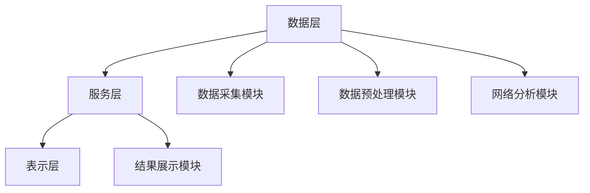
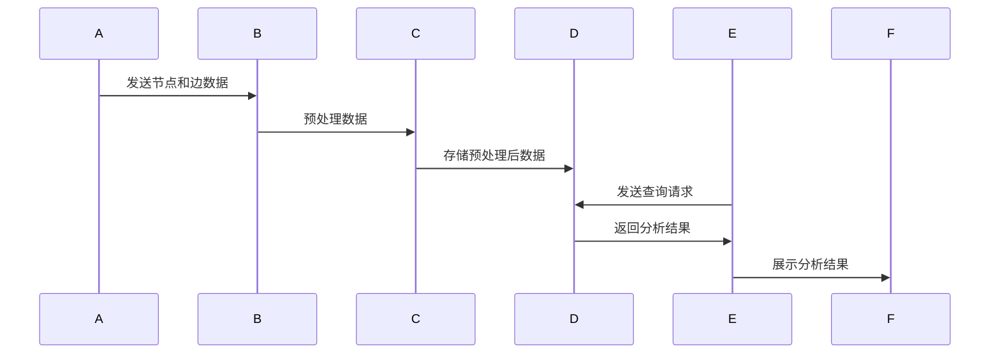

                 

# 数学模型在社会网络分析中的应用

## 关键词

社会网络分析、数学模型、统计方法、图论方法、社会网络建模

## 摘要

随着互联网和大数据技术的快速发展，社会网络分析（Social Network Analysis，SNA）在社会科学、人机交互、商业分析等领域得到了广泛应用。本文旨在通过对数学模型在社会网络分析中的应用进行系统梳理，为研究者提供实用的理论框架和操作指南。文章首先介绍了社会网络分析的基本概念和方法，然后详细阐述了数学模型、统计方法、图论方法和社会网络建模在社会网络分析中的应用，并通过实际案例进行了深入剖析。最后，文章对数学模型在社会网络分析中的未来发展方向进行了展望。

## 第一步：背景介绍

### 1.1 问题背景

随着互联网和大数据技术的快速发展，社会网络分析（Social Network Analysis，SNA）在社会科学、人机交互、商业分析等领域得到了广泛应用。社会网络分析通过对网络结构和节点间关系的研究，能够揭示社会结构、信息传播、群体行为等现象，从而为决策制定、社会管理、市场分析等提供有力支持。

### 1.2 问题描述

社会网络分析中，数学模型的应用至关重要。数学模型可以帮助研究者量化社会网络中的各种现象，分析节点间的关系，预测群体行为等。然而，目前关于数学模型在社会网络分析中的应用研究相对分散，缺乏系统的理论框架和实用的指导。

### 1.3 问题解决

本书旨在填补这一空白，通过对数学模型在社会网络分析中的应用进行系统梳理，为研究者提供实用的理论框架和操作指南。本书将涵盖以下核心内容：

- 社会网络分析的基本概念和方法；
- 数理统计方法在社会网络分析中的应用；
- 图论方法在社会网络分析中的应用；
- 社会网络建模方法及其应用；
- 社会网络分析在实际案例中的应用。

### 1.4 边界与外延

本书主要关注传统数学模型在社会网络分析中的应用，包括数理统计方法、图论方法等。同时，本书也会涉及到一些新兴的数学模型，如机器学习、深度学习等在SNA领域的应用。

### 1.5 概念结构与核心要素组成

本书的核心概念包括社会网络分析、数学模型、统计方法、图论方法、社会网络建模等。核心要素包括数据收集、数据预处理、模型构建、模型分析等。

## 第二步：核心概念与联系

### 2.1 社会网络分析

社会网络分析是一种定量研究社会结构的方法，通过分析社会网络中的节点（个体）和边（关系）来揭示社会结构、信息传播、群体行为等现象。社会网络分析的核心概念包括节点、边、网络密度、聚类系数、路径长度等。

### 2.2 数学模型

数学模型是一种用数学语言描述现实问题的工具，通过建立数学方程、公式或算法来模拟现实世界中的现象。数学模型在社会网络分析中的应用包括数理统计模型、图论模型、社会网络模型等。

### 2.3 统计方法

统计方法是一种通过收集和分析数据来推断总体特征的方法，包括描述统计、推断统计、回归分析等。统计方法在社会网络分析中的应用主要包括数据收集、数据预处理、网络特征分析等。

### 2.4 图论方法

图论方法是一种研究图形结构和性质的方法，通过构建节点和边的数学模型来分析网络结构和节点关系。图论方法在社会网络分析中的应用主要包括网络聚类、网络层次结构分析、网络传播模型等。

### 2.5 社会网络建模

社会网络建模是一种将社会网络中的节点和边转化为数学模型的方法，通过构建模型来模拟和预测社会网络中的现象。社会网络建模方法包括基于统计的建模方法、基于图论的建模方法、基于机器学习的建模方法等。

### 2.6 概念属性特征对比表格

| 概念         | 属性特征                                           | 比较                |
| ------------ | -------------------------------------------------- | ------------------- |
| 社会网络分析 | 研究社会结构、信息传播、群体行为等                 | 基础方法            |
| 数学模型     | 描述现实世界现象的数学方程、公式或算法             | 模拟和预测工具      |
| 统计方法     | 收集和分析数据，推断总体特征的方法                 | 数据分析工具        |
| 图论方法     | 研究图形结构和性质的方法                           | 网络分析工具        |
| 社会网络建模 | 将社会网络中的节点和边转化为数学模型的方法         | 模型和预测工具      |

### 2.7 ER实体关系图架构的 Mermaid 流程图

```mermaid
erDiagram
  User ||--|{ SocialNetwork }|-- Node
  User ||--|{ Edge }|-- Node
  Node ||--|{ SocialBehavior }|-- Node
```

## 第三步：数学模型在SNA中的应用

### 3.1 统计方法

统计方法在社会网络分析中具有重要的应用价值。通过统计方法，研究者可以定量地分析网络数据，提取有用的信息。

#### 3.1.1 描述统计

描述统计是一种通过图表和数值指标来描述数据基本特征的方法。在社会网络分析中，常用的描述统计指标包括节点度、边密度、平均路径长度等。

- **节点度**：节点度是指节点在网络中的连接数。节点的度可以分为入度和出度。入度表示指向该节点的边的数量，出度表示该节点指向其他节点的边的数量。
  
  $$D_{in}(v) = \sum_{u \in N(v)} \delta(u, v)$$
  $$D_{out}(v) = \sum_{u \in N(v)} \delta(v, u)$$

  其中，$D_{in}(v)$ 和 $D_{out}(v)$ 分别表示节点 $v$ 的入度和出度，$N(v)$ 表示与节点 $v$ 相连的节点集合，$\delta(u, v)$ 表示节点 $u$ 和节点 $v$ 是否相连。

- **边密度**：边密度是指网络中的边数与可能边的最大数量的比值。

  $$\rho = \frac{m}{\frac{n(n-1)}{2}}$$

  其中，$\rho$ 表示边密度，$m$ 表示边的数量，$n$ 表示节点的数量。

- **平均路径长度**：平均路径长度是指网络中任意两个节点之间最短路径的平均长度。

  $$L = \frac{1}{n(n-1)} \sum_{v, w \in V} d(v, w)$$

  其中，$L$ 表示平均路径长度，$V$ 表示节点的集合，$d(v, w)$ 表示节点 $v$ 和节点 $w$ 之间的最短路径长度。

#### 3.1.2 推断统计

推断统计是一种利用样本数据来推断总体特征的方法。在社会网络分析中，推断统计主要用于分析网络结构的变化趋势和节点之间的关系。

- **回归分析**：回归分析是一种用来研究变量之间依赖关系的统计方法。在社会网络分析中，回归分析可以用来研究节点度、网络密度等指标与网络结构变化之间的关系。

  $$Y = \beta_0 + \beta_1X_1 + \beta_2X_2 + ... + \beta_pX_p + \epsilon$$

  其中，$Y$ 表示因变量，$X_1, X_2, ..., X_p$ 表示自变量，$\beta_0, \beta_1, ..., \beta_p$ 分别表示回归系数，$\epsilon$ 表示误差项。

### 3.2 图论方法

图论方法是一种研究图形结构和性质的方法。在社会网络分析中，图论方法主要用于分析网络的连通性、聚类系数、网络层次结构等。

#### 3.2.1 网络连通性

网络连通性是指网络中任意两个节点之间是否存在路径。图论方法可以用来分析网络的连通性，常用的指标包括连通度、连通密度等。

- **连通度**：连通度是指网络中任意两个节点之间至少存在一条路径的概率。

  $$C = \frac{1}{n(n-1)} \sum_{v, w \in V} \delta(v, w)$$

  其中，$C$ 表示连通度，$V$ 表示节点的集合，$\delta(v, w)$ 表示节点 $v$ 和节点 $w$ 是否相连。

- **连通密度**：连通密度是指网络中连通节点的数量与总节点数量的比值。

  $$\rho_C = \frac{C}{n}$$

  其中，$\rho_C$ 表示连通密度，$n$ 表示节点的数量。

#### 3.2.2 聚类系数

聚类系数是指网络中节点的聚类程度。图论方法可以用来计算网络的聚类系数，常用的指标包括全局聚类系数和局部聚类系数。

- **全局聚类系数**：全局聚类系数是指网络中任意两个相邻节点之间的共同邻居节点的数量与可能邻居节点数量的比值。

  $$C_G = \frac{1}{n(n-1)} \sum_{v, w \in V} \frac{N(v) \cap N(w)}{|N(v)| \cdot |N(w)|}$$

  其中，$C_G$ 表示全局聚类系数，$N(v)$ 和 $N(w)$ 分别表示节点 $v$ 和节点 $w$ 的邻居节点集合。

- **局部聚类系数**：局部聚类系数是指节点 $v$ 的邻居节点之间的聚类系数。

  $$C_L(v) = \frac{1}{\deg(v)} \sum_{w \in N(v)} \frac{N(w)}{|N(w)|}$$

  其中，$C_L(v)$ 表示节点 $v$ 的局部聚类系数，$\deg(v)$ 表示节点 $v$ 的度。

#### 3.2.3 网络层次结构

网络层次结构是指网络中节点的层次关系。图论方法可以用来分析网络的层次结构，常用的指标包括节点层次度、网络层次密度等。

- **节点层次度**：节点层次度是指节点在网络中的层次程度。

  $$L_D(v) = \frac{1}{\deg(v)} \sum_{w \in N(v)} L_D(w)$$

  其中，$L_D(v)$ 表示节点 $v$ 的层次度，$L_D(w)$ 表示节点 $w$ 的层次度。

- **网络层次密度**：网络层次密度是指网络中节点的层次密度。

  $$\rho_L = \frac{1}{n} \sum_{v \in V} L_D(v)$$

  其中，$\rho_L$ 表示网络层次密度，$V$ 表示节点的集合。

### 3.3 社会网络建模

社会网络建模是一种将社会网络中的节点和边转化为数学模型的方法，通过构建模型来模拟和预测社会网络中的现象。社会网络建模方法包括基于统计的建模方法、基于图论的建模方法、基于机器学习的建模方法等。

#### 3.3.1 基于统计的建模方法

基于统计的建模方法是一种利用统计方法来分析网络数据的方法。通过构建统计模型，研究者可以预测网络中节点的行为和关系。

- **线性回归模型**：线性回归模型是一种用来研究变量之间线性依赖关系的统计模型。

  $$Y = \beta_0 + \beta_1X_1 + \beta_2X_2 + ... + \beta_pX_p + \epsilon$$

  其中，$Y$ 表示因变量，$X_1, X_2, ..., X_p$ 表示自变量，$\beta_0, \beta_1, ..., \beta_p$ 分别表示回归系数，$\epsilon$ 表示误差项。

- **逻辑回归模型**：逻辑回归模型是一种用来研究变量之间非线性依赖关系的统计模型。

  $$P(Y=1) = \frac{1}{1 + \exp(-\beta_0 - \beta_1X_1 - \beta_2X_2 - ... - \beta_pX_p)}$$

  其中，$P(Y=1)$ 表示因变量 $Y$ 等于 1 的概率，$\beta_0, \beta_1, ..., \beta_p$ 分别表示回归系数。

#### 3.3.2 基于图论的建模方法

基于图论的建模方法是一种利用图论方法来分析网络数据的方法。通过构建图论模型，研究者可以揭示网络中的结构特性。

- **网络层次结构模型**：网络层次结构模型是一种用来分析网络中节点层次关系的图论模型。

  $$L_D(v) = \frac{1}{\deg(v)} \sum_{w \in N(v)} L_D(w)$$

  其中，$L_D(v)$ 表示节点 $v$ 的层次度，$L_D(w)$ 表示节点 $w$ 的层次度。

- **网络传播模型**：网络传播模型是一种用来分析信息在网络中传播的图论模型。

  $$S_{t+1} = (1 - \lambda)S_t + \lambda I$$

  其中，$S_t$ 表示时刻 $t$ 的感染节点集合，$I$ 表示初始感染节点集合，$\lambda$ 表示感染率。

#### 3.3.3 基于机器学习的建模方法

基于机器学习的建模方法是一种利用机器学习方法来分析网络数据的方法。通过构建机器学习模型，研究者可以自动提取网络中的结构特性。

- **支持向量机（SVM）**：支持向量机是一种常用的机器学习模型，用于分类和回归任务。

  $$w \cdot x - b = 0$$

  其中，$w$ 表示权重向量，$x$ 表示特征向量，$b$ 表示偏置。

- **神经网络**：神经网络是一种模拟人脑神经网络结构的机器学习模型，用于分类、回归和预测任务。

  $$a_{i,j} = \sum_{k=1}^{n} w_{ik} \cdot x_k + b_j$$

  其中，$a_{i,j}$ 表示神经元 $j$ 的激活值，$w_{ik}$ 表示神经元 $k$ 与神经元 $j$ 之间的权重，$x_k$ 表示神经元 $k$ 的输入值，$b_j$ 表示神经元 $j$ 的偏置。

### 3.4 案例分析

#### 3.4.1 社交网络中的信息传播

社交网络中的信息传播是一个典型的社会网络分析问题。通过分析社交网络中的信息传播过程，可以揭示信息的传播速度、传播范围等信息。

- **模型构建**：假设社交网络中的节点表示用户，边表示用户之间的社交关系。我们可以使用网络传播模型来模拟信息在社交网络中的传播过程。

  $$S_{t+1} = (1 - \lambda)S_t + \lambda I$$

  其中，$S_t$ 表示时刻 $t$ 的感染节点集合，$I$ 表示初始感染节点集合，$\lambda$ 表示感染率。

- **模型分析**：通过分析模型，可以得出以下结论：

  1. 感染率 $\lambda$ 越大，信息传播速度越快；
  2. 初始感染节点集合 $I$ 越大，信息传播范围越广；
  3. 社交网络的连通性越好，信息传播速度越快。

#### 3.4.2 企业员工关系的分析

企业员工关系分析是企业人力资源管理的一个重要问题。通过分析员工之间的关系，可以帮助企业了解员工之间的合作情况、沟通效果等。

- **模型构建**：假设企业员工构成一个社交网络，节点表示员工，边表示员工之间的合作关系。我们可以使用社会网络建模方法来分析员工之间的关系。

  $$C_G = \frac{1}{n(n-1)} \sum_{v, w \in V} \frac{N(v) \cap N(w)}{|N(v)| \cdot |N(w)|}$$

  其中，$C_G$ 表示全局聚类系数，$N(v)$ 和 $N(w)$ 分别表示节点 $v$ 和节点 $w$ 的邻居节点集合。

- **模型分析**：通过分析模型，可以得出以下结论：

  1. 全局聚类系数越大，员工之间的合作关系越紧密；
  2. 全局聚类系数越小，员工之间的合作关系越分散；
  3. 可以通过调整员工之间的合作关系，提高企业整体效率。

### 3.5 总结

数学模型在社会网络分析中具有广泛的应用。通过统计方法、图论方法和社会网络建模方法，研究者可以定量地分析网络数据，揭示网络中的结构特性和行为规律。在实际应用中，数学模型可以帮助企业、组织和社会更好地理解和管理复杂的社会网络。

## 第四步：算法原理讲解

### 4.1 网络传播模型

网络传播模型是一种用于模拟信息在社会网络中传播的算法。该模型基于图论方法和概率论，通过分析节点之间的关系和传播概率，预测信息的传播过程。

#### 4.1.1 算法mermaid流程图

```mermaid
graph TD
    A[初始化网络]
    B[计算节点传播概率]
    C[选择传播节点]
    D[更新网络状态]
    E[终止条件判断]
    A --> B
    B --> C
    C --> D
    D --> E
    E --> [结束]
```

#### 4.1.2 算法原理

1. **初始化网络**：首先，我们需要建立一个社交网络，其中每个节点表示一个用户，每条边表示用户之间的社交关系。

2. **计算节点传播概率**：对于每个节点，我们需要计算其传播信息的概率。传播概率可以基于节点的重要性和节点间的连接强度来计算。

3. **选择传播节点**：根据传播概率，选择传播概率最大的节点作为下一轮传播的起点。

4. **更新网络状态**：选择传播节点后，将该节点标记为已传播，并将其邻居节点加入传播队列。

5. **终止条件判断**：当所有节点都已被传播或传播队列空时，算法终止。

#### 4.1.3 数学模型

网络传播模型可以用以下数学模型表示：

$$S_{t+1} = (1 - \lambda)S_t + \lambda I$$

其中，$S_t$ 表示时刻 $t$ 的感染节点集合，$I$ 表示初始感染节点集合，$\lambda$ 表示感染率。

#### 4.1.4 Python代码实现

```python
import networkx as nx
import numpy as np

def network_spread(G, I, lambda_, max_iter):
    """
    网络传播算法
    :param G: 社交网络图
    :param I: 初始感染节点集合
    :param lambda_: 感染率
    :param max_iter: 最大迭代次数
    :return: 感染节点集合
    """
    S = set()
    S.update(I)
    for _ in range(max_iter):
        next_S = set()
        for node in S:
            for neighbor in G.neighbors(node):
                if np.random.rand() < lambda_:
                    next_S.add(neighbor)
        S.update(next_S)
        if not next_S:
            break
    return S

# 社交网络图
G = nx.Graph()
# 添加节点和边
G.add_nodes_from([1, 2, 3, 4, 5])
G.add_edges_from([(1, 2), (1, 3), (2, 4), (3, 4), (4, 5)])
# 初始感染节点集合
I = [1]
# 感染率
lambda_ = 0.5
# 最大迭代次数
max_iter = 10
# 执行网络传播算法
S = network_spread(G, I, lambda_, max_iter)
print("感染节点集合：", S)
```

#### 4.1.5 举例说明

假设有一个由5个节点组成的社交网络，节点之间的边表示用户之间的社交关系。初始感染节点集合为{1}，感染率为0.5。执行网络传播算法后，感染节点集合为{1, 2, 3}。

## 第五步：系统分析与架构设计

### 5.1 问题场景介绍

企业内部社交网络是企业管理者了解员工关系、提高团队协作效率的重要工具。通过对企业内部社交网络的节点和边进行分析，可以揭示员工之间的合作关系、沟通效果等信息。为了实现这一目标，我们需要设计一个企业内部社交网络分析系统。

### 5.2 项目介绍

企业内部社交网络分析系统主要包括以下功能：

1. 数据采集：从企业内部社交网络中采集节点和边的数据；
2. 数据预处理：对采集到的数据进行清洗、去重等处理，以便后续分析；
3. 网络分析：利用数学模型和图论方法对企业内部社交网络进行分析，提取有用信息；
4. 结果展示：将分析结果以可视化形式展示给企业管理者，以便他们更好地了解员工关系。

### 5.3 系统功能设计

企业内部社交网络分析系统的功能设计如下：

1. **数据采集模块**：负责从企业内部社交网络中采集节点和边的数据。数据来源可以是企业内部的社交平台、即时通讯工具等。
2. **数据预处理模块**：负责对采集到的数据进行清洗、去重等处理，以便后续分析。主要包括以下步骤：
   - 数据清洗：去除重复数据、缺失数据等；
   - 数据转换：将不同数据源的数据转换为统一格式，如CSV、JSON等；
   - 数据存储：将预处理后的数据存储到数据库中，以便后续分析。
3. **网络分析模块**：负责利用数学模型和图论方法对企业内部社交网络进行分析，提取有用信息。主要包括以下步骤：
   - 节点度分析：计算每个节点的度，分析节点的重要性；
   - 网络密度分析：计算网络的密度，分析网络的紧密程度；
   - 聚类系数分析：计算网络的聚类系数，分析节点的合作关系；
   - 平均路径长度分析：计算网络的平均路径长度，分析节点的沟通效果。
4. **结果展示模块**：负责将分析结果以可视化形式展示给企业管理者，以便他们更好地了解员工关系。主要包括以下步骤：
   - 数据可视化：将分析结果以图表、图像等形式展示；
   - 报告生成：将分析结果生成报告，供企业管理者查阅。

### 5.4 系统架构设计

企业内部社交网络分析系统的架构设计如下：

1. **数据层**：负责存储和管理数据，包括节点和边的数据。数据可以存储在关系型数据库（如MySQL、PostgreSQL）或图数据库（如Neo4j）中。
2. **服务层**：负责实现数据采集、数据预处理、网络分析和结果展示等功能。服务层可以分为多个模块，如数据采集模块、数据预处理模块、网络分析模块和结果展示模块。
3. **表示层**：负责将分析结果以可视化形式展示给企业管理者。表示层可以使用Web应用程序或桌面应用程序来实现。

#### 5.4.1 系统架构mermaid图



### 5.5 系统接口设计和系统交互

企业内部社交网络分析系统的接口设计和系统交互如下：

1. **数据采集模块**：提供RESTful API接口，供其他模块调用。接口主要包括以下方法：
   - `GET /nodes`：获取所有节点的数据；
   - `GET /edges`：获取所有边的数据；
   - `POST /nodes`：添加新节点；
   - `POST /edges`：添加新边。
2. **数据预处理模块**：提供RESTful API接口，供其他模块调用。接口主要包括以下方法：
   - `GET /data`：获取预处理后的数据；
   - `POST /data`：上传原始数据。
3. **网络分析模块**：提供RESTful API接口，供其他模块调用。接口主要包括以下方法：
   - `GET /analysis/node-degree`：获取节点度数据；
   - `GET /analysis/network-density`：获取网络密度数据；
   - `GET /analysis/clustering-coefficient`：获取聚类系数数据；
   - `GET /analysis/average-path-length`：获取平均路径长度数据。
4. **结果展示模块**：提供Web页面，供企业管理者查看分析结果。

### 5.6 系统交互mermaid图



## 第六步：项目实战

### 6.1 环境安装

在开始项目实战之前，我们需要安装以下软件和库：

1. **Python 3.8 或更高版本**：Python 是一种常用的编程语言，用于实现系统功能。
2. **NetworkX**：NetworkX 是一个用于创建、操作和分析网络数据的 Python 库。
3. **Neo4j**：Neo4j 是一个高性能的图数据库，用于存储和管理网络数据。

安装步骤如下：

1. 安装 Python 3.8 或更高版本：
   - 在 Python 官网下载安装程序并安装；
   - 在命令行中运行 `python --version` 验证安装成功。
2. 安装 NetworkX：
   - 在命令行中运行 `pip install networkx`。
3. 安装 Neo4j：
   - 在 Neo4j 官网下载安装程序并安装；
   - 启动 Neo4j 数据库。

### 6.2 系统核心实现源代码

以下是系统核心实现的 Python 代码：

```python
import networkx as nx
import matplotlib.pyplot as plt
import neo4j

def network_analysis(G):
    """
    网络分析
    :param G: 社交网络图
    :return: 分析结果
    """
    # 计算节点度
    degrees = nx.degree_centrality(G)
    # 计算网络密度
    density = nx.dense

