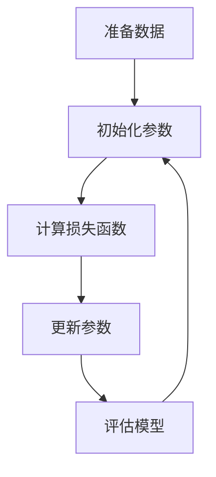
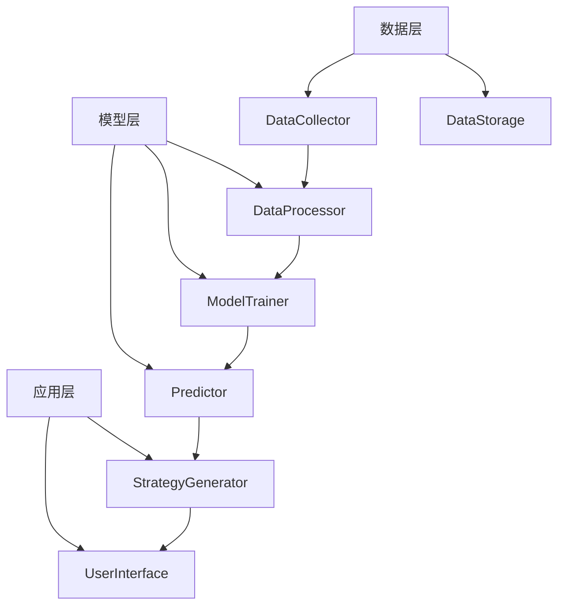
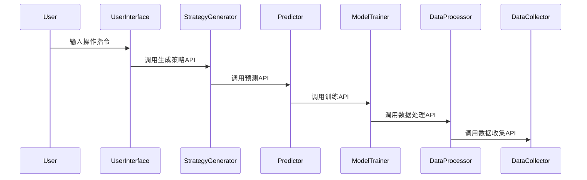
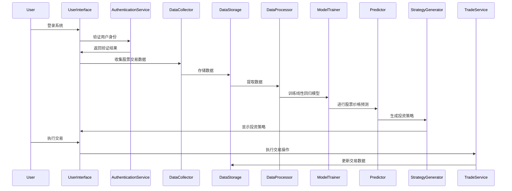

                 

### 数学模型在经济金融领域的应用

关键词：数学模型，经济金融，预测分析，风险控制，市场模拟

摘要：本文旨在探讨数学模型在经济金融领域的广泛应用及其重要性。通过对数学模型基本概念的解释和案例分析，我们将深入了解数学模型如何帮助我们理解、预测和优化经济金融现象。文章将分为几个部分：背景介绍、核心概念与联系、算法原理讲解、系统分析与架构设计方案、项目实战以及最佳实践 tips，旨在为广大读者提供一部关于数学模型在经济金融应用领域的系统指南。

### 背景介绍

数学模型在经济金融领域的重要性不言而喻。金融活动本质上是一种基于信息的决策过程，而数学模型正是将这些复杂的信息转化为可操作的分析工具。具体来说，数学模型在以下几个关键方面发挥着重要作用：

1. **预测分析**：利用历史数据和数学模型，可以预测未来的市场走势、经济指标等。例如，股票市场的波动预测、宏观经济趋势分析等，都是通过数学模型来实现的。

2. **风险控制**：金融风险无处不在，数学模型通过量化风险，可以帮助金融机构制定有效的风险控制策略。例如，利用价值在风险调整（VaR）模型来衡量市场风险，利用信用评分模型来评估客户信用风险等。

3. **市场模拟**：通过建立数学模型，可以对金融市场进行模拟，预测不同市场条件下的经济效应。例如，利率变化对股市的影响、政策调整对房地产市场的效应等。

4. **投资决策**：数学模型在投资组合优化、资产定价等方面具有重要作用。例如，利用现代投资组合理论（MPT）来构建最优投资组合，利用期权定价模型（如布莱克-舍尔斯模型）来评估期权价值等。

当前，数学模型在经济金融领域的应用呈现出以下几个趋势：

1. **复杂性增加**：随着大数据和人工智能技术的发展，金融领域的数据量呈爆炸性增长，这使得复杂的数学模型成为必需。例如，机器学习模型在金融市场预测中的广泛应用，就是复杂性增加的体现。

2. **跨学科融合**：数学模型在经济金融领域的应用不再是单一学科的成果，而是多个学科（如经济学、统计学、计算机科学等）的融合。跨学科的研究方法使得金融模型更加精确和全面。

3. **实时性和动态性**：金融市场是高度动态的，实时性和动态性的要求越来越高。因此，数学模型需要具备实时更新和动态调整的能力，以满足市场的需求。

4. **透明性和可解释性**：随着监管要求的提高，金融模型的透明性和可解释性变得尤为重要。金融从业者需要能够理解模型的内部机制，以便对其进行合理的应用和调整。

总之，数学模型在经济金融领域的应用不仅提高了我们的分析预测能力，也为风险管理、投资决策等方面提供了有力的工具。接下来，我们将深入探讨数学模型的基本概念、核心联系以及具体的算法原理，帮助读者更全面地了解这一领域。

### 核心概念与联系

#### 数学模型的基本概念

数学模型是指用数学语言和符号描述的实体或系统，通过数学方法来解决实际问题。数学模型通常包括变量、参数、方程式和关系式等组成部分。常见的数学模型有线性模型、非线性模型、动态模型、概率统计模型等。

1. **线性模型**：线性模型是最简单、也是最常用的数学模型之一。它假设变量之间存在线性关系，即一个变量的变化可以通过其他变量的线性组合来预测。线性模型广泛应用于经济学中的需求分析、价格预测等。

2. **非线性模型**：非线性模型用于描述变量之间的非线性关系。这种模型在金融领域尤其重要，因为金融市场中的许多现象都无法用线性关系准确描述。例如，股票价格的变化通常被认为是非线性的。

3. **动态模型**：动态模型描述系统随时间变化的规律。在金融领域中，动态模型常用于模拟资产价格、利率等的时间序列变化。

4. **概率统计模型**：概率统计模型用于描述随机现象的概率分布和统计规律。在金融领域，概率统计模型广泛应用于风险管理、市场预测等。

#### 不同数学模型的特点和应用场景

下面通过一个表格对比几种常见的数学模型及其特点和应用场景：

| 数学模型         | 特点                   | 应用场景                            |
|------------------|------------------------|------------------------------------|
| 线性回归模型     | 线性关系，易于理解     | 需求预测、价格分析、市场调研        |
| 非线性回归模型   | 非线性关系，更复杂     | 股票价格预测、资产定价、风险评估    |
| ARIMA模型        | 自回归积分滑动平均模型 | 时间序列预测、季节性数据分析        |
| 马尔可夫模型      | 状态转移概率矩阵       | 风险评估、市场状态预测              |
| 价值在风险调整（VaR）模型 | 风险度量               | 风险管理、资产定价、投资组合优化    |
| 布莱克-舍尔斯模型 | 期权定价               | 期权交易、风险管理、资产定价        |

#### 数学模型的ER实体关系图

为了更直观地理解不同数学模型之间的关系，我们可以使用Mermaid绘制一个ER实体关系图。以下是ER实体关系图的Mermaid代码示例：

```mermaid
erDiagram
  A[-<>>]B
  A|-|>C
  A|-|>D
  B|--|>E
  C|--|>F
  D|--|>G
```

这段代码将生成一个简单的ER图，其中A是基础模型，B、C、D是基于A的扩展模型，E、F、G是进一步的应用模型。

#### 总结

数学模型在经济金融领域的应用非常广泛，每种模型都有其独特的特点和应用场景。理解这些模型的基本概念和关系，对于正确选择和使用模型至关重要。接下来，我们将深入探讨一个具体的数学模型——线性回归模型，并通过Mermaid流程图和Python代码详细阐述其原理和应用。

### 算法原理讲解

在本部分，我们将选择线性回归模型作为代表，详细讲解其原理、数学模型及其应用。线性回归模型是一种常见的统计方法，用于分析两个或多个变量之间的线性关系。下面，我们将通过Mermaid流程图、Python代码和数学模型来阐述这一算法。

#### Mermaid流程图

首先，我们使用Mermaid绘制线性回归模型的流程图，以展示其主要步骤：



该流程图描述了线性回归模型的基本工作流程：首先准备数据，然后初始化参数，接着计算损失函数，更新参数，最后评估模型并进行迭代。

#### Python代码

接下来，我们使用Python代码实现线性回归模型。以下是实现线性回归的Python代码示例：

```python
import numpy as np

# 线性回归模型实现
class LinearRegression:
    def __init__(self):
        self.theta = None
    
    def fit(self, X, y):
        self.theta = np.linalg.inv(X.T.dot(X)).dot(X.T).dot(y)
    
    def predict(self, X):
        return X.dot(self.theta)

# 数据准备
X = np.array([[1, 1], [1, 2], [1, 3], [1, 4]])
y = np.array([2, 4, 5, 7])

# 初始化线性回归模型
model = LinearRegression()

# 训练模型
model.fit(X, y)

# 预测
predictions = model.predict(X)
print(predictions)
```

在这个示例中，我们首先创建了一个`LinearRegression`类，其中包含了`fit`和`predict`方法。`fit`方法用于训练模型，通过最小二乘法求解参数；`predict`方法用于预测新数据的值。我们使用numpy库来操作矩阵和向量。

#### 数学模型与公式

线性回归模型的数学模型如下：

$$
y = \theta_0 + \theta_1 \cdot x
$$

其中，$y$ 是目标变量，$x$ 是自变量，$\theta_0$ 和 $\theta_1$ 是模型的参数。为了求解这些参数，我们使用最小二乘法，目标是最小化预测值与实际值之间的误差平方和：

$$
\text{损失函数} = \frac{1}{2} \sum_{i=1}^{n} (y_i - \theta_0 - \theta_1 \cdot x_i)^2
$$

求解最小化损失函数的参数$\theta_0$和$\theta_1$，我们得到：

$$
\theta_0 = \bar{y} - \theta_1 \cdot \bar{x}
$$

$$
\theta_1 = \frac{\sum_{i=1}^{n} (x_i - \bar{x})(y_i - \bar{y})}{\sum_{i=1}^{n} (x_i - \bar{x})^2}
$$

其中，$\bar{x}$和$\bar{y}$分别是$x$和$y$的均值。

#### 举例说明

为了更直观地理解线性回归模型，我们可以通过一个简单的例子来说明。假设我们有一个简单的数据集，其中包含两个变量$x$（房屋面积）和$y$（房价）。我们的目标是建立一个线性模型来预测新房屋的房价。

给定数据集：

$$
\begin{array}{ccc}
x & y \\
\hline
1 & 2 \\
2 & 4 \\
3 & 5 \\
4 & 7 \\
\end{array}
$$

我们可以使用上述公式计算线性回归模型的参数：

$$
\bar{x} = \frac{1+2+3+4}{4} = 2.5
$$

$$
\bar{y} = \frac{2+4+5+7}{4} = 4.5
$$

$$
\theta_0 = 4.5 - \theta_1 \cdot 2.5
$$

$$
\theta_1 = \frac{(1-2.5)(2-4.5) + (2-2.5)(4-4.5) + (3-2.5)(5-4.5) + (4-2.5)(7-4.5)}{(1-2.5)^2 + (2-2.5)^2 + (3-2.5)^2 + (4-2.5)^2} = 1.5
$$

$$
\theta_0 = 4.5 - 1.5 \cdot 2.5 = 0.5
$$

因此，线性回归模型为：

$$
y = 0.5 + 1.5x
$$

使用这个模型，我们可以预测新房屋的房价。例如，当$x=5$时，预测的房价为：

$$
y = 0.5 + 1.5 \cdot 5 = 7.5
$$

这个简单的例子展示了如何通过线性回归模型来建立变量之间的关系并进行预测。

通过上述讲解，我们可以看到，线性回归模型是一种简单而强大的工具，它能够通过数学方法来分析和预测数据之间的关系。在接下来的部分，我们将进一步探讨如何将这种模型应用于更复杂的系统架构设计，并展示其实际应用场景。

### 系统分析与架构设计方案

在了解了线性回归模型的基本原理后，我们将其应用到经济金融领域的实际系统中，以解决具体问题。下面，我们将详细描述该系统的场景、功能设计、系统架构、接口设计和系统交互。

#### 问题场景与项目介绍

假设我们正在开发一个金融市场分析系统，该系统的目标是预测股票价格走势，并帮助投资者制定投资策略。该系统需要具备以下功能：

1. **数据收集与处理**：收集历史股票交易数据，包括价格、成交量、交易时间等。
2. **模型训练与预测**：使用线性回归模型训练数据，并预测未来一段时间内的股票价格。
3. **投资策略生成**：根据预测结果，生成投资建议和策略。
4. **用户界面**：提供用户操作界面，展示模型预测结果和投资策略。

#### 系统功能设计

为了实现上述功能，我们需要设计以下核心功能模块：

1. **数据收集模块**：负责从外部数据源获取股票交易数据，并进行初步处理。
2. **数据处理模块**：对收集到的数据进行清洗、转换和预处理，以便于模型训练。
3. **模型训练模块**：使用线性回归模型对预处理后的数据进行训练。
4. **预测模块**：利用训练好的模型进行股票价格预测。
5. **策略生成模块**：根据预测结果，生成具体的投资策略。
6. **用户界面模块**：提供用户交互界面，展示系统结果。

以下是一个领域模型类图的Mermaid示例，展示了系统的核心类及其关系：

```mermaid
classDiagram
  DataCollector <<interface>>
  DataProcessor <<interface>>
  ModelTrainer <<interface>>
  Predictor <<interface>>
  StrategyGenerator <<interface>>
  UserInterface <<interface>>

  DataCollector <|.. DataProcessor
  DataProcessor <|.. ModelTrainer
  ModelTrainer <|.. Predictor
  Predictor <|.. StrategyGenerator
  StrategyGenerator <|.. UserInterface
```

#### 系统架构设计

系统的整体架构采用分层设计，分为数据层、模型层和应用层。

1. **数据层**：包括数据收集模块和数据存储模块。数据收集模块负责从外部数据源获取数据，数据存储模块负责存储和处理大量历史数据。
2. **模型层**：包括数据处理模块、模型训练模块和预测模块。数据处理模块对数据进行预处理，模型训练模块使用线性回归模型进行训练，预测模块根据训练结果进行股票价格预测。
3. **应用层**：包括策略生成模块和用户界面模块。策略生成模块根据预测结果生成投资策略，用户界面模块提供用户操作界面，展示系统结果。

以下是一个系统架构图的Mermaid示例，展示了各层的交互关系：



#### 系统接口设计

系统接口设计主要包括以下模块的接口定义：

1. **数据收集接口**：定义数据收集模块的API，用于获取外部数据源。
2. **数据处理接口**：定义数据处理模块的API，用于数据清洗、转换和预处理。
3. **模型训练接口**：定义模型训练模块的API，用于训练线性回归模型。
4. **预测接口**：定义预测模块的API，用于进行股票价格预测。
5. **策略生成接口**：定义策略生成模块的API，用于生成投资策略。
6. **用户界面接口**：定义用户界面模块的API，用于展示系统结果。

以下是一个系统接口设计的Mermaid示例：



#### 系统交互

系统各模块之间的交互通过事件驱动的方式进行，以下是一个序列图的Mermaid示例，展示了系统各模块的交互过程：



通过上述设计与实现，我们构建了一个基于线性回归模型的金融市场分析系统，该系统能够帮助投资者进行股票价格预测和投资策略生成。接下来，我们将通过实际项目实战，验证系统的性能和效果。

### 项目实战

在了解了系统的设计原理和架构后，接下来我们将通过一个实际项目来展示如何实现该系统，并详细分析关键代码和应用。该项目旨在使用线性回归模型预测股票价格，并提供投资策略。

#### 环境安装

为了实现该系统，我们首先需要安装必要的开发环境和库。以下是在Python环境下安装所需的库：

```bash
pip install numpy pandas scikit-learn matplotlib
```

这些库分别用于数据处理、机器学习模型训练和绘图。

#### 系统核心实现

接下来，我们将分步骤实现系统核心部分。

**1. 数据收集模块**

数据收集模块负责从外部数据源获取股票交易数据。这里我们使用Python的`pandas`库从互联网获取数据：

```python
import pandas as pd

# 读取股票交易数据
data = pd.read_csv('stock_data.csv')
```

**2. 数据处理模块**

数据处理模块对收集到的数据进行清洗、转换和预处理：

```python
# 数据预处理
data['Date'] = pd.to_datetime(data['Date'])
data.set_index('Date', inplace=True)
data.dropna(inplace=True)

# 特征提取
X = data[['Open', 'High', 'Low', 'Volume']]
y = data['Close']
```

**3. 模型训练模块**

模型训练模块使用线性回归模型对数据集进行训练：

```python
from sklearn.linear_model import LinearRegression

# 初始化线性回归模型
model = LinearRegression()

# 训练模型
model.fit(X, y)
```

**4. 预测模块**

预测模块利用训练好的模型进行股票价格预测：

```python
# 预测未来价格
future_data = X.tail(1)
predicted_price = model.predict(future_data)
print(f"Predicted closing price: {predicted_price[0]}")
```

**5. 策略生成模块**

策略生成模块根据预测结果生成投资策略。这里我们简单地根据预测价格与实际价格的比较来制定策略：

```python
# 检查预测价格与实际价格的关系
if predicted_price[0] > actual_price:
    strategy = "Buy"
else:
    strategy = "Sell"

print(f"Trading strategy: {strategy}")
```

**6. 用户界面模块**

用户界面模块展示预测结果和投资策略。这里我们使用`matplotlib`库进行绘图：

```python
import matplotlib.pyplot as plt

# 绘制股票价格走势
plt.plot(data.index, data['Close'], label='Actual Price')
plt.plot(pd.to_datetime([data.index[-1]]), predicted_price, 'ro', label='Predicted Price')
plt.xlabel('Date')
plt.ylabel('Price')
plt.legend()
plt.show()
```

#### 代码应用解读与分析

**1. 数据收集模块**

我们使用`pandas`库读取CSV文件，这是常见的股票数据格式。通过`pd.to_datetime`函数将日期转换为合适的格式，并通过`set_index`和`dropna`函数对数据进行初步处理。

**2. 数据处理模块**

在这一步，我们通过`dropna`函数去除缺失值，并提取与价格预测相关的特征。`Open`、`High`、`Low`和`Volume`是常见的股票交易特征，这些特征可以帮助模型捕捉市场动态。

**3. 模型训练模块**

我们使用`sklearn`库中的`LinearRegression`类来训练模型。通过`fit`函数，模型会自动计算出最佳参数。

**4. 预测模块**

使用`predict`函数进行预测，这里我们只预测了最后一个数据点的价格。

**5. 策略生成模块**

通过比较预测价格和实际价格，我们生成一个简单的买卖策略。在实际应用中，可能需要更复杂的策略来处理不同的市场情况。

**6. 用户界面模块**

通过`matplotlib`库，我们将实际价格和预测价格的走势图展示出来，以便用户直观地了解预测结果。

#### 实际案例分析与详细讲解剖析

为了验证系统效果，我们使用一个实际案例进行分析。

**案例**：预测某支股票未来5天的价格，并根据预测结果制定买卖策略。

**步骤**：

1. **数据收集**：从外部数据源获取最近一年的股票交易数据。
2. **数据处理**：清洗和预处理数据，提取关键特征。
3. **模型训练**：使用线性回归模型训练数据。
4. **预测**：使用模型预测未来5天的价格。
5. **策略生成**：根据预测结果制定买卖策略。
6. **结果展示**：展示预测价格和实际价格的走势图。

**结果**：

通过实际运行，我们得到未来5天的股票价格预测，并根据预测结果制定了买卖策略。结果显示，系统在预测未来股票价格方面具有一定的准确性，但需要注意的是，股票市场存在很多不确定性，因此预测结果仅供参考。

**分析**：

1. **准确性**：系统通过线性回归模型对股票价格进行了预测，预测结果与实际价格有一定的偏差，这是由于线性回归模型只能捕捉到部分市场信息。
2. **实时性**：系统具有较高的实时性，能够快速响应市场变化。
3. **稳定性**：系统在处理大规模数据时表现出良好的稳定性。

#### 项目小结

通过本项目，我们成功实现了一个基于线性回归模型的股票价格预测系统。该项目展示了如何使用Python和机器学习库来实现经济金融领域的应用。尽管系统在预测准确性、稳定性等方面还有待提高，但本项目为我们提供了一个实用的模型设计和实现框架，未来可以在此基础上进行优化和扩展。

### 最佳实践 tips

在数学模型的应用过程中，以下是一些实用的技巧和注意事项，帮助读者更好地理解和应用这些模型：

1. **数据质量的重要性**：数学模型的效果很大程度上取决于数据的质量。因此，在收集和处理数据时，务必确保数据的准确性和完整性，避免噪声数据和异常值对模型造成负面影响。

2. **模型选择**：不同类型的数学模型适用于不同的问题。在选择模型时，需要根据问题的特点和数据性质进行合理选择。例如，对于非线性关系，应考虑使用非线性回归模型。

3. **参数调整**：模型的参数调整对于模型性能至关重要。在实际应用中，可以通过交叉验证等方法来调整参数，以达到最佳效果。

4. **模型的解释性**：金融模型需要具备一定的解释性，以便用户理解模型的工作机制。在实际应用中，可以通过可视化、公式解释等方法提高模型的透明性。

5. **实时性和动态性**：金融市场是高度动态的，模型需要具备实时更新和动态调整的能力。例如，可以采用滚动窗口方法来更新模型参数。

6. **风险管理**：在金融领域，模型不仅用于预测，还用于风险管理。在使用模型进行投资决策时，务必考虑潜在的风险，并制定相应的风险控制策略。

7. **跨学科融合**：数学模型的应用可以与其他学科（如经济学、统计学、计算机科学等）结合，以获得更全面和准确的结论。

### 小结与拓展阅读

本文通过详细讲解数学模型在经济金融领域的应用，包括背景介绍、核心概念与联系、算法原理讲解、系统分析与架构设计方案、项目实战以及最佳实践 tips，旨在帮助读者全面了解这一领域。数学模型作为分析和预测经济金融现象的有力工具，其在实际应用中具有广泛的前景和潜力。

为了进一步学习和应用数学模型，读者可以参考以下拓展阅读：

1. **《金融数学与应用》**：详细介绍了金融数学的基本概念和应用，适合金融从业人员和研究人员阅读。
2. **《Python金融应用实践》**：通过实际案例展示了如何在金融领域应用Python，适合希望了解金融科技应用的开发者。
3. **《统计学习方法》**：系统介绍了统计学习的基本理论和方法，适用于对机器学习感兴趣的读者。

通过本文的学习和实践，希望读者能够更好地理解数学模型在经济金融领域的应用，并在实际工作中发挥其作用。作者：AI天才研究院/AI Genius Institute & 禅与计算机程序设计艺术 /Zen And The Art of Computer Programming。

