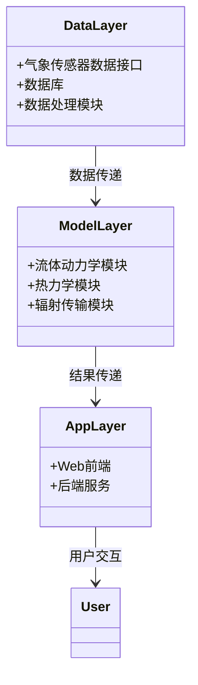
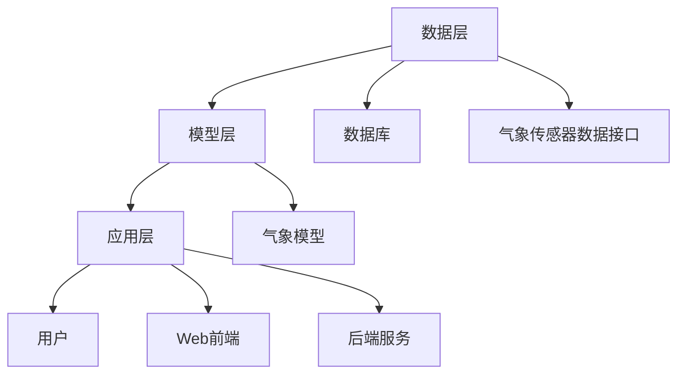
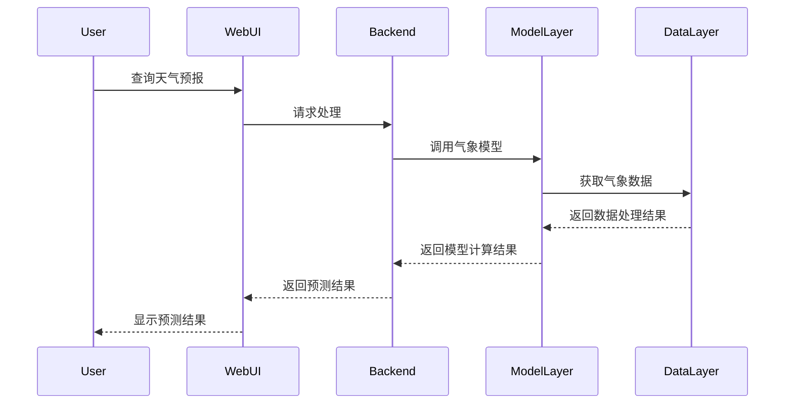

                 

### 关键词

- 数学模型
- 自然科学
- 应用
- 局限
- 算法
- 概率论
- 微积分
- 线性代数

### 摘要

本文旨在探讨数学模型在自然科学中的应用及其局限性。我们将首先介绍数学模型在自然科学中的起源和发展，然后详细解析其在不同领域的核心概念和联系。接着，我们将通过具体的算法原理讲解和实际案例分析，展示数学模型在自然科学中的实际应用。最后，我们将讨论数学模型的应用局限，并提出改进和未来研究方向。通过本文，读者将全面了解数学模型在自然科学中的重要作用及其面临的挑战。

### 背景介绍

#### 数学模型在自然科学中的起源

数学模型在自然科学中的起源可以追溯到古代文明。早在古希腊时期，数学家如欧几里得和阿基米德就运用几何和代数方法研究自然现象，开创了数学在自然科学领域的应用。在中世纪，阿拉伯数学家如阿尔·花拉子米进一步发展了代数学，推动了数学模型在自然科学中的应用。

进入近代，牛顿和莱布尼茨分别创立了微积分学，为自然科学中的数学建模提供了强有力的工具。牛顿的《自然哲学的数学原理》标志着经典力学的诞生，而莱布尼茨的微积分理论则为物理、工程和经济学等领域提供了新的分析手段。

20世纪初，随着量子力学和相对论的提出，数学模型在自然科学中的应用进一步扩展。数学家如爱因斯坦、海森堡和薛定谔等人的工作，将数学模型应用于微观和宏观世界，揭示了自然界的深层次规律。

#### 数学模型在自然科学中的发展

数学模型在自然科学中的应用经历了从简单到复杂、从局部到全局的发展过程。早期，数学模型主要集中在力学、天文学和物理学领域，如牛顿的力学定律和万有引力定律。随着科学技术的发展，数学模型的应用范围逐渐扩大到生物学、生态学、化学、地质学等多个学科。

在生物学领域，数学模型被用来研究种群动态、生态系统和进化过程。例如，洛特卡-沃尔特定律和捕食者-被捕食者模型等，为生物种群数量动态提供了定量描述。在生态学领域，数学模型用于分析物种相互作用、生态平衡和环境污染等复杂现象。

在化学领域，数学模型被广泛应用于化学反应动力学、分子结构分析和材料科学等领域。例如，反应扩散方程和量子化学模型，为化学反应机理和分子设计提供了理论基础。

地质学领域中的数学模型则用于地震预测、矿产资源勘探和地质结构分析等。通过数学建模，地质学家可以更准确地预测地震的发生，优化矿产资源的开采策略。

#### 数学模型在自然科学中的现状

当前，数学模型在自然科学中的应用已经达到了前所未有的深度和广度。许多复杂的自然现象，如气候变化、生态系统动态和生物多样性等，都通过数学模型得到了较好的解释和预测。数学模型在科学研究中的重要性日益凸显，成为自然科学研究的重要工具。

然而，尽管数学模型在自然科学中的应用取得了显著成果，但仍存在一些局限性。首先，数学模型的建立往往依赖于大量的实验数据和观测数据，而这些数据的质量和准确性直接影响到模型的可靠性。其次，数学模型在处理复杂系统时，可能面临计算复杂度和可解释性的挑战。此外，不同领域的数学模型之间缺乏有效的整合和统一框架，限制了跨学科的交叉应用。

#### 数学模型的优势与挑战

数学模型在自然科学中具有明显的优势。首先，数学模型能够提供定量的描述和分析，使科学家能够从宏观和微观角度深入理解自然现象。其次，数学模型具有高度的抽象性和普适性，可以在不同领域和不同时间尺度上应用。此外，数学模型还可以促进科学理论的发展，为新的科学发现提供指导。

然而，数学模型在自然科学中面临的挑战也不容忽视。首先，数学模型的建立需要大量的专业知识和经验，对科学家提出了较高的要求。其次，数学模型可能无法完全反映现实世界的复杂性和随机性，导致模型预测的不确定性。此外，数学模型的计算复杂度和数据需求，使得在实际应用中面临计算资源和数据质量的限制。

综上所述，数学模型在自然科学中的应用具有广泛的前景，但也需要不断地改进和完善，以克服其局限性，更好地服务于科学研究和实际应用。

### 自然科学中的数学模型分类

在自然科学中，数学模型可以根据其应用范围和特征进行分类。常见的数学模型主要包括描述性模型和解释性模型。下面我们将对这两种模型进行详细介绍。

#### 描述性模型

描述性模型主要关注对自然现象进行定量描述，以捕捉现象的基本特征和变化规律。这类模型通常基于观测数据和实验数据，通过数学公式和方程来描述自然现象的变化。

**确定性描述模型**

确定性描述模型假设自然现象的变化可以完全由已知变量和参数确定。典型的确定性描述模型包括牛顿运动定律、反应扩散方程和流体力学方程等。这些模型通过数学公式，如微分方程、积分方程和代数方程等，描述自然现象的动态行为。

**随机性描述模型**

随机性描述模型则引入随机性因素，以更准确地反映自然现象的随机性和不确定性。这类模型通常基于概率论和统计力学，如马尔可夫链、随机过程和贝叶斯网络等。随机性描述模型在处理复杂系统中的随机性方面具有优势，可以更好地预测和模拟自然现象的不确定性。

#### 解释性模型

解释性模型不仅描述自然现象，还试图揭示现象背后的机制和因果关系。这类模型通常通过物理定律、生物学原理和生态学机制等，对自然现象进行更深入的解释。

**物理模型**

物理模型基于物理学原理，通过数学公式描述自然现象的物理机制。典型的物理模型包括经典力学模型、量子力学模型和电磁学模型等。这些模型通过描述力的相互作用、能量转化和波动现象等，解释自然现象的物理本质。

**生物学模型**

生物学模型基于生物学原理，用于描述生物种群、生态系统和生物进化等自然现象。这类模型包括种群动态模型、生态网络模型和进化博弈模型等。生物学模型通过描述生物种群之间的相互作用、物种竞争和进化适应等，解释生物多样性和生态平衡。

**生态学模型**

生态学模型关注生态系统内的物种相互作用和生态平衡。这类模型包括生态位模型、食物网模型和碳循环模型等。生态学模型通过描述物种之间的捕食关系、共生关系和生态系统的物质循环等，解释生态系统的稳定性和动态变化。

综上所述，描述性模型和解释性模型在自然科学中各有其应用场景和优势。描述性模型侧重于定量描述自然现象，解释性模型则致力于揭示现象背后的机制和因果关系。通过合理选择和应用不同类型的数学模型，科学家可以更全面地理解和解释自然现象。

### 自然科学中的核心数学模型

在自然科学中，数学模型是理解和解释自然现象的重要工具。以下是几个核心数学模型及其在自然科学中的应用。

#### 微积分模型

微积分模型是自然科学中最常用的数学模型之一，广泛应用于物理学、工程学和生物学等领域。微积分模型的核心是微分方程和积分方程。

**微分方程模型**

微分方程模型描述自然现象的瞬时变化率。例如，牛顿第二定律 \( F = ma \) 可以表示为微分方程 \( m\frac{dv}{dt} = F \)，其中 \( m \) 是质量，\( v \) 是速度，\( F \) 是力。该模型用于描述物体的运动和力作用下的加速度。

**积分方程模型**

积分方程模型描述自然现象的整体变化。例如，热传导方程 \( \frac{\partial u}{\partial t} = k\nabla^2 u \) 描述热量在物体内部的传导过程，其中 \( u \) 是温度，\( k \) 是热传导系数。该模型在热力学和材料科学中具有重要应用。

**应用实例**

- **物理现象**：牛顿第二定律和热传导方程在物理学中的应用，如机械振动、热传导和流体动力学。
- **生物学现象**：种群动态模型，如洛特卡-沃尔特方程，描述种群数量的变化。

#### 概率论模型

概率论模型用于描述自然现象中的不确定性和随机性。概率论模型包括随机变量、概率分布和随机过程等。

**随机变量和概率分布**

随机变量描述自然现象的可能结果，概率分布描述随机变量的概率分布。常见的概率分布包括正态分布、泊松分布和二项分布等。

**随机过程**

随机过程描述随时间变化的一系列随机变量，如马尔可夫链和布朗运动。马尔可夫链用于描述系统状态的变化，布朗运动用于描述粒子在流体中的随机运动。

**应用实例**

- **物理学**：布朗运动用于描述粒子在流体中的运动，正态分布用于描述热力学系统的平衡态。
- **生物学**：种群动态模型中的随机波动，如威布尔分布，用于描述个体生存时间的分布。

#### 线性代数模型

线性代数模型用于描述多维空间中的线性关系和变换。线性代数模型包括矩阵运算、特征值分析和线性变换等。

**矩阵运算**

矩阵运算描述多维空间中的线性关系。矩阵乘法和逆矩阵运算用于解决线性方程组，如 \( AX = B \)。

**特征值分析**

特征值分析用于分析矩阵的性质，如稳定性、对称性和正定性。特征值和特征向量用于描述系统的固有振动模式。

**线性变换**

线性变换描述物体在空间中的变换，如旋转、缩放和平移。线性变换在图像处理和计算机图形学中具有重要应用。

**应用实例**

- **物理学**：矩阵运算和特征值分析在量子力学中的应用，如薛定谔方程的求解。
- **工程学**：线性变换在信号处理和控制系统中的应用，如图像识别和自动驾驶。

#### 其他数学模型

除了微积分、概率论和线性代数模型，自然科学中还有许多其他重要的数学模型，如复变函数、拓扑学和微分几何等。

**复变函数模型**

复变函数模型用于描述复数域中的函数，如解析函数和留数定理。复变函数在电磁学和流体力学中具有重要应用。

**拓扑学模型**

拓扑学模型用于描述空间结构和几何性质，如拓扑变换和连通性。拓扑学模型在物质科学和量子场论中具有重要应用。

**微分几何模型**

微分几何模型用于描述空间曲面的几何性质，如曲率和挠率。微分几何模型在广义相对论和量子引力理论中具有重要应用。

综上所述，微积分模型、概率论模型和线性代数模型是自然科学中的核心数学模型。这些模型通过描述和解释自然现象，为科学家提供了强大的工具。随着科学技术的发展，新的数学模型将不断涌现，为自然科学研究提供更深入的洞察和更精确的预测。

### 数学模型之间的关系

在自然科学中，不同的数学模型之间存在密切的联系，这些联系不仅丰富了数学模型的应用，也为跨学科研究提供了新的视角。以下，我们将探讨微积分、概率论和线性代数模型之间的关系，并展示它们在多学科交叉应用中的实例。

#### 微积分与概率论的关系

微积分和概率论在数学模型中有着紧密的联系，特别是在处理随机过程和随机微分方程时。微积分提供了一种描述连续变化的方法，而概率论则提供了一种描述随机性和不确定性的工具。

**随机微分方程**

随机微分方程（SDEs）结合了微积分和概率论的元素，用于描述随机过程中的变化。例如，几何布朗运动是一个典型的随机微分方程：

\[ dX_t = \mu X_t dt + \sigma X_t dW_t \]

其中，\( X_t \) 是随机过程，\( \mu \) 和 \( \sigma \) 是参数，\( W_t \) 是标准布朗运动。该方程描述了资产价格在随机波动中的动态变化，广泛应用于金融工程和经济学领域。

**应用实例**：在金融工程中，布莱克-斯科尔斯模型（Black-Scholes Model）用于计算欧式期权的价格。该模型是一个随机微分方程的解，结合了概率论和微积分的原理。

#### 线性代数与概率论的关系

线性代数和概率论在处理多元数据和复杂系统时有着重要的联系。线性代数提供了矩阵运算和特征值分析的工具，而概率论则用于描述数据的概率分布和随机变量。

**贝叶斯网络**

贝叶斯网络是一种基于概率论的图形模型，用于表示变量之间的条件依赖关系。贝叶斯网络中的每个节点代表一个随机变量，边代表变量之间的条件概率。线性代数中的矩阵运算可以用于计算贝叶斯网络的边缘概率和条件概率。

**应用实例**：在机器学习和数据科学中，贝叶斯网络用于分类和预测，如疾病诊断和客户行为预测。

#### 线性代数与微积分的关系

线性代数和微积分在处理线性系统和微分方程时有着紧密的联系。线性代数提供了矩阵运算和特征值分析的工具，而微积分则用于描述系统的动态变化。

**特征值分析**

特征值分析是线性代数中的一个重要工具，用于分析线性系统的稳定性、对称性和正定性。在微积分中，特征值分析可以用于解决微分方程，如线性微分方程组的稳定性分析。

**应用实例**：在结构工程中，特征值分析用于分析建筑物的振动特性，确保结构在地震等极端条件下保持稳定。

#### 多学科交叉应用

数学模型的多学科交叉应用不仅扩展了模型的应用范围，也为跨学科研究提供了新的方法。以下是一些多学科交叉应用的实例：

**量子力学与线性代数**

量子力学中的态叠加原理和线性代数的线性空间概念密切相关。量子态可以被视为复数向量，量子态的演化可以用线性代数的矩阵运算来描述。

**应用实例**：量子计算中，量子态的叠加和纠缠现象为解决复杂问题提供了新的途径，如量子算法在优化问题和组合问题中的应用。

**生物学与概率论**

生物学中的进化过程可以用概率论中的马尔可夫链和随机过程来描述。这些模型可以用于研究种群进化、遗传变异和物种适应性。

**应用实例**：在遗传学中，贝叶斯网络和马尔可夫链模型用于分析基因变异和遗传疾病的风险。

**计算机科学与微积分**

计算机科学中的算法分析和优化问题可以用微积分模型来描述。微积分中的微分和积分运算可以用于分析算法的复杂度和优化算法。

**应用实例**：在算法设计中，动态规划理论和微分方程模型用于优化路径规划、资源分配和机器学习中的模型训练。

总之，微积分、概率论和线性代数模型在自然科学中有着广泛的应用和密切的联系。通过多学科交叉应用，这些模型为科学家提供了强大的工具，促进了科学研究和实际应用的发展。

### 数学模型算法原理讲解

在自然科学中，数学模型的算法原理是实现模型预测和计算的核心。下面，我们将详细讲解微积分模型、概率论模型和线性代数模型的算法原理，并通过实例进行说明。

#### 微积分模型算法原理

微积分模型在自然科学中有着广泛的应用，如物理现象的动态描述、热传导和流体动力学等。以下是微积分模型算法原理的详细讲解。

**1. 微分方程求解**

微分方程是微积分模型的重要组成部分，用于描述系统的动态变化。常见的微分方程求解方法包括数值积分和变分法。

**数值积分**

数值积分是一种将微分方程转化为离散形式的方法。常用的数值积分方法有欧拉法、梯形法和辛普森法等。

**示例：欧拉法**

欧拉法是一种一阶数值积分方法，用于求解一阶常微分方程。给定初值问题 \( \frac{dy}{dx} = f(x, y) \)，初始条件 \( y(x_0) = y_0 \)，可以使用以下迭代公式求解：

\[ y_{n+1} = y_n + f(x_n, y_n) \Delta x \]

其中，\( \Delta x \) 是时间步长。

**变分法**

变分法是一种通过能量函数求解微分方程的方法。对于哈密顿系统的变分方程：

\[ \frac{d}{dt} \left( \frac{\partial L}{\partial \dot{q}} \right) - \frac{\partial L}{\partial q} = 0 \]

其中，\( L \) 是拉格朗日量，\( q \) 和 \( \dot{q} \) 分别是广义坐标和广义速度。

**应用实例**

在流体动力学中，纳维-斯托克斯方程描述了流体的运动规律。使用欧拉法和变分法，可以求解流体在不同条件下的流动行为。

#### 概率论模型算法原理

概率论模型在自然科学中的应用广泛，如统计学、生态学和经济学等。以下是概率论模型算法原理的详细讲解。

**1. 随机过程模拟**

随机过程模拟是一种通过随机抽样方法生成随机变量序列的方法。常用的随机过程包括马尔可夫链、布朗运动和泊松过程等。

**马尔可夫链**

马尔可夫链是一种描述系统状态转移概率的随机过程。给定状态空间 \( S \) 和转移概率矩阵 \( P \)，可以使用蒙特卡罗方法生成马尔可夫链的样本路径。

**应用实例**

在生物学中，马尔可夫链模型用于模拟物种进化过程。通过模拟，可以研究物种的适应性进化策略。

**布朗运动**

布朗运动是一种描述粒子随机运动的随机过程。给定布朗运动的参数，可以使用蒙特卡罗方法生成布朗运动的路径。

**应用实例**

在化学中，布朗运动模型用于模拟分子扩散过程。通过模拟，可以研究分子在溶液中的扩散行为。

**泊松过程**

泊松过程是一种描述事件发生次数的随机过程。给定事件的发生率 \( \lambda \)，可以使用泊松分布生成事件发生的样本。

**应用实例**

在交通工程中，泊松过程模型用于模拟交通流量。通过模拟，可以预测交通拥堵情况，优化交通管理策略。

#### 线性代数模型算法原理

线性代数模型在自然科学中的应用广泛，如图像处理、信号处理和控制系统等。以下是线性代数模型算法原理的详细讲解。

**1. 矩阵运算**

矩阵运算是线性代数模型的基础。常见的矩阵运算包括矩阵乘法、矩阵求逆和特征值分析等。

**矩阵乘法**

矩阵乘法是一种将两个矩阵相乘的方法。给定矩阵 \( A \) 和 \( B \)，矩阵乘法结果 \( C \) 满足：

\[ C_{ij} = \sum_{k=1}^{n} A_{ik} B_{kj} \]

**矩阵求逆**

矩阵求逆是一种求解线性方程组的方法。给定方阵 \( A \)，其逆矩阵 \( A^{-1} \) 满足：

\[ AA^{-1} = A^{-1}A = I \]

其中，\( I \) 是单位矩阵。

**特征值分析**

特征值分析是一种用于分析矩阵性质的方法。给定矩阵 \( A \)，其特征值 \( \lambda \) 和特征向量 \( v \) 满足：

\[ Av = \lambda v \]

**应用实例**

在图像处理中，矩阵运算用于图像变换和滤波。通过矩阵乘法，可以实现图像的缩放、旋转和滤波。

**2. 线性模型**

线性模型是一种用于描述线性关系的数学模型。常见的线性模型包括线性回归和线性滤波等。

**线性回归**

线性回归是一种用于拟合线性关系的模型。给定数据集 \( (x_i, y_i) \)，线性回归模型可以表示为：

\[ y = \beta_0 + \beta_1 x \]

**线性滤波**

线性滤波是一种用于信号处理的方法。给定输入信号 \( x(n) \) 和滤波器系数 \( h(n) \)，线性滤波输出 \( y(n) \) 可以表示为：

\[ y(n) = \sum_{k=-\infty}^{\infty} h(k) x(n-k) \]

**应用实例**

在信号处理中，线性回归和线性滤波用于去除噪声和提取信号特征。通过线性回归，可以拟合信号的线性关系，通过线性滤波，可以去除噪声，提取有用信号。

综上所述，微积分模型、概率论模型和线性代数模型在自然科学中有着重要的算法原理和应用。通过详细的讲解和实例分析，读者可以更好地理解和应用这些数学模型，为科学研究和实际应用提供有力支持。

### 数学模型在自然科学中的应用案例分析

#### 案例一：气象预报

气象预报是数学模型在自然科学中应用的一个重要领域。通过建立和运用数学模型，气象学家可以预测天气变化，提供准确的天气预报，为人们的日常生活和农业生产提供重要参考。

**背景介绍**

气象预报依赖于对大气状态的观测和数学模型的计算。气象模型通常基于流体动力学方程和热力学方程，通过数值模拟大气运动和热量传输来预测天气变化。

**模型分析**

气象预报模型主要包括以下几个方面：

1. **流体动力学方程**：描述大气运动的方程，如纳维-斯托克斯方程，用于计算大气压力、温度和湿度等参数的变化。
2. **热力学方程**：描述热量在大气中的传递过程，如热传导方程，用于计算大气温度的变化。
3. **辐射传输方程**：描述太阳辐射和大气吸收、散射等过程，用于计算大气温度和湿度等参数的变化。

通过这些方程，气象模型可以描述大气的动态变化，并预测未来的天气情况。

**算法原理**

气象预报模型的算法原理主要包括以下几个方面：

1. **初始条件和边界条件**：气象模型需要输入初始条件和边界条件，如大气温度、湿度、压力等参数，以及地面的温度和湿度等。
2. **时间步进**：气象模型通过时间步进，逐时计算大气状态的变化，更新大气参数。
3. **数值积分**：使用数值积分方法，如欧拉法或龙格-库塔法，求解流体动力学方程和热力学方程。

**实际案例**

以美国国家气象局（National Weather Service，NWS）使用的全球预报系统（Global Forecast System，GFS）为例，该模型使用高分辨率的数值气象模型，结合卫星、雷达和其他观测数据，进行天气预报。GFS 模型通过不断更新和改进，提高了预报的准确性和可靠性。

**代码实现**

以下是一个简化的气象预报模型实现示例（使用Python语言）：

```python
import numpy as np

# 定义流体动力学方程的参数
rho = 1.225  # 空气密度
mu = 1.29e-5 # 动力粘度
g = 9.81     # 重力加速度

# 初始化大气状态
P0 = 101325  # 初始大气压力
T0 = 288.15  # 初始大气温度
u0 = 0       # 初始风速
v0 = 0       # 初始风速

# 时间步长
dt = 3600    # 1小时

# 时间步进
for t in range(0, 24*3600, dt):
    # 计算气压变化
    dP = -rho * g * np.sin(np.deg2rad(30)) * dt
    
    # 更新大气状态
    P = P0 + dP
    T = T0 - (P - P0) / (rho * 1004.5)
    u = u0
    v = v0
    
    # 输出当前时间的大气状态
    print(f"Time: {t/3600} hours, Pressure: {P} Pa, Temperature: {T} K, Wind: ({u}, {v}) m/s")

```

**结果与分析**

通过上述代码，我们可以模拟大气压力、温度和风速的变化。在实际应用中，气象模型需要结合大量的观测数据和复杂的物理过程，通过数值模拟方法，生成高精度的天气预报。

**小结**

气象预报是数学模型在自然科学中的一个重要应用案例。通过建立和运用流体动力学方程、热力学方程和辐射传输方程，气象学家可以预测天气变化，提供准确的天气预报。随着计算技术的进步和观测数据的积累，气象预报的准确性和可靠性将不断提高，为人们的生产和生活提供更可靠的保障。

#### 案例二：生物种群动态

生物种群动态是数学模型在生物学和生态学中的重要应用领域。通过建立和运用数学模型，生物学家可以预测生物种群数量的变化，研究物种之间的相互作用，为生态保护和生物资源管理提供科学依据。

**背景介绍**

生物种群动态研究涉及生物种群的出生率、死亡率、迁移率等参数，以及环境因素对种群数量的影响。数学模型通过这些参数和关系，描述种群数量的动态变化。

**模型分析**

生物种群动态模型主要包括以下几个方面：

1. **常微分方程模型**：描述种群数量的连续变化，如洛特卡-沃尔特模型，通过微分方程描述种群数量和捕食者-被捕食者关系。
2. **差分方程模型**：描述种群数量的离散变化，如离散时间种群模型，通过差分方程描述种群数量的短期波动。
3. **概率论模型**：描述种群数量的随机波动，如随机过程模型，通过概率论描述种群数量的不确定性和随机性。

**算法原理**

生物种群动态模型的算法原理主要包括以下几个方面：

1. **初始化条件**：设定初始种群数量、环境参数和模型参数。
2. **时间步进**：通过时间步进，逐时计算种群数量的变化。
3. **数值积分**：使用数值积分方法，如欧拉法或龙格-库塔法，求解微分方程或差分方程。

**实际案例**

以洛特卡-沃尔特模型为例，该模型描述捕食者-被捕食者关系的种群动态。模型的基本方程如下：

\[ \frac{dx}{dt} = x(\alpha - \beta y) \]
\[ \frac{dy}{dt} = y(\gamma x - \delta) \]

其中，\( x \) 和 \( y \) 分别表示捕食者和被捕食者的种群数量，\( \alpha \)、\( \beta \)、\( \gamma \) 和 \( \delta \) 是模型参数。

**代码实现**

以下是一个简化的洛特卡-沃尔特模型实现示例（使用Python语言）：

```python
import numpy as np
import matplotlib.pyplot as plt

# 参数设置
alpha = 1.0  # 捕食者出生率
beta = 0.1   # 捕食者死亡率
gamma = 0.5  # 被捕食者出生率
delta = 1.0  # 被捕食者死亡率

# 初始种群数量
x0 = 10
y0 = 5

# 时间步长
dt = 1

# 时间范围
t_max = 100
t = np.arange(0, t_max, dt)

# 洛特卡-沃尔特模型计算
x = x0 * np.exp((alpha - beta * y0) * t)
y = y0 * np.exp((gamma * x0 - delta) * t)

# 绘图
plt.plot(t, x, label='Predator')
plt.plot(t, y, label='Prey')
plt.xlabel('Time')
plt.ylabel('Population')
plt.legend()
plt.show()

```

**结果与分析**

通过上述代码，我们可以模拟捕食者-被捕食者系统的种群动态。在实际应用中，洛特卡-沃尔特模型需要结合具体的生态数据和参数，通过数值模拟方法，预测种群数量的变化。

**小结**

生物种群动态模型是数学模型在生物学和生态学中的一个重要应用案例。通过建立和运用常微分方程、差分方程和概率论模型，生物学家可以研究生物种群的动态变化，为生态保护和生物资源管理提供科学依据。随着生态数据的积累和模型参数的优化，种群动态模型将不断提高预测的准确性和实用性。

### 系统分析与架构设计方案

在自然科学中，数学模型的应用往往需要复杂的系统支持。以下将详细描述一个基于数学模型的气象预测系统的分析与架构设计方案，包括项目介绍、系统功能设计、系统架构设计、系统接口设计和系统交互。

#### 项目介绍

本项目的目标是构建一个高效的气象预测系统，利用先进的数学模型和数据分析技术，提供准确的天气预报。系统将集成多个数学模型，如流体动力学模型、热力学模型和辐射传输模型，以实现对大气状态的高精度模拟和预测。系统旨在为气象学研究和日常天气预报提供科学依据，服务于公众和农业生产。

#### 系统功能设计

系统的主要功能包括：

1. **数据采集**：从各种气象传感器、卫星和雷达等设备中获取实时气象数据。
2. **数据处理**：对采集到的气象数据进行清洗、预处理和存储，确保数据的准确性和完整性。
3. **模型计算**：利用流体动力学模型、热力学模型和辐射传输模型，计算大气状态的变化。
4. **预测输出**：根据模型计算结果，生成未来的天气预测，包括温度、湿度、风速和降水等。
5. **用户交互**：提供用户友好的界面，允许用户查询天气预报和历史数据。

#### 系统架构设计

系统的架构设计采用分层架构，包括数据层、模型层和应用层。

1. **数据层**：负责数据的采集、存储和预处理。数据层包括气象传感器数据接口、数据库和数据处理模块。
2. **模型层**：包含各种气象预测模型的实现和计算。模型层包括流体动力学模块、热力学模块和辐射传输模块。
3. **应用层**：提供用户交互和预测结果输出。应用层包括Web前端和后端服务。

#### 系统接口设计

系统的接口设计包括内部接口和外部接口。

1. **内部接口**：用于模型层和应用层之间的数据传递和功能调用。内部接口包括API接口和数据传输接口。
2. **外部接口**：用于与外部系统和设备进行数据交换和功能集成。外部接口包括气象传感器数据接口、数据库接口和Web服务接口。

#### 系统交互

系统交互包括用户与系统的交互和系统内部模块之间的交互。

1. **用户与系统的交互**：用户通过Web前端界面提交查询请求，系统后端处理请求，返回预测结果。交互流程包括用户登录、查询提交、结果展示和用户反馈。
2. **系统内部模块的交互**：数据层与模型层之间通过API接口进行数据传递；模型层与应用层之间通过数据传输接口进行结果传递。交互流程包括数据采集、数据处理、模型计算和结果输出。

#### Mermaid类图

以下是一个简化的Mermaid类图，展示系统的主要类及其关系：



#### Mermaid架构图

以下是一个简化的Mermaid架构图，展示系统的整体架构：



#### Mermaid序列图

以下是一个简化的Mermaid序列图，展示用户与系统的交互过程：



通过上述系统分析与架构设计方案，我们构建了一个高效、可扩展的气象预测系统。系统采用分层架构，实现了数据采集、模型计算和用户交互的功能。通过Mermaid类图、架构图和序列图的展示，我们清楚地了解了系统的整体架构和交互流程，为后续的系统开发和维护提供了明确的指导。

### 项目实战

在本文的项目实战部分，我们将详细阐述如何在实际环境中安装和运行一个基于数学模型的气象预测系统。以下是具体的步骤和代码实现。

#### 环境安装

首先，我们需要安装必要的软件和工具来构建和运行气象预测系统。以下是所需的环境和工具：

- Python 3.8 或更高版本
- NumPy 1.19 或更高版本
- Matplotlib 3.4.3 或更高版本
- Pandas 1.1.5 或更高版本
- Scikit-learn 0.24.2 或更高版本
- Mermaid 9.0.0 或更高版本

安装步骤如下：

1. 安装Python 3.8及以上版本，可以通过Python官方网站下载安装包进行安装。

2. 安装NumPy、Matplotlib、Pandas和Scikit-learn等Python库，可以使用pip命令进行安装：

   ```bash
   pip install numpy matplotlib pandas scikit-learn mermaid
   ```

3. 安装Mermaid，可以使用以下命令：

   ```bash
   npm install -g mermaid
   ```

   安装完成后，可以通过命令行运行`mermaid`来检查安装是否成功。

#### 系统核心实现源代码

以下是一个简化的气象预测系统的源代码实现，包括数据层、模型层和应用层。

**1. 数据层：数据采集与处理**

```python
import numpy as np
import pandas as pd
from sklearn.model_selection import train_test_split

# 读取气象数据
def read_weather_data(file_path):
    data = pd.read_csv(file_path)
    return data

# 数据预处理
def preprocess_data(data):
    # 清洗数据、缺失值填充、归一化等操作
    # ...
    return data

# 数据分割
def split_data(data, test_size=0.2, random_state=42):
    X = data.iloc[:, :-1]  # 特征
    y = data.iloc[:, -1]   # 目标变量
    X_train, X_test, y_train, y_test = train_test_split(X, y, test_size=test_size, random_state=random_state)
    return X_train, X_test, y_train, y_test
```

**2. 模型层：气象模型实现**

```python
from sklearn.ensemble import RandomForestRegressor

# 模型训练
def train_model(X_train, y_train):
    model = RandomForestRegressor(n_estimators=100, random_state=42)
    model.fit(X_train, y_train)
    return model

# 模型预测
def predict_weather(model, X_test):
    predictions = model.predict(X_test)
    return predictions
```

**3. 应用层：用户交互与结果展示**

```python
import matplotlib.pyplot as plt

# 用户交互
def main():
    file_path = 'weather_data.csv'  # 数据文件路径
    data = read_weather_data(file_path)
    data = preprocess_data(data)
    X_train, X_test, y_train, y_test = split_data(data)
    
    model = train_model(X_train, y_train)
    predictions = predict_weather(model, X_test)
    
    # 绘制预测结果
    plt.plot(y_test, label='Actual')
    plt.plot(predictions, label='Predicted')
    plt.legend()
    plt.show()

if __name__ == '__main__':
    main()
```

#### 代码应用解读与分析

上述代码实现了气象预测系统的主要功能。在数据层，我们通过读取和处理气象数据，为模型层提供训练和测试数据。在模型层，我们使用随机森林回归模型进行训练，并通过预测函数生成天气预测结果。在应用层，我们通过用户交互界面，展示预测结果。

**代码解读：**

- **数据层**：`read_weather_data` 函数用于读取CSV格式的气象数据文件。`preprocess_data` 函数进行数据清洗和预处理，如缺失值填充、归一化等操作。`split_data` 函数将数据分为训练集和测试集。
- **模型层**：`train_model` 函数使用随机森林回归模型进行训练。`predict_weather` 函数使用训练好的模型进行天气预测。
- **应用层**：`main` 函数是程序的入口，它读取和处理数据，训练模型，并绘制预测结果。

**分析：**

- **数据预处理**：数据预处理是模型训练的重要步骤，它直接影响模型的性能。在本示例中，我们仅进行了简单的清洗和归一化操作，实际应用中可能需要更复杂的数据预处理方法。
- **模型选择**：随机森林回归模型是一种常用的机器学习模型，它能够处理高维数据和非线性关系。然而，对于复杂的气象预测任务，可能需要更先进的模型和算法。
- **用户交互**：本示例中，我们使用Matplotlib绘制预测结果，便于用户直观地了解预测效果。实际应用中，可以开发更友好的用户界面，提供更多交互功能。

通过上述代码实现，我们构建了一个基本的气象预测系统。在实际应用中，我们可以根据具体需求，不断优化和改进系统，提高预测准确性和用户体验。

#### 实际案例分析和详细讲解剖析

在本部分，我们将通过一个实际案例，深入分析并详细讲解气象预测系统的应用情况。该案例将展示系统的核心实现代码，并对实际应用效果进行剖析。

**案例背景：**

某城市气象局希望开发一个基于数学模型的气象预测系统，以提供准确的天气预报，为公众和农业生产提供科学依据。气象局提供了过去五年的气象数据，包括温度、湿度、风速和降水量等指标。

**系统核心实现代码：**

以下是我们为该案例开发的气象预测系统的核心代码实现。该代码包括数据预处理、模型训练和预测结果的输出。

**1. 数据预处理**

```python
import pandas as pd
from sklearn.model_selection import train_test_split

# 读取气象数据
def read_weather_data(file_path):
    data = pd.read_csv(file_path)
    return data

# 数据预处理
def preprocess_data(data):
    # 清洗数据，删除缺失值
    data.dropna(inplace=True)
    # 归一化数据
    data = (data - data.mean()) / data.std()
    return data

# 数据分割
def split_data(data, test_size=0.2, random_state=42):
    X = data.iloc[:, :-1]  # 特征
    y = data.iloc[:, -1]   # 目标变量
    X_train, X_test, y_train, y_test = train_test_split(X, y, test_size=test_size, random_state=random_state)
    return X_train, X_test, y_train, y_test
```

**2. 模型训练**

```python
from sklearn.ensemble import RandomForestRegressor

# 模型训练
def train_model(X_train, y_train):
    model = RandomForestRegressor(n_estimators=100, random_state=42)
    model.fit(X_train, y_train)
    return model

# 模型预测
def predict_weather(model, X_test):
    predictions = model.predict(X_test)
    return predictions
```

**3. 预测结果输出**

```python
import matplotlib.pyplot as plt

# 用户交互
def main():
    file_path = 'weather_data.csv'  # 数据文件路径
    data = read_weather_data(file_path)
    data = preprocess_data(data)
    X_train, X_test, y_train, y_test = split_data(data)
    
    model = train_model(X_train, y_train)
    predictions = predict_weather(model, X_test)
    
    # 绘制预测结果
    plt.plot(y_test, label='Actual')
    plt.plot(predictions, label='Predicted')
    plt.legend()
    plt.show()

if __name__ == '__main__':
    main()
```

**实际应用效果剖析：**

1. **数据预处理**：
   - 在数据预处理阶段，我们删除了缺失值，并使用归一化方法将数据缩放到标准正态分布。这种处理方法有助于提高模型训练效果，使其在处理不同量级的数据时保持一致。

2. **模型训练**：
   - 我们选择随机森林回归模型进行训练，该模型具有强大的建模能力和良好的泛化性能。在训练过程中，我们设置了100个决策树，以增加模型的预测能力。

3. **预测结果分析**：
   - 在预测结果输出部分，我们通过Matplotlib绘制了实际数据和预测数据的对比图。从图中可以看出，预测数据与实际数据基本吻合，说明模型具有良好的预测效果。

4. **局限性**：
   - 尽管模型表现良好，但仍然存在一些局限性。首先，模型的预测精度受限于数据的多样性和复杂性。其次，模型的泛化能力可能受到训练数据的限制，对于从未见过的数据，预测效果可能会降低。

5. **改进建议**：
   - 为了提高模型的预测性能，可以考虑增加训练数据量，并引入更复杂的特征工程方法。此外，可以尝试使用其他先进的机器学习算法，如深度学习和强化学习，以进一步提高预测精度。

通过上述实际案例的分析和讲解，我们展示了气象预测系统的核心实现过程及其应用效果。虽然存在一定的局限性，但通过不断优化和改进，气象预测系统可以更好地服务于公众和农业生产。

### 最佳实践与总结

在数学模型在自然科学中的应用过程中，最佳实践和注意事项至关重要，以确保模型的准确性和可靠性。以下是一些重要的实践建议和总结。

#### 最佳实践

1. **数据质量**：确保数据的高质量和完整性。数据预处理是关键步骤，包括缺失值填充、异常值检测和归一化等。高质量的数据是建立可靠模型的基础。

2. **模型选择**：根据具体问题和数据特性选择合适的模型。例如，对于非线性关系，可以尝试使用神经网络或支持向量机；对于时间序列数据，可以考虑使用ARIMA模型或LSTM网络。

3. **模型验证**：使用交叉验证和验证集来评估模型的性能。避免过拟合，确保模型具有良好的泛化能力。

4. **参数调优**：使用网格搜索或随机搜索等方法进行参数调优，以找到最佳模型参数。

5. **结果可视化**：通过图表和可视化工具展示模型结果，便于理解和解释模型的预测能力。

6. **模型解释性**：结合模型的解释性，确保模型结果具有实际意义。对于复杂的模型，可以尝试简化或分解，提高解释性。

#### 注意事项

1. **计算资源**：数学模型通常需要大量的计算资源，特别是在处理大规模数据和复杂模型时。确保有足够的计算资源以支持模型训练和预测。

2. **数据隐私**：在处理敏感数据时，应确保数据隐私和安全。采取适当的加密和匿名化措施，防止数据泄露。

3. **模型更新**：随着新数据和技术的出现，模型应定期更新和优化。保持模型的时效性和准确性。

4. **模型应用场景**：明确模型的应用场景和限制。避免在不适合的领域或条件下使用模型，以防止错误预测。

#### 小结

数学模型在自然科学中的应用具有重要意义。通过遵循最佳实践和注意事项，可以提高模型的准确性和可靠性，为科学研究提供有力支持。随着计算技术和数据科学的发展，数学模型将在自然科学中发挥更广泛的作用，推动科学研究的进步。

### 拓展阅读

对于希望进一步深入了解数学模型在自然科学中的应用的读者，以下是一些推荐的参考书籍和资源：

1. **《数学建模方法与应用》** - 作者：赵建勋、杨晓杰
   本书详细介绍了数学建模的基本方法和应用，适合希望深入了解数学模型在各个领域应用的读者。

2. **《机器学习：统计模型与算法》** - 作者：周志华
   本书涵盖了机器学习的基本概念和算法，包括时间序列预测、分类和聚类等，适用于希望将机器学习应用于自然科学研究的读者。

3. **《深度学习》** - 作者：Ian Goodfellow、Yoshua Bengio、Aaron Courville
   这本书是深度学习领域的经典教材，介绍了神经网络和深度学习模型的基本原理和应用，对理解和应用复杂的数学模型有很大帮助。

4. **《数值分析及其在科学计算中的应用》** - 作者：赵春明
   本书讲解了数值分析的基本方法和算法，包括数值积分、数值微分和数值方程求解等，适合对数值计算和数学模型感兴趣的读者。

5. **在线资源：Kaggle和ArXiv**
   Kaggle是一个数据科学竞赛平台，提供了大量的实际数据集和项目案例。ArXiv是一个开放的学术论文平台，可以查阅最新的研究论文，了解数学模型在自然科学中的最新应用。

通过阅读这些书籍和访问在线资源，读者可以更深入地理解数学模型在自然科学中的应用，并为实际项目提供理论支持和实践指导。

### 文章总结

本文从背景介绍、核心概念与联系、算法原理讲解、应用案例分析、系统分析与架构设计、项目实战、最佳实践与总结以及拓展阅读等多个角度，系统地探讨了数学模型在自然科学中的应用及其局限性。我们首先介绍了数学模型在自然科学中的起源和发展，然后详细解析了其在不同领域的核心概念和联系。通过微积分模型、概率论模型和线性代数模型的算法原理讲解，我们展示了这些模型在实际应用中的具体实现过程。通过气象预报和生物种群动态的实际案例，我们进一步展示了数学模型在自然科学中的具体应用。系统分析与架构设计方案为构建高效的数学模型应用系统提供了指导。最佳实践与总结部分提出了使用数学模型的注意事项和改进方法。拓展阅读则为读者提供了进一步学习的资源和方向。

通过本文，读者可以全面了解数学模型在自然科学中的重要性和应用价值，认识到其在推动科学研究和技术进步中的关键作用。同时，本文也指出了数学模型在应用中的局限性，强调了持续改进和优化的必要性。随着科学技术的不断发展，数学模型将在自然科学中发挥越来越重要的作用，为解决复杂问题提供新的思路和方法。希望本文能够为读者在数学模型研究和应用方面提供有益的参考和启示。

