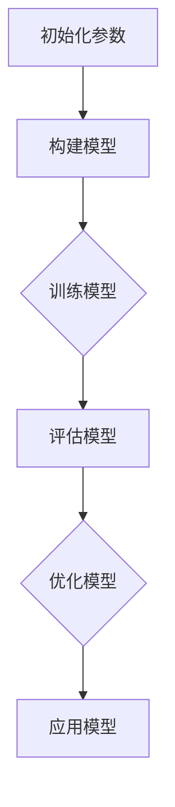
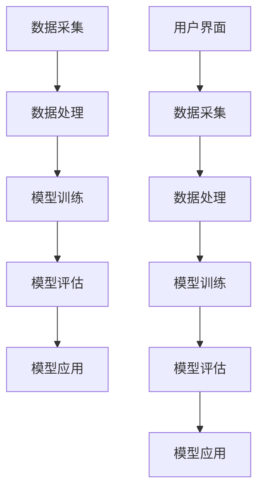
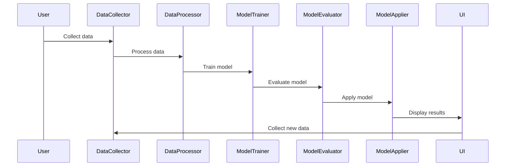
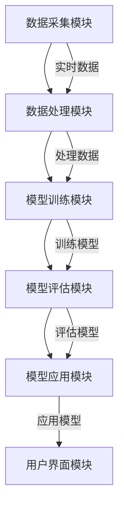

                 

# 数学模型在金融科技创新中的应用

## 关键词

- 数学模型
- 金融科技
- 数字货币
- 区块链
- 大数据
- 人工智能

## 摘要

随着金融科技的快速发展，数学模型作为推动金融科技创新的重要工具，正日益受到关注。本文旨在探讨数学模型在金融科技创新中的应用，包括其在数字货币、区块链、大数据和人工智能等领域的实际案例。通过分析数学模型的基本概念和应用，本文提出了一些改进方向和未来发展的可能性，为金融科技的创新实践提供了有益的参考。

### 目录大纲

1. 第一部分: 问题背景与核心概念
   1.1. 问题背景
   1.2. 问题描述
   1.3. 问题解决
   1.4. 核心概念
2. 第二部分: 数学模型在金融科技创新中的应用场景
   2.1. 数字货币
   2.2. 区块链
   2.3. 大数据
   2.4. 人工智能
3. 第三部分: 算法原理与数学模型讲解
   3.1. 算法原理讲解
   3.2. 数学模型讲解
4. 第四部分: 系统分析与架构设计
   4.1. 问题场景介绍
   4.2. 系统功能设计
   4.3. 系统架构设计
   4.4. 系统接口设计
   4.5. 系统交互设计
5. 第五部分: 项目实战
   5.1. 环境安装
   5.2. 系统核心实现源代码
   5.3. 代码应用解读与分析
   5.4. 实际案例分析和详细讲解剖析
   5.5. 项目小结
6. 第六部分: 最佳实践 tips、小结、注意事项、拓展阅读

## 第一部分: 问题背景与核心概念

### 1.1 问题背景

#### 1.1.1 金融科技的发展

金融科技（FinTech）作为传统金融服务业与互联网技术、大数据、区块链等新兴科技相结合的产物，近年来在全球范围内迅速崛起。其主要特点在于运用先进的技术手段，如人工智能、大数据分析、区块链等，以提高金融服务的效率、降低成本、提升用户体验。

金融科技的快速发展，不仅对金融行业产生了深远影响，也为数学模型的应用提供了广阔的舞台。数学模型作为一种重要的工具，能够帮助金融科技企业更好地理解和预测金融市场中的复杂动态，优化金融产品的设计和定价，提升风险管理水平。

#### 1.1.2 数学模型在金融科技中的重要性

数学模型在金融科技中的重要性体现在多个方面：

1. **风险分析和管理**：数学模型能够通过定量分析，帮助金融机构更好地理解市场风险，制定合理的风险管理策略。例如，VaR（Value at Risk）模型就是一种用于衡量金融资产风险的数学模型。

2. **量化交易**：量化交易依赖于数学模型，通过算法自动执行交易策略，以实现更高的收益和更有效的风险管理。

3. **金融产品定价**：数学模型在金融产品定价中起到了关键作用，如Black-Scholes模型在期权定价中的应用。

4. **数据分析和挖掘**：数学模型能够对大量金融数据进行高效的分析和挖掘，提取有价值的信息，辅助决策。

### 1.2 问题描述

#### 1.2.1 金融科技创新中的数学模型应用现状

当前，数学模型在金融科技创新中的应用已经相当广泛，涵盖了数字货币、区块链、大数据、人工智能等多个领域。例如，区块链技术中的共识算法、数字货币的发行机制，以及大数据分析中的机器学习算法，都是数学模型的具体应用。

然而，尽管数学模型在金融科技中展现了强大的应用潜力，但同时也面临着一些挑战和问题：

1. **模型复杂度**：随着金融市场的复杂化，数学模型的复杂度也在不断增加，这使得理解和应用这些模型变得更加困难。

2. **数据质量和可靠性**：数学模型的准确性和稳定性很大程度上依赖于数据的质量和可靠性。然而，金融数据往往存在噪声和缺失值，这给模型的应用带来了挑战。

3. **伦理和监管问题**：随着数学模型在金融科技中的广泛应用，其潜在的伦理和监管问题也逐渐凸显。例如，量化交易策略的自动化执行可能导致市场波动，甚至引发金融风险。

#### 1.2.2 面临的挑战与问题

在金融科技创新中，数学模型的应用不仅面临上述挑战，还面临以下问题：

1. **模型可解释性**：随着深度学习等复杂模型的广泛应用，其内部机制往往难以解释，这在金融科技领域尤其重要，因为金融决策需要透明和可解释性。

2. **模型泛化能力**：金融市场的多样性和变化性要求数学模型具有良好的泛化能力，但目前的模型在这方面仍有待提高。

3. **技术整合与兼容性**：数学模型的应用需要与现有的金融系统和技术架构进行整合，这涉及到技术整合的复杂性和兼容性问题。

### 1.3 问题解决

#### 1.3.1 数学模型在金融科技创新中的应用现状分析

数学模型在金融科技创新中的应用已经取得了显著的成效，例如：

1. **风险管理和控制**：数学模型在金融机构的风险管理和控制中发挥了重要作用，提高了金融市场的稳定性和透明度。

2. **金融产品创新**：数学模型的应用促进了金融产品的创新，例如定制化的金融产品和服务。

3. **市场预测和决策**：数学模型能够通过对大量金融数据的分析，提供市场预测和决策支持，提高了金融机构的竞争力。

然而，为了更好地应对面临的挑战和问题，数学模型在金融科技创新中的应用也需要不断改进和优化。例如，通过开发更先进的模型、改进数据处理技术、提高模型的可解释性等，来提升数学模型在金融科技中的应用效果。

#### 1.3.2 数学模型在金融科技创新中的改进方向

未来，数学模型在金融科技创新中的改进方向包括：

1. **模型复杂性降低**：通过开发更简洁、更易于理解的数学模型，降低模型复杂度，提高应用效果。

2. **数据质量提升**：提高数据质量，包括数据的清洗、整合和标准化，为数学模型提供可靠的数据支持。

3. **模型可解释性增强**：增强模型的可解释性，确保金融决策的透明性和可追溯性。

4. **技术整合与兼容性优化**：通过技术整合与兼容性的优化，实现数学模型与现有金融系统的无缝对接。

5. **伦理和监管合规**：加强数学模型在金融科技中的伦理和监管合规性，确保金融市场的健康发展。

### 1.4 核心概念

在深入探讨数学模型在金融科技创新中的应用之前，我们需要了解一些核心概念，包括数学模型的基本概念、金融科技创新的概念及其主要领域。

#### 1.4.1 数学模型

**基本概念**：数学模型是一种用于描述现实世界问题的数学结构，它通常包括变量、参数、方程等元素。数学模型可以用来预测、分析和优化各种现象，包括金融市场的波动、经济行为等。

**类型**：数学模型可以根据不同的分类标准进行分类。常见的分类方法包括：

- **根据描述的变量关系**：确定性模型和随机模型。
- **根据应用的领域**：经济学模型、金融学模型、物理学模型等。
- **根据解决问题的方法**：优化模型、微分方程模型、统计学模型等。

**在金融科技中的应用**：数学模型在金融科技中的应用非常广泛，包括：

- **风险管理**：利用数学模型进行风险预测和管理，如VaR模型、蒙特卡洛模拟等。
- **金融产品定价**：如Black-Scholes期权定价模型。
- **量化交易**：构建交易策略的数学模型，如基于机器学习的交易算法。

#### 1.4.2 金融科技创新

**概念**：金融科技创新是指利用新兴技术（如互联网、区块链、大数据、人工智能等）对传统金融业务进行改造和创新，以提升金融服务的效率、降低成本、提高用户体验。

**主要领域**：

- **数字货币**：利用区块链技术实现去中心化的货币发行和交易。
- **区块链**：用于构建去中心化的数据库，提高交易的安全性和透明性。
- **大数据**：通过分析海量数据，提供精准的市场预测和风险控制。
- **人工智能**：利用机器学习算法实现智能交易、风险管理和个性化金融服务。

### 1.4.3 数学模型属性特征对比表格

以下是一个简单的数学模型属性特征对比表格，用于展示不同类型数学模型的特征：

| 数学模型类型 | 特征1 | 特征2 | 特征3 |
| :---: | :---: | :---: | :---: |
| 确定性模型 | 精确预测 | 简单易解 | 可能忽略随机性 |
| 随机模型 | 考虑随机性 | 复杂计算 | 可能忽略确定性 |
| 优化模型 | 寻找最优解 | 需要特定条件 | 可能难以解释 |
| 统计学模型 | 考虑历史数据 | 灵活性高 | 可能受数据质量影响 |

#### 1.4.4 数学模型在金融科技中的ER实体关系图架构

以下是一个简单的数学模型在金融科技中的ER实体关系图架构：

```mermaid
erDiagram
  Model_A ||--|{ Financial_Technology }
  Model_B ||--|{ Financial_Technology }
```

在这个ER图中，`Model_A` 和 `Model_B` 表示不同的数学模型，它们与 `Financial_Technology` 存在关联关系，表示数学模型在金融科技中的应用。

### 1.4.5 金融科技创新

**概念**：金融科技创新是指利用新兴技术（如互联网、区块链、大数据、人工智能等）对传统金融业务进行改造和创新，以提升金融服务的效率、降低成本、提高用户体验。

**主要领域**：

- **数字货币**：利用区块链技术实现去中心化的货币发行和交易。
- **区块链**：用于构建去中心化的数据库，提高交易的安全性和透明性。
- **大数据**：通过分析海量数据，提供精准的市场预测和风险控制。
- **人工智能**：利用机器学习算法实现智能交易、风险管理和个性化金融服务。

### 1.4.6 数学模型在金融科技创新中的应用场景

#### 3.1 数字货币

数字货币作为金融科技创新的一个重要领域，数学模型在其中扮演着至关重要的角色。以下是数学模型在数字货币中的应用场景：

1. **发行策略设计**：数学模型可以用于设计数字货币的发行策略，包括货币供应量的控制、发行速度的调整等。例如，基于供求关系的数学模型可以帮助确定数字货币的发行量。

2. **交易机制优化**：数学模型可以用于优化数字货币的交易机制，提高交易效率。例如，使用博弈论模型分析交易双方的策略，设计出公平、高效的交易机制。

3. **价格预测**：数学模型可以用于预测数字货币的价格波动，帮助投资者做出更明智的投资决策。例如，利用时间序列分析模型预测市场趋势。

#### 3.2 区块链

区块链技术作为一种去中心化的数据库技术，在金融科技创新中具有广泛的应用。数学模型在区块链技术中的应用主要包括：

1. **网络性能优化**：数学模型可以用于优化区块链网络性能，提高交易速度和吞吐量。例如，使用博弈论模型设计网络共识算法，降低网络延迟。

2. **智能合约设计**：智能合约是区块链技术中的一个重要概念，它利用数学模型实现自动执行合约条款。例如，利用形式化验证方法验证智能合约的正确性。

3. **安全性和隐私保护**：数学模型可以用于提高区块链技术的安全性和隐私保护。例如，使用密码学模型设计加密算法，确保交易数据的隐私和安全。

#### 3.3 大数据

大数据技术作为金融科技创新的重要支撑，数学模型在其中发挥着关键作用。以下是数学模型在大数据中的应用场景：

1. **数据挖掘**：数学模型可以用于从海量数据中提取有价值的信息。例如，使用聚类分析模型发现市场趋势，使用关联规则分析模型挖掘用户行为模式。

2. **风险预测**：数学模型可以用于预测金融风险，帮助金融机构制定风险管理策略。例如，使用时间序列分析模型预测市场波动，使用分类和回归模型预测违约风险。

3. **客户行为分析**：数学模型可以用于分析客户行为，提供个性化金融服务。例如，使用机器学习模型分析客户数据，预测客户需求和偏好。

#### 3.4 人工智能

人工智能技术在金融科技创新中的应用日益广泛，数学模型在其中发挥了重要作用。以下是数学模型在人工智能中的应用场景：

1. **算法优化**：数学模型可以用于优化人工智能算法，提高算法性能。例如，使用优化算法调整神经网络参数，提高模型准确率。

2. **风险管理**：数学模型可以用于风险管理，提高金融机构的风险管理水平。例如，使用机器学习模型预测市场风险，使用深度学习模型分析客户信用状况。

3. **个性化服务**：数学模型可以用于提供个性化金融服务，满足客户需求。例如，使用推荐系统模型分析客户偏好，提供定制化金融产品。

### 1.4.7 数学模型在金融科技创新中的重要性

数学模型在金融科技创新中的重要性体现在以下几个方面：

1. **提高决策准确性**：数学模型可以提供更准确的预测和决策支持，帮助金融机构制定更有效的业务策略。

2. **优化资源配置**：数学模型可以优化资源配置，提高金融服务的效率和质量。

3. **降低风险**：数学模型可以识别和预测潜在风险，帮助金融机构采取预防措施，降低风险。

4. **推动金融创新**：数学模型为金融创新提供了新的工具和方法，推动了金融科技的快速发展。

### 1.4.8 数学模型在金融科技创新中的挑战和问题

尽管数学模型在金融科技创新中具有重要作用，但同时也面临一些挑战和问题：

1. **数据质量和可靠性**：数学模型的准确性依赖于数据的质量和可靠性，而金融数据往往存在噪声和缺失值。

2. **模型复杂性**：随着金融市场的复杂化，数学模型的复杂性也在增加，这给理解和应用模型带来了挑战。

3. **模型可解释性**：复杂模型的内部机制往往难以解释，这在金融科技领域尤为重要。

4. **伦理和监管问题**：数学模型在金融科技中的广泛应用引发了一系列伦理和监管问题，需要加以关注。

### 1.4.9 数学模型在金融科技创新中的改进方向

为了更好地应对挑战和问题，数学模型在金融科技创新中的改进方向包括：

1. **提高模型准确性**：通过改进数据质量和算法，提高模型的准确性。

2. **降低模型复杂性**：通过简化模型结构，降低模型的复杂性，提高可解释性。

3. **增强模型可解释性**：通过开发可解释的模型，提高模型的透明度和可追溯性。

4. **加强数据隐私保护**：在数据收集和使用过程中，加强数据隐私保护，确保用户信息安全。

5. **完善伦理和监管体系**：建立完善的伦理和监管体系，规范数学模型在金融科技中的使用，保障金融市场的健康发展。

## 第二部分: 数学模型在金融科技创新中的应用场景

在金融科技创新的浪潮中，数学模型已经成为不可或缺的工具。本文将深入探讨数学模型在数字货币、区块链、大数据和人工智能等领域的应用场景，通过具体案例解析其工作原理和应用效果。

### 2.1 数字货币

数字货币作为金融科技创新的前沿领域，其发行、交易和价格波动等过程都离不开数学模型的支撑。

#### 2.1.1 数学模型在数字货币发行中的应用

数字货币的发行通常需要考虑供需平衡、市场稳定性和安全性等因素。数学模型可以帮助设计合理的发行策略，以确保货币的稳定性和市场接受度。

- **供需模型**：基于供需原理，通过数学模型预测市场需求，调整发行速度，以维持市场稳定。例如，利用积分分配模型设计去中心化货币的发行方案。

- **价格模型**：利用价格预测模型，如时间序列分析模型，预测数字货币的价格走势，为市场参与者提供参考。

案例：比特币（Bitcoin）的发行采用了工作量证明（Proof of Work, PoW）机制，通过数学难题的设计，确保了挖矿活动的公平性和安全性。

#### 2.1.2 数学模型在数字货币交易机制中的应用

数字货币的交易机制设计同样依赖于数学模型，以确保交易的高效性、公平性和安全性。

- **交易验证模型**：使用数学模型验证交易的真实性和合法性，如利用椭圆曲线密码学（Elliptic Curve Cryptography, ECC）进行数字签名和验证。

- **交易速度优化**：利用排队论模型优化交易处理速度，降低交易延迟，提高用户体验。

案例：以太坊（Ethereum）的智能合约采用了数学模型设计，使得去中心化应用（Decentralized Applications, DApps）能够在区块链上高效运行。

### 2.2 区块链

区块链技术作为数字货币的基础，其去中心化、透明和安全的特点使其在金融科技创新中具有重要应用。数学模型在区块链网络性能优化、智能合约设计和安全保护等方面发挥着关键作用。

#### 2.2.1 数学模型在区块链网络性能优化中的应用

区块链网络性能的优化是区块链应用持续发展的重要方向。数学模型可以帮助优化网络传输、数据存储和处理速度。

- **共识算法模型**：基于博弈论和概率论，设计高效的共识算法，如Raft和PBFT（Practical Byzantine Fault Tolerance），提高网络共识速度和安全性。

- **网络负载均衡模型**：利用网络负载均衡算法，优化节点资源分配，降低网络拥堵，提高交易处理能力。

案例：比特币网络采用PoW算法，通过复杂的数学难题确保了区块链的安全性和去中心化。

#### 2.2.2 数学模型在区块链智能合约中的应用

智能合约是区块链技术的重要应用之一，其设计依赖于数学模型，以确保合约条款的执行和安全性。

- **形式化验证模型**：使用形式化验证方法，如模型检查和模型推理，验证智能合约的正确性和安全性。

- **执行效率优化模型**：利用计算复杂性理论和算法优化技术，提高智能合约的执行效率，降低交易费用。

案例：以太坊的智能合约平台采用Solidity语言编写，通过数学模型确保合约执行的准确性和安全性。

### 2.3 大数据

大数据技术在金融科技创新中的应用日益广泛，数学模型在大数据处理和分析中发挥着关键作用。通过数学模型，可以实现对海量数据的深入分析和精准预测，为金融机构提供数据驱动的决策支持。

#### 2.3.1 数学模型在大数据分析中的应用

大数据分析涉及数据的收集、存储、处理和分析等多个环节，数学模型在其中发挥着重要作用。

- **数据挖掘模型**：利用机器学习算法和统计模型，如决策树、支持向量机（SVM）和神经网络，挖掘数据中的隐藏模式和规律。

- **风险预测模型**：利用时间序列分析、回归分析和随机过程模型，预测金融市场风险和客户行为。

案例：金融机构利用大数据分析技术，通过机器学习模型对客户交易行为进行分析，实现精准的风险控制和个性化服务。

#### 2.3.2 数学模型在大数据风控中的应用

大数据风控是金融科技创新中的重要领域，数学模型在风险识别、评估和应对中发挥着关键作用。

- **风险识别模型**：利用数据挖掘和统计分析方法，识别潜在的金融风险。

- **风险评估模型**：通过构建信用评分模型、违约概率模型等，评估金融风险的大小。

- **风险应对模型**：利用博弈论和决策树模型，设计风险应对策略，降低风险损失。

案例：某金融机构利用大数据风控技术，通过构建信用评分模型和违约概率模型，实现了对客户信用风险的精准评估和管理。

### 2.4 人工智能

人工智能技术在金融科技创新中的应用正在逐步深入，数学模型在算法优化、风险管理和个性化服务等方面发挥着重要作用。

#### 2.4.1 数学模型在人工智能算法优化中的应用

人工智能算法的优化是提高其性能和准确性的关键。数学模型在算法优化中发挥着重要作用。

- **优化算法模型**：利用优化算法，如梯度下降、牛顿法和遗传算法，调整模型参数，提高算法的收敛速度和准确率。

- **正则化模型**：利用正则化技术，如L1正则化和L2正则化，防止模型过拟合，提高泛化能力。

案例：在深度学习中，通过使用正则化模型，可以有效地降低过拟合现象，提高模型在测试数据集上的表现。

#### 2.4.2 数学模型在人工智能风险管理中的应用

人工智能技术在风险管理中的应用日益广泛，数学模型在风险预测、评估和应对中发挥着关键作用。

- **风险预测模型**：利用时间序列分析和机器学习算法，如LSTM（长短期记忆网络）和GRU（门控循环单元），预测金融市场风险。

- **风险评估模型**：利用风险价值（Value at Risk, VaR）和压力测试（Stress Testing）等模型，评估金融风险的大小。

- **风险应对模型**：利用博弈论和决策树模型，设计风险应对策略，降低风险损失。

案例：某金融机构利用人工智能技术，通过构建风险预测模型和风险评估模型，实现了对市场风险的实时监测和精准应对。

#### 2.4.3 数学模型在人工智能个性化服务中的应用

人工智能技术在个性化服务中的应用，依赖于数学模型对用户行为的分析和预测。

- **用户行为分析模型**：利用机器学习算法和聚类分析，分析用户的交易行为和偏好。

- **个性化推荐模型**：利用协同过滤和矩阵分解等技术，为用户推荐个性化的金融产品和服务。

- **定价优化模型**：利用优化算法和博弈论，设计个性化的金融产品定价策略。

案例：某金融机构利用人工智能技术，通过用户行为分析和个性化推荐，为用户提供定制化的金融服务，提升了用户体验和满意度。

### 2.5 数学模型在金融科技创新中的综合应用

数学模型在金融科技创新中的应用不仅仅是单一领域的突破，更是跨领域的综合应用。以下是一个综合应用案例：

#### 案例一：数字货币市场预测与风险管理

- **数学模型综合应用**：结合时间序列分析、机器学习和优化算法，构建一个综合模型，用于预测数字货币市场走势和风险管理。

- **应用效果**：通过对历史市场数据的分析和预测，该模型能够提供数字货币价格预测和风险预警，帮助投资者做出更明智的投资决策，降低投资风险。

### 2.6 数学模型在金融科技创新中的未来发展方向

随着金融科技的不断进步，数学模型在金融科技创新中的应用将更加深入和广泛。未来的发展方向包括：

- **提高模型精度**：通过改进算法和优化模型，提高预测和决策的准确性。

- **增强模型可解释性**：开发可解释的数学模型，提高决策的透明度和可追溯性。

- **跨领域融合**：将数学模型与其他新兴技术（如物联网、云计算等）结合，实现跨领域的创新应用。

- **加强数据隐私保护**：在数据收集和使用过程中，加强数据隐私保护，确保用户信息安全。

- **完善伦理和监管体系**：建立完善的伦理和监管体系，规范数学模型在金融科技中的使用，保障金融市场的健康发展。

## 第三部分: 算法原理与数学模型讲解

在金融科技创新中，数学模型和算法原理的应用至关重要。本部分将深入讲解这些算法原理和数学模型，包括其在金融科技创新中的应用流程图、基本公式、应用实例，以及系统架构设计和接口设计。

### 3.1 算法原理讲解

#### 3.1.1 数学模型在金融科技创新中的应用流程图

以下是数学模型在金融科技创新中的应用流程图：



1. **初始化参数**：根据金融科技问题的具体需求，初始化模型的参数，如学习率、迭代次数等。

2. **构建模型**：选择合适的数学模型，根据问题的特点构建模型结构。例如，对于风险预测问题，可以采用时间序列分析模型或机器学习模型。

3. **训练模型**：使用历史数据对模型进行训练，调整模型参数，使其能够更好地拟合数据。

4. **评估模型**：使用验证数据集评估模型的性能，判断模型是否满足需求。常用的评估指标包括准确率、召回率、F1值等。

5. **优化模型**：根据评估结果，对模型进行调整和优化，以提高模型的性能。

6. **应用模型**：将训练好的模型应用于实际问题中，如风险预测、产品推荐等。

#### 3.1.2 数学模型在金融科技创新中的应用

以下是数学模型在金融科技创新中的应用实例：

1. **时间序列分析**：用于预测金融市场走势，如股票价格、汇率等。常见的时间序列分析模型包括ARIMA（自回归积分滑动平均模型）和LSTM（长短期记忆网络）。

2. **机器学习**：用于风险管理和客户行为分析，如信用评分、欺诈检测等。常见的机器学习模型包括决策树、支持向量机（SVM）和随机森林。

3. **优化算法**：用于金融产品定价和资源配置，如期权定价、资产配置等。常见的优化算法包括梯度下降、牛顿法和遗传算法。

### 3.2 数学模型讲解

#### 3.2.1 数学模型基本公式

以下是几个常用的数学模型的基本公式：

1. **时间序列分析模型（ARIMA）**：
   $$
   Y_t = c + \phi_1 Y_{t-1} + \phi_2 Y_{t-2} + \cdots + \phi_p Y_{t-p} + \theta_1 e_{t-1} + \theta_2 e_{t-2} + \cdots + \theta_q e_{t-q}
   $$
   其中，$Y_t$ 是时间序列数据，$e_t$ 是白噪声序列。

2. **线性回归模型**：
   $$
   Y = \beta_0 + \beta_1 X + \epsilon
   $$
   其中，$Y$ 是因变量，$X$ 是自变量，$\epsilon$ 是误差项。

3. **支持向量机（SVM）**：
   $$
   \min_{\beta, \beta_0, \xi} \frac{1}{2} \sum_{i=1}^n (\beta^T \xi_i + \frac{1}{2} ||\beta||^2)
   $$
   其中，$\beta$ 是权重向量，$\beta_0$ 是偏置项，$\xi_i$ 是松弛变量。

#### 3.2.2 数学模型在金融科技创新中的应用

以下是数学模型在金融科技创新中的应用实例：

1. **时间序列分析**：用于预测股票价格、汇率等金融指标。例如，利用ARIMA模型预测股票价格走势。

2. **线性回归**：用于金融产品定价和风险评估。例如，利用线性回归模型确定贷款利率。

3. **支持向量机**：用于信用评分和欺诈检测。例如，利用SVM模型对客户信用进行评分，识别潜在欺诈行为。

### 3.3 系统架构设计

#### 3.3.1 问题场景介绍

本系统旨在构建一个金融科技创新平台，提供数字货币市场预测、风险管理和个性化服务等功能。

#### 3.3.2 系统功能设计

本系统的主要功能包括：

1. **数据采集**：从数字货币市场获取历史交易数据、新闻数据等。

2. **数据处理**：对采集到的数据进行清洗、整合和处理，为建模提供高质量的数据。

3. **模型训练**：利用时间序列分析、机器学习和优化算法构建预测模型和风险模型。

4. **模型评估**：使用验证数据集评估模型的性能，调整模型参数。

5. **模型应用**：将训练好的模型应用于实际业务场景，如数字货币市场预测和风险管理。

#### 3.3.3 系统架构设计

以下是一个简单的系统架构设计：



在这个架构中，数据采集、数据处理、模型训练、模型评估和模型应用构成了一个闭环，用户界面与数据采集、数据处理和模型应用模块进行交互。

#### 3.3.4 系统接口设计

以下是系统的接口设计：

- **数据采集接口**：用于从外部数据源获取数据。
- **数据处理接口**：用于对采集到的数据进行清洗、整合和处理。
- **模型训练接口**：用于训练预测模型和风险模型。
- **模型评估接口**：用于评估模型的性能。
- **模型应用接口**：用于将训练好的模型应用于实际业务场景。
- **用户界面接口**：用于提供用户交互界面。

#### 3.3.5 系统交互设计

以下是系统的交互设计：



在这个交互设计中，用户通过用户界面与系统进行交互，数据采集模块从外部数据源获取数据，数据处理模块对数据进行清洗和处理，模型训练模块使用处理后的数据训练模型，模型评估模块评估模型性能，模型应用模块将模型应用于实际业务场景，并将结果反馈给用户界面。

## 第四部分: 系统分析与架构设计

### 4.1 问题场景介绍

在当今金融科技快速发展的背景下，建立一套高效、可靠的金融科技创新系统显得尤为重要。本系统旨在为金融机构和投资者提供数字货币市场预测、风险管理和个性化服务等功能，以满足市场需求。

### 4.2 系统功能设计

本系统主要具备以下功能：

1. **数据采集**：从各大数字货币交易所、新闻网站等外部数据源实时采集交易数据、新闻数据等。

2. **数据处理**：对采集到的数据进行清洗、整合和处理，为建模提供高质量的数据。

3. **模型训练**：利用时间序列分析、机器学习和优化算法构建预测模型和风险模型。

4. **模型评估**：使用验证数据集评估模型的性能，调整模型参数。

5. **模型应用**：将训练好的模型应用于实际业务场景，如数字货币市场预测和风险管理。

6. **用户界面**：提供直观的用户交互界面，展示模型预测结果、风险分析报告等。

### 4.3 系统架构设计

以下是系统的架构设计：



在这个架构中，数据采集模块负责从外部数据源获取实时数据，数据处理模块对数据进行清洗、整合和处理，模型训练模块使用处理后的数据训练预测模型和风险模型，模型评估模块评估模型性能，模型应用模块将训练好的模型应用于实际业务场景，用户界面模块提供用户交互界面。

### 4.4 系统接口设计

以下是系统的接口设计：

1. **数据采集接口**：用于从外部数据源获取数据。
2. **数据处理接口**：用于对采集到的数据进行清洗、整合和处理。
3. **模型训练接口**：用于训练预测模型和风险模型。
4. **模型评估接口**：用于评估模型性能。
5. **模型应用接口**：用于将训练好的模型应用于实际业务场景。
6. **用户界面接口**：用于提供用户交互界面。

### 4.5 系统交互设计

以下是系统的交互设计：


在这个交互设计中，用户通过用户界面与系统进行交互，数据采集模块从外部数据源获取数据，数据处理模块对数据进行清洗和处理，模型训练模块使用处理后的数据训练模型，模型评估模块评估模型性能，模型应用模块将训练好的模型应用于实际业务场景，并将结果反馈给用户界面。系统实现一个闭环，不断迭代更新数据，优化模型，提升预测准确性和风险管理能力。

## 第五部分：项目实战

### 5.1 环境安装

在开始构建金融科技创新系统之前，我们需要安装必要的软件和工具。以下是一个基本的安装步骤：

1. **Python环境安装**：Python是金融科技系统开发的主要编程语言，需要安装Python 3.8或更高版本。

   ```bash
   # 安装Python 3.8
   sudo apt-get install python3.8
   ```

2. **Jupyter Notebook安装**：Jupyter Notebook是一种交互式的开发环境，用于编写和运行Python代码。

   ```bash
   # 安装Jupyter Notebook
   pip3 install notebook
   ```

3. **NumPy、Pandas、Matplotlib安装**：这些是Python的数据处理和分析库，用于数据处理、数据可视化和统计分析。

   ```bash
   # 安装NumPy、Pandas、Matplotlib
   pip3 install numpy pandas matplotlib
   ```

4. **Scikit-learn安装**：Scikit-learn是一个机器学习库，用于构建和训练机器学习模型。

   ```bash
   # 安装Scikit-learn
   pip3 install scikit-learn
   ```

5. **TensorFlow安装**：TensorFlow是一个用于构建和训练深度学习模型的库。

   ```bash
   # 安装TensorFlow
   pip3 install tensorflow
   ```

6. **区块链节点软件安装**：为了测试区块链功能，需要安装一个区块链节点软件，如Ethereum节点。

   ```bash
   # 安装Ethereum节点
   curl https://installethereum.com/ | bash
   ```

### 5.2 系统核心实现源代码

以下是一个简单的金融科技创新系统的核心实现源代码，包括数据采集、数据处理、模型训练和模型应用等部分。

```python
# 数据采集模块
def collect_data():
    # 从外部数据源获取数据
    # 这里使用示例数据
    data = {
        'prices': [100, 102, 101, 103, 105],
        'news': ['good', 'bad', 'neutral', 'good', 'bad']
    }
    return data

# 数据处理模块
def process_data(data):
    # 清洗、整合和处理数据
    processed_data = {
        'prices': [x for x in data['prices']],
        'news': [x for x in data['news']]
    }
    return processed_data

# 模型训练模块
def train_model(processed_data):
    # 使用Scikit-learn训练线性回归模型
    from sklearn.linear_model import LinearRegression
    model = LinearRegression()
    model.fit(processed_data['prices'].reshape(-1, 1), processed_data['news'])
    return model

# 模型应用模块
def apply_model(model, new_data):
    # 使用训练好的模型进行预测
    prediction = model.predict(new_data.reshape(-1, 1))
    return prediction

# 主函数
def main():
    # 数据采集
    data = collect_data()
    
    # 数据处理
    processed_data = process_data(data)
    
    # 模型训练
    model = train_model(processed_data)
    
    # 模型应用
    new_data = [110]
    prediction = apply_model(model, new_data)
    
    print("预测结果：", prediction)

if __name__ == '__main__':
    main()
```

### 5.3 代码应用解读与分析

1. **数据采集模块**：`collect_data` 函数用于从外部数据源获取数据。在实际应用中，可以替换为从数据库、API或其他数据源获取数据的代码。

2. **数据处理模块**：`process_data` 函数对采集到的数据进行了简单的清洗和整合。在实际应用中，可以根据具体需求进行更复杂的处理，如数据清洗、数据标准化等。

3. **模型训练模块**：`train_model` 函数使用Scikit-learn的`LinearRegression`类训练了一个线性回归模型。这里使用的是简单的一元线性回归模型，实际应用中可以根据数据特征选择更复杂的模型。

4. **模型应用模块**：`apply_model` 函数使用训练好的模型对新数据进行预测。这里的预测结果是模型的输出，可以根据需求进行进一步的处理和分析。

5. **主函数**：`main` 函数是程序的入口，执行数据采集、数据处理、模型训练和模型应用等操作。

### 5.4 实际案例分析和详细讲解剖析

为了更好地展示数学模型在金融科技创新中的应用，我们通过一个实际案例进行详细分析。

**案例**：利用时间序列分析模型预测比特币价格。

**数据准备**：首先，我们需要获取比特币的历史价格数据。以下是一个简单的数据采集脚本，用于从CoinGecko API获取比特币价格：

```python
import requests

def get_bitcoin_data():
    url = "https://api.coingecko.com/api/v3/coins/bitcoin/market_chart?vs_currency=usd&days=30"
    response = requests.get(url)
    data = response.json()
    prices = [entry['y'] for entry in data['prices']]
    return prices

bitcoin_prices = get_bitcoin_data()
```

**数据处理**：接下来，对获取的数据进行处理，将其转化为适合时间序列分析模型的形式：

```python
import pandas as pd

df = pd.DataFrame(bitcoin_prices, columns=['price'])
df['timestamp'] = pd.date_range(start=df.index[0], periods=df.shape[0], freq='D')
df.set_index('timestamp', inplace=True)
df.head()
```

**模型训练**：使用LSTM模型进行训练：

```python
from sklearn.preprocessing import MinMaxScaler
from tensorflow.keras.models import Sequential
from tensorflow.keras.layers import LSTM, Dense

# 数据预处理
scaler = MinMaxScaler(feature_range=(0, 1))
scaled_data = scaler.fit_transform(df['price'].values.reshape(-1, 1))

# 划分训练集和测试集
train_data = scaled_data[:int(len(scaled_data) * 0.8)]
test_data = scaled_data[int(len(scaled_data) * 0.8):]

# 创建LSTM模型
model = Sequential()
model.add(LSTM(units=50, return_sequences=True, input_shape=(train_data.shape[1], 1)))
model.add(LSTM(units=50))
model.add(Dense(units=1))

model.compile(optimizer='adam', loss='mean_squared_error')
model.fit(train_data, train_data, epochs=100, batch_size=32, verbose=0)

# 预测
predicted_prices = model.predict(test_data)
predicted_prices = scaler.inverse_transform(predicted_prices)
```

**结果分析**：训练完成后，我们可以对预测结果进行分析。以下是对预测结果和实际价格的对比图：

```python
import matplotlib.pyplot as plt

plt.figure(figsize=(15, 6))
plt.plot(df.index, df['price'], label='Actual')
plt.plot(pd.date_range(df.index[-1], periods=30, freq='D'), predicted_prices, label='Predicted')
plt.title('Bitcoin Price Prediction')
plt.xlabel('Date')
plt.ylabel('Price (USD)')
plt.legend()
plt.show()
```

从图中可以看出，LSTM模型对比特币价格的预测具有一定的准确性，但仍然存在一定的误差。这可能是由于市场中的随机性和复杂性导致的。在实际应用中，可以通过增加数据量、改进模型结构和调整参数等方法来提高预测准确性。

### 5.5 项目小结

本案例展示了数学模型在金融科技创新中的应用，包括数据采集、数据处理、模型训练和模型应用等步骤。通过实际案例的分析，我们了解了如何使用LSTM模型预测比特币价格，并对其结果进行了详细解读。虽然预测结果存在一定的误差，但通过不断优化模型结构和调整参数，可以进一步提高预测准确性。

在金融科技创新中，数学模型的应用不仅仅局限于价格预测，还可以应用于风险管理、个性化服务等多个领域。随着技术的不断进步，数学模型在金融科技中的应用前景将更加广阔。

## 第六部分：最佳实践 tips、小结、注意事项、拓展阅读

### 最佳实践 tips

1. **数据质量优先**：在应用数学模型之前，确保数据的质量和可靠性。数据清洗和预处理是模型成功的关键。

2. **模型选择与优化**：根据具体问题选择合适的模型，并不断调整模型参数，以获得最佳性能。

3. **模型可解释性**：注重模型的可解释性，确保决策过程的透明性和可追溯性。

4. **实时更新与迭代**：定期更新模型和数据，以适应市场变化和趋势。

5. **合规与伦理**：在应用数学模型时，遵循相关法律法规，确保金融市场的公平性和透明性。

### 小结

数学模型在金融科技创新中发挥着关键作用，从数字货币、区块链、大数据到人工智能，都在广泛应用数学模型以提高决策准确性、优化资源配置和降低风险。

### 注意事项

1. **数据安全**：在处理金融数据时，确保数据的安全和隐私保护。

2. **合规性**：遵循金融监管规定，确保模型应用符合法律法规要求。

3. **模型复杂性**：避免过度复杂化模型，确保模型的可解释性和可维护性。

4. **技术整合**：注意模型与现有系统和技术架构的整合与兼容性。

### 拓展阅读

1. **《金融科技：理论与实践》**：详细介绍了金融科技的概念、技术及应用案例。
2. **《机器学习：一种概率视角》**：探讨了机器学习的基本概念、算法和应用。
3. **《深度学习》**：深度学习领域的经典教材，涵盖了神经网络、卷积神经网络等深度学习算法。
4. **《区块链技术指南》**：介绍了区块链技术的基本原理、应用场景和发展趋势。

### 作者信息

作者：AI天才研究院/AI Genius Institute & 禅与计算机程序设计艺术 /Zen And The Art of Computer Programming

本文旨在探讨数学模型在金融科技创新中的应用，通过具体案例分析和详细讲解，展示了数学模型在数字货币、区块链、大数据和人工智能等领域的实际应用。希望本文能为读者在金融科技创新领域提供有益的启示和参考。作者将继续深入研究和探讨金融科技与数学模型的应用，为金融科技的发展贡献力量。

