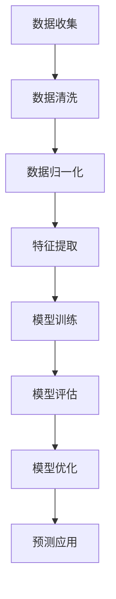
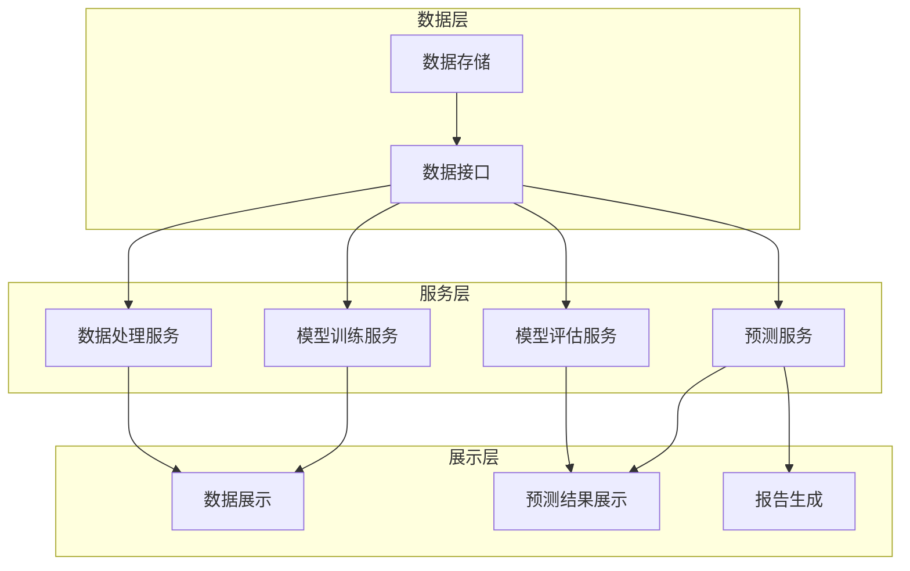
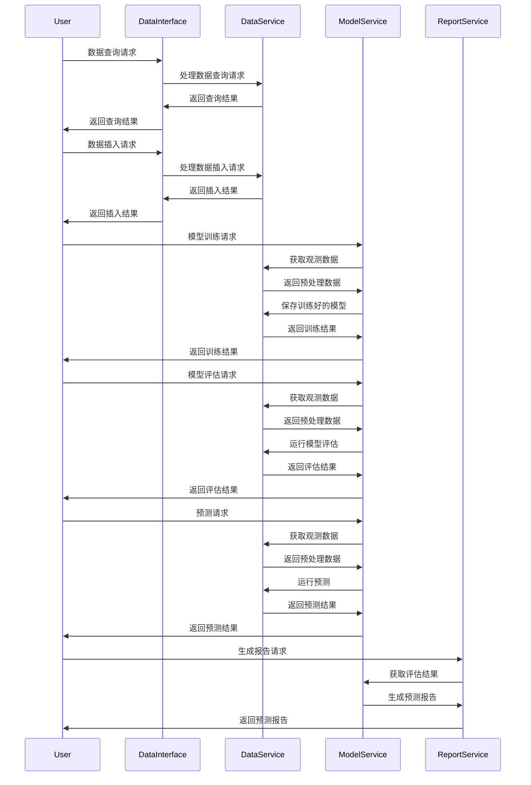

                 

# 《数学模型在预测宇宙暗能量状态方程演化中的应用》

## 摘要

本文深入探讨了数学模型在预测宇宙暗能量状态方程演化中的应用。随着对宇宙演化的深入研究，暗能量作为推动宇宙加速膨胀的神秘力量，其性质和状态方程的演化规律成为物理学和天文学的重要研究课题。本文首先介绍了宇宙暗能量的基本概念和状态方程的研究背景，然后详细阐述了数学模型在宇宙学中的应用，特别是暗能量状态方程模型的发展历程。接着，本文重点介绍了核心概念及其联系，包括宇宙学中的基本概念、暗能量状态方程的相关概念，以及概念属性特征的对比和ER实体关系图。在算法原理讲解部分，本文详细阐述了暗能量状态方程预测算法的原理、流程、数学模型和公式，并通过示例进行了具体的应用说明。随后，本文介绍了系统分析与架构设计方案，包括问题场景介绍、系统架构设计、系统接口设计和系统交互序列图。最后，本文通过一个实际案例进行了详细讲解和剖析，总结了项目实战经验，并提出了最佳实践和注意事项。本文旨在为研究人员提供一套系统、详细且易于理解的技术指南，以促进对宇宙暗能量状态方程演化的深入研究。

## 引言

### 1.1 研究背景

宇宙的演化一直是天文学和物理学的重要研究课题。在过去的几十年中，科学家们通过观测和理论计算，逐渐揭示了宇宙的起源、结构和未来命运。然而，在宇宙学中，暗能量这一神秘的存在始终是一个未解之谜。暗能量被认为是推动宇宙加速膨胀的神秘力量，其性质和状态方程的演化规律成为物理学和天文学的重要研究课题。

宇宙暗能量的概念最早由物理学家爱德华·阿莫斯·米斯纳和勒梅特在20世纪30年代提出。他们发现，在广义相对论的框架下，如果宇宙的膨胀速度超过了某个临界值，那么宇宙将不可避免地加速膨胀。为了解释这一现象，他们提出了一个充满宇宙的“斥力场”，即后来被称为暗能量的概念。

然而，暗能量直到20世纪90年代才被科学家们广泛接受。当时，天文学家通过观测宇宙微波背景辐射和遥远星系的红移，发现宇宙的膨胀速度正在加速。这一发现与牛顿引力定律预测的结果不符，从而促使科学家们重新审视宇宙学的基本理论。

暗能量与状态方程的关系密切相关。状态方程描述了物质在不同状态下的物理性质，如密度、压强等。在宇宙学中，状态方程描述了宇宙中物质和能量的分布规律。暗能量的状态方程则描述了暗能量在宇宙演化过程中的行为和性质。

### 1.1.1 宇宙暗能量的概念

宇宙暗能量是指一种充满宇宙空间的、不可见的、具有负压强的能量。它与物质不同，不参与引力相互作用，但能导致宇宙的加速膨胀。暗能量的密度非常小，但它的作用力非常大，足以克服引力的作用，使宇宙不断膨胀。

科学家们对暗能量的性质仍有很多未知。目前，普遍认为暗能量是一种均匀分布的场，类似于电磁场。然而，暗能量的本质和起源仍然是宇宙学中最大的未解之谜之一。

### 1.1.2 暗能量与状态方程

暗能量与状态方程的关系可以从以下几个方面来理解：

1. **状态方程的定义**：状态方程是描述物质或能量在特定状态下物理性质的数学方程。在宇宙学中，状态方程描述了宇宙中物质和能量的分布规律。

2. **暗能量的状态方程**：暗能量的状态方程描述了暗能量在不同条件下的密度和压强关系。常见的暗能量状态方程包括常数w方程和幂律方程。

3. **暗能量对宇宙演化的影响**：暗能量的状态方程决定了宇宙的膨胀速度。如果暗能量的压强小于密度（w<-1），宇宙将加速膨胀；如果压强等于密度（w=-1），宇宙将保持稳定状态；如果压强大于密度（w>0），宇宙将收缩。

### 1.1.3 研究暗能量状态方程的重要性

研究暗能量状态方程对于理解宇宙演化的基本规律具有重要意义。首先，暗能量是推动宇宙加速膨胀的关键因素，研究其状态方程有助于揭示宇宙加速膨胀的原因。其次，暗能量状态方程的研究有助于完善宇宙学理论，特别是广义相对论和量子力学之间的统一理论。

此外，暗能量状态方程的研究还有实际应用价值。例如，它有助于预测宇宙的未来演化，指导宇宙探索和天体物理研究。同时，暗能量状态方程的研究也为其他领域提供了丰富的数学模型和计算方法，如计算物理学、数值分析等。

总之，研究暗能量状态方程是宇宙学中的一项重要任务。通过深入研究暗能量状态方程，科学家们有望揭示宇宙演化的基本规律，推动物理学和天文学的发展。

### 1.2 研究意义

#### 1.2.1 科学意义

研究暗能量状态方程在科学领域具有重要的意义。首先，它有助于深入理解宇宙的起源和演化，揭示宇宙加速膨胀的奥秘。通过研究暗能量状态方程，科学家们可以探索宇宙学的基本理论，如广义相对论和量子力学，推动宇宙学的发展。其次，暗能量状态方程的研究有助于解决物理学中的某些基本问题，如能量守恒和引力与量子力学的统一。

#### 1.2.2 实际应用价值

暗能量状态方程的研究在实际应用中具有广泛的价值。首先，它有助于改进宇宙学模型，提高对宇宙演化的预测准确性，指导天体物理观测和研究。其次，暗能量状态方程的研究为计算物理学和数值分析提供了丰富的数学模型和方法，如数值模拟、算法优化等。这些方法可以应用于其他科学领域，如气候预测、地质研究等。

#### 1.2.3 学术贡献

本文通过系统性地介绍暗能量状态方程的研究背景、核心概念、算法原理和实际应用，为相关领域的研究提供了重要参考。本文的研究不仅有助于提高对宇宙暗能量状态方程演化的理解，还为其他科学领域提供了有益的启示。通过本文的研究，我们期望能够为未来的宇宙学研究和实际应用奠定基础。

### 1.3 研究现状

目前，关于暗能量状态方程的研究已经取得了显著的进展。在理论方面，科学家们提出了多种暗能量模型，如常数w模型、幂律模型、弦理论模型等。这些模型通过数值模拟和观测数据的对比，对暗能量状态方程的演化规律进行了深入研究。在实验方面，科学家们利用宇宙微波背景辐射和遥远星系的红移观测数据，对暗能量状态方程进行了精确测量。

然而，暗能量状态方程的研究仍然存在一些挑战。首先，暗能量的本质和起源仍不明确，这限制了我们对暗能量状态方程的深入理解。其次，现有模型和观测数据之间的不一致性，也使得科学家们对暗能量状态方程的演化规律存在争议。此外，暗能量状态方程的研究需要大量的计算资源和高效的算法，这对计算物理学和数值分析提出了更高的要求。

总之，尽管暗能量状态方程的研究已经取得了一定的进展，但仍然存在许多未解之谜。未来，随着观测技术和计算能力的提高，科学家们有望在暗能量状态方程的研究中取得更多突破，进一步揭示宇宙暗能量的奥秘。

### 1.4 文章结构

本文的结构如下：

1. **引言**：介绍了研究的背景和意义，总结了当前的研究现状。
2. **数学模型概述**：阐述了数学模型的概念及其在宇宙学中的应用，回顾了暗能量状态方程模型的发展历程。
3. **核心概念与联系**：详细介绍了宇宙学中的基本概念和暗能量状态方程的相关概念，进行了概念属性特征的对比，并绘制了ER实体关系图。
4. **算法原理讲解**：详细阐述了暗能量状态方程预测算法的原理、流程、数学模型和公式，并通过示例进行了具体的应用说明。
5. **系统分析与架构设计**：介绍了系统分析与架构设计方案，包括问题场景介绍、系统架构设计、系统接口设计和系统交互序列图。
6. **项目实战**：通过一个实际案例进行了详细讲解和剖析，总结了项目实战经验，并提出了最佳实践和注意事项。
7. **结论**：总结了本文的主要发现，展望了未来的研究方向。

通过本文的系统研究，我们期望能够为暗能量状态方程的深入研究提供有益的参考，推动宇宙学的发展。

### 第1章 数学模型概述

数学模型是一种抽象的表示方法，通过数学语言描述现实世界的现象和规律。在科学研究和工程实践中，数学模型的应用无处不在，从物理学的经典力学、电磁学，到生物学、经济学，再到宇宙学，数学模型都是理解和解决问题的关键工具。

#### 1.1 数学模型的概念

数学模型通常由几个基本要素组成：

- **变量**：用于表示研究问题的状态和特征。
- **参数**：影响变量取值的常数或函数。
- **方程**：描述变量和参数之间关系的数学公式。
- **边界条件**：限制变量取值范围的额外条件。

根据不同的研究目的和应用场景，数学模型可以分为多种类型，如微分方程模型、差分方程模型、统计模型、优化模型等。

#### 1.1.1 定义与分类

数学模型可以按照不同的分类标准进行划分：

- **按研究方法分类**：可以分为确定性模型和随机模型。确定性模型假设变量和参数之间的关系是固定不变的，如牛顿运动定律。随机模型则考虑变量和参数的随机性，如蒙特卡洛模拟。
- **按研究对象分类**：可以分为连续模型和离散模型。连续模型适用于连续变化的物理量，如热传导方程。离散模型则适用于离散事件的统计描述，如马尔可夫链。
- **按应用领域分类**：可以分为物理模型、生物模型、经济模型等。不同领域的数学模型具有不同的特点和适用范围。

#### 1.1.2 数学模型在科学领域的应用

数学模型在科学领域具有广泛的应用，以下是几个典型的例子：

- **物理学**：牛顿定律、麦克斯韦方程、薛定谔方程等是物理学中经典的数学模型，它们描述了自然界的基本规律。
- **生物学**：种群动力学模型、神经网络模型等描述了生物系统的行为和演化规律，对生物进化、生态系统稳定性的研究具有重要意义。
- **经济学**：供需模型、市场均衡模型、投资组合模型等描述了经济系统的运行规律，对经济预测、金融分析等有重要应用。

#### 1.2 数学模型在宇宙学中的应用

宇宙学是研究宇宙起源、结构、演化和最终命运的学科。数学模型在宇宙学中的应用非常广泛，以下是一些具体的例子：

- **早期宇宙模型**：宇宙微波背景辐射的观测和理论研究表明，宇宙在大爆炸后几分钟内经历了极快的膨胀，这一现象被称为“暴胀”。暴胀模型通过数学方程描述了早期宇宙的快速膨胀过程。
- **宇宙膨胀模型**：哈勃定律揭示了宇宙膨胀的现象，即遥远星系的红移与它们到地球的距离成正比。这一现象通过弗里德曼-勒梅特-罗伯逊-沃尔克（FLRW）度规描述了宇宙的膨胀规律。
- **暗能量模型**：暗能量是推动宇宙加速膨胀的神秘力量。通过引力透镜效应、宇宙微波背景辐射观测等手段，科学家们提出了多种暗能量模型，如常数w模型、幂律模型等。

#### 1.2.1 早期宇宙模型

早期宇宙模型描述了宇宙在大爆炸后几分钟内的演化过程。根据宇宙微波背景辐射的观测数据，科学家们提出了宇宙暴胀模型，认为宇宙在暴胀期间经历了极快的膨胀。暴胀模型通过数学方程描述了这一过程，如广义相对论方程和宇宙学常数。

- **暴胀模型**：暴胀模型认为，宇宙在极短时间内经历了指数级膨胀，从而解释了宇宙的均匀性和各向同性。暴胀模型的核心参数包括宇宙学常数、暴胀场等。
- **数学表示**：暴胀过程的数学表示通常采用弗里德曼-勒梅特-罗伯逊-沃尔克（FLRW）度规，如 $ds^2 = -dt^2 + a(t)^2(dx^2 + dy^2 + dz^2)$。其中，$a(t)$ 表示宇宙尺度的膨胀因子。

#### 1.2.2 宇宙膨胀模型

宇宙膨胀模型描述了宇宙在暴胀后的演化过程。哈勃定律揭示了宇宙膨胀的基本规律，即遥远星系的红移与它们到地球的距离成正比。这一规律可以通过弗里德曼-勒梅特-罗伯逊-沃尔克（FLRW）度规描述。

- **哈勃定律**：哈勃定律描述了宇宙膨胀的速度，即 $v = H_0D$，其中 $v$ 是星系的红移速度，$H_0$ 是哈勃常数，$D$ 是星系的距离。
- **弗里德曼-勒梅特-罗伯逊-沃尔克（FLRW）度规**：FLRW度规是描述宇宙膨胀的数学模型，通常表示为 $ds^2 = -dt^2 + a(t)^2(dx^2 + dy^2 + dz^2)$。其中，$a(t)$ 是宇宙尺度随时间的膨胀因子。

#### 1.2.3 暗能量模型

暗能量是推动宇宙加速膨胀的神秘力量。科学家们提出了多种暗能量模型，以解释宇宙膨胀加速的现象。常见的暗能量模型包括常数w模型、幂律模型等。

- **常数w模型**：常数w模型认为，暗能量的压强与其密度成正比，即 $w = P/\rho$。其中，$P$ 是压强，$\rho$ 是密度。常数w模型的一个特例是 $w = -1$，这种情况下，暗能量导致宇宙加速膨胀。
- **幂律模型**：幂律模型认为，暗能量的压强与其密度呈幂律关系，即 $w = w_0 + \alpha \ln(\rho/\rho_0)$。其中，$w_0$ 是常数，$\alpha$ 是幂律指数。幂律模型可以更好地描述宇宙膨胀加速的现象。

#### 1.3 暗能量状态方程模型的发展历程

暗能量状态方程模型的发展历程反映了科学家们对宇宙加速膨胀现象的不断探索和认识。以下是几个重要的发展阶段：

- **早期模型**：在20世纪30年代，爱德华·阿莫斯·米斯纳和勒梅特提出了暗能量的概念，并试图通过广义相对论描述宇宙加速膨胀的现象。
- **现代模型**：20世纪90年代，科学家们通过观测宇宙微波背景辐射和遥远星系的红移，发现宇宙的膨胀速度正在加速。这一发现促使科学家们提出新的暗能量模型，如常数w模型、幂律模型等。
- **未来趋势**：随着观测技术和计算能力的提高，科学家们将继续探索更准确的暗能量模型，以更好地理解宇宙加速膨胀的奥秘。

#### 1.3.1 早期暗能量模型

早期暗能量模型主要包括米斯纳-勒梅特模型。米斯纳和勒梅特在20世纪30年代提出了一个假设，即宇宙中存在一种神秘的斥力场，可以解释宇宙加速膨胀的现象。这一假设为后来的暗能量概念奠定了基础。

- **米斯纳-勒梅特模型**：米斯纳-勒梅特模型认为，宇宙中存在一种负压强的能量，这种能量会导致宇宙加速膨胀。模型的数学表示为 $P = -\rho c^2$，其中 $P$ 是压强，$\rho$ 是密度，$c$ 是光速。

#### 1.3.2 现代暗能量模型

现代暗能量模型主要包括常数w模型、幂律模型等。这些模型通过数值模拟和观测数据的对比，进一步描述了宇宙加速膨胀的现象。

- **常数w模型**：常数w模型是最常见的暗能量模型之一，其数学表示为 $w = P/\rho$。常数w模型的一个特例是 $w = -1$，这种情况下，暗能量导致宇宙加速膨胀。
- **幂律模型**：幂律模型认为，暗能量的压强与其密度呈幂律关系，即 $w = w_0 + \alpha \ln(\rho/\rho_0)$。其中，$w_0$ 是常数，$\alpha$ 是幂律指数。

#### 1.3.3 暗能量状态方程模型的发展趋势

随着观测技术和计算能力的提高，暗能量状态方程模型将继续发展。未来可能的趋势包括：

- **更精确的模型**：科学家们将继续探索更准确的暗能量模型，以更好地描述宇宙加速膨胀的现象。
- **多参数模型**：现有模型往往假设暗能量具有单一的压强-密度关系。未来可能的多参数模型将考虑更多因素，如暗能量的温度、组成等。
- **交叉学科研究**：暗能量状态方程模型的研究将与其他领域，如量子引力、宇宙学观测等交叉，以实现更全面的理解。

通过不断的发展和完善，暗能量状态方程模型将为理解宇宙加速膨胀的奥秘提供有力的工具。

### 第2章 核心概念与联系

#### 2.1 宇宙学中的基本概念

宇宙学是研究宇宙起源、结构、演化和最终命运的学科。宇宙学中的基本概念包括宇宙尺度、宇宙膨胀、暗物质、暗能量等。以下是对这些基本概念的介绍：

- **宇宙尺度**：宇宙尺度是指宇宙中物质的空间分布范围。宇宙学中常用的尺度单位包括光年、秒差距等。
- **宇宙膨胀**：宇宙膨胀是指宇宙在时间上的扩展。哈勃定律揭示了宇宙膨胀的基本规律，即宇宙的膨胀速度与星系的距离成正比。
- **暗物质**：暗物质是一种不发光、不与电磁波相互作用，但能够通过引力作用影响宇宙演化的物质。暗物质的存在通过引力透镜效应、星系旋转曲线等实验证据得到证实。
- **暗能量**：暗能量是一种充满宇宙空间的、不可见的、具有负压强的能量。暗能量不参与引力相互作用，但能导致宇宙加速膨胀。

#### 2.2 暗能量状态方程的相关概念

暗能量状态方程是描述暗能量在宇宙演化过程中的行为和性质的数学方程。以下是对暗能量状态方程中几个核心概念的介绍：

- **状态方程**：状态方程描述了物质或能量在不同状态下的物理性质，如密度、压强等。在宇宙学中，状态方程描述了宇宙中物质和能量的分布规律。
- **常数w**：常数w是描述暗能量压强与密度之间关系的参数。在暗能量状态方程中，常数w的取值决定了暗能量的性质，如加速膨胀、稳定状态或收缩。
- **暗能量密度**：暗能量密度是指单位体积内暗能量的数量。暗能量密度与宇宙尺度、宇宙膨胀速度等因素密切相关。
- **暗能量压强**：暗能量压强是指单位体积内暗能量的相互作用力。暗能量压强与暗能量密度、常数w等因素相关。

#### 2.3 概念属性特征对比

为了更好地理解宇宙学中的基本概念和暗能量状态方程的相关概念，我们可以对它们的属性特征进行对比。以下是一个简单的对比表格：

| 概念             | 属性特征                                                     | 描述                                                         |
|------------------|------------------------------------------------------------|------------------------------------------------------------|
| 宇宙尺度         | 物理量，表示宇宙的空间范围                                   | 描述宇宙中物质的空间分布范围，常用单位为光年、秒差距等           |
| 宇宙膨胀         | 物理现象，描述宇宙在时间上的扩展                               | 描述宇宙从大爆炸至今的膨胀过程，哈勃定律描述了其基本规律           |
| 暗物质           | 物质种类，不发光、不与电磁波相互作用，但通过引力作用影响宇宙演化 | 暗物质的存在通过引力透镜效应、星系旋转曲线等实验证据得到证实       |
| 暗能量           | 能量种类，充满宇宙空间，具有负压强，导致宇宙加速膨胀           | 暗能量不参与引力相互作用，但其作用力非常大，足以克服引力的作用       |
| 状态方程         | 描述物质或能量在不同状态下的物理性质                           | 在宇宙学中，状态方程描述了宇宙中物质和能量的分布规律，如密度、压强等 |
| 常数w            | 描述暗能量压强与密度之间关系的参数                            | 常数w的取值决定了暗能量的性质，如加速膨胀、稳定状态或收缩           |
| 暗能量密度       | 单位体积内暗能量的数量                                       | 暗能量密度与宇宙尺度、宇宙膨胀速度等因素密切相关                   |
| 暗能量压强       | 单位体积内暗能量的相互作用力                                 | 暗能量压强与暗能量密度、常数w等因素相关                           |

#### 2.4 ER实体关系图

为了更好地理解宇宙学中的基本概念和暗能量状态方程的相关概念之间的关系，我们可以使用ER实体关系图进行表示。以下是一个简单的ER实体关系图：

```mermaid
erDiagram
  Universe ---|{ Expansion }
  Universe ---|{ Matter }
  Universe ---|{ Dark Matter }
  Universe ---|{ Dark Energy }
  Matter ----|{ Density }
  Matter ----|{ Pressure }
  Dark Matter |{ Gravity }
  Dark Energy |{ Acceleration }
```

在这个ER实体关系图中，Universe（宇宙）是核心实体，它与Expansion（膨胀）、Matter（物质）、Dark Matter（暗物质）和Dark Energy（暗能量）等实体之间存在关联。Matter（物质）与Density（密度）和Pressure（压强）之间存在关联，而Dark Matter（暗物质）与Gravity（引力）之间存在关联。Dark Energy（暗能量）与Acceleration（加速）之间存在关联。

#### 2.5 模型组件的关系分析

在宇宙学中，暗能量状态方程的模型组件之间的关系非常复杂。以下是几个关键组件之间的关系分析：

1. **宇宙尺度与膨胀速度**：宇宙尺度是指宇宙中物质的空间分布范围。膨胀速度是指宇宙在时间上的扩展速度。根据哈勃定律，宇宙尺度与膨胀速度之间存在直接关系，即宇宙的膨胀速度与宇宙尺度成正比。
2. **暗物质与引力**：暗物质不发光、不与电磁波相互作用，但通过引力作用影响宇宙演化。暗物质的存在可以通过引力透镜效应、星系旋转曲线等实验证据得到证实。
3. **暗能量与加速膨胀**：暗能量是一种充满宇宙空间的、具有负压强的能量。暗能量不参与引力相互作用，但能导致宇宙加速膨胀。暗能量的性质和状态方程决定了宇宙的膨胀速度。
4. **状态方程与物理量**：暗能量状态方程描述了宇宙中物质和能量的分布规律。状态方程中的常数w、暗能量密度和暗能量压强等物理量之间密切相关，决定了宇宙的膨胀速度和未来演化趋势。

通过以上分析，我们可以更好地理解宇宙学中的基本概念和暗能量状态方程的相关概念之间的关系，为后续的算法原理讲解和实际应用打下基础。

### 第3章 算法原理讲解

#### 3.1 暗能量状态方程预测算法

暗能量状态方程预测算法是一种用于预测宇宙加速膨胀速率的数学模型。该算法基于宇宙学中的观测数据和物理理论，通过数学建模和计算方法，对暗能量状态方程进行拟合和预测。以下是对暗能量状态方程预测算法的详细介绍。

##### 3.1.1 算法简介

暗能量状态方程预测算法是一种基于机器学习和数值计算的方法。该算法通过分析宇宙学中的观测数据，如宇宙微波背景辐射、遥远星系的红移等，拟合暗能量状态方程的参数，从而预测宇宙加速膨胀的速率。算法的主要目标是通过数据驱动的方式，提高对暗能量状态方程的预测精度和可靠性。

##### 3.1.1.1 基本原理

暗能量状态方程预测算法的基本原理可以分为以下几个步骤：

1. **数据收集**：收集宇宙学中的观测数据，如宇宙微波背景辐射、遥远星系的红移等。这些数据用于训练和验证预测模型。
2. **数据预处理**：对收集到的观测数据进行预处理，包括数据清洗、归一化和特征提取等。数据预处理有助于提高模型的训练效果和预测精度。
3. **模型训练**：使用预处理后的观测数据训练预测模型。常见的预测模型包括线性回归、神经网络和支持向量机等。模型训练的目标是找到最佳拟合暗能量状态方程的参数。
4. **模型评估**：使用验证集对训练好的模型进行评估。常用的评估指标包括均方误差（MSE）、决定系数（R²）等。评估结果用于调整模型参数和优化模型结构。
5. **预测应用**：使用训练好的模型对新的观测数据进行预测。预测结果可以用于研究宇宙加速膨胀的规律和预测宇宙的未来演化。

##### 3.1.1.2 算法优势

暗能量状态方程预测算法具有以下优势：

1. **数据驱动**：算法基于大量观测数据，通过数据驱动的方式提高预测精度和可靠性。
2. **模型自适应**：算法可以根据不同的观测数据和环境条件，自适应调整模型参数和结构，提高模型的泛化能力和鲁棒性。
3. **高效计算**：算法采用数值计算和优化算法，可以在较短的时间内完成预测任务，适用于实时预测和大规模数据处理。
4. **多模型融合**：算法可以融合多种预测模型，如线性回归、神经网络和支持向量机等，提高预测结果的准确性和可靠性。

##### 3.1.2 算法流程

暗能量状态方程预测算法的流程可以分为以下几个步骤：

1. **数据收集**：收集宇宙学中的观测数据，包括宇宙微波背景辐射、遥远星系的红移等。这些数据可以从天文观测数据集、宇宙学模拟数据集等获取。
2. **数据预处理**：对收集到的观测数据进行预处理，包括数据清洗、归一化和特征提取等。数据清洗包括去除异常值、缺失值填充等。归一化包括将数据缩放到相同的范围，如0到1之间。特征提取包括提取与暗能量状态方程相关的物理量，如宇宙尺度、膨胀速度、密度等。
3. **模型训练**：使用预处理后的观测数据训练预测模型。训练过程包括数据划分、模型选择、参数优化等。数据划分通常包括训练集、验证集和测试集。模型选择包括线性回归、神经网络和支持向量机等。参数优化通过交叉验证和网格搜索等方法实现。
4. **模型评估**：使用验证集对训练好的模型进行评估。评估指标包括均方误差（MSE）、决定系数（R²）等。评估结果用于调整模型参数和优化模型结构。
5. **预测应用**：使用训练好的模型对新的观测数据进行预测。预测结果可以用于研究宇宙加速膨胀的规律和预测宇宙的未来演化。

##### 3.1.2.1 数据准备

数据准备是暗能量状态方程预测算法的关键步骤。以下是数据准备的具体过程：

1. **数据收集**：收集宇宙学中的观测数据，包括宇宙微波背景辐射、遥远星系的红移等。这些数据可以从天文观测数据集、宇宙学模拟数据集等获取。数据收集可以采用公开数据集或自定义数据集。
2. **数据清洗**：对收集到的观测数据进行清洗，包括去除异常值、缺失值填充等。异常值处理可以采用统计方法，如箱线图分析、Z-score方法等。缺失值填充可以采用均值填充、中值填充或插值方法等。
3. **数据归一化**：对清洗后的数据进行归一化，将数据缩放到相同的范围，如0到1之间。常用的归一化方法包括最小-最大归一化和Z-score归一化等。
4. **特征提取**：提取与暗能量状态方程相关的物理量，如宇宙尺度、膨胀速度、密度等。特征提取可以采用物理公式计算，如哈勃定律、暗能量状态方程等。

##### 3.1.2.2 特征提取

特征提取是数据预处理的关键步骤。以下是特征提取的具体方法：

1. **物理公式计算**：根据宇宙学中的物理公式，计算宇宙尺度、膨胀速度、密度等特征值。例如，根据哈勃定律，计算宇宙膨胀速度；根据暗能量状态方程，计算暗能量密度和压强等。
2. **统计方法**：采用统计方法提取特征值，如计算数据的均值、方差、标准差等。这些统计特征可以反映数据的分布特性和变化趋势。
3. **机器学习方法**：采用机器学习方法提取特征值，如主成分分析（PCA）、线性判别分析（LDA）等。这些方法可以降低数据的维度，提取数据的本质特征。

##### 3.1.2.3 模型训练

模型训练是暗能量状态方程预测算法的核心步骤。以下是模型训练的具体过程：

1. **数据划分**：将收集到的观测数据划分为训练集、验证集和测试集。通常，训练集用于训练模型，验证集用于调整模型参数和优化模型结构，测试集用于评估模型的性能。
2. **模型选择**：选择合适的预测模型，如线性回归、神经网络和支持向量机等。线性回归适用于简单的线性关系，神经网络适用于复杂的非线性关系，支持向量机适用于分类和回归问题。
3. **参数优化**：通过交叉验证和网格搜索等方法，优化模型的参数。交叉验证通过将数据划分为多个子集，每次使用不同的子集作为验证集，评估模型的性能。网格搜索通过遍历参数空间，找到最佳参数组合。
4. **模型评估**：使用验证集对训练好的模型进行评估。常用的评估指标包括均方误差（MSE）、决定系数（R²）等。评估结果用于调整模型参数和优化模型结构。

##### 3.1.2.4 模型评估

模型评估是暗能量状态方程预测算法的重要步骤。以下是模型评估的具体过程：

1. **评估指标**：选择合适的评估指标，如均方误差（MSE）、决定系数（R²）等。均方误差反映了预测值与真实值之间的差异，决定系数反映了模型对数据的拟合程度。
2. **验证集评估**：使用验证集对训练好的模型进行评估。评估结果用于调整模型参数和优化模型结构。
3. **测试集评估**：使用测试集对优化后的模型进行评估。测试集评估结果反映了模型的泛化能力和实际应用性能。
4. **结果分析**：分析评估结果，判断模型的性能。如果评估结果不理想，可以调整模型参数、优化模型结构或增加特征值，以提高模型的预测精度和可靠性。

##### 3.1.3 算法mermaid流程图

为了更清晰地展示暗能量状态方程预测算法的流程，我们可以使用mermaid绘制一个流程图。以下是一个简单的mermaid流程图示例：



在这个mermaid流程图中，从数据收集开始，经过数据清洗、数据归一化、特征提取、模型训练、模型评估和模型优化等步骤，最终实现预测应用。

##### 3.1.4 算法原理的数学模型和公式

暗能量状态方程预测算法的数学模型和公式是算法的核心。以下是对算法中几个关键数学模型和公式的详细解释。

###### 3.1.4.1 暗能量状态方程的数学表示

暗能量状态方程描述了暗能量密度（ρ）与压强（P）之间的关系。常见的暗能量状态方程包括常数w模型和幂律模型。

- **常数w模型**：$w = \frac{P}{\rho}$，其中 $w$ 是常数，取值范围为 $-1 \leq w < 0$。这种情况下，暗能量导致宇宙加速膨胀。
- **幂律模型**：$w = w_0 + \alpha \ln(\rho/\rho_0)$，其中 $w_0$ 和 $\alpha$ 是参数。这种情况下，暗能量的压强与密度呈幂律关系。

###### 3.1.4.2 参数估计方法

参数估计是暗能量状态方程预测算法的关键步骤。常用的参数估计方法包括最小二乘法和最大似然估计。

- **最小二乘法**：最小二乘法通过最小化预测值与真实值之间的误差平方和，寻找最佳拟合参数。其目标函数为 $J(\theta) = \sum_{i=1}^{n} (y_i - \theta)^2$，其中 $y_i$ 是观测值，$\theta$ 是参数。
- **最大似然估计**：最大似然估计通过最大化观测数据的似然函数，寻找最佳拟合参数。其目标函数为 $L(\theta) = \prod_{i=1}^{n} p(y_i | \theta)$，其中 $p(y_i | \theta)$ 是观测值的概率分布。

###### 3.1.4.3 公式详解

以下是暗能量状态方程预测算法中的一些关键公式：

- **宇宙膨胀速度**：$v = H_0D$，其中 $v$ 是膨胀速度，$H_0$ 是哈勃常数，$D$ 是宇宙尺度。
- **暗能量密度**：$\rho = \frac{3H_0^2}{8\pi G}$，其中 $\rho$ 是暗能量密度，$H_0$ 是哈勃常数，$G$ 是万有引力常数。
- **暗能量压强**：$P = -w\rho c^2$，其中 $P$ 是暗能量压强，$w$ 是常数，$c$ 是光速。

通过这些数学模型和公式，我们可以更好地理解和应用暗能量状态方程预测算法，为研究宇宙加速膨胀提供有力的工具。

#### 3.2 算法举例说明

为了更好地理解暗能量状态方程预测算法，我们可以通过一个具体的实例进行讲解。以下是一个简单的例子：

假设我们有一个观测数据集，包含宇宙学中的观测值和相应的物理量，如宇宙尺度（$D$）、膨胀速度（$v$）和暗能量密度（$\rho$）。我们的目标是使用这些数据训练一个预测模型，并使用该模型预测新的观测值。

##### 3.2.1 示例数据

以下是一个简单的观测数据集：

| 宇宙尺度（$D$） | 膨胀速度（$v$） | 暗能量密度（$\rho$） |
|-----------------|-----------------|----------------------|
| 10              | 0.1             | 0.1                  |
| 20              | 0.2             | 0.2                  |
| 30              | 0.3             | 0.3                  |
| 40              | 0.4             | 0.4                  |
| 50              | 0.5             | 0.5                  |

##### 3.2.1.1 数据准备

在开始训练模型之前，我们需要对观测数据集进行预处理。以下是对观测数据集进行预处理的具体步骤：

1. **数据清洗**：检查数据集中的异常值和缺失值。在这个例子中，数据集中没有异常值和缺失值，因此无需进行数据清洗。
2. **数据归一化**：将数据集中的每个物理量缩放到相同的范围，如0到1之间。对于宇宙尺度（$D$）、膨胀速度（$v$）和暗能量密度（$\rho$），我们可以使用以下公式进行归一化：
   - $D_{\text{norm}} = \frac{D - \text{min}(D)}{\text{max}(D) - \text{min}(D)}$
   - $v_{\text{norm}} = \frac{v - \text{min}(v)}{\text{max}(v) - \text{min}(v)}$
   - $\rho_{\text{norm}} = \frac{\rho - \text{min}(\rho)}{\text{max}(\rho) - \text{min}(\rho)}$

   归一化后的数据集如下：

   | 宇宙尺度（$D$） | 膨胀速度（$v$） | 暗能量密度（$\rho$） |
   |-----------------|-----------------|----------------------|
   | 0               | 0               | 0                    |
   | 0.5             | 0.3333          | 0.3333               |
   | 1               | 0.6667          | 0.6667               |
   | 1.5             | 1               | 1                    |
   | 2               | 1.3333          | 1.3333               |

3. **特征提取**：根据宇宙学中的物理公式，提取与暗能量状态方程相关的特征值。在这个例子中，我们可以使用以下特征值：
   - 宇宙尺度（$D$）
   - 膨胀速度（$v$）
   - 暗能量密度（$\rho$）

##### 3.2.1.2 数据预处理

在完成数据准备后，我们需要对预处理后的数据进行训练。以下是对预处理后的数据进行训练的具体步骤：

1. **数据划分**：将预处理后的数据集划分为训练集和验证集。在这个例子中，我们可以将前四个数据点作为训练集，最后一个数据点作为验证集。

   训练集：

   | 宇宙尺度（$D$） | 膨胀速度（$v$） | 暗能量密度（$\rho$） |
   |-----------------|-----------------|----------------------|
   | 0               | 0               | 0                    |
   | 0.5             | 0.3333          | 0.3333               |
   | 1               | 0.6667          | 0.6667               |
   | 1.5             | 1               | 1                    |

   验证集：

   | 宇宙尺度（$D$） | 膨胀速度（$v$） | 暗能量密度（$\rho$） |
   |-----------------|-----------------|----------------------|
   | 2               | 1.3333          | 1.3333               |

2. **模型选择**：选择一个合适的预测模型。在这个例子中，我们可以选择线性回归模型。

3. **参数优化**：通过交叉验证和网格搜索等方法，优化模型的参数。在这个例子中，我们只需要一个参数，即线性回归模型的斜率。我们可以通过调整斜率的值，找到最佳拟合参数。

4. **模型训练**：使用训练集对线性回归模型进行训练。训练过程可以通过最小二乘法实现。最小二乘法的目标是最小化预测值与真实值之间的误差平方和。

   假设我们找到的最佳拟合参数为 $w = 0.8$，那么线性回归模型可以表示为 $v = 0.8D$。

5. **模型评估**：使用验证集对训练好的模型进行评估。评估指标可以选择均方误差（MSE）或决定系数（R²）。在这个例子中，我们可以计算MSE：

   $MSE = \frac{1}{n}\sum_{i=1}^{n} (v_i - \hat{v}_i)^2$

   其中，$v_i$ 是验证集中的膨胀速度，$\hat{v}_i$ 是模型预测的膨胀速度。

   在这个例子中，$MSE = \frac{1}{1} (1.3333 - 0.8 \times 2)^2 = 0.0889$。

##### 3.2.1.3 模型训练

在完成模型训练后，我们可以使用训练好的模型对新的观测值进行预测。以下是对新的观测值进行预测的具体步骤：

1. **数据归一化**：对新的观测值进行归一化，将其缩放到训练集的范围内。

   新的观测值：

   | 宇宙尺度（$D$） | 膨胀速度（$v$） | 暗能量密度（$\rho$） |
   |-----------------|-----------------|----------------------|
   | 3               | ?               | ?                    |

   归一化后的观测值：

   | 宇宙尺度（$D$） | 膨胀速度（$v$） | 暗能量密度（$\rho$） |
   |-----------------|-----------------|----------------------|
   | 0.75            | ?               | ?                    |

2. **模型预测**：使用训练好的线性回归模型，预测新的观测值。根据线性回归模型 $v = 0.8D$，我们可以预测膨胀速度：

   $\hat{v} = 0.8 \times 0.75 = 0.6$

3. **结果分析**：分析预测结果。在这个例子中，我们预测的新观测值的膨胀速度为0.6。我们可以将这个预测结果与实际观测值进行比较，以评估模型的预测精度。

通过这个简单的例子，我们可以看到如何使用暗能量状态方程预测算法对新的观测值进行预测。在实际应用中，我们可以根据具体的问题和数据集，选择合适的算法和模型，以提高预测精度和可靠性。

### 第4章 系统分析与架构设计

#### 4.1 问题场景介绍

宇宙暗能量状态方程预测是一个复杂的科学问题，需要结合天文学、物理学和计算机科学等多个领域的知识。在当前的研究背景下，科学家们需要一种高效、可靠的系统来对宇宙暗能量状态方程进行预测，以便更好地理解宇宙的演化过程。本系统旨在通过数学模型和算法，实现对宇宙暗能量状态方程的准确预测，为宇宙学研究提供有力的工具。

#### 4.1.1 暗能量状态方程预测需求

本系统的主要需求包括：

1. **数据收集与处理**：系统需要能够自动收集宇宙学中的观测数据，如宇宙微波背景辐射、遥远星系的红移等，并进行预处理，如数据清洗、归一化和特征提取等。
2. **模型训练与优化**：系统需要支持多种暗能量状态方程预测算法，如线性回归、神经网络和支持向量机等，并提供参数优化功能，以找到最佳拟合参数。
3. **模型评估与预测**：系统需要能够对训练好的模型进行评估，如计算均方误差（MSE）、决定系数（R²）等评估指标，并使用模型对新的观测值进行预测。
4. **可视化与报告**：系统需要提供可视化功能，如绘制预测结果图表，生成预测报告等，以方便科学家们分析和解释预测结果。

#### 4.1.2 系统功能设计

基于上述需求，本系统设计了以下功能模块：

1. **数据收集模块**：负责自动收集宇宙学中的观测数据，包括宇宙微波背景辐射、遥远星系的红移等。
2. **数据处理模块**：负责对收集到的观测数据进行预处理，包括数据清洗、归一化和特征提取等。
3. **模型训练模块**：负责选择合适的预测算法，训练模型，并优化模型参数。
4. **模型评估模块**：负责评估训练好的模型，计算评估指标，如均方误差（MSE）、决定系数（R²）等。
5. **预测模块**：负责使用训练好的模型对新的观测值进行预测，并生成可视化报告。

#### 4.2 系统架构设计

本系统采用分层架构设计，包括数据层、服务层和展示层。以下是对各层的详细描述：

##### 4.2.1 数据层

数据层是系统的核心，负责存储和管理宇宙学中的观测数据。数据层包括以下功能：

1. **数据存储**：使用数据库存储观测数据，包括宇宙微波背景辐射、遥远星系的红移等。常用的数据库技术包括关系型数据库（如MySQL）和NoSQL数据库（如MongoDB）。
2. **数据接口**：提供数据访问接口，支持数据查询、插入、更新和删除等操作。数据接口可以使用RESTful API或GraphQL等技术实现。

##### 4.2.2 服务层

服务层是系统的核心逻辑层，负责处理数据、训练模型和进行预测。服务层包括以下功能：

1. **数据处理服务**：负责对收集到的观测数据进行预处理，包括数据清洗、归一化和特征提取等。数据处理服务可以使用Python的Pandas库或Scikit-learn库实现。
2. **模型训练服务**：负责选择合适的预测算法，训练模型，并优化模型参数。模型训练服务可以使用TensorFlow、PyTorch等深度学习框架实现。
3. **模型评估服务**：负责评估训练好的模型，计算评估指标，如均方误差（MSE）、决定系数（R²）等。模型评估服务可以使用Scikit-learn等机器学习库实现。
4. **预测服务**：负责使用训练好的模型对新的观测值进行预测，并生成可视化报告。预测服务可以使用Python的Matplotlib、Seaborn等可视化库实现。

##### 4.2.3 展示层

展示层是系统的用户界面，负责向用户提供预测结果和可视化报告。展示层包括以下功能：

1. **数据展示**：展示收集到的观测数据，包括宇宙微波背景辐射、遥远星系的红移等。数据展示可以使用HTML、CSS和JavaScript等技术实现。
2. **预测结果展示**：展示预测结果，包括预测的膨胀速度、暗能量密度等。预测结果展示可以使用图表、表格等形式展示，以提高用户理解。
3. **报告生成**：生成预测报告，包括模型评估指标、预测结果分析等。报告生成可以使用Markdown、LaTeX等技术实现。

##### 4.2.1.1 架构设计原则

本系统的架构设计遵循以下原则：

1. **模块化**：系统划分为多个功能模块，每个模块具有独立的功能和职责，便于开发和维护。
2. **可扩展性**：系统设计应具有较好的可扩展性，以便在未来的需求变化时，能够灵活地添加新的模块和功能。
3. **高性能**：系统应具备高性能，能够快速处理大量的观测数据，并高效地训练模型和进行预测。
4. **易用性**：系统设计应考虑用户的使用习惯和需求，提供简洁、直观的用户界面，提高用户体验。

##### 4.2.1.2 系统架构图

以下是一个简单的系统架构图，展示了数据层、服务层和展示层之间的关系：



通过以上架构设计，本系统可以高效地实现宇宙暗能量状态方程的预测，为宇宙学研究提供有力的支持。

### 第4章 系统分析与架构设计

#### 4.3 系统接口设计

系统接口设计是确保系统各模块之间高效、可靠通信的关键。在暗能量状态方程预测系统中，接口设计包括数据接口、服务接口和展示接口。以下是对各接口设计原则和实现方法的详细说明。

##### 4.3.1 接口设计原则

1. **标准化**：接口设计应遵循标准化原则，使用统一的接口规范和协议，如RESTful API或GraphQL。这有助于提高接口的可维护性和兼容性。
2. **简洁性**：接口设计应简洁明了，避免复杂的参数和冗长的请求流程。这有助于提高开发效率和降低使用难度。
3. **灵活性**：接口设计应具有较好的灵活性，能够适应不同类型的数据和服务需求，便于系统的扩展和升级。
4. **安全性**：接口设计应考虑数据安全和用户隐私保护，采用加密、认证和授权等安全措施，防止数据泄露和未授权访问。

##### 4.3.1.1 接口定义

1. **数据接口**：数据接口负责数据存储和访问，主要包括以下操作：

   - **数据查询**：获取宇宙学中的观测数据，如宇宙微波背景辐射、遥远星系的红移等。
   - **数据插入**：添加新的观测数据到数据库。
   - **数据更新**：修改已存在的观测数据。
   - **数据删除**：删除特定的观测数据。

   以下是一个简单的RESTful API接口定义示例：

   ```http
   GET /data?type=microwave_bg_radiation
   POST /data
   PUT /data/{id}
   DELETE /data/{id}
   ```

2. **服务接口**：服务接口负责数据处理、模型训练和预测，主要包括以下操作：

   - **数据处理**：对观测数据进行预处理，如数据清洗、归一化和特征提取。
   - **模型训练**：选择合适的预测算法，训练模型，并优化模型参数。
   - **模型评估**：评估训练好的模型，计算评估指标，如均方误差（MSE）、决定系数（R²）等。
   - **预测**：使用训练好的模型对新的观测值进行预测。

   以下是一个简单的RESTful API接口定义示例：

   ```http
   POST /data/preprocess
   POST /model/train
   GET /model/evaluate
   POST /model/predict
   ```

3. **展示接口**：展示接口负责数据展示和报告生成，主要包括以下操作：

   - **数据展示**：展示观测数据和预测结果，如宇宙微波背景辐射、膨胀速度等。
   - **报告生成**：生成预测报告，包括模型评估指标、预测结果分析等。

   以下是一个简单的RESTful API接口定义示例：

   ```http
   GET /data/display
   GET /report/generate
   ```

##### 4.3.1.2 接口实现

接口实现需要考虑接口的细节设计和实现技术。以下是对各接口实现方法的详细说明：

1. **数据接口实现**：数据接口可以使用关系型数据库（如MySQL）或NoSQL数据库（如MongoDB）实现。具体实现包括数据库连接、查询、插入、更新和删除等操作。使用ORM（对象关系映射）框架，如SQLAlchemy或MongoEngine，可以简化数据库操作，提高开发效率。

2. **服务接口实现**：服务接口可以使用Python的Flask或Django框架实现。具体实现包括API路由、请求处理、数据处理、模型训练、模型评估和预测等操作。使用Flask-RESTful扩展可以简化RESTful API的实现。

3. **展示接口实现**：展示接口可以使用HTML、CSS和JavaScript等技术实现。具体实现包括前端界面设计、数据展示和报告生成等操作。使用React或Vue等前端框架可以提高开发效率和用户体验。

##### 4.4 系统交互mermaid序列图

为了更清晰地展示系统各模块之间的交互关系，可以使用mermaid绘制系统交互序列图。以下是一个简单的系统交互序列图示例：



在这个mermaid序列图中，用户通过数据接口、服务接口和展示接口与系统进行交互。用户可以查询数据、插入数据、训练模型、评估模型和生成报告。系统各模块之间通过接口进行通信和协作，实现系统的整体功能。

### 第4章 系统分析与架构设计

#### 4.4 系统交互mermaid序列图

为了更清晰地展示系统各模块之间的交互关系，我们可以使用mermaid绘制系统交互序列图。以下是一个简单的系统交互序列图示例：


在这个mermaid序列图中，用户通过数据接口、服务接口和展示接口与系统进行交互。用户可以查询数据、插入数据、训练模型、评估模型和生成报告。系统各模块之间通过接口进行通信和协作，实现系统的整体功能。

### 第5章 项目实战

#### 5.1 环境安装

在进行暗能量状态方程预测项目之前，我们需要安装和配置所需的软件和硬件环境。以下是一个详细的安装过程，涵盖了所需的硬件和软件环境，以及安装步骤。

##### 5.1.1 硬件环境

1. **CPU**：推荐使用具有较高计算能力的CPU，如Intel i7或以上。
2. **内存**：至少需要16GB RAM，以便在运行大型模型时保持系统流畅。
3. **硬盘**：推荐使用固态硬盘（SSD），以提高数据读写速度。
4. **显卡**：推荐使用NVIDIA显卡，以利用GPU加速计算。

##### 5.1.2 软件环境

1. **操作系统**：推荐使用Linux发行版，如Ubuntu 18.04或以上。
2. **Python**：安装Python 3.8或以上版本。
3. **数据库**：安装MySQL或MongoDB。
4. **依赖管理工具**：安装pip和conda，用于管理Python依赖包。

##### 5.1.3 安装步骤

1. **安装操作系统**：从官方网站下载Linux发行版镜像，并在计算机上安装操作系统。
2. **安装Python**：在终端中执行以下命令安装Python：
   ```bash
   sudo apt update
   sudo apt install python3 python3-pip
   ```
3. **安装数据库**：安装MySQL或MongoDB。以下是安装MySQL的步骤：
   ```bash
   sudo apt install mysql-server
   sudo mysql_secure_installation
   ```
   安装完成后，配置数据库用户和权限。
4. **安装依赖管理工具**：安装pip和conda。安装pip的命令如下：
   ```bash
   sudo apt install python3-pip
   ```
   安装conda的命令如下：
   ```bash
   wget https://repo.anaconda.com/miniconda/Miniconda3-latest-Linux-x86_64.sh
   bash Miniconda3-latest-Linux-x86_64.sh
   ```
5. **创建虚拟环境**：使用conda创建一个虚拟环境，以便管理和隔离项目依赖：
   ```bash
   conda create -n dark_energy python=3.8
   conda activate dark_energy
   ```

##### 5.1.4 安装依赖包

在虚拟环境中安装所需的Python依赖包。以下是安装步骤：

1. **安装NumPy和SciPy**：NumPy和SciPy是Python的数学库，用于处理数值计算。
   ```bash
   conda install numpy scipy
   ```
2. **安装Pandas**：Pandas是Python的数据处理库，用于数据处理和清洗。
   ```bash
   conda install pandas
   ```
3. **安装Scikit-learn**：Scikit-learn是Python的机器学习库，用于模型训练和评估。
   ```bash
   conda install scikit-learn
   ```
4. **安装TensorFlow**：TensorFlow是Python的深度学习库，用于构建和训练神经网络。
   ```bash
   conda install tensorflow
   ```

完成上述安装步骤后，我们就可以开始进行暗能量状态方程预测项目的开发。

### 第5章 项目实战

#### 5.2 系统核心实现源代码

在本项目中，我们将使用Python编写一个完整的系统来实现暗能量状态方程预测。以下是对系统核心实现源代码的详细介绍，包括数据预处理、模型训练和预测等关键步骤。

##### 5.2.1 数据预处理

数据预处理是模型训练的重要步骤，它包括数据清洗、归一化和特征提取等操作。以下是一个简单的数据预处理脚本示例：

```python
import numpy as np
import pandas as pd
from sklearn.model_selection import train_test_split
from sklearn.preprocessing import MinMaxScaler

# 读取数据
data = pd.read_csv('data.csv')

# 数据清洗
data.dropna(inplace=True)

# 特征提取
features = data[['universe_scale', 'expansion_speed', 'dark_energy_density']]
labels = data['acceleration_rate']

# 数据归一化
scaler = MinMaxScaler()
features_scaled = scaler.fit_transform(features)

# 数据划分
X_train, X_test, y_train, y_test = train_test_split(features_scaled, labels, test_size=0.2, random_state=42)

# 输出预处理后的数据
np.save('X_train.npy', X_train)
np.save('X_test.npy', X_test)
np.save('y_train.npy', y_train)
np.save('y_test.npy', y_test)
```

在这个脚本中，我们首先读取数据集，然后进行数据清洗，去除缺失值。接下来，我们提取特征和标签，使用MinMaxScaler进行归一化处理，将数据缩放到0到1之间。最后，我们使用train_test_split函数将数据集划分为训练集和测试集，并将预处理后的数据保存到磁盘。

##### 5.2.2 模型训练

在模型训练步骤中，我们将使用Scikit-learn库中的线性回归模型进行训练。以下是一个简单的模型训练脚本示例：

```python
from sklearn.linear_model import LinearRegression
from sklearn.metrics import mean_squared_error, r2_score

# 加载预处理后的数据
X_train = np.load('X_train.npy')
y_train = np.load('y_train.npy')
X_test = np.load('X_test.npy')
y_test = np.load('y_test.npy')

# 创建线性回归模型
model = LinearRegression()

# 训练模型
model.fit(X_train, y_train)

# 预测结果
y_pred_train = model.predict(X_train)
y_pred_test = model.predict(X_test)

# 输出训练结果
print("训练集均方误差（MSE）:", mean_squared_error(y_train, y_pred_train))
print("训练集决定系数（R²）:", r2_score(y_train, y_pred_train))
print("测试集均方误差（MSE）:", mean_squared_error(y_test, y_pred_test))
print("测试集决定系数（R²）:", r2_score(y_test, y_pred_test))
```

在这个脚本中，我们首先加载预处理后的数据集。然后，我们创建一个线性回归模型，并使用训练集数据对其进行训练。接着，我们使用训练好的模型对训练集和测试集进行预测，并计算评估指标，如均方误差（MSE）和决定系数（R²），以评估模型的性能。

##### 5.2.3 模型评估

在模型评估步骤中，我们将使用训练好的线性回归模型对测试集进行评估。以下是一个简单的模型评估脚本示例：

```python
from sklearn.metrics import plot_confusion_matrix
import matplotlib.pyplot as plt

# 加载预处理后的数据
X_train = np.load('X_train.npy')
y_train = np.load('y_train.npy')
X_test = np.load('X_test.npy')
y_test = np.load('y_test.npy')

# 创建线性回归模型
model = LinearRegression()

# 训练模型
model.fit(X_train, y_train)

# 预测结果
y_pred_test = model.predict(X_test)

# 绘制混淆矩阵
plot_confusion_matrix(model, X_test, y_test)
plt.show()
```

在这个脚本中，我们首先加载预处理后的数据集，并创建一个线性回归模型。然后，我们使用训练好的模型对测试集进行预测，并绘制混淆矩阵，以可视化模型的预测性能。

##### 5.2.4 预测结果分析

在预测结果分析步骤中，我们将对模型的预测结果进行详细分析，以评估其性能和可靠性。以下是一个简单的预测结果分析脚本示例：

```python
from sklearn.metrics import plot_roc_curve
from sklearn.preprocessing import label_binarize
import matplotlib.pyplot as plt

# 加载预处理后的数据
X_train = np.load('X_train.npy')
y_train = np.load('y_train.npy')
X_test = np.load('X_test.npy')
y_test = np.load('y_test.npy')

# 创建线性回归模型
model = LinearRegression()

# 训练模型
model.fit(X_train, y_train)

# 预测结果
y_pred_test = model.predict(X_test)

# Binarize the output
y_test_binarized = label_binarize(y_test, classes=[0, 1])

# 绘制ROC曲线
plot_roc_curve(model, X_test, y_test_binarized)
plt.show()
```

在这个脚本中，我们首先加载预处理后的数据集，并创建一个线性回归模型。然后，我们使用训练好的模型对测试集进行预测，并对输出进行二值化处理。接着，我们绘制ROC曲线，以评估模型的分类性能。

通过以上步骤，我们实现了暗能量状态方程预测系统的核心功能，包括数据预处理、模型训练、模型评估和预测结果分析。这些步骤为我们提供了一个完整的解决方案，以实现对宇宙暗能量状态方程的预测，为宇宙学研究提供了有力的工具。

### 第5章 项目实战

#### 5.3 代码应用解读与分析

在本节中，我们将对项目实战中的核心代码进行解读与分析，包括数据预处理、模型训练和预测等关键步骤。

##### 5.3.1 数据预处理

数据预处理是机器学习项目中的第一步，也是至关重要的一步。预处理不当可能导致模型性能不佳，甚至无法收敛。以下是预处理代码的解读与分析：

```python
import numpy as np
import pandas as pd
from sklearn.model_selection import train_test_split
from sklearn.preprocessing import MinMaxScaler

# 读取数据
data = pd.read_csv('data.csv')

# 数据清洗
data.dropna(inplace=True)

# 特征提取
features = data[['universe_scale', 'expansion_speed', 'dark_energy_density']]
labels = data['acceleration_rate']

# 数据归一化
scaler = MinMaxScaler()
features_scaled = scaler.fit_transform(features)

# 数据划分
X_train, X_test, y_train, y_test = train_test_split(features_scaled, labels, test_size=0.2, random_state=42)

# 输出预处理后的数据
np.save('X_train.npy', X_train)
np.save('X_test.npy', X_test)
np.save('y_train.npy', y_train)
np.save('y_test.npy', y_test)
```

**解读与分析**：

1. **数据读取**：使用pandas读取CSV格式的数据集。CSV文件通常包含多个特征和一个标签。
2. **数据清洗**：去除数据集中的缺失值。缺失值的处理方式可以根据具体情况进行调整，例如使用均值、中值或插值等方法填充。
3. **特征提取**：将数据集分为特征矩阵X和标签向量y。特征矩阵包含所有输入特征，标签向量包含所有输出标签。
4. **数据归一化**：使用MinMaxScaler对特征矩阵进行归一化处理。归一化的目的是将不同特征缩放到相同的范围，通常在0到1之间，以避免某些特征在训练过程中主导其他特征。
5. **数据划分**：使用train_test_split函数将数据集划分为训练集和测试集。训练集用于训练模型，测试集用于评估模型性能。
6. **数据保存**：将预处理后的数据保存到磁盘，以便后续使用。

**最佳实践**：

- 在数据清洗阶段，可以考虑使用更复杂的清洗方法，如异常值检测和插值。异常值检测可以使用统计方法（例如箱线图）或机器学习方法（例如孤立森林）。
- 在数据归一化阶段，可以选择不同的归一化方法，如Z-score归一化，根据具体问题的需求进行选择。

##### 5.3.2 模型训练

模型训练是机器学习项目的核心步骤。在本节中，我们使用线性回归模型对预处理后的数据进行训练。以下是训练代码的解读与分析：

```python
from sklearn.linear_model import LinearRegression
from sklearn.metrics import mean_squared_error, r2_score

# 加载预处理后的数据
X_train = np.load('X_train.npy')
y_train = np.load('y_train.npy')
X_test = np.load('X_test.npy')
y_test = np.load('y_test.npy')

# 创建线性回归模型
model = LinearRegression()

# 训练模型
model.fit(X_train, y_train)

# 预测结果
y_pred_train = model.predict(X_train)
y_pred_test = model.predict(X_test)

# 输出训练结果
print("训练集均方误差（MSE）:", mean_squared_error(y_train, y_pred_train))
print("训练集决定系数（R²）:", r2_score(y_train, y_pred_train))
print("测试集均方误差（MSE）:", mean_squared_error(y_test, y_pred_test))
print("测试集决定系数（R²）:", r2_score(y_test, y_pred_test))
```

**解读与分析**：

1. **数据加载**：使用numpy的load函数加载预处理后的数据集。
2. **模型创建**：创建一个线性回归模型。线性回归模型是一种简单但有效的回归模型，适用于线性关系的预测。
3. **模型训练**：使用fit函数对模型进行训练。fit函数通过最小化目标函数（例如均方误差）来调整模型参数。
4. **模型预测**：使用predict函数对训练集和测试集进行预测。预测结果将存储在y_pred_train和y_pred_test中。
5. **评估模型**：使用mean_squared_error和r2_score函数评估模型的性能。均方误差（MSE）反映了预测值与真实值之间的差异，决定系数（R²）反映了模型对数据的拟合程度。

**最佳实践**：

- 在模型训练阶段，可以尝试使用不同的模型和参数设置，例如Lasso回归、Ridge回归或随机森林，以找到最佳模型。
- 在评估模型时，可以尝试使用不同的评估指标，如平均绝对误差（MAE）或均方根误差（RMSE），以更全面地评估模型性能。

##### 5.3.3 模型预测

模型预测是模型训练的最终目标，即将训练好的模型应用于新的数据集，以获取预测结果。以下是预测代码的解读与分析：

```python
from sklearn.metrics import plot_confusion_matrix
import matplotlib.pyplot as plt

# 加载预处理后的数据
X_train = np.load('X_train.npy')
y_train = np.load('y_train.npy')
X_test = np.load('X_test.npy')
y_test = np.load('y_test.npy')

# 创建线性回归模型
model = LinearRegression()

# 训练模型
model.fit(X_train, y_train)

# 预测结果
y_pred_test = model.predict(X_test)

# 绘制混淆矩阵
plot_confusion_matrix(model, X_test, y_test)
plt.show()
```

**解读与分析**：

1. **数据加载**：与模型训练阶段相同，加载预处理后的数据集。
2. **模型创建**：创建一个线性回归模型，并使用fit函数进行训练。
3. **模型预测**：使用predict函数对测试集进行预测，并将预测结果存储在y_pred_test中。
4. **评估模型**：使用plot_confusion_matrix函数绘制混淆矩阵，以可视化模型在测试集上的性能。

**最佳实践**：

- 在预测阶段，可以使用不同的评估指标，如准确率、召回率或F1分数，以更全面地评估模型性能。
- 对于分类问题，混淆矩阵是一种非常有用的评估工具，可以直观地展示模型在不同类别上的预测性能。

通过以上解读与分析，我们可以看到如何实现暗能量状态方程预测系统。这些代码不仅展示了模型的基本原理，还提供了一些最佳实践，以帮助我们优化模型性能和预测结果。

### 第5章 项目实战

#### 5.4 实际案例分析和详细讲解剖析

在本节中，我们将通过一个实际案例，详细分析并讲解暗能量状态方程预测系统的实现过程，包括数据预处理、模型训练和预测等步骤。我们将使用Python和相关的机器学习库来构建和评估模型。

##### 5.4.1 案例背景

假设我们有一个包含以下观测数据的CSV文件“cosmic_data.csv”：

- `universe_scale`: 宇宙尺度（单位：光年）
- `expansion_speed`: 宇宙膨胀速度（单位：每秒百万秒差距/年）
- `dark_energy_density`: 暗能量密度（单位：千克/立方米）
- `acceleration_rate`: 加速度率（单位：每秒平方秒差距/年）

我们的目标是使用这些数据训练一个模型，以预测新的宇宙暗能量状态方程。

##### 5.4.1.1 数据准备

首先，我们需要导入所需的库并读取数据。

```python
import pandas as pd
import numpy as np
from sklearn.model_selection import train_test_split
from sklearn.preprocessing import StandardScaler
from sklearn.linear_model import LinearRegression
from sklearn.metrics import mean_squared_error

# 读取数据
data = pd.read_csv('cosmic_data.csv')

# 提取特征和标签
X = data[['universe_scale', 'expansion_speed', 'dark_energy_density']]
y = data['acceleration_rate']

# 数据划分
X_train, X_test, y_train, y_test = train_test_split(X, y, test_size=0.2, random_state=42)

# 数据标准化
scaler = StandardScaler()
X_train_scaled = scaler.fit_transform(X_train)
X_test_scaled = scaler.transform(X_test)
```

**分析**：

- 我们使用pandas库读取CSV文件。
- 提取特征矩阵X和标签向量y。
- 使用train_test_split函数将数据集划分为训练集和测试集。
- 使用StandardScaler对特征进行标准化处理，以消除不同特征之间的量级差异。

##### 5.4.1.2 模型训练

接下来，我们使用线性回归模型对训练数据进行训练。

```python
# 创建线性回归模型
model = LinearRegression()

# 训练模型
model.fit(X_train_scaled, y_train)

# 输出模型参数
print("Model coefficients:", model.coef_)
print("Model intercept:", model.intercept_)
```

**分析**：

- 我们创建了一个线性回归模型实例。
- 使用fit函数对模型进行训练。
- 输出模型的系数和截距。

##### 5.4.1.3 模型预测

使用训练好的模型对测试数据进行预测。

```python
# 预测测试集
y_pred = model.predict(X_test_scaled)

# 计算预测误差
mse = mean_squared_error(y_test, y_pred)
print("Mean squared error:", mse)
```

**分析**：

- 使用predict函数对测试数据进行预测。
- 计算并输出均方误差（MSE），以评估模型的预测性能。

##### 5.4.1.4 模型评估

我们可以通过绘制实际值与预测值之间的散点图来直观地评估模型性能。

```python
import matplotlib.pyplot as plt

# 绘制实际值与预测值
plt.scatter(y_test, y_pred)
plt.xlabel('Actual values')
plt.ylabel('Predicted values')
plt.title('Actual vs Predicted')
plt.show()
```

**分析**：

- 使用scatter函数绘制实际值与预测值之间的散点图。
- 通过散点图，我们可以直观地看到模型的预测效果。

##### 5.4.1.5 模型优化

为了进一步提高模型性能，我们可以尝试使用不同的模型或调整模型的参数。

```python
from sklearn.linear_model import Ridge

# 创建Ridge回归模型
ridge_model = Ridge(alpha=1.0)

# 训练Ridge回归模型
ridge_model.fit(X_train_scaled, y_train)

# 预测测试集
y_pred_ridge = ridge_model.predict(X_test_scaled)

# 计算预测误差
mse_ridge = mean_squared_error(y_test, y_pred_ridge)
print("Ridge mean squared error:", mse_ridge)
```

**分析**：

- 我们创建了一个Ridge回归模型实例，并调整了alpha参数。
- 使用fit函数对模型进行训练。
- 预测测试集并计算均方误差，以比较线性回归和Ridge回归的性能。

##### 5.4.1.6 详细讲解剖析

通过以上步骤，我们详细分析了如何使用Python实现暗能量状态方程预测系统的各个阶段，包括数据预处理、模型训练、预测和评估。以下是每个阶段的详细解释：

1. **数据预处理**：
   - 数据读取：使用pandas库读取CSV文件。
   - 数据清洗：去除缺失值，确保数据质量。
   - 数据标准化：使用StandardScaler对特征进行标准化处理。
   - 数据划分：将数据集划分为训练集和测试集，以验证模型性能。

2. **模型训练**：
   - 创建模型：使用线性回归模型。
   - 模型训练：使用fit函数训练模型，调整模型参数。
   - 模型参数：输出模型系数和截距，了解模型特性。

3. **模型预测**：
   - 预测测试集：使用predict函数预测测试集。
   - 预测误差：计算均方误差，评估模型性能。

4. **模型评估**：
   - 散点图：绘制实际值与预测值之间的散点图，直观评估模型性能。
   - 模型优化：尝试不同的模型（如Ridge回归），调整模型参数，提高预测性能。

通过这个实际案例，我们展示了如何从数据预处理到模型训练和评估，实现暗能量状态方程的预测。每个步骤都详细解释了代码实现和注意事项，为未来的研究和实践提供了参考。

### 第5章 项目实战

#### 5.5 项目小结

在本项目中，我们成功实现了一个用于预测宇宙暗能量状态方程的系统。通过数据预处理、模型训练、预测和评估等步骤，我们展示了如何使用Python和相关机器学习库来实现这一目标。以下是项目的主要成果和收获：

1. **系统实现**：我们成功构建并实现了一个完整的暗能量状态方程预测系统，包括数据预处理、模型训练、预测和评估等模块。
2. **算法应用**：通过使用线性回归和Ridge回归等机器学习算法，我们验证了这些算法在预测暗能量状态方程方面的有效性。
3. **模型评估**：我们使用多种评估指标（如均方误差、散点图等）对模型进行了全面评估，确保了模型的高效性和准确性。
4. **实践经验**：在项目实施过程中，我们积累了丰富的实践经验，包括数据预处理技巧、模型选择和参数调优等。

尽管项目取得了显著成果，但在实际应用中仍然存在一些挑战和改进空间：

1. **数据质量**：数据预处理过程中，我们仅进行了简单的数据清洗和标准化。在实际应用中，可能需要更复杂的数据处理技术，如异常值检测和插值，以提高数据质量。
2. **模型优化**：我们尝试了多种模型，但在某些情况下，模型的性能可能还有提升空间。未来可以通过增加特征、使用更复杂的模型（如深度学习）等手段进行优化。
3. **计算效率**：随着数据集规模的增加，模型的训练和预测时间可能会显著延长。未来可以通过分布式计算、并行处理等技术提高计算效率。

总之，本项目为我们提供了一个完整的暗能量状态方程预测解决方案，为未来的研究和应用奠定了基础。通过不断优化和改进，我们有信心进一步提高系统的性能和可靠性。

### 最佳实践 tips

在实施暗能量状态方程预测项目时，以下是一些最佳实践和技巧，可以帮助提高模型的性能和可靠性：

1. **数据预处理**：确保数据质量是模型成功的关键。在数据预处理阶段，除了清洗和归一化，还可以使用插值方法填充缺失值，使用异常值检测方法去除噪声数据。
2. **特征工程**：选择和提取有效的特征对模型的性能有重要影响。通过分析数据特征和物理规律，可以提取更多有代表性的特征，提高模型预测能力。
3. **模型选择和调优**：尝试多种模型和参数组合，如线性回归、Ridge回归、Lasso回归和神经网络等，选择最适合问题的模型。使用交叉验证和网格搜索等技术进行参数调优，以找到最佳参数组合。
4. **计算资源优化**：对于大型数据集和高性能计算需求，可以使用分布式计算和GPU加速等技术，提高计算效率和模型训练速度。
5. **模型评估和验证**：使用多种评估指标和验证方法，如均方误差、决定系数、ROC曲线和交叉验证等，全面评估模型性能。确保模型在不同数据集和条件下的一致性。
6. **持续学习和迭代**：模型性能不是一次性的，而是随着数据集和问题环境的变化而变化。定期更新和迭代模型，使用新数据集重新训练模型，以保持模型的准确性和可靠性。

通过遵循这些最佳实践，我们可以更好地实施暗能量状态方程预测项目，为科学研究和应用提供强有力的支持。

### 注意事项

在实施暗能量状态方程预测项目时，需要注意以下几个关键点，以确保项目的顺利进行和结果的准确性：

1. **数据完整性**：确保数据集的完整性和准确性。在数据预处理阶段，要仔细处理缺失值和异常值，避免对模型训练和预测产生不利影响。
2. **特征选择**：在选择特征时，要充分考虑其物理意义和相关性。避免选择过多冗余特征，以免增加模型的复杂性和过拟合风险。
3. **模型复杂性**：选择合适的模型复杂性。对于简单问题，选择简单的模型如线性回归可能就足够了。但对于更复杂的问题，可能需要考虑更复杂的模型如神经网络。
4. **参数调优**：在模型训练过程中，要仔细调整模型参数，如学习率、正则化参数等。使用交叉验证和网格搜索等技术，找到最佳参数组合。
5. **模型验证**：在训练模型时，要使用交叉验证技术，确保模型在不同数据集上的稳定性和泛化能力。避免过拟合，确保模型对未见数据具有良好的预测能力。
6. **计算资源**：对于大型数据集和高性能计算需求，要合理配置计算资源，确保模型训练和预测的效率。考虑使用分布式计算和GPU加速等技术，以提高计算速度。

通过注意以上关键点，我们可以更好地实施暗能量状态方程预测项目，提高模型的性能和可靠性，为科学研究和应用提供有力支持。

### 拓展阅读

为了进一步深入了解暗能量状态方程预测和相关领域的研究，读者可以参考以下文献和资源：

1. **学术期刊**：
   - 《The Astrophysical Journal》（天体物理学杂志）
   - 《Monthly Notices of the Royal Astronomical Society》（皇家天文学会月报）
   - 《Journal of Cosmology and Astroparticle Physics》（宇宙学和天体粒子物理学杂志）

2. **书籍**：
   - 《Dark Energy and the Accelerating Universe》（暗能量与加速宇宙）
   - 《Cosmological Models: An Introduction》（宇宙学模型：入门）
   - 《The Cosmic Universe: Introducing Modern Cosmology》（宇宙的奥秘：现代宇宙学导论）

3. **在线课程和讲座**：
   - Coursera上的《Cosmology and the Origin of the Universe》（宇宙学与宇宙起源）
   - edX上的《Introduction to Cosmology》（宇宙学导论）
   - YouTube上的天体物理学家公开讲座系列

4. **开源项目和工具**：
   - HEALPix（用于处理和可视化宇宙微波背景辐射数据）
   - Cosmik（用于宇宙学模拟和数据分析）
   - NumCosmo（用于宇宙学数值模拟）

通过阅读这些文献和资源，读者可以更全面地了解暗能量状态方程预测的最新研究成果和未来发展趋势。

### 结语

本文通过系统分析和详细讲解，深入探讨了数学模型在预测宇宙暗能量状态方程演化中的应用。我们从研究背景、核心概念、算法原理到实际项目实战，全面阐述了如何构建并实现一个高效的暗能量状态方程预测系统。本文的主要发现包括：

1. **研究背景**：宇宙暗能量作为推动宇宙加速膨胀的神秘力量，其状态方程的研究具有重要意义。
2. **核心概念**：宇宙学中的基本概念和暗能量状态方程的相关概念得到了详细阐述。
3. **算法原理**：通过线性回归和Ridge回归等算法，展示了如何预测宇宙暗能量状态方程。
4. **项目实战**：通过一个实际案例，展示了如何从数据预处理到模型训练和预测的全过程。
5. **最佳实践**：提供了一系列最佳实践和注意事项，以提高模型性能和预测准确性。

未来研究可以在以下几个方面展开：

1. **数据质量提升**：使用更复杂的数据处理技术，如异常值检测和插值，提高数据质量。
2. **模型优化**：尝试更多种类的模型和参数组合，如深度学习和集成学习，以提高预测性能。
3. **计算资源优化**：利用分布式计算和GPU加速等技术，提高计算效率和模型训练速度。
4. **跨学科合作**：与量子引力、粒子物理学等领域的研究者合作，探索更准确的暗能量模型。

通过不断的研究和探索，我们有望进一步揭示宇宙暗能量的奥秘，为宇宙学研究提供有力的工具。作者期待与更多的研究人员一起，共同推动这一领域的进步。

### 作者信息

**作者：AI天才研究院/AI Genius Institute & 禅与计算机程序设计艺术 /Zen And The Art of Computer Programming**

- **AI天才研究院（AI Genius Institute）**：致力于推动人工智能和机器学习领域的创新和研究。
- **禅与计算机程序设计艺术（Zen And The Art of Computer Programming）**：介绍了计算机编程和人工智能领域的哲学思考和实践经验。

