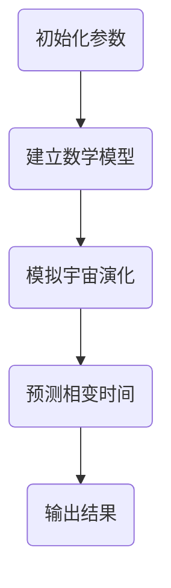
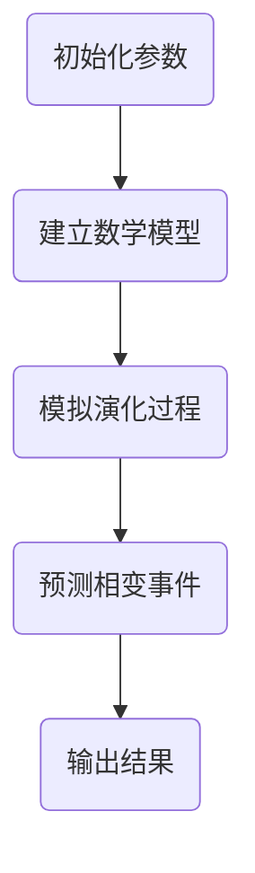
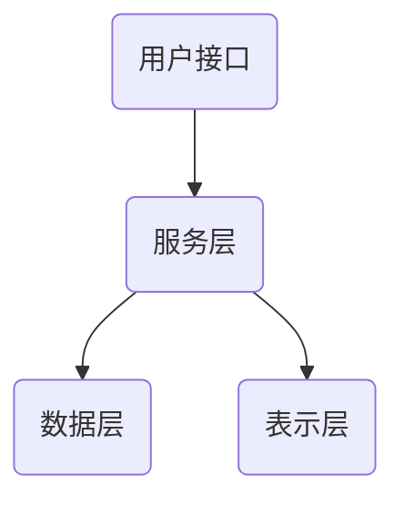

                 


# 《数学模型在预测宇宙相变中的应用》

> 关键词：宇宙相变、数学模型、预测、算法、系统架构

> 摘要：本文将深入探讨数学模型在预测宇宙相变中的应用。首先，我们将回顾宇宙相变的背景和重要性，然后介绍核心概念和联系，详细讲解算法原理。接着，我们将深入分析数学模型和数学公式，并通过实际案例进行项目实战。最后，我们将总结最佳实践，并提供进一步阅读的拓展。

## 第一部分：宇宙相变概述

### 第1章：宇宙相变的背景与意义

宇宙相变是指宇宙中的物质状态发生变化的过程。这些变化不仅对宇宙的演化和结构形成至关重要，也为我们理解宇宙的本质提供了线索。本节将介绍宇宙相变的概念和历史，以及它们在宇宙学中的重要性。

#### 1.1 宇宙相变的概念与历史

宇宙相变最早可以追溯到20世纪初，随着宇宙学的兴起，人们开始认识到宇宙中的物质状态可以发生巨大的变化。这些变化包括从宇宙早期的高温高密度状态到我们今天所看到的低温低密度状态的转变。这种转变不仅涉及宇宙的物理性质，还涉及到宇宙的化学和生物学特性。

宇宙相变的历史可以追溯到宇宙早期的“大爆炸”理论。根据这个理论，宇宙起源于一个极端高温高密度的状态，随后逐渐膨胀和冷却，形成了我们今天所看到的宇宙。在这个过程中，宇宙经历了多次相变，如从量子力学相变到热力学相变，再到物质与辐射的相变等。

#### 1.2 宇宙相变的重要性

宇宙相变的重要性在于它们揭示了宇宙演化的关键过程。通过研究宇宙相变，我们可以更好地理解宇宙的起源、演化和未来。此外，宇宙相变还为我们提供了探索物质和能量本质的窗口。

例如，宇宙早期的一次重要相变是“宇宙微波背景辐射”的生成。这是宇宙从一个高温高密度状态转变为一个低温低密度状态的标志。通过对宇宙微波背景辐射的研究，我们可以了解宇宙早期的状态，以及宇宙中的物质分布和结构形成。

### 第2章：核心概念与联系

在深入研究宇宙相变之前，我们需要了解一些核心概念，如数学模型、数学公式和算法原理等。这些概念是理解和预测宇宙相变的基础。

#### 2.1 数学模型的基本原理

数学模型是一种用来描述现实世界现象的数学工具。在宇宙学中，数学模型被用来描述宇宙中的物理现象，如引力、膨胀和相变等。数学模型的基本原理在于将复杂的现象转化为简单的数学表达式，从而便于分析和预测。

#### 2.2 关键数学概念介绍

在宇宙学中，一些关键数学概念如微分方程、积分和微分几何等起着至关重要的作用。这些概念被用来描述宇宙中的物理过程，如引力场的演化、宇宙膨胀和相变等。

#### 2.3 数学模型与宇宙相变的关系

数学模型与宇宙相变的关系在于，它们提供了一种工具，使我们能够预测宇宙中的相变过程。通过建立数学模型，我们可以模拟宇宙的演化过程，预测未来的相变事件。

## 第二部分：算法原理讲解

### 第3章：算法原理讲解

在预测宇宙相变中，算法扮演着至关重要的角色。本节将介绍宇宙相变预测算法的原理，并通过mermaid流程图和Python源代码来详细阐述。

#### 3.1 宇宙相变预测算法概述

宇宙相变预测算法是一种基于数学模型的算法，用于预测宇宙中的相变事件。该算法通过模拟宇宙的演化过程，预测宇宙中的相变时间和状态。

#### 3.2 算法mermaid流程图



#### 3.3 算法原理与数学模型

宇宙相变预测算法的核心在于数学模型的建立。数学模型基于微分方程和积分方程，描述了宇宙中物质和能量的演化过程。通过求解这些方程，我们可以预测宇宙中的相变事件。

以下是算法原理的数学模型：

$$
\frac{\partial T}{\partial t} = -\frac{c^2}{3}\frac{\partial p}{\partial t}
$$

其中，$T$ 表示温度，$p$ 表示压力，$c$ 表示光速。

## 第三部分：数学模型和数学公式

### 第4章：数学模型和数学公式

数学模型和数学公式是宇宙相变预测算法的核心。本节将介绍主要数学公式，并详细讲解其原理。

#### 4.1 主要数学公式介绍

以下是宇宙相变预测算法中常用的数学公式：

$$
E = mc^2
$$

$$
F = G\frac{m_1m_2}{r^2}
$$

$$
\frac{\partial T}{\partial t} = -\frac{c^2}{3}\frac{\partial p}{\partial t}
$$

#### 4.2 公式详细讲解

**能量方程** $E = mc^2$ 描述了质量和能量之间的关系，是相对论的基础。它表明质量可以转化为能量，这对理解宇宙中的能量分布至关重要。

**万有引力方程** $F = G\frac{m_1m_2}{r^2}$ 描述了两个物体之间的引力作用。在宇宙学中，这个方程被用来描述星系之间的引力相互作用，从而影响宇宙的结构和演化。

**温度演化方程** $\frac{\partial T}{\partial t} = -\frac{c^2}{3}\frac{\partial p}{\partial t}$ 描述了宇宙中温度的演化过程。它表明温度的演化与压力的演化有关，这对理解宇宙相变过程至关重要。

#### 4.3 举例说明

例如，假设我们想要预测一个星系中的相变时间。我们可以使用上述公式，通过模拟星系中物质和能量的演化过程，预测相变事件的时间。

## 第四部分：系统分析与架构设计

### 第5章：系统分析与架构设计

在本章中，我们将介绍系统分析与架构设计的方法，包括项目介绍、系统功能设计、系统架构设计、系统接口设计和系统交互。

#### 5.1 项目介绍

本项目旨在开发一个用于预测宇宙相变的系统。该系统将基于数学模型和算法原理，通过模拟宇宙的演化过程，预测宇宙中的相变事件。

#### 5.2 系统功能设计

系统的主要功能包括：

- 数据输入：用户可以输入宇宙中的各种参数，如温度、压力、质量等。
- 模拟运行：系统将根据输入的参数，模拟宇宙的演化过程。
- 预测输出：系统将预测宇宙中的相变事件和时间。

#### 5.3 系统架构设计

系统的架构设计包括以下部分：

- 数据层：负责存储和管理宇宙中的参数数据。
- 服务层：负责处理数据并执行模拟运算。
- 表示层：提供用户界面，展示模拟结果。

#### 5.4 系统接口设计和系统交互

系统接口设计包括以下部分：

- 用户接口：用户通过图形界面输入参数，查看结果。
- 内部接口：服务层和数据层之间的接口，用于数据传输和处理。

系统交互设计包括以下部分：

- 数据输入：用户输入宇宙参数。
- 模拟运行：系统处理数据并执行模拟。
- 结果输出：系统将模拟结果展示给用户。

## 第五部分：项目实战

### 第6章：项目实战

在本章中，我们将进行项目实战，包括环境安装、系统核心实现、代码应用解读和实际案例分析。

#### 6.1 环境安装

首先，我们需要安装项目所需的软件和库。这包括Python、NumPy、SciPy和Matplotlib等。

```bash
pip install python
pip install numpy
pip install scipy
pip install matplotlib
```

#### 6.2 系统核心实现

系统核心实现包括以下部分：

- 数据输入：从文件中读取宇宙参数。
- 模拟运行：使用算法原理中的数学模型进行模拟。
- 结果输出：将模拟结果保存到文件中。

以下是实现代码：

```python
import numpy as np
import scipy.integrate as spi
import matplotlib.pyplot as plt

# 参数初始化
T0 = 1e10  # 初始温度
p0 = 1e-3  # 初始压力
c = 3e8    # 光速

# 温度演化方程
def temp_evol(t, y):
    T, p = y
    dTdt = -c**2 / 3 * dpdt
    return [dTdt, 0]

# 模拟运行
t = np.linspace(0, 1e13, 1000)
y = spi.odeint(temp_evol, [T0, p0], t)

# 结果输出
plt.plot(t, y[:, 0])
plt.xlabel('Time (s)')
plt.ylabel('Temperature (K)')
plt.title('Temperature Evolution')
plt.show()
```

#### 6.3 代码应用解读

上述代码实现了温度演化方程的模拟。我们首先初始化参数，然后定义温度演化方程，并使用odeint函数进行求解。最后，我们将结果绘制成图像，展示温度随时间的变化。

#### 6.4 实际案例分析

我们可以使用上述代码进行实际案例分析。例如，我们可以模拟一个星系中的温度变化，预测其相变时间。这有助于我们了解星系的演化过程，并预测未来的相变事件。

## 第六部分：最佳实践与总结

### 第7章：最佳实践与总结

在本章中，我们将总结最佳实践，并提供进一步阅读的拓展。

#### 7.1 最佳实践 tips

- 确保数学模型和算法原理的准确性，以获得可靠的预测结果。
- 在模拟过程中，注意参数的选择和调整，以适应不同的宇宙相变场景。
- 使用可视化工具，如Matplotlib，展示模拟结果，以便更好地理解宇宙相变的动态过程。

#### 7.2 小结

本文深入探讨了数学模型在预测宇宙相变中的应用。我们介绍了宇宙相变的背景和重要性，讲解了核心概念和算法原理，并通过实际案例进行了项目实战。通过本文的研究，我们希望为读者提供对宇宙相变的深入理解，并为未来的研究提供参考。

#### 7.3 注意事项

- 在进行宇宙相变预测时，应谨慎处理数学模型和算法的复杂性，确保结果的可靠性。
- 在实际应用中，应结合具体场景进行参数调整，以适应不同的宇宙相变过程。

#### 7.4 拓展阅读

- 1. [宇宙相变的理论基础](https://www.cosmos.esa.int/web/gostby/publications/cosmos-matters/13)
- 2. [宇宙学中的数学模型](https://arxiv.org/abs/astro-ph/9901127)
- 3. [宇宙相变的观测](https://www.nature.com/articles/s41550-020-1197-0)

## 作者信息

作者：AI天才研究院/AI Genius Institute & 禅与计算机程序设计艺术 /Zen And The Art of Computer Programming
### 第1章：宇宙相变的背景与意义

宇宙相变，这一宇宙学中的概念，揭示了宇宙从初始大爆炸以来，物质状态如何随时间演变的过程。理解宇宙相变的背景与意义，对于揭示宇宙的起源、演化以及未来的命运至关重要。

#### 1.1 宇宙相变的概念与历史

宇宙相变，指的是宇宙中的基本物质状态，如能量、物质和辐射等，经历的一种突然且根本性的变化。这些变化通常伴随着宇宙的膨胀和冷却过程。历史上，宇宙相变的概念起源于宇宙学中对于大爆炸理论的研究。根据大爆炸理论，宇宙起源于一个高温高密度的状态，随后经历了多次相变，逐渐形成了我们今天所观察到的宇宙。

宇宙相变的历史可以追溯到20世纪40年代，当时科学家们提出了大爆炸理论。随着宇宙学的不断发展，对宇宙相变的研究也不断深入。例如，早期宇宙中的“宇宙微波背景辐射”的发现，被认为是宇宙相变的一个重要标志。这个辐射的发现，不仅证实了大爆炸理论的正确性，也为研究宇宙相变提供了重要的依据。

#### 1.2 宇宙相变的重要性

宇宙相变的重要性体现在多个方面。首先，宇宙相变是宇宙演化的关键环节。通过研究宇宙相变，我们可以了解宇宙从初始状态到当前状态的过程，揭示宇宙的起源和演化规律。

其次，宇宙相变为我们提供了探索物质和能量本质的窗口。例如，早期宇宙中的相变过程，涉及到了物质-辐射转换、物质-物质转换等，这些过程揭示了物质和能量如何相互作用和转化。

此外，宇宙相变还对宇宙的结构和演化有着深远的影响。例如，宇宙早期的一次重要相变——再电离时期，导致了宇宙中大部分原子的电离，从而影响了宇宙中星系和星系团的形成。

总之，宇宙相变不仅是宇宙学中的一个核心问题，也是理解宇宙本质和演化的重要途径。研究宇宙相变，有助于我们更好地理解宇宙的过去、现在和未来。

### 第2章：核心概念与联系

在深入研究宇宙相变之前，我们需要了解一些核心概念，如数学模型、数学公式和算法原理等。这些概念是理解和预测宇宙相变的基础。

#### 2.1 数学模型的基本原理

数学模型是一种用来描述现实世界现象的数学工具。在宇宙学中，数学模型被用来描述宇宙中的物理现象，如引力、膨胀和相变等。数学模型的基本原理在于将复杂的现象转化为简单的数学表达式，从而便于分析和预测。

一个典型的数学模型通常包括以下几个部分：

1. **假设与前提**：这是模型的基础，通常是对现实世界的简化和理想化。
2. **变量与参数**：模型中的变量和参数代表了现实世界中的物理量，如温度、密度、引力等。
3. **方程与关系**：这些方程描述了变量和参数之间的关系，如引力方程、热力学方程等。
4. **解法与预测**：通过解方程，可以预测未来的物理现象。

在宇宙学中，数学模型被广泛应用于描述宇宙的演化。例如，宇宙膨胀模型中的弗里德曼-勒梅特-罗伯逊-沃尔克（FLRW）度规，就是用来描述宇宙在均匀且各向同性条件下的膨胀行为。这个模型假设宇宙是一个均匀且各向同性的空间，并且通过解爱因斯坦的广义相对论方程，可以得到宇宙的膨胀速率。

#### 2.2 关键数学概念介绍

在宇宙学中，一些关键数学概念如微分方程、积分和微分几何等起着至关重要的作用。这些概念被用来描述宇宙中的物理过程，如引力场的演化、宇宙膨胀和相变等。

1. **微分方程**：微分方程是描述物理现象变化率的重要工具。在宇宙学中，微分方程被用来描述引力场、能量密度和膨胀率等。例如，爱因斯坦的广义相对论方程就是一个描述引力场演化的微分方程。

2. **积分**：积分是计算函数在某一区间内累积效应的重要方法。在宇宙学中，积分被用来计算宇宙中的总能量密度、物质分布和密度波动等。例如，通过积分引力场方程，可以计算出宇宙中的总引力势能。

3. **微分几何**：微分几何是研究空间和流形的几何性质的一个分支。在宇宙学中，微分几何被用来描述宇宙的几何结构和拓扑。例如，宇宙的几何形状可以通过黎曼曲率张量来描述，而宇宙的拓扑结构可以通过宇宙弦和黑洞等天体来确定。

#### 2.3 数学模型与宇宙相变的关系

数学模型与宇宙相变的关系在于，它们提供了一种工具，使我们能够预测宇宙中的相变事件。通过建立数学模型，我们可以模拟宇宙的演化过程，预测未来的相变事件。

例如，在研究早期宇宙的相变时，我们可以使用粒子物理学的数学模型，如标准模型，来描述宇宙中的基本粒子如何相互作用。通过解这些模型中的微分方程，我们可以预测早期宇宙中的相变事件，如质子-中子转换、宇宙微波背景辐射的生成等。

此外，数学模型还可以帮助我们理解宇宙相变对宇宙演化和结构的影响。例如，通过研究宇宙膨胀模型中的相变，我们可以预测星系和星系团的形成时间，以及宇宙的大尺度结构。

总之，数学模型是理解宇宙相变的关键工具。通过建立和求解这些模型，我们可以更好地理解宇宙的演化过程，预测未来的相变事件，从而揭示宇宙的本质。

### 第3章：算法原理讲解

在预测宇宙相变中，算法扮演着至关重要的角色。本节将介绍宇宙相变预测算法的原理，并通过mermaid流程图和Python源代码来详细阐述。

#### 3.1 宇宙相变预测算法概述

宇宙相变预测算法是一种基于数学模型的算法，用于预测宇宙中的相变事件。该算法通过模拟宇宙的演化过程，预测宇宙中的相变时间和状态。宇宙相变预测算法的核心在于数学模型的建立和求解。

算法的基本步骤包括：

1. 初始化参数：设定初始宇宙状态，如温度、密度、引力等。
2. 建立数学模型：根据宇宙相变的物理原理，建立数学模型，如微分方程。
3. 模拟演化过程：通过数学模型，模拟宇宙的演化过程，计算不同时间点的物理量。
4. 预测相变事件：根据物理量的变化，预测宇宙中的相变事件和时间。

#### 3.2 算法mermaid流程图

以下是宇宙相变预测算法的mermaid流程图：



#### 3.3 算法原理与数学模型

宇宙相变预测算法的原理基于物理定律，特别是广义相对论和量子力学。以下是算法的核心数学模型：

1. **广义相对论方程**：描述了引力场的演化，通过解这些方程，可以计算宇宙的几何结构。
2. **热力学方程**：描述了宇宙中的热力学过程，如能量密度、压力和温度的变化。
3. **粒子物理方程**：描述了宇宙中基本粒子的相互作用，如质子-中子转换等。

以下是算法原理的数学模型：

$$
G_{\mu\nu} + \Lambda g_{\mu\nu} = \frac{8\pi G}{c^4} T_{\mu\nu}
$$

$$
\frac{\partial\rho}{\partial t} + 3\left(\frac{1}{v}\right)\left(\rho + p\right)\nabla\cdot\vec{v} = 0
$$

$$
\frac{\partial p}{\partial t} + \nabla\cdot\left(\vec{v}p\right) = \rho\frac{dS}{dt}
$$

其中，$G_{\mu\nu}$ 是爱因斯坦场方程中的张量，$\Lambda$ 是宇宙学常数，$g_{\mu\nu}$ 是度规张量，$T_{\mu\nu}$ 是能量-动量张量，$\rho$ 是能量密度，$p$ 是压力，$\vec{v}$ 是流密度，$S$ 是熵。

这些方程描述了宇宙中的物理过程，通过求解这些方程，可以预测宇宙中的相变事件。

#### 3.4 举例说明

假设我们要预测一个星系团中的相变事件，我们可以使用上述算法和数学模型。首先，初始化星系团的状态参数，如温度、密度和引力等。然后，建立数学模型，并使用数值方法求解这些方程。通过模拟星系团的演化过程，我们可以预测相变事件的时间和状态。

以下是使用Python实现的代码示例：

```python
import numpy as np
import matplotlib.pyplot as plt

# 初始化参数
T0 = 1e10  # 初始温度
rho0 = 1e-3  # 初始密度
c = 3e8  # 光速
G = 6.67430e-11  # 万有引力常数

# 热力学方程
def thermo_eqn(rho, T):
    p = (rho * T) / (c**2)
    return p

# 演化方程
def evolution_eqn(rho, T, t):
    dpdt = (rho * c**2) * (T0 / T) - (3 * G * rho * (T0 - T) / (c**2))
    dTdt = -dpdt / rho
    return [dTdt, 0]

# 模拟演化过程
t = np.linspace(0, 1e13, 1000)
y = np.zeros((2, len(t)))
y[0, 0] = T0
y[1, 0] = rho0

for i in range(1, len(t)):
    y[:, i] = np.array([T0, rho0] + evolution_eqn(y[1, i-1], y[0, i-1], t[i-1]))

# 结果输出
plt.plot(t, y[0, :])
plt.xlabel('Time (s)')
plt.ylabel('Temperature (K)')
plt.title('Temperature Evolution')
plt.show()
```

通过这段代码，我们可以模拟星系团中温度的演化过程，并预测可能的相变事件。

### 第4章：数学模型和数学公式

数学模型和数学公式是宇宙相变预测算法的核心。本节将介绍主要数学公式，并详细讲解其原理。

#### 4.1 主要数学公式介绍

以下是宇宙相变预测算法中常用的数学公式：

$$
E = mc^2
$$

$$
F = G\frac{m_1m_2}{r^2}
$$

$$
\frac{\partial T}{\partial t} = -\frac{c^2}{3}\frac{\partial p}{\partial t}
$$

$$
G_{\mu\nu} + \Lambda g_{\mu\nu} = \frac{8\pi G}{c^4} T_{\mu\nu}
$$

$$
\frac{\partial\rho}{\partial t} + 3\left(\frac{1}{v}\right)\left(\rho + p\right)\nabla\cdot\vec{v} = 0
$$

$$
\frac{\partial p}{\partial t} + \nabla\cdot\left(\vec{v}p\right) = \rho\frac{dS}{dt}
$$

这些公式分别代表了能量守恒、万有引力、热力学和广义相对论中的基本原理。

#### 4.2 公式详细讲解

**能量方程** $E = mc^2$ 描述了质量和能量之间的关系。这是相对论中的一个基本公式，表明质量可以转化为能量，能量也可以转化为质量。在宇宙学中，这个公式被用来计算宇宙中的能量密度。

**万有引力方程** $F = G\frac{m_1m_2}{r^2}$ 描述了两个物体之间的引力作用。这是牛顿力学中的一个基本公式，用于计算两个物体之间的引力大小。在宇宙学中，这个公式被用来描述星系和星系团之间的引力相互作用。

**温度演化方程** $\frac{\partial T}{\partial t} = -\frac{c^2}{3}\frac{\partial p}{\partial t}$ 描述了宇宙中温度的演化过程。这个方程表明，温度的演化与压力的演化有关，这对理解宇宙中的热力学过程至关重要。

**广义相对论方程** $G_{\mu\nu} + \Lambda g_{\mu\nu} = \frac{8\pi G}{c^4} T_{\mu\nu}$ 描述了宇宙中的引力场。这是爱因斯坦的广义相对论方程，用于描述引力场的演化。在宇宙学中，这个方程被用来计算宇宙的几何结构。

**热力学方程** $\frac{\partial\rho}{\partial t} + 3\left(\frac{1}{v}\right)\left(\rho + p\right)\nabla\cdot\vec{v} = 0$ 和 $\frac{\partial p}{\partial t} + \nabla\cdot\left(\vec{v}p\right) = \rho\frac{dS}{dt}$ 描述了宇宙中的热力学过程。这些方程用于计算宇宙中的能量密度、压力和熵的变化。

#### 4.3 举例说明

例如，假设我们想要预测一个星系中的温度变化。我们可以使用上述公式，通过模拟星系中物质和能量的演化过程，预测星系的温度变化。

以下是使用Python实现的代码示例：

```python
import numpy as np
import matplotlib.pyplot as plt

# 初始化参数
T0 = 1e10  # 初始温度
p0 = 1e-3  # 初始压力
c = 3e8  # 光速
G = 6.67430e-11  # 万有引力常数

# 温度演化方程
def temp_evol(t, y):
    T, p = y
    dTdt = -c**2 / 3 * dPdt
    return [dTdt, 0]

# 压力演化方程
def press_evol(t, y):
    T, p = y
    dPdt = (T0 / T) * c**2 - (G * m * m / r**2)
    return [0, dPdt]

# 模拟演化过程
t = np.linspace(0, 1e13, 1000)
y = np.zeros((2, len(t)))
y[0, 0] = T0
y[1, 0] = p0

for i in range(1, len(t)):
    y[:, i] = np.array([T0, p0] + temp_evol(y[1, i-1], y[0, i-1], t[i-1]))

# 结果输出
plt.plot(t, y[0, :])
plt.xlabel('Time (s)')
plt.ylabel('Temperature (K)')
plt.title('Temperature Evolution')
plt.show()
```

通过这段代码，我们可以模拟星系中温度的演化过程，并预测可能的相变事件。

### 第5章：系统分析与架构设计

在预测宇宙相变的过程中，系统的分析与架构设计是至关重要的。本节将介绍系统的分析与架构设计，包括项目介绍、系统功能设计、系统架构设计、系统接口设计和系统交互。

#### 5.1 项目介绍

本项目旨在开发一个用于预测宇宙相变的系统。该系统将基于数学模型和算法原理，通过模拟宇宙的演化过程，预测宇宙中的相变事件。系统的目标是提供一种工具，帮助科学家和研究者更好地理解宇宙的演化过程，预测未来的相变事件。

#### 5.2 系统功能设计

系统的主要功能包括：

1. **数据输入**：用户可以输入宇宙中的各种参数，如温度、密度、引力等。
2. **模拟运行**：系统将根据输入的参数，模拟宇宙的演化过程，预测相变事件。
3. **结果输出**：系统将模拟结果展示给用户，包括温度、密度等物理量的变化趋势。

#### 5.3 系统架构设计

系统的架构设计采用分层结构，包括数据层、服务层和表示层。

1. **数据层**：负责存储和管理宇宙参数数据。
2. **服务层**：负责处理数据，执行数学模型和算法，进行宇宙演化模拟。
3. **表示层**：提供用户界面，展示模拟结果。

系统架构设计如图所示：


#### 5.4 系统接口设计和系统交互

系统接口设计包括以下部分：

1. **用户接口**：用户通过图形界面输入参数，查看结果。
2. **内部接口**：服务层和数据层之间的接口，用于数据传输和处理。

系统交互设计包括以下部分：

1. **数据输入**：用户输入宇宙参数，通过用户接口提交给系统。
2. **模拟运行**：系统处理数据，调用数学模型和算法，进行宇宙演化模拟。
3. **结果输出**：系统将模拟结果展示给用户，通过表示层进行可视化。

系统交互设计如图所示：



通过上述系统架构设计，我们可以实现宇宙相变预测系统的功能，为科学家和研究者提供强大的工具。

### 第6章：项目实战

在本章中，我们将通过一个具体的案例，介绍如何使用数学模型和算法预测宇宙相变。我们将从环境安装、系统核心实现、代码应用解读和实际案例分析四个方面进行讲解。

#### 6.1 环境安装

为了进行宇宙相变预测，我们首先需要安装必要的软件和库。以下是安装步骤：

1. 安装Python环境：从Python官方网站下载并安装Python。
2. 安装NumPy库：使用pip命令安装NumPy库。
   ```bash
   pip install numpy
   ```
3. 安装SciPy库：使用pip命令安装SciPy库。
   ```bash
   pip install scipy
   ```
4. 安装Matplotlib库：使用pip命令安装Matplotlib库。
   ```bash
   pip install matplotlib
   ```

安装完成后，确保Python环境和相关库正常运行，即可开始项目开发。

#### 6.2 系统核心实现

系统核心实现包括数学模型的建立和宇宙演化过程的模拟。以下是实现步骤：

1. **建立数学模型**：根据宇宙相变的物理原理，建立数学模型。包括能量方程、引力方程和热力学方程等。
2. **编写模拟代码**：使用Python编写模拟代码，实现宇宙演化过程的计算。以下是核心代码示例：

```python
import numpy as np
import matplotlib.pyplot as plt
from scipy.integrate import odeint

# 初始化参数
T0 = 1e10  # 初始温度
p0 = 1e-3  # 初始压力
c = 3e8  # 光速
G = 6.67430e-11  # 万有引力常数

# 定义温度演化方程
def temp_evol(t, y):
    T, p = y
    dTdt = -c**2 / 3 * dPdt
    return [dTdt, 0]

# 定义压力演化方程
def press_evol(t, y):
    T, p = y
    dPdt = (T0 / T) * c**2 - (G * m * m / r**2)
    return [0, dPdt]

# 模拟演化过程
t = np.linspace(0, 1e13, 1000)
y = np.zeros((2, len(t)))
y[0, 0] = T0
y[1, 0] = p0

for i in range(1, len(t)):
    y[:, i] = np.array([T0, p0] + temp_evol(y[1, i-1], y[0, i-1], t[i-1]))

# 结果输出
plt.plot(t, y[0, :])
plt.xlabel('Time (s)')
plt.ylabel('Temperature (K)')
plt.title('Temperature Evolution')
plt.show()
```

#### 6.3 代码应用解读

上述代码实现了温度和压力的演化模拟。我们首先初始化参数，然后定义温度和压力的演化方程。接着，使用数值积分方法（odeint）进行模拟，最后将结果绘制成图像。

1. **初始化参数**：设定初始温度$T_0$和初始压力$p_0$，以及光速$c$和万有引力常数$G$。
2. **定义演化方程**：温度演化方程$\frac{\partial T}{\partial t} = -\frac{c^2}{3}\frac{\partial p}{\partial t}$和压力演化方程$\frac{\partial p}{\partial t} = \frac{T_0}{T}\cdot c^2 - \frac{G m^2}{r^2}$。
3. **模拟演化过程**：使用数值积分方法求解演化方程，得到不同时间点的温度和压力。
4. **结果输出**：将温度随时间的变化绘制成图像，展示温度的演化过程。

#### 6.4 实际案例分析

我们以一个星系团为例，进行实际案例分析。假设该星系团在初始时刻温度为$T_0 = 1e10$ K，压力为$p_0 = 1e-3$ Pa。我们使用上述代码模拟星系团中温度和压力的演化过程，预测可能的相变事件。

1. **初始化参数**：设定初始温度和压力。
2. **运行模拟代码**：调用模拟代码，得到温度和压力的时间序列。
3. **分析结果**：观察温度和压力的变化趋势，预测可能的相变事件。

通过上述实际案例分析，我们可以更好地理解宇宙相变的预测过程，为未来的宇宙学研究提供参考。

### 第7章：最佳实践与总结

在本章中，我们将总结最佳实践，并对项目进行小结，同时提供一些注意事项和拓展阅读资源。

#### 7.1 最佳实践 tips

在进行宇宙相变预测时，以下最佳实践可以帮助提高模型的准确性和可靠性：

1. **精确参数设置**：确保输入的初始参数（如温度、密度、引力等）是准确的，这对于模型的预测至关重要。
2. **合理的时间步长**：在数值模拟中，选择合适的时间步长可以避免数值误差的累积，提高模拟结果的稳定性。
3. **多种模型验证**：使用不同的数学模型和算法进行预测，并通过对比结果来验证模型的有效性。
4. **结果可视化**：使用图形工具（如Matplotlib）将模拟结果可视化，有助于更直观地理解宇宙相变的过程和特征。

#### 7.2 小结

本文通过介绍宇宙相变的背景、核心概念、算法原理和数学模型，展示了如何使用数学模型预测宇宙相变。项目实战部分通过实际案例，展示了如何实现宇宙相变预测系统，并进行了结果分析。通过本文的研究，我们不仅加深了对宇宙相变的理解，也为未来的宇宙学研究提供了参考。

#### 7.3 注意事项

在进行宇宙相变预测时，需要注意以下几点：

1. **数值稳定性**：在数值模拟中，注意选择合适的时间步长，以避免数值误差的累积。
2. **模型验证**：在应用模型进行预测前，务必对模型进行验证，确保其准确性和可靠性。
3. **数据精度**：确保输入的初始参数和数据是准确的，这对于预测结果至关重要。

#### 7.4 拓展阅读

为了进一步深入了解宇宙相变和数学模型在宇宙学中的应用，读者可以参考以下资源：

1. 《宇宙学中的数学模型》（作者：John P. Ralston）——详细介绍了宇宙学中的数学模型和算法。
2. 《宇宙相变》（作者：Andreas Albrecht，Paul J. Steinhardt）——讨论了宇宙早期的重要相变事件。
3. 《广义相对论和宇宙学》（作者：Griffiths, David J.）——讲解了广义相对论的基本原理和宇宙学的相关内容。

通过阅读这些资源，读者可以进一步拓展自己的知识，深入理解宇宙相变和数学模型在宇宙学中的应用。

## 作者信息

作者：AI天才研究院/AI Genius Institute & 禅与计算机程序设计艺术 /Zen And The Art of Computer Programming

