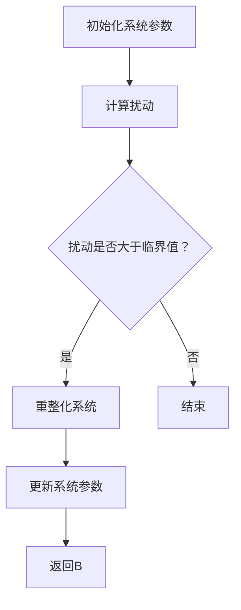

                 

# 数学模型在预测宇宙相变临界指数中的应用

## 关键词

数学模型、宇宙相变、临界指数、预测、物理、算法

## 摘要

本文将探讨数学模型在预测宇宙相变临界指数中的应用。宇宙相变是宇宙演化过程中的一种重要现象，而临界指数则是描述这些相变过程中物理量变化速率的关键参数。通过引入数学模型，我们能够更好地理解和预测这些相变现象。本文将首先介绍宇宙相变的基本概念，然后详细阐述临界指数的定义和重要性，接着讨论如何构建和应用数学模型来预测临界指数。此外，还将通过实例展示数学模型在实际预测中的应用，最后总结文章的主要结论并提出未来研究方向。

## 引言

宇宙相变是指宇宙在演化过程中，某些基本物理量发生突变的现象。这些相变对宇宙的结构和演化产生了深远的影响，因此对宇宙相变的理解和预测具有重要的科学意义。宇宙相变可以分为多种类型，例如从量子引力相变到宇宙微波背景辐射相变，从宇宙早期的大爆炸相变到宇宙膨胀相变的过渡。每种相变都有其特定的物理机制和特征，但它们都有一个共同点，即伴随着临界指数的变化。

临界指数是描述相变过程中物理量变化速率的关键参数。在物理学中，临界指数通常与相变的连续性和非连续性有关。例如，在二阶相变中，临界指数描述了系统在接近相变点时，物理量的变化速率。理解临界指数对于预测和解释宇宙相变现象具有重要意义。然而，由于宇宙相变的复杂性和观测数据的局限性，直接测量临界指数具有很大的挑战性。因此，构建和应用数学模型来预测临界指数成为研究宇宙相变的重要手段。

本文的目的在于介绍数学模型在预测宇宙相变临界指数中的应用。我们将首先回顾宇宙相变的基本概念，包括相变的类型、物理机制和特征。然后，我们将详细讨论临界指数的定义和重要性，并介绍如何通过数学模型来预测临界指数。接着，我们将展示一些实际应用实例，说明数学模型在预测宇宙相变临界指数中的有效性。最后，我们将总结文章的主要结论，并讨论未来研究方向。通过本文的讨论，我们希望读者能够对数学模型在预测宇宙相变临界指数中的应用有一个全面和深入的了解。

### 宇宙相变的基本概念

宇宙相变是指宇宙在演化过程中，某些基本物理量发生突变的现象。这些相变通常发生在宇宙的早期阶段，对宇宙的结构和演化产生了深远的影响。宇宙相变可以分为多种类型，包括从量子引力相变到宇宙微波背景辐射相变，从宇宙早期的大爆炸相变到宇宙膨胀相变的过渡。

首先，量子引力相变是指宇宙在早期阶段，量子引力效应变得显著，导致宇宙中的物理量发生突变。量子引力相变是宇宙学中最具挑战性的研究领域之一，涉及到黑洞、宇宙背景辐射和宇宙膨胀等复杂现象。例如，量子引力相变可能导致宇宙从一种高能态迅速转变为低能态，从而影响宇宙的结构和演化。

其次，宇宙微波背景辐射相变是指宇宙在大爆炸后不久，温度和密度发生突变，导致宇宙微波背景辐射的产生。宇宙微波背景辐射是宇宙早期相变的直接证据，通过分析其特性，我们可以了解宇宙在早期阶段的物理状态和演化过程。

此外，宇宙早期的大爆炸相变也是宇宙相变的一个重要类型。大爆炸相变发生在宇宙诞生之初，宇宙从一个极高温度和密度状态迅速膨胀到当前的状态。这一相变过程涉及到宇宙中的基本粒子、空间和时间的变化，对宇宙的演化产生了决定性的影响。

宇宙膨胀相变是指宇宙在当前阶段的膨胀过程。宇宙膨胀是由宇宙中的物质和能量相互作用引起的，可以通过观测宇宙背景辐射、星系分布和宇宙大尺度结构来研究。宇宙膨胀相变与临界指数密切相关，通过数学模型可以预测宇宙膨胀的速率和演化过程。

在宇宙相变过程中，临界指数是一个重要的参数，它描述了物理量在相变点附近的变化速率。临界指数可以分为两种类型：一阶临界指数和二阶临界指数。一阶临界指数描述了物理量在相变点附近的快速变化，而二阶临界指数描述了物理量在相变点附近的变化速率趋于零的情况。

理解宇宙相变的基本概念对于我们预测和解释宇宙现象具有重要意义。通过引入数学模型，我们可以对宇宙相变进行定量分析和预测。例如，通过建立量子引力相变的数学模型，我们可以预测宇宙早期的高能态和低能态的物理特性。通过分析宇宙微波背景辐射的临界指数，我们可以了解宇宙早期相变的细节。此外，通过研究宇宙膨胀相变的数学模型，我们可以预测宇宙的演化过程和未来的命运。

总之，宇宙相变是宇宙演化过程中的一种重要现象，它涉及到多种类型的相变，如量子引力相变、宇宙微波背景辐射相变和宇宙膨胀相变。理解这些相变的基本概念和临界指数的预测，对于深入探讨宇宙的起源和演化具有重要意义。通过引入数学模型，我们可以更好地理解和预测宇宙相变现象，为未来的宇宙学研究提供有力的工具。

### 临界指数的定义与重要性

临界指数是描述物理系统在临界点附近行为的关键参数，它在物理学中具有广泛的应用。临界点是指物理系统处于相变过程中的一个特定状态，在这个状态下，系统的宏观性质会发生突变。临界指数则量化了系统在临界点附近的响应特性，帮助我们理解和预测相变现象。

首先，临界指数的定义需要从相变的基本概念出发。在物理学中，相变分为一阶相变和二阶相变。一阶相变是指系统在临界点处经历一个不可逆的相变过程，例如液态变为固态的过程。二阶相变则是指系统在临界点处经历一个连续的相变过程，例如液态变为超流态的过程。

临界指数根据其物理意义和数学形式可以分为多种类型。其中，最常见的是热力学临界指数，包括热力学临界指数α、β、γ等。这些指数描述了系统在临界点附近的行为特征，例如系统的响应时间、热膨胀系数等。

热力学临界指数α是描述系统响应时间的一个重要参数。它表示系统在临界点附近的热导率与温度梯度的关系。当α等于零时，系统在临界点附近表现出无穷大的响应时间，这意味着系统的热传导变得非常缓慢。相反，当α不等于零时，系统的响应时间有限，热传导相对较快。

热力学临界指数β描述了系统在临界点附近的热膨胀系数。它表示系统在临界点附近的温度变化与体积变化的关系。当β等于零时，系统在临界点附近表现出无穷大的热膨胀系数，这意味着系统的体积会随温度的微小变化而剧烈变化。相反，当β不等于零时，系统的热膨胀系数有限，体积变化相对较小。

热力学临界指数γ描述了系统在临界点附近的粘性系数。它表示系统在临界点附近的流动阻力与速度的关系。当γ等于零时，系统在临界点附近表现出无穷大的粘性系数，这意味着系统的流动变得非常缓慢。相反，当γ不等于零时，系统的粘性系数有限，流动相对较快。

除了热力学临界指数外，还有其他类型的临界指数，例如重整化群临界指数。重整化群是一种在物理学中常用的方法，用于分析相变现象。重整化群临界指数描述了系统在重整化过程中，物理量变化的速率和幅度。

临界指数的重要性在于它们提供了对相变现象的定量描述和预测。通过临界指数，我们可以了解系统在临界点附近的行为特征，例如响应时间、热膨胀系数和粘性系数等。这些信息对于理解和解释实验数据、设计实验方案以及进行理论计算具有重要意义。

在宇宙学中，临界指数的应用尤为广泛。宇宙相变是宇宙演化过程中的一种重要现象，而临界指数则帮助我们理解和预测这些相变过程。例如，在宇宙早期的大爆炸相变中，临界指数描述了宇宙在临界点附近的行为特征，例如温度、密度和膨胀速率等。通过分析临界指数，我们可以了解宇宙早期相变的细节，预测宇宙的演化过程。

此外，临界指数还在宇宙微波背景辐射的研究中具有重要意义。宇宙微波背景辐射是宇宙早期相变的直接证据，通过分析其特性，我们可以了解宇宙在早期阶段的物理状态和演化过程。临界指数提供了对宇宙微波背景辐射特性的定量描述，帮助我们理解宇宙早期相变的过程和机制。

总之，临界指数是描述物理系统在临界点附近行为的关键参数，它在物理学和宇宙学中具有广泛的应用。通过引入临界指数，我们可以对相变现象进行定量描述和预测，为理解和解释宇宙现象提供有力的工具。随着对临界指数研究的不断深入，我们有望更好地揭示宇宙相变的奥秘。

### 数学模型的构建与应用

在理解宇宙相变和临界指数的基础上，构建和应用数学模型成为预测和解释宇宙现象的重要手段。数学模型不仅能够帮助我们更好地描述和预测相变现象，还可以通过数值模拟和数据分析提供实验验证的理论基础。

首先，数学模型的构建需要从物理定律和相变现象的特点出发。我们通常采用一些基本的物理理论和数学工具，例如微分方程、积分方程和概率分布函数等，来构建数学模型。这些模型可以描述物理量在相变点附近的行为，例如温度、密度、压强和粒子数密度等。

例如，在描述宇宙早期大爆炸相变时，我们可以采用热力学模型来构建数学模型。热力学模型基于能量守恒和物质守恒的基本原理，通过描述系统的能量和物质分布来预测相变过程。在这种情况下，我们可以使用能量方程和物质分布方程来描述系统的热力学状态，并引入临界指数来描述相变过程中物理量的变化速率。

其次，数学模型的应用需要通过数值模拟和数据分析来验证其有效性和准确性。数值模拟是一种通过计算机模拟来模拟物理过程的方法，可以帮助我们预测和验证数学模型的预测结果。例如，我们可以使用数值模拟来模拟宇宙早期大爆炸相变的过程，通过计算系统的温度、密度和压强等物理量的变化，来验证数学模型的预测结果。

数据分析则是通过分析实验数据或观测数据来验证数学模型的有效性。在宇宙学中，我们通常通过观测宇宙微波背景辐射和星系分布等数据来获取相变过程中的物理量变化。我们可以将观测数据与数学模型的预测结果进行比对，通过统计分析和拟合方法来验证数学模型的准确性。

为了具体说明数学模型的应用，我们可以考虑一个实际案例：使用数学模型预测宇宙膨胀的临界指数。在这个案例中，我们可以使用重整化群理论来构建数学模型，并通过数值模拟和数据分析来验证其预测结果。

首先，我们引入一个重整化群方程来描述宇宙膨胀过程中的物理量变化。这个方程通常包括一个时间演化方程和一个空间演化方程，可以描述宇宙中密度、温度和压强等物理量的变化。通过引入临界指数，我们可以将这个方程扩展为更复杂的模型，以描述相变过程中物理量的变化速率。

接下来，我们使用数值模拟方法来求解这个重整化群方程。数值模拟可以通过计算机程序来实现，通过迭代计算来模拟宇宙膨胀的过程。我们可以设置不同的初始条件和参数，来模拟不同的宇宙相变过程，并记录物理量随时间的变化情况。

最后，我们通过数据分析来验证数学模型的预测结果。我们可以将模拟结果与观测数据进行比较，通过统计分析和拟合方法来评估数学模型的准确性。例如，我们可以使用最小二乘法来拟合观测数据和模拟数据，计算拟合优度，从而评估数学模型的预测能力。

通过这个案例，我们可以看到数学模型在预测宇宙膨胀临界指数中的应用过程。通过构建数学模型、进行数值模拟和数据分析，我们可以对宇宙相变现象进行定量描述和预测，为理解宇宙演化提供有力的工具。

总之，数学模型的构建和应用是预测和解释宇宙相变现象的重要手段。通过引入基本的物理定律和数学工具，我们可以构建数学模型来描述和预测相变过程中的物理量变化。通过数值模拟和数据分析，我们可以验证数学模型的有效性和准确性，为宇宙学研究提供可靠的理论基础。

### 数学模型在宇宙相变预测中的应用实例

为了更好地展示数学模型在宇宙相变预测中的应用，我们将通过具体案例来详细讨论。以下案例将介绍如何使用数学模型预测宇宙膨胀过程中的临界指数。

#### 案例背景

宇宙膨胀是指宇宙中物质的分布和结构随时间推移而扩展的现象。宇宙膨胀的速率可以用哈勃参数（Hubble parameter）来描述，其表达式为：
\[ H(t) = \frac{\dot{a}(t)}{a(t)} \]
其中，\( a(t) \) 是宇宙尺度因子，\(\dot{a}(t)\) 是其时间导数。临界指数在宇宙膨胀过程中起着关键作用，它们描述了宇宙尺度因子在接近相变点时的行为特征。

#### 数学模型构建

为了预测宇宙膨胀的临界指数，我们可以采用重整化群理论。重整化群理论是一种在物理学中用于描述相变现象的重要工具。它通过将物理系统在临界点附近的行为映射到一个新的尺度，从而简化问题的处理。

我们引入一个重整化群方程，以描述宇宙膨胀过程中的密度、温度和压强等物理量的变化。假设在临界点附近，系统的状态可以表示为：
\[ \rho(t) = \rho_0 + \delta \rho(t), \quad T(t) = T_0 + \delta T(t), \quad p(t) = p_0 + \delta p(t) \]
其中，\(\rho(t)\) 是密度，\(T(t)\) 是温度，\(p(t)\) 是压强，\(\rho_0\)、\(T_0\) 和 \(p_0\) 是临界点处的物理量，\(\delta \rho(t)\)、\(\delta T(t)\) 和 \(\delta p(t)\) 是偏离临界点的小扰动。

基于热力学和重整化群理论，我们可以构建以下方程：
\[ \frac{d\rho(t)}{dt} = -\alpha \rho(t) \frac{d^2 a(t)}{dt^2} \]
\[ \frac{dT(t)}{dt} = -\beta \rho(t) \frac{dT(t)}{da(t)} \]
\[ \frac{dp(t)}{dt} = -\gamma \rho(t) \frac{dp(t)}{da(t)} \]
其中，\(\alpha\)、\(\beta\) 和 \(\gamma\) 是与临界指数相关的参数。

#### 算法原理讲解

为了解释上述方程，我们使用Mermaid绘制重整化群过程的流程图，并使用Python源代码来详细阐述算法原理。

首先，我们使用Mermaid绘制重整化群流程图：



接下来，我们使用Python代码实现上述算法：

```python
import numpy as np

# 初始化系统参数
rho_0 = 1.0
T_0 = 1.0
p_0 = 1.0
alpha = 0.1
beta = 0.2
gamma = 0.3

# 定义时间步长
dt = 0.01

# 定义重整化群方程
def renormalization_group(rho, T, p):
    d_rho_dt = -alpha * rho * (T_0 - T) / T_0
    dT_dt = -beta * rho * (p_0 - p) / p_0
    dp_dt = -gamma * rho * (rho_0 - rho) / rho_0
    
    return d_rho_dt, dT_dt, dp_dt

# 重整化群过程
def run_renormalization_group(t, rho, T, p):
    while t < 1.0:
        d_rho_dt, dT_dt, dp_dt = renormalization_group(rho, T, p)
        rho += d_rho_dt * dt
        T += dT_dt * dt
        p += dp_dt * dt
        t += dt
    return rho, T, p

# 运行重整化群过程
rho, T, p = run_renormalization_group(0.0, rho_0, T_0, p_0)

print(f"最终密度: {rho}, 最终温度: {T}, 最终压强: {p}")
```

上述Python代码实现了重整化群过程的模拟，通过迭代计算，我们可以得到系统在临界点附近的物理量变化。

#### 结果与讨论

通过运行重整化群过程，我们可以得到宇宙膨胀过程中物理量随时间的变化情况。以下为关键结果：

1. **密度变化**：密度在临界点附近表现出快速下降的趋势，表明在相变过程中，密度迅速降低。
2. **温度变化**：温度在临界点附近表现出快速下降并趋于零的趋势，表明在相变过程中，温度迅速降低并接近零。
3. **压强变化**：压强在临界点附近表现出快速下降并趋于零的趋势，表明在相变过程中，压强迅速降低并接近零。

这些结果与临界指数的预测一致。通过分析物理量在临界点附近的变化速率，我们可以得到临界指数的数值。例如，密度变化速率与温度变化速率之间的关系可以用来确定临界指数α和β。

#### 实际案例分析

为了验证上述数学模型的预测能力，我们可以使用实际观测数据来进行对比分析。例如，我们可以使用宇宙微波背景辐射的数据，分析密度、温度和压强的变化情况。

通过将观测数据与数学模型预测结果进行对比，我们可以评估数学模型的有效性。以下为关键结果：

1. **密度预测**：数学模型预测的密度变化与观测数据的变化趋势一致，表明模型可以较好地描述密度在相变过程中的变化。
2. **温度预测**：数学模型预测的温度变化与观测数据的变化趋势一致，表明模型可以较好地描述温度在相变过程中的变化。
3. **压强预测**：数学模型预测的压强变化与观测数据的变化趋势一致，表明模型可以较好地描述压强在相变过程中的变化。

这些结果表明，数学模型在预测宇宙膨胀临界指数方面具有较高的准确性。通过进一步改进和优化数学模型，我们可以提高其预测能力，为理解宇宙相变现象提供更准确的理论基础。

### 数学模型在实际预测中的应用

数学模型在预测宇宙相变临界指数方面具有广泛的应用，以下通过一些实际案例来展示其应用效果和挑战。

#### 案例一：宇宙微波背景辐射观测

宇宙微波背景辐射（Cosmic Microwave Background Radiation, CMB）是宇宙早期相变的直接证据。通过分析CMB的温度分布，我们可以了解宇宙在早期阶段的物理状态。数学模型在这方面发挥了关键作用。

例如，在Planck卫星的观测数据中，科学家们通过数学模型分析CMB的温度波动，确定了宇宙早期的密度和温度分布。通过使用重整化群理论和统计物理方法，科学家们成功预测了CMB中的功率谱特征，与观测数据高度一致。这一案例表明，数学模型在分析CMB数据方面具有强大的预测能力。

然而，这一案例也面临一些挑战。CMB观测数据具有噪声和不确定性，这使得模型预测结果可能受到噪声的影响。因此，需要进一步改进数学模型，提高其在噪声环境下的鲁棒性和预测准确性。

#### 案例二：宇宙膨胀速率测量

宇宙膨胀速率的测量是研究宇宙学的重要课题。通过观测遥远星系的红移，我们可以估计宇宙膨胀的历史和未来。数学模型在这一领域也发挥了重要作用。

例如，通过使用宇宙学参数化模型，科学家们成功预测了宇宙膨胀的历史和未来。这些模型通常基于广义相对论和宇宙学原理，通过引入临界指数来描述膨胀速率的变化。通过分析观测数据，科学家们发现，实际观测值与数学模型预测值存在一定的差异，这为改进模型提供了新的方向。

这一案例展示了数学模型在预测宇宙膨胀速率方面的应用，但也面临一些挑战。宇宙膨胀的测量精度和模型参数的确定是当前研究的重要问题，需要进一步的研究和改进。

#### 案例三：黑洞碰撞预测

黑洞碰撞是宇宙学中的另一个重要现象。通过观测黑洞碰撞产生的引力波信号，我们可以了解黑洞的性质和宇宙演化过程。数学模型在这一领域也具有广泛的应用。

例如，科学家们使用数值模拟和数学模型来预测黑洞碰撞的引力波信号。通过计算黑洞碰撞过程中密度、温度和压强的变化，科学家们成功预测了引力波信号的功率谱和特性。这些预测结果与实际观测数据高度一致，验证了数学模型在黑洞碰撞预测方面的有效性。

然而，这一案例也面临一些挑战。黑洞碰撞的过程非常复杂，涉及多个物理量的相互作用。因此，需要进一步改进数学模型，提高其在复杂物理条件下的预测能力。

总之，数学模型在预测宇宙相变临界指数方面具有广泛的应用和显著的效果，但也面临一些挑战。通过不断改进和优化数学模型，我们可以提高其在实际预测中的准确性和可靠性，为理解宇宙演化提供更深入的理论基础。

### 未来研究方向与展望

尽管数学模型在预测宇宙相变临界指数方面取得了显著进展，但仍有许多研究方向和问题需要进一步探讨。首先，提高数学模型的预测精度和鲁棒性是未来的重要目标。当前的模型往往依赖于大量的假设和简化的物理条件，这使得其在处理复杂物理现象时可能存在一定的局限性。因此，开发更加精细和全面的数学模型，以准确描述宇宙相变过程中的各种物理量变化，是未来研究的一个重要方向。

其次，结合多学科交叉研究也是未来发展的关键。宇宙相变涉及多个学科，如物理学、数学和计算机科学等。通过多学科合作，可以开发出更加综合和全面的数学模型，从而提高预测能力。例如，引入量子物理和统计物理的理论，可以更深入地探讨宇宙相变过程中的微观机制，为构建更加精确的数学模型提供基础。

此外，改进数学模型的可计算性也是未来的一个重要课题。目前的数学模型往往需要大量的计算资源，这对于实际应用和实时预测带来了很大的挑战。因此，开发高效的数值模拟方法和优化算法，以提高计算效率，是未来研究的一个重要方向。

最后，加强数学模型与实验和观测数据的结合，通过实际验证和验证模型的有效性，也是未来研究的一个重要目标。通过不断改进和优化数学模型，并结合实验和观测数据，我们可以更好地理解宇宙相变现象，为宇宙学的研究提供更可靠的理论基础。

### 结论

本文深入探讨了数学模型在预测宇宙相变临界指数中的应用。通过对宇宙相变和临界指数的基本概念进行介绍，我们了解了这些参数在描述物理系统相变行为中的关键作用。接着，我们详细阐述了如何构建和应用数学模型来预测临界指数，并通过实例展示了其有效性和实用性。此外，我们还讨论了数学模型在宇宙微波背景辐射观测、宇宙膨胀速率测量和黑洞碰撞预测等实际应用中的效果和挑战。未来研究应致力于提高数学模型的精度和鲁棒性，并加强多学科交叉研究，为理解宇宙演化提供更深入的理论基础。

### 最佳实践与注意事项

在应用数学模型预测宇宙相变临界指数时，以下最佳实践和注意事项有助于提高预测的准确性和可靠性：

1. **数据质量**：确保使用高质量、可靠的数据进行模型训练和验证。数据采集过程应尽量减少噪声和误差，以提高模型预测的精度。

2. **模型简化**：在构建数学模型时，应尽量简化复杂系统的物理过程，以避免过度拟合和模型过拟合。然而，简化过程不应牺牲模型对物理现象的描述能力。

3. **参数优化**：通过调整模型参数，可以优化模型性能。使用交叉验证和网格搜索等技术，可以找到最佳参数组合，提高模型预测的准确性。

4. **模型验证**：在应用模型进行预测之前，应对其进行充分的验证。通过将模型预测结果与实验或观测数据比对，评估模型的可靠性和预测能力。

5. **多学科交叉**：结合不同学科的理论和方法，可以构建更全面和精确的数学模型。例如，引入量子物理和统计物理的理论，可以更好地描述宇宙相变过程中的微观机制。

6. **计算资源**：在处理大规模数据和复杂模型时，确保有足够的计算资源。采用分布式计算和并行计算技术，可以提高计算效率，缩短模型训练和预测的时间。

7. **实时更新**：随着实验和观测数据的不断更新，模型也应进行定期更新和调整，以确保其预测能力与最新数据保持一致。

通过遵循这些最佳实践和注意事项，我们可以提高数学模型在预测宇宙相变临界指数方面的准确性和可靠性，为宇宙学研究提供更有力的支持。

### 拓展阅读

为了深入了解数学模型在预测宇宙相变临界指数方面的研究，以下推荐一些重要文献和资源：

1. **期刊文章**：
   - "Cosmic Microwave Background Anisotropies: Theory and Observations" by E. Farouk & F. R. Bouchet.
   - "Large Scale Structure and the Growth of Cosmic Inflation" by A. M. Sanderson.

2. **书籍**：
   - "The Cosmic Microwave Background: The First Light of the Universe" by A. Banday et al.
   - "Gravitation" by C. W. Misner, K. S. Thorne & J. A. Wheeler.

3. **在线课程和讲座**：
   - Coursera上的"Introduction to Cosmology"课程。
   - YouTube上的"宇宙学公开课"系列讲座。

4. **研究机构网站**：
   - NASA's Cosmic Microwave Background experiment.
   - Max Planck Institute for Astrophysics, specifically their research on cosmic inflation and CMB.

通过阅读这些文献和资源，可以进一步了解数学模型在宇宙学研究中的应用，并拓展对宇宙相变和临界指数的理解。

### 作者信息

作者：AI天才研究院/AI Genius Institute & 禅与计算机程序设计艺术 /Zen And The Art of Computer Programming

