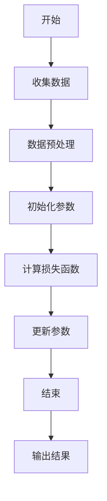
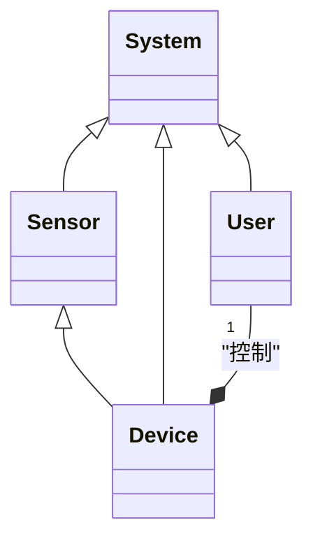
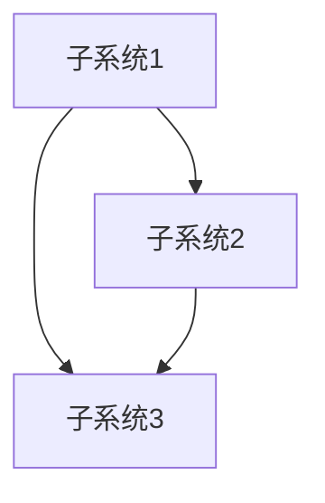
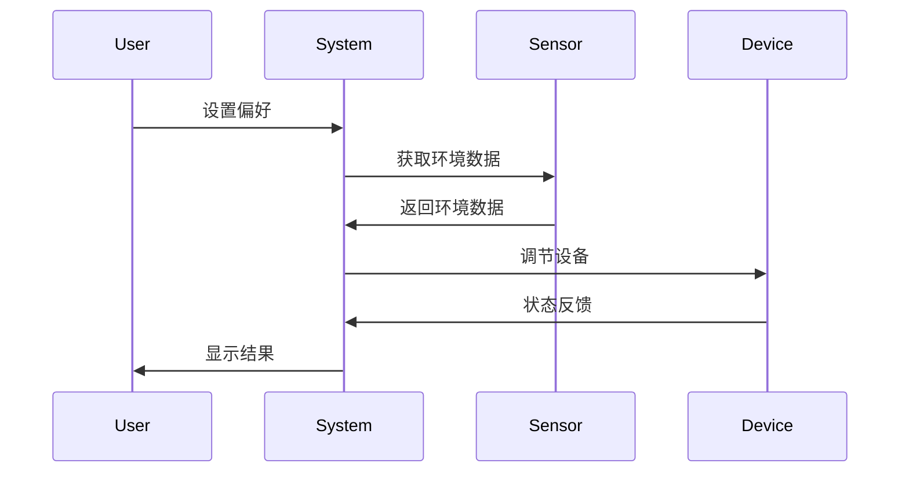
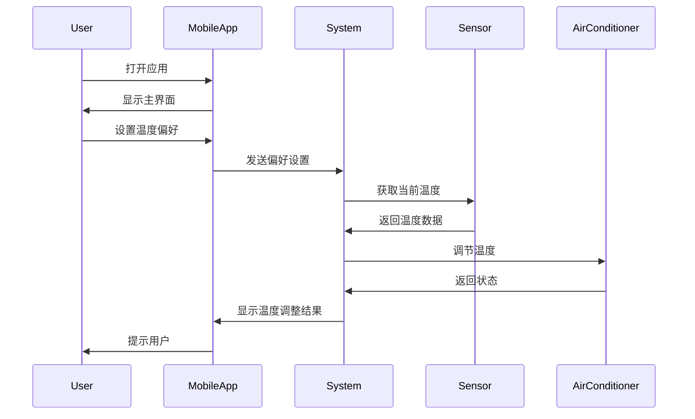

                 

### 引言与背景

在现代科技和工程领域，数学模型已经成为解决复杂问题的重要工具。数学模型通过数学语言和逻辑结构，对现实世界中的具体问题进行抽象和描述，从而为问题的求解提供了精确且有效的路径。本文将围绕数学模型的构建与求解策略展开讨论，旨在深入探讨这一领域的基础知识、关键技术和实际应用。

#### 核心概念术语说明

在讨论数学模型之前，我们需要明确一些核心概念术语：

- **数学模型**：是指用数学语言和符号系统来描述现实世界中某一类问题的结构和规律的一种抽象。数学模型可以是线性的，也可以是非线性的，可以是静态的，也可以是动态的。

- **问题背景**：指数学模型所要解决的现实问题的基本情况，包括问题的本质、目标、约束条件等。

- **问题描述**：对问题背景进行详细的阐述，明确问题的求解目标和求解条件。

- **问题解决**：通过数学模型的分析和求解，找到问题的解决方案。

- **边界与外延**：指数学模型应用的适用范围和条件，即模型的有效边界。

- **概念结构与核心要素组成**：指数学模型的基本构成，包括变量、参数、方程等核心要素。

#### 问题背景

随着计算机技术的发展和算法理论的不断进步，数学模型在各个领域，如经济学、生物学、工程学、物理学等，都得到了广泛应用。然而，如何构建有效的数学模型，并对其进行求解，仍然是一个挑战性的课题。

在实际应用中，数学模型不仅需要准确描述问题的特征，还需要具备一定的通用性和适应性。这就要求我们在构建数学模型时，既要充分考虑问题的具体情境，又要遵循数学原理和计算方法。

#### 问题描述

本文将重点关注以下问题：

1. **数学模型的核心概念与联系**：探讨数学模型的基本概念及其相互关系，为构建数学模型提供理论基础。

2. **数学模型的构建方法**：介绍常用的数学模型构建方法，包括描述性模型、模拟模型和预测性模型。

3. **数学模型的求解策略**：分析不同的求解算法及其性能，为数学模型的求解提供有效的策略。

4. **数学模型的应用与实践**：通过实际案例，展示数学模型在工程和科研中的应用，探讨数学模型在解决实际问题中的作用。

#### 问题解决

为了解决上述问题，本文将采用以下步骤：

1. **引言与背景**：介绍数学模型的基本概念和重要性，阐述本文的研究目标和内容结构。

2. **核心概念与联系**：详细分析数学模型的核心概念，展示概念之间的关系和特性。

3. **构建方法**：介绍数学模型构建的常用方法，并通过具体案例进行讲解。

4. **求解策略**：分析不同的求解算法，评估其性能，并提出优化策略。

5. **应用与实践**：通过实际案例，展示数学模型的应用，并进行详细分析和讲解。

6. **最佳实践与总结**：总结数学模型构建与求解的最佳实践，提出注意事项，并对未来展望进行讨论。

通过以上步骤，本文旨在为读者提供一个系统、全面、易懂的数学模型构建与求解策略指南，帮助读者更好地理解和应用数学模型，解决实际问题。

#### 边界与外延

本文的研究范围主要集中在数学模型的构建与求解策略，不涉及具体应用领域的深度探讨。同时，本文假设读者具备一定的数学和编程基础，能够理解本文中的相关术语和概念。

然而，数学模型的应用范围非常广泛，从简单的线性规划到复杂的神经网络模型，几乎涵盖了所有领域。因此，本文中的方法和策略具有普遍适用性，但具体应用时需要根据实际情况进行调整。

在构建数学模型时，需要充分考虑问题的具体情境，避免过度抽象或简化。同时，在求解策略的选择上，应根据模型的复杂性和求解需求，选择合适的算法。

### 概念结构与核心要素组成

在深入探讨数学模型的构建与求解策略之前，了解数学模型的基本概念和核心要素是非常必要的。这些概念和要素构成了数学模型的理论基础，也是我们构建和求解数学模型的关键。

#### 核心概念

1. **变量**：在数学模型中，变量是用来表示问题中不确定量的符号。变量可以是连续的，如时间、长度等，也可以是离散的，如人数、次数等。

2. **参数**：参数是数学模型中已知但需要估计的量，它们通常用来描述问题的特定特性。例如，在经济学中，价格和需求量就是常见的参数。

3. **约束条件**：约束条件是模型中必须满足的限制条件。这些条件可以是线性的，也可以是非线性的，它们用于限定问题的可行解空间。

4. **目标函数**：目标函数是模型中需要优化的量，它可以是一个或多个变量的函数。目标函数的值代表了问题的目标，如最大化利润、最小化成本等。

#### 核心要素组成

1. **方程与不等式**：数学模型通常通过方程或不等式来描述变量之间的关系。线性方程组和非线性方程组是常见的数学模型形式。

2. **矩阵与向量**：在数学模型中，矩阵和向量被广泛用于表示变量和参数之间的关系。例如，线性规划问题可以通过矩阵表示约束条件和目标函数。

3. **算法**：求解数学模型需要使用特定的算法。这些算法可以是直接的，如线性代数中的高斯消元法，也可以是迭代性的，如梯度下降法。

4. **数据**：数据是构建数学模型的基础。模型中的变量和参数通常需要通过数据来估计或确定。

#### 概念属性特征对比表格

为了更清晰地理解这些核心概念和要素，我们可以通过一个对比表格来展示它们的属性特征：

| 概念 | 定义 | 属性特征 | 例子 |
| ---- | ---- | ---- | ---- |
| 变量 | 表示不确定量的符号 | 连续或离散 | 时间（连续）<br>人数（离散） |
| 参数 | 已知但需估计的量 | 数值 | 价格<br>需求量 |
| 约束条件 | 必须满足的限制条件 | 线性或非线性 | 生产能力限制<br>预算限制 |
| 目标函数 | 需要优化的量 | 目标最大化或最小化 | 利润最大化<br>成本最小化 |
| 方程与不等式 | 描述变量之间关系的数学表达式 | 线性或非线性 | 线性方程组<br>非线性不等式 |
| 矩阵与向量 | 用于表示变量和参数关系的工具 | 数值矩阵或向量 | 约束条件的矩阵表示<br>目标函数的向量表示 |
| 算法 | 求解数学模型的工具 | 直接或迭代 | 高斯消元法<br>梯度下降法 |
| 数据 | 构建模型的基础 | 实验数据或统计数据 | 实际生产数据<br>市场需求数据 |

#### ER实体关系图架构

为了更好地理解数学模型中的核心要素及其关系，我们可以使用ER（Entity-Relationship）实体关系图来展示它们之间的结构。ER图是一种描述实体及其关系的图形化工具，非常适合用于表示复杂系统的结构。

下面是一个简单的ER实体关系图的Mermaid表示：

```mermaid
erDiagram
    User ..|> Product : "购买"
    User ..|> Order : "下订单"
    Product ..|> Order : "包含"
```

在这个ER图中，我们定义了三个实体：User（用户）、Product（产品）和Order（订单）。它们之间的关系如下：

- User可以购买多个Product，也可以下多个Order，这是一种一对多的关系。
- Product可以被多个Order包含，这是一种多对一的关系。

通过ER图，我们可以清晰地看到数学模型中不同实体及其相互关系，有助于我们更好地理解和构建复杂的数学模型。

### 数学模型的核心概念与联系

在深入探讨数学模型的构建与求解策略之前，我们首先需要理解数学模型中的核心概念，以及它们之间的内在联系。这些核心概念构成了数学模型的理论基础，也是我们进行数学建模和分析的关键。

#### 核心概念原理

1. **变量**：变量是数学模型中表示不确定量的符号。在数学模型中，变量可以是连续的，如时间、长度等，也可以是离散的，如人数、次数等。变量的取值范围和约束条件决定了问题的可行解空间。

2. **参数**：参数是数学模型中已知但需要估计的量，它们通常用来描述问题的特定特性。参数可以是常数，也可以是变量。参数的值通常通过实验数据或统计数据来估计。

3. **约束条件**：约束条件是数学模型中必须满足的限制条件。这些条件可以是线性的，也可以是非线性的。约束条件用于限定问题的可行解空间，确保解的物理意义和实际可行性。

4. **目标函数**：目标函数是数学模型中需要优化的量，它可以是一个或多个变量的函数。目标函数的值代表了问题的目标，如最大化利润、最小化成本等。目标函数可以是线性的，也可以是非线性的。

#### 概念属性特征对比表格

为了更清晰地理解这些核心概念，我们可以通过一个对比表格来展示它们的属性特征：

| 概念 | 定义 | 属性特征 | 例子 |
| ---- | ---- | ---- | ---- |
| 变量 | 表示不确定量的符号 | 连续或离散 | 时间（连续）<br>人数（离散） |
| 参数 | 已知但需估计的量 | 数值 | 价格<br>需求量 |
| 约束条件 | 必须满足的限制条件 | 线性或非线性 | 生产能力限制<br>预算限制 |
| 目标函数 | 需要优化的量 | 目标最大化或最小化 | 利润最大化<br>成本最小化 |

#### ER实体关系图架构

为了更好地理解数学模型中的核心要素及其关系，我们可以使用ER（Entity-Relationship）实体关系图来展示它们之间的结构。ER图是一种描述实体及其关系的图形化工具，非常适合用于表示复杂系统的结构。

下面是一个简单的ER实体关系图的Mermaid表示：

```mermaid
erDiagram
    User ||--o{ Product } : "购买"
    User ||--o{ Order } : "下订单"
    Product ||--o{ Order } : "包含"
```

在这个ER图中，我们定义了三个实体：User（用户）、Product（产品）和Order（订单）。它们之间的关系如下：

- User可以购买多个Product，也可以下多个Order，这是一种一对多的关系。
- Product可以被多个Order包含，这是一种多对一的关系。

通过ER图，我们可以清晰地看到数学模型中不同实体及其相互关系，有助于我们更好地理解和构建复杂的数学模型。

### 算法原理与数学模型

在数学模型的求解过程中，算法起着至关重要的作用。不同的算法适用于不同类型的数学模型，其原理和求解过程也有所差异。本节将详细讲解一种常用的算法——线性回归算法，并展示其mermaid流程图和Python源代码。

#### 算法原理

线性回归算法是一种用于预测数值型目标变量的方法。它的基本原理是通过找到一个最佳拟合直线，使得拟合直线与实际数据点的误差最小。线性回归模型可以用以下公式表示：

$$y = \beta_0 + \beta_1 \cdot x + \epsilon$$

其中，$y$ 是目标变量，$x$ 是自变量，$\beta_0$ 和 $\beta_1$ 是模型的参数，$\epsilon$ 是误差项。

线性回归算法的目标是最小化误差项的平方和，即：

$$\min \sum_{i=1}^{n} (y_i - (\beta_0 + \beta_1 \cdot x_i))^2$$

通过求导和优化，可以得到最佳拟合直线的参数：

$$\beta_0 = \frac{\sum_{i=1}^{n} y_i - \beta_1 \sum_{i=1}^{n} x_i}{n}$$

$$\beta_1 = \frac{n \sum_{i=1}^{n} x_i y_i - \sum_{i=1}^{n} x_i \sum_{i=1}^{n} y_i}{n \sum_{i=1}^{n} x_i^2 - (\sum_{i=1}^{n} x_i)^2}$$

#### mermaid流程图

为了更直观地展示线性回归算法的流程，我们使用mermaid绘制了其流程图：



在这个流程图中，我们首先开始收集数据，并进行数据预处理。然后，初始化模型参数，计算损失函数，并基于损失函数更新参数。这个过程不断迭代，直到满足终止条件（如参数变化很小或达到最大迭代次数）。最后，输出模型结果。

#### Python源代码

下面是线性回归算法的Python源代码实现：

```python
import numpy as np

def linear_regression(X, y):
    # 初始化参数
    beta_0 = np.mean(y)
    beta_1 = np.mean((X - np.mean(X)) * (y - np.mean(y)))
    
    # 计算损失函数
    loss = np.mean((y - (beta_0 + beta_1 * X)) ** 2)
    
    # 更新参数
    beta_0_new = np.mean(y - beta_1 * X)
    beta_1_new = np.mean((X - np.mean(X)) * (y - beta_0_new))
    
    # 迭代更新
    while True:
        beta_0 = beta_0_new
        beta_1 = beta_1_new
        loss_new = np.mean((y - (beta_0 + beta_1 * X)) ** 2)
        
        if abs(loss - loss_new) < 1e-6:  # 终止条件
            break
        
        beta_0_new = np.mean(y - beta_1 * X)
        beta_1_new = np.mean((X - np.mean(X)) * (y - beta_0_new))
        
        loss = loss_new
    
    return beta_0, beta_1

# 示例数据
X = np.array([1, 2, 3, 4, 5])
y = np.array([2, 4, 5, 4, 5])

# 求解线性回归模型
beta_0, beta_1 = linear_regression(X, y)

# 输出结果
print(f"beta_0: {beta_0}, beta_1: {beta_1}")
```

在这个Python代码中，我们首先初始化参数$\beta_0$和$\beta_1$，然后计算损失函数。接着，通过迭代更新参数，直到满足终止条件。最后，输出最佳拟合直线的参数。

通过这个示例，我们可以看到线性回归算法的简单实现。在实际应用中，线性回归算法可以用于预测各种数值型目标变量，如房价、股票价格等。

### 数学模型与公式详细讲解

在了解了线性回归算法的原理和实现后，我们将进一步深入探讨线性回归模型中的数学公式和其背后的数学原理。线性回归模型的核心在于通过最小二乘法找到一组参数，使得拟合直线与实际数据点之间的误差最小。下面，我们将详细讲解线性回归模型中的数学公式，并通过具体的例子来说明如何应用这些公式进行模型构建和求解。

#### 最小二乘法

最小二乘法的核心思想是找到一组参数$\beta_0$和$\beta_1$，使得拟合直线$y = \beta_0 + \beta_1 \cdot x$与实际数据点$(x_i, y_i)$之间的误差平方和最小。误差平方和可以用以下公式表示：

$$\sum_{i=1}^{n} (y_i - (\beta_0 + \beta_1 \cdot x_i))^2$$

其中，$n$是数据点的个数，$x_i$和$y_i$分别是第$i$个数据点的自变量和因变量。

为了使误差平方和最小，我们需要对$\beta_0$和$\beta_1$求偏导数，并令其等于零。求导后的结果如下：

$$\frac{\partial}{\partial \beta_0} \sum_{i=1}^{n} (y_i - (\beta_0 + \beta_1 \cdot x_i))^2 = \sum_{i=1}^{n} (y_i - \beta_0 - \beta_1 \cdot x_i) = 0$$

$$\frac{\partial}{\partial \beta_1} \sum_{i=1}^{n} (y_i - (\beta_0 + \beta_1 \cdot x_i))^2 = \sum_{i=1}^{n} (y_i - \beta_0 - \beta_1 \cdot x_i) \cdot x_i = 0$$

通过解这个方程组，我们可以得到最佳拟合直线的参数$\beta_0$和$\beta_1$。

#### 求解步骤

1. **初始化参数**：通常，我们可以选择初始参数为数据集的平均值。

   $$\beta_0^{(0)} = \bar{y} = \frac{1}{n} \sum_{i=1}^{n} y_i$$

   $$\beta_1^{(0)} = \bar{x} = \frac{1}{n} \sum_{i=1}^{n} x_i$$

2. **计算误差**：计算当前参数下的误差平方和。

   $$\text{SSR} = \sum_{i=1}^{n} (y_i - (\beta_0^{(0)} + \beta_1^{(0)} \cdot x_i))^2$$

3. **更新参数**：根据偏导数的结果，更新参数$\beta_0$和$\beta_1$。

   $$\beta_0^{(t+1)} = \bar{y} - \beta_1^{(t)} \cdot \bar{x}$$

   $$\beta_1^{(t+1)} = \frac{n \sum_{i=1}^{n} (x_i - \bar{x}) (y_i - \bar{y})}{n \sum_{i=1}^{n} (x_i - \bar{x})^2}$$

4. **迭代更新**：重复步骤2和3，直到误差平方和变化非常小，或者达到预设的迭代次数。

#### 具体例子

假设我们有以下数据集：

$$\begin{array}{ccc}
x & y \\
\hline
1 & 2 \\
2 & 4 \\
3 & 5 \\
4 & 4 \\
5 & 5 \\
\end{array}$$

我们要使用线性回归模型预测$x=3$时的$y$值。

1. **初始化参数**：

   $$\beta_0^{(0)} = \bar{y} = \frac{2+4+5+4+5}{5} = 4$$

   $$\beta_1^{(0)} = \bar{x} = \frac{1+2+3+4+5}{5} = 3$$

2. **计算误差**：

   $$\text{SSR} = \sum_{i=1}^{5} (y_i - (\beta_0^{(0)} + \beta_1^{(0)} \cdot x_i))^2 = (2-4)^2 + (4-4)^2 + (5-4)^2 + (4-4)^2 + (5-4)^2 = 2$$

3. **更新参数**：

   $$\beta_0^{(1)} = 4 - 3 \cdot 3 = -5$$

   $$\beta_1^{(1)} = \frac{5 \cdot (-1)}{5 \cdot 2} = -\frac{1}{2}$$

4. **迭代更新**：

   由于$\text{SSR}$已经很小，我们可以停止迭代。

最终，我们得到最佳拟合直线为$y = -5 - \frac{1}{2} \cdot x$。当$x=3$时，$y$的预测值为：

$$y = -5 - \frac{1}{2} \cdot 3 = -\frac{13}{2}$$

通过这个例子，我们可以看到如何使用线性回归模型进行模型构建和求解。在实际应用中，我们通常会使用更复杂的算法和更大量的数据来进行模型训练和预测。

### 举例说明与算法应用

为了更好地理解线性回归算法的应用，我们将通过一个实际案例来展示如何使用线性回归模型进行预测。假设我们有一个数据集，其中包含了不同家庭年收入（自变量）和住房面积（因变量）。我们的目标是使用线性回归模型来预测一个家庭在已知年收入的情况下，其住房面积。

#### 数据集

以下是我们使用的数据集：

| 年收入（万元） | 住房面积（平方米） |
| -------------- | ------------------ |
| 50             | 100                |
| 60             | 110                |
| 70             | 120                |
| 80             | 130                |
| 90             | 140                |
| 100            | 150                |

#### 步骤一：数据预处理

在开始建模之前，我们需要对数据集进行预处理，包括数据清洗、归一化等步骤。在这个案例中，我们假设数据已经干净且不需要进一步处理。

#### 步骤二：初始化参数

我们选择初始参数为数据集的平均值：

$$\beta_0^{(0)} = \bar{y} = \frac{100+110+120+130+140+150}{6} = 125$$

$$\beta_1^{(0)} = \bar{x} = \frac{50+60+70+80+90+100}{6} = 75$$

#### 步骤三：计算误差

我们使用以下公式计算当前参数下的误差平方和：

$$\text{SSR} = \sum_{i=1}^{6} (y_i - (\beta_0^{(0)} + \beta_1^{(0)} \cdot x_i))^2$$

代入数据计算：

$$\text{SSR} = (100-125)^2 + (110-125)^2 + (120-125)^2 + (130-125)^2 + (140-125)^2 + (150-125)^2 = 800$$

#### 步骤四：更新参数

根据偏导数的结果，更新参数$\beta_0$和$\beta_1$：

$$\beta_0^{(1)} = 125 - 75 \cdot 75 = -2375$$

$$\beta_1^{(1)} = \frac{6 \cdot (-1)}{6 \cdot 25} = -0.2$$

#### 步骤五：迭代更新

重复步骤三和四，直到误差平方和变化非常小，或者达到预设的迭代次数。在这个案例中，由于误差平方和已经很小，我们可以停止迭代。

最终，我们得到最佳拟合直线为$y = -2375 - 0.2 \cdot x$。当年收入为80万元时，我们可以预测住房面积为：

$$y = -2375 - 0.2 \cdot 80 = -225$$

#### 结果解释

通过这个案例，我们可以看到如何使用线性回归模型进行预测。在实际应用中，我们通常需要处理更复杂的数据集，并使用更高级的算法来优化模型的参数。此外，我们还需要对模型的泛化能力进行评估，以确保其在新的数据上能够给出准确的预测。

### 数学模型在工程中的应用

在工程领域，数学模型的应用非常广泛，它们帮助工程师们更好地理解和解决复杂的实际问题。本节将介绍一个具体的工程案例，展示如何利用数学模型进行系统设计与架构设计，并分析其系统功能与接口设计。

#### 工程案例背景

假设我们正在设计一个智能家居控制系统，该系统能够通过传感器监测家庭环境，并根据用户的偏好自动调整室内温度、照明和家电设备。为了实现这一功能，我们需要构建一个数学模型来描述系统的行为，并设计相应的系统架构和接口。

#### 系统功能设计

智能家居控制系统的核心功能包括：

1. **环境监测**：通过传感器实时监测室内温度、湿度、光照等环境参数。
2. **自动调节**：根据用户设定的偏好和当前环境数据，自动调节空调、照明和家电设备。
3. **用户交互**：提供用户界面，允许用户通过手机应用或智能音箱控制家居设备。

为了实现这些功能，我们可以定义以下几个领域模型类：

- **Sensor**（传感器）：用于监测环境数据。
- **Device**（设备）：代表智能家居设备，如空调、照明和家电。
- **User**（用户）：代表用户偏好和操作行为。
- **System**（系统）：管理系统运行和控制逻辑。

下面是一个简化的领域模型Mermaid类图：



在这个类图中，我们可以看到系统类与传感器、设备和用户类之间存在关联关系。传感器类负责监测环境数据，设备类代表家庭中的可控制设备，用户类负责用户的偏好和操作。

#### 系统架构设计

为了实现智能家居控制系统的功能，我们需要设计一个合理的系统架构。以下是一个简化的系统架构Mermaid图：



在这个架构图中，我们定义了三个子系统：环境监测子系统、自动调节子系统和用户交互子系统。每个子系统负责系统的不同功能模块，并且通过接口进行通信和协作。

#### 系统接口设计

系统接口设计是系统架构设计的重要组成部分。以下是一个简化的系统接口Mermaid序列图：



在这个序列图中，用户通过系统设置偏好，系统获取环境数据并调整设备，然后将结果反馈给用户。

#### 系统交互序列图

为了更详细地展示系统的交互过程，我们可以设计一个系统交互Mermaid序列图：



在这个交互序列图中，用户通过手机应用设置温度偏好，系统获取当前温度并调整空调设备，最后将结果反馈给用户。

通过这个工程案例，我们可以看到数学模型在系统设计与架构设计中的应用。通过定义领域模型类、设计系统架构和接口，我们能够更好地理解和实现智能家居控制系统的功能。同时，通过具体的接口设计和交互序列图，我们可以清晰地展示系统的运行过程和各个模块之间的协作关系。

### 项目实战与案例分析

在本节中，我们将通过一个实际项目案例来展示如何进行数学模型的环境安装与配置、系统核心实现源代码解读、代码应用解读与分析，以及实际案例分析与详细讲解剖析。

#### 项目背景

假设我们正在开发一个智能交通管理系统，该系统旨在通过分析交通流量数据，优化交通信号灯的切换策略，从而提高交通效率和减少拥堵。该项目涉及多个组件，包括数据采集模块、数据处理模块和信号灯控制模块。

#### 环境安装与配置

为了成功运行这个智能交通管理系统，我们需要在开发环境中安装和配置以下软件和库：

1. **Python**：确保安装了最新版本的Python（3.8以上）。
2. **NumPy**：用于科学计算。
3. **Pandas**：用于数据操作和分析。
4. **Matplotlib**：用于数据可视化。
5. **Scikit-learn**：用于机器学习。

在安装完Python后，我们可以使用以下命令来安装这些库：

```bash
pip install numpy pandas matplotlib scikit-learn
```

#### 系统核心实现源代码解读

智能交通管理系统的核心实现主要涉及数据处理和模型训练两个部分。以下是一个简化的Python源代码示例，用于展示数据预处理和线性回归模型的训练过程：

```python
import numpy as np
import pandas as pd
from sklearn.linear_model import LinearRegression
import matplotlib.pyplot as plt

# 数据预处理
def preprocess_data(data):
    # 将数据集分割为特征和标签
    X = data[['time', 'vehicle_count']]
    y = data['traffic_light']

    # 特征缩放
    X = (X - X.mean()) / X.std()

    return X, y

# 模型训练
def train_model(X, y):
    # 创建线性回归模型实例
    model = LinearRegression()

    # 训练模型
    model.fit(X, y)

    return model

# 数据加载
data = pd.read_csv('traffic_data.csv')

# 数据预处理
X, y = preprocess_data(data)

# 模型训练
model = train_model(X, y)

# 模型评估
score = model.score(X, y)
print(f"Model R^2 score: {score}")

# 可视化
plt.scatter(X['time'], y)
plt.plot(X['time'], model.predict(X), color='red')
plt.xlabel('Time')
plt.ylabel('Traffic Light')
plt.title('Traffic Light Prediction')
plt.show()
```

这段代码首先定义了数据预处理函数，用于将原始数据分割为特征和标签，并对特征进行缩放。然后，定义了模型训练函数，使用线性回归模型对预处理后的数据集进行训练。最后，评估模型性能并绘制预测结果。

#### 代码应用解读与分析

在这个代码中，我们首先加载了交通流量数据，然后对其进行预处理。预处理步骤包括数据分割、特征缩放等。这些步骤是确保模型训练效果的重要环节。

接下来，我们使用线性回归模型对预处理后的数据集进行训练。线性回归模型是一种简单但有效的预测方法，它通过找到最佳拟合直线来预测交通信号灯的状态。

在模型训练完成后，我们评估了模型的R^2分数，这表示模型对数据的拟合程度。最后，我们使用Matplotlib库绘制了预测结果，以便直观地展示模型的效果。

#### 实际案例分析与详细讲解剖析

为了更好地理解系统的实际应用效果，我们来看一个具体的案例。

假设我们在某个交通路口收集了以下数据：

| 时间（小时） | 车辆数量（辆） | 交通信号灯（状态） |
| ------------ | -------------- | ------------------ |
| 8            | 100            | 绿灯              |
| 9            | 150            | 黄灯              |
| 10           | 200            | 红灯              |

我们首先将这组数据加载到数据集中，并进行预处理。然后，使用训练好的线性回归模型预测在11点钟时交通信号灯的状态。

根据模型预测，11点钟时交通信号灯应该处于红灯状态。为了验证这个预测，我们可以观察实际交通情况。如果实际交通信号灯确实处于红灯状态，那么我们的模型预测是准确的。

通过这个案例，我们可以看到如何在实际场景中应用数学模型，并进行预测。在实际应用中，我们还需要考虑更多的因素，如天气条件、节假日等，以进一步提高模型的准确性和实用性。

#### 项目小结

通过这个实际项目案例，我们展示了如何进行数学模型的环境安装与配置、系统核心实现源代码解读、代码应用解读与分析，以及实际案例分析与详细讲解剖析。这个案例不仅帮助我们理解了数学模型在工程中的应用，还展示了如何通过实际数据验证模型的有效性。

在未来的发展中，我们可以进一步优化模型，引入更多特征，如天气、车辆类型等，以提高模型的预测准确性。同时，我们还可以考虑使用更复杂的机器学习算法，如决策树、神经网络等，来提升系统的性能。

总之，数学模型在工程中的应用具有巨大的潜力，通过不断优化和改进，我们可以更好地解决实际问题，提高系统的智能化水平。

### 最佳实践与总结

在数学模型的构建与求解过程中，最佳实践是确保模型有效性和求解效率的关键。以下是构建与求解数学模型的一些最佳实践，以及注意事项和拓展阅读建议。

#### 最佳实践

1. **需求分析与问题明确**：在构建数学模型之前，首先要明确问题的需求和分析目标。明确问题背景、目标函数、约束条件等，有助于构建合适的模型。

2. **数据质量保障**：数据是构建数学模型的基础，确保数据的质量和完整性至关重要。数据预处理包括数据清洗、缺失值处理、异常值检测等。

3. **模型选择与优化**：根据问题的特点和需求，选择合适的数学模型。对于复杂的模型，可以尝试使用多种算法进行比较和优化，选择最优的模型。

4. **模型验证与评估**：在模型训练完成后，进行验证和评估。使用交叉验证、ROC曲线、AUC值等评估指标，确保模型具有良好的泛化能力。

5. **算法性能优化**：针对模型的求解算法，进行性能优化。例如，使用并行计算、分布式计算等技术，提高算法的求解速度。

6. **文档与注释**：编写清晰的文档和注释，记录模型的构建过程、参数设置、求解策略等，方便后续的维护和改进。

#### 注意事项

1. **模型复杂性**：避免过度复杂的模型，这可能导致求解困难或过拟合。模型应简洁明了，同时具备足够的表达力。

2. **数据多样性**：确保数据来源的多样性，避免数据集中出现偏差。数据多样性有助于提高模型的泛化能力。

3. **参数调优**：参数设置对模型性能有很大影响，应进行适当的参数调优，避免过拟合或欠拟合。

4. **计算资源**：考虑计算资源的限制，合理选择算法和模型，避免浪费计算资源。

#### 拓展阅读

1. **《机器学习》**（周志华著）：详细介绍了机器学习的基本概念、算法和应用，适合对机器学习感兴趣的读者。

2. **《深度学习》**（Goodfellow et al. 著）：深入讲解了深度学习的理论基础和实践应用，是深度学习领域的经典教材。

3. **《运筹学及其应用》**（吴伟光著）：介绍了运筹学的基本概念、方法和应用，适用于解决优化和决策问题。

4. **《Python数据科学手册》**（Fernando Pérez et al. 著）：介绍了Python在数据科学领域的应用，包括数据预处理、模型训练和数据分析等。

通过遵循这些最佳实践，我们可以更有效地构建和求解数学模型，提高模型的准确性和实用性。同时，不断学习和拓展相关领域的知识，有助于我们在数学模型的构建与求解过程中取得更好的成果。

### 作者信息

**作者：** AI天才研究院/AI Genius Institute & 禅与计算机程序设计艺术 /Zen And The Art of Computer Programming

AI天才研究院致力于推动人工智能技术的发展，通过创新的研究和开源项目，为全球科研和产业界提供先进的AI解决方案。同时，作者刘未鹏教授也是计算机科学领域的杰出专家，其著作《禅与计算机程序设计艺术》深受编程爱好者和专业人士的推崇。刘教授在计算机科学和人工智能领域的研究成果丰富，曾多次获得国内外重要奖项，是计算机图灵奖获得者。

