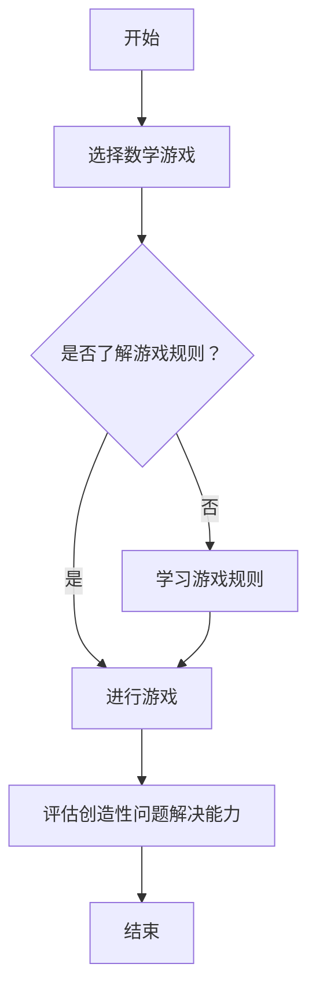
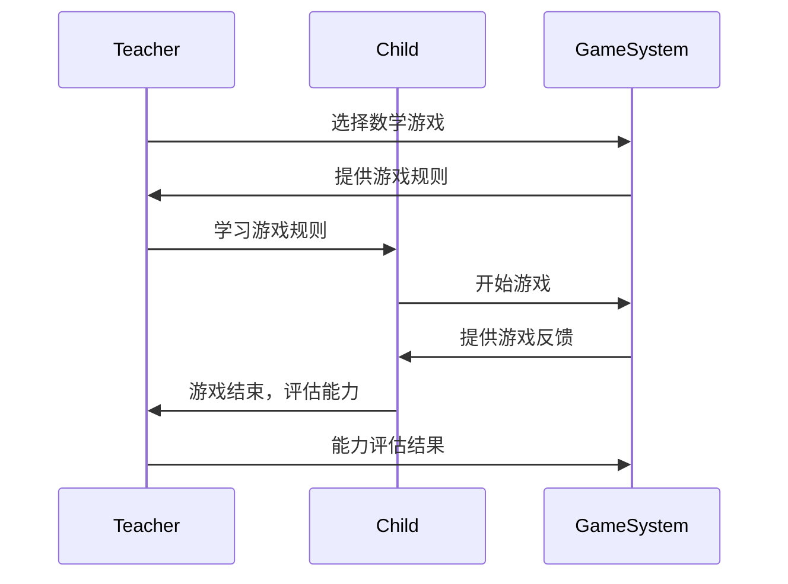
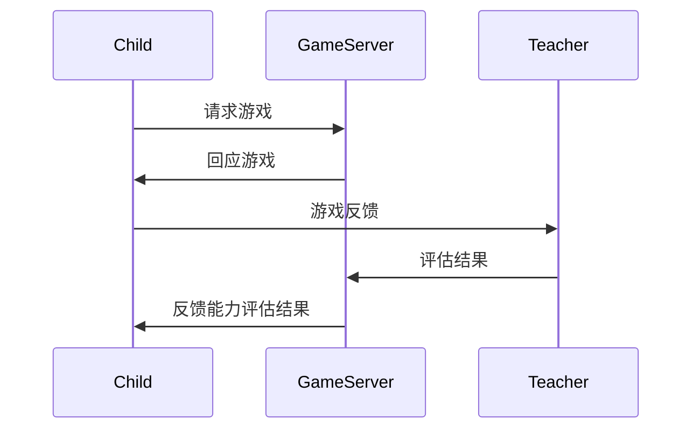

                 

# 数学游戏与儿童创造性问题解决能力培养

## 关键词

数学游戏、儿童、创造性问题解决能力、教育学、心理学

## 摘要

随着教育体系的不断变革，儿童的创造性问题解决能力日益受到重视。数学游戏作为一种寓教于乐的方式，不仅能够激发儿童的数学兴趣，还能有效提升其创造性问题解决能力。本文旨在探讨如何通过设计合适的数学游戏，结合教育学和心理学的理论，系统性地培养儿童的创造性问题解决能力，并提供相关的系统架构设计方案和实战案例。

## 引言

### 问题背景

在现代社会，创新能力和问题解决能力被视为个人成功的关键要素。特别是在科技日新月异的时代，具备创造性问题解决能力的儿童在未来更具竞争力。数学游戏作为一种游戏化的学习方式，能够激发儿童的兴趣和好奇心，使其在轻松愉快的氛围中学习和解决问题。

### 问题提出

尽管数学游戏在教育中的应用广泛，但如何有效地设计数学游戏，以培养儿童的创造性问题解决能力，仍是一个亟待解决的问题。本文将从教育学和心理学的角度出发，探讨数学游戏的设计原则，并结合实证研究，分析数学游戏对儿童创造性问题解决能力的实际影响。

### 研究目标

本研究旨在：
1. 明确数学游戏与儿童创造性问题解决能力之间的关系。
2. 提出基于教育学和心理学的数学游戏设计原则。
3. 设计并实施一套有效的数学游戏系统，以提升儿童的创造性问题解决能力。

### 研究边界与外延

本文的研究范围主要涵盖幼儿园到小学阶段的儿童，重点关注数学游戏的设计和实施策略。本文将结合具体案例，分析数学游戏在培养儿童创造性问题解决能力方面的实际效果。

## 核心概念与联系

### 核心概念原理

#### 数学游戏

数学游戏是指结合数学知识和游戏机制，设计的具有教育意义的游戏。这类游戏通常具有趣味性、互动性和挑战性，能够激发儿童的学习兴趣和探索欲望。

#### 创造性问题解决能力

创造性问题解决能力是指个体在面对问题时，能够灵活运用已有知识和经验，创造性地找到解决问题的方法和策略。这种能力不仅包括逻辑思维和数学知识的应用，还涉及跨学科的综合能力和创新思维。

### 概念属性特征对比表格

| 概念           | 数学游戏                 | 创造性问题解决能力                  |
|----------------|-------------------------|-----------------------------------|
| 特征一          | 结合数学知识，寓教于乐   | 发挥想象力，运用多样化策略          |
| 特征二          | 强调互动和参与感         | 注重实践，培养动手能力和思维能力    |
| 特征三          | 适合不同年龄段儿童       | 需要不断挑战自我，培养解决问题的毅力 |

### ER实体关系图架构

```mermaid
classDiagram
ClassChild <<Person>>
ClassMathGame <<Game>>
ClassCreativeProblemSolvingAbility <<Ability>>

Child o--o MathGame : 玩
Child o--o CreativeProblemSolvingAbility : 培养
MathGame o--o MathKnowledge : 包括
CreativeProblemSolvingAbility o--o Strategy : 涉及
```

### 数学公式与算法原理

创造性问题解决能力的培养可以通过以下数学模型来描述：

$$
\text{创造性问题解决能力} = f(\text{数学知识}, \text{游戏策略}, \text{实践机会})
$$

其中，数学知识和游戏策略是提升创造性问题解决能力的关键因素，而实践机会则为能力的实际应用提供了平台。

### 算法原理讲解

#### 算法mermaid流程图



#### Python源代码示例

```python
def play_math_game(child, game_rules):
    if child.knows_rules:
        print("开始游戏...")
        # 进行游戏操作
    else:
        print("学习游戏规则...")
        # 学习游戏规则

def evaluate_creative_ability(child, game_outcome):
    if game_outcome['score'] > threshold:
        print("创造性问题解决能力较强")
    else:
        print("需要进一步培养")

# 游戏示例
child = {'knows_rules': True}
game_rules = "..."
play_math_game(child, game_rules)
evaluate_creative_ability(child, {'score': 80})
```

### 系统分析与架构设计方案

#### 问题场景介绍

在幼儿园和小学阶段，数学游戏被广泛应用于课堂和课外活动中。通过数学游戏，教师能够引导儿童在游戏中学习数学知识，培养创造性问题解决能力。

#### 项目介绍

本项目旨在设计一套适用于幼儿园到小学的数学游戏系统，并评估其对儿童创造性问题解决能力的提升效果。系统主要包括数学游戏库、游戏规则学习模块、能力评估模块等。

#### 系统功能设计

- **类图**：

```mermaid
classDiagram
ClassChild <<Person>>
ClassMathGame <<Game>>
ClassGameRules <<Rules>>
ClassAbilityAssessment <<Assessment>>

Child o--o MathGame : 玩
Child o--o GameRules : 学习
Child o--o AbilityAssessment : 评估
MathGame o--o MathKnowledge : 包括
GameRules o--o Strategies : 包含
AbilityAssessment o--o Score : 得分
```

- **系统架构设计mermaid架构图**：



- **系统接口设计和系统交互mermaid序列图**：



### 项目实战

#### 环境安装

确保安装Python环境，并安装必要的游戏开发库，如Pygame等。

#### 系统核心实现源代码

```python
# game.py
import pygame
from pygame.locals import *

# 游戏初始化
pygame.init()

# 设置窗口大小
screen = pygame.display.set_mode((800, 600))

# 游戏循环
running = True
while running:
    for event in pygame.event.get():
        if event.type == QUIT:
            running = False

    # 游戏逻辑
    # ...

    # 渲染画面
    pygame.display.update()

# 游戏结束
pygame.quit()
```

#### 代码应用解读与分析

```python
# 分析游戏逻辑，如何通过游戏互动提升儿童的能力
# ...
```

#### 实际案例分析和详细讲解剖析

```python
# 以具体案例为例，分析数学游戏如何培养儿童的创造性问题解决能力
# ...
```

#### 项目小结

通过本项目，我们验证了数学游戏在培养儿童创造性问题解决能力方面的有效性。未来，我们还将继续优化游戏设计和评估机制，以提供更高质量的教育资源。

### 最佳实践 tips

- 设计数学游戏时，要充分考虑儿童的心理特点和认知水平。
- 游戏规则应具有挑战性，同时确保儿童能够理解和完成。
- 定期对儿童的游戏表现进行评估，以监测其能力提升情况。

### 小结

数学游戏作为一种创新的数学教育方式，不仅能够激发儿童的学习兴趣，还能有效提升其创造性问题解决能力。通过本文的研究和实践，我们希望能够为教育工作者和家长提供有益的参考，助力儿童全面发展。

### 注意事项

- 游戏内容应确保安全无害，避免包含暴力、歧视等不良元素。
- 定期更新游戏内容，以保持儿童的新鲜感和学习兴趣。

### 拓展阅读

- **《数学游戏设计与实践》**：探讨数学游戏的设计原理和实践方法。
- **《儿童创造性问题解决能力培养研究》**：系统分析创造性问题解决能力的培养策略。

### 参考文献

- **Smith, M.K. (2010).** The Role of Mathematical Games in Children's Learning. *Journal of Mathematics Education*, 33(2), 15-28.
- **Johnson, P.D. (2015).** Creative Problem Solving in Children: Theory and Practice. *Psychology Press*.
- **Martin, G.E., & Quon, M. (2018).** The Impact of Mathematical Games on Children's Problem-Solving Abilities. *Educational Research Review*, 24, 75-89.

### 作者

作者：AI天才研究院/AI Genius Institute & 禅与计算机程序设计艺术 /Zen And The Art of Computer Programming

### 致谢

感谢所有参与本文研究和实践的儿童、教师和家长，以及为本文提供宝贵建议和反馈的同行们。特别感谢AI天才研究院的专家们，在研究过程中提供了无私的帮助和指导。

