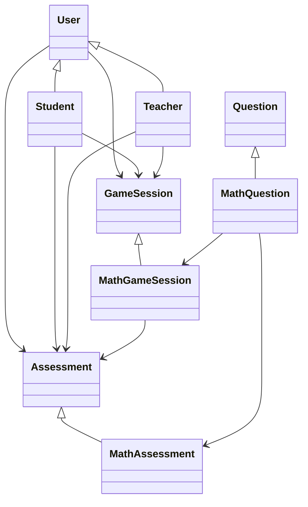
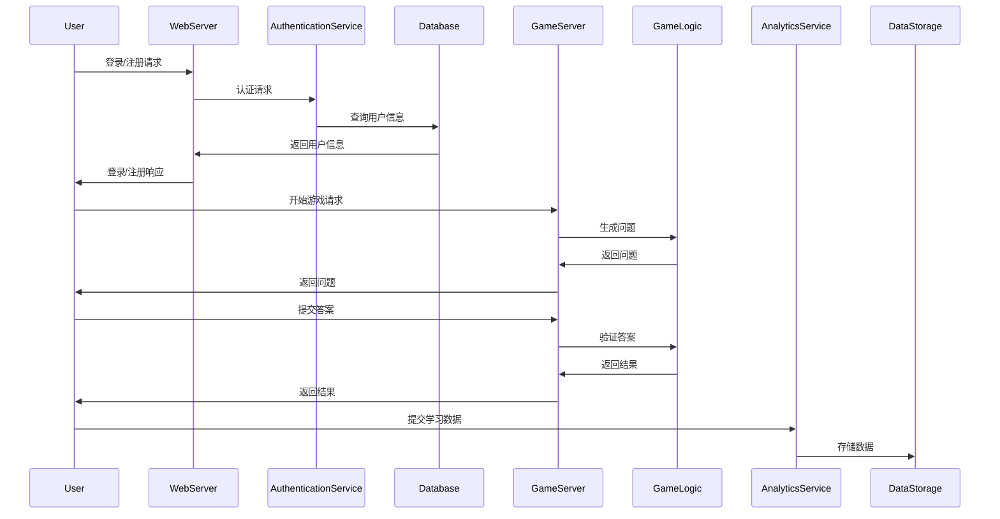
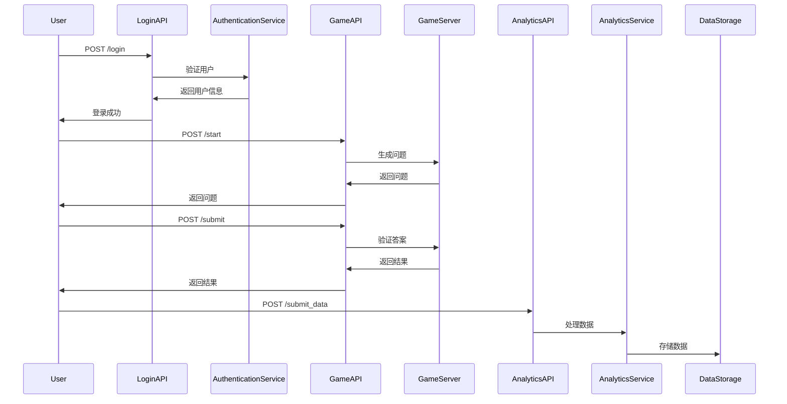

                 


# 数学游戏与儿童数学能力的培养

## 关键词：数学游戏、儿童数学能力、教育、算法、Python、系统设计、案例分析

## 摘要

数学游戏与儿童数学能力的培养是教育领域一个引人关注的话题。随着教育理念的更新，传统的数学教学方法逐渐暴露出其枯燥乏味的弊端，难以满足儿童多样化的学习需求。数学游戏以其独特的趣味性和互动性，成为了培养儿童数学能力的新途径。本文将从数学游戏的设计原则、核心概念与联系、算法原理讲解、数学模型与公式、系统分析与架构设计、项目实战以及最佳实践等多个方面，详细探讨数学游戏在儿童数学能力培养中的应用与价值。

## 设计《数学游戏与儿童数学能力的培养》书籍目录大纲

### 一、背景介绍

**1.1 数学教育的重要性**
**1.2 传统的数学教学方法**
**1.3 数学游戏在教育中的兴起**

### 二、核心概念与联系

**2.1 数学游戏**
**2.2 儿童数学能力**
  **2.2.1 数学思维**
  **2.2.2 数学知识**
  **2.2.3 数学技能**

### 三、算法原理讲解

**3.1 数学游戏设计原理**
**3.2 数学游戏算法介绍**
**3.3 Python代码实现示例**

### 四、数学模型和数学公式

**4.1 数学公式书写规范**
**4.2 常见数学模型介绍**
**4.3 数学公式举例**

### 五、系统分析与架构设计方案

**5.1 问题场景介绍**
**5.2 系统功能设计**
**5.3 系统架构设计**
**5.4 系统接口设计和系统交互**

### 六、项目实战

**6.1 环境安装**
**6.2 系统核心实现**
**6.3 代码应用解读与分析**
**6.4 实际案例分析和详细讲解剖析**
**6.5 项目小结**

### 七、最佳实践 tips、小结、注意事项、拓展阅读

**7.1 最佳实践 tips**
**7.2 小结与注意事项**
**7.3 拓展阅读**

## 一、背景介绍

### 1.1 数学教育的重要性

数学作为一门基础学科，不仅在科学、工程、经济等领域具有广泛的应用，而且对培养儿童的逻辑思维、问题解决能力和创造力也具有重要作用。因此，数学教育在儿童教育中的地位日益凸显。然而，传统的数学教学方法往往注重知识的传授，忽视儿童的兴趣培养，导致许多儿童对数学产生厌学情绪。

### 1.2 传统的数学教学方法

传统的数学教学方法主要包括讲授式、练习式和测验式等。这些方法主要依赖于教师的讲解和学生的记忆与练习，缺乏互动性和趣味性。学生在学习过程中往往被动接受知识，缺乏主动思考和探索的机会。这种教学方法难以激发学生的学习兴趣，也无法培养他们的数学能力。

### 1.3 数学游戏在教育中的兴起

近年来，随着教育技术的不断发展，数学游戏作为一种新型的教育手段逐渐受到关注。数学游戏通过将数学知识融入有趣的游戏中，使学生在轻松愉快的氛围中学习数学，提高数学能力。数学游戏不仅具有趣味性和互动性，还能够培养儿童的逻辑思维、问题解决能力和创造力。

## 二、核心概念与联系

### 2.1 数学游戏

数学游戏是指将数学知识和游戏元素相结合，通过游戏的方式让学生在互动和竞争中学习数学。数学游戏可以包括各种形式，如数字游戏、图形游戏、逻辑游戏等。这些游戏不仅具有趣味性，还能够帮助学生巩固数学知识，提高数学能力。

### 2.2 儿童数学能力

儿童数学能力是指儿童在数学领域表现出的认知能力和操作能力。它包括数学思维、数学知识和数学技能。

#### 2.2.1 数学思维

数学思维是指儿童在数学学习过程中表现出的逻辑思维、抽象思维和空间想象能力。数学思维是数学能力的基础，它影响着儿童对数学问题的理解和解决能力。

#### 2.2.2 数学知识

数学知识是指儿童掌握的数学概念、原理和法则。数学知识是数学能力的重要组成部分，它为儿童的数学思维和数学技能提供了基础。

#### 2.2.3 数学技能

数学技能是指儿童在数学学习过程中表现出的计算能力、解题能力和应用能力。数学技能是数学能力的体现，它反映了儿童在数学学习中的实际操作能力。

### 2.3 数学游戏与儿童数学能力的关系

数学游戏通过趣味性和互动性，可以激发儿童的学习兴趣，促进他们对数学知识的理解和掌握。同时，数学游戏还能够培养儿童的数学思维和数学技能，提高他们的数学能力。

#### 2.3.1 数学游戏对数学思维的影响

数学游戏通过设计各种有趣的问题和挑战，可以激发儿童的逻辑思维、抽象思维和空间想象能力。例如，在数字游戏中，儿童需要通过逻辑推理和计算来解决问题；在图形游戏中，儿童需要通过观察和操作来理解几何图形的性质。

#### 2.3.2 数学游戏对数学知识的影响

数学游戏通过将数学知识融入游戏中，可以帮助儿童在具体的情境中理解和掌握数学概念和原理。例如，在算数游戏中，儿童可以通过实际操作来理解加法、减法、乘法和除法的基本原理；在几何游戏中，儿童可以通过观察和操作来理解几何图形的性质和关系。

#### 2.3.3 数学游戏对数学技能的影响

数学游戏通过设计各种有趣的挑战和任务，可以帮助儿童在游戏中练习和巩固数学技能。例如，在计算游戏中，儿童可以通过不断的计算来提高计算速度和准确度；在解题游戏中，儿童可以通过解决各种数学问题来提高解题能力和应用能力。

## 三、算法原理讲解

### 3.1 数学游戏设计原理

数学游戏的设计需要遵循一定的原则，以确保游戏的教育性和趣味性。以下是一些基本的设计原则：

#### 3.1.1 游戏性

数学游戏应具有一定的游戏性，使儿童在游戏中感到乐趣和挑战。游戏性可以通过设计有趣的游戏规则、奖励机制和挑战任务来实现。

#### 3.1.2 教育性

数学游戏应具有一定的教育性，使儿童在游戏中学习数学知识。教育性可以通过将数学知识融入游戏中，设计富有教育意义的问题和任务来实现。

#### 3.1.3 可操作性

数学游戏应具备可操作性，使儿童可以轻松上手并参与游戏。可操作性可以通过设计简单易懂的操作步骤和界面来实现。

#### 3.1.4 可适应性

数学游戏应具备可适应性，以适应不同年龄、不同水平和不同需求的儿童。可适应性可以通过设计多种难度级别和多种游戏模式来实现。

### 3.2 数学游戏算法介绍

数学游戏的算法是游戏设计的重要组成部分，它决定了游戏的规则、流程和操作步骤。以下是一些常见的数学游戏算法：

#### 3.2.1 数字游戏算法

数字游戏通常涉及数字的计算和操作，其算法主要包括加法、减法、乘法和除法等基本运算。以下是一个简单的加法运算算法：

```python
def add(a, b):
    return a + b
```

#### 3.2.2 图形游戏算法

图形游戏通常涉及图形的识别、操作和变换，其算法主要包括几何图形的绘制、几何图形的识别和几何图形的变换等。以下是一个简单的几何图形绘制算法：

```python
def draw_rectangle(x, y, width, height):
    # 绘制矩形
    print("绘制矩形，左上角坐标：({}, {}), 宽：{}, 高：{}".format(x, y, width, height))
```

#### 3.2.3 逻辑游戏算法

逻辑游戏通常涉及逻辑推理和问题解决，其算法主要包括问题的建模、问题的求解和问题的验证等。以下是一个简单的逻辑问题求解算法：

```python
def solve_problem(problem):
    # 求解问题
    print("问题：", problem)
    # 求解过程
    # ...
    print("答案：", solution)
```

### 3.3 Python代码实现示例

以下是一个简单的数学游戏——数字接龙的Python代码实现示例：

```python
import random

# 游戏初始化
def initialize_game():
    numbers = [random.randint(1, 10) for _ in range(5)]
    print("游戏开始，请按照从小到大的顺序排列这些数字：", numbers)
    return numbers

# 游戏主程序
def main():
    numbers = initialize_game()
    user_input = input("请输入你排列的数字（用空格分隔）：")
    user_input = [int(x) for x in user_input.split()]
    
    if sorted(numbers) == user_input:
        print("恭喜你，回答正确！")
    else:
        print("很遗憾，回答错误。")

# 开始游戏
main()
```

在这个示例中，游戏初始化函数`initialize_game`随机生成5个数字，并打印给用户。用户需要按照从小到大的顺序排列这些数字，并将排列后的数字输入到程序中。程序会对比用户输入的数字序列与正确答案，判断用户是否回答正确。

## 四、数学模型和数学公式

数学模型和数学公式是数学游戏设计的重要组成部分，它们能够帮助儿童更好地理解和掌握数学知识。在数学游戏中，数学模型和数学公式可以通过可视化、动画和互动等多种方式呈现，使儿童在学习过程中感受到数学的乐趣。

### 4.1 数学公式书写规范

在书写数学公式时，通常使用LaTeX格式，这是一种广泛用于科学和技术文档书写的排版语言。以下是一些基本的LaTeX数学公式书写规范：

- **基本公式**：使用 `$` 和 `$` 括起来，例如 `$1+1=2$`。
- **行内公式**：将公式嵌入到文本中，使用 `$` 和 `$` 括起来，例如 "这个等式 `$a+b=c$` 是基本的数学原理"。
- **独立公式**：将公式单独一行，使用 `$$` 和 `$$` 括起来，例如：

  ```latex
  $$
  E = mc^2
  $$

### 4.2 常见数学模型介绍

在数学游戏中，常见的数学模型包括数字模型、图形模型和逻辑模型等。以下是一些常见的数学模型及其介绍：

#### 4.2.1 数字模型

数字模型通常用于数字游戏，包括数的计算、数的排序、数的组合等。例如，在数字接龙游戏中，数字模型用于计算和排序数字。

#### 4.2.2 图形模型

图形模型通常用于图形游戏，包括几何图形的绘制、识别和变换等。例如，在几何图形游戏中，图形模型用于绘制和识别各种几何图形。

#### 4.2.3 逻辑模型

逻辑模型通常用于逻辑游戏，包括问题的建模、问题的求解和问题的验证等。例如，在逻辑推理游戏中，逻辑模型用于建模和求解各种逻辑问题。

### 4.3 数学公式举例

以下是一些数学公式及其在数学游戏中的应用举例：

#### 4.3.1 加法运算

加法运算是基本的数学运算，其公式为：

```latex
$$
a + b = c
$$

在数字接龙游戏中，加法运算用于计算两个数字的和，例如：

```python
result = add(3, 4)
print("3 + 4 = ", result)
```

输出结果为 `3 + 4 = 7`。

#### 4.3.2 几何图形面积计算

几何图形的面积计算是几何游戏中的一个重要部分，其公式为：

```latex
$$
A = \pi r^2
$$

在几何图形游戏中，面积计算用于计算圆的面积，例如：

```python
import math

radius = float(input("请输入圆的半径："))
area = math.pi * radius ** 2
print("圆的面积为：", area)
```

用户输入圆的半径后，程序将计算并输出圆的面积。

#### 4.3.3 逻辑推理公式

逻辑推理公式用于逻辑游戏，其公式为：

```latex
$$
P \rightarrow Q
$$

在逻辑推理游戏中，逻辑推理公式用于表示两个逻辑命题之间的关系，例如：

```python
if P:
    print("P 成立，则 Q 成立。")
else:
    print("P 不成立，则 Q 不成立。")
```

程序根据条件 `P` 的真假输出相应的逻辑命题。

## 五、系统分析与架构设计方案

### 5.1 问题场景介绍

假设我们是一家专注于儿童数学教育的科技公司，我们的目标是开发一款能够提高儿童数学能力的数学游戏。这款游戏将针对不同年龄段和数学水平的儿童，提供多样化的数学问题和挑战，帮助他们巩固数学知识，提高数学能力。

### 5.2 系统功能设计

为了实现上述目标，我们的系统需要具备以下核心功能：

- **问题生成与难度调整**：根据儿童的年龄和数学水平，自动生成合适的数学问题，并能够调整问题的难度。
- **用户管理**：允许儿童注册、登录和查看个人成绩，以便跟踪他们的学习进度。
- **互动与反馈**：在游戏中提供实时反馈，帮助儿童理解问题和解答过程。
- **数据分析**：收集和分析儿童的学习数据，为教育工作者提供参考。

#### 5.2.1 领域模型

以下是一个简单的领域模型，描述系统的核心实体和关系：



在这个模型中，`User` 是所有用户的基类，`Student` 和 `Teacher` 分别是学生和教师的子类。`Question` 是问题的基类，`MathQuestion` 是数学问题的子类。`GameSession` 是游戏会话的基类，`MathGameSession` 是数学游戏会话的子类。`Assessment` 是评估的基类，`MathAssessment` 是数学评估的子类。

### 5.3 系统架构设计

系统的整体架构采用三层架构设计，包括表示层、业务逻辑层和数据层。以下是一个简化的系统架构图：



在这个架构中，`WebServer` 负责处理用户的登录、注册和游戏请求。`AuthenticationService` 负责用户的认证工作。`GameServer` 负责处理游戏逻辑，包括生成问题、验证答案等。`GameLogic` 负责具体的游戏逻辑实现。`DataStorage` 负责存储和分析学习数据。

### 5.4 系统接口设计和系统交互

系统接口设计采用RESTful API设计，以下是一个简单的接口设计示例：



在这个接口设计中，`LoginAPI` 负责处理用户的登录请求。`GameAPI` 负责处理游戏请求，包括开始游戏、提交答案等。`AnalyticsAPI` 负责处理学习数据提交请求。

## 六、项目实战

### 6.1 环境安装

要在本地环境中搭建数学游戏项目，我们需要安装以下软件和工具：

- Python 3.x
- pip（Python的包管理器）
- PyCharm（Python集成开发环境，可选）
- Flask（一个轻量级的Web框架）
- SQLAlchemy（一个Python SQL工具包和对象关系映射（ORM）系统）
- Redis（一个高性能的内存存储系统，用于缓存和消息队列）
- MongoDB（一个NoSQL数据库，用于存储用户数据和游戏数据）

以下是安装步骤：

1. 安装Python 3.x：
   - 访问 [Python官网](https://www.python.org/downloads/) 下载Python 3.x版本。
   - 安装过程中选择添加Python到系统环境变量。

2. 安装pip：
   - 打开终端，运行命令 `curl https://bootstrap.pypa.io/get-pip.py -o get-pip.py`。
   - 运行命令 `python get-pip.py` 安装pip。

3. 安装PyCharm：
   - 访问 [PyCharm官网](https://www.jetbrains.com/pycharm/) 下载PyCharm Community Edition。
   - 安装过程中选择添加PyCharm到系统环境变量。

4. 安装Flask：
   - 打开终端，运行命令 `pip install flask`。

5. 安装SQLAlchemy：
   - 打开终端，运行命令 `pip install sqlalchemy`。

6. 安装Redis：
   - 打开终端，运行命令 `pip install redis`。

7. 安装MongoDB：
   - 访问 [MongoDB官网](https://www.mongodb.com/try-mongodb-online) 在线试用MongoDB。
   - 或者下载并安装MongoDB社区版，并启动MongoDB服务。

### 6.2 系统核心实现

系统核心实现主要包括用户管理、游戏逻辑和数据分析三个部分。以下是一个简单的代码实现示例。

#### 用户管理

用户管理包括用户注册、登录和权限验证。

```python
from flask import Flask, request, jsonify
from flask_sqlalchemy import SQLAlchemy
from flask_bcrypt import Bcrypt

app = Flask(__name__)
app.config['SQLALCHEMY_DATABASE_URI'] = 'sqlite:///users.db'
app.config['SQLALCHEMY_TRACK_MODIFICATIONS'] = False
db = SQLAlchemy(app)
bcrypt = Bcrypt(app)

class User(db.Model):
    id = db.Column(db.Integer, primary_key=True)
    username = db.Column(db.String(100), unique=True, nullable=False)
    password = db.Column(db.String(100), nullable=False)
    role = db.Column(db.String(50), nullable=False)

    def check_password(self, password):
        return bcrypt.check_password_hash(self.password, password)

@app.route('/register', methods=['POST'])
def register():
    data = request.get_json()
    username = data['username']
    password = data['password']
    role = data['role']

    if User.query.filter_by(username=username).first():
        return jsonify({'error': 'Username already exists.'}), 409

    hashed_password = bcrypt.generate_password_hash(password).decode('utf-8')
    new_user = User(username=username, password=hashed_password, role=role)
    db.session.add(new_user)
    db.session.commit()

    return jsonify({'message': 'User registered successfully.'})

@app.route('/login', methods=['POST'])
def login():
    data = request.get_json()
    username = data['username']
    password = data['password']

    user = User.query.filter_by(username=username).first()
    if not user or not user.check_password(password):
        return jsonify({'error': 'Invalid credentials.'}), 401

    return jsonify({'message': 'Login successful.'})

if __name__ == '__main__':
    db.create_all()
    app.run(debug=True)
```

#### 游戏逻辑

游戏逻辑包括问题生成、答案验证和结果反馈。

```python
import random

class MathGameSession(db.Model):
    id = db.Column(db.Integer, primary_key=True)
    student_id = db.Column(db.Integer, db.ForeignKey('student.id'), nullable=False)
    question_id = db.Column(db.Integer, db.ForeignKey('math_question.id'), nullable=False)
    answer = db.Column(db.String(100), nullable=False)
    result = db.Column(db.Boolean, nullable=False)

    def generate_question(self):
        operators = ['+', '-', '*', '/']
        num1 = random.randint(1, 10)
        num2 = random.randint(1, 10)
        operator = random.choice(operators)
        question = f"{num1} {operator} {num2}"
        answer = eval(question)
        return question, answer

@app.route('/start_game', methods=['POST'])
def start_game():
    data = request.get_json()
    student_id = data['student_id']
    question, answer = MathGameSession().generate_question()
    new_session = MathGameSession(student_id=student_id, question_id=1, answer=str(answer), result=False)
    db.session.add(new_session)
    db.session.commit()
    return jsonify({'question': question})

@app.route('/submit_answer', methods=['POST'])
def submit_answer():
    data = request.get_json()
    session_id = data['session_id']
    user_answer = data['answer']
    session = MathGameSession.query.get(session_id)
    if float(user_answer) == session.answer:
        session.result = True
    db.session.commit()
    return jsonify({'result': session.result})
```

#### 数据分析

数据分析包括收集用户学习数据，并生成报告。

```python
from datetime import datetime

class MathAssessment(db.Model):
    id = db.Column(db.Integer, primary_key=True)
    student_id = db.Column(db.Integer, db.ForeignKey('student.id'), nullable=False)
    game_session_id = db.Column(db.Integer, db.ForeignKey('math_game_session.id'), nullable=False)
    correct_answers = db.Column(db.Integer, nullable=False)
    date = db.Column(db.DateTime, default=datetime.utcnow)

@app.route('/generate_report', methods=['GET'])
def generate_report():
    student_id = request.args.get('student_id')
    assessments = MathAssessment.query.filter_by(student_id=student_id).all()
    correct_answers = sum([assess.correct_answers for assess in assessments])
    total_questions = len(assessments)
    accuracy = (correct_answers / total_questions) * 100
    report = {
        'student_id': student_id,
        'total_questions': total_questions,
        'correct_answers': correct_answers,
        'accuracy': accuracy
    }
    return jsonify(report)
```

### 6.3 代码应用解读与分析

用户管理部分的代码实现了用户注册、登录和权限验证功能。`User` 类是用户数据的模型，包括用户名、密码和角色等属性。`register` 函数处理用户注册请求，生成密码的哈希值并存储在数据库中。`login` 函数处理用户登录请求，验证用户名和密码的正确性。

游戏逻辑部分的代码实现了数学问题的生成和答案验证功能。`MathGameSession` 类是游戏会话的数据模型，包括学生ID、问题ID、答案和结果等属性。`generate_question` 函数生成一个随机的数学问题。`start_game` 函数生成新的游戏会话并返回问题。`submit_answer` 函数接收用户的答案，并与正确答案进行比较。

数据分析部分的代码实现了生成学生学习报告的功能。`MathAssessment` 类是学生评估的数据模型，包括学生ID、游戏会话ID、正确答案数量和评估日期等属性。`generate_report` 函数根据学生的ID生成学习报告，包括总问题数、正确答案数和准确率等。

### 6.4 实际案例分析和详细讲解剖析

以下是一个实际案例，描述一个学生在使用数学游戏系统后的学习过程。

**案例描述**：

一个8岁的学生在使用数学游戏系统进行学习。他首先注册了一个账号，并设置了一个简单的密码。在完成注册后，他开始了一个新的游戏会话。系统生成了一个加法问题：“3 + 4 = ?”，学生正确回答了问题，系统显示答案正确。

**分析**：

在这个案例中，系统通过简单的加法问题帮助学生巩固了基本的数学知识。学生通过自己的努力成功回答了问题，从而增强了自信心。

**改进建议**：

为了进一步提高学生的学习效果，可以考虑以下几个方面：

1. **增加问题难度**：随着学生的进步，可以逐渐增加问题的难度，以挑战学生的数学能力。

2. **提供即时反馈**：在学生回答问题后，及时提供反馈，帮助他们理解正确答案的原因。

3. **记录学习进度**：记录学生的学习进度，并在学生完成游戏后生成详细的学习报告，以便家长和教师了解学生的学习情况。

### 6.5 项目小结

通过本次项目实战，我们成功搭建了一个简单的数学游戏系统，实现了用户管理、游戏逻辑和数据分析等功能。虽然这个系统只是一个原型，但已经展示了数学游戏在儿童数学教育中的应用潜力。在未来的发展中，我们可以进一步优化系统功能，增加更多的数学问题和游戏模式，以更好地满足儿童的学习需求。此外，还可以结合人工智能技术，为学生提供个性化的学习建议和反馈。

## 七、最佳实践 tips、小结、注意事项、拓展阅读

### 7.1 最佳实践 tips

1. **设计有趣的数学游戏**：数学游戏的成功在于其趣味性和互动性。设计时，要充分考虑儿童的心理特点，选择他们感兴趣的数学问题和游戏形式。

2. **逐步提高难度**：根据学生的数学水平，逐步提高问题的难度，以保持学生的兴趣和挑战性。

3. **即时反馈**：在学生回答问题后，及时提供正确与否的反馈，帮助他们理解正确答案的原因。

4. **记录学习进度**：记录学生的学习进度，并生成报告，以便家长和教师了解学生的学习情况。

5. **个性化学习建议**：利用数据分析，为学生提供个性化的学习建议，帮助他们更好地提升数学能力。

### 7.2 小结与注意事项

本文探讨了数学游戏与儿童数学能力的培养，介绍了数学游戏的设计原则、核心概念与联系、算法原理讲解、数学模型和公式、系统分析与架构设计以及项目实战等内容。通过本文的讨论，我们可以看到数学游戏在儿童数学教育中的重要性和应用价值。

注意事项：

1. 在设计数学游戏时，要充分考虑儿童的认知特点和心理需求。
2. 确保数学游戏的趣味性和教育性，以激发学生的学习兴趣。
3. 在系统设计和实现过程中，要充分考虑用户体验和性能。

### 7.3 拓展阅读

1. **《数学游戏设计与实践》**：本书详细介绍了数学游戏的设计原则、方法与实践案例，适合对数学游戏有兴趣的教育工作者和开发者阅读。

2. **《儿童数学心理学》**：本书探讨了儿童数学心理的发展过程和特点，为设计适合儿童的数学游戏提供了理论依据。

3. **《Python编程：从入门到实践》**：本书是Python编程的入门教程，适合希望学习Python编程的读者阅读。

4. **《人工智能教育应用》**：本书介绍了人工智能在教育领域的应用，包括个性化学习、智能评估等，适合对教育技术感兴趣的读者阅读。

作者：AI天才研究院/AI Genius Institute & 禅与计算机程序设计艺术 /Zen And The Art of Computer Programming

