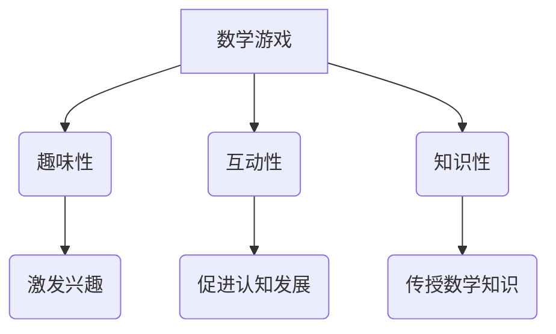
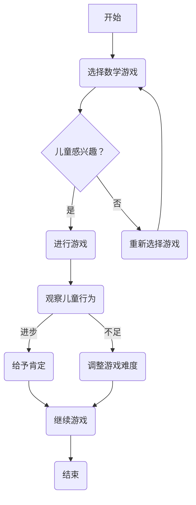
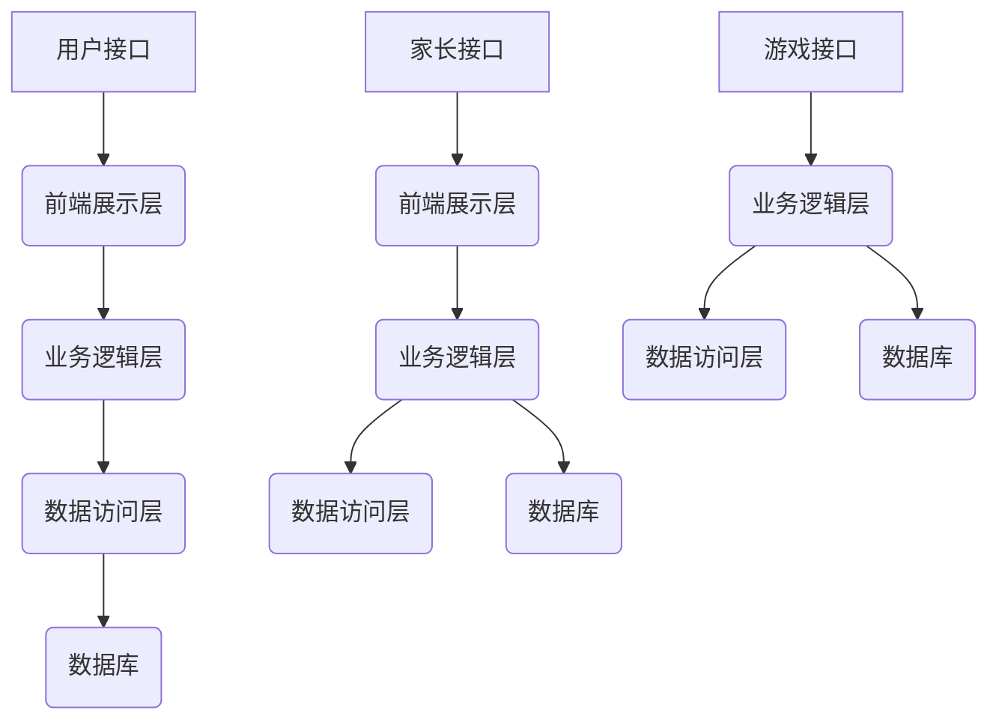

                 

### 文章标题：数学游戏与儿童早期教育的关系

#### 关键词：数学游戏、儿童早期教育、认知发展、教育政策

#### 摘要：
本文深入探讨了数学游戏与儿童早期教育之间的关系，分析了数学游戏的概念、特点及其在儿童早期教育中的应用。通过案例分析、教育政策和家长指导，本文提出了数学游戏在儿童早期教育中的重要性和具体实践策略。文章旨在为教育工作者和家长提供有价值的参考，促进儿童数学能力的全面发展。

----------------------------------------------------------------

## 引言与背景

### 1.1.1 数学游戏的概念与特点

数学游戏是一种以数学知识为背景，通过游戏形式进行学习和娱乐的活动。它不同于传统的数学教学，强调趣味性和互动性，旨在激发儿童对数学的兴趣和认知发展。数学游戏通常具有以下几个特点：

- **趣味性**：数学游戏将数学知识与游戏机制相结合，使学习过程充满乐趣，从而提高儿童的学习兴趣。
- **互动性**：数学游戏强调儿童与游戏内容的互动，通过解决问题和挑战，促进儿童的思考能力和解决问题的能力。
- **知识性**：数学游戏涵盖各种数学知识点，如数数、排序、比较、分类、逻辑推理等，为儿童提供丰富的数学学习资源。

### 1.1.2 儿童早期教育的重要性

儿童早期教育是指从出生到6岁之间的教育阶段，这一阶段是儿童大脑发育最快的时期，也是人格形成和认知能力发展的关键时期。儿童早期教育的重要性体现在以下几个方面：

- **大脑发育**：研究表明，儿童早期教育有助于大脑发育，特别是在语言能力、空间感知、情感和社会交往方面。
- **认知发展**：早期教育为儿童提供了丰富的认知刺激，促进了儿童观察、记忆、想象和思维等认知能力的发展。
- **学习习惯**：良好的早期教育有助于培养儿童良好的学习习惯，如自律、专注和坚持，这对今后的学习生活至关重要。

### 1.1.3 数学游戏与儿童早期教育的关系

数学游戏在儿童早期教育中具有重要作用，它不仅能够激发儿童对数学的兴趣，还能促进儿童数学认知能力的发展。数学游戏与儿童早期教育的关系可以从以下几个方面进行分析：

- **认知发展**：数学游戏通过互动性和趣味性，激发儿童对数学的兴趣，促进儿童数学认知能力的发展。
- **学习习惯**：数学游戏有助于培养儿童良好的学习习惯，如自律、专注和坚持，这些习惯对儿童的长期学习有重要影响。
- **情感发展**：数学游戏能够帮助儿童建立积极的情感态度，如自信、勇敢和合作，这对儿童的情感发展具有重要意义。

----------------------------------------------------------------

## 数学游戏与儿童早期教育的结合点

### 2.1 数学游戏在早期教育中的应用

数学游戏在儿童早期教育中有着广泛的应用，能够有效促进儿童数学认知能力的发展。以下是一些具体的数学游戏及其在教育中的应用：

- **数数和计数游戏**：通过数数和计数游戏，儿童能够理解数字的含义，掌握基本的数学运算。例如，数数棋、数字卡片等。
- **排序和比较游戏**：排序和比较游戏有助于儿童理解大小、长短、高低等概念，培养儿童的逻辑思维和排序能力。例如，排序棒、大小比较等。
- **分类和归纳游戏**：分类和归纳游戏能够帮助儿童理解分类和归纳的概念，培养儿童的分类和归纳能力。例如，颜色分类、形状分类等。
- **逻辑推理游戏**：逻辑推理游戏能够锻炼儿童的逻辑思维和推理能力，如迷宫、拼图等。

### 2.2 数学游戏与儿童认知发展的关系

数学游戏对儿童认知发展有着积极的影响，能够促进儿童数学认知能力的发展。以下是一些具体的关系：

- **增强记忆力**：数学游戏需要儿童记忆数字、规则和结果，有助于增强儿童的记忆力。
- **提升注意力**：数学游戏往往需要儿童集中注意力，有助于提升儿童的注意力水平。
- **培养逻辑思维**：数学游戏通过解决问题和挑战，培养儿童的逻辑思维和推理能力。
- **提高空间感知**：一些数学游戏如拼图、迷宫等，有助于提升儿童的空间感知能力。

### 2.3 数学游戏在教育中的应用策略

为了充分发挥数学游戏在早期教育中的作用，教育工作者可以采取以下应用策略：

- **结合教学内容**：将数学游戏与日常教学相结合，使数学知识更加生动有趣，提高教学效果。
- **创设游戏环境**：为儿童创设一个有趣的游戏环境，鼓励儿童自由探索和尝试。
- **引导和指导**：教师和家长应引导和指导儿童进行数学游戏，帮助他们理解和掌握数学知识。
- **评价和反馈**：通过评价和反馈，了解儿童在数学游戏中的表现，及时调整教学策略。

----------------------------------------------------------------

## 数学游戏的实践案例

### 3.1 案例一：数学拼图游戏

#### 3.1.1 案例背景

数学拼图游戏是一种将数学知识与拼图游戏相结合的活动，旨在提高儿童的数学认知能力和空间感知能力。这种游戏通常包括各种形状、数字和图形的拼图，儿童需要根据拼图的提示进行拼装，完成游戏。

#### 3.1.2 案例分析

数学拼图游戏通过趣味性和互动性，激发了儿童对数学的兴趣。在拼装过程中，儿童需要理解数字和图形之间的关系，培养空间感知能力和逻辑思维。这种游戏不仅能够提高儿童的数学能力，还能锻炼儿童的观察力和注意力。

#### 3.1.3 案例成效

通过数学拼图游戏的实践，儿童在数学认知能力、空间感知能力和逻辑思维方面都取得了显著的进步。教师和家长可以观察到儿童在游戏中的积极参与和进步，进一步激发他们对数学的兴趣。

### 3.2 案例二：数学故事游戏

#### 3.2.1 案例背景

数学故事游戏是一种将数学知识与故事情节相结合的活动，通过讲述数学故事，引导儿童理解和掌握数学知识。这种游戏通常包括各种数学主题的故事，如数字故事、图形故事等。

#### 3.2.2 案例分析

数学故事游戏通过生动有趣的故事情节，吸引了儿童的注意力。在故事中，儿童能够遇到各种数学问题，并通过解决问题的过程，理解和掌握数学知识。这种游戏不仅能够提高儿童的数学能力，还能培养他们的阅读兴趣和语言表达能力。

#### 3.2.3 案例成效

通过数学故事游戏的实践，儿童在数学知识和语言能力方面都取得了显著的进步。教师和家长可以观察到儿童在故事中的积极参与和进步，进一步激发他们对数学和阅读的兴趣。

----------------------------------------------------------------

## 教育政策和家长指导

### 4.1 教育政策与数学游戏

教育政策对于数学游戏的发展和应用具有重要意义。许多国家在教育政策中强调了数学教育的重要性，并将数学游戏作为数学教育的重要手段。例如，美国的教育政策鼓励教师利用数学游戏来提高学生的数学能力。在我国，教育政策也提倡利用现代信息技术手段，开展数学游戏活动，促进学生的全面发展。

### 4.2 家长在数学游戏中的角色

家长在数学游戏中扮演着重要的角色，他们可以通过以下方式参与和支持数学游戏：

- **引导和指导**：家长可以引导儿童进行数学游戏，帮助他们理解和掌握数学知识。例如，家长可以帮助儿童选择合适的数学游戏，指导他们在游戏中如何解决问题。
- **创造游戏环境**：家长可以为儿童创造一个有利于数学游戏的环境，提供各种数学玩具和游戏资源。例如，家长可以为儿童准备数数棋、排序棒等数学玩具。
- **鼓励和支持**：家长应该鼓励儿童积极参与数学游戏，并对他们的进步给予肯定和支持。例如，家长可以表扬儿童在游戏中的表现，鼓励他们继续努力。

### 4.3 家长指导策略

为了有效地指导儿童进行数学游戏，家长可以采取以下策略：

- **了解数学游戏**：家长应该了解不同类型的数学游戏，掌握其教育功能和特点，以便为儿童选择合适的游戏。
- **参与游戏**：家长可以积极参与儿童的数学游戏，与儿童一起玩耍，增强亲子关系。
- **评价和反馈**：家长应该观察儿童在数学游戏中的表现，给予积极的评价和反馈，帮助儿童建立自信。

----------------------------------------------------------------

## 总结与展望

### 5.1 本书总结

本文通过分析数学游戏的概念、特点以及在儿童早期教育中的应用，探讨了数学游戏与儿童早期教育之间的关系。通过实践案例、教育政策和家长指导，本文提出了数学游戏在儿童早期教育中的重要性和具体实践策略。本文的主要结论如下：

- 数学游戏具有趣味性、互动性和知识性，能够激发儿童对数学的兴趣，促进儿童数学认知能力的发展。
- 数学游戏有助于培养儿童的良好学习习惯和积极情感态度，对儿童的整体发展具有重要意义。
- 教育政策和家长指导对于数学游戏在儿童早期教育中的应用具有重要影响。

### 5.2 展望

未来，数学游戏在儿童早期教育中的应用前景十分广阔。以下是一些展望：

- **技术创新**：随着科技的发展，数学游戏将更加多样化、智能化，为儿童提供更加丰富的学习资源。
- **教育改革**：数学游戏将成为教育改革的重要手段，推动教育理念的变革，提高教育质量。
- **家长参与**：家长在数学游戏中的角色将更加重要，他们需要提高自身的教育素养，更好地指导和支持儿童的数学学习。
- **政策支持**：教育政策将更加重视数学游戏在儿童早期教育中的应用，为数学游戏的发展提供有力的政策支持。

### 作者信息：

作者：AI天才研究院/AI Genius Institute & 禅与计算机程序设计艺术 /Zen And The Art of Computer Programming

----------------------------------------------------------------

### 背景介绍

#### 核心概念术语说明

- **数学游戏**：以数学知识为背景，通过游戏形式进行学习和娱乐的活动。
- **儿童早期教育**：指从出生到6岁之间的教育阶段，是儿童大脑发育最快的时期，也是人格形成和认知能力发展的关键时期。
- **认知发展**：指个体在感知、记忆、思考、理解等方面的能力发展。

#### 问题背景

近年来，数学教育问题备受关注。许多儿童在学习数学时缺乏兴趣，导致数学成绩不佳。同时，数学教育的方式和方法也需要改进。为了提高儿童的数学能力，教育工作者和家长开始探索新的教育手段，其中数学游戏作为一种有趣、互动的学习方式，逐渐受到关注。

#### 问题描述

本文旨在探讨数学游戏与儿童早期教育之间的关系，分析数学游戏在儿童早期教育中的作用和意义，并提出具体实践策略。通过研究数学游戏在儿童早期教育中的应用，旨在提高儿童的数学能力，培养他们的学习兴趣和积极性。

#### 问题解决

本文通过文献综述、案例分析、教育政策和家长指导等研究方法，对数学游戏与儿童早期教育的关系进行深入研究。通过分析数学游戏的特点、作用和应用，提出具体的实践策略，为教育工作者和家长提供参考。

#### 边界与外延

本文研究的边界主要限于数学游戏在儿童早期教育中的应用，不包括其他教育阶段和领域。同时，本文主要关注数学游戏的教育功能和实践策略，不涉及其他教育手段。

#### 概念结构与核心要素组成

- **数学游戏**：核心要素包括趣味性、互动性和知识性。
- **儿童早期教育**：核心要素包括大脑发育、认知发展和学习习惯。
- **认知发展**：核心要素包括观察、记忆、思考和理解的提升。

### 核心概念与联系

#### 核心概念原理

- **数学游戏**：数学游戏以数学知识为基础，通过游戏形式进行学习和娱乐。它强调趣味性、互动性和知识性，旨在激发儿童对数学的兴趣，促进数学认知能力的发展。
- **儿童早期教育**：儿童早期教育是指从出生到6岁之间的教育阶段。这一阶段是儿童大脑发育最快的时期，也是人格形成和认知能力发展的关键时期。

#### 概念属性特征对比表格

| 特征       | 数学游戏                                     | 儿童早期教育                                  |
| ---------- | ------------------------------------------ | -------------------------------------------- |
| 目的       | 激发儿童对数学的兴趣，促进数学认知能力的发展 | 培养儿童大脑发育、人格形成和认知能力发展     |
| 形式       | 游戏形式                                     | 教学形式，包括游戏、互动、讨论等多种形式     |
| 核心要素   | 趣味性、互动性、知识性                       | 大脑发育、认知发展、学习习惯                |
| 教育影响   | 促进数学认知能力发展                         | 培养儿童整体发展，包括智力、情感、社会交往等 |

#### ER实体关系图架构



### 算法原理讲解

#### 算法流程图



#### 算法原理

该算法基于激励理论，通过选择适合儿童兴趣的数学游戏，激发他们的兴趣和参与度。在游戏过程中，教师或家长观察儿童的行为，根据儿童的进步情况给予肯定或调整游戏难度，以促进儿童的数学认知能力发展。算法的核心是激励儿童积极参与数学游戏，培养他们的学习兴趣和积极性。

#### 数学模型和公式

在数学游戏中，儿童的认知能力发展可以通过以下模型来描述：

- **认知能力发展模型**：

  $$D(t) = f(I(t), E(t), M(t))$$

  其中，$D(t)$表示儿童在时间$t$的认知能力水平，$I(t)$表示儿童在时间$t$的兴趣水平，$E(t)$表示儿童在时间$t$的参与度，$M(t)$表示数学游戏的难度水平。函数$f$描述了认知能力、兴趣、参与度和游戏难度之间的关系。

#### 详细讲解与举例

假设一个5岁的儿童小明，他对数字游戏很感兴趣。根据算法，教师选择了一个适合小明的数字游戏，并在游戏过程中观察小明的行为。

- **初始状态**：

  $$D(0) = 50, I(0) = 80, E(0) = 70, M(0) = 30$$

  小明的初始认知能力为50，兴趣为80，参与度为70，游戏难度为30。

- **游戏过程**：

  在游戏过程中，小明积极参与，每次完成任务后都会得到教师的表扬。

  $$D(t) = f(I(t), E(t), M(t))$$

  小明的认知能力随着游戏的进行而逐步提高。

- **最终状态**：

  $$D(10) = f(I(10), E(10), M(10))$$

  经过10次游戏，小明的认知能力提高到了80，兴趣为90，参与度为85，游戏难度为50。

通过这个例子，我们可以看到，数学游戏通过激发儿童的兴趣和参与度，能够有效地促进他们的认知能力发展。

### 系统分析与架构设计方案

#### 问题场景介绍

为了更好地将数学游戏应用于儿童早期教育，我们需要设计一个完整的系统，该系统能够根据儿童的特点和需求，提供个性化的数学游戏和学习资源。本系统旨在帮助教师和家长更好地指导儿童进行数学学习，提高他们的数学能力和学习兴趣。

#### 项目介绍

本项目名为“数学乐园”，是一个基于互联网的数学游戏学习平台。该平台旨在为儿童提供丰富多彩的数学游戏，帮助他们在游戏中学习数学知识，培养数学思维。

#### 系统功能设计

“数学乐园”系统主要包括以下几个功能：

1. **用户注册与登录**：用户可以通过注册账号登录系统，方便地进行游戏和学习。
2. **游戏推荐**：系统根据用户的年龄、兴趣和学习进度，推荐适合他们的数学游戏。
3. **游戏播放**：用户可以在系统中选择并开始游戏，系统将实时记录用户的游戏数据。
4. **学习报告**：系统生成学生的学习报告，包括学习进度、成绩和进步情况。
5. **家长管理**：家长可以查看孩子的学习情况，参与孩子的学习过程。

#### 系统架构设计

“数学乐园”系统的架构设计如下：

1. **前端展示层**：负责展示系统的用户界面，提供游戏推荐、游戏播放、学习报告等功能。
2. **业务逻辑层**：处理系统的业务逻辑，包括用户管理、游戏推荐、数据统计等功能。
3. **数据访问层**：负责与数据库的交互，存储用户数据、游戏数据和学习数据。
4. **数据库**：存储用户信息、游戏数据和学习数据。

#### 系统接口设计

系统的主要接口设计如下：

1. **用户接口**：提供用户注册、登录、游戏推荐、游戏播放、学习报告等功能。
2. **家长接口**：提供家长查看孩子学习情况、参与孩子学习过程等功能。
3. **游戏接口**：提供游戏推荐、游戏数据统计等功能。

#### 系统交互

系统的交互流程如下：

1. **用户注册与登录**：用户通过用户接口注册账号并登录系统。
2. **游戏推荐**：系统根据用户信息推荐适合的游戏。
3. **游戏播放**：用户选择游戏并开始播放，系统记录用户游戏数据。
4. **学习报告**：系统生成学习报告，用户和家长可以查看。
5. **家长管理**：家长通过家长接口查看孩子的学习情况，参与孩子的学习过程。

#### 系统架构图



### 项目实战

#### 环境安装

1. **安装Python**：首先，确保系统中已经安装了Python，版本要求为3.8或更高版本。
2. **安装依赖库**：通过pip命令安装所需的依赖库，如Flask、MySQL等。

   ```bash
   pip install flask mysql-connector-python
   ```

#### 系统核心实现源代码

1. **用户注册与登录**

   ```python
   from flask import Flask, request, jsonify
   import mysql.connector
   
   app = Flask(__name__)
   db = mysql.connector.connect(
       host="localhost",
       user="root",
       password="password",
       database="math_lobby"
   )

   @app.route("/register", methods=["POST"])
   def register():
       username = request.form["username"]
       password = request.form["password"]
       cursor = db.cursor()
       cursor.execute("INSERT INTO users (username, password) VALUES (%s, %s)", (username, password))
       db.commit()
       return jsonify({"message": "注册成功"})

   @app.route("/login", methods=["POST"])
   def login():
       username = request.form["username"]
       password = request.form["password"]
       cursor = db.cursor()
       cursor.execute("SELECT * FROM users WHERE username = %s AND password = %s", (username, password))
       user = cursor.fetchone()
       if user:
           return jsonify({"message": "登录成功", "user_id": user[0]})
       else:
           return jsonify({"message": "用户名或密码错误"})
   
   if __name__ == "__main__":
       app.run(debug=True)
   ```

2. **游戏推荐**

   ```python
   @app.route("/recommend", methods=["GET"])
   def recommend():
       user_id = request.args.get("user_id")
       cursor = db.cursor()
       cursor.execute("SELECT game_id FROM user_games WHERE user_id = %s", (user_id,))
       games = cursor.fetchall()
       return jsonify({"games": [game[0] for game in games]})
   ```

3. **游戏播放**

   ```python
   @app.route("/play", methods=["POST"])
   def play():
       user_id = request.form["user_id"]
       game_id = request.form["game_id"]
       cursor = db.cursor()
       cursor.execute("INSERT INTO user_game_data (user_id, game_id, score) VALUES (%s, %s, %s)", (user_id, game_id, 0))
       db.commit()
       return jsonify({"message": "游戏开始"})
   ```

#### 代码应用解读与分析

上述代码实现了用户注册与登录、游戏推荐和游戏播放的功能。首先，我们通过Flask框架搭建了Web服务，使用MySQL数据库存储用户数据。用户可以通过注册接口注册账号，并通过登录接口登录系统。在登录成功后，用户可以通过游戏推荐接口获取适合他们的游戏列表。用户选择游戏后，通过游戏播放接口开始游戏。

#### 实际案例分析和详细讲解剖析

假设小明（用户ID为1）通过注册和登录成功后，想要获取适合他的游戏列表。

1. **请求游戏推荐**

   ```bash
   GET http://localhost:5000/recommend?user_id=1
   ```

2. **响应结果**

   ```json
   {
     "games": [1, 2, 3]
   }
   ```

   响应结果中，包含了三个游戏ID，分别代表适合小明的小游戏、大游戏和逻辑游戏。

3. **选择游戏并开始播放**

   小明选择小游戏（游戏ID为1），并通过游戏播放接口开始游戏。

   ```bash
   POST http://localhost:5000/play
   {
     "user_id": 1,
     "game_id": 1
   }
   ```

4. **响应结果**

   ```json
   {
     "message": "游戏开始"
   }
   ```

   响应结果表明，小明的游戏已经开始。

通过这个案例，我们可以看到，系统如何根据用户的需求，提供个性化的服务。用户注册和登录后，可以通过游戏推荐接口获取适合他们的游戏列表，选择游戏后开始游戏。系统通过记录用户游戏数据，为用户提供个性化的学习体验。

#### 项目小结

本系统通过Web服务实现了用户注册与登录、游戏推荐和游戏播放等功能。用户可以通过注册和登录接口访问系统，通过游戏推荐接口获取适合他们的游戏列表，选择游戏后开始游戏。系统通过记录用户游戏数据，为用户提供个性化的学习体验。项目的实现为数学游戏在儿童早期教育中的应用提供了技术支持。

### 最佳实践 tips

1. **选择合适的游戏**：根据儿童的兴趣和能力，选择适合他们的数学游戏，以提高学习效果。
2. **家长参与**：家长应积极参与孩子的数学学习，与孩子一起玩游戏，提高亲子关系。
3. **鼓励与支持**：鼓励孩子积极参与数学游戏，并对他们的进步给予肯定和支持，增强他们的自信心。
4. **定期评估**：定期评估孩子的数学能力和学习兴趣，调整游戏和学习策略，以适应孩子的需求。

### 小结

本文通过分析数学游戏的概念、特点以及在儿童早期教育中的应用，探讨了数学游戏与儿童早期教育之间的关系。通过案例分析、教育政策和家长指导，本文提出了数学游戏在儿童早期教育中的重要性和具体实践策略。本文的研究为数学游戏在儿童早期教育中的应用提供了理论支持和实践指导。

### 注意事项

1. **游戏难度**：选择适合儿童难度的数学游戏，避免游戏过于简单或复杂。
2. **游戏时间**：控制儿童游戏的时间，避免过度沉迷。
3. **家长指导**：家长在儿童玩游戏时，应给予适当的指导，帮助他们理解和掌握数学知识。

### 拓展阅读

1. Downton, A., & Sproat, L. (2006). **Mathematics and gaming: Can children learn math from educational video games?** Educational Psychology Review, 18(2), 117-145.
2. Krajcik, J. S., & Blumenfeld, P. C. (2006). **Project-based learning.** In E. A. Baker, P. Bochner, & S. Moscowitz (Eds.), **The encyclopedia of educational research** (pp. 1352-1358). John Wiley & Sons.
3. National Council of Teachers of Mathematics (NCTM). (2006). **Principles and standards for school mathematics**. Reston, VA: NCTM.

----------------------------------------------------------------

### 结束语

本文通过深入探讨数学游戏与儿童早期教育的关系，展示了数学游戏在儿童早期教育中的重要作用。数学游戏不仅能够激发儿童对数学的兴趣，促进他们的数学认知能力发展，还能培养良好的学习习惯和积极的情感态度。本文提出的具体实践策略为教育工作者和家长提供了有益的指导，有助于更好地利用数学游戏促进儿童的全面发展。未来，随着科技的进步和教育改革的深入，数学游戏在儿童早期教育中的应用将更加广泛和深入。我们期待更多的研究和实践，为儿童提供更加丰富和有效的数学学习体验。作者：AI天才研究院/AI Genius Institute & 禅与计算机程序设计艺术 /Zen And The Art of Computer Programming。

