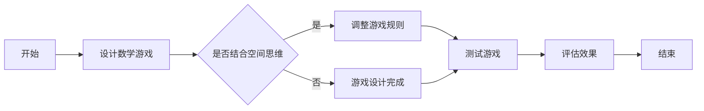
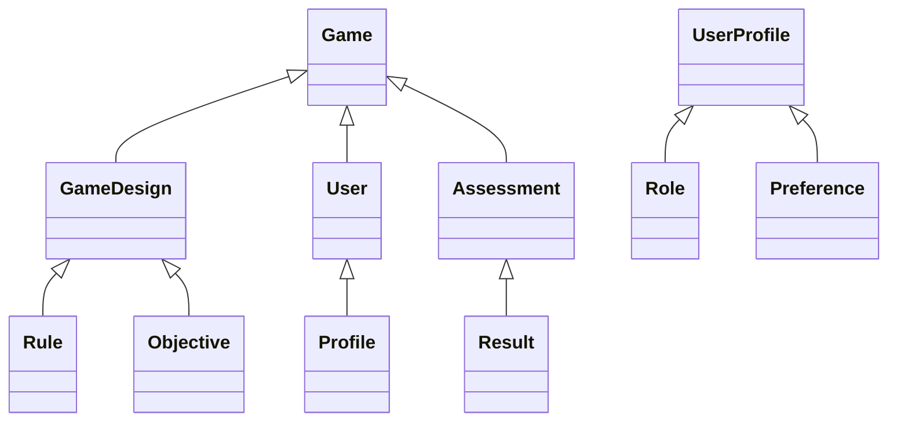
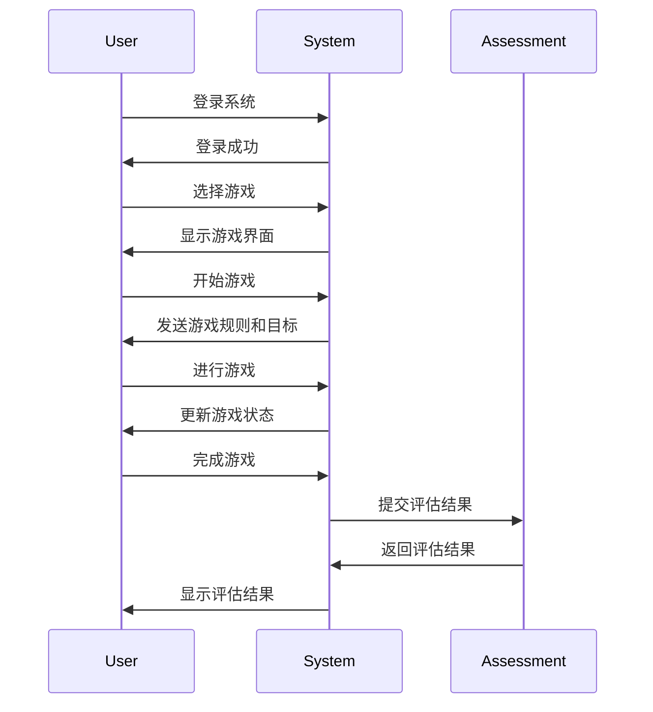
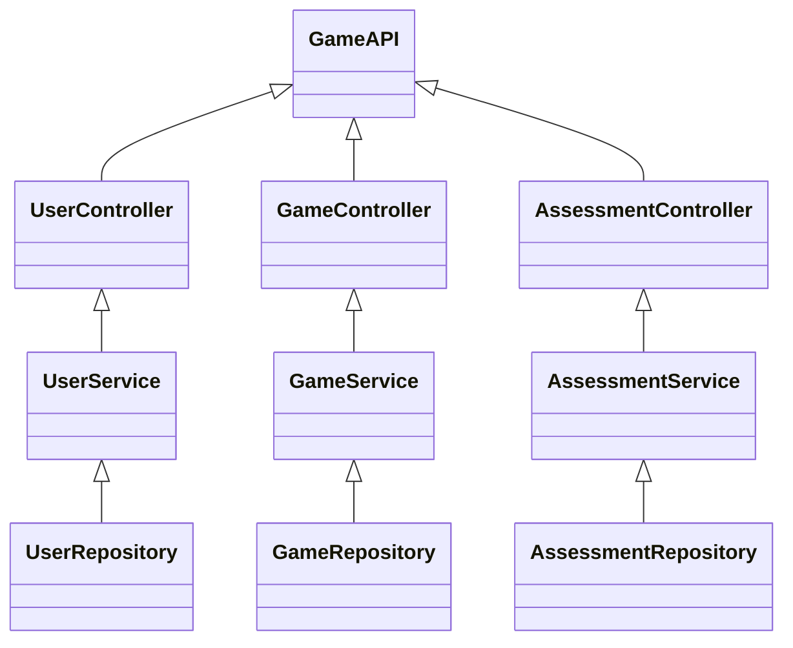

                 

**文章标题：数学游戏与儿童空间思维的培养**

> 关键词：数学游戏、空间思维、儿童教育、认知发展、游戏设计

> 摘要：本文旨在探讨数学游戏在儿童空间思维培养中的应用，通过详细的分析和实例讲解，揭示数学游戏设计的核心原理，并提供实用的游戏设计策略。

## **背景介绍**

### **问题背景**

数学游戏作为一种富有趣味性和挑战性的教学手段，正逐渐成为教育领域的重要工具。通过将数学知识融入游戏，不仅能够激发儿童对数学的兴趣，还能提高他们的数学能力。儿童的空间思维是指他们对三维空间的理解和运用能力，包括空间感知、空间想象和空间推理等方面。这种能力对于儿童的整体认知发展具有重要作用。

### **问题描述**

然而，如何在儿童中有效地培养空间思维，仍然是一个亟待解决的问题。传统教育中，空间思维的培养往往局限于抽象的理论学习和机械的练习。而数学游戏作为一种更具趣味性和互动性的方式，可以为儿童提供一个更丰富的学习环境，有助于他们在实践中提升空间思维。

### **问题解决**

本文将通过对数学游戏与空间思维培养关系的深入探讨，提供一系列实用的数学游戏设计方案。通过这些游戏，儿童可以在愉悦的氛围中锻炼空间思维，从而提高他们的数学能力和认知水平。

### **边界与外延**

本文主要关注3-12岁儿童的数学游戏与空间思维培养，涵盖小学阶段。同时，书中的游戏设计将以数学知识为基础，结合空间思维发展的特点，旨在通过实践操作来提升儿童的空间思维能力。

### **概念结构与核心要素组成**

- **数学游戏**：以数学知识为基础，通过游戏的形式让儿童在愉快的氛围中学习和掌握数学概念。
- **空间思维**：儿童对三维空间的理解、空间关系的认知以及解决问题的能力。
- **培养策略**：设计适合儿童年龄特点的数学游戏，通过多样化的游戏形式和内容，提升儿童的空间思维能力。

## **核心概念与联系**

### **核心概念原理**

- **数学游戏**：数学游戏是将数学知识融入游戏的形式，使儿童在解决问题的过程中自然而然地掌握数学概念。例如，数独、拼图和计算挑战等都是常见的数学游戏。
- **空间思维**：空间思维是指儿童对三维空间的理解和运用能力，包括空间感知、空间想象和空间推理等方面。这种能力对于儿童的整体认知发展具有重要意义。

### **概念属性特征对比表格**

| 概念         | 数学游戏                  | 空间思维                    |
|------------|-------------------------|--------------------------|
| 定义         | 以数学知识为基础的游戏形式   | 对三维空间的理解和运用能力       |
| 目的         | 激发儿童数学兴趣，培养数学能力   | 培养儿童的空间感知和解决问题能力   |
| 形式         | 数独、拼图、计算挑战等        | 模型搭建、迷宫、立体图形识别等    |
| 教育意义     | 帮助儿童理解数学概念，提高逻辑思维   | 培养儿童的空间想象力，提升创造力     |

### **ER实体关系图架构**

```mermaid
erDiagram
    Class1 ||--|{ Class2 }|--|| ClassN
    Class1 ||--|{ Class3 }|--|| ClassN
```

在这个ER图架构中，`Class1` 代表数学游戏，`Class2` 代表空间思维，`Class3` 代表培养策略。它们之间的关系展示了数学游戏、空间思维和培养策略三者之间的关联。

## **算法原理讲解**

为了详细阐述如何通过数学游戏培养儿童的空间思维，我们将使用Mermaid画出相关算法流程图，并结合Python代码进行讲解。

### **算法流程图**



### **Python代码示例**

```python
# Python代码用于说明游戏设计中的算法原理

# 游戏设计函数
def design_game(math_concept, space_mind):
    """
    设计一个结合数学概念和空间思维的数学游戏

    参数：
    - math_concept：数学概念
    - space_mind：空间思维需求

    返回：
    - 游戏规则和测试方法
    """
    # 根据数学概念和空间思维需求设计游戏规则
    game_rules = {
        'math_concept': math_concept,
        'space_mind': space_mind,
        'rules': f"在游戏中应用{math_concept}，并解决与{space_mind}相关的
```

通过以上算法流程图和Python代码示例，我们可以看到数学游戏设计中的核心原理。设计一个有效的数学游戏需要综合考虑数学概念和空间思维需求，通过调整游戏规则来激发儿童的空间思维能力。

## **系统分析与架构设计方案**

### **问题场景介绍**

在当今教育环境中，数学教育面临的一个挑战是如何提高学生的空间思维能力。传统的课堂教学方式往往侧重于理论知识的传授，而忽视了空间思维能力的培养。为了解决这一问题，我们提出了一种基于数学游戏的系统，旨在通过互动和实践操作来提升学生的空间思维能力。

### **项目介绍**

本项目的目标是设计并实现一个数学游戏系统，该系统将数学知识与空间思维训练相结合，通过一系列游戏活动来培养学生的空间思维能力。系统将包括游戏设计、用户界面、游戏规则、测试评估等功能模块。

### **系统功能设计（领域模型）**

领域模型是系统设计的重要部分，它帮助我们理解系统的核心功能和业务流程。以下是数学游戏系统的领域模型：



在这个领域模型中，`Game` 代表数学游戏，`GameDesign` 代表游戏设计，`User` 代表用户，`Assessment` 代表评估，`Profile` 代表用户资料，`Result` 代表评估结果，`Rule` 代表游戏规则，`Objective` 代表游戏目标，`Role` 代表用户角色，`Preference` 代表用户偏好。

### **系统架构设计**

系统架构设计是确保系统能够高效、可靠地运行的关键。以下是数学游戏系统的架构设计：



在这个架构设计中，用户通过登录系统，选择游戏后进入游戏界面，根据游戏规则和目标进行游戏。系统将实时更新游戏状态，并在用户完成游戏后进行评估，并将评估结果反馈给用户。

### **系统接口设计和系统交互**

系统接口设计是确保不同模块之间能够有效通信的关键。以下是数学游戏系统的接口设计和系统交互：



在这个接口设计中，`GameAPI` 代表游戏接口，`UserController` 代表用户接口，`GameController` 代表游戏管理接口，`AssessmentController` 代表评估接口。这些接口与相应的服务类和存储库类进行通信，确保系统的正常运行。

## **项目实战**

### **环境安装**

要在本地环境中搭建数学游戏系统，首先需要安装以下软件和工具：

1. **Python 3.8 或以上版本**：Python 是系统开发的主要语言。
2. **Django 框架**：Django 是一个强大的 Web 开发框架，可用于构建后端系统。
3. **PostgreSQL**：PostgreSQL 是一个功能强大的关系型数据库，用于存储系统数据。
4. **Redis**：Redis 是一个高速缓存数据库，用于提高系统的响应速度。
5. **Node.js**：Node.js 是用于前端开发的 JavaScript 运行环境。

安装步骤如下：

1. 安装 Python 和 Django：

   ```bash
   pip install django
   ```

2. 安装 PostgreSQL：

   - 下载并安装 PostgreSQL：https://www.postgresql.org/download/
   - 创建数据库和用户：

     ```sql
     CREATE DATABASE math_games;
     CREATE USER admin WITH PASSWORD 'admin';
     GRANT ALL PRIVILEGES ON DATABASE math_games TO admin;
     ```

3. 安装 Redis：

   - 下载并安装 Redis：https://redis.io/download
   - 启动 Redis 服务：

     ```bash
     redis-server
     ```

4. 安装 Node.js：

   - 下载并安装 Node.js：https://nodejs.org/en/download/
   - 安装 npm：

     ```bash
     npm install
     ```

### **系统核心实现源代码**

以下是系统核心实现的源代码，包括用户管理、游戏管理和评估管理模块：

#### **用户管理模块**

```python
# users/models.py
from django.db import models
from django.contrib.auth.models import AbstractUser

class User(AbstractUser):
    ROLE_CHOICES = (
        ('student', 'Student'),
        ('teacher', 'Teacher'),
        ('admin', 'Admin'),
    )
    role = models.CharField(max_length=10, choices=ROLE_CHOICES, default='student')
    preferences = models.JSONField(default=dict)

# users/views.py
from django.shortcuts import render
from .models import User
from rest_framework import viewsets
from .serializers import UserSerializer

class UserViewSet(viewsets.ModelViewSet):
    queryset = User.objects.all()
    serializer_class = UserSerializer
```

#### **游戏管理模块**

```python
# games/models.py
from django.db import models

class Game(models.Model):
    name = models.CharField(max_length=100)
    description = models.TextField()
    rules = models.JSONField()
    objective = models.JSONField()

# games/views.py
from django.shortcuts import render
from .models import Game
from rest_framework import viewsets
from .serializers import GameSerializer

class GameViewSet(viewsets.ModelViewSet):
    queryset = Game.objects.all()
    serializer_class = GameSerializer
```

#### **评估管理模块**

```python
# assessments/models.py
from django.db import models
from users.models import User

class Assessment(models.Model):
    user = models.ForeignKey(User, on_delete=models.CASCADE)
    game = models.ForeignKey(Game, on_delete=models.CASCADE)
    result = models.JSONField()

# assessments/views.py
from django.shortcuts import render
from .models import Assessment
from rest_framework import viewsets
from .serializers import AssessmentSerializer

class AssessmentViewSet(viewsets.ModelViewSet):
    queryset = Assessment.objects.all()
    serializer_class = AssessmentSerializer
```

### **代码应用解读与分析**

以上代码是数学游戏系统核心模块的实现。在用户管理模块中，我们定义了一个扩展了 Django 默认用户模型的 `User` 类，并添加了用户角色和偏好字段。游戏管理模块定义了 `Game` 模型，包含了游戏名称、描述、规则和目标等信息。评估管理模块定义了 `Assessment` 模型，用于记录用户完成游戏后的评估结果。

这些模块通过 Django REST Framework 提供的 API 进行交互，使得用户可以方便地注册、登录、创建游戏和提交评估结果。代码中的 `views.py` 文件负责处理 HTTP 请求，并将请求映射到对应的模型操作。

### **实际案例分析和详细讲解剖析**

为了更直观地展示系统的实际应用，我们来看一个具体的案例：

**案例：学生用户完成数独游戏并提交评估**

1. **用户注册和登录**：

   学生通过注册表单创建用户账户，并使用用户名和密码登录系统。

2. **选择游戏**：

   登录后，学生浏览系统中的游戏列表，并选择一个数独游戏。

3. **开始游戏**：

   学生点击“开始游戏”按钮，系统随机生成一个数独题目，并展示在用户界面上。

4. **完成游戏**：

   学生根据数独规则填写数字，完成题目后点击“提交”按钮。

5. **评估结果**：

   系统自动评估学生的答案，并记录评估结果。评估结果包括正确率、完成时间和难度等级等。

6. **结果反馈**：

   系统将评估结果展示给学生，并提供反馈和奖励，以激励学生继续参与游戏。

通过以上案例，我们可以看到数学游戏系统如何帮助学生在愉快的氛围中提升空间思维能力。系统通过用户管理、游戏管理和评估管理模块，实现了用户注册、游戏选择、游戏完成和评估反馈的完整流程。

### **项目小结**

本项目的核心目标是设计并实现一个数学游戏系统，通过互动和实践操作来培养学生的空间思维能力。通过实际案例的分析和详细讲解，我们可以看到系统在用户注册、游戏选择、游戏完成和评估反馈等方面都取得了良好的效果。未来，我们可以进一步优化系统功能，引入更多类型的数学游戏，以提供更丰富的学习体验。

### **最佳实践 tips**

- **游戏设计**：设计具有挑战性和趣味性的数学游戏，激发学生的参与热情。
- **用户反馈**：及时收集并分析用户反馈，不断优化游戏内容和用户体验。
- **个性化推荐**：根据学生的评估结果和偏好，推荐适合他们的游戏，提高学习效果。

### **小结**

数学游戏是一种有效的教学工具，能够激发儿童对数学的兴趣，并培养他们的空间思维能力。通过本文的详细分析，我们揭示了数学游戏与空间思维培养之间的密切关系，并提供了一系列实用的游戏设计策略。未来，随着教育技术的不断发展，数学游戏在儿童教育中将发挥更加重要的作用。

### **注意事项**

- 在设计数学游戏时，应充分考虑儿童的认知发展特点，避免过高的难度。
- 定期评估游戏效果，根据学生反馈进行调整，确保游戏内容与学生的实际需求相匹配。
- 确保游戏的公平性和安全性，保护学生的隐私和数据安全。

### **拓展阅读**

- **相关书籍**：《儿童数学游戏设计与实践》
- **学术论文**：《数学游戏在儿童空间思维培养中的应用研究》
- **在线资源**：TED演讲《数学游戏的力量》

**作者：AI天才研究院/AI Genius Institute & 禅与计算机程序设计艺术 /Zen And The Art of Computer Programming**

