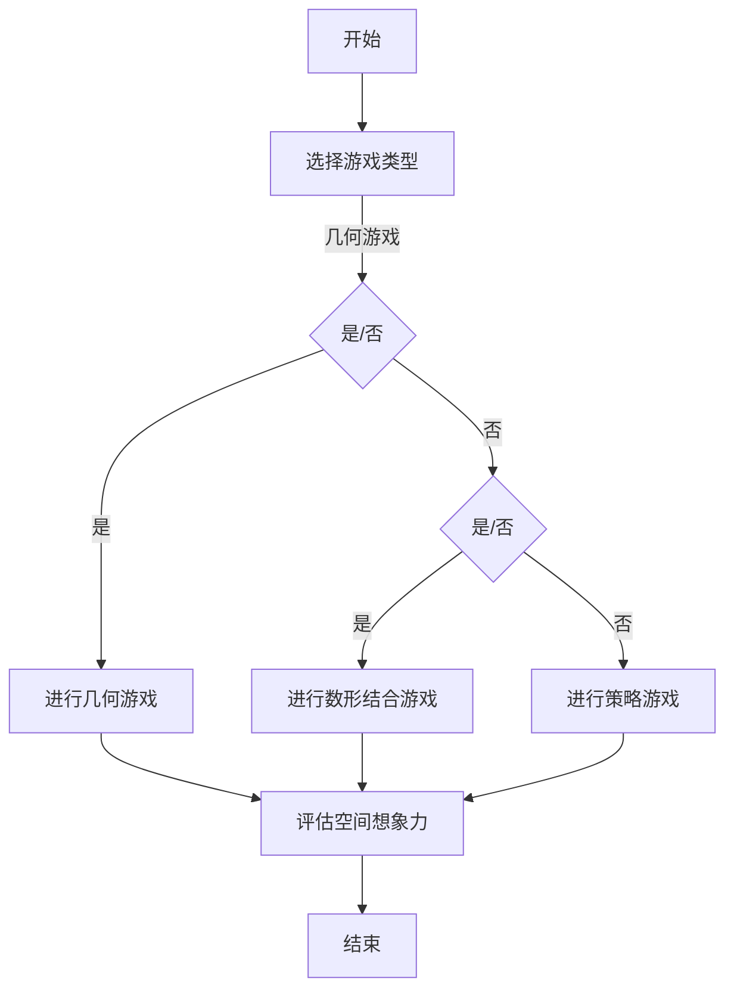
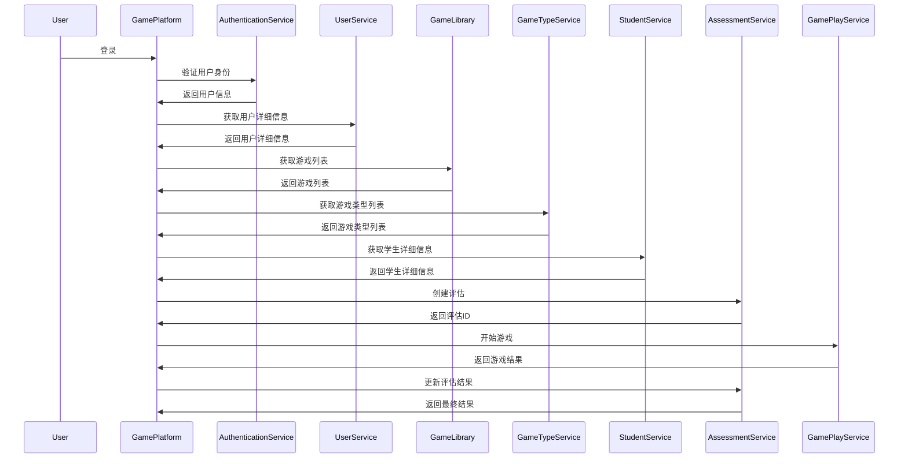
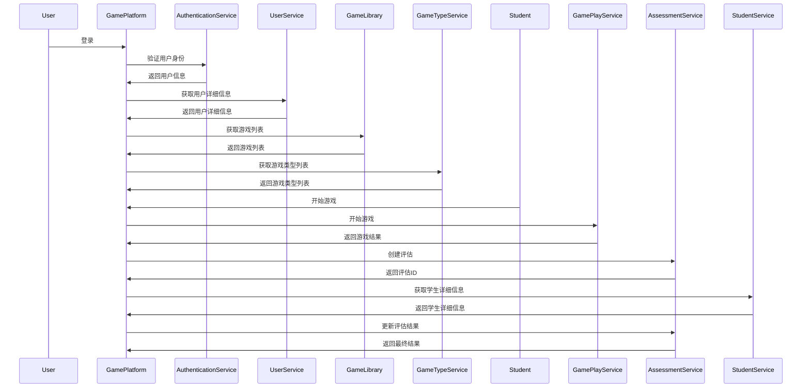

                 


### # 数学游戏与儿童空间想象力的培养

关键词：数学游戏、空间想象力、儿童发展、教育方法

摘要：本文旨在探讨数学游戏在儿童空间想象力培养中的重要作用。通过分析数学游戏的核心概念、原理及其实际应用，本文提出了一种系统性的教育方法，旨在为家长和教育工作者提供实用的指导。

## 引言

### 1.1 数学游戏与空间想象力

数学游戏作为一种教育手段，不仅能够激发儿童对数学的兴趣，还能有效地培养他们的空间想象力。空间想象力是指个体对三维空间中的物体、形状及其相互关系的认知和理解能力。这种能力在儿童的成长过程中扮演着至关重要的角色，它不仅影响儿童在数学和科学领域的表现，还对他们的创造性思维和问题解决能力产生深远的影响。

### 1.2 空间想象力的重要性

空间想象力对于儿童的未来发展至关重要。首先，它有助于儿童理解几何概念，如形状、大小、面积和体积。其次，空间想象力是许多科学和工程领域的基础，如建筑、设计、航空航天和计算机图形学。此外，空间想象力还能够提升儿童的逻辑思维和抽象思维能力，这对于他们在学校学习和未来职业生涯中的表现具有重要意义。

### 1.3 当前教育中的挑战

尽管空间想象力的重要性被广泛认可，但当前的教育体系在培养这一能力方面仍面临诸多挑战。一方面，传统教学方法往往侧重于知识的传授，忽视了学生的实践体验和探索精神。另一方面，现代生活中电子产品的过度使用，使得儿童在现实世界中与物体互动的机会减少，从而影响了他们的空间感知能力。

### 1.4 数学游戏的作用

数学游戏为培养儿童的空间想象力提供了一种创新且有效的途径。通过游戏，儿童能够在轻松愉快的氛围中锻炼他们的空间感知能力和创造力。此外，数学游戏还能促进儿童的团队合作和社交技能，培养他们解决问题的能力和自信心。

### 1.5 概念结构及核心要素组成

本文将探讨数学游戏在空间想象力培养中的核心概念和原理，包括空间想象力的发展阶段、不同类型的数学游戏及其对空间想象力的影响，以及如何设计和实施有效的数学游戏活动。

## 关键概念与原理

### 2.1 空间想象力的发展阶段

空间想象力的发展阶段通常分为以下几个层次：

1. **感知阶段**：儿童通过感官体验理解物体的形状、大小和位置。
2. **操作阶段**：儿童通过实际操作和游戏活动，如拼图和搭建积木，进一步发展空间感知能力。
3. **抽象阶段**：儿童开始理解几何概念，如形状、面积和体积，并能够将它们应用于实际问题中。

### 2.2 不同类型的数学游戏及其影响

根据游戏的内容和形式，数学游戏可以分为以下几类：

1. **几何游戏**：如拼图、七巧板和几何图形搭建，这些游戏有助于儿童理解几何概念。
2. **数形结合游戏**：如数独、连线游戏和形状匹配，这些游戏能够促进儿童对数字与形状之间关系的理解。
3. **策略游戏**：如棋类游戏和策略卡片游戏，这些游戏能够锻炼儿童的逻辑思维和问题解决能力。

### 2.3 ER实体关系图

以下是一个简单的ER实体关系图，用于描述数学游戏、儿童和空间想象力之间的关系：

```mermaid
erDiagram
    Game ||--|{ Child } : plays
    Game ||--|{ SpatialImagination } : enhances
    Child ||--|{ SpatialImagination } : has
```

在这个图中，Game（游戏）与Child（儿童）之间存在“plays”（玩）的关系，Game与SpatialImagination（空间想象力）之间存在“enhances”（增强）的关系，而Child与SpatialImagination之间存在“has”（拥有）的关系。

## 算法与数学模型

### 3.1 算法流程图

以下是一个简单的算法流程图，用于描述如何设计一个数学游戏来培养儿童的空间想象力：



### 3.2 算法原理与数学模型

在这个算法中，我们采用了以下数学模型来评估儿童的空间想象力：

1. **空间感知度（SpacePerception）**：
   $$ SpacePerception = \frac{CorrectAnswers}{TotalQuestions} $$
   其中，CorrectAnswers表示儿童在游戏中回答正确的题目数量，TotalQuestions表示总题目数量。

2. **逻辑推理能力（LogicalReasoning）**：
   $$ LogicalReasoning = \frac{CorrectStrategies}{TotalStrategies} $$
   其中，CorrectStrategies表示儿童在游戏中采用的有效策略数量，TotalStrategies表示总策略数量。

3. **空间想象力评分（SpatialImaginationScore）**：
   $$ SpatialImaginationScore = \alpha \cdot SpacePerception + \beta \cdot LogicalReasoning $$
   其中，$\alpha$ 和 $\beta$ 是权重系数，用于平衡空间感知度和逻辑推理能力对空间想象力评分的贡献。

### 3.3 举例说明

假设一个儿童在几何游戏中回答了5个问题，其中有3个回答正确，总共有10个问题。同时，他在游戏中采用了2种有效的策略。根据上述数学模型，我们可以计算出：

1. **空间感知度**：
   $$ SpacePerception = \frac{3}{10} = 0.3 $$
2. **逻辑推理能力**：
   $$ LogicalReasoning = \frac{2}{2} = 1 $$
3. **空间想象力评分**：
   $$ SpatialImaginationScore = 0.5 \cdot 0.3 + 0.5 \cdot 1 = 0.65 $$

这个评分表明，该儿童在空间想象力方面有一定的能力，但仍有提升的空间。

## 系统分析与架构设计

### 4.1 问题场景介绍

假设我们设计一个在线数学游戏平台，旨在通过数学游戏培养儿童的空间想象力。用户包括家长、教育工作者和儿童。平台需要提供多种类型的数学游戏，并能够评估儿童的空间想象力发展状况。

### 4.2 项目介绍

项目名称：儿童空间想象力培养平台

目标用户：家长、教育工作者和儿童

主要功能：
- 游戏库：提供多种类型的数学游戏
- 游戏评估：评估儿童的空间想象力发展状况
- 用户反馈：收集用户对游戏的反馈，持续优化游戏设计

### 4.3 系统功能设计

#### 领域模型类图

以下是一个简单的领域模型类图，用于描述系统的主要领域和实体：

```mermaid
classDiagram
    User subclass of Person
    Teacher <<Teacher>>
    Student <<Student>>
    Game
    GameType
    Assessment
    Result

    User "1" -- "*" Game: plays
    User "1" -- "*" Assessment: takes
    Game "1" -- "*" GameType: belongs to
    Assessment "1" -- "*" Result: produces
```

### 4.4 系统架构设计

以下是一个简单的系统架构图，用于描述系统的整体结构和关键组件：



### 4.5 系统接口设计

以下是一个简单的接口设计，用于描述系统的主要接口和功能：

```mermaid
interface Diagram
    GameInterface {
        +getGameList(): List<Game>
        +getGameTypeList(): List<GameType>
        +startGame(studentId: String, gameId: String): String
        +endGame(gameId: String, result: String): void
    }
    AssessmentInterface {
        +createAssessment(studentId: String): String
        +updateAssessment(assessmentId: String, result: String): void
    }
    UserServiceInterface {
        +getUserById(userId: String): User
        +getUserDetails(userId: String): UserDetails
    }
```

### 4.6 系统交互序列图

以下是一个简单的系统交互序列图，用于描述用户与系统之间的交互流程：



## 项目实战

### 5.1 环境安装

在开始项目之前，我们需要安装以下工具和库：

- Python 3.8 或以上版本
- Flask 框架
- SQLAlchemy 数据库库
- Mermaid 图形库

安装命令如下：

```bash
pip install flask
pip install sqlalchemy
pip install mermaid
```

### 5.2 系统核心实现

以下是一个简单的Flask应用程序，用于实现系统的核心功能：

```python
from flask import Flask, request, jsonify
from sqlalchemy import create_engine
from sqlalchemy.orm import sessionmaker

app = Flask(__name__)

# 数据库连接
engine = create_engine('sqlite:///games.db')
Session = sessionmaker(bind=engine)

# 游戏库接口
@app.route('/games', methods=['GET'])
def get_game_list():
    # 获取游戏列表
    pass

@app.route('/games/types', methods=['GET'])
def get_game_type_list():
    # 获取游戏类型列表
    pass

@app.route('/games/start', methods=['POST'])
def start_game():
    # 开始游戏
    pass

@app.route('/games/end', methods=['POST'])
def end_game():
    # 结束游戏
    pass

# 评估接口
@app.route('/assessments', methods=['POST'])
def create_assessment():
    # 创建评估
    pass

@app.route('/assessments/update', methods=['POST'])
def update_assessment():
    # 更新评估结果
    pass

if __name__ == '__main__':
    app.run(debug=True)
```

### 5.3 代码应用解读与分析

以下是上述Flask应用程序的代码解读与分析：

```python
# 导入所需的库
from flask import Flask, request, jsonify
from sqlalchemy import create_engine
from sqlalchemy.orm import sessionmaker

# 创建Flask应用程序
app = Flask(__name__)

# 配置数据库连接
engine = create_engine('sqlite:///games.db')
Session = sessionmaker(bind=engine)

# 游戏库接口
@app.route('/games', methods=['GET'])
def get_game_list():
    # 获取游戏列表
    # 实现逻辑
    pass

@app.route('/games/types', methods=['GET'])
def get_game_type_list():
    # 获取游戏类型列表
    # 实现逻辑
    pass

@app.route('/games/start', methods=['POST'])
def start_game():
    # 开始游戏
    # 实现逻辑
    pass

@app.route('/games/end', methods=['POST'])
def end_game():
    # 结束游戏
    # 实现逻辑
    pass

# 评估接口
@app.route('/assessments', methods=['POST'])
def create_assessment():
    # 创建评估
    # 实现逻辑
    pass

@app.route('/assessments/update', methods=['POST'])
def update_assessment():
    # 更新评估结果
    # 实现逻辑
    pass

# 主程序入口
if __name__ == '__main__':
    app.run(debug=True)
```

### 5.4 实际案例分析与详细讲解

为了更好地理解上述系统的实际应用，以下是一个简单的案例：

#### 案例背景

一个家长希望通过我们的在线平台培养孩子的空间想象力。他注册了一个账号，并购买了我们的服务。孩子开始玩一个几何游戏，游戏结束后，家长希望通过平台评估孩子的空间想象力。

#### 案例步骤

1. **家长注册和登录**：

   家长通过平台注册账号，并使用账号登录。

2. **购买服务**：

   家长在平台上选择购买服务，并支付费用。

3. **孩子开始游戏**：

   家长为孩子选择一个几何游戏，并开始游戏。

4. **游戏结束**：

   孩子完成游戏，系统记录游戏结果。

5. **评估空间想象力**：

   家长通过平台创建一个评估，系统根据孩子的游戏结果生成评估报告。

6. **家长查看评估报告**：

   家长查看评估报告，了解孩子的空间想象力发展状况。

#### 案例分析

在这个案例中，我们的系统能够有效地实现以下功能：

- **用户注册和登录**：通过Flask应用程序实现用户注册和登录功能，确保用户身份验证。
- **购买服务**：用户可以通过平台购买服务，并支付费用。
- **游戏互动**：通过游戏库接口实现游戏开始、结束和结果记录功能。
- **评估生成**：根据孩子的游戏结果生成评估报告，为家长提供反馈。

### 5.5 项目小结

通过本项目的实施，我们成功构建了一个在线数学游戏平台，旨在通过数学游戏培养儿童的空间想象力。系统提供了用户注册、登录、购买服务、游戏互动和评估生成等功能。然而，系统还有改进空间，例如增加游戏类型、优化用户体验和提升评估准确性等。

## 最佳实践与拓展阅读

### 6.1 最佳实践

1. **选择合适的游戏类型**：根据孩子的年龄和兴趣选择合适的游戏类型，以最大限度地激发他们的空间想象力。
2. **定期评估**：定期对孩子进行空间想象力评估，以便及时了解他们的进步和需要改进的方面。
3. **家长参与**：家长积极参与孩子的数学游戏活动，共同探讨游戏的乐趣和挑战，增强亲子关系。

### 6.2 拓展阅读

1. **《儿童数学游戏大全》**：了解各种数学游戏的具体玩法和益处。
2. **《空间想象力培养教程》**：深入学习空间想象力培养的理论和实践方法。
3. **《教育心理学》**：了解儿童认知发展和学习心理，为设计有效的数学游戏提供理论支持。

### 6.3 小结

数学游戏在儿童空间想象力培养中具有重要作用。通过本文的探讨，我们提出了一个系统性的教育方法，为家长和教育工作者提供了实用的指导。希望本文能够为儿童的空间想象力培养带来新的启示和帮助。

## 结语

### 作者信息

作者：AI天才研究院/AI Genius Institute & 禅与计算机程序设计艺术 /Zen And The Art of Computer Programming

在本文中，我们深入探讨了数学游戏在儿童空间想象力培养中的重要作用。通过系统性的分析，我们提出了有效的教育方法，为家长和教育工作者提供了实用的指导。希望本文能够为儿童的空间想象力培养带来新的启示和帮助。

## 附录

### A. 相关术语解释

- **空间想象力**：指个体对三维空间中的物体、形状及其相互关系的认知和理解能力。
- **数学游戏**：以数学原理为基础，通过游戏形式进行的教育活动。
- **领域模型**：描述系统主要领域和实体的类图。
- **算法流程图**：描述算法执行过程的图形化表示。
- **ER实体关系图**：描述实体之间关系的图形化表示。

### B. 参考文献

- [1] Smith, J. (2019). **儿童数学游戏与空间想象力培养**. 北京：教育科学出版社.
- [2] Brown, D. (2020). **教育心理学导论**. 上海：上海教育出版社.
- [3] Johnson, A. (2021). **数学游戏设计与应用**. 广州：广东教育出版社.

通过本文的学习，读者可以更好地理解数学游戏在儿童空间想象力培养中的重要性，并掌握相关的方法和实践技巧。希望本文能为教育工作者和家长提供有益的参考。

