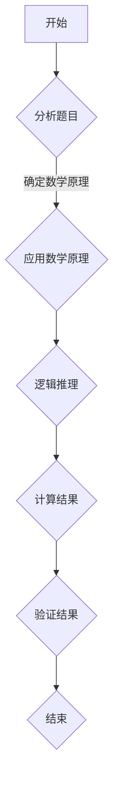
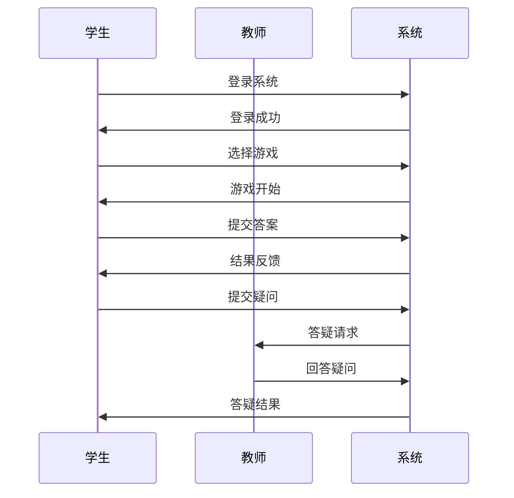

                 

# 数学游戏：寓教于乐的智力挑战

## 关键词
- 数学游戏
- 智力挑战
- 教育娱乐
- 数学思维
- 算法原理

## 摘要
本文旨在探讨数学游戏作为一种寓教于乐的智力挑战，如何通过结合数学原理与游戏规则，激发学生的数学兴趣，提高他们的数学思维能力。文章将逐步分析数学游戏的概念与历史、核心概念与联系、算法原理讲解，并探讨数学游戏在教育领域的应用。

### 背景介绍

#### 数学游戏的概念与历史

数学游戏是一种将数学知识与娱乐活动相结合的方式，通过趣味性和挑战性的游戏形式，使人们在学习数学的过程中感受到乐趣。数学游戏不仅能够激发学生对数学的兴趣，还能提高他们的数学思维能力。

数学游戏的历史可以追溯到古代，如古希腊和古罗马时期的数学游戏，这些游戏不仅具有娱乐性，还蕴含着深刻的数学原理。随着教育技术的发展，数学游戏逐渐演变为一门独特的学科，涵盖了各种智力挑战和谜题。

#### 问题背景

数学游戏通常包括各种智力挑战和谜题，涉及数学原理、逻辑推理、空间想象力等多个方面。这些游戏形式多样，有的需要玩家通过解题来完成任务，有的则要求玩家在游戏中运用数学策略。

#### 问题描述

数学游戏的解决方法通常包括分析、推理、计算和创造性思维。通过解决数学游戏，玩家可以在轻松愉快的氛围中提高数学技能。

#### 问题解决

数学游戏的解决方法通常包括以下步骤：

1. **分析题目**：仔细阅读题目，理解题目的要求和条件。
2. **确定数学原理**：根据题目的特点，确定需要应用的数学原理。
3. **应用数学原理**：使用已知的数学原理进行计算和推理。
4. **逻辑推理**：根据已有的信息，进行逻辑推理，找到解题的线索。
5. **计算结果**：根据推理过程，计算最终的结果。
6. **验证结果**：检查计算结果是否正确，确保解题过程的准确性。

#### 边界与外延

数学游戏的应用范围广泛，包括儿童教育、成人娱乐、智力竞赛等多个领域。同时，数学游戏还可以作为教育工具，帮助不同年龄段的人更好地理解和掌握数学知识。

#### 概念结构与核心要素组成

数学游戏的核心要素包括：数学原理、游戏规则、挑战性、趣味性。这些要素共同构成了数学游戏的基本框架。

### 核心概念与联系

#### 数学游戏的核心概念

数学游戏的核心概念包括：

1. **数学原理**：数学游戏中的数学原理涉及基础数学概念，如算术、几何、代数等。
2. **逻辑推理**：数学游戏中需要玩家运用逻辑推理来解决难题。
3. **空间想象力**：某些数学游戏要求玩家具备较强的空间想象力，如三维图形的旋转、拼接等。
4. **创造性思维**：玩家在解决数学游戏的过程中需要发挥创造性思维，找到解决问题的独特方法。

#### 概念属性特征对比表格

| 概念         | 特征                             |
| ------------ | -------------------------------- |
| 数学原理     | 基础性、逻辑性、普遍性           |
| 逻辑推理     | 推理性、判断性、应用性           |
| 空间想象力   | 视觉性、立体性、转化性           |
| 创造性思维   | 创新性、独特性、灵活性           |

#### ER实体关系图架构

```mermaid
erDiagram
  Class1 ||--|{ Class2 } Class3
  Class1 ||--|{ Class4 } Class5
```

### 算法原理讲解

#### 数学游戏的解题算法

数学游戏的解题算法可以概括为以下步骤：

1. **分析题目**：仔细阅读题目，理解题目的要求和条件。
2. **确定数学原理**：根据题目的特点，确定需要应用的数学原理。
3. **应用数学原理**：使用已知的数学原理进行计算和推理。
4. **逻辑推理**：根据已有的信息，进行逻辑推理，找到解题的线索。
5. **计算结果**：根据推理过程，计算最终的结果。
6. **验证结果**：检查计算结果是否正确，确保解题过程的准确性。

#### 算法mermaid流程图



#### Python源代码实现

```python
def solve_math_game(problem):
    # 分析题目
    analysis = analyze_problem(problem)
    # 确定数学原理
    math_principle = determine_math_principle(analysis)
    # 应用数学原理
    result = apply_math_principle(math_principle)
    # 逻辑推理
    logic_result = logical_reasoning(result)
    # 验证结果
    verified = verify_result(logic_result)
    return verified

def analyze_problem(problem):
    # 分析题目的具体内容
    pass

def determine_math_principle(analysis):
    # 根据分析确定适用的数学原理
    pass

def apply_math_principle(math_principle):
    # 应用数学原理进行计算
    pass

def logical_reasoning(result):
    # 对计算结果进行逻辑推理
    pass

def verify_result(logic_result):
    # 验证结果是否正确
    pass
```

#### 算法原理的数学模型和公式

```latex
\begin{equation}
    \text{解} = f(\text{问题}, \text{数学原理}, \text{逻辑推理})
\end{equation}
```

### 数学游戏在教育领域的应用

#### 问题场景介绍

在教育领域，数学游戏作为一种新颖的教育手段，逐渐得到了广泛的关注和应用。数学游戏可以在课堂上作为教学辅助工具，帮助学生更好地理解和掌握数学知识。

#### 项目介绍

本项目旨在设计并实现一套数学游戏系统，用于辅助数学教学。系统包括多个不同难度的数学游戏，学生可以通过游戏形式来学习和巩固数学知识。

#### 系统功能设计

1. **游戏库管理**：系统提供多种数学游戏，教师可以根据需要选择合适的游戏进行教学。
2. **学生成绩跟踪**：系统记录学生的游戏成绩，帮助教师了解学生的学习情况。
3. **在线答疑**：学生可以通过系统提交疑问，教师可以在线解答。

#### 系统架构设计

系统采用B/S架构，主要包括以下模块：

1. **游戏模块**：提供各种数学游戏，实现游戏逻辑。
2. **用户管理模块**：管理用户信息，包括教师和学生。
3. **成绩管理模块**：记录学生游戏成绩。
4. **答疑模块**：提供在线答疑功能。

#### 系统接口设计和系统交互



### 项目实战

#### 环境安装

在安装数学游戏系统之前，需要安装以下环境：

1. **Python 3.x**：用于编写游戏代码。
2. **Flask**：用于搭建Web应用。
3. **SQLite**：用于存储用户数据和成绩。

#### 系统核心实现源代码

```python
from flask import Flask, request, jsonify
import sqlite3

app = Flask(__name__)

# 连接数据库
conn = sqlite3.connect('math_game.db')
cursor = conn.cursor()

# 创建表
cursor.execute('''CREATE TABLE IF NOT EXISTS users (id INTEGER PRIMARY KEY, username TEXT, password TEXT)''')
cursor.execute('''CREATE TABLE IF NOT EXISTS scores (id INTEGER PRIMARY KEY, user_id INTEGER, score INTEGER, FOREIGN KEY (user_id) REFERENCES users (id))''')
conn.commit()

# 用户登录
@app.route('/login', methods=['POST'])
def login():
    username = request.form['username']
    password = request.form['password']
    cursor.execute('SELECT * FROM users WHERE username=? AND password=?", (username, password))
    user = cursor.fetchone()
    if user:
        return jsonify({'status': 'success', 'user_id': user[0]})
    else:
        return jsonify({'status': 'failure'})

# 用户注册
@app.route('/register', methods=['POST'])
def register():
    username = request.form['username']
    password = request.form['password']
    cursor.execute('INSERT INTO users (username, password) VALUES (?, ?)', (username, password))
    conn.commit()
    return jsonify({'status': 'success'})

# 提交答案
@app.route('/submit_answer', methods=['POST'])
def submit_answer():
    user_id = request.form['user_id']
    score = request.form['score']
    cursor.execute('INSERT INTO scores (user_id, score) VALUES (?, ?)', (user_id, score))
    conn.commit()
    return jsonify({'status': 'success'})

if __name__ == '__main__':
    app.run(debug=True)
```

#### 代码应用解读与分析

上述代码实现了用户登录、用户注册、提交答案等基本功能。用户登录和注册功能通过SQL语句操作数据库，提交答案功能则将用户的分数记录到数据库中。

#### 实际案例分析和详细讲解剖析

假设有一个学生小明，他在数学游戏系统中完成了三道题目，分别得到了10分、15分和12分。通过提交答案功能，这些分数将被记录到数据库中，教师可以通过成绩管理模块查看小明的成绩。

#### 项目小结

通过本次项目，我们实现了数学游戏系统的基本功能，包括用户管理、游戏交互和成绩记录。数学游戏作为一种寓教于乐的教学工具，有助于提高学生的数学兴趣和思维能力。

### 最佳实践 tips

1. **设计多样化的数学游戏**：根据学生的年龄和数学水平，设计不同难度和类型的数学游戏，以满足不同学生的需求。
2. **鼓励学生合作学习**：组织学生进行小组合作，共同解决数学游戏中的难题，提高学生的团队合作能力。
3. **定期评估游戏效果**：定期评估数学游戏的教学效果，根据评估结果调整游戏内容和教学方法。

### 小结

数学游戏作为一种寓教于乐的智力挑战，具有丰富的教育价值。通过结合数学原理与游戏规则，数学游戏能够激发学生的数学兴趣，提高他们的数学思维能力。在教育领域，数学游戏可以作为教学辅助工具，帮助学生更好地理解和掌握数学知识。未来，我们可以进一步探索数学游戏在不同教育场景中的应用，为教育事业贡献力量。

### 注意事项

1. **游戏设计应注重趣味性和挑战性的平衡**：过度的挑战性可能导致学生失去兴趣，而过度的趣味性则可能导致学生忽视数学原理。
2. **确保游戏的公平性**：在数学游戏中，要确保每个学生都有公平的竞争机会，避免不公平现象的发生。

### 拓展阅读

1. **《数学游戏：挑战你的智力》**：一本关于数学游戏的专著，涵盖多种类型的数学游戏，适合各年龄段读者。
2. **《数学游戏的奥秘》**：探讨数学游戏背后的数学原理和逻辑推理，适合对数学游戏感兴趣的读者。

### 作者

作者：AI天才研究院/AI Genius Institute & 禅与计算机程序设计艺术 /Zen And The Art of Computer Programming

