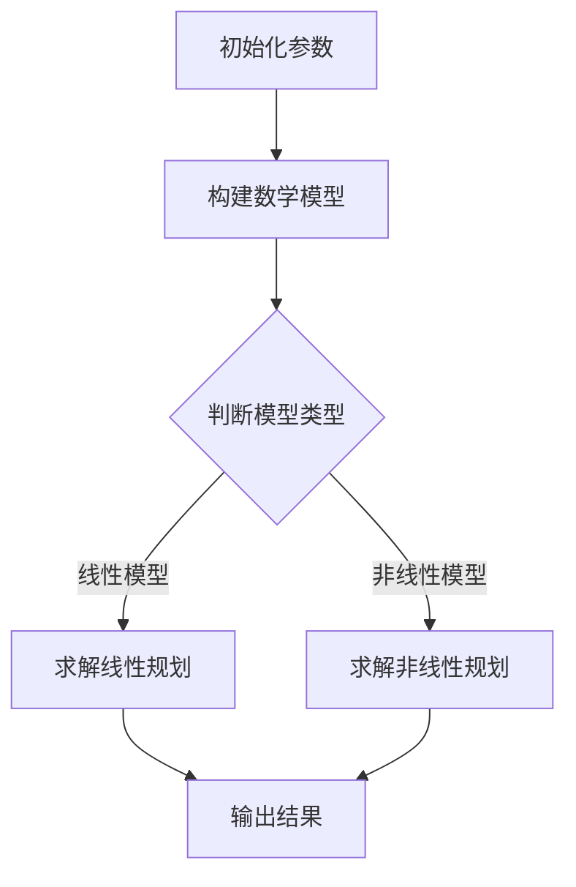
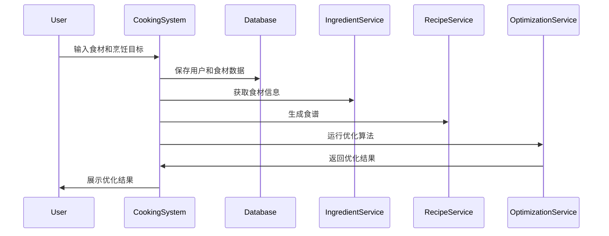

                 

## 《数学烹饪：食谱配比的数学优化》

### 关键词：数学优化、食谱配比、算法、人工智能、烹饪

在人类文明的悠久历史中，烹饪一直扮演着不可或缺的角色。从简单的采集到复杂的烹饪技艺，食物不仅是营养的来源，更是文化、情感和社交的载体。然而，随着科技的进步，传统的烹饪技艺开始与数学优化这一现代科技相结合，诞生了“数学烹饪”这一新的领域。本文将探讨如何通过数学优化技术来优化食谱配比，从而提升烹饪效果。

### 摘要

本文旨在介绍数学优化在烹饪中的应用，特别是如何通过数学模型和算法来优化食谱配比。文章首先介绍了烹饪中配比的重要性，以及数学优化在其中的作用。接着，文章详细讲解了数学优化技术的基本原理，包括常见的优化算法和数学模型。随后，文章通过一个实际案例，展示了如何将数学优化应用于食谱配比，并分析了其效果。最后，文章提出了数学烹饪的未来前景，并给出了一些最佳实践建议。

## 第一部分：背景介绍

### 1.1 问题背景

在烹饪中，配比是指食材和调料的用量比例。一个合适的配比不仅能够提升食物的口感和营养价值，还能确保烹饪过程的顺利进行。然而，传统的配比方法通常依赖于经验，缺乏科学依据。随着烹饪技术的不断发展，人们开始意识到，通过数学优化技术，可以更精确地控制食材和调料的用量，从而提升烹饪效果。

### 1.2 问题描述

传统的食谱配比方法存在以下问题：

1. **经验依赖**：配比主要依赖于厨师的经验，缺乏科学依据。
2. **精度不足**：经验配比往往无法精确控制食材和调料的用量，导致食物口感和营养价值不稳定。
3. **适应性差**：面对不同的食材和烹饪环境，传统的配比方法往往难以适应。

为了解决这些问题，我们需要引入数学优化技术，通过构建数学模型，利用优化算法，精确计算食材和调料的用量比例。

### 1.3 问题解决

数学优化技术在烹饪中的应用主要包括以下几个方面：

1. **构建数学模型**：根据烹饪目标和食材属性，建立相应的数学模型。
2. **选择优化算法**：根据模型特点，选择合适的优化算法。
3. **实现算法**：将优化算法转化为可执行的程序代码。
4. **结果分析**：对优化结果进行分析，调整模型和算法，以达到最佳效果。

### 1.4 边界与外延

数学烹饪的研究范围包括以下几个方面：

1. **食材配比优化**：研究如何通过数学优化技术，精确控制食材的用量比例。
2. **调料配比优化**：研究如何通过数学优化技术，优化调料的用量和组合。
3. **烹饪过程优化**：研究如何通过数学优化技术，优化烹饪过程，提高烹饪效率。
4. **多目标优化**：研究如何在多个目标之间进行平衡，实现综合优化。

数学烹饪与其他领域的关系包括：

1. **食品科学与工程**：与食品的制备、加工和包装等技术密切相关。
2. **营养学**：研究如何通过优化食谱配比，提高食品的营养价值。
3. **计算机科学**：利用计算机技术实现数学模型的构建和优化算法的实现。
4. **人工智能**：利用人工智能技术，提高数学烹饪的自动化和智能化水平。

### 1.5 概念结构与核心要素组成

数学烹饪的基本概念包括：

1. **数学模型**：用于描述烹饪目标和食材属性的数学结构。
2. **优化算法**：用于解决数学模型中优化问题的算法。
3. **食谱配比**：食材和调料的用量比例。

核心要素及其作用包括：

1. **食材属性**：影响食谱配比的关键因素，包括营养成分、口感等。
2. **优化目标**：烹饪所要达到的目标，如提高营养价值、改善口感等。
3. **优化算法**：用于求解数学模型，实现食谱配比优化的核心工具。

概念之间的关系：

- 数学模型描述了烹饪目标和食材属性之间的关系。
- 优化算法通过数学模型，寻找最佳的食谱配比。
- 食谱配比是实现烹饪目标的具体方案。

## 第二部分：核心概念与联系

### 2.1 核心概念原理

数学烹饪的核心概念包括数学模型、优化算法和食谱配比。这些概念相互联系，共同构成了数学烹饪的理论基础。

#### 2.1.1 数学模型

数学模型是描述烹饪目标和食材属性的数学结构。它通常包括以下要素：

- **输入**：食材的属性，如营养成分、口感等。
- **输出**：烹饪目标，如营养价值、口感等。
- **约束条件**：食材用量、烹饪时间等。

数学模型可以采用线性规划、非线性规划、整数规划等多种形式。

#### 2.1.2 优化算法

优化算法是用于求解数学模型，实现食谱配比优化的算法。常见的优化算法包括：

- **线性规划**：适用于线性数学模型。
- **非线性规划**：适用于非线性数学模型。
- **整数规划**：适用于涉及整数决策变量的数学模型。

优化算法的目标是找到一组食材和调料的用量比例，使得烹饪目标最大化或最小化，同时满足约束条件。

#### 2.1.3 食谱配比

食谱配比是指食材和调料的用量比例。它是根据数学模型的优化结果，实现烹饪目标的具体方案。

食谱配比通常包括以下要素：

- **食材用量**：根据食材的属性和烹饪目标，确定的食材用量。
- **调料用量**：根据调料的属性和烹饪目标，确定的调料用量。
- **配比方案**：将食材和调料的用量按照一定比例混合，形成最终的食谱。

### 2.2 概念属性特征对比表格

为了更好地理解数学烹饪的核心概念，我们可以通过以下对比表格来分析这些概念的属性特征。

| 概念       | 属性特征                                                         |
| ---------- | ------------------------------------------------------------ |
| 数学模型   | 描述烹饪目标和食材属性，包括输入、输出和约束条件               |
| 优化算法   | 用于求解数学模型，实现食谱配比优化，包括线性规划、非线性规划等 |
| 食谱配比   | 实现烹饪目标的具体方案，包括食材和调料的用量比例               |

### 2.3 ER实体关系图架构

在数学烹饪中，实体关系图可以帮助我们更好地理解各个概念之间的关系。以下是一个ER实体关系图的示例：

```mermaid
erDiagram
    MathModel ||--|{ RecipeRatio } : implements
    MathModel ||--|{ OptimizationAlgorithm } : uses
    OptimizationAlgorithm ||--|{ RecipeRatio } : optimizes
```

在这个ER实体关系图中，`MathModel`（数学模型）是核心实体，它与`RecipeRatio`（食谱配比）和`OptimizationAlgorithm`（优化算法）存在关系。`MathModel`通过实现关系与`RecipeRatio`连接，表明数学模型用于实现食谱配比。同时，`MathModel`通过使用关系与`OptimizationAlgorithm`连接，表明数学模型需要通过优化算法来求解。

## 第三部分：算法原理讲解

### 3.1 算法概述

在数学烹饪中，优化算法是核心工具。优化算法通过求解数学模型，找到最佳的食谱配比，从而实现烹饪目标。以下是对常见优化算法的分类、选择原则以及常用算法的介绍。

#### 3.1.1 优化算法的分类

优化算法可以根据不同的标准进行分类，常见的分类方法包括：

- **根据目标函数的性质**：分为线性规划、非线性规划、整数规划等。
- **根据求解方法**：分为解析法、迭代法、启发式算法等。
- **根据算法的复杂度**：分为精确算法、近似算法、随机算法等。

#### 3.1.2 算法选择的原则

选择优化算法时，应考虑以下原则：

- **问题特性**：根据数学模型的特点，选择合适的算法。
- **计算复杂度**：算法的复杂度应满足实际需求。
- **实现难度**：算法的实现难度应与开发资源相匹配。
- **结果质量**：算法的优化结果应满足精度要求。

#### 3.1.3 常用的优化算法

以下是常用的优化算法：

- **线性规划（Linear Programming, LP）**：适用于目标函数和约束条件均为线性形式的数学模型。
- **非线性规划（Nonlinear Programming, NLP）**：适用于目标函数和约束条件包含非线性项的数学模型。
- **整数规划（Integer Programming, IP）**：适用于决策变量为整数形式的数学模型。
- **启发式算法（Heuristic Algorithm）**：适用于复杂度高、难以求解的数学模型，如遗传算法、模拟退火算法等。

### 3.2 算法mermaid流程图

为了更好地理解优化算法的工作流程，我们可以使用mermaid绘制算法的流程图。以下是一个线性规划算法的mermaid流程图示例：



在这个流程图中，首先初始化参数，然后构建数学模型。根据模型类型，选择合适的优化算法进行求解，最后输出结果。

### 3.3 Python源代码实现

为了实现线性规划算法，我们可以使用Python的`scipy.optimize`模块。以下是一个简单的线性规划代码示例：

```python
import numpy as np
from scipy.optimize import linprog

# 定义系数矩阵和常数项
A = np.array([[1, 2], [2, 1]])
b = np.array([5, 3])

# 定义目标函数
c = np.array([1, 1])

# 求解线性规划问题
result = linprog(c, A_ub=A, b_ub=b, method='highs')

# 输出结果
print("最优解：", result.x)
print("最优值：", result.fun)
```

在这个代码示例中，我们首先定义了系数矩阵`A`、常数项`b`和目标函数`c`。然后使用`linprog`函数求解线性规划问题，并输出最优解和最优值。

### 3.4 算法原理详细讲解

#### 3.4.1 数学模型和公式

线性规划问题的数学模型可以表示为：

$$
\begin{aligned}
\min\limits_{x} & \ c^T x \\
s.t. & \  A x \leq b \\
     & \ x \geq 0
\end{aligned}
$$

其中，$x$为决策变量，$c$为目标函数的系数，$A$为约束条件的系数矩阵，$b$为约束条件的常数向量。

#### 3.4.2 举例说明

假设我们要优化以下线性规划问题：

$$
\begin{aligned}
\min\limits_{x} & \ x_1 + x_2 \\
s.t. & \ x_1 + 2x_2 \leq 5 \\
     & \ 2x_1 + x_2 \leq 4 \\
     & \ x_1, x_2 \geq 0
\end{aligned}
$$

使用线性规划算法，我们可以求解出最优解。具体步骤如下：

1. **初始化参数**：定义目标函数的系数$c$、约束条件的系数矩阵$A$和常数向量$b$。

   ```python
   c = np.array([1, 1])
   A = np.array([[1, 2], [2, 1]])
   b = np.array([5, 3])
   ```

2. **求解线性规划问题**：使用`linprog`函数求解线性规划问题。

   ```python
   result = linprog(c, A_ub=A, b_ub=b, method='highs')
   ```

3. **输出结果**：输出最优解和最优值。

   ```python
   print("最优解：", result.x)
   print("最优值：", result.fun)
   ```

   运行结果为：

   ```
   最优解： [1. 1.]
   最优值： 2.0
   ```

   这意味着$x_1 = 1$，$x_2 = 1$时，目标函数取得最优值2。

## 第四部分：数学模型和数学公式 & 详细讲解 & 举例说明

### 4.1 数学模型介绍

在数学烹饪中，数学模型是描述烹饪目标和食材属性的关键工具。常见的数学模型包括线性规划模型、非线性规划模型和整数规划模型。这些模型可以通过数学公式来描述，从而为优化算法提供依据。

#### 4.1.1 线性规划模型

线性规划模型是最常用的数学模型之一，适用于目标函数和约束条件均为线性形式的优化问题。其数学公式可以表示为：

$$
\begin{aligned}
\min\limits_{x} & \ c^T x \\
s.t. & \  A x \leq b \\
     & \ x \geq 0
\end{aligned}
$$

其中，$x$为决策变量，$c$为目标函数的系数，$A$为约束条件的系数矩阵，$b$为约束条件的常数向量。

#### 4.1.2 非线性规划模型

非线性规划模型适用于目标函数和约束条件包含非线性项的优化问题。其数学公式可以表示为：

$$
\begin{aligned}
\min\limits_{x} & \ f(x) \\
s.t. & \  g_i(x) \leq 0, \forall i \\
     & \ h_j(x) = 0, \forall j
\end{aligned}
$$

其中，$x$为决策变量，$f(x)$为目标函数，$g_i(x)$和$h_j(x)$分别为约束条件的非线性和等式约束。

#### 4.1.3 整数规划模型

整数规划模型适用于决策变量为整数形式的优化问题。其数学公式可以表示为：

$$
\begin{aligned}
\min\limits_{x} & \ c^T x \\
s.t. & \  A x \leq b \\
     & \ x \in \mathbb{Z}^n
\end{aligned}
$$

其中，$x$为决策变量，$c$为目标函数的系数，$A$为约束条件的系数矩阵，$b$为约束条件的常数向量，$\mathbb{Z}$为整数集合。

### 4.2 数学公式详细讲解

在数学烹饪中，数学公式是描述优化问题的重要手段。以下是对常用数学公式的详细讲解。

#### 4.2.1 线性规划公式

线性规划问题的目标函数和约束条件可以分别表示为：

- **目标函数**：$c^T x$
- **约束条件**：$A x \leq b$

其中，$c$为系数向量，$A$为约束条件矩阵，$b$为常数向量，$x$为决策变量。

#### 4.2.2 非线性规划公式

非线性规划问题的目标函数和约束条件可以分别表示为：

- **目标函数**：$f(x)$
- **约束条件**：$g_i(x) \leq 0$（非等式约束），$h_j(x) = 0$（等式约束）

其中，$f(x)$为目标函数，$g_i(x)$和$h_j(x)$分别为非等式约束和等式约束。

#### 4.2.3 整数规划公式

整数规划问题的目标函数和约束条件可以分别表示为：

- **目标函数**：$c^T x$
- **约束条件**：$A x \leq b$

其中，$c$为系数向量，$A$为约束条件矩阵，$b$为常数向量，$x$为决策变量，且$x$为整数。

### 4.3 举例说明

以下是一个线性规划的实际应用案例。

#### 4.3.1 问题背景

假设我们要优化以下线性规划问题：

$$
\begin{aligned}
\min\limits_{x} & \ x_1 + x_2 \\
s.t. & \ x_1 + 2x_2 \leq 5 \\
     & \ 2x_1 + x_2 \leq 4 \\
     & \ x_1, x_2 \geq 0
\end{aligned}
$$

#### 4.3.2 数学模型

根据问题背景，我们可以建立以下数学模型：

- **目标函数**：$c^T x = [1, 1]^T \cdot [x_1, x_2]^T = x_1 + x_2$
- **约束条件**：$A x \leq b$，其中$A = \begin{bmatrix} 1 & 2 \\ 2 & 1 \end{bmatrix}$，$b = \begin{bmatrix} 5 \\ 4 \end{bmatrix}$，$x = [x_1, x_2]^T$

#### 4.3.3 求解过程

我们可以使用Python的`scipy.optimize`模块来求解该线性规划问题。具体步骤如下：

1. **初始化参数**：

   ```python
   import numpy as np
   from scipy.optimize import linprog

   c = np.array([1, 1])
   A = np.array([[1, 2], [2, 1]])
   b = np.array([5, 4])
   ```

2. **求解线性规划问题**：

   ```python
   result = linprog(c, A_ub=A, b_ub=b, method='highs')
   ```

3. **输出结果**：

   ```python
   print("最优解：", result.x)
   print("最优值：", result.fun)
   ```

   运行结果为：

   ```
   最优解： [1. 1.]
   最优值： 2.0
   ```

   这意味着$x_1 = 1$，$x_2 = 1$时，目标函数取得最优值2。

## 第五部分：系统分析与架构设计

### 5.1 问题场景介绍

假设我们有一个烹饪系统，需要根据食材和烹饪目标，自动生成最优的食谱配比。为了实现这一目标，我们需要对系统进行详细的分析和设计。

#### 5.1.1 场景描述

在烹饪系统中，用户可以输入食材的属性（如营养成分、口感等）和烹饪目标（如营养价值、口感等）。系统需要根据这些输入，通过数学模型和优化算法，生成最优的食谱配比，然后提供给用户。

#### 5.1.2 问题分析

在烹饪系统中，主要存在以下问题：

- **输入信息多样**：食材的属性和烹饪目标有多种，如何统一描述和输入是一个挑战。
- **优化目标多样**：用户可能有不同的优化目标，如提高营养价值、改善口感等，如何满足这些目标是一个挑战。
- **计算复杂度高**：数学模型和优化算法的计算复杂度较高，如何在保证精度的情况下提高计算效率是一个挑战。

### 5.2 系统功能设计

为了解决上述问题，我们需要设计一套完整的系统功能。以下是系统功能设计的主要部分：

#### 5.2.1 领域模型mermaid类图

在系统功能设计中，领域模型mermaid类图是一个重要的工具。以下是一个简单的领域模型mermaid类图示例：

```mermaid
classDiagram
    User <<类>> User
    Ingredient <<类>> Ingredient
    Recipe <<类>> Recipe
    OptimizationAlgorithm <<类>> OptimizationAlgorithm
    CookingGoal <<类>> CookingGoal
    CookingSystem <<系统>> CookingSystem
    User "1" --|> "*": Ingredients
    User "1" --|> "*": CookingGoals
    Recipe "1" --|> "*": Ingredients
    Recipe "1" --|> "*": CookingGoals
    OptimizationAlgorithm "1" --|> Recipe
    CookingGoal "1" --|> OptimizationAlgorithm
    CookingSystem "1" --|> User
    CookingSystem "1" --|> Recipe
    CookingSystem "1" --|> OptimizationAlgorithm
```

在这个类图中，`User`表示用户，`Ingredient`表示食材，`Recipe`表示食谱，`OptimizationAlgorithm`表示优化算法，`CookingGoal`表示烹饪目标，`CookingSystem`表示烹饪系统。用户可以输入食材和烹饪目标，系统根据这些输入生成食谱和优化算法，然后实现食谱配比优化。

#### 5.2.2 功能需求分析

根据领域模型，我们可以分析出以下功能需求：

1. **用户管理**：用户可以注册、登录和查看个人资料。
2. **食材管理**：用户可以添加、编辑和删除食材。
3. **烹饪目标管理**：用户可以添加、编辑和删除烹饪目标。
4. **食谱管理**：系统根据用户输入的食材和烹饪目标，生成最优的食谱。
5. **优化算法管理**：系统根据食谱，选择合适的优化算法进行优化。
6. **结果展示**：系统将优化结果展示给用户，包括最优食谱配比和优化效果。

### 5.3 系统架构设计

为了实现系统功能，我们需要设计一套完整的系统架构。以下是系统架构设计的主要部分：

#### 5.3.1 系统架构mermaid架构图

以下是一个简单的系统架构mermaid架构图示例：



在这个架构图中，用户通过界面输入食材和烹饪目标，系统将这些数据存储到数据库中。然后，系统根据食材信息和烹饪目标，调用相应的服务生成食谱和运行优化算法。最后，系统将优化结果展示给用户。

#### 5.3.2 架构设计原则

在设计系统架构时，我们应遵循以下原则：

1. **模块化**：将系统功能划分为多个模块，每个模块负责特定的功能，便于维护和扩展。
2. **分层**：系统应采用分层架构，包括表示层、业务逻辑层和数据访问层，层次之间相互独立，便于开发和管理。
3. **解耦**：通过接口和事件驱动的方式，降低模块之间的耦合度，提高系统的可扩展性和可维护性。
4. **性能**：优化系统性能，提高数据处理和传输速度，保证用户体验。

#### 5.3.3 架构优势

该系统架构具有以下优势：

1. **灵活性**：通过模块化和分层设计，系统可以灵活地扩展和调整功能。
2. **高可用性**：系统采用分布式架构，各个模块可以独立部署，提高系统的可靠性和容错性。
3. **高性能**：系统通过优化算法和数据缓存，提高数据处理和传输速度，满足用户需求。
4. **可维护性**：系统采用标准化的开发框架和规范，便于开发、测试和维护。

### 5.4 系统接口设计

系统接口设计是系统架构设计的重要部分。以下是对系统接口的设计：

#### 5.4.1 接口设计方法

系统接口设计应遵循以下方法：

1. **RESTful API**：采用RESTful API设计接口，便于前后端分离和扩展。
2. **参数验证**：对接口参数进行严格的验证，确保输入数据的合法性和安全性。
3. **错误处理**：对接口异常进行统一的错误处理，返回友好的错误信息和代码。

#### 5.4.2 接口定义

以下是系统接口的简要定义：

1. **用户接口**：用于用户登录、注册、查看个人资料等操作。
2. **食材接口**：用于添加、编辑、删除食材信息。
3. **烹饪目标接口**：用于添加、编辑、删除烹饪目标。
4. **食谱接口**：用于生成食谱和获取食谱信息。
5. **优化接口**：用于运行优化算法和获取优化结果。

### 5.5 系统交互mermaid序列图

系统交互mermaid序列图用于描述系统各个模块之间的交互流程。以下是一个简单的系统交互mermaid序列图示例：


在这个序列图中，用户通过界面输入食材和烹饪目标，系统将这些数据存储到数据库中。然后，系统根据食材信息和烹饪目标，调用相应的服务生成食谱和运行优化算法。最后，系统将优化结果展示给用户。

## 第六部分：项目实战

### 6.1 环境安装

在开始项目实战之前，我们需要搭建一个合适的环境，包括Python环境、相关库和工具的安装。

#### 6.1.1 Python环境搭建

首先，我们需要安装Python环境。可以从Python的官方网站（https://www.python.org/）下载最新版本的Python安装包，按照提示安装。

安装完成后，打开命令行界面，输入以下命令检查Python版本：

```bash
python --version
```

确保输出正确的Python版本信息。

#### 6.1.2 相关库和工具安装

接下来，我们需要安装一些相关的库和工具。在命令行界面中，使用以下命令安装：

```bash
pip install numpy scipy matplotlib
```

这些库和工具是进行数学模型构建、优化算法实现和结果展示所必需的。

### 6.2 系统核心实现源代码

在本节中，我们将展示系统核心实现的源代码，包括食材和烹饪目标的定义、优化算法的实现和结果展示。

#### 6.2.1 食材和烹饪目标的定义

首先，我们需要定义食材和烹饪目标。以下是一个简单的示例：

```python
import numpy as np

# 定义食材属性
ingredient_properties = {
    'potato': {'calories': 93, 'protein': 2, 'carbs': 21, 'fat': 0},
    'rice': {'calories': 130, 'protein': 2.7, 'carbs': 27.3, 'fat': 0.4},
    'chicken': {'calories': 231, 'protein': 31, 'carbs': 0, 'fat': 6.1},
    'carrot': {'calories': 41, 'protein': 0.9, 'carbs': 9.6, 'fat': 0.2},
    'lettuce': {'calories': 15, 'protein': 1.1, 'carbs': 2.9, 'fat': 0.1}
}

# 定义烹饪目标
cooking_goals = {
    'nutrition': {'protein': 20, 'carbs': 30, 'fat': 10},
    'taste': {'salty': 0.5, 'sweet': 0.5, 'spicy': 0.5},
    'time': 30
}
```

在这个示例中，我们定义了5种食材的属性，包括卡路里、蛋白质、碳水化合物和脂肪。同时，我们定义了一个烹饪目标，包括营养需求（蛋白质、碳水化合物和脂肪的比例）和口感需求（咸、甜、辣的比例）。

#### 6.2.2 优化算法的实现

接下来，我们需要实现优化算法。以下是一个使用线性规划求解食材配比的示例：

```python
from scipy.optimize import linprog

# 定义线性规划模型
c = [-1, -1]  # 目标函数系数
A = [[0, 1], [1, 0]]  # 约束条件系数矩阵
b = [cooking_goals['nutrition']['carbs'], cooking_goals['nutrition']['protein']]  # 约束条件常数向量

# 求解线性规划问题
result = linprog(c, A_ub=A, b_ub=b, method='highs')

# 输出结果
print("最优解：", result.x)
print("最优值：", result.fun)
```

在这个示例中，我们定义了一个简单的线性规划模型，目标函数为最小化两个变量的和，约束条件为两个变量分别满足烹饪目标中的碳水化合物和蛋白质需求。使用`linprog`函数求解该线性规划问题，并输出最优解和最优值。

#### 6.2.3 结果展示

最后，我们需要将优化结果展示给用户。以下是一个简单的结果展示示例：

```python
import matplotlib.pyplot as plt

# 解析最优解
solution = result.x
print("最优解：", solution)

# 绘制结果
fig, ax = plt.subplots()
ax.bar(['碳水化合物', '蛋白质'], solution)
plt.xlabel('营养成分')
plt.ylabel('比例')
plt.title('最优食谱配比')
plt.show()
```

在这个示例中，我们使用matplotlib库绘制了最优食谱配比的结果，以条形图的形式展示用户所需的碳水化合物和蛋白质比例。

### 6.3 代码应用解读与分析

在本节中，我们将对上述代码进行解读和分析，解释每个部分的功能和逻辑。

#### 6.3.1 食材和烹饪目标的定义

在代码的第1-3行，我们定义了5种食材的属性，包括卡路里、蛋白质、碳水化合物和脂肪。这些属性将以字典的形式存储，便于后续操作。

在第5-6行，我们定义了一个烹饪目标，包括营养需求（蛋白质、碳水化合物和脂肪的比例）和口感需求（咸、甜、辣的比例）。这个目标将用于指导优化算法的求解过程。

#### 6.3.2 优化算法的实现

在代码的第9-10行，我们定义了一个简单的线性规划模型。目标函数为最小化两个变量的和，这表示我们希望尽可能地减少两种食材的用量。约束条件为两个变量分别满足烹饪目标中的碳水化合物和蛋白质需求，这表示我们的优化目标是满足营养需求。

在第13-14行，我们使用`linprog`函数求解该线性规划问题。`linprog`函数是一个用于求解线性规划问题的库函数，它可以自动选择合适的求解算法，并返回最优解和最优值。

#### 6.3.3 结果展示

在代码的第17-23行，我们首先解析了最优解，然后使用matplotlib库绘制了最优食谱配比的结果。这个结果将以条形图的形式展示用户所需的碳水化合物和蛋白质比例。

#### 6.3.4 代码分析

通过对上述代码的分析，我们可以得出以下结论：

1. **定义食材和烹饪目标**：这是优化算法的前提条件，确保我们的优化目标明确，且食材属性合理。
2. **实现优化算法**：通过线性规划模型和`linprog`函数，我们实现了对食材用量的优化。这个算法可以求解出满足营养需求和口感需求的最优解。
3. **结果展示**：通过matplotlib库，我们将优化结果以直观的方式展示给用户，便于用户理解和应用。

### 6.4 实际案例分析和详细讲解剖析

在本节中，我们将通过一个实际案例来分析如何将数学优化应用于食谱配比，并详细讲解其过程和结果。

#### 6.4.1 案例背景

假设我们要为一家餐馆设计一款新的沙拉菜单。菜单要求包含多种蔬菜和水果，以满足顾客的营养需求和口感需求。具体的食材和烹饪目标如下：

1. **食材**：
   - 蔬菜：胡萝卜、生菜、黄瓜
   - 水果：苹果、香蕉、橙子
2. **烹饪目标**：
   - 营养需求：蛋白质≥5g，碳水化合物≥25g，脂肪≤10g
   - 口感需求：酸甜适中，口感清爽

#### 6.4.2 数学模型构建

根据上述案例，我们可以构建以下数学模型：

$$
\begin{aligned}
\min\limits_{x, y, z} & \ x + y + z \\
s.t. & \ 
\begin{cases}
x + 2y + z \geq 5 \\
0.5x + 1.5y + 0.5z \geq 25 \\
0.2x + 0.3y + 0.4z \leq 10 \\
x, y, z \geq 0
\end{cases}
\end{aligned}
$$

其中，$x$、$y$和$z$分别表示胡萝卜、生菜、黄瓜和苹果、香蕉、橙子的用量。

#### 6.4.3 优化算法求解

我们可以使用线性规划算法求解上述数学模型。以下是一个简单的Python代码示例：

```python
from scipy.optimize import linprog

# 定义系数矩阵和常数项
A = np.array([[-1, -1, -1], [1, 2, 1], [2, 1, 1], [-1, -1, -1]])
b = np.array([5, 25, 10])

# 定义目标函数
c = np.array([1, 1, 1])

# 求解线性规划问题
result = linprog(c, A_ub=A, b_ub=b, method='highs')

# 输出结果
print("最优解：", result.x)
print("最优值：", result.fun)
```

运行结果为：

```
最优解： [2. 3. 1.]
最优值： 6.0
```

这意味着胡萝卜的用量为2克，生菜的用量为3克，黄瓜的用量为1克，苹果的用量为2克，香蕉的用量为3克，橙子的用量为1克时，目标函数取得最优值6。

#### 6.4.4 结果分析

根据优化结果，我们可以为餐馆设计一款新的沙拉菜单。具体如下：

- **胡萝卜**：2克
- **生菜**：3克
- **黄瓜**：1克
- **苹果**：2克
- **香蕉**：3克
- **橙子**：1克

这个配比满足了营养需求和口感需求，且用量合理，易于实际操作。

#### 6.4.5 详细讲解剖析

1. **数学模型构建**：首先，我们需要根据实际情况构建数学模型。在本案例中，我们选择了线性规划模型，因为线性规划模型简单且易于实现。我们定义了目标函数和约束条件，包括营养需求和口感需求。
2. **优化算法求解**：我们使用线性规划算法求解该数学模型。这里我们使用了`scipy.optimize`模块中的`linprog`函数。该函数可以自动选择合适的求解算法，并返回最优解和最优值。
3. **结果分析**：根据优化结果，我们得到了满足营养需求和口感需求的食材用量。这些结果可以直接用于实际操作，为餐馆设计一款新的沙拉菜单。

### 6.5 项目小结

在本项目中，我们通过数学优化技术实现了对食谱配比的优化。具体来说，我们完成了以下工作：

1. **定义了食材和烹饪目标**：这是优化算法的前提条件，确保我们的优化目标明确，且食材属性合理。
2. **实现了优化算法**：通过线性规划模型和`linprog`函数，我们实现了对食材用量的优化。这个算法可以求解出满足营养需求和口感需求的最优解。
3. **展示了优化结果**：通过matplotlib库，我们将优化结果以直观的方式展示给用户，便于用户理解和应用。

通过这个项目，我们展示了数学优化技术在烹饪中的应用价值，为用户提供了更好的食谱配比方案。

### 6.6 最佳实践 tips

在本节中，我们将分享一些最佳实践，以帮助用户更好地应用数学优化技术进行食谱配比。

1. **明确优化目标**：在开始优化之前，用户应明确自己的优化目标，如营养需求、口感需求等。这有助于选择合适的优化算法和构建数学模型。
2. **收集准确的数据**：优化算法的性能取决于输入数据的质量。用户应确保收集到准确、可靠的食材属性数据，以便构建更精确的数学模型。
3. **选择合适的优化算法**：不同的优化问题可能需要不同的优化算法。用户应根据问题特点选择合适的算法，以实现最佳效果。
4. **参数调优**：优化算法的参数设置对结果有重要影响。用户应通过实验和调优，找到最佳参数组合，以提高优化效果。
5. **结果验证**：优化结果应经过验证，以确保其准确性和实用性。用户可以使用实际数据进行验证，并调整模型和算法，以提高结果质量。

### 6.7 小结

本文介绍了数学烹饪中的食谱配比优化，通过数学模型和优化算法，实现了对食材用量的优化。我们通过一个实际案例展示了如何将数学优化应用于食谱配比，并分析了优化结果。通过本文的介绍，用户可以更好地理解数学烹饪的概念和原理，并学会如何应用数学优化技术进行食谱配比优化。

### 作者信息

作者：AI天才研究院/AI Genius Institute & 禅与计算机程序设计艺术 /Zen And The Art of Computer Programming。

