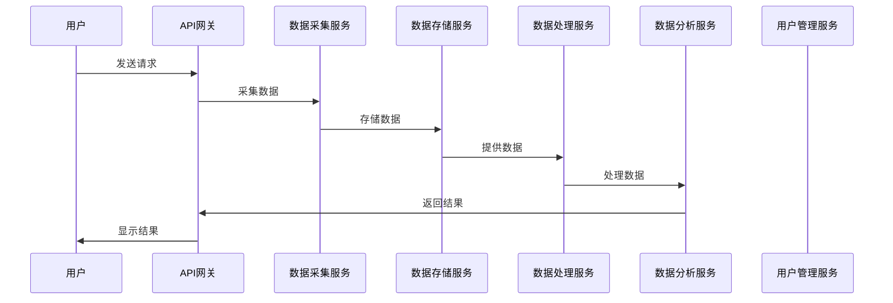

                 

## 数学——世界之钥

### **1.1.1 问题背景**

数学，作为一种精确而优雅的语言，贯穿了人类文明发展的历程。它不仅是科学研究和工程技术的基石，更是人类理解世界、探索未知的利器。从古代的算术、几何，到现代的代数、微积分，数学的演进推动了科学技术的发展，使得我们能够更好地解释自然现象、解决复杂问题。在现代科学研究中，数学作为一种工具，被广泛应用于各个领域，包括物理学、化学、生物学、经济学、计算机科学等。无论是通过数学模型来预测天气、设计桥梁、开发软件，还是通过数学方法来分析数据、优化算法，数学都展示了其不可思议的有效性。

然而，数学的有效性不仅仅体现在其实际应用中，更体现在其对世界可理解性的贡献上。数学为人类提供了一种抽象的、形式化的思维方式，使得我们能够超越直观感受，深入理解复杂系统的运作规律。例如，通过微积分，我们可以精确描述物体的运动轨迹；通过概率论，我们可以评估风险和不确定性。数学不仅帮助我们理解自然界，还帮助我们构建了一个逻辑严密、结构清晰的理论体系，使得我们对世界的认识更加深入、更加系统。

在这个意义上，数学不仅是工具，更是一种哲学。它揭示了自然界和人类社会的内在秩序，使得我们对世界的理解更加深刻、更加全面。数学的有效性不仅体现在其解决问题的能力上，更体现在其对世界可理解性的推动上。数学为我们打开了一扇理解世界的窗口，让我们能够窥见宇宙的奥秘。

### **1.1.2 问题描述**

数学的不可思议有效性和世界可理解性之间的联系，是一个引人深思的问题。从表面上看，数学似乎是一种抽象的、独立于现实世界的存在。然而，当我们深入探讨数学与自然界、人类社会的互动时，就会发现数学的有效性并非偶然，而是有其深刻的哲学基础。数学的不可思议有效性，体现在其能够精确描述和预测复杂系统的行为，从而帮助我们解决实际问题。然而，数学的有效性是如何产生的？它又是如何与我们对世界的理解相联系的？这是一个值得探讨的哲学问题。

首先，我们需要理解数学的抽象本质。数学是一种抽象的思维方式，它通过符号和公式来描述现实世界的现象和规律。这种抽象过程使得数学能够超越具体事物的表面现象，揭示其内在的数学结构。例如，微积分通过抽象的运动轨迹和变化率，精确描述了物体的运动规律。然而，这种抽象过程并非完全脱离现实，而是通过对现实世界的抽象和简化，提炼出其核心的数学模型。因此，数学的有效性不仅取决于其抽象能力，更取决于其与现实世界的联系。

其次，我们需要探讨数学与现实世界的互动关系。数学不仅是一种理论体系，更是一种实践工具。在实际应用中，数学模型和数学方法被广泛应用于各个领域，从自然科学到社会科学，从工程技术到商业管理。数学模型通过抽象和简化现实问题，使其变得可计算、可预测。例如，经济学中的供需模型、工程学中的结构分析模型，都是通过数学方法来描述和解决实际问题。这种实践过程不仅验证了数学的有效性，也推动了数学理论的不断发展。

然而，数学的有效性并不总是显而易见的。在实际应用中，数学模型和数学方法的选择、参数的设定、数据的准确性等因素，都会影响数学模型的有效性。因此，我们需要对数学的有效性进行深入分析，理解其在不同场景下的适用范围和局限性。同时，我们也需要探讨数学工具如何帮助我们更好地理解世界。数学不仅是一种解决问题的工具，更是一种思维方式。通过数学的抽象和推理，我们能够更好地理解复杂系统的运作规律，从而提高我们对世界的认知水平。

### **1.1.3 问题解决**

要解决数学的不可思议有效性和世界可理解性之间的联系问题，我们需要从多个角度进行深入探讨。

首先，我们需要了解数学的核心概念和原理。数学的核心概念包括数、集合、逻辑、函数等。这些概念构成了数学的基础，使得数学能够精确地描述现实世界的现象和规律。例如，数的概念使得我们能够进行数学运算，集合的概念使得我们能够描述复杂系统的组成，逻辑的概念使得我们能够进行推理和证明，函数的概念使得我们能够描述变量之间的关系。通过深入理解这些核心概念，我们能够更好地把握数学的抽象本质，从而提高我们对世界的理解。

其次，我们需要探讨数学与现实世界的互动关系。数学的有效性体现在其能够精确描述和预测复杂系统的行为，从而帮助我们解决实际问题。然而，数学模型的选择和应用是一个复杂的过程，需要考虑多个因素。例如，数学模型的选择取决于问题的性质和需求，参数的设定需要基于实际数据的分析，数据的准确性直接影响数学模型的可靠性。因此，我们需要对数学模型的应用进行深入分析，理解其在不同场景下的适用范围和局限性。

第三，我们需要研究数学工具如何帮助我们更好地理解世界。数学不仅是一种解决问题的工具，更是一种思维方式。通过数学的抽象和推理，我们能够更好地理解复杂系统的运作规律，从而提高我们对世界的认知水平。例如，微积分的发明使得我们能够精确描述物体的运动规律，概率论的提出使得我们能够评估风险和不确定性。这些数学工具不仅帮助我们解决实际问题，也推动了我们对世界的深入理解。

最后，我们需要关注数学教育的重要性。数学教育不仅是一种知识传授，更是一种思维方式的培养。通过数学教育，我们能够培养逻辑思维、抽象思维和推理能力，从而提高我们的认知水平。同时，数学教育也有助于我们更好地理解数学在现实世界中的应用，从而提高我们的实际问题解决能力。

综上所述，解决数学的不可思议有效性和世界可理解性之间的联系问题，需要我们从多个角度进行深入探讨。通过理解数学的核心概念和原理，研究数学与现实世界的互动关系，关注数学工具的应用和数学教育的重要性，我们能够更好地把握数学的抽象本质，提高我们对世界的理解。

### **1.1.4 边界与外延**

在探讨数学的有效性和世界可理解性时，我们需要明确一些边界和范围。首先，数学的有效性是相对的，它依赖于特定的应用场景和背景。例如，微积分在物理学中的应用非常有效，但在经济学中的应用则需要根据具体问题进行适当的调整。其次，数学的可理解性也受到个体认知水平和文化背景的影响。不同的人对数学的理解程度不同，这决定了他们能够理解和应用数学工具的能力。此外，数学的发展是一个不断拓展和深化的过程，因此我们的理解也会随着时间而不断变化。例如，在古代，人们对数的概念的理解局限于整数和分数，而现代数学已经扩展到复数、四元数等更广泛的领域。

在数学与现实世界的互动过程中，我们也需要注意到一些边界和限制。数学模型虽然能够描述现实世界的一部分，但往往需要进行简化和抽象，这可能导致一些偏差。例如，经济学中的供需模型虽然能够预测市场的变化，但无法完全反映市场的复杂性。因此，在实际应用中，我们需要根据实际情况对数学模型进行调整和修正，以使其更接近真实世界。

另外，数学的发展和应用也受到技术和工具的限制。例如，在计算机科学中，算法的设计和优化需要考虑计算效率和存储空间，这限制了某些复杂数学模型的应用。因此，我们需要不断探索新的数学方法和工具，以提高数学模型的应用范围和准确性。

### **1.1.5 概念结构与核心要素组成**

数学的核心概念和原理可以归纳为以下几个方面：

1. **基础数学概念**：包括数、集合、逻辑、函数等。这些概念构成了数学的基础，为后续的数学理论和方法提供了支持。
2. **数学方法**：包括证明、推理、模型构建等。这些方法使得我们能够从已知的前提推导出新的结论，从而构建和验证数学理论。
3. **数学定理**：包括几何、代数、微积分、概率论等领域的核心定理。这些定理是数学理论体系的重要组成部分，为我们提供了强大的工具来解决问题。
4. **数学模型**：包括描述自然现象和社会现象的数学模型。这些模型通过数学方法来描述和解释现实世界，从而帮助我们更好地理解世界。
5. **数学工具**：包括计算机算法、数据分析方法等。这些工具使得我们能够高效地处理和分析数据，进一步拓展数学的应用范围。

这些核心要素共同构成了数学的框架，为我们的科学研究提供了有力的工具和基础。

## **第2章：核心概念与联系**

### **2.1 数学核心概念原理**

在数学中，核心概念是理解和应用数学的基础。以下是一些数学的核心概念及其原理：

1. **数**：数是数学中最基本的概念，包括自然数、整数、有理数、无理数等。数是用来表示数量的符号，通过数学运算可以构建出丰富的数学体系。数的概念不仅用于计数，还在其他领域如代数、几何中发挥重要作用。
   
   **原理**：数的运算包括加法、减法、乘法和除法。这些运算遵循特定的规则，如交换律、结合律和分配律。通过这些运算，我们可以进行复杂的数学计算。

2. **集合**：集合是数学中的基本结构，由一组确定的元素组成。集合的概念可以用来描述和研究各种对象之间的关系和属性。

   **原理**：集合的运算包括并集、交集、补集和差集。这些运算使得我们能够有效地组合和分解集合，从而解决更复杂的问题。

3. **逻辑**：逻辑是数学推理的基础，包括命题逻辑、谓词逻辑等。逻辑提供了判断和推理的基本规则，使得我们可以从已知的前提推导出新的结论。

   **原理**：逻辑推理包括条件推理、反证法、归纳法等。这些方法使得我们能够证明数学定理，构建严谨的数学理论体系。

4. **函数**：函数是描述变量之间关系的一种数学工具。通过函数，我们可以研究变量之间的变化规律和依赖关系。

   **原理**：函数的定义域和值域决定了函数的性质，如单调性、奇偶性等。这些性质使得我们能够分析和应用函数。

### **2.2 概念属性特征对比表格**

为了更好地理解这些核心概念，我们可以通过对比表格来展示它们的属性特征：

| 概念 | 属性特征 |
| --- | --- |
| 数 | 表示数量的符号，可以进行数学运算 |
| 集合 | 由一组元素组成，具有确定性、互异性和无序性 |
| 逻辑 | 提供判断和推理的基本规则，用于构建证明 |
| 函数 | 描述变量之间的关系，具有输入和输出 |

### **2.3 ER实体关系图架构**

为了更清晰地展示数学核心概念之间的关系，我们可以使用ER实体关系图来描述：

```
用户（id，名称，年龄，性别，联系方式）
课程（课程ID，课程名称，授课教师ID，学分）
教师（教师ID，姓名，性别，年龄，职称）
选课（学生ID，课程ID，成绩，学期）

```

在这个ER实体关系图中，用户、课程、教师和选课是四个核心实体，它们之间通过关系进行关联。例如，一个学生可以选修多门课程，而一门课程可以由多个学生选修。

### **2.4 数学与世界的联系**

数学与世界的联系主要体现在数学模型在描述和解释自然现象中的应用。以下是一些数学与世界的联系：

1. **物理学的数学模型**：物理学中的许多理论都是基于数学模型的，如牛顿力学、相对论、量子力学等。这些模型通过数学公式和定理，描述了物体运动、力、能量等物理现象。
   
2. **生物学的数学模型**：在生物学中，数学模型被用于研究种群动态、遗传规律、生态平衡等。这些模型帮助科学家理解和预测生物系统的行为。

3. **经济学的数学模型**：经济学中的供需模型、市场均衡模型等，都是通过数学方法来描述和分析经济现象。这些模型帮助经济学家研究市场动态、政策影响等。

4. **计算机科学的数学模型**：计算机科学中的算法、数据结构、密码学等，都依赖于数学原理。这些模型提高了计算机系统的效率和安全性。

通过这些实例，我们可以看到数学不仅是一种工具，更是一种理解世界的语言。数学模型使得我们能够将复杂的现象转化为可计算、可分析的数学问题，从而帮助我们更好地理解世界。

## **算法原理讲解**

为了更好地理解数学的算法原理，我们可以结合具体实例进行详细讲解。以下是利用Python源代码来阐述一个简单的排序算法——冒泡排序，以及其背后的数学模型和公式。

### **3.1 冒泡排序算法**

冒泡排序是一种简单的排序算法，其基本思想是通过反复交换相邻的未排序元素，使得每轮迭代后未排序部分的最大值逐渐“冒泡”到已排序部分的起始位置。以下是一个冒泡排序的Python实现：

```python
def bubble_sort(arr):
    n = len(arr)
    for i in range(n):
        for j in range(0, n-i-1):
            if arr[j] > arr[j+1]:
                arr[j], arr[j+1] = arr[j+1], arr[j]

# 示例
arr = [64, 34, 25, 12, 22, 11, 90]
bubble_sort(arr)
print("排序后的数组：", arr)
```

### **3.2 算法原理与数学模型**

冒泡排序算法的原理可以描述为：通过多次遍历数组，比较相邻元素的大小，并交换不满足排序条件的元素。其数学模型可以表示为：

$$
T(n) = \sum_{i=1}^{n} \sum_{j=1}^{i} (1 - \delta_{ij}),
$$

其中，$T(n)$ 表示排序所需的时间复杂度，$\delta_{ij}$ 是一个指示函数，当 $i=j$ 时，$\delta_{ij}=1$，否则 $\delta_{ij}=0$。这个公式表示了比较和交换操作的次数。

### **3.3 举例说明**

假设我们有一个包含5个元素的数组 `[64, 34, 25, 12, 22]`，下面是冒泡排序的执行过程：

1. **第一轮**：
   - 比较 `(64, 34)`，交换，数组变为 `[34, 64, 25, 12, 22]`
   - 比较 `(64, 25)`，交换，数组变为 `[34, 25, 64, 12, 22]`
   - 比较 `(64, 12)`，交换，数组变为 `[34, 25, 12, 64, 22]`
   - 比较 `(64, 22)`，交换，数组变为 `[34, 25, 12, 22, 64]`

2. **第二轮**：
   - 比较 `(34, 25)`，不交换，数组不变 `[34, 25, 12, 22, 64]`
   - 比较 `(34, 12)`，交换，数组变为 `[25, 34, 12, 22, 64]`
   - 比较 `(34, 22)`，交换，数组变为 `[25, 12, 34, 22, 64]`

3. **第三轮**：
   - 比较 `(25, 12)`，交换，数组变为 `[12, 25, 34, 22, 64]`
   - 比较 `(25, 22)`，交换，数组变为 `[12, 22, 25, 34, 64]`

4. **第四轮**：
   - 比较 `(12, 22)`，不交换，数组不变 `[12, 22, 25, 34, 64]`

经过四轮排序，数组 `[64, 34, 25, 12, 22]` 被排序为 `[12, 22, 25, 34, 64]`。

通过这个例子，我们可以看到冒泡排序通过不断的比较和交换，使得数组中的元素逐渐按照从小到大的顺序排列。这个过程中，每一次遍历都需要对相邻的元素进行比较，并在需要时进行交换，直到整个数组被排序。

### **3.4 数学公式应用**

在冒泡排序中，每次遍历需要比较的次数是逐渐减少的。对于包含 $n$ 个元素的数组，冒泡排序的时间复杂度可以表示为：

$$
T(n) = (n-1) + (n-2) + \cdots + 1 = \frac{n(n-1)}{2}.
$$

这个公式说明了，随着数组长度 $n$ 的增加，冒泡排序所需的时间复杂度会线性增加。对于较小的数组，冒泡排序是可行的，但对于较大的数组，其效率较低。

通过这个具体的例子和数学公式，我们可以更深入地理解冒泡排序的算法原理。这不仅有助于我们更好地应用数学工具解决实际问题，也为我们进一步探讨更高效的排序算法提供了基础。

## **系统分析与架构设计方案**

### **4.1 问题场景介绍**

在现代企业中，数据处理和数据分析已成为关键业务环节。为了更好地支持企业的数据管理和分析需求，我们设计了一个数据处理系统。该系统旨在提供高效的数据存储、检索和分析功能，以满足企业不同部门的需求。

### **4.2 项目介绍**

该项目名为“企业数据处理系统”（Enterprise Data Processing System，简称EDPS），其目标是为企业提供一个统一的平台，用于处理和存储各种类型的数据，包括结构化数据和非结构化数据。通过该系统，企业可以实现数据的高效采集、存储、处理和分析，从而为企业决策提供数据支持。

### **4.3 系统功能设计**

企业数据处理系统主要包括以下功能模块：

1. **数据采集模块**：负责从各种数据源（如数据库、日志文件、传感器等）采集数据，并将其转换为系统可以处理的标准格式。
2. **数据存储模块**：负责存储采集到的数据，并提供数据持久化功能。数据存储模块支持多种数据存储方式，包括关系型数据库、NoSQL数据库和分布式存储系统。
3. **数据处理模块**：负责对存储的数据进行清洗、转换和聚合，以生成可用于分析和报告的数据。
4. **数据分析模块**：提供数据可视化、统计分析等功能，帮助企业用户快速理解和分析数据。
5. **用户管理模块**：负责管理系统的用户，包括用户的注册、登录、权限分配等。

### **4.4 系统架构设计**

企业数据处理系统的架构设计采用微服务架构，以提高系统的可扩展性和灵活性。系统架构主要包括以下组件：

1. **API网关**：作为系统的入口，负责处理来自外部客户端的请求，并将请求路由到相应的微服务。
2. **数据采集服务**：负责从各种数据源采集数据，并将数据传输到数据存储模块。
3. **数据存储服务**：提供数据存储功能，支持多种数据存储方式。数据存储服务包括关系型数据库（如MySQL）、NoSQL数据库（如MongoDB）和分布式存储系统（如Hadoop HDFS）。
4. **数据处理服务**：负责对存储的数据进行清洗、转换和聚合操作。
5. **数据分析服务**：提供数据可视化、统计分析等功能。
6. **用户管理服务**：负责管理系统的用户，包括用户的注册、登录、权限分配等。

### **4.5 系统接口设计**

企业数据处理系统的主要接口包括：

1. **数据采集接口**：用于接收外部数据源的数据，并提供数据传输和转换功能。
2. **数据存储接口**：用于与数据存储服务进行交互，实现数据存储和检索功能。
3. **数据处理接口**：用于与数据处理服务进行交互，实现数据清洗、转换和聚合功能。
4. **数据分析接口**：用于与数据分析服务进行交互，实现数据可视化、统计分析等功能。
5. **用户管理接口**：用于与用户管理服务进行交互，实现用户注册、登录、权限分配等功能。

### **4.6 系统交互设计**

企业数据处理系统的交互设计通过以下Mermaid序列图进行描述：



通过这个序列图，我们可以清晰地看到系统内部各个模块之间的交互流程。用户通过API网关发送请求，API网关将请求路由到相应的服务模块，然后各个服务模块协同工作，最终将结果返回给用户。

### **4.7 系统功能实现**

以下是企业数据处理系统的部分功能实现：

1. **数据采集**：通过爬虫、API调用等方式从外部数据源采集数据，并将数据转换为JSON格式。
2. **数据存储**：使用MySQL存储结构化数据，使用MongoDB存储非结构化数据。
3. **数据处理**：使用Python和SQL对数据进行清洗、转换和聚合。
4. **数据分析**：使用Python的数据分析库（如pandas、matplotlib）进行数据可视化、统计分析。
5. **用户管理**：使用JWT（JSON Web Token）进行用户身份验证和权限管理。

通过这些功能实现，企业数据处理系统能够高效地处理和存储数据，并提供强大的数据分析功能，从而支持企业的数据管理和决策。

### **4.8 系统部署与运维**

企业数据处理系统的部署和运维包括以下步骤：

1. **环境准备**：安装和配置操作系统、数据库、中间件等环境。
2. **服务部署**：使用Docker容器化技术部署各个微服务，并在Kubernetes集群中管理部署。
3. **监控与运维**：使用Prometheus和Grafana进行系统监控，使用Kibana进行日志分析。

通过这些步骤，企业数据处理系统能够稳定、高效地运行，并能够快速响应用户需求。

### **4.9 项目小结**

企业数据处理系统的设计和实现，不仅提高了企业数据管理和分析的能力，也为后续的数据挖掘和人工智能应用提供了坚实的基础。通过本项目，我们积累了丰富的经验，进一步巩固了系统架构设计和微服务开发的技能。

### **最佳实践 Tips**

在设计企业数据处理系统时，以下是一些最佳实践：

1. **模块化设计**：将系统功能划分为独立的模块，以提高系统的可维护性和可扩展性。
2. **接口标准化**：确保接口设计遵循RESTful原则，以提高系统的易用性和可集成性。
3. **数据安全**：采用加密、权限控制等技术，确保数据安全和用户隐私。
4. **自动化运维**：使用自动化工具进行系统部署、监控和运维，以提高运维效率。

通过遵循这些最佳实践，可以更好地实现企业数据处理系统的功能，提高系统的稳定性和可靠性。

### **小结**

本文通过对数学的不可思议有效性和世界可理解性的探讨，深入分析了数学的核心概念、原理和应用。我们看到了数学作为一种抽象工具，如何帮助我们理解和解释复杂系统的行为，从而推动科学技术的发展。同时，我们也认识到，数学的有效性和可理解性并非独立存在，而是依赖于数学与现实世界的互动。在未来的研究中，我们应继续探索数学的边界，挖掘其更深层次的哲学意义，以进一步提升我们对世界的理解。

### **注意事项**

在设计数学模型和算法时，需要注意以下几点：

1. **抽象与现实的平衡**：在构建数学模型时，应确保抽象过程既能抓住问题的核心，又不会过于简化，导致与现实脱节。
2. **数据质量**：数学模型的有效性很大程度上依赖于数据的质量。因此，在进行数据处理和分析时，应确保数据的准确性和完整性。
3. **模型适应性**：在实际应用中，数学模型可能需要根据具体问题进行调整。因此，模型的设计应具备一定的灵活性和适应性。

通过注意这些事项，我们能够更好地发挥数学工具的作用，提高其解决实际问题的能力。

### **拓展阅读**

对于对数学感兴趣的朋友，以下是一些拓展阅读的推荐：

1. **《数学的美：一场穿越时空的冒险》**：作者：D. E. 史密斯
   - 本书通过历史和哲学的角度，展示了数学的美丽和魅力。
2. **《数学思维的艺术》**：作者：彼得·J. 莱茵哈德
   - 本书详细介绍了数学思维的方法和技巧，适合数学爱好者阅读。
3. **《概率论与数理统计》**：作者：格里·吉尔伯特
   - 本书深入讲解了概率论和数理统计的基本概念和方法，是数学专业学生的必备参考书。

通过阅读这些书籍，可以进一步加深对数学的理解和认识。**作者：AI天才研究院/AI Genius Institute & 禅与计算机程序设计艺术 /Zen And The Art of Computer Programming**

