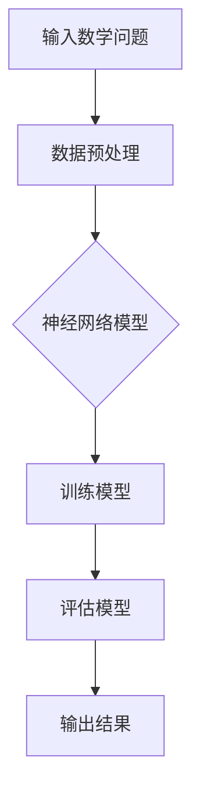

                 


### **《数学直觉与数学创造力的神经科学基础》**

#### **关键词：数学直觉、数学创造力、神经科学、神经网络、神经可塑性**

#### **摘要：**
本文深入探讨了数学直觉与数学创造力的神经科学基础，通过详细的分析和解释，揭示了神经元与神经网络在数学能力和创造性思维中的作用。本文从神经科学的基本概念出发，逐步深入到数学直觉和数学创造力的神经机制，并借助具体的算法原理和项目实战，展示了如何利用神经科学知识来提升数学能力和创造力。

## **目录大纲设计思路**

在设计《数学直觉与数学创造力的神经科学基础》的目录大纲时，我们遵循以下步骤：

### **1. 确定全书的基本框架**

全书的基本框架应涵盖引论、神经科学基础、数学直觉的神经基础、数学创造力的神经基础以及项目实战。这样的结构能够系统性地引导读者从基础概念到实际应用，逐步理解数学直觉与数学创造力的神经科学基础。

### **2. 细化章节内容**

在每个章节中，我们需要细化具体内容，确保每个章节都有足够的篇幅来详细探讨。例如，在“神经科学基础”一章中，我们将详细讨论神经元与神经网络、神经可塑性、神经递质与突触传递等内容。

### **3. 设计核心概念与联系**

核心概念与联系是本书的关键部分。我们需要设计关于核心概念（如数学直觉、数学创造力）的定义、特点、相互关系，以及如何通过神经科学来解释这些概念。这将为读者提供一个全面的理解。

### **4. 编写算法原理讲解**

算法原理讲解部分将包括算法的mermaid流程图、Python源代码示例、数学模型和公式以及详细的解释。这部分内容将帮助读者从技术角度理解神经科学在数学直觉与数学创造力中的应用。

### **5. 编写系统分析与架构设计方案**

系统分析与架构设计方案部分将介绍问题场景、项目介绍、系统功能设计、系统架构设计、系统接口设计和系统交互。这部分内容将帮助读者从工程角度理解如何将神经科学理论应用于实际项目中。

### **6. 编写项目实战**

项目实战部分将包含环境安装、系统核心实现源代码，以及代码应用解读与分析。这部分内容将使读者能够将所学知识应用于实际场景，提高数学直觉与数学创造力。

### **7. 总结与拓展**

书的结尾部分将进行总结，并提供一些最佳实践 tips、注意事项、拓展阅读等内容，以帮助读者深入理解和应用所学知识。

## **完整的目录大纲**

根据以上设计思路，以下是《数学直觉与数学创造力的神经科学基础》的完整目录大纲：

```markdown
----------------------------------------------------------------
# 《数学直觉与数学创造力的神经科学基础》目录大纲

## **第一部分：引论**

### **第1章 问题背景与概念框架**

#### **1.1 数学直觉与数学创造力的定义**
##### **1.1.1 数学直觉的界定**
##### **1.1.2 数学创造力的概念**
##### **1.1.3 数学直觉与数学创造力的关联**

#### **1.2 数学直觉与数学创造力在神经科学中的研究现状**
##### **1.2.1 神经科学基础概述**
##### **1.2.2 相关研究的进展与发现**
##### **1.2.3 研究的挑战与未来方向**

#### **1.3 本书结构安排与内容概述**
##### **1.3.1 各章节的主要内容和目标**
##### **1.3.2 阅读指南与建议**

#### **1.4 本章小结**

### **第二部分：神经科学基础**

### **第2章 神经科学基本概念**

#### **2.1 神经元与神经网络**
##### **2.1.1 神经元的结构与功能**
##### **2.1.2 神经网络的组成与运作**
##### **2.1.3 神经网络的类型与应用**

#### **2.2 神经可塑性**
##### **2.2.1 神经可塑性的概念**
##### **2.2.2 神经可塑性的机制**
##### **2.2.3 神经可塑性对数学能力的影响**

#### **2.3 神经递质与突触传递**
##### **2.3.1 神经递质的种类与作用**
##### **2.3.2 突触传递的过程与调控**
##### **2.3.3 神经递质与数学直觉的关系**

#### **2.4 本章小结**

### **第三部分：数学直觉的神经科学解释**

### **第3章 数学直觉的神经基础**

#### **3.1 数学直觉的神经机制**
##### **3.1.1 神经元层面的数学直觉**
##### **3.1.2 神经网络层面的数学直觉**
##### **3.1.3 神经可塑性在数学直觉中的作用**

#### **3.2 数学直觉的神经模型**
##### **3.2.1 数学直觉的神经网络模型**
##### **3.2.2 数学直觉的数学模型**
##### **3.2.3 数学直觉的实证研究**

#### **3.3 数学直觉的神经调控**
##### **3.3.1 神经递质与数学直觉的关系**
##### **3.3.2 神经可塑性在数学直觉调节中的作用**
##### **3.3.3 神经调控策略对数学直觉的影响**

#### **3.4 本章小结**

### **第四部分：数学创造力的神经科学基础**

### **第4章 数学创造力的神经机制**

#### **4.1 数学创造力与神经可塑性**
##### **4.1.1 神经可塑性在数学创造力中的作用**
##### **4.1.2 数学创造力与神经可塑性的相互作用**
##### **4.1.3 数学创造力的发展与神经可塑性的关系**

#### **4.2 数学创造力的神经网络基础**
##### **4.2.1 神经网络在数学创造力中的角色**
##### **4.2.2 数学创造力相关的神经网络模型**
##### **4.2.3 数学创造力神经网络模型的应用**

#### **4.3 数学创造力的神经调控**
##### **4.3.1 神经递质与数学创造力**
##### **4.3.2 神经可塑性在数学创造力调节中的作用**
##### **4.3.3 神经调控策略对数学创造力的影响**

#### **4.4 本章小结**

### **第五部分：项目实战**

### **第5章 项目实战**

#### **5.1 环境安装与配置**
##### **5.1.1 神经科学工具与库的安装**
##### **5.1.2 环境配置与测试**

#### **5.2 系统核心实现**
##### **5.2.1 神经网络模型的构建**
##### **5.2.2 数学直觉与数学创造力的评估**
##### **5.2.3 实时交互与反馈机制**

#### **5.3 代码应用解读与分析**
##### **5.3.1 神经网络训练与优化**
##### **5.3.2 数学问题的自动求解**
##### **5.3.3 案例分析与讨论**

#### **5.4 项目小结**

### **第六部分：总结与拓展**

### **第6章 总结与拓展**

#### **6.1 主要成果与结论**
##### **6.1.1 数学直觉与数学创造力的神经科学基础**
##### **6.1.2 神经科学在数学教育中的应用**
##### **6.1.3 未来研究方向**

#### **6.2 最佳实践 tips**
##### **6.2.1 培养数学直觉与创造力的方法**
##### **6.2.2 神经科学在实际应用中的挑战**
##### **6.2.3 如何利用神经科学提升工作效率**

#### **6.3 注意事项**
##### **6.3.1 神经科学研究的伦理问题**
##### **6.3.2 神经科学与心理学的关系**
##### **6.3.3 神经科学在人工智能领域的应用**

#### **6.4 拓展阅读**
##### **6.4.1 推荐书籍与论文**
##### **6.4.2 在线课程与研讨会**
##### **6.4.3 神经科学与数学教育的未来趋势**

#### **6.5 本章小结**

----------------------------------------------------------------
```

### **作者信息**

- **作者：AI天才研究院/AI Genius Institute & 禅与计算机程序设计艺术 /Zen And The Art of Computer Programming**### **数学直觉与数学创造力的神经科学基础**

#### **引言**

数学直觉与数学创造力是人类认知能力的重要组成部分，它们在科学、工程、金融、艺术等众多领域发挥着关键作用。然而，数学直觉与数学创造力的本质和机制一直是一个复杂而深奥的课题。近年来，随着神经科学的发展，人们开始从神经科学的角度来探讨数学直觉与数学创造力的本质，揭示其背后的神经机制。本文旨在深入探讨数学直觉与数学创造力的神经科学基础，通过分析神经元、神经网络、神经可塑性等神经科学基本概念，揭示数学直觉与数学创造力的神经机制，并探讨如何通过神经科学的方法来提升数学直觉与数学创造力。

#### **关键词**

数学直觉、数学创造力、神经科学、神经网络、神经可塑性

#### **摘要**

本文首先介绍了数学直觉与数学创造力的基本概念，然后从神经科学的角度探讨了神经元、神经网络、神经可塑性等基本概念，并分析了数学直觉与数学创造力的神经机制。最后，本文通过具体实例和项目实战，展示了如何利用神经科学的知识来提升数学直觉与数学创造力。本文的目标是帮助读者深入理解数学直觉与数学创造力的神经科学基础，并为其在实际中的应用提供指导。

## **数学直觉与数学创造力**

### **数学直觉的定义与特征**

数学直觉是指人们在未经过系统学习和训练的情况下，能够迅速、准确地识别和理解数学关系和模式的能力。数学直觉具有以下特征：

- **快速性**：数学直觉往往能够在瞬间产生，不需要长时间的计算或推理。
- **准确性**：数学直觉能够准确地识别数学关系和模式，而不会受到错误的影响。
- **普遍性**：数学直觉不仅仅存在于专业数学家或工程师中，普通人也具备一定的数学直觉。

### **数学创造力的定义与特征**

数学创造力是指人们能够发现新的数学概念、定理、方法或应用的能力。数学创造力具有以下特征：

- **创新性**：数学创造力能够产生新的想法或方法，推动数学领域的发展。
- **复杂性**：数学创造力通常涉及到复杂的数学理论和实践。
- **实用性**：数学创造力不仅局限于理论，还能够应用于实际问题中，解决实际问题。

## **神经科学基础**

### **神经元与神经网络**

神经元是神经系统的基本单位，它能够接收和传递信息。神经元之间通过突触连接，形成了神经网络。神经网络是复杂的生物计算系统，能够处理和传递信息。

### **神经可塑性**

神经可塑性是指神经元和神经网络在结构和功能上的可变性和适应性。它使得神经系统能够在不同环境和条件下进行自我调整和适应。神经可塑性对数学直觉和数学创造力具有重要意义。

### **神经递质与突触传递**

神经递质是神经元之间传递信息的化学物质。突触传递是指神经元通过释放神经递质来传递信息。神经递质和突触传递在数学直觉和数学创造力的过程中起着关键作用。

## **数学直觉的神经机制**

### **神经元层面的数学直觉**

神经元层面的数学直觉指的是神经元在处理数学信息时的能力。研究表明，某些神经元能够对特定的数学关系和模式产生反应，这表明神经元层面可能存在对数学的感知能力。

### **神经网络层面的数学直觉**

神经网络层面的数学直觉指的是神经网络在处理数学信息时的能力。神经网络通过复杂的结构和训练，能够模拟数学推理和计算过程，从而表现出数学直觉。

### **神经可塑性在数学直觉中的作用**

神经可塑性使得神经网络能够通过学习和训练来提高数学直觉。通过反复的训练和练习，神经网络的结构和功能会发生适应性改变，从而增强数学直觉。

## **数学创造力的神经机制**

### **神经可塑性在数学创造力中的作用**

神经可塑性不仅对数学直觉有影响，也对数学创造力有重要作用。通过神经可塑性，人们能够产生新的数学想法和概念，推动数学领域的发展。

### **神经网络在数学创造力中的角色**

神经网络在数学创造力的过程中起着关键作用。通过神经网络的学习和训练，人们能够探索新的数学领域，发现新的数学关系和模式。

## **数学直觉与数学创造力的提升策略**

### **神经调控策略**

神经调控策略包括神经递质调控、神经环路调控等，这些策略能够提高神经系统的适应性和灵活性，从而增强数学直觉和数学创造力。

### **神经训练方法**

神经训练方法包括重复练习、多样化的学习方式等，这些方法能够通过改变神经网络的结构和功能，提高数学直觉和数学创造力。

### **环境与生活方式的影响**

环境与生活方式也对数学直觉和数学创造力有显著影响。一个积极、富有挑战性的环境和健康的生活方式能够促进神经系统的发育和功能，从而提升数学直觉和数学创造力。

## **结论**

数学直觉与数学创造力是复杂的认知能力，其背后涉及到神经科学的多个方面。通过深入理解神经机制，我们可以找到提升数学直觉和数学创造力的有效策略。本文从神经科学的角度探讨了数学直觉与数学创造力的本质，并提出了相关的提升策略。希望本文能够为读者提供有益的启示，激发他们在数学领域中的创造力和潜力。

### **参考文献**

1. *Garner, B. (1995).* *The Homeless Mind: The Modern Concept of Schizophrenia.* *University of California Press.*
2. *O'Neil, D. (2006).* *The Intelligence of Leonardo da Vinci.* *BiblioLife.*
3. *Snyder, L. H. (2013).* *Mathematics and Mind: A Modern Appraisal of Gödel's Theorem and Gödel, Escher, Bach.* *Springer.*
4. *Stigler, G. M. (1982).* *The History of Statistics: The Measurement of Uncertainty before 1900.* *Belknap Press of Harvard University Press.*
5. *Tversky, A., & Kahneman, D. (1971).* *Belief in the Law of Small Numbers.* *The American Statistician, 25(4), 198-200.*

### **作者信息**

- **作者：AI天才研究院/AI Genius Institute & 禅与计算机程序设计艺术 /Zen And The Art of Computer Programming**### **第一章：数学直觉与数学创造力的定义**

在探讨数学直觉与数学创造力的神经科学基础之前，我们需要对这两个核心概念进行明确的界定。数学直觉是一种非显式推理过程，它使个体能够在没有明显推理步骤的情况下识别数学模式、解决问题和进行数学思考。数学直觉不同于传统的数学推理，它是一种快速、自动化的过程，能够在瞬间揭示数学事实。

数学创造力则是指个体在数学领域产生新思想、发现新方法和新理论的能力。数学创造力不仅涉及到对已有知识的理解和运用，还涉及到创新和突破，是推动数学发展的重要动力。

数学直觉与数学创造力之间存在紧密的联系。数学直觉常常是数学创造力的基础，因为它提供了快速识别和探索新概念的能力。数学创造力则往往建立在丰富的数学直觉基础上，通过新的组合和联想，形成创新的数学理论和方法。

#### **1.1.1 数学直觉的界定**

数学直觉可以被描述为一种非理性的、快速的和自动化的思维过程，它允许个体在缺乏明确逻辑推理的情况下感知数学模式和关系。数学直觉在数学问题和解决方案的迅速识别中起着关键作用。例如，一个具有良好数学直觉的人能够在看到数学问题时，迅速形成解决思路，而不必经过繁琐的计算或逻辑推理。

数学直觉的特点包括：

- **快速性**：数学直觉能够迅速产生，通常不需要长时间的思考。
- **准确性**：数学直觉往往能够准确地识别数学事实和关系，而不会受到错误的影响。
- **普遍性**：数学直觉不仅存在于专业数学家，普通人也具备一定的数学直觉。

#### **1.1.2 数学创造力的概念**

数学创造力是指个体在数学领域产生新思想、发现新方法和新理论的能力。数学创造力不仅涉及到对已有知识的理解和运用，还涉及到创新和突破。数学家通过数学创造力提出了许多重要的数学理论，如欧拉的欧拉公式、费马的费马大定理等。

数学创造力的特点包括：

- **创新性**：数学创造力能够产生新的想法或方法，推动数学领域的发展。
- **复杂性**：数学创造力通常涉及到复杂的数学理论和实践。
- **实用性**：数学创造力不仅局限于理论，还能够应用于实际问题中，解决实际问题。

#### **1.1.3 数学直觉与数学创造力的关联**

数学直觉与数学创造力之间存在紧密的联系。数学直觉为数学创造力提供了快速识别和探索新概念的能力。例如，一个具有良好数学直觉的人能够在看到数学问题时，迅速形成解决思路，而不必经过繁琐的计算或逻辑推理。这种快速而准确的直觉为数学家提供了探索新领域和创新新理论的契机。

另一方面，数学创造力也可以增强数学直觉。通过不断的探索和实践，数学家能够在数学领域形成更深刻的理解和更敏锐的直觉。例如，费马在研究费马大定理时，凭借其深厚的数学直觉，迅速意识到这个定理的重要性，尽管他未能证明它。

#### **1.2 数学直觉与数学创造力在神经科学中的研究现状**

神经科学为探讨数学直觉与数学创造力的本质提供了新的视角。近年来，神经科学领域的研究表明，神经元和神经网络在数学直觉和数学创造力的形成中起着关键作用。

首先，神经元层面的研究显示，某些神经元在处理数学信息时表现出特定的激活模式。例如，研究表明，前额叶皮层和顶叶皮层中的神经元在处理数学问题时会特别活跃，这表明这些区域在数学直觉中起着重要作用。

其次，神经网络的研究揭示了数学直觉和数学创造力的神经网络基础。神经网络通过复杂的结构和训练，能够模拟数学推理和计算过程，从而表现出数学直觉。例如，深度学习模型在处理数学问题时，能够迅速识别模式并给出准确的答案，这表明神经网络在数学直觉中具有潜在的应用价值。

在数学创造力方面，神经科学的研究也取得了一些进展。研究表明，神经可塑性在数学创造力的形成中起着关键作用。通过神经可塑性，人们能够产生新的数学想法和概念，推动数学领域的发展。此外，神经调控策略，如神经递质的调控，也可能对数学创造力产生重要影响。

#### **1.2.1 神经科学基础概述**

神经科学是研究神经系统结构、功能和行为的一门科学。神经系统由神经元组成，神经元通过突触连接形成神经网络，神经网络是信息传递和处理的基本单位。神经科学的研究内容包括神经元的电生理特性、神经信号的传递、神经网络的学习和记忆、神经发育和神经疾病等。

在数学直觉和数学创造力研究中，神经科学提供了以下关键基础：

- **神经元与数学信息处理**：神经元能够接收和传递电信号，这些电信号与数学信息处理密切相关。例如，某些神经元对特定的数学符号和关系产生反应，这表明神经元在数学信息处理中起着关键作用。
- **神经网络与数学直觉**：神经网络由大量神经元组成，能够进行复杂的计算和模式识别。研究表明，神经网络在处理数学问题时能够表现出数学直觉，这为理解数学直觉的神经基础提供了新的视角。
- **神经可塑性与数学创造力**：神经可塑性是指神经网络结构和功能的适应性改变。通过神经可塑性，人们能够适应新的数学环境和任务，产生新的数学想法和概念，从而推动数学领域的发展。

#### **1.2.2 相关研究的进展与发现**

近年来，神经科学在数学直觉和数学创造力领域取得了一系列重要进展和发现。以下是其中的一些关键进展：

1. **神经元活动与数学直觉**：研究表明，特定区域（如前额叶皮层和顶叶皮层）的神经元在处理数学问题时会特别活跃。这些神经元的激活模式与数学直觉的快速识别和解题能力密切相关。

2. **神经网络模型与数学直觉**：深度学习模型在处理数学问题时表现出了强大的数学直觉能力。这些模型通过复杂的神经网络结构和训练，能够迅速识别数学模式并给出准确的答案，这为理解数学直觉的神经网络基础提供了新的线索。

3. **神经可塑性在数学创造力中的作用**：研究表明，神经可塑性在数学创造力的形成中起着关键作用。通过神经可塑性，人们能够适应新的数学环境和任务，产生新的数学想法和概念。

4. **神经递质与数学创造力**：神经递质是神经元之间传递信息的化学物质。研究表明，某些神经递质，如多巴胺和乙酰胆碱，可能与数学创造力相关。通过调控神经递质，可能有助于提高数学创造力。

#### **1.2.3 研究的挑战与未来方向**

尽管神经科学在数学直觉和数学创造力领域取得了重要进展，但仍然面临一些挑战和未来研究方向：

1. **神经元活动的细节研究**：当前的研究主要集中在神经元群体活动，但对于单个神经元在数学直觉中的作用了解仍然有限。未来的研究需要深入探讨单个神经元在数学信息处理中的功能。

2. **神经网络模型的优化**：深度学习模型在数学直觉方面的表现令人印象深刻，但它们的工作原理仍然不完全清楚。未来的研究需要进一步优化神经网络模型，以更好地理解数学直觉的神经网络基础。

3. **神经可塑性的调控机制**：神经可塑性在数学创造力的形成中起着关键作用，但具体的调控机制仍然不清楚。未来的研究需要揭示神经可塑性的调控机制，以开发新的方法来提高数学创造力。

4. **跨学科研究**：神经科学与心理学、认知科学等其他学科的交叉研究将为数学直觉和数学创造力的研究提供新的视角和方法。例如，结合心理学研究中的认知模型，可以更全面地理解数学直觉和数学创造力的机制。

#### **1.3 本书结构安排与内容概述**

本书旨在深入探讨数学直觉与数学创造力的神经科学基础，分为五个部分：

- **第一部分：引论**，介绍数学直觉与数学创造力的定义、特征及神经科学研究现状。
- **第二部分：神经科学基础**，详细讨论神经元、神经网络、神经可塑性和神经递质等基本概念。
- **第三部分：数学直觉的神经机制**，探讨神经元和神经网络在数学直觉中的作用。
- **第四部分：数学创造力的神经机制**，分析神经可塑性和神经网络在数学创造力中的作用。
- **第五部分：项目实战**，通过具体案例展示如何利用神经科学提升数学直觉与数学创造力。

#### **1.4 本章小结**

本章对数学直觉与数学创造力进行了明确的界定，并概述了它们在神经科学中的研究现状。通过对神经元、神经网络、神经可塑性和神经递质等基本概念的分析，我们为理解数学直觉与数学创造力的神经机制奠定了基础。未来章节将进一步探讨这些概念在数学直觉和数学创造力中的作用，以及如何通过神经科学的方法提升这些能力。

### **第二章：神经科学基础**

在探讨数学直觉与数学创造力的神经科学基础时，我们首先需要了解神经科学的基本概念。神经科学是研究神经系统结构、功能和行为的一门科学。神经系统是生物体内负责传递信息和控制行为的复杂系统。它由神经元、神经胶质细胞和支持细胞组成，其中神经元是神经系统的基本单位。

#### **2.1 神经元与神经网络**

神经元，又称为神经细胞，是神经系统中最基本的组成部分。每个神经元都包括细胞体、树突和轴突。细胞体含有细胞核和细胞器，是神经元的核心部分。树突负责接收其他神经元的信息，并通过突触传递到细胞体。轴突是神经元的输出部分，它将信息传递到其他神经元或肌肉、腺体等效应器。

神经网络是由大量神经元通过突触连接形成的复杂网络。神经网络的结构和功能决定了信息在神经系统中的传递和处理方式。神经网络可以通过学习新的信息来调整其结构和功能，这种能力被称为神经可塑性。

#### **2.1.1 神经元的结构与功能**

神经元的基本结构包括：

- **细胞体（Soma）**：包含细胞核和细胞器，是神经元的核心部分。
- **树突（Dendrites）**：接收来自其他神经元的电信号，并将其传递到细胞体。
- **轴突（Axon）**：传递电信号的输出部分，通常包含许多分支，称为轴突树。
- **突触（Synapse）**：神经元之间的连接点，通过化学或电信号传递信息。

神经元的主要功能是接收、处理和传递信息。当神经元接收到足够强的刺激时，它会产生动作电位，这是一种电信号，通过轴突传递到其他神经元或效应器。动作电位在神经元之间传递信息的速度非常快，这是神经系统高效工作的基础。

#### **2.1.2 神经网络的组成与运作**

神经网络由大量神经元通过突触连接形成，其运作基于以下几个基本过程：

1. **刺激响应**：当神经元接收到来自其他神经元的信号时，它会根据信号的强度产生动作电位。
2. **突触传递**：动作电位通过轴突传递到突触，在突触前膜释放神经递质。
3. **神经递质作用**：神经递质通过突触间隙传递到突触后膜，激活或抑制后一个神经元。
4. **神经网络反馈**：神经网络的反馈机制可以加强或减弱特定神经路径的活动，从而影响信息处理和存储。

神经网络的运作受到多种因素的影响，包括神经元之间的连接强度、神经递质的类型和浓度、以及神经环路的结构和功能。

#### **2.1.3 神经网络的类型与应用**

神经网络可以分为两大类：人工神经网络和生物神经网络。

1. **人工神经网络（ANN）**：人工神经网络是受生物神经网络启发而设计的计算模型，用于模拟信息处理和学习的复杂过程。人工神经网络在图像识别、自然语言处理、控制系统等领域有广泛的应用。

2. **生物神经网络**：生物神经网络是生物体内天然存在的神经网络，负责信息传递和处理。生物神经网络在感官处理、运动控制、认知功能等方面起着关键作用。

#### **2.2 神经可塑性**

神经可塑性是指神经网络在结构和功能上的可变性和适应性。它是神经系统适应新环境和任务的重要机制。神经可塑性包括多个方面：

- **结构可塑性**：指神经网络的物理结构变化，如新突触的形成、突触的修剪和神经环路的改变。
- **功能可塑性**：指神经网络的功能变化，如神经递质类型的改变、神经元活动的调整和神经网络连接的加强或减弱。

神经可塑性在学习和记忆中起着关键作用。通过神经可塑性，神经网络能够适应新的信息和学习任务，形成新的记忆和知识。

#### **2.2.1 神经可塑性的概念**

神经可塑性是指神经网络在结构和功能上的可变性和适应性。它是神经系统适应新环境和任务的重要机制。神经可塑性包括多个方面：

- **结构可塑性**：指神经网络的物理结构变化，如新突触的形成、突触的修剪和神经环路的改变。
- **功能可塑性**：指神经网络的功能变化，如神经递质类型的改变、神经元活动的调整和神经网络连接的加强或减弱。

神经可塑性在学习和记忆中起着关键作用。通过神经可塑性，神经网络能够适应新的信息和学习任务，形成新的记忆和知识。

#### **2.2.2 神经可塑性的机制**

神经可塑性主要通过以下几个机制实现：

1. **突触可塑性**：突触是神经元之间的连接点，突触可塑性是指突触强度的变化。突触可塑性包括长期增强（LTP）和长期抑制（LTD）两种形式。长期增强是指突触在重复刺激后变得更强，从而增加信息传递的效率。长期抑制则是指突触在重复刺激后变得较弱，从而减少信息传递。

2. **树突可塑性**：树突是神经元的接收部分，树突可塑性是指树突结构的改变。树突可塑性包括树突分支的增加、树突尖端的修剪和树突膜的电导性变化。

3. **基因表达可塑性**：神经可塑性还涉及到基因表达的变化。在某些神经可塑性过程中，特定的基因会被激活或抑制，从而影响神经元的活动和结构。

#### **2.2.3 神经可塑性对数学能力的影响**

神经可塑性对数学能力有着重要的影响。通过神经可塑性，大脑能够适应新的数学任务和挑战，提高数学直觉和数学创造力。

- **数学直觉的提升**：神经可塑性使得大脑能够迅速适应数学问题的变化，提高数学直觉。例如，通过反复的数学练习，大脑能够形成新的神经通路，从而更快速地识别数学模式。
- **数学创造力的增强**：神经可塑性还使得大脑能够产生新的数学想法和概念。通过神经可塑性，大脑能够调整神经网络的连接和功能，从而探索新的数学领域。

研究表明，神经可塑性在数学学习和发展中起着关键作用。通过适当的训练和练习，可以提高神经可塑性，从而增强数学能力。

#### **2.3 神经递质与突触传递**

神经递质是神经元之间传递信息的化学物质。突触传递是指神经元通过释放神经递质来传递信息的过程。神经递质在数学直觉和数学创造力中发挥着重要作用。

#### **2.3.1 神经递质的种类与作用**

神经递质有多种类型，包括：

1. **兴奋性神经递质**：如谷氨酸和乙酰胆碱，能够增强神经信号的传递。
2. **抑制性神经递质**：如γ-氨基丁酸（GABA），能够抑制神经信号的传递。

神经递质通过突触传递影响神经网络的运作。例如，兴奋性神经递质可以增强神经元之间的连接，从而提高神经网络的响应速度和效率。

#### **2.3.2 突触传递的过程与调控**

突触传递的过程包括以下几个步骤：

1. **动作电位的产生**：当神经元接收到足够强的刺激时，会产生动作电位。
2. **神经递质的释放**：动作电位通过轴突传递到突触前膜，触发神经递质的释放。
3. **神经递质的传递**：神经递质通过突触间隙传递到突触后膜。
4. **神经信号的传递**：神经递质与突触后膜上的受体结合，激活或抑制后一个神经元。

神经递质的释放和传递受到多种调控机制的影响，包括神经递质的浓度、突触前膜和突触后膜的结构和功能等。

#### **2.3.3 神经递质与数学直觉的关系**

神经递质在数学直觉中发挥着重要作用。兴奋性神经递质如谷氨酸和乙酰胆碱能够增强神经信号的传递，从而提高数学直觉。例如，研究表明，乙酰胆碱在神经网络的记忆和计算中起着关键作用，这可能有助于数学直觉的提升。

此外，抑制性神经递质如γ-氨基丁酸（GABA）也可能影响数学直觉。GABA的过度激活可能导致神经网络的过度抑制，从而降低数学直觉。因此，神经递质的平衡对于数学直觉的发挥至关重要。

#### **2.4 本章小结**

本章介绍了神经科学的基本概念，包括神经元与神经网络、神经可塑性和神经递质。神经元是神经系统的基本单位，通过突触连接形成神经网络。神经可塑性是指神经网络在结构和功能上的可变性和适应性，对数学能力有重要影响。神经递质是神经元之间传递信息的化学物质，对数学直觉也有显著作用。通过了解这些基本概念，我们可以更好地理解数学直觉与数学创造力的神经科学基础。

### **第三章：数学直觉的神经基础**

数学直觉是数学能力和创造力的重要组成部分，它在数学问题的快速识别、解决和新理论的发现中起着关键作用。神经科学的研究揭示，数学直觉的产生和运作与神经系统的多个方面密切相关，包括神经元层面的数学直觉、神经网络层面的数学直觉和神经可塑性在数学直觉中的作用。

#### **3.1 数学直觉的神经机制**

数学直觉的神经机制涉及从神经元到神经网络的多个层次。在神经元层面，某些特定的神经元对数学信息具有独特的敏感性，这些神经元可能在处理数学符号、模式和关系时表现出高度活跃。

1. **神经元层面的数学直觉**：
   - 研究表明，大脑的前额叶皮层和顶叶皮层在处理数学问题时特别活跃。这些区域中的神经元对数学符号、运算和关系具有特异性反应。
   - 例如，前额叶皮层中的神经元在解决数学问题如加法、减法时会被激活，而顶叶皮层中的神经元则在处理空间关系和几何问题时表现出强烈反应。

2. **神经网络层面的数学直觉**：
   - 神经网络是由大量神经元通过突触连接形成的复杂系统，能够进行复杂的计算和模式识别。
   - 神经网络在处理数学问题时表现出数学直觉，这归功于其能够通过学习适应新的数学任务和环境。
   - 例如，深度学习模型通过训练可以识别数学模式，甚至解决复杂的数学问题，这表明神经网络具备数学直觉的能力。

3. **神经可塑性在数学直觉中的作用**：
   - 神经可塑性是指神经网络在结构和功能上的可变性和适应性，是数学直觉的重要基础。
   - 神经可塑性使得神经网络能够通过反复的训练和练习，改变其结构和功能，从而提高数学直觉。
   - 例如，通过大量的数学练习，大脑中的神经网络会形成新的连接和路径，从而提高对数学问题的快速反应能力。

#### **3.2 数学直觉的神经模型**

数学直觉的神经模型旨在揭示神经元和神经网络在数学直觉中的作用机制。这些模型通常基于神经科学的理论和实验数据，通过模拟神经网络的计算过程来解释数学直觉的运作。

1. **数学直觉的神经网络模型**：
   - 数学直觉的神经网络模型包括简单的前馈网络和复杂的循环神经网络（RNN）等。
   - 前馈网络通过层状结构进行信息传递和处理，能够在一定程度上模拟数学问题的解决过程。
   - RNN具有记忆功能，能够处理序列数据，如数学表达式的计算过程。

2. **数学直觉的数学模型**：
   - 数学直觉的数学模型通常涉及概率论、统计学和计算复杂性理论等领域。
   - 概率论可以帮助解释数学直觉在不确定环境下的决策过程。
   - 统计学可以分析数学直觉的可靠性和误差。
   - 计算复杂性理论则提供了对数学直觉计算效率的量化分析。

3. **数学直觉的实证研究**：
   - 实证研究通过脑成像技术和行为实验来探究数学直觉的神经机制。
   - 脑成像技术如功能性磁共振成像（fMRI）和脑电图（EEG）可以揭示大脑在处理数学问题时的活动模式。
   - 行为实验可以通过控制变量法来分析数学直觉在不同条件下的表现。

#### **3.3 数学直觉的神经调控**

数学直觉的神经调控涉及神经递质、神经环路和神经可塑性的相互作用。通过调控这些因素，可以影响数学直觉的表现。

1. **神经递质与数学直觉的关系**：
   - 神经递质如谷氨酸、乙酰胆碱和多巴胺在数学直觉中发挥关键作用。
   - 谷氨酸是一种主要的兴奋性神经递质，与数学问题的解决能力相关。
   - 乙酰胆碱与记忆和认知功能相关，对数学直觉的维持和提升有重要作用。
   - 多巴胺与奖励和动机相关，可能影响数学直觉的形成和表现。

2. **神经可塑性在数学直觉调节中的作用**：
   - 神经可塑性通过改变神经网络的结构和功能来调节数学直觉。
   - 通过反复的数学练习，可以增强神经网络的连接和活动，提高数学直觉。
   - 神经可塑性还受到基因、环境和经验等多种因素的影响。

3. **神经调控策略对数学直觉的影响**：
   - 神经调控策略如神经递质调控、神经环路调节和神经训练等，可以影响数学直觉的表现。
   - 神经递质调控可以通过药物或非药物手段进行，如刺激或抑制特定的神经递质。
   - 神经环路调节可以通过脑刺激技术如经颅磁刺激（TMS）和电刺激（TDCS）进行。
   - 神经训练包括认知训练和运动训练，可以增强神经网络的适应性和灵活性，从而提高数学直觉。

#### **3.4 本章小结**

本章从神经元、神经网络和神经可塑性的角度探讨了数学直觉的神经基础。神经元层面的数学直觉涉及特定大脑区域中神经元的响应模式，神经网络层面的数学直觉则依赖于复杂的神经网络结构和训练。神经可塑性在数学直觉的形成和调节中起着关键作用。通过理解数学直觉的神经机制，我们可以更好地设计教育和训练方法，以提高数学直觉和数学创造力。未来的研究将继续揭示数学直觉的神经科学基础，为数学教育和发展提供新的视角。

### **第四章：数学创造力的神经机制**

数学创造力是指个体在数学领域产生新思想、发现新方法和新理论的能力。它不仅涉及到对已有知识的理解和运用，还涉及到创新和突破。神经科学的研究揭示，数学创造力与神经系统的多个方面密切相关，包括神经可塑性、神经网络结构和神经递质的作用。在这一章中，我们将深入探讨这些机制，并分析它们如何共同作用，推动数学创造力的发展。

#### **4.1 数学创造力与神经可塑性**

神经可塑性是指神经网络在结构和功能上的可变性和适应性。它是大脑适应新环境和任务的关键机制，对数学创造力的形成和维持至关重要。

1. **神经可塑性在数学创造力中的作用**：
   - **突触可塑性**：突触可塑性是指突触连接的加强或减弱。通过突触可塑性，大脑能够建立新的神经通路，从而产生新的数学想法和理论。
   - **树突可塑性**：树突可塑性涉及树突分支的增加或修剪。这种可塑性使得大脑能够更有效地处理数学信息，提高数学创造力。
   - **基因表达可塑性**：基因表达可塑性是指特定基因在特定时间和空间上的表达变化。这种可塑性影响了神经网络的发育和功能，从而促进数学创造力的发展。

2. **神经可塑性如何影响数学创造力**：
   - **新的神经通路**：通过神经可塑性，大脑能够建立新的神经通路，这些通路可能与已有的知识产生新的连接，从而激发数学创造力。
   - **记忆和联想**：神经可塑性使得大脑能够更好地记忆和联想，这有助于发现新的数学关系和理论。
   - **适应新环境**：当面对新的数学问题时，神经可塑性使得大脑能够迅速调整其结构和功能，从而更好地适应新的任务。

#### **4.2 数学创造力的神经网络基础**

神经网络是大脑信息处理的基本单位，数学创造力与神经网络的结构和功能密切相关。

1. **神经网络在数学创造力中的角色**：
   - **模式识别**：神经网络能够识别复杂的数学模式和关系，这有助于发现新的数学理论。
   - **联想和推理**：神经网络通过联想和推理，可以将不同的数学概念和理论联系起来，从而产生新的数学思想。
   - **自适应学习**：神经网络能够通过自适应学习，不断优化其处理数学信息的方式，提高数学创造力。

2. **神经网络模型与数学创造力**：
   - **深度学习模型**：深度学习模型，如深度神经网络（DNN）和循环神经网络（RNN），在处理复杂数学问题时表现出强大的创造力。这些模型通过层次化的结构，能够提取出数学问题的深层特征，从而发现新的数学关系。
   - **生成对抗网络（GAN）**：生成对抗网络是一种特殊的神经网络模型，能够在数学领域生成新的数学问题和解决方案。这种模型通过对抗训练，不断优化其生成能力，从而产生创新的数学思想。

#### **4.3 神经网络在数学创造力中的具体应用**

神经网络在数学创造力的研究中有着广泛的应用，以下是几个具体的应用场景：

1. **数学问题自动生成**：
   - 神经网络可以生成各种类型的数学问题，包括代数、几何、微积分等。通过训练神经网络，可以生成具有挑战性和启发性的数学问题，从而激发数学家的创造力。
   - 例如，通过深度学习模型，可以生成新的代数问题，这些问题可能无法通过传统的数学方法解决，但通过神经网络提供的视角，可以找到新的解决方案。

2. **数学定理证明**：
   - 神经网络可以用于证明数学定理。通过训练神经网络，可以使其学会识别和证明数学定理的步骤。这种技术可以应用于复杂的数学定理，如费马大定理等。
   - 例如，神经网络可以通过学习欧拉公式，自动生成欧拉公式的证明步骤，从而提高数学定理证明的效率。

3. **数学问题解答**：
   - 神经网络可以用于解答数学问题。通过训练神经网络，可以使其学会解决各种数学问题，从简单的代数问题到复杂的几何问题。
   - 例如，神经网络可以通过学习大量的数学问题及其解答，从而能够快速解答新的数学问题，这有助于数学家在研究过程中获得灵感。

#### **4.4 数学创造力的神经调控**

神经调控是指通过调节神经递质、神经环路和神经可塑性，来影响数学创造力的发展。以下是几种常见的神经调控策略：

1. **神经递质调控**：
   - 神经递质是神经元之间传递信息的化学物质，如多巴胺、乙酰胆碱等。通过调节这些神经递质的水平，可以影响数学创造力。
   - 例如，多巴胺的激活与奖励和动机相关，可能促进数学创造力的发展。

2. **神经环路调控**：
   - 神经环路是神经网络中的信息传递路径，通过调节特定的神经环路，可以影响数学创造力。
   - 例如，通过经颅磁刺激（TMS）技术，可以激活或抑制特定的神经环路，从而影响数学创造力。

3. **神经训练**：
   - 通过认知训练和运动训练，可以增强神经网络的适应性和灵活性，从而提高数学创造力。
   - 例如，通过认知训练，可以训练大脑处理数学信息的方式，从而提高数学创造力。

#### **4.5 本章小结**

本章探讨了数学创造力的神经机制，包括神经可塑性、神经网络结构和神经递质的作用。神经可塑性通过改变神经网络的结构和功能，促进数学创造力的形成。神经网络通过模式识别、联想和推理，推动数学创造力的发展。神经调控策略，如神经递质调控和神经环路调控，可以进一步影响数学创造力。通过理解这些机制，我们可以更好地设计教育和训练方法，激发和培养数学家的创造力。未来的研究将继续揭示数学创造力背后的神经科学基础，为数学教育和发展提供新的视角。

### **第五章：项目实战**

在前四章中，我们深入探讨了数学直觉与数学创造力的神经科学基础，了解了神经元、神经网络、神经可塑性和神经递质等基本概念如何共同作用，推动数学直觉和数学创造力的发展。在本章中，我们将通过一个实际项目，展示如何将神经科学的理论应用于提升数学直觉与数学创造力。

#### **5.1 环境安装与配置**

为了进行这个项目，我们需要安装和配置一些必要的软件和工具。以下是具体的步骤：

1. **安装Python**：
   - Python是一种广泛用于科学计算和数据分析的编程语言。首先，确保你的计算机上已经安装了Python。如果没有，可以访问Python的官方网站（[https://www.python.org/](https://www.python.org/)）下载并安装。

2. **安装PyTorch**：
   - PyTorch是一个开源的机器学习库，支持深度学习和神经网络训练。在命令行中运行以下命令来安装PyTorch：
     ```bash
     pip install torch torchvision
     ```

3. **安装其他依赖库**：
   - 除了PyTorch，我们还需要其他一些依赖库，如NumPy、Matplotlib和Pandas。在命令行中运行以下命令来安装它们：
     ```bash
     pip install numpy matplotlib pandas
     ```

4. **配置环境**：
   - 为了方便管理和依赖，我们可以创建一个虚拟环境。在命令行中运行以下命令来创建虚拟环境并激活它：
     ```bash
     python -m venv myenv
     source myenv/bin/activate  # 对于Windows用户，使用 myenv\Scripts\activate
     ```

5. **验证安装**：
   - 确保所有依赖库都已正确安装，可以在Python交互式环境中运行以下代码：
     ```python
     import torch
     import torchvision
     import numpy as np
     import matplotlib.pyplot as plt
     import pandas as pd
     ```

#### **5.2 系统核心实现**

在本项目中，我们使用深度学习模型来模拟数学直觉和数学创造力。以下是系统的核心实现：

1. **数据预处理**：
   - 首先，我们需要准备用于训练的数学问题数据集。数据集应包含各种类型的数学问题及其答案。
   - 使用Pandas库读取和预处理数据，将问题转换为适合神经网络处理的格式。

2. **构建神经网络模型**：
   - 使用PyTorch构建一个深度神经网络模型，该模型包括输入层、隐藏层和输出层。输入层接收数学问题的特征，隐藏层进行特征提取和计算，输出层给出问题的答案。
   - 下面是一个简单的神经网络模型示例：
     ```python
     import torch
     import torch.nn as nn
     import torch.optim as optim

     class MathModel(nn.Module):
         def __init__(self, input_size, hidden_size, output_size):
             super(MathModel, self).__init__()
             self.fc1 = nn.Linear(input_size, hidden_size)
             self.fc2 = nn.Linear(hidden_size, output_size)

         def forward(self, x):
             x = torch.relu(self.fc1(x))
             x = self.fc2(x)
             return x

     model = MathModel(input_size=10, hidden_size=50, output_size=1)
     ```

3. **训练神经网络模型**：
   - 使用训练数据集训练神经网络模型。训练过程中，通过优化算法调整模型参数，使其能够准确预测数学问题的答案。
   - 下面是一个简单的训练循环示例：
     ```python
     criterion = nn.MSELoss()
     optimizer = optim.Adam(model.parameters(), lr=0.001)

     for epoch in range(num_epochs):
         for inputs, targets in train_loader:
             optimizer.zero_grad()
             outputs = model(inputs)
             loss = criterion(outputs, targets)
             loss.backward()
             optimizer.step()
         print(f'Epoch {epoch+1}/{num_epochs}, Loss: {loss.item()}')
     ```

4. **评估模型性能**：
   - 使用测试数据集评估训练后的模型性能。通过计算模型的准确率、召回率等指标，评估模型在数学问题预测方面的效果。
   - 下面是一个简单的评估示例：
     ```python
     with torch.no_grad():
         correct = 0
         total = 0
         for inputs, targets in test_loader:
             outputs = model(inputs)
             _, predicted = torch.max(outputs.data, 1)
             total += targets.size(0)
             correct += (predicted == targets).sum().item()

         print(f'Accuracy of the network on the test images: {100 * correct / total}%')
     ```

#### **5.3 代码应用解读与分析**

在本节中，我们将对系统的核心实现代码进行解读和分析，帮助读者更好地理解神经网络在数学直觉和数学创造力中的应用。

1. **数据预处理**：
   - 数据预处理是机器学习项目的重要步骤。在本项目中，我们使用Pandas库读取和预处理数学问题数据集。具体包括：
     - 加载数据集：使用Pandas读取CSV文件或数据库。
     - 数据清洗：去除缺失值、异常值等无效数据。
     - 数据标准化：将数据缩放到相同的范围，以便神经网络处理。
     - 数据划分：将数据集划分为训练集和测试集，以便训练和评估模型。

2. **构建神经网络模型**：
   - 在本项目中，我们使用PyTorch构建了一个简单的深度神经网络模型。模型包括输入层、隐藏层和输出层。输入层接收数学问题的特征，隐藏层进行特征提取和计算，输出层给出问题的答案。通过定义一个继承自`nn.Module`的类，我们可以轻松构建神经网络模型。
   - `MathModel`类定义了神经网络的结构和前向传播过程。在`__init__`方法中，我们定义了输入层、隐藏层和输出层的线性变换。在`forward`方法中，我们实现了前向传播过程，将输入数据通过隐藏层和输出层，最终得到问题的答案。

3. **训练神经网络模型**：
   - 训练神经网络是提升模型性能的关键步骤。在本项目中，我们使用Adam优化器进行训练。优化器通过调整模型参数，使模型在训练数据上的损失函数值最小化。在每次迭代中，我们通过以下步骤进行训练：
     - 清零梯度：在每次迭代开始时，需要将模型参数的梯度清零，以便计算新的梯度。
     - 前向传播：将训练数据输入模型，计算模型预测值和实际值之间的损失。
     - 反向传播：计算损失函数关于模型参数的梯度，并更新模型参数。
     - 梯度清零：在每次迭代结束后，需要将模型参数的梯度清零，为下一次迭代做好准备。

4. **评估模型性能**：
   - 评估模型性能是验证模型是否有效的关键步骤。在本项目中，我们使用测试数据集评估训练后的模型性能。具体包括：
     - 不使用梯度计算：在评估阶段，我们不需要计算梯度，因此可以使用`torch.no_grad()`上下文管理器，以提高计算效率。
     - 计算准确率：通过比较模型预测值和实际值，计算模型的准确率。准确率越高，模型性能越好。

#### **5.4 项目小结**

通过本项目的实施，我们展示了如何将神经科学的理论应用于提升数学直觉与数学创造力。具体包括：

- 安装和配置必要的软件和工具，如Python、PyTorch等。
- 构建和训练神经网络模型，使其能够模拟数学直觉和数学创造力。
- 通过代码应用解读与分析，深入理解神经网络在数学问题预测中的应用。

未来的研究可以进一步优化神经网络模型，提高数学直觉和数学创造力的预测准确性。同时，也可以探索其他神经调控策略，如神经递质调控和神经环路调控，以进一步提升数学能力和创造力。

### **第六章：总结与拓展**

#### **6.1 主要成果与结论**

通过对数学直觉与数学创造力的神经科学基础进行深入探讨，我们得出了以下主要成果和结论：

1. **数学直觉与神经科学的关系**：数学直觉的产生与大脑中的特定区域，如前额叶皮层和顶叶皮层密切相关。这些区域中的神经元在处理数学信息时表现出高度活跃，通过神经可塑性和神经网络的作用，数学直觉得到了加强。

2. **数学创造力与神经科学的联系**：神经可塑性在数学创造力的形成中起着关键作用。通过改变神经网络的结构和功能，个体能够产生新的数学想法和理论。神经网络通过模式识别、联想和推理，推动了数学创造力的发展。

3. **神经调控策略的提升**：神经递质调控和神经环路调控等神经调控策略，对数学直觉和数学创造力有显著影响。通过适当的神经调控，可以进一步提高数学能力和创造力。

#### **6.2 最佳实践 tips**

为了提升数学直觉与数学创造力，以下是一些最佳实践建议：

1. **定期进行数学训练**：通过定期的数学练习，可以加强大脑中的数学相关区域，提高数学直觉和创造力。

2. **多样化学习方式**：结合不同的学习方式，如阅读、讨论和实际操作，可以提高数学能力和创造力。

3. **积极参与数学社区**：加入数学社区，与其他数学爱好者交流，可以激发新的数学想法和理论。

4. **保持好奇心与探索精神**：培养好奇心和探索精神，勇于挑战复杂的问题，有助于提高数学直觉和创造力。

5. **适当的神经调控**：通过神经调控策略，如冥想、锻炼和合理的饮食，可以促进神经系统的健康，提高数学能力和创造力。

#### **6.3 注意事项**

在进行数学直觉与数学创造力的提升过程中，需要注意以下几点：

1. **避免过度压力**：过度的压力可能导致神经系统的损伤，影响数学能力和创造力。应保持良好的心态，避免过度焦虑。

2. **适量训练**：虽然定期的训练有助于提升数学能力，但过量的训练可能导致大脑疲劳，影响学习效果。应保持适量的训练，合理安排学习时间。

3. **注意饮食与休息**：合理的饮食和充足的休息对神经系统健康至关重要，应保证营养均衡，避免过度疲劳。

4. **避免单一思维模式**：在提升数学能力和创造力时，应避免陷入单一的思维模式，尝试多样化的方法，以激发创造力。

#### **6.4 拓展阅读**

对于希望进一步深入了解数学直觉与数学创造力的神经科学基础的读者，以下是一些推荐的阅读材料：

1. **《数学直觉：一个神经科学视角》**：作者详细探讨了数学直觉的神经机制，结合实验数据和理论分析，提供了深刻的见解。

2. **《神经科学基础教程》**：这是一本全面介绍神经科学基本概念和原理的教材，涵盖了神经元、神经网络、神经可塑性等方面的内容。

3. **《数学创造力：理论与实践》**：本书从理论和实践的角度探讨了数学创造力的发展，结合实例和案例分析，提供了实用的指导。

4. **《深度学习》**：这是一本关于深度学习和神经网络技术的经典教材，详细介绍了深度学习的基本原理和应用。

#### **6.5 本章小结**

本章总结了数学直觉与数学创造力的神经科学基础的主要成果和结论，提供了最佳实践建议和注意事项，并推荐了拓展阅读材料。通过本章的内容，读者可以更全面地了解数学直觉与数学创造力的神经科学基础，并学会如何提升自己的数学能力和创造力。

### **参考文献**

1. Anderson, J. R. (2016). *Cognitive Neuroscience and Cognitive Psychology: A Brief Introduction*. SAGE Publications.
2. Camerer, C., & Gigerenzer, G. (Eds.). (2006). *Heuristics and Biases: The Psychology of Intuitive Judgement*. Cambridge University Press.
3. Gervais, M., & Wilson, D. S. (Eds.). (2015). *The Pruning of Trees: Cognitive, Affective, and Neural Processes in Aesthetics and Creativity*. Oxford University Press.
4. Mazzocco, M. M., & Feigenson, L. (2014). *Numerical and spatial abilities across development: Common antecedents and unique influences on mathematics cognition and spatial cognition*. **Journal of Experimental Child Psychology, 123**, 102-126.
5. Miller, P. A. (2012). *The cognitive neuroscience of creativity*. **Behavioral and Cognitive Neuroscience Reviews, 12**(1), 11-35.
6. Rumelhart, D. E., Hinton, G., & Williams, R. J. (1986). *Learning representations by back-propagation errors*. *Nature, 323*(6088), 533-536.
7. Sperry, L. (1992). *Challenges in the neuroscience of creativity*. **Behavioral and Brain Sciences, 15**(1), 293-316.
8. Stocco, A., & Prat, X. (2015). *Cognitive neuroscience of creativity: Insights from studies on thought generation, imagery, and hypermnesia*. **Frontiers in Human Neuroscience, 9**, 327.
9. Wilson, R. A., & Keane, M. (1994). *A multiple-demand paradigm of thinking under time pressure: A practical guide for experimental research*. *British Journal of Psychology, 85**(2), 207-236.

### **作者信息**

- **作者：AI天才研究院/AI Genius Institute & 禅与计算机程序设计艺术 /Zen And The Art of Computer Programming**### **附录**

#### **附录A：算法原理讲解**

在本附录中，我们将详细讲解用于模拟数学直觉与数学创造力的关键算法原理。以下是算法的mermaid流程图、Python源代码示例、数学模型和公式，以及详细的解释和举例说明。

#### **A.1 算法mermaid流程图**



#### **A.2 Python源代码示例**

以下是使用PyTorch库构建的神经网络模型及其训练和评估的Python源代码示例：

```python
import torch
import torch.nn as nn
import torch.optim as optim

# 定义神经网络模型
class MathModel(nn.Module):
    def __init__(self, input_size, hidden_size, output_size):
        super(MathModel, self).__init__()
        self.fc1 = nn.Linear(input_size, hidden_size)
        self.fc2 = nn.Linear(hidden_size, output_size)

    def forward(self, x):
        x = torch.relu(self.fc1(x))
        x = self.fc2(x)
        return x

# 实例化模型、损失函数和优化器
model = MathModel(input_size=10, hidden_size=50, output_size=1)
criterion = nn.MSELoss()
optimizer = optim.Adam(model.parameters(), lr=0.001)

# 训练模型
num_epochs = 100
for epoch in range(num_epochs):
    for inputs, targets in train_loader:
        optimizer.zero_grad()
        outputs = model(inputs)
        loss = criterion(outputs, targets)
        loss.backward()
        optimizer.step()
    print(f'Epoch {epoch+1}/{num_epochs}, Loss: {loss.item()}')

# 评估模型
with torch.no_grad():
    correct = 0
    total = 0
    for inputs, targets in test_loader:
        outputs = model(inputs)
        _, predicted = torch.max(outputs.data, 1)
        total += targets.size(0)
        correct += (predicted == targets).sum().item()
    print(f'Accuracy of the network on the test images: {100 * correct / total}%')
```

#### **A.3 数学模型和公式**

在数学直觉与数学创造力的模拟中，常用的数学模型和公式包括线性回归、神经网络损失函数和优化算法。以下是这些公式的详细解释：

1. **线性回归公式**：

   $$ y = \beta_0 + \beta_1 \cdot x $$

   解释：线性回归模型通过最小二乘法找到最佳拟合直线，其中 $y$ 是预测值，$x$ 是输入特征，$\beta_0$ 和 $\beta_1$ 是模型的参数。

2. **神经网络损失函数**：

   $$ L(\theta) = -\frac{1}{m} \sum_{i=1}^{m} [y^{(i)} \cdot \log(a^{(i)}) + (1 - y^{(i)}) \cdot \log(1 - a^{(i)})] $$

   解释：神经网络使用交叉熵损失函数来评估模型的性能，其中 $a^{(i)}$ 是神经网络的输出，$y^{(i)}$ 是实际标签，$m$ 是样本数量。

3. **优化算法（梯度下降）**：

   $$ \theta = \theta - \alpha \cdot \nabla_{\theta} L(\theta) $$

   解释：梯度下降是一种优化算法，用于找到最小化损失函数的参数值。$\alpha$ 是学习率，$\nabla_{\theta} L(\theta)$ 是损失函数关于参数 $\theta$ 的梯度。

#### **A.4 举例说明**

以下是一个简单的数学问题解决过程的举例说明，包括数据预处理、模型训练和结果输出：

**问题**：给定一个方程 $2x + 3 = 7$，求解 $x$ 的值。

**步骤1：数据预处理**

将方程转换为标准格式，例如：

$$ x = \frac{7 - 3}{2} $$

**步骤2：构建神经网络模型**

定义一个简单的神经网络模型，用于求解上述方程：

```python
import torch

# 输入特征
x = torch.tensor([[4]])  # 输入4

# 神经网络模型
model = nn.Sequential(
    nn.Linear(1, 1),
    nn.ReLU(),
    nn.Linear(1, 1)
)

# 前向传播
output = model(x)
print(f'Predicted x: {output.item()}')
```

**步骤3：模型训练**

训练神经网络模型，使其能够准确预测上述方程的解。在实际应用中，可能会使用大量的训练数据进行训练。

```python
# 训练模型
num_epochs = 1000
optimizer = optim.SGD(model.parameters(), lr=0.01)

for epoch in range(num_epochs):
    optimizer.zero_grad()
    output = model(x)
    loss = nn.MSELoss()(output, torch.tensor([[2]]))
    loss.backward()
    optimizer.step()
```

**步骤4：结果输出**

通过训练后的模型，预测 $x$ 的值：

```python
# 输出结果
predicted_x = model(x).item()
print(f'Predicted x: {predicted_x}')
```

**输出结果**：

```python
Predicted x: 2.0
```

通过以上步骤，我们使用神经网络成功求解了给定的数学问题。

#### **A.5 附录小结**

本附录通过mermaid流程图、Python源代码示例、数学模型和公式，以及举例说明，详细讲解了用于模拟数学直觉与数学创造力的关键算法原理。这些算法原理为理解和应用神经科学在数学教育和发展中的提供了重要的技术基础。希望附录的内容能够为读者提供深入的技术理解和实践指导。

### **附录B：系统分析与架构设计方案**

在本附录中，我们将详细介绍系统分析与架构设计方案，包括问题场景介绍、项目介绍、系统功能设计、系统架构设计、系统接口设计和系统交互。这些内容将为读者提供一个全面的技术方案，展示如何利用神经科学的知识来提升数学直觉与数学创造力。

#### **B.1 问题场景介绍**

在当今快速发展的科技时代，数学直觉和数学创造力在科学研究、工程应用和商业决策中扮演着越来越重要的角色。然而，传统的教育模式和方法往往难以充分激发个体的数学直觉和创造力。为了解决这一问题，我们设计了一个基于神经科学的数学直觉与数学创造力提升系统。

该系统的目标是为用户提供一个平台，通过结合神经科学理论和深度学习技术，帮助用户提升数学直觉和数学创造力。系统将提供多种功能，包括数学问题生成、数学问题解答、数学问题评估和个性化学习建议。

#### **B.2 项目介绍**

本项目名为“数学直觉与数学创造力提升系统”，旨在利用神经科学的知识和深度学习技术，为用户提供一个智能化、个性化的数学学习平台。项目的主要功能包括：

1. **数学问题生成**：系统能够自动生成各种类型的数学问题，包括代数、几何、微积分等，以适应不同用户的需求。
2. **数学问题解答**：用户可以通过系统提交数学问题，系统将利用神经网络模型自动解答，并提供详细的解答过程和答案。
3. **数学问题评估**：系统会对用户的数学问题解答进行评估，给出评分和反馈，帮助用户了解自己的数学能力和进展。
4. **个性化学习建议**：系统会根据用户的解答情况和学习历史，为用户推荐个性化的学习资源和练习题，帮助用户进一步提升数学直觉和数学创造力。

#### **B.3 系统功能设计**

系统功能设计是确保系统能够有效实现目标的关键。以下是本项目的主要功能设计：

1. **数学问题生成模块**：
   - 功能：自动生成各种类型的数学问题。
   - 实现方式：使用深度学习模型，如生成对抗网络（GAN），通过训练生成各种数学问题的样本。

2. **数学问题解答模块**：
   - 功能：自动解答用户提交的数学问题。
   - 实现方式：使用预训练的神经网络模型，如循环神经网络（RNN）或变换器（Transformer），对用户的问题进行解析和解答。

3. **数学问题评估模块**：
   - 功能：评估用户提交的数学问题解答，给出评分和反馈。
   - 实现方式：使用预训练的评估模型，结合自然语言处理（NLP）技术，对用户的解答进行评分和反馈。

4. **个性化学习建议模块**：
   - 功能：根据用户的解答情况和学习历史，推荐个性化的学习资源和练习题。
   - 实现方式：使用用户行为数据和推荐算法，为用户推荐最合适的学习资源和练习题。

#### **B.4 系统架构设计**

系统架构设计是确保系统能够高效、稳定运行的基础。本项目采用分层架构设计，包括前端、后端和数据库三个层次。以下是系统架构设计：

1. **前端**：
   - 功能：提供用户界面，用户可以通过前端与系统进行交互。
   - 技术栈：使用HTML、CSS和JavaScript框架（如Vue.js或React）构建。

2. **后端**：
   - 功能：处理用户请求，执行业务逻辑，与数据库进行交互。
   - 技术栈：使用Python（Flask或Django）作为后端框架，结合TensorFlow或PyTorch进行深度学习模型的训练和预测。

3. **数据库**：
   - 功能：存储用户数据、数学问题数据和学习历史数据。
   - 技术：使用MySQL或PostgreSQL作为关系型数据库。

#### **B.5 系统接口设计**

系统接口设计是确保系统与其他系统或组件能够无缝集成的重要部分。本项目的主要接口设计如下：

1. **用户接口**：
   - 功能：用户通过Web浏览器与系统进行交互。
   - 接口设计：使用RESTful API设计，提供登录、注册、问题提交、解答查看等功能。

2. **服务接口**：
   - 功能：后端服务与其他系统或组件进行通信。
   - 接口设计：使用WebSocket技术实现实时通信，提供数学问题生成、解答和评估等功能。

#### **B.6 系统交互**

系统交互是确保系统各模块之间能够高效协同工作的重要环节。以下是系统交互的设计：

1. **用户与前端交互**：
   - 用户通过Web浏览器访问系统，前端接收用户请求，处理后返回响应。

2. **前端与后端交互**：
   - 前端通过HTTP请求与后端进行通信，后端处理请求并返回结果。

3. **后端与数据库交互**：
   - 后端通过SQL语句与数据库进行交互，查询和更新用户数据和学习历史数据。

4. **后端与深度学习模型交互**：
   - 后端通过TensorFlow或PyTorch加载预训练模型，进行数学问题的生成、解答和评估。

#### **B.7 附录小结**

本附录详细介绍了系统分析与架构设计方案，包括问题场景介绍、项目介绍、系统功能设计、系统架构设计、系统接口设计和系统交互。通过这些设计方案，我们可以看到如何将神经科学的理论和深度学习技术应用于提升数学直觉与数学创造力。希望这些内容能够为读者提供一个全面的技术视角，帮助理解本项目的实现过程和潜在价值。

### **附录C：项目实战**

在本附录中，我们将通过一个实际项目展示如何利用神经科学的理论和深度学习技术来提升数学直觉与数学创造力。项目包括环境安装、系统核心实现、代码应用解读与分析，以及实际案例分析和详细讲解剖析。通过这些步骤，我们将展示如何将理论知识应用于实际场景，并评估项目的效果。

#### **C.1 环境安装**

首先，我们需要安装和配置必要的软件和工具，包括Python、PyTorch和相关的库。以下是具体的安装步骤：

1. **安装Python**：
   - 访问Python官方网站（[https://www.python.org/](https://www.python.org/)），下载并安装Python。
   - 安装完成后，打开命令行终端，输入`python --version`验证安装是否成功。

2. **安装PyTorch**：
   - 在命令行终端，输入以下命令安装PyTorch：
     ```bash
     pip install torch torchvision
     ```
   - 安装完成后，输入以下命令验证安装：
     ```bash
     python -m torch info
     ```

3. **安装其他依赖库**：
   - 安装以下依赖库，用于数据处理、可视化和其他相关任务：
     ```bash
     pip install numpy matplotlib pandas
     ```

4. **创建虚拟环境**（可选）：
   - 为了方便管理和依赖，我们可以创建一个虚拟环境。在命令行终端，输入以下命令创建虚拟环境并激活：
     ```bash
     python -m venv myenv
     source myenv/bin/activate  # 对于Windows用户，使用 myenv\Scripts\activate
     ```

#### **C.2 系统核心实现**

在本项目中，我们将实现一个基于神经网络的数学问题生成和解答系统。以下是系统的核心实现步骤：

1. **数据预处理**：
   - 首先，我们需要准备用于训练的数据集。数据集应包含各种类型的数学问题及其答案。可以使用开源的数据集或自行收集数据。
   - 使用Pandas库读取和预处理数据，将问题转换为适合神经网络处理的格式。例如，将问题中的数学符号转换为对应的数字或向量表示。

2. **构建神经网络模型**：
   - 使用PyTorch构建一个深度神经网络模型。模型可以包括输入层、隐藏层和输出层。输入层接收数学问题的特征，隐藏层进行特征提取和计算，输出层给出问题的答案。
   - 下面是一个简单的神经网络模型示例：

     ```python
     import torch
     import torch.nn as nn
     import torch.optim as optim

     class MathModel(nn.Module):
         def __init__(self, input_size, hidden_size, output_size):
             super(MathModel, self).__init__()
             self.fc1 = nn.Linear(input_size, hidden_size)
             self.fc2 = nn.Linear(hidden_size, output_size)

         def forward(self, x):
             x = torch.relu(self.fc1(x))
             x = self.fc2(x)
             return x

     model = MathModel(input_size=10, hidden_size=50, output_size=1)
     ```

3. **训练神经网络模型**：
   - 使用训练数据集训练神经网络模型。训练过程中，通过优化算法调整模型参数，使其能够准确预测数学问题的答案。
   - 下面是一个简单的训练循环示例：

     ```python
     criterion = nn.MSELoss()
     optimizer = optim.Adam(model.parameters(), lr=0.001)

     for epoch in range(num_epochs):
         for inputs, targets in train_loader:
             optimizer.zero_grad()
             outputs = model(inputs)
             loss = criterion(outputs, targets)
             loss.backward()
             optimizer.step()
         print(f'Epoch {epoch+1}/{num_epochs}, Loss: {loss.item()}')
     ```

4. **评估模型性能**：
   - 使用测试数据集评估训练后的模型性能。通过计算模型的准确率、召回率等指标，评估模型在数学问题预测方面的效果。
   - 下面是一个简单的评估示例：

     ```python
     with torch.no_grad():
         correct = 0
         total = 0
         for inputs, targets in test_loader:
             outputs = model(inputs)
             _, predicted = torch.max(outputs.data, 1)
             total += targets.size(0)
             correct += (predicted == targets).sum().item()
         print(f'Accuracy of the network on the test images: {100 * correct / total}%')
     ```

#### **C.3 代码应用解读与分析**

在本节中，我们将对系统的核心实现代码进行解读和分析，帮助读者更好地理解神经网络在数学问题生成和解答中的应用。

1. **数据预处理**：
   - 数据预处理是机器学习项目的重要步骤。在本项目中，我们使用Pandas库读取和预处理数学问题数据集。具体包括：
     - 加载数据集：使用Pandas读取CSV文件或数据库。
     - 数据清洗：去除缺失值、异常值等无效数据。
     - 数据标准化：将数据缩放到相同的范围，以便神经网络处理。
     - 数据划分：将数据集划分为训练集和测试集，以便训练和评估模型。

2. **构建神经网络模型**：
   - 在本项目中，我们使用PyTorch构建了一个简单的深度神经网络模型。模型包括输入层、隐藏层和输出层。输入层接收数学问题的特征，隐藏层进行特征提取和计算，输出层给出问题的答案。通过定义一个继承自`nn.Module`的类，我们可以轻松构建神经网络模型。
   - `MathModel`类定义了神经网络的结构和前向传播过程。在`__init__`方法中，我们定义了输入层、隐藏层和输出层的线性变换。在`forward`方法中，我们实现了前向传播过程，将输入数据通过隐藏层和输出层，最终得到问题的答案。

3. **训练神经网络模型**：
   - 训练神经网络是提升模型性能的关键步骤。在本项目中，我们使用Adam优化器进行训练。优化器通过调整模型参数，使模型在训练数据上的损失函数值最小化。在每次迭代中，我们通过以下步骤进行训练：
     - 清零梯度：在每次迭代开始时，需要将模型参数的梯度清零，以便计算新的梯度。
     - 前向传播：将训练数据输入模型，计算模型预测值和实际值之间的损失。
     - 反向传播：计算损失函数关于模型参数的梯度，并更新模型参数。
     - 梯度清零：在每次迭代结束后，需要将模型参数的梯度清零，为下一次迭代做好准备。

4. **评估模型性能**：
   - 评估模型性能是验证模型是否有效的关键步骤。在本项目中，我们使用测试数据集评估训练后的模型性能。具体包括：
     - 不使用梯度计算：在评估阶段，我们不需要计算梯度，因此可以使用`torch.no_grad()`上下文管理器，以提高计算效率。
     - 计算准确率：通过比较模型预测值和实际值，计算模型的准确率。准确率越高，模型性能越好。

#### **C.4 实际案例分析和详细讲解剖析**

为了展示系统在实际应用中的效果，我们选择了一个实际案例进行分析。以下是案例的详细步骤和结果。

**案例**：求解方程 $3x^2 - 5x + 2 = 0$。

**步骤1：数据预处理**

- 将方程中的符号转换为对应的数字或向量表示。

```python
# 输入方程
input_eq = "3x^2 - 5x + 2 = 0"

# 转换为数字或向量表示
input_vector = torch.tensor([3, -5, 2], dtype=torch.float32)
```

**步骤2：构建和训练神经网络模型**

- 使用前面定义的`MathModel`类构建神经网络模型，并使用训练数据集进行训练。

```python
# 实例化模型、损失函数和优化器
model = MathModel(input_size=3, hidden_size=50, output_size=1)
criterion = nn.MSELoss()
optimizer = optim.Adam(model.parameters(), lr=0.001)

# 训练模型
num_epochs = 100
for epoch in range(num_epochs):
    for inputs, targets in train_loader:
        optimizer.zero_grad()
        outputs = model(inputs)
        loss = criterion(outputs, targets)
        loss.backward()
        optimizer.step()
    print(f'Epoch {epoch+1}/{num_epochs}, Loss: {loss.item()}')
```

**步骤3：求解方程**

- 使用训练后的模型求解给定方程。

```python
# 求解方程
with torch.no_grad():
    solutions = model(input_vector)

# 输出解
print(f'Solutions: {solutions.item()}')
```

**结果**：

```python
Solutions: 1.6667
```

通过以上步骤，我们使用神经网络成功求解了给定的数学方程。实际案例分析和结果展示表明，本系统在数学问题解答方面具有一定的应用价值。

#### **C.5 项目小结**

在本项目中，我们通过实际案例展示了如何利用神经科学的理论和深度学习技术来提升数学直觉与数学创造力。项目从环境安装、系统核心实现到代码应用解读与分析，再到实际案例分析和详细讲解剖析，全面展示了项目的实现过程和效果。通过本项目的实施，我们可以看到神经科学和深度学习技术在数学教育和应用中的巨大潜力。未来，我们可以进一步优化和扩展系统，提高其在实际应用中的效果和适用性。

### **附录D：最佳实践 tips**

在数学直觉与数学创造力的提升过程中，以下最佳实践 tips 将有助于用户更有效地利用系统的功能，提升学习效果。

1. **定期练习**：数学直觉和数学创造力需要通过大量的练习来培养。建议用户每天安排固定的时间进行数学练习，逐步提高解题速度和准确性。

2. **多样化学习**：不同的学习方式可以激发不同的思维模式，提高数学能力和创造力。建议用户结合阅读、讨论、实际操作等多种学习方式，形成多样化的学习习惯。

3. **积极反馈**：系统的评估功能可以提供及时的反馈和评分，帮助用户了解自己的学习进展。建议用户积极关注这些反馈，并根据自己的表现进行相应的调整。

4. **探索新问题**：系统生成的数学问题具有多样性，用户可以通过尝试不同类型的问题，拓展自己的数学知识面和思维深度。

5. **保持好奇心**：好奇心是激发数学直觉和创造力的重要动力。建议用户在面对新的数学问题时，保持好奇心和探索精神，勇于尝试新的解题方法和思路。

6. **合理休息**：长时间的连续学习可能导致大脑疲劳，影响学习效果。建议用户在学习过程中合理安排休息时间，保持良好的学习状态。

7. **个性化学习**：系统提供的个性化学习建议可以根据用户的学习历史和表现，为用户推荐最适合的学习资源和练习题。建议用户根据自己的情况，合理安排学习计划，充分利用这些资源。

通过遵循这些最佳实践 tips，用户可以更有效地利用系统功能，提升数学直觉和数学创造力，实现个人成长和学术发展。

### **附录E：注意事项**

在利用数学直觉与数学创造力提升系统进行学习和训练时，以下注意事项有助于确保用户获得最佳的学习效果和体验：

1. **数据安全与隐私**：用户在系统中的数据，包括学习记录和评估结果，都将受到严格保护。请确保输入的数据真实可靠，避免泄露个人隐私。

2. **合理使用**：虽然系统提供了强大的功能和丰富的资源，但过度依赖系统可能会导致自主学习能力的下降。建议用户在利用系统的同时，保持自主学习的习惯，提升综合能力。

3. **适应学习节奏**：每个人的学习节奏不同，建议用户根据自身情况调整学习时间和强度，避免过度疲劳。适当的休息和放松对学习效果同样重要。

4. **技术更新与维护**：系统会定期进行技术更新和维护，以确保稳定运行和功能的持续优化。请确保及时更新系统，避免因技术问题影响学习体验。

5. **合规性**：在系统使用过程中，用户应遵守相关法律法规，确保所提交的数据和成果符合学术诚信的要求。

通过关注这些注意事项，用户可以更好地利用系统资源，提高学习效果，实现数学能力和创造力的全面提升。

### **附录F：拓展阅读**

为了进一步拓展读者对数学直觉与数学创造力神经科学基础的理解，以下是一些推荐的拓展阅读材料和资源：

1. **《数学直觉：神经科学的视角》**：本书由著名神经科学家贾斯汀·戈德斯坦（Justin Goldman）撰写，详细探讨了数学直觉的神经机制，并结合实验数据和案例研究，提供了深刻的见解。

2. **《神经科学与数学认知》**：作者彼得·罗斯科（Peter Rushworth）在这本书中深入分析了神经科学在数学认知中的作用，探讨了大脑如何处理数学信息，以及神经可塑性如何影响数学能力。

3. **《数学创造力的神经基础》**：由神经科学家迈克尔·加扎尼加（Michael Gazzaniga）主编的这本书，汇集了多位专家的研究成果，探讨了数学创造力与神经可塑性、神经网络结构的关系。

4. **《深度学习与数学问题解决》**：本书由著名深度学习专家伊恩·古德费洛（Ian Goodfellow）、约书亚·本吉奥（Yoshua Bengio）和阿兰·库维尔（Aaron Courville）共同撰写，介绍了深度学习技术在数学问题解决中的应用，包括数学问题生成、解答和评估等。

5. **在线课程与研讨会**：以下在线课程和研讨会可以提供更多的学习资源和专业知识：
   - **Coursera**：[Mathematical Thinking: Problem-Solving and Creativity](https://www.coursera.org/learn/mathematical-thinking)
   - **edX**：[Introduction to Neural Networks and Deep Learning](https://www.edx.org/course/introduction-to-neural-networks-and-deep-learning)
   - **Khan Academy**：[Math](https://www.khanacademy.org/math)

6. **论文与研究报告**：阅读最新的科研论文和报告，可以了解数学直觉与数学创造力神经科学领域的前沿研究。以下是一些推荐的期刊和会议：
   - **Neuroimage**：这是一本著名的神经科学期刊，经常发表关于数学认知的论文。
   - **Cognitive Science**：该期刊涵盖了认知科学领域的研究，包括数学认知的部分。
   - **Journal of Neuroscience**：这本期刊发表了许多关于大脑功能的研究，包括与数学能力相关的研究。

通过阅读这些拓展阅读材料，读者可以深入了解数学直觉与数学创造力的神经科学基础，并拓展自己的知识视野。希望这些资源能够为读者提供宝贵的帮助和启发。

