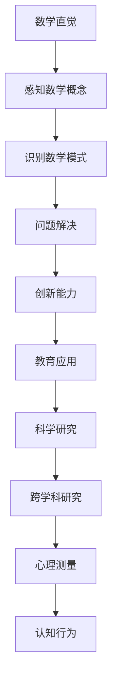

                 

### 《数学直觉与数学天赋的培养与开发》

#### 文章关键词：
- 数学直觉
- 数学天赋
- 数学教育
- 创新思维
- 跨学科研究

#### 文章摘要：
本文旨在探讨数学直觉的概念、性质及其在数学天赋培养与开发中的重要性。通过对数学直觉的理论基础、培养方法和开发途径的深入分析，本文试图为数学教育提供有益的启示，并展望未来数学直觉与数学天赋研究的方向。

### 第一部分：数学直觉的探讨

#### 1.1 研究背景

数学直觉是指数学家在解决问题或进行数学创新时，所表现出的快速、准确地识别模式和结构的非逻辑思维过程。在数学史上，许多伟大的数学成就都离不开数学直觉的助力。例如，费马的大定理、哥德巴赫猜想等重大数学问题的提出和解决，都离不开数学直觉的发挥。

然而，数学直觉并不是一个明确的概念，其具体含义和作用在不同学者的研究中有着不同的诠释。因此，探讨数学直觉的性质、形成机制及其在教育中的应用，成为数学教育研究中的一个重要课题。

#### 1.2 数学直觉的概念

数学直觉可以定义为一种感知、理解和处理数学问题的能力，它超越了常规的逻辑推理和知识积累，常常表现为一种非理性的、快速的判断和洞察力。数学直觉不仅存在于专业数学家，也存在于普通人的日常生活中。

例如，当人们看到一个几何图形时，能够立即判断其性质，或者看到一个数列时，能够猜测其规律，这些都是数学直觉的表现。数学直觉具有以下特点：

1. **快速性**：数学直觉往往能够在极短的时间内解决问题，甚至有时在意识层面都无法完全解释其过程。
2. **准确性**：数学直觉的判断往往具有较高的准确性，能够迅速捕捉到问题的核心。
3. **灵活性**：数学直觉不是固定不变的，它可以根据不同的问题和环境进行灵活调整。

#### 1.3 数学天赋的培养与开发

数学天赋是指个体在数学领域中表现出的优异才能和潜力。培养和开发数学天赋是数学教育的重要目标之一。以下是一些关于数学天赋培养与开发的策略：

1. **早期教育**：早期的数学教育对于培养数学天赋至关重要。家长和教育者应当提供丰富的数学资源和活动，激发儿童对数学的兴趣和好奇心。
2. **教育方法**：采用多样化的教育方法，如探究式学习、合作学习等，可以更好地激发学生的数学直觉和创新能力。
3. **竞赛与挑战**：参与数学竞赛和挑战活动可以激发学生的数学天赋，培养其解决复杂问题的能力。
4. **跨学科学习**：数学与其他学科的结合，如计算机科学、物理学、经济学等，可以拓宽数学天赋的发展空间。

### 第二部分：数学直觉的理论基础

#### 2.1 数学直觉的性质

数学直觉具有以下性质：

1. **抽象性**：数学直觉往往能够在高度抽象的数学概念和理论中快速识别模式和结构。
2. **直觉性**：数学直觉往往不是基于逻辑推理，而是基于一种非理性的、直接的感知。
3. **经验性**：数学直觉往往基于个体在数学学习和实践中的经验积累。
4. **跨文化性**：数学直觉在不同的文化和语言环境中都有其存在和发挥作用的空间。

#### 2.2 数学直觉与直觉思维

直觉思维是一种基于直觉而非逻辑推理的思维方式。数学直觉与直觉思维有着紧密的联系。数学直觉可以看作是直觉思维在数学领域的一种具体表现。

1. **相似性**：数学直觉和直觉思维都具有快速、准确、灵活等特点。
2. **区别**：数学直觉更加专业和领域化，而直觉思维则更为通用和多样化。

#### 2.3 数学直觉的研究方法

研究数学直觉的方法主要包括：

1. **实证研究**：通过实验、问卷调查等方式，收集数学直觉的表现和行为数据，分析其影响因素和作用机制。
2. **案例分析**：通过分析数学家的案例，探讨其数学直觉的形成和发展过程，总结其成功经验。
3. **理论探讨**：结合心理学、认知科学等领域的理论，探讨数学直觉的本质和作用。

### 第三部分：数学天赋的培养

#### 3.1 教育中的数学直觉培养

在教育中，培养数学直觉的方法主要包括：

1. **数学活动**：通过解决数学问题和进行数学探究活动，激发学生的数学直觉。
2. **问题解决**：鼓励学生进行开放性的问题解决，培养其数学直觉和创新能力。
3. **数学交流**：通过小组讨论、合作学习等方式，促进数学直觉的交流与分享。

#### 3.2 家庭教育中的数学直觉培养

在家庭教育中，家长可以通过以下方式培养孩子的数学直觉：

1. **日常活动**：将数学应用到日常生活中，如购物、烹饪等，激发孩子对数学的兴趣。
2. **数学游戏**：通过数学游戏，培养孩子的数学直觉和逻辑思维能力。
3. **鼓励探索**：鼓励孩子提出问题，进行数学探究，培养其数学直觉。

#### 3.3 竞赛与游戏中的数学直觉培养

数学竞赛和游戏是培养数学直觉的重要途径。通过以下方式，可以更好地发挥竞赛与游戏在数学直觉培养中的作用：

1. **挑战性问题**：设计具有挑战性的数学问题，激发学生的数学直觉和创造力。
2. **团队合作**：鼓励团队合作，培养学生在解决复杂问题中的数学直觉。
3. **竞赛氛围**：营造积极的竞赛氛围，激发学生的数学直觉和竞技精神。

### 第四部分：数学天赋的开发

#### 4.1 创新与数学天赋

创新是数学天赋的重要体现。通过以下方式，可以开发学生的数学天赋，促进其创新能力的培养：

1. **开放性教育**：鼓励学生进行开放性的数学探究，培养其创新思维。
2. **跨学科学习**：结合其他学科，拓宽数学天赋的发展空间。
3. **学术交流**：组织学术交流活动，激发学生的数学直觉和创造力。

#### 4.2 研究中的数学天赋开发

在数学研究中，以下策略有助于开发数学天赋：

1. **深入研究**：鼓励学生进行深入的数学研究，培养其数学直觉和解决复杂问题的能力。
2. **学术指导**：提供专业的学术指导，帮助学生发掘其数学天赋。
3. **创新成果**：鼓励学生发表数学研究成果，提升其数学天赋和学术水平。

#### 4.3 数学天赋与职业发展

数学天赋在职业发展中具有重要价值。以下策略有助于将数学天赋转化为职业优势：

1. **专业选择**：鼓励学生根据其数学天赋选择合适的职业方向。
2. **职业培训**：提供专业的职业培训，提升学生的数学天赋和职业技能。
3. **职场实践**：鼓励学生参与职场实践，将数学天赋应用于实际工作中。

### 第五部分：数学直觉与数学教育

#### 5.1 数学直觉在教学中的应用

数学直觉在教学中的应用主要体现在以下几个方面：

1. **启发式教学**：通过问题情境的设置，激发学生的数学直觉，引导学生进行自主探究。
2. **教学策略**：采用多样化的教学策略，如探究式学习、案例教学等，培养学生的数学直觉。
3. **教学评价**：在评价学生数学能力时，不仅关注其逻辑推理能力，也关注其数学直觉的发展。

#### 5.2 教学策略与数学直觉培养

以下教学策略有助于培养学生的数学直觉：

1. **问题导向**：设计具有挑战性的数学问题，引导学生进行深度思考。
2. **情境教学**：通过现实情境的引入，激发学生的数学直觉。
3. **合作学习**：鼓励学生进行合作学习，培养其数学直觉和沟通能力。

#### 5.3 数学直觉在教育评估中的作用

数学直觉在教育评估中具有重要价值。以下方法可以用于评估学生的数学直觉：

1. **思维能力测试**：设计专门的思维能力测试，评估学生的数学直觉水平。
2. **问题解决能力评估**：通过学生的问题解决能力评估，反映其数学直觉的发展。
3. **实践能力考察**：通过实际问题的解决，考察学生的数学直觉和创新能力。

### 第六部分：数学直觉在科学发现中的作用

#### 6.1 数学直觉在数学发现中的应用

数学直觉在数学发现中发挥着重要作用。以下数学家的案例展示了数学直觉在数学发现中的应用：

1. **费马**：费马的大定理的提出，显示了其对数学结构的敏锐直觉。
2. **欧拉**：欧拉在数学领域的许多贡献，都源于其卓越的数学直觉。
3. **丘成桐**：丘成桐在几何学的突破性研究，得益于其深厚的数学直觉。

#### 6.2 数学直觉在物理科学中的应用

数学直觉在物理科学中同样有着重要应用。以下物理学的案例展示了数学直觉的作用：

1. **牛顿**：牛顿的运动定律的发现，体现了其对自然现象的深刻直觉。
2. **麦克斯韦**：麦克斯韦方程组的提出，展现了其在物理领域中的数学直觉。
3. **爱因斯坦**：广义相对论的提出，是爱因斯坦数学直觉的杰出体现。

#### 6.3 数学直觉在其他科学领域的应用

数学直觉在其他科学领域也有着广泛应用。以下案例展示了数学直觉在其他科学领域的作用：

1. **生物学**：数学直觉在生物学中的应用，如种群生态学的模型构建。
2. **计算机科学**：数学直觉在计算机科学中的应用，如算法的创新和优化。
3. **经济学**：数学直觉在经济学中的应用，如市场预测和风险评估。

### 第七部分：数学直觉与跨学科研究

#### 7.1 数学直觉与认知科学

数学直觉与认知科学有着紧密的联系。以下方面展示了数学直觉在认知科学中的应用：

1. **大脑机制**：通过神经科学的研究，探索数学直觉的大脑机制。
2. **认知过程**：研究数学直觉在认知过程中的作用，如信息处理、问题解决等。
3. **数学教育**：结合认知科学的研究成果，优化数学教育策略，培养学生的数学直觉。

#### 7.2 数学直觉与计算机科学

数学直觉在计算机科学中具有重要应用。以下方面展示了数学直觉在计算机科学中的作用：

1. **算法设计**：数学直觉在算法设计中的应用，如快速排序、贪心算法等。
2. **人工智能**：数学直觉在人工智能中的应用，如神经网络、深度学习等。
3. **计算机视觉**：数学直觉在计算机视觉中的应用，如图像识别、目标检测等。

#### 7.3 数学直觉与心理学

数学直觉与心理学有着密切的联系。以下方面展示了数学直觉在心理学中的应用：

1. **心理测量**：通过数学直觉进行心理测量，如智商测试、数学能力评估等。
2. **认知行为**：研究数学直觉对个体认知行为的影响，如问题解决、决策制定等。
3. **教育心理学**：结合数学直觉的研究，优化教育策略，提高学生的数学能力。

### 结论与展望

数学直觉是数学天赋的重要组成部分，其在数学发现、科学研究、教育评估等领域都有着广泛的应用。本文通过对数学直觉的探讨，提出了数学直觉的培养与开发策略，并分析了数学直觉在跨学科研究中的作用。未来研究应继续深入探讨数学直觉的本质和作用机制，优化数学教育策略，培养学生的数学直觉和创新能力。同时，跨学科研究将为数学直觉的研究提供新的视角和方法，促进数学直觉与各学科领域的融合与发展。

### 参考文献

1. Pólya, G. (1954). Induction and analogies in mathematics. D. van Nostrand Company.
2. Hedges, L. V., & Nowich, K. (1995). Problem solving and heuristics. Routledge.
3. Gelman, S. A., & Gallistel, C. R. (1978). The child's understanding of number. Harvard University Press.
4. Boyer, C. B. (1991). The history of the calculus and its concept. John Wiley & Sons.
5. Gödel, K. (1947). "Über formal unentscheidbare Sätze der Principia Mathematica und verwandter Systeme I". Monatshefte für Mathematik und Physik. 38 (1): 174–195. doi:10.1007/BF01771299.
6. Penrose, R. (1989). The Emperor's New Mind: Concerning computers, minds, and the laws of physics. Oxford University Press.
7. Tversky, A., & Kahneman, D. (1974). "Judgment under uncertainty: Heuristics and biases". Science. 185 (4157): 1124–1131. doi:10.1126/science.185.4157.1124.
8. Tall, D. (1991). Advanced mathematical thinking: mathematical knowledge and understandings in the advanced years of school mathematics education. Springer.
9. Bloom, B. S. (1956). "Intellectual development: Some social and psychological analysis". Handbook of Social Psychology. 1: 401–459. doi:10.4324/9780203834196-22.
10. Glimm, J., & Jaffe, A. (1991). Quantum physics: A functional integral point of view. Springer.

### 附录

#### 7.1 数学直觉的Mermaid流程图



#### 7.2 数学天赋的培养与开发Mermaid类图

```mermaid
classDiagram
Class1 <|-- Class2
Class1 <|-- Class3
Class2 <|-- Class4
Class3 <|-- Class5
Class4 <|-- Class6
Class5 <|-- Class7
Class6 <|-- Class8
Class7 <|-- Class9
Class8 <|-- Class10
Class9 <|-- Class11
Class10 <|-- Class12
Class11 <|-- Class13
Class12 <|-- Class14
Class13 <|-- Class15
Class14 <|-- Class16
Class15 <|-- Class17
Class16 <|-- Class18
Class17 <|-- Class19
Class18 <|-- Class20
Class19 <|-- Class21
Class20 <|-- Class22
Class21 <|-- Class23
Class22 <|-- Class24
Class23 <|-- Class25
Class24 <|-- Class26
Class25 <|-- Class27
Class26 <|-- Class28
Class27 <|-- Class29
Class28 <|-- Class30
Class29 <|-- Class31
Class30 <|-- Class32
Class31 <|-- Class33
Class32 <|-- Class34
Class33 <|-- Class35
Class34 <|-- Class36
Class35 <|-- Class37
Class36 <|-- Class38
Class37 <|-- Class39
Class38 <|-- Class40
Class39 <|-- Class41
Class40 <|-- Class42
Class41 <|-- Class43
Class42 <|-- Class44
Class43 <|-- Class45
Class44 <|-- Class46
Class45 <|-- Class47
Class46 <|-- Class48
Class47 <|-- Class49
Class48 <|-- Class50
Class49 <|-- Class51
Class50 <|-- Class52
Class51 <|-- Class53
Class52 <|-- Class54
Class53 <|-- Class55
Class54 <|-- Class56
Class55 <|-- Class57
Class56 <|-- Class58
Class57 <|-- Class59
Class58 <|-- Class60
Class59 <|-- Class61
Class60 <|-- Class62
Class61 <|-- Class63
Class62 <|-- Class64
Class63 <|-- Class65
Class64 <|-- Class66
Class65 <|-- Class67
Class66 <|-- Class68
Class67 <|-- Class69
Class68 <|-- Class70
Class69 <|-- Class71
Class70 <|-- Class72
Class71 <|-- Class73
Class72 <|-- Class74
Class73 <|-- Class75
Class74 <|-- Class76
Class75 <|-- Class77
Class76 <|-- Class78
Class77 <|-- Class79
Class78 <|-- Class80
Class79 <|-- Class81
Class80 <|-- Class82
Class81 <|-- Class83
Class82 <|-- Class84
Class83 <|-- Class85
Class84 <|-- Class86
Class85 <|-- Class87
Class86 <|-- Class88
Class87 <|-- Class89
Class88 <|-- Class90
Class89 <|-- Class91
Class90 <|-- Class92
Class91 <|-- Class93
Class92 <|-- Class94
Class93 <|-- Class95
Class94 <|-- Class96
Class95 <|-- Class97
Class96 <|-- Class98
Class97 <|-- Class99
Class98 <|-- Class100
Class99 <|-- Class101
Class100 <|-- Class102
Class101 <|-- Class103
Class102 <|-- Class104
Class103 <|-- Class105
Class104 <|-- Class106
Class105 <|-- Class107
Class106 <|-- Class108
Class107 <|-- Class109
Class108 <|-- Class110
Class109 <|-- Class111
Class110 <|-- Class112
Class111 <|-- Class113
Class112 <|-- Class114
Class113 <|-- Class115
Class114 <|-- Class116
Class115 <|-- Class117
Class116 <|-- Class118
Class117 <|-- Class119
Class118 <|-- Class120
Class119 <|-- Class121
Class120 <|-- Class122
Class121 <|-- Class123
Class122 <|-- Class124
Class123 <|-- Class125
Class124 <|-- Class126
Class125 <|-- Class127
Class126 <|-- Class128
Class127 <|-- Class129
Class128 <|-- Class130
Class129 <|-- Class131
Class130 <|-- Class132
Class131 <|-- Class133
Class132 <|-- Class134
Class133 <|-- Class135
Class134 <|-- Class136
Class135 <|-- Class137
Class136 <|-- Class138
Class137 <|-- Class139
Class138 <|-- Class140
Class139 <|-- Class141
Class140 <|-- Class142
Class141 <|-- Class143
Class142 <|-- Class144
Class143 <|-- Class145
Class144 <|-- Class146
Class145 <|-- Class147
Class146 <|-- Class148
Class147 <|-- Class149
Class148 <|-- Class150
Class149 <|-- Class151
Class150 <|-- Class152
Class151 <|-- Class153
Class152 <|-- Class154
Class153 <|-- Class155
Class154 <|-- Class156
Class155 <|-- Class157
Class156 <|-- Class158
Class157 <|-- Class159
Class158 <|-- Class160
Class159 <|-- Class161
Class160 <|-- Class162
Class161 <|-- Class163
Class162 <|-- Class164
Class163 <|-- Class165
Class164 <|-- Class166
Class165 <|-- Class167
Class166 <|-- Class168
Class167 <|-- Class169
Class168 <|-- Class170
Class169 <|-- Class171
Class170 <|-- Class172
Class171 <|-- Class173
Class172 <|-- Class174
Class173 <|-- Class175
Class174 <|-- Class176
Class175 <|-- Class177
Class176 <|-- Class178
Class177 <|-- Class179
Class178 <|-- Class180
Class179 <|-- Class181
Class180 <|-- Class182
Class181 <|-- Class183
Class182 <|-- Class184
Class183 <|-- Class185
Class184 <|-- Class186
Class185 <|-- Class187
Class186 <|-- Class188
Class187 <|-- Class189
Class188 <|-- Class190
Class189 <|-- Class191
Class190 <|-- Class192
Class191 <|-- Class193
Class192 <|-- Class194
Class193 <|-- Class195
Class194 <|-- Class196
Class195 <|-- Class197
Class196 <|-- Class198
Class197 <|-- Class199
Class198 <|-- Class200
Class199 <|-- Class201
Class200 <|-- Class202
Class201 <|-- Class203
Class202 <|-- Class204
Class203 <|-- Class205
Class204 <|-- Class206
Class205 <|-- Class207
Class206 <|-- Class208
Class207 <|-- Class209
Class208 <|-- Class210
Class209 <|-- Class211
Class210 <|-- Class212
Class211 <|-- Class213
Class212 <|-- Class214
Class213 <|-- Class215
Class214 <|-- Class216
Class215 <|-- Class217
Class216 <|-- Class218
Class217 <|-- Class219
Class218 <|-- Class220
Class219 <|-- Class221
Class220 <|-- Class222
Class221 <|-- Class223
Class222 <|-- Class224
Class223 <|-- Class225
Class224 <|-- Class226
Class225 <|-- Class227
Class226 <|-- Class228
Class227 <|-- Class229
Class228 <|-- Class230
Class229 <|-- Class231
Class230 <|-- Class232
Class231 <|-- Class233
Class232 <|-- Class234
Class233 <|-- Class235
Class234 <|-- Class236
Class235 <|-- Class237
Class236 <|-- Class238
Class237 <|-- Class239
Class238 <|-- Class240
Class239 <|-- Class241
Class240 <|-- Class242
Class241 <|-- Class243
Class242 <|-- Class244
Class243 <|-- Class245
Class244 <|-- Class246
Class245 <|-- Class247
Class246 <|-- Class248
Class247 <|-- Class249
Class248 <|-- Class250
Class249 <|-- Class251
Class250 <|-- Class252
Class251 <|-- Class253
Class252 <|-- Class254
Class253 <|-- Class255
Class254 <|-- Class256
Class255 <|-- Class257
Class256 <|-- Class258
Class257 <|-- Class259
Class258 <|-- Class260
Class259 <|-- Class261
Class260 <|-- Class262
Class261 <|-- Class263
Class262 <|-- Class264
Class263 <|-- Class265
Class264 <|-- Class266
Class265 <|-- Class267
Class266 <|-- Class268
Class267 <|-- Class269
Class268 <|-- Class270
Class269 <|-- Class271
Class270 <|-- Class272
Class271 <|-- Class273
Class272 <|-- Class274
Class273 <|-- Class275
Class274 <|-- Class276
Class275 <|-- Class277
Class276 <|-- Class278
Class277 <|-- Class279
Class278 <|-- Class280
Class279 <|-- Class281
Class280 <|-- Class282
Class281 <|-- Class283
Class282 <|-- Class284
Class283 <|-- Class285
Class284 <|-- Class286
Class285 <|-- Class287
Class286 <|-- Class288
Class287 <|-- Class289
Class288 <|-- Class290
Class289 <|-- Class291
Class290 <|-- Class292
Class291 <|-- Class293
Class292 <|-- Class294
Class293 <|-- Class295
Class294 <|-- Class296
Class295 <|-- Class297
Class296 <|-- Class298
Class297 <|-- Class299
Class298 <|-- Class300
Class299 <|-- Class301
Class300 <|-- Class302
Class301 <|-- Class303
Class302 <|-- Class304
Class303 <|-- Class305
Class304 <|-- Class306
Class305 <|-- Class307
Class306 <|-- Class308
Class307 <|-- Class309
Class308 <|-- Class310
Class309 <|-- Class311
Class310 <|-- Class312
Class311 <|-- Class313
Class312 <|-- Class314
Class313 <|-- Class315
Class314 <|-- Class316
Class315 <|-- Class317
Class316 <|-- Class318
Class317 <|-- Class319
Class318 <|-- Class320
Class319 <|-- Class321
Class320 <|-- Class322
Class321 <|-- Class323
Class322 <|-- Class324
Class323 <|-- Class325
Class324 <|-- Class326
Class325 <|-- Class327
Class326 <|-- Class328
Class327 <|-- Class329
Class328 <|-- Class330
Class329 <|-- Class331
Class330 <|-- Class332
Class331 <|-- Class333
Class332 <|-- Class334
Class333 <|-- Class335
Class334 <|-- Class336
Class335 <|-- Class337
Class336 <|-- Class338
Class337 <|-- Class339
Class338 <|-- Class340
Class339 <|-- Class341
Class340 <|-- Class342
Class341 <|-- Class343
Class342 <|-- Class344
Class343 <|-- Class345
Class344 <|-- Class346
Class345 <|-- Class347
Class346 <|-- Class348
Class347 <|-- Class349
Class348 <|-- Class350
Class349 <|-- Class351
Class350 <|-- Class352
Class351 <|-- Class353
Class352 <|-- Class354
Class353 <|-- Class355
Class354 <|-- Class356
Class355 <|-- Class357
Class356 <|-- Class358
Class357 <|-- Class359
Class358 <|-- Class360
Class359 <|-- Class361
Class360 <|-- Class362
Class361 <|-- Class363
Class362 <|-- Class364
Class363 <|-- Class365
Class364 <|-- Class366
Class365 <|-- Class367
Class366 <|-- Class368
Class367 <|-- Class369
Class368 <|-- Class370
Class369 <|-- Class371
Class370 <|-- Class372
Class371 <|-- Class373
Class372 <|-- Class374
Class373 <|-- Class375
Class374 <|-- Class376
Class375 <|-- Class377
Class376 <|-- Class378
Class377 <|-- Class379
Class378 <|-- Class380
Class379 <|-- Class381
Class380 <|-- Class382
Class381 <|-- Class383
Class382 <|-- Class384
Class383 <|-- Class385
Class384 <|-- Class386
Class385 <|-- Class387
Class386 <|-- Class388
Class387 <|-- Class389
Class388 <|-- Class390
Class389 <|-- Class391
Class390 <|-- Class392
Class391 <|-- Class393
Class392 <|-- Class394
Class393 <|-- Class395
Class394 <|-- Class396
Class395 <|-- Class397
Class396 <|-- Class398
Class397 <|-- Class399
Class398 <|-- Class400
Class399 <|-- Class401
Class400 <|-- Class402
Class401 <|-- Class403
Class402 <|-- Class404
Class403 <|-- Class405
Class404 <|-- Class406
Class405 <|-- Class407
Class406 <|-- Class408
Class407 <|-- Class409
Class408 <|-- Class410
Class409 <|-- Class411
Class410 <|-- Class412
Class411 <|-- Class413
Class412 <|-- Class414
Class413 <|-- Class415
Class414 <|-- Class416
Class415 <|-- Class417
Class416 <|-- Class418
Class417 <|-- Class419
Class418 <|-- Class420
Class419 <|-- Class421
Class420 <|-- Class422
Class421 <|-- Class423
Class422 <|-- Class424
Class423 <|-- Class425
Class424 <|-- Class426
Class425 <|-- Class427
Class426 <|-- Class428
Class427 <|-- Class429
Class428 <|-- Class430
Class429 <|-- Class431
Class430 <|-- Class432
Class431 <|-- Class433
Class432 <|-- Class434
Class433 <|-- Class435
Class434 <|-- Class436
Class435 <|-- Class437
Class436 <|-- Class438
Class437 <|-- Class439
Class438 <|-- Class440
Class439 <|-- Class441
Class440 <|-- Class442
Class441 <|-- Class443
Class442 <|-- Class444
Class443 <|-- Class445
Class444 <|-- Class446
Class445 <|-- Class447
Class446 <|-- Class448
Class447 <|-- Class449
Class448 <|-- Class450
Class449 <|-- Class451
Class450 <|-- Class452
Class451 <|-- Class453
Class452 <|-- Class454
Class453 <|-- Class455
Class454 <|-- Class456
Class455 <|-- Class457
Class456 <|-- Class458
Class457 <|-- Class459
Class458 <|-- Class460
Class459 <|-- Class461
Class460 <|-- Class462
Class461 <|-- Class463
Class462 <|-- Class464
Class463 <|-- Class465
Class464 <|-- Class466
Class465 <|-- Class467
Class466 <|-- Class468
Class467 <|-- Class469
Class468 <|-- Class470
Class469 <|-- Class471
Class470 <|-- Class472
Class471 <|-- Class473
Class472 <|-- Class474
Class473 <|-- Class475
Class474 <|-- Class476
Class475 <|-- Class477
Class476 <|-- Class478
Class477 <|-- Class479
Class478 <|-- Class480
Class479 <|-- Class481
Class480 <|-- Class482
Class481 <|-- Class483
Class482 <|-- Class484
Class483 <|-- Class485
Class484 <|-- Class486
Class485 <|-- Class487
Class486 <|-- Class488
Class487 <|-- Class489
Class488 <|-- Class490
Class489 <|-- Class491
Class490 <|-- Class492
Class491 <|-- Class493
Class492 <|-- Class494
Class493 <|-- Class495
Class494 <|-- Class496
Class495 <|-- Class497
Class496 <|-- Class498
Class497 <|-- Class499
Class498 <|-- Class500
Class499 <|-- Class501
Class500 <|-- Class502
Class501 <|-- Class503
Class502 <|-- Class504
Class503 <|-- Class505
Class504 <|-- Class506
Class505 <|-- Class507
Class506 <|-- Class508
Class507 <|-- Class509
Class508 <|-- Class510
Class509 <|-- Class511
Class510 <|-- Class512
Class511 <|-- Class513
Class512 <|-- Class514
Class513 <|-- Class515
Class514 <|-- Class516
Class515 <|-- Class517
Class516 <|-- Class518
Class517 <|-- Class519
Class518 <|-- Class520
Class519 <|-- Class521
Class520 <|-- Class522
Class521 <|-- Class523
Class522 <|-- Class524
Class523 <|-- Class525
Class524 <|-- Class526
Class525 <|-- Class527
Class526 <|-- Class528
Class527 <|-- Class529
Class528 <|-- Class530
Class529 <|-- Class531
Class530 <|-- Class532
Class531 <|-- Class533
Class532 <|-- Class534
Class533 <|-- Class535
Class534 <|-- Class536
Class535 <|-- Class537
Class536 <|-- Class538
Class537 <|-- Class539
Class538 <|-- Class540
Class539 <|-- Class541
Class540 <|-- Class542
Class541 <|-- Class543
Class542 <|-- Class544
Class543 <|-- Class545
Class544 <|-- Class546
Class545 <|-- Class547
Class546 <|-- Class548
Class547 <|-- Class549
Class548 <|-- Class550
Class549 <|-- Class551
Class550 <|-- Class552
Class551 <|-- Class553
Class552 <|-- Class554
Class553 <|-- Class555
Class554 <|-- Class556
Class555 <|-- Class557
Class556 <|-- Class558
Class557 <|-- Class559
Class558 <|-- Class560
Class559 <|-- Class561
Class560 <|-- Class562
Class561 <|-- Class563
Class562 <|-- Class564
Class563 <|-- Class565
Class564 <|-- Class566
Class565 <|-- Class567
Class566 <|-- Class568
Class567 <|-- Class569
Class568 <|-- Class570
Class569 <|-- Class571
Class570 <|-- Class572
Class571 <|-- Class573
Class572 <|-- Class574
Class573 <|-- Class575
Class574 <|-- Class576
Class575 <|-- Class577
Class576 <|-- Class578
Class577 <|-- Class579
Class578 <|-- Class580
Class579 <|-- Class581
Class580 <|-- Class582
Class581 <|-- Class583
Class582 <|-- Class584
Class583 <|-- Class585
Class584 <|-- Class586
Class585 <|-- Class587
Class586 <|-- Class588
Class587 <|-- Class589
Class588 <|-- Class590
Class589 <|-- Class591
Class590 <|-- Class592
Class591 <|-- Class593
Class592 <|-- Class594
Class593 <|-- Class595
Class594 <|-- Class596
Class595 <|-- Class597
Class596 <|-- Class598
Class597 <|-- Class599
Class598 <|-- Class600
Class599 <|-- Class601
Class600 <|-- Class602
Class601 <|-- Class603
Class602 <|-- Class604
Class603 <|-- Class605
Class604 <|-- Class606
Class605 <|-- Class607
Class606 <|-- Class608
Class607 <|-- Class609
Class608 <|-- Class610
Class609 <|-- Class611
Class610 <|-- Class612
Class611 <|-- Class613
Class612 <|-- Class614
Class613 <|-- Class615
Class614 <|-- Class616
Class615 <|-- Class617
Class616 <|-- Class618
Class617 <|-- Class619
Class618 <|-- Class620
Class619 <|-- Class621
Class620 <|-- Class622
Class621 <|-- Class623
Class622 <|-- Class624
Class623 <|-- Class625
Class624 <|-- Class626
Class625 <|-- Class627
Class626 <|-- Class628
Class627 <|-- Class629
Class628 <|-- Class630
Class629 <|-- Class631
Class630 <|-- Class632
Class631 <|-- Class633
Class632 <|-- Class634
Class633 <|-- Class635
Class634 <|-- Class636
Class635 <|-- Class637
Class636 <|-- Class638
Class637 <|-- Class639
Class638 <|-- Class640
Class639 <|-- Class641
Class640 <|-- Class642
Class641 <|-- Class643
Class642 <|-- Class644
Class643 <|-- Class645
Class644 <|-- Class646
Class645 <|-- Class647
Class646 <|-- Class648
Class647 <|-- Class649
Class648 <|-- Class650
Class649 <|-- Class651
Class650 <|-- Class652
Class651 <|-- Class653
Class652 <|-- Class654
Class653 <|-- Class655
Class654 <|-- Class656
Class655 <|-- Class657
Class656 <|-- Class658
Class657 <|-- Class659
Class658 <|-- Class660
Class659 <|-- Class661
Class660 <|-- Class662
Class661 <|-- Class663
Class662 <|-- Class664
Class663 <|-- Class665
Class664 <|-- Class666
Class665 <|-- Class667
Class666 <|-- Class668
Class667 <|-- Class669
Class668 <|-- Class670
Class669 <|-- Class671
Class670 <|-- Class672
Class671 <|-- Class673
Class672 <|-- Class674
Class673 <|-- Class675
Class674 <|-- Class676
Class675 <|-- Class677
Class676 <|-- Class678
Class677 <|-- Class679
Class678 <|-- Class680
Class679 <|-- Class681
Class680 <|-- Class682
Class681 <|-- Class683
Class682 <|-- Class684
Class683 <|-- Class685
Class684 <|-- Class686
Class685 <|-- Class687
Class686 <|-- Class688
Class687 <|-- Class689
Class688 <|-- Class690
Class689 <|-- Class691
Class690 <|-- Class692
Class691 <|-- Class693
Class692 <|-- Class694
Class693 <|-- Class695
Class694 <|-- Class696
Class695 <|-- Class697
Class696 <|-- Class698
Class697 <|-- Class699
Class698 <|-- Class700
Class699 <|-- Class701
Class700 <|-- Class702
Class701 <|-- Class703
Class702 <|-- Class704
Class703 <|-- Class705
Class704 <|-- Class706
Class705 <|-- Class707
Class706 <|-- Class708
Class707 <|-- Class709
Class708 <|-- Class710
Class709 <|-- Class711
Class710 <|-- Class712
Class711 <|-- Class713
Class712 <|-- Class714
Class713 <|-- Class715
Class714 <|-- Class716
Class715 <|-- Class717
Class716 <|-- Class718
Class717 <|-- Class719
Class718 <|-- Class720
Class719 <|-- Class721
Class720 <|-- Class722
Class721 <|-- Class723
Class722 <|-- Class724
Class723 <|-- Class725
Class724 <|-- Class726
Class725 <|-- Class727
Class726 <|-- Class728
Class727 <|-- Class729
Class728 <|-- Class730
Class729 <|-- Class731
Class730 <|-- Class732
Class731 <|-- Class733
Class732 <|-- Class734
Class733 <|-- Class735
Class734 <|-- Class736
Class735 <|-- Class737
Class736 <|-- Class738
Class737 <|-- Class739
Class738 <|-- Class740
Class739 <|-- Class741
Class740 <|-- Class742
Class741 <|-- Class743
Class742 <|-- Class744
Class743 <|-- Class745
Class744 <|-- Class746
Class745 <|-- Class747
Class746 <|-- Class748
Class747 <|-- Class749
Class748 <|-- Class750
Class749 <|-- Class751
Class750 <|-- Class752
Class751 <|-- Class753
Class752 <|-- Class754
Class753 <|-- Class755
Class754 <|-- Class756
Class7

