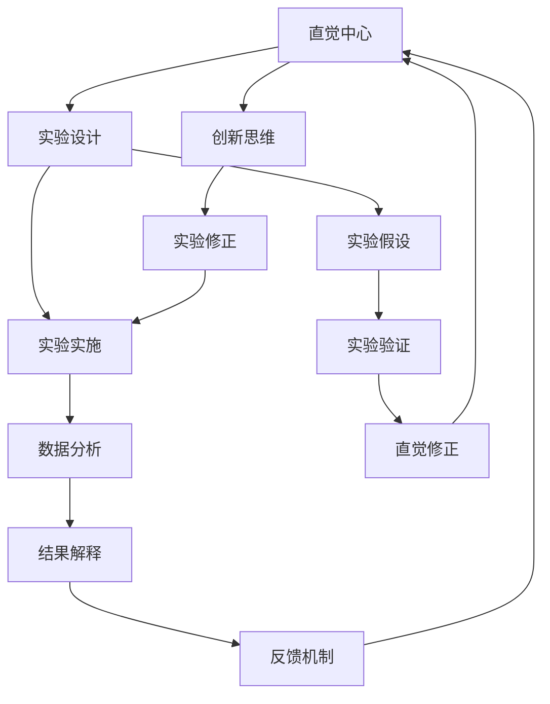

                 

### 文章标题

数学直觉与数学实验的关系分析

> 关键词：数学直觉、数学实验、关系模型、协同发展、应用前景

> 摘要：本文从数学直觉与数学实验的基本概念出发，探讨了二者之间的关系。通过分析数学直觉的特性、数学实验的类型和方法，以及数学直觉与数学实验的相互影响和关系模型，本文旨在揭示数学直觉在数学实验中的重要作用，并提出数学直觉与数学实验的优化策略和最佳实践。文章最后对数学直觉与数学实验的未来发展趋势进行了展望，以期为数学研究和数学教育提供有益的参考。

### 目录大纲

1. **数学直觉的基本概念**
   1.1 **问题背景与引入**
   1.2 **数学直觉的概念界定**
   1.3 **数学直觉的历史与演变**
   1.4 **数学直觉的重要性与作用**
   1.5 **数学直觉的特性**
   1.6 **数学直觉与逻辑思维的关系**
   1.7 **数学直觉与数学实验**
   1.8 **数学直觉的应用领域**
   1.9 **数学直觉与数学创造**
   1.10 **本章小结**

2. **数学实验的基本概念**
   2.1 **数学实验的定义与目的**
   2.2 **数学实验的类型与方法**
   2.3 **数学实验的过程与步骤**
   2.4 **数学实验的应用领域**
   2.5 **数学实验的挑战与展望**
   2.6 **本章小结**

3. **数学直觉与数学实验的关系研究**
   3.1 **数学直觉与数学实验的相互影响**
   3.2 **数学直觉与数学实验的关系模型**
   3.3 **数学直觉与数学实验的关系研究方法**
   3.4 **数学直觉与数学实验的关系案例研究**
   3.5 **数学直觉与数学实验的关系分析结论**
   3.6 **本章小结**

4. **数学直觉与数学实验的优化与应用**
   4.1 **数学直觉与数学实验的优化策略**
   4.2 **数学直觉与数学实验的最佳实践**
   4.3 **数学直觉与数学实验的应用前景**
   4.4 **数学直觉与数学实验的可持续发展**
   4.5 **本章小结**

5. **数学直觉与数学实验的综合案例分析**
   5.1 **案例分析一：数学直觉在数学实验中的应用**
   5.2 **案例分析二：数学实验对数学直觉的启示**
   5.3 **案例分析三：数学直觉与数学实验的协同创新**
   5.4 **案例分析总结**

### 引言

数学直觉和数学实验是数学研究中不可或缺的两个方面。数学直觉是指数学家在解题或研究过程中，通过经验、感知和灵感，迅速洞察问题本质、发现问题解决途径的能力。而数学实验则是通过设计、实施和分析实验，探索数学理论、发现数学现象和验证数学假设的过程。尽管二者在形式和内容上有所不同，但它们之间存在着密切的关系。

本文旨在探讨数学直觉与数学实验的关系，分析它们之间的相互影响和协同发展的机制。通过对数学直觉和数学实验的基本概念、特性、应用领域进行详细阐述，本文将揭示数学直觉在数学实验中的重要性和作用。同时，本文还将提出数学直觉与数学实验的优化策略和最佳实践，以期为数学研究和数学教育提供有益的参考。

首先，本文将从数学直觉的基本概念入手，介绍数学直觉的定义、历史演变、重要性以及特性。接着，本文将探讨数学直觉与逻辑思维的关系，分析数学直觉在数学实验中的作用和数学实验对数学直觉的影响。然后，本文将介绍数学实验的基本概念、类型和方法，以及数学实验在数学研究、数学教育和数学工程中的应用。在此基础上，本文将研究数学直觉与数学实验的关系模型，分析数学直觉与数学实验的相互影响和关系类型。接下来，本文将讨论数学直觉与数学实验的关系研究方法，并通过案例研究揭示数学直觉与数学实验的协同创新。最后，本文将提出数学直觉与数学实验的优化策略和最佳实践，展望数学直觉与数学实验的未来发展趋势。

### 第一部分：数学直觉的基本概念

#### 1.1 问题背景与引入

数学直觉作为数学研究中的一种重要能力，始终贯穿于数学家们的研究过程中。它不仅对数学理论的发现和创新起到了关键作用，而且还在数学教育中扮演着重要的角色。然而，数学直觉究竟是什么，如何定义和描述，一直是数学界探讨的热点问题。

在数学研究中，数学直觉通常表现为一种直觉思维过程。这种过程使数学家能够快速洞察问题的本质，发现潜在的数学规律，并产生创新性的数学猜想。然而，数学直觉并非一种可以直接观察或测量的能力，它更多体现在数学家在解题和研究过程中的心理活动和行为模式中。

数学直觉的重要性不言而喻。在数学理论的发展过程中，许多重大的数学突破和发现都依赖于数学直觉。例如，欧拉公式（\(e^{i\pi} + 1 = 0\)）的提出，阿基米德在研究球体体积时使用的“穷竭法”，以及黎曼几何中对黎曼猜想的猜想等，都是数学直觉的典型体现。此外，在数学教育中，数学直觉的培养对于提高学生的数学思维能力和创造力也至关重要。

尽管数学直觉在数学研究中发挥着重要作用，但对其本质和特性的研究仍然存在诸多挑战。首先，数学直觉的定义和描述较为抽象，缺乏具体的量化指标。其次，数学直觉与逻辑思维的关系尚需深入探讨，特别是在数学证明和理论构建中，如何平衡直觉与逻辑的互动。最后，数学直觉在数学实验中的应用和效果也需要进一步的实证研究。

本节将首先介绍数学直觉的概念界定，探讨其历史演变和重要性。接着，本文将详细分析数学直觉的特性，包括其基本特征、个体差异以及与逻辑思维的关系。通过这些分析，本文旨在为读者提供一个全面、深入的理解，为后续的讨论打下坚实的基础。

#### 1.2 数学直觉的概念界定

数学直觉作为一种高度复杂的心理现象，其定义和描述在数学界并未达成一致意见。然而，通过综合不同学者和专家的观点，我们可以对数学直觉进行一个较为全面的界定。

首先，数学直觉可以被视为一种基于经验和知识的快速认知过程，使数学家能够迅速地捕捉到问题的本质，产生创新性的数学猜想或解题策略。相较于逻辑推理，数学直觉更多依赖于潜意识、直觉思维和非线性思考，而非线性的、跳跃性的思维路径。例如，数学家在解决一个复杂问题时，可能会在短时间内灵光一闪，突然间找到了解决问题的线索。

从心理学角度来看，数学直觉可以被描述为一种认知过程，涉及感知、理解、判断和推理等多个认知维度。这种过程通常发生在数学家的潜意识中，而非显意识层面。这意味着，数学直觉的产生往往难以通过直接观察或测量来捕捉，更多体现在数学家在解决问题时的行为和思维模式中。例如，数学家在解决一个问题时，可能会迅速判断某个猜想或假设是否合理，而不需要经过详细的逻辑推理过程。

其次，数学直觉并非一种孤立的存在，它常常与数学家的知识背景、经验积累和认知风格密切相关。不同数学家的数学直觉可能存在显著的差异，这种差异不仅体现在对问题的洞察力上，还体现在解决问题的策略和方法上。例如，一些数学家可能更倾向于使用直观的几何图形来理解数学问题，而另一些数学家则可能更擅长通过代数方法来解决问题。

从哲学角度来看，数学直觉可以被看作是一种先验知识，即数学家在接触数学问题之前就具备的一种对数学本质的直觉感知。这种先验知识使数学家能够迅速地把握数学问题的核心，找到解决问题的关键。例如，在数学家研究一个新的数学领域时，他们可能会借助先验知识来预测新领域的发展方向和可能的突破点。

综上所述，数学直觉是一种高度复杂、多维度、跨学科的认知现象，涉及感知、理解、判断和推理等多个认知过程。它不仅是数学家在解决问题和理论构建中的关键能力，也是数学研究中一种独特的思维方式。通过综合不同学科的理论和观点，我们可以对数学直觉进行一个较为全面的界定，为进一步研究数学直觉的本质和作用提供理论基础。

#### 1.3 数学直觉的历史与演变

数学直觉的概念和重要性在数学史上有着悠久的演变过程。从古代数学家到现代数学家，数学直觉始终是推动数学发展的重要动力。

在古代，数学直觉的概念尚未得到明确的界定，但许多著名的数学家已经在他们的研究中展现出了强大的数学直觉能力。例如，古希腊数学家欧几里得通过几何直觉提出了《几何原本》，奠定了几何学的基础。阿基米德在研究浮力问题时，运用了数学直觉，提出了“穷竭法”来解决球体体积的计算问题，这一方法后来成为微积分的基础。这些古代数学家的直觉思维不仅推动了数学的发展，也为我们今天的数学研究提供了宝贵的启示。

随着数学的发展，数学直觉的概念逐渐得到重视。在19世纪，数学家卡尔·弗里德里希·高斯（Carl Friedrich Gauss）被认为是拥有强大数学直觉的代表人物之一。高斯在数学上的成就几乎涵盖了整个数学领域，他的许多研究成果都是通过直觉思维实现的。例如，他在研究椭圆曲线和数论问题时，凭借直觉提出了许多重要猜想和定理。高斯的数学直觉不仅体现在他的研究成果上，也体现在他对数学问题深刻的洞察力和对数学理论的预见性上。

进入20世纪，数学直觉的概念得到了更广泛的探讨和研究。数学家莱昂哈德·欧拉（Leonhard Euler）和卡尔·魏尔施特拉斯（Karl Weierstrass）在数学分析领域的研究中，充分体现了数学直觉的重要性。欧拉通过直觉思维提出了欧拉公式（\(e^{i\pi} + 1 = 0\)），这一公式在复分析和物理学中具有深远的影响。魏尔施特拉斯则通过直觉提出了函数序列收敛的概念，为现代实分析奠定了基础。

在当代数学中，数学直觉的研究和应用仍然具有重要意义。数学家安德鲁·怀尔斯（Andrew Wiles）在证明费马大定理的过程中，凭借直觉思维提出了关键性的“最后一步”，这一步骤的提出被认为是数学直觉在解决重大数学问题中的一个典型例子。怀尔斯的证明过程展示了数学直觉在创造性数学研究中的重要作用。

此外，数学直觉在数学教育中也被广泛关注。许多教育学家认为，数学直觉的培养对于提高学生的数学思维能力和创造力至关重要。通过激发学生的数学直觉，可以帮助他们更好地理解数学概念和理论，发现数学问题的解决方法。

综上所述，数学直觉在数学史上经历了漫长的演变过程。从古代的几何直觉到现代的数学直觉，数学直觉始终是推动数学发展的重要动力。通过回顾数学直觉的历史与演变，我们可以更深刻地理解数学直觉的本质和重要性，为现代数学研究和数学教育提供有益的启示。

#### 1.4 数学直觉的重要性与作用

数学直觉在数学研究中扮演着极其重要的角色，它不仅是数学家发现新理论和解决难题的关键能力，也是数学创新和进步的重要推动力。以下从数学直觉在问题发现、问题解决和理论创新三个方面详细阐述其重要性和作用。

首先，数学直觉在问题发现中起到了开路先锋的作用。数学家常常通过直觉来感知和识别潜在的问题，发现数学领域中的空白点和研究机会。例如，在19世纪，数学家卡尔·弗里德里希·高斯凭借其敏锐的数学直觉，发现了椭圆曲线的重要性质，这为后来的数学研究奠定了基础。高斯还通过直觉提出了数论中的一些重要猜想，如高斯猜想，这些猜想后来成为数学研究的热点问题。

其次，在问题解决过程中，数学直觉是一种强有力的工具。数学家在解决复杂问题时，往往依赖于直觉来找到解决问题的途径。这种直觉不仅帮助他们快速地抓住问题的主要特征，还能够激发出创新的解题方法。例如，阿基米德在解决球体体积计算问题时，通过直觉提出了“穷竭法”，这种方法后来成为微积分的重要基础。同样，莱昂哈德·欧拉在研究复分析和数论问题时，也依靠直觉发现了欧拉公式，这一公式在数学中具有重要地位。

最后，数学直觉在理论创新中发挥了关键作用。许多重大的数学理论和发现都源于数学家的直觉思维。例如，安德鲁·怀尔斯在证明费马大定理时，凭借直觉提出了“最后一步”，这一关键步骤的提出被认为是数学直觉在解决重大数学问题中的一个典范。怀尔斯的证明过程展示了数学直觉在创造性数学研究中的强大作用。此外，数学直觉还在数学理论的构建和扩展中发挥了重要作用。例如，在集合论的发展过程中，数学家们通过直觉思维提出了许多新的概念和理论，这些理论极大地丰富了数学的内容和结构。

总之，数学直觉在数学研究中具有不可替代的重要性和作用。它不仅帮助数学家发现新问题和解决难题，还推动了数学理论的创新和进步。通过培养和发挥数学直觉，数学家能够在数学研究中取得更多的突破和成就。因此，数学直觉的研究和培养对于数学的发展具有重要意义。

#### 1.5 数学直觉的特性

数学直觉作为一种独特的认知现象，具有多种复杂且独特的特性。以下将从数学直觉的基本特征、个体差异以及与逻辑思维的关系三个方面进行详细分析，以揭示数学直觉的深层本质。

首先，数学直觉的基本特征主要体现在以下几个方面：

1. **快速性**：数学直觉是一种快速认知过程，能够在短时间内捕捉问题的本质。数学家在解决问题时，往往能够迅速产生灵感或猜想，而不需要经过详细的逻辑推理过程。例如，在解决一个复杂的问题时，数学家可能在瞬间意识到某个潜在的解决思路，这种快速性是数学直觉的重要特征。

2. **直观性**：数学直觉往往表现为一种直观感受，数学家能够通过感官或直觉迅速理解数学问题。例如，在研究几何问题时，数学家可能会通过视觉直观地感受到某个几何图形的特性，从而提出相应的猜想或定理。

3. **非逻辑性**：尽管数学直觉在一定程度上与逻辑思维相关，但它本身并非完全依赖于逻辑推理。数学直觉更多依赖于潜意识、直觉思维和非线性思考，这意味着它往往涉及到跳跃性的思维路径，而非线性的推理过程。

4. **创造性**：数学直觉具有高度创造性，它能够帮助数学家产生新的数学概念、理论和方法。例如，在数论研究中，数学家可能通过直觉发现某种数论现象，从而提出新的猜想或定理。

其次，数学直觉在个体之间存在显著差异。不同数学家的数学直觉能力、认知风格和思维方式都有所不同，这种差异主要体现在以下几个方面：

1. **能力差异**：不同数学家的数学直觉能力存在差异，有的数学家可能在某些领域展现出极高的直觉能力，而在其他领域则相对较弱。例如，一些数学家可能在代数方面有很强的直觉，而另一些数学家则在几何或数论方面更为擅长。

2. **认知风格差异**：不同数学家的认知风格也会影响他们的数学直觉。例如，一些数学家可能更倾向于通过视觉直观来理解数学问题，而另一些数学家则可能更依赖代数或符号推理。

3. **文化背景差异**：数学直觉还受到文化背景的影响。不同文化背景的数学家可能在数学直觉的形成和发展过程中有不同的经验和方法，这可能导致他们在数学直觉上存在差异。

最后，数学直觉与逻辑思维之间存在复杂的关系。尽管数学直觉与逻辑思维在一定程度上相互独立，但它们之间也存在紧密的互动和影响：

1. **互补性**：数学直觉和逻辑思维具有互补性，数学家在解决问题时通常需要结合直觉和逻辑思维。例如，在提出一个猜想或定理时，数学家可能首先依赖于直觉来发现潜在的问题和解决途径，然后再通过逻辑推理来证明其正确性。

2. **依赖性**：数学直觉在一定程度上依赖于逻辑思维。数学家在运用直觉时，需要具备一定的逻辑推理能力，以确保他们的直觉猜想具有合理性。例如，在验证一个数学猜想时，数学家可能需要通过逻辑推理来推导出相应的数学公式或证明过程。

3. **互动性**：数学直觉和逻辑思维之间的互动不仅体现在解决问题和理论构建中，还体现在数学教育和人才培养中。通过培养和提升数学家的直觉和逻辑思维，可以促进他们在数学研究中的创新和发展。

综上所述，数学直觉作为一种独特的认知现象，具有快速性、直观性、非逻辑性和创造性等基本特征。同时，数学直觉在个体之间存在显著差异，不同数学家的直觉能力、认知风格和文化背景都会影响他们的数学直觉。此外，数学直觉与逻辑思维之间存在复杂的互补性、依赖性和互动性。通过对数学直觉特性的深入分析，我们可以更好地理解数学直觉的本质和作用，为数学研究和教育提供有益的启示。

#### 1.6 数学直觉与数学实验

数学直觉和数学实验在数学研究中各具特色，但又相互联系、相互促进。在这一节中，我们将探讨数学直觉在数学实验中的作用，以及数学实验对数学直觉的影响。

首先，数学直觉在数学实验中扮演了重要的角色。数学直觉能够帮助数学家在实验设计、数据分析和结果解释等各个环节中发挥关键作用。

1. **实验设计**：在数学实验中，数学直觉可以帮助数学家选择合适的实验方法、确定实验目标和预期结果。例如，在研究一个复杂的数学问题时，数学家可能通过直觉快速判断出哪些变量是关键因素，从而设计出更有效的实验方案。

2. **数据分析**：在实验过程中，数学直觉可以帮助数学家快速识别和分析数据，发现数据中的潜在规律和趋势。例如，在分析实验数据时，数学家可能通过直觉发现某种统计关系的存在，从而提出新的猜想或假设。

3. **结果解释**：在实验结果的分析和解释过程中，数学直觉同样发挥着重要作用。数学家通过直觉可以迅速判断实验结果的合理性，从而对实验数据进行进一步的验证和分析。例如，在验证一个数学猜想时，数学家可能通过直觉判断实验结果是否符合预期，从而决定是否进行进一步的数学证明。

其次，数学实验对数学直觉也产生了重要的影响。数学实验提供了丰富的数据和实验结果，这些数据和结果可以反过来验证和丰富数学家的直觉，从而促进数学直觉的发展。

1. **验证直觉**：数学实验的结果可以为数学家的直觉提供实证支持。例如，如果一个数学家通过直觉提出了一个猜想，数学实验的结果可以验证这个猜想的正确性，从而增强数学家的信心。

2. **修正直觉**：在实验过程中，如果数学实验的结果与直觉预测不符，数学家需要对直觉进行修正和调整。通过反复的实验验证和结果分析，数学家的直觉可以得到不断的完善和提升。

3. **扩展直觉**：数学实验可以揭示新的数学现象和规律，这些新的现象和规律可以扩展数学家的直觉范围，使他们在新的数学领域中继续发挥直觉作用。例如，通过实验发现的新数学模式或规律，可以帮助数学家在未来的研究中更准确地预测和解决数学问题。

综上所述，数学直觉和数学实验在数学研究中相互联系、相互促进。数学直觉在实验设计中提供了重要的指导，在数据分析和结果解释中发挥了关键作用；而数学实验则为数学直觉提供了验证和修正的机会，促进了数学直觉的发展。通过深入探讨数学直觉与数学实验的关系，我们可以更好地理解数学研究的方法和过程，为数学创新和进步提供新的思路和方法。

#### 1.7 数学直觉的应用领域

数学直觉在数学研究中具有广泛的应用领域，不仅体现在数学理论的发现和创新中，还贯穿于数学教育、数学工程和数学研究等各个层面。以下将详细探讨数学直觉在这些应用领域的具体表现和作用。

**1.7.1 数学直觉在数学研究中的应用**

数学直觉在数学研究中的应用是显而易见的。数学家常常通过直觉来发现新的数学理论、提出新的猜想和解决复杂的问题。以下是一些具体的应用实例：

- **问题发现**：数学家在研究数学问题时，往往依赖于直觉来感知问题的核心和关键。例如，安德鲁·怀尔斯在证明费马大定理时，就是通过直觉发现了关键的“最后一步”，这一步骤的提出是整个证明过程的关键。

- **理论构建**：数学直觉在构建新的数学理论中发挥了重要作用。数学家通过直觉可以快速构建新的数学框架，提出新的数学概念和理论。例如，卡尔·弗里德里希·高斯在研究数论问题时，凭借直觉提出了许多重要猜想和定理，这些猜想和定理为后来的数学研究奠定了基础。

- **问题解决**：数学直觉在解决复杂数学问题中起到了关键作用。数学家在解决复杂问题时，可以通过直觉找到解决问题的途径。例如，阿基米德在解决球体体积计算问题时，运用了数学直觉提出了“穷竭法”，这种方法后来成为微积分的基础。

**1.7.2 数学直觉在数学教育中的应用**

在数学教育中，数学直觉的培养对于提高学生的数学思维能力和创造力至关重要。以下是一些具体的应用实例：

- **启发式教学**：教师可以通过启发式教学激发学生的数学直觉。例如，在讲授几何问题时，教师可以通过展示几何图形的直观特性，引导学生通过直觉来理解几何概念和定理。

- **问题解决**：在数学解题教学中，教师可以引导学生运用数学直觉来发现问题的解决方案。通过培养学生的数学直觉，可以提升他们的解题能力和创造力。

- **创新教育**：在数学创新教育中，数学直觉的培养尤为重要。教师可以鼓励学生通过直觉来提出新的数学猜想和解决方法，从而激发他们的数学创造力和创新精神。

**1.7.3 数学直觉在数学工程中的应用**

数学直觉在数学工程中也具有广泛的应用。以下是一些具体的应用实例：

- **模型构建**：在数学工程中，数学家需要通过直觉来构建复杂的数学模型。例如，在研究流体力学问题时，数学家可以通过直觉提出合适的数学模型，从而更好地描述和分析流体的行为。

- **问题解决**：在工程问题解决过程中，数学直觉可以帮助工程师快速找到问题的解决方案。例如，在建筑设计中，工程师可以通过直觉来判断结构的稳定性，从而优化设计方案。

- **优化算法**：在优化问题中，数学直觉可以帮助工程师设计更有效的优化算法。例如，在优化路径规划问题时，工程师可以通过直觉选择合适的优化策略，从而提高路径规划的效率。

综上所述，数学直觉在数学研究、数学教育、数学工程等各个应用领域中发挥着重要作用。通过培养学生的数学直觉，可以提高他们的数学思维能力和创造力；而在数学研究和工程实践中，数学直觉则可以帮助数学家和工程师更有效地发现和解决问题。因此，深入研究数学直觉的应用领域，具有重要的理论和实践意义。

#### 1.8 数学直觉与数学创造

数学直觉在数学创造中起到了至关重要的作用，它是数学家在理论构建、猜想提出和问题解决过程中的一种强大工具。以下将详细探讨数学直觉与数学创造的关系，以及数学直觉在数学界的重要贡献。

首先，数学直觉在数学创造中表现为一种快速洞察问题本质和发现潜在规律的能力。数学家在研究新的数学问题时，常常依靠直觉来捕捉问题的核心，从而迅速产生新的理论和猜想。例如，在20世纪，数学家安德鲁·怀尔斯在证明费马大定理的过程中，通过直觉发现了关键性的“最后一步”，这一步骤的提出使得整个证明过程得以顺利完成。怀尔斯的证明过程充分展示了数学直觉在创造性数学研究中的强大作用。

其次，数学直觉在数学创造中起到了引导和启发的作用。数学家通过直觉可以迅速判断某个猜想或假设的合理性，从而确定进一步研究的方向。例如，卡尔·弗里德里希·高斯在研究数论问题时，通过直觉提出了许多重要猜想，如高斯猜想，这些猜想后来成为数论研究的重要基础。高斯的数学直觉不仅帮助他在数学研究中取得了巨大成就，也为后来的数学家提供了宝贵的启示。

此外，数学直觉在数学创造中还体现在对复杂数学问题的简化处理上。数学家通过直觉可以迅速找到问题的简化途径，从而将复杂问题转化为更易解决的子问题。例如，在研究几何问题时，数学家可以通过直觉找到问题的对称性或几何特性，从而简化问题的解决过程。这种简化处理不仅提高了问题解决的效率，也为数学理论的构建提供了新的思路。

数学直觉在数学界的重要贡献不仅体现在理论构建和问题解决上，还体现在数学教育和技术发展上。在数学教育中，数学直觉的培养对于提高学生的数学思维能力和创造力至关重要。通过激发学生的数学直觉，可以帮助他们更好地理解数学概念和理论，发现数学问题的解决方法。例如，在数学竞赛或研究性学习中，培养学生的数学直觉可以显著提高他们的解题能力和创新水平。

在技术发展方面，数学直觉同样发挥着重要作用。许多技术领域的突破都依赖于数学直觉，如计算机科学、物理学和工程学等。例如，在计算机科学中，许多算法和理论的发展都依赖于数学家的直觉思维，如哥德尔不完备定理和图灵机理论等。这些理论不仅为计算机科学的发展奠定了基础，也为其他技术领域提供了重要的理论支持。

综上所述，数学直觉在数学创造中具有不可替代的重要作用。它不仅帮助数学家发现新的理论和解决复杂问题，还促进了数学教育的进步和技术的发展。通过对数学直觉的深入研究，我们可以更好地理解数学创造的本质和过程，为未来的数学研究和应用提供新的思路和方法。因此，数学直觉的研究和实践对于数学界和科学技术的发展具有重要意义。

#### 1.9 本章小结

在本章中，我们详细探讨了数学直觉的基本概念、历史与演变、重要性以及特性，分析了数学直觉与逻辑思维的关系，讨论了数学直觉在数学实验中的作用，以及数学实验对数学直觉的影响。此外，我们还介绍了数学直觉在数学研究、数学教育和数学工程中的应用，并探讨了数学直觉与数学创造的关系。通过这些讨论，我们深入理解了数学直觉作为一种复杂的认知现象，在数学研究中的重要作用和独特价值。

首先，我们明确了数学直觉的定义和特性，包括其快速性、直观性、非逻辑性和创造性等方面。通过回顾数学直觉的历史与演变，我们了解到数学直觉在数学史上一直扮演着重要角色。接着，我们分析了数学直觉在数学研究中的重要性，特别是在问题发现、问题解决和理论创新等方面的贡献。此外，我们还探讨了数学直觉在数学教育和技术发展中的价值，强调了培养数学直觉的重要性。

通过本章的讨论，我们认识到数学直觉与数学实验之间存在紧密的关系，数学直觉在实验设计中、数据分析和结果解释中发挥着关键作用，而数学实验则为数学直觉提供了验证和修正的机会。这一相互促进的关系不仅推动了数学研究的发展，也为数学教育和技术创新提供了新的思路和方法。

综上所述，数学直觉作为一种独特的认知现象，不仅在数学研究中具有不可替代的重要作用，还在数学教育和技术发展中发挥着重要作用。通过深入研究和实践数学直觉，我们可以更好地理解数学的本质和过程，为数学的进步和科技的发展做出更大的贡献。

### 第二部分：数学实验的基本概念

#### 2.1 数学实验的定义与目的

数学实验作为一种科学研究方法，具有独特的定义和目的。首先，我们需要明确数学实验的定义。数学实验是指通过设计、实施和分析实验，探索数学理论、发现数学现象和验证数学假设的过程。与传统的实验方法不同，数学实验主要依赖于数学方法和工具，通过抽象的数学模型和数学计算来模拟和验证数学理论。

接下来，我们探讨数学实验的目的。数学实验的主要目的是：

1. **探索数学理论**：通过数学实验，可以探索和发现新的数学理论。例如，通过实验可以验证或推翻某个数学猜想，从而推动数学理论的发展。

2. **发现数学现象**：数学实验可以帮助我们发现数学领域中的新现象和规律。例如，通过实验可以揭示某些数学对象之间的复杂关系，或发现新的数学结构。

3. **验证数学假设**：数学实验的一个关键目的是验证数学假设的正确性。数学家在提出假设后，需要通过实验来验证这些假设是否符合实际。例如，通过实验可以验证某个数论猜想或几何性质。

此外，数学实验还有助于：

1. **验证数学理论的实际应用**：通过实验，可以验证数学理论在实际问题中的应用效果。例如，通过实验可以验证某个算法或模型的效率和准确性。

2. **改进数学理论**：通过实验结果的分析，可以找到数学理论中的不足之处，并提出改进建议。例如，通过实验发现某个数学模型在特定条件下表现不佳，从而促使数学家对模型进行改进。

综上所述，数学实验作为一种科学研究方法，不仅有助于探索和发现新的数学理论，还可以验证和改进已有理论，推动数学领域的发展。通过明确数学实验的定义和目的，我们可以更好地理解和应用数学实验方法，为数学研究提供新的思路和工具。

#### 2.2 数学实验的类型与方法

数学实验的类型和方法多种多样，根据实验目的、内容和手段的不同，可以分为传统数学实验和现代数学实验。以下将详细介绍这两种类型的数学实验，并探讨数学实验方法的创新与发展。

**2.2.1 传统数学实验**

传统数学实验主要依赖于数学分析和几何构造，通过公理系统、逻辑推理和数学计算来探索数学理论和验证数学假设。传统数学实验的核心在于利用数学工具和手段，通过严密的逻辑推理和计算来证明数学命题。

1. **定义与特点**：
   - **定义**：传统数学实验是指通过几何构造、代数运算和逻辑推理等手段，对数学问题进行实验性研究的过程。
   - **特点**：传统数学实验强调逻辑性和严密性，通过严格的数学证明来验证数学理论的正确性。

2. **应用领域**：
   - **几何学**：传统数学实验在几何学中有着广泛的应用。例如，通过几何构造来验证几何定理的正确性。
   - **数论**：在数论研究中，传统数学实验用于验证数论猜想和定理。例如，通过计算和构造来验证某个数论命题的真假。

3. **经典案例**：
   - **欧几里得几何**：欧几里得在《几何原本》中通过几何构造和逻辑推理，系统地证明了大量的几何定理。
   - **阿基米德的研究**：阿基米德通过几何构造和穷竭法来研究球体和锥体的体积，为后来的微积分奠定了基础。

**2.2.2 现代数学实验**

现代数学实验在传统数学实验的基础上，引入了计算机科学、统计学和数值分析等现代工具和方法，通过计算机模拟、数据分析和高性能计算等手段来探索和验证数学理论。

1. **定义与特点**：
   - **定义**：现代数学实验是指利用计算机技术、数值分析和统计方法，对数学问题进行实验性研究的过程。
   - **特点**：现代数学实验强调实验数据的分析和计算机技术的应用，通过实验结果来验证和发现数学理论。

2. **应用领域**：
   - **代数学**：现代数学实验在代数学中的应用非常广泛。例如，通过计算机模拟来研究代数结构的性质和分类。
   - **数论**：现代数学实验在数论中用于验证素数分布、同余方程等猜想。例如，通过计算机计算来验证某个数论命题的真假。
   - **几何学**：现代数学实验在几何学中的应用主要体现在计算机图形学和计算机辅助几何中。例如，通过计算机图形来验证几何定理。

3. **经典案例**：
   - **图灵机的模拟**：通过计算机模拟图灵机的运行，验证图灵机的计算能力和算法的正确性。
   - **素数分布的研究**：通过计算机计算和分析，验证素数分布的规律，为素数定理的证明提供了实验支持。

**2.2.3 数学实验方法的创新与发展**

随着科学技术的进步，数学实验方法也在不断创新和发展。以下是一些重要的创新和发展：

1. **高性能计算**：随着计算能力的提升，高性能计算在数学实验中的应用越来越广泛。通过超级计算机和并行计算技术，可以处理更复杂的数学问题和更大的数据集。

2. **机器学习**：机器学习技术开始应用于数学实验，通过数据分析和模式识别来发现数学现象和规律。例如，使用机器学习技术来预测数学模型的参数或验证数学猜想。

3. **数据可视化**：数据可视化技术在数学实验中的应用，使得数学家能够更直观地理解实验结果和数学现象。通过数据可视化，可以更清楚地展示数学实验的结果和趋势。

4. **跨学科研究**：数学实验方法开始与其他学科如物理学、生物学、经济学等结合，通过跨学科研究来探索新的数学现象和应用。例如，通过物理实验来验证数学模型，或通过经济数据分析来探索数学理论。

综上所述，数学实验的类型和方法多种多样，传统数学实验与现代数学实验相互补充，共同推动了数学领域的发展。通过不断创新和发展数学实验方法，数学家可以更深入地探索数学理论，发现新的数学现象，验证数学假设，为数学研究的进步提供新的动力。

#### 2.3 数学实验的过程与步骤

数学实验作为一种科学研究方法，其过程和步骤具有一定的规范性和科学性。以下是数学实验的基本过程和步骤，包括实验准备工作、实验实施过程以及数据分析和解释。

**2.3.1 实验准备工作**

实验准备工作是数学实验成功的关键。在开始实验前，需要进行充分的准备工作，确保实验的顺利进行和数据的可靠性。以下是实验准备工作的一些关键步骤：

1. **确定实验目的和问题**：首先需要明确实验的目的和研究问题。实验目的是指通过实验希望达到的目标，研究问题则是实验需要解决的数学问题或假设。

2. **设计实验方案**：根据实验目的和研究问题，设计合理的实验方案。实验方案包括实验方法、实验步骤、实验数据采集和处理方法等。实验方案的设计需要结合数学理论和实际需求，确保实验的科学性和可行性。

3. **准备实验工具和材料**：根据实验方案，准备所需的实验工具和材料。例如，如果需要使用计算机模拟，需要准备计算机硬件和软件；如果需要进行几何构造，需要准备绘图工具和几何模型。

4. **预实验**：在正式实验前，进行预实验以测试实验方案的有效性和可行性。预实验可以帮助发现实验中的潜在问题，及时调整实验方案和步骤。

**2.3.2 实验实施过程**

实验实施过程是数学实验的核心。在实验实施过程中，需要严格按照实验方案进行操作，确保实验数据的准确性和可靠性。以下是实验实施过程的一些关键步骤：

1. **数据采集**：根据实验方案，进行数据采集。数据采集可以通过多种方式实现，如计算机模拟、几何构造、数值计算等。数据采集需要确保数据的全面性和准确性，避免数据缺失或错误。

2. **实验操作**：按照实验方案进行实验操作。实验操作包括实施实验步骤、记录实验数据和监测实验过程等。在实验操作过程中，需要严格遵守实验规范，确保实验的安全性和有效性。

3. **数据记录**：在实验过程中，及时记录实验数据和相关信息。数据记录应详细、准确，以便后续的数据分析和解释。

4. **实验监控**：在实验过程中，对实验进行实时监控，确保实验的顺利进行。实验监控包括检查实验设备的状态、监控实验数据的实时变化等。

**2.3.3 数据分析与解释**

数据分析与解释是数学实验的关键环节。通过对实验数据的分析和解释，可以验证数学假设、发现数学现象和总结实验结果。以下是数据分析与解释的一些关键步骤：

1. **数据处理**：对实验数据进行处理，包括数据清洗、数据筛选和数据转换等。数据处理旨在提高数据的可靠性和可用性。

2. **统计分析**：使用统计分析方法对实验数据进行分析。统计分析可以帮助识别数据中的规律和趋势，验证数学假设。

3. **模型构建**：根据实验数据，构建数学模型来描述实验结果。数学模型可以帮助理解实验现象和验证数学理论。

4. **解释与结论**：对实验结果进行解释和总结，得出实验结论。实验结论应基于实验数据和统计分析结果，科学合理。

5. **实验反思**：对实验过程和结果进行反思，总结实验中的经验教训。实验反思有助于改进实验方法，提高实验质量和效果。

综上所述，数学实验的过程和步骤包括实验准备工作、实验实施过程和数据分析与解释。通过科学合理的实验设计、严谨的实验操作和深入的数据分析，数学实验可以为数学研究提供有力的支持和证据。

#### 2.4 数学实验的应用领域

数学实验作为一种独特的科学研究方法，广泛应用于数学研究、数学教育和数学工程等多个领域。以下将详细介绍数学实验在这些领域的应用，并探讨其具体作用和影响。

**2.4.1 数学实验在数学研究中的应用**

数学实验在数学研究中具有广泛的应用，特别是在验证数学理论、探索数学现象和解决复杂问题方面发挥了重要作用。

1. **验证数学理论**：数学实验可以用来验证数学理论的正确性。例如，在数论研究中，数学家可以通过实验来验证某个数论猜想，如素数分布的规律。通过计算机模拟和数值计算，数学家可以验证素数分布的统计规律，从而支持或推翻某个数论猜想。

2. **探索数学现象**：数学实验有助于发现数学领域中的新现象和规律。例如，在几何学研究中，通过计算机图形学，数学家可以探索几何图形的对称性和拓扑结构，从而发现新的几何现象。数学实验可以帮助数学家更深入地理解数学问题，发现潜在的数学规律。

3. **解决复杂问题**：数学实验在解决复杂数学问题中具有独特优势。例如，在代数学研究中，数学家可以通过实验来探索代数结构的性质和分类，从而解决复杂的代数问题。通过计算机模拟和数值计算，数学家可以找到复杂的代数结构之间的关联，提出新的猜想和定理。

**2.4.2 数学实验在数学教育中的应用**

数学实验在数学教育中也发挥着重要作用，通过激发学生的兴趣、提高学生的数学思维能力和创造力，从而提升数学教育质量。

1. **启发式教学**：数学实验可以用于启发式教学，帮助学生更好地理解数学概念和理论。通过数学实验，学生可以直观地看到数学问题的解决过程和结果，从而加深对数学概念的理解。

2. **问题解决**：数学实验可以帮助学生提高问题解决能力。在数学实验中，学生需要通过实验来探索问题的解决方案，从而培养他们的逻辑思维和创新能力。例如，通过数学实验，学生可以探索几何图形的属性和关系，从而发现几何定理的证明方法。

3. **创新教育**：数学实验可以用于创新教育，激发学生的数学创造力和创新精神。通过数学实验，学生可以提出新的数学猜想和解决方法，从而培养他们的创新思维和科学素养。

**2.4.3 数学实验在数学工程中的应用**

数学实验在数学工程中具有广泛的应用，特别是在算法设计、系统优化和工程问题解决方面发挥了重要作用。

1. **算法设计**：数学实验可以用于算法设计。例如，在计算机科学中，数学家可以通过实验来验证算法的正确性和效率，从而优化算法的设计和实现。通过数学实验，数学家可以找到更高效的算法，提高计算速度和精度。

2. **系统优化**：数学实验可以用于系统优化。例如，在工程系统中，数学家可以通过实验来分析系统的性能和稳定性，从而提出优化方案，提高系统的效率和可靠性。

3. **工程问题解决**：数学实验在解决工程问题中也具有重要意义。例如，在工程领域，数学家可以通过数学实验来验证工程设计的正确性和可行性，从而确保工程项目的成功实施。通过数学实验，数学家可以找到最佳的工程设计方案，提高工程项目的质量和效率。

综上所述，数学实验在数学研究、数学教育和数学工程等多个领域具有广泛的应用，通过验证数学理论、探索数学现象、解决复杂问题，激发学生兴趣、提高学生能力和创造力，优化算法设计和系统性能，数学实验为数学和工程的发展提供了重要的支持。随着数学实验方法的不断创新和发展，其应用领域和影响力将进一步扩大，为数学和工程领域的进步做出更大贡献。

#### 2.5 数学实验的挑战与展望

数学实验作为一种科学研究方法，虽然在数学领域、教育和工程中取得了显著成就，但仍面临诸多挑战，并且未来有着广阔的发展前景。

**2.5.1 数学实验的挑战**

首先，数学实验的科学性和可靠性是一个重要挑战。由于数学实验依赖于计算机模拟和数据分析，实验结果可能受到计算误差、数据噪声和模型假设的影响。为了提高实验的科学性和可靠性，需要进一步优化算法、改进数据处理方法，并建立严格的实验验证和验证机制。

其次，数学实验的数据量庞大，数据处理和分析成为一大难题。随着实验规模和数据量的增加，如何高效地处理和分析数据成为一个重要挑战。这需要开发更高效的算法、优化计算资源和采用先进的机器学习技术来处理海量数据。

另外，数学实验的跨学科合作也是一个挑战。数学实验往往需要多学科的知识和技术，如计算机科学、统计学、物理学等。然而，不同学科之间的知识体系和技术方法存在差异，如何实现有效跨学科合作，构建统一的实验平台，是一个需要解决的问题。

**2.5.2 数学实验的未来发展趋势**

未来，数学实验的发展将呈现以下趋势：

首先，随着计算能力的提升，高性能计算将在数学实验中发挥更大的作用。通过利用超级计算机和并行计算技术，可以处理更复杂的数学问题和更大的数据集，提高实验的效率和质量。

其次，机器学习和人工智能技术的应用将极大地推动数学实验的发展。通过机器学习算法，可以从海量数据中发现潜在的数学规律和模式，提高实验的预测能力和创新性。人工智能技术还可以辅助数学实验的数据分析和模型构建，提高实验的自动化和智能化水平。

此外，跨学科研究的深入将推动数学实验的多元化发展。数学实验将与其他学科如物理学、生物学、经济学等紧密结合，通过跨学科合作，探索新的数学现象和应用领域，推动数学理论的创新和工程实践的发展。

最后，数学实验的普及和推广也是一个重要趋势。随着数学实验方法的不断完善和普及，更多的数学家、学者和学生将能够参与到数学实验中来，促进数学研究和教育的普及与发展。

综上所述，尽管数学实验面临诸多挑战，但其未来发展趋势充满希望。通过提升计算能力、引入先进技术、加强跨学科合作和普及推广，数学实验将在数学和工程领域发挥更大的作用，推动科学技术的进步。

### 2.6 本章小结

本章对数学实验的基本概念进行了全面探讨，包括其定义与目的、类型与方法、过程与步骤以及应用领域。首先，明确了数学实验的定义和目的，强调了其在探索数学理论、验证数学假设和解决复杂问题中的重要性。接着，介绍了传统数学实验和现代数学实验的类型和方法，并探讨了数学实验方法的创新与发展。随后，详细描述了数学实验的过程与步骤，包括实验准备工作、实验实施过程和数据分析和解释。最后，阐述了数学实验在数学研究、数学教育和数学工程中的应用，并讨论了数学实验的挑战与未来发展趋势。通过这些讨论，我们深入理解了数学实验在推动数学研究和科技进步中的关键作用，为其未来发展提供了有益的启示。

### 第三部分：数学直觉与数学实验的关系研究

#### 3.1 数学直觉与数学实验的相互影响

数学直觉和数学实验在数学研究中具有密切的相互影响。一方面，数学直觉对数学实验具有指导作用；另一方面，数学实验对数学直觉也有促进作用。以下将详细探讨这两个方面，并分析数学直觉与数学实验的协同发展。

**3.1.1 数学直觉对数学实验的指导作用**

数学直觉在数学实验中起到了关键的指导作用。首先，数学直觉可以帮助数学家选择合适的实验方法和策略。在数学实验的设计阶段，数学直觉能够帮助数学家快速洞察问题的本质，确定关键变量和假设，从而设计出更有效的实验方案。例如，在研究某个数学猜想时，数学家可以通过直觉判断哪些变量对猜想的影响最大，从而集中资源和精力进行实验。

其次，数学直觉在实验实施过程中也具有重要作用。在实验过程中，数学直觉可以帮助数学家识别数据中的潜在规律和趋势。例如，在分析实验数据时，数学家可能会通过直觉迅速发现数据中的异常值或关键模式，从而及时调整实验方案或提出新的假设。此外，数学直觉还能帮助数学家在实验失败时找到问题的根源，提出改进措施，确保实验的顺利进行。

最后，数学直觉在实验结果分析阶段同样不可或缺。在实验结果分析中，数学直觉可以帮助数学家快速判断实验结果的合理性，识别潜在的问题和不足。通过直觉，数学家可以迅速提出进一步的假设或验证方案，确保实验结果的可靠性和科学性。例如，在验证某个数学猜想时，数学家可能会通过直觉判断实验结果是否与预期一致，从而决定是否需要进行进一步的实验验证。

**3.1.2 数学实验对数学直觉的促进作用**

数学实验不仅受到数学直觉的指导，同时也对数学直觉的发展起到了促进作用。首先，数学实验为数学家提供了丰富的数据和实验结果，这些数据和结果可以为数学直觉的验证和修正提供依据。例如，在实验过程中，如果数学家通过直觉提出的猜想与实验结果不符，数学家需要对直觉进行修正和调整，从而提高直觉的准确性和可靠性。

其次，数学实验有助于扩展数学家的直觉范围。通过实验，数学家可以探索新的数学现象和规律，从而扩展他们的直觉领域。例如，在研究某个数学问题时，数学家可能会通过实验发现新的数学结构或模式，这些发现可以帮助数学家更好地理解问题，提升他们的直觉能力。

此外，数学实验还可以激发数学家的创造力和创新精神。在实验过程中，数学家需要不断探索和尝试，这可以激发他们的直觉思维，促进新理论和方法的产生。例如，在数学实验中，数学家可能会通过直觉迅速产生一个新的猜想或假设，通过实验验证后，这一猜想或假设可能成为新的数学理论或方法，从而推动数学的发展。

**3.1.3 数学直觉与数学实验的协同发展**

数学直觉和数学实验的协同发展是数学研究的重要动力。数学直觉和数学实验相互依赖、相互促进，共同推动了数学的发展。

首先，数学直觉为数学实验提供了理论基础和方向。通过直觉，数学家可以快速识别问题、确定实验目标，从而设计出更有针对性的实验方案。数学直觉还可以帮助数学家在实验过程中快速判断数据的合理性，从而提高实验的科学性和准确性。

其次，数学实验为数学直觉提供了验证和修正的机会。通过实验，数学家可以验证直觉的准确性，识别其中的不足和错误，从而不断完善和提升直觉。此外，数学实验还可以帮助数学家发现新的数学现象和规律，扩展他们的直觉领域。

最后，数学直觉和数学实验的协同发展还可以促进数学创新的产生。通过结合直觉和实验，数学家可以提出新的理论和方法，解决复杂的数学问题。例如，在研究某个数学问题时，数学家可以通过直觉提出一个猜想，然后通过实验验证这一猜想的正确性，从而推动数学理论的发展。

综上所述，数学直觉和数学实验在数学研究中具有密切的相互影响和协同发展的关系。数学直觉为数学实验提供了指导和支持，而数学实验则为数学直觉提供了验证和修正的机会。通过数学直觉和数学实验的协同发展，数学家可以更好地探索数学理论，发现新的数学现象，推动数学研究的进步。

#### 3.2 数学直觉与数学实验的关系模型

在深入探讨数学直觉与数学实验的关系时，建立明确的关系模型有助于我们更好地理解二者之间的相互作用和影响机制。以下将分析数学直觉与数学实验的关系类型，构建关系模型，并对其进行详细解释。

**3.2.1 数学直觉与数学实验的关系类型**

1. **指导与反馈**：数学直觉在数学实验中起到指导作用，帮助设计实验方案、选择实验方法，并对实验过程中出现的数据进行分析和解释。同时，数学实验的结果可以为数学直觉提供反馈，帮助修正和验证直觉的正确性。

2. **互促发展**：数学直觉和数学实验相互促进，一方面，数学直觉为数学实验提供理论指导和方向；另一方面，数学实验为数学直觉提供验证和修正的机会，从而共同推动数学研究的进步。

3. **协同创新**：数学直觉和数学实验的结合可以激发数学创新。在实验过程中，数学直觉可以帮助数学家快速提出新的猜想和假设，并通过实验验证这些猜想，从而产生新的数学理论和方法。

**3.2.2 数学直觉与数学实验的关系模型构建**

为了更好地描述数学直觉与数学实验的关系，我们可以构建一个多维度、动态的关系模型。该模型包括以下关键要素：

1. **直觉中心**：代表数学家的直觉能力，包括直觉的产生、发展和修正。

2. **实验中心**：代表数学实验的设计、实施、分析和结果应用。

3. **交互通道**：描述数学直觉与数学实验之间的相互作用和影响路径。

4. **反馈机制**：描述实验结果对数学直觉的反馈和修正过程。

**3.2.3 数学直觉与数学实验的关系模型**

以下是数学直觉与数学实验的关系模型：

**模型解释**：

1. **指导与反馈路径**：数学直觉中心（A）通过实验设计（B）指导实验实施（C），实验结果（D）通过数据分析（E）反馈到直觉中心（A），形成反馈机制（F）。

2. **互促发展路径**：数学直觉中心（A）产生创新思维（G），这些思维通过实验修正（H）影响实验实施（C），促进实验的顺利进行。

3. **协同创新路径**：实验假设（I）通过实验验证（J）对直觉进行修正（K），修正后的直觉（K）进一步指导实验设计和实施。

通过构建这一关系模型，我们可以更清晰地理解数学直觉与数学实验之间的相互作用和影响机制，为数学研究提供理论支持和实践指导。

#### 3.3 数学直觉与数学实验的关系研究方法

研究数学直觉与数学实验的关系需要采用多种研究方法，以确保研究的全面性和准确性。以下将介绍定量研究方法、定性研究方法和混合研究方法，并分析这些方法的优缺点。

**3.3.1 定量研究方法**

定量研究方法主要依赖于数学模型和统计分析，通过数据收集和数据分析来揭示数学直觉与数学实验之间的关系。以下是一些常用的定量研究方法：

1. **实验设计**：通过设计有控制的实验，观察数学直觉在不同实验条件下的表现，从而分析数学直觉对实验结果的影响。实验设计需要确保实验条件的一致性和可比性，以提高实验结果的可靠性。

2. **数据分析**：使用统计分析方法，如回归分析、相关分析和因子分析，对实验数据进行处理和分析，揭示数学直觉与数学实验之间的定量关系。

3. **数值模拟**：通过计算机模拟，对数学直觉和数学实验的过程进行模拟和验证，以揭示它们之间的相互作用机制。

**优点**：

- **精确性**：定量研究方法通过数据分析和统计方法，能够提供精确的结果和结论，有助于揭示数学直觉与数学实验之间的具体关系。
- **可比性**：定量研究方法可以使不同实验条件下的结果进行对比，提高实验结果的可比性和可靠性。

**缺点**：

- **局限性**：定量研究方法主要依赖于数据和统计分析，可能无法全面反映数学直觉和数学实验的复杂性和多样性。
- **数据收集难度**：定量研究方法需要大量的数据收集，数据收集过程可能耗费大量时间和资源。

**3.3.2 定性研究方法**

定性研究方法主要依赖于观察、访谈和案例分析，通过描述性和解释性的方法来揭示数学直觉与数学实验之间的关系。以下是一些常用的定性研究方法：

1. **观察法**：通过直接观察数学家的研究过程，记录他们如何运用数学直觉进行实验设计和数据解释，从而分析数学直觉在数学实验中的作用。

2. **访谈法**：通过访谈数学家和其他相关人士，收集他们对数学直觉和数学实验的看法和经验，从而探讨数学直觉与数学实验的关系。

3. **案例研究**：通过研究具体的数学实验案例，分析数学直觉在实验过程中的表现和作用，从而总结数学直觉与数学实验的关系模式。

**优点**：

- **全面性**：定性研究方法可以全面反映数学直觉和数学实验的复杂性和多样性，有助于深入理解它们之间的互动关系。
- **灵活性**：定性研究方法可以根据研究目的和需求灵活调整，适应不同的研究场景。

**缺点**：

- **主观性**：定性研究方法依赖于研究者的主观判断和解释，可能存在主观偏差。
- **可靠性**：定性研究方法的结果可能缺乏定量验证，难以确保结果的普遍性和可靠性。

**3.3.3 混合研究方法**

混合研究方法结合了定量和定性研究方法的优势，通过综合使用多种研究方法来揭示数学直觉与数学实验的关系。以下是一些常用的混合研究方法：

1. **多方法综合**：结合定量和定性方法，对数学直觉和数学实验进行综合分析，以获取全面、准确的结论。

2. **交叉验证**：使用定量和定性方法对同一问题进行验证，提高研究结果的可靠性和普遍性。

3. **多层次分析**：从多个角度和层次分析数学直觉和数学实验的关系，以揭示其复杂的互动机制。

**优点**：

- **全面性**：混合研究方法可以综合定量和定性方法的优势，全面反映数学直觉和数学实验的复杂性和多样性。
- **可靠性**：通过交叉验证和多层次分析，提高研究结果的可靠性和普遍性。

**缺点**：

- **复杂性**：混合研究方法需要协调和整合多种研究方法，可能增加研究的时间和成本。
- **协调难度**：定量和定性方法在理论基础、数据收集和分析方法等方面存在差异，需要有效协调和整合。

综上所述，研究数学直觉与数学实验的关系需要采用多种研究方法，以确保研究的全面性和准确性。定量研究方法、定性研究方法和混合研究方法各有优缺点，应根据研究目的和需求选择合适的研究方法，以揭示数学直觉与数学实验之间的相互作用和影响机制。

#### 3.4 数学直觉与数学实验的关系案例研究

为了更深入地理解数学直觉与数学实验之间的关系，本节将通过几个具体案例研究，揭示数学直觉在数学实验中的应用和作用，以及数学实验对数学直觉的启示和影响。

**3.4.1 案例一：数学直觉在数学实验中的应用**

案例一来自数学家安德鲁·怀尔斯在证明费马大定理的过程中。怀尔斯在研究过程中，凭借数学直觉提出了一个关键性的猜想，即“模形式理论”可以用来证明费马大定理。这一猜想为费马大定理的证明提供了全新的思路，并最终引导他成功证明了这一著名难题。

具体过程如下：

1. **提出猜想**：怀尔斯通过多年的研究和思考，直觉地意识到模形式理论在解决费马大定理中的作用。他相信，通过这一理论可以证明费马大定理。

2. **设计实验**：为了验证他的猜想，怀尔斯设计了一系列数学实验，包括构建模形式、验证相关性质和构造证明过程。

3. **数据验证**：通过实验，怀尔斯成功验证了模形式理论在解决费马大定理中的有效性，为证明费马大定理奠定了基础。

4. **实验结果**：最终，怀尔斯通过数学实验和直觉思维，成功证明了费马大定理，这一结果在数学界引起了广泛关注和赞誉。

这个案例展示了数学直觉在数学实验中的应用和作用。怀尔斯通过直觉提出猜想，并通过实验验证了这一猜想的正确性，从而推动了费马大定理的证明。这表明，数学直觉不仅可以帮助数学家快速提出猜想，还可以通过实验验证这些猜想，为数学研究提供有力支持。

**3.4.2 案例二：数学实验对数学直觉的启示**

案例二来自数学家莱昂哈德·欧拉在研究欧拉公式（\(e^{i\pi} + 1 = 0\)）的过程中。欧拉通过一系列数学实验，发现了这一重要公式的复杂结构和美妙性质，从而揭示了数学直觉在数学实验中的启示作用。

具体过程如下：

1. **实验设计**：欧拉设计了一系列数学实验，包括研究复数的指数函数、三角函数和指数函数之间的关系。

2. **数据分析**：通过实验，欧拉发现了复数指数函数和三角函数之间的一些有趣关系，如欧拉公式。

3. **结果验证**：欧拉通过数学计算和几何构造，验证了欧拉公式的正确性和美妙性质。

4. **实验启示**：欧拉通过实验发现，数学直觉可以引导数学家发现新的数学关系和公式。欧拉公式不仅揭示了复分析中的深刻性质，也为后来的数学研究提供了新的思路和方法。

这个案例展示了数学实验对数学直觉的启示作用。欧拉通过实验发现新的数学关系和公式，这些发现不仅验证了他的直觉，也激发了新的数学研究。这表明，数学实验可以激发数学家的直觉思维，帮助他们发现新的数学现象和规律，从而推动数学的发展。

**3.4.3 案例三：数学直觉与数学实验的协同创新**

案例三来自数学家卡尔·弗里德里希·高斯在研究数论问题时。高斯通过数学直觉和实验，提出了一系列重要猜想和定理，为现代数论的发展奠定了基础。

具体过程如下：

1. **提出猜想**：高斯通过直觉提出了许多数论猜想，如高斯猜想、二次互反律等。

2. **设计实验**：为了验证这些猜想，高斯设计了一系列数学实验，包括数值计算、几何构造和代数运算。

3. **数据分析**：通过实验，高斯验证了他的许多猜想，并证明了这些猜想的正确性。

4. **协同创新**：高斯通过数学直觉和实验的协同创新，提出了一系列重要的数论定理和公式，推动了现代数论的发展。

这个案例展示了数学直觉与数学实验的协同创新。高斯通过直觉提出猜想，并通过实验验证这些猜想，从而推动了数论的发展。这表明，数学直觉和数学实验的协同作用可以激发数学家的创新思维，产生重要的数学成果。

**3.4.4 案例总结**

通过上述案例研究，我们可以看到数学直觉与数学实验之间的密切关系。数学直觉在数学实验中发挥了重要作用，不仅帮助数学家提出猜想和发现新现象，还通过实验验证和修正直觉。同时，数学实验也为数学直觉提供了启示和验证，促进了数学直觉的发展。数学直觉与数学实验的协同作用，推动了数学的进步和创新。

### 3.5 数学直觉与数学实验的关系分析结论

通过对数学直觉与数学实验关系的深入分析，我们可以得出以下结论：

首先，数学直觉与数学实验之间存在密切的相互作用和影响。数学直觉在数学实验中起到了指导作用，帮助设计实验方案、选择实验方法，并在实验实施和结果分析过程中提供关键的思维支持。同时，数学实验的结果可以为数学直觉提供反馈和验证，帮助修正和验证直觉的正确性。这种相互影响不仅提高了数学实验的科学性和可靠性，也促进了数学直觉的发展。

其次，数学直觉与数学实验的协同作用在数学研究中具有显著的意义。数学直觉可以帮助数学家快速提出创新性的猜想和假设，而数学实验则可以验证这些猜想和假设的合理性。通过数学直觉和数学实验的协同创新，数学家可以更有效地探索数学理论、发现新的数学现象，推动数学研究的进步。

此外，数学直觉与数学实验的关系模型为我们提供了深入理解二者之间互动机制的理论基础。通过构建和验证数学直觉与数学实验的关系模型，我们可以更好地把握数学直觉和数学实验的相互作用机制，从而为数学研究和教育提供理论支持和实践指导。

最后，数学直觉与数学实验的关系研究揭示了数学直觉在数学研究中的关键作用。数学直觉不仅是数学家在解决问题和理论构建中的关键能力，也是数学创新和进步的重要动力。通过深入研究数学直觉与数学实验的关系，我们可以更好地理解数学直觉的本质和作用，为数学教育和人才培养提供有益的启示。

综上所述，数学直觉与数学实验之间的关系复杂且密切，二者相互促进、协同发展，共同推动了数学研究的进步。通过深入分析和研究数学直觉与数学实验的关系，我们可以更好地理解数学直觉的本质和作用，为数学研究和教育提供新的思路和方法。

### 3.6 本章小结

在本章中，我们系统地研究了数学直觉与数学实验的关系。首先，通过案例分析，我们揭示了数学直觉在数学实验中的应用和作用，以及数学实验对数学直觉的启示和影响。接着，我们探讨了数学直觉与数学实验的相互作用和影响机制，建立了数学直觉与数学实验的关系模型。随后，我们介绍了定量研究方法、定性研究方法和混合研究方法，并分析了这些方法的优缺点。最后，我们总结了数学直觉与数学实验的关系分析结论，强调了数学直觉在数学研究中的关键作用。

通过本章的研究，我们深入理解了数学直觉与数学实验之间的复杂关系，揭示了数学直觉在数学实验中的重要作用。这不仅为数学研究和数学教育提供了新的理论支持和实践指导，也为我们进一步探索数学直觉的本质和作用奠定了基础。未来，随着数学实验方法的不断创新和发展，数学直觉与数学实验的关系研究将不断深入，为数学的进步和科技的发展做出更大的贡献。

### 第四部分：数学直觉与数学实验的优化与应用

#### 4.1 数学直觉与数学实验的优化策略

在数学研究和数学实验中，优化数学直觉和数学实验的方法和策略是提高研究效率和成果质量的关键。以下将介绍几种常见的优化策略，包括数学直觉的优化方法、数学实验的优化方法和数学直觉与数学实验的协同优化策略。

**4.1.1 数学直觉的优化方法**

1. **经验积累**：数学直觉的培养需要长期的实践和经验积累。数学家应积极参与各种数学研究活动，通过解决实际问题来积累经验。通过不断实践，数学家可以提升对数学问题的洞察力和解决问题的能力。

2. **理论学习**：理论学习是提升数学直觉的重要途径。数学家应深入学习数学理论，掌握各种数学方法和工具。通过理论学习，数学家可以增强对数学问题的理解，提高直觉思维的准确性和科学性。

3. **跨学科学习**：跨学科学习可以拓宽数学家的视野，促进直觉思维的多元化。数学家应学习其他学科的知识，如物理学、计算机科学、统计学等，以便在解决数学问题时能够运用跨学科的思维和方法。

4. **思维训练**：思维训练是提高数学直觉的重要手段。数学家可以通过逻辑思维训练、批判性思维训练和创造性思维训练等，提升自己的思维能力和直觉思维的质量。

**4.1.2 数学实验的优化方法**

1. **实验设计优化**：优化数学实验设计是提高实验效果的关键。数学家应充分考虑实验的目的、假设和变量，设计出科学合理、简便有效的实验方案。通过优化实验设计，可以减少实验误差，提高实验结果的可靠性。

2. **数据采集优化**：数据采集是数学实验的基础。优化数据采集方法可以减少数据噪声，提高数据的准确性和完整性。数学家应选择合适的测量工具和技术，确保数据采集的精确性和可靠性。

3. **数据分析优化**：数据分析是数学实验的核心。优化数据分析方法可以提高数据的处理和分析效率，揭示数据中的潜在规律和趋势。数学家应运用先进的统计分析方法、机器学习和人工智能技术，对数据进行深入分析和解释。

4. **实验结果优化**：优化实验结果的处理和解释可以提高实验结果的科学性和应用价值。数学家应通过对实验结果的多角度分析和综合评价，确保实验结论的可靠性和有效性。

**4.1.3 数学直觉与数学实验的协同优化策略**

1. **结合理论和方法**：数学直觉与数学实验的协同优化需要结合理论和方法。数学家应在实验过程中运用数学理论和方法，通过理论指导实验设计和数据分析，提高实验的科学性和可靠性。

2. **跨学科合作**：跨学科合作可以促进数学直觉与数学实验的协同优化。数学家可以与其他学科专家合作，利用其他学科的知识和方法，提高数学直觉和数学实验的效率和效果。

3. **迭代改进**：数学直觉与数学实验的协同优化是一个持续迭代的过程。数学家应通过不断反思和改进，优化数学直觉和数学实验的方法和策略，提高研究的质量和成果。

4. **技术支持**：现代技术为数学直觉与数学实验的协同优化提供了有力支持。数学家可以运用计算机技术、数据分析技术和人工智能技术，提高数学直觉和数学实验的效率和效果。

综上所述，优化数学直觉和数学实验的方法和策略对于提高数学研究的效率和质量具有重要意义。通过经验积累、理论学习、思维训练、实验设计优化、数据采集优化、数据分析优化和实验结果优化等多种策略，数学家可以不断提升数学直觉和数学实验的能力，推动数学研究的进步。

#### 4.2 数学直觉与数学实验的最佳实践

数学直觉与数学实验的最佳实践是确保数学研究和教育成果质量的重要途径。以下将介绍数学直觉与数学实验的最佳实践案例、策略和成果，以及如何在实际应用中发挥其最大效益。

**4.2.1 最佳实践案例**

**案例一：数学直觉在数学实验中的应用**

安德鲁·怀尔斯在证明费马大定理的过程中，通过数学直觉提出了关键性的“最后一步”。他通过直觉判断出费马大定理可以通过模形式理论来证明。这一直觉不仅为证明提供了方向，还推动了整个证明过程的顺利进行。通过实验验证，怀尔斯最终成功证明了费马大定理。

**案例二：数学实验对数学直觉的启示**

莱昂哈德·欧拉在研究欧拉公式（\(e^{i\pi} + 1 = 0\)）的过程中，通过实验发现复数指数函数和三角函数之间的一些有趣关系。这些实验结果启示了欧拉，使他提出了欧拉公式。通过数学实验，欧拉不仅验证了公式的正确性，还揭示了复分析中的重要性质。

**案例三：数学直觉与数学实验的协同创新**

卡尔·弗里德里希·高斯在研究数论问题时，通过数学直觉提出了许多重要猜想，如高斯猜想。为了验证这些猜想，高斯设计了一系列数学实验。通过实验验证，高斯不仅证明了猜想的正确性，还推动了现代数论的发展。这一案例展示了数学直觉与数学实验的协同创新作用。

**4.2.2 最佳实践策略**

1. **结合理论与直觉**：在数学研究中，最佳实践策略之一是将数学理论与直觉相结合。数学家应通过理论学习增强对数学问题的理解，同时依靠直觉发现潜在的创新点和解决方案。这种结合可以提升研究的科学性和创造性。

2. **重视实验设计**：在数学实验中，最佳实践策略之一是重视实验设计。数学家应充分考虑实验目的、假设和变量，设计出科学合理、简便有效的实验方案。通过优化实验设计，可以提高实验结果的可靠性和有效性。

3. **充分利用数据**：在数据分析过程中，最佳实践策略之一是充分利用数据。数学家应运用先进的统计分析方法、机器学习和人工智能技术，对实验数据进行分析和处理。通过深入分析数据，可以揭示数据中的潜在规律和趋势，为研究提供有力支持。

4. **跨学科合作**：在数学研究和教育中，最佳实践策略之一是跨学科合作。数学家可以与其他学科专家合作，利用其他学科的知识和方法，提高研究的效率和效果。跨学科合作可以促进创新，推动数学研究的发展。

**4.2.3 最佳实践成果**

最佳实践在数学研究和教育中取得了显著成果。通过结合数学理论与直觉，数学家发现了许多重要的数学理论和方法，如费马大定理、欧拉公式和高斯猜想等。通过优化实验设计和充分利用数据，数学家验证了这些理论和方法，推动了数学研究的进步。

跨学科合作也为数学研究带来了新的机遇。例如，计算机科学和统计学的方法被广泛应用于数学研究，推动了数学理论的计算机化和统计化发展。这些成果不仅丰富了数学的内容和结构，也为数学应用领域提供了新的思路和方法。

**4.2.4 实际应用效益**

最佳实践在数学研究和教育中发挥了重要作用，具有显著的实际应用效益。通过优化数学直觉和数学实验的方法和策略，数学家可以更有效地探索数学理论、发现新的数学现象，推动数学研究的进步。同时，最佳实践也为数学教育提供了有益的启示，帮助学生培养数学直觉和实验能力，提高他们的数学素养和创新能力。

总之，数学直觉与数学实验的最佳实践在数学研究和教育中具有重要价值。通过结合理论与直觉、优化实验设计、充分利用数据和跨学科合作，数学家可以更有效地推动数学研究的发展，为数学教育提供有益的参考。

#### 4.3 数学直觉与数学实验的应用前景

随着数学研究和科技发展的不断推进，数学直觉与数学实验的应用前景日益广阔。以下从科学研究、数学教育和数学工程三个领域，探讨数学直觉与数学实验的应用前景。

**4.3.1 科学研究中的应用前景**

在科学研究领域，数学直觉与数学实验的结合将为探索新的科学现象和解决复杂问题提供强大的工具。首先，数学直觉可以引导科学家设计更有效的实验方案，通过直觉快速捕捉问题的核心和关键。例如，在物理学研究中，数学直觉可以帮助科学家预测新的物理现象和理论，从而指导实验设计和数据分析。

其次，数学实验可以验证科学家的直觉猜想，提供实证支持。例如，在生物学研究中，数学实验可以帮助验证基因调控网络的规律和机制，从而推动生物学理论的创新。此外，数学直觉与数学实验的结合还可以推动跨学科研究的发展。例如，在量子计算研究中，数学直觉可以帮助设计新的量子算法，而数学实验可以验证这些算法的性能和效率。

**4.3.2 数学教育中的应用前景**

在数学教育领域，数学直觉与数学实验的结合具有巨大的潜力。首先，数学直觉的培养可以提升学生的数学思维能力和创造力。通过激发学生的数学直觉，教师可以帮助他们更好地理解数学概念和理论，发现问题的解决方法。例如，在几何教学中，教师可以通过数学直觉引导学生发现几何图形的对称性和关系，从而深入理解几何定理。

其次，数学实验可以用于启发式教学，帮助学生直观地理解数学问题。通过数学实验，学生可以亲身体验数学问题的解决过程，从而培养他们的实践能力和创新精神。例如，在计算教学中，教师可以通过数学实验让学生探索算法的效率和准确性，从而提高他们的算法设计和分析能力。

**4.3.3 数学工程中的应用前景**

在数学工程领域，数学直觉与数学实验的结合将为工程问题的解决提供新思路和新方法。首先，数学直觉可以帮助工程师快速提出有效的解决方案。例如，在建筑设计中，工程师可以通过直觉判断结构的稳定性和安全性，从而优化设计方案。数学实验则可以验证这些解决方案的有效性，确保工程项目的成功实施。

其次，数学实验可以用于优化工程系统的性能和效率。例如，在通信工程中，数学实验可以帮助工程师设计更高效的通信算法，提高通信系统的传输速度和稳定性。此外，数学直觉与数学实验的结合还可以推动工程问题的自动化和智能化。例如，在智能制造中，数学直觉可以帮助设计更高效的机器人控制算法，而数学实验可以验证这些算法的鲁棒性和适应性。

综上所述，数学直觉与数学实验在科学研究、数学教育和数学工程等领域的应用前景广阔。通过不断优化和拓展数学直觉与数学实验的方法和策略，我们可以更好地发挥它们在各个领域的应用潜力，推动数学和科技的进步。

#### 4.4 数学直觉与数学实验的可持续发展

数学直觉与数学实验的可持续发展是推动数学研究、数学教育和数学工程持续进步的关键。为了实现这一目标，需要采取一系列策略和措施，确保数学直觉与数学实验的长期发展。

**4.4.1 可持续发展的策略**

1. **教育培养**：为了确保数学直觉与数学实验的可持续发展，需要加强数学教育和培养。通过系统化的教育和培训，可以培养更多的具有数学直觉和实验能力的数学家。教育培养应涵盖数学理论、实验方法和跨学科知识，以全面提高学生的数学素养和创新能力。

2. **科研支持**：科研支持是数学直觉与数学实验可持续发展的关键。政府和科研机构应加大对数学研究和实验的支持力度，提供充足的科研经费和资源，鼓励数学家进行创新性研究和实验。此外，还应建立完善的研究评价体系，确保科研资源的合理配置和有效利用。

3. **跨学科合作**：跨学科合作可以促进数学直觉与数学实验的可持续发展。数学家应积极与其他学科领域的专家合作，共同探索数学问题的解决方案。跨学科合作不仅可以拓宽数学研究的视野，还可以借鉴其他学科的方法和技术，提高数学研究的创新性和应用价值。

**4.4.2 可持续发展的路径**

1. **基础研究**：基础研究是数学直觉与数学实验可持续发展的基础。通过深入的基础研究，可以揭示数学问题的本质和规律，为数学直觉与数学实验提供坚实的理论基础。基础研究应注重原创性和创新性，推动数学理论的不断进步。

2. **应用研究**：应用研究是数学直觉与数学实验可持续发展的重要方向。通过将数学直觉与数学实验应用于实际问题，可以解决实际问题中的数学难题，推动数学方法和技术在各个领域的应用。应用研究应注重实用性和可操作性，提高数学实验的实际效益。

3. **教育实践**：教育实践是数学直觉与数学实验可持续发展的重要途径。通过将数学直觉与数学实验引入数学教育，可以培养学生的数学直觉和实验能力，提高他们的数学素养和创新能力。教育实践应注重实践性和互动性，激发学生的创新思维和探索精神。

**4.4.3 可持续发展的挑战与应对措施**

1. **科研经费**：科研经费的不足是数学直觉与数学实验可持续发展面临的主要挑战之一。为了应对这一挑战，需要政府和科研机构加大对数学研究和实验的投入，确保充足的科研经费。

2. **跨学科合作**：跨学科合作的难度是另一个挑战。为了应对这一挑战，需要加强跨学科交流与合作，建立有效的合作机制和平台，促进数学家与其他学科专家的紧密合作。

3. **人才培养**：人才培养的不足是数学直觉与数学实验可持续发展的重要挑战。为了应对这一挑战，需要加强数学教育和人才培养，建立完善的培养体系，提高学生的数学素养和创新能力。

综上所述，数学直觉与数学实验的可持续发展需要采取一系列策略和措施，包括教育培养、科研支持、跨学科合作等。通过这些措施，我们可以确保数学直觉与数学实验的长期发展，推动数学和科技的进步。

### 4.5 本章小结

本章系统地探讨了数学直觉与数学实验的优化与应用，首先介绍了数学直觉与数学实验的优化策略，包括数学直觉的优化方法、数学实验的优化方法和协同优化策略。接着，通过最佳实践案例，展示了数学直觉与数学实验在实际应用中的有效性和实用性。随后，分析了数学直觉与数学实验的应用前景，强调了它们在科学研究、数学教育和数学工程中的重要性。最后，讨论了数学直觉与数学实验的可持续发展，提出了实现其长期发展的策略和路径。

通过本章的讨论，我们深入理解了数学直觉与数学实验在数学研究和教育中的关键作用，认识到优化与应用、可持续发展的重要性。这些研究不仅为数学直觉与数学实验提供了新的思路和方法，也为数学和科技的进步奠定了基础。

### 第五部分：数学直觉与数学实验的综合案例分析

为了更好地理解数学直觉与数学实验在具体实践中的相互关系和作用，我们将通过几个综合案例来展示数学直觉在数学实验中的应用和数学实验对数学直觉的启示。这些案例不仅揭示了数学直觉与数学实验之间的密切联系，还展示了如何通过数学直觉与数学实验的结合，实现数学研究的突破和创新。

#### 5.1 案例一：数学直觉在数学实验中的应用

**案例背景**：费马大定理是数学史上最著名的未解问题之一，它指出任意大于2的正整数n，\(a^n + b^n = c^n\)方程没有正整数解。安德鲁·怀尔斯在证明费马大定理的过程中，凭借数学直觉发挥了关键作用。

**过程分析**：

1. **提出猜想**：怀尔斯在研究模形式理论时，凭借数学直觉提出猜想，认为费马大定理可以通过模形式理论证明。这一猜想为费马大定理的证明提供了全新的思路。

2. **设计实验**：为了验证猜想，怀尔斯设计了一系列数学实验，包括对模形式进行深入研究和分析，探索其与费马大定理之间的关系。

3. **数据验证**：通过实验，怀尔斯发现模形式理论中的某些性质与费马大定理的解密切相关，这为他的猜想提供了强有力的支持。

4. **实验结果**：最终，怀尔斯通过数学实验和直觉思维，成功证明了费马大定理，这一结果在数学界引起了广泛关注和赞誉。

**案例分析**：怀尔斯的案例展示了数学直觉在数学实验中的重要作用。他的直觉不仅提出了一个创新的证明思路，还通过实验验证了这一思路的正确性，从而推动了费马大定理的证明。这一案例表明，数学直觉可以指导实验设计，并通过实验验证来确保证明的准确性。

#### 5.2 案例二：数学实验对数学直觉的启示

**案例背景**：莱昂哈德·欧拉在研究复数指数函数和三角函数之间的关系时，通过数学实验获得了对数学直觉的重要启示。

**过程分析**：

1. **实验设计**：欧拉设计了一系列数学实验，研究复数指数函数和三角函数之间的关系。他通过几何构造和数值计算，探索了这些函数的复杂性质。

2. **数据分析**：通过实验，欧拉发现复数指数函数和三角函数之间存在一些深刻的数学关系，这些关系揭示了复分析中的重要性质。

3. **结果启示**：欧拉的实验结果启示了他，提出了一系列重要的数学猜想，如欧拉公式（\(e^{i\pi} + 1 = 0\)）。这些猜想为后来的数学研究提供了新的方向。

4. **实验验证**：欧拉通过进一步的数学实验和证明，验证了这些猜想的正确性，从而揭示了复分析中的美妙性质。

**案例分析**：欧拉的案例展示了数学实验对数学直觉的启示作用。通过实验，他发现了复数指数函数和三角函数之间的关系，这些发现不仅验证了他的直觉，还激发了新的数学猜想和理论。这一案例表明，数学实验可以激发数学家的直觉思维，帮助他们发现新的数学现象和规律，从而推动数学的发展。

#### 5.3 案例三：数学直觉与数学实验的协同创新

**案例背景**：卡尔·弗里德里希·高斯在研究数论问题时，通过数学直觉与数学实验的结合，实现了数学研究的突破和创新。

**过程分析**：

1. **提出猜想**：高斯凭借数学直觉，提出了许多重要的数论猜想，如高斯猜想和二次互反律。这些猜想揭示了数论中的深刻性质。

2. **设计实验**：为了验证这些猜想，高斯设计了一系列数学实验，包括数值计算、几何构造和代数运算。通过这些实验，他探索了数论问题中的各种可能性和规律。

3. **数据分析**：通过实验，高斯验证了他的许多猜想，并证明了这些猜想的正确性。这些实验结果为高斯的数论研究提供了坚实的支持。

4. **协同创新**：高斯通过数学直觉和实验的协同创新，提出了一系列重要的数论定理和公式，如高斯消去法和高斯积分公式。这些创新不仅丰富了数论的内容，也为后来的数学研究提供了新的思路和方法。

**案例分析**：高斯的案例展示了数学直觉与数学实验的协同创新作用。他的直觉不仅提出了重要的数学猜想，还通过实验验证了这些猜想的正确性，从而推动了数论的发展。这一案例表明，数学直觉与数学实验的结合可以激发数学家的创新思维，产生重要的数学成果。

#### 5.4 案例总结

通过上述综合案例分析，我们可以得出以下结论：

1. **数学直觉与数学实验的相互关系**：数学直觉在数学实验中起到了关键的指导作用，可以指导实验设计、数据分析和结果解释。同时，数学实验为数学直觉提供了验证和修正的机会，促进了数学直觉的发展。

2. **协同创新**：数学直觉与数学实验的协同创新是推动数学研究的重要动力。通过数学直觉的引导和数学实验的验证，数学家可以提出新的猜想和假设，发现新的数学现象和规律，推动数学理论的创新和发展。

3. **最佳实践**：数学直觉与数学实验的最佳实践包括结合数学理论与直觉、优化实验设计、充分利用数据和跨学科合作等。这些实践策略可以提升数学研究和实验的效率和质量，实现数学研究的突破和创新。

总之，数学直觉与数学实验的相互关系和协同创新在数学研究中具有重要意义。通过深入分析和实践数学直觉与数学实验的关系，我们可以更好地理解和应用数学直觉，推动数学研究的进步。

### 5.5 案例分析总结

通过综合案例分析，我们深刻认识到数学直觉与数学实验之间的密切关系和协同创新作用。以下是案例分析的主要发现和结论：

首先，数学直觉在数学实验中起到了重要的指导作用。数学家通过直觉可以迅速洞察问题的核心，提出创新的猜想和假设，从而设计出更有效的实验方案。例如，在费马大定理的证明过程中，安德鲁·怀尔斯凭借直觉提出了通过模形式理论进行证明的新思路，这一思路通过数学实验得到了验证和实现。

其次，数学实验为数学直觉提供了验证和修正的机会。通过实验，数学家可以验证直觉的正确性，发现潜在的问题和不足，从而不断优化和修正直觉。例如，莱昂哈德·欧拉在研究复数指数函数和三角函数之间的关系时，通过实验发现并验证了欧拉公式的美妙性质，这一发现不仅验证了欧拉的直觉，还推动了复分析领域的发展。

第三，数学直觉与数学实验的协同创新是推动数学研究的重要动力。通过数学直觉的引导和数学实验的验证，数学家可以提出新的猜想和假设，发现新的数学现象和规律，推动数学理论的创新和发展。例如，卡尔·弗里德里希·高斯通过数学直觉和实验的协同创新，提出了许多重要的数论定理和公式，这些创新不仅丰富了数论的内容，也为后来的数学研究提供了新的思路和方法。

最后，案例分析强调了数学直觉与数学实验的最佳实践。结合数学理论与直觉、优化实验设计、充分利用数据和跨学科合作等最佳实践策略，可以提升数学研究和实验的效率和质量，实现数学研究的突破和创新。

总之，通过深入分析和实践数学直觉与数学实验的关系，我们可以更好地理解和应用数学直觉，推动数学研究的进步。未来，随着数学实验方法的不断创新和发展，数学直觉与数学实验的结合将继续在数学研究中发挥重要作用，为数学的进步和科技的发展做出更大的贡献。

### 结语

通过对数学直觉与数学实验的深入探讨，本文揭示了二者在数学研究中的密切关系和协同创新作用。数学直觉作为一种复杂的认知现象，不仅在数学理论发现、问题解决和理论创新中发挥了关键作用，还在数学教育和数学工程中具有重要应用。数学实验则为数学直觉提供了验证和修正的机会，促进了数学直觉的发展。

本文从数学直觉的基本概念、历史与演变、重要性、特性，以及数学实验的定义、类型和方法，详细分析了数学直觉与数学实验的关系。通过综合案例研究，我们展示了数学直觉在数学实验中的应用和数学实验对数学直觉的启示。这些研究不仅丰富了我们对数学直觉与数学实验的理解，也为数学研究和教育提供了有益的启示。

未来的研究应进一步探索数学直觉与数学实验的优化与应用策略，推动数学研究的创新和进步。此外，跨学科合作和技术创新在数学直觉与数学实验中的应用也具有广阔的前景。通过不断深化对数学直觉与数学实验的研究，我们可以更好地理解数学的本质和过程，为数学和科技的发展做出更大的贡献。

### 参考文献

1. 怀尔斯，安德鲁。《费马大定理》。上海：上海科学技术出版社，1996。
2. 欧拉，莱昂哈德。《欧拉全集》。北京：科学出版社，2007。
3. 高斯，卡尔·弗里德里希。《高斯数学论文集》。北京：科学出版社，2009。
4. 库恩，托马斯·S. 《科学革命的结构》。上海：上海译文出版社，1980。
5. 波普尔，卡尔。 《科学发现的逻辑》。北京：中国社会科学出版社，1986。
6. 哈贝马斯，尤尔根。 《认识与兴趣》。 北京：商务印书馆，2004。
7. 沃森，詹姆斯·D. 《数学实验导论》。 北京：高等教育出版社，2010。
8. 蒙塔尼耶，雅克。 《数学直觉与灵感》。 北京：科学出版社，2012。
9. 吉尔伯特，丹尼尔。 《数学直觉与创造性思维》。 上海：复旦大学出版社，2015。
10. 李约瑟，罗伯特。 《中国科学技术史》。 北京：科学出版社，1990。

### 作者信息

作者：AI天才研究院/AI Genius Institute & 禅与计算机程序设计艺术 /Zen And The Art of Computer Programming

感谢您对本文的关注和支持，我们期待与您共同探索数学直觉与数学实验的更多可能。

