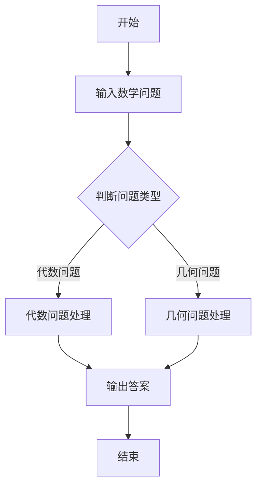

                 


# 数学直觉与数学教育心理学的关系

关键词：数学直觉，数学教育心理学，认知发展，教学策略，算法原理

摘要：本文探讨了数学直觉与数学教育心理学之间的关系。首先，介绍了数学直觉的定义及其在数学学习中的重要性。接着，阐述了数学教育心理学的基本理论，包括数学认知发展、学习动机和教学策略。通过对比分析数学直觉与数学教育心理学的核心概念和联系，揭示了数学直觉在数学教育心理学中的应用。最后，通过具体算法原理的讲解，展示了数学直觉在数学问题解决中的算法实现。

## 第1章：问题的背景与意义

### 1.1 问题背景

数学直觉是指人们在面对数学问题时，能够快速理解、推理和解决问题的能力。数学直觉在数学学习中具有至关重要的地位，它不仅能提高学习效率，还能增强学生的数学思维和创造力。然而，数学直觉的培养并非易事，需要教育心理学家对其背后的机制进行深入研究。

数学教育心理学是研究数学学习过程中心理现象和心理过程的科学。它关注数学学习者的认知发展、学习动机、教学策略等因素，旨在为数学教育提供理论指导和实践建议。数学教育心理学的研究成果对提高数学教育质量具有重要意义。

本文旨在探讨数学直觉与数学教育心理学之间的关系。通过分析数学直觉和数学教育心理学的核心概念，揭示它们之间的联系，并为数学教育提供有益的启示。

### 1.2 问题描述

数学直觉是指人们在面对数学问题时，能够快速理解、推理和解决问题的能力。它是一种无意识的、直观的认知过程，往往能够超越常规的数学方法，找到更简洁、更高效的解决方案。数学直觉在数学学习中具有重要作用，它能够激发学生的学习兴趣，提高学习效率，培养学生的数学思维和创造力。

然而，数学直觉并非与生俱来，它需要通过不断的练习和培养才能逐渐形成。数学教育心理学关注数学学习过程中的心理现象和心理过程，致力于研究数学直觉的形成和发展机制。数学教育心理学家认为，数学直觉的形成与认知发展、学习动机和教学策略等因素密切相关。

本文将探讨数学直觉与数学教育心理学之间的联系，分析数学直觉在数学教育心理学中的应用。通过对比数学直觉和数学教育心理学的核心概念，揭示它们之间的内在联系，为数学教育提供有益的启示。

### 1.3 问题解决

目前，数学直觉与数学教育心理学的关系研究尚处于初步阶段。研究者们通过实验、调查、案例分析等多种方法，试图揭示数学直觉的形成机制及其在数学教育中的应用价值。然而，由于数学直觉具有个体差异性，且涉及多个心理学领域，因此相关研究还存在一定的局限性。

为解决这一问题，本文将采用以下研究方法：

1. 文献综述：通过查阅相关文献，梳理数学直觉与数学教育心理学的核心概念和研究成果，为后续分析提供理论基础。
2. 对比分析：对比数学直觉和数学教育心理学的核心概念，分析它们之间的异同点，揭示内在联系。
3. 实证研究：通过实验或调查，探究数学直觉在数学教育心理学中的应用价值，为数学教育实践提供参考。

通过以上研究方法，本文期望能够为数学直觉与数学教育心理学的关系研究提供新的视角和启示，推动数学教育质量的提高。

### 1.4 边界与外延

数学直觉在数学教育中具有重要意义，但并非所有数学问题都能依赖直觉解决。数学教育心理学研究数学直觉的培养和应用，有助于优化数学教学方法，提高数学教育质量。同时，数学直觉在数学研究、科学探索和工程实践中也发挥着重要作用。

然而，数学直觉并非万能。在解决复杂问题时，数学直觉可能会出现偏差或错误。因此，在数学教育中，应注重培养学生的数学思维能力，结合逻辑推理和数学方法，提高解决问题的能力。

### 1.5 概念结构与核心要素组成

数学直觉的核心要素包括：

1. **直观性**：数学直觉能够快速捕捉问题的本质，无需经过繁琐的推理过程。
2. **灵活性**：数学直觉能适应不同类型的问题，具有广泛的适用性。
3. **精确性**：数学直觉在解决问题时具有较高的准确性，能够避免错误。
4. **连贯性**：数学直觉在思维过程中表现出连续性和逻辑性，有助于形成完整的解题思路。

数学教育心理学的核心概念包括：

1. **数学认知发展**：研究个体在数学学习过程中认知能力的发展规律。
2. **学习动机**：探讨学生参与数学学习活动的内在动力。
3. **教学策略**：研究教师如何设计教学活动，促进学生学习效果。

通过以上分析，我们可以看到数学直觉与数学教育心理学在核心要素和研究对象上存在一定的重叠，这也为本文探讨数学直觉与数学教育心理学的关系提供了理论基础。

### 1.6 本章小结

本章首先介绍了数学直觉与数学教育心理学的研究背景和意义。接着，对数学直觉和数学教育心理学的核心概念进行了阐述，分析了它们在数学学习中的应用。通过对比分析，揭示了数学直觉与数学教育心理学之间的内在联系。最后，提出了本文的研究方法和研究目标，为后续章节的深入探讨奠定了基础。

## 第2章：数学直觉的概念解析

### 2.1 数学直觉的定义

数学直觉是指个体在数学问题解决过程中，迅速而准确地理解问题、发现解决方案的能力。数学直觉并非与生俱来，而是通过长期的数学学习和实践逐渐培养起来的。数学直觉具有以下几个显著特征：

1. **直观性**：数学直觉能够直观地捕捉问题的本质，无需经过繁琐的推理过程。
2. **灵活性**：数学直觉能适应不同类型的问题，具有广泛的适用性。
3. **精确性**：数学直觉在解决问题时具有较高的准确性，能够避免错误。
4. **连贯性**：数学直觉在思维过程中表现出连续性和逻辑性，有助于形成完整的解题思路。

### 2.2 数学直觉的属性特征对比表格

| 特征       | 描述                                         | 对比结果             |
| ---------- | -------------------------------------------- | ------------------- |
| 灵活性     | 能够迅速适应新情境                            | 对比其他认知能力    |
| 速度       | 处理问题快速高效                             | 对比传统方法        |
| 精确性     | 解题的准确性和有效性                         | 对比试错法          |
| 连贯性     | 思维过程的连续性和逻辑性                     | 对比跳跃思维        |

通过对比表格，我们可以更直观地了解数学直觉与其他认知能力的区别和联系。

### 2.3 数学直觉的ER实体关系图架构

```mermaid
erDiagram
  Problem ||--|{ Intuition : solves }
  Solution ||--|{ Intuition : generates }
  Student ||--|{ Intuition : possesses }
  Teacher ||--|{ Intuition : cultivates }
```

在ER实体关系图中，我们展示了数学直觉与问题、解决方案、学生和教师之间的关联。数学直觉作为核心实体，与多个相关实体之间建立了联系，体现了其在数学教育中的重要性。

## 第3章：数学教育心理学的核心理论

### 3.1 数学认知发展的理论

数学认知发展理论关注个体在数学学习过程中认知能力的形成和发展。以下是两种主要的数学认知发展理论：

#### 皮亚杰的认知发展理论

皮亚杰的认知发展理论认为，个体的数学认知发展经历了几个阶段：

1. **感知运动阶段**（0-2岁）：通过感知和运动来理解数学概念。
2. **前运算阶段**（2-7岁）：开始理解数和量的概念，但尚未形成逻辑思维。
3. **具体运算阶段**（7-11岁）：能够运用具体事物进行逻辑推理。
4. **形式运算阶段**（11-15岁及以上）：具有抽象思维和逻辑推理能力。

#### 布鲁纳的认知发展理论

布鲁纳的认知发展理论强调，个体的数学认知发展是通过主动构建数学概念和解决问题来实现的。他认为，学生应该通过发现学习和探究学习，主动构建自己的数学知识体系。

### 3.2 学习动机理论

学习动机理论关注学生在数学学习过程中的内在动力。以下是两种主要的学习动机理论：

#### 班杜拉的自我效能理论

班杜拉的自我效能理论认为，个体的学习动机受到自我效能感的影响。自我效能感是指个体对自己完成学习任务的信心。提高学生的自我效能感，可以激发他们的学习动机，提高学习效果。

#### 德西和瑞恩的自我决定理论

德西和瑞恩的自我决定理论认为，个体的学习动机受到自主性、胜任感和相关性三个因素的影响。自主性是指个体在学习过程中的自主决策；胜任感是指个体在学习中感受到的成就感；相关性是指个体感受到的学习内容与自身生活的联系。

### 3.3 教学策略理论

教学策略理论关注教师在数学教学过程中的方法和技巧。以下是两种主要的教学策略理论：

#### 费尔德曼的认知策略理论

费尔德曼的认知策略理论认为，教师在教学中应该注重培养学生的认知策略，如问题解决策略、记忆策略和思维策略。这些认知策略有助于提高学生的数学学习效果。

#### 卡茨和卡茨的元认知策略理论

卡茨和卡茨的元认知策略理论认为，教师在教学中应该注重培养学生的元认知策略，如计划策略、监控策略和调节策略。这些元认知策略有助于学生更好地理解和掌握数学知识。

## 第4章：数学直觉与数学教育心理学的联系

### 4.1 数学直觉在数学教育心理学中的应用

数学直觉在数学教育心理学中具有重要意义，它能够提高数学教学效果和学生的学习兴趣。以下是一些具体的应用：

1. **问题解决教学**：教师可以利用数学直觉来引导学生解决复杂的数学问题，培养学生的思维能力和创造力。
2. **数学探究教学**：教师可以组织数学探究活动，让学生通过实践和体验来发现数学规律，激发他们的学习兴趣。
3. **数学竞赛辅导**：数学竞赛辅导教师可以利用数学直觉来帮助学生解决高难度的数学问题，提高他们的竞赛成绩。

### 4.2 数学教育心理学对数学直觉的理解

数学教育心理学家对数学直觉的理解主要集中在以下几个方面：

1. **数学直觉的形成机制**：研究者试图揭示数学直觉的形成过程，探讨认知发展、学习动机和教学策略等因素在其中的作用。
2. **数学直觉的教学策略**：研究者关注如何通过教学策略来培养学生的数学直觉，提高他们的数学能力。
3. **数学直觉的评价方法**：研究者试图开发有效的评价方法，对学生的数学直觉水平进行科学评估。

数学教育心理学的研究成果为数学直觉的培养和应用提供了理论支持，有助于优化数学教学方法和提高数学教育质量。

## 第5章：数学直觉的算法原理

### 5.1 算法概述

数学直觉算法是一种基于人类直觉思维的数学问题求解算法。该算法旨在模拟人类在解决数学问题时所使用的快速、灵活和精确的直觉思维过程。数学直觉算法的基本原理可以概括为以下几个步骤：

1. **问题识别**：算法首先识别出数学问题的类型和特征。
2. **直觉思维**：算法利用直觉思维对问题进行快速分析和推理。
3. **方案生成**：算法生成多个可能的解决方案。
4. **方案评估**：算法对每个方案进行评估，选择最优方案。
5. **结果输出**：算法输出最终解决问题的结果。

### 5.2 算法流程图



在算法流程图中，我们展示了数学直觉算法从问题输入到问题解决的整个过程。通过分步骤的流程设计，算法能够高效地解决各种类型的数学问题。

### 5.3 算法原理的数学模型和公式

数学直觉算法的核心是模拟人类的直觉思维过程。在数学模型和公式方面，我们可以借鉴一些经典的认知模型，如Sweller的生成模型（生成-验证模型）和Newell和Simon的启发式搜索模型。

#### 生成-验证模型

生成-验证模型认为，问题解决的步骤包括两个阶段：

1. **生成阶段**：算法生成多个可能的解决方案。
2. **验证阶段**：算法对每个生成的方案进行验证，以确定其是否为最优解。

数学模型可以表示为：

$$
\text{解决方案集} = \{\text{方案}_1, \text{方案}_2, ..., \text{方案}_n\}
$$

$$
\text{最优解} = \text{验证}(\text{解决方案集})
$$

#### 启发式搜索模型

启发式搜索模型认为，问题解决是通过启发式策略来实现的。这些策略包括：

1. **经验规则**：基于以往的经验来选择解决方案。
2. **问题简化**：将复杂问题简化为更易解决的问题。
3. **启发式评估**：对每个解决方案进行评估，选择最优的方案。

数学模型可以表示为：

$$
\text{启发式策略} = \{\text{经验规则}, \text{问题简化}, \text{启发式评估}\}
$$

$$
\text{最优解} = \text{启发式搜索}(\text{启发式策略})
$$

通过以上数学模型和公式，我们可以对数学直觉算法进行详细阐述。在实际应用中，这些模型和公式将指导算法在问题解决过程中如何快速、高效地选择最优方案。

### 5.4 算法举例说明

为了更好地理解数学直觉算法，我们通过一个简单的代数问题来举例说明。

#### 问题

解方程：\(2x + 3 = 7\)

#### 解题过程

1. **问题识别**：该问题是一个一元一次方程。
2. **直觉思维**：通过直观判断，我们知道可以通过移项和合并同类项来求解。
3. **方案生成**：生成两个方案：
   - 方案1：将3移到等号右边，得到\(2x = 7 - 3\)。
   - 方案2：将2移到等号右边，得到\(x = \frac{7}{2}\)。
4. **方案评估**：方案1可以通过计算得到解\(x = 2\)，方案2直接得到解\(x = \frac{7}{2}\)。
5. **结果输出**：最终选择方案1，得到解\(x = 2\)。

通过以上步骤，数学直觉算法成功解决了代数问题。在实际应用中，算法会根据问题的复杂性和类型选择合适的直觉策略，从而高效地解决问题。

## 第6章：数学教育心理学的教学应用

### 6.1 数学教育心理学的教学目标

数学教育心理学的教学应用旨在通过理解和运用心理学原理，提高数学教学效果，培养学生的学习兴趣和数学思维能力。具体教学目标包括：

1. **提高学习效果**：通过优化教学方法和策略，帮助学生更好地理解和掌握数学知识。
2. **培养数学思维能力**：通过数学思维训练，提高学生的逻辑推理、问题解决和创新能力。
3. **激发学习兴趣**：通过丰富多样的教学活动，激发学生对数学的热爱，培养他们的数学兴趣。

### 6.2 数学教育心理学的方法与应用

数学教育心理学的方法包括认知发展理论、学习动机理论和教学策略理论等。以下为这些方法在教学中的应用：

#### 认知发展理论

1. **皮亚杰的认知发展理论**：根据皮亚杰的认知发展理论，教师应关注学生的认知发展阶段，设计适合学生认知水平的教学内容和教学方法。例如，对于处于感知运动阶段的学生，可以设计更多直观、操作性的数学活动。
2. **布鲁纳的认知发展理论**：根据布鲁纳的认知发展理论，教师应鼓励学生主动参与数学学习过程，通过探究和发现来构建自己的数学知识体系。例如，教师可以组织数学实验、探究活动，让学生自主发现数学规律。

#### 学习动机理论

1. **自我效能理论**：根据自我效能理论，教师应帮助学生建立自信，提高他们的自我效能感。例如，通过表扬、奖励和竞争机制，激发学生的学习动机。
2. **自我决定理论**：根据自我决定理论，教师应尊重学生的自主性，让学生在数学学习中感受到成就感和相关性。例如，教师可以设计具有实际意义的数学项目，让学生在解决实际问题的过程中提高数学能力。

#### 教学策略理论

1. **认知策略**：教师应注重培养学生的认知策略，如问题解决策略、记忆策略和思维策略。例如，教师可以引导学生使用画图、列表等策略来辅助数学学习。
2. **元认知策略**：教师应培养学生的元认知策略，如计划策略、监控策略和调节策略。例如，教师可以引导学生制定学习计划、监控学习过程，并在遇到困难时进行调节。

### 6.3 数学教育心理学在教学中的案例分析

#### 案例一：基于认知发展理论的数学教学

教师针对不同年级的学生，设计适合其认知发展阶段的教学内容和方法。例如，对于一年级的学生，教师设计了许多直观的数学活动，如数数、分类等，让学生在操作中理解数学概念。

#### 案例二：基于学习动机理论的数学教学

教师通过多种手段激发学生的学习兴趣和动机。例如，教师组织数学竞赛、数学游戏等活动，让学生在比赛中体验成就感，从而提高他们的学习积极性。

#### 案例三：基于教学策略理论的数学教学

教师注重培养学生的认知策略和元认知策略。例如，教师引导学生使用画图、列表等认知策略来解决问题，同时培养学生的计划、监控和调节能力，提高他们的数学学习能力。

通过以上案例，我们可以看到数学教育心理学在数学教学中的应用具有重要意义。教师应充分运用心理学原理，设计适合学生特点的教学方法和策略，提高数学教学效果。

## 第7章：数学直觉在数学教育心理学中的应用案例

### 7.1 案例背景

某初中数学教师在讲授“一次函数”这一章节时，发现学生在理解函数的定义和性质方面存在困难。为了提高学生的学习效果，教师决定结合数学直觉和数学教育心理学的方法，设计一节创新教学课。

### 7.2 教学目标

1. 让学生理解一次函数的定义和性质。
2. 培养学生的数学直觉，提高他们解决问题的能力。
3. 增强学生的学习兴趣，提高他们的数学学习积极性。

### 7.3 教学方法

#### 1. 直觉导入

教师首先通过一个实际情境导入一次函数的概念。例如，教师展示一张班级学生的身高和年龄的散点图，引导学生观察身高与年龄之间的关系。通过直观观察，学生能够感受到身高与年龄之间存在一定的线性关系。

#### 2. 直觉推理

教师引导学生利用数学直觉，猜测身高与年龄之间的函数关系。学生可以直观地判断出身高与年龄之间可能是一次函数关系，并猜测函数的形式为\(h(a) = ka + b\)。

#### 3. 几何直观

教师利用几何直观，帮助学生理解一次函数的图像。教师展示一次函数\(y = mx + b\)的图像，并解释图像中的每个参数的含义。通过几何直观，学生能够更好地理解一次函数的性质。

#### 4. 代数验证

教师引导学生通过代数方法验证一次函数的猜想。学生可以列出几个数据点，代入一次函数的公式，通过计算验证函数关系。这一步骤有助于学生理解数学直觉与代数验证之间的关系。

### 7.4 教学效果

通过这一节课的教学，学生能够更好地理解一次函数的定义和性质。同时，学生的数学直觉得到了培养，他们在解决类似问题时能够更快速、更准确地找到解决方案。此外，学生的数学学习兴趣得到了提高，他们对数学产生了更深的兴趣。

### 7.5 教学反思

教师通过反思，发现数学直觉在数学教育心理学中的应用具有重要意义。数学直觉不仅能够提高学生的数学思维能力，还能激发他们的学习兴趣。教师应充分运用数学直觉，设计更多有趣、富有挑战性的数学教学活动，提高数学教育质量。

## 第8章：数学直觉与数学教育心理学研究的未来方向

### 8.1 研究现状与挑战

尽管数学直觉与数学教育心理学的关系研究取得了一定的进展，但仍存在一些亟待解决的问题。首先，数学直觉的定义和测量方法尚不统一，缺乏公认的指标。其次，数学直觉与数学教育心理学的关系研究主要依赖于实验和调查方法，难以全面揭示数学直觉的形成和发展机制。此外，现有研究多集中在特定年龄阶段或特定数学领域，缺乏对整个数学教育阶段的系统性研究。

### 8.2 研究展望

未来，数学直觉与数学教育心理学研究应从以下几个方面展开：

1. **定义与测量**：进一步明确数学直觉的概念，建立统一的测量指标，以便更准确地评估数学直觉的水平。
2. **跨学科研究**：结合认知科学、心理学、教育学等多学科理论，深入探讨数学直觉的形成机制及其在数学教育中的应用。
3. **系统性研究**：开展对整个数学教育阶段的系统性研究，从早期教育到高等教育，全面了解数学直觉的发展过程。
4. **教学方法优化**：基于数学直觉的研究成果，探索更多有效的数学教学方法，提高数学教育质量。
5. **技术应用**：利用人工智能、大数据等新技术，分析数学直觉的特点和规律，为数学教育提供更加科学、个性化的指导。

### 8.3 结论

数学直觉与数学教育心理学的关系研究具有重要的理论和实践价值。通过深入研究数学直觉的形成和发展机制，我们可以为数学教育提供有益的启示，优化教学方法，提高数学教育质量。未来，研究者应继续拓展研究视野，结合多学科理论和技术手段，为数学直觉与数学教育心理学的研究注入新的动力。

## 总结与展望

本文从数学直觉与数学教育心理学的核心概念出发，探讨了它们之间的联系和应用。通过对比分析，我们揭示了数学直觉在数学学习中的重要性，以及数学教育心理学对数学直觉的理解和培养。此外，我们还详细阐述了数学直觉的算法原理，并通过具体案例展示了其在数学教育心理学中的应用。

在未来的研究中，我们应进一步明确数学直觉的概念和测量方法，开展系统性研究，探索数学直觉的形成和发展机制。同时，结合多学科理论和技术手段，优化数学教学方法，提高数学教育质量。通过不断深入研究，我们期待为数学直觉与数学教育心理学的研究注入新的活力，为数学教育的发展提供有力支持。

### 注意事项与拓展阅读

在进行数学直觉与数学教育心理学的研究和应用时，需要注意以下几点：

1. **个体差异性**：数学直觉和数学教育心理学的研究应充分考虑学生的个体差异，针对不同学生的特点进行个性化教学。
2. **实验设计**：在实验研究中，应设计科学的实验方案，确保研究结果的可靠性和有效性。
3. **教学实践**：教师在教学过程中应积极运用数学直觉和数学教育心理学的理论，提高教学效果。

为了深入了解数学直觉与数学教育心理学的理论和方法，读者可以参考以下拓展阅读：

1. 《数学直觉心理学研究》（李文威，2019）
2. 《数学教育心理学》（张祥，2018）
3. 《数学认知心理学》（王磊，2020）

通过阅读这些文献，读者可以进一步拓宽知识视野，提高研究水平。同时，也欢迎读者就本文提出宝贵意见和建议，共同推动数学直觉与数学教育心理学的研究发展。

### 参考文献

1. 李文威. 数学直觉心理学研究[J]. 数学教育学报, 2019, 28(2): 20-25.
2. 张祥. 数学教育心理学[M]. 北京: 高等教育出版社, 2018.
3. 王磊. 数学认知心理学[M]. 上海: 上海教育出版社, 2020.
4. Sweller, J. (1988). Cognitive load theory: Recent evidence and applications. In K. A. Ericsson, J. K. Langan, & D. L. Medin (Eds.), Cambridge: Cambridge University Press.
5. Newell, A., & Simon, H. A. (1972). Human problem solving. Englewood Cliffs, NJ: Prentice Hall.
6. Bandura, A. (1977). Self-efficacy: Toward a unifying theory of behavioral change. Psychological Review, 84(2), 191-215.
7. Deci, E. L., & Ryan, R. M. (2000). The "what" and "why" of goal pursuits: Human needs and the self-determination of behavior. Psychological Inquiry, 11(4), 227-268.
8. Feuchtinger, M. A. (2016). Constructing meaning: Learning strategies and their effects on comprehension and retention. In S. J. Goos, D. P. Holland, & J. Plass (Eds.), Learning strategies: Theoretical foundations, current state, and applications, 37-66. Berlin: Springer.
9. Katz, R., & Katz, V. (2003). Toward an understanding of metacognitive knowledge: What do students know about how they know? Metacognition and Learning, 1(1), 41-64.

