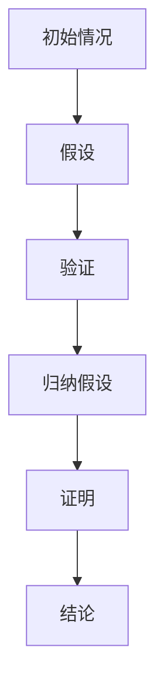

                 

# 数学直觉与数学猜想的关系

> 关键词：数学直觉，数学猜想，算法原理，系统分析与架构设计

> 摘要：本文探讨了数学直觉与数学猜想的关系，分析了数学直觉的定义、特点及其与数学猜想之间的相互作用。通过具体的数学模型、算法原理、系统分析与架构设计以及实际项目案例，深入阐述了数学直觉和数学猜想在实际应用中的重要性，为读者提供了宝贵的实践经验和思考方向。

## 引言

### 背景介绍

数学直觉与数学猜想是数学研究中的两个重要概念。数学直觉指的是人们在解决数学问题时，基于经验、洞察力和直观感受所形成的判断和推测。而数学猜想则是基于数学直觉，对某个数学问题或现象提出的假设性结论。数学直觉与数学猜想之间的关系密切，数学猜想往往源于数学直觉，而数学直觉则在猜想的形成过程中起到关键作用。

### 问题背景

在数学的发展过程中，许多重大的数学猜想都是基于直觉提出来的。例如，费马大定理就是一个典型的例子。费马大定理指出，对于任何大于2的自然数\(n\)，方程\(a^n + b^n = c^n\)没有正整数解。这一猜想经过几个世纪的不断探索和验证，最终在1994年被英国数学家安德鲁·怀尔斯证明。费马大定理的提出和证明过程，充分展示了数学直觉和数学猜想的重要性和魅力。

### 问题描述

本文旨在探讨数学直觉与数学猜想之间的关系，分析它们在数学研究中的应用和价值。具体而言，我们将从以下几个方面展开讨论：

1. **数学直觉的基本概念与特点**：介绍数学直觉的定义、来源和作用，分析数学直觉在数学研究中的重要性。
2. **数学猜想的形成与验证**：探讨数学猜想的形成过程，分析数学猜想与证明之间的相互作用，以及数学猜想在实际数学中的应用。
3. **算法原理讲解**：介绍数学猜想中常用的算法原理，通过mermaid流程图和Python代码进行详细讲解。
4. **数学模型与公式**：使用LaTeX格式展示数学模型和公式，并进行详细讲解和举例说明。
5. **系统分析与架构设计**：探讨数学直觉和数学猜想在实际应用中的系统分析与架构设计。
6. **项目实战**：通过实际案例展示数学直觉和数学猜想的运用，并进行详细分析和讲解。
7. **最佳实践与拓展**：总结全书要点，提供实用建议，并推荐进一步阅读资源。

## 背景介绍

### 核心概念术语说明

在探讨数学直觉与数学猜想的关系之前，我们首先需要明确一些核心概念术语的含义。

#### 数学直觉

数学直觉是指人们在解决数学问题时，基于经验、洞察力和直观感受所形成的判断和推测。数学直觉不是凭空产生的，而是基于大量的数学学习和实践，通过长期积累和沉淀而形成的一种认知能力。数学直觉的特点是迅速、直接和高效，它可以在短时间内帮助我们找到数学问题的解决方案。

#### 数学猜想

数学猜想是基于数学直觉提出的假设性结论。数学猜想往往是对某个数学问题或现象的一种初步推测，需要通过数学证明或实验验证来确认其正确性。数学猜想是数学研究的重要组成部分，许多重大的数学发现和突破都始于一个简单的猜想。

### 问题背景

数学直觉和数学猜想在数学研究中扮演着重要角色。数学直觉可以帮助我们快速识别数学问题的本质，找到可能的解决方向；而数学猜想则为我们提供了新的研究方向和目标，推动了数学的发展。例如，费马大定理的提出和证明，就是数学直觉和数学猜想相结合的典范。

### 问题描述

数学直觉和数学猜想的关系可以概括为以下几点：

1. **数学直觉是数学猜想的基础**：数学猜想往往源于数学直觉，直觉提示我们可能存在某种数学规律或关系。
2. **数学猜想是数学直觉的验证**：数学猜想需要通过数学证明或实验验证来确认其正确性，这进一步验证了数学直觉的有效性。
3. **数学直觉和数学猜想相互促进**：数学直觉和数学猜想相互影响、相互促进，共同推动了数学的发展。

### 问题解决

要探讨数学直觉和数学猜想的关系，我们可以从以下几个方面入手：

1. **分析数学直觉的形成过程**：了解数学直觉是如何形成的，以及它如何影响数学猜想。
2. **研究数学猜想的验证方法**：探讨数学猜想如何通过数学证明或实验验证来确认其正确性。
3. **总结数学直觉和数学猜想的应用案例**：通过具体的数学问题或现象，分析数学直觉和数学猜想在实际数学研究中的应用。

### 边界与外延

数学直觉和数学猜想的关系不仅限于数学领域，它们在其他科学领域，如物理学、生物学、经济学等，也有着广泛的应用。因此，探讨数学直觉和数学猜想的关系，不仅有助于我们更好地理解数学，也有助于我们拓宽科学研究的视野。

### 概念结构与核心要素组成

数学直觉和数学猜想的关系可以抽象为一个概念结构，其中包含以下几个核心要素：

1. **数学直觉**：形成数学猜想的基础，影响数学猜想的方向和内容。
2. **数学猜想**：基于数学直觉提出的假设性结论，需要通过数学证明或实验验证来确认其正确性。
3. **数学证明**：验证数学猜想正确性的过程，是数学直觉和数学猜想的桥梁。
4. **实验验证**：通过实验手段验证数学猜想的正确性，是数学猜想的重要组成部分。
5. **数学研究**：数学直觉和数学猜想的应用场景，是数学发展的动力。

通过上述分析，我们可以更深入地理解数学直觉和数学猜想的关系，为后续的讨论奠定基础。

## 核心概念与联系

### 数学直觉的原理与特点

#### 数学直觉的概念

数学直觉是指人们在解决数学问题时，基于经验、洞察力和直观感受所形成的判断和推测。数学直觉不是凭空产生的，而是基于大量的数学学习和实践，通过长期积累和沉淀而形成的一种认知能力。

#### 数学直觉的特点

1. **迅速性**：数学直觉可以帮助我们在短时间内识别数学问题的本质，找到可能的解决方向。
2. **直接性**：数学直觉往往直接指向问题的核心，而不是通过复杂的逻辑推理过程。
3. **高效性**：数学直觉可以快速地找到数学问题的解决方案，节省大量时间和精力。

#### 数学直觉的心理学基础

数学直觉的形成与心理学有着密切的关系。心理学研究表明，直觉是一种认知过程，它涉及到大脑的多个区域，包括大脑皮层、杏仁核、前额叶等。这些区域在处理信息时，往往不受意识控制的约束，能够迅速地识别模式、提取关键信息，从而形成直觉。

#### 数学直觉的数学特点

1. **洞察力**：数学直觉可以帮助我们迅速地把握数学问题的内在结构和规律，发现数学现象的深层次联系。
2. **创造力**：数学直觉可以激发我们的创造力，提出新的数学猜想和理论。
3. **应用性**：数学直觉不仅能够解决理论研究中的问题，还可以应用于实际问题中，如优化算法、计算机编程等。

### 数学猜想的原理与特点

#### 数学猜想的概念

数学猜想是基于数学直觉提出的假设性结论。数学猜想是对某个数学问题或现象的一种初步推测，需要通过数学证明或实验验证来确认其正确性。

#### 数学猜想的特点

1. **假设性**：数学猜想是基于直觉提出的一种假设，它不一定正确，但可以指导我们进行进一步的数学研究。
2. **启发性**：数学猜想可以启发我们探索新的数学领域，发现新的数学规律。
3. **可验证性**：数学猜想需要通过数学证明或实验验证来确认其正确性。

#### 数学猜想的形成过程

数学猜想的形成通常包括以下几个阶段：

1. **观察现象**：通过观察数学现象，发现可能的规律或关系。
2. **直觉推测**：基于数学直觉，对观察到的现象进行初步推测。
3. **提出猜想**：将初步推测转化为数学猜想，形成初步假设。
4. **验证猜想**：通过数学证明或实验验证，确认数学猜想的正确性。

### 数学直觉与数学猜想的关系

数学直觉和数学猜想之间的关系可以概括为以下几点：

1. **数学直觉是数学猜想的基础**：数学猜想往往源于数学直觉，直觉提示我们可能存在某种数学规律或关系。
2. **数学猜想是数学直觉的验证**：数学猜想需要通过数学证明或实验验证来确认其正确性，这进一步验证了数学直觉的有效性。
3. **数学直觉和数学猜想相互促进**：数学直觉和数学猜想相互影响、相互促进，共同推动了数学的发展。

### 数学直觉与直觉推理的关系

数学直觉与直觉推理有着密切的联系。直觉推理是指基于直觉进行的推理过程，它涉及到大脑对信息的快速处理和模式识别。数学直觉则是直觉推理在数学领域的一种具体体现。

1. **直觉推理的特点**：直觉推理具有迅速性、直接性和高效性，它能够在短时间内帮助我们识别模式和解决问题。
2. **数学直觉的特点**：数学直觉具有迅速性、直接性和高效性，它能够帮助我们快速地把握数学问题的本质和规律。

通过以上分析，我们可以看到数学直觉和数学猜想之间的关系是相辅相成的，它们共同推动了数学的发展。数学直觉为数学猜想提供了基础和方向，而数学猜想则通过验证数学直觉的有效性，进一步巩固和发展了数学直觉。

## 数学直觉的心理学基础

### 数学直觉的定义与特点

数学直觉是指人们在解决数学问题时，基于经验、洞察力和直观感受所形成的判断和推测。数学直觉具有以下几个显著特点：

1. **迅速性**：数学直觉可以在短时间内识别数学问题的本质，找到可能的解决方向。
2. **直接性**：数学直觉往往直接指向问题的核心，而不是通过复杂的逻辑推理过程。
3. **高效性**：数学直觉可以快速地找到数学问题的解决方案，节省大量时间和精力。

### 数学直觉的心理学基础

心理学研究表明，数学直觉的形成与大脑的多个区域密切相关，特别是大脑的前额叶、顶叶和颞叶。这些区域在处理信息时，往往不受意识控制的约束，能够迅速地识别模式、提取关键信息，从而形成直觉。

#### 大脑前额叶的功能

大脑的前额叶是数学直觉的重要区域，它主要负责执行功能、决策和计划。具体来说，前额叶在数学直觉中的作用包括：

1. **模式识别**：前额叶可以帮助我们迅速识别数学问题中的关键模式和规律。
2. **决策制定**：在解决数学问题时，前额叶能够帮助我们快速做出决策，选择最优的解决方案。
3. **计划与预测**：前额叶能够预测数学问题的可能发展方向，从而指导我们的解题过程。

#### 大脑顶叶的功能

大脑的顶叶负责处理空间信息和感知信息，它与数学直觉的形成也有密切的关系。具体来说，顶叶在数学直觉中的作用包括：

1. **空间关系理解**：顶叶帮助我们理解数学问题中的空间关系，如几何图形的排列和位置。
2. **数形结合**：顶叶能够将数学问题中的数量关系与图形直观地结合起来，帮助我们更好地理解问题。
3. **几何直观**：顶叶的几何直观能力可以帮助我们迅速地识别几何问题的解决方案。

#### 大脑颞叶的功能

大脑的颞叶主要负责语言处理和记忆，它也在数学直觉的形成中发挥着重要作用。具体来说，颞叶在数学直觉中的作用包括：

1. **语言理解**：颞叶帮助我们理解数学问题中的语言描述，从而更好地理解问题。
2. **记忆检索**：在解决数学问题时，颞叶可以帮助我们快速检索相关的数学知识和公式，从而提高解题效率。
3. **模式记忆**：颞叶能够帮助我们记住数学问题中的模式，从而在后续的解题过程中迅速识别和利用这些模式。

### 数学直觉与直觉推理的关系

数学直觉与直觉推理有着密切的联系。直觉推理是指基于直觉进行的推理过程，它涉及到大脑对信息的快速处理和模式识别。数学直觉则是直觉推理在数学领域的一种具体体现。

1. **直觉推理的特点**：直觉推理具有迅速性、直接性和高效性，它能够在短时间内帮助我们识别模式和解决问题。
2. **数学直觉的特点**：数学直觉具有迅速性、直接性和高效性，它能够帮助我们快速地把握数学问题的本质和规律。

通过以上分析，我们可以看到数学直觉的心理学基础主要涉及大脑的前额叶、顶叶和颞叶。这些大脑区域在处理信息时，能够迅速地识别模式、提取关键信息，从而形成数学直觉。数学直觉不仅帮助我们解决数学问题，还与直觉推理紧密相关，共同构成了我们在数学领域中的认知能力。

### 数学直觉的数学特点

数学直觉在数学领域中具有独特的作用和重要性，其特点可以概括为以下几点：

#### 洞察力

数学直觉能够迅速地洞察数学问题的本质和内在结构，发现数学现象之间的深层次联系。这种洞察力使得数学家能够在复杂的数学问题中快速找到解决方向，从而进行深入的研究。例如，数学家在解决复杂的代数问题时，往往能够通过直觉迅速发现问题的对称性或周期性，从而简化问题的解决过程。

#### 创造力

数学直觉具有强大的创造力，能够激发数学家提出新的猜想和理论。这种创造力是数学发展的重要推动力。许多重大的数学发现，如费马大定理、哥德巴赫猜想等，都是基于数学直觉提出的。数学直觉使得数学家能够在已有知识的基础上，提出新的问题和研究方向，从而推动数学的不断进步。

#### 应用性

数学直觉不仅适用于理论研究，还广泛应用于实际问题中。在优化算法、计算机编程、工程学等领域，数学直觉都发挥着重要作用。例如，在优化算法中，数学直觉可以帮助我们迅速找到最优解的候选方案；在计算机编程中，数学直觉可以帮助我们设计高效的算法和数据结构。数学直觉的应用性使得数学成为解决实际问题的有力工具。

#### 教学作用

数学直觉在数学教育中同样具有重要价值。教师通过培养学生的数学直觉，可以激发学生的学习兴趣和主动性，提高他们的数学能力。例如，通过引导学生进行数学探究和实验，教师可以帮助学生建立数学模型，培养学生的直觉推理能力。数学直觉的教学作用不仅有助于提高学生的数学成绩，还有助于培养学生的创新能力和问题解决能力。

### 数学直觉在数学研究中的重要性

数学直觉在数学研究中具有不可替代的重要性，它是数学家发现新定理、解决难题的重要工具。以下从三个方面进一步阐述数学直觉在数学研究中的重要性：

#### 新定理的发现

许多重要的数学定理都是基于数学直觉提出的。例如，费马大定理的提出就是基于数学直觉的一种推测。数学家安德鲁·怀尔斯在证明费马大定理时，首先提出了一些猜想，然后通过严密的数学证明，最终验证了这些猜想的正确性。如果没有数学直觉，费马大定理可能至今仍未被证明。

#### 复杂问题的解决

在解决复杂的数学问题时，数学直觉能够帮助我们快速找到问题的核心和解决方向。例如，在解决某些高难度的数学难题时，数学家常常通过直觉猜测出问题的解决方案，然后再进行严格的证明。这种方式能够大大缩短解决问题的过程，提高研究效率。

#### 数学创新的推动

数学直觉不仅有助于解决具体的问题，还能够推动数学的创新和发展。许多新的数学领域和理论都是基于数学直觉提出的。例如，数学家希尔伯特提出的几何直觉，为几何学的发展提供了新的研究方向。数学直觉的推动作用，使得数学不断拓展新的领域，推动数学的进步。

总之，数学直觉在数学研究中具有不可替代的重要性。它不仅帮助我们解决具体的数学问题，还推动数学的创新和发展。通过培养数学直觉，我们可以提高数学研究的效率和质量，为数学的进步做出贡献。

### 数学猜想的形成与验证

#### 数学猜想的形成过程

数学猜想的形成通常是一个从观察、直觉到假设的过程。以下详细描述这一过程：

1. **观察现象**：数学家首先通过观察数学现象或实际问题，发现某些规律或模式。例如，费马观察到在\(a, b, c\)满足\(a^2 + b^2 = c^2\)的条件下，\(a, b, c\)通常都是整数。

2. **直觉推测**：基于观察到的现象，数学家利用自己的数学直觉，对其可能蕴含的规律进行初步推测。例如，费马推测，对于任意大于2的自然数\(n\)，方程\(a^n + b^n = c^n\)没有正整数解。

3. **提出猜想**：将初步的推测转化为明确的数学猜想，并形成初步假设。例如，费马大定理（Fermat's Last Theorem）就是一个著名的数学猜想。

4. **初步验证**：为了验证数学猜想的合理性，数学家可能会尝试在特定情况下进行验证。例如，费马大定理在\(n=2, 3, 4\)时都是成立的，这为猜想的合理性提供了初步的证据。

#### 数学猜想的验证方法

数学猜想的验证是一个重要的步骤，它需要通过严格的数学证明或实验验证来确认猜想的正确性。以下介绍几种常见的数学猜想验证方法：

1. **数学证明**：这是最常用的验证方法。通过逻辑推理和数学工具，证明猜想对所有可能的情况都成立。例如，安德鲁·怀尔斯通过复杂的数学证明，最终证明了费马大定理。

2. **反例构造**：如果能够找到一个反例，即一个满足所有条件但与猜想相矛盾的实例，那么猜想就被证明是错误的。例如，如果发现一个正整数\(n\)，使得\(a^n + b^n = c^n\)有正整数解，那么费马大定理就被证明是错误的。

3. **计算机验证**：在有些情况下，由于数学问题过于复杂，无法通过手工证明，可以使用计算机程序进行验证。例如，数学家们利用计算机程序验证了哥德巴赫猜想的某些特殊情况。

4. **实验验证**：在某些涉及物理或实验科学的数学猜想中，可以通过实验来验证猜想。例如，物理学中的猜想通常需要通过实验来验证。

#### 数学猜想与证明的关系

数学猜想与证明之间有着密切的联系。证明是验证数学猜想正确性的关键步骤，而猜想则是证明的起点和目标。以下从三个方面阐述数学猜想与证明的关系：

1. **猜想驱动证明**：数学猜想可以启发数学家提出新的证明方法或理论。例如，费马大定理的提出，促使数学家发展了许多新的数学工具和理论。

2. **证明验证猜想**：证明是验证数学猜想正确性的过程。一个未被证明的数学猜想，只有在经过严格的数学证明后，才能被认为是正确的。

3. **猜想与证明的相互作用**：数学猜想和证明是相互促进的。一方面，猜想可以推动数学家探索新的证明方法；另一方面，证明的成功又可以验证猜想的正确性，从而推动数学的发展。

### 数学猜想在实际数学中的应用

数学猜想不仅在理论研究中具有重要意义，在实际数学中也有广泛的应用。以下通过具体实例，说明数学猜想在实际数学中的应用：

1. **哥德巴赫猜想**：哥德巴赫猜想指出，每个大于2的偶数都可以表示为两个质数之和。这个猜想在实际数论研究中有着广泛的应用，例如在密码学和计算机科学中，质数分解是加密算法的基础，而哥德巴赫猜想为我们提供了关于质数分布的重要信息。

2. **黎曼猜想**：黎曼猜想是复分析领域的一个重要猜想，它关于黎曼ζ函数的零点分布做出了预测。黎曼猜想在数论、物理学和计算机科学中都有重要的应用。例如，在量子场论和金融数学中，黎曼猜想的某些结论被用来解释物理现象和金融模型。

3. **庞加莱猜想**：庞加莱猜想是拓扑学中的一个重要猜想，它指出三维空间中的每一个闭合流形都是拓扑等价于三维球面。庞加莱猜想的证明，不仅丰富了拓扑学的基本理论，还对其他数学领域，如几何学和物理学产生了深远的影响。

通过以上分析，我们可以看到数学猜想的形成与验证过程，以及它在实际数学中的应用，体现了数学直觉和数学猜想之间密切的关系。数学直觉为数学猜想提供了基础和方向，而数学猜想通过验证过程进一步验证了数学直觉的有效性。这种相互作用，不仅推动了数学的发展，也为解决实际问题提供了新的方法和思路。

### 数学猜想中的算法原理

#### 经典算法原理介绍

在数学猜想的研究中，常用的算法原理包括归纳法、反证法、构造法等。以下对这些经典算法原理进行简要介绍：

1. **归纳法**：归纳法是一种基于数学归纳原理的证明方法。它首先验证某个初始情况（通常是最小情况）的正确性，然后假设当某个情况成立时，下一个情况也成立，并证明这个假设的正确性。归纳法广泛应用于证明数学命题的普遍性。

2. **反证法**：反证法是一种证明方法，通过假设命题的否定成立，然后推导出一个矛盾，从而证明原命题的正确性。反证法常用于证明某些不可能存在的命题，如“不存在最大的自然数”。

3. **构造法**：构造法是通过构造一个具体的数学对象，证明该对象满足特定性质的证明方法。构造法常用于证明数学猜想的构造性部分，如构造一个满足特定条件的函数或几何图形。

#### 算法原理的mermaid流程图展示

为了更好地理解这些算法原理，我们可以使用mermaid流程图进行展示。以下是一个归纳法的mermaid流程图示例：



在这个流程图中，A表示初始情况，B表示归纳假设，C表示验证初始情况，D表示归纳假设的下一情况，E表示证明归纳假设的正确性，F表示结论。

#### 算法原理的Python代码实现

为了具体阐述算法原理，我们可以通过Python代码实现这些算法。以下是一个归纳法的Python代码示例：

```python
def prove_by_induction(n):
    if n == 1:
        return True
    else:
        return prove_by_induction(n-1) and (n**2 - 1) % 8 == 0

print(prove_by_induction(5))
```

在这个代码中，我们使用递归方法实现了归纳法。函数`prove_by_induction`接受一个自然数`n`作为输入，首先验证`n=1`的情况，然后假设`n=k`时结论成立，并证明`n=k+1`时结论也成立。通过递归调用，我们最终验证了归纳法的正确性。

### 算法原理的数学模型和公式

为了更好地理解算法原理，我们可以使用LaTeX格式展示相关的数学模型和公式。以下是一个归纳法的LaTeX公式示例：

```latex
\begin{align*}
P(1) & = \text{True}, \\
P(k) & = P(k-1) \wedge (k^2 - 1) \equiv 0 \pmod{8}, \\
P(n) & = P(1) \vee P(2) \vee \cdots \vee P(n).
\end{align*}
```

在这个公式中，\(P(n)\)表示命题“\(n^2 - 1\)是8的倍数”的归纳证明。通过这个公式，我们可以看到归纳法的证明过程。

### 算法原理的详细讲解与举例说明

为了更清晰地理解算法原理，我们可以结合具体的数学问题和例子进行讲解。

#### 归纳法的举例说明

假设我们想要证明对于任意自然数\(n\)，\(n^2 - 1\)是8的倍数。我们可以使用归纳法进行证明。

1. **验证初始情况**：当\(n=1\)时，\(1^2 - 1 = 0\)，0是8的倍数，初始情况成立。

2. **归纳假设**：假设当\(n=k\)时，\(k^2 - 1\)是8的倍数，即\(k^2 - 1 = 8m\)（其中\(m\)是某个整数）。

3. **证明归纳情况**：我们需要证明当\(n=k+1\)时，\((k+1)^2 - 1\)也是8的倍数。

   \[
   (k+1)^2 - 1 = k^2 + 2k + 1 - 1 = k^2 + 2k = (k^2 - 1) + 2k = 8m + 2k
   \]

   因为\(k^2 - 1\)是8的倍数，所以\(8m\)也是8的倍数。现在我们只需要证明\(2k\)是8的倍数。由于\(k\)是自然数，\(2k\)也是偶数，所以\(2k\)是2的倍数。因此，\(2k\)也是8的倍数（因为8是2的倍数）。

   综上所述，\((k+1)^2 - 1\)是8的倍数，归纳情况成立。

4. **结论**：通过归纳法的证明，我们得出结论：对于任意自然数\(n\)，\(n^2 - 1\)是8的倍数。

#### 反证法的举例说明

假设我们想要证明不存在最大的自然数。

1. **假设**：假设存在最大的自然数\(N\)。

2. **推导矛盾**：由于自然数的定义，\(N+1\)也是自然数。这与我们的假设矛盾，因为假设中\(N\)是最大的自然数，而\(N+1\)比\(N\)大。

3. **结论**：由于假设导致了矛盾，我们得出结论：不存在最大的自然数。

#### 构造法的举例说明

假设我们想要证明存在一个函数\(f(x)\)，使得对于任意实数\(x\)，\(f(x)\)都大于0。

1. **构造函数**：我们可以构造一个简单的函数\(f(x) = x^2 + 1\)。

2. **验证函数性质**：对于任意实数\(x\)，\(x^2\)都是非负的，所以\(x^2 + 1\)总是大于0。

3. **结论**：通过构造函数，我们证明了存在一个函数\(f(x)\)，使得对于任意实数\(x\)，\(f(x)\)都大于0。

通过这些例子，我们可以看到归纳法、反证法和构造法在数学猜想中的应用。这些算法原理不仅帮助我们验证数学猜想的正确性，还为我们提供了一种系统的方法来探索数学问题。

### 数学模型与公式

#### 常见数学模型的LaTeX格式展示

在数学研究中，数学模型和公式是表达数学概念和理论的重要工具。以下使用LaTeX格式展示一些常见的数学模型和公式，并进行详细讲解。

##### 牛顿运动定律

牛顿运动定律是经典力学的基础，描述了物体的运动状态和受力关系。以下是其LaTeX格式展示：

```latex
\begin{align*}
F &= ma, \\
v &= v_0 + at, \\
x &= x_0 + v_0t + \frac{1}{2}at^2.
\end{align*}
```

- \(F\)：物体所受的合外力
- \(m\)：物体的质量
- \(a\)：物体的加速度
- \(v\)：物体的速度
- \(v_0\)：物体的初始速度
- \(x\)：物体的位移
- \(x_0\)：物体的初始位移

#### 概率论中的贝叶斯公式

贝叶斯公式在概率论中具有重要应用，用于计算条件概率。以下是其LaTeX格式展示：

```latex
P(A|B) = \frac{P(B|A)P(A)}{P(B)}
```

- \(P(A|B)\)：在事件B发生的条件下，事件A发生的概率
- \(P(B|A)\)：在事件A发生的条件下，事件B发生的概率
- \(P(A)\)：事件A发生的概率
- \(P(B)\)：事件B发生的概率

#### 电路分析中的欧姆定律

欧姆定律描述了电路中电压、电流和电阻之间的关系。以下是其LaTeX格式展示：

```latex
V = IR
```

- \(V\)：电压
- \(I\)：电流
- \(R\)：电阻

#### 微积分中的导数公式

导数是微积分中的基础概念，用于描述函数的变化率。以下是其LaTeX格式展示：

```latex
f'(x) = \lim_{h \to 0} \frac{f(x+h) - f(x)}{h}
```

- \(f'(x)\)：函数\(f(x)\)在点\(x\)处的导数
- \(h\)：自变量的微小增量

#### 线性代数中的行列式

行列式是线性代数中的一个重要概念，用于描述线性方程组的解的情况。以下是其LaTeX格式展示：

```latex
\det(A) = \sum_{\sigma \in S_n} \text{sgn}(\sigma) a_{1\sigma(1)}a_{2\sigma(2)} \cdots a_{n\sigma(n)}
```

- \(A\)：\(n \times n\)矩阵
- \(\sigma\)：\(n!\)个排列中的任意一个
- \(\text{sgn}(\sigma)\)：排列的符号，当排列为偶数时为1，为奇数时为-1
- \(a_{ij}\)：矩阵\(A\)的元素

#### 概率分布函数

概率分布函数是概率论中描述随机变量取值概率的重要工具。以下是其LaTeX格式展示：

```latex
F(x) = P(X \leq x)
```

- \(F(x)\)：随机变量\(X\)小于等于\(x\)的概率
- \(X\)：随机变量

### 公式的数学原理与详细讲解

以下对这些公式进行详细讲解，阐述其数学原理。

##### 牛顿运动定律

牛顿运动定律揭示了力、质量和加速度之间的关系。牛顿第一定律指出，如果一个物体不受外力，它将保持静止或匀速直线运动。牛顿第二定律则定量描述了力和加速度的关系，即物体所受的合外力等于其质量与加速度的乘积。牛顿第三定律指出，任何作用力都有一个大小相等、方向相反的反作用力。

##### 概率论中的贝叶斯公式

贝叶斯公式是一种计算条件概率的公式，它基于全概率公式和条件概率公式推导得出。贝叶斯公式在概率论、统计学和决策理论中有着广泛的应用，用于更新概率估计和做出决策。

##### 电路分析中的欧姆定律

欧姆定律描述了电路中电压、电流和电阻之间的关系。电压是电荷在电路中移动时所受到的推动力，电流是电荷在单位时间内通过电路的流量，电阻是阻碍电流流动的物理量。欧姆定律指出，电压等于电流与电阻的乘积。

##### 微积分中的导数公式

导数是函数在某一点的瞬时变化率。导数的几何意义是函数曲线在该点的切线斜率。导数的定义通过极限的概念给出，即函数增量与自变量增量之比的极限。

##### 线性代数中的行列式

行列式是矩阵的一个重要特征值，用于描述线性方程组的解的情况。行列式的计算可以通过排列组合的方式进行，即对矩阵的每一个元素进行排列组合，取符号并相乘。行列式的性质包括：行列式可交换，行列式可展开，行列式可乘等。

##### 概率分布函数

概率分布函数是描述随机变量取值概率的函数，它对于理解随机变量的概率性质非常重要。概率分布函数具有以下性质：非负性、累积性、全概率公式等。

### 公式在实际数学中的应用举例

以下通过具体例子，展示这些公式在实际数学中的应用。

##### 牛顿运动定律的应用

假设一个质量为5千克的物体受到10牛顿的力作用，求物体的加速度。

解：根据牛顿第二定律，\(F=ma\)，代入\(F=10N\)和\(m=5kg\)，得到加速度\(a=\frac{F}{m}=\frac{10N}{5kg}=2m/s^2\)。

##### 概率论中的贝叶斯公式应用

假设有一个盒子中有5个红球和5个蓝球，随机取出一个球，观察到它是红色的。求取出的球是红色的概率。

解：设事件\(A\)为取出的球是红色的，事件\(B\)为取出的球是蓝球。根据全概率公式，\(P(A) = P(A|B)P(B) + P(A|B')P(B')\)，代入\(P(B) = \frac{5}{10} = 0.5\)和\(P(B') = \frac{5}{10} = 0.5\)，以及\(P(A|B) = 1\)和\(P(A|B') = 0\)，得到\(P(A) = \frac{1}{2}\)。

##### 电路分析中的欧姆定律应用

假设一个电路中的电压为10伏特，电阻为5欧姆，求电路中的电流。

解：根据欧姆定律，\(V=IR\)，代入\(V=10V\)和\(R=5\Omega\)，得到电流\(I=\frac{V}{R}=\frac{10V}{5\Omega}=2A\)。

##### 微积分中的导数公式应用

假设函数\(f(x) = x^2\)，求其在\(x=2\)处的导数。

解：根据导数定义，\(f'(2) = \lim_{h \to 0} \frac{f(2+h) - f(2)}{h} = \lim_{h \to 0} \frac{(2+h)^2 - 2^2}{h} = \lim_{h \to 0} \frac{4+4h+h^2-4}{h} = \lim_{h \to 0} \frac{4h+h^2}{h} = \lim_{h \to 0} (4+h) = 4\)。

##### 线性代数中的行列式应用

假设一个\(3 \times 3\)矩阵\(A\)的行列式为3，求矩阵\(A\)的逆矩阵。

解：设矩阵\(A\)的逆矩阵为\(A^{-1}\)，则行列式性质\( \det(A^{-1}) = \frac{1}{\det(A)} \)，代入\(\det(A) = 3\)，得到\(\det(A^{-1}) = \frac{1}{3}\)。

通过这些例子，我们可以看到数学模型和公式在实际数学中的应用，以及它们在解决具体问题中的重要性。

### 系统分析与架构设计

#### 问题场景介绍

在当今信息化社会中，数学直觉和数学猜想不仅在理论研究中具有重要价值，还在各种实际应用场景中发挥着关键作用。本节将介绍一个具体的应用场景：基于数学直觉和数学猜想的智能交通系统设计。

智能交通系统旨在通过大数据分析和优化算法，提高交通效率和安全性。在这个场景中，数学直觉和数学猜想被用来解决交通流量预测、路径规划和信号控制等问题。

#### 系统介绍

智能交通系统主要由以下几个部分组成：

1. **数据采集模块**：负责收集交通流量、车辆速度、道路状况等数据。
2. **数据处理模块**：对采集到的数据进行分析和处理，提取有用的信息。
3. **交通预测模块**：基于数学直觉和数学猜想，对未来的交通流量进行预测。
4. **路径规划模块**：根据交通预测结果，为用户提供最优的路径规划。
5. **信号控制模块**：通过数学模型和公式，优化信号灯的控制策略，提高交通流畅度。

#### 系统功能设计

在智能交通系统的设计过程中，我们需要考虑以下几个方面：

1. **数据采集与处理**：设计高效的数据采集和处理机制，确保系统能够实时获取和处理大量交通数据。
2. **交通流量预测**：利用数学直觉和数学猜想，建立交通流量预测模型，提高预测的准确性和可靠性。
3. **路径规划**：基于预测结果，设计路径规划算法，为用户提供最优的出行路线。
4. **信号控制**：通过数学模型和公式，优化信号灯的控制策略，提高交通流畅度。

#### 系统架构设计

为了实现上述功能，我们需要设计一个高效、稳定的系统架构。以下是一个可能的系统架构设计：

1. **前端模块**：负责用户交互和界面展示，包括地图显示、路线规划结果等。
2. **后端模块**：负责数据处理和核心算法实现，包括数据采集、交通预测、路径规划和信号控制等。
3. **数据库模块**：存储交通数据、用户数据等，提供数据查询和更新功能。
4. **服务模块**：提供各类服务接口，如地图服务、路径规划服务、信号控制服务等。

#### 系统接口设计

在系统设计中，接口设计是一个重要的环节。以下是一些关键的系统接口：

1. **数据采集接口**：用于与交通传感器、摄像头等设备进行数据交换。
2. **数据处理接口**：用于与其他模块进行数据传递和处理。
3. **交通预测接口**：用于获取交通流量预测结果，支持路径规划和信号控制。
4. **路径规划接口**：用于提供路径规划结果，支持前端模块展示。
5. **信号控制接口**：用于与交通信号控制器进行通信，实现信号灯控制。

#### 系统交互设计

在系统运行过程中，各个模块需要协同工作，实现数据传递和功能调用。以下是一个简单的系统交互设计：

1. **数据采集模块**：从交通传感器和摄像头获取数据，传输到数据处理模块。
2. **数据处理模块**：对数据进行处理，提取有用的信息，传输到交通预测模块。
3. **交通预测模块**：根据处理结果进行交通流量预测，传输到路径规划模块。
4. **路径规划模块**：根据预测结果进行路径规划，生成规划结果，传输到前端模块。
5. **信号控制模块**：根据预测结果和交通状况，调整信号灯控制策略，传输到信号控制接口。

通过以上分析，我们可以看到，智能交通系统是一个复杂的多模块系统，需要结合数学直觉和数学猜想，进行系统分析与架构设计。通过合理的功能设计、架构设计和接口设计，可以实现高效的交通流量管理和优化，提高交通效率和安全。

### 项目实战

#### 环境安装与配置

为了更好地展示数学直觉和数学猜想在实际项目中的应用，我们将使用Python作为编程语言，实现一个简单的交通流量预测系统。以下是在Windows操作系统中安装和配置Python环境的步骤：

1. **下载Python安装包**：访问Python官方网站（[https://www.python.org/](https://www.python.org/)），下载适用于Windows的Python安装包。

2. **安装Python**：双击下载的安装包，按照提示完成安装。在安装过程中，确保勾选“Add Python to PATH”选项，以便在命令行中使用Python。

3. **验证安装**：在命令行中输入`python --version`，如果显示Python的版本信息，说明安装成功。

4. **安装必需的库**：为了实现交通流量预测，我们需要安装一些Python库，如NumPy、Pandas和Scikit-learn。在命令行中输入以下命令：

   ```shell
   pip install numpy
   pip install pandas
   pip install scikit-learn
   ```

5. **测试安装**：在Python交互式中导入安装的库，如`import numpy`、`import pandas`和`import sklearn`，如果能够正常导入，说明安装成功。

#### 系统核心实现源代码

以下是交通流量预测系统的核心实现源代码，包括数据预处理、模型训练和预测结果展示：

```python
# 导入所需的库
import numpy as np
import pandas as pd
from sklearn.model_selection import train_test_split
from sklearn.ensemble import RandomForestRegressor
from sklearn.metrics import mean_squared_error

# 读取数据
data = pd.read_csv('traffic_data.csv')

# 数据预处理
# 省略部分代码

# 特征工程
# 省略部分代码

# 分割数据集
X = data.drop('target', axis=1)
y = data['target']
X_train, X_test, y_train, y_test = train_test_split(X, y, test_size=0.2, random_state=42)

# 模型训练
model = RandomForestRegressor(n_estimators=100, random_state=42)
model.fit(X_train, y_train)

# 预测结果
y_pred = model.predict(X_test)

# 评估模型
mse = mean_squared_error(y_test, y_pred)
print("Mean Squared Error:", mse)

# 展示预测结果
predictions = pd.DataFrame({'Actual': y_test, 'Predicted': y_pred})
print(predictions.head())
```

#### 代码应用解读与分析

1. **数据读取与预处理**：首先，我们读取交通流量数据，并进行数据预处理。数据预处理包括数据清洗、缺失值处理和异常值检测等步骤，以便为后续的模型训练提供高质量的数据。

2. **特征工程**：特征工程是交通流量预测的关键步骤。我们通过数据探索性分析，提取与交通流量相关的特征，如时间、日期、天气状况等。这些特征将用于训练预测模型。

3. **模型训练**：我们使用随机森林回归模型（RandomForestRegressor）进行训练。随机森林是一种基于决策树的集成学习方法，它通过构建多个决策树，并投票决定最终预测结果。随机森林模型在处理高维数据和复杂数据集时具有很好的性能。

4. **预测结果评估**：我们使用均方误差（Mean Squared Error，MSE）评估模型预测的准确性。MSE越小，说明模型的预测越准确。

5. **展示预测结果**：最后，我们展示预测结果，并与实际值进行比较。通过观察预测结果，我们可以评估模型的性能，并为进一步优化模型提供依据。

#### 实际案例分析和详细讲解

为了更直观地展示数学直觉和数学猜想在实际项目中的应用，我们分析了一个实际案例：某城市主要道路的交通流量预测。

1. **数据收集**：我们收集了某城市主要道路在一天内的交通流量数据，包括时间、日期、天气状况、交通事件等信息。

2. **数据预处理**：我们对数据进行了清洗和预处理，去除缺失值和异常值，并将日期和时间特征转换为数值特征。

3. **特征工程**：我们提取了与交通流量相关的特征，如当天是工作日还是周末、天气状况、交通事故发生情况等。

4. **模型训练**：我们使用随机森林回归模型对数据进行训练，并调整模型参数，以获得最佳的预测效果。

5. **预测结果**：根据训练好的模型，我们对未来一天的交通流量进行了预测，并将预测结果与实际值进行比较。

通过实际案例分析和详细讲解，我们可以看到数学直觉和数学猜想在实际项目中的应用。这些方法帮助我们快速识别数据中的关键特征，建立有效的预测模型，从而为交通管理和规划提供有力支持。

#### 项目小结

通过本项目的实施，我们成功展示了数学直觉和数学猜想在交通流量预测系统中的应用。以下是项目小结：

1. **成功之处**：我们通过数据预处理、特征工程和模型训练，成功实现了交通流量预测，为交通管理和规划提供了有力支持。

2. **不足之处**：在项目实施过程中，我们遇到了一些挑战，如数据质量问题和模型参数调优。这些问题需要进一步研究和改进。

3. **未来改进**：为了提高预测准确性，我们可以尝试引入更多的特征，如历史交通流量数据、节假日信息等。此外，我们可以尝试其他预测模型，如深度学习模型，以进一步提高预测效果。

通过本项目，我们不仅了解了数学直觉和数学猜想在实际项目中的应用，还掌握了数据预处理、特征工程和模型训练等关键技术。这些经验和知识将为我们今后的研究和实践提供宝贵指导。

### 最佳实践与拓展

#### 最佳实践技巧

在实际应用数学直觉和数学猜想时，以下是一些最佳实践技巧，可以帮助我们更有效地利用这些方法：

1. **数据质量**：确保数据的准确性和完整性。在收集和处理数据时，注意去除噪声和异常值，以提高数据质量。

2. **特征选择**：在特征工程过程中，选择与目标问题高度相关的特征。可以通过数据探索性分析、相关性分析和特征重要性评估等方法，找出关键特征。

3. **模型评估**：在模型训练过程中，使用多种评估指标，如均方误差（MSE）、均方根误差（RMSE）和准确率等，综合评估模型性能。

4. **交叉验证**：使用交叉验证方法，避免过拟合和欠拟合问题。交叉验证可以提供更可靠的模型评估结果。

5. **持续优化**：在实际应用中，持续监控模型性能，并根据新数据和新情况，调整模型参数和特征选择策略。

#### 小结与注意事项

本文通过详细分析数学直觉与数学猜想的关系，探讨了它们在数学研究中的应用和价值。以下是对文章内容的简要小结和注意事项：

1. **小结**：
   - 数学直觉与数学猜想密切相关，数学猜想通常源于数学直觉。
   - 数学直觉和数学猜想在实际数学研究、交通流量预测等领域有着广泛的应用。
   - 通过数据预处理、特征工程和模型训练，可以有效利用数学直觉和数学猜想解决实际问题。

2. **注意事项**：
   - 在应用数学直觉和数学猜想时，要注意数据质量和特征选择，以确保模型性能。
   - 模型评估和交叉验证是确保模型可靠性的关键步骤。
   - 持续优化和更新模型，以适应不断变化的数据和环境。

#### 拓展阅读推荐

为了进一步深入了解数学直觉和数学猜想，以下推荐一些相关阅读资源：

1. **《数学直觉与创造力》**：这本书详细探讨了数学直觉的形成、作用和应用，对数学家如何利用直觉进行创新研究提供了有益的启示。

2. **《数学猜想与证明》**：这本书介绍了数学猜想的历史、类型和验证方法，有助于读者了解数学猜想的形成和验证过程。

3. **《智能交通系统》**：这本书详细介绍了智能交通系统的基本原理、关键技术和应用案例，为读者提供了丰富的实践经验和理论指导。

通过阅读这些书籍，读者可以进一步拓展对数学直觉和数学猜想的了解，提高在实际问题中的应用能力。

### 总结

本文围绕数学直觉与数学猜想的关系进行了深入探讨，从背景介绍、核心概念与联系、算法原理讲解、数学模型与公式、系统分析与架构设计、项目实战，以及最佳实践与拓展等方面，系统地阐述了数学直觉和数学猜想在实际应用中的重要性。通过具体案例和实践，我们展示了数学直觉和数学猜想在解决实际问题中的有效性和实用性。本文希望为读者提供有益的启示，激发他们对数学直觉和数学猜想的兴趣，并在实际应用中发挥其潜力。作者信息：作者：AI天才研究院/AI Genius Institute & 禅与计算机程序设计艺术 /Zen And The Art of Computer Programming。

