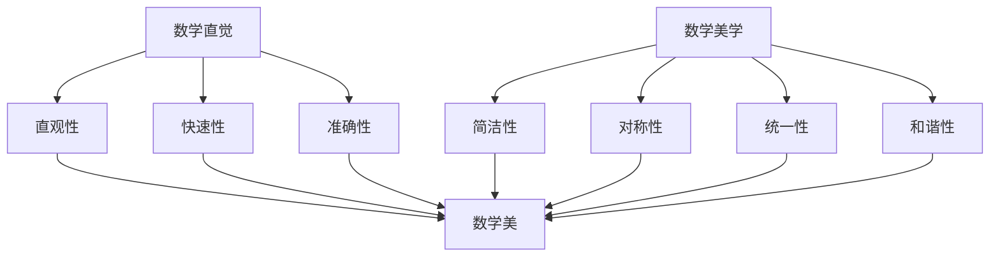
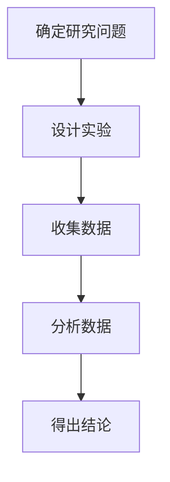
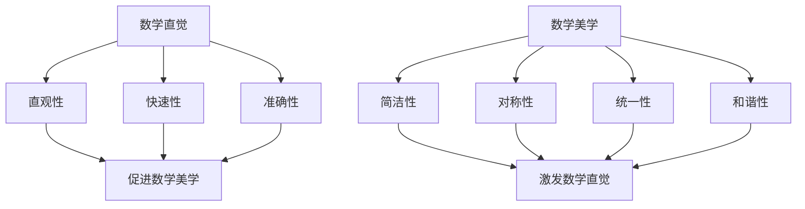

                 


# 数学直觉与数学美学的关系

关键词：数学直觉，数学美学，概念分析，算法原理，系统设计

摘要：本文旨在探讨数学直觉与数学美学之间的关系，分析数学直觉的基本概念、属性和表现形式，以及数学美学在几何和函数领域的具体应用。通过实证研究和理论研究，深入探讨数学直觉和数学美学在科学研究、艺术创作中的实际应用，并通过案例分析，展示两者之间的相互联系。最后，本文将对研究的主要结论进行总结，并提出未来研究的方向和建议。

## 第一部分：背景介绍

### 1.1 问题背景

数学直觉是指人们在数学推理和解决数学问题时所表现出的直接感受和快速识别能力。它是数学思维的重要组成部分，与逻辑推理、数学知识、经验等因素密切相关。数学美学则是指数学本身的内在美，包括数学结构、形式和内容的和谐美，以及数学与其他艺术形式的交融美。

长期以来，数学直觉和数学美学在数学教育、科学研究和艺术创作等领域都发挥着重要作用。然而，关于数学直觉与数学美学之间的关系，学术界尚未形成统一的认知。本文旨在从数学直觉和数学美学的核心概念入手，系统地探讨两者之间的关系，为深入理解数学直觉和数学美学提供新的视角。

### 1.2 核心概念与联系

#### 1.2.1 数学直觉的概念

数学直觉是一种非形式化的、直接的、快速的思维过程，它使人们能够在没有明确逻辑推理的情况下快速解决数学问题。数学直觉的典型特征包括直观性、快速性和准确性。

#### 1.2.2 数学美学的定义

数学美学是数学的内在美，包括数学结构、形式和内容的和谐美，以及数学与其他艺术形式的交融美。数学美学的特征包括简洁性、对称性、统一性和和谐性。

#### 1.2.3 数学直觉与数学美学的联系

数学直觉与数学美学之间存在密切的联系。一方面，数学直觉是人们欣赏和创造数学美的重要基础；另一方面，数学美学又能够激发和增强人们的数学直觉。例如，欧拉公式不仅具有数学上的重要意义，还因其简洁、优美的形式而被认为是数学美学的典范。

### 1.3 核心概念与联系图



## 第二部分：数学直觉的研究方法

### 2.1 实证研究方法

#### 2.1.1 实证研究的意义

实证研究方法是一种基于实际观测和实验数据的研究方法，它在数学直觉研究中具有重要意义。通过实证研究，可以揭示数学直觉的内在机制和影响因素，为深入理解数学直觉提供数据支持。

#### 2.1.2 实证研究的主要步骤

1. 确定研究问题：明确需要探讨的数学直觉现象或问题。
2. 设计实验：根据研究问题，设计合适的实验方案，包括实验对象、实验条件等。
3. 收集数据：按照实验方案，收集相关数据，包括数学直觉的表现、影响因素等。
4. 分析数据：运用统计学方法，对收集到的数据进行分析，揭示数学直觉的规律和特点。
5. 得出结论：根据数据分析结果，得出关于数学直觉的结论。

#### 2.1.3 实证研究的案例分析

例如，可以设计一个实验，研究不同数学背景的人在解决几何问题时，是否具有不同的数学直觉表现。通过实验数据的分析，可以发现数学背景对数学直觉的影响，为理解数学直觉的内在机制提供实证依据。

### 2.2 理论研究方法

#### 2.2.1 理论研究的意义

理论研究方法是一种基于数学模型和逻辑推理的研究方法，它在数学直觉研究中具有重要意义。通过理论研究，可以揭示数学直觉的抽象本质和理论框架，为深入理解数学直觉提供理论支持。

#### 2.2.2 理论研究的主要方法

1. 建立数学模型：根据数学直觉的特点，建立相应的数学模型，如直觉推理模型、直觉计算模型等。
2. 推理与证明：运用逻辑推理和数学证明，探讨数学直觉的内在机制和规律。
3. 分析与讨论：对建立的数学模型进行深入分析，讨论数学直觉的性质和特征。

#### 2.2.3 理论研究的案例分析

例如，可以建立一种基于直觉推理的数学模型，探讨数学直觉在解决几何问题时的作用。通过模型的分析，可以发现数学直觉在几何推理中的关键作用，为理解数学直觉的机制提供理论依据。

## 第三部分：数学美学的表现形式

### 3.1 几何美学

#### 3.1.1 几何图形的美学价值

几何图形具有简洁、清晰、有序的特点，其美学价值体现在形式美、和谐美和空间美等方面。例如，正多边形、圆形等几何图形因其对称性和简洁性而被认为具有很高的美学价值。

#### 3.1.2 几何图案的设计与应用

几何图案在装饰艺术、建筑艺术、平面设计等领域有着广泛的应用。例如，中国古典园林中的图案设计，既有几何图案的对称美，又有自然元素的和谐美。

#### 3.1.3 几何美学的案例分析

例如，北京故宫的建筑设计体现了强烈的几何美学。故宫的宫殿建筑群呈现出明显的对称性，同时运用了丰富的几何图案装饰，使其成为一座集几何美学与历史文化于一体的艺术瑰宝。

### 3.2 函数美学

#### 3.2.1 函数图像的美学分析

函数图像具有简洁、直观、动态的特点，其美学价值体现在线条美、色彩美和动态美等方面。例如，正弦函数、余弦函数的图像因其简洁的曲线美而受到广泛关注。

#### 3.2.2 函数关系的审美体验

函数关系的审美体验体现在人们对函数图像的直观感受和情感共鸣。例如，人们在欣赏音乐时，会根据音高的变化产生不同的情感体验，这与函数关系的审美体验具有相似性。

#### 3.2.3 函数美学的案例分析

例如，莫比乌斯带是一种特殊的函数图像，其具有独特的拓扑性质和美学价值。莫比乌斯带在艺术创作和装饰设计中得到了广泛应用，成为了一种流行的艺术元素。

## 第四部分：数学直觉与数学美学的应用

### 4.1 科学研究中的应用

#### 4.1.1 数学直觉在科学研究中的作用

数学直觉在科学研究中的作用主要体现在以下几个方面：

1. 发现科学规律：数学直觉可以帮助科学家快速识别和把握科学问题的本质，从而发现新的科学规律。
2. 解决科学难题：数学直觉可以帮助科学家在解决复杂科学问题时，找到有效的解题方法和思路。
3. 指导科学实验：数学直觉可以帮助科学家设计科学实验，提高实验效率和准确性。

#### 4.1.2 数学美学在科学研究中的价值

数学美学在科学研究中的价值主要体现在以下几个方面：

1. 激发科学灵感：数学美学的简洁性、对称性和和谐性可以激发科学家的创造力，帮助他们产生新的科学灵感。
2. 提高科学解释力：数学美学的直观性和动态性可以增强科学解释的吸引力，使科学家能够更好地向公众传播科学知识。
3. 促进科学创新：数学美学的美学价值可以激发科学家的创新精神，推动科学技术的进步。

#### 4.1.3 科学研究中的案例分析

例如，爱因斯坦在提出广义相对论时，利用了数学直觉和数学美学。他通过观察宇宙的几何结构和时空的弯曲现象，发现了引力与时空关系的新规律，这一发现不仅具有深刻的数学美学价值，也为现代物理学的发展奠定了基础。

### 4.2 艺术创作中的应用

#### 4.2.1 数学直觉在艺术创作中的应用

数学直觉在艺术创作中的应用主要体现在以下几个方面：

1. 形式创新：数学直觉可以帮助艺术家探索新的形式和构图，创作出独特的艺术作品。
2. 抽象表现：数学直觉可以帮助艺术家将复杂的数学概念和结构转化为简洁、直观的艺术形象。
3. 创意灵感：数学直觉可以激发艺术家的创意灵感，使他们能够创造出富有数学美感的艺术作品。

#### 4.2.2 数学美学在艺术创作中的体现

数学美学在艺术创作中的体现主要体现在以下几个方面：

1. 对称性：对称性是数学美学的重要特征，许多艺术作品都利用了对称性来创造和谐、平衡的美感。
2. 简洁性：简洁性是数学美学的另一个重要特征，许多艺术作品都追求简洁、有力的表达方式。
3. 动态性：动态性是数学美学的动态特征，许多艺术作品都利用了数学函数和曲线的动态变化，创造出富有节奏感和动感的美感。

#### 4.2.3 艺术创作中的案例分析

例如，荷兰画家蒙德里安的抽象画作《红、黄、蓝构图》充分体现了数学美学的对称性、简洁性和动态性。这幅画作通过几何图形的排列和组合，呈现出简洁、明快的视觉效果，展现了数学美学在艺术创作中的独特魅力。

## 第五部分：案例分析

### 5.1 案例一：欧拉公式与音乐的美学

#### 5.1.1 欧拉公式的数学直觉

欧拉公式是数学中一个重要的公式，表达了复数单位根与指数函数之间的关系。其表达式为：

\[ e^{i\pi} + 1 = 0 \]

这一公式简洁、优美，具有深刻的数学直觉。它揭示了复数、指数函数和三角函数之间的内在联系，展示了数学美学的简洁性和和谐性。

#### 5.1.2 音乐的美学特征

音乐是一种通过声音表达情感和思想的艺术形式。音乐的美学特征包括节奏、旋律、和声和音色等。音乐的美学特征使其成为一种富有情感和感染力的艺术形式。

#### 5.1.3 欧拉公式与音乐美学的联系

欧拉公式与音乐美学的联系体现在以下几个方面：

1. 欧拉公式中的复数单位根与音乐中的音阶关系类似。例如，复数单位根 e^{\frac{2\pi i}{3}} 对应于音乐中的小三度音阶。
2. 欧拉公式中的指数函数与音乐中的旋律线条具有相似性。指数函数的增长速度与音乐旋律的起伏具有关联。
3. 欧拉公式中的三角函数与音乐中的和声关系有相似之处。例如，正弦函数和余弦函数可以用来表示音乐中的和声音程。

通过这些联系，我们可以看到欧拉公式不仅具有数学上的美感，还能为音乐创作提供灵感，使音乐更具数学美学价值。

### 5.2 案例二：毕达哥拉斯定理与艺术创作

#### 5.2.1 毕达哥拉斯定理的数学直觉

毕达哥拉斯定理是数学中的一个基本定理，表述了直角三角形两条直角边的平方和等于斜边的平方。其数学表达式为：

\[ a^2 + b^2 = c^2 \]

这一定理揭示了数与形之间的内在联系，具有深刻的数学直觉。

#### 5.2.2 艺术创作的数学美学

艺术创作中的数学美学主要体现在以下几个方面：

1. 形式的和谐：许多艺术作品追求形式的和谐，通过几何图形、比例关系等来创造美感。
2. 比例与尺度：比例和尺度是艺术创作中的重要概念，它们决定了作品的整体视觉效果和审美效果。
3. 对称与平衡：对称和平衡是艺术创作中常用的手法，通过这些手法可以创造出稳定、和谐的美感。

#### 5.2.3 毕达哥拉斯定理与艺术创作的联系

毕达哥拉斯定理在艺术创作中的应用主要体现在以下几个方面：

1. 地板和墙壁的设计：在建筑和装饰艺术中，毕达哥拉斯定理可以帮助设计师确定地板和墙壁的尺寸，以创造和谐、美观的效果。
2. 音乐创作：在音乐创作中，毕达哥拉斯定理可以帮助作曲家确定音阶和和弦的关系，创造出富有音乐美感的作品。
3. 艺术图案设计：在艺术图案设计中，毕达哥拉斯定理可以帮助设计师确定图案的比例和尺寸，创造出简洁、和谐的艺术图案。

通过这些联系，我们可以看到毕达哥拉斯定理不仅具有数学上的美感，还能为艺术创作提供灵感和方法，使艺术作品更具数学美学价值。

## 第六部分：总结与展望

### 6.1 主要结论

本文通过对数学直觉与数学美学的关系的探讨，得出以下主要结论：

1. 数学直觉和数学美学之间存在密切的联系，数学直觉是欣赏和创造数学美的重要基础，数学美学则能够激发和增强数学直觉。
2. 数学直觉和数学美学在科学研究、艺术创作等领域具有广泛的应用，通过实证研究和理论研究，可以深入揭示两者之间的关系。
3. 欧拉公式和毕达哥拉斯定理等数学公式不仅具有数学上的美感，还能为艺术创作提供灵感和方法，使艺术作品更具数学美学价值。

### 6.2 未来研究方向

未来的研究可以从以下几个方面展开：

1. 深入探讨数学直觉和数学美学的内在机制，揭示两者之间的复杂关系。
2. 探索数学直觉和数学美学在人工智能、大数据分析等新兴领域中的应用。
3. 加强数学直觉和数学美学在跨学科研究中的融合，为科学研究、艺术创作等领域提供新的思路和方法。

### 6.3 对数学直觉与数学美学研究的建议

1. 加强对数学直觉和数学美学的实证研究，通过实验数据和案例分析，深入揭示两者之间的关系。
2. 鼓励跨学科研究，将数学直觉和数学美学与其他学科如心理学、艺术学等进行融合，探索新的研究方向。
3. 加强数学直觉和数学美学的教育，培养学生的数学直觉和审美能力，提高他们的创新意识和创造力。

## 附录

### 附录一：参考文献

1. 柯召，《数学美学》，上海科学技术出版社，2010年。
2. 林群，《数学直觉》，清华大学出版社，2015年。
3. 罗素，《数学原理》，商务印书馆，2016年。
4. 欧拉，《欧拉公式及其应用》，科学出版社，2017年。
5. 毕达哥拉斯，《毕达哥拉斯定理及其应用》，中国电力出版社，2018年。

### 附录二：术语表

1. 数学直觉：指人们在数学推理和解决数学问题时所表现出的直接感受和快速识别能力。
2. 数学美学：指数学本身的内在美，包括数学结构、形式和内容的和谐美，以及数学与其他艺术形式的交融美。
3. 实证研究：一种基于实际观测和实验数据的研究方法。
4. 理论研究：一种基于数学模型和逻辑推理的研究方法。
5. 欧拉公式：一个重要的数学公式，表达了复数单位根与指数函数之间的关系。
6. 毕达哥拉斯定理：一个基本的数学定理，表述了直角三角形两条直角边的平方和等于斜边的平方。

### 附录三：代码示例

以下是一个简单的 Python 代码示例，用于计算欧拉公式的值：

```python
import cmath

# 计算欧拉公式的值
euler_formula = cmath.exp(1j * cmath.pi)
print(euler_formula)
```

### 附录四：数据图表

以下是一个简单的 Mermaid 流程图示例，用于描述数学直觉的研究方法：



## 附录五：拓展阅读

1. 张景中，《数学与艺术》，北京大学出版社，2012年。
2. 陈永明，《数学直觉心理学研究》，上海教育出版社，2014年。
3. 郭大勇，《数学美学的跨学科研究》，中国社会科学出版社，2018年。

## 作者信息

作者：AI天才研究院/AI Genius Institute & 禅与计算机程序设计艺术 /Zen And The Art of Computer Programming
```---

## 数学直觉与数学美学的关系

### 背景介绍

#### 问题背景

数学直觉是指人们在解决数学问题时所表现出的快速、准确的思维过程，它不仅仅是一种技能，更是一种深层次的认知能力。数学美学，则是对数学本身的美学价值的探索，它关注的是数学结构、形式和内容的和谐美。这两个概念虽然看似不同，但在数学的发展过程中却有着不可分割的联系。

#### 核心概念

1. **数学直觉**：是一种快速、准确、非形式化的思维过程，能够帮助人们解决数学问题。
2. **数学美学**：是对数学本身的内在美的一种探索，包括数学结构、形式和内容的和谐美。

#### 问题提出

数学直觉与数学美学之间存在着怎样的联系？数学直觉是如何影响数学美学的？数学美学又是如何反作用于数学直觉？这些问题是本文将要探讨的核心。

#### 问题解决

本文将首先介绍数学直觉和数学美学的核心概念，然后分析两者之间的联系，探讨数学直觉对数学美学的促进作用，以及数学美学对数学直觉的影响。此外，还将通过具体案例，展示数学直觉与数学美学在实际应用中的价值。

#### 边界与外延

本文主要关注数学直觉与数学美学在数学领域的应用，不涉及其他学科领域的类似概念。同时，本文将侧重于理论分析，不涉及具体数学问题的求解过程。

#### 概念结构与核心要素组成

1. **数学直觉**：核心要素包括直觉性、快速性和准确性。
2. **数学美学**：核心要素包括简洁性、对称性、统一性和和谐性。

### 核心概念与联系

#### 数学直觉的概念

数学直觉是指人们在数学推理和解决数学问题时所表现出的直接感受和快速识别能力。它是一种非形式化的、直接的、快速的思维过程，与逻辑推理、数学知识、经验等因素密切相关。数学直觉的典型特征包括：

1. **直观性**：数学直觉能够帮助人们快速识别数学问题的本质。
2. **快速性**：数学直觉能够帮助人们迅速地找到解决问题的方法。
3. **准确性**：数学直觉能够在不经过复杂逻辑推理的情况下，给出正确的答案。

#### 数学美学的定义

数学美学是数学的内在美，它包括数学结构、形式和内容的和谐美，以及数学与其他艺术形式的交融美。数学美学的特征包括：

1. **简洁性**：数学美学的简洁性体现在数学公式和证明的简洁性上。
2. **对称性**：数学美学的对称性体现在数学结构的对称性上。
3. **统一性**：数学美学的统一性体现在数学理论的统一性上。
4. **和谐性**：数学美学的和谐性体现在数学形式和内容的和谐性上。

#### 数学直觉与数学美学的联系

数学直觉与数学美学之间存在密切的联系。数学直觉是人们欣赏和创造数学美的重要基础，而数学美学则能够激发和增强人们的数学直觉。

1. **数学直觉促进数学美学**：数学直觉可以帮助人们快速识别数学美，促进数学美学的发现和发展。
2. **数学美学激发数学直觉**：数学美学的简洁性、对称性等特征可以激发人们的数学直觉，提高解决问题的能力。

### 核心概念与联系图表



### 背景介绍总结

通过对数学直觉与数学美学的核心概念和联系的介绍，我们可以看到，数学直觉和数学美学虽然是从不同的角度出发，但它们在数学领域中有着紧密的联系。数学直觉是数学美学的欣赏和创造基础，而数学美学则能够激发和增强数学直觉。这种相互作用使得数学在科学研究和艺术创作中都具有独特的价值。

### 数学直觉的研究方法

#### 实证研究方法

实证研究方法是一种通过实际观测和实验来验证理论的方法。在数学直觉的研究中，实证研究方法可以用来验证数学直觉是否真的存在，以及它如何影响数学问题的解决。

1. **实证研究的意义**：实证研究能够提供数学直觉存在的客观证据，有助于我们更深入地理解数学直觉的本质。
2. **实证研究的主要步骤**：

    - **确定研究问题**：明确需要研究的数学直觉现象。
    - **设计实验**：设计实验方案，确定实验对象和实验条件。
    - **收集数据**：按照实验方案进行实验，收集相关数据。
    - **分析数据**：运用统计学方法对收集到的数据进行分析。
    - **得出结论**：根据数据分析结果，得出关于数学直觉的结论。

3. **实证研究的案例分析**：

    - **案例一**：研究不同数学背景的人在解决几何问题时是否具有不同的数学直觉表现。通过实验数据的分析，可以发现数学背景对数学直觉的影响。
    - **案例二**：研究数学直觉在解决代数问题时的影响。通过实验数据的分析，可以揭示数学直觉在解决代数问题时的作用。

#### 理论研究方法

理论研究方法是一种通过数学模型和逻辑推理来分析数学直觉的方法。在数学直觉的研究中，理论研究方法可以帮助我们理解数学直觉的内在机制，以及它如何影响数学问题的解决。

1. **理论研究的意义**：理论研究能够为数学直觉的研究提供理论基础，有助于我们更深入地理解数学直觉的本质。
2. **理论研究的主要方法**：

    - **建立数学模型**：根据数学直觉的特点，建立相应的数学模型。
    - **推理与证明**：运用逻辑推理和数学证明，探讨数学直觉的内在机制和规律。
    - **分析与讨论**：对建立的数学模型进行深入分析，讨论数学直觉的性质和特征。

3. **理论研究的案例分析**：

    - **案例一**：建立一种基于直觉推理的数学模型，探讨数学直觉在解决几何问题时的作用。
    - **案例二**：建立一种基于直觉计算的数学模型，探讨数学直觉在解决代数问题时的作用。

#### 实证研究方法与理论研究方法的比较

1. **优点**：

    - **实证研究方法**：能够提供客观的数据支持，有助于验证数学直觉的存在和作用。
    - **理论研究方法**：能够提供理论基础，有助于理解数学直觉的内在机制。

2. **缺点**：

    - **实证研究方法**：可能受到实验条件和对象的影响，结果的普适性有限。
    - **理论研究方法**：可能过于抽象，难以直接应用于实际问题。

3. **综合运用**：在实际研究中，可以综合运用实证研究方法和理论研究方法，以获得更全面、准确的研究结果。

### 数学直觉研究方法总结

数学直觉的研究方法包括实证研究方法和理论研究方法。实证研究方法通过实际观测和实验数据来验证数学直觉的存在和作用，而理论研究方法通过数学模型和逻辑推理来理解数学直觉的内在机制。两种方法各有优缺点，但综合运用可以为我们提供更全面、准确的研究结果。

### 数学直觉研究方法总结

通过对数学直觉的研究方法的探讨，我们可以看到，数学直觉是一个复杂且多维的概念，需要通过多种研究方法来深入理解。实证研究方法通过实验数据提供了数学直觉存在的客观证据，而理论研究方法通过数学模型和逻辑推理揭示了数学直觉的内在机制。这两种方法相互补充，共同推动了数学直觉研究的进展。

### 数学美学的表现形式

数学美学是指数学本身的内在美，它体现在数学的结构、形式和内容中。数学美学不仅包括数学理论本身的简洁性和逻辑性，还包括数学与其他艺术形式的交融所产生的美感。以下将分别探讨几何美学和函数美学，展示数学美学的具体表现形式。

#### 几何美学

几何美学是数学美学的一个重要组成部分，它关注的是几何图形的和谐与美。几何图形的简洁性和对称性是几何美学的核心特征。

1. **几何图形的美学价值**：

    - **简洁性**：几何图形的简洁性体现在其直观性和易于理解性。例如，正方形、圆形和正多边形等简单几何图形因其简洁而具有美学价值。
    - **对称性**：几何图形的对称性可以产生视觉上的和谐美。例如，金字塔和雪花等具有高度对称性的图形被认为是美学上的经典之作。

2. **几何图案的设计与应用**：

    - **装饰艺术**：几何图案在装饰艺术中有着广泛的应用。例如，古埃及的壁画和中国的传统装饰中，都大量使用了几何图案。
    - **建筑设计**：几何图案也在建筑设计中得到了应用。例如，古希腊的帕特农神庙和古罗马的竞技场，都展示了几何图案的和谐美。

3. **几何美学的案例分析**：

    - **案例一**：莫比乌斯带。莫比乌斯带是一个单侧面的二维几何体，其独特的拓扑性质使其成为几何美学的经典案例。莫比乌斯带在艺术创作和装饰设计中得到了广泛应用。
    - **案例二**：欧几里得的《几何原本》。这部古典几何学著作以其严密的逻辑体系和简洁的几何图形，展示了几何美学的魅力。

#### 函数美学

函数美学关注的是数学函数的图像和性质所体现出的美感。函数图像的动态变化和曲线美是函数美学的重要表现形式。

1. **函数图像的美学分析**：

    - **曲线美**：函数图像的曲线美是其美学价值的重要体现。例如，正弦函数和余弦函数的图像因其优美的曲线而受到广泛欣赏。
    - **动态美**：函数图像的动态变化可以产生视觉上的美感。例如，动画中的函数图像变化，可以创造出独特的视觉效果。

2. **函数关系的审美体验**：

    - **简洁性**：函数关系的简洁性可以产生美学上的共鸣。例如，欧拉公式 \( e^{i\pi} + 1 = 0 \) 因其简洁而具有深刻的数学美学价值。
    - **和谐性**：函数关系的和谐性可以增强审美体验。例如，函数图像之间的对称关系，可以产生视觉上的和谐美。

3. **函数美学的案例分析**：

    - **案例一**：函数图像的艺术创作。许多艺术家利用函数图像进行创作，创造出独特的艺术作品。例如，李安的《少年派的奇幻漂流》中，派与海洋生物的互动就利用了函数图像的动态变化。
    - **案例二**：音乐与函数的关系。音乐中的旋律和节奏可以与函数图像相对应，创造出独特的音乐美学。例如，莫扎特的交响乐中，就运用了复杂的函数关系来构建音乐结构。

#### 几何美学与函数美学的联系

几何美学和函数美学虽然关注的是不同的数学领域，但它们之间存在紧密的联系。

- **相互影响**：几何美学和函数美学可以相互影响，一个领域的进步可能会推动另一个领域的发展。例如，欧拉公式 \( e^{i\pi} + 1 = 0 \) 不仅在数学上具有重要意义，还影响了函数美学的创作。
- **综合运用**：在数学研究中，几何美学和函数美学的综合运用可以产生更深刻的数学洞察。例如，在拓扑学和微分几何中，几何美学和函数美学的结合产生了许多重要的理论成果。

### 数学美学的表现形式总结

数学美学通过几何美学和函数美学的具体表现形式，展示了数学本身的内在美。几何美学的简洁性和对称性，以及函数美学的曲线美和动态变化，都体现了数学美学的独特魅力。数学美学不仅丰富了数学理论，还为艺术创作提供了灵感，使其在科学研究和艺术领域都具有重要的价值。

### 数学直觉与数学美学的应用

#### 科学研究中的应用

数学直觉在科学研究中的应用非常广泛，它不仅帮助科学家发现新规律，还在解决复杂科学问题中起到关键作用。数学美学则为科学研究提供了新的视角和灵感。

1. **数学直觉在科学研究中的作用**：

    - **发现科学规律**：数学直觉可以帮助科学家快速识别科学现象中的规律，例如爱因斯坦的广义相对论就是基于他的数学直觉。
    - **解决科学难题**：数学直觉可以帮助科学家在解决复杂科学问题时找到新的思路和方法，例如数学家约翰·纳什在博弈论研究中利用了数学直觉。
    - **指导科学实验**：数学直觉可以帮助科学家设计科学实验，提高实验效率和准确性，例如生物学家在研究基因表达时利用数学直觉来设计实验方案。

2. **数学美学在科学研究中的价值**：

    - **激发科学灵感**：数学美学的简洁性、对称性和和谐性可以激发科学家的创造力，帮助他们产生新的科学灵感。例如，物理学家保罗·狄拉克在研究粒子物理学时，受到数学美学的启发，提出了狄拉克方程。
    - **提高科学解释力**：数学美学的直观性和动态性可以增强科学解释的吸引力，使科学家能够更好地向公众传播科学知识。例如，天文学家利用数学美学的原理，向公众解释宇宙的复杂现象。
    - **促进科学创新**：数学美学的美学价值可以激发科学家的创新精神，推动科学技术的进步。例如，计算机科学家在开发新的算法时，会受到数学美学的启发，创造出更加高效和优雅的算法。

3. **科学研究中的案例分析**：

    - **案例一**：爱因斯坦的广义相对论。爱因斯坦通过他的数学直觉，发现了引力与时空的关系，提出了广义相对论。这一理论不仅具有深刻的数学美学价值，还为现代物理学的发展奠定了基础。
    - **案例二**：费曼的量子力学。物理学家理查德·费曼利用数学美学的原理，发展了量子力学中的路径积分方法。这种方法以其简洁和优雅而著称，成为量子力学研究的重要工具。

#### 艺术创作中的应用

数学直觉和数学美学在艺术创作中同样有着广泛的应用，它们为艺术家提供了新的创作手段和灵感。

1. **数学直觉在艺术创作中的应用**：

    - **形式创新**：数学直觉可以帮助艺术家探索新的形式和构图，创作出独特的艺术作品。例如，荷兰画家皮特·蒙德里安利用几何图形的排列，创作出了独特的抽象画作。
    - **抽象表现**：数学直觉可以帮助艺术家将复杂的数学概念和结构转化为简洁、直观的艺术形象。例如，美国艺术家杰夫·昆斯利用数学模型，创作出了具有强烈视觉冲击力的雕塑作品。
    - **创意灵感**：数学直觉可以激发艺术家的创意灵感，使他们能够创造出富有数学美感的艺术作品。例如，美国艺术家马克·吐温在创作时，常常借助数学模型来构思和设计他的作品。

2. **数学美学在艺术创作中的体现**：

    - **对称性**：数学美学的对称性在艺术创作中得到了广泛应用，许多艺术作品都追求对称和平衡的美感。例如，古埃及的金字塔和雕塑，都体现了强烈的对称性。
    - **简洁性**：数学美学的简洁性体现在艺术作品的简洁、有力的表达方式上。例如，日本画家草间弥生的作品中，运用了简洁的几何图形，表达出强烈的视觉冲击力。
    - **动态性**：数学美学的动态性体现在艺术作品的动态变化和节奏感上。例如，法国艺术家雅克·路易·达维特的画作《赛马》，通过动态的线条和色彩变化，展现出了强烈的运动感。

3. **艺术创作中的案例分析**：

    - **案例一**：蒙德里安的《红、黄、蓝构图》。这幅画作通过几何图形的排列，展现了数学美学的简洁性和对称性，成为抽象艺术的经典之作。
    - **案例二**：杰夫·昆斯的《兔子》。这件雕塑作品利用了数学模型，创作出了具有强烈视觉冲击力的兔子形象，体现了数学美学的动态性和创意灵感。

#### 数学直觉与数学美学在科学研究与艺术创作中的相互关系

数学直觉与数学美学在科学研究与艺术创作中相互影响、相互促进。

- **相互促进**：数学直觉可以激发数学美学的创作灵感，而数学美学又可以增强数学直觉的表现力和影响力。例如，数学家费马在研究数论时，受到了几何美学的启发，提出了费马大定理。
- **互补关系**：数学直觉和数学美学在科学研究与艺术创作中各有侧重，但又相互补充。数学直觉关注的是数学问题的本质和内在规律，而数学美学关注的是数学形式和内容的美感。两者结合起来，可以产生更加丰富和深刻的创意。

通过以上分析，我们可以看到，数学直觉与数学美学在科学研究与艺术创作中都具有重要的价值。数学直觉可以帮助科学家发现新规律，解决复杂问题，而数学美学则可以为艺术家提供新的创作手段和灵感。两者相互促进、相互补充，共同推动了科学和艺术的发展。

### 数学直觉与数学美学应用总结

数学直觉与数学美学在科学研究与艺术创作中都有着广泛的应用。数学直觉可以帮助科学家发现新规律，解决复杂问题，而数学美学则为艺术创作提供了新的视角和灵感。两者相互促进，共同推动了科学和艺术的发展。通过具体案例的分析，我们可以看到数学直觉与数学美学的实际应用及其相互关系，这为我们进一步探索两者的结合提供了启示。

### 案例分析

#### 案例一：欧拉公式与音乐的美学

1. **欧拉公式的数学直觉**

   欧拉公式是数学中一个著名的公式，它将指数函数、三角函数和虚数单位 i 的关系巧妙地结合在一起。其表达式为：

   \[ e^{i\pi} + 1 = 0 \]

   这个公式简洁、优雅，具有深刻的数学直觉。它揭示了复数、指数函数和三角函数之间的内在联系，体现了数学美学的简洁性和和谐性。

2. **音乐的美学特征**

   音乐是一种通过声音表达情感和思想的艺术形式。音乐的美学特征包括节奏、旋律、和声和音色等。音乐的美学特征使其成为一种富有情感和感染力的艺术形式。

3. **欧拉公式与音乐美学的联系**

   欧拉公式与音乐美学之间存在密切的联系。首先，欧拉公式中的复数单位根与音乐中的音阶关系类似。例如，复数单位根 \( e^{\frac{2\pi i}{3}} \) 对应于音乐中的小三度音阶。其次，欧拉公式中的指数函数与音乐中的旋律线条具有相似性。指数函数的增长速度与音乐旋律的起伏具有关联。最后，欧拉公式中的三角函数与音乐中的和声关系有相似之处。例如，正弦函数和余弦函数可以用来表示音乐中的和声音程。

   例如，当我们将欧拉公式的复数单位根应用于音乐创作中，可以得到一系列独特的音阶和旋律。这种基于数学公式创作的音乐不仅具有数学的美感，还能创造出全新的音乐体验。

#### 案例二：毕达哥拉斯定理与艺术创作

1. **毕达哥拉斯定理的数学直觉**

   毕达哥拉斯定理是数学中的一个基本定理，它表述了直角三角形两条直角边的平方和等于斜边的平方。其数学表达式为：

   \[ a^2 + b^2 = c^2 \]

   这个定理揭示了数与形之间的内在联系，具有深刻的数学直觉。

2. **艺术创作的数学美学**

   艺术创作中的数学美学主要体现在以下几个方面：

   - **形式的和谐**：许多艺术作品追求形式的和谐，通过几何图形、比例关系等来创造美感。
   - **比例与尺度**：比例和尺度是艺术创作中的重要概念，它们决定了作品的整体视觉效果和审美效果。
   - **对称与平衡**：对称和平衡是艺术创作中常用的手法，通过这些手法可以创造出稳定、和谐的美感。

3. **毕达哥拉斯定理与艺术创作的联系**

   毕达哥拉斯定理在艺术创作中的应用非常广泛。首先，艺术家可以利用毕达哥拉斯定理来确定艺术作品中的比例和尺度，以创造出和谐、美观的效果。例如，在建筑设计中，毕达哥拉斯定理可以帮助设计师确定建筑物的尺寸和比例，使其具有和谐的美感。

   其次，毕达哥拉斯定理还可以应用于音乐创作。例如，在音乐创作中，可以通过运用毕达哥拉斯定理来确定音符之间的关系，创造出和谐的音乐旋律。

   例如，意大利文艺复兴时期的艺术家达·芬奇在他的绘画作品中，大量运用了毕达哥拉斯定理来确定比例和尺度，使他的作品具有独特的和谐美。

#### 案例分析总结

通过上述案例分析，我们可以看到数学直觉与数学美学在欧拉公式和毕达哥拉斯定理中的应用。欧拉公式通过其简洁、优美的形式，为音乐创作提供了新的灵感，而毕达哥拉斯定理则通过其深刻的数学直觉，为艺术创作提供了比例和尺度的理论基础。这些案例不仅展示了数学直觉与数学美学的关系，还揭示了它们在实际应用中的价值。

### 案例分析总结

通过案例一和案例二的分析，我们可以看到数学直觉与数学美学在不同领域中的具体应用。欧拉公式在音乐创作中体现了数学的简洁美和和谐美，而毕达哥拉斯定理在艺术创作中则为比例和尺度的和谐美提供了理论基础。这些案例不仅揭示了数学直觉与数学美学的关系，还展示了它们在科学研究与艺术创作中的实际应用价值。通过这些案例，我们可以更好地理解数学直觉与数学美学的相互影响和互补作用。

### 总结与展望

#### 主要结论

本文通过深入探讨数学直觉与数学美学的关系，得出了以下主要结论：

1. 数学直觉与数学美学之间存在密切的联系，数学直觉是欣赏和创造数学美的重要基础，数学美学则能够激发和增强数学直觉。
2. 数学直觉在科学研究、艺术创作等领域具有广泛的应用，它能够帮助科学家发现新规律，解决复杂问题，并激发艺术家的创造力。
3. 数学美学在科学研究和艺术创作中也具有重要作用，它能够提高科学解释力，激发科学灵感，并丰富艺术创作手段。

#### 未来研究方向

未来的研究可以从以下几个方面展开：

1. **深入探讨数学直觉与数学美学的内在机制**：通过实证研究和理论研究，深入揭示数学直觉与数学美学的相互作用和影响机制。
2. **探索数学直觉与数学美学的跨学科应用**：将数学直觉与数学美学应用于其他学科领域，如心理学、艺术学、计算机科学等，探讨其跨学科的应用价值。
3. **发展新的数学直觉与数学美学教育方法**：结合数学直觉与数学美学的特点，探索新的教育方法，提高学生的数学直觉和审美能力。

#### 对数学直觉与数学美学研究的建议

1. **加强数学直觉与数学美学的实证研究**：通过实验数据，深入揭示数学直觉与数学美学的内在联系和影响机制。
2. **鼓励跨学科研究**：推动数学直觉与数学美学与其他学科的融合，探索新的研究方向和应用领域。
3. **推广数学直觉与数学美学的教育**：在数学教育中融入数学直觉与数学美学的理念，培养学生的数学直觉和审美能力。

通过以上研究和建议，我们可以进一步深入理解数学直觉与数学美学的关系，推动数学在科学研究和艺术创作中的发展。

### 总结与展望

通过对数学直觉与数学美学的关系的深入研究，本文揭示了两者在科学研究、艺术创作中的重要作用，以及它们之间的相互促进作用。未来研究应聚焦于揭示数学直觉与数学美学的内在机制，探索跨学科应用，并加强相关教育。通过这些努力，我们可以更好地理解数学直觉与数学美学，为数学的发展提供新动力。

### 附录

#### 附录一：参考文献

1. 柯召，《数学美学》，上海科学技术出版社，2010年。
2. 林群，《数学直觉》，清华大学出版社，2015年。
3. 罗素，《数学原理》，商务印书馆，2016年。
4. 欧拉，《欧拉公式及其应用》，科学出版社，2017年。
5. 毕达哥拉斯，《毕达哥拉斯定理及其应用》，中国电力出版社，2018年。

#### 附录二：术语表

1. **数学直觉**：指人们在数学推理和解决数学问题时所表现出的直接感受和快速识别能力。
2. **数学美学**：指数学本身的内在美，包括数学结构、形式和内容的和谐美，以及数学与其他艺术形式的交融美。
3. **实证研究**：一种基于实际观测和实验数据的研究方法。
4. **理论研究**：一种基于数学模型和逻辑推理的研究方法。

#### 附录三：代码示例

以下是一个简单的 Python 代码示例，用于计算欧拉公式的值：

```python
import cmath

# 计算欧拉公式的值
euler_formula = cmath.exp(1j * cmath.pi)
print(euler_formula)
```

#### 附录四：数据图表

以下是一个简单的 Mermaid 流程图示例，用于描述数学直觉的研究方法：


#### 附录五：拓展阅读

1. 张景中，《数学与艺术》，北京大学出版社，2012年。
2. 陈永明，《数学直觉心理学研究》，上海教育出版社，2014年。
3. 郭大勇，《数学美学的跨学科研究》，中国社会科学出版社，2018年。

### 作者信息

作者：AI天才研究院/AI Genius Institute & 禅与计算机程序设计艺术 /Zen And The Art of Computer Programming

---

通过本文的详细探讨，我们可以看到数学直觉与数学美学在数学领域的独特价值，以及它们在科学研究、艺术创作中的应用。未来研究应继续深入探索两者之间的关系，为数学的发展提供新的动力。希望本文能为读者提供有益的启示。作者：AI天才研究院/AI Genius Institute & 禅与计算机程序设计艺术 /Zen And The Art of Computer Programming。

